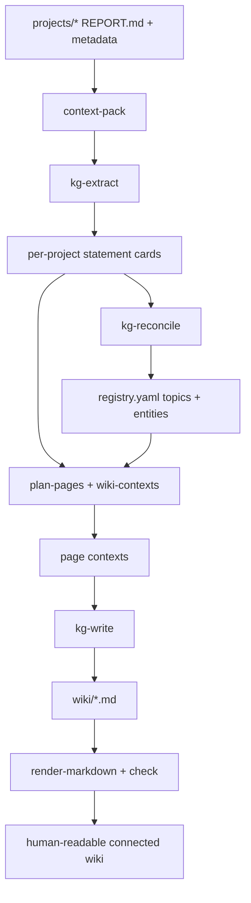

# KG + Wiki: Ideology and Methodology

The reference for *how and why* the BERIL synthesis wiki works. It explains the ideas behind the
`compendium/` system — the operational "how to run it" lives in `compendium/README.md`, and the
decision history lives in `2026-06-15-kg-wiki-redesign.md`. This document is meant to stay true to the
system as it is; update it when the ideology or methodology changes, not on every build step.

## Short overview

The compendium is a human-readable synthesis wiki backed by a small context graph. The wiki is the
product: it should read like connected prose, with introductions, sections, cross-links, caveats, and
sources. The graph is infrastructure: it gives the writer enough structured context to know which
projects, statements, entities, topics, authors, data collections, and citations belong on each page.

The ideology is deliberately simple:

- use statement cards for auditable evidence;
- use a registry to merge raw project terms into a small set of canonical topics and entities;
- use deterministic Python for repeatable joins, page membership, links, and citation checks;
- use the LLM only where prose judgment is needed: extraction, reconciliation, and page writing;
- keep formal ontology machinery out of v1 unless it directly improves the reader-facing wiki.

In practice, the graph answers "what context belongs on this page?" The wiki answers "what should a
reader understand after reading it?"

## Simple workflow

1. Build a context pack for each project from its `REPORT.md`, metadata, authors, source anchors, and
   candidate terms.
2. Extract sourced statement cards from each context pack.
3. Reconcile all raw topic/entity slugs into the shared `registry.yaml`.
4. Plan wiki pages from cards + registry + author/data indexes.
5. Generate a bounded page context for each page.
6. Write synthesized Markdown pages from those contexts.
7. Render and check the wiki so every local link and citation resolves.



Read the diagram as two layers. The bottom layer is deterministic assembly and validation; it makes page
membership, links, and citations repeatable. The LLM layer turns bounded context into evidence-backed
statements and then into readable wiki prose.

## 1. The problem and the stance

The observatory accumulates ~70 research **projects**, each with a `REPORT.md`, notebooks, figures, and
data. Individual reports already surface in the UI. What was missing is *synthesis*: a human-readable
layer that shows how projects connect, what they collectively know, and where to go next.

The first instinct was a formal knowledge graph (typed entities, predicates, ontology grounding). We
deliberately rejected that. The rendered wiki never shows typed predicates or CURIEs, the heavy graph is
expensive to populate and maintain, and the experiment has already failed elsewhere (typed
"discourse-graph" wikis die from maintenance burden). The synthesis benefit people attribute to a KG is
really just *grouping related work by topic and handing an LLM that cluster* — a topic graph, not an
ontology.

So the stance is: **a lightweight topic-and-link index — Maps of Content (MOC), Obsidian-style — with
topics as the navigation backbone.** A thin evidence layer sits underneath for provenance; it is never the
navigation surface.

### Principles

- **Synthesize, don't duplicate.** Projects are shown by their own reports. The wiki only adds what a
  reader can't get from one report: cross-project topics, shared data, shared authorship, open directions.
- **Topics are the backbone.** Navigation is by cross-cutting theme, not by narrow per-claim or
  per-statement units (too fine to navigate) and not by a rigid up-front ontology (too brittle).
- **Deterministic skeleton, LLM flesh.** Everything reproducible — graph assembly, page membership,
  link resolution, integrity — is plain Python that never calls a model. The LLM only does what it is good
  at: reading sources to extract claims, and writing prose. Those steps are skills.
- **Autonomous, but guarded.** The LLM owns judgment calls (which topics exist, what a page says) with no
  human approval gate; correctness is enforced *deterministically* afterward (every slug must resolve,
  every link and citation must check out), not by a reviewer.
- **Provenance always.** Every synthesized claim traces to an exact source span. Pages cite only what they
  are allowed to; the build fails if they don't.
- **Simplicity is the feature.** One person should be able to hold the whole pipeline in their head. When
  a piece of machinery isn't visible in the output and isn't load-bearing, it gets cut.
- **The wiki is the product.** The graph is a context graph for page writing, not a public ontology. Page
  contexts must help the writer produce introductions, synthesized sections, useful cross-links, caveats,
  open directions, and auditable sources.

## 2. The conceptual model

Three artifacts carry everything:

### Statement cards — the evidence layer

One YAML file per project (`compendium/kg/<project>.kg.yaml`) holds **statement cards**: small, sourced
assertions extracted from the project's report. A card carries:

- `text` — one scientific sentence;
- `kind` (e.g. `finding`, `claim`, `opportunity`) and `confidence`;
- `entities` / `topics` — **raw, per-project** slugs the extractor chose (e.g.
  `topic:adp1-carbon-fitness`, `entity:adp1`);
- `links` — typed cross-statement edges (`supports`, `contradicts`, `refines`) that let conflicts and
  support chains surface automatically;
- `evidence` — an anchor (source document, section, and the exact quoted span) so the claim is verifiable;

Cards are the unit of extraction and provenance. They are **immutable once written** — the global layer
never rewrites them.

### The registry — the global canonical vocabulary

`compendium/registry.yaml` is the one global artifact. It maps the many raw per-project slugs onto a small
set of **canonical topics and entities**, each with an `aliases` list:

```yaml
topics:
  metal-resistance:
    label: Metal Resistance & Critical Minerals
    definition: <one line>
    aliases: [metal_fitness, topic:metal-resistance, critical-minerals, ...]
entities:
  adp1:
    label: Acinetobacter baylyi ADP1
    kind: organism
    definition: A naturally competent soil bacterium used as a model system for metabolism and genetics.
    aliases: [entity:adp1, a_baylyi_adp1, acinetobacter_baylyi]
    url: https://www.ncbi.nlm.nih.gov/Taxonomy/Browser/wwwtax.cgi?id=62977
```

Resolution is **additive and case-insensitive**: `Registry.topic_key` / `entity_key` map any alias to its
canonical key, and pass any unknown slug through unchanged (never destructive). The aliases are exactly
how two projects that named the same theme differently get merged into one topic — **this is the
cross-project connection mechanism.**

### Deterministic connectors — authors and shared data, for free

Two of the most useful connections need no LLM at all:

- **Authors** — every project's `README.md` has a `## Authors` block (name + ORCID). `people.py` parses
  these and joins on ORCID, so a person who appears in many projects (even when some omit their ORCID) is
  one author record. This drives author pages.
- **Shared data** — projects cite BERDL collections by their canonical id (`ui/config/collections.yaml`).
  `data_index.py` scans reports for those ids and inverts the relation to "which projects share this
  collection." This drives data pages.

Both are deterministic, high-recall edges: "these projects share the Fitness Browser," "these projects
were authored by the same person." No inference, no model.

## 3. The methodology — the pipeline

Six conceptual steps. Deterministic steps are CLI commands; the three LLM steps are skills that shell out
to those commands.

```
projects/* ─[D] pack ─────▶ context pack          (audit + source excerpts + authors + candidate terms)
                              │
            ─[LLM] extract ──▶ kg/<project>.kg.yaml (statement cards; raw per-project slugs)   skill: kg-extract
                              │
   ALL cards ─[LLM] reconcile ▶ registry.yaml       (canonical topics/entities + aliases)       skill: kg-reconcile
                              │
   cards + registry ─[D] plan ▶ page contexts        (home / topic / data / author)
                              │
            ─[LLM] write ────▶ wiki/*.md             (cited prose)                              skill: kg-write
                              │
            ─[D] check ──────▶ pass / fail           (link + citation integrity gate)
```

The `kg-wiki` skill is the orchestrator that chains the whole thing; it is the only skill a user normally
invokes. Each step:

1. **pack** (deterministic). For one project, build a bounded *context pack*: the project's source
   sections, evidence anchors (datasets, PMIDs/DOIs, collections with offsets), candidate terms, authors,
   and the allowed vocabularies. This is the "good context" the extractor reads — and the reason
   extraction stays grounded.
2. **extract** (LLM — `kg-extract`). Using only the context pack, emit statement cards with exact evidence
   anchors. One project at a time; raw slugs (canonicalization is a later, global concern).
3. **reconcile** (LLM — `kg-reconcile`). Run **once, globally**, after the per-project cards exist. Read
   the deduplicated list of every raw entity/topic slug across all cards (a few hundred short strings that
   fit in one context — this is the "assemble all context at once" that per-project extraction can't do)
   and **autonomously** emit/extend `registry.yaml`: cluster raw topic slugs into ~12 canonical themes
   (each with a definition and the raw slugs as aliases), and group entity synonyms. There is **no human
   approval gate**. The pass is append-only — existing canonical keys are never renamed or removed, so
   keys stay stable across re-runs.
4. **plan** (deterministic). Join cards + registry + the author/data indexes into page plans and page
   contexts. Topic slugs are canonicalized *before* grouping, so cards from different projects land on one
   topic page. Same inputs always produce identical plans.
5. **write** (LLM — `kg-write`). Author one wiki page from its deterministic context. Clean,
   human-readable prose (like a good Atlas page), not templates, graph dumps, or statement lists. The
   context includes a small narrative scaffold (`lead`, `section_plan`, adjacent pages, and allowed
   citations) so the writer can synthesize a page with an introduction, reasoned sections, connections,
   caveats, open directions, and auditable sources. Provenance goes in one trailing `Sources` section as
   `[stmt:id; project]` footnote refs — not inline in the prose.
6. **check** (deterministic). The final gate: every relative wiki link must resolve, and every citation
   must reference a statement the page is allowed to cite. Non-zero exit on any problem.

### Why "two passes, additive"

Per-project extraction can't see the whole corpus, so it can't pick a shared vocabulary — that's the
"each project evaluated independently" gap. The reconcile pass is the second, global pass that fixes it.
Crucially it does **not** rewrite the per-project cards (a tempting third pass). Rewriting would break
idempotency and clobber on re-extraction. Instead the registry is a thin alias layer the deterministic
`plan` step consults. Cards stay raw and immutable; the registry is the only thing that changes when the
vocabulary evolves, and it is a single human-readable, git-tracked diff.

## 4. What a "topic" is

The vaguest word in the system, pinned down operationally:

> **A topic is a cross-cutting research theme shared by ≥2 (ideally ≥3) projects.**

Defining a topic *by connection* is both more useful than per-project sub-themes and something an LLM can
apply reliably — it is a grouping/dedup judgment, not open-ended ontology. The granularity rule is **~12
topics for ~70 projects**; a project belongs to 1–3 topics, and that deliberate overlap *is* the
connection structure (a project bridging two topics is what links them).

Topics are created **autonomously by the reconcile LLM**, seeded by an optional prior list of ~12 themes
(documented in the `kg-reconcile` skill) that the LLM may revise, merge, split, or rename. A human can
edit `registry.yaml` afterward, but no edit is required to ship.

## 5. The page taxonomy

Four reader-facing page types. Claims, conflicts, and opportunities are **sections inside topic pages**,
not standalone pages — they were too fine-grained to navigate as pages.

- **Home** (`wiki/index.md`) — the index: a topic map, an author map, and a data map.
- **Topic** (`wiki/topics/*`) — the backbone, one per canonical theme. A Map of Content:
  *Overview → Projects in this topic → Adjacent topics → Shared data → Open directions*, with claims and
  conflicts woven into the synthesis. Cross-links to adjacent topics (shared projects), the data pages for
  collections those projects cite, and the author pages for their authors.
- **Data** (`wiki/data/*`) — one per BERDL collection: which projects share it, and how.
- **Author** (`wiki/authors/*`) — one per ORCID: the projects and topics that person worked on.

Per-project pages are intentionally absent: the UI already shows each project's report, so the wiki links
out rather than re-summarizing.

## 6. Provenance, trust, and reproducibility

- **Grounding.** Every statement card carries an exact source span; extraction is bounded to the context
  pack, so claims can't drift from the sources.
- **Citation discipline.** A page may cite only the statements in its membership; the publisher rejects a
  page that cites outside it or (when it has members) cites nothing.
- **The check gate.** `check` verifies link integrity and that every citation resolves against the page's
  manifest — the deterministic backstop that makes autonomous generation safe.
- **Determinism.** Given the same statement cards and registry, the graph, page plans, and published wiki
  are byte-identical regardless of input order. The registry is append-only so canonical keys are stable
  across runs.

## 7. Maintenance

- **Add or update a project:** run the `kg-extract` skill for it (re-using the context pack when
  unchanged), then re-run `kg-reconcile` (it extends the registry append-only), then re-plan, re-write the
  changed pages, and re-check. The `kg-wiki` orchestrator does all of this end-to-end and reuses unchanged
  pages by member hash. (The conceptual steps map to the CLI commands `context-pack` / `plan-pages` +
  `wiki-contexts` / `page-artifact` + `render-markdown` / `check` — see `compendium/README.md`.)
- **Corrections are edits + re-runs.** There is no corrections DSL or review queue; **git is the
  correction log.** Fix a card or the registry and re-run.
- **Review is reading the wiki.** Quality is gated by `check`, not by a human approval step.

## 8. What this deliberately is *not*

- Not a formal/typed knowledge graph, and not Biolink/ontology-grounded. The link layer is lightweight.
- Not schema-first: v1 uses a small documented YAML contract (`compendium/SCHEMA.md`) and Python
  validation instead of maintaining parallel LinkML/generated-model machinery.
- Not human-gated: topic creation and page authoring are autonomous (guarded by deterministic checks).
- Not a re-statement of project reports: no per-project synthesis pages.
- Not (yet) a literature synthesizer. Cited PMIDs/DOIs can be rolled up deterministically per topic;
  narrative "what's known in the literature / how these projects advanced it" is out of scope for v1
  because it needs external retrieval and grounding that would double the LLM surface.

## See also

- `compendium/README.md` — operational pipeline, commands, and module layout (single source of truth for
  *how to run it*).
- `2026-06-15-kg-wiki-redesign.md` — the design decisions, rationale, and the phased build history.
- `compendium/skills/` — the four skills (`kg-extract`, `kg-reconcile`, `kg-write`, `kg-wiki`) that
  encode the LLM steps' exact contracts.
