# Report: Acinetobacter baylyi ADP1 Data Explorer

## Key Findings

### 1. Rich Multi-Omics Database with 6 Data Modalities

The user-provided SQLite database contains 15 tables with 461,522 total rows and 135 MB of data for *Acinetobacter baylyi* ADP1 and 13 related genomes. The central `genome_features` table has 5,852 genes with 51 annotation columns spanning six data modalities: TnSeq essentiality (58% coverage), FBA metabolic flux (15%), mutant growth fitness on 8 carbon sources (39%), proteomics across 7 strains (41%), pangenome classification (54%), and functional annotations via COG/KO/Pfam/UniRef (34-55%).

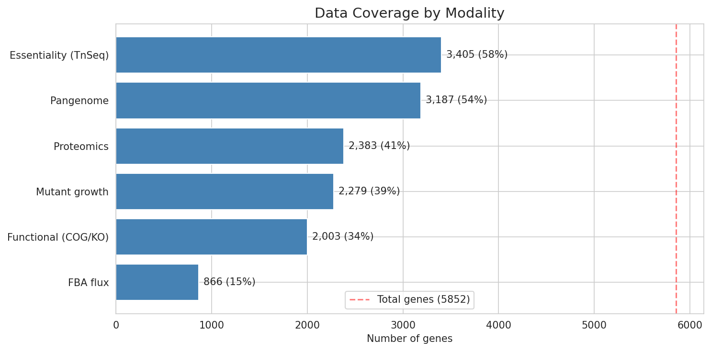

No single gene has data across all six modalities simultaneously, but the pairwise overlaps are substantial — particularly between essentiality, pangenome, and proteomics.

*(Notebook: 01_database_exploration.ipynb)*

### 2. Strong BERDL Connectivity: 4 of 5 Connection Types at >90% Match

Querying BERDL via Spark validated that the ADP1 database connects strongly to BERDL collections:

| Connection | ADP1 Count | BERDL Matches | Match % |
|------------|-----------|---------------|---------|
| Genome IDs → Pangenome | 13 | 13 | **100%** |
| Reactions → Biochemistry | 1,330 | 1,210 | **91%** |
| Compounds → Biochemistry | 230 | 230 | **100%** |
| Cluster IDs → Pangenome | 4,891 | 4,891 | **100%** (via mapping) |
| ADP1 → Fitness Browser | 1 | 0 | Not present |

All 13 BERDL-format genomes belong to the species *s__Acinetobacter_baylyi* (clade `s__Acinetobacter_baylyi--RS_GCF_000368685.1`), which has a BERDL pangenome of 3,207 core and 1,684 accessory gene clusters. The 120 unmatched reactions (9%) may represent custom or draft reactions not yet in ModelSEED. ADP1 is absent from the Fitness Browser, making the mutant growth data in this database a unique resource not available elsewhere in BERDL.

*(Notebook: 02_berdl_connection_scan.ipynb)*

### 3. Pangenome Cluster ID Bridge: 100% Mapping via Gene Junction Table

The ADP1 database uses mmseqs2-style cluster IDs (`NHSXFYEX_mmseqsCluster_NNNN`) while BERDL uses centroid gene IDs (`NC_005966.1_1024`) — completely different naming conventions with 0% direct string match. The bridge was found through BERDL's `gene_genecluster_junction` table: BERDL cluster IDs map to member gene IDs, which match the `feature_id` column in the ADP1 `pan_genome_features` table, which in turn carries the ADP1-style `cluster_id`.

All 4,891 BERDL clusters mapped successfully to 4,081 unique ADP1 clusters (100% gene-level match across 43,754 genes). The saved mapping table (`data/cluster_id_mapping.csv`) enables joining any BERDL pangenome annotation (eggNOG, functional predictions) to ADP1 genes.

*(Notebook: 03_cluster_id_mapping.ipynb)*

### 4. FBA and TnSeq Essentiality Agree 74% of the Time

Of 866 genes with both FBA flux predictions and TnSeq essentiality calls, 639 (73.8%) are concordant. The discordant 26% — genes where the metabolic model and experimental data disagree — are candidates for model refinement or may reflect regulatory effects not captured by FBA.

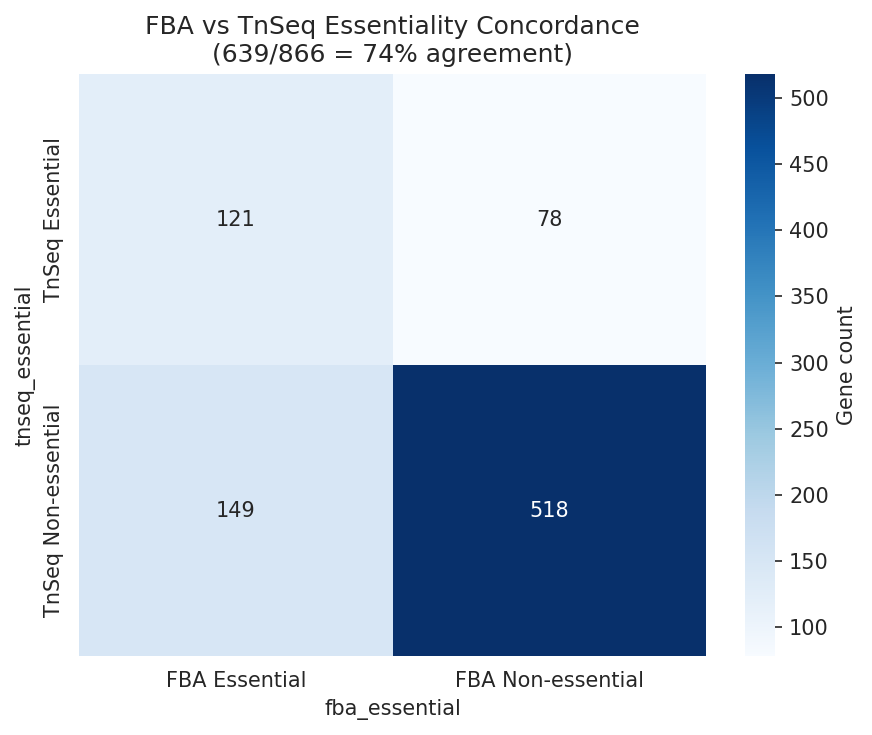

Essentiality also differs between growth conditions: 499 genes are essential on minimal media vs 346 on LB, reflecting the additional biosynthetic burden of minimal media.

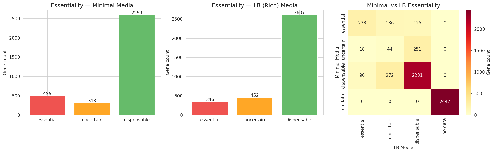

*(Notebook: 04_gene_essentiality_and_fitness.ipynb)*

### 5. Condition-Specific Fitness: Urea and Quinate Stand Apart

Mutant growth fitness across 8 carbon sources shows moderate overall correlation (mean pairwise r = 0.44) but with notable outliers. Urea fitness is nearly uncorrelated with quinate (r = 0.11) and weakly correlated with all other conditions (r = 0.12-0.28), suggesting that urea catabolism involves a largely independent set of genes. Butanediol-acetate (r = 0.58) and butanediol-lactate (r = 0.53) show the strongest correlations, consistent with shared central carbon metabolism.

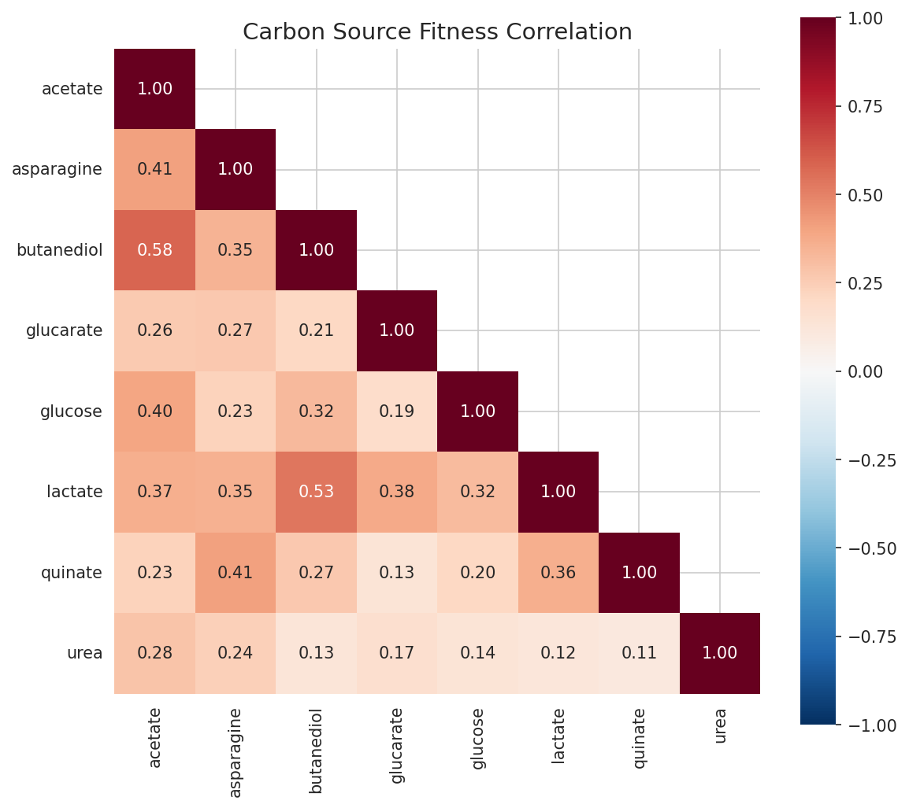

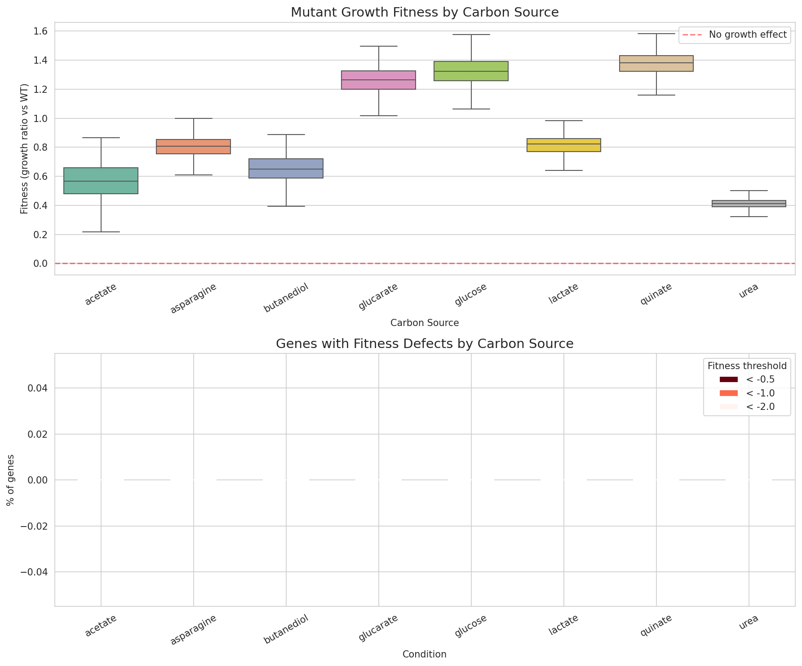

*(Notebook: 04_gene_essentiality_and_fitness.ipynb)*

### 6. Essential Genes Are 6x More Likely to Have COG Annotations

Essential genes are dramatically more annotation-rich than dispensable genes: 33% of essential genes have COG assignments vs only 5% of dispensable genes. Similarly, 92% of essential genes have KEGG KO assignments vs 53% of dispensable genes. This pattern is expected — essential genes tend to encode well-characterized housekeeping functions — but it also means the functionally unannotated essential genes (~8% without KO) are particularly interesting as potential novel essential functions.

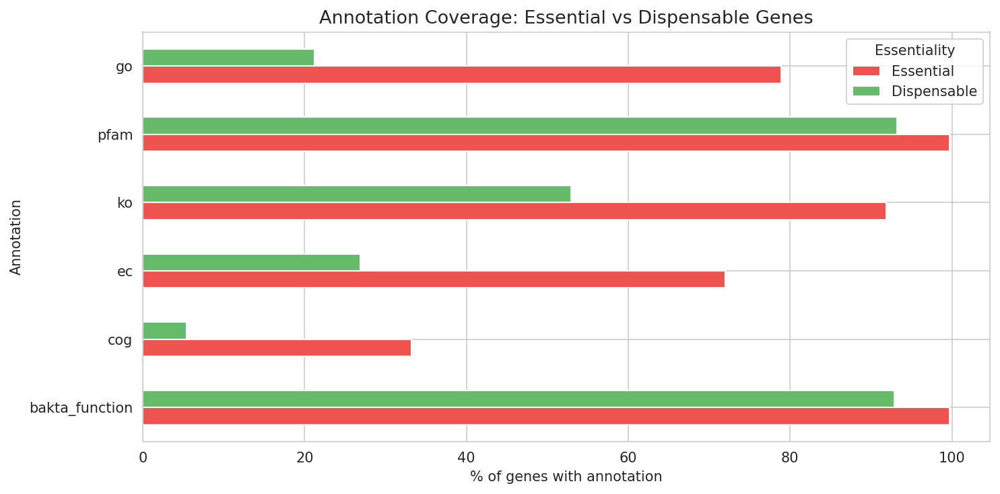

Essential genes are also more likely to be in the core pangenome, consistent with the pattern that conserved genes tend to be essential.

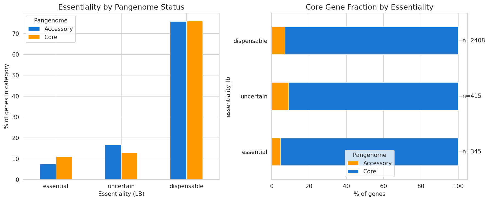

*(Notebook: 04_gene_essentiality_and_fitness.ipynb)*

### 7. Highly Conserved Core Metabolism Across 14 Genomes

Of 1,330 unique metabolic reactions, 1,248 (94%) are shared across all 14 Acinetobacter genomes (core), 62 are variable (present in 2-13 genomes), and only 20 are genome-unique. Gapfilling accounts for 7.7% of reactions on average, with 243 missing functions cataloged.

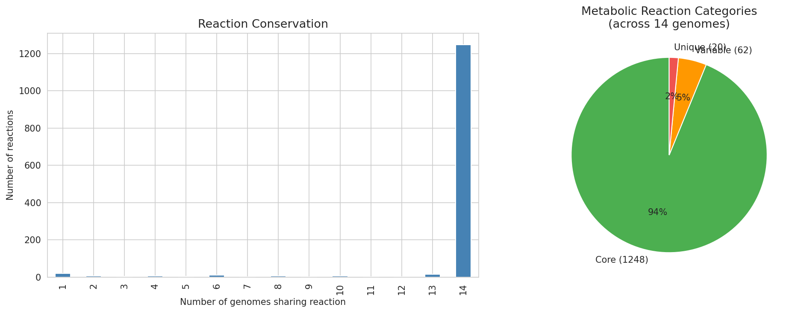

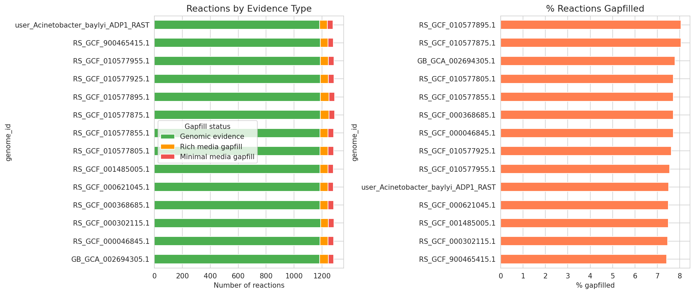

*(Notebook: 05_metabolic_model_and_phenotypes.ipynb)*

### 8. 87% of Growth Predictions Depend on Gapfilled Reactions

Of 121,519 growth phenotype predictions across 14 genomes, 105,376 (87%) require at least one gapfilled reaction. This heavy dependence on gapfilling means that prediction accuracy is tightly coupled to gapfilling quality. False negatives have higher mean gap counts than correct predictions.

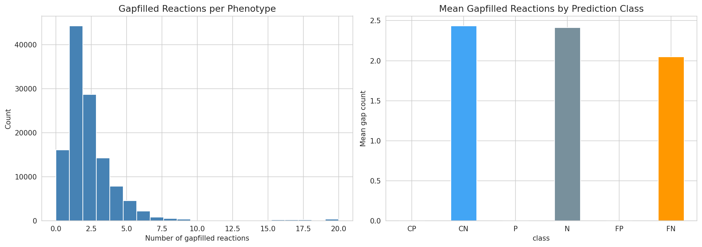

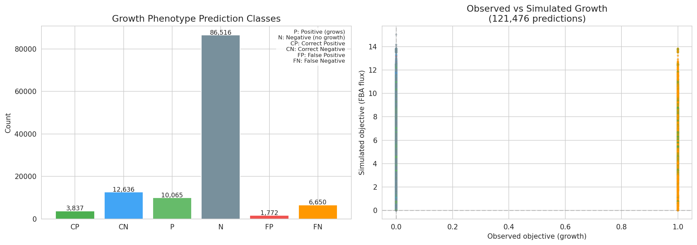

*(Notebook: 05_metabolic_model_and_phenotypes.ipynb)*

## Results

### Database Structure

The ADP1 database contains 15 interconnected tables with 27 relationship pairs (shared columns). The core data flow is: `genome` → `genome_features` (annotations, essentiality, proteomics, growth) → `pan_genome_features` (pangenome context) → `genome_reactions` (metabolic model) → `gene_phenotypes` (phenotype associations) → `growth_phenotypes_detailed` (FBA predictions).

Seven engineered ADP1 strains are documented in the `strains` table, with proteomics data available for all seven. The strains include wild-type ADP1 and six derivatives with aromatic amino acid pathway modifications (ΔaroF, ΔaroG, dgoA variants).

### Proteomics Cross-Strain Analysis

Protein abundance was measured across 7 strains for 2,383 genes. Cross-strain correlation is high, indicating that the engineered modifications have targeted rather than global effects on the proteome.

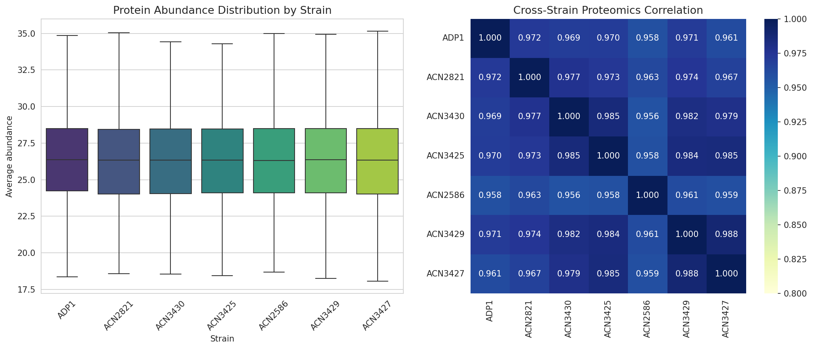

### FBA Flux Class Transitions

20% of genes (177/866) change FBA flux class between rich and minimal media, reflecting condition-dependent metabolic rewiring.

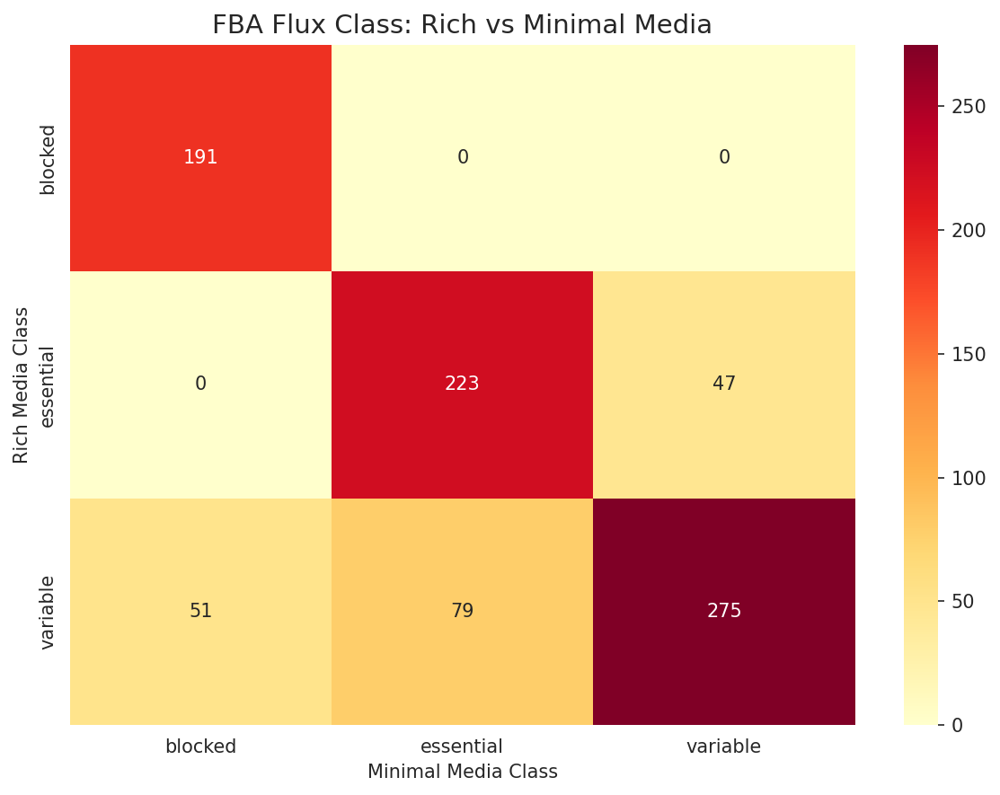

### Additional Figures

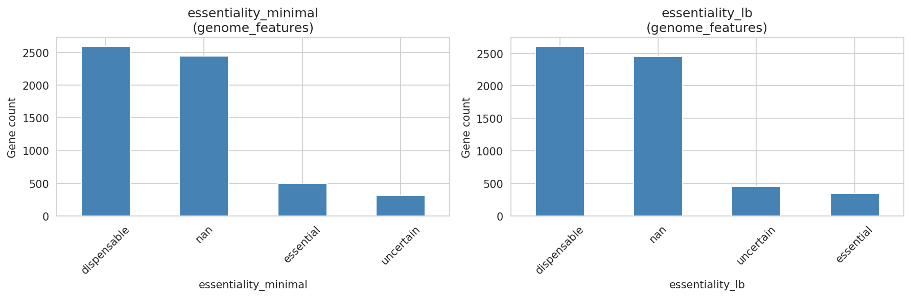

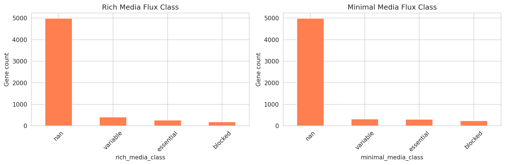

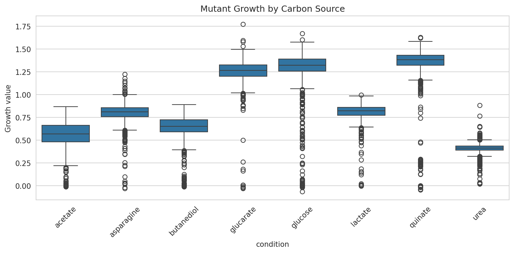

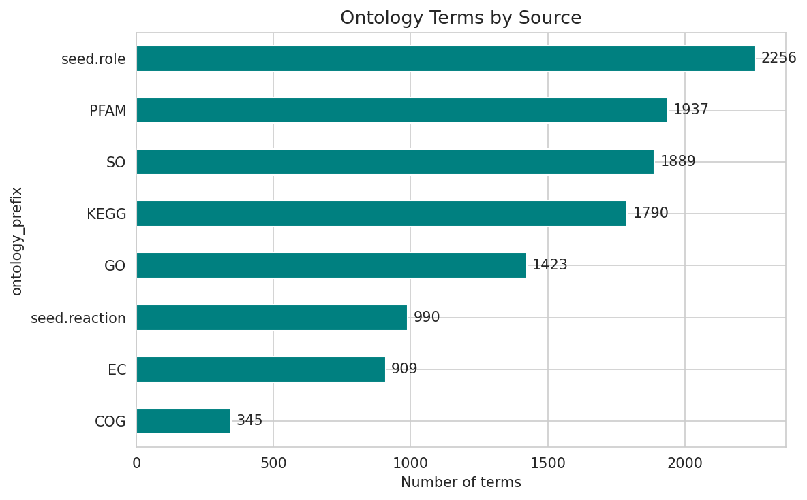

## Interpretation

This exploration project demonstrates that a comprehensive user-provided database for *A. baylyi* ADP1 integrates deeply with BERDL collections. The four validated connection types (genome IDs, reactions, compounds, and pangenome clusters) together cover the major axes of biological data in the lakehouse — genomics, metabolomics, and comparative genomics.

### Novel Contribution

The ADP1 database brings several data types **not available elsewhere in BERDL**:

1. **Mutant growth fitness on 8 carbon sources** — ADP1 is absent from the Fitness Browser, making this the only source of condition-specific fitness data for this organism in the lakehouse
2. **Proteomics across 7 engineered strains** — quantitative protein abundance data for wild-type and aromatic amino acid pathway mutants
3. **Gene essentiality calls** — TnSeq-based essentiality on both minimal and LB media
4. **FBA model predictions** — flux balance analysis with gapfilling metadata, enabling model-experiment concordance analysis

### Limitations

- **Data modality overlap**: No gene has data across all 6 modalities. FBA flux data is the sparsest (15% of genes), limiting the concordance analysis to 866 genes.
- **Pangenome cluster mapping is indirect**: The BERDL ↔ ADP1 cluster mapping goes through 3 tables. While 100% complete, this indirection could introduce edge cases for clusters that split or merge between the two pangenome analyses.
- **Gapfilling dependence**: 87% of growth phenotype predictions rely on gapfilled reactions. The 243 missing functions represent genuine gaps in genomic evidence that affect prediction reliability.
- **Single species**: This database covers only *A. baylyi*. Cross-species comparisons would require similar databases for other organisms.

## Data

### Sources
| Collection | Tables Used | Purpose |
|------------|-------------|---------|
| User-provided `berdl_tables.db` | All 15 tables | ADP1 genome, annotations, metabolic model, phenotypes, proteomics |
| `kbase_ke_pangenome` | `genome`, `gene_cluster`, `gene_genecluster_junction`, `gtdb_species_clade`, `pangenome` | Pangenome context for A. baylyi (13 genomes, 4,891 clusters) |
| `kbase_msd_biochemistry` | `reaction`, `molecule` | ModelSEED reaction/compound name resolution |
| `kescience_fitnessbrowser` | `organism` | Checked for ADP1 presence (not found) |
| `phagefoundry_acinetobacter_genome_browser` | (37 tables) | Acinetobacter genome browser (identified, not deeply queried) |

### Generated Data
| File | Rows | Description |
|------|------|-------------|
| `data/cluster_id_mapping.csv` | 4,891 | BERDL ↔ ADP1 pangenome cluster ID mapping |
| `data/berdl_connection_summary.csv` | 5 | Connection scan results summary |

## Supporting Evidence

### Notebooks
| Notebook | Purpose |
|----------|---------|
| `01_database_exploration.ipynb` | Full database inventory: tables, schemas, NULL coverage, distributions |
| `02_berdl_connection_scan.ipynb` | BERDL connection validation via Spark queries |
| `03_cluster_id_mapping.ipynb` | Pangenome cluster ID bridge construction |
| `04_gene_essentiality_and_fitness.ipynb` | Multi-omics: essentiality, FBA concordance, fitness, proteomics |
| `05_metabolic_model_and_phenotypes.ipynb` | Metabolic model: gapfilling, reaction conservation, growth predictions |

### Figures
| Figure | Description |
|--------|-------------|
| `essentiality_overview.png` | TnSeq essentiality on minimal vs LB media with cross-tabulation |
| `essentiality_distribution.png` | Essentiality category bar charts |
| `essentiality_vs_pangenome.png` | Core/accessory fraction by essentiality class |
| `fba_tnseq_concordance.png` | FBA vs TnSeq essentiality agreement matrix |
| `fba_flux_class_transition.png` | Rich vs minimal media flux class heatmap |
| `metabolic_flux_classes.png` | FBA flux class distributions |
| `mutant_growth_fitness.png` | Fitness distributions and defect fractions by carbon source |
| `mutant_growth_by_condition.png` | Mutant growth boxplots |
| `growth_condition_correlation.png` | Pairwise carbon source fitness correlation matrix |
| `proteomics_cross_strain.png` | Protein abundance distributions and strain correlation |
| `proteomics_wt_vs_engineered.png` | WT vs most divergent strain scatter plot |
| `data_coverage_by_modality.png` | Gene count per data modality |
| `annotation_by_essentiality.png` | Annotation coverage: essential vs dispensable genes |
| `reaction_gapfilling.png` | Reactions by evidence type per genome |
| `reaction_conservation.png` | Core/variable/unique reaction breakdown |
| `growth_phenotype_predictions.png` | Growth prediction classes and simulated vs observed scatter |
| `gapfilling_impact.png` | Gapfill count distribution and mean by prediction class |
| `ontology_distribution.png` | Ontology terms by source |

## Future Directions

1. **Exploit the FBA-TnSeq discordance**: The 227 genes where FBA and TnSeq disagree on essentiality could guide metabolic model refinement — are the discordant genes enriched for specific pathways or regulatory functions?
2. **Cross-species fitness comparison**: Use the cluster ID mapping to compare ADP1 mutant growth data against Fitness Browser data for related organisms, even though ADP1 itself isn't in the FB.
3. **PhageFoundry integration**: The 37-table Acinetobacter genome browser in PhageFoundry was identified but not deeply explored. Cross-referencing with phage susceptibility data could be valuable.
4. **Urea metabolism deep-dive**: The near-zero correlation between urea fitness and other carbon sources (r = 0.11-0.28) suggests a largely independent gene set. Identifying these urea-specific genes and their pangenome conservation could be biologically interesting.
5. **Gapfilling quality assessment**: With 243 missing functions and 87% of growth predictions depending on gapfilling, systematically assessing gapfill confidence using pangenome conservation data could improve prediction reliability.

## References

- Parks DH, Chuvochina M, Rinke C, Mussig AJ, Chaumeil PA, Hugenholtz P. (2022). "GTDB: an ongoing census of bacterial and archaeal diversity through a phylogenetically consistent, rank normalized and complete genome-based taxonomy." *Nucleic Acids Research*. 50(D1):D199-D207.
- Henry CS, DeJongh M, Best AA, Frybarger PM, Linsay B, Stevens RL. (2010). "High-throughput generation, optimization and analysis of genome-scale metabolic models." *Nature Biotechnology*. 28(9):977-982.
- de Berardinis V, Vallenet D, Castelli V, Besnard M, Pinet A, Cruaud C, Samair S, Lechaplais C, Gyapay G, Riber C, et al. (2008). "A complete collection of single-gene deletion mutants of *Acinetobacter baylyi* ADP1." *Molecular Systems Biology*. 4:174.
- Arkin AP, Cottingham RW, Henry CS, Harris NL, Stevens RL, et al. (2018). "KBase: The United States Department of Energy Systems Biology Knowledgebase." *Nature Biotechnology*. 36(7):566-569.
