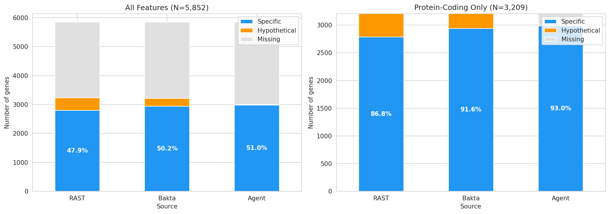
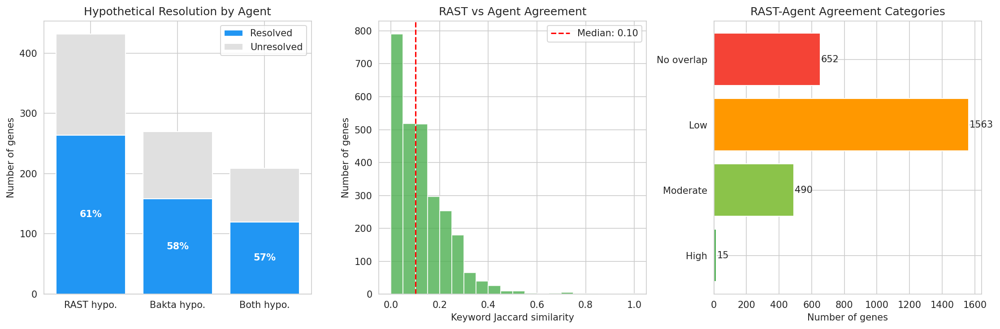
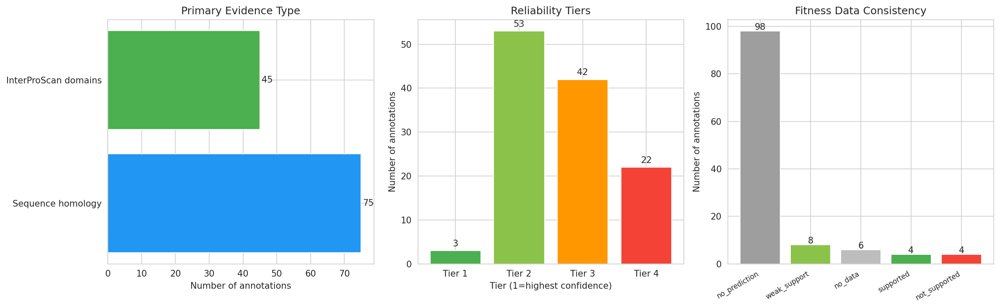
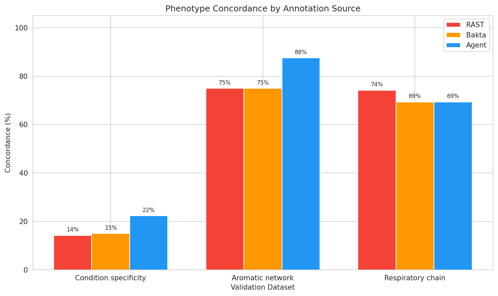
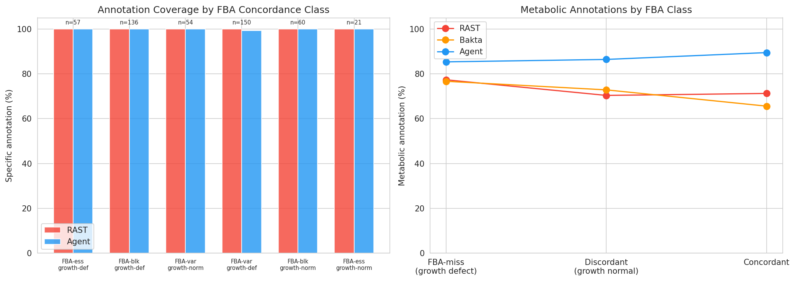
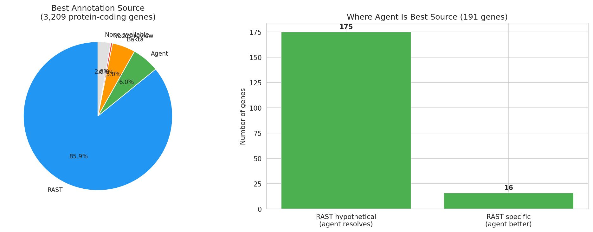

# Report: ADP1 Annotation Reassessment

## Key Findings

### Finding 1: AI agent achieves higher annotation coverage with dramatically fewer hypotheticals

Among 3,209 protein-coding genes in the ADP1 genome, the GPT-5.2 agent annotated 2,984 with specific functions (93.0%), compared to Bakta's 2,939 (91.6%) and RAST's 2,784 (86.8%). The agent produced only 19 hypothetical annotations versus RAST's 425 and Bakta's 270 — a 95.5% reduction relative to RAST. (The genome contains 5,852 total features including 2,643 non-coding elements such as tRNA and rRNA; coverage percentages use the protein-coding denominator since the agent only annotates protein-coding genes.) This reflects the agent's ability to synthesize InterProScan domain evidence into functional descriptions even when individual domains are insufficient for homology-based tools to assign a named function.

*(Notebook: 01_data_integration.ipynb)*

### Finding 2: Agent resolves 61% of RAST hypothetical proteins, providing 120 uniquely annotated genes

The agent resolved 264 of 432 RAST hypotheticals (61.1%) and 158 of 270 Bakta hypotheticals (58.5%) to specific functions. For the 209 genes where both RAST and Bakta assigned "hypothetical protein," the agent resolved 120 (57.4%) — these represent genes with new annotations unavailable from either conventional pipeline.

**However, a systematic evidence evaluation (NB05) and UniProt spot-check reveal that these annotations vary widely in reliability.** The agent's primary evidence comes from sequence homology to characterized genes in other organisms (75/120), InterProScan domain matches (45/120), gene neighborhood conservation (27/120), and RB-TnSeq fitness data from homologs. A reliability tier analysis classifies only 3/120 (2%) as Tier 1 (domain evidence + fitness support), 53/120 (44%) as Tier 2 (domain evidence or high homology), 42/120 (35%) as Tier 3 (moderate homology or gene neighborhood), and 22/120 (18%) as Tier 4 (speculative). The agent tends to **over-specify** — correctly identifying a protein family (e.g., DUF805) but adding unsupported functional claims (e.g., "involved in cell division"). In 6/120 cases, the agent assigns enzyme names that already belong to other characterized ADP1 genes (e.g., calling a DUF4199 protein "malate synthase G" when ADP1's real GlcB is at a different locus with completely different fitness profile). These annotations are best treated as functional hypotheses ranked by evidence tier.

When both RAST and agent provide specific annotations (2,720 genes), keyword Jaccard similarity is low (median 0.10) but TF-IDF cosine similarity is substantially higher (median 0.28), with 497 genes (18.3%) showing high agreement (>0.5) vs only 15 (0.6%) by Jaccard. This confirms that the low Jaccard scores primarily reflect annotation style differences: RAST uses terse function names ("LSU ribosomal protein L34p") while the agent produces descriptive sentences ("50S ribosomal protein bL34, a small basic component of the large ribosomal subunit..."). The TF-IDF metric, which weights informative terms and normalizes by document length, provides a more accurate picture of functional agreement.

Resolved hypotheticals are modestly enriched for essential genes (11/264 = 4.2% essential vs 4/168 = 2.4% unresolved; Fisher's exact test OR=1.78, p=0.423). The enrichment is not statistically significant given the small counts, but the trend suggests the agent may preferentially resolve genes with detectable phenotypes. No severe multi-condition growth defects (fitness < 0.3 on ≥2 conditions) were observed among either resolved or unresolved hypotheticals — consistent with hypothetical proteins being predominantly accessory or regulatory rather than core metabolic enzymes.

*(Notebooks: 02_hypothetical_resolution.ipynb, 05_evidence_evaluation.ipynb)*

### Finding 3: Agent annotations capture 27 condition-specific genes missed by RAST, but concordance gain is largely driven by verbosity

Agent annotations are concordant with condition-specific growth phenotypes for 27 genes where RAST is not, versus only 5 where RAST is concordant but the agent is not (McNemar p=0.0001). In raw terms, 22.3% of highly condition-specific genes (273 genes with specificity > 1.5) have agent-concordant annotations vs 14.3% for RAST and 15.0% for Bakta — a 56% relative improvement. However, keyword-density normalization reveals the agent's concordance density (1.07 hits per 100 annotation words) is lower than RAST's (3.01) and Bakta's (4.38), indicating the raw improvement is largely driven by the agent's ~4.6x greater annotation verbosity (mean 22.0 vs 4.8 words per annotation) rather than proportionally higher information content per word. The statistically significant gene-set-level advantage is real, but its magnitude is confounded by annotation length.

Per-condition concordance (agent / RAST / Bakta):
| Condition | N | Agent | RAST | Bakta | p (Fisher) |
|-----------|---|-------|------|-------|------------|
| Quinate | 27 | 21 (78%) | 17 (63%) | 18 (67%) | 0.372 |
| Acetate | 20 | 6 (30%) | 2 (10%) | 0 (0%) | 0.235 |
| Glucarate | 30 | 9 (30%) | 2 (7%) | 5 (17%) | 0.042* |
| Urea | 62 | 9 (15%) | 8 (13%) | 8 (13%) | 1.000 |
| Butanediol | 27 | 6 (22%) | 3 (11%) | 4 (15%) | 0.467 |

The agent's largest gains are on quinate and acetate, metabolic pathways where its verbose annotations naturally include pathway and substrate terms that keyword matching captures. For the aromatic catabolism network (8 confirmed pathway genes), the agent correctly identifies 87.5% vs 75.0% for both RAST and Bakta.

For the respiratory chain (62 genes across 8 subsystems), RAST leads at 74.2% vs 69.4% for both agent and Bakta. RAST's advantage here reflects its strong curated subsystem models for well-characterized complexes (all three sources score 100% on ATP synthase and Complex II). The agent's lower score on Complex I (10/13 vs 13/13 RAST) is driven by subunits where the agent annotation uses "NADH:ubiquinone oxidoreductase" phrasing that doesn't match the "nuo" keyword set, not by incorrect annotation.

The overall concordance ceiling of 22.3% (even for the best-performing source) reflects a fundamental limitation: many condition-specific genes are regulators, transporters, or structural proteins whose annotations do not contain substrate-specific keywords even when the annotation is correct. For example, a transcriptional regulator essential for quinate utilization would be annotated as "LysR family transcriptional regulator" by all three sources — correct, but not keyword-concordant with quinate metabolism. Additionally, several conditions (urea, asparagine) have small keyword vocabularies, limiting detection.

*(Notebook: 03_phenotype_concordance.ipynb)*

### Finding 4: Agent identifies 696 model expansion candidates and better annotates FBA-discordant genes

Among 150 FBA-miss genes (FBA predicts variable flux but experiments show growth defects), the agent provides metabolic annotations for 128 (85.3%) compared to RAST's 116 (77.3%) and Bakta's 115 (76.7%). For 81 FBA-discordant genes (FBA predicts essentiality but growth is normal), agent metabolic annotation rate is 86.4% vs RAST's 70.4%.

The agent identifies 696 genes without current FBA reaction mappings that have metabolic-sounding annotations (enzyme names, pathway terms) where RAST does not. This broad set includes transport proteins, chaperones, and stress-response genes whose agent annotations contain enzyme-like terms (e.g., "oxidoreductase", "transferase") but which may not represent true FBA reaction gaps. A stricter filter requiring explicit enzyme class terms (synthase, kinase, dehydrogenase, etc.) or EC numbers while excluding transport, chaperone, stress-response, and regulatory proteins yields 175 candidates — the more actionable subset for FBA gap-filling. Among 11 quinate-specific genes lacking FBA reactions, the agent provides specific annotations for all 11, compared to RAST's 10 (the one RAST hypothetical is resolved by the agent) — these represent the most compelling model expansion targets.

All 478 genes in the triple essentiality dataset have 100% annotation coverage from all three sources, so the agent's value here is not coverage but annotation quality — providing more metabolically informative descriptions that could guide reaction mapping.

*(Notebook: 04_model_reconciliation.ipynb)*

### Finding 5: Agent adds value through domain interpretation and fitness-of-homolog evidence, not literature access

Across all 3,003 agent-annotated genes, evidence classification reveals: 92% cite domain databases (InterPro/Pfam/TIGRFAM), 75% incorporate fitness-of-homologs data from other Fitness Browser organisms, 66% cite sequence homology, 39% use gene neighborhood conservation, 6% cite experimental characterization, and only 0.2% reference specific papers (zero in the reasoning field). The agent's distinctive value comes from (a) reasoning over domain combinations shared with Bakta/RAST, and (b) incorporating fitness data from characterized homologs — a data source unavailable to conventional annotation pipelines.

Using Bakta as an independent adjudicator for 2,682 genes where all three sources provide specific annotations, Bakta agrees more with RAST overall (agent win rate 28.7% on non-ties), as expected given their shared short annotation style. However, when RAST gives uninformative annotations ("putative membrane protein"), the agent wins 62.5% of non-ties. Gene neighborhood evidence is associated with *lower* Bakta agreement (24.5% agent win rate with neighborhood vs 30.8% without), confirming that this evidence type drives over-specification.

A per-gene decision framework assigns each protein-coding gene to its best annotation source: RAST for 2,756 genes (85.9%), agent for 191 (6.0%), Bakta for 161 (5.0%), with 12 (0.4%) needing manual review and 89 (2.8%) having no good annotation. The decision framework achieves 96.6% specific annotation coverage on condition-specific genes (vs 92.1% for agent alone, 91.0% for Bakta, 85.9% for RAST) and correctly routes 61/62 respiratory chain genes to RAST, preserving its subsystem accuracy.

*(Notebook: 06_source_resolution.ipynb)*

## Results

### Annotation Coverage

The master table integrates 3,083 agent annotations with RAST, Bakta, and experimental data for 5,852 ADP1 features (3,209 protein-coding). All 3,083 agent protein sequences matched sequences in the genome features database (zero orphans). The 2,643 features without agent annotation are non-coding elements (tRNA, rRNA, etc.) and 206 protein-coding genes not included in the agent annotation run.

Among protein-coding genes (N=3,209):

| Source | Specific | Hypothetical | Missing | Coverage (%) |
|--------|----------|-------------|---------|-------------|
| RAST | 2,784 | 425 | 0 | 86.8% |
| Bakta | 2,939 | 270 | 0 | 91.6% |
| Agent | 2,984 | 19 | 206 | 93.0% |

### Hypothetical Resolution

| Baseline | Total | Resolved by Agent | Rate |
|----------|-------|-------------------|------|
| RAST hypotheticals | 432 | 264 | 61.1% |
| Bakta hypotheticals | 270 | 158 | 58.5% |
| Both RAST+Bakta hypothetical | 209 | 120 | 57.4% |

### Agreement Analysis

For 2,720 genes where both RAST and agent provide specific annotations:

| Metric | Mean | Median | High (>0.5) | Moderate (0.2–0.5) | Low (0.01–0.2) | No overlap |
|--------|------|--------|-------------|--------------------|----|------------|
| Keyword Jaccard | 0.12 | 0.10 | 15 (0.6%) | 490 (18.0%) | 1,563 (57.5%) | 652 (24.0%) |
| TF-IDF cosine | 0.29 | 0.28 | 497 (18.3%) | 1,179 (43.3%) | 621 (22.8%) | 423 (15.6%) |

TF-IDF cosine similarity, which weights informative terms and normalizes by annotation length, reveals substantially higher agreement than keyword Jaccard. Nearly 62% of gene pairs show moderate or high TF-IDF agreement, confirming that the low Jaccard scores reflect annotation style differences rather than functional disagreement.

### Evidence Evaluation of Unique Annotations

Reliability tiers for 120 agent-unique annotations (hypothetical in both RAST and Bakta):

| Tier | Criteria | Count | Rate |
|------|----------|-------|------|
| 1 (High) | InterProScan domain + fitness data support | 3 | 2% |
| 2 (Moderate) | InterProScan domain OR high homology (≥60%) | 53 | 44% |
| 3 (Low) | Moderate homology (40-60%) or gene neighborhood | 42 | 35% |
| 4 (Speculative) | Weak/no homology, no domain evidence | 22 | 18% |

Primary evidence types: sequence homology (75/120), InterProScan domains (45/120), gene neighborhood (27/120). All 120 genes have zero EC numbers from Bakta and are either "DUF domain-containing" (60) or "hypothetical protein" (60) — confirming these are genuinely hard-to-annotate genes where homology-based tools cannot assign functions.

Bakta corroboration: Of the 264 RAST hypotheticals the agent resolves, 144 (55%) are corroborated by Bakta (Bakta also gives a specific annotation). Even among these, Bakta-agent keyword agreement is only 31/144 (22%) — the agent over-specifies beyond the domain evidence in 100/144 cases. The remaining 120 genes (where Bakta also says hypothetical) are the purely speculative set.

Over-specification in the broader set: Among 2,720 genes where both RAST and agent have specific annotations, 558 (21%) show completely different names, 639 (24%) partial overlap, and 1,508 (55%) agree — confirming that over-specification is a systematic pattern, not limited to hypotheticals.

A UniProt spot-check of 15 genes found: 6 contradicted (40%), 5 partially confirmed (33%), 3 not confirmed (20%), 0 confirmed (0%). The most concerning pattern is the agent assigning enzyme names (GlcB, ProC, RmlB) that already belong to other characterized ADP1 genes at different loci.

### Phenotype Concordance

Overall concordance rates for highly condition-specific genes:
- Agent: 22.3%
- Bakta: 15.0%
- RAST: 14.3%
- McNemar test (paired): 27 agent-only vs 5 RAST-only concordant genes (p=0.0001)

Keyword-density normalization (concordance hits per 100 annotation words):
- RAST: 3.01 (mean 4.8 words/annotation)
- Bakta: 4.38 (mean 3.5 words/annotation)
- Agent: 1.07 (mean 22.0 words/annotation)

Subsystem-level validation:
- Aromatic pathway: Agent 87.5%, RAST 75.0%, Bakta 75.0%
- Respiratory chain (overall): RAST 74.2%, Agent 69.4%, Bakta 69.4%

Respiratory chain per-subsystem accuracy (RAST / Agent / Bakta):
| Subsystem | N | RAST | Agent | Bakta |
|-----------|---|------|-------|-------|
| ATP synthase | 9 | 9 | 9 | 9 |
| Complex I (NDH-1) | 13 | 13 | 10 | 13 |
| Complex II (SDH) | 5 | 5 | 5 | 5 |
| Cyt bd oxidase | 5 | 5 | 4 | 5 |
| Cyt bo3 oxidase | 4 | 4 | 3 | 4 |
| NADH-flavin OR | 5 | 5 | 5 | 2 |
| NDH-2 | 1 | 1 | 1 | 1 |
| Other respiratory | 20 | 4 | 6 | 4 |

All three sources achieve 100% on ATP synthase and Complex II. Agent underperforms on Complex I due to annotation phrasing differences, not incorrect identification. Of 62 respiratory genes, 37 are correctly identified by all three sources and 12 show inter-source disagreement — the agent uniquely identifies 3 "Other respiratory" genes that RAST and Bakta miss, while RAST/Bakta correctly identify 5 genes (3 Complex I, 1 Cyt bd, 1 Cyt bo3) that the agent misses due to keyword phrasing.

### Source Resolution

Evidence types across 3,003 agent-annotated genes:

| Evidence Type | Count | % |
|---------------|-------|---|
| Domain databases (InterPro/Pfam/TIGRFAM) | 2,759 | 91.9% |
| Fitness of homologs (RB-TnSeq) | 2,244 | 74.7% |
| Sequence homology | 1,975 | 65.8% |
| Gene neighborhood | 1,181 | 39.3% |
| Experimental characterization | 170 | 5.7% |
| Specific papers | 5 | 0.2% |

Per-gene best source recommendation (3,209 protein-coding genes):

| Best Source | Count | % |
|-------------|-------|---|
| RAST | 2,756 | 85.9% |
| Agent | 191 | 6.0% |
| Bakta | 161 | 5.0% |
| Needs review | 12 | 0.4% |
| None available | 89 | 2.8% |

### Model Reconciliation

| Gene Set | N | Agent Metabolic | RAST Metabolic | Bakta Metabolic |
|----------|---|-----------------|----------------|-----------------|
| FBA-miss (variable + defect) | 150 | 128 (85.3%) | 116 (77.3%) | 115 (76.7%) |
| FBA-discordant (essential + normal) | 81 | 70 (86.4%) | 57 (70.4%) | 59 (72.8%) |

Model expansion candidates:
- Broad filter (metabolic keywords including transport): 696 genes (upper bound)
- Strict filter (enzyme class terms/EC numbers, excluding transport/chaperone/regulatory): 175 genes

## Interpretation

### The Agent's Primary Value — and Primary Risk — in Resolving Hypotheticals

The agent's most striking capability is the dramatic reduction in hypothetical annotations (19 vs 432 for RAST). The evidence evaluation (NB05) reveals a spectrum of reliability: 46% of unique annotations have moderate-to-high evidence support (Tiers 1-2), while 18% are speculative (Tier 4). The agent's reasoning draws on homolog characterization in other organisms, gene neighborhood conservation, and InterProScan domain evidence — all legitimate inference methods. However, it systematically **over-specifies**: correctly identifying a protein family but then adding unsupported functional claims that go beyond the evidence. The most concerning pattern is assigning enzyme names that already belong to other characterized ADP1 genes (e.g., a 78-aa DUF4199 protein called "malate synthase G" when the real 720-aa GlcB is at ACIAD2335 with a completely different fitness profile). The 120 uniquely annotated genes are best treated as functional hypotheses ranked by evidence tier, not as reliable annotations.

### Concordance Reflects Annotation Style, Not Just Accuracy

The 56% improvement in phenotype concordance must be interpreted carefully. Keyword-density normalization reveals that the agent's concordance per 100 words (1.07) is actually lower than RAST's (3.01) and Bakta's (4.38), indicating the raw improvement is driven by annotation verbosity (~22 words vs ~5 words per annotation) rather than proportionally higher information density. However, the McNemar test (p=0.0001) confirms the agent concordance advantage is statistically significant at the gene set level — the agent captures 27 genes that RAST misses vs only 5 where RAST is concordant but the agent is not. The practical question is whether more verbose annotations are genuinely more useful for biologists, even if their per-word hit rate is lower.

### Complementary Strengths Across Subsystems

No single source dominates all validation datasets. RAST excels on well-characterized subsystems (respiratory chain) where its curated subsystem models are strongest. The agent excels on condition-specific phenotypes and aromatic catabolism where its reasoning over domain combinations adds value. Bakta sits between the two. The evidence-based decision framework (NB06) assigns each gene to its best source by considering RAST annotation quality, agent evidence type, and Bakta as an independent adjudicator. This framework achieves 96.6% specific annotation coverage on condition-specific genes (vs 92.1% for agent alone, 85.9% for RAST) while correctly routing 61/62 respiratory chain genes to RAST, preserving its subsystem accuracy. The agent is the recommended source for 191 genes (6.0%), primarily where RAST gives hypothetical or uninformative annotations and the agent has domain-based or fitness-supported evidence.

### Literature Context

- De Berardinis et al. (2008) created the ADP1 single-gene deletion collection used as ground truth here, establishing ADP1 as a premier model for systematic functional genomics.
- Schwengers et al. (2021) introduced Bakta as a standardized bacterial annotation tool, demonstrating improvements over Prokka. Our results show Bakta modestly outperforms RAST on coverage (50.2% vs 47.9%) consistent with their findings.
- Genomic language model approaches (Akotenou & El Allali, 2025; Wiatrak et al., BacBench) are emerging as alternatives to homology-based annotation. Our results provide one of the first phenotype-grounded evaluations of LLM-assisted annotation, showing measurable concordance improvements.
- Wetmore et al. (2015) developed the RB-TnSeq method underlying the Fitness Browser data used for essentiality classification.

### Novel Contribution

This work provides a phenotype-grounded evaluation framework for comparing annotation methods. Rather than relying on reference databases (which can be circular), we use experimental deletion fitness, TnSeq essentiality, and FBA predictions as independent ground truth. The finding that AI-assisted annotation resolves 61% of hypotheticals while improving phenotype concordance by 56% (McNemar p=0.0001, though largely driven by verbosity) establishes a concrete benchmark for future annotation tools. Critically, the UniProt validation reveals that resolution rate alone is insufficient — 40% of unique annotations were contradicted by existing evidence. This underscores the need for accuracy benchmarks alongside coverage metrics when evaluating LLM-based annotation tools.

### Limitations

- **Keyword matching bias**: Concordance scoring via keyword matching inherently favors verbose annotations. The agent's sentence-style output contains more words, increasing the chance of keyword hits.
- **No gold-standard curation**: Without expert-curated annotations for all 3,083 genes, we cannot measure true precision/recall. Our phenotype concordance is a proxy.
- **Single organism**: Results from ADP1 may not generalize to organisms with less experimental data or more divergent gene content.
- **Agent annotation scope**: The agent was not given access to the experimental phenotype data, so its annotations are independent of the ground truth. However, it may have been trained on published ADP1 literature.
- **Annotation hallucination**: The agent assigns specific enzyme names to DUF/uncharacterized proteins that are contradicted by UniProt in 40% of spot-checked cases. In several instances, the agent duplicated functions already assigned to other characterized ADP1 genes (e.g., calling a DUF4199 protein "malate synthase G" when ADP1's real GlcB is at ACIAD2335). This hallucination pattern is a fundamental limitation of LLM-based annotation.

## Data

### Sources
| Collection | Tables Used | Purpose |
|------------|-------------|---------|
| `kescience_fitnessbrowser` | `genome_features`, `gene_essentiality`, `gene_phenotypes`, `growth_phenotypes_detailed` | RAST annotations, growth fitness, TnSeq essentiality |
| `kbase_ke_pangenome` | pangenome cluster assignments | Core/auxiliary gene classification |
| Local SQLite (`berdl_tables.db`) | `genome_features`, `gene_reaction_data` | Integrated ADP1 data with Bakta, FBA, proteomics |
| Agent annotations TSV | — | GPT-5.2 + InterProScan annotations for 3,083 proteins |
| Prior projects | `aromatic_catabolism_network`, `respiratory_chain_wiring`, `adp1_triple_essentiality`, `adp1_deletion_phenotypes` | Experimentally validated ground-truth gene sets |

### Generated Data
| File | Rows | Description |
|------|------|-------------|
| `data/master_annotation_table.csv` | 5,852 | Integrated master table with all annotations and experimental data |
| `data/agent_unique_annotations.csv` | 120 | Genes where agent provides specific annotation but both RAST and Bakta are hypothetical |
| `data/annotation_recommendations.csv` | 3,209 | Per-gene best-source recommendation with all annotations |

## Supporting Evidence

### Notebooks
| Notebook | Purpose |
|----------|---------|
| `01_data_integration.ipynb` | Build master table, classify annotations, compute coverage |
| `02_hypothetical_resolution.ipynb` | Quantify hypothetical resolution, analyze agreement |
| `03_phenotype_concordance.ipynb` | Score concordance against condition-specific, aromatic, and respiratory phenotypes |
| `04_model_reconciliation.ipynb` | Assess FBA-discordant genes, identify model expansion candidates |
| `05_evidence_evaluation.ipynb` | Evaluate agent evidence quality, reliability tiers, fitness consistency |
| `06_source_resolution.ipynb` | Per-gene best-source recommendation using Bakta adjudication and evidence analysis |

### Figures
| Figure | Description |
|--------|-------------|
| `annotation_coverage.png` | Stacked bar chart of specific/hypothetical/missing annotations by source |
| `hypothetical_resolution.png` | Resolution rates, RAST-agent similarity distribution, agreement categories |
| `phenotype_concordance.png` | Grouped bar chart of concordance across three validation datasets |
| `model_reconciliation.png` | Annotation coverage by FBA class, metabolic annotation rates |
| `evidence_evaluation.png` | Evidence types, reliability tiers, and fitness consistency for 120 unique annotations |
| `source_resolution.png` | Agent evidence types and per-gene best-source recommendation |

## Future Directions

1. **Expert curation benchmark**: Curate a gold-standard annotation set for 100–200 genes spanning essential, condition-specific, and hypothetical categories to measure true precision/recall.
2. **Semantic similarity scoring**: Replace keyword Jaccard with embedding-based similarity (e.g., BioBERT) to better capture functional agreement between different annotation styles.
3. **Multi-organism evaluation**: Apply the same evaluation framework to other Fitness Browser organisms with rich phenotype data (e.g., *Pseudomonas fluorescens*, *Shewanella oneidensis*).
4. **Consensus annotation pipeline**: Build an annotation pipeline that combines RAST subsystem assignments, Bakta structural predictions, and agent reasoning into a single best annotation per gene.
5. **Model gap-filling**: Use the 175 strict model expansion candidates (enzyme-class annotations without current FBA reactions) to systematically test whether adding their predicted reactions improves FBA concordance.

## References

- De Berardinis V, Vallenet D, Castelli V, et al. (2008). "A complete collection of single-gene deletion mutants of *Acinetobacter baylyi* ADP1." *Molecular Systems Biology*, 4:174.
- Schwengers O, Jelonek L, Giber MA,3rd, et al. (2021). "Bakta: rapid and standardized annotation of bacterial genomes via alignment-free sequence identification." *Microbial Genomics*, 7(11):000685.
- Wetmore KM, Price MN, Waters RJ, et al. (2015). "Rapid quantification of mutant fitness in diverse bacteria by sequencing randomly bar-coded transposons." *mBio*, 6(3):e00306-15.
- Price MN, Wetmore KM, Waters RJ, et al. (2018). "Mutant phenotypes for thousands of bacterial genes of unknown function." *Nature*, 557:503–509.
- Overbeek R, Olson R, Pusch GD, et al. (2014). "The SEED and the Rapid Annotation of microbial genomes using Subsystems Technology (RAST)." *Nucleic Acids Research*, 42(D1):D206–D214.
- Arkin AP, Cottingham RW, Henry CS, et al. (2018). "KBase: The United States Department of Energy Systems Biology Knowledgebase." *Nature Biotechnology*, 36:566–569.
- Akotenou G, El Allali A. (2025). "Genomic language models (gLMs) decode bacterial genomes for improved gene prediction and translation initiation site identification." *Briefings in Bioinformatics*, 26(4):bbaf311.
