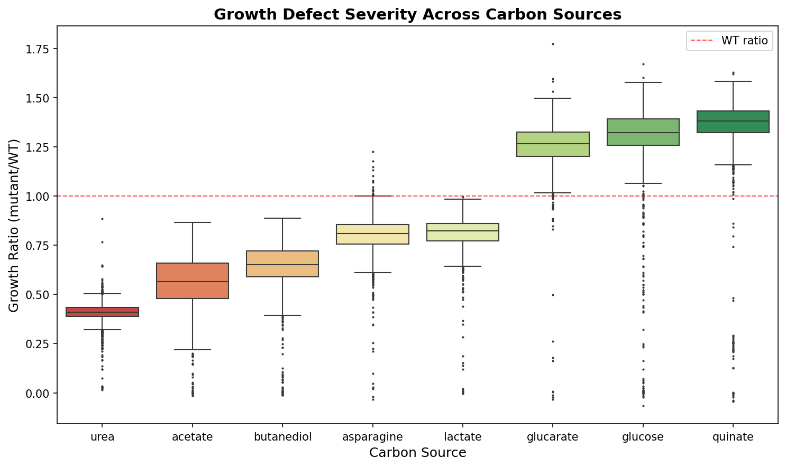
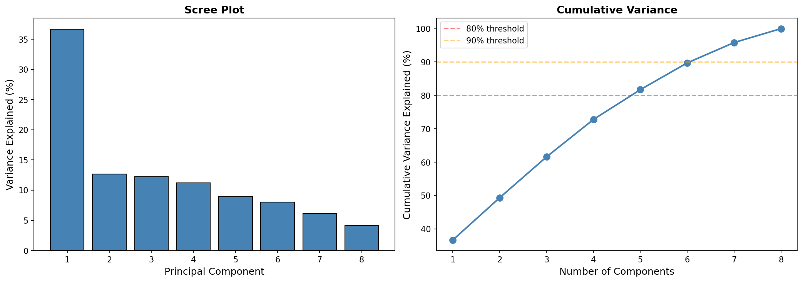
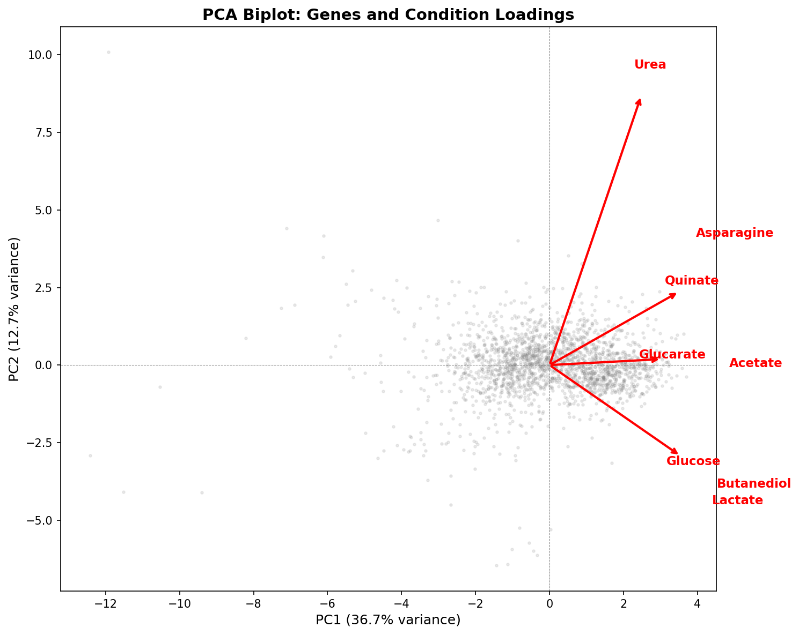
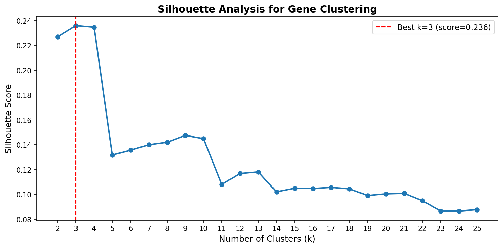
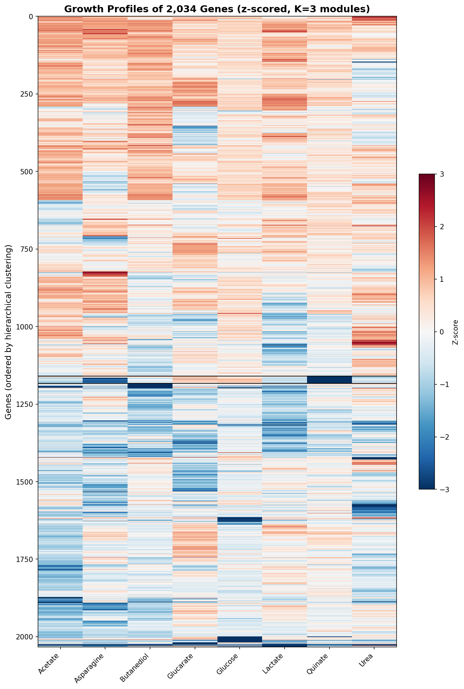
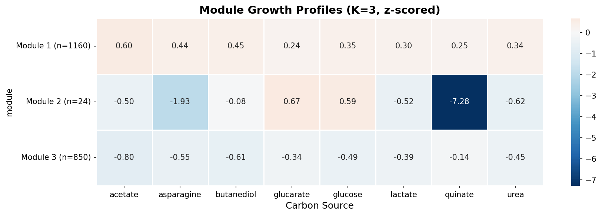
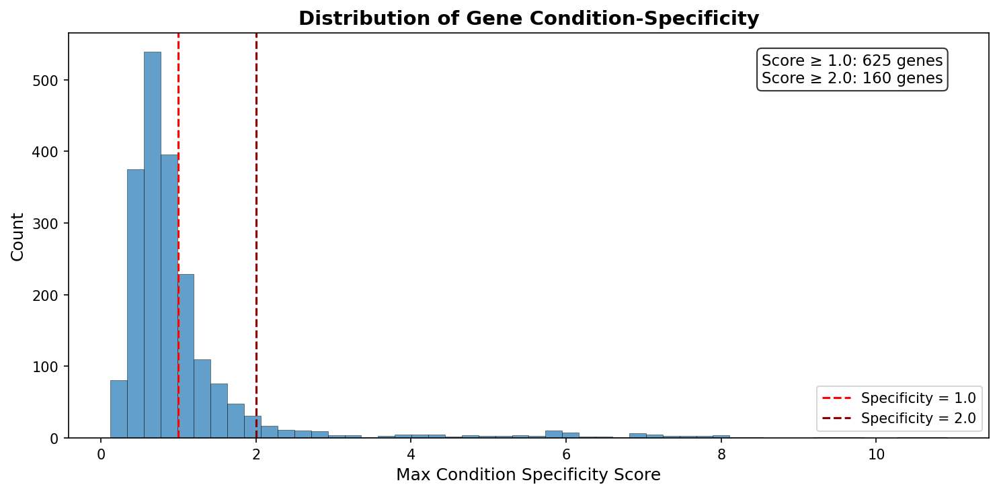
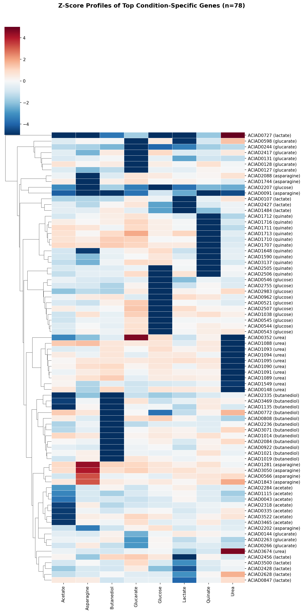
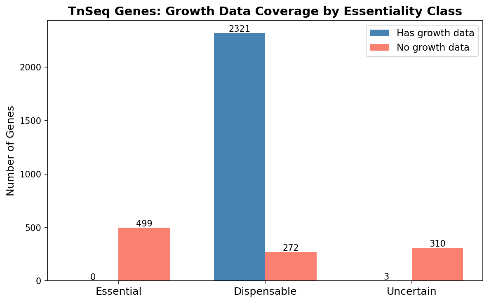
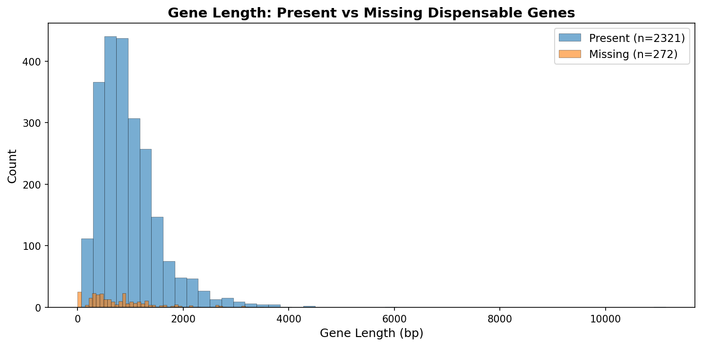

# Report: ADP1 Deletion Collection Phenotype Analysis

## Key Findings

### 1. Carbon sources define a three-tier essentiality landscape

The 8 carbon sources partition into demanding, moderate, and robust tiers based on the fraction of genes showing growth defects. Urea is the most demanding (97.9% of genes show severe defects at ratio < 0.5), while quinate is the most robust (only 1.6% defective). This tier structure is consistent across multiple thresholds.

| Tier | Conditions | Mean growth ratio | % genes with defects (ratio < 0.8) |
|------|-----------|-------------------|-------------------------------------|
| Demanding | Urea, Acetate, Butanediol | 0.41–0.65 | 95–100% |
| Moderate | Asparagine, Lactate | 0.80–0.82 | 37–45% |
| Robust | Glucarate, Glucose, Quinate | 1.25–1.36 | 0.5–2.4% |

*(Notebook: 01_data_extraction.ipynb)*

### 2. Conditions are largely independent — 5 PCs capture 82% of variance

PCA of the 2,034×8 growth matrix reveals that 5 principal components are needed to capture 82% of the variance. PC1 (36.7%) represents general growth sensitivity — all conditions load positively. PC2 (12.7%) isolates urea (loading = +0.75), separating nitrogen metabolism from carbon metabolism. The remaining PCs distinguish specific carbon source pairs.

Pairwise Pearson correlations between conditions are moderate at best (highest: acetate–butanediol, r = 0.58; median across all 28 pairs: r = 0.25). This means the 8 conditions provide approximately 5 independent dimensions of phenotypic information — far more than the 2-group (demanding vs robust) model would suggest.

*(Notebook: 02_condition_structure.ipynb)*

### 3. The phenotype landscape is a continuum, not discrete modules

Hierarchical clustering of genes by their 8-condition growth profiles produces an optimal K = 3 with a low silhouette score (0.24). The two large modules (1,160 and 850 genes) represent broad "generally sensitive" vs "generally tolerant" groups without any specific functional enrichment surviving FDR correction. This indicates that gene essentiality varies continuously across conditions rather than falling into discrete functional categories.

The one exception is a small module of 24 genes with extreme quinate-specific defects (mean z-score = -7.28 on quinate, near-zero on other conditions). These are the aromatic degradation pathway genes, which form the only discrete phenotypic module in the dataset.

*(Notebook: 03_gene_modules.ipynb)*

### 4. Condition-specific genes reveal the metabolic architecture of ADP1

625 genes (31%) have a condition specificity score ≥ 1.0, meaning their growth importance is concentrated on one carbon source. The top condition-specific genes for each carbon source correspond precisely to the expected metabolic pathways:

| Condition | Top specific genes | Pathway |
|-----------|-------------------|---------|
| **Quinate** | pcaC, pcaG, pcaH, pcaB, quiA, quiB, pqqC, pqqD | Protocatechuate/quinate degradation + PQQ biosynthesis |
| **Urea** | ureA, ureB, ureC, ureD, ureE, ureF, ureG | Urease complex (all 7 subunits/accessory proteins) |
| **Asparagine** | aspartate ammonia-lyase, L-asparaginase | Asparagine catabolism |
| **Acetate** | fadB, malate synthase G, citB | Fatty acid β-oxidation + glyoxylate shunt |
| **Glucarate** | gudD, D-glucarate transporter, 2,5-dioxovalerate dehydrogenase | Glucarate degradation |
| **Glucose** | eda, gntT, gluconokinase, glucose dehydrogenase (PQQ) | Entner-Doudoroff pathway + PQQ-glucose dehydrogenase |
| **Butanediol** | 2,3-butanediol dehydrogenase, E2 acetyltransferase | Butanediol catabolism + acetoin pathway |
| **Lactate** | lldR, cyoC/cyoD | Lactate regulation + cytochrome oxidase |

The quinate-specific gene set (51 genes at spec > 0.5, z < -1) extends beyond the core degradation pathway to include NADH-ubiquinone oxidoreductase subunits (Complex I), suggesting that aromatic catabolism places unique demands on the electron transport chain. PQQ biosynthesis genes appear as condition-specific for both quinate and glucose, consistent with PQQ-dependent dehydrogenases catalyzing the first step of both pathways.

*(Notebook: 04_condition_specific.ipynb)*

### 5. Missing dispensable genes are shorter, less conserved, and enriched for hypotheticals

Of 2,593 TnSeq-dispensable genes, 272 (10.5%) lack growth data from the deletion collection. These missing genes are systematically different from the 2,321 present dispensable genes:

| Property | Present (n=2,321) | Missing (n=272) | Significance |
|----------|-------------------|-----------------|--------------|
| Mean length | 981 bp | 813 bp | Shorter |
| RAST annotated | 100% | 91% | Less annotated |
| KO annotated | 59% | 49% | Less annotated |
| Pangenome core | 93.3% | 76.5% | Less conserved (p = 1.4×10⁻²⁰) |

Hypothetical proteins are massively enriched among missing genes (25 completely unannotated, q = 2.4×10⁻²⁵; 48 annotated as "hypothetical protein", q = 3.0×10⁻⁴). The 313 uncertain-class genes are even more distinctive: 361 bp mean length, 42% annotated, 31% core — consistent with gene fragments or pseudogenes rather than true essential genes.

*(Notebook: 05_tnseq_gap.ipynb)*

## Results

### Growth Matrix Structure

The complete growth matrix consists of 2,034 genes with growth ratio measurements on all 8 carbon sources. Growth ratios represent mutant/wild-type ratios, where values < 1.0 indicate growth defects and values > 1.0 indicate no defect (or slight growth advantage due to experimental normalization). The conditions span a 3.3-fold range in mean growth ratio (0.41 for urea to 1.36 for quinate).

### Condition Independence

The low pairwise correlations (median Pearson r = 0.25, maximum r = 0.58) demonstrate that each carbon source imposes a largely independent set of gene requirements. The PCA confirms this: no single component captures more than 37% of variance, and 5 components are needed for 82%. This contrasts with chemical genomics studies in *E. coli* (Nichols et al. 2011) where many conditions produce correlated fitness profiles. The difference likely reflects the diversity of metabolic entry points represented by these carbon sources — each enters central metabolism at a different point.

### Module Structure vs Gradient

The low silhouette score (0.24) across all tested k values (2–25) indicates that the phenotypic landscape lacks natural cluster boundaries. Most genes vary gradually in their condition sensitivity rather than falling into discrete response groups. This is consistent with Guzman et al. (2018)'s proposal that essentiality is a continuous variable — our data shows this continuity manifests as a gradient across conditions, not as discrete functional modules.

## Interpretation

### Literature Context

- The condition-specificity of the quinate/protocatechuate degradation pathway genes aligns with Fischer et al. (2008), who showed that ADP1's aromatic degradation operons are coordinately regulated and carbon-source-dependent. Our specificity scores quantify this coordinate regulation genome-wide.

- The finding that gene essentiality is condition-dependent and continuous supports the "adaptive flexibility" framework of Guzman et al. (2018), who argued that binary essential/non-essential classifications miss condition-dependent effects. Our 625 condition-specific genes (31% of the complete matrix) demonstrate that nearly one-third of the dispensable genome has condition-specific importance.

- Nichols et al. (2011) found that chemical-genetic profiles in *E. coli* define "phenotypic modules" extending beyond operon boundaries. We do NOT find discrete modules in ADP1 — only a continuous gradient with one exception (the 24-gene quinate module). This may reflect differences between single-gene deletions (this study) and chemical perturbations (Nichols et al.), or may indicate that ADP1's metabolic architecture is more interconnected than *E. coli*'s.

- Wetmore et al. (2015) demonstrated that RB-TnSeq across diverse conditions identifies condition-specific gene functions. Our analysis uses single-gene deletions rather than TnSeq, but reaches the same conclusion: condition-specific phenotyping dramatically increases the functional annotation yield. The 625 condition-specific genes include many with known functions that would not be detected on a single carbon source.

- Rosconi et al. (2022) showed that bacterial pangenome variation makes gene essentiality strain-dependent and evolvable. Our finding that the 272 missing dispensable genes are less conserved (76.5% core vs 93.3%) connects condition-dependent essentiality to pangenome dynamics — the least conserved genes are also the ones most likely to be missed by deletion collection construction.

### Novel Contribution

The BERDL-integrated analysis adds three insights not available from the original de Berardinis et al. (2008) data:

1. **Quantitative condition independence**: The PCA and correlation analysis show that the 8 conditions provide ~5 independent dimensions of phenotypic information, substantially more than the binary demanding/robust classification would suggest.

2. **Gradient vs module architecture**: The failure of clustering to find discrete functional modules (silhouette = 0.24, no enrichments survive FDR) is itself informative — it means the phenotype landscape is a continuum. The quinate degradation pathway is the sole exception, forming the only discrete phenotypic module.

3. **Pangenome context for the coverage gap**: By cross-referencing with BERDL pangenome data, we show that the 272 missing dispensable genes are significantly less conserved across *Acinetobacter* species, suggesting that gene dispensability and pangenome status are linked through evolutionary retention pressure.

### Limitations

- Growth ratios are single-timepoint measurements with unknown technical noise. The condition specificity analysis assumes that variation across conditions reflects biology, not measurement error.
- The complete matrix (2,034 genes) excludes essential genes (499) and genes with incomplete data (316), biasing toward dispensable genes with successful deletion mutants.
- Only 8 carbon sources were tested. The ~5 independent dimensions may increase with more conditions.
- The pangenome core/accessory status comes from BERDL's species-level pangenome for *A. baylyi*, which may have limited resolution compared to a population-level analysis.

## Data

### Sources

| Collection | Tables Used | Purpose |
|------------|-------------|---------|
| User-provided SQLite (`berdl_tables.db`) | `genome_features` | Growth ratios, TnSeq essentiality, functional annotations for 5,852 ADP1 genes |
| `kbase_ke_pangenome` | Pangenome cluster IDs and core/accessory status | Cross-referenced via pangenome_cluster_id column in genome_features |

### Generated Data

| File | Rows | Description |
|------|------|-------------|
| `data/growth_matrix_complete.csv` | 2,034 | Genes with growth data on all 8 conditions |
| `data/growth_matrix_all.csv` | 2,350 | Genes with growth data on any condition |
| `data/all_genes_annotated.csv` | 5,852 | All genes with annotations and TnSeq classification |
| `data/gene_modules.csv` | 2,034 | Gene-to-module assignments (K=3) |
| `data/module_enrichment.csv` | 0 | No significant enrichments after FDR correction |
| `data/condition_specific_genes.csv` | 2,034 | Genes with per-condition specificity scores |
| `data/tnseq_gap_analysis.csv` | 3,405 | TnSeq genes with gap classification |

## Supporting Evidence

### Notebooks

| Notebook | Purpose |
|----------|---------|
| `01_data_extraction.ipynb` | Load growth matrix from SQLite, validate distributions, save data files |
| `02_condition_structure.ipynb` | PCA, correlation analysis, hierarchical clustering of 8 conditions |
| `03_gene_modules.ipynb` | Cluster 2,034 genes by growth profile, silhouette analysis, functional enrichment |
| `04_condition_specific.ipynb` | Compute condition specificity scores, identify top genes per condition |
| `05_tnseq_gap.ipynb` | Characterize 272 missing dispensable genes, compare to present genes |

### Figures

| Figure | Description |
|--------|-------------|
| `growth_distributions.png` | Histograms of growth ratios per condition |
| `condition_boxplots.png` | Box plots comparing growth defect severity across conditions |
| `condition_correlations.png` | Pearson and Spearman correlation heatmaps |
| `condition_correlation_preview.png` | Initial correlation preview from NB01 |
| `condition_clustermap.png` | Clustered correlation heatmap with dendrograms |
| `condition_dendrogram.png` | Hierarchical clustering dendrogram of conditions |
| `pca_variance.png` | Scree plot and cumulative variance explained |
| `pca_biplot.png` | PCA biplot with gene scores and condition loadings |
| `silhouette_analysis.png` | Silhouette scores for K=2 to K=25 |
| `gene_heatmap.png` | Z-scored growth profiles of all 2,034 genes |
| `module_profiles.png` | Mean z-score profiles per module |
| `specificity_distribution.png` | Distribution of max condition specificity scores |
| `condition_specific_heatmap.png` | Z-score heatmap of top condition-specific genes |
| `tnseq_gap_coverage.png` | TnSeq essentiality class vs growth data coverage |
| `missing_gene_length.png` | Gene length comparison: present vs missing dispensable genes |

## Future Directions

1. **Higher-resolution clustering**: Apply independent component analysis (ICA) instead of hierarchical clustering to extract condition-specific signals from the gradient landscape. ICA may find latent factors that hierarchical clustering misses.
2. **Cross-species comparison**: Compare ADP1 condition specificity profiles with RB-TnSeq data from the Fitness Browser for organisms grown on overlapping carbon sources (e.g., glucose, lactate). Are the same functional pathways condition-specific across species?
3. **Regulatory network inference**: Use the condition-specific gene sets to infer regulatory relationships — genes that are co-specific for a condition may share transcriptional regulators.
4. **Expanded condition panel**: The ~5 independent dimensions from 8 conditions suggests that additional carbon sources, nitrogen sources, or stress conditions would substantially increase the phenotypic resolution.

## References

- de Berardinis V et al. (2008). "A complete collection of single-gene deletion mutants of Acinetobacter baylyi ADP1." *Molecular Systems Biology* 4:174. PMID: 18319726
- Durot M et al. (2008). "Genome-scale models of bacterial metabolism: reconstruction and applications." *FEMS Microbiology Reviews* 33(1):164-190.
- Fischer R et al. (2008). "Catabolite repression of aromatic compound degradation in Acinetobacter baylyi." *Journal of Bacteriology* 190(5):1759-1767.
- Guzman GI et al. (2018). "Reframing gene essentiality in terms of adaptive flexibility." *BMC Systems Biology* 12(1):143.
- Nichols RJ et al. (2011). "Phenotypic landscape of a bacterial cell." *Cell* 144(1):13-24.
- Rosconi F et al. (2022). "A bacterial pan-genome makes gene essentiality strain-dependent and evolvable." *Nature Microbiology* 7:1580-1592.
- Stuani L et al. (2014). "Novel metabolic features in Acinetobacter baylyi ADP1 revealed by a multiomics approach." *Metabolomics* 10(6):1223-1238. PMID: 25374488
- Wetmore KM et al. (2015). "Rapid quantification of mutant fitness in diverse bacteria by sequencing randomly bar-coded transposons." *mBio* 6(3):e00306-15. PMID: 25968644
