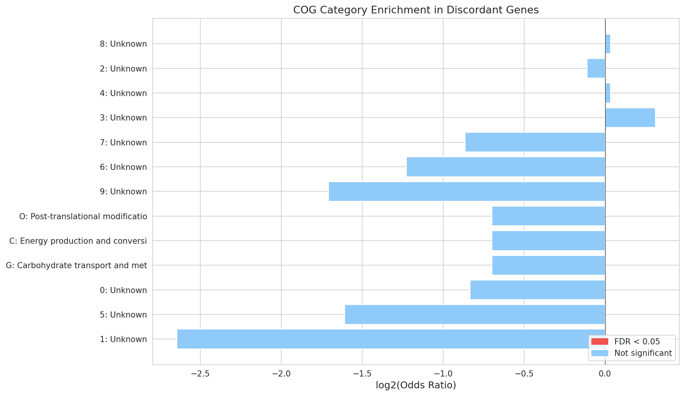
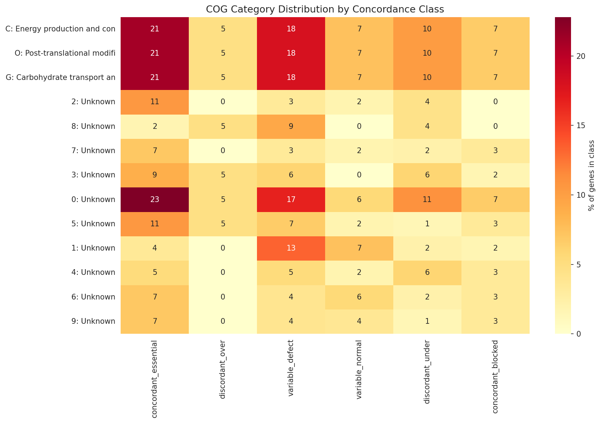

# Report: ADP1 Triple Essentiality Concordance

## Key Findings

### 1. FBA Essentiality Class Does Not Predict Growth Defects Among Dispensable Genes

Among 478 triple-covered genes (all TnSeq-dispensable), FBA class was **not significantly associated** with growth defect status (chi-squared = 0.93, p = 0.63, 2 df). Growth defect rates were nearly identical across FBA classes: essential 73.1%, variable 73.5%, blocked 69.4%. The Kruskal-Wallis test on mean growth rates was also non-significant (H = 1.67, p = 0.43).

This is the central negative finding: FBA's binary classification of genes as essential, variable, or blocked does not predict which TnSeq-dispensable genes have measurable growth defects.

*(Notebook: 02_concordance_analysis.ipynb)*

### 2. Growth Measurements Cannot Break FBA-TnSeq Ties

The hypothesis was that growth measurements could adjudicate when FBA and TnSeq disagree. Since all 478 triple-covered genes are TnSeq-dispensable (a biological constraint — TnSeq-essential genes have no viable mutants), the "discordant" genes are the 78 FBA-essential ones. Among these:

- 57/78 (73%) showed growth defects — but this matches the background rate (72% of all 478 genes)
- 21/78 (27%) grew normally — FBA over-predicts

For FBA-blocked genes (zero predicted flux, n=196):
- 136/196 (69%) showed growth defects — FBA under-predicts
- 60/196 (31%) grew normally — consistent with FBA

Growth measurements do not differentially validate FBA-essential vs FBA-blocked predictions because the growth defect rate is uniform across all FBA classes.

*(Notebook: 02_concordance_analysis.ipynb)*

### 3. Condition-Specific FBA Flux Shows Weak, Mixed Correlations with Growth

Per-condition FBA flux predictions showed weak Spearman correlations with measured growth rates across 6 matched carbon sources:

| Condition | n genes | Spearman rho | p-value | Sig. |
|-----------|---------|-------------|---------|------|
| Glucose | 387 | -0.021 | 0.677 | ns |
| Acetate | 352 | -0.153 | 0.004 | ** |
| Asparagine | 286 | -0.257 | <0.001 | *** |
| Butanediol | 137 | -0.145 | 0.092 | ns |
| Glucarate | 127 | +0.246 | 0.005 | ** |
| Lactate | 135 | -0.160 | 0.065 | ns |

Asparagine showed the strongest correlation (rho = -0.257), and the negative direction is biologically expected: higher FBA flux through a gene → greater growth impact when deleted. However, glucarate showed a **positive** correlation (rho = +0.246), opposite to prediction, suggesting condition-specific model inaccuracies.

*(Notebook: 02_concordance_analysis.ipynb)*

### 4. Growth Defects Are Partially Condition-Specific

Of 478 genes, 333 (70%) showed condition-specific growth defects (defect on some but not all conditions). Only 10 genes (2%) had defects across all 8 conditions, and 135 (28%) had no defect on any condition. Mean pairwise defect correlation across conditions was 0.38 (range: -0.03 to 1.0), indicating moderate but not complete overlap in the gene sets required for growth on different carbon sources.

*(Notebook: 02_concordance_analysis.ipynb)*

### 5. Discordant Genes Show No Functional or Pangenome Enrichment

157/478 genes (33%) were discordant (FBA prediction disagrees with growth phenotype). Discordance was asymmetric: 136 genes were FBA-under-predicted (blocked + growth defect) vs only 21 FBA-over-predicted (essential + normal growth).

No COG category was significantly enriched in discordant genes after FDR correction (all q > 0.05). However, COG annotation coverage was low (62/478, 13%), limiting statistical power. Pangenome status was overwhelmingly core across all classes (93–100%), with no significant enrichment in discordant genes (Fisher OR = 0.89, p = 0.80).

FBA-under-predicted genes (blocked but with growth defects) included acetyltransferases, aromatic compound degradation enzymes (4-carboxymuconolactone decarboxylase, beta-ketoadipate enol-lactone hydrolase), sulfonate transport genes, and oxidative stress response genes — suggesting pathways not well-captured by the FBA model.

*(Notebook: 03_discordant_characterization.ipynb)*

## Results

### Data Assembly

The triple-covered gene set was defined as genes with all three measures: TnSeq essentiality (minimal media), FBA class (minimal media), and at least one mutant growth measurement. This yielded **478 genes** from the 5,852 total in the ADP1 genome.

Key properties of the triple set:
- All 478 are TnSeq-dispensable (expected: TnSeq-essential genes lack viable mutants)
- FBA class: 78 essential (16%), 204 variable (43%), 196 blocked (41%)
- Growth data available for 449–469 genes per condition (94–98% coverage)
- Growth defect threshold: 25th percentile per condition
- 72% of genes showed a growth defect on at least one of 8 conditions
- Per-condition FBA flux available for 6 of 8 conditions (131–406 genes)
- 477/478 genes mapped to pangenome clusters (96% core)

### FBA-Growth Agreement

The concordance rate (FBA-essential with defect + FBA-blocked without defect) was 117/274 = 42.7% — worse than random chance (50%) — because the high background rate of growth defects (72%) means most FBA-blocked genes also show defects.

Pairwise Mann-Whitney U tests confirmed no significant growth rate differences between FBA classes (essential vs variable: p=0.26; essential vs blocked: p=0.93; variable vs blocked: p=0.29).

### COG Distribution by Concordance Class

The COG category composition was broadly similar across concordance classes, with energy production (C), carbohydrate metabolism (G), and post-translational modification (O) represented across all classes.

## Interpretation

### The Negative Finding Is Informative

The central result — FBA class does not predict growth defects among TnSeq-dispensable genes — is biologically meaningful rather than a methodological failure. It reveals a fundamental limitation of binary FBA essentiality classification:

1. **FBA essentiality is a threshold concept**: FBA predicts whether a gene knockout reduces growth to zero, not the magnitude of growth reduction. A gene with 95% of wild-type growth and a gene with 5% are both "dispensable" to TnSeq and may both be "essential" or "blocked" in FBA depending on flux routing.

2. **Growth assays measure a continuum**: The mutant growth data captures a continuous spectrum of fitness effects that the binary FBA classification cannot resolve.

3. **The 72% background defect rate is high**: Using a Q25 threshold across 8 conditions means most genes will show at least one growth defect somewhere, diluting the signal.

### Literature Context

- **Durot et al. (2008)** reported ~75% concordance between FBA and TnSeq essentiality for ADP1, comparing essential vs dispensable predictions. Our analysis addresses a different question — within TnSeq-dispensable genes, does FBA predict growth importance — and finds it does not. This is consistent with Durot's finding that FBA works best for the binary essential/dispensable boundary but poorly for quantitative growth predictions.

- **Guzman et al. (2018)** argued for "reframing gene essentiality in terms of adaptive flexibility," proposing that gene importance is condition-dependent and continuous rather than binary. Our finding of condition-specific growth defects (70% of genes) strongly supports this framework.

- **Boone (2025)** found that FBA achieves an F1-Score of ~0.40 for essential gene prediction, suggesting topology-based methods outperform FBA. Our finding that FBA class doesn't predict graded growth effects adds further evidence that FBA's binary essentiality predictions have limited resolution.

- **Suárez et al. (2020)** used both FBA and Tn-Seq to guide ADP1 genome streamlining, combining both methods. Our results suggest that neither method alone captures the full picture — growth measurements add an independent, graded axis that neither FBA nor TnSeq provides.

### Novel Contribution

This analysis provides the first systematic three-way comparison of FBA predictions, TnSeq essentiality, and direct mutant growth phenotypes for ADP1. The key novel finding is that FBA's distinction between essential, variable, and blocked genes carries **no predictive power for growth defect status** among dispensable genes (p = 0.63). This suggests that:

1. The growth defect information in mutant growth assays is orthogonal to what FBA captures
2. FBA essentiality and TnSeq essentiality measure the same binary boundary (can the cell grow at all?) but neither captures quantitative fitness effects
3. Growth assays on multiple carbon sources provide genuinely independent information about gene importance

### Limitations

1. **Q25 threshold is arbitrary**: The 25th percentile cutoff for "growth defect" was chosen for simplicity. Different thresholds could change defect rates but are unlikely to change the null relationship with FBA class.
2. **Low COG annotation coverage**: Only 13% of triple genes have COG annotations, severely limiting enrichment analysis power. KEGG coverage was better (85%).
3. **All genes are TnSeq-dispensable**: By construction, TnSeq-essential genes cannot be in this analysis. The 74% FBA-TnSeq concordance from the explorer project applies to the full set; this analysis addresses only the dispensable subset.
4. **Growth data uses ratios, not absolute rates**: The growth measurements are ratios relative to wild-type, which may compress or distort the dynamic range of fitness effects.
5. **FBA model vintage**: The ADP1 FBA model may not capture all metabolic pathways, particularly for non-standard carbon sources. The positive glucarate correlation (opposite to expected) suggests condition-specific model gaps.

## Data

### Sources
| Collection | Tables Used | Purpose |
|------------|-------------|---------|
| `user_data/berdl_tables.db` | `genome_features`, `gene_phenotypes` | TnSeq essentiality, FBA classes, mutant growth rates, per-condition FBA flux |
| `kbase_ke_pangenome` | via `cluster_id_mapping.csv` | Core/accessory gene classification |

### Generated Data
| File | Rows | Description |
|------|------|-------------|
| `data/triple_gene_table.csv` | 478 | Integrated table: TnSeq + FBA + growth + annotations for triple-covered genes |
| `data/cluster_id_mapping.csv` | 4,891 | BERDL-to-ADP1 pangenome cluster ID mappings |

## Supporting Evidence

### Notebooks
| Notebook | Purpose |
|----------|---------|
| `01_data_assembly.ipynb` | Build 478-gene triple table from SQLite, define growth defect thresholds, join FBA flux and pangenome annotations |
| `02_concordance_analysis.ipynb` | Triple concordance matrix, Kruskal-Wallis/Mann-Whitney tests, condition-specific FBA flux vs growth correlations |
| `03_discordant_characterization.ipynb` | COG enrichment (Fisher exact + BH-FDR), pangenome status, functional annotation of discordant genes |

### Figures
| Figure | Description |
|--------|-------------|
| `data_assembly_overview.png` | FBA class distribution, growth defect by condition, concordance class counts |
| `growth_rate_distributions.png` | Per-condition growth rate histograms with Q25 thresholds |
| `fba_growth_concordance.png` | FBA class vs growth defect heatmap and defect rate bar chart |
| `growth_by_fba_class.png` | Violin and box plots of growth rate by FBA class |
| `flux_vs_growth_scatter.png` | Per-condition FBA flux vs growth rate scatter plots with Spearman correlations |
| `defect_condition_correlation.png` | Inter-condition growth defect correlation heatmap |
| `cog_enrichment_discordant.png` | COG category enrichment in discordant genes (log2 odds ratio) |
| `pangenome_discordance.png` | Core gene fraction by concordance class |
| `cog_by_discordance_class.png` | COG category distribution heatmap across concordance classes |

## Future Directions

1. **Continuous FBA flux analysis**: Instead of binary FBA class, use the continuous `minimal_media_flux` values to predict growth rate magnitude. Linear or rank-based regression may capture what the categorical classification misses.
2. **FBA with growth rate constraints**: Use experimental growth rates as constraints in FBA to identify which metabolic bottlenecks the model misses — a data-driven model refinement approach (following Durot et al. 2008).
3. **Condition-specific FBA simulations**: Run FBA on each carbon source separately (not just minimal media) and compare condition-matched predictions against condition-matched growth data.
4. **Improved functional annotation**: The low COG coverage (13%) limited enrichment analysis. Using eggNOG-mapper or InterProScan on the full gene set would enable more powerful functional characterization of discordant genes.
5. **Expand to other Acinetobacter species**: Test whether the FBA-growth relationship holds across the 14-genome pangenome, particularly for species with different metabolic capabilities.

## References

- Durot M, Le Fèvre F, de Berardinis V, Kreimeyer A, Vallenet D, Combe C, Smidtas S, Salanoubat M, Weissenbach J, Schachter V (2008). "Iterative reconstruction of a global metabolic model of Acinetobacter baylyi ADP1 using high-throughput growth phenotype and gene essentiality data." *BMC Systems Biology* 2:85.
- de Berardinis V, Vallenet D, Castelli V, Besnard M, Pinet A, Cruaud C, Samair S, Lechaplais C, Gyapay G, Riber C, Zaber F, Pelletier E, Weissenbach J, Salanoubat M (2008). "A complete collection of single-gene deletion mutants of Acinetobacter baylyi ADP1." *Molecular Systems Biology* 4:174.
- Guzman GI, Olson CA, Hefner Y, Phaneuf PV, Catoiu E, Crepaldi LB, Mih N, Feist AM, Palsson BO (2018). "Reframing gene essentiality in terms of adaptive flexibility." *BMC Systems Biology* 12:143.
- Suárez GA, Dugan KR, Renda BA, Dasgupta A, Barrick JE (2020). "Rapid and assured genetic engineering methods applied to Acinetobacter baylyi ADP1 genome streamlining." *Nucleic Acids Research* 48(8):4585-4600.
- Boone J (2025). "A topology-based machine learning model decisively outperforms flux balance analysis in predicting metabolic gene essentiality." *arXiv* 2507.20406.
