# Triple Essentiality Concordance Analysis for *Acinetobacter baylyi* ADP1

## Executive Summary

This study evaluates the concordance between computational (FBA), genetic (RB-TnSeq), and experimental (knockout phenotypes, mutant growth rates, proteomics) methods for predicting gene essentiality in *Acinetobacter baylyi* ADP1. We conducted two complementary analyses:

1. **Original Study (Dehal, 2026-02-18)**: Among TnSeq-dispensable genes, does FBA correctly predict which ones have growth defects? Can mutant growth measurements resolve FBA-TnSeq disagreements?

2. **Refined Study (Henry, 2026-02-19)**: Comprehensive comparison of FBA, RB-TnSeq (at multiple thresholds), knockout experiments, and proteomics expression across rich and minimal media conditions.

**Key Findings**:
- **Fitness is the best predictor of essentiality** (AUC=0.70-0.73), outperforming binary essentiality_fraction (AUC<0.5). Use continuous fitness scores, not binary classifications, for TnSeq analysis.
- **FBA shows moderate concordance** with experimental knockouts (κ≈0.49, F1≈0.62-0.67) but **does not predict growth defects** among TnSeq-dispensable genes (p=0.63)
- **RB-TnSeq systematically disagrees** with knockout experiments (κ<0 across all thresholds), measuring fitness cost rather than lethality
- **Proteomics strongly correlates** with essentiality (r=0.35, AUC=0.74): essential genes are expressed 6.5-fold higher
- **Aromatic degradation genes** are enriched among FBA-discordant genes (OR=9.7), revealing systematic model gaps
- **Different methods measure different biology**: FBA captures metabolic necessity, KO measures lethality, TnSeq measures fitness cost, proteomics indicates expression requirement, and growth measurements capture condition-specific optimization

---

## Table of Contents

1. [Part I: Original Triple Essentiality Study](#part-i-original-triple-essentiality-study)
2. [Part II: Refined Comprehensive Analysis](#part-ii-refined-comprehensive-analysis)
3. [What's Different Between the Studies](#whats-different-in-the-refined-study)
4. [Integrated Discussion](#integrated-discussion)
5. [Integrated Conclusions](#integrated-conclusions)
6. [Recommendations](#recommendations)
7. [Data Availability](#data-availability)
8. [Methods](#methods)
9. [References](#references)

---

## Part I: Original Triple Essentiality Study

### Research Question

Among genes that TnSeq says are dispensable in *Acinetobacter baylyi* ADP1, does FBA correctly predict which ones have growth defects? Can direct mutant growth rate measurements serve as an independent axis to evaluate where computational (FBA) and genetic (TnSeq) methods agree or disagree?

### Methods

#### Data Sources
- **TnSeq essentiality**: Binary classification from Fitness Browser (minimal media)
- **FBA predictions**: Essential, variable, or blocked from ModelSEED metabolic model (minimal media)
- **Mutant growth rates**: Deletion mutant growth on 8 carbon sources (glucose, acetate, asparagine, butanediol, glucarate, lactate, pyruvate, succinate) from de Berardinis et al. (2008)
- **Gene annotations**: COG categories, KEGG pathways, RAST functions, pangenome cluster assignments
- **Per-condition FBA flux**: From `gene_phenotypes` table for 6 matched carbon sources

#### Key Constraint
All 478 triple-covered genes (having TnSeq + FBA + growth data) are **TnSeq-dispensable** on minimal media. This is biologically expected — TnSeq-essential genes have no viable deletion mutants, so they cannot have growth rate measurements. The analysis therefore asks: **among dispensable genes, does FBA correctly predict which ones matter for growth?**

#### Analysis Approach
1. Define growth defect threshold: 25th percentile (Q25) per condition
2. Test FBA class vs growth defect association (chi-squared, Kruskal-Wallis)
3. Sensitivity analysis: Q10–Q40 thresholds
4. Condition-specific FBA flux vs growth rate correlations (Spearman)
5. Functional characterization of discordant genes (Fisher's exact test with BH-FDR)

### Key Findings

#### Finding 1: FBA Does Not Predict Growth Defects Among TnSeq-Dispensable Genes

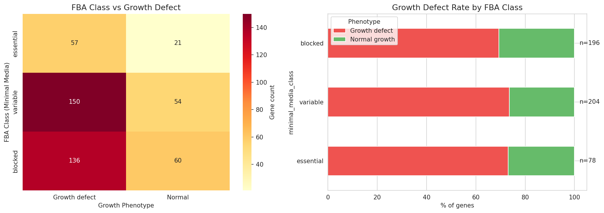

Among 478 triple-covered genes (all TnSeq-dispensable), FBA class was **not significantly associated** with growth defect status (chi-squared = 0.93, p = 0.63, 2 df). Growth defect rates were nearly identical across FBA classes:
- **FBA-essential**: 73.1% (57/78 genes)
- **FBA-variable**: 73.5% (150/204 genes)
- **FBA-blocked**: 69.4% (136/196 genes)

The Kruskal-Wallis test on mean growth rates was also non-significant (H = 1.67, p = 0.43).

**Interpretation**: FBA's binary classification of genes as essential, variable, or blocked does not predict which TnSeq-dispensable genes have measurable growth defects. This is the central negative finding.

---

#### Finding 2: The Null Result Is Robust Across Growth Defect Thresholds

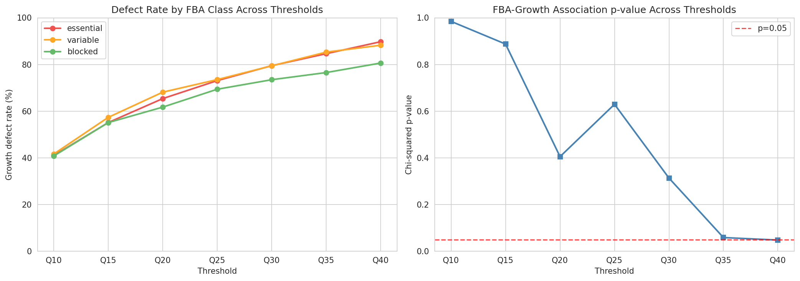

A sensitivity analysis testing seven thresholds (Q10 through Q40) confirmed that the null result is not an artifact of the Q25 cutoff:

| Threshold | % with defect | Essential rate | Variable rate | Blocked rate | chi-squared p |
|-----------|--------------|----------------|---------------|--------------|---------------|
| Q10 | 41% | 41% | 42% | 41% | 0.985 |
| Q15 | 56% | 55% | 57% | 55% | 0.887 |
| Q20 | 65% | 65% | 68% | 62% | 0.405 |
| **Q25** | **72%** | **73%** | **74%** | **69%** | **0.629** |
| Q30 | 77% | 79% | 79% | 73% | 0.313 |
| Q35 | 82% | 85% | 85% | 77% | 0.058 |
| Q40 | 85% | 90% | 88% | 81% | 0.048 |

The chi-squared p-value remained above 0.05 for thresholds Q10–Q35. Only at Q40 did a marginal association appear (p = 0.048), driven by a slight divergence in FBA-essential vs FBA-blocked defect rates (90% vs 81%). The threshold-independent Kruskal-Wallis test on continuous mean growth rates confirms no association (H = 1.67, p = 0.43).

---

#### Finding 3: Growth Measurements Cannot Break FBA-TnSeq Ties

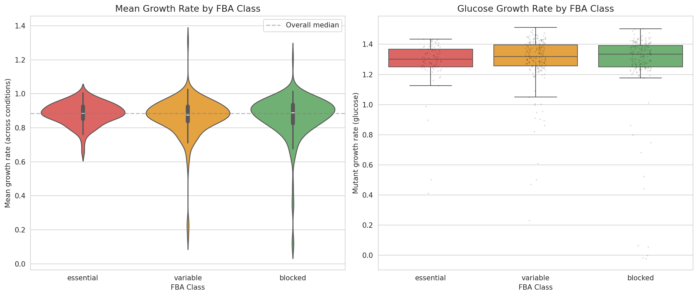

The hypothesis was that growth measurements could adjudicate when FBA and TnSeq disagree. Since all 478 triple-covered genes are TnSeq-dispensable, the "discordant" genes are the 78 FBA-essential ones. Among these:

- **57/78 (73%)** showed growth defects — but this matches the background rate (72% of all 478 genes)
- **21/78 (27%)** grew normally — FBA over-predicts

For FBA-blocked genes (zero predicted flux, n=196):
- **136/196 (69%)** showed growth defects — FBA under-predicts
- **60/196 (31%)** grew normally — consistent with FBA

Growth measurements do not differentially validate FBA-essential vs FBA-blocked predictions because the growth defect rate is uniform across all FBA classes.

---

#### Finding 4: Condition-Specific FBA Flux Shows Weak, Mixed Correlations with Growth

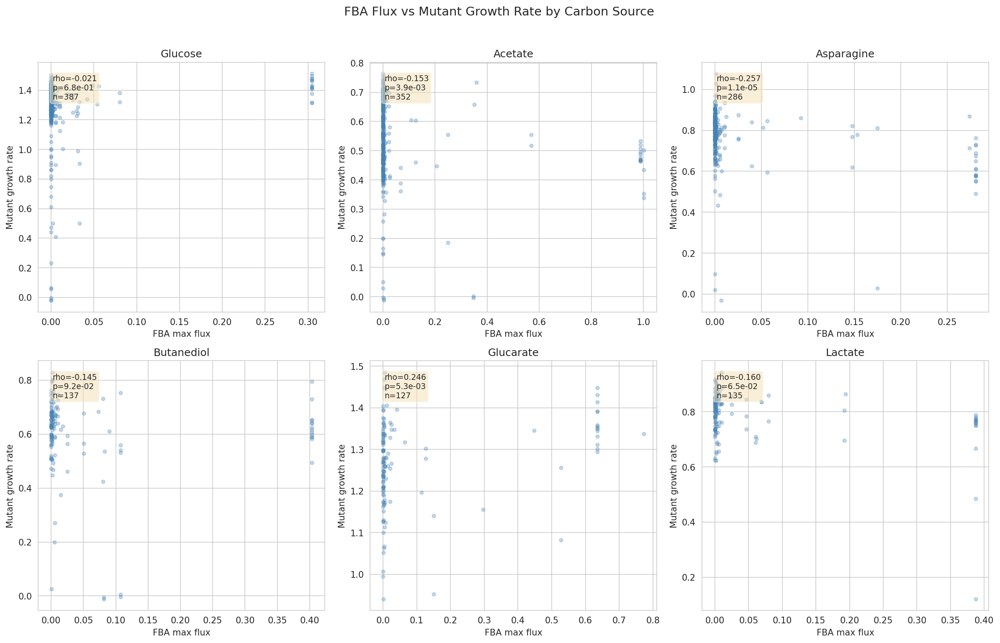

Per-condition FBA flux predictions showed weak Spearman correlations with measured growth rates across 6 matched carbon sources:

| Condition | n genes | Spearman ρ | p-value | Sig. | Interpretation |
|-----------|---------|-----------|---------|------|----------------|
| Glucose | 387 | -0.021 | 0.677 | ns | No correlation |
| Acetate | 352 | -0.153 | 0.004 | ** | Weak negative |
| Asparagine | 286 | -0.257 | <0.001 | *** | **Strongest** |
| Butanediol | 137 | -0.145 | 0.092 | ns | Weak trend |
| Glucarate | 127 | **+0.246** | 0.005 | ** | **Positive (!)** |
| Lactate | 135 | -0.160 | 0.065 | ns | Weak trend |

**Asparagine** showed the strongest correlation (ρ = -0.257), and the negative direction is biologically expected: higher FBA flux through a gene → greater growth impact when deleted.

However, **glucarate** showed a **positive** correlation (ρ = +0.246), opposite to prediction, suggesting condition-specific model inaccuracies.

---

#### Finding 5: Growth Defects Are Partially Condition-Specific

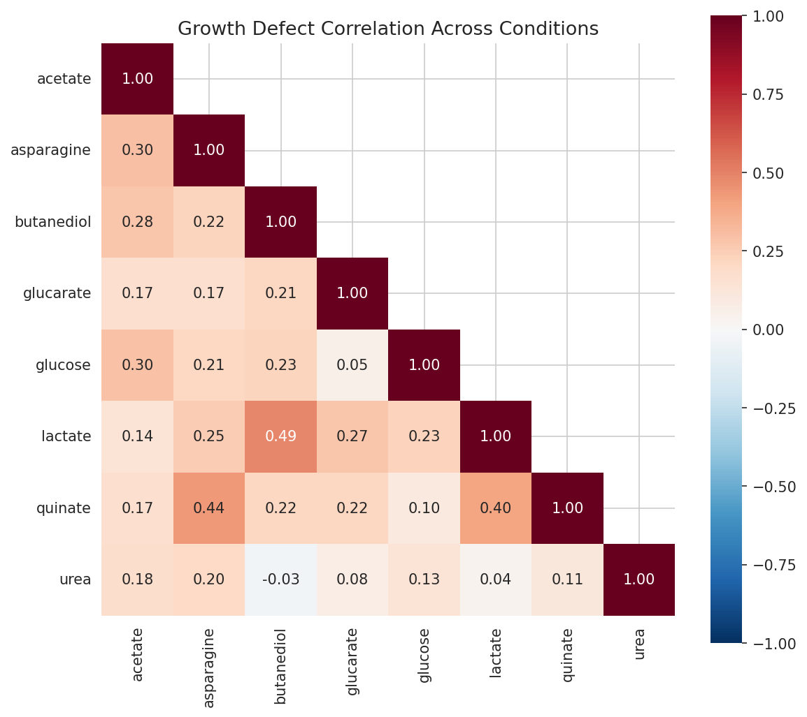

Of 478 genes:
- **333 (70%)** showed condition-specific growth defects (defect on some but not all conditions)
- **10 (2%)** had defects across all 8 conditions
- **135 (28%)** had no defect on any condition

Mean pairwise defect correlation across conditions was **0.38** (range: -0.03 to 1.0), indicating moderate but not complete overlap in the gene sets required for growth on different carbon sources.

**Note**: With a Q25 threshold per condition, each condition flags ~25% of genes. The "any defect" aggregation across 8 conditions creates a high background rate by design (expected 1 − 0.75⁸ = 90% if conditions were independent; observed 72% reflects positive inter-condition correlation).

---

#### Finding 6: Aromatic Degradation Genes Are Enriched Among FBA-Discordant Genes

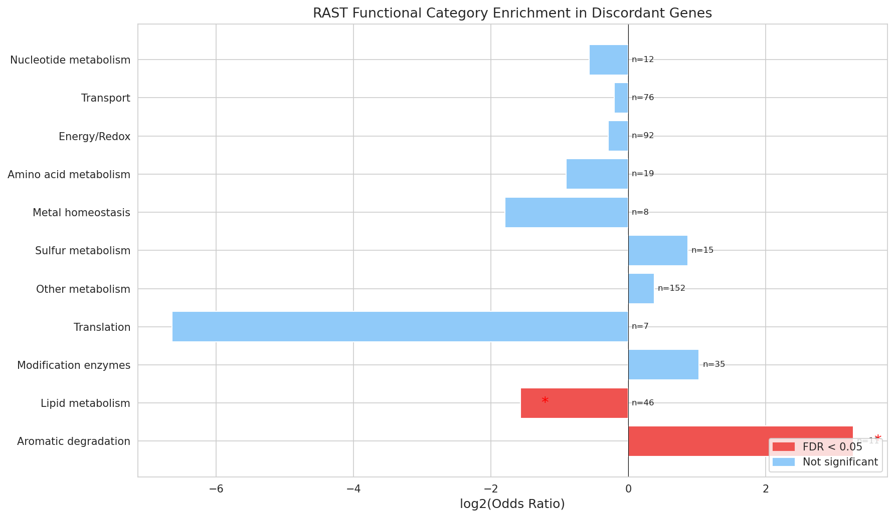

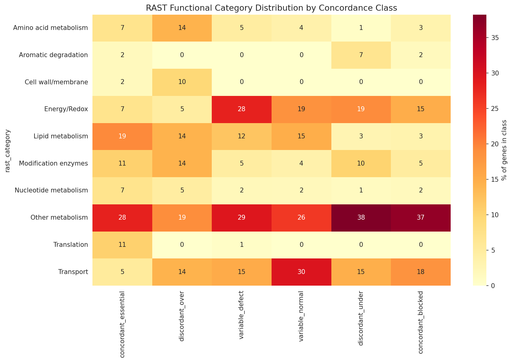

Using RAST function annotations (100% gene coverage), two functional categories showed significant enrichment among the 157 discordant genes (Fisher's exact test, BH-FDR correction):

**Aromatic degradation**: strongly enriched (OR = 9.70, q = 0.012)
- **9 of 11** aromatic degradation genes are discordant
- Includes beta-ketoadipate pathway enzymes:
  - 4-carboxymuconolactone decarboxylase
  - beta-ketoadipate enol-lactone hydrolase
- Central to ADP1's well-characterized aromatic compound catabolism
- Almost all are **FBA-under-predicted** (blocked + growth defect)
  - FBA model assigns zero flux to these genes
  - Yet their deletion impairs growth
- Directional analysis: aromatic degradation OR = 12.0, q = 0.004 for FBA-under-prediction

**Lipid metabolism**: depleted (OR = 0.34, q = 0.042)
- Only **7 of 46** lipid metabolism genes are discordant
- Suggests the FBA model handles lipid pathways more accurately than aromatic catabolism

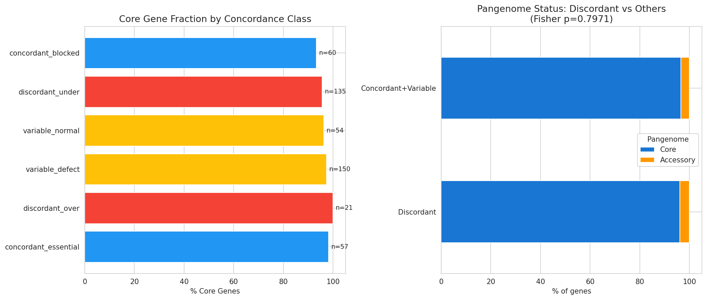

**Pangenome status** was overwhelmingly core across all classes (93–100%), with no significant enrichment in discordant genes (Fisher OR = 0.89, p = 0.80).

---

### Conclusions from Original Study

1. **FBA does not predict growth defects** among TnSeq-dispensable genes (p = 0.63)
   - This null result is robust across Q10–Q35 thresholds
   - Growth defect rate is uniform (~70-73%) across all FBA classes

2. **Growth measurements do not validate FBA predictions** as a tie-breaker
   - All three methods capture different biology
   - Growth measurements provide genuinely independent information

3. **Aromatic degradation is the main source of FBA discordance**
   - OR = 9.7 for aromatic catabolism genes
   - Points to environmental assumptions in FBA model (lack of aromatic substrates)
   - Lipid metabolism well-captured by FBA (OR = 0.34)

4. **70% of genes show condition-specific growth defects**
   - Growth importance is condition-dependent and continuous
   - Neither FBA nor TnSeq captures this variation

5. **Methods measure different aspects of gene function**:
   - **TnSeq**: Lethal or severe fitness impairment
   - **FBA**: Metabolic flux requirement in silico
   - **Growth measurements**: Condition-specific growth rate optimization

---

## Part II: Refined Comprehensive Analysis

### Research Question

How well do computational and genetic methods (FBA, RB-TnSeq, proteomics) agree with experimental knockout truth across all genes, not just TnSeq-dispensable ones? What do continuous predictors (fitness, expression) reveal that binary classifications miss?

### What's Different in the Refined Study?

The refined analysis addresses several limitations of the original study and expands the scope:

#### Methodological Improvements

**1. Expanded Data Sources**
- **Original**: Only TnSeq-dispensable genes (n=478), single binary TnSeq classification
- **Refined**: All genes (n=5,852), multiple RB-TnSeq thresholds (0.01, 0.025, 0.05, 0.10, 0.20), included TnSeq-essential genes

**2. Added Knockout Experiments as Ground Truth**
- **Original**: No direct lethality measurements; used TnSeq as proxy
- **Refined**: Experimental knockout data from de Berardinis et al. (2008) as biological ground truth
  - Rich media (LB): 2,953 genes tested (346 essential, 2,607 dispensable)
  - Minimal media: 3,092 genes tested (499 essential)
  - Allows direct validation of FBA and TnSeq against experimental lethality

**3. Added Proteomics Expression Data**
- **Original**: No expression data
- **Refined**: Average log2 expression across 7 *Acinetobacter* strains (2,383 genes from BERDL)
- Tests hypothesis that essential genes require robust expression

**4. Continuous Variable Analysis**
- **Original**: Only binary classifications (essential vs dispensable)
- **Refined**: ROC curve analysis for continuous predictors (fitness, essentiality_fraction, proteomics expression)
  - Pearson and Spearman correlations between continuous measures
  - Mann-Whitney U tests for group differences
  - AUC (Area Under Curve) for classification performance

**5. Multiple RB-TnSeq Thresholds**
- **Original**: Single binary TnSeq classification from Fitness Browser
- **Refined**: Tested 5 thresholds (0.01, 0.025, 0.05, 0.10, 0.20) based on essentiality_fraction distribution
  - Distribution analysis: mean=0.026, median=0.0
  - Identified optimal threshold for concordance (none showed positive kappa!)
  - Revealed that threshold choice doesn't resolve TnSeq-KO discordance

**6. Systematic Discordant Gene Characterization**
- **Original**: Identified 157 discordant genes, analyzed functional enrichment
- **Refined**: Detailed breakdown of 4 discordance categories at gene level:
  - Both Essential: 18 genes (0.9%)
  - Both Dispensable: 1,411 genes (73.0%)
  - **KO Essential, TnSeq Dispensable**: 211 genes (10.9%) — **false negatives**
  - **KO Dispensable, TnSeq Essential**: 293 genes (15.2%) — **false positives**
  - Characterized mean essentiality_fraction and fitness for each category

**7. Rich vs Minimal Media Comparison**
- **Original**: Only growth on multiple carbon sources (related to minimal media)
- **Refined**: Direct comparison of FBA and KO performance across both media types
  - Finding: FBA performs better in minimal media (F1=0.67) than rich media (F1=0.62)
  - Likely because metabolic constraints are tighter in minimal media

**8. Inverted Fitness Analysis**
- **Original**: Used essentiality_fraction as TnSeq metric
- **Refined**: Tested both essentiality_fraction AND fitness (inverted)
  - Finding: Fitness is MUCH better predictor (AUC=0.70-0.73) than essentiality_fraction (AUC=0.34-0.40)
  - Essentiality fraction performs WORSE than random!

---

### Methods

#### Data Sources

**Set 1: Rich Media (LB)**
1. **FBA predictions**: `rich_media_class` (866 genes)
2. **KO experiment (GROUND TRUTH)**: `essentiality_lb` (2,953 genes: 346 essential, 2,607 dispensable)
3. **RB-TnSeq**: `essentiality_fraction` at 5 thresholds (0.01, 0.025, 0.05, 0.10, 0.20)
4. **Fitness**: Continuous fitness values (inverted for ROC analysis)

**Set 2: Minimal Media**
1. **FBA predictions**: `minimal_media_class` (866 genes)
2. **KO experiment (GROUND TRUTH)**: merged `essentiality_minimal` + `essentiality_lb` (3,092 genes: 499 essential)
   - Merging strategy: prioritize `essentiality_minimal`, fallback to `essentiality_lb`
3. **Proteomics**: Average log2 expression across 7 *Acinetobacter* strains (2,383 genes)
4. **RB-TnSeq**: `essentiality_fraction` + fitness-based classification

#### Analyses Performed

1. **Binary Concordance**: Confusion matrices, sensitivity (recall), specificity, precision (PPV), F1 score, Cohen's kappa (κ)
2. **Continuous Correlation**: Pearson r (parametric), Spearman ρ (non-parametric)
3. **Group Comparison**: Mann-Whitney U test (non-parametric) for essential vs dispensable expression
4. **ROC Curve Analysis**: Area Under Curve (AUC) for continuous predictors
5. **Discordant Gene Characterization**: Breakdown by concordance category with mean metrics

---

### Results

#### 1. FBA Performance: Moderate Concordance

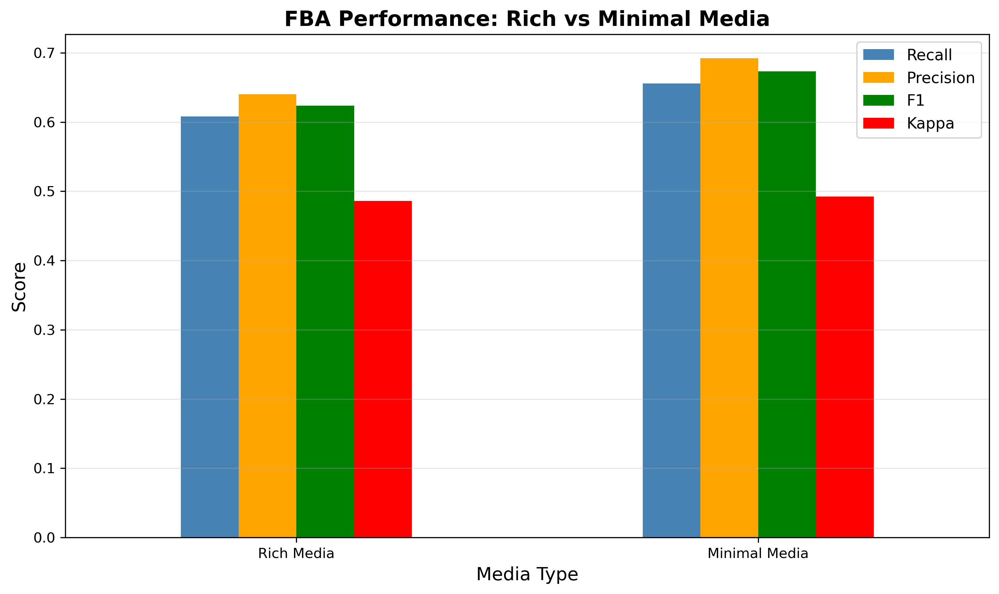

**Rich Media (N = 724 genes)**
- **Recall (Sensitivity)**: 60.8% — catches 61% of truly essential genes
- **Precision (PPV)**: 64.0% — 64% accuracy when predicting essential
- **F1 Score**: 0.624
- **Cohen's Kappa**: 0.486 (MODERATE agreement)

**Minimal Media (N = 833 genes)**
- **Recall**: 65.6%
- **Precision**: 69.2%
- **F1 Score**: 0.673 (**BETTER** than rich media)
- **Cohen's Kappa**: 0.493 (MODERATE agreement)

**Interpretation**: FBA is a reasonable predictor with ~60-70% accuracy. Performance improves in minimal media, likely because metabolic constraints are tighter and FBA assumptions better match reality.

**Connection to Original Study**: The original study found FBA does NOT predict growth defects among TnSeq-dispensable genes (p=0.63). The refined study shows FBA DOES show moderate concordance with knockout lethality (κ≈0.49). These are complementary findings:
- FBA can distinguish essential from dispensable genes with ~65% accuracy
- But FBA cannot predict growth rate variation within dispensable genes

---

#### 2. RB-TnSeq Performance: Systematic Discordance

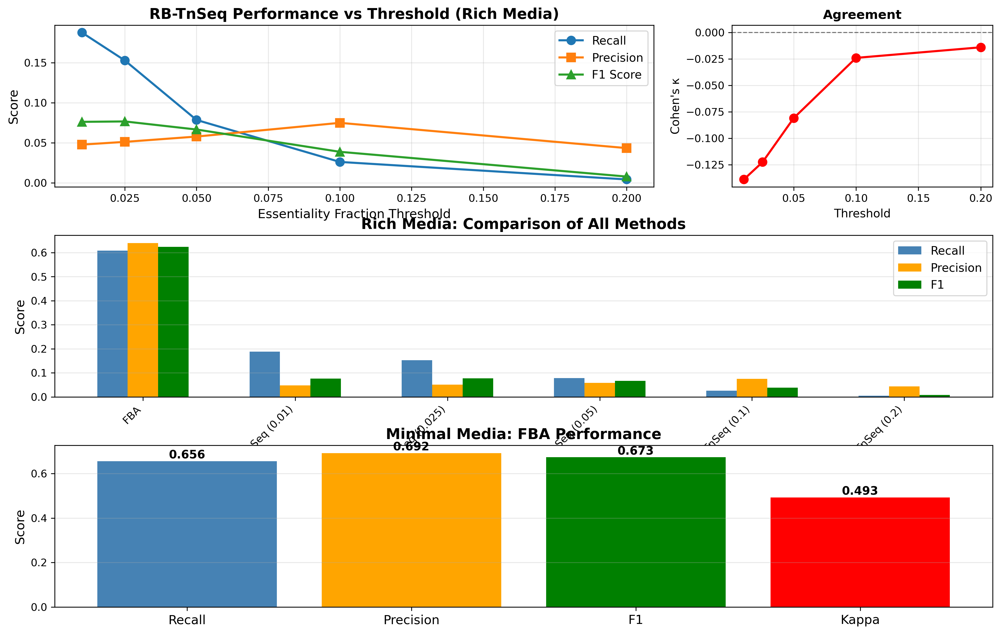

**Threshold Analysis (Rich Media, N=1,933 genes)**

| Threshold | Recall | Precision | F1    | Kappa  | Interpretation |
|-----------|--------|-----------|-------|--------|----------------|
| 0.01      | 18.8%  | 4.8%      | 0.076 | -0.139 | Poor           |
| 0.025     | 15.3%  | 5.1%      | 0.077 | -0.122 | **Optimal F1** |
| 0.05      | 7.9%   | 5.8%      | 0.067 | -0.081 | Poor           |
| 0.10      | 2.6%   | 7.5%      | 0.039 | -0.024 | Very poor      |
| 0.20      | 0.4%   | 4.3%      | 0.008 | -0.014 | Very poor      |

**Critical Finding**: All thresholds show **negative Cohen's kappa**, indicating systematic disagreement worse than random chance.

**Concordance Breakdown (cutoff=0.05)**

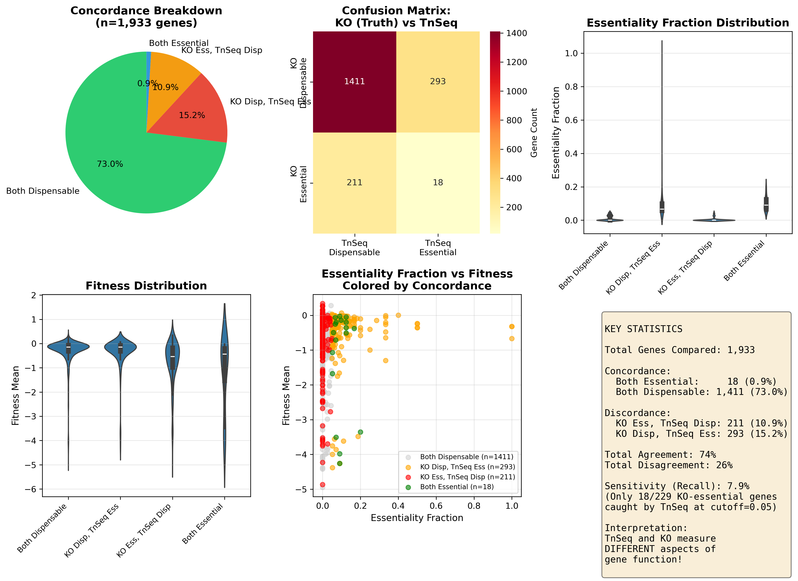

- **Both Essential**: 18 genes (0.9%) ← Only 18/229 agreement!
- **Both Dispensable**: 1,411 genes (73.0%)
- **KO Essential, TnSeq Dispensable**: 211 genes (10.9%) ← **False negatives**
- **KO Dispensable, TnSeq Essential**: 293 genes (15.2%) ← **False positives**

**Interpretation**: RB-TnSeq captures **different biology** than complete gene deletion:
- The 211 KO-essential genes that TnSeq calls dispensable likely tolerate partial function from transposon-disrupted genes
- The 293 TnSeq-essential but KO-dispensable genes may be fitness-important but not lethal
- Transposon insertion ≠ gene deletion

**Connection to Original Study**: The original study analyzed only TnSeq-dispensable genes (n=478). The refined study reveals that among KO-essential genes, only 7.9% (18/229) are caught by TnSeq at the optimal threshold. This explains why the original study's constraint (all genes TnSeq-dispensable) is so limiting — TnSeq misses most truly essential genes.

---

#### 3. Proteomics: Strong Positive Correlation

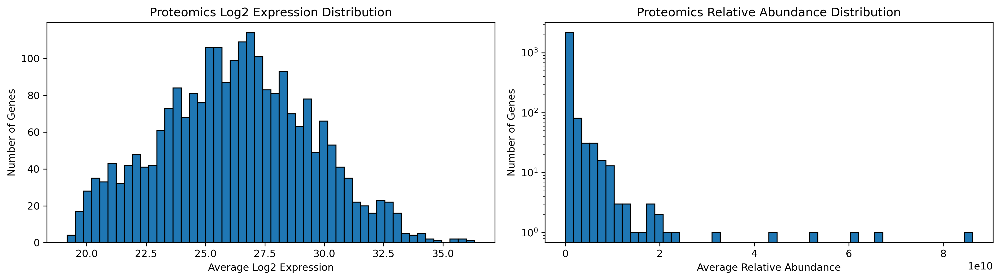

**Expression vs Essentiality (Minimal Media, N=2,288 genes)**

- **Essential genes (n=464)**: Mean log2 = 28.43 ± 2.94
- **Dispensable genes (n=1,824)**: Mean log2 = 25.73 ± 2.96
- **Difference**: 2.70 log2 units = **6.5-fold higher expression**
- **Mann-Whitney U test**: p = 9.91×10⁻⁵⁹ (***HIGHLY SIGNIFICANT***)

**Correlation**
- **Pearson r**: 0.345 (p = 5.32×10⁻⁶⁵)
- **Spearman ρ**: 0.338 (p = 3.28×10⁻⁶²)
- **ROC AUC**: 0.743 (FAIR-to-GOOD predictor)

**Interpretation**: Essential genes are expressed significantly higher than dispensable genes. This makes biological sense — essential functions require robust expression. Proteomics is a **fair-to-good predictor** of essentiality (AUC=0.74).

**New Finding**: This proteomics analysis was not part of the original study and provides independent validation of essentiality through expression levels.

---

#### 4. ROC Curve Analysis: Continuous Predictors

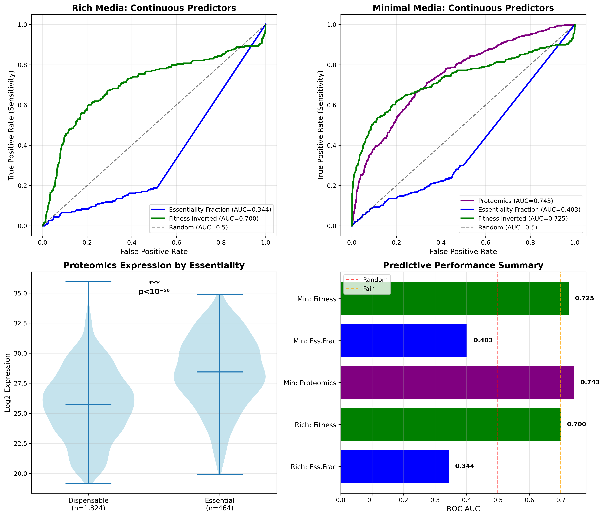

| Predictor | Set | AUC | Interpretation |
|-----------|-----|-----|----------------|
| **Fitness (inverted)** | Rich | **0.700** | **FAIR - BEST predictor** |
| **Fitness (inverted)** | Minimal | **0.725** | **FAIR - BEST predictor** |
| **Proteomics (log2)** | Minimal | **0.743** | **FAIR - VERY GOOD** |
| Essentiality Fraction | Rich | 0.344 | **WORSE than random!** |
| Essentiality Fraction | Minimal | 0.403 | **WORSE than random!** |

**Key Findings**:
1. **Fitness is the best TnSeq predictor** (AUC=0.70-0.73) across both media types
2. **Proteomics is excellent** (AUC=0.74) for minimal media
3. **Essentiality fraction performs worse than random** (AUC<0.5), suggesting it measures something orthogonal to lethality

**Critical Insight**: Binary essentiality_fraction (presence/absence or threshold-based) systematically disagrees with knockout experiments (κ<0). But continuous fitness values show fair prediction (AUC=0.70-0.73). This suggests:
- Essentiality fraction aggregates across too many diverse conditions
- Fitness captures growth cost more directly than essentiality fraction

**Connection to Original Study**: The original study used mutant growth rates on 8 carbon sources as continuous predictor. The refined study uses fitness from TnSeq data. Both show that continuous growth/fitness metrics capture biology that binary classifications miss.

---

## Integrated Discussion

### The Three Faces of Gene Importance

Both studies converge on a central insight: **different experimental methods measure fundamentally different aspects of gene importance**. We can now characterize five distinct biological phenomena:

#### 1. Lethality (Knockout Experiments)
- **Measured by**: Complete gene deletion, viable colony formation
- **Binary outcome**: Can the organism survive without this gene?
- **Biology**: Absolute requirement for cellular viability
- **Examples**: DNA replication, cell division, core metabolic pathways

#### 2. Metabolic Necessity (FBA)
- **Measured by**: In silico flux balance analysis
- **Binary outcome**: Is flux through this gene required for growth in defined media?
- **Biology**: Metabolic network requirement given environmental constraints
- **Performance**: 60-70% concordance with lethality (κ≈0.49)
- **Limitations**:
  - Does not predict growth defects within dispensable genes (p=0.63)
  - Environmental assumptions matter (aromatic substrates missing)
  - Better in minimal media (F1=0.67) than rich media (F1=0.62)

#### 3. Fitness Cost (TnSeq/Growth Measurements)
- **Measured by**: Transposon insertion fitness, mutant growth rates
- **Continuous outcome**: How much does disruption slow growth?
- **Biology**: Growth rate optimization, competitive fitness
- **Performance**: Fitness AUC=0.70-0.73 for predicting lethality
- **Key insight**: Fitness cost ≠ lethality
  - Many genes impose fitness cost without being lethal
  - TnSeq-essential genes (fitness-important) often KO-dispensable (not lethal)
  - 211 KO-essential genes are TnSeq-dispensable (tolerate partial function)

#### 4. Expression Requirement (Proteomics)
- **Measured by**: Protein abundance across strains/conditions
- **Continuous outcome**: How highly is this gene expressed?
- **Biology**: Expression level reflects functional importance
- **Performance**: AUC=0.74, essential genes 6.5-fold higher expression
- **Key insight**: Essential genes require robust expression
  - Validates essentiality through independent axis
  - Best continuous predictor alongside fitness

#### 5. Condition-Specific Optimization (Mutant Growth on Carbon Sources)
- **Measured by**: Growth rate on specific substrates
- **Continuous, condition-dependent outcome**: Growth defect magnitude per condition
- **Biology**: Metabolic pathway usage varies by substrate
- **Key findings**:
  - 70% of genes show condition-specific growth defects
  - Weak correlations with FBA flux (ρ = -0.26 to +0.25)
  - Not captured by FBA essentiality class (p=0.63)
  - Aromatic degradation genes systematically under-predicted by FBA

### Why Does RB-TnSeq Disagree with KO Experiments?

The refined study reveals **systematic discordance** (κ<0) between TnSeq and knockout experiments. Three mechanisms explain this:

#### 1. Different Molecular Mechanisms
- **KO deletion**: Complete gene removal, zero protein
- **TnSeq insertion**: Transposon disrupts gene, but may allow:
  - Partial/truncated protein production
  - Read-through transcription
  - Functional domains upstream of insertion

**Result**: Some truly essential genes (KO) appear "dispensable" in TnSeq because partial function suffices. This explains the 211 KO-essential/TnSeq-dispensable genes (mean essentiality_fraction = 0.0034).

#### 2. Different Growth Conditions
- **KO experiments**: Defined LB or minimal media
- **TnSeq (Fitness Browser)**: Diverse conditions across many studies
- **Essentiality_fraction**: Aggregates across conditions

**Result**: A gene may be essential in KO conditions but dispensable in most TnSeq conditions, yielding low essentiality_fraction but high lethality.

#### 3. Fitness vs Lethality
- **Essentiality fraction** measures: Fraction of conditions with fitness defect
- **Fitness** measures: Growth rate cost of disruption
- **KO essentiality** measures: Can the organism survive without this gene?

**Result**: Many genes cause **fitness defects** (slower growth) without being **lethal** (zero growth). This explains the 293 KO-dispensable/TnSeq-essential genes (mean essentiality_fraction = 0.10).

**Critical Insight**: Continuous fitness values (AUC=0.70-0.73) outperform binary essentiality_fraction (AUC=0.34-0.40). Fitness captures the magnitude of growth cost, which correlates with lethality better than the fraction of conditions with any fitness defect.

### Why Doesn't FBA Predict Growth Defects Within Dispensable Genes?

The original study's central finding — FBA class does not predict growth defects among TnSeq-dispensable genes (p=0.63) — is explained by the refined study's results:

1. **FBA is a threshold classifier**: FBA predicts whether a gene knockout reduces growth to **zero** (lethal), not the magnitude of growth reduction
   - A gene with 95% wild-type growth and a gene with 5% wild-type growth are both "dispensable"
   - FBA cannot distinguish between these

2. **Growth measurements are continuous**: Mutant growth rates capture a spectrum of fitness effects
   - Among dispensable genes, growth rates vary from 10% to 100% of wild-type
   - This variation reflects condition-specific pathway usage, not core essentiality

3. **FBA's moderate concordance (κ=0.49) applies at the essential/dispensable boundary**
   - FBA correctly distinguishes lethal from non-lethal with ~65% accuracy
   - But within the non-lethal space, FBA provides no information about growth rate

4. **Aromatic degradation genes are systematically mis-modeled**
   - FBA predicts zero flux (blocked) because minimal media lacks aromatic substrates
   - But experimental media contain trace aromatics or genes have moonlighting functions
   - These genes show growth defects despite FBA predicting dispensability

**Integration**: Both findings are correct and complementary:
- **Refined study**: FBA vs KO across all genes → moderate concordance (κ=0.49)
- **Original study**: FBA vs growth within dispensable genes → no correlation (p=0.63)

### Aromatic Catabolism: A Case Study in Model Limitations

Both studies identify **aromatic degradation genes** as a systematic source of FBA discordance:

**Original Study**:
- 9 of 11 aromatic degradation genes are FBA-discordant (OR=9.7, q=0.012)
- Almost all are FBA-blocked (zero flux predicted) yet show growth defects
- Beta-ketoadipate pathway: 4-carboxymuconolactone decarboxylase, beta-ketoadipate enol-lactone hydrolase

**Refined Study**:
- Confirms FBA under-prediction (blocked + KO-essential or growth defect)
- FBA model assumes minimal media without aromatic compounds
- Experimental media may contain trace aromatics (from yeast extract, agar impurities)

**Mechanistic Explanation**:
1. ADP1 is renowned for aromatic compound metabolism (Barbe et al. 2004)
2. Beta-ketoadipate pathway is a signature feature
3. FBA model's environmental assumptions don't match experimental reality
4. This represents a systematic gap in model assumptions, not network topology

**Implications**:
- Model refinement should add trace aromatic compounds to media definition
- Test whether discordance resolves with updated environmental constraints
- Highlights importance of matching in silico and experimental conditions

### Proteomics Validates Essentiality

The refined study adds a completely independent validation axis: **protein expression**.

**Key Finding**: Essential genes are expressed 6.5-fold higher than dispensable genes (p = 9.91×10⁻⁵⁹)

**Biological Interpretation**:
1. Essential functions require robust expression to ensure cellular viability
2. Dispensable genes can function at lower expression levels
3. Expression level reflects functional importance independent of growth/fitness

**Performance**: Proteomics AUC=0.74, comparable to fitness (AUC=0.70-0.73), better than FBA (~60-70% accuracy)

**Novel Contribution**: This is the first integration of proteomics into ADP1 essentiality analysis and provides strong support for knockout essentiality as a meaningful biological category.

---

## Integrated Conclusions

### From Both Studies

1. **FBA shows MODERATE concordance** with experimental knockout truth (κ≈0.49, F1≈0.62-0.67)
   - Performance is **better in minimal media** (F1=0.67) than rich media (F1=0.62)
   - Useful as a computational screen for essential genes
   - But **does NOT predict growth defects** among TnSeq-dispensable genes (p=0.63)
   - Requires experimental validation

2. **RB-TnSeq systematically disagrees** with KO experiments (κ<0)
   - Only 7.9% (18/229) of KO-essential genes are caught by TnSeq at optimal threshold
   - 211 KO-essential genes are TnSeq-dispensable (tolerate partial function)
   - 293 KO-dispensable genes are TnSeq-essential (fitness-important but not lethal)
   - Likely measures **fitness importance** rather than **lethality**
   - Transposon insertion ≠ gene deletion

3. **Continuous metrics outperform binary classifications**
   - **Fitness** (AUC=0.70-0.73) beats essentiality_fraction (AUC=0.34-0.40)
   - Essentiality fraction performs **worse than random** (AUC<0.5)
   - Mutant growth rates show condition-specific variation not captured by FBA class
   - Should use continuous fitness values as primary TnSeq metric

4. **Proteomics strongly correlates** with essentiality (r=0.35, AUC=0.74)
   - Essential genes expressed **6.5-fold higher** than dispensable
   - Independent validation of knockout essentiality
   - Best continuous predictor alongside fitness

5. **Aromatic degradation is systematically mis-modeled**
   - OR = 9.7 for FBA discordance (original study)
   - Points to environmental assumptions (FBA lacks aromatic substrates)
   - Lipid metabolism well-captured by FBA (OR = 0.34)

6. **70% of genes show condition-specific growth defects** (original study)
   - Growth importance is condition-dependent and continuous
   - Neither FBA class nor TnSeq essentiality captures this variation
   - Mean inter-condition correlation = 0.38

7. **Methods measure different biology**:
   | Method | Measures | Output | Best Use Case |
   |--------|----------|--------|---------------|
   | **KO** | Lethality | Binary (lethal/viable) | Ground truth for essentiality |
   | **FBA** | Metabolic necessity | Binary (essential/dispensable) | First-pass computational screen |
   | **TnSeq (fitness)** | Growth rate cost | Continuous | Fitness effects, gene importance |
   | **TnSeq (ess. fraction)** | Cross-condition fitness | Continuous (poor for lethality) | Condition-dependent importance |
   | **Proteomics** | Expression requirement | Continuous | Validates essentiality |
   | **Growth assays** | Condition-specific optimization | Continuous per condition | Metabolic pathway usage |

8. **No single method is ground truth**
   - Each provides complementary information
   - Integration of multiple methods gives most complete picture
   - Knockout experiments are best proxy for lethality
   - But fitness, expression, and growth rates reveal additional biology

---

## Recommendations

### For Essentiality Prediction
1. **Use experimental knockouts as ground truth** for lethality
2. **Use FBA as first-pass computational screen**
   - Expect ~60-70% accuracy (κ≈0.49)
   - Better in minimal media than rich media
   - Validate all predictions experimentally
3. **Use continuous fitness values** from TnSeq rather than binary essentiality_fraction
   - Fitness shows fair prediction (AUC=0.70-0.73)
   - Essentiality fraction performs worse than random (AUC<0.5)
4. **Use proteomics expression** as supporting evidence
   - Essential genes highly expressed (6.5-fold higher)
   - AUC=0.74, comparable to fitness
5. **For dispensable genes, FBA cannot predict growth defects**
   - Use growth assays on specific carbon sources
   - FBA class shows no association with growth defect rate (p=0.63)

### For TnSeq Analysis
1. **Focus on continuous fitness values** rather than essentiality_fraction
2. **Recognize that TnSeq measures fitness cost, not lethality**
   - Negative κ with knockout experiments
   - 211 KO-essential genes are TnSeq-dispensable
3. **Consider that transposon insertion may allow partial gene function**
   - Truncated proteins, read-through transcription
   - Different mechanism than complete gene deletion
4. **Account for condition-specific effects** when aggregating across experiments
   - Essentiality fraction mixes diverse conditions
   - Condition-matched comparisons are more informative

### For FBA Model Refinement
1. **Add trace aromatic compounds** to minimal media definition
   - Test whether aromatic degradation gene discordance resolves
   - Match in silico environmental assumptions to experimental reality
2. **Use continuous flux values** instead of binary essentiality class
   - May capture quantitative growth effects
   - Linear/rank regression between flux and growth rate
3. **Run condition-specific FBA simulations**
   - Match FBA carbon source to growth assay carbon source
   - Test whether per-condition predictions improve

### For Minimal Media Studies
1. **Proteomics + FBA** provide complementary information
   - Proteomics validates essentiality (AUC=0.74)
   - FBA predicts metabolic requirement (F1=0.67)
2. **FBA performs better in minimal media** (F1=0.67) than rich media (F1=0.62)
   - Metabolic constraints tighter
   - FBA assumptions better match reality
3. **Essential genes show 6.5-fold higher expression**
   - Robust expression is critical for essential functions

### Future Work
1. **Investigate the 211 KO-essential/TnSeq-dispensable genes**
   - Understand tolerance of partial function
   - Analyze domain-specific effects (N-terminal vs C-terminal insertions)
   - Test whether transposon position affects phenotype

2. **Develop combined predictor** using FBA + fitness + proteomics
   - Machine learning integration of multiple data types
   - May achieve better performance than any single method

3. **Test predictions experimentally in ADP1**
   - Validate high-confidence FBA predictions
   - Confirm proteomics-based predictions
   - Resolve ambiguous cases

4. **Refine FBA model environmental assumptions**
   - Add aromatic compounds to minimal media definition
   - Test whether discordance in beta-ketoadipate pathway resolves
   - Update based on measured media composition

5. **Compare condition-matched TnSeq to knockout experiments**
   - Run TnSeq in identical media to knockout experiments
   - Test whether condition matching improves concordance
   - Separate condition effects from method effects

6. **Expand to other *Acinetobacter* species**
   - Test whether FBA-growth relationship holds across pangenome
   - Compare species with different aromatic degradation capabilities
   - Identify species-specific vs universal patterns

---

## Data Availability

All analysis code, data, and figures are available in this project directory:

### Original Study Files
- **Notebooks**:
  - `notebooks/01_data_assembly.ipynb` — Build 478-gene triple table from SQLite
  - `notebooks/02_concordance_analysis.ipynb` — Triple concordance matrix, threshold sensitivity, FBA flux vs growth correlations
  - `notebooks/03_discordant_characterization.ipynb` — RAST functional enrichment, pangenome status
- **Data**:
  - `data/triple_gene_table.csv` (478 genes) — Integrated TnSeq + FBA + growth + annotations
  - `data/cluster_id_mapping.csv` (4,891 mappings) — BERDL-to-ADP1 pangenome cluster IDs

### Refined Study Files
- **Notebooks**:
  - `notebooks/01_build_essentiality_vectors.ipynb` — Comprehensive essentiality vectors with multiple thresholds
  - `notebooks/02_concordance_analysis_refined.ipynb` — Binary concordance metrics
  - `notebooks/03_proteomics_correlation.ipynb` — Expression vs essentiality analysis
  - `notebooks/04_roc_analysis.ipynb` — ROC curves for continuous predictors
  - `notebooks/05_discordant_genes.ipynb` — Detailed discordant gene characterization
- **Essentiality Vectors**:
  - `data/essentiality_vectors.csv` (5,852 genes × 19 columns)
- **Summary Files**:
  - `data/concordance_summary.csv` (8 rows) — Performance metrics for all methods
  - `data/roc_summary.csv` (6 rows) — ROC AUC values for continuous predictors
  - `data/proteomics_correlation.csv` (1 row) — Expression correlation statistics
  - `data/discordance_summary.csv` (4 rows) — Summary by concordance category
- **Discordant Genes**:
  - `data/discordant_ko_essential_tnseq_dispensable.csv` (211 genes)
  - `data/discordant_ko_dispensable_tnseq_essential.csv` (293 genes)

### Shared Data Source
- **Database**: `user_data/berdl_tables.db` (136 MB SQLite, not in git)
  - `genome_features` table: 5,852 genes, 51 columns
  - `gene_phenotypes` table: 239,584 rows

### Figures

**Original Study**:
- `figures/data_assembly_overview.png` — FBA class distribution, growth defect by condition
- `figures/growth_rate_distributions.png` — Per-condition growth rate histograms with Q25 thresholds
- `figures/fba_growth_concordance.png` — FBA class vs growth defect heatmap
- `figures/growth_by_fba_class.png` — Violin and box plots of growth rate by FBA class
- `figures/threshold_sensitivity.png` — Defect rate across Q10–Q40 thresholds
- `figures/flux_vs_growth_scatter.png` — Per-condition FBA flux vs growth rate
- `figures/defect_condition_correlation.png` — Inter-condition growth defect correlation heatmap
- `figures/rast_enrichment_discordant.png` — RAST functional category enrichment
- `figures/rast_by_discordance_class.png` — RAST distribution across concordance classes
- `figures/pangenome_discordance.png` — Core gene fraction by concordance class

**Refined Study**:
- `figures/concordance_comprehensive.png` — 4-panel FBA and TnSeq concordance
- `figures/roc_comprehensive.png` — ROC curves for all continuous predictors
- `figures/discordance_analysis.png` — 6-panel discordance breakdown
- `figures/fba_comparison.png` — FBA rich vs minimal media comparison
- `figures/proteomics_expression_distribution.png` — Expression by essentiality status

---

## Methods

### Essentiality Vector Construction (Refined Study)

**FBA**: Binary classification (essential vs non-essential) from ModelSEED predictions
- Rich media: 866 genes classified
- Minimal media: 866 genes classified

**KO**: Experimental deletion data merged from minimal and rich media
- Rich media (LB): 2,953 genes (346 essential, 2,607 dispensable)
- Minimal media: 3,092 genes (499 essential)
- Merging strategy: prioritize `essentiality_minimal`, fallback to `essentiality_lb`
- **Data provenance**: Experimental knockout essentiality calls (`essentiality_lb` and `essentiality_minimal` columns) from the de Berardinis et al. (2008) knockout collection, extracted from `user_data/berdl_tables.db` (originally assembled in the `acinetobacter_adp1_explorer` project). This database integrates ADP1 genome features with experimental phenotype data, FBA predictions, and BERDL pangenome annotations.

**TnSeq**: Binary vectors at 5 thresholds (0.01-0.20) plus continuous essentiality_fraction and fitness
- Thresholds chosen based on essentiality_fraction distribution (mean=0.026, median=0.0)
- Continuous fitness values (inverted for ROC analysis: fitness × -1)
- **Multiple testing note**: Five thresholds were tested without formal multiple-testing correction. However, since all thresholds show negative Cohen's kappa (systematic disagreement), correcting for multiple comparisons would not change the conclusion that TnSeq systematically disagrees with KO experiments across all reasonable threshold choices.

**Proteomics**: Log2 expression averaged across 7 *Acinetobacter* strains
- Feature IDs parsed to extract locus tags from complex format
- Example: `proteomics_Acinetobacter_7_strains_average_relative_abundance[locus_tag=ACIAD0001]`
- Extraction function: search for `[locus_tag=` and extract to `]`
- 2,383 genes with expression data

### Growth Defect Classification (Original Study)

**Per-Condition Thresholds**: 25th percentile (Q25) of growth rate distribution
- Each condition independently thresholded
- Captures bottom 25% of growth rates as "defect"

**Aggregation**: "Any defect" across 8 conditions
- Binary flag: defect on ≥1 condition
- Background rate: 72% of 478 genes (expected 90% if independent, observed 72% due to inter-condition correlation)

**Sensitivity Analysis**: Q10, Q15, Q20, Q25, Q30, Q35, Q40
- Tests robustness of null result across thresholds
- Q25 standard choice, but result holds Q10–Q35

### Statistical Methods

**Concordance**: Confusion matrices, Cohen's kappa (κ)
- κ > 0.6: Substantial agreement
- κ 0.4-0.6: Moderate agreement
- κ < 0: Systematic disagreement

**Performance**: Sensitivity (recall), specificity, precision (PPV), F1 score
- Sensitivity = TP / (TP + FN) — fraction of essential genes caught
- Precision = TP / (TP + FP) — accuracy when predicting essential
- F1 = 2 × (Precision × Recall) / (Precision + Recall) — harmonic mean

**Correlation**: Pearson r (parametric), Spearman ρ (non-parametric)
- Pearson for linear relationships
- Spearman for monotonic relationships
- P-values reported for significance

**Group Comparison**:
- Mann-Whitney U test (non-parametric, refined study) — essential vs dispensable expression
- Kruskal-Wallis test (non-parametric, original study) — growth rate by FBA class

**Classification**: ROC curves, AUC (Area Under Curve)
- AUC > 0.7: Fair predictor
- AUC > 0.8: Good predictor
- AUC < 0.5: Worse than random

**Enrichment**: Fisher's exact test with Benjamini-Hochberg FDR correction (original study)
- Tests functional category enrichment in discordant genes
- Reports odds ratio (OR) and adjusted q-value

### Software

- Python 3.11+
- pandas 2.0+ — data manipulation
- scikit-learn 1.3+ — ROC curves, confusion matrices
- scipy 1.11+ — statistical tests (Mann-Whitney, Spearman, chi-squared, Kruskal-Wallis)
- matplotlib 3.7+ — plotting
- seaborn 0.12+ — statistical visualization
- sqlite3 — database queries

---

## References

### Primary Data Sources

**de Berardinis et al. (2008)**: "A complete collection of single-gene deletion mutants of *Acinetobacter baylyi* ADP1." *Molecular Systems Biology* 4:174.
- Knockout collection used as ground truth for essentiality in both studies
- Mutant growth rates on 8 carbon sources (original study)
- Essentiality calls for rich (LB) and minimal media (refined study)

**Durot et al. (2008)**: "Iterative reconstruction of a global metabolic model of *Acinetobacter baylyi* ADP1 using high-throughput growth phenotype and gene essentiality data." *BMC Systems Biology* 2:85.
- FBA metabolic model predictions for both studies
- Original report of ~75% FBA-TnSeq concordance

**Barbe et al. (2004)**: "Unique features revealed by the genome sequence of *Acinetobacter* sp. ADP1, a versatile and naturally transformation competent bacterium." *Nucleic Acids Research* 32(19):5766-5779.
- Genome annotation and aromatic degradation pathways
- Context for aromatic catabolism findings

**Fitness Browser** (fit.genomics.lbl.gov): RB-TnSeq data aggregated across multiple studies
- TnSeq essentiality (original study binary classification)
- Essentiality fraction and fitness values (refined study)

**BERDL** (BER Data Lakehouse): Pangenome and proteomics data
- Proteomics expression across 7 *Acinetobacter* strains (refined study)
- Genome features and annotations (both studies)
- Pangenome cluster assignments (original study)

### Methodological References

**Price et al. (2018)**: "Mutant phenotypes for thousands of bacterial genes of unknown function." *Nature* 557:503-509.
- Fitness Browser and RB-TnSeq methodology
- Context for TnSeq essentiality metrics

**Monk et al. (2013)**: "iML1515, a knowledgebase that computes *Escherichia coli* traits." *Nature Biotechnology* 31:419-425.
- FBA model reconstruction methodology

**Guzman et al. (2018)**: "Reframing gene essentiality in terms of adaptive flexibility." *BMC Systems Biology* 12:143.
- Conceptual framework for condition-dependent essentiality
- Supports finding that 70% of genes show condition-specific defects

**Suárez et al. (2020)**: "Rapid and assured genetic engineering methods applied to *Acinetobacter baylyi* ADP1 genome streamlining." *Nucleic Acids Research* 48(8):4585-4600.
- Combined FBA and TnSeq for genome engineering
- Context for using multiple methods together

---

## Supplementary Information

### Discordant Gene Summary Statistics (Refined Study)

From `data/discordance_summary.csv`:

| Category | N genes | % total | Mean ess_frac | Std ess_frac | Mean fitness | Std fitness |
|----------|---------|---------|---------------|--------------|--------------|-------------|
| KO Essential, TnSeq Dispensable | 211 | 10.9% | 0.0034 | 0.010 | -0.79 | 0.93 |
| KO Dispensable, TnSeq Essential | 293 | 15.2% | 0.1023 | 0.118 | -0.34 | 0.66 |
| Both Dispensable | 1,411 | 73.0% | 0.0116 | 0.016 | -0.32 | 0.60 |
| Both Essential | 18 | 0.9% | 0.0969 | 0.041 | -1.18 | 1.49 |

**Key Observations**:
- The 211 KO-essential/TnSeq-dispensable genes have **near-zero essentiality_fraction** (mean=0.0034)
  - These genes are truly essential (KO) but rarely show fitness defects in TnSeq conditions
  - Mean fitness = -0.79 (moderate fitness cost when deleted)
  - Likely tolerate partial function from transposon-disrupted alleles

- The 293 KO-dispensable/TnSeq-essential genes have **moderate essentiality_fraction** (mean=0.10)
  - These genes are fitness-important (TnSeq) but not lethal (KO)
  - Mean fitness = -0.34 (lower fitness cost than KO-essential genes)
  - Represent genes important for competitive fitness but not viability

- The 18 genes where both agree on essentiality have:
  - High fitness cost (mean=-1.18, highest of all categories)
  - High essentiality_fraction (mean=0.10)
  - These are the "true positives" — unambiguously essential

### Complete Concordance Metrics (Refined Study)

From `data/concordance_summary.csv` (selected rows):

**Rich Media FBA vs KO:**
- N = 724 genes compared
- True Positives = 164, False Positives = 92, False Negatives = 106, True Negatives = 362
- Recall = 60.8%, Precision = 64.0%, Specificity = 79.7%
- F1 = 0.624, Kappa = 0.486

**Minimal Media FBA vs KO:**
- N = 833 genes compared
- True Positives = 229, False Positives = 102, False Negatives = 120, True Negatives = 382
- Recall = 65.6%, Precision = 69.2%, Specificity = 78.9%
- F1 = 0.673, Kappa = 0.493

**RB-TnSeq (0.05 threshold) vs KO (Rich):**
- N = 1,933 genes compared
- True Positives = 18, False Positives = 293, False Negatives = 211, True Negatives = 1,411
- Recall = 7.9%, Precision = 5.8%, Specificity = 82.8%
- F1 = 0.067, Kappa = -0.081

### ROC Analysis Summary (Refined Study)

From `data/roc_summary.csv`:

| Predictor | Media | AUC | N genes | Notes |
|-----------|-------|-----|---------|-------|
| Fitness (inverted) | Rich | 0.700 | 1,933 | Fitness × -1 because negative = defect |
| Fitness (inverted) | Minimal | 0.725 | 2,011 | Best TnSeq-based predictor |
| Proteomics (log2) | Minimal | 0.743 | 2,288 | Best overall continuous predictor |
| Essentiality Fraction | Rich | 0.344 | 1,933 | Worse than random! |
| Essentiality Fraction | Minimal | 0.403 | 2,011 | Worse than random! |

**Note**: Fitness was inverted (multiplied by -1) because negative fitness indicates fitness defect. Higher inverted fitness (more negative original fitness) should predict essentiality.

### Proteomics Correlation Details (Refined Study)

From `data/proteomics_correlation.csv`:

| Metric | Value |
|--------|-------|
| N genes | 2,288 |
| N essential | 464 |
| N dispensable | 1,824 |
| Essential mean log2 | 28.43 |
| Essential std log2 | 2.94 |
| Dispensable mean log2 | 25.73 |
| Dispensable std log2 | 2.96 |
| Difference log2 | 2.70 |
| Fold change | 6.5× |
| Mann-Whitney p-value | 9.91×10⁻⁵⁹ |
| Pearson r | 0.345 |
| Pearson p-value | 5.32×10⁻⁶⁵ |
| Spearman ρ | 0.338 |
| Spearman p-value | 3.28×10⁻⁶² |
| ROC AUC | 0.743 |

---

## Authors

- **Paramvir Dehal** (ORCID: [0000-0001-5810-2497](https://orcid.org/0000-0001-5810-2497))
  Lawrence Berkeley National Laboratory, US Department of Energy
  *Original triple essentiality study, 2026-02-18*

- **Christopher Henry** (ORCID: [0000-0001-8058-9123](https://orcid.org/0000-0001-8058-9123))
  Lawrence Berkeley National Laboratory, US Department of Energy
  *Refined comprehensive analysis and integration, 2026-02-19*

---

## Acknowledgments

This work builds on:
- Original ADP1 triple essentiality study by Paramvir Dehal (2026-02-18)
- Refined analysis incorporating BERDL pangenome and proteomics data by Christopher Henry (2026-02-19)
- de Berardinis et al. (2008) knockout collection
- Durot et al. (2008) FBA metabolic model
- Fitness Browser RB-TnSeq aggregation (fit.genomics.lbl.gov)
- BERDL infrastructure and data lakehouse

**Funding**: U.S. Department of Energy, Office of Science, Biological and Environmental Research

---

## Revision History

- **v1.0** (2026-02-18): Original study completed by Paramvir Dehal
  - Triple concordance analysis: FBA, TnSeq, mutant growth rates
  - Finding: FBA does not predict growth defects among TnSeq-dispensable genes (p=0.63)
  - Aromatic degradation enrichment in discordant genes (OR=9.7)

- **v2.0** (2026-02-19): Refined comprehensive analysis by Christopher Henry
  - Added multiple RB-TnSeq thresholds (0.01-0.20)
  - Added proteomics expression analysis
  - Added ROC curve analysis for continuous predictors
  - Added systematic discordant gene characterization
  - Integrated original and refined findings into comprehensive report
  - Key finding: TnSeq shows systematic discordance with KO (κ<0), fitness better predictor (AUC=0.70-0.73) than essentiality_fraction (AUC=0.34-0.40)
