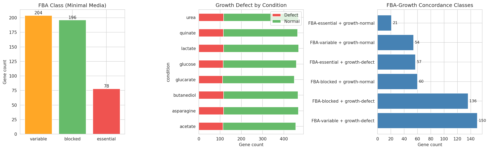
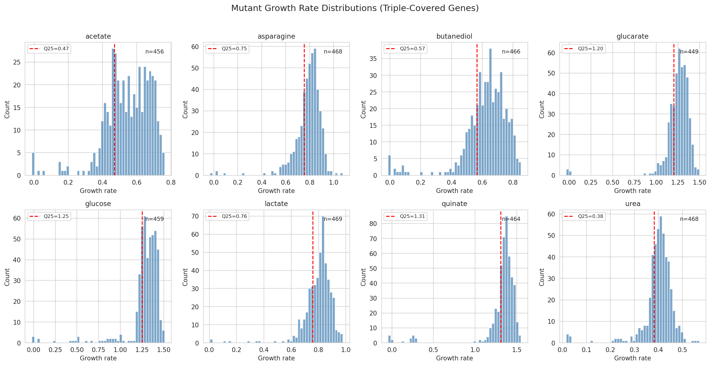

# Report: ADP1 Triple Essentiality Concordance

## Key Findings

### 1. FBA Essentiality Class Does Not Predict Growth Defects Among Dispensable Genes

Among 478 triple-covered genes (all TnSeq-dispensable), FBA class was **not significantly associated** with growth defect status (chi-squared = 0.93, p = 0.63, 2 df). Growth defect rates were nearly identical across FBA classes: essential 73.1%, variable 73.5%, blocked 69.4%. The Kruskal-Wallis test on mean growth rates was also non-significant (H = 1.67, p = 0.43).

This is the central negative finding: FBA's binary classification of genes as essential, variable, or blocked does not predict which TnSeq-dispensable genes have measurable growth defects.

*(Notebook: 02_concordance_analysis.ipynb)*

### 2. The Null Result Is Robust Across Growth Defect Thresholds

A sensitivity analysis testing seven thresholds (Q10 through Q40) confirmed that the null result is not an artifact of the Q25 cutoff. The chi-squared p-value remained above 0.05 for thresholds Q10–Q35, with defect rates tracking in parallel across all three FBA classes. Only at Q40 did a marginal association appear (p = 0.048), driven by a slight divergence in FBA-essential vs FBA-blocked defect rates (90% vs 81%). The threshold-independent Kruskal-Wallis test on continuous mean growth rates confirms no association (H = 1.67, p = 0.43).

| Threshold | % with defect | Essential rate | Variable rate | Blocked rate | chi-squared p |
|-----------|--------------|----------------|---------------|--------------|---------------|
| Q10 | 41% | 41% | 42% | 41% | 0.985 |
| Q15 | 56% | 55% | 57% | 55% | 0.887 |
| Q20 | 65% | 65% | 68% | 62% | 0.405 |
| Q25 | 72% | 73% | 74% | 69% | 0.629 |
| Q30 | 77% | 79% | 79% | 73% | 0.313 |
| Q35 | 82% | 85% | 85% | 77% | 0.058 |
| Q40 | 85% | 90% | 88% | 81% | 0.048 |

*(Notebook: 02_concordance_analysis.ipynb)*

### 3. Growth Measurements Cannot Break FBA-TnSeq Ties

The hypothesis was that growth measurements could adjudicate when FBA and TnSeq disagree. Since all 478 triple-covered genes are TnSeq-dispensable (a biological constraint — TnSeq-essential genes have no viable mutants), the "discordant" genes are the 78 FBA-essential ones. Among these:

- 57/78 (73%) showed growth defects — but this matches the background rate (72% of all 478 genes)
- 21/78 (27%) grew normally — FBA over-predicts

For FBA-blocked genes (zero predicted flux, n=196):
- 136/196 (69%) showed growth defects — FBA under-predicts
- 60/196 (31%) grew normally — consistent with FBA

Growth measurements do not differentially validate FBA-essential vs FBA-blocked predictions because the growth defect rate is uniform across all FBA classes.

*(Notebook: 02_concordance_analysis.ipynb)*

### 4. Condition-Specific FBA Flux Shows Weak, Mixed Correlations with Growth

Per-condition FBA flux predictions showed weak Spearman correlations with measured growth rates across 6 matched carbon sources:

| Condition | n genes | Spearman rho | p-value | Sig. |
|-----------|---------|-------------|---------|------|
| Glucose | 387 | -0.021 | 0.677 | ns |
| Acetate | 352 | -0.153 | 0.004 | ** |
| Asparagine | 286 | -0.257 | <0.001 | *** |
| Butanediol | 137 | -0.145 | 0.092 | ns |
| Glucarate | 127 | +0.246 | 0.005 | ** |
| Lactate | 135 | -0.160 | 0.065 | ns |

Asparagine showed the strongest correlation (rho = -0.257), and the negative direction is biologically expected: higher FBA flux through a gene → greater growth impact when deleted. However, glucarate showed a **positive** correlation (rho = +0.246), opposite to prediction, suggesting condition-specific model inaccuracies.

*(Notebook: 02_concordance_analysis.ipynb)*

### 5. Growth Defects Are Partially Condition-Specific

Of 478 genes, 333 (70%) showed condition-specific growth defects (defect on some but not all conditions). Only 10 genes (2%) had defects across all 8 conditions, and 135 (28%) had no defect on any condition. Mean pairwise defect correlation across conditions was 0.38 (range: -0.03 to 1.0), indicating moderate but not complete overlap in the gene sets required for growth on different carbon sources.

Note: With a Q25 threshold per condition, each condition flags ~25% of genes. The "any defect" aggregation across 8 conditions creates a high background rate by design (expected 1 − 0.75^8 = 90% if conditions were independent; observed 72% reflects positive inter-condition correlation).

*(Notebook: 02_concordance_analysis.ipynb)*

### 6. Aromatic Degradation Genes Are Enriched Among FBA-Discordant Genes

Using RAST function annotations (100% gene coverage), two functional categories showed significant enrichment among the 157 discordant genes (Fisher's exact test, BH-FDR correction):

- **Aromatic degradation**: strongly enriched (OR = 9.70, q = 0.012) — 9 of 11 aromatic degradation genes are discordant. These include beta-ketoadipate pathway enzymes (4-carboxymuconolactone decarboxylase, beta-ketoadipate enol-lactone hydrolase) central to ADP1's well-characterized aromatic compound catabolism. Almost all are FBA-under-predicted (blocked + growth defect), meaning the FBA model assigns zero flux to these genes, yet their deletion impairs growth.

- **Lipid metabolism**: depleted (OR = 0.34, q = 0.042) — only 7 of 46 lipid metabolism genes are discordant. This suggests the FBA model handles lipid pathways more accurately than aromatic catabolism.

The directional analysis confirmed that enrichment is driven by the FBA-under-prediction class (blocked + growth defect): aromatic degradation OR = 12.0, q = 0.004.

Pangenome status was overwhelmingly core across all classes (93–100%), with no significant enrichment in discordant genes (Fisher OR = 0.89, p = 0.80).

*(Notebook: 03_discordant_characterization.ipynb)*

## Results

### Data Assembly

The triple-covered gene set was defined as genes with all three measures: TnSeq essentiality (minimal media), FBA class (minimal media), and at least one mutant growth measurement. This yielded **478 genes** from the 5,852 total in the ADP1 genome.

Key properties of the triple set:
- All 478 are TnSeq-dispensable (expected: TnSeq-essential genes lack viable mutants)
- FBA class: 78 essential (16%), 204 variable (43%), 196 blocked (41%)
- Growth data available for 449–469 genes per condition (94–98% coverage)
- Growth defect threshold: 25th percentile per condition
- 72% of genes showed a growth defect on at least one of 8 conditions
- Per-condition FBA flux available for 6 of 8 conditions (131–406 genes)
- 477/478 genes mapped to pangenome clusters (96% core)

### FBA-Growth Agreement

The concordance rate (FBA-essential with defect + FBA-blocked without defect) was 117/274 = 42.7% — worse than random chance (50%) — because the high background rate of growth defects (72%) means most FBA-blocked genes also show defects.

Pairwise Mann-Whitney U tests confirmed no significant growth rate differences between FBA classes (essential vs variable: p=0.26; essential vs blocked: p=0.93; variable vs blocked: p=0.29).

### Functional Characterization of Discordant Genes

RAST functional categories were assigned to all 478 genes based on keyword matching against RAST annotations. The largest categories were: Other metabolism (32%), Energy/Redox (19%), Transport (16%), Lipid metabolism (10%), and Modification enzymes (7%).

The FBA-under-predicted class (136 genes where FBA predicts zero flux but mutants show growth defects) was dominated by:
- Acetyltransferases (GNAT family, 4 genes)
- Beta-ketoadipate/aromatic degradation enzymes (4-carboxymuconolactone decarboxylase, beta-ketoadipate enol-lactone hydrolase)
- Alkanesulfonate transport/metabolism (SsuA, 5 genes)
- Oxidative stress response (glutathione peroxidase, thioredoxin peroxidase)

## Interpretation

### The Negative Finding Is Informative

The central result — FBA class does not predict growth defects among TnSeq-dispensable genes — is biologically meaningful rather than a methodological failure. It reveals a fundamental limitation of binary FBA essentiality classification:

1. **FBA essentiality is a threshold concept**: FBA predicts whether a gene knockout reduces growth to zero, not the magnitude of growth reduction. A gene with 95% of wild-type growth and a gene with 5% are both "dispensable" to TnSeq and may both be "essential" or "blocked" in FBA depending on flux routing.

2. **Growth assays measure a continuum**: The mutant growth data captures a continuous spectrum of fitness effects that the binary FBA classification cannot resolve.

3. **The sensitivity analysis confirms robustness**: The null result holds across thresholds from Q10 to Q35, and the threshold-independent Kruskal-Wallis test (p = 0.43) rules out threshold artifacts. Only at Q40 does a marginal signal appear (p = 0.048), and this disappears with the continuous test.

### Aromatic Catabolism Explains Most FBA Discordance

The enrichment of aromatic degradation genes among FBA-discordant genes (OR = 9.70) provides a mechanistic explanation for the largest class of discordance. ADP1 is renowned for its diverse aromatic compound metabolism — the beta-ketoadipate pathway is one of its best-characterized features (Barbe et al. 2004). The FBA model predicts zero flux through these genes because its minimal media definition likely lacks aromatic substrates. However, the experimental growth medium may contain trace aromatic compounds (from yeast extract or agar impurities), or aromatic catabolism genes may have moonlighting functions in cellular homeostasis. This represents a systematic gap in the FBA model's environmental assumptions rather than a metabolic network error.

The depletion of lipid metabolism from discordant genes (OR = 0.34) suggests that lipid biosynthesis pathways — essential for membrane integrity — are well-captured by the FBA model, consistent with their central role in core metabolism.

### Literature Context

- **Durot et al. (2008)** reported ~75% concordance between FBA and TnSeq essentiality for ADP1, comparing essential vs dispensable predictions. Our analysis addresses a different question — within TnSeq-dispensable genes, does FBA predict growth importance — and finds it does not. This is consistent with Durot's finding that FBA works best for the binary essential/dispensable boundary but poorly for quantitative growth predictions.

- **Guzman et al. (2018)** argued for "reframing gene essentiality in terms of adaptive flexibility," proposing that gene importance is condition-dependent and continuous rather than binary. Our finding of condition-specific growth defects (70% of genes) strongly supports this framework.

- **Barbe et al. (2004)** described ADP1's metabolic versatility, particularly its aromatic compound degradation capabilities. Our finding that aromatic catabolism genes are the primary source of FBA discordance connects the model's limitations to ADP1's distinctive biology.

- **Suárez et al. (2020)** used both FBA and Tn-Seq to guide ADP1 genome streamlining, combining both methods. Our results suggest that neither method alone captures the full picture — growth measurements add an independent, graded axis that neither FBA nor TnSeq provides.

### Novel Contribution

This analysis provides the first systematic three-way comparison of FBA predictions, TnSeq essentiality, and direct mutant growth phenotypes for ADP1. The key novel findings are:

1. FBA's distinction between essential, variable, and blocked genes carries **no predictive power for growth defect status** among dispensable genes (p = 0.63), robust across Q10–Q35 thresholds.
2. Aromatic degradation genes are the primary source of FBA-growth discordance (OR = 9.7), pointing to environmental assumptions in the FBA model as the main source of prediction error.
3. Growth assays on multiple carbon sources provide genuinely independent information about gene importance — 70% of genes show condition-specific defects that neither FBA nor TnSeq captures.

### Limitations

1. **Growth defect threshold**: Although the Q25 cutoff is arbitrary, the sensitivity analysis (Q10–Q40) shows the null result is robust. The "any defect across 8 conditions" aggregation inflates the background rate (72%), making it harder for any predictor to differentiate.
2. **All genes are TnSeq-dispensable**: By construction, TnSeq-essential genes cannot be in this analysis. The 74% FBA-TnSeq concordance from the explorer project applies to the full set; this analysis addresses only the dispensable subset.
3. **RAST category assignment is approximate**: Functional categories were assigned by keyword matching against RAST annotations. Some assignments may be incorrect, particularly for multi-domain proteins or genes with ambiguous descriptions. The "Other metabolism" category (32%) captures genes not matched by any keyword pattern.
4. **Growth data uses ratios, not absolute rates**: The growth measurements are ratios relative to wild-type, which may compress or distort the dynamic range of fitness effects.
5. **FBA model vintage**: The ADP1 FBA model may not capture all metabolic pathways, particularly for non-standard carbon sources. The positive glucarate correlation (opposite to expected) and the aromatic catabolism discordance both suggest condition-specific model gaps.

## Data

### Sources
| Collection | Tables Used | Purpose |
|------------|-------------|---------|
| `user_data/berdl_tables.db` | `genome_features`, `gene_phenotypes` | TnSeq essentiality, FBA classes, mutant growth rates, per-condition FBA flux |
| `kbase_ke_pangenome` | via `cluster_id_mapping.csv` | Core/accessory gene classification |

### Generated Data
| File | Rows | Description |
|------|------|-------------|
| `data/triple_gene_table.csv` | 478 | Integrated table: TnSeq + FBA + growth + annotations for triple-covered genes |
| `data/cluster_id_mapping.csv` | 4,891 | BERDL-to-ADP1 pangenome cluster ID mappings |

## Supporting Evidence

### Notebooks
| Notebook | Purpose |
|----------|---------|
| `01_data_assembly.ipynb` | Build 478-gene triple table from SQLite, define growth defect thresholds, join FBA flux and pangenome annotations |
| `02_concordance_analysis.ipynb` | Triple concordance matrix, Kruskal-Wallis/Mann-Whitney tests, threshold sensitivity analysis, condition-specific FBA flux vs growth correlations |
| `03_discordant_characterization.ipynb` | RAST functional category enrichment (Fisher exact + BH-FDR), pangenome status, functional annotation of discordant genes |

### Figures
| Figure | Description |
|--------|-------------|
| `data_assembly_overview.png` | FBA class distribution, growth defect by condition, concordance class counts |
| `growth_rate_distributions.png` | Per-condition growth rate histograms with Q25 thresholds |
| `fba_growth_concordance.png` | FBA class vs growth defect heatmap and defect rate bar chart |
| `growth_by_fba_class.png` | Violin and box plots of growth rate by FBA class |
| `threshold_sensitivity.png` | Defect rate by FBA class and chi-squared p-value across Q10–Q40 thresholds |
| `flux_vs_growth_scatter.png` | Per-condition FBA flux vs growth rate scatter plots with Spearman correlations |
| `defect_condition_correlation.png` | Inter-condition growth defect correlation heatmap |
| `rast_enrichment_discordant.png` | RAST functional category enrichment in discordant genes (log2 odds ratio) |
| `rast_by_discordance_class.png` | RAST functional category distribution heatmap across concordance classes |
| `pangenome_discordance.png` | Core gene fraction by concordance class |

## Future Directions

1. **Continuous FBA flux analysis**: Instead of binary FBA class, use the continuous `minimal_media_flux` values to predict growth rate magnitude. Linear or rank-based regression may capture what the categorical classification misses.
2. **Aromatic compound investigation**: Add aromatic substrates to the FBA model's minimal media definition and test whether the discordance in beta-ketoadipate pathway genes resolves. This would confirm whether environmental assumptions drive the observed discordance.
3. **Condition-specific FBA simulations**: Run FBA on each carbon source separately (not just minimal media) and compare condition-matched predictions against condition-matched growth data.
4. **KEGG pathway enrichment**: With 85% KO coverage, a KEGG-based enrichment analysis could reveal pathway-level patterns that the broad RAST categories may miss.
5. **Expand to other Acinetobacter species**: Test whether the FBA-growth relationship holds across the 14-genome pangenome, particularly for species with different aromatic degradation capabilities.

## References

- Durot M, Le Fèvre F, de Berardinis V, Kreimeyer A, Vallenet D, Combe C, Smidtas S, Salanoubat M, Weissenbach J, Schachter V (2008). "Iterative reconstruction of a global metabolic model of Acinetobacter baylyi ADP1 using high-throughput growth phenotype and gene essentiality data." *BMC Systems Biology* 2:85.
- de Berardinis V, Vallenet D, Castelli V, Besnard M, Pinet A, Cruaud C, Samair S, Lechaplais C, Gyapay G, Riber C, Zaber F, Pelletier E, Weissenbach J, Salanoubat M (2008). "A complete collection of single-gene deletion mutants of Acinetobacter baylyi ADP1." *Molecular Systems Biology* 4:174.
- Barbe V, Vallenet D, Fonknechten N, Kreimeyer A, Oztas S, Labarre L, Cruveiller S, Robert C, Duprat S, Wincker P, Ornston LN, Weissenbach J, Marlière P, Cohen GN, Médigue C (2004). "Unique features revealed by the genome sequence of Acinetobacter sp. ADP1, a versatile and naturally transformation competent bacterium." *Nucleic Acids Research* 32(19):5766-5779.
- Guzman GI, Olson CA, Hefner Y, Phaneuf PV, Catoiu E, Crepaldi LB, Mih N, Feist AM, Palsson BO (2018). "Reframing gene essentiality in terms of adaptive flexibility." *BMC Systems Biology* 12:143.
- Suárez GA, Dugan KR, Renda BA, Dasgupta A, Barrick JE (2020). "Rapid and assured genetic engineering methods applied to Acinetobacter baylyi ADP1 genome streamlining." *Nucleic Acids Research* 48(8):4585-4600.
