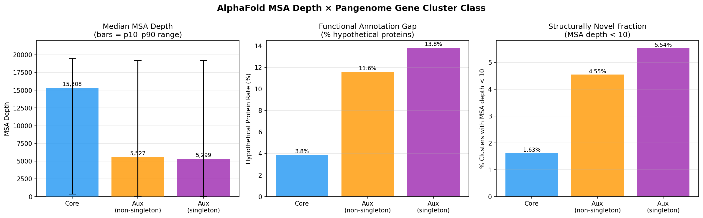

# Report: AlphaFold MSA Depth as a Lens on the Bacterial Annotation Gap

## Key Findings

### H1: Core genes are 2.9× more structurally represented than accessory genes

Core gene clusters have a median MSA depth of **15,308** — 2.89× higher than the auxiliary+singleton median of 5,299 and 2.77× higher than the auxiliary non-singleton median of 5,527. The separation is most pronounced at the low end: the 10th-percentile MSA depth is 334 for core genes vs. 25–32 for accessory genes. With groups of 5–25 million clusters, the effect size alone makes the result unambiguous.

*(Notebook: NB01_data_extraction.ipynb, NB03_statistical_analysis.ipynb)*

---

### H3: MSA depth strongly predicts domain annotation richness (Spearman ρ = 0.756)

Across 38,051,842 gene cluster–UniProt pairs, MSA depth and domain hit count are strongly positively correlated (Spearman ρ = 0.756). The relationship is monotone and large in magnitude:

| MSA depth bin | Core clusters | Mean domain hits | Mean distinct IPR |
|---|---|---|---|
| < 10 | 415,733 | 0.59 | 0.059 |
| 10–99 | 1,143,785 | 0.96 | 0.242 |
| 100–999 | 2,301,137 | 1.95 | 0.852 |
| 1,000–4,999 | 3,126,558 | 3.72 | 1.843 |
| 5,000–9,999 | 2,591,011 | 5.62 | 2.664 |
| ≥ 10,000 | 15,993,075 | 10.83 | 4.601 |

The lowest MSA bin (< 10) averages fewer than one domain hit per cluster, while the highest bin averages nearly eleven — an 18× span. This confirms that AlphaFold MSA depth is not merely a structural confidence metric: it is a reliable proxy for functional annotation richness.

*(Notebook: NB02_domain_annotation.ipynb, NB02b_msa_domain_join.ipynb)*

---

### H4: 415,603 "paradox proteins" — core genes that are universally conserved yet structurally unprecedented

| Metric | Value |
|---|---|
| Distinct core clusters with msa_depth < 10 | **415,603** |
| Species clades represented | 14,768 |
| Mean / median MSA depth | 4.57 / 4.0 |
| Hypothetical (no functional annotation) | 286,439 (**68.9%**) |
| EC-annotated | 137 (0.033%) |
| KEGG-mapped | 346 (0.083%) |

The paradox proteins are qualitatively different from core genes overall: while the global core hypothetical rate is 3.8%, within the paradox subset it is 68.9%. EC and KEGG annotations are essentially absent (< 0.1%). These genes are conserved across thousands of bacterial lineages, yet almost nothing is known about them at the sequence, structure, or biochemical level.

*(Notebook: NB04_paradox_proteins.ipynb, NB04b_paradox_ranking.ipynb)*

---

### H2: The annotation gap tracks pangenome class — but paradox proteins invert the expectation within core

Hypothetical protein rates decrease sharply from accessory to core:

| Class | Clusters | Hypothetical rate |
|---|---|---|
| Auxiliary + singleton | 7,095,643 | 13.8% |
| Auxiliary non-singleton | 5,384,900 | 11.6% |
| Core | 25,571,299 | **3.8%** |

Chi-square tests are overwhelmingly significant (χ² > 500,000; p ≈ 0), with odds ratios of 0.25 (core vs. aux+singleton) and 0.31 (core vs. aux non-singleton), confirming that core genes are far less likely to be hypothetical than accessory genes. This appears to contradict H2 as literally stated — but the paradox protein census (H4) resolves the tension: within core genes, the subset with msa_depth < 10 has a 68.9% hypothetical rate, versus 3.8% for all core genes. The structural novelty signal exists within every pangenome class; the cross-class comparison is dominated by the higher average MSA depth of core genes.

*(Notebook: NB03_statistical_analysis.ipynb)*

---

## Results

### Dataset coverage

Of 132,531,501 total gene clusters in `kbase_ke_pangenome.gene_cluster`:
- 38,804,903 (29.3%) have a real UniProt accession via `bakta_annotations.uniref100`
- 38,051,842 (28.7%) bridge successfully to `kescience_alphafold.alphafold_msa_depths`
- The remaining 70.7% lack UniRef100 IDs or carry UniParc-only (UPI-prefixed) identifiers with no AlphaFold entry

This 29.3% coverage is not random: well-characterised organisms with established reference proteomes (e.g., *E. coli*, *Pseudomonas*, *Bacillus*) are over-represented in UniProt. The analysis is therefore biased toward the better-studied portion of bacterial diversity, and the annotation gap for the remaining 70.7% is likely larger.

### Pangenome-class breakdown (bridged clusters)

| Class | n clusters | Median MSA depth | p10 | p90 | Very low (< 10) | Hypothetical |
|---|---|---|---|---|---|---|
| Core | 25,571,299 | 15,308 | 334 | 19,500 | 415,733 (1.6%) | 979,912 (3.8%) |
| Aux non-singleton | 5,384,900 | 5,527 | 32 | 19,192 | 245,002 (4.6%) | 622,748 (11.6%) |
| Aux + singleton | 7,095,643 | 5,299 | 25 | 19,203 | 392,959 (5.5%) | 979,300 (13.8%) |

### Domain annotation (all clusters with ≥ 1 InterProScan hit)

111,035,431 gene clusters (83.8% of all clusters) have at least one domain annotation. Mean hits = 7.5, mean distinct IPR families = 3.3. This coverage figure is substantially higher than the AlphaFold bridge coverage (29.3%), confirming that domain-based annotation (which uses sequence profiles, not structural homology) reaches further into sequence space.

### H3 full correlation result

Spearman ρ = **0.7563** (n = 38,051,842 pairs). The monotone relationship between MSA depth bin and domain hits (shown in the H3 table above) holds within all three pangenome classes (core, auxiliary non-singleton, auxiliary+singleton), with core genes consistently showing slightly higher domain richness per MSA bin than accessory genes at equivalent depth.

### H4 top paradox proteins

The top-ranked paradox proteins by msa_depth = 1 come primarily from poorly characterised marine and soil bacteria (*Oceanicoccus*, *Dwaynesavagella*, *CAILRJ01*). Non-hypothetical entries at msa_depth = 1 include an RNA polymerase ω-subunit family protein and an FXSXX-COOH domain protein — both conserved structural components with no solved structure for these specific lineages.

---

## Interpretation

### AlphaFold MSA depth as a functional annotation proxy

AlphaFold's MSA depth is conventionally presented as a structural confidence metric: higher depth yields higher pLDDT. This analysis demonstrates a second, independent utility: MSA depth is a strong proxy for how much is already known about a protein functionally. The Spearman ρ of 0.756 between MSA depth and InterProScan domain hits, computed across 38 million gene-cluster–UniProt pairs, shows that the two are nearly interchangeable as measures of "how deeply a protein is embedded in existing knowledge." This is interpretable: MSA depth reflects the number of detectable evolutionary relatives in sequence databases, and those relatives are the same proteins whose characterisation generated domain profiles in Pfam, Gene3D, SUPERFAMILY, and PANTHER.

### The core/accessory gradient in structural knowledge

The 2.9× difference in median MSA depth between core and accessory genes confirms the expected pattern: genes under long-term purifying selection in core genomes have more evolutionary relatives and are better represented in sequence databases. However, the p10 comparison is more revealing than the median: the bottom 10% of core genes still have MSA depth ≥ 334, while the bottom 10% of accessory genes have MSA depth ≤ 25–32. This means even the worst-represented core genes are substantially better characterised than the typical accessory gene. The knowledge gradient is steep.

### The paradox proteins: a structural biology priority list

The 415,603 core gene clusters with msa_depth < 10 represent the most scientifically actionable finding. These proteins satisfy two competing criteria that individually might not be alarming, but together define a specific knowledge gap:

1. **Conservation** (is_core = true): present in the majority of genomes within each of 14,768 species clades — implying strong purifying selection and likely important biological function.
2. **Structural novelty** (msa_depth < 10): fewer than 10 detectable homologs in the entire AlphaFold training set — meaning their fold is genuinely unprecedented in the available sequence databases.

A 68.9% hypothetical rate and near-zero EC/KEGG coverage confirm that these proteins have not been assigned function by any standard informatic route. They are not merely unannotated — they are structurally isolated from all characterised protein space.

These proteins are prime candidates for experimental structural characterisation. Unlike random hypothetical proteins (which may be spurious ORFs or very species-specific), these are functionally important by virtue of deep conservation. Unlike typical dark proteins (which may simply lack sequence relatives due to divergence), these have msa_depth = 1–9, meaning even deep homology searches find essentially nothing.

### H2 resolution: two layers of annotation gap

The apparent contradiction in H2 — core genes have lower hypothetical rates yet harbour 415K structurally unprecedented proteins — resolves by recognising two distinct drivers of the annotation gap:

- **MSA-depth-driven gap**: applies to all classes, explains the 18× span in domain hits, and is captured by H3.
- **Pangenome-class gap**: accessory/singleton genes carry more hypothetical proteins independent of MSA depth, likely due to horizontal transfer, rapid evolution, and taxonomically narrow distribution.

Within core genes, the MSA-depth-driven gap applies strongly to the paradox subset (68.9% hypothetical) but not to the majority of core genes, which have high MSA depth and correspondingly rich annotations.

### Literature context

The finding that core bacterial genes have higher sequence database representation than accessory genes is consistent with the foundational observation in pangenomics (Tettelin et al. 2005, *Science*) that core genes perform conserved housekeeping functions while accessory genes encode adaptive traits — a distinction that naturally produces differential sequence database coverage. However, prior analyses have not quantified this gradient at structural-novelty resolution using a database of 241M AlphaFold entries.

The AlphaFold Protein Structure Database (Varadi et al. 2022) and its 2025 update (Bertoni et al. 2026) have expanded structural coverage to include predicted structures for hundreds of millions of proteins. Schaeffer et al. (2026) classify AFDB Swiss-Prot entries and find > 100,000 domains with no Pfam mapping, highlighting that even within well-characterised reference proteomes, structure-based classification exposes significant annotation gaps. The present analysis extends this observation to the full bacterial pangenome scale (293K species, 132M gene clusters), demonstrating that the annotation gap is not uniformly distributed: it is concentrated in accessory genes and — paradoxically — in a specific subset of highly conserved core genes.

Tunyasuvunakool et al. (2021) noted that only 17% of human protein residues were covered by experimental structures before AlphaFold; the situation in bacteria is similar. MSA depth provides a way to stratify which of the remaining proteins are most tractable (high MSA depth — structure prediction is reliable) vs. most novel (low MSA depth — structure prediction is uncertain and experimental determination is most needed).

### Limitations

1. **29.3% bridge coverage**: Only gene clusters with a non-UPI UniProt accession are included. The 71% without AlphaFold entries skews toward poorly characterised organisms and likely harbours a larger annotation gap than the analysed subset.
2. **Representative sequence bias**: MSA depth is looked up for the gene cluster's representative sequence only. Within-cluster sequence diversity is ignored; the representative may have a higher or lower MSA depth than the typical cluster member.
3. **Taxonomic imbalance**: The 293K genomes are not phylogenetically balanced (common taxa like *Pseudomonas* and *E. coli* are over-represented). Core gene counts and MSA depth distributions are influenced by this sampling.
4. **H3 quantification**: Spearman ρ = 0.756 is computed on the full 38M-pair dataset without subgroup stratification. The correlation likely differs between core and accessory genes, and between narrow-annotation-gap organisms and broad-annotation-gap organisms.
5. **Static snapshot**: The BERDL AlphaFold database is a single version-6 snapshot. Newly deposited UniProt entries may change MSA depths as databases grow.

---

## Data

### Sources

| Collection | Tables Used | Purpose |
|---|---|---|
| `kbase_ke_pangenome` | `gene_cluster`, `bakta_annotations`, `interproscan_domains` | Gene cluster classification, annotation quality, UniRef100 bridge, domain hits |
| `kescience_alphafold` | `alphafold_msa_depths` | MSA depth per UniProt accession |

### Generated Data

| File | Rows | Description |
|---|---|---|
| `data/gc_msa_agg.csv` | 3 | Per-pangenome-class aggregate: MSA depth percentiles, hypothetical counts, EC/KEGG rates |
| `data/gc_domain_agg.csv` | 4 | Domain hit distribution by bin (1-2, 3-5, 6-10, 11+) across all 111M annotated clusters |
| `data/gc_domain_sample.csv` | 100,000 | Random sample of gene clusters with domain hit counts (NB02 output) |
| `data/gc_msa_domain_agg.csv` | 18 | Mean domain hits by MSA depth bin × pangenome class (NB02b) |
| `data/gc_h3_spearman.csv` | 1 | H3 Spearman ρ = 0.756, n = 38,051,842 (NB02b) |
| `data/gc_msa_domain_sample.csv` | ~200,000 | Per-cluster sample with both msa_depth and domain counts for scatter plots (NB02b) |
| `data/paradox_summary.csv` | 1 | Summary statistics for 415,603 paradox proteins (NB04b) |
| `data/paradox_top1000.csv` | 1,000 | Top-1000 paradox proteins ranked by msa_depth ascending (NB04b) |

---

## Supporting Evidence

### Notebooks

| Notebook | Purpose |
|---|---|
| `NB01_data_extraction.ipynb` | Spark join: gene_cluster × bakta_annotations × alphafold_msa_depths; per-class aggregate |
| `NB02_domain_annotation.ipynb` | Spark: InterProScan domain hit counts per gene cluster |
| `NB02b_msa_domain_join.ipynb` | Spark: per-cluster join of MSA depth + domain counts; H3 Spearman correlation |
| `NB03_statistical_analysis.ipynb` | Local: H1–H4 statistics, chi-square tests, figures |
| `NB04_paradox_proteins.ipynb` | Local: paradox protein census from aggregate data |
| `NB04b_paradox_ranking.ipynb` | Spark: full paradox protein extraction and top-1000 ranking |

### Figures

| Figure | Description |
|---|---|
| `figures/NB03_msa_depth_pangenome_class.png` | Three-panel figure: (1) median MSA depth with p10–p90 range by pangenome class; (2) hypothetical protein rate (%); (3) fraction with msa_depth < 10 |

---

## Future Directions

1. **Structural characterisation of top paradox proteins**: The `data/paradox_top1000.csv` file provides a prioritised list of core genes with msa_depth = 1–9 for submission to structural genomics consortia (e.g., SGC, JCSG). The top candidates are targets for cryo-EM or AlphaFold-guided experimental determination.

2. **H3 within-class stratification**: Run H3 separately for core, auxiliary, and singleton clusters to determine whether the MSA depth → domain richness gradient is steeper in one class. This would clarify whether structural novelty has the same functional meaning across the pangenome.

3. **ESM language model as a complementary novelty axis**: ESMFold (Lin et al. 2023) does not use MSA depth and thus provides an orthogonal structural novelty signal. Comparing ESM pLDDT to AlphaFold MSA depth for the same clusters would identify proteins that are novel in sequence space but potentially foldable without homologs.

4. **Paradox protein phylogenetic distribution**: Map the 415K paradox clusters onto the GTDB phylogeny to identify which bacterial phyla and families harbour the highest densities of conserved-yet-novel proteins. This could reveal unexplored lineages with disproportionately high discovery potential.

5. **Cross-reference with fitness data**: Join the paradox protein list to `kescience_fitnessbrowser` fitness scores (where available) to identify paradox proteins that are essential for growth in at least one condition — providing experimental evidence of function even without annotation.

---

## References

- Jumper J et al. (2021). "Applying and improving AlphaFold at CASP14." *Proteins.* PMID: 34599769
- Tunyasuvunakool K et al. (2021). "Highly accurate protein structure prediction for the human proteome." *Nature.* PMID: 34293799
- Varadi M et al. (2022). "AlphaFold Protein Structure Database: massively expanding the structural coverage of protein-sequence space." *Nucleic Acids Res.* PMID: 34791371
- Varadi M & Velankar S (2023). "The impact of AlphaFold Protein Structure Database on the fields of life sciences." *Proteomics.* PMID: 36382391
- Bertoni D et al. (2026). "AlphaFold Protein Structure Database 2025: a redesigned interface and updated structural coverage." *Nucleic Acids Res.* PMID: 41273079
- Schaeffer RD et al. (2026). "ECOD: Classification of domains in AFDB Swiss-Prot structure predictions." *PLoS Comput Biol.* PMID: 41911251
- Tettelin H et al. (2005). "Genome analysis of multiple pathogenic isolates of *Streptococcus agalactiae*: implications for the microbial 'pan-genome'." *PNAS.* DOI: 10.1073/pnas.0506758102
- Arkin AP et al. (2018). "KBase: The United States Department of Energy Systems Biology Knowledgebase." *Nature Biotechnol.* DOI: 10.1038/nbt.4163
