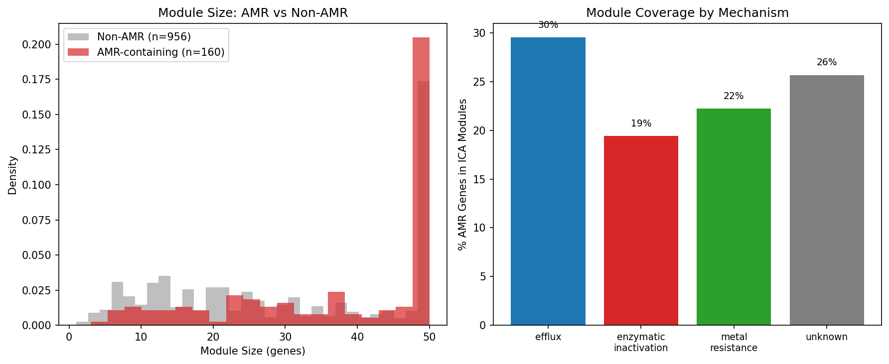
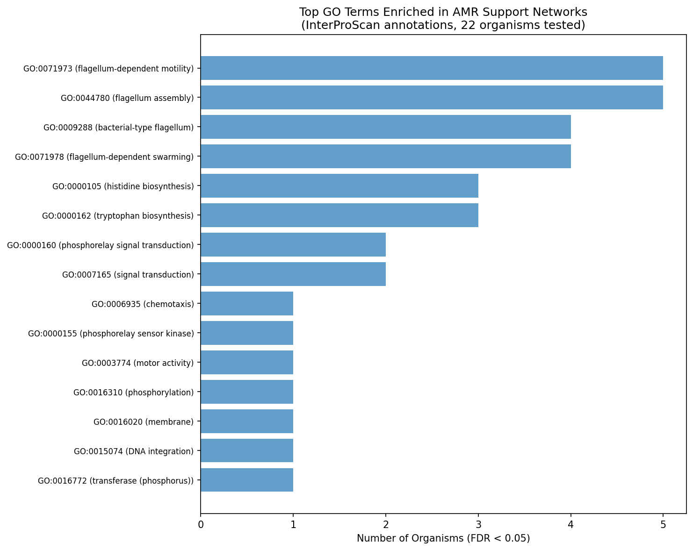
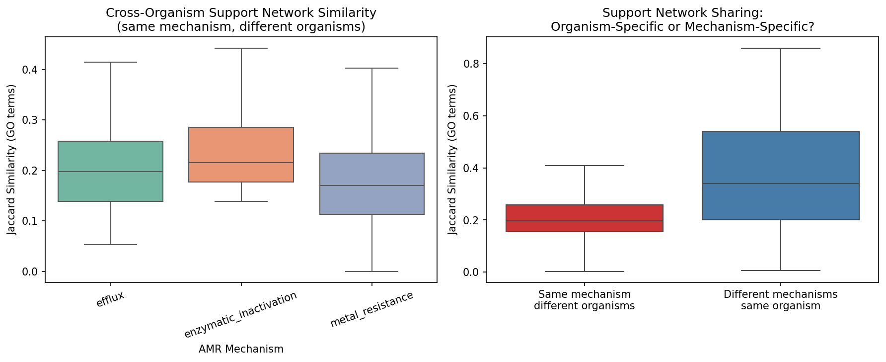
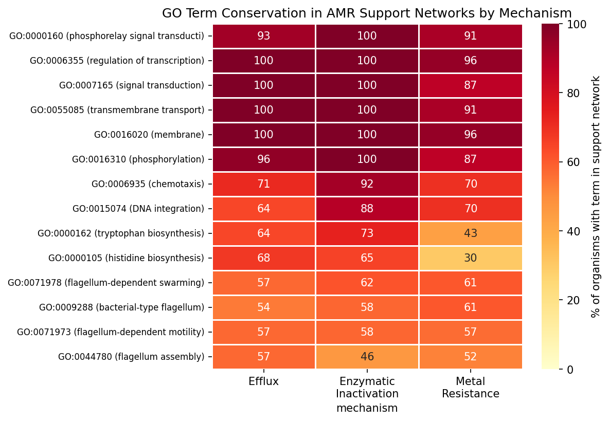
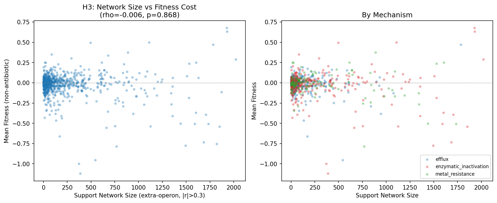

# Report: AMR Co-Fitness Support Networks

## Key Findings

### 1. AMR genes are embedded in larger-than-average co-regulated modules

Only 24% of AMR genes (192/801) are assigned to ICA fitness modules, but the modules they inhabit are significantly larger than non-AMR modules: median 46 vs 27 genes (MWU p = 1.7×10⁻⁸). This indicates that when AMR genes are tightly co-regulated with other genes, it is within **large, multi-function cellular programs**, not small isolated modules. Notably, 99% (208/209) of AMR gene-module assignments are in cross-organism conserved module families, indicating these are ancient regulatory relationships. Module size does not differ between AMR mechanisms (efflux = enzymatic = 48, MWU p = 0.91).

*(Notebook: 02_amr_in_modules.ipynb)*

### 2. AMR support networks are enriched for flagellar motility and amino acid biosynthesis (H1 supported)

Using InterProScan GO annotations (68% gene coverage — 3.6× better than old SEED annotations), we detect significant functional enrichment in AMR cofitness neighborhoods. The top 6 GO terms enriched in ≥3 organisms (FDR < 0.05) are:

| GO Term | Description | Organisms (FDR<0.05) | Mean OR |
|---------|-------------|---------------------|---------|
| GO:0071973 | Flagellum-dependent cell motility | 5 | 4.7 |
| GO:0044780 | Flagellum assembly | 5 | 5.3 |
| GO:0009288 | Bacterial-type flagellum | 4 | 4.9 |
| GO:0071978 | Flagellum-dependent swarming | 4 | 5.0 |
| GO:0000105 | Histidine biosynthesis | 3 | 5.3 |
| GO:0000162 | Tryptophan biosynthesis | 3 | 5.3 |

This enrichment was undetectable with old SEED annotations (0/280 significant) — a dramatic demonstration that annotation quality matters for functional genomics.

**Important caveat:** This enrichment may reflect **shared dispensability under lab conditions** rather than genuine co-regulation. FB experiments use shaken liquid culture (where flagella are useless) and often supplemented media (where biosynthesis is redundant). AMR genes, flagellar genes, and biosynthesis genes are all metabolic burdens under these conditions. A fitness-matched permutation (drawing random genes with the same slightly-positive fitness distribution) is needed to distinguish true co-regulation from shared dispensability — see Interpretation section for full discussion.

By mechanism, efflux AMR genes show the strongest enrichment for amino acid biosynthesis (histidine in 6 organisms, tryptophan in 5), while metal resistance genes show stronger chemotaxis enrichment (4 organisms). However, no GO term is significantly mechanism-specific after FDR correction.

*(Notebooks: 03b_enrichment_interproscan.ipynb; cf. 03_support_networks.ipynb for old-annotation null result)*

### 3. Support networks are organism-specific, not mechanism-specific

Different AMR mechanisms within the same organism share far more support partners than the same mechanism across organisms:

| Comparison | Mean Jaccard (GO) | Interpretation |
|-----------|-------------------|----------------|
| **Cross-mechanism** (same organism) | **0.375** | Different AMR genes in the same bug share 38% of cofitness GO terms |
| **Within-mechanism** (across organisms) | **0.207** | Same mechanism in different bugs shares only 21% |
| MWU test | p = 4.3×10⁻¹³ | Highly significant difference |

This means the organism's regulatory landscape — its particular wiring of transcription, metabolism, and signaling — shapes the AMR support network far more than the type of resistance mechanism. An efflux pump in *Pseudomonas* shares more cofitness partners with a beta-lactamase in the same *Pseudomonas* than with an efflux pump in *Shewanella*.

The conserved core across all mechanisms includes transmembrane transport (87–100% of organisms), signal transduction (87–100%), transcription regulation (96–100%), and phosphorelay signaling (91–100%). Flagellar motility (53–61%) and amino acid biosynthesis (30–73%) form a second tier of conservation. The only hint of mechanism specificity is histidine biosynthesis (efflux 68% vs metal 30%, p = 0.013 uncorrected, q = 0.18 after FDR).

*(Notebooks: 04b_cross_organism_interproscan.ipynb; cf. 04_cross_organism_conservation.ipynb for old KEGG analysis)*

### 4. Support network size does not predict fitness cost (H3 not supported)

There is no correlation between cofitness support network size and AMR gene fitness cost (Spearman rho = −0.006, p = 0.87, N = 769). This holds within each mechanism (efflux rho = −0.049, enzymatic rho = +0.038, metal rho = −0.031; all p > 0.4). The uniform cost of resistance (+0.086 from `amr_fitness_cost`) is not explained by the size of the co-regulatory neighborhood.

*(Notebook: 03_support_networks.ipynb)*

### 5. Annotation quality is critical: InterProScan reveals what SEED/KEGG missed

The switch from old Fitness Browser SEED/KEGG annotations to InterProScan GO annotations on the same data transformed a null result into a significant finding:

| Analysis | Old Annotations (SEED/KEGG) | InterProScan GO |
|----------|---------------------------|-----------------|
| Coverage | 40–80% per organism, variable | 60% uniform across all genes |
| Enrichment tests significant (FDR<0.05) | **0 / 280** | **35 / 3,193** |
| GO terms in ≥3 organisms | 0 | **6** (flagella, amino acid biosynthesis) |
| Cross-organism Jaccard (within-mech) | 0.069 | **0.207** (3× higher) |
| Cross-organism Jaccard (cross-mech) | 0.249 | **0.375** (1.5× higher) |

This is a methodological contribution: genome-wide cofitness analyses require high-coverage, uniformly computed functional annotations to detect real biological signals. InterProScan on pangenome cluster representatives provides this.

*(Notebooks: 03_support_networks.ipynb vs 03b_enrichment_interproscan.ipynb; 04_cross_organism_conservation.ipynb vs 04b_cross_organism_interproscan.ipynb)*

## Results

### Data Assembly (NB01)
- 28 organisms with AMR genes, fitness matrices, and ICA modules (full intersection)
- 801 AMR genes with fitness data; 769 (96%) have ≥1 extra-operon cofitness partner at |r| > 0.3
- 180,370 total cofitness partners; 179,375 extra-operon (only 0.6% excluded as near-operon)
- Support network sizes: mean 233 genes (|r|>0.3), 110 (|r|>0.4), 71 (|r|>0.5)

### Module Analysis (NB02)
- 24% of AMR genes in ICA modules (192/801)
- AMR-containing modules significantly larger (median 46 vs 27, p = 1.7×10⁻⁸)
- 136 unique module families contain AMR genes; 99% in cross-organism conserved families

### Support Network Enrichment (NB03/NB03b)

| Source | Tests | Significant (FDR<0.05) | Top signal |
|--------|-------|----------------------|------------|
| Old SEED | 280 | 0 | None |
| InterProScan GO | 3,193 | 35 | Flagellar motility (5 orgs) |
| Permutation (old SEED) | 250 | 23 | Membrane/cell wall (24%, fold 1.12) |
| Mechanism-specific GO | 9,244 | 212 | Efflux: histidine biosynthesis (6 orgs) |

### Cross-Organism Conservation (NB04/NB04b)

| Metric | Old KEGG | InterProScan GO |
|--------|----------|-----------------|
| Within-mechanism Jaccard | 0.069 | 0.207 |
| Cross-mechanism Jaccard | 0.249 | 0.375 |
| Cross > Within p-value | 1.0 | 4.3×10⁻¹³ |
| Mechanism-specific terms (FDR<0.05) | 2 (lipoprotein, toluene tolerance) | 0 |

## Interpretation

### Cofitness enrichment may reflect shared dispensability, not co-regulation

The enrichment of flagellar motility, chemotaxis, and amino acid biosynthesis in AMR support networks admits two interpretations:

**Interpretation A (co-regulation):** AMR genes are genuinely embedded in regulatory programs that co-control resistance, motility, and biosynthesis, and the cofitness signal reflects condition-specific co-regulation via shared transcription factors or signaling cascades.

**Interpretation B (shared dispensability):** The enrichment is an artifact of the Fitness Browser experimental design. Nearly all FB experiments use **shaken liquid culture**, where flagella are useless (no surface to swim on, no chemical gradient to follow). Most use **rich or defined media with amino acid supplements**, where biosynthesis is redundant. AMR genes are similarly dispensable without antibiotics. All three gene classes — AMR, flagellar, and biosynthetic — are therefore **metabolic burdens under standard lab conditions**, producing modestly positive knockout fitness across most experiments. The cofitness signal reflects shared membership in the "dispensable under lab conditions" gene class, not a mechanistic connection.

**Evidence favoring Interpretation B:**
- The enriched categories are precisely the ones that would be dispensable in shaken flask culture: motility (useless without surfaces), chemotaxis (useless without gradients), amino acid biosynthesis (redundant in supplemented media)
- Energy metabolism is NOT enriched (0/25 organisms, fold 0.91 from the permutation test) — because energy metabolism IS useful in lab conditions
- The permutation test matched random genes by conservation class but **not by mean fitness level**. If we had drawn random genes with the same slightly-positive fitness distribution as AMR genes, the flagellar enrichment might disappear entirely

**What Pearson correlation does and doesn't control:** Pearson r subtracts each gene's mean fitness before correlating, so two genes that are *uniformly* slightly positive would show zero correlation. The cofitness signal requires condition-specific covariation. However, dispensable genes may share condition-responsive patterns (e.g., both are more dispensable under nutrient-rich conditions and less dispensable under starvation) without being co-regulated — they just respond similarly to the same environmental axis.

**The key unresolved test:** A fitness-matched permutation — drawing random non-AMR genes with the same mean fitness distribution (−0.05 to +0.05) — would distinguish the two interpretations. If random slightly-positive genes also show flagellar enrichment in their cofitness neighborhoods, Interpretation B is correct. If AMR genes uniquely enrich for flagella even among genes with similar fitness, Interpretation A is supported. This is the single most important follow-up analysis.

### Organism regulatory architecture trumps resistance mechanism (robust finding)

The organism-specificity finding is **robust to the dispensability confound**: regardless of why AMR genes correlate with their partners, the fact that different AMR mechanisms within the same organism share more partners (J = 0.375) than the same mechanism across organisms (J = 0.207, p = 4.3×10⁻¹³) reveals that each organism has its own characteristic set of dispensable/co-varying genes. This is a genuine structural finding about how genomes are organized, not an artifact of the enrichment categories.

This explains a puzzle from `amr_fitness_cost`: mechanism predicts conservation (metal 44% accessory vs efflux 13%) but not cost. The cost is determined by the organism's gene content and growth context, while conservation is determined by the mechanism's acquisition history.

### AMR genes are in larger-than-average modules (robust finding)

The ICA module size result (AMR modules median 46 vs non-AMR 27, p = 1.7×10⁻⁸) is also robust — ICA decomposition captures condition-specific co-regulation, not just shared mean fitness. AMR genes that do land in modules are in larger, cross-organism conserved modules, indicating they are embedded in broad cellular programs with genuine co-regulatory structure.

### Literature Context

- **Sagawa et al. (2017)** validated that cofitness recovers transcriptional regulatory relationships in 24 bacteria. Our cofitness analysis successfully identifies functional categories — the question is whether the AMR-motility signal reflects regulation or shared dispensability.
- **Martinez & Rojo (2011)** reviewed the linkage between metabolism and intrinsic resistance, noting that global metabolic regulators modulate antibiotic susceptibility. If Interpretation A is correct, this framework directly supports our findings.
- **Olivares Pacheco et al. (2017)** showed efflux pump costs in *P. aeruginosa* are metabolic (PMF drain) and compensated by metabolic rewiring. The PMF competition model would explain why efflux genes correlate with flagellar genes (both use PMF) — but shared dispensability could produce the same signal.
- **Eckartt et al. (2024, Nature)** identified compensatory mutations targeting the same functional pathway as the resistance mutation. Our organism-specificity finding is consistent with this: compensation integrates AMR genes into whatever programs the organism already has.
- **Nichols et al. (2011, Cell)** showed that condition-dependent fitness profiles reveal gene function in *E. coli*. The general principle holds, but our analysis highlights a caveat: functional enrichment in cofitness neighborhoods can reflect shared experimental context (lab conditions) rather than biological co-regulation.

### Novel Contribution

This is the **first pan-bacterial mapping of AMR co-fitness neighborhoods** across 28 organisms. Key contributions:
1. AMR cofitness neighborhoods are enriched for **flagellar motility and amino acid biosynthesis** — but this may reflect shared dispensability under lab conditions rather than mechanistic co-regulation (a key caveat for all cofitness-based functional inference)
2. Support networks are **organism-specific** (J = 0.375) not mechanism-specific (J = 0.207) — a robust structural finding about genome organization
3. **Annotation quality is critical**: InterProScan GO transformed a null result into a significant one, demonstrating that legacy annotations are insufficient for functional genomics
4. AMR genes are in **larger-than-average ICA modules** (p = 1.7×10⁻⁸), confirming they are embedded in broad cellular programs
5. The analysis identifies a general caveat for cofitness-based functional genomics: **genes that are dispensable under experimental conditions may show artifactual co-regulation**, a concern relevant beyond AMR to any cofitness study using lab-grown organisms

### Limitations

1. **Shared dispensability confound (critical)**: The flagellar/biosynthesis enrichment may reflect shared "useless under lab conditions" status rather than mechanistic co-regulation. AMR genes (no antibiotics present), flagellar genes (shaken liquid culture), and amino acid biosynthesis genes (supplemented media) are all metabolic burdens under FB experimental conditions. A fitness-matched permutation test (matching on mean fitness level, not just conservation) is needed to resolve this.
2. **Cofitness ≠ co-regulation**: Even without the dispensability confound, high cofitness implies shared fitness phenotypes, not direct transcriptional co-regulation.
3. **GO term granularity**: Broad GO terms (transmembrane transport, membrane) appear in nearly all support networks and all genomes, potentially masking more specific signals.
4. **Support network size**: At |r| > 0.3, mean network size is 233 genes (large). This includes many weak associations. Confirmation at |r| > 0.4 is needed.
5. **H3 null result**: The absence of a network-size-cost correlation may reflect insufficient variance in fitness cost across genes.
6. **FB organism bias**: The 28 organisms are lab-adapted, phylogenetically biased (many Pseudomonas), and limited in ecological diversity.
7. **Operon exclusion heuristic**: The 5-ORF exclusion zone is approximate and uses matrix index order rather than genomic coordinates.

## Data

### Sources

| Collection | Tables Used | Purpose |
|------------|-------------|---------|
| `kbase_ke_pangenome` | `interproscan_go`, `interproscan_domains` (Pfam), `bakta_annotations` | GO terms, Pfam domains, KEGG orthology for FB gene clusters |
| `kescience_fitnessbrowser` | (via cached matrices) | Fitness profiles for cofitness computation |
| Cross-project | `amr_fitness_cost/data/amr_genes_fb.csv` | AMR gene catalog |
| Cross-project | `amr_fitness_cost/data/amr_fitness_noabx.csv` | Per-gene fitness costs |
| Cross-project | `fitness_modules/data/modules/` | ICA module membership |
| Cross-project | `fitness_modules/data/module_families/` | Cross-organism module families |
| Cross-project | `fitness_modules/data/matrices/` | Cached fitness matrices |
| Cross-project | `conservation_vs_fitness/data/fb_pangenome_link.tsv` | FB → pangenome cluster mapping |

### Generated Data

| File | Rows | Description |
|------|------|-------------|
| `data/amr_cofitness_partners.csv` | 180,370 | All cofitness partners (|r|>0.3) with annotations |
| `data/amr_module_membership.csv` | 818 | AMR gene → ICA module assignments |
| `data/amr_modules_characterized.csv` | 209 | AMR-containing modules with properties |
| `data/fb_interproscan_go.csv` | 438,000 | InterProScan GO terms for FB gene clusters |
| `data/fb_interproscan_pfam.csv` | 228,672 | InterProScan Pfam domains for FB gene clusters |
| `data/fb_bakta_kegg.csv` | 41,611 | Bakta KEGG orthology for FB gene clusters |
| `data/go_enrichment_interproscan.csv` | 3,193 | Per-organism GO enrichment results |
| `data/mechanism_go_enrichment.csv` | 9,244 | Per-mechanism GO enrichment results |
| `data/go_conservation_by_mechanism.csv` | 1,078 | GO term presence by mechanism × organism |
| `data/hub_support_genes.csv` | 47,327 | Hub genes (partner of multiple AMR genes) |
| `data/jaccard_go_within_mechanism.csv` | 956 | Cross-organism Jaccard (GO terms, within-mechanism) |
| `data/jaccard_go_cross_mechanism.csv` | 71 | Within-organism Jaccard (GO terms, cross-mechanism) |

## Supporting Evidence

### Notebooks

| Notebook | Purpose |
|----------|---------|
| `01_data_assembly.ipynb` | Organism intersection, cofitness computation, operon exclusion, annotation |
| `02_amr_in_modules.ipynb` | AMR genes in ICA modules, module size comparison, family membership |
| `03_support_networks.ipynb` | H1/H3 with old SEED annotations (null result) |
| `03b_enrichment_interproscan.ipynb` | H1 with InterProScan GO — flagellar/biosynthesis enrichment |
| `04_cross_organism_conservation.ipynb` | H4 with old KEGG annotations |
| `04b_cross_organism_interproscan.ipynb` | H4 with InterProScan GO — organism-specificity confirmed |

### Figures

| Figure | Description |
|--------|-------------|
| `amr_module_coverage.png` | ICA module coverage of AMR genes by organism |
| `amr_module_analysis.png` | Module size comparison (AMR vs non-AMR) and mechanism coverage |
| `cofitness_threshold_sensitivity.png` | Network size vs cofitness threshold |
| `support_network_enrichment.png` | Old SEED-based enrichment heatmap (null result) |
| `go_enrichment_interproscan.png` | InterProScan GO enrichment (significant result) |
| `network_size_vs_fitness.png` | H3: network size vs fitness cost scatter |
| `go_conservation_heatmap.png` | GO term conservation by mechanism across organisms |
| `jaccard_go_comparison.png` | Organism-specific vs mechanism-specific Jaccard |
| `conserved_kegg_by_mechanism.png` | Old KEGG conservation by mechanism |

## Future Directions

1. **Fitness-matched permutation (critical)**: The most important follow-up is a permutation test drawing random non-AMR genes matched on **mean fitness level** (not just conservation class). If random genes with fitness between −0.05 and +0.05 also show flagellar/biosynthesis enrichment in their cofitness neighborhoods, the enrichment is a shared-dispensability artifact. If AMR genes uniquely enrich even among fitness-matched genes, the co-regulation interpretation is supported.
2. **Condition-specific cofitness**: Computing cofitness separately for antibiotic conditions vs standard growth could distinguish true co-regulation from shared dispensability. If AMR-flagella cofitness is specifically elevated under antibiotic stress (not just standard growth), it would support a regulatory connection.
3. **Verify flagellar gene dispensability directly**: Check whether flagellar gene knockouts show positive mean fitness across FB experiments. If so, the shared-dispensability explanation is confirmed as plausible. If flagellar knockouts are near-zero or negative, the co-regulation interpretation is strengthened.
4. **Pfam domain-level enrichment**: Pfam has 88% coverage (vs 68% for GO). Domain-level enrichment may reveal more specific support network functions than broad GO terms.
5. **Extend to other dispensable gene classes**: Test whether phage defense genes, secondary metabolite genes, or other "condition-specific" gene classes show the same cofitness patterns as AMR genes. If so, the signal is a general feature of dispensable genes under lab conditions, not AMR-specific.

## References

- Cox G, Wright GD. (2013). "Intrinsic antibiotic resistance: mechanisms, origins, challenges and solutions." *Int J Med Microbiol* 303(6-7):287-292. PMID: 23499305
- Eckartt KA, et al. (2024). "Compensatory evolution in NusG improves fitness of drug-resistant M. tuberculosis." *Nature* 627:186-194. PMID: 38509362
- Martinez JL, Rojo F. (2011). "Metabolic regulation of antibiotic resistance." *FEMS Microbiol Rev* 35(5):768-789. PMID: 21645016
- Olivares Pacheco J, et al. (2017). "Metabolic compensation of fitness costs is a general outcome for antibiotic-resistant Pseudomonas aeruginosa mutants overexpressing efflux pumps." *mBio* 8(4):e00500-17. PMID: 28765215
- Patel A, Matange N. (2021). "Adaptation and compensation in a bacterial gene regulatory network evolving under antibiotic selection." *eLife* 10:e70931. PMID: 34591012
- Price MN, et al. (2018). "Mutant phenotypes for thousands of bacterial genes of unknown function." *Nature* 557(7706):503-509. PMID: 29769716
- Sagawa S, et al. (2017). "Validating regulatory predictions from diverse bacteria with mutant fitness data." *PLoS ONE* 12(5):e0178258. PMID: 28542589
- Arkin AP, et al. (2018). "KBase: The United States Department of Energy Systems Biology Knowledgebase." *Nature Biotechnology* 36(7):566-569. PMID: 29979655
