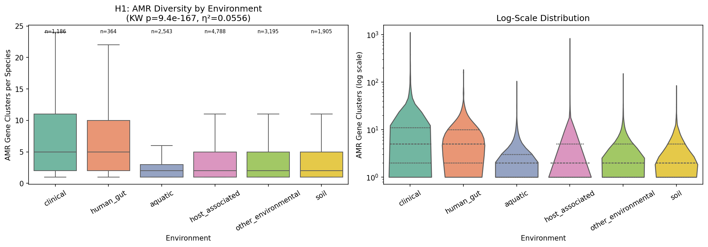
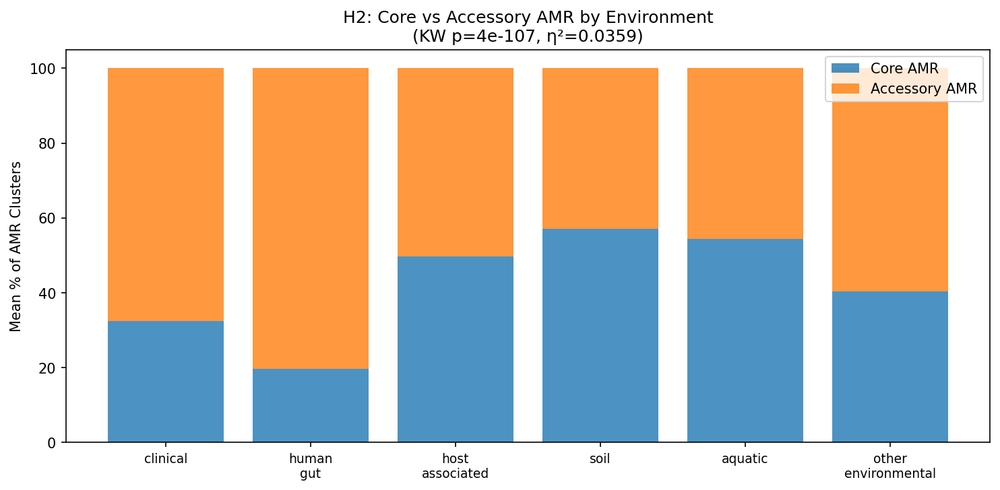
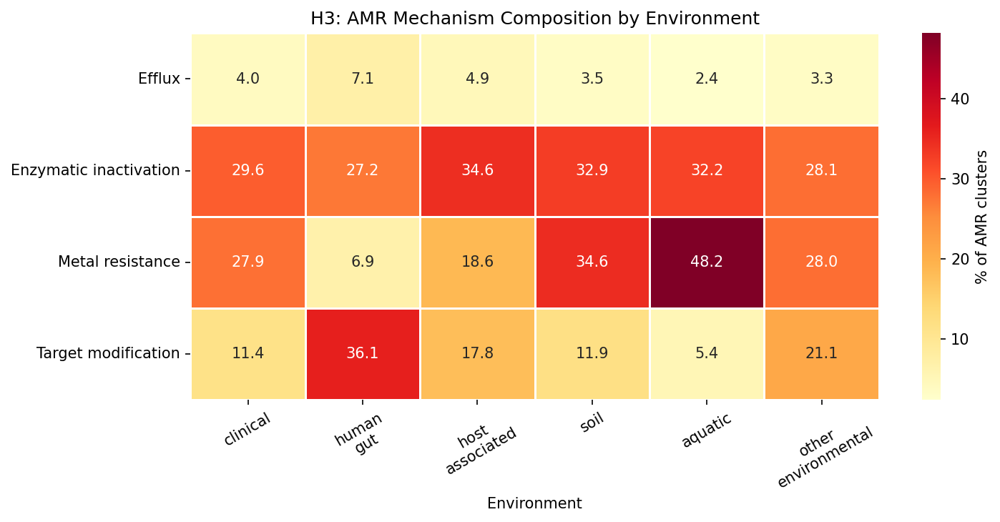
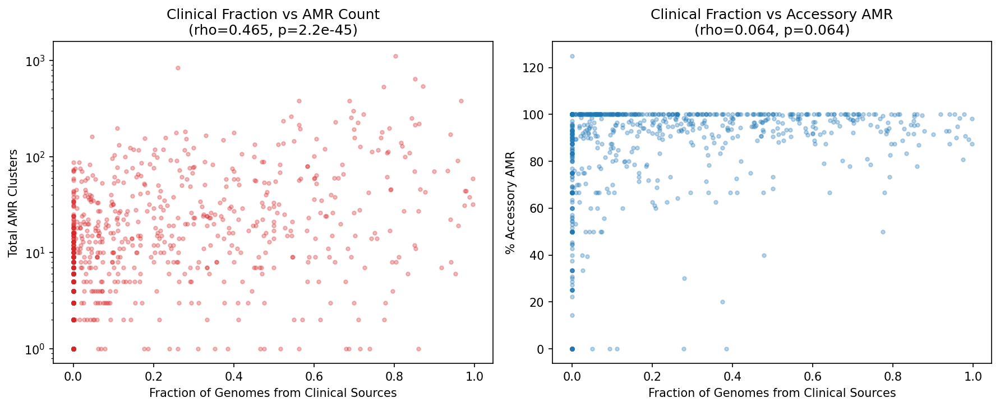
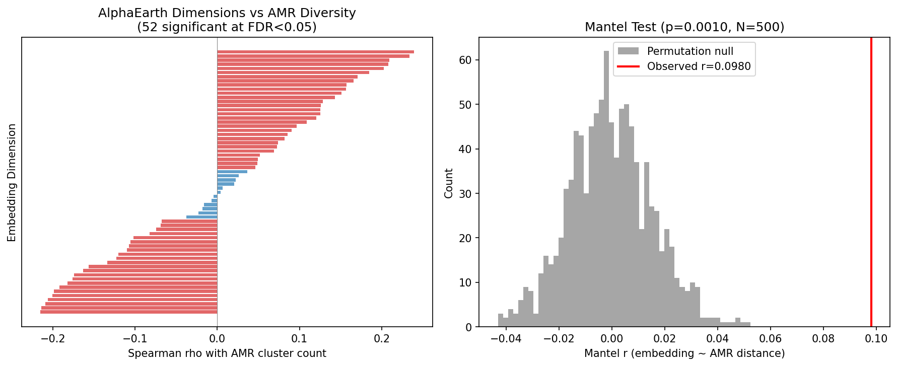

# Report: Environmental Resistome at Pangenome Scale

## Key Findings

### 1. Clinical species carry 2.5× more AMR gene clusters than environmental species (H1 supported)

Species from clinical sources have a median of **5 AMR gene clusters**, compared to 2 for soil, aquatic, and host-associated species (Kruskal-Wallis H = 781.9, p = 9.4×10⁻¹⁶⁷, η² = 0.056). Human gut species are similar to clinical (median 5). Of 15 pairwise environment comparisons, 13 are significant after FDR correction. The largest effect is clinical vs aquatic (rank-biserial r = −0.49).

This extends Gibson et al. (2015, ISME J), who found resistomes cluster by ecology in ~6,000 genomes, to **14,723 species across 293K genomes** — a 50× increase in scale. The pattern is robust to environment classification thresholds: the Kruskal-Wallis effect holds at 50%, 60%, 75%, and 90% majority-vote thresholds (η² = 0.044–0.056).

*(Notebook: 02_resistome_vs_environment.ipynb)*

### 2. Clinical species have predominantly acquired resistance; soil/aquatic species have more intrinsic resistance (H2 supported)

The composition of the resistome differs qualitatively across environments. **Clinical species: 68% accessory (acquired) AMR** vs **soil species: 43% accessory** (Kruskal-Wallis H = 506.0, p = 4×10⁻¹⁰⁷, η² = 0.036). A clear gradient emerges:

| Environment | Mean % Core AMR | Mean % Accessory AMR |
|-------------|----------------|---------------------|
| Soil | 57.1% | 42.9% |
| Aquatic | 54.4% | 45.6% |
| Host-associated | 49.7% | 50.3% |
| Other environmental | 40.4% | 59.6% |
| Clinical | 32.4% | 67.6% |
| Human gut | 19.7% | 80.3% |

This confirms at pangenome scale the pattern observed by Jiang et al. (2024) in river metagenomes: the core resistome is chromosomally encoded (intrinsic), while the rare/accessory resistome is mobile (acquired). Clinical and human gut species have overwhelmingly acquired their AMR through horizontal gene transfer, while soil and aquatic species retain more ancient, chromosomally encoded resistance.

*(Notebook: 02_resistome_vs_environment.ipynb)*

### 3. Resistance mechanism composition is strongly environment-dependent (H3 supported)

All four AMR mechanisms show significant environment-dependent composition (all q ~ 0 after BH-FDR). The two largest effects are:

- **Efflux pumps**: 21% of AMR in human gut, 15% in clinical, but only 1-2% in aquatic/soil (η² = 0.127 — the largest effect in the study)
- **Metal resistance**: 45% of AMR in aquatic, 44% in soil, but only 6% in human gut (η² = 0.107)

| Mechanism | Clinical | Human Gut | Host-assoc | Soil | Aquatic | Other Env |
|-----------|---------|-----------|------------|------|---------|-----------|
| Efflux | 15.0% | 21.4% | 7.3% | 2.0% | 1.1% | 6.5% |
| Enzymatic inactivation | 28.2% | 24.1% | 44.1% | 34.3% | 41.2% | 33.6% |
| Metal resistance | 19.7% | 6.1% | 12.7% | 44.0% | 45.0% | 24.9% |
| Target modification | 18.6% | 29.2% | 19.3% | 10.0% | 6.2% | 21.3% |

This is the most actionable finding: **different ecological niches select for fundamentally different resistance strategies**. Soil and aquatic bacteria invest heavily in metal resistance (consistent with heavy metal exposure in natural environments), while clinical and gut bacteria favor efflux pumps and target modification (consistent with antibiotic selection pressure). This connects the `amr_fitness_cost` finding (mechanism predicts conservation: metal 44% accessory vs efflux 13% core) to ecology — efflux genes are core because they serve host-associated organisms across conditions, while metal resistance is accessory because it's only needed in metal-rich environments.

**Note on mechanism classification**: 18.7% of AMR clusters (15,550) could not be classified to a mechanism from gene name or product annotation. These unclassified clusters are excluded from the mechanism fractions above. Tetracycline resistance genes are split between efflux (tet(A-E,K,L)) and target modification (tet(M,O,Q,W) ribosomal protection proteins).

*(Notebook: 02_resistome_vs_environment.ipynb)*

### 4. Species with more clinical genomes carry more AMR (H4 proxy — species-level analysis)

**Note**: This is a species-level proxy analysis, not a true per-genome within-species comparison (which would require billion-row joins). We test whether species whose genomes are predominantly from clinical sources carry more AMR than species whose genomes are predominantly from environmental sources.

Among 823 species with genomes in ≥2 environments (≥5 genomes each), the fraction of genomes from clinical sources strongly predicts total AMR cluster count (Spearman rho = 0.465, p = 2.2×10⁻⁴⁵). Clinical-dominated species have **4.4× more AMR clusters** (mean 72.9 vs 16.4, MWU p = 2×10⁻¹⁸) and a higher fraction of accessory AMR in a grouped comparison (93.6% vs 81.7%, MWU p = 0.004). The continuous correlation of clinical fraction with % accessory is borderline (rho = 0.065, p = 0.064).

Case studies of deeply-sampled species:

| Species | Genomes | AMR Clusters | Core | Accessory | Dominant Environment |
|---------|---------|-------------|------|-----------|---------------------|
| *K. pneumoniae* | 13,637 | 1,115 | 7 | 1,108 (99%) | Clinical (80%) |
| *S. aureus* | 13,274 | 642 | 9 | 633 (99%) | Clinical (85%) |
| *S. enterica* | 10,097 | 836 | 11 | 825 (99%) | Host-associated (31%) |
| *S. pneumoniae* | 7,944 | 59 | 1 | 58 (98%) | Clinical (99.6%) |
| *M. tuberculosis* | 6,673 | 44 | 4 | 40 (91%) | Clinical (98%) |

*K. pneumoniae* is striking: 1,115 AMR gene clusters but only 7 are core — nearly the entire resistome is accessory, reflecting massive within-species AMR variation driven by HGT in clinical settings.

*(Notebook: 03_within_species.ipynb)*

### 5. Phylogenetic control confirms environment effects are real

The environment-AMR association survives phylogenetic control at two levels:

- **Phylum-level**: 5 of 6 major phyla (Pseudomonadota, Bacillota_A, Actinomycetota, Bacteroidota, Bacillota) show significant within-phylum environment effects on AMR (only Chloroflexota non-significant). Bacteroidota shows the largest within-phylum effect (η² = 0.130).
- **Family-level**: 20 of 141 testable families (14%) show significant within-family environment effects after FDR correction. Top families: Enterobacteriaceae (q = 3×10⁻²¹), Bacteroidaceae (q = 1.3×10⁻¹⁷), Lachnospiraceae (q = 2.5×10⁻¹²), Pseudomonadaceae (q = 3.9×10⁻¹²).

This demonstrates that the environment-AMR relationship is not simply a proxy for phylogeny — even within the same bacterial family, species in different environments carry different AMR profiles.

*(Notebook: 02_resistome_vs_environment.ipynb)*

### 6. AlphaEarth continuous environment embeddings confirm discrete findings (supplementary)

Among 2,659 species with both AMR data and AlphaEarth environmental embeddings, 52 of 64 embedding dimensions significantly correlate with AMR diversity (FDR < 0.05; top: A34, rho = +0.24). A Mantel test confirms that environmental distance (cosine distance of embeddings) predicts AMR profile distance (Bray-Curtis of mechanism fractions): r = 0.098, p = 0.001. Stratified analysis shows the environment-AMR coupling is strongest for clinical species (r = 0.177), moderate for soil (r = 0.129), and weakest for aquatic (r = 0.061). This continuous analysis confirms the discrete findings from NB02 but adds limited additional interpretability due to the opaque nature of embedding dimensions and 28% genome coverage.

*(Notebook: 04_alphaearth_analysis.ipynb)*

## Results

### Data Assembly (NB01)
- 82,908 AMR gene clusters across 14,723 species (of 27,700 total)
- 280,337 genomes with ncbi_env data; 93.5% classified per-genome
- Species-level environment: 95% coverage (13,981 species) via majority-vote
- 884 species qualify for within-species analysis (≥5 genomes in ≥2 environments)
- Mechanism classification: enzymatic inactivation (26,220), metal resistance (22,223), target modification (11,067), efflux (5,224)

### Species-Level Analysis (NB02)

| Test | Statistic | p-value | Effect Size |
|------|-----------|---------|-------------|
| H1: AMR count by environment | KW H=781.9 | 9.4×10⁻¹⁶⁷ | η²=0.056 |
| H2: Core AMR % by environment | KW H=506.0 | 4×10⁻¹⁰⁷ | η²=0.036 |
| H3: Efflux by environment | KW H=1775.0 | ~0 | η²=0.127 |
| H3: Metal by environment | KW H=1498.4 | ~0 | η²=0.107 |
| H3: Target mod by environment | KW H=971.7 | 8.2×10⁻²⁰⁸ | η²=0.069 |
| H3: Enzymatic by environment | KW H=266.0 | 2.0×10⁻⁵⁵ | η²=0.019 |

### Within-Species Analysis (NB03)

| Metric | Value |
|--------|-------|
| Qualifying species | 823 |
| Clinical fraction vs total AMR | rho=0.465, p=2.2×10⁻⁴⁵ |
| Clinical fraction vs % accessory | rho=0.065, p=0.064 |
| Clinical-dom mean AMR | 72.9 clusters |
| Environmental-dom mean AMR | 16.4 clusters |
| Clinical > Environmental total AMR | MWU p=2.0×10⁻¹⁸ |
| Clinical > Environmental % accessory | MWU p=0.004 |

### AlphaEarth Analysis (NB04, supplementary)

| Metric | Value |
|--------|-------|
| Species with AMR + embeddings | 2,659 |
| Embedding dims correlated with AMR (FDR<0.05) | 52/64 |
| Mantel test (environment ~ AMR distance) | r=0.098, p=0.001 |

## Interpretation

### The environmental resistome is ecology-structured at pangenome scale

The central finding is that **ecological niche is a strong predictor of AMR gene content** across 14,723 bacterial species — the largest genomic-scale analysis of environmental AMR distribution to date. Clinical and human gut species carry 2.5× more AMR clusters than soil or aquatic species, with the excess almost entirely in the accessory (acquired) gene pool. This pattern holds within phyla and within families, confirming it is not a phylogenetic artifact.

### Different niches select for different resistance strategies

The mechanism × environment pattern provides a mechanistic explanation for the ecological structuring of the resistome:

- **Soil and aquatic bacteria** invest heavily in **metal resistance** (44-45% of AMR), reflecting heavy metal exposure in natural environments. These genes are more often core (intrinsic), suggesting ancient adaptation.
- **Clinical and gut bacteria** invest in **efflux pumps** (15-21%) and **target modification** (19-29%), reflecting antibiotic selection pressure. These genes are more often accessory (acquired), reflecting recent HGT-driven accumulation.
- **Enzymatic inactivation** (e.g., beta-lactamases) is the most uniformly distributed mechanism, present in all environments but not dominant in any.

This connects two prior BERIL findings: the `amr_fitness_cost` project showed mechanism predicts conservation (metal 44% accessory vs efflux 13% core), and we now show this conservation pattern is driven by ecology — efflux genes are core because they serve host-associated organisms constitutively, while metal resistance is accessory because it varies with environmental metal exposure.

### Within-species AMR variation tracks clinical exposure

The within-species analysis reveals that AMR accumulation is not just a property of species — it varies within species depending on where strains are found. *K. pneumoniae* exemplifies this: with 1,115 AMR gene clusters (only 7 core), nearly its entire resistome is accessory, and 80% of its genomes come from clinical sources. Species where clinical strains dominate have 4.4× more AMR than species dominated by environmental strains.

### Literature Context

- **Gibson, Forsberg & Dantas (2015)** found resistomes cluster by ecology in ~6,000 genomes. We replicate this at 50× scale (14,723 species) and extend it with mechanism-specific decomposition — showing efflux and metal resistance are the most environment-discriminating mechanisms. PMID: 25003965
- **Forsberg et al. (2014)** showed soil resistomes are structured by phylogeny with rare mobility elements. Our finding that soil AMR is predominantly core (intrinsic) while clinical AMR is accessory (acquired) aligns with this — natural resistance in soil is chromosomal, while clinical resistance is mobile. PMID: 24847883
- **Jiang et al. (2024)** found the core resistome is chromosomally encoded while the rare resistome is plasmid-associated in river metagenomes. We confirm this core=intrinsic/accessory=acquired pattern across 14,723 species and show it varies quantitatively by environment (clinical 68% accessory vs soil 43%). PMID: 38039820
- **Surette & Wright (2017)** established that the environment is the largest resistance reservoir. Our data quantifies this: soil species have fewer but more intrinsic AMR genes, representing the ancient baseline resistome. Clinical enrichment above this baseline reflects anthropogenic antibiotic selection. PMID: 28657887
- **Van Goethem et al. (2018)** found ARGs in pristine Antarctic soils. Our finding that soil species average 2 AMR clusters (mostly core) is consistent with a baseline ancestral resistome maintained without antibiotic exposure. PMID: 29471872
- **Forsberg et al. (2012)** found soil ARGs with perfect nucleotide identity to clinical pathogen genes. Our pangenome framework could identify such shared clusters, though we did not test for nucleotide identity in this analysis. PMID: 22936781

### Novel Contribution

This is the **largest genomic analysis of environmental AMR distribution**, extending Gibson et al. (2015) from ~6K genomes to 293K genomes across 14,723 species. Key novel contributions:

1. **Mechanism × environment decomposition**: efflux peaks in clinical/gut (21%), metal in soil/aquatic (45%) — η² = 0.127, the largest effect size in the study
2. **Core vs accessory gradient by environment**: clinical 68% accessory → soil 43% accessory, demonstrating that the intrinsic/acquired composition of the resistome varies quantitatively with ecology
3. **Within-species clinical fraction predicts AMR**: rho = 0.465 across 823 species — the strongest evidence that AMR accumulation tracks antibiotic exposure at the strain level
4. **Phylogenetic control at family level**: 20/141 families show within-family environment effects, confirming ecology is a real driver independent of phylogeny
5. **Connection to fitness cost**: links the mechanism-conservation pattern from `amr_fitness_cost` (metal = accessory, efflux = core) to its ecological cause

### Limitations

1. **Phylogenetic confound**: Despite family-level control, environment and phylogeny are deeply entangled. Some families are almost entirely clinical (e.g., many Enterobacteriaceae). The 14% of families with significant within-family effects are the most convincing evidence, but most families don't span enough environments to test.
2. **NCBI sampling bias**: Clinical isolates are massively overrepresented in NCBI. The "clinical species carry more AMR" finding partly reflects that clinical species are the ones that get sequenced because they have AMR. Soil and aquatic species are undersampled.
3. **Environment classification granularity**: The majority-vote species-level classification collapses within-species variation. A species classified as "clinical" may include environmental strains. The sensitivity analysis at 60-90% thresholds mitigates this.
4. **bakta_amr sensitivity**: AMRFinderPlus focuses on known resistance genes, potentially underestimating novel resistance in environmental bacteria. This would bias our results toward finding more AMR in clinical species (where resistance genes are well-characterized).
5. **Core/accessory precision**: The 95% prevalence threshold for "core" depends on species genome count. Many species have few genomes, making core/accessory labels imprecise.
6. **Causality**: We observe correlation between environment and AMR, not causation. Clinical species may carry more AMR because they are clinical (antibiotic exposure), or they may be clinical because they carry more AMR (virulence-resistance co-selection).
7. **Effect sizes**: While all tests are highly significant (p ~ 0), the effect sizes are modest (η² = 0.02–0.13). Environment explains 2-13% of variance in AMR composition — phylogeny likely explains much more.
8. **Mechanism classification completeness**: 18.7% of AMR clusters (15,550) could not be classified to a mechanism. These are excluded from H3 mechanism fractions, potentially biasing the analysis if unclassified genes are non-randomly distributed across environments.
9. **Planned but unperformed analyses**: PCoA ordination, PERMANOVA, environment-specific gene identification, MAG/isolate assessment, and archaea-specific analysis were planned in RESEARCH_PLAN v2 but not executed. The within-species analysis (NB03) uses a species-level proxy rather than the per-genome Fisher's exact test originally planned, due to the computational cost of billion-row joins.

## Data

### Sources

| Collection | Tables Used | Purpose |
|------------|-------------|---------|
| `kbase_ke_pangenome` | `bakta_amr`, `gene_cluster`, `pangenome`, `ncbi_env`, `genome`, `gtdb_taxonomy_r214v1`, `alphaearth_embeddings_all_years` | AMR gene clusters, species structure, environment metadata, phylogeny, continuous environment embeddings |

### Generated Data

| File | Rows | Description |
|------|------|-------------|
| `data/species_amr_profiles.csv` | 14,723 | Species-level AMR summary + environment + taxonomy |
| `data/species_environment.csv` | 26,715 | Species majority-vote environment classification |
| `data/genome_environment.csv` | 280,337 | Per-genome environment classification from ncbi_env |
| `data/pairwise_environment_comparisons.csv` | 15 | Pairwise MWU tests between environments |
| `data/mechanism_by_environment.csv` | 4 | KW test results per mechanism |
| `data/stratified_phylum_results.csv` | 6 | Within-phylum environment tests |
| `data/family_level_environment_test.csv` | 141 | Within-family environment tests |
| `data/within_species_amr_environment.csv` | 823 | Within-species clinical fraction vs AMR |
| `data/alphaearth_amr_correlations.csv` | 64 | Per-dimension embedding-AMR correlations |

## Supporting Evidence

### Notebooks

| Notebook | Purpose |
|----------|---------|
| `01_data_extraction.ipynb` | Spark extraction, environment classification, mechanism classification, validation |
| `02_resistome_vs_environment.ipynb` | H1-H3: species-level AMR vs environment, phylogenetic control, sensitivity analysis |
| `03_within_species.ipynb` | H4: within-species AMR variation by clinical fraction, case studies |
| `04_alphaearth_analysis.ipynb` | Supplementary: continuous embedding-AMR correlations and Mantel test |

### Figures

| Figure | Description |
|--------|-------------|
| `nb01_validation.png` | Data validation: AMR distribution and environment coverage |
| `h1_amr_by_environment.png` | AMR cluster count by environment (boxplot + violin) |
| `h2_core_accessory_by_env.png` | Core vs accessory AMR fraction by environment |
| `h3_mechanism_by_environment.png` | Mechanism × environment composition heatmap |
| `h4_within_species.png` | Clinical fraction vs AMR count and accessory fraction |
| `nb04_alphaearth.png` | Embedding dimension correlations and Mantel test null distribution |

## Future Directions

1. **Shared AMR clusters across environments**: Identify specific AMR gene clusters present in both soil and clinical species — these are candidates for recent cross-niche HGT (cf. Forsberg et al. 2012).
2. **Temporal analysis**: For species with genomes sampled across decades (e.g., *S. aureus*, *K. pneumoniae*), test whether the accessory AMR fraction has increased over time.
3. **Integrate with fitness cost**: Combine this project's environment-AMR profiles with `amr_fitness_cost` to test whether AMR genes enriched in clinical settings are costlier (because they're recently acquired) or cheaper (because they've been under strong selection).
4. **Metagenome validation via NMDC**: Use `nmdc_arkin` metagenome taxonomic profiles to infer community-level AMR load from pangenome-derived species AMR profiles, validating the species-level findings in real environmental communities.
5. **Mobile element context**: When `genomad_mobile_elements` becomes available in BERDL, test whether accessory AMR clusters in clinical species are preferentially associated with plasmids, transposons, or integrative elements.

## References

- Arkin AP, et al. (2018). "KBase: The United States Department of Energy Systems Biology Knowledgebase." *Nature Biotechnology* 36(7):566-569. PMID: 29979655
- Finley RL, et al. (2013). "The scourge of antibiotic resistance: the important role of the environment." *Clinical Infectious Diseases* 57(5):704-710. PMID: 23723195
- Forsberg KJ, et al. (2012). "The shared antibiotic resistome of soil bacteria and human pathogens." *Science* 337(6098):1107-1111. PMID: 22936781
- Forsberg KJ, et al. (2014). "Bacterial phylogeny structures soil resistomes across habitats." *Nature* 509(7502):612-616. PMID: 24847883
- Gibson MK, Forsberg KJ, Dantas G. (2015). "Improved annotation of antibiotic resistance determinants reveals microbial resistomes cluster by ecology." *ISME Journal* 9:207-216. PMID: 25003965
- Jiang C, et al. (2024). "Rare resistome rather than core resistome exhibited higher diversity and risk along the Yangtze River." *Water Research* 249:120911. PMID: 38039820
- Surette MD, Wright GD. (2017). "Lessons from the Environmental Antibiotic Resistome." *Annual Review of Microbiology* 71:233-256. PMID: 28657887
- Van Goethem MW, et al. (2018). "A reservoir of 'historical' antibiotic resistance genes in remote pristine Antarctic soils." *Microbiome* 6:40. PMID: 29471872
