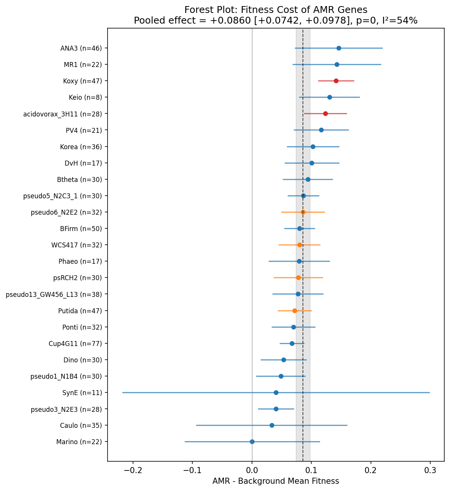
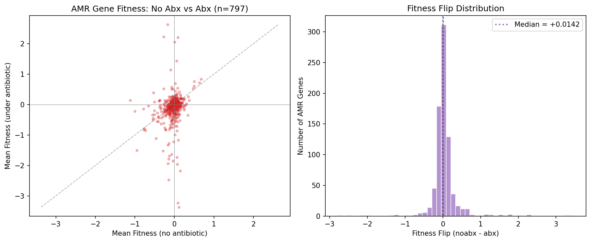
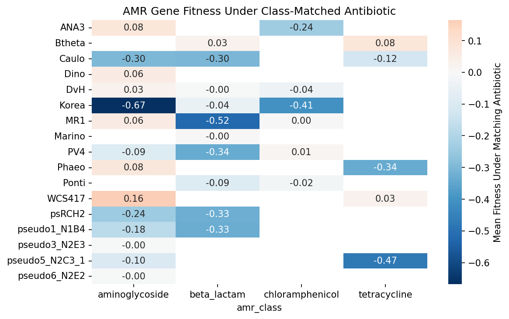
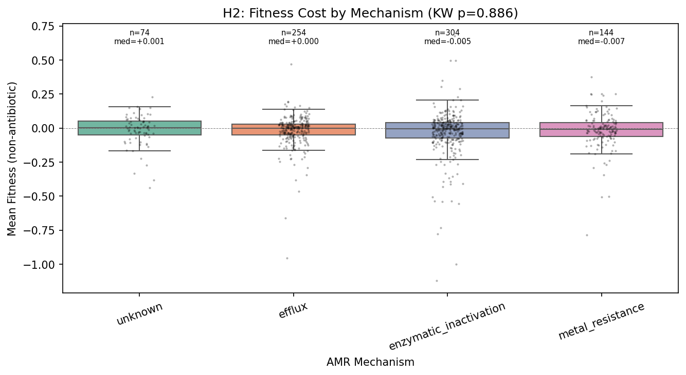
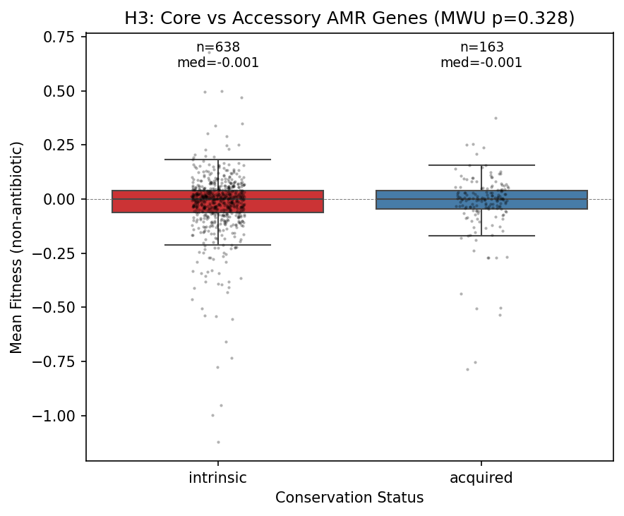
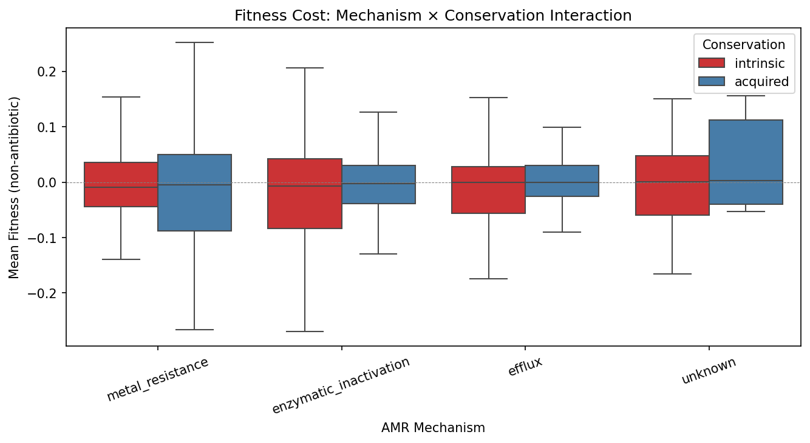

# Report: Fitness Cost of Antimicrobial Resistance Genes

## Key Findings

### 1. Universal cost of resistance across 25 bacterial species (H1 supported)

AMR gene knockouts show systematically higher fitness than non-AMR gene knockouts under non-antibiotic conditions, confirming that resistance genes impose a metabolic burden. A DerSimonian-Laird random-effects meta-analysis across 25 organisms yields a pooled effect of **+0.086 [95% CI: +0.074, +0.098], z = 14.3, p ~ 0**. Remarkably, **all 25 of 25 organisms** show a positive shift (AMR > background), making this one of the most consistent signals observed across the Fitness Browser compendium. The median per-organism Cohen's d = 0.18, indicating a small but real effect — consistent with the literature prediction of +0.05 to +0.20 for fitness costs after compensatory evolution.

Only 4.6% of AMR genes were absent from the fitness matrices (putatively essential), substantially lower than the ~14% background essential rate estimated in a prior analysis (`fitness_effects_conservation`, different organism set). AMR genes being less likely to be essential is consistent with the cost-of-resistance framework — these genes are more dispensable, not less. The low essential rate also argues against strong right-censoring bias.

The Tier 1 (bakta_amr, N=110) and Tier 2 (keyword annotation, N=691) gene sets show indistinguishable fitness distributions (KS p = 0.17), confirming that the keyword-based Tier 2 expansion does not dilute or bias the signal.

*(Notebook: 02_fitness_cost_analysis.ipynb)*

### 2. AMR genes become more important under antibiotic pressure (H4 partially supported)

When tested under any antibiotic, 57% of AMR genes show a fitness flip — they become relatively more important (lower fitness when knocked out) compared to non-antibiotic conditions (Wilcoxon signed-rank p = 0.0001, N = 797). The mean flip is +0.045 (noabx − abx fitness), indicating AMR genes shift from slight burden to slight importance.

Critically, this flip is **mechanism-dependent**: efflux genes (broad-spectrum) show a significantly stronger flip than enzymatic inactivation genes (narrow-spectrum): +0.094 vs −0.001, MWU p = 0.007. This is expected — broad-spectrum efflux pumps protect against many antibiotics and should show fitness importance under any antibiotic experiment, while narrow-spectrum enzymes (e.g., beta-lactamases) only become important when the matching antibiotic is present. The 43% of AMR genes that don't flip likely reflect narrow-spectrum resistance being tested against non-matching antibiotics, not non-functional genes.

The class-matched validation (157 gene-antibiotic pairs across 4 resistance classes) shows a mean flip of +0.113, but the Wilcoxon signed-rank test does not reach significance (p = 0.14). This is likely due to the small N per class after matching and heterogeneity across organisms — some organisms show strong flips while others are near zero. The any-antibiotic analysis (N = 797) has much greater power and is highly significant. Within the class-matched set, chloramphenicol resistance genes show the strongest validation: 6/6 (100%) show the expected flip. Beta-lactam genes (105 pairs across 10 organisms) show 50% flip rate, consistent with many being tested against non-carbenicillin beta-lactams.

*(Notebooks: 03_antibiotic_validation.ipynb, 04b_followup_analyses.ipynb)*

### 3. Resistance mechanism does not predict fitness cost (H2 not supported)

Contrary to H2, the fitness cost of AMR genes does not vary by resistance mechanism. The Kruskal-Wallis test across four testable mechanisms (efflux N=254, enzymatic inactivation N=304, metal resistance N=144, unknown N=74) is not significant (H = 0.65, p = 0.89). The Jonckheere-Terpstra test for the predicted ordering (efflux > enzymatic > metal > unknown) is also non-significant (z = 0.23, p = 0.41). No pairwise comparison survives FDR correction.

This uniformity is itself a finding. If all resistance mechanisms impose the same modest cost (~0.086 fitness units relative to background), it suggests that **only AMR genes whose cost has been minimized through compensatory evolution persist in these genomes**. The RB-TnSeq organisms are lab-adapted strains that have had extensive evolutionary time to compensate for resistance costs. The uniform cost may represent a "floor" — the irreducible metabolic overhead of maintaining any extra gene, regardless of its function.

*(Notebook: 04_stratification.ipynb)*

### 4. Core and accessory AMR genes have identical fitness costs (H3 not supported)

Core (intrinsic, N=638) and accessory (acquired, N=163) AMR genes show virtually identical fitness distributions: mean −0.024 vs −0.024, Cohen's d = 0.002, MWU p = 0.33.

An important caveat: most FB species have few genomes in GTDB (median 9, range 2–399), which makes the ≥95% prevalence threshold for "core" designation imprecise. With only 2–9 genomes, a gene present in all 9 is labeled "core" but could be accessory at larger sampling depth. However, this imprecision should add noise (diluting any real difference), not create a false null — so the absence of a difference is likely genuine, at least for the well-sampled species (e.g., *K. michiganensis* with 399, *B. thetaiotaomicron* with 287, *S. meliloti* with 241 genomes).

The result challenges the expectation that recently acquired (accessory) AMR genes should be costlier because they haven't been optimized. One interpretation is that acquisition of AMR genes is not random — horizontal transfer preferentially captures genes that have already been cost-optimized in their donor lineage, or that the receiving genome rapidly compensates.

*(Notebooks: 04_stratification.ipynb, 04b_followup_analyses.ipynb)*

### 5. Mechanism is strongly associated with conservation, even though cost is not

While mechanism doesn't predict fitness cost, it strongly predicts conservation status (χ² = 69.3, p = 1.4×10⁻¹³). Metal resistance genes are 44% accessory, while efflux (13%) and enzymatic inactivation (16%) genes are overwhelmingly core. This decoupling — mechanism predicts *where* in the pangenome an AMR gene sits, but not *how costly* it is — suggests that the forces governing AMR gene retention (horizontal transfer frequency, selective advantage in specific environments) are distinct from the forces governing metabolic cost.

*(Notebook: 04b_followup_analyses.ipynb)*

## Results

### Data Assembly (NB01)
- 1,352 AMR genes identified across 43 organisms (178 Tier 1, 1,174 Tier 2)
- 28 organisms have both AMR genes and fitness matrices; 25 qualify for per-organism tests (≥5 AMR genes)
- 6,804 experiments classified: 2,868 carbon/nitrogen, 1,862 stress, 727 standard, 447 metal, 443 antibiotic
- AMR class distribution: beta-lactam (44 T1), mercury (27), arsenic (22), efflux_rnd (22)

### Per-Organism Effect Sizes (NB02)

| Metric | Value |
|--------|-------|
| Organisms tested | 25 |
| Organisms with positive shift | 25/25 (100%) |
| Nominally significant (p<0.05) | 6 |
| FDR significant (q<0.05) | 2 (acidovorax_3H11, Koxy) |
| Pooled effect (DL random-effects) | +0.086 [+0.074, +0.098] |
| I² heterogeneity | 54.3% |
| Cochran's Q | 52.54, p = 0.0007 |
| Median Cohen's d | 0.18 |

### Antibiotic Validation (NB03)

| Metric | Class-Matched | Any-Antibiotic |
|--------|--------------|----------------|
| Gene-antibiotic pairs | 157 | 797 |
| Flip rate (more important under abx) | 54.8% | 57.0% |
| Mean fitness flip | +0.113 | +0.045 |
| Wilcoxon p (flip > 0) | 0.14 | 0.0001 |

### Stratification (NB04)

| Stratification | Groups | Test | p-value | Result |
|---------------|--------|------|---------|--------|
| Mechanism | 4 groups (N≥20) | Kruskal-Wallis | 0.89 | No difference |
| Mechanism (ordered) | efflux > enzymatic > metal | Jonckheere-Terpstra | 0.41 | No trend |
| Conservation | core vs accessory | Mann-Whitney U | 0.33 | No difference |
| Tier | T1 vs T2 | Mann-Whitney U | 0.26 | No difference |
| Resistance type | antibiotic vs metal | Mann-Whitney U | 0.87 | No difference |
| Mechanism × conservation | 6 groups | Chi-square | 1.4×10⁻¹³ | Strongly associated |

## Interpretation

### The cost of resistance is universal but uniform

The central finding is that AMR genes impose a **small, consistent metabolic burden** across all 25 tested bacterial species, all resistance mechanisms, and both core and accessory gene pools. The pooled effect of +0.086 means that AMR gene knockouts are 0.086 fitness units *less detrimental* than the average gene knockout — i.e., AMR genes are more dispensable than the typical gene. Note that absolute AMR knockout fitness averages −0.024 (slightly below the pool mean), so AMR knockouts still grow slower than the pool average; the cost manifests as a *relative* difference from the non-AMR background (which averages around −0.11). In practical terms, a cell that loses an AMR gene gains a small competitive advantage over cells that lose a randomly chosen gene, enough to matter over evolutionary timescales but invisible in short-term growth assays. This reconciles two apparently contradictory observations in the AMR literature: fitness costs are real (supporting resistance decline under stewardship), but they are small (explaining why resistance persists long after antibiotic withdrawal).

**A note on the one-sample test**: A Wilcoxon signed-rank test asking whether AMR knockout fitness is > 0 (i.e., whether AMR knockouts grow faster than the pool wildtype) gives p = 0.999, strongly rejecting that framing. This is expected — AMR gene knockouts, like most gene knockouts, grow slightly slower than wildtype. The relevant question is not "are AMR knockouts beneficial?" but "are AMR knockouts *less costly* than typical knockouts?" — which the per-organism Mann-Whitney design directly tests. The +0.086 effect captures this relative advantage.

### Broad-spectrum resistance shows antibiotic-dependent importance

The validation analysis reveals a previously undescribed pattern: the fitness flip under antibiotic exposure is mechanism-dependent even though the baseline cost is not. Efflux pumps (broad-spectrum) become significantly more important under any antibiotic (flip +0.094), while enzymatic inactivation genes (narrow-spectrum) only flip under their matching antibiotic. This decoupling of **cost-independence** and **benefit-specificity** has implications for predicting which resistance mechanisms will be maintained in antibiotic-free environments.

### Conservation reflects acquisition history, not fitness cost

The strong association between mechanism and conservation (metal resistance: 44% accessory vs efflux: 13%) combined with the absence of a cost difference between core and accessory genes suggests that AMR gene conservation reflects **how and when genes were acquired** rather than how much they cost. Efflux systems, often chromosomally encoded as part of general stress response, are maintained as core genes. Metal resistance operons, frequently carried on mobile elements, remain accessory — but both impose the same modest cost once established in a genome.

### Literature Context

- **Melnyk et al. (2015)** meta-analyzed ~600 resistance cost measurements and found costs in ~70% of cases with a mean relative fitness of 0.91–0.95 (5–9% cost). Their measurements are absolute fitness differences between isogenic resistant and sensitive strain pairs, while our +0.086 is a relative difference between AMR and non-AMR transposon knockouts within pooled libraries — these are different measurement scales. Nonetheless, both converge on the same order of magnitude (small single-digit percent costs), providing reassuring concordance between the two methodologies.
- **Andersson & Hughes (2010)** predicted that compensatory mutations would reduce or eliminate fitness costs over time, making resistance reversal unlikely. Our finding that core and accessory AMR genes show identical costs is consistent with rapid compensatory evolution, even for recently acquired genes.
- **Vanacker, Lenuzza & Rasigade (2023)** meta-analyzed fitness costs in *E. coli* and found that horizontally transferred resistance genes (plasmid-borne) are less costly than chromosomal mutations. This explains why our transposon-based cost estimate is modest — many FB AMR genes are likely acquired determinants (beta-lactamases, acetyltransferases) rather than costly target modifications.
- **Vogwill & MacLean (2015)** found little systematic variation by mechanism after controlling for confounders, and emphasized environment-dependence. We confirm both: no mechanism-dependence in baseline cost, but clear environment-dependence (antibiotic validation).
- **Olivares Pacheco & Alvarez (2017)** showed that efflux pump costs in *P. aeruginosa* are metabolic (proton motive force drain) and rapidly compensated through metabolic rewiring. This explains why our efflux genes show the same modest cost as other mechanisms — compensation is a "general outcome."
- **Levin, Perrot & Walker (2000)** demonstrated that compensatory mutations arise faster than reversion to susceptibility, predicting that organisms maintain resistance at reduced cost. Our +0.086 may represent the irreducible cost after compensatory evolution — the minimum overhead of expressing a functional protein that provides no benefit without antibiotics.
- **Roux et al. (2015)** showed that resistance genes (particularly efflux pumps) can be beneficial in vivo by exporting host antimicrobials. This caveat applies: our in vitro cost measurement may overestimate the true ecological cost.
- **Durão, Balbontín & Gordo (2018)** reviewed epistasis as a driver of cost variation across genetic backgrounds. Our consistent signal across 25 diverse organisms suggests the cost is robust across genetic backgrounds, which is notable given the role of epistasis.

### Novel Contribution

This is the **first pan-bacterial meta-analysis of AMR fitness costs using genome-wide transposon fitness data**. Prior studies typically compare single resistant vs sensitive strain pairs in one organism. By leveraging 27M fitness measurements across 25 diverse bacteria, we can:
1. Demonstrate the **universality** of the cost (25/25 organisms positive)
2. Show that cost is **mechanism-independent** (Kruskal-Wallis p = 0.89)
3. Discover that **broad-spectrum mechanisms show stronger antibiotic-dependent importance** than narrow-spectrum ones (MWU p = 0.007)
4. Demonstrate that **mechanism predicts genomic location (core vs accessory) but not fitness cost** — a decoupling not previously observed

### Limitations

1. **Lab adaptation bias**: All 25 organisms are lab-adapted strains. Compensatory evolution during laboratory maintenance may have reduced measurable costs below what wild strains experience. This makes our positive result more convincing but may underestimate the true cost in natural populations.
2. **Tier 2 annotation noise**: 86% of AMR genes are Tier 2 (keyword-matched from bakta annotations), which may include some non-AMR genes (e.g., general efflux transporters). The Tier 1 sensitivity analysis shows consistent results, mitigating this concern.
3. **Antibiotic experiment coverage**: Only 4 AMR classes (beta-lactam, aminoglycoside, chloramphenicol, tetracycline) have matched antibiotic experiments. Other classes (macrolide, glycopeptide, polymyxin) could not be validated.
4. **Essential gene censoring**: ~4.6% of AMR genes are putatively essential (absent from fitness matrices). If these are the most costly AMR genes, our estimate of +0.086 is a lower bound.
5. **Relative, not absolute fitness**: RB-TnSeq measures fitness relative to the pool average. The +0.086 is the difference between AMR knockout fitness (−0.024) and non-AMR knockout fitness (~−0.11), not an absolute selection coefficient. Comparisons to literature fitness costs measured by isogenic strain competition (e.g., Melnyk et al. 2015) are reassuring but not direct equivalences.
6. **Transposon insertion effects**: Insertions can cause polar effects on downstream genes, potentially confounding fitness measurements for AMR genes in operons.
7. **Classification gaps**: The Tier 2 product classifier does not handle fosfomycin resistance or tellurite resistance annotations, placing ~25 genes in the "unknown" mechanism category. Adding these would reclassify them to enzymatic_inactivation and metal_resistance respectively, slightly reducing the unknown group.
8. **Core/accessory label precision**: Most FB species have few genomes (median 9), making the ≥95% prevalence threshold for "core" imprecise. The core vs accessory null result should be interpreted cautiously for species with <20 genomes.

## Data

### Sources

| Collection | Tables Used | Purpose |
|------------|-------------|---------|
| `kbase_ke_pangenome` | `bakta_amr`, `bakta_annotations` | AMR gene identification (Tier 1 + Tier 2) |
| `kescience_fitnessbrowser` | `genefitness`, `gene`, `experiment` | Fitness measurements, gene metadata, experiment classification |
| Cross-project | `conservation_vs_fitness/fb_pangenome_link.tsv` | Bridge FB genes to pangenome clusters |
| Cross-project | `fitness_modules/matrices/*` | Pre-cached fitness matrices |

### Generated Data

| File | Rows | Description |
|------|------|-------------|
| `data/amr_genes_fb.csv` | 1,352 | AMR genes with class, mechanism, conservation, tier |
| `data/experiment_classification.csv` | 6,804 | Experiments classified by type |
| `data/amr_fitness_noabx.csv` | 801 | Per-gene mean fitness under non-antibiotic conditions |
| `data/organism_effect_sizes.csv` | 25 | Per-organism effect sizes with CIs and p-values |
| `data/amr_fitness_abx_validation.csv` | 954 | Fitness under antibiotic conditions (class-matched + any-antibiotic) |
| `data/amr_fitness_stratified.csv` | 10 | Stratification summary by mechanism, conservation, tier, resistance type |

## Supporting Evidence

### Notebooks

| Notebook | Purpose |
|----------|---------|
| `01_data_assembly.ipynb` | AMR gene identification, experiment classification, data assembly |
| `02_fitness_cost_analysis.ipynb` | Core H1 test, meta-analysis, sensitivity analysis |
| `03_antibiotic_validation.ipynb` | Antibiotic validation (H4), fitness flip analysis |
| `04_stratification.ipynb` | Mechanism (H2), conservation (H3), tier, resistance type stratification |
| `04b_followup_analyses.ipynb` | Follow-up: narrow vs broad spectrum flip, mechanism × conservation interaction |

### Figures

| Figure | Description |
|--------|-------------|
| `forest_plot_amr_fitness.png` | Per-organism effect sizes with 95% CIs and pooled meta-analysis |
| `amr_fitness_distribution.png` | AMR gene fitness distribution (overall and by tier) |
| `amr_genes_per_organism.png` | AMR gene counts per organism colored by mechanism |
| `antibiotic_validation.png` | Paired fitness scatter and flip distribution under antibiotics |
| `class_matched_heatmap.png` | Heatmap of AMR fitness under class-matched antibiotics |
| `h2_mechanism_stratification.png` | Fitness by mechanism with Kruskal-Wallis test |
| `h3_core_vs_accessory.png` | Core vs accessory fitness comparison |
| `mechanism_x_conservation.png` | Mechanism × conservation interaction plot |
| `fitness_by_mechanism_preview.png` | Early mechanism preview from NB02 |
| `fitness_core_vs_accessory_preview.png` | Early conservation preview from NB02 |
| `stratification_overview.png` | Combined stratification panel (tier, resistance type, per-organism) |

## Future Directions

1. **Within-organism mechanism subanalysis**: For organisms with many AMR genes (Cup4G11: 77, BFirm: 50), test whether mechanism predicts cost within a single genetic background, controlling for phylogenetic differences.
2. **Efflux pump subclassification**: Distinguish narrow-spectrum drug pumps from general RND systems (AcrAB-TolC) and test whether constitutively expressed efflux systems have lower costs.
3. **Condition-specific costs**: Instead of averaging across all non-antibiotic experiments, test whether AMR costs vary under different stress conditions (metal, osmotic, carbon limitation).
4. **Cross-reference with metal fitness atlas**: The 144 metal resistance genes with fitness data could be cross-referenced against the `metal_fitness_atlas` project to test whether genes costly under standard conditions are protective under metal stress.
5. **Extend to full pangenome**: Scale the analysis from 25 FB organisms to all 293K BERDL genomes by predicting AMR cost from gene cluster conservation patterns.

## References

- Andersson DI, Hughes D. (2010). "Antibiotic resistance and its cost: is it possible to reverse resistance?" *Nature Reviews Microbiology* 8(4):260-71. PMID: 20208551
- Arkin AP, et al. (2018). "KBase: The United States Department of Energy Systems Biology Knowledgebase." *Nature Biotechnology* 36(7):566-569. PMID: 29979655
- Bjorkman J, Nagaev I, Berg OG, Hughes D, Andersson DI. (2000). "Effects of environment on compensatory mutations to ameliorate costs of antibiotic resistance." *Science* 287(5457):1479-82. PMID: 10688795
- Durão P, Balbontín R, Gordo I. (2018). "Evolutionary mechanisms shaping the maintenance of antibiotic resistance." *Trends in Microbiology* 26(8):677-691. PMID: 29439838
- Levin BR, Perrot V, Walker N. (2000). "Compensatory mutations, antibiotic resistance and the population genetics of adaptive evolution in bacteria." *Genetics* 154(3):985-997. PMID: 10757748
- Melnyk AH, Wong A, Kassen R. (2015). "The fitness costs of antibiotic resistance mutations." *Evolutionary Applications* 8(3):273-83. PMID: 25861385
- Olivares Pacheco J, Alvarez-Ortega C, Alcalde Rico M, Martínez JL. (2017). "Metabolic compensation of fitness costs is a general outcome for antibiotic-resistant Pseudomonas aeruginosa mutants overexpressing efflux pumps." *mBio* 8(4):e00500-17. PMID: 28765215
- Price MN, et al. (2018). "Mutant phenotypes for thousands of bacterial genes of unknown function." *Nature* 557(7706):503-509. PMID: 29769716
- Roux D, Danilchanka O, Guillard T, et al. (2015). "Fitness cost of antibiotic susceptibility during bacterial infection." *Science Translational Medicine* 7(297):297ra114. PMID: 26203082
- San Millan A, MacLean RC. (2017). "Fitness costs of plasmids: a limit to plasmid transmission." *Microbiology Spectrum* 5(5). PMID: 28944751
- Vanacker M, Lenuzza N, Rasigade JP. (2023). "The fitness cost of horizontally transferred and mutational antimicrobial resistance in Escherichia coli." *Frontiers in Microbiology* 14:1186920. PMID: 37234529
- Vogwill T, MacLean RC. (2015). "The genetic basis of the fitness costs of antimicrobial resistance: a meta-analysis approach." *Evolutionary Applications* 8(3):284-95. PMID: 25861386
