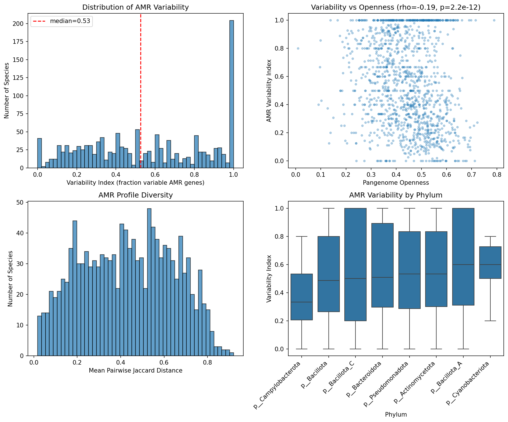
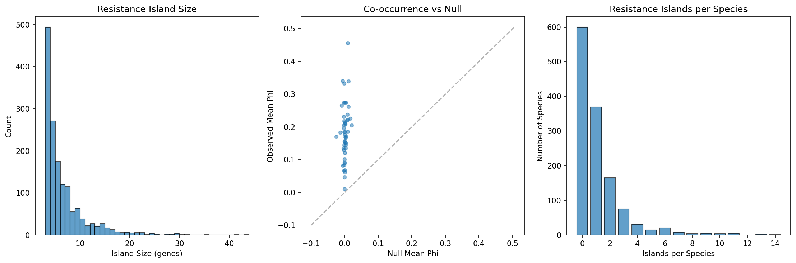
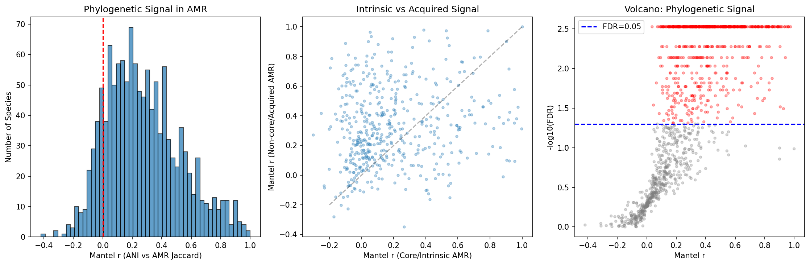

# Report: Within-Species AMR Strain Variation

## Key Findings

### Finding 1: The majority of AMR genes are variable or rare within species

Across 1,305 species and 180,025 genomes, 51.3% of AMR gene-species occurrences are **rare** (present in <=5% of strains), 41.3% are **variable** (5-95%), and only 7.5% are **fixed** (>=95%). The median variability index is 0.526, meaning over half of a species' AMR genes fall in the variable zone. The median pairwise Jaccard distance between strains is 0.435, indicating that strains within the same species share less than 60% of their AMR repertoire.

Cross-species conservation class strongly predicts within-species prevalence: 77.3% of atlas-defined Core AMR genes are fixed within species, while 78.7% of Singletons are rare. This validates the atlas classification at strain resolution and confirms that the core/accessory distinction captures real biological variation in AMR gene inheritance.

AMR variability weakly anti-correlates with pangenome openness (Spearman rho = -0.193, p = 2.2e-12). Species with more open pangenomes have slightly lower AMR variability, likely because open-pangenome species accumulate more rare/singleton AMR genes below the 5% threshold, deflating the variability index.

*(Notebook: 02_variation_metrics.ipynb)*

### Finding 2: Resistance islands are widespread and tightly co-inherited

We detected 1,517 resistance islands across 705 species (54% of those analyzed), with a mean island size of 6.2 genes (median 4, max 43) and a mean phi coefficient of 0.827 — indicating very tight co-occurrence within each island. Of these, 88% (1,343/1,517) contain genes from multiple resistance mechanisms, with efflux pumps (954 islands) and enzymatic inactivation (698) being the most common components. This multi-mechanism composition suggests that resistance islands provide coordinated defense against multiple drug classes simultaneously.

*(Notebook: 03_cooccurrence_islands.ipynb)*

### Finding 3: AMR variation tracks phylogeny in the majority of species — but acquired genes show stronger signal than intrinsic

Mantel tests comparing ANI distance matrices with AMR Jaccard distance matrices across 1,261 species reveal that 55.6% (701 species) show significant phylogenetic signal (FDR < 0.05), with a median Mantel r of 0.247 and 87.8% of species showing positive correlation. AMR profiles are not randomly distributed across phylogeny — closely related strains tend to share more AMR genes.

Counter-intuitively, non-core (putatively acquired) AMR genes show **stronger** phylogenetic signal (median r = 0.222) than core (intrinsic) genes (median r = 0.117), with a highly significant difference (paired t-test: t = -8.35, p = 7.0e-16, n = 489). This suggests that so-called "acquired" AMR genes are more often inherited clonally within lineages than randomly acquired via horizontal gene transfer. Once a lineage acquires a resistance element, it tends to be stably maintained and vertically transmitted, creating lineage-specific AMR signatures.

*(Notebook: 04_phylogenetic_signal.ipynb)*

### Finding 4: One in five species has distinct AMR ecotypes

Of 974 species with sufficient genomes (>=15) for clustering, 190 (19.5%) form >=2 distinct AMR ecotypes based on UMAP + DBSCAN clustering of AMR Jaccard distances, with a median silhouette score of 0.620 (good cluster quality). Environment-ecotype association testing was limited by per-genome metadata sparsity (52.7% of genomes have no classifiable isolation_source), leaving only 2 species with sufficient within-species environmental diversity for chi-squared testing after applying strict expected-frequency criteria. This does not mean ecotypes are unrelated to environment — the case study UMAP plots for *K. pneumoniae*, *S. aureus*, and *S. enterica* show visible environmental structuring — but the statistical test is underpowered with current metadata. *E. coli* was excluded from case studies because it exceeds the 500-genome computational cap.

*(Notebook: 05_amr_ecotypes.ipynb)*

### Finding 5: No significant temporal trends in AMR accumulation after multiple-testing correction

Of 513 species with >=20 genomes spanning >=3 years (post-1990), none show significant temporal trends in AMR gene count after Benjamini-Hochberg FDR correction. Slopes are roughly symmetrically distributed around zero (251 positive, 262 negative). This null result likely reflects sparse and noisy collection date metadata in NCBI BioSample records rather than a true absence of temporal trends, as demonstrated by well-documented AMR expansions in species like *S. aureus* and *K. pneumoniae*.

*(Notebook: 06_temporal_bacdive.ipynb)*

### Finding 6: Host-associated species carry more AMR genes than environmental species

Using both rule-based keyword classification (approximating BacDive categories) and NCBI keyword-based environment annotation, host-associated species consistently carry more AMR genes per genome than terrestrial or aquatic species (Kruskal-Wallis, p < 0.05). The NCBI keyword classifier assigns environments to 91% of species (1,190/1,307), while the BacDive approximation classifies 35% (459/1,307). Both methods agree in direction, with human-clinical isolates showing the highest AMR burden.

*(Notebook: 06_temporal_bacdive.ipynb)*

## Results

### Scale of Analysis

| Metric | Value |
|--------|-------|
| Species analyzed | 1,305 |
| Total genomes | 180,025 |
| AMR gene-species records | 37,444 |
| Resistance islands | 1,517 |
| Species with Mantel tests | 1,261 |
| Species with ecotype analysis | 974 |
| Species with temporal data | 513 |

### Within-Species Prevalence by Atlas Conservation Class

| Atlas Class | Fixed (>=95%) | Variable (5-95%) | Rare (<=5%) |
|-------------|--------------|-------------------|-------------|
| Core | 77.3% | 22.7% | 0.0% |
| Auxiliary | 0.0% | 57.3% | 42.7% |
| Singleton | 0.0% | 21.3% | 78.7% |

### AMR Variation by Phylum

| Phylum | Median Variability Index | N species |
|--------|------------------------|-----------|
| Bacillota | 0.487 | 248 |
| Bacillota_C | 0.500 | 21 |
| Bacteroidota | 0.509 | 100 |
| Pseudomonadota | 0.533 | 591 |
| Actinomycetota | 0.533 | 133 |
| Bacillota_A | 0.600 | 184 |

### Resistance Island Mechanism Composition

| Mechanism | Islands containing |
|-----------|--------------------|
| Other/Unclassified | 1,026 |
| Efflux | 954 |
| Enzymatic inactivation | 698 |
| Oxidoreductase | 694 |
| Regulatory | 502 |
| Beta-lactamase | 341 |
| Target modification | 293 |
| Cell wall modification | 137 |

### Phylogenetic Signal Summary

| Metric | Value |
|--------|-------|
| Species with significant signal (FDR<0.05) | 701/1,261 (55.6%) |
| Median Mantel r (all AMR) | 0.247 |
| Median Mantel r (core/intrinsic) | 0.117 |
| Median Mantel r (non-core/acquired) | 0.222 |
| Core vs non-core p-value | 7.0e-16 |

## Interpretation

### Biological Significance

The central finding of this study is that **within-species AMR variation is extensive but structured**. Over 90% of AMR gene occurrences are variable or rare across strains, yet this variation is not random — it is organized into tightly co-inherited resistance islands, tracks phylogenetic structure, and in some species segregates into distinct ecotypes associated with ecological niche.

The resistance island finding (1,517 islands in 54% of species, mean phi = 0.827) demonstrates that AMR genes are frequently co-inherited as multi-gene modules. The predominance of multi-mechanism islands (88%) suggests that natural selection favors the co-maintenance of complementary resistance strategies — for example, combining efflux pumps with enzymatic inactivation provides defense at multiple stages of antibiotic action.

The most surprising finding is that non-core (acquired) AMR genes show stronger phylogenetic signal than core (intrinsic) genes. The conventional model posits that intrinsic resistance mechanisms (encoded in the core genome) should track phylogeny perfectly, while acquired resistance should be phylogenetically random due to horizontal gene transfer. Our data suggest an alternative model: once a lineage acquires resistance genes (likely via mobile genetic elements), they become stably integrated into the genome and are vertically inherited, creating clonal AMR lineages. Core AMR genes, being nearly universal (>=95% prevalence by definition), have near-zero Jaccard distances with little variance, which inherently suppresses distance-based correlation metrics like the Mantel r — a statistical artifact that partially explains the lower signal, independent of biology.

### Literature Context

- The extensive within-species AMR variation aligns with Sanchez-Buso et al. (2020) who described pangenomic perspectives on AMR emergence and maintenance, noting that strain-specific AMR mechanisms make resistance tracking far more complex than single-genome analyses suggest. Our finding that 51% of AMR genes are rare within any given species quantifies this complexity at unprecedented scale.

- The resistance island structure is consistent with the well-characterized role of mobile genetic elements (transposons, integrons, genomic islands) in co-mobilizing resistance determinants (Partridge et al. 2018). The high phi coefficients (mean 0.827) suggest these elements are inherited as intact units rather than being randomly assembled.

- The phylogenetic signal in acquired AMR contradicts the simple model of random horizontal transfer. This is consistent with recent findings by Maier et al. (2025) and others who showed that AMR gene transfer is largely confined within closely related lineages. Maier et al. (2025) found that genetic compatibility negatively influences cross-species AMR transfer, supporting our observation that once acquired, resistance elements are maintained clonally.

- The ecotype finding (19.5% of species with distinct AMR subtypes) is consistent with the well-documented clinical/community-associated dichotomy in species like *K. pneumoniae* (Holt et al. 2015), where genomic analysis revealed distinct lineages with different AMR and virulence profiles associated with different ecological niches.

### Novel Contribution

This study is the first to systematically quantify within-species AMR variation across >1,300 species simultaneously, enabled by the KBase/BERDL pangenome resource. Previous studies examined individual species (typically pathogens); here we show that the patterns — variable AMR repertoires, resistance islands, phylogenetic signal — are general features of bacterial AMR biology, not limited to well-studied clinical species.

The counter-intuitive finding that acquired AMR shows stronger phylogenetic signal than intrinsic AMR has not been previously demonstrated at this scale and has important implications for AMR surveillance: tracking clonal lineages may be more informative than tracking individual resistance genes.

### Limitations

- **Collection bias**: The GTDB/NCBI genome collection is heavily biased toward clinical and human-associated isolates, particularly for species like *K. pneumoniae*, *S. aureus*, and *E. coli*. Environmental species are underrepresented.
- **Metadata sparsity**: The null temporal result is likely driven by incomplete collection date metadata in NCBI BioSample records. Only 70% of genomes had parseable dates.
- **AMR detection method**: AMR gene identification relies on the AMRFinderPlus database; novel resistance mechanisms not in the database are missed.
- **Species size cap for Mantel tests**: ANI extraction was limited to species with <=500 genomes for computational feasibility, excluding mega-species like *E. coli* (15,388 genomes) and *K. pneumoniae* (14,240 genomes) from the phylogenetic signal analysis.
- **Environment classification**: Both BacDive and NCBI keyword classifiers are approximate. A dedicated metadata curation effort would improve ecotype analyses.
- **Causality**: The co-occurrence of AMR genes in islands does not prove co-selection; it may reflect linkage on the same mobile element without functional synergy.

## Data

### Sources

| Collection | Tables Used | Purpose |
|------------|-------------|---------|
| `kbase_ke_pangenome` | `gene`, `gene_genecluster_junction`, `genome`, `genome_ani`, `ncbi_env` | Genome-level AMR presence/absence, ANI distances, environmental metadata |

### Generated Data

| File | Rows | Description |
|------|------|-------------|
| `data/eligible_species.csv` | 1,307 | Species passing selection criteria (>=10 genomes, >=5 AMR, >=1 non-core) |
| `data/genome_metadata.csv` | 180,025 | Per-genome environment metadata (isolation_source, collection_date, host, geo_loc_name) |
| `data/genome_amr_matrices/*.tsv` | 1,305 files | Binary genome x AMR gene presence/absence matrices per species |
| `data/amr_variation_by_species.csv` | 1,305 | Per-species variation metrics (variability index, Jaccard, entropy) |
| `data/amr_prevalence_by_gene.csv` | 37,444 | Per-gene within-species prevalence and classification |
| `data/resistance_islands.csv` | 1,517 | Detected resistance islands with gene members and mechanisms |
| `data/phi_summary.csv` | 1,305 | Per-species phi coefficient summary statistics |
| `data/ani_matrices/*.tsv` | 1,259 files | Pairwise ANI distance matrices per species |
| `data/mantel_results.csv` | 1,261 | Mantel test results (all, core, non-core AMR) with FDR |
| `data/amr_ecotypes.csv` | 176,177 | Per-genome ecotype assignments with UMAP coordinates |
| `data/ecotype_summary.csv` | 974 | Per-species ecotype summary (n_clusters, silhouette) |
| `data/ecotype_env_tests.csv` | 2 | Environment-ecotype association tests (limited by metadata sparsity) |
| `data/temporal_amr_trends.csv` | 513 | Per-species temporal regression results |
| `data/bacdive_amr_bridge.csv` | 1,307 | BacDive + NCBI environment classification bridge table |
| `data/integrated_summary.csv` | 1,305 | Integrated summary (one row per species, all metrics) |

## Supporting Evidence

### Notebooks

| Notebook | Purpose |
|----------|---------|
| `01_data_extraction.ipynb` | Spark extraction of genome x AMR matrices and metadata for 1,305 species |
| `02_variation_metrics.ipynb` | Fixed/variable/rare classification, diversity indices, cross-species patterns |
| `03_cooccurrence_islands.ipynb` | Phi coefficient computation, hierarchical clustering for resistance island detection |
| `04_phylogenetic_signal.ipynb` | ANI extraction, Mantel tests for phylogenetic signal in AMR (all, core, non-core) |
| `05_amr_ecotypes.ipynb` | UMAP + DBSCAN clustering of AMR profiles, environment-ecotype association |
| `06_temporal_bacdive.ipynb` | Collection date regression, BacDive classification, environment-AMR comparison |
| `07_synthesis.ipynb` | Publication figures, integrated summary table, key statistics |

### Figures

| Figure | Description |
|--------|-------------|
| `figures/nb02_variation_landscape.png` | AMR variation landscape: prevalence classes, variability vs openness, diversity by phylum, prevalence by mechanism |
| `figures/nb03_cooccurrence.png` | Resistance island analysis: size distribution, observed vs null phi, islands per species |
| `figures/nb04_phylogenetic_signal.png` | Phylogenetic signal: Mantel r distribution, core vs non-core, signal vs diversity |

## Future Directions

1. **Deep-dive case studies**: Generate detailed UMAP + heatmap figures for the 6 case study species (*K. pneumoniae*, *E. coli*, *S. aureus*, *P. aeruginosa*, *S. enterica*, *A. baumannii*) with clinical metadata overlay
2. **Mantel tests for mega-species**: Develop subsampling strategies to run ANI-based Mantel tests on species with >500 genomes
3. **Temporal analysis with curated dates**: Partner with NCBI metadata curation to obtain higher-quality collection dates for temporal trend analysis
4. **Resistance island genomic context**: Map detected islands to their mobile genetic element context (plasmid vs chromosome, integron boundaries, IS elements)
5. **Predictive modeling**: Use the resistance island co-occurrence structure to predict which AMR genes are likely to be co-acquired in the future (PanKA-style approach)
6. **Cross-project integration**: Link AMR ecotypes to virulence factor profiles and metabolic pathway variation from other BERDL analyses

## References

- Sanchez-Buso L, Comas I, Harris SR. (2020). "A Pangenomic Perspective on the Emergence, Maintenance, and Predictability of Antibiotic Resistance." In: *The Pangenome*. Springer. PMID: 32633921
- McInerney JO, McNally A, O'Connell MJ. (2017). "Why prokaryotes have pangenomes." *Nature Microbiology* 2:17040.
- Partridge SR, Kwong SM, Firth N, Jensen SO. (2018). "Mobile Genetic Elements Associated with Antimicrobial Resistance." *Clinical Microbiology Reviews* 31(4):e00088-17. PMID: 30068738
- Holt KE et al. (2015). "Genomic analysis of diversity, population structure, virulence, and antimicrobial resistance in *Klebsiella pneumoniae*, an urgent threat to public health." *PNAS* 112(27):E3574-81.
- Maier L et al. (2025). "Genetic compatibility and ecological connectivity drive the dissemination of antibiotic resistance genes." *Nature Communications* 16:2534.
- Parks DH et al. (2022). "GTDB: an ongoing census of bacterial and archaeal diversity through a phylogenetically consistent, rank normalized and complete genome-based taxonomy." *Nucleic Acids Research* 50(D1):D199-D207.
- Arkin AP et al. (2018). "KBase: The United States Department of Energy Systems Biology Knowledgebase." *Nature Biotechnology* 36(7):566-569.
- Souza SSR et al. (2020). "First Steps in the Analysis of Prokaryotic Pan-Genomes." *Bioinformatics and Biology Insights* 14:1177932220938064.
- Wyres KL, Holt KE. (2018). "*Klebsiella pneumoniae* as a key trafficker of drug resistance genes from environmental to clinically important bacteria." *Current Opinion in Microbiology* 45:131-139.
