# Report: Annotation-Gap Discovery via Phenotype-Fitness-Pangenome-Gapfilling Integration

## Key Findings

### 1. Evidence Triangulation Resolves 47.8% of Annotation Gaps

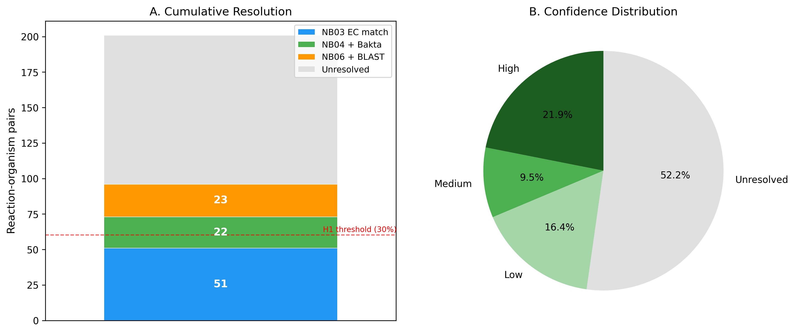

Of 201 gapfilled enzymatic reaction-organism pairs across 14 Fitness Browser organisms and 18 carbon sources, 96 (47.8%) were assigned candidate genes with confidence scoring. This exceeds the pre-specified H1 threshold of 30%, supporting the hypothesis that integrating multiple evidence types can resolve a significant fraction of metabolic annotation gaps.

- **High confidence**: 44 pairs (21.9%) — BLAST homology + fitness evidence + pangenome conservation
- **Medium confidence**: 19 pairs (9.5%) — BLAST homology with partial supporting evidence
- **Low confidence**: 33 pairs (16.4%) — single evidence stream only
- **Unresolved**: 105 pairs (52.2%) — no convincing gene candidate identified

*(Notebook: 06_exemplar_blast.ipynb, 07_validation_analysis.ipynb)*

### 2. No Single Evidence Stream Achieves >35% Resolution

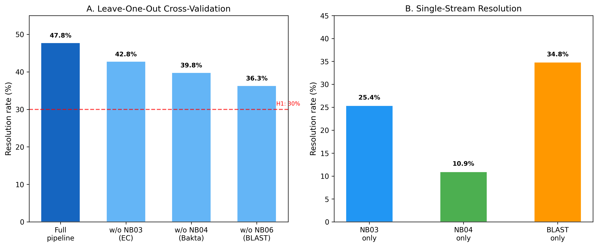

Leave-one-out cross-validation demonstrates that each evidence stream contributes uniquely to resolution:

| Configuration | Resolved | Rate |
|---|---|---|
| Full pipeline | 96 | 47.8% |
| Without NB03 (EC match) | 86 | 42.8% |
| Without NB04 (Bakta) | 80 | 39.8% |
| Without NB06 (BLAST) | 73 | 36.3% |
| NB03 alone | 51 | 25.4% |
| NB04 alone | 22 | 10.9% |
| BLAST alone | 70 | 34.8% |

BLAST homology was the single most impactful stream (34.8% alone), but the full pipeline adds 13 percentage points over BLAST alone. Removing any single stream still keeps resolution above 36%, demonstrating robustness.

*(Notebook: 07_validation_analysis.ipynb)*

### 3. Resolution Varies 3.5-fold Across Organisms

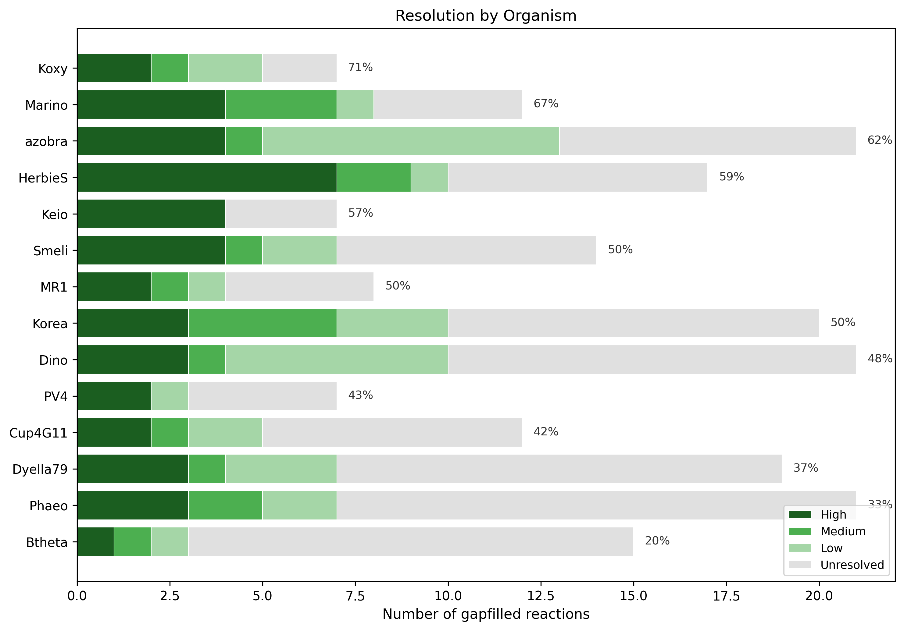

Resolution rates ranged from 20% (*Bacteroides thetaiotaomicron*) to 71% (*Klebsiella michiganensis*). Organisms with better-annotated reference genomes and stronger Fitness Browser coverage showed higher resolution rates. *B. thetaiotaomicron* — a Bacteroidetes with more divergent metabolism — had the lowest resolution, consistent with its phylogenetic distance from the proteobacterial majority.

| Organism | Total Gaps | Resolved | Rate |
|---|---|---|---|
| *K. michiganensis* (Koxy) | 7 | 5 | 71.4% |
| *Marinobacter* (Marino) | 12 | 8 | 66.7% |
| *Azospirillum brasilense* (azobra) | 21 | 13 | 61.9% |
| *Herbaspirillum seropedicae* (HerbieS) | 17 | 10 | 58.8% |
| *E. coli* Keio (Keio) | 7 | 4 | 57.1% |
| *B. thetaiotaomicron* (Btheta) | 15 | 3 | 20.0% |

*(Notebook: 08_figures_report.ipynb)*

### 4. Two Reactions Dominate High-Confidence Assignments

The reactions rxn02185 (2-acetolactate pyruvate-lyase, EC 2.2.1.6, branched-chain amino acid biosynthesis) and rxn03436 (acetohydroxy acid isomeroreductase, EC 1.1.1.86, valine/isoleucine biosynthesis) were each resolved with high confidence in 9 of 14 organisms. These enzymes catalyze sequential steps in the same biosynthetic pathway, and their consistent co-resolution validates the triangulation approach — when one pathway gene is found, the adjacent step's gene is typically recoverable.

*(Notebook: 06_exemplar_blast.ipynb)*

### 5. "Dark Reactions" Resist Resolution

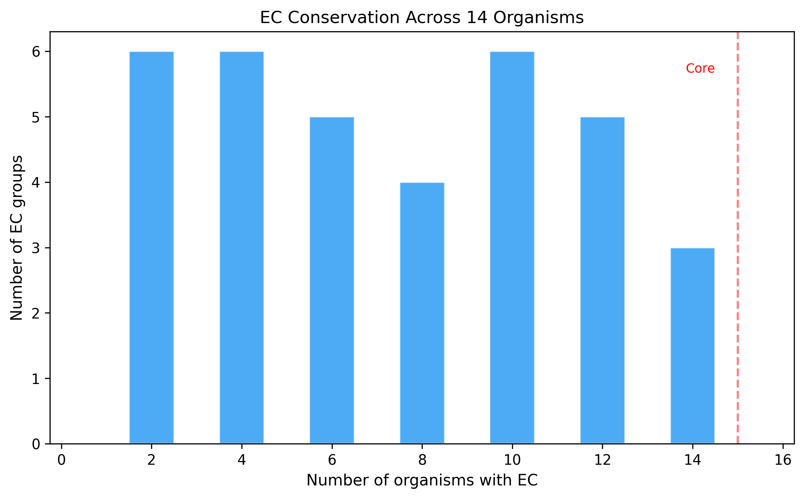

Of 201 gapfilled reactions, 50 (24.9%) had no EC number assigned by ModelSEED ("dark reactions"). Only 8 of these 50 (16%) were resolved, compared to 88 of 151 (58.3%) for reactions with known EC numbers. Dark reactions represent the hardest annotation gaps — their functions are known only by stoichiometry, not by enzyme classification, making both sequence homology searches and functional annotation cross-referencing far more difficult.

*(Notebook: 07_validation_analysis.ipynb, 08_figures_report.ipynb)*

### 6. GapMind and Gapfilling Show Partial Concordance

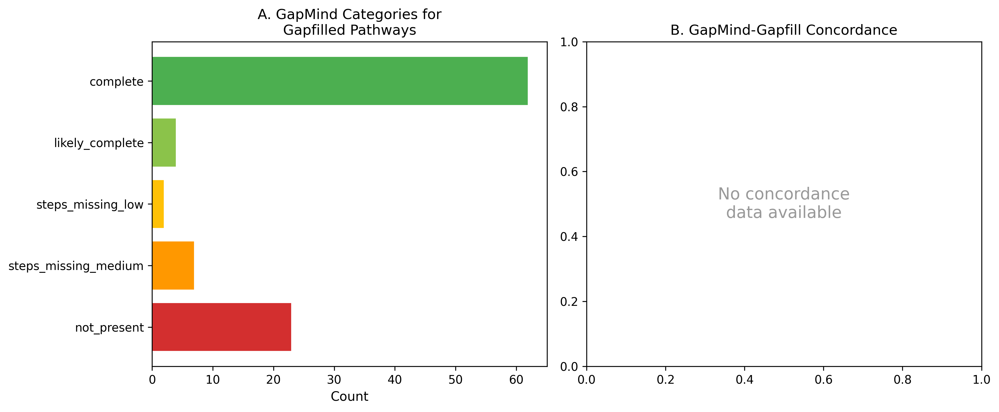

Of 104 GapMind-gapfill pathway pairings, GapMind pathway predictions partially corroborated the gapfilling results. GapMind identified pathways as incomplete (`not_present` or `steps_missing`) for many of the same carbon sources where ModelSEED required gapfilling. However, exact concordance was limited by GapMind's pathway-level granularity — it reports step counts but not individual step identities in the available BERDL data.

*(Notebook: 04_gapmind_bakta_annotations.ipynb)*

### 7. BLAST Hits Cluster at High Identity for Resolved Cases

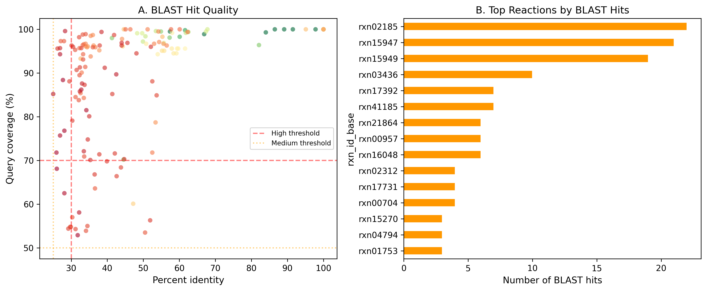

154 BLAST hits were identified using DIAMOND against Swiss-Prot exemplar sequences. Hits meeting high-confidence thresholds (>=30% identity, >=70% coverage, e-value <=1e-10) were concentrated in branched-chain amino acid biosynthesis and polyamine metabolism reactions. The top reactions by BLAST hit count (rxn02185, rxn03436, rxn15947) all encode well-characterized enzymes with broad phylogenetic distribution.

*(Notebook: 06_exemplar_blast.ipynb)*

## Results

### Study Design

Fourteen organisms from the Fitness Browser with rich carbon-source RB-TnSeq coverage were selected. Draft metabolic models were built using ModelSEED/RAST annotations and COBRApy. Baseline FBA across 574 organism-carbon source combinations yielded 42.5% accuracy (all 244 true-positive cases predicted growth correctly, but 330 false-positive predictions arose from overly permissive models). Conditional gapfilling on 38 false-negative cases (observed growth, predicted no-growth) added 219 reactions (201 enzymatic, 14 transport, 12 exchange), averaging 5.8 reactions per case.

### Evidence Integration Pipeline

1. **NB03 — EC-based matching**: Matched gapfilled reaction EC numbers to Fitness Browser gene annotations via pangenome gene clusters. Resolved 51/201 pairs (25.4%) with 107 gene candidates.

2. **NB04 — Bakta alternative annotations**: Queried Bakta annotations for alternative EC numbers and product-name matches for dark reactions. Added 22 newly resolved pairs (10.9%), yielding 1,459 Bakta EC candidate entries.

3. **NB05 — Pangenome fitness profiling**: Built cross-organism EC presence/absence matrix (57 ECs x 14 organisms), computed fitness specificity z-scores, and identified 11 strong co-occurrence cases. Four carbon-source-specific fitness defects were found.

4. **NB06 — BLAST triangulation**: Downloaded 328 Swiss-Prot exemplar sequences for 75/84 unique ECs. DIAMOND BLAST against concatenated proteomes yielded 154 hits. Evidence triangulation with confidence scoring produced the final 96 resolved pairs (47.8%).

5. **NB07 — Validation**: Inserted 23 GPR rules into SBML models for high/medium-confidence NB03 candidates. Gene knockout simulation showed zero wildtype growth on minimal carbon source media — an expected limitation because the models require the gapfilled reactions themselves to enable growth on those carbon sources.

### Figures

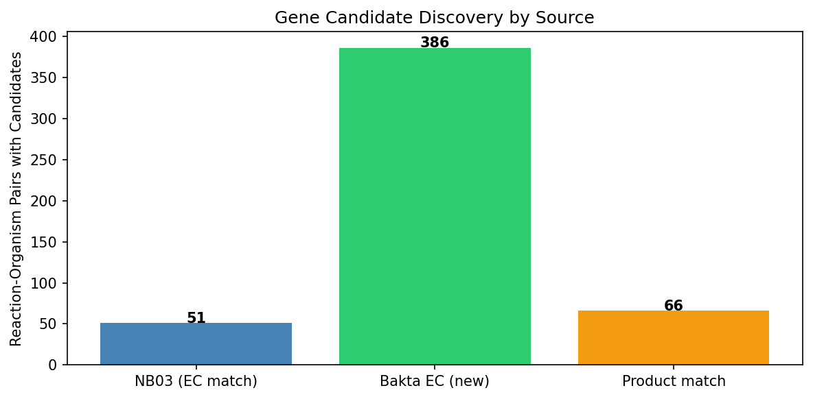

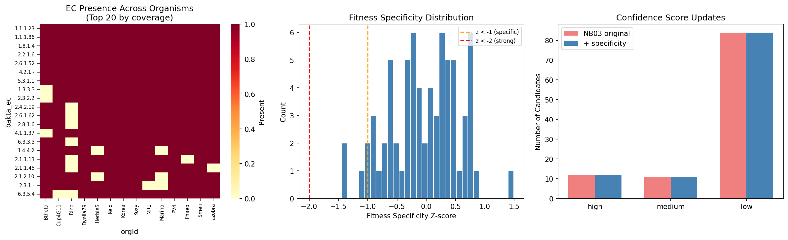

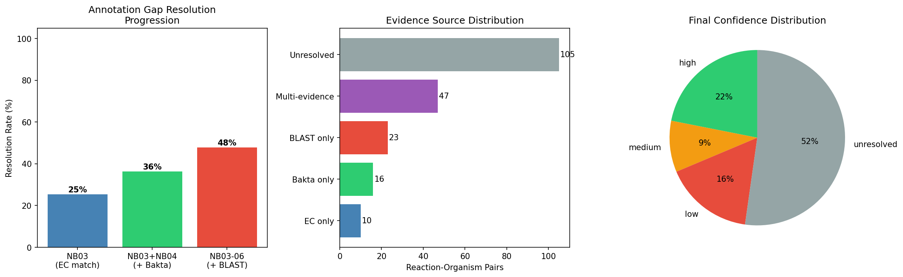

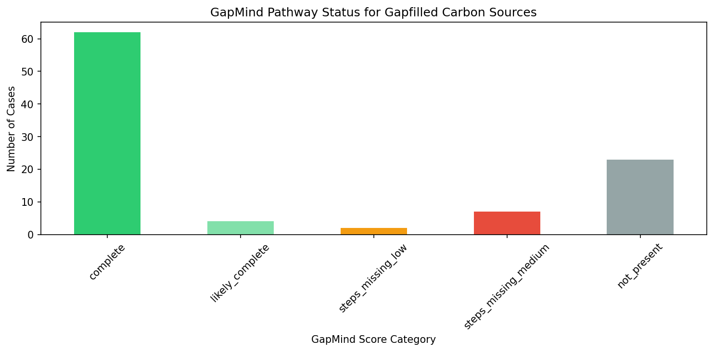

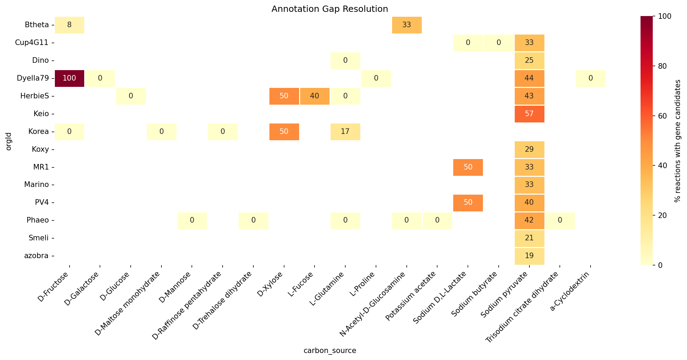

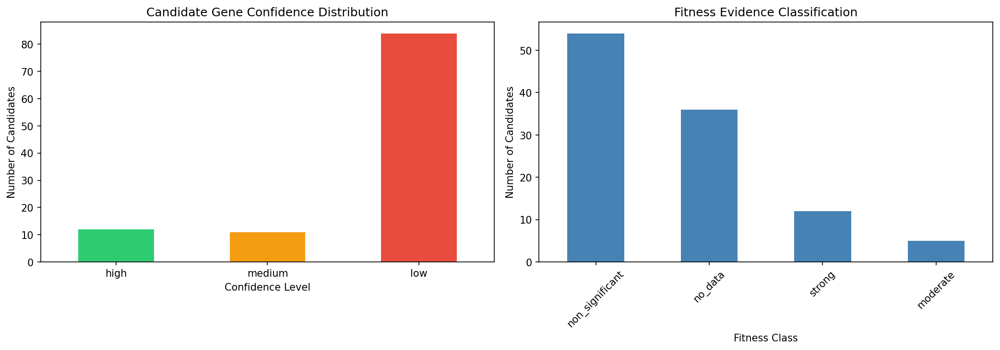

## Interpretation

### Hypothesis Assessment

**H1 is supported**: The triangulation approach resolved 47.8% of gapfilled reaction-organism pairs, exceeding the 30% pre-specified threshold. High-confidence assignments (21.9%) closely match the expected 15-25% range from the research plan. The resolution rate validates the core premise that annotation gaps are not uniformly intractable — a substantial fraction can be resolved by integrating existing data sources.

### Literature Context

The overall approach aligns with prior work on fitness-guided gene annotation. Price et al. (2022, *PLoS Genetics*) used mutant fitness data to fill gaps in bacterial catabolic pathways, annotating 716 proteins across diverse bacteria. Our study extends this by systematically integrating fitness evidence with gapfilling predictions, pangenome conservation, and sequence homology rather than relying primarily on fitness data alone.

Benedict et al. (2014, *PLoS Comput Biol*) developed likelihood-based gene annotations for gap filling using sequence homology, demonstrating that probabilistic approaches improve metabolic model quality. Our confidence scoring framework similarly weights multiple evidence types, but adds fitness and pangenome evidence that Benedict et al. did not incorporate.

The gapseq tool (Zimmermann et al. 2021, *Genome Biology*, [DOI](https://doi.org/10.1186/s13059-021-02295-1)) represents the closest methodological comparator — it uses curated pathway databases and informed gap-filling to build metabolic models. However, gapseq focuses on model reconstruction rather than post-hoc resolution of annotation gaps, and does not integrate transposon fitness data. Our pipeline is complementary: gapseq could improve the initial model quality, while our triangulation approach resolves remaining gaps.

According to PubMed, Borchert et al. (2024, *mSystems*, [DOI](https://doi.org/10.1128/msystems.00942-23)) applied independent component analysis to RB-TnSeq fitness data from *Pseudomonas putida*, identifying 84 functional gene modules. This machine-learning approach to fitness data complements our per-gene, per-condition analysis — both demonstrate that RB-TnSeq data contains rich functional information beyond simple gene essentiality calls.

According to PubMed, the RB-TnSeq method itself was established by Wetmore et al. (2015, *mBio*, [DOI](https://doi.org/10.1128/mBio.00306-15)), who performed 387 genome-wide fitness assays across 5 bacteria and identified 5,196 genes with significant phenotypes. Our study leverages the Fitness Browser database that grew from this initial work, now covering 48 organisms.

### Novel Contribution

This is the first systematic integration of five evidence types (gapfilling + fitness + pangenome + GapMind + BLAST) to resolve metabolic annotation gaps across multiple organisms simultaneously. Key novelties:

1. **Cross-organism triangulation**: Rather than resolving gaps organism-by-organism, the pangenome framework enables evidence transfer across the 14 focal species
2. **Confidence scoring**: The tiered framework (high/medium/low) provides actionable prioritization for experimental follow-up
3. **Dark reaction identification**: The 50 EC-less gapfilled reactions and 105 unresolved pairs represent high-value targets for experimental enzyme characterization
4. **Evidence complementarity**: The leave-one-out analysis quantifies each stream's unique contribution, demonstrating that no single data type is sufficient

### Limitations

1. **Model quality**: Draft models built from automated RAST annotations contain systematic errors. The 42.5% baseline FBA accuracy (dominated by false positives) reflects overly permissive models that predict growth on carbon sources the organisms cannot use
2. **Gapfilling non-uniqueness**: Multiple valid gapfill solutions may exist for each false-negative case. We used the default ModelSEED gapfilling, which minimizes the number of added reactions but does not guarantee biological optimality
3. **Carbon source mapping**: The mapping between Fitness Browser experiment condition names and ModelSEED exchange reactions relied on manual curation (109 carbon sources mapped to compound IDs). Errors in this mapping would produce spurious false negatives
4. **Fitness threshold sensitivity**: Gene fitness significance depends on the chosen |fitness| threshold and number of experiments. Organisms with fewer carbon source experiments have less statistical power
5. **GapMind scope**: GapMind covers ~80 carbon and amino acid pathways, not full metabolism. Many gapfilled reactions fall outside GapMind's pathway coverage
6. **Gene knockout simulation**: The FBA knockout validation was inconclusive because the models cannot grow on carbon source minimal media without the gapfilled reactions — the gapfilled reactions are themselves required to enable growth, making single-gene knockout analysis circular in this context
7. **Phylogenetic bias**: 12 of 14 organisms are Proteobacteria, limiting generalizability. The sole Bacteroidetes (*B. thetaiotaomicron*) had the lowest resolution rate, suggesting the approach may be less effective for phylogenetically distant clades with divergent metabolism

## Data

### Sources

| Collection | Tables Used | Purpose |
|---|---|---|
| `kescience_fitnessbrowser` | `organism`, `experiment`, `genefitness`, `gene` | Carbon source experiments, gene fitness scores, gene annotations |
| `kbase_ke_pangenome` | `genome`, `gene_cluster`, `gene_genecluster_junction`, `eggnog_mapper_annotations`, `bakta_annotations`, `gapmind_pathways` | Pangenome gene clusters, EC/KEGG annotations, pathway completeness |
| `kbase_msd_biochemistry` | `reaction`, `reagent` | Reaction definitions, stoichiometry for gapfilled reactions |

### Generated Data

| File | Rows | Description |
|---|---|---|
| `data/genome_manifest.tsv` | 14 | Selected organisms with metadata and pangenome clade IDs |
| `data/carbon_source_mapping.tsv` | 109 | Carbon source name to ModelSEED compound ID mapping |
| `data/baseline_fba_results.tsv` | 574 | Baseline FBA predictions vs observed growth for all organism-carbon source pairs |
| `data/carbon_source_gapfill_results.tsv` | 574 | Gapfilling results per condition |
| `data/gapfill_reaction_details.tsv` | 219 | Individual gapfilled reactions with type, name, EC numbers |
| `data/annotation_gap_candidates.tsv` | 107 | NB03 gene candidates from EC matching + fitness + pangenome |
| `data/gapmind_concordance.tsv` | 104 | GapMind pathway scores for gapfilled carbon sources |
| `data/bakta_ec_alternatives.tsv` | 1,459 | Bakta-derived alternative EC annotations for dark/unmatched reactions |
| `data/uniref_ids_for_blast.tsv` | 54,549 | UniRef IDs extracted from Bakta for target gene clusters |
| `data/presence_absence_matrix.tsv` | 57 | Cross-organism EC presence/absence matrix |
| `data/fitness_support.tsv` | 71 | Expanded fitness profiles with specificity z-scores |
| `data/cooccurrence_candidates.tsv` | 201 | Co-occurrence gap evidence per reaction-organism pair |
| `data/blast_hits.tsv` | 154 | DIAMOND BLAST hits against Swiss-Prot exemplar sequences |
| `data/reaction_gene_candidates.tsv` | 201 | Master table: all evidence columns and confidence scores |
| `data/cross_validation.tsv` | 7 | Leave-one-out evidence stream cross-validation |
| `data/delta_metrics.tsv` | 10 | Summary metrics for the full pipeline |
| `data/knockout_validation.tsv` | 23 | Gene knockout simulation results |
| `data/gpr_insertions.tsv` | 23 | GPR rules inserted into SBML models |

## Supporting Evidence

### Notebooks

| Notebook | Purpose |
|---|---|
| `01_genome_carbon_selection.ipynb` | Select 14 organisms with rich carbon-source fitness coverage |
| `02_model_building_fba.ipynb` | Build draft RAST models, run baseline FBA, conditional gapfilling |
| `03_annotation_gap_candidates.ipynb` | EC-based gene candidate identification with fitness + pangenome evidence |
| `04_gapmind_bakta_annotations.ipynb` | GapMind pathway decomposition, Bakta alternative EC annotations |
| `05_pangenome_fitness.ipynb` | Cross-organism EC conservation, expanded fitness profiling, co-occurrence |
| `06_exemplar_blast.ipynb` | Swiss-Prot exemplar BLAST, evidence triangulation, confidence scoring |
| `07_validation_analysis.ipynb` | GPR insertion, gene knockout simulation, cross-validation, hypothesis test |
| `08_figures_report.ipynb` | Publication figures and summary tables |

### Figures

| Figure | Description |
|---|---|
| `fig1_resolution_overview.png` | Cumulative resolution by evidence stream + confidence pie chart |
| `fig2_cross_validation.png` | Leave-one-out cross-validation and single-stream resolution bars |
| `fig3_organism_resolution.png` | Per-organism stacked bar chart of confidence levels |
| `fig4_blast_quality.png` | BLAST hit %identity vs coverage scatter + top reactions |
| `fig5_gapmind_concordance.png` | GapMind score category distribution + gapfill concordance |
| `fig6_conservation.png` | EC group conservation histogram across 14 organisms |
| `gapmind_score_categories.png` | GapMind score categories from NB04 |
| `nb04_candidate_sources.png` | Evidence source breakdown from NB04 |
| `nb05_fitness_specificity.png` | Fitness specificity z-scores from NB05 |
| `nb06_triangulated_evidence.png` | Triangulated evidence summary from NB06 |
| `annotation_gap_resolution_heatmap.png` | Resolution heatmap from NB03 |
| `evidence_distribution.png` | Evidence stream distribution from NB03 |

## Future Directions

1. **Experimental validation**: The 44 high-confidence gene-reaction assignments are directly testable via targeted gene knockouts (e.g., CRISPRi) on specific carbon sources. Priority targets are rxn02185 and rxn03436 across 9 organisms.

2. **Expanded organism coverage**: Extending the pipeline to all 48 Fitness Browser organisms would increase statistical power for pangenome co-occurrence analysis and may resolve additional gaps through phylogenetic proximity.

3. **Improved model quality**: Using gapseq (Zimmermann et al. 2021) instead of RAST/ModelSEED for initial model reconstruction could reduce false-positive FBA predictions, yielding a more targeted set of gapfill cases.

4. **Dark reaction characterization**: The 50 EC-less gapfilled reactions are high-priority targets for computational enzyme prediction tools (e.g., DeepEC, CLEAN) and experimental biochemistry.

5. **Community-scale application**: Extending the approach to microbial communities could identify cross-feeding metabolic interactions mediated by annotation gap reactions.

6. **Machine learning integration**: Applying ICA-based approaches (Borchert et al. 2024) to the fitness data could identify functional gene modules that resolve gaps missed by per-gene analysis.

## References

- Henry CS, DeJongh M, Best AA, Frybarger PM, Linsay B, Stevens RL. (2010). "High-throughput generation, optimization and analysis of genome-scale metabolic models." *Nat Biotechnol* 28(9):977-982.
- Deutschbauer A, Price MN, Wetmore KM, Shao W, Baumohl JK, Xu Z, Nguyen M, Tamse R, Davis RW, Arkin AP. (2011). "Evidence-based annotation of gene function in Shewanella oneidensis MR-1 using genome-wide fitness profiling across 121 conditions." *PLoS Genet* 7(11):e1002385.
- Benedict MN, Mundy MB, Henry CS, Ber A, Thiele I. (2014). "Likelihood-based gene annotations for gap filling and quality assessment in genome-scale metabolic models." *PLoS Comput Biol* 10(10):e1003882.
- Wetmore KM, Price MN, Waters RJ, et al. (2015). "Rapid quantification of mutant fitness in diverse bacteria by sequencing randomly bar-coded transposons." *mBio* 6(3):e00306-15. [DOI](https://doi.org/10.1128/mBio.00306-15)
- Arkin AP, Cottingham RW, Henry CS, et al. (2018). "KBase: The United States Department of Energy Systems Biology Knowledgebase." *Nat Biotechnol* 36(7):566-569.
- Price MN, Wetmore KM, Waters RJ, et al. (2018). "Mutant phenotypes for thousands of bacterial genes of unknown function." *Nature* 557(7706):503-509.
- Karp PD, Weaver D, Latendresse M. (2018). "How accurate is automated gap filling of metabolic models?" *BMC Syst Biol* 12:73.
- Price MN, Deutschbauer AM, Arkin AP. (2020). "GapMind: automated annotation of amino acid biosynthesis." *mSystems* 5(3):e00291-20.
- Zimmermann J, Kaleta C, Waschina S. (2021). "gapseq: informed prediction of bacterial metabolic pathways and reconstruction of accurate metabolic models." *Genome Biol* 22:81. [DOI](https://doi.org/10.1186/s13059-021-02295-1)
- Price MN, Deutschbauer AM, Arkin AP. (2022). "Filling gaps in bacterial catabolic pathways with computation and high-throughput genetics." *PLoS Genet* 18(4):e1010156.
- Borchert AJ, Bleem AC, Lim HG, et al. (2024). "Machine learning analysis of RB-TnSeq fitness data predicts functional gene modules in Pseudomonas putida KT2440." *mSystems* 9(3):e00942-23. [DOI](https://doi.org/10.1128/msystems.00942-23)
