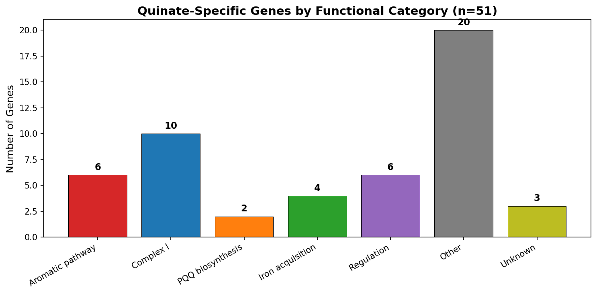
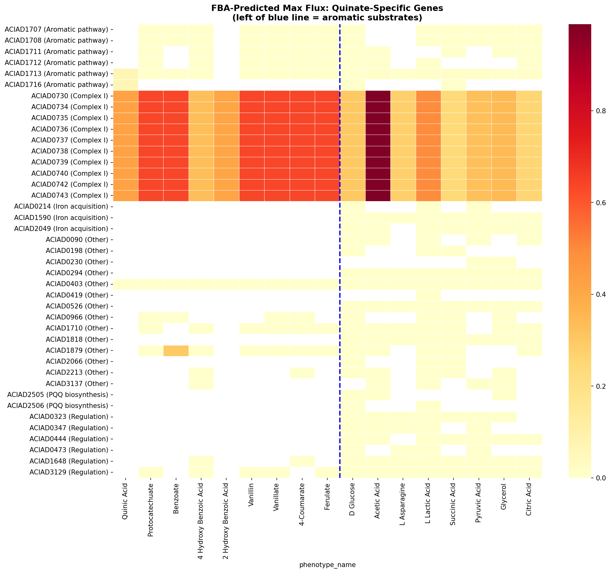
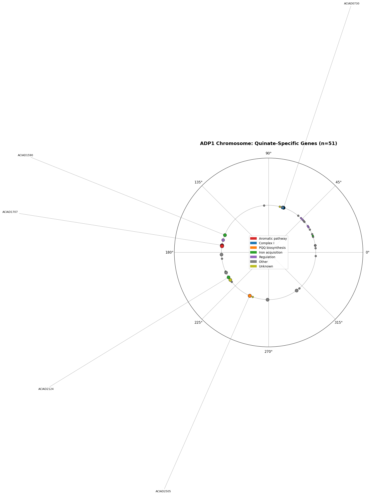
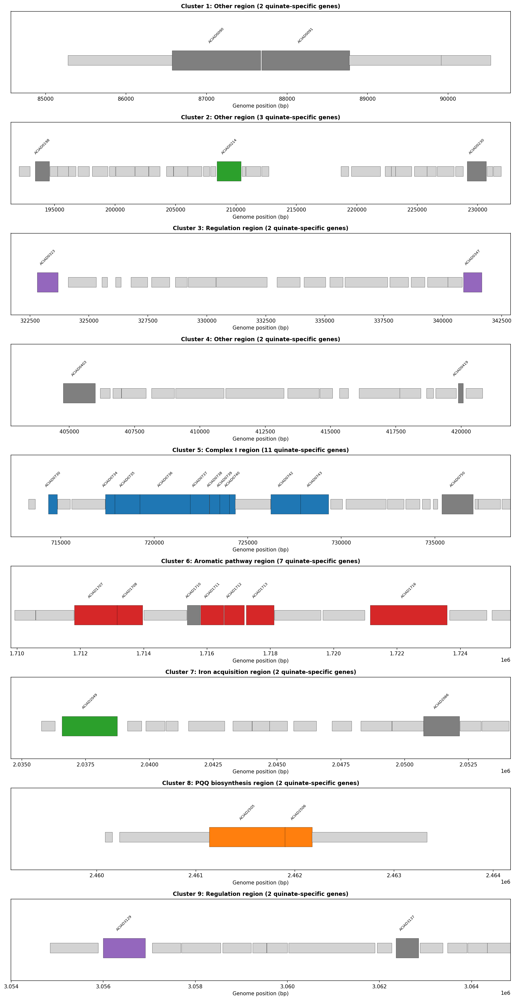
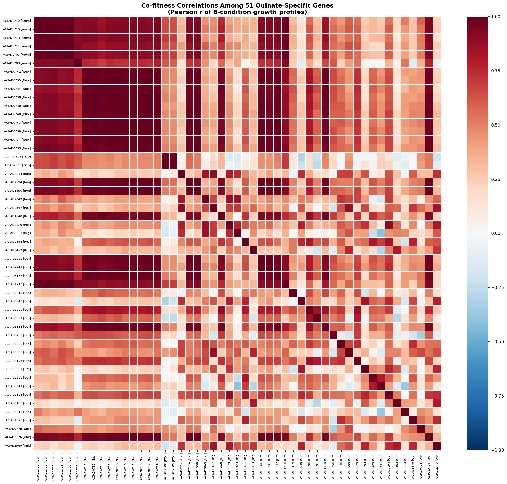
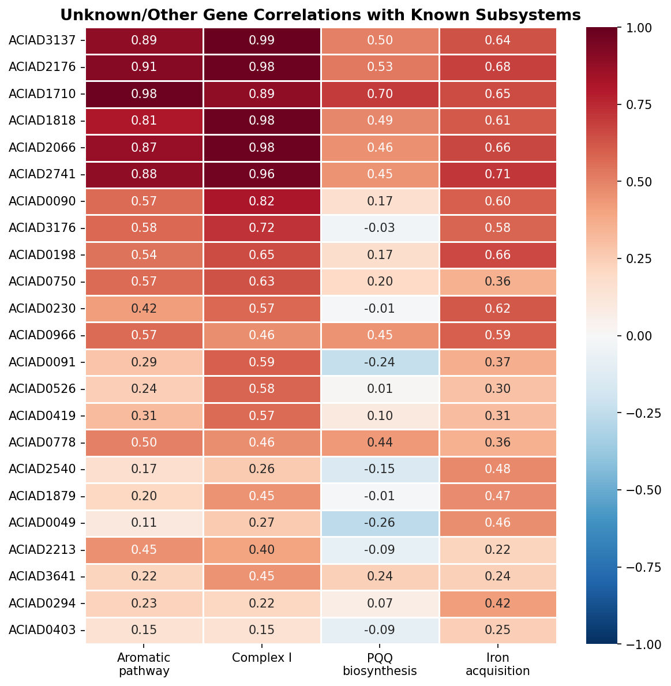
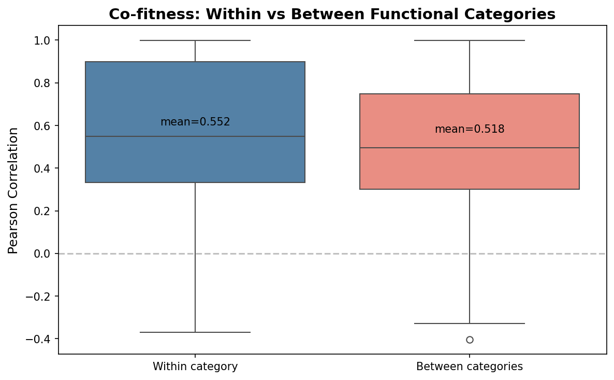
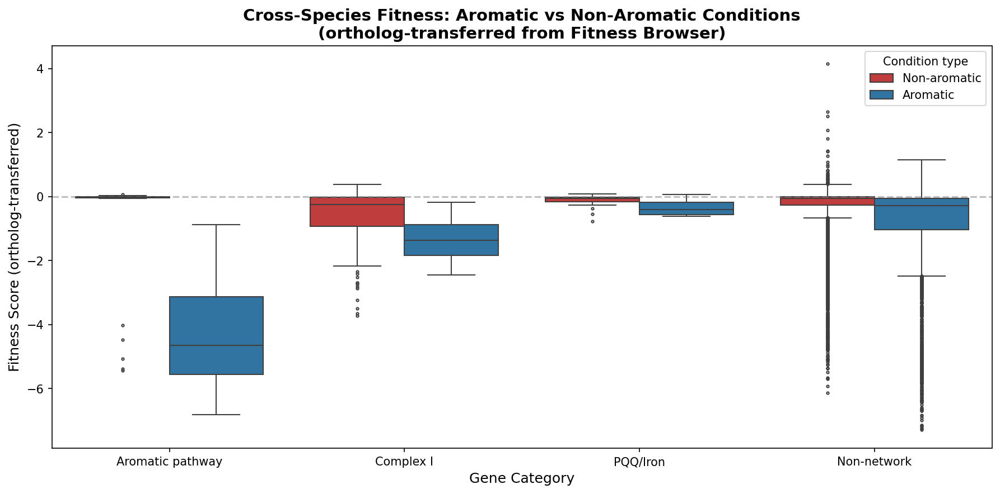
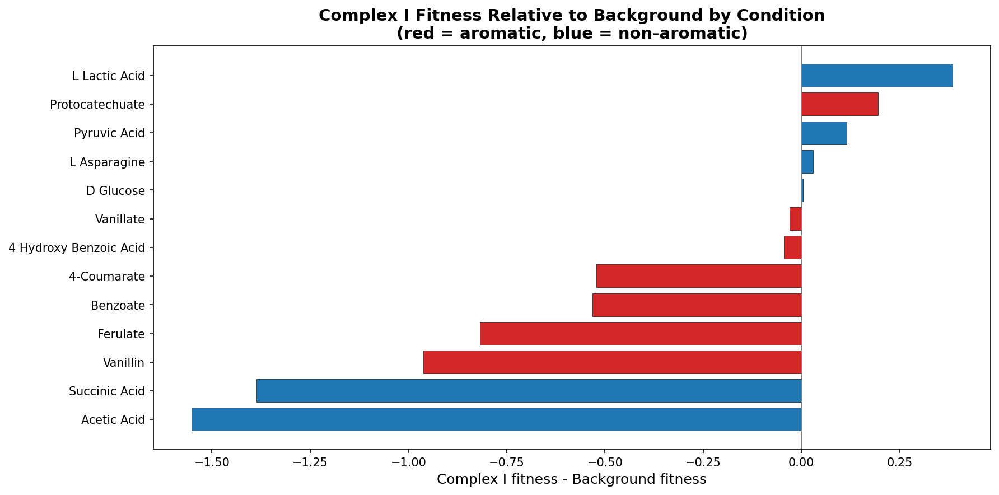

# Report: Aromatic Catabolism Support Network in ADP1

## Key Findings

### 1. Aromatic catabolism requires a 51-gene support network spanning 4 metabolic subsystems

The 51 quinate-specific genes in ADP1 organize into a coherent metabolic dependency network around the β-ketoadipate pathway. Co-fitness analysis assigns 44/51 genes (86%) to four functional subsystems: the core aromatic degradation pathway (8 genes), Complex I / NADH dehydrogenase (21 genes), iron acquisition (7 genes), and PQQ biosynthesis (2 genes), plus 6 transcriptional regulators. Each subsystem addresses a specific biochemical requirement of aromatic catabolism.

| Subsystem | Genes | Biochemical rationale |
|-----------|-------|-----------------------|
| Aromatic pathway | 8 | Core: quinate → protocatechuate → β-ketoadipate → TCA cycle |
| Complex I | 21 | NADH reoxidation: TCA cycle generates excess NADH from aromatic catabolism |
| Iron acquisition | 7 | Fe²⁺ supply for protocatechuate 3,4-dioxygenase (ring cleavage) |
| PQQ biosynthesis | 2 | PQQ cofactor for quinoprotein quinate dehydrogenase |
| Regulation | 6 | Transcriptional control of aromatic degradation operons |
| Unassigned | 7 | Low co-fitness with all subsystems |

*(Notebook: 01_metabolic_dependencies.ipynb, 03_cofitness_network.ipynb)*

### 2. Complex I is the largest support subsystem — and invisible to FBA

Complex I (NADH:ubiquinone oxidoreductase) accounts for 21 of 51 quinate-specific genes (41%), making it the dominant support requirement for aromatic catabolism. The FBA model captures 1.76× higher Complex I flux on aromatic substrates (0.55 vs 0.31), but predicts 0% essentiality — it sees the increased demand but not the bottleneck. Furthermore, 30/51 quinate-specific genes have no FBA reaction mappings at all — cofactor supply chains (PQQ, iron) and regulatory genes are invisible to the metabolic model.

*(Notebook: 01_metabolic_dependencies.ipynb)*

### 3. Support subsystems are genomically independent but metabolically coupled

The four subsystems occupy distinct chromosomal locations: Complex I operon at 714–729 kb, pca/qui pathway at 1,709–1,724 kb, PQQ biosynthesis at 2,461 kb, and iron acquisition genes scattered across 4 loci. No cross-category operons exist (except one within the aromatic pathway itself). The metabolic dependency is not encoded by genomic co-localization — it emerges from the biochemistry of aromatic ring cleavage.

The Complex I operon contains 13 subunits (nuoA–N), all on the same strand with <100 bp intergenic distances. Disrupting any single subunit eliminates the entire complex, explaining why 10/13 subunits independently produce quinate-specific growth defects.

*(Notebook: 02_genomic_organization.ipynb)*

### 4. Co-fitness assigns 16 unknown genes to specific subsystems

Of 23 genes initially categorized as "Other" or "Unknown," 16 were assigned to support subsystems with medium or high confidence based on growth profile correlations with known subsystem members. Two DUF-domain proteins (ACIAD3137, ACIAD2176) show r > 0.98 correlation with Complex I genes — these are candidates for uncharacterized Complex I accessory factors. Within-category correlation is dramatically higher than between-category (Complex I mean r = 0.992, Aromatic pathway r = 0.961).

*(Notebook: 03_cofitness_network.ipynb)*

### 5. Cross-species: Complex I dependency is on high-NADH substrates, not aromatics specifically

Ortholog-transferred fitness data from the Fitness Browser (12,241 entries, 2,005 genes, 13 conditions) shows Complex I orthologs have significantly worse fitness on aromatic conditions (mean = -1.35 vs -0.77, Mann-Whitney p < 0.0001). However, per-condition analysis reveals that the largest Complex I defects relative to background are on acetate (-1.55) and succinate (-1.39) — non-aromatic substrates that also generate high NADH flux through the TCA cycle. ADP1's quinate-specificity of Complex I likely reflects an alternative NADH dehydrogenase (NDH-2) that compensates on simpler substrates.

*(Notebook: 04_cross_species.ipynb)*

## Results

### The β-Ketoadipate Pathway and Its Cofactor Requirements

Quinate catabolism proceeds through protocatechuate to β-ketoadipate, ultimately yielding succinyl-CoA and acetyl-CoA that enter the TCA cycle. Three key enzyme steps create the support dependencies:

1. **Quinate dehydrogenase (quiA)**: A PQQ-dependent quinoprotein — requires PQQ cofactor, explaining the 2 PQQ biosynthesis genes (pqqC, pqqD)
2. **Protocatechuate 3,4-dioxygenase (pcaGH)**: A non-heme Fe²⁺-dependent ring-cleavage enzyme — requires iron, explaining the 7 iron acquisition genes (siderophore biosynthesis, ExbD/TolR transport, ferrichrome receptor, TonB-dependent receptor)
3. **TCA cycle oxidation**: Succinyl-CoA and acetyl-CoA from β-ketoadipate are fully oxidized in the TCA cycle, generating NADH at multiple steps — requires Complex I for NADH reoxidation under high flux

### FBA Model Blind Spots

The FBA model correctly predicts higher Complex I flux on aromatic substrates (1.76× ratio) but fails to identify it as a bottleneck (0% predicted essentiality). This is because FBA models optimize for growth rate and can redistribute flux through alternative pathways. In reality, Complex I operates as a single multi-subunit complex — loss of any subunit eliminates function entirely, creating a threshold effect that FBA's linear programming framework doesn't capture.

More fundamentally, 30/51 quinate-specific genes lack FBA reaction mappings. PQQ biosynthesis, iron acquisition, transcriptional regulation, and the newly identified Complex I accessory factors are outside the model's scope. This represents a systematic blind spot: the metabolic model captures core metabolism but not the cofactor supply chains and regulatory infrastructure that make it work.

### Genomic Architecture

The support network's genomic organization reveals a separation between genetic and metabolic coupling:
- **Within operons**: genes are tightly co-regulated (Complex I: 13-gene operon, pca/qui: 12-gene operon)
- **Between operons**: no genomic linkage. Complex I, PQQ, and iron genes are on different parts of the chromosome
- **9 genomic clusters** of ≥2 quinate-specific genes, with mild overall clustering (observed/expected NN distance ratio = 0.89)

### Co-Fitness Network Validation

The co-fitness approach validates the functional categorization: Complex I genes correlate at r = 0.992 (essentially identical phenotypic profiles, consistent with single-operon co-regulation), and aromatic pathway genes at r = 0.961. The method successfully recovered pcaC (4-carboxymuconolactone decarboxylase), which was initially miscategorized by keyword matching, and identified two DUF proteins as probable Complex I accessory factors.

## Interpretation

### Literature Context

- The PQQ and iron dependencies are well-established biochemistry: PQQ-dependent quinate dehydrogenases are documented across aromatic-degrading bacteria (Adachi et al. 2003), and protocatechuate 3,4-dioxygenase's non-heme Fe²⁺ requirement is a defining feature of intradiol dioxygenases (Que 2005). Our analysis quantifies these dependencies at the whole-genome level for the first time.

- Stuani et al. (2014) showed 4/5 PQQ biosynthesis genes are upregulated on quinate vs succinate in ADP1. Our finding that PQQ genes are quinate-specific in growth phenotype is consistent with and extends their transcriptomic observation to the functional level.

- The Complex I dependency is the novel finding. Bacteria typically have branched respiratory chains with both proton-pumping Complex I (NDH-1) and non-pumping NDH-2 (Melo & Teixeira 2016). NDH-2 can substitute for Complex I under low NADH flux but cannot match Complex I's capacity under high flux. Our cross-species data supports this: Complex I is dispensable on glucose and lactate (where NDH-2 suffices) but essential on substrates that generate high TCA cycle flux (aromatics, acetate, succinate).

- Dal et al. (2005) mapped the transcriptional organization of the pca/qui genes. Our operon predictions match their experimental data, with the 12-gene pca/qui operon spanning pcaIJFBDCHG-quiABC plus transport genes.

### Novel Contribution

1. **Quantification of the support network**: Previous work focused on individual pathway genes. This analysis reveals that aromatic catabolism requires 51 genes — over 8× the core pathway — organized into 4 biochemically rational subsystems. The support requirement exceeds the pathway itself by 7:1.

2. **Complex I as the dominant support requirement**: 21/51 quinate-specific genes (41%) are associated with Complex I, making NADH reoxidation the largest metabolic dependency of aromatic catabolism. This was not predicted by the FBA model and has not been systematically documented.

3. **FBA model blind spot characterization**: 30/51 genes have no FBA reaction mappings. This quantifies a specific class of metabolic model incompleteness — cofactor supply chains, iron homeostasis, and respiratory chain capacity constraints.

4. **Co-fitness-based functional assignment**: 16 previously uncharacterized genes assigned to specific subsystems, including two DUF proteins (ACIAD3137, ACIAD2176) as candidate Complex I accessory factors with r > 0.98.

5. **Cross-species resolution**: The Complex I dependency is not exclusively aromatic — it's a high-NADH-flux dependency that manifests on aromatics, acetate, and succinate. ADP1's apparent quinate-specificity reflects its specific respiratory chain architecture (NDH-2 compensating on simpler substrates).

### Limitations

- The co-fitness analysis uses only 8 conditions (8-dimensional growth vectors), limiting the resolution of gene-gene correlations. With more conditions, the co-fitness network would provide sharper subsystem boundaries.
- Ortholog-transferred fitness data mixes signals from multiple FB organisms with different respiratory chain architectures. Direct Complex I fitness measurements on aromatic substrates in a single organism would be more definitive.
- The categorization of "Complex I-associated" genes beyond the core nuo operon (the 11 co-fitness assignments) is based on phenotypic correlation only. Some may have indirect connections rather than physical association with Complex I.
- PQQ biosynthesis genes also appear as glucose-specific in the adp1_deletion_phenotypes project (PQQ-dependent glucose dehydrogenase), so the PQQ dependency is not exclusively aromatic — it's shared with glucose catabolism.

## Data

### Sources
| Collection | Tables Used | Purpose |
|------------|-------------|---------|
| User-provided SQLite (`berdl_tables.db`) | `genome_features`, `gene_phenotypes`, `gene_reaction_data` | Growth ratios, FBA predictions (230 conditions), gene-reaction mappings |
| `kescience_fitnessbrowser` | Ortholog-transferred fitness via `gene_phenotypes` | Cross-species fitness on aromatic substrates |
| `kbase_ke_pangenome` | Pangenome core/accessory annotations (via genome_features) | Conservation context |

### Generated Data
| File | Rows | Description |
|------|------|-------------|
| `data/quinate_specific_genes.csv` | 51 | Quinate-specific genes with growth profiles and annotations |
| `data/support_network_genes.csv` | 51 | Genes with functional category assignments and biochemical rationale |
| `data/operon_assignments.csv` | 51 | Operon membership and intergenic distances |
| `data/cofitness_network.csv` | 1,275 | Pairwise Pearson correlations among 51 genes |
| `data/unknown_assignments.csv` | 23 | Co-fitness-based subsystem assignments for Other/Unknown genes |
| `data/final_network_model.csv` | 51 | Final category assignments integrating annotation + co-fitness |
| `data/cross_species_fitness.csv` | 13 | Per-condition Complex I vs background fitness comparison |

## Supporting Evidence

### Notebooks
| Notebook | Purpose |
|----------|---------|
| `01_metabolic_dependencies.ipynb` | FBA flux comparison (aromatic vs non-aromatic), pathway cofactor mapping, FB feasibility check |
| `02_genomic_organization.ipynb` | Chromosome mapping, operon prediction, genomic clustering analysis |
| `03_cofitness_network.ipynb` | Gene-gene co-fitness correlations, unknown gene subsystem assignment |
| `04_cross_species.ipynb` | Ortholog-transferred fitness: Complex I aromatic specificity test |

### Figures
| Figure | Description |
|--------|-------------|
| `support_network_categories.png` | Bar chart of 51 genes by functional category |
| `fba_flux_heatmap.png` | FBA-predicted max flux per gene × condition (aromatic vs non-aromatic) |
| `chromosome_map.png` | Polar chromosome map of quinate-specific gene positions |
| `gene_clusters.png` | Linear view of major genomic clusters (Complex I operon, pca/qui operon) |
| `cofitness_heatmap.png` | 51×51 pairwise Pearson correlation heatmap by category |
| `cofitness_within_between.png` | Box plot: within- vs between-category co-fitness |
| `unknown_assignments_heatmap.png` | Unknown gene correlations with each known subsystem |
| `cross_species_fitness.png` | Cross-species fitness distributions by category and condition type |
| `complex_I_vs_background.png` | Per-condition Complex I fitness relative to background |

## Future Directions

1. **Identify the alternative NADH dehydrogenase in ADP1**: Search the ADP1 genome for NDH-2 (type 2 NADH dehydrogenase) genes. If present, their deletion phenotype on quinate vs glucose would directly test whether NDH-2 compensates for Complex I on non-aromatic substrates.

2. **Validate DUF protein assignments experimentally**: ACIAD3137 (UPF0234) and ACIAD2176 (DUF2280) show r > 0.98 co-fitness with Complex I. Protein-protein interaction studies or co-purification with Complex I would test whether these are physical accessory factors or indirect regulatory connections.

3. **Expand the condition panel**: The 8-condition growth matrix provides ~5 independent dimensions. Additional aromatic substrates (benzoate, catechol, vanillate) plus stress conditions (iron limitation, respiratory inhibitors) would refine the subsystem boundaries and test the NADH-flux hypothesis directly.

4. **Cross-species pangenome comparison**: Use BERDL's `eggnog_mapper_annotations` to test whether Acinetobacter species that carry the pca pathway are more likely to retain Complex I (KOs K00330–K00343) than species without aromatic degradation capability.

5. **Integrate with the metabolic model**: The 30 genes without FBA reaction mappings represent a specific class of model incompleteness. Adding PQQ biosynthesis, iron homeostasis, and respiratory chain capacity constraints to the ADP1 FBA model could improve its predictive accuracy for condition-dependent essentiality.

## References

- Adachi O et al. (2003). "PQQ-dependent quinoprotein dehydrogenases in oxidative fermentation." *Enzyme and Microbial Technology*.
- Dal S et al. (2005). "Transcriptional organization of genes for protocatechuate and quinate degradation from Acinetobacter sp. strain ADP1." *Applied and Environmental Microbiology* 71(2):1025-1034.
- de Berardinis V et al. (2008). "A complete collection of single-gene deletion mutants of Acinetobacter baylyi ADP1." *Molecular Systems Biology* 4:174. PMID: 18319726
- Erickson E et al. (2022). "Critical enzyme reactions in aromatic catabolism for microbial lignin conversion." *Nature Catalysis* 5:886-898.
- Fischer R et al. (2008). "Catabolite repression of aromatic compound degradation in Acinetobacter baylyi." *Journal of Bacteriology* 190(5):1759-1767.
- Melo AMP & Teixeira M (2016). "Supramolecular organization of bacterial aerobic respiratory chains." *Biochimica et Biophysica Acta - Bioenergetics* 1857(3):190-197.
- Price MN et al. (2018). "Mutant phenotypes for thousands of bacterial genes of unknown function." *Nature* 557:503-509.
- Que L Jr (2005). "Non-heme iron dioxygenases: structure and mechanism." *Structure and Bonding* 97:21-58.
- Stanier RY & Ornston LN (1973). "The β-ketoadipate pathway." *Advances in Microbial Physiology* 9:89-151.
- Stuani L et al. (2014). "Novel metabolic features in Acinetobacter baylyi ADP1 revealed by a multiomics approach." *Metabolomics* 10(6):1223-1238. PMID: 25374488
