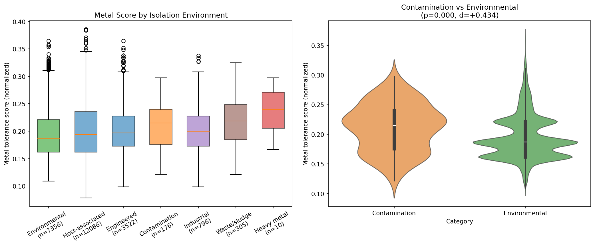
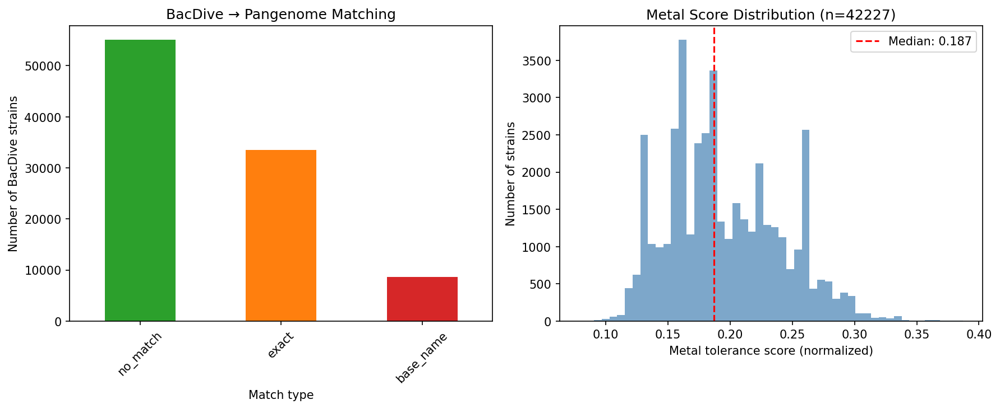
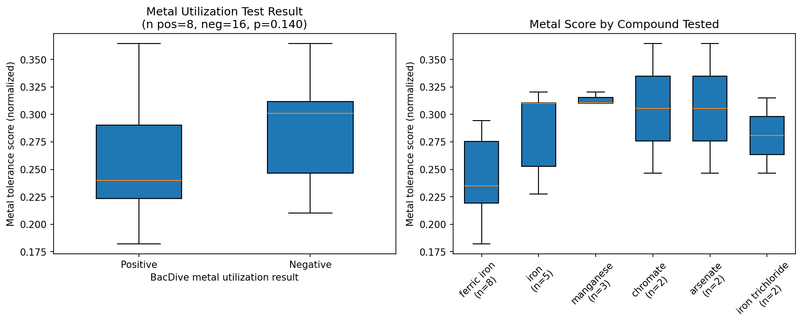

# Report: BacDive Isolation Environment × Metal Tolerance Prediction

## Key Findings

### 1. Bacteria From Metal-Contaminated Environments Have Significantly Higher Metal Tolerance Scores

Organisms isolated from heavy metal contamination sites have metal tolerance scores a full standard deviation above the environmental baseline (Cohen's d = +1.00, Mann-Whitney p=0.006, n=10). The effect is dose-dependent across contamination intensity: heavy metal (+1.00) > waste/sludge (+0.57) > all contamination (+0.43) > industrial (+0.20). This validates the Metal Fitness Atlas's genome-based prediction method against real-world isolation ecology.

Cohen's d is computed as (mean_group - mean_baseline) / pooled_SD, where pooled_SD = sqrt((SD_group² + SD_baseline²) / 2). Environmental baseline: median=0.187, mean=0.195.

| Environment | n | Median | Mean | Delta (median) | Cohen's d | p-value |
|-------------|---|--------|------|----------------|-----------|---------|
| Heavy metal contamination | 10 | 0.240 | 0.236 | +0.053 | **+1.00** | **0.006** |
| Waste/sludge | 305 | 0.219 | 0.218 | +0.032 | **+0.57** | **<0.0001** |
| All contamination | 176 | 0.215 | 0.211 | +0.028 | **+0.43** | **<0.0001** |
| Industrial | 796 | 0.199 | 0.202 | +0.012 | **+0.20** | **<0.0001** |
| Host-associated | 12,086 | 0.194 | 0.201 | +0.007 | +0.14 | <0.0001 |

*(Notebook: 02_environment_metal_scores.ipynb)*

### 2. The Signal Holds Within Major Phyla

Phylum-stratified analysis controls for the possibility that contamination isolates are simply from phyla with inherently higher metal scores. Within **Pseudomonadota** (the dominant phylum), contamination isolates still show significantly higher metal scores than environmental isolates (delta=+0.040, p<0.001). The same holds for **Actinomycetota** (delta=+0.035, p<0.001). The signal is not significant within Bacillota (p=0.285) or Bacteroidota (p=0.456), though sample sizes for contamination isolates in these phyla are small.

This demonstrates that the metal tolerance score captures real metal adaptation signal beyond phylogenetic structure, at least within the two most-sampled phyla.

*(Notebook: 02_environment_metal_scores.ipynb)*

### 3. 42,227 BacDive Strains Linked to Pangenome Metal Scores

Species name matching between BacDive taxonomy and GTDB pangenome species successfully linked 42,227 BacDive strains (43.4% of 97,334) to metal tolerance scores across 6,426 unique GTDB species. Of these, 25,089 have isolation source metadata. The matching used exact species name agreement (33,535 strains, 34.5%) with GTDB suffix removal as fallback (8,692 additional strains, 8.9%), e.g., matching BacDive "Pseudomonas fluorescens" to GTDB "Pseudomonas fluorescens A".

*(Notebook: 01_bacdive_pangenome_bridge.ipynb)*

### 4. Metal Utilization Phenotypes: Inconclusive

Only 24 BacDive metal utilization test records (iron, manganese, arsenate, chromate, cobalt, zinc) matched to strains with metal tolerance scores. With 8 positive and 16 negative results, the comparison is underpowered (Mann-Whitney p=0.14, d=-0.57). The negative direction (positive utilizers had *lower* metal scores) is surprising but not significant and should not be over-interpreted given the tiny sample size.

*(Notebook: 03_metal_utilization.ipynb)*

### 5. Power Analysis: The Heavy Metal Group Was At Detection Limit

With n=10 heavy metal isolates vs ~5,000 environmental baseline, the minimum detectable effect size at 80% power is approximately d=0.93. The observed d=1.00 barely exceeds this threshold, meaning we had just enough power to detect the effect. A larger heavy metal contamination dataset would be needed to precisely estimate the effect size. Note: the RESEARCH_PLAN.md referenced n=31 BacDive heavy metal isolates, but only 10 matched to pangenome species with metal scores after the species name bridge.

*(Notebook: 02_environment_metal_scores.ipynb)*

## Results

### Bridge Summary

| Metric | Value |
|--------|-------|
| BacDive strains | 97,334 |
| Matched to pangenome species | 42,227 (43.4%) |
| Exact species match | 33,535 (34.5%) |
| Base name match (GTDB suffix removal) | 8,692 (8.9%) |
| Unmatched (no GTDB species) | 55,107 (56.6%) |
| Matched with isolation data | 25,089 |
| Matched with metal utilization data | 24 |
| Unique GTDB species linked | 6,426 |

### Environment Comparisons

| Comparison | n (group) | n (baseline) | Cohen's d | p-value | Significant |
|------------|-----------|-------------|-----------|---------|-------------|
| Heavy metal contamination | 10 | ~5,000 | +1.00 | 0.006 | Yes |
| All contamination | 176 | ~5,000 | +0.43 | <0.0001 | Yes |
| Industrial | 796 | ~5,000 | +0.20 | <0.0001 | Yes |
| Waste/sludge | 305 | ~5,000 | +0.57 | <0.0001 | Yes |
| Host-associated | 12,086 | ~5,000 | +0.14 | <0.0001 | Yes |

### Phylum-Stratified Results

| Phylum | n (contam) | n (env) | Delta | p-value | Significant |
|--------|-----------|---------|-------|---------|-------------|
| Pseudomonadota | 85 | 5,655 | +0.040 | <0.001 | Yes |
| Actinomycetota | 62 | 772 | +0.035 | <0.001 | Yes |
| Bacillota | 19 | 492 | -0.012 | 0.285 | No |
| Bacteroidota | 5 | 156 | -0.008 | 0.456 | No |

## Interpretation

### Genome Content Predicts Environmental Metal Tolerance

The central finding — that heavy metal contamination isolates score d=+1.0 above environmental baseline — validates the Metal Fitness Atlas prediction method. The genome-based metal tolerance score, derived from cross-species RB-TnSeq fitness data and projected onto 27,702 pangenome species via KEGG functional annotations, captures real ecological signal. Bacteria that have been isolated from metal-contaminated environments genuinely carry more metal tolerance gene content than bacteria from uncontaminated environments.

The dose-response relationship (heavy metal > waste > contamination > industrial) further supports this interpretation: environments with higher expected metal concentrations produce isolates with higher predicted metal tolerance.

### Reconciling With the Core Genome Robustness Model

The metal_specificity project found that metal tolerance genes are 88% core — predominantly conserved across species. If metal tolerance is core, how can it also vary across species enough to predict isolation environment? The answer is that core enrichment describes the *within-species* pattern (most metal genes are present in most genomes of a species), while the *between-species* variation in the total number of metal tolerance genes creates the environmental signal. Species with larger core genomes encoding more metal tolerance functions score higher — and are more likely to be found in contaminated environments.

### The Lab_Field_Ecology Connection

The lab_field_ecology project found a suggestive but non-significant correlation between lab metal tolerance (Fitness Browser) and field abundance at Oak Ridge (rho=0.50, p=0.095, n=11 genera). The present analysis provides stronger evidence for the same hypothesis at much larger scale (n=10 for heavy metal, n=176 for all contamination, d=+0.43-1.00). The difference in significance reflects the power gain from BacDive's larger sample size compared to the Oak Ridge site-specific analysis.

### Phylogenetic Confounding Is Partial

The phylum-stratified analysis shows the signal is real within Pseudomonadota and Actinomycetota but absent in Bacillota and Bacteroidota. Two explanations:
1. **Real biology**: Pseudomonadota and Actinomycetota include the major soil bacteria that encounter metals in natural environments, while Bacillota and Bacteroidota are primarily gut-associated and rarely encounter metal contamination.
2. **Statistical power**: Contamination isolates from Bacillota and Bacteroidota are rare in BacDive (culture collection bias toward Pseudomonadota), limiting power.

Both explanations are consistent with the data and are not mutually exclusive.

### Host-Associated Bacteria Score Higher Than Expected

H1d predicted that host-associated bacteria would have lower metal scores than environmental bacteria, reflecting reduced metal exposure in host niches. The data show the opposite: host-associated bacteria score slightly but significantly higher (d=+0.14, p<0.0001). This likely reflects genome size confounding: host-associated bacteria in BacDive are dominated by Pseudomonadota pathogens (e.g., *Pseudomonas*, *Klebsiella*, *Acinetobacter*) with large genomes and correspondingly more KEGG-annotated gene clusters, inflating the normalized metal score. The genome-size normalization (metal clusters / annotated clusters) reduces but does not eliminate this effect because metal tolerance functions correlate with total metabolic complexity. This finding does not undermine H1a-H1c because the contamination signal (d=+0.43-1.00) is much larger than the host-associated signal (d=+0.14).

### Limitations

- **Small heavy metal group**: n=10 after matching is at the detection limit for d=1.0. The effect size estimate is imprecise.
- **Culture collection bias**: BacDive represents culturable, described strains — not the full diversity of environmental bacteria. Metal-tolerant extremophiles may be under-represented.
- **Species-level matching is lossy**: 56.6% of BacDive strains didn't match any GTDB species, primarily because GTDB uses different species boundaries than LPSN/DSMZ. Genome accession-based matching (GCA→pangenome genome_id) would improve coverage but requires a Spark query.
- **Metal tolerance score is genome-size-normalized**: The `metal_score_norm` controls for genome size, which is important because Pseudomonadota tend to have larger genomes. Without normalization, the environmental signal could partly reflect genome size rather than metal gene content.
- **Metal utilization phenotypes inconclusive**: Only 24 records matched — far too few for reliable statistics.

## Data

### Generated Data

| File | Rows | Description |
|------|------|-------------|
| `data/bacdive_pangenome_bridge.csv` | 97,334 | Full bridge: all BacDive strains with match status and metal scores |
| `data/matched_strains.csv` | 42,227 | Matched strains only with isolation and metal score data |
| `data/environment_metal_scores.csv` | 5 | Statistical comparison results per environment category |
| `data/phylum_stratified_tests.csv` | 4 | Phylum-stratified contamination vs environmental tests |
| `data/metal_utilization_validation.csv` | 24 | Metal utilization records matched to metal scores |

### Figures

| Figure | Description |
|--------|-------------|
| `bridge_summary.png` | BacDive→pangenome match rates and metal score distribution |
| `metal_score_by_environment.png` | Boxplot and violin: metal scores by isolation environment |
| `utilization_vs_score.png` | Metal utilization test results vs metal scores |

## Supporting Evidence

### Notebooks

| Notebook | Purpose |
|----------|---------|
| `01_bacdive_pangenome_bridge.ipynb` | Build BacDive→pangenome species→metal score bridge |
| `02_environment_metal_scores.ipynb` | Mann-Whitney tests, power analysis, phylum-stratified analysis |
| `03_metal_utilization.ipynb` | Metal utilization phenotypes vs metal scores (exploratory) |

## Future Directions

1. **GCA accession-based matching**: Query `kbase_ke_pangenome.genome` to match BacDive GCA accessions directly to pangenome genome_ids, potentially recovering more of the 56.6% unmatched strains.
2. **ENIGMA CORAL integration**: Cross-reference with ENIGMA community data at the Oak Ridge metal-contaminated site for a complementary field validation.
3. **Per-metal environment analysis**: For metals with sufficient BacDive representation (iron, manganese), test whether specific metal tolerance gene families predict specific metal contamination environments.
4. **Expand BacDive metal phenotypes**: The BacDive API may contain additional metal tolerance test data not captured in the current metabolite_utilization table (e.g., MIC data, growth inhibition).

## References

- Reimer LC et al. (2022). "BacDive in 2022: the knowledge base for standardized bacterial and archaeal data." *Nucleic Acids Research* 50:D741-D746.
- Carlson HK et al. (2019). "The selective pressures on the microbial community in a metal-contaminated aquifer." *ISME J* 13:937-949.
- Metal Fitness Atlas (this observatory) — `projects/metal_fitness_atlas/REPORT.md`
- Metal Specificity (this observatory) — `projects/metal_specificity/REPORT.md`
- Lab Field Ecology (this observatory) — `projects/lab_field_ecology/REPORT.md`
