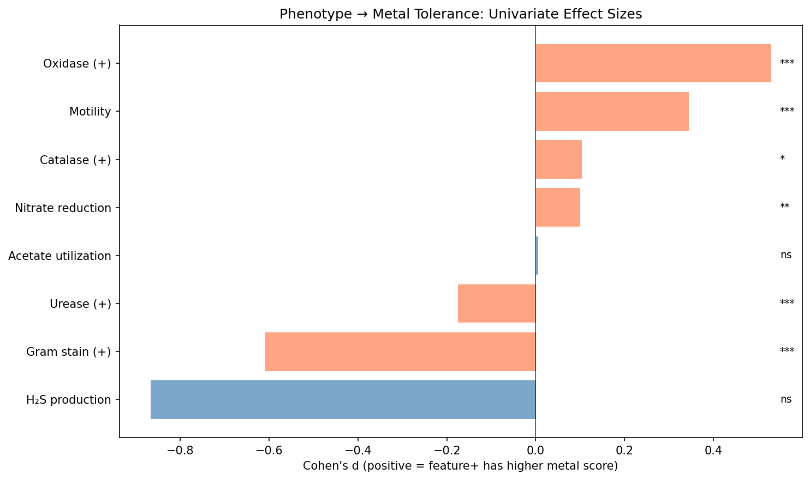
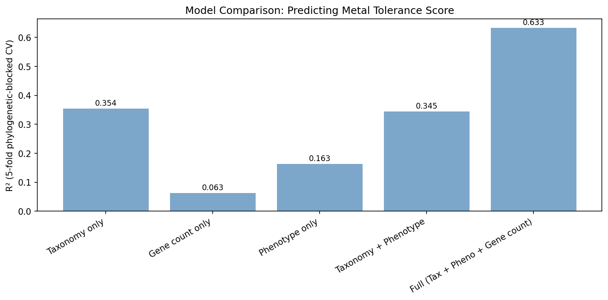
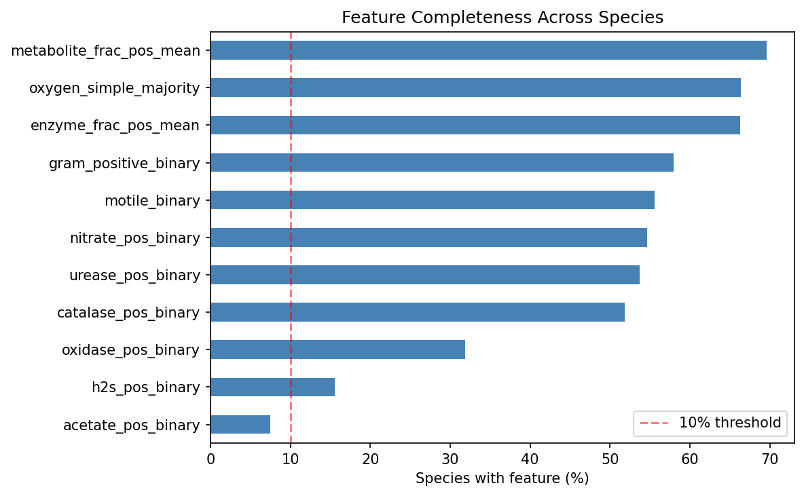
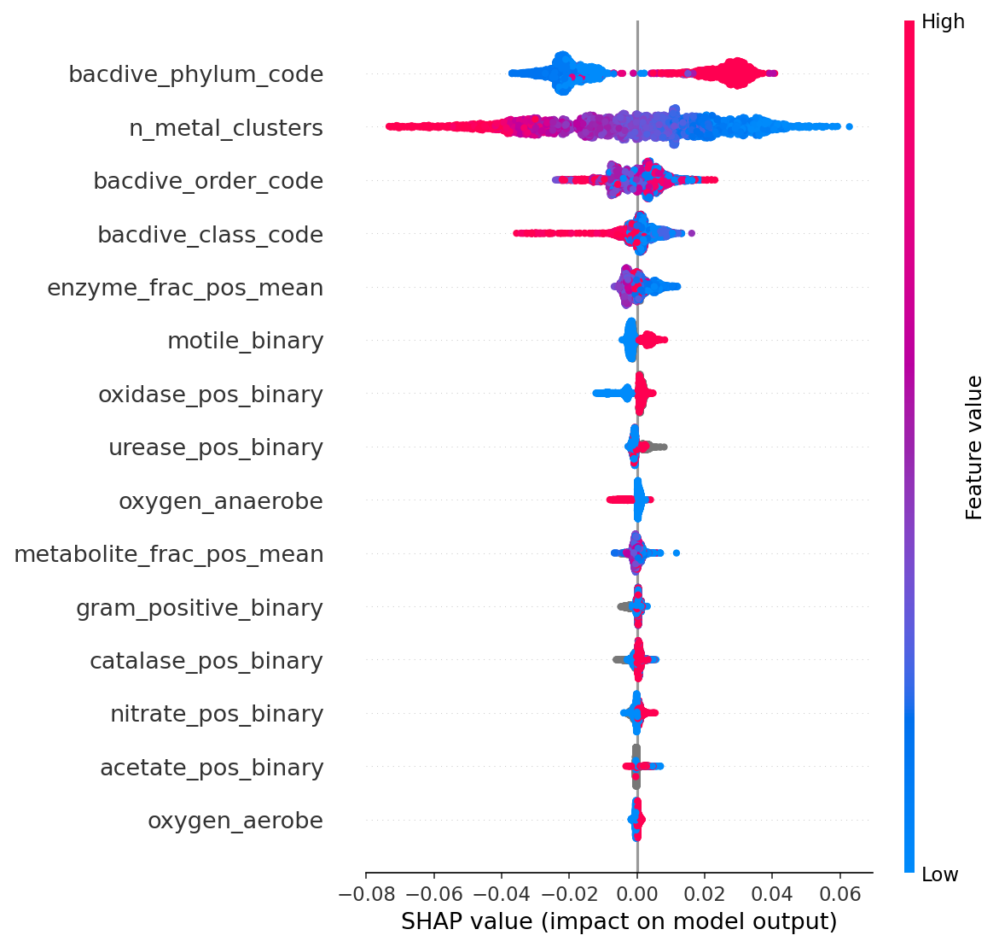
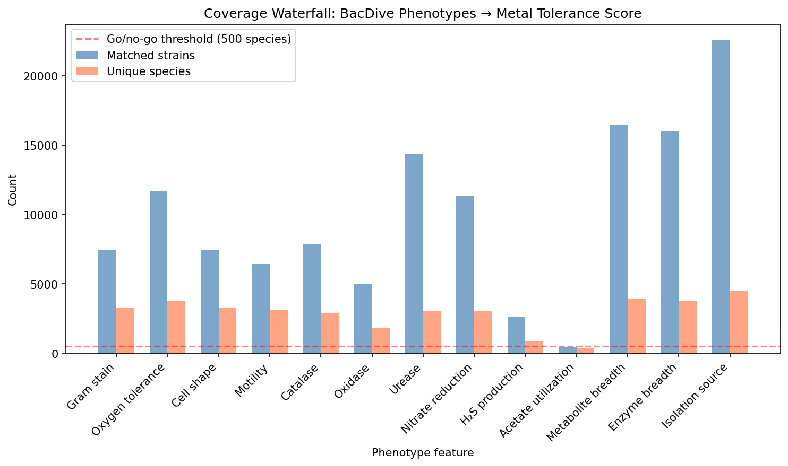
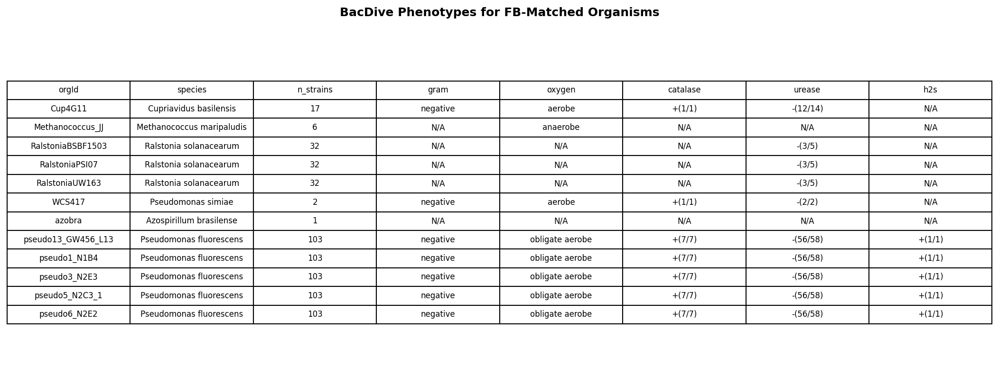

# Report: BacDive Phenotype Signatures of Metal Tolerance

## Key Findings

### 1. Gram-Negative Bacteria Have Significantly Higher Metal Tolerance Scores (d=-0.61)

Gram-negative species have higher metal tolerance scores than Gram-positive species (Cohen's d = -0.61, p < 1e-60, n = 3,272 species). This is the largest effect among all phenotype features tested. However, class-stratified analysis reveals the effect cannot be tested *within* taxonomic classes — it is almost entirely a between-lineage signal (Gram-positive Actinomycetes vs Gram-negative Proteobacteria). The association is mechanistically plausible — the Gram-negative outer membrane provides a permeability barrier restricting metal cation uptake (Biswas et al. 2021; Paulsen et al. 1997) — but statistically confounded with phylogeny.

*(Notebook: 03_univariate_associations.ipynb)*

### 2. Seven of Ten Phenotype Features Are Individually Significant After FDR Correction

Seven features pass FDR correction at q < 0.05: Gram stain (d = -0.61), oxidase (d = +0.53), motility (d = +0.35), urease (d = -0.18), enzyme breadth (rho = -0.06), nitrate reduction (d = +0.10), and catalase (d = +0.10). Three do not reach significance: H₂S production (d = -0.87, q = 0.073 — but this effect size estimate is unreliable with only 8 negative controls and likely inflated by small-sample bias), metabolite breadth (rho = -0.01, ns), and acetate utilization (d = 0.005, ns).

*(Notebook: 03_univariate_associations.ipynb)*

### 3. Phenotype Features Add Nothing Beyond Taxonomy (Delta R² = -0.009)

The central finding: taxonomy alone (phylum/class/order) explains 35.4% of metal tolerance variance, and phenotype features alone explain 16.3%, but combining taxonomy + phenotype yields R² = 34.5% — slightly *worse* than taxonomy alone. The phenotype signal is entirely captured by phylogenetic structure. Adding the number of metal resistance gene clusters (`n_metal_clusters`) boosts the full model to R² = 0.63, demonstrating that genome-encoded metal resistance repertoire is the true predictor.

*(Notebook: 04_multivariate_model.ipynb)*

### 4. Urease-Positive Organisms Have *Lower* Metal Tolerance (H1e Reversed)

Urease-positive species have significantly lower metal tolerance scores (d = -0.18, p < 1e-5), opposite to the prediction that urease positivity (requiring nickel import machinery) would confer nickel tolerance. Class-stratified analysis reveals this is driven by Actinomycetes (d = -0.59, p < 1e-16), where urease-positive species form a distinct low-metal-score subgroup. Within Gammaproteobacteria (d = +0.08, ns) and Bacilli (d = +0.06, ns), the effect disappears — further evidence of phylogenetic confounding.

*(Notebook: 03_univariate_associations.ipynb)*

### 5. Anaerobe vs Aerobe Difference Is Negligible (H1b Not Supported)

Despite 3,751 species with oxygen tolerance data, the anaerobe-aerobe difference in metal tolerance is negligible (d = -0.016, p = 0.55). Facultative anaerobes have the highest mean score (0.221) versus aerobes (0.216) and anaerobes (0.215). The Kruskal-Wallis test across all three groups is marginally significant (H = 8.53, p = 0.014), but the effect is biologically trivial.

*(Notebook: 03_univariate_associations.ipynb)*

### 6. SHAP Analysis Confirms Taxonomy and Gene Count Dominate

SHAP feature importance from the full XGBoost model shows that taxonomic class/order codes and `n_metal_clusters` are the top predictors. Phenotype features contribute minimally to individual predictions once taxonomy is included. This confirms that classical microbiology phenotypes are phylogenetic proxies, not independent predictors of metal tolerance.

*(Notebook: 04_multivariate_model.ipynb)*

## Results

### Scale of the Analysis

| Metric | Value |
|--------|-------|
| BacDive strains in bridge | 97,334 |
| Matched to pangenome + metal score | 37,368 (38.4%) |
| Unique GTDB species | 5,647 |
| Species with ≥5 phenotype features | 3,994 |
| Phenotype features tested | 10 (8 binary, 2 continuous) |
| Significant after FDR | 7 / 10 |
| Taxonomic classes with ≥50 species | 9 |

### Coverage Waterfall

| Feature | BacDive Strains | Matched Strains | Species with Metal Score |
|---------|----------------|----------------|------------------------|
| Isolation source | 43,378 | 22,581 | 4,531 |
| Metabolite breadth | 29,784 | 16,454 | 3,930 |
| Enzyme breadth | 28,836 | 16,005 | 3,746 |
| Oxygen tolerance | 23,252 | 11,708 | 3,751 |
| Gram stain | 15,194 | 7,411 | 3,272 |
| Motility | 13,759 | 6,474 | 3,138 |
| Nitrate reduction | 20,726 | 11,357 | 3,088 |
| Urease | 24,438 | 14,343 | 3,035 |
| Catalase | 15,295 | 7,876 | 2,930 |
| Oxidase | 7,813 | 5,014 | 1,799 |
| H₂S production | 5,254 | 2,611 | 880 |
| Acetate utilization | 1,980 | 475 | 422 |

### Univariate Association Results

| Feature | Hypothesis | Effect | n | p-value | FDR q | Sig |
|---------|-----------|--------|---|---------|-------|-----|
| Gram stain (+) | H1a | d = -0.610 | 3,272 | 4.0e-61 | 4.0e-60 | Yes |
| Oxidase (+) | — | d = +0.530 | 1,799 | 2.7e-25 | 1.3e-24 | Yes |
| Motility | — | d = +0.345 | 3,138 | 2.2e-23 | 7.2e-23 | Yes |
| Urease (+) | H1e | d = -0.175 | 3,035 | 3.7e-06 | 9.1e-06 | Yes |
| Enzyme breadth | — | rho = -0.058 | 3,746 | 4.1e-04 | 8.2e-04 | Yes |
| Nitrate reduction | — | d = +0.100 | 3,088 | 4.4e-03 | 7.4e-03 | Yes |
| Catalase (+) | H1d | d = +0.104 | 2,930 | 2.8e-02 | 4.1e-02 | Yes |
| H₂S production | H1f | d = -0.867 | 880 | 5.8e-02 | 7.3e-02 | No |
| Metabolite breadth | H1c | rho = -0.013 | 3,930 | 4.2e-01 | 4.7e-01 | No |
| Acetate utilization | — | d = +0.005 | 422 | 7.9e-01 | 7.9e-01 | No |

### Model Comparison (5-Fold Phylogenetic-Blocked CV)

| Model | R² | RMSE | n | Features |
|-------|-----|------|---|----------|
| Gene count only | 0.063 | 0.045 | 3,994 | 1 |
| Phenotype only | 0.163 | 0.043 | 3,994 | 13 |
| Taxonomy only | 0.354 | 0.038 | 3,994 | 3 |
| Taxonomy + Phenotype | 0.345 | 0.038 | 3,994 | 16 |
| **Full (all combined)** | **0.633** | **0.028** | **3,994** | **17** |

### Hypothesis Outcomes

| Hypothesis | Prediction | Result |
|-----------|-----------|--------|
| **H1a** (Gram-neg → metal tolerant) | Gram-neg higher metal scores | **Supported univariately** (d = -0.61) but phylogenetically confounded |
| **H1b** (Anaerobe → redox metals) | Anaerobes tolerate redox metals better | **Not supported** (d = -0.02, ns) |
| **H1c** (Metabolite breadth → tolerance) | Broader metabolism → higher scores | **Not supported** (rho = -0.01, ns) |
| **H1d** (Catalase → redox metals) | Catalase+ tolerate Cu, Cr, Fe | **Marginally supported** (d = +0.10, q = 0.04) |
| **H1e** (Urease → Ni tolerance) | Urease+ handle nickel better | **Reversed** (d = -0.18); driven by Actinomycetes |
| **H1f** (H₂S → chalcophilic metals) | H₂S producers tolerate Zn, Cu, Cd | **Unreliable** (d = -0.87 but only 8 negatives — effect size likely inflated by small-sample bias) |

### Direct FB-BacDive Validation (n = 12)

Twelve Fitness Browser organisms match BacDive by taxonomy ID (6 unique species: *Cupriavidus basilensis*, *Methanococcus maripaludis*, *Ralstonia solanacearum*, *Pseudomonas simiae*, *Azospirillum brasilense*, *Pseudomonas fluorescens*). All Gram-typed organisms are Gram-negative, precluding within-set testing of H1a. All urease-typed organisms are urease-negative yet are routinely tested against nickel, consistent with the pangenome-scale finding that urease status does not predict metal tolerance. The single anaerobe (*Methanococcus*) has only 1 metal tested versus 4–5 for aerobes, but n = 1 is not interpretable.

*(Notebook: 05_fb_bacdive_case_studies.ipynb)*

## Interpretation

### The Phylogenetic Confounding Wall

The central result is a cautionary tale for phenotype-based prediction in microbial ecology: **classical microbiology phenotypes (Gram stain, oxygen tolerance, enzyme activities) capture real biological differences in metal tolerance, but these differences are entirely explained by phylogenetic structure**. Adding phenotype features to a taxonomy-based model actually decreases predictive power slightly (delta R² = -0.009), indicating that phenotypes are noisier proxies for taxonomy, not independent predictors.

This is consistent with Goberna & Verdú (2016), who showed through meta-analysis that bacterial trait-environment associations routinely reflect shared ancestry rather than direct ecological adaptation. Van Assche & Álvarez (2017) found phylogenetic signal values up to λ = 0.98 for chemical sensitivity traits in *Acinetobacter*, directly analogous to our findings.

### Why Phenotypes Fail as Metal Tolerance Predictors

1. **Gram stain is taxonomy, not a trait**: The Gram-negative advantage in metal tolerance is real (outer membrane barrier; Paulsen et al. 1997) but indistinguishable from "being a Proteobacterium" in a predictive model. There are no Gram-positive Proteobacteria and no Gram-negative Actinomycetes in our data.

2. **Urease reversal reflects lineage composition**: The surprising urease-negative → higher metal tolerance finding is entirely driven by Actinomycetes, where urease-positive species are a phylogenetically distinct subgroup with low metal scores. Within other classes, the urease effect is zero.

3. **Catalase exhibits Simpson's paradox**: The overall catalase effect is d = +0.10 (catalase-positive species have slightly higher metal scores), marginally supporting H1d. But class-stratified analysis reveals the *opposite* within every major class: catalase-negative species score higher within Actinomycetes (d = -0.62, p < 1e-5), Gammaproteobacteria (d = -0.49, p = 0.004), and Betaproteobacteria (d = -0.51, p = 0.006). The overall positive effect is an artifact of between-class composition — catalase-positive classes (Proteobacteria) happen to have higher metal scores than catalase-negative classes. This is the same Simpson's paradox pattern as urease, reinforcing the phylogenetic confounding narrative.

4. **Metabolic breadth is not a metal tolerance proxy**: The hypothesis that metabolically versatile organisms harbor more resistance genes (Martin-Moldes et al. 2015) was not supported. Metabolite utilization breadth shows no correlation with metal score (rho = -0.01), likely because metabolic versatility operates in different genomic neighborhoods than metal resistance.

### What Does Predict Metal Tolerance

The genome's metal resistance gene content (`n_metal_clusters` from the Metal Fitness Atlas) explains more variance than all phenotype features combined, and substantially more than taxonomy alone. The full model (taxonomy + phenotype + gene count) achieves R² = 0.63, with gene count contributing the lion's share of the improvement over taxonomy (delta R² = +0.28 over taxonomy alone). This aligns with Schwan et al. (2023), who found strong genotype-phenotype concordance for metal resistance gene presence in *Salmonella* and *E. coli*.

### The Urease-Nickel Paradox

Urease-positive bacteria require nickel import and handling machinery (Maier & Benoit 2019), so they should tolerate nickel — yet they show *lower* overall metal tolerance. This is not a true paradox: urease positivity correlates with Actinomycetes and other lineages that have fewer metal resistance genes overall. The nickel-handling machinery associated with urease is narrowly specific to nickel and does not confer general metal tolerance. Furthermore, the tight coupling between urease activity and nickel efflux (Stähler et al. 2006) means that nickel homeostasis in urease producers is a balancing act, not a broad tolerance mechanism.

### Novel Contribution

1. **First large-scale test of BacDive phenotypes as metal tolerance predictors** — 5,647 species, 10 phenotype features, cross-referenced against genome-based metal tolerance scores from the Metal Fitness Atlas.
2. **Definitive demonstration of phylogenetic confounding** — phenotype features capture real signal (R² = 0.16) but add nothing beyond what taxonomy already provides (delta R² = -0.009).
3. **Urease reversal** — urease-positive bacteria have *lower* metal tolerance, driven by lineage composition, not nickel biology.
4. **Gene count as the true predictor** — the number of metal resistance gene clusters outperforms all phenotype features combined.

### Limitations

- **Metal Fitness Atlas scores are genome-based predictions**, not direct metal tolerance measurements. Circular reasoning is mitigated by controlling for `n_metal_clusters` in partial correlations, but the phenotype-score associations are ultimately phenotype-to-genome correlations, not phenotype-to-phenotype.
- **BacDive species name matching achieves only 38.4%** (5,647/27,702 GTDB species). GCA accession matching could recover additional links but was not implemented.
- **12-organism direct validation is underpowered** — all Gram-typed organisms are Gram-negative, preventing within-set testing of the strongest association.
- **BacDive testing bias**: well-studied organisms (Pseudomonas, E. coli) have many phenotype tests; poorly-studied species have sparse data.
- **H₂S production is underpowered**: only 8 H₂S-negative species in the matched set, making the large effect size (d = -0.87) unreliable.

## Data

### Sources

| Collection | Tables Used | Purpose |
|------------|-------------|---------|
| `kescience_bacdive` | `strain`, `physiology`, `metabolite_utilization`, `enzyme`, `isolation`, `taxonomy`, `sequence_info` | Phenotype features for 97K strains |
| `kbase_ke_pangenome` | (via Metal Fitness Atlas scores) | Metal tolerance genome-based predictions for 27,702 species |
| `kescience_fitnessbrowser` | (via organism mapping + metal experiments) | 12 direct FB-BacDive organism matches, metal experiment metadata |

### Generated Data

| File | Rows | Description |
|------|------|-------------|
| `data/bacdive_pangenome_bridge.csv` | 97,334 | Full BacDive-to-pangenome bridge (all strains, matched or not) |
| `data/matched_strains.csv` | 37,368 | Matched BacDive strains with GTDB species and metal scores |
| `data/coverage_waterfall.csv` | 13 | Per-feature coverage: strains → matched → species |
| `data/species_phenotype_matrix.csv` | 5,647 | Species-level phenotype feature matrix (37 columns) |
| `data/univariate_results.csv` | 10 | FDR-corrected univariate association results |
| `data/stratified_results.csv` | 17 | Class-stratified binary feature tests |
| `data/model_comparison.csv` | 5 | Cross-validated R² for 5 model configurations |
| `data/fb_bacdive_combined.csv` | 12 | Combined phenotype + metal data for 12 FB organisms |

## Supporting Evidence

### Notebooks

| Notebook | Purpose |
|----------|---------|
| `01_bacdive_pangenome_bridge.ipynb` | Bridge BacDive strains to pangenome species; coverage waterfall and go/no-go gate |
| `02_phenotype_feature_engineering.ipynb` | Build species-level phenotype feature matrix from strain-level BacDive data |
| `03_univariate_associations.ipynb` | Test each phenotype feature against metal tolerance; FDR correction, class stratification |
| `04_multivariate_model.ipynb` | XGBoost prediction with phylogenetic-blocked CV; SHAP importance; 5-model comparison |
| `05_fb_bacdive_case_studies.ipynb` | Descriptive case studies for 12 FB organisms matching BacDive |

### Figures

| Figure | Description |
|--------|-------------|
| `coverage_waterfall.png` | Strain → matched → species coverage per phenotype feature |
| `feature_completeness.png` | Percentage of species with each feature |
| `univariate_effect_sizes.png` | Forest plot of Cohen's d for binary phenotype features |
| `model_comparison.png` | R² bar chart for 5 model configurations |
| `shap_summary.png` | SHAP feature importance from full XGBoost model |
| `fb_bacdive_phenotype_table.png` | BacDive phenotypes for 12 FB-matched organisms |

## Future Directions

1. **Per-metal phenotype analysis**: Test whether specific phenotypes predict tolerance to specific metals (e.g., catalase → copper, urease → nickel) rather than composite metal scores. This would require per-metal scores for the 27K species.
2. **GCA accession matching**: The current bridge uses species name matching (38.4%). Adding GCA accession matching could recover 10–30% more species.
3. **Phylogenetic comparative methods**: Use PGLS or phylogenetic PCA to formally remove phylogenetic signal before testing phenotype-metal associations.
4. **BacDive AI-predicted phenotypes**: The current analysis uses only measured values. Including BacDive's ML-predicted Gram stain, motility, and oxygen tolerance could increase coverage substantially while introducing model-dependent bias.
5. **Experimental validation**: The H₂S → chalcophilic metal hypothesis (d = -0.87, underpowered) could be tested experimentally with sulfate-reducing bacteria and zinc/copper challenge.

## Suggested Experiments

Testing whether urease+ organisms are specifically nickel-tolerant (rather than generally metal-tolerant) requires per-metal fitness profiling of urease+ vs urease- bacteria from the same taxonomic class, ideally Gammaproteobacteria (where the pangenome-scale urease effect is near zero). RB-TnSeq with matched urease+/- strains under nickel vs other metals would directly test whether urease enables nickel-specific tolerance.

## References

- Arkin AP et al. (2018). "KBase: The United States Department of Energy Systems Biology Knowledgebase." *Nat Biotechnol* 36:566-569. PMID: 29979655
- Biswas R et al. (2021). "Overview on the role of heavy metals tolerance on developing antibiotic resistance in both Gram-negative and Gram-positive bacteria." *Arch Microbiol* 203:2275. DOI: 10.1007/s00203-021-02275-w
- Goberna M, Verdú M (2016). "Predicting microbial traits with phylogenies." *ISME J* 10:959-967. DOI: 10.1038/ismej.2015.171
- Koblitz J et al. (2025). "Predicting bacterial phenotypic traits through improved machine learning using high-quality, curated datasets." *Commun Biol*. DOI: 10.1038/s42003-025-08313-3
- Maier RJ, Benoit SL (2019). "Role of Nickel in Microbial Pathogenesis." *Inorganics* 7:80. DOI: 10.3390/inorganics7070080
- Martin-Moldes Z et al. (2015). "Whole-genome analysis of Azoarcus sp. strain CIB provides genetic insights to its different lifestyles." *Syst Appl Microbiol* 38:462-471.
- Oleńska E et al. (2025). "Molecular mechanisms of bacterial survival strategies under heavy metal stress." *Int J Mol Sci* 26:5716. DOI: 10.3390/ijms26125716
- Paulsen IT et al. (1997). "The SMR family: a novel family of multidrug efflux proteins." *FEMS Microbiol Lett* 156:1-8.
- Price MN et al. (2018). "Mutant phenotypes for thousands of bacterial genes of unknown function." *Nature* 557:503-509. PMID: 29769716
- Reimer LC et al. (2022). "BacDive in 2022: the knowledge base for standardized bacterial and archaeal data." *Nucleic Acids Res* 50:D741-D746.
- Schwan CL et al. (2023). "Genotypic and phenotypic characterization of antimicrobial resistance and metal tolerance in Salmonella and E. coli." *J Food Prot* 86:100113. PMID: 37290750
- Stähler FN et al. (2006). "The CznABC metal efflux pump is required for cadmium, zinc, and nickel resistance, urease modulation, and gastric colonization." *Infect Immun* 74:3845-3852.
- Van Assche A, Álvarez-Pérez S (2017). "Phylogenetic signal in carbon source assimilation profiles and tolerance to chemical agents." *Appl Microbiol Biotechnol* 101:3049-3061. DOI: 10.1007/s00253-016-7866-0
