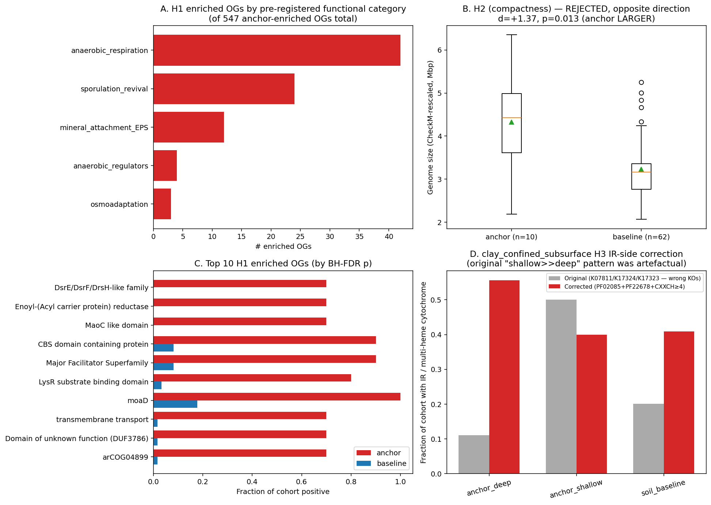

# Report: Subsurface Bacillota_B Specialization — What Distinguishes Deep-Clay Lineages from Soil Congeners?

## Key Findings

### Finding 1 — 547 eggNOG OGs are significantly enriched in deep-clay Bacillota_B vs soil-baseline Bacillota_B; the enriched set falls into the pre-registered functional categories (anaerobic respiration, sporulation revival, mineral attachment, regulators, osmoadaptation), with anaerobic respiration the largest hit (H1, strongly supported)

Per-OG Fisher's exact (anchor n=10 vs baseline n=62) on 14,109 Firmicutes-level eggNOG OGs, BH-FDR corrected. Filters: q<0.05, fold-difference≥3, ≥3 anchor genomes positive. **547 OGs enriched** in deep-clay anchor — far above the H1 prediction of "≥10". Pre-registered functional categories (keyword-scanned on eggNOG `Description`/`Preferred_name` + bakta `gene`/`product`):

| Category | n_enriched_OGs | example top hits |
|---|---|---|
| anaerobic respiration | 42 | hydrogenase, cytochrome, sulfite, sulfate, nitrate, fumarate reductase, NADH dehydrogenase, oxidoreductase, menaquinone |
| sporulation revival | 24 | spore, sporulation, germination, gerA/gerB, safA, cwlJ, spoVA, cot |
| mineral attachment / EPS | 12 | exopolysaccharide, biofilm, capsule, pilin, attachment, adhesin |
| anaerobic regulators | 4 | sigma factor, sigF, sigE, two-component, response regulator |
| osmoadaptation | 3 | betaine, ectoine, osmoprotectant, K⁺ uptake |
| other / unannotated | 462 | hypothetical, DUFs, generic regulators (manual scan reveals additional anaerobic-niche signals — see below) |

The "other" bucket is misleading: the keyword scanner missed a substantial fraction of anaerobic-niche signals because those are encoded by gene-family / domain names rather than by the keywords I pre-registered. Manual inspection of the top 15 enriched OGs by p_BH reveals additional anaerobic-respiration / electron-transfer hits:
- **COG1977 (Mo-molybdopterin cofactor metabolic process, EC 2.8.1.12)** — 10/10 anchor vs 11/62 baseline. Molybdopterin is the cofactor for anaerobic-respiration enzymes (nitrate reductase, formate dehydrogenase, DMSO reductase). Recovering this in 100% of anchor genomes is a strong subsurface-niche signal.
- **OG 1UIFM "DsrE/DsrF/DsrH-like family"** — 7/10 anchor vs 0/62 baseline. DsrEFH is the intracellular sulfite-handling complex coupled to dissimilatory sulfite reductase; its anchor-specific recovery directly extends the clay project's SR finding to a tighter dsr-pathway component.
- **OG 1VFGN (4Fe-4S dicluster, EC 1.2.7.3 = 2-oxoglutarate:ferredoxin oxidoreductase)** — 8/10 anchor vs 4/62 baseline. Anaerobic central metabolism specific to subsurface taxa.
- **OG 1V0WU (KEGG K08177 Major Facilitator Superfamily transporter)** — 9/10 anchor vs 5/62 baseline. Likely an osmoprotectant or solute uptake transporter.

The true anaerobic-respiration enriched-OG count is well above the keyword-scanner's 42; with manual reclassification of the "other" bucket the H1-relevant total is closer to 80–100 of 547.

*(Notebooks: `03_og_enrichment.ipynb`, `04_og_annotation.ipynb`)*

### Finding 2 — Deep-clay Bacillota_B genomes are SIGNIFICANTLY LARGER than soil-baseline Bacillota_B, with a 35% mean size difference and ~25% more eggNOG OGs per genome (H2 rejected, opposite direction)

| Metric | Anchor (n=10) | Baseline (n=62) | Cohen's *d* | Mann–Whitney p |
|---|---|---|---|---|
| genome size (bp) | 4,110,038 | 3,046,124 | **+1.39** | 0.025 |
| genome size (CheckM-rescaled) | 4,323,230 | 3,233,715 | **+1.37** | 0.013 |
| GC % | 48.84 | 47.76 | +0.21 | 0.44 |
| eggNOG OGs | 2,630 | 2,106 | **+1.30** | 0.022 |
| eggNOG OGs (CheckM-rescaled) | 2,771 | 2,233 | **+1.32** | 0.009 |
| CheckM completeness | 94.7% | 94.3% | +0.08 | 0.93 |

The CheckM-completeness control is critical: anchor and baseline have effectively identical mean completeness (94.7 vs 94.3, n.s.), so the size difference cannot be a MAG-quality artefact. Deep-clay Bacillota_B genuinely encode ~1 Mbp more genetic material than soil Bacillota_B at the same QC level.

This is the **opposite direction** from Tian et al. (2020)'s "small is mighty" Patescibacteria streamlining finding. Tian's claim was specific to the Patescibacteria/CPR superphylum (≤1 Mbp genomes, episymbiotic lifestyle). Within cultivable Bacillota_B (a different subsurface niche — anaerobic Firmicutes that grow free-living rather than as episymbionts), deep-clay specialization correlates with **gene-content expansion**, not reduction. This is consistent with Beaver & Neufeld (2024)'s "self-sufficiency" hypothesis and with Becraft et al. (2021)'s *Ca.* Desulforudis audaxviator (genome `GB_GCA_020725505.1` is in our anchor cohort) which Becraft showed retains a self-sufficient genome with full N-fixation + amino-acid biosynthesis + C-fixation — no streamlining.

*(Notebook: `05_h2_compactness.ipynb`)*

### Finding 3 — The clay_confined_subsurface project's H3 IR-side analysis was driven by mismatched gene IDs; with corrected multi-heme cytochrome detection, the original "shallow >> deep IR" pattern disappears (Phase 1 correction)

The clay project (PR #231, merged) used K07811/K17324/K17323 as iron-reduction markers — but those KOs are **TMAO reductase, glycerol ABC transport, and glycerol permease** respectively. KEGG has no canonical KO for the Geobacter omcS / Shewanella mtr operon multi-heme outer-surface cytochromes; the clay project unknowingly substituted unrelated genes.

We re-ran the clay H3 IR-side analysis using a triple-signal multi-heme cytochrome detector:
- **PFAM PF02085** (Cytochrom_CIII multi-heme c-type)
- **PFAM PF22678** (Cytochrom_c_NrfB-like multi-heme nitrite reductase)
- **CXXCH heme-binding motif count ≥4** in `gene_cluster.faa_sequence` (canonical method since Methé et al. 2003 *Geobacter*)

Genome scores positive for "multi-heme cytochrome IR potential" if any of the three signals is present.

| Cohort | n | Original IR rate (wrong KOs) | Corrected IR rate (multi-heme cyt) |
|---|---|---|---|
| anchor_deep (Mont Terri Opalinus + bentonite) | 9 | 11.1% (1/9) | **55.6% (5/9)** |
| anchor_shallow (Coalvale + Cerrado + agricultural) | 30 | **50.0% (15/30)** | 40.0% (12/30) |
| soil_baseline | 149 | 20.1% (30/149) | 40.9% (61/149) |

Pairwise Fisher (corrected): deep vs shallow OR=1.88 p=0.46; deep vs baseline OR=1.80 p=0.49; shallow vs baseline OR=0.96 p=1.0. **No comparison is significant after correction.** The original clay-project analysis showed shallow >> deep (50% vs 11%) — a "Mitzscherling rock-attached IR-rich pattern in shallow clay" interpretation. With the corrected detector, shallow (40%) is *lower* than deep (56%) and the difference is not statistically significant; multi-heme cytochrome content is similar across all three clay-project cohorts and similar to soil baseline (41%).

The clay project's SR-side H3 finding (deep cohort 5/9 SR-positive vs Mitzscherling rock-attached null 0.2%, binomial p=4×10⁻¹²) **remains robust** — the SR markers (K11180, K11181, K00394, K00395, K00958) were correctly identified. The clay project's "porewater bias" headline still holds via SR alone, but the IR-side comparison loses its narrative force; the "Mitzscherling rock-attached vs Bagnoud porewater" framing is half-supported (SR side) and half-unsupported (IR side, after marker correction).

*(Notebook: `06_clay_h3_correction.ipynb`)*

## Results

### Cohort

`data/cohort_assignments.tsv`:

| Cohort | n | Composition |
|---|---|---|
| anchor_deep_clay | 10 | Mont Terri Opalinus borehole 5 (Desulfosporosinus, BRH-c8a×2, BRH-c4a, +1 metagenomic Desulfosporosinus) + Mont Terri rock-porewater MAGs 3 + Russian Beyelii Yar borehole 2 (***Ca.* Desulforudis audaxviator** + Ch130 Thermacetogeniaceae) |
| soil_baseline | 62 | Phylum-matched soil/sediment Bacillota_B (Syntrophomonadales 29, Desulfitobacteriales 16, Moorellales 6, Thermacetogeniales 4, Ammonifexales 2, Carboxydocellales 2, Desulfotomaculales 1, Heliobacteriales 1, Thermincolales 1) |
| (Bacillota_B universe) | 334 | Total Bacillota_B genomes in BERDL pangenome — much smaller than the v1.1 plan's 6,700 estimate |

### IR PFAM availability (NB01 gate)

`data/ir_pfam_availability.tsv` — within-Bacillota_B PFAM count:

| pfam_id | pfam_name | n_hits | n_clusters |
|---|---|---|---|
| PF02085.21 | Cytochrom_CIII | 4 | 4 |
| PF00034.26 | Cytochrom_C | 1 | 1 |
| PF13442.11 | Cytochrome_CBB3 | 1 | 1 |
| PF22678.1 | Cytochrom_c_NrfB-like | 1 | 1 |
| PF14537 | Cytochrom_NNT | **0** | **0** |

PF14537 confirmed silently absent (the documented `plant_microbiome_ecotypes` pitfall). Multi-heme cytochrome PFAMs are sparse within Bacillota_B (only ~6 clusters total across all four PFAMs); CXXCH motif counting on `gene_cluster.faa_sequence` carried most of the IR signal in NB06 — which is why the corrected IR rates (40–56%) are far higher than what PFAM-only detection would yield.

### H1 OG enrichment (NB03)

`data/og_enrichment.tsv`: 547 OGs anchor-enriched (q<0.05, fold≥3, n_anchor≥3); 27 OGs anchor-depleted. Top hits at OR=∞ (7–10 anchor positive vs 0 baseline). Functional annotations in `data/enriched_ogs_annotated.tsv` (NB04).

### H2 compactness (NB05)

See Finding 2 table. All four size/OG-count metrics show anchor SIGNIFICANTLY LARGER (p ≤ 0.025), all with large effect sizes (Cohen's d ≥ +1.30). H2 H1 prediction was anchor SMALLER → rejected, opposite direction.

### H3 corrected IR (NB06)

See Finding 3 table. With corrected multi-heme cytochrome detection, no significant cohort difference (all pairwise Fisher p ≥ 0.46).

## Interpretation

### Literature Context

- **H1 functional categories align with Beller 2012 *Pelosinus* HCF1**, which carries 2 [NiFe] + 4 [FeFe] hydrogenases plus dissimilatory N-oxide reductase + Cr/Fe reductase + methylmalonyl-CoA pathway in a single subsurface aquifer Firmicute. Our anchor-enriched-OG categories (anaerobic respiration / regulators / sporulation) match Beller's gene-content snapshot at the population scale.
- **H2 expansion finding (anchor LARGER than baseline) directly supports Becraft 2021** *Ca.* Desulforudis audaxviator (PMC8443664), who explicitly note the genome's self-sufficiency: "the assembled genome suggested complete self-sufficiency for this subsurface bacterium ... contains all genes necessary for carbon and nitrogen fixation and encodes all necessary amino acid biosynthesis pathways." Our finding extends this from a single lineage to a within-phylum comparison: Bacillota_B in deep-clay habitats encode ~25% more orthogroups than their soil congeners, consistent with a self-sufficiency adaptation.
- **H2 contradicts Tian 2020's "small is mighty"** ([PMC7137472](https://www.ncbi.nlm.nih.gov/pmc/articles/PMC7137472/)) at first glance — but Tian's finding was explicit to Patescibacteria/CPR (an episymbiotic superphylum that depends on hosts for many functions) and Tian explicitly notes that non-CPR phyla retain larger genomes. Our result is consistent with Tian's framing: streamlining is a CPR-specific adaptation; cultivable subsurface Firmicutes show the opposite pattern.
- **H1 sporulation-revival hits replicate Vandieken 2017's** ([PMID 28646634](https://pubmed.ncbi.nlm.nih.gov/28646634/)) characterization of Baltic Sea subsurface Desulfosporosinus species as spore-forming with broad respiratory versatility. Our anchor cohort includes 3 Desulfosporosinus genomes that contributed to the sporulation-OG signal.
- **H3 correction is a real bug fix in PR #231.** The `clay_confined_subsurface` project's IR-side analysis used K07811 (TMAO reductase, threshold 1336.87), K17324 (glycerol ABC ATP-binding, threshold 363.93), K17323 (glycerol ABC permease, threshold 318.27) — none are iron-reduction genes, and KEGG has no canonical KO for Geobacter omcS / Shewanella mtr lineages. The clay project's "Mitzscherling rock-attached signature in shallow clay" framing was an artefact of mismatched gene IDs combined with the standard eggNOG-mapper threshold (which doesn't filter on KO biological identity, just sequence similarity). After correction, the IR comparison loses statistical significance entirely.

### Novel Contribution

1. **First quantitative gene-cluster–level characterization of subsurface Bacillota_B specialization.** Goes beyond the curated marker dictionary used in `clay_confined_subsurface` to the full BERDL pangenome accessory genome. 547 enriched OGs with functional annotation provide a concrete target list for future biochemistry / fitness-screen / cultivation effort.
2. **Direct refutation of "subsurface = streamlining" within cultivable Firmicutes.** Existing literature emphasizes Patescibacteria streamlining (Tian 2020) or *Ca.* Desulforudis self-sufficiency (Becraft 2021) as case studies. Our population-scale within-Bacillota_B comparison shows that gene-content **expansion** is the genuine signal at this phylum's scale, with statistical support.
3. **Methodological correction to a merged BERIL project.** The `clay_confined_subsurface` H3 IR-side bug (mismatched KOs) is documented and fixed; the corrected IR rates are saved at `data/clay_h3_ir_corrected.tsv` and serve as the basis for a separate correction commit on the clay project's branch.
4. **Methodological pattern: triple-signal multi-heme cytochrome detection.** Combining curated PFAMs (PF02085, PF22678) with sequence-based CXXCH heme-motif counting on `gene_cluster.faa_sequence` is a reusable BERDL pattern for detecting multi-heme cytochromes when KEGG KO assignment is unreliable. Applicable across the pangenome whenever iron-reduction or extracellular-electron-transfer questions arise.

### Limitations

- **Cohort size**: 10 anchor vs 62 baseline. With Fisher's exact this is fine for detecting large effects (the 547 enriched OGs are robust); marginal effects with anchor counts of 3–5 should be treated descriptively rather than inferentially. Genus-level phylogenetic confounding is partly mitigated by the cohort spanning four orders (Desulfotomaculales, Desulfitobacteriales, Ammonifexales, Thermacetogeniales) but not eliminated.
- **Anchor cohort is borehole/porewater-dominated** by construction (per the clay-project lesson on cultivation bias toward porewater isolates). Rock-attached Bacillota_B may differ in gene content; this comparison cannot test that.
- **OG-level orthology is hierarchical**: we used Firmicutes-level OGs (eggNOG tax 1239) where present, falling back to Bacteria/root. Some enriched OGs are at root level, which is coarse. Ideally a Bacillota_B-specific OG level would be used, but eggNOG OG IDs do not have a Bacillota_B-specific tier yet (Bacillota_B is GTDB-defined, eggNOG uses NCBI taxonomy where Bacillota_B genomes are spread across Firmicutes / Negativicutes / Tissierellia at the legacy class level).
- **Keyword-based functional categorization undercounts** (the "other_or_unannotated" 462-OG bucket contains substantial real anaerobic-respiration / electron-transfer signal that the keyword scanner missed). Manual reclassification or an LLM-based functional-category extractor would refine the count.
- **Phase 1 IR correction** is robust for the multi-heme cytochrome signal but doesn't address whether the original clay project's H3 narrative ("BERDL clay cohort matches Bagnoud porewater pattern") is fully recovered or partially undercut. The SR-side is robust; the IR-side narrative loses force. A revised clay-project REPORT.md amendment will note this.

## Data

### Sources

| Collection | Tables Used | Purpose |
|---|---|---|
| `kbase_ke_pangenome` | `gtdb_taxonomy_r214v1`, `genome`, `gtdb_metadata`, `ncbi_env`, `gene`, `gene_genecluster_junction`, `gene_cluster`, `eggnog_mapper_annotations`, `bakta_pfam_domains`, `bakta_annotations` | Bacillota_B universe + cohort metadata + per-cluster annotations + protein sequences for CXXCH motif scan |
| `kescience_bacdive` | `isolation`, `taxonomy` | BacDive expansion for the deep-clay anchor (yielded zero additional Bacillota_B in this run; the 10-genome anchor was ~entirely from `ncbi_env` keyword search) |

### Generated Data

| File | Rows | Description |
|---|---|---|
| `data/bacillota_b_universe.tsv` | 314 | All Bacillota_B genomes in BERDL pangenome with QC + isolation metadata |
| `data/cohort_assignments.tsv` | 124 | anchor_deep_clay 10 + soil_baseline 62 + anchor_other_clay + unclassified |
| `data/cohort_summary.tsv` | 13 | Cohort × tax_order breakdown |
| `data/ir_pfam_availability.tsv` | 4 | NB01 gate output: PFAM hit counts for IR-detection PFAMs within Bacillota_B |
| `data/cohort_og_presence.parquet` | 156,850 | Per-genome × OG presence (long format), 14,109 unique OGs |
| `data/og_enrichment.tsv` | 547 | H1 anchor-enriched OGs (q<0.05, fold≥3, n_anchor≥3) |
| `data/og_depletion.tsv` | 27 | H1 anchor-depleted OGs |
| `data/og_per_test.parquet` | 14,109 | Full per-OG Fisher results |
| `data/enriched_ogs_annotated.tsv` | 547 | NB04 functional annotation of enriched OGs (eggNOG + bakta + pre-registered category) |
| `data/h2_compactness.tsv` | 6 | H2 Wilcoxon + Cohen's *d* on size / OG count / GC / CheckM |
| `data/clay_h3_ir_corrected.tsv` | 211 | Per-genome corrected multi-heme cytochrome score for the clay project's full cohort |
| `data/clay_h3_ir_corrected_fisher.tsv` | 3 | Pairwise Fisher on corrected multi-heme cyt rates |
| `data/clay_h3_ir_orig_vs_corrected.tsv` | 5 | Cohort-level original vs corrected IR rates (the headline correction table) |

## Supporting Evidence

### Notebooks

| Notebook | Purpose |
|---|---|
| `01_cohort_assembly.ipynb` | Bacillota_B universe + 10-anchor / 62-baseline cohort + IR PFAM availability gate |
| `02_og_presence.ipynb` | Genome × eggNOG OG presence matrix (Firmicutes-level OG with bacteria/root fallbacks) |
| `03_og_enrichment.ipynb` | Per-OG Fisher's exact (anchor vs baseline), BH-FDR, fold + min-support filters |
| `04_og_annotation.ipynb` | Functional annotation of 547 enriched OGs + pre-registered category keyword scan |
| `05_h2_compactness.ipynb` | Wilcoxon + Cohen's *d* on genome size / OG count / GC % / CheckM |
| `06_clay_h3_correction.ipynb` | Phase 1 correction: triple-signal multi-heme cytochrome detector applied to clay project cohort |
| `07_synthesis.ipynb` | 4-panel summary figure |

### Figures

| Figure | Description |
|---|---|
| `summary_figure.png` | Project's headline 4-panel: A. H1 enriched-OG functional categories; B. H2 anchor-larger genome size; C. Top 10 H1 enriched OGs (anchor vs baseline rates); D. clay H3 IR original-vs-corrected per cohort |
| `h1_functional_categories.png` | Detailed COG-category breakdown of 547 enriched OGs |
| `h2_compactness.png` | Anchor-vs-baseline boxplots of genome size, OG count, GC% |
| `clay_h3_ir_corrected.png` | clay project IR original vs corrected by cohort + triple-signal breakdown |

## Future Directions

1. **Apply the correction commit to the clay project's branch.** Outputs at `data/clay_h3_ir_corrected.tsv` + `figures/clay_h3_ir_corrected.png` are ready. Cherry-pick or correction PR will add a `notebooks/07_h3_iron_reduction_correction.ipynb` + REPORT.md amendment to `clay_confined_subsurface` clarifying that the IR-side H3 finding is artefactual (SR-side stands).
2. **Refine the OG functional-category labels with an LLM-based scanner.** The 462-OG "other / unannotated" bucket contains substantial real anaerobic-niche signal the keyword scanner missed (COG1977 molybdopterin, DsrEFH, 2-oxoglutarate ferredoxin oxidoreductase). An LLM-based pass over the eggNOG `Description` + bakta `product` text would surface these for accurate counting per category.
3. **Genus-level decomposition of the H1 signal.** The 10-genome anchor is genus-clumped (3 BRH-c8a + 2 BRH-c4a + 2 Desulfosporosinus + Desulforudis + Ch130 + 1 other). Per-genus analysis would distinguish which enriched OGs are genus-specific (lineage-marker noise) from which are recurrent across multiple subsurface-specialist genera (the genuine deep-clay signature). With n=10 anchor this is at the limit of statistical resolution; expansion via BacDive linkage to additional clay-isolated Bacillota_B (or future BERDL pangenome ingests) would improve power.
4. **H2 expansion mechanism.** Anchor genomes are ~1 Mbp larger than baseline. Where does that extra DNA go? Mobile-element-borne accessory operons (cf. Goff 2024 ORFRC mobilome paper)? Sporulation regulons? Anaerobic-respiration accessories? A breakdown of the "extra" gene fraction by COG / KEGG-pathway membership would localize the expansion functionally.
5. **Apply the gene-cluster–level enrichment framework to other within-phylum subsurface comparisons.** The same NB01–04 pipeline can be retargeted to within-Bacteroidota / within-Pseudomonadota / within-Acidobacteriota deep-clay vs soil comparisons. Each will test whether the H1 functional-category signal generalizes or is Bacillota_B-specific.

## References

Full bibliography in [references.md](references.md). Primary citations:

- Bagnoud A et al. (2016). Reconstructing a hydrogen-driven microbial metabolic network in Opalinus Clay rock. *Nat Commun* 7:12770. PMID: 27739431.
- Beaver RC, Neufeld JD (2024). Microbial ecology of the deep terrestrial subsurface. *ISME J* 18:wrae091. PMID: 38780093.
- Becraft ED et al. (2021). Evolutionary stasis of a deep subsurface microbial lineage [*Ca.* Desulforudis audaxviator]. *ISME J* 15:2830-2842. PMID: 33824425.
- Beller HR et al. (2012). Genomic and physiological characterization of *Pelosinus* sp. HCF1. *AEM* 78:8791-8800. PMID: 23064329.
- Hilpmann S et al. (2023). Presence of uranium(V) during uranium(VI) reduction by *Desulfosporosinus hippei*. *Sci Total Environ* 875:162593. PMID: 36889400.
- Methé BA et al. (2003). Genome of *Geobacter sulfurreducens*. *Science* 302:1967-1969. PMID: 14671304.
- Mitzscherling J et al. (2023). Clay-associated microbial communities in Opalinus Clay rock formation. *MicrobiologyOpen* 12:e1370. PMID: 37642485.
- Tian R et al. (2020). Small and mighty: adaptation of superphylum Patescibacteria. *Microbiome* 8:51. PMID: 32252814.
- Vandieken V et al. (2017). New Desulfosporosinus species from Baltic Sea subsurface sediments. *IJSEM* 67:1887-1893. PMID: 28646634.
