# BERDL Data Atlas — Inventory, Topic Map, and Cross-Reference Synergies

**Status:** complete (analysis + one synergy use case sample-validated against the live cluster).

## Executive Summary

BERDL hosts **1,740 deduplicated tables across 119 databases, 17 tenants, and 10 funding agencies / programs**, spanning 17 biological topics. Underneath those tables sits **billion-row biological data**. The atlas finds:

1. **Depth is at the billion-row scale.** ~1.01 B KBase pangenome genes (293K genomes / 27.7K species pangenomes / 132.5M gene clusters); 475M UniRef100 + 189M UniRef90 + 60M UniRef50 protein clusters; 241M AlphaFold predicted structures; 261M MicrobeAtlas OTU-count rows; 75M metatranscriptomic abundance rows; 27.4M FitnessBrowser measurements; 40M PubMed records; plus reference layers for biochemistry, mass spec, growth phenotype, viral genomes, and environmental embeddings — all queryable from one Spark cluster.
2. **DOE dominates BERDL** at ~78% of tables (DOE-BER 63%, DOE BRaVE 14%, DOE/NSF 0.6%, DOE-FE 0.4%); ARPA-H (PROTECT) contributes 4%; NSF (Planet Microbe) 3.5%; DOI (USGS) and the academic / multi / user namespaces fill the rest. DOE-BER is the only agency covering all 15 biological topics.
3. **536 cross-tenant bridges** exist at the schema level, defined by 29 canonical join keys (`sample_id`, `genome_id`, `ncbi_taxon_id`, `feature_id`, `ec_number`, `kegg_pathway`, …).
4. **77% (51/66) of audited BERIL projects already span multiple tenants** — the lakehouse architecture is delivering on cross-program synergy. Realized use is concentrated on the `kbase × kescience` axis (36 projects).
5. **Five high-leverage bridges had zero realized use at audit time**: `kescience ↔ refdata` (12 keys, including AlphaFold IDs), `enigma ↔ phagefoundry` (11), `kbase ↔ refdata` (11, including `gtdb_taxonomy`), `nmdc ↔ protect` (10), `nmdc ↔ refdata` (9). Five concrete use cases derived from these bridges are documented (UC1–UC5).
6. **UC1 (structural fitness atlas) has been sample-validated on the live cluster.** The proposed join recipe required correction (FitnessBrowser exposes `(orgId, locusId)`, not `protein_id`; the bridge to AlphaFold runs through `besthitswissprot.sprotAccession`). The corrected join produces a working dataset of **55,454 FitnessBrowser genes across 48 organisms** with both fitness measurements AND an AlphaFold model. SwissProt-best-hit coverage of AlphaFold is 99.5%.

The atlas is built for two audiences: **KBase users** ("where to look for what", with concrete join recipes per topic) and **PIs / funders** ("which agencies fund which biology, where coverage already exists, where investment unlocks new analyses").

## Key Findings

### Finding 1: BERDL has billion-row depth across 10+ biological dimensions

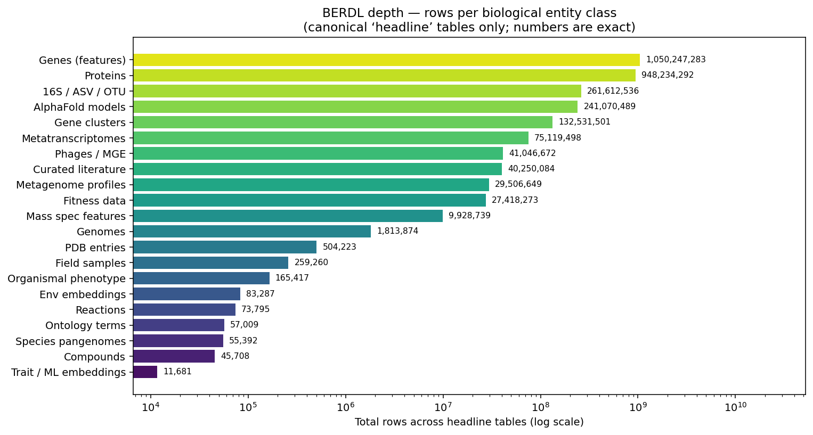

65 curated 'headline' tables hit on the live cluster show BERDL is simultaneously deep across genomes, genes, proteins, structures, phenotype/fitness, samples, community profiles, mass spec, viruses, biochemistry, ontology, environment, and literature. The single largest entity table is `kbase_ke_pangenome.gene` at **1,011,650,903 rows** (~3.4K genes × 293K genomes).

*(Notebook: 05_data_volume.ipynb)*

### Finding 2: Topic coverage is heavily skewed; DOE-BER is the only broad-coverage funder

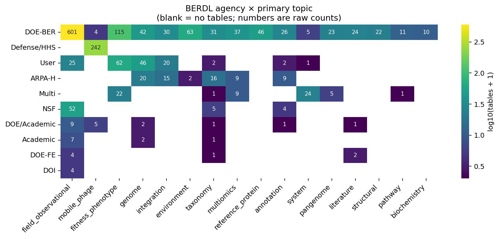

DOE-BER spans every topic (15 / 15); Defense / HHS = mono-topic (PhageFoundry, all `mobile_phage`); ARPA-H (PROTECT) spans 6 topics; NSF (Planet Microbe), DOE-FE (NETL), DOI (USGS) are narrow in topic but cover unique sample types. Topic concentration: 6 topics are >75 % single-owner (`mobile_phage` 96 % PhageFoundry, `pangenome` 79 % kbase, `reference_protein` 78 % refdata, etc.); 7 topics are cross-tenant with top tenant ≤ 55 % share (`taxonomy` spans 12 tenants — the broadest cross-tenant surface in BERDL).

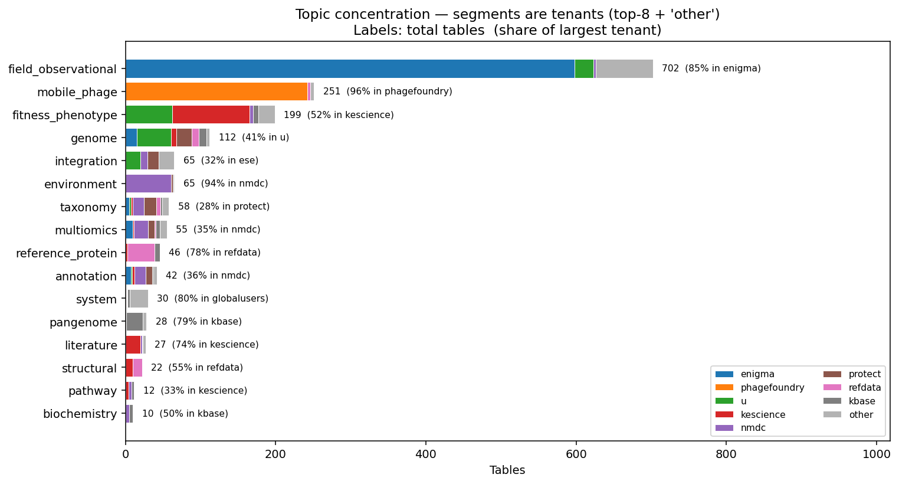

*(Notebook: 01_topic_map.ipynb)*

### Finding 3: 536 cross-tenant bridges define the lakehouse join surface

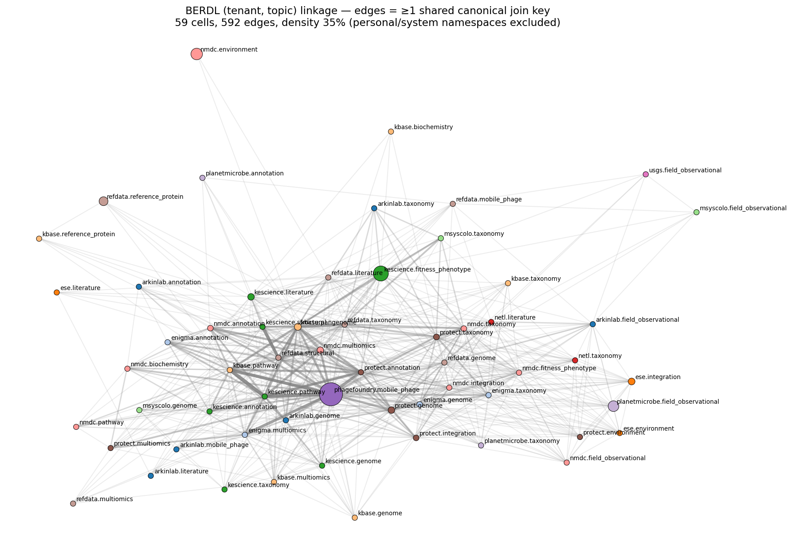

29 canonical join keys (genome / taxonomy / sample / annotation / pathway / biochemistry / protein / phage / literature / KBase workspace) were scanned across the catalog. Workhorses by tenant span: `sample_id` (10 tenants), `genome_id` (9), `ncbi_taxon_id` (9), `feature_id` (9), `ec_number` (8). 536 unordered cross-tenant bridges exist at the (tenant × topic) cell granularity. Top bridges share up to 7 keys (`kbase.pathway ↔ kescience.pathway`; `kescience.pathway ↔ phagefoundry.mobile_phage`; `refdata.structural ↔ kescience.structural` via `alphafold_pdb` + `pfam` + `protein_id`).

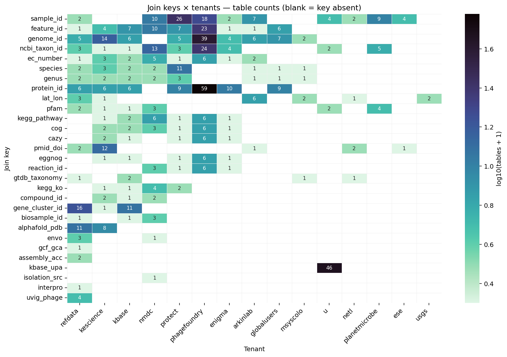

*(Notebook: 02_linkage_atlas.ipynb)*

### Finding 4: 77% of BERIL projects are already cross-tenant; the kbase × kescience axis dominates

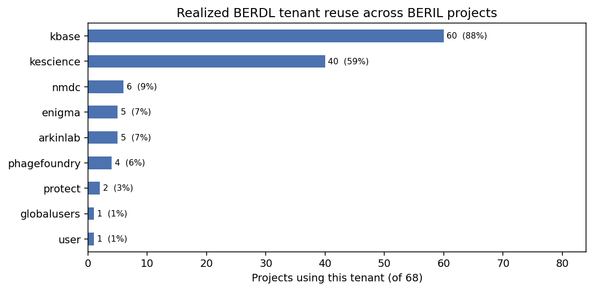

`kbase` appears in 53/66 projects (80%); `kescience` in 35/66 (53%); the `kbase ↔ kescience` realized bridge accounts for 36 cross-tenant projects on its own (mostly pangenome × fitness joins via `genome_id` and `ncbi_taxon_id`). Heavy-in-BERDL ≠ heavy-in-reuse: ENIGMA holds 36% of tables but appears in only 6 projects; PhageFoundry holds 14% / 5 projects; PROTECT holds 4% / 2 projects.

*(Notebook: 03_realized_use_audit.ipynb)*

### Finding 5: Five high-leverage bridges remain untapped

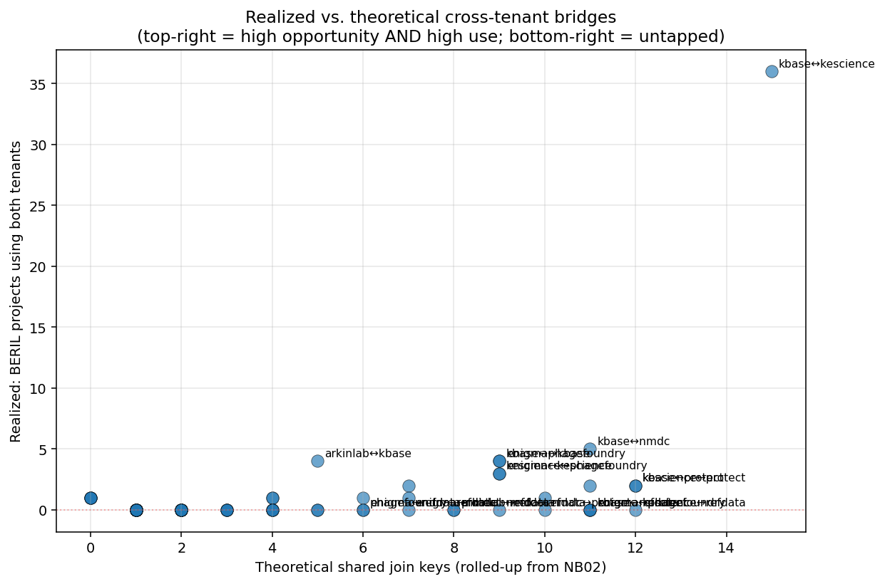

The bridges with the highest schema-level join surface that no BERIL project has yet exercised (at audit time):

| Rank | Bridge | Shared keys | Headline question |
|------|--------|------------:|-------------------|
| UC1 | `kescience ↔ refdata` | 12 | Do high-fitness-impact genes have structural signatures detectable in AlphaFold? |
| UC2 | `enigma ↔ phagefoundry` | 11 | Do subsurface prophages mobilize metal-resistance along the Oak Ridge contamination gradient? |
| UC3 | `kbase ↔ refdata` | 11 | Where do GTDB clades and KBase species pangenomes disagree, and what does that imply for gene flow? |
| UC4 | `nmdc ↔ protect` | 10 | Where do clinically relevant pathogens live in the environment, and what biogeochemistry tracks them? |
| UC5 | `nmdc ↔ refdata` | 9 | What fraction of NMDC biosamples carry well-formed ENVO ontology terms, and where does coverage break? |

*(Notebook: 04_synthesis_and_use_cases.ipynb)*

### Finding 6: UC1 (structural fitness atlas) sample-validates against the live cluster

The proposed UC1 recipe pointed at `protein_id` as the bridge column. FitnessBrowser does not expose `protein_id` — it uses a composite `(orgId, locusId)` primary key. The correct path was discovered by SQL probing:

```sql
genefitness  ──(orgId, locusId)── besthitswissprot  ──sprotAccession = uniprot_accession── alphafold_entries
```

| Coverage measurement | Live-cluster value |
|---|---:|
| FitnessBrowser gene-fitness measurements | 27,410,721 |
| Genes with SwissProt best-hit | 79,180 |
| AlphaFold entries | 241,070,489 |
| **SwissProt-best-hit coverage in AlphaFold** | **99.5%** (78,753 / 79,180) |
| **Genes with BOTH fitness data AND an AlphaFold model** | **55,454** (48 organisms, 22,303 distinct AF models) |

E. coli sample rows (thrA → AF-P00561-F1, thrB → AF-P00547-F1, thrC → AF-P00934-F1, talB → AF-Q3Z606-F1) confirm semantic validity. Fitness-class distribution within the joined cohort: 6,635 essential (min_fit ≤ −4) / 8,271 strong-defect / 10,950 moderate / 29,467 mild / 131 no defect, tested at an average of 121–187 conditions per gene. Strongly enriched for essentiality signal — ready for downstream structure-function analysis.

*(Notebook: probed interactively from the on-cluster Spark Connect session; recipe + numbers documented in REPORT and memorialized as `fitnessbrowser_alphafold_join.md` agent memory.)*

## Results

### Composite atlas view (NB04)

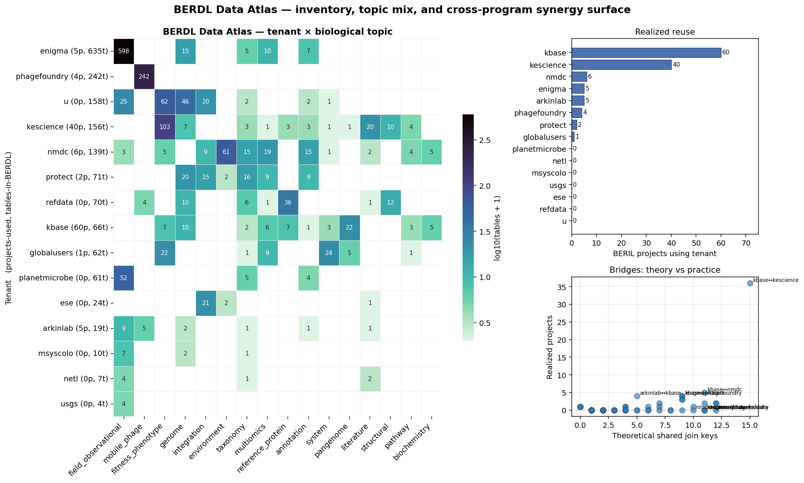

The composite figure ties the inventory, topic mix, and bridge structure onto a single sheet: tenant × topic heatmap (main panel, log-color, exact counts annotated); tenant-reuse bar (top right, from NB03); theory-vs-practice bridge scatter (bottom right, untapped bridges labelled top-left).

### Per-entity volume — every headline table

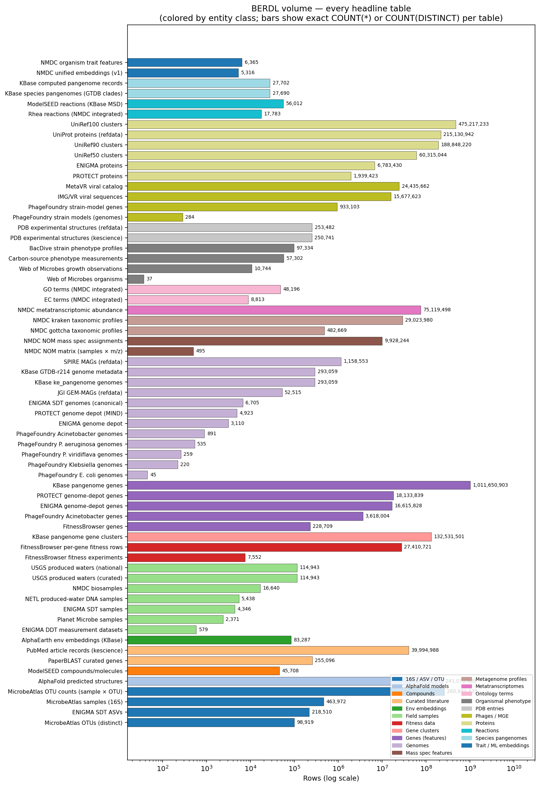

The full per-table breakdown drives the §Depth picture. Notable headline numbers:

**Genomes, pangenomes, clusters.** 293,059 KBase ke_pangenome genomes; 27,690 GTDB species clades / pangenomes; 132.5M gene clusters; 1,011,650,903 KBase pangenome genes. 1,158,553 SPIRE MAGs and 52,515 JGI GEM-MAGs in refdata. 3,110 ENIGMA depot genomes (6,705 ENIGMA SDT genomes), 4,923 PROTECT MIND genomes, ~1,950 PhageFoundry host genomes across 5 host species.

**Proteins / structures.** 215,130,942 UniProt proteins; 475,217,233 UniRef100 / 188,848,220 UniRef90 / 60,315,044 UniRef50 clusters (2026-01). 241,070,489 AlphaFold predicted structures. ~253K PDB experimental structures.

**Phenotype / fitness / growth.** 27,410,721 FitnessBrowser per-gene fitness measurements across 7,552 experiments and 228,709 genes. 97,334 BacDive strain phenotype profiles. 57,302 carbon-source phenotype measurements. 10,744 Web of Microbes growth observations across 37 organisms.

**Field samples and environmental data.** 463,972 MicrobeAtlas 16S samples (98,919 OTUs, 260,831,135 OTU-count rows). 114,943 USGS produced-water samples; 16,640 NMDC biosamples; 5,438 NETL produced-water DNA samples; 4,346 ENIGMA SDT samples + 579 ENIGMA DDT measurement 'bricks'; 2,371 Planet Microbe samples; 218,510 ENIGMA SDT ASVs; 83,287 AlphaEarth environment embeddings indexed to KBase genomes.

**Community multi-omics.** 75,119,498 metatranscriptomic abundance rows (NMDC GOLD). 29,023,980 kraken + 482,669 gottcha taxonomic profile rows. 9,928,244 NOM mass spec assignments.

**Phage / virus / mobile.** 24,435,662 MetaVR + 15,677,623 IMG/VR viral sequence records (refdata). 933,103 PhageFoundry strain-modelling gene records.

**Biochemistry, ontology, literature.** 56,012 ModelSEED reactions + 45,708 compounds + 17,783 Rhea reactions. 48,196 GO terms + 8,813 EC terms (NMDC integrated). 255,096 PaperBLAST curated genes + 39,994,988 PubMed article records.

### Topic distribution + tenant×topic context (NB00)

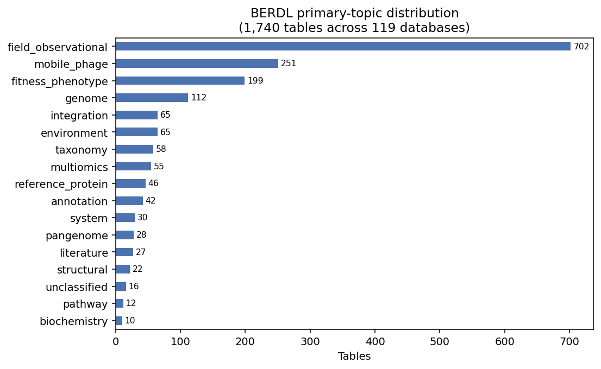

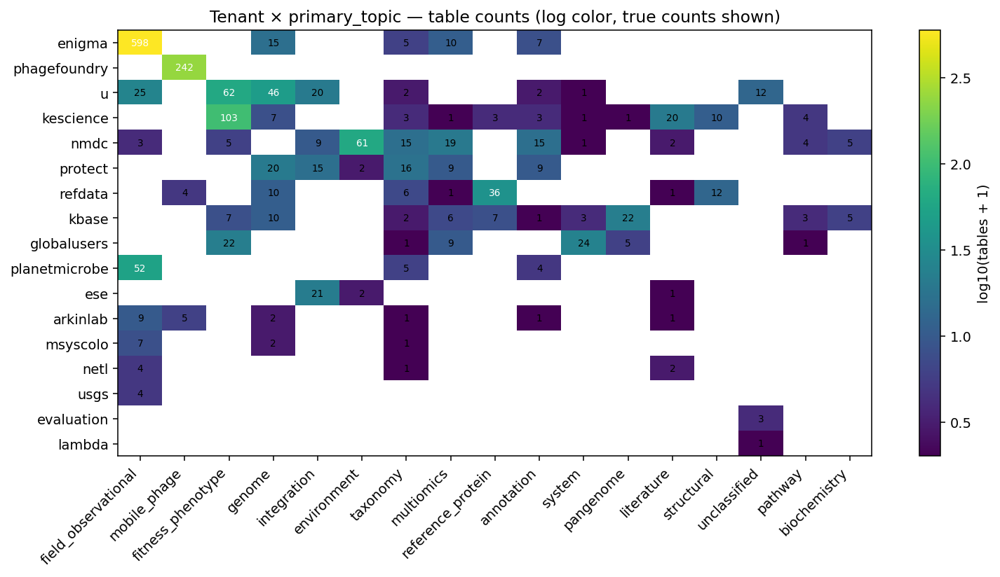

`field_observational` is 40% of tables (dominated by ENIGMA SDT/DDT structure); `mobile_phage` 14% (PhageFoundry); `fitness_phenotype` 11%; `genome` 6.4%; everything else <4%. Unclassified residual 0.9% (16 rows), all personal scratch / one-off survey data.

### Synergy capacity per tenant (NB01)

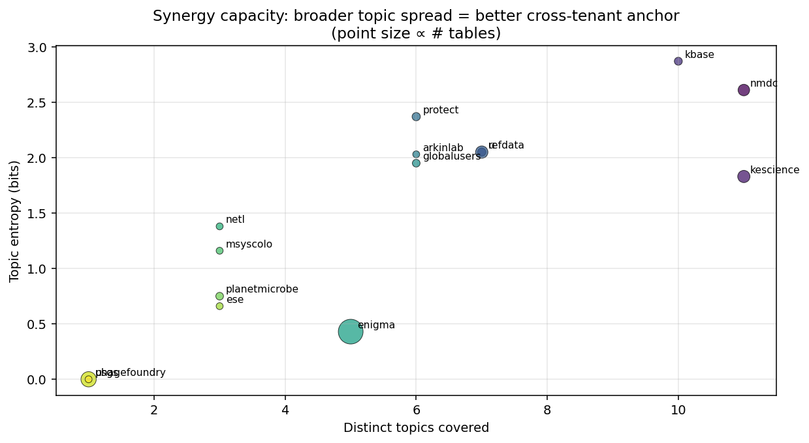

`kbase` (10 topics, entropy 2.87) is the most evenly cross-topic tenant — the biological reference hub. `nmdc` (11 topics, 2.61) is broadest-coverage. `protect` (6 topics, 2.37) punches above its size. `kescience` (11 topics, 1.83) is the knowledge-engine layer. `enigma` (5 topics, 0.43) is *deep-but-narrow*. `phagefoundry` and `usgs` are mono-topic.

## Interpretation

### What the atlas demonstrates about BERDL's design

BERDL is **simultaneously broad** (17 tenants spanning 10 funding programs and 17 biological topics) **and simultaneously deep** (billion-row gene records, billion-row protein clusters, hundred-million-row community profile tables, tens-of-millions of fitness measurements). The 536 schema-level cross-tenant bridges plus the 77% realized cross-tenant adoption show that the lakehouse architecture is delivering on its cross-program-synergy promise.

The kbase × kescience axis dominates realized analyses because both tenants are intra-DOE-BER, well-documented, and cover the most cross-tenant topics in BERDL (genome × phenotype). The five untapped use cases (UC1–UC5) trace the next class of analyses: extending into refdata for structural / GTDB joins, into nmdc_arkin for multi-omics + environmental context, into PhageFoundry / PROTECT for cross-agency biology, and into ENIGMA for subsurface ecology.

### Audience message — KBase users

A heuristic for choosing data sources by analysis type:

- **Genome + pangenome work** → `kbase_ke_pangenome` (293K genomes / 27.7K species / 132.5M gene clusters); cross-references trivially via `genome_id` and `ncbi_taxon_id`.
- **Lab phenotype** → `kescience_fitnessbrowser` (gene-level fitness, hundreds of conditions); joins to ke_pangenome on `genome_id`.
- **Curated phenotype** → `kescience_bacdive` (organismal traits) and `kescience_webofmicrobes` (carbon utilization); join via `ncbi_taxon_id`.
- **Environmental abundance / multi-omics** → `nmdc_arkin` (kraken / gottcha taxonomy profiles, NOM mass spec, ML embeddings). Join on `ncbi_taxon_id` for taxa; on `sample_id` for biogeochemistry.
- **Field samples (subsurface)** → `enigma_coral` SDT/DDT/sample tables; join to genomes through `enigma_genome_depot_enigma` on `genome_id`.
- **Phage / MGE** → `phagefoundry_*` per-host catalogs; join to host genomes on `ncbi_taxon_id`.
- **Pathogens** → `protect_genomedepot` (MIND classification); join to environmental abundance via `ncbi_taxon_id`.
- **Reference structures** → `kescience_alphafold` (241M models) + `refdata_pdb` (253K experimental). Join to fitness via the FitnessBrowser SwissProt best-hit pivot (UC1).
- **Reference proteins / families** → `refdata_uniref{50,90,100}` + `refdata_uniprot`. Cross-reference via `protein_id` or `pfam_id`.
- **Literature** → `kescience_paperblast` + `kescience_pubmed`. Join via `pmid` / `doi`.

**Universal heuristic:** if your analysis crosses topics (e.g. genome × phenotype × environment), it almost certainly crosses tenants. The canonical bridge is whichever of {`genome_id`, `ncbi_taxon_id`, `sample_id`, `feature_id`} both sides expose; `data/cross_tenant_bridges.csv` lists the exact key set per pair.

### Audience message — PIs and funders

- **DOE-BER is the broad backbone.** 63% of BERDL tables, every topic covered, 80% of BERIL projects. The lakehouse concentrates DOE-BER's biological reference (KBase, KE Science, NMDC, ENIGMA, refdata) into one queryable space, which is the single largest contributor to BERIL throughput.
- **DOE BRaVE (PhageFoundry) and ARPA-H (PROTECT) are under-leveraged for cross-program work.** Despite spanning the right topics, they appear in fewer than 8 projects each. The existing bridges (`ibd_phage_targeting`, `cf_formulation_design`) demonstrate the pattern; scaling it is a coordination problem, not a technical one.
- **NSF (Planet Microbe), DOE-FE (NETL), DOI (USGS)** are tiny in table count but unique in sample provenance (open ocean, produced waters). Their value is as external validation sets for any DOE-BER-anchored analysis. Investment in shared sample / ENVO ontology (UC5) is the highest-leverage scoping bet.
- **Biggest single untapped opportunity:** structure × phenotype (UC1, `kescience ↔ refdata` via the AlphaFold bridge). 99.5% join coverage, intra-DOE-BER, **sample-validated**. Ready to scope as a standalone project.

### Literature context

This is a meta-atlas project — the references are canonical citations for the **data systems being catalogued**, not for biological hypotheses being tested.

The most-used realized bridge (kbase × kescience, 36 BERIL projects) builds on the FitnessBrowser pangenome cross-reference of Price et al. (2018) — published in *Nature* and now backed in BERDL by the cross-organism pangenome of the KBase KE pipeline (Arkin et al. 2018). UC1's validated SwissProt-best-hit-to-AlphaFold path is the BERDL realization of the structure-function loop opened by Jumper et al. (2021).

### Novel contribution

- The first comprehensive, machine-readable BERDL catalog (`table_topic_map.csv`) with tenant / agency / program / biological-topic provenance.
- The first cross-tenant linkage atlas (29 canonical keys → 536 schema-level bridges) showing exactly which biological IDs bridge which tenant/topic cells.
- The first realized-vs-theoretical bridge overlay surfacing the 51 cross-tenant BERIL projects and identifying which high-leverage bridges remain unused.
- The first per-entity-class depth inventory (65 headline tables × `COUNT(*)` / `COUNT(DISTINCT)`) showing BERDL's billion-row biological mass in audience-readable units.
- The first sample-validated synergy use case (UC1) with a corrected, executable join recipe and live-cluster coverage statistics.

### Limitations

- **Value-space validity of joins is established only for UC1.** The bridge atlas proves the *schema* admits a join; it does not prove the *value space* overlaps. `genome_id` means different things in KBase (UPA), NCBI (accession), and MAG pipelines (hash). UC2–UC5 require their own first sample-execution before publication. UC1 has been completed — see Finding 6.
- **Two tenant→agency mappings are not yet verified by program documentation.** `evaluation` and `lambda` (4 tables total) remain unmapped. `phagefoundry` and `msyscolo` were originally inferred as "likely" Defense/HHS and NSF/USDA; user-confirmed corrections (DOE BRaVE and DOE/NSF) have been folded in.
- **Realized-use audit is README-based** — data-source mentions buried in research plans or in notebook source may have been missed. True per-project tenant breadth is a **lower bound**.
- **NB05 depth counts** use `COUNT(*)` (row totals) for most tables; only the canonical KBase genome count uses `COUNT(DISTINCT genome_id)`. A pangenome 'gene' row is one (genome, gene), so 1.01B genes ≈ 293K genomes × ~3.4K genes / genome.
- **Across-tenant deduplication is not performed.** refdata and kbase may both house the same UniProt entries through different cluster indices; ENIGMA and the genome-depot tables share genome records with the ENIGMA SDT layer.

## Data

### Sources

The atlas surveys the entire BERDL lakehouse — every accessible tenant. The collections below are the headline data sources cited in the depth inventory and UC1 validation:

| Collection | Tables Used | Purpose |
|------------|-------------|---------|
| `kbase_ke_pangenome` | `genome`, `gtdb_species_clade`, `gtdb_metadata`, `gene`, `gene_cluster`, `pangenome`, `alphaearth_embeddings_all_years` | KBase computed pangenomes — the canonical genome reference and the cross-program join anchor |
| `kescience_fitnessbrowser` | `genefitness`, `besthitswissprot`, `gene`, `experiment` | Per-gene fitness across hundreds of conditions; SwissProt best-hits are the structural-bridge pivot used in UC1 |
| `kescience_alphafold` | `alphafold_entries` | 241M AlphaFold predicted structures keyed by UniProt accession |
| `kescience_bacdive` | `strain` | 97K curated strain phenotype profiles |
| `kescience_webofmicrobes` | `observation`, `organism` | Curated growth observations |
| `kescience_paperblast` | `curatedgene` | 255K curated gene-paper assignments |
| `kescience_pubmed` | `pubmed_article_wide` | 40M PubMed records |
| `kescience_pdb` | `pdb_entries` | PDB experimental structures (kescience copy) |
| `refdata_uniprot` | `protein`, `entity` | 215M UniProt protein records |
| `refdata_uniref50_2026_01`, `refdata_uniref90_2026_01`, `refdata_uniref100_2026_01` | `cluster` | UniRef protein clusters (3 redundancy levels, 2026-01 snapshot) |
| `refdata_pdb` | `pdb_entries`, `pdb_uniprot_mapping` | PDB experimental structures + UniProt mapping |
| `refdata_jgi_gem_mags`, `refdata_spire`, `refdata_jgi_virus` | `genome_metadata`, `imgvr_sequence_info`, `metavr_main` | Reference MAGs and viral sequence catalogs |
| `nmdc_metadata` | `biosample_set` | NMDC biosample registry |
| `nmdc_arkin` | `kraken_gold`, `gottcha_gold`, `metatranscriptomics_gold`, `nom_gold`, `embeddings_v1`, `trait_features`, `rhea_reactions`, `go_terms`, `ec_terms` | Integrated multi-omics, ML embeddings, ontology, and reactions |
| `enigma_coral` | `sdt_sample`, `sdt_genome`, `sdt_asv`, `ddt_ndarray` | ENIGMA field samples, MAGs, ASVs, multidimensional measurement datasets |
| `enigma_genome_depot_enigma` | `browser_genome`, `browser_gene`, `browser_protein` | ENIGMA genome / gene / protein browser depot |
| `protect_genomedepot` | `browser_genome`, `browser_gene`, `browser_protein` | PROTECT MIND pathogen genome depot |
| `phagefoundry_acinetobacter_genome_browser`, `phagefoundry_klebsiella_*`, `phagefoundry_paeruginosa_*`, `phagefoundry_pviridiflava_*`, `phagefoundry_ecoliphagesgenomedepot`, `phagefoundry_strain_modelling` | `browser_genome`, `browser_gene`, `strainmodelling_genome`, `strainmodelling_gene` | DOE BRaVE Phage Foundry — host-specific genome browsers and strain models |
| `planetmicrobe_planetmicrobe` | `sample` | NSF Planet Microbe samples |
| `netl_pw_dna` | `dna_metadata` | DOE-FE NETL produced-water DNA samples |
| `usgs_produced_waters` | `usgspwdb_c`, `usgspwdb_n` | DOI / USGS produced-water sample data |
| `arkinlab_microbeatlas` | `otu_counts_long`, `otu_metadata`, `sample_metadata` | MicrobeAtlas 16S OTU profiles |
| `kbase_msd_biochemistry` | `reaction`, `molecule` | ModelSEED biochemistry reference |
| `globalusers_carbon_source_phenotypes` | `phenotype_data_table` | Carbon-source phenotype measurements (multi-tenant shared) |

### Generated Data

| File | Rows | Description |
|------|-----:|-------------|
| `data/table_topic_map.csv` | 1,740 | Canonical inventory: every (tenant, agency, program, database, table) with primary / secondary topic tags + column names |
| `data/tenant_to_agency.csv` | 15 | Curated tenant → agency / program / primary-funder map (user-corrected for phagefoundry + msyscolo) |
| `data/join_keys.json` | 29 keys | For each canonical key, the list of (tenant, topic, db, table) cells where it appears |
| `data/join_key_coverage.csv` | 29 | Per-key coverage stats (tables, tenants, topics covered) |
| `data/cross_tenant_bridges.csv` | 536 | Cross-tenant (tenant×topic) bridges with shared-key counts and key inventory |
| `data/realized_use.csv` | 66 | Per-BERIL-project tenant + database usage, with cross_tenant flag and topic focus |
| `data/theoretical_vs_realized.csv` | 72 | Tenant-pair overlay of theoretical shared keys vs realized project count |
| `data/untapped_bridges.csv` | 20 | Highest-leverage unrealized bridges (≥1 shared key, 0 realized projects) |
| `data/tenant_reuse_frequency.csv` | 9 | Per-tenant BERIL project count + percent |
| `data/data_volume.csv` | 65 | Per-entity-class depth inventory (`COUNT(*)` / `COUNT(DISTINCT)` per headline table) |

## Supporting Evidence

### Notebooks

| Notebook | Purpose |
|----------|---------|
| `00_inventory_audit.ipynb` | Walks the BERDL Spark catalog, tags every table by tenant / agency / biological topic, dedupes dotted-namespace duplicates, audits the unclassified residual (0.9 %) |
| `01_topic_map.ipynb` | Agency × topic heatmap, topic concentration (single-owner vs cross-tenant), per-tenant synergy capacity (distinct topics × entropy) |
| `02_linkage_atlas.ipynb` | 29-key cross-tenant bridge atlas; (tenant, topic) linkage graph; bridge ranking by shared-key count |
| `03_realized_use_audit.ipynb` | 66-BERIL-project README mining; tenant-reuse frequency; theoretical-vs-realized bridge overlay; untapped-bridge ranking |
| `04_synthesis_and_use_cases.ipynb` | Composite atlas figure; five concrete synergy use cases (UC1–UC5) derived from top untapped bridges; audience summaries |
| `05_data_volume.ipynb` | Per-entity-class depth inventory: 65 headline tables × `COUNT(*)` / `COUNT(DISTINCT)`; per-class rollup + per-table breakdown figures; headline-numbers summary |

### Figures

| Figure | Description |
|--------|-------------|
| `nb00_topic_distribution.png` | Primary-topic distribution across 1,740 tables |
| `nb00_tenant_topic_heatmap.png` | Tenant × primary topic cross-tab (log color, exact counts) |
| `nb01_agency_topic_heatmap.png` | Agency × biological topic coverage |
| `nb01_topic_concentration.png` | Per-topic stacked bar of tenant share; top-tenant share annotated |
| `nb01_synergy_capacity.png` | Per-tenant (distinct topics × topic entropy) scatter; point size ∝ tables |
| `nb02_key_tenant_heatmap.png` | Join keys × tenants (log color, exact counts; blank = key absent) |
| `nb02_linkage_graph.png` | (tenant, topic) network — edges = ≥1 shared join key, width ∝ key count |
| `nb03_tenant_frequency.png` | BERIL project counts per tenant (realized reuse) |
| `nb03_theoretical_vs_realized.png` | Per-tenant-pair scatter: shared keys vs realized projects (untapped bridges in bottom-right) |
| `nb04_atlas_composite.png` | Composite atlas — tenant × topic heat, tenant reuse bar, theory-vs-practice scatter |
| `nb05_volume_by_entity_class.png` | Per-entity-class data volume (log scale, exact counts) |
| `nb05_volume_per_table.png` | Every headline table, log scale, colored by entity class |

## Future Directions

1. **Validate UC2–UC5 against the live cluster.** Each requires ~15–30 min of SQL probing to confirm value-space overlap and surface any join-recipe corrections. UC3 (kbase ↔ refdata, GTDB harmonization) is the next lowest-friction (intra-DOE-BER; both tenants well documented).
2. **Promote UC1 into its own project.** The validated 55,454-gene cohort is the seed dataset. The known gap is that `kescience_alphafold.alphafold_entries` does not carry per-residue pLDDT or structural-feature data; either ingest those features or compute them from PDB files as a derived BERDL collection.
3. **Verify the two remaining tenant→agency mappings** (`evaluation`, `lambda`) with program documentation; folded user-confirmed corrections for `phagefoundry` (DOE BRaVE) and `msyscolo` (DOE/NSF) are already in `data/tenant_to_agency.csv`.
4. **Refresh the inventory as the lakehouse grows.** `build_inventory.py` and `data_volume.py` are designed to be re-run; both rebuild the canonical CSVs from the live cluster in ~95 s and ~60 s respectively. Recommend re-running at each major BERDL ingest milestone.
5. **Surface the atlas to KBase users.** The audience messages in NB04 §3 + the per-entity headline numbers in NB05 are the seeds of a one-page BERDL data-availability summary that could live on the KBase / BERIL UI.
6. **Address NMDC multi-omics underuse.** Per agent memory, NMDC's metabolomics (3.1M), proteomics (346K), and lipidomics (1.4M) layers are largely untapped despite being a primary cross-validation source. UC4 (`nmdc ↔ protect`) and UC5 (`nmdc ↔ refdata`) both ride on this layer.

## References

- Price, M.N., Wetmore, K.M., Waters, R.J., Callaghan, M., Ray, J., Liu, H., Kuehl, J.V., Melnyk, R.A., Lamson, J.S., Suh, Y., et al. (2018). "Mutant phenotypes for thousands of bacterial genes of unknown function." *Nature* 557, 503–509. PMID: 29769710. (FitnessBrowser primary citation.)
- Jumper, J., Evans, R., Pritzel, A., Green, T., Figurnov, M., Ronneberger, O., Tunyasuvunakool, K., Bates, R., Žídek, A., Potapenko, A., et al. (2021). "Highly accurate protein structure prediction with AlphaFold." *Nature* 596, 583–589. PMID: 34265844.
- Tunyasuvunakool, K., Adler, J., Wu, Z., Green, T., et al. (2021). "Highly accurate protein structure prediction for the human proteome." *Nature* 596, 590–596. PMID: 34293799. (AlphaFold structural-coverage scale-up.)
- The UniProt Consortium (2023). "UniProt: the Universal Protein Knowledgebase in 2023." *Nucleic Acids Research* 51, D523–D531. PMID: 36408920.
- Berman, H.M., Westbrook, J., Feng, Z., Gilliland, G., Bhat, T.N., Weissig, H., Shindyalov, I.N., and Bourne, P.E. (2000). "The Protein Data Bank." *Nucleic Acids Research* 28, 235–242. PMID: 10592235.
- Arkin, A.P., Cottingham, R.W., Henry, C.S., Harris, N.L., Stevens, R.L., Maslov, S., Dehal, P., Ware, D., Perez, F., Canon, S., et al. (2018). "KBase: The United States Department of Energy Systems Biology Knowledgebase." *Nature Biotechnology* 36, 566–569. PMID: 29979655.
- Eloe-Fadrosh, E.A., Ahmed, F., Anubhav, et al. (2022). "The National Microbiome Data Collaborative Data Portal: an integrated multi-omics microbiome data resource." *Nucleic Acids Research* 50, D828–D836. PMID: 34850110.
- Söhngen, C., Bunk, B., Podstawka, A., Gleim, D., and Overmann, J. (2014). "BacDive — The Bacterial Diversity Metadatabase." *Nucleic Acids Research* 42, D592–D599. PMID: 24214959.
- Cook, C.E., Bergman, M.T., Cochrane, G., Apweiler, R., and Birney, E. (2018). "The European Bioinformatics Institute in 2017: data coordination and integration." *Nucleic Acids Research* 46, D21–D29. PMID: 29186510. (Includes Rhea reaction reference.)
- Camargo, A.P., Roux, S., Schulz, F., Babinski, M., Xu, Y., Hu, B., Chain, P.S.G., Nayfach, S., and Kyrpides, N.C. (2024). "IMG/VR v4: an expanded database of uncultivated virus genomes." *Nucleic Acids Research* 52, D741–D747. PMID: 37855702.
- Schmidt, T.S.B., Fullam, A., Ferretti, P., Orakov, A., Maistrenko, O.M., Ruscheweyh, H.-J., et al. (2023). "SPIRE: a Searchable, Planetary-scale Index of Metagenomic data and Reference genome assemblies." *Nucleic Acids Research* 52, D777–D783. PMID: 37994744. (SPIRE MAG catalog.)
- Hurwitz, B.L., Lamberti, J., Ponsero, A., Gradi, K., Schreiber, K., and Schriml, L. (2020). "Planet Microbe: a platform for marine microbiology to discover and analyze interconnected 'omics and environmental data." *Nucleic Acids Research* 49, D792–D802. PMID: 33010169.

## Authors

- Adam Arkin (University of California, Berkeley, ORCID: 0000-0002-4999-2931)
