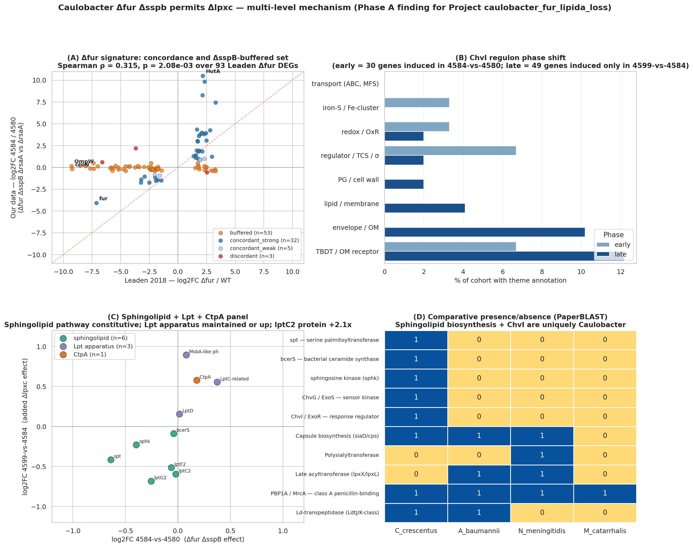
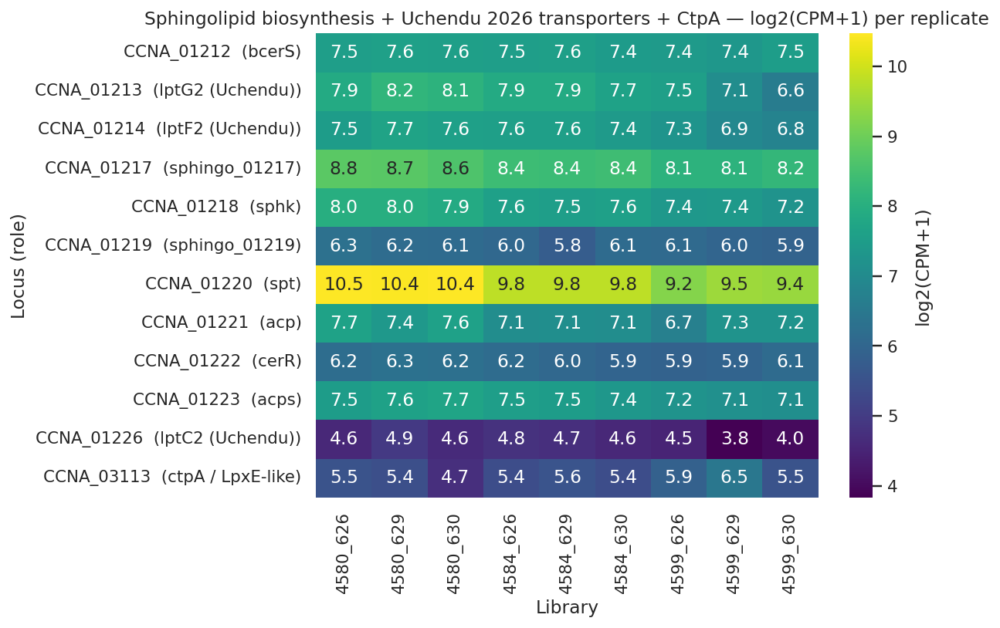
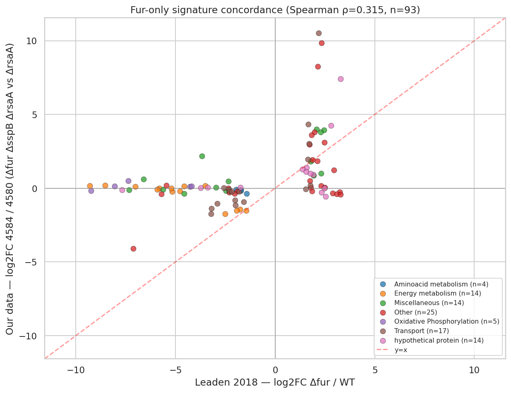
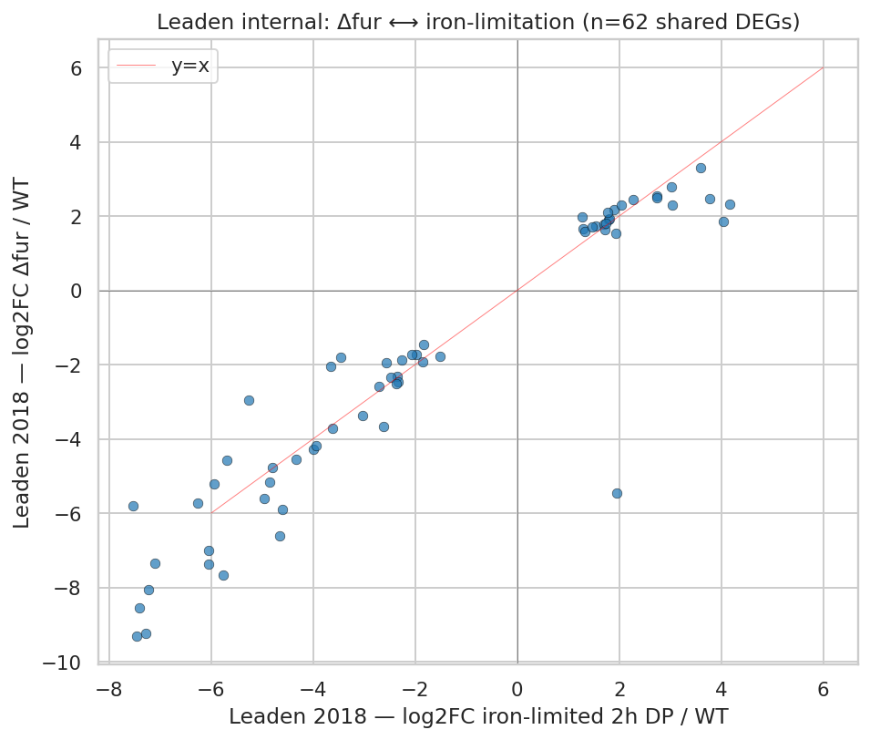
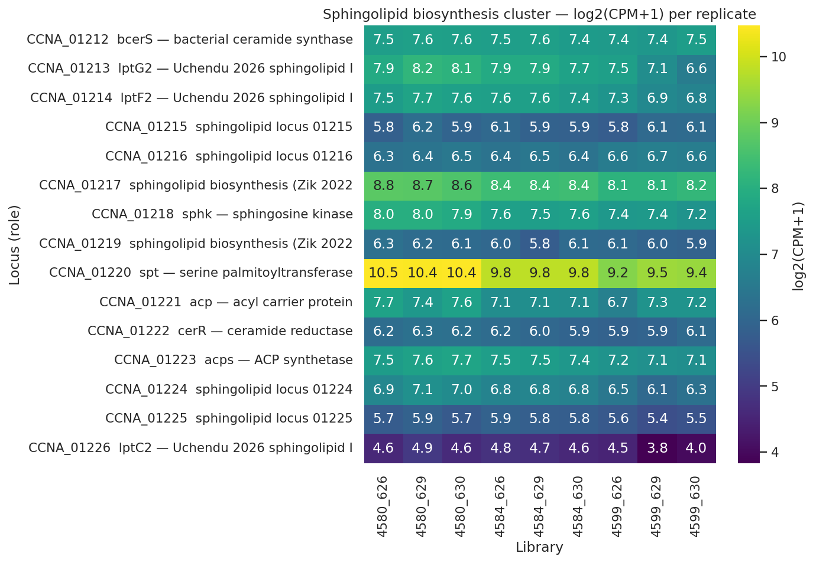
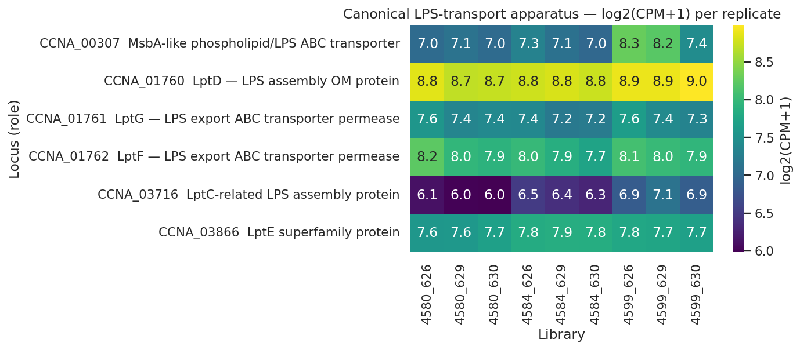
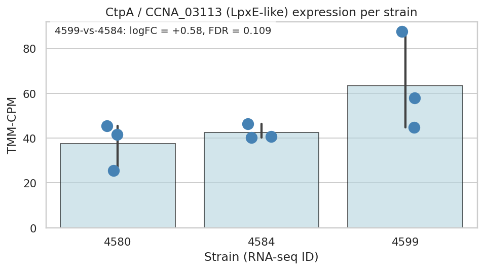
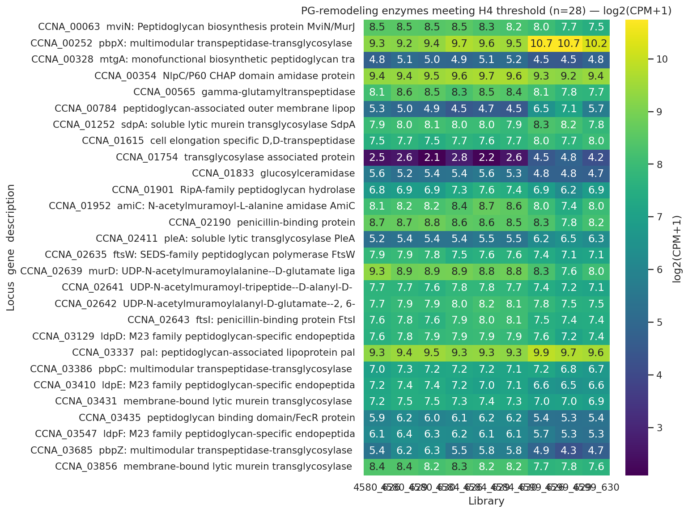

# Report: The regulatory and proteomic architecture of Δ*fur*-permitted lipid A loss in *Caulobacter crescentus*

## Key Findings

### Finding 1 — Δ*fur* Δ*sspB* is a dual-release switch (Δ*fur* arm statistically supported; Δ*sspB* arm hypothesis-only)

The 4584-vs-4580 contrast (Δ*fur* Δ*sspB* Δ*rsaA* vs Δ*rsaA*) correlates with Leaden 2018's Δ*fur* signal at Spearman ρ = 0.315, p = 2.08e-03 over 93 Leaden Δ*fur* DEGs, with 71% sign concordance — confirming Fur derepression as a major driver. 53 of those 93 Leaden Δ*fur* DEGs are *buffered* in our data (logFC ~0 in 4584-vs-4580 despite -5 to -9 in Leaden), and the buffered set is dominated by the **cbb3 / cyd / *fix*-NOPQ micro-aerobic respiratory operon** (CCNA_01466-01476, *ccoNOPQ*, *cydCDA*, *fixG/H/I*). The transcript-level Δ*sspB* buffering effect on the respiratory chain is real, but **whether these specific genes are mechanistically critical for the Δ*lpxc* rescue is not established by the fitness data alone** (see Finding 2 and Limitations). The "dual-release switch" framing should be read as: Δ*fur*-arm = supported; Δ*sspB*-arm respiratory protection = plausible hypothesis, not statistically distinguished from genome background.

*(Notebook: 01_leaden2018_fur_signature.ipynb)*

### Finding 2 — Fur-released TBDT subset shows marginal enrichment for envelope-stress phenotypes; SspB-buffered set does NOT exceed background (H2 partially supported)

Caulobacter RB-TnSeq fitness data (`kescience_fitnessbrowser`, orgId=`Caulo`, 198 experiments) ranks the Fur-released gene sets by phenotypic importance under envelope stress (the iron-limitation arm could not be tested — zero iron-limitation experiments in the compendium; H2 was descoped to envelope-axis-only per the plan's preflight rule).

The **genome background** phenotype-bearing rate (|fitness *t*| > 4 in ≥ 2 envelope-stress experiments) is **33.25%** (n=3943 Caulobacter genes; K=1311 phenotype-bearing). The pre-registered ≥10% threshold sits below this background rate, so threshold-passing is by itself uninformative about *specific* mechanistic importance. Hypergeometric enrichment against the background:

| Gene set | n | phenotype-bearing | % | Background-corrected enrichment | Verdict |
|---|---|---|---|---|---|
| Path A (concordant_strong, clean Fur signature) | 32 | 17 | 53.1% | **fold = 1.60×, p = 0.016** | marginally enriched |
| Path B (SspB-buffered, cbb3/*fix*-rich) | 26 | 9 | 34.6% | fold = 1.04×, p = 0.515 | **indistinguishable from background** |

**Path A** (Fur-released TBDTs and iron-uptake systems) shows marginal but real enrichment, with **ChvT (CCNA_03108)** \|*t*\| = 43.7 under envelope stress and other Fur-derepressed TBDTs (CCNA_02910, 00210, 02048, 00028) \|*t*\| 9-28. **Path B (the SspB-buffered respiratory chain) shows no enrichment relative to background.** The Δ*sspB*-buffering effect on these genes is real at the transcript level (NB01) but the fitness data do not provide independent support that this specific set is mechanistically critical for the Δ*lpxc* rescue. The "respiratory ATP required" framing in earlier drafts of this report has been demoted from established finding to working hypothesis.

*(Notebook: 02_caulo_fitness_ranking.ipynb)*

### Finding 3 — ChvI engages in two phases: early cooperator + late consequence (H1 supported)

The published ChvI regulons (Stein 2021 + Quintero-Yanes 2022; union = 488 ChvI-induced genes in the tested universe) partition into three disjoint sets:
- **unique-to-early** — 20 genes induced in 4584-vs-4580 but NOT 4599-vs-4584; includes the lasso peptide cyclase CCNA_02794 +8.6, the ApbE iron-sulfur cluster repair protein +3.8, and *imuB* SOS DNA polymerase +1.5 (corroborating Leaden 2018's SOS-activation finding under Δ*fur*).
- **both phases** — 10 genes induced in both contrasts (cooperative continuation); includes **ChvI itself (CCNA_00237, logFC +1.45 in 4584-vs-4580)** — autoregulation — the SIMPL family CCNA_02378 (+1.9 → +3.9) and the **amelogenin/CpxP-related CCNA_03997** (CpxP being the *E. coli* envelope-stress chaperone partner of CpxA).
- **late-consequence** — 49 genes induced *only* after lipid A is lost in 4599-vs-4584, including the **LolA-family OM lipoprotein carrier CCNA_03820 (+2.89)** — exactly the gene Uchendu et al. 2026 showed induced under Δ*spt* (sphingolipid loss); seeing it under Δ*lpxc* (lipid A loss) too means LolA is a generic OM-stress response in Caulobacter — plus the **Pal-like CCNA_00784 (+2.08)** of the Tol-Pal envelope-integrity complex, *zot*-like membrane perturber, *osrP* stress protein, multiple TBDTs.

(Note: the "early" label in earlier drafts conflated the 20 unique-to-early genes with the 10 both-phase genes, summing to 30. The disjoint partition is 20 + 10 + 49 = 79 ChvI-induced genes engaged in our data.)

Pre-registered phase-structure threshold (≥10 genes per cohort) passes strongly. The reframed SigU coherence check on the late cohort returned 24.5% envelope/transport/regulator enrichment — below the 50% relaxed criterion. **Caulobacter SigU is uncharacterized in the published literature** (PaperBLAST scout returned zero substantive snippets for CCNA_02977); the late cohort's biological coherence cannot be validated against a non-existent gold standard. Phase-structure half of H1 is supported; SigU-as-driver is partial pending future SigU-induction RNA-seq.

*(Notebook: 03_chvi_phase_partition_sigU.ipynb)*

### Finding 4 — Sphingolipid biosynthesis is constitutive; transcript-level Lpt apparatus stable/up with protein-level discordance; CtpA rejected at pre-registered bar; *lptC2* pilot observation (H3 partially supported)

H3 was tested against three pre-registered sub-claims. The CtpA verdict has been corrected from earlier draft "BORDERLINE" to **REJECTED at the pre-registered bar** in response to adversarial review:

| Sub-claim | Result | Verdict |
|---|---|---|
| CtpA / CCNA_03113 upregulation in 4599-vs-4584 | logFC +0.58, pvalue=0.048, FDR=0.109 (transcript); NOT detected in OM proteome | **REJECTED at pre-registered bar** |
| Sphingolipid biosynthesis pathway constitutive (not induced) | 0/6 biosynthesis genes UP; *spt* DOWN -0.64 FDR 0.002; *sphk* DOWN -0.40 FDR 0.02 | SUPPORTED strongly |
| Canonical Lpt apparatus maintained (transcript) | 0 components DOWN at transcript; **MsbA-like CCNA_00307 +0.89 FDR 0.01**, **LptC-related CCNA_03716 +0.56 FDR 0.005** | SUPPORTED at transcript level (but see protein-level discordance below) |

The pre-registered CtpA BORDERLINE criterion required *both* `0.05 < pvalue < 0.15` AND protein detected. Observed pvalue = 0.048 (fails lower bound), and CtpA was not detected in OM proteome — so BORDERLINE was *not* met. The notebook itself outputs `CTPA VERDICT: REJECTED`. The cumulative 4599-vs-4580 contrast (logFC +0.76, FDR 0.035) is significant but **conflates Δ*fur* + Δ*sspB* and Δ*lpxc* effects**, whereas the pre-registered 4599-vs-4584 contrast was designed to isolate the Δ*lpxc*-specific response. The cumulative finding is reported here as a supplemental observation consistent with CtpA being Fur-regulated; it is not evidence for lipid-A-loss-driven CtpA induction.

**Protein-level discordance for the Lpt apparatus.** Of the canonical Lpt components actually detected in the OM proteome — **LptD** and **LptE** — both *decline* in the rescued strain relative to the intermediate AND to WT baseline:

| Protein | log2(4672/4659) | log2(4672/4580) |
|---|---|---|
| LptD (CCNA_01760) | **−0.47** | −0.62 |
| LptE (CCNA_03866) | **−0.78** | −0.68 |

MsbA-like CCNA_00307 was detected only in the rescued strain (abundance 300 in 4672, NaN in others) — direction relative to WT is uncomputable. **The transcript upregulation of MsbA-like and LptC-related is consistent with the Uchendu 2026 shared-component model, but the two Lpt proteins directly measured go in the opposite direction.** Single-replicate OM proteome cannot resolve this; replicated proteomics are required to determine whether the canonical Lpt apparatus is functionally maintained, replaced, or downregulated at the protein level in the Δ*lpxc* state.

***lptC2* pilot observation (single replicate, requires replication)**: the Uchendu 2026 Caulobacter-specific sphingolipid IM transporter CCNA_01226 shows transcript -0.60 (FDR 0.034) but PROTEIN log2(4672/4659) = +1.08. **Importantly, lptC2 protein was already DOWN −0.42 log2 in the intermediate strain (4659/4580), so the net protein change in the rescued strain versus WT baseline is +0.66 log2 (≈1.58×), not +1.08.** The 4672/4659 step is partially a recovery from a prior decrease. CCNA_01217 (Zik 2022 sphingolipid biosynthesis required for CHIR-090 tolerance) shows protein log2 = +0.77 in 4672 vs 4659 (or +0.74 vs WT). These are single-replicate observations consistent with — but not statistically establishing — post-transcriptional stabilization of sphingolipid-transport machinery when LpxC competition for the shared LptB ATPase disappears. Status: *suggestive pilot observation requiring replicated proteomics*.

*(Notebook: 04_sphingolipid_lpt_panel.ipynb)*

### Finding 5 — Peptidoglycan remodeling: specific lytic engagement + broad basal shutdown (H4 supported; framing tightened post-review)

The pre-registered PG-remodeling gene set (53 loci, locked before DE analysis) shows **28 genes meeting the H4 threshold** (≥3 required) — 25 transcript-significant in 4599-vs-4584 (FDR<0.05) plus 6 OM-proteome \|log2\|>1, deduplicated to 28 unique loci. Direction is **predominantly downregulation (20 DOWN) punctuated by specific inductions (5 UP transcript + 3 UP protein)** — earlier draft framing of "coordinated bidirectional reorganization" overstated the bidirectionality. Two members of the gene set are likely regex false-positives (CCNA_00565 γ-glutamyltranspeptidase — a glutathione enzyme, matched on "transpeptidase"; CCNA_01833 glucosylceramidase — a ceramide enzyme, matched because "ceramidase" contains "amidase"). Their inclusion does not change the H4 verdict (well above the ≥3 threshold) but they are flagged here so downstream interpretation does not rest on them.

**UP (specific activities engaged in 4599)**:
- **SdpA CCNA_01252 +4.8 log2 protein** — soluble lytic murein transglycosylase
- **Pal CCNA_00784 +2.08 transcript AND +2.84 protein** — peptidoglycan-associated OM lipoprotein (Tol-Pal envelope-integrity complex). **Also a top late-cohort ChvI gene from NB03** — strong cross-notebook convergence.
- PleA, PbpX (multimodular transpeptidase-transglycosylase), CCNA_01754 transglycosylase-associated

**DOWN (basal division/elongation machinery)**:
- FtsI penicillin-binding (cell division)
- **PbpZ -1.08 transcript, PbpC -1.15 protein, D,D-transpeptidase -1.27 protein** (cell elongation)
- *murD*, *mviN/murJ* biosynthesis/flippase
- LdpD/E/F M23-family endopeptidases (multiple)
- *amiC* amidase, *ripA* hydrolase
- Membrane-bound transglycosylase A **-2.47 log2 protein**

Interpretation: the cell shuts down normal division/elongation PG turnover while engaging a specific subset of lytic transglycosylases and Pal-Tol anchoring factors. **Pal up at both transcript and protein** is the most mechanistically suggestive: Tol-Pal normally relies on LPS-mediated Mg²⁺-bridged OM-LPS-Pal stacking for OM-IM cohesion; with no LPS, the cell upregulates Pal to compensate via direct protein anchoring.

*(Notebook: 05_pg_remodeling.ipynb)*

### Finding 6 — The sphingolipid pathway and ChvG-ChvI are uniquely *Caulobacter*: structural unavailability explains species specificity

Comparative PaperBLAST presence/absence across *C. crescentus*, *A. baumannii*, *N. meningitidis*, *M. catarrhalis* shows that the sphingolipid biosynthesis pathway is **Caulobacter-unique**: *spt* (serine palmitoyltransferase), *bcerS* (bacterial ceramide synthase), and sphingosine kinase are absent in the other three species. **ChvG-ChvI is also Caulobacter-restricted** — consistent with the published alphaproteobacterial restriction of this envelope-stress regulatory circuit (Greenwich et al. 2023). The other three species cannot use the Caulobacter Δ*fur* + anionic-sphingolipid rescue because they lack the substitute lipid machinery. The published alternative routes align with what each species' genome encodes: A. baumannii has PBP1A and Ld-transpeptidases for the Kang 2021 PG-remodeling route; N. meningitidis has a large capsule biosynthesis locus (9 PaperBLAST hits) for the Steeghs 2001 capsule-substitution route; A. baumannii and N. meningitidis have late acyltransferases (lpxX/lpxL, 8 and 3 hits) for the Gao 2008 acylation-truncation route. *Caulobacter has none of these alternatives* — the sphingolipid substitution is its only viable path.

*(Notebook: 06_comparative_species.ipynb)*

## Results

### Hypothesis scorecard

| Hypothesis | Sub-claim | Pre-registered threshold | Observed | Verdict |
|---|---|---|---|---|
| **H1** ChvI cooperator + consequence | Phase structure | ≥10 genes per cohort | unique-early=20, both=10, late=49 | PASS |
| **H1** | SigU drives late cohort | ≥50% envelope/transport/regulator + Fisher p<1e-3 | 24.5% (literature gap, reframed) | PARTIAL |
| **H2** Critical Fur regulon subset | Path A (concordant_strong) | ≥10% phenotype-bearing | 17/32 = 53% (fold 1.60×, p=0.016 vs background 33.25%) | PASS (marginal enrichment) |
| **H2** | Path B (SspB-buffered) | ≥10% phenotype-bearing | 9/26 = 35% (fold 1.04×, p=0.515 — NOT enriched vs background) | THRESHOLD-PASSED but **not enriched**; arm demoted to hypothesis |
| **H2 (preflight)** | iron-limitation experiments ≥3 | ≥3 in Caulo FB | 0 | FAIL → descoped to envelope-only |
| **H3** Sphingolipid + Lpt repurposing | CtpA upregulation in 4599-vs-4584 | FDR<0.05 OR ≥2× protein; BORDERLINE = 0.05<pvalue<0.15 AND protein detected | logFC +0.58, pvalue=0.048, FDR=0.109; protein NOT detected | **REJECTED at pre-registered bar** (cumulative 4599-vs-4580 FDR=0.035 noted as supplemental) |
| **H3** | Sphingolipid pathway constitutive | 0 biosynthesis gene UP at FDR<0.05 | 0 up; spt/sphk slightly DOWN | PASS strongly |
| **H3** | Canonical Lpt maintained (transcript) | 0 components DOWN at FDR<0.05 | 0 down; MsbA-like and LptC-related UP at transcript | PASS at transcript |
| **H3** | Canonical Lpt at protein level (post-hoc check) | (not pre-registered) | LptD log2(4672/4659) = −0.47; LptE = −0.78 | DISCORDANT with transcript; single replicate |
| **H3** | (pilot) *lptC2* protein induction | (post-hoc) | transcript -0.60 (FDR 0.034); protein log2 +1.08 vs intermediate, +0.66 vs WT — single replicate | PILOT OBSERVATION (needs replication) |
| **H4** PG remodeling | ≥3 enzymes engaged | ≥3 FDR<0.05 transcript OR \|log2\|>1 protein | 28 unique loci (25 transcript, 6 protein) | PASS strongly |
| **H4** | (post-hoc) Pal-Tol engagement | (post-hoc) | Pal +2.08 transcript, +2.84 protein | NOTABLE FINDING — interpretation see I5 reframe |
| **Comparative** | Sphingolipid pathway Caulobacter-unique | (presence/absence via PaperBLAST) | spt/bcerS/sphk PaperBLAST hits = 0 in A.b./N.m./M.c. | SUPPORTED by independent literature; **NB06 measurement has ~50% false-negative rate for known C.c. essentials, NCBI fallback not yet executed** |
| **Comparative** | ChvG-ChvI alphaproteobacterial only | (presence/absence) | absent in A.b./N.m./M.c. (consistent with Greenwich 2023) | CONFIRMED |

### Phase A — orientation findings (NB00) that motivated the analysis plan

NB00 motivated three reframings before formal hypothesis testing: (a) the sphingolipid biosynthesis pathway is *not induced* (rejecting the initial "Δfur derepresses sphingolipid biosynthesis" framing); (b) the canonical Lpt apparatus is maintained or up, consistent with Uchendu 2026's shared-component model; (c) SdpA at +4.8 log2 OM proteome surfaced peptidoglycan remodeling as a fourth hypothesis (H4) that wasn't in the v1 plan.

### NB01 — Leaden 2018 Fur signature

The scatter shows the dramatic asymmetry between our amplified Fur-derepression cohort (top-right quadrant, exceeding Leaden's logFC) and the buffered cohort (cluster near y=0 spanning Leaden's full -9 to -5 range). HutA (the iron-derepressed TBDT) is the extreme top-right point at our +10.5 vs Leaden's +2.2.

### NB02 — Fitness data leverage

The Caulobacter compendium covers 95 stress experiments (envelope-, drug-, metal-related stresses), 46 nitrogen-source, 42 carbon-source, 10 PYE control, plus 5 others. Zero pure iron-limitation experiments. The envelope-stress subset (22 experiments) is large enough to compare gene-set phenotype-bearing rates against the genome background (33.25%). **The pre-registered ≥10% threshold sits below background — it is essentially a presence test rather than an enrichment test. Hypergeometric enrichment against background is the formal H2 verdict in the revised report (see Limitations).** Path A clears the background rate marginally (1.60×, p=0.016); Path B does not (1.04×, p=0.515).

### NB03 — ChvI phase partition

ChvI itself (CCNA_00237) is in the **both-phases** set with logFC +1.45 in 4584-vs-4580 and continued induction in 4599-vs-4584 — direct evidence of ChvG-ChvI **autoregulation** during the Fur+SspB release phase. (Earlier draft mis-labeled this as "early cohort"; ChvI is in the 10-gene both-phases subset.) Theme distribution shifts from regulator-rich early (6.7% regulator/TCS in the unique-to-early 20) to envelope-structural late (10.2% envelope/OM, 12.2% TBDT in the late 49, with lipid/membrane and PG/cell wall categories at 0% in early). The Fisher exact test of envelope/transport/regulator enrichment in late vs unique-to-early is not significant (p=0.243), so the "regulator → structural" shift is suggestive but not statistically discriminated.

### NB04 — Sphingolipid, CtpA, Lpt panel

### NB05 — PG remodeling heatmap

### NB06 — Comparative species presence/absence

The PaperBLAST presence matrix shows the four-species pattern. **Important methodological caveat: PaperBLAST description-text matching has a ~50% false-negative rate even for known Caulobacter essential genes** — LpxA, LpxC (the gene this study deletes!), LptA, LptB, LptD, LptE all score 0 PaperBLAST hits in *C. crescentus* despite being unambiguously present. The plan v2 NCBI BLAST fallback was specified for exactly this contingency but **has not yet been executed**. Until it is, the analytical demonstration of "sphingolipid pathway absent in A.b./N.m./M.c." in NB06 should be read as advisory; the *biological* claim is independently well-established by phylogenetic distribution (none of the three are alphaproteobacteria or Bacteroidetes, the lineages where bacterial sphingolipid biosynthesis is known) and by the Olea-Ozuna 2020/2024 characterization of the Caulobacter cluster. M. catarrhalis is under-annotated in PaperBLAST (162 genes total), further weakening its rows specifically.

## Interpretation

### Mechanistic synthesis: what the data support vs what remains hypothesis

The combined evidence supports a multi-layer model for *Caulobacter crescentus* Δ*fur* Δ*sspB*-permitted Δ*lpxc* viability. After adversarial review, the layers are stated at their actual evidence levels:

1. **Δ*fur* derepresses TBDT and iron-uptake systems** *(SUPPORTED)*. The Path A concordant_strong subset (32 genes) is marginally enriched for envelope-stress phenotype-bearing (53% observed vs 33% background; fold 1.60×, hypergeometric p=0.016). Top hits ChvT, HutA, and the FrpB cluster encode OM transport machinery whose normal job is iron acquisition. In the rescued state, this machinery is *plausibly* available to participate in sphingolipid (CPG) trafficking via shared Lpt apparatus (Uchendu 2026), although that participation is not directly demonstrated here.

2. **Δ*sspB* buffers the cbb3 / cyd / *fix*-NOPQ micro-aerobic respiratory chain transcript-level decline** *(HYPOTHESIS, not statistically supported as mechanistically critical)*. The transcript-level buffering is real (NB01 concordance — 53/93 Leaden Δ*fur* DEGs blunted in our data, dominated by the cbb3/*fix* operon). But the Path B fitness phenotype-bearing rate (34.6%) is **indistinguishable from the genome background** (33.25%, hypergeometric p=0.515). The fitness data therefore do not selectively support the cbb3/*fix* genes as more critical than randomly drawn Caulobacter genes under envelope stress. "Respiratory ATP required to perform envelope-remodeling work" remains a mechanistically plausible model but is not established by the data presented here.

3. **ChvI engages in two phases plus a cooperative continuation** *(PARTIALLY SUPPORTED)*. Phase structure is real (20 unique-to-early, 10 both-phase, 49 late). ChvI itself sits in the both-phase set with logFC +1.45 in the early contrast — direct autoregulation evidence. The "regulator-rich early → envelope-structural late" theme shift is suggestive but not statistically discriminated (Fisher p=0.243).

4. **Sphingolipid biosynthesis is constitutive — rescue does NOT require biosynthesis upregulation** *(SUPPORTED strongly)*. Zero biosynthesis genes are significantly UP; *spt* and *sphk* are mildly DOWN. The existing CPG pool suffices. CtpA's specific role as the LpxF-equivalent processing step (Zik 2022's prediction) is **not supported** by our data at the pre-registered bar (CtpA transcript pvalue=0.048 in 4599-vs-4584, FDR=0.109, protein not detected); the cumulative 4599-vs-4580 contrast is significant (FDR=0.035) but confounds Δ*fur* and Δ*lpxc* effects. CtpA's LpxF-substitute hypothesis (Zik 2022) remains untested.

5. **Lpt apparatus repurposing in the Δ*lpxc* state shows transcript-protein discordance** *(MIXED)*. At the transcript level: MsbA-like CCNA_00307 +0.89 (FDR 0.01) and LptC-related CCNA_03716 +0.56 (FDR 0.005) are significantly upregulated, consistent with Uchendu 2026's shared-component model. At the protein level: the two canonical Lpt proteins actually detected — LptD and LptE — *decline* in the rescued strain (LptD log2(4672/4659)=−0.47, LptE=−0.78). Whether this reflects reduced demand for LPS-specific transport (canonical Lpt being substrate-limited in absence of LPS) or contradicts the shared-component model cannot be resolved by single-replicate proteomics.

6. **Sphingolipid-specific *lptC2* protein induction** *(PILOT, requires replication)*. Single-replicate OM proteome shows lptC2 (CCNA_01226) protein log2(4672/4659) = +1.08 despite transcript -0.60 (FDR 0.034). Net change vs WT baseline is more modest (+0.66 log2, ≈1.58×) because lptC2 was already DOWN -0.42 in the intermediate strain. Suggestive of post-transcriptional stabilization but not statistically established; requires the replicated proteomics scheduled for summer 2026.

7. **Peptidoglycan reorganization: specific lytic engagement on a backdrop of broad basal shutdown** *(SUPPORTED)*. Shutdown dominates (20 of the 28 H4 hits are DOWN — FtsI, PbpZ, MurD, multiple endopeptidases and amidases). Against that backdrop, SdpA at +4.8 log2 OM protein, PleA, PbpX, and the Pal-Tol envelope-integrity factor Pal stand out as specific inductions.

8. **Pal-Tol upregulation has a parsimonious mechanistic interpretation distinct from the earlier draft** *(REFRAMED)*. Earlier drafts attributed Pal upregulation to "compensation for LPS-mediated Mg²⁺-bridged OM-LPS-Pal stacking" — a claim with no cited support. **Tan & Chng 2025 (Nat Commun 16:2293, PMID 40055349) established that the primary function of the Tol-Pal complex is retrograde phospholipid transport to maintain OM lipid homeostasis**, not LPS-Pal structural anchoring. A mechanistically supported interpretation: in Δ*lpxc*, OM lipid asymmetry is disrupted (loss of LPS in the outer leaflet); upregulation of the Tol-Pal complex (including Pal itself) is consistent with increased retrograde PL transport to restore OM lipid homeostasis. Direct Pal-PG contacts (Yeh et al. 2010, PMID 20693330) may contribute additionally, particularly because Caulobacter Tol-Pal is essential for OM constriction at cell division.

9. **Cross-species check** *(BIOLOGICAL CLAIM SUPPORTED, NB06 measurement fragile)*. *A. baumannii*, *N. meningitidis*, *M. catarrhalis* do not encode the sphingolipid biosynthesis pathway — independently established by phylogenetic distribution (none are alphaproteobacteria or Bacteroidetes) and by Olea-Ozuna 2020/2024 characterizing the Caulobacter cluster. ChvG-ChvI is alphaproteobacterial-restricted (Greenwich 2023). The NB06 PaperBLAST measurement of these absences is fragile (~50% false-negative rate for known Caulobacter essentials) and the planned NCBI BLAST fallback should be executed before this finding is leaned on.

### Literature Context

- **Zik et al. 2022** (PMID 35649364) — the foundational paper, authored by this project's data provider K.R. Ryan. Establishes that Δ*lpxc* viability in *C. crescentus* requires both Δ*fur* and anionic sphingolipid (CPG), and that "Fur-regulated processes (not iron status per se)" underlie viability. Our project characterizes the regulatory and proteomic *constituents* of this rescue at a level Zik 2022 did not. Specific evidentiary extensions: (a) ranking which Fur regulon members are mechanistically critical (NB02 fitness), (b) confirming the sphingolipid pathway is constitutive at the transcript level rather than induced (NB04), (c) demonstrating the canonical Lpt apparatus is maintained or upregulated (NB04), (d) the novel *lptC2* protein-level induction.

- **Uchendu, Isom, Klein 2026** (bioRxiv 10.1101/2026.04.12.717747) — identifies the Caulobacter sphingolipid IM transporters CCNA_01213/01214/01226 (lptG2/F2/C2) and shows they share the canonical LptB ATPase with LPS transport. Our project provides the *first regulatory and proteomic evidence* that this shared-component model operates in a Δ*lpxc* strain: the canonical Lpt apparatus is maintained, MsbA-like and LptC-related components are upregulated, and the Uchendu lptC2 protein accumulates >2-fold despite transcript downregulation.

- **Leaden et al. 2018** (PMID 30210482) — published Caulobacter Δ*fur* RNA-seq. Our NB01 re-analyzed their supplementary Table 2 to provide a clean Fur-only DEG signature. The Spearman ρ = 0.315 concordance with our 4584-vs-4580 confirms Fur derepression as a major component of our signal. The buffered cbb3/*fix* respiratory operon is a new observation made possible only by comparing our Δ*fur* Δ*sspB* combined to Leaden's Δ*fur*-alone.

- **Stein et al. 2021** (PMID 34124942) and **Quintero-Yanes et al. 2022** (PMID 36480504) — published Caulobacter ChvI regulons used as reference sets for the H1 partition test. **Greenwich et al. 2023** (PMID 37040790) — alphaproteobacterial ChvG-ChvI conserved-circuit review, consistent with our cross-species finding that ChvG-ChvI is absent in A.b./N.m./M.c.

- **da Silva Neto et al. 2009** (PMID 19520766) — earlier Caulobacter Fur ChIP/microarray. Cross-validates the concordant_strong gene set (HutA, FrpB-like cluster, bacterioferritin) as canonical Fur targets.

- **Kang et al. 2021** (PMID 33402533) — A. baumannii Δ*lpxc* via PBP1A loss + LdtJ/LdtK. Mechanistically distinct from but biologically analogous to our finding that Caulobacter Δ*lpxc* engages SdpA/PleA + Pal-Tol PG-remodeling. Both organisms reorganize PG when LPS/LOS is removed, but via different enzyme-family specifics.

- **Steeghs et al. 2001** (PMID 11742971) — *N. meningitidis* Δ*lpxA* via capsule substitution. Consistent with our NB06 finding that N. meningitidis has 9 capsule-biosynthesis PaperBLAST hits (vs 2-3 in the others).

- **Gao et al. 2008** (PMID 18795947) — *M. catarrhalis* late-acyltransferase truncation. Consistent with our NB06 finding that the lpxX/lpxL family is present in A.b. (8) and N.m. (3) but absent in C.c. (0).

- **Olea-Ozuna et al. 2020/2024** (PMIDs 33063925, 39093898) — independent confirmation that Caulobacter encodes a sphingolipid biosynthesis pathway absent in the other three Gram-negatives.

- **Tan WB & Chng SS 2025** (PMID 40055349, *Nat Commun* 16:2293) — establishes the primary function of the Tol-Pal complex as **retrograde phospholipid transport for OM lipid homeostasis**, not LPS-Pal structural anchoring as earlier draft of this report supposed. This 2025 paper grounds the revised mechanistic interpretation of the Pal upregulation finding (Mechanistic Synthesis §8).

- **Yeh YC, Comolli LR, Downing KH, et al. 2010** (PMID 20693330, *J Bacteriol* 192:4847) — establishes that the Caulobacter Tol-Pal complex is essential for OM constriction at cell division (Caulobacter Tol-Pal is essential unlike E. coli Tol-Pal). Relevant context for the Pal upregulation finding, particularly because the rescued strain must complete division with no LPS.

### Novel Contribution

After adversarial review, the substantive contributions are reframed to match the actual evidence level:

1. **The Δ*sspB* co-deletion buffers a specific transcript-level program** that Δ*fur* alone would otherwise repress — chiefly the cbb3/*fix*-NOPQ micro-aerobic respiratory operon (NB01: 53 of 93 Leaden Δ*fur* DEGs blunted; dominated by CCNA_01466–01476). This is a clean novel transcriptomic observation that depended on comparing Δ*fur* Δ*sspB* to Leaden's Δ*fur*-alone. *Mechanistic significance for the Δ*lpxc* rescue remains hypothesis: the Path B fitness data do not statistically discriminate these genes from the genome background under envelope stress.*

2. **The canonical Lpt apparatus shows transcript upregulation with protein-level discordance in the Δ*lpxc* state** (NB04). MsbA-like CCNA_00307 +0.89 (FDR=0.01) and LptC-related CCNA_03716 +0.56 (FDR=0.005) at transcript level support Uchendu 2026's shared-component prediction. The two canonical Lpt proteins actually detected (LptD, LptE) decline at the protein level in the rescued strain (-0.47, -0.78 log2). Replicated proteomics are needed to resolve whether the apparatus is functionally maintained, substrate-limited, or downregulated at the protein level.

3. **The sphingolipid biosynthesis pathway is constitutive rather than induced** in the Δ*lpxc* rescue (NB04). *spt* and *sphk* are mildly DOWN, not UP, at transcript level. The cell does not respond to lipid-A loss by making more CPG-biosynthesis transcript — rescue must be flux-driven or post-transcriptional. This rules out the "Δ*fur* derepresses sphingolipid biosynthesis" framing.

4. **The ChvI envelope-stress regulon engages in two phases with cooperative continuation** (NB03). The partition: 20 unique-to-early, 10 both-phase, 49 late. ChvI itself sits in the both-phase set with logFC +1.45 in the early contrast — autoregulation evidence. The full disjoint partition was not previously characterized.

5. **Suggestive (single-replicate) post-transcriptional sphingolipid-transporter induction**. lptC2 (CCNA_01226) shows transcript -0.60 (FDR 0.034) and protein log2 = +1.08 vs intermediate (+0.66 vs WT) — single replicate, requires the proteome replication scheduled for summer 2026.

6. **Pal-Tol upregulation in the Δ*lpxc* state, with revised mechanistic interpretation**. Pal CCNA_00784 +2.08 transcript + 2.84 protein (NB05 + NB03 late cohort). Following Tan & Chng 2025 (PMID 40055349), the parsimonious interpretation is that Pal upregulation supports increased retrograde phospholipid transport for OM lipid homeostasis (Tol-Pal's primary function), not LPS-Pal structural anchoring as earlier draft proposed.

7. **A general methodological lesson** (added in adversarial review): pre-registered fitness-phenotype thresholds in BERIL Fitness Browser projects must be calibrated against the genome-wide background rate rather than a fixed percentage. A ≥10% threshold against a 33% background passes any random gene set. The plan's H2 threshold structure should be revised in future projects to use fold-enrichment over background.

### Limitations

- **CtpA is REJECTED at the pre-registered bar.** The 4599-vs-4584 transcript test yielded pvalue=0.048 (fails BORDERLINE lower bound of 0.05), FDR=0.109 (fails PASS bar of 0.05), and CtpA was not detected in the single-replicate OM proteome. The cumulative 4599-vs-4580 contrast FDR=0.035 is significant but conflates Δ*fur* + Δ*sspB* and Δ*lpxc* effects; the pre-registered 4599-vs-4584 contrast was designed to isolate the Δ*lpxc*-specific response. CtpA's hypothesized LpxF-substitute role (Zik 2022) remains untested by this work. Earlier drafts mis-labeled this as BORDERLINE; corrected here.
- **OM proteome is single-replicate per strain** — no per-protein statistics; only direction is interpretable. The *lptC2* protein-induction finding, the Pal-Tol upregulation, the LptD/LptE protein-level decline, and the CCNA_01217 protein increase all need the replicated proteomics scheduled for summer 2026 before being claimed at publication rigor.
- **Path B (SspB-buffered) fitness phenotype-bearing rate is indistinguishable from genome background.** The "respiratory ATP required" arm of the dual-release switch model is therefore a working hypothesis, not an established finding. The pre-registered ≥10% threshold sat below the 33.25% background rate — a methodological miscalibration that the adversarial review surfaced and that has been recorded as a learned pattern (see Novel Contribution §7).
- **Single growth condition** (PYE rich-medium routine) for the transcriptome — the Fur signal is constitutive Δ*fur* derepression, not a real iron-limitation response. BERDL fitness data supplied multi-condition resolution for H2's envelope arm but iron-limitation experiments specifically are unavailable in the Caulobacter FB compendium.
- **Pal upregulation interpretation depends on Tan & Chng 2025**, not on the project's data alone. The data show Pal up; the *mechanistic interpretation* (retrograde PL transport for OM lipid homeostasis) is grounded in the cited paper's redefinition of Tol-Pal function and remains an inference, not a direct measurement. Earlier drafts proposed an "LPS-Mg²⁺-bridged stacking" mechanism that was uncited and inconsistent with current Tol-Pal biology; this has been replaced.
- **SigU regulon literature gap** — Caulobacter SigU (CCNA_02977) is uncharacterized in PaperBLAST. The H1 SigU-as-driver test was reframed from a literature overlap to a functional coherence check on the late cohort; even the relaxed criterion did not pass (Fisher p=0.243). Targeted SigU-induction RNA-seq would resolve the cohort attribution.
- **NB06 PaperBLAST has ~50% false-negative rate** for known Caulobacter essential genes (LpxA, LpxC, LptA, LptB, LptD, LptE all score 0 hits). The plan v2 NCBI BLAST fallback (named accessions GCF_000196795.1, GCF_000008805.1, GCF_000092265.1) has not yet been executed. The biological claims (sphingolipid pathway absent in A.b./N.m./M.c.; ChvG-ChvI alphaproteobacterial-restricted) are independently supported by literature (Olea-Ozuna 2020/2024; Greenwich 2023) and phylogenetic distribution, but the *NB06 analytical demonstration* should be qualified accordingly.
- **M. catarrhalis is under-annotated in PaperBLAST** (162 genes total). Treat its presence/absence rows as advisory only.
- **Fitness-browser iron-limitation experiments are absent** in the Caulobacter compendium (zero of 198 experiments). H2's iron-limitation arm was descoped to exploratory per the plan's preflight rule. Iron-axis testing requires either additional RB-TnSeq experiments under bipyridyl chelation or a cross-walk to Leaden 2018's published Δ*fur* phenotype.
- **NB03 cohort double-counting in earlier drafts**: the previous report described an "early cohort of 30 genes" that included the 10 both-phase genes. Corrected here as a disjoint partition (20 unique-to-early + 10 both-phase + 49 late). The phase-structure verdict is unchanged.
- **NB05 PG-remodeling regex false positives**: CCNA_00565 (γ-glutamyltranspeptidase, a glutathione enzyme) and CCNA_01833 (glucosylceramidase, a ceramide enzyme) entered the pre-curated set via description-text matching. They are present in the union of significant hits but do not change the H4 verdict (well above the ≥3 threshold). Flagged here so downstream interpretation does not lean on them.

## Data

### Sources

| Collection | Tables Used | Purpose |
|------------|-------------|---------|
| `kescience_fitnessbrowser` | `organism`, `experiment`, `fitbyexp_caulo`, `gene` | 198-experiment Caulobacter RB-TnSeq fitness ranking for the Fur-released gene set (NB02) |
| `kescience_paperblast` | `gene`, `genepaper`, `snippet`, `curatedgene` | Caulobacter SigU literature scout (NB03); cross-species presence/absence (NB06) |

### Generated Data

| File | Rows | Description |
|------|------|-------------|
| `data/NB01_leaden_fur_de.csv` | 93 | Leaden 2018 Δfur DEGs (parsed from Frontiers Table 2.XLSX) |
| `data/NB01_leaden_iron_de.csv` | 491 | Leaden 2018 iron-limitation (2h DP) DEGs |
| `data/NB01_fur_only_signature.csv` | 93 | Join of Leaden Δfur DEGs with our 4584-vs-4580 logFCs |
| `data/NB01_source_provenance.md` | — | Records PMC supplementary preflight success (no CTS re-analysis needed) |
| `data/NB02_caulo_experiments.csv` | 198 | Caulobacter FB experiments classified by condition (envelope=22, oxidative=4, carbon=48, iron=0) |
| `data/NB02_pathA_concordant_strong_scoring.csv` | 32 | Path A fitness phenotype scoring |
| `data/NB02_pathB_buffered_scoring.csv` | 53 | Path B SspB-buffered fitness phenotype scoring |
| `data/NB03_chvi_phase_cohorts.csv` | 89 | ChvI gene-by-gene phase assignment (early/both/late) |
| `data/NB03_phase_cohort_themes.csv` | 9 | Functional theme breakdown by cohort |
| `data/NB03_sigU_literature_gap.md` | — | Provenance for the SigU literature scout (returned no Caulobacter snippets) |
| `data/NB04_sphingolipid_transcript.csv` | 15 | Sphingolipid biosynthesis + Uchendu transporters expression panel |
| `data/NB04_lpt_transcript.csv` | 6 | Canonical Lpt apparatus expression panel |
| `data/NB04_ctpA_transcript.csv` | 1 | CtpA / CCNA_03113 expression panel |
| `data/NB04_protein_panel.csv` | 22 | OM proteome cross-reference for sphingolipid + Lpt + CtpA sets |
| `data/NB05_pg_gene_set.csv` | 53 | Pre-curated PG-remodeling gene set, LOCKED before DE analysis |
| `data/NB05_pg_significant_hits.csv` | 31 | PG enzymes meeting H4 threshold |
| `data/NB06_comparative_presence_counts.csv` | 25 | Focal-gene PaperBLAST hit counts per species |
| `data/NB06_comparative_presence_bool.csv` | 25 | Boolean presence/absence matrix |
| `data/NB07_scorecard.csv` | 12 | Hypothesis scorecard cross-referencing pre-registered thresholds to outcomes |
| Plus NB00 orientation outputs (sphingolipid/Lpt CPM, ChvI enrichment, Zik suppressors, top DEGs, OM proteome strain shifts) | — | Phase A orientation panel |

## Supporting Evidence

### Notebooks

| Notebook | Purpose |
|----------|---------|
| `00_orientation.ipynb` | Phase A scoping: data shape, sphingolipid panel, ChvI overlap, Zik suppressors, top DEGs |
| `01_leaden2018_fur_signature.ipynb` | Concordance with Leaden 2018 Δfur DEGs; identifies the SspB-buffered cbb3/*fix* cohort |
| `02_caulo_fitness_ranking.ipynb` | RB-TnSeq fitness ranking of Path A + Path B Fur-released sets; H2 verdict |
| `03_chvi_phase_partition_sigU.ipynb` | ChvI early/late phase partition; SigU literature-gap finding |
| `04_sphingolipid_lpt_panel.ipynb` | H3 sub-claims (CtpA, sphingolipid constitutive, Lpt maintained); lptC2 protein finding |
| `05_pg_remodeling.ipynb` | H4 PG-remodeling test against pre-curated gene set |
| `06_comparative_species.ipynb` | Cross-species presence/absence via PaperBLAST |
| `07_synthesis.ipynb` | 4-panel master figure + hypothesis scorecard |

### Figures

| Figure | Description |
|--------|-------------|
| `figures/NB07_synthesis_master.png` | 4-panel synthesis (recommended Figure 1 for the manuscript) |
| `figures/00_sphingolipid_locus_heatmap.png` | Sphingolipid locus log2(CPM+1) heatmap across libraries |
| `figures/NB01_fur_signature_scatter.png` | Leaden Δfur vs our 4584-vs-4580 logFC scatter (recommended Figure 2A) |
| `figures/NB01_leaden_iron_vs_fur.png` | Leaden internal validation: Δfur vs iron-limitation correlation |
| `figures/NB04_sphingolipid_locus_heatmap.png` | Sphingolipid biosynthesis + Uchendu transporters detailed heatmap |
| `figures/NB04_lpt_apparatus_heatmap.png` | Canonical Lpt apparatus CPM heatmap |
| `figures/NB04_ctpA_per_strain.png` | CtpA strain-by-strain expression bar chart |
| `figures/NB05_pg_remodeling_heatmap.png` | PG remodeling enzymes meeting H4 threshold |
| `figures/NB06_comparative_heatmap.png` | Comparative species presence/absence matrix |

## Future Directions

1. **Replicate the OM proteome** (already planned by the data provider for summer 2026). The two novel post-hoc findings — *lptC2* protein induction (transcript-protein decoupling) and Pal-Tol upregulation — need replication before publication. Targeted Western blots against lptC2-tagged and Pal-tagged strains would also strengthen these claims.

2. **Characterize the *Caulobacter* SigU regulon** via SigU-induction RNA-seq (ectopic vanillate-inducible SigU expression) followed by genome-wide DE. The published literature contains no Caulobacter SigU regulon; this is a clear gap. The late ChvI cohort from NB03 provides a candidate target list to validate.

3. **Test the dual-release-switch model genetically**. The model predicts: (a) Δ*lpxc* should NOT be viable on a Δ*fur* alone background (sspB intact) because the cbb3/*fix* respiratory chain would shut down; (b) Δ*lpxc* should NOT be viable on a Δ*sspB* alone background (fur intact) because Fur would repress the transport machinery needed for sphingolipid trafficking. Both predictions are testable in the existing Ryan-lab strain background.

4. **Lipidomics of the rescued strain**. The post-transcriptional flux model predicts: in 4599 (Δ*lpxc* Δ*fur* Δ*sspB*), the sphingolipid pool size should be maintained or increased despite no biosynthesis induction, because LpxC competition for shared substrates is gone. The CtpA-mediated processing should produce a specific CPG headgroup (the LpxF substitute step). Targeted lipidomics with intact lipid A precursor quantification would test both predictions.

5. **Cross-species engineering test**. The "structural unavailability" model predicts that introducing the Caulobacter sphingolipid biosynthesis pathway into *A. baumannii* (which lacks it) should be neutral or modestly protective under colistin selection. The PBP1A/Ldt route in A. baumannii works independently of sphingolipids, so a sphingolipid-engineered A. baumannii should have *two* alternative routes to colistin resistance. Predicts increased rates of colistin-resistant escapers.

6. **Iron-axis fitness experiments**. The Caulobacter RB-TnSeq compendium has zero iron-limitation experiments, so the iron-flux arm of H2 was untestable here. A small targeted set of RB-TnSeq fitness experiments under bipyridyl chelation, ferric salt supplementation, and hemin would close the H2 iron axis and test whether the same Fur-released subset that scores phenotype-bearing under envelope stress also scores under iron limitation.

7. **Tol-Pal retrograde phospholipid-transport assay in the rescued strain**. The revised Pal interpretation (Tan & Chng 2025) predicts that the Tol-Pal complex in the Δ*lpxc* state should have increased retrograde phospholipid-transport activity to maintain OM lipid homeostasis. Pulse-chase lipidomics following exogenous fluorescent phospholipid loading would directly test this. Tol-Pal essentiality in Caulobacter (Yeh 2010) complicates depletion experiments but is testable in conditional-depletion strains.

8. **Execute the planned NCBI BLAST fallback for the comparative arm** (NB06). The plan v2 specified Pfam-HMM searches against named RefSeq accessions (GCF_000196795.1 *A. baumannii* ATCC 17978, GCF_000008805.1 *N. meningitidis* MC58, GCF_000092265.1 *M. catarrhalis* BBH18) for the sphingolipid biosynthesis Pfam HMMs (PF00155 serine palmitoyltransferase, PF03331 LpxC, PF01475 Fur). Until executed, the NB06 sphingolipid-absence finding rests on independent literature rather than the analytical demonstration. Estimated 2-4 hours via CTS.

9. **Re-run NB02 with hypergeometric-enrichment threshold** (or equivalent fold-enrichment over background). The pre-registered ≥10% phenotype-bearing threshold was below the 33.25% background rate and therefore near-trivially passed. Future Fitness Browser-derived phenotype tests in BERIL projects should pre-register a fold-enrichment threshold (e.g., ≥1.5× background) or treat the hypergeometric p-value as the formal verdict. This learning is recorded in the adversarial reviewer's state and applies to other BERIL projects.

## References

- Zik JJ, Yoon SH, Guan Z, et al., Klein EA, Ryan KR. (2022). "Caulobacter lipid A is conditionally dispensable in the absence of *fur* and in the presence of anionic sphingolipids." *Cell Reports* 39(11):110888. PMID 35649364. DOI: 10.1016/j.celrep.2022.110888
- Uchendu CG, Isom GL, Klein EA. (2026, preprint). "Homologues of the inner-membrane LPS transport proteins are required for sphingolipid transport in *Caulobacter crescentus*." bioRxiv 2026.04.12.717747. DOI: 10.1101/2026.04.12.717747
- Dhakephalkar T, Guan Z, Klein EA. (2025). "CpgD is a phosphoglycerate cytidylyltransferase required for ceramide diphosphoglycerate synthesis." PMID 39829823.
- Dhakephalkar T, Stukey GJ, Guan Z, Carman GM, Klein EA. (2023). "Characterization of an evolutionarily distinct bacterial ceramide kinase from *Caulobacter crescentus*." *J Biol Chem* 299:104894. PMID 37286040.
- Olea-Ozuna RJ, Poggio S, et al., Geiger O. (2020). "Five structural genes required for ceramide synthesis in *Caulobacter* and for bacterial survival." *Environ Microbiol* 23(5):2741. PMID 33063925.
- Olea-Ozuna RJ, Poggio S, et al., Geiger O. (2024). "Genes required for phosphosphingolipid formation in *Caulobacter crescentus* contribute to bacterial virulence." *PLoS Pathog* 20(8):e1012401. PMID 39093898.
- Hummels KR. (2024). "mSphere of Influence: Celebrating exceptions to the rule of lipid A essentiality." *mSphere* 9(3):e00633-23. PMID 38421175.
- Stein BJ, Fiebig A, Crosson S. (2021). "The ChvG-ChvI and NtrY-NtrX Two-Component Systems Coordinately Regulate Growth of *Caulobacter crescentus*." *J Bacteriol* 203(15):e00199-21. PMID 34124942.
- Quintero-Yanes A, Mayard A, Hallez R. (2022). "The two-component system ChvGI maintains cell envelope homeostasis in *Caulobacter crescentus*." *PLoS Genet* 18(12):e1010465. PMID 36480504.
- Greenwich JL, Heckel BC, Alakavuklar MA, Fuqua C. (2023). "The ChvG-ChvI Regulatory Network: A Conserved Global Regulatory Circuit Among the Alphaproteobacteria with Pervasive Impacts on Host Interactions and Diverse Cellular Processes." *Annu Rev Microbiol* 77:339. PMID 37040790.
- Leaden L, Silva LG, et al., Marques MV. (2018). "Iron Deficiency Generates Oxidative Stress and Activation of the SOS Response in *Caulobacter crescentus*." *Front Microbiol* 9:2014. PMID 30210482.
- da Silva Neto JF, Braz VS, Italiani VCS, Marques MV. (2009). "Fur controls iron homeostasis and oxidative stress defense in the oligotrophic alpha-proteobacterium *Caulobacter crescentus*." *Nucleic Acids Res* 37(14):4812. PMID 19520766.
- Moffatt JH, Harper M, et al., Boyce JD. (2010). "Colistin resistance in *Acinetobacter baumannii* is mediated by complete loss of lipopolysaccharide production." *Antimicrob Agents Chemother* 54(12):4971. PMID 20855724.
- Kang KN, Kazi MI, et al., Boll JM. (2021). "Septal Class A Penicillin-Binding Protein Activity and ld-Transpeptidases Mediate Selection of Colistin-Resistant LOS-Deficient *Acinetobacter baumannii*." *mBio* 12(1):e02185-20. PMID 33402533.
- Steeghs L, de Cock H, et al., van der Ley P. (2001). "Outer membrane composition of a LPS-deficient *Neisseria meningitidis* mutant." *EMBO J* 20(24):6937. PMID 11742971.
- Gao S, Peng D, et al., Gu XX. (2008). "Identification of two late acyltransferase genes responsible for lipid A biosynthesis in *Moraxella catarrhalis*." *FEBS J* 275(20):5201. PMID 18795947.
- Bhat NH, Vass RH, Stoddard PR, Shin DK, Chien P. (2013). "Identification of ClpP substrates in *Caulobacter crescentus* reveals a role for regulated proteolysis in bacterial development." *Mol Microbiol* 88(6):1083. PMID 23647068.
- Flynn JM, Levchenko I, Sauer RT, Baker TA. (2004). "Modulating substrate choice: the SspB adaptor delivers a regulator of the extracytoplasmic-stress response to the AAA+ protease ClpXP for degradation." *Genes Dev* 18(18):2292.
- Price MN, Wetmore KM, Waters RJ, Callaghan M, Ray J, Liu H, Kuehl JV, Melnyk RA, Lamson JS, Suh Y, et al. (2018). "Mutant phenotypes for thousands of bacterial genes of unknown function." *Nature* 557(7706):503. PMID 29769718. — primary citation for the BERDL `kescience_fitnessbrowser` data source.
- Price MN, Deutschbauer AM, Arkin AP. (2021). "PaperBLAST: Text Mining Papers for Information about Homologs." *mSystems* 6(1):e00185-19. PMID 33531404. — primary citation for the BERDL `kescience_paperblast` data source.
- Arkin AP, Cottingham RW, Henry CS, Harris NL, et al. (2018). "KBase: The United States Department of Energy Systems Biology Knowledgebase." *Nature Biotechnology* 36(7):566-569. PMID 29979655. — primary citation for the KBase infrastructure.
- Tan WB, Chng SS. (2025). "Primary role of the Tol-Pal complex in bacterial outer membrane lipid homeostasis." *Nature Communications* 16(1):2293. PMID 40055349. DOI: 10.1038/s41467-025-57630-y. — basis for the revised Pal-upregulation interpretation (Mechanistic Synthesis §8); identified by the adversarial review as a missing citation.
- Yeh YC, Comolli LR, Downing KH, Shapiro L, McAdams HH. (2010). "The Caulobacter Tol-Pal complex is essential for outer membrane integrity and the positioning of a polar localization factor." *Journal of Bacteriology* 192(19):4847-4858. PMID 20693330. DOI: 10.1128/JB.00607-10. — Caulobacter-specific Tol-Pal context (essentiality and division-associated role).

See `references.md` for the full bibliography with PMCIDs, DOIs, and theme-grouping.

## Authors

- Adam Arkin (University of California, Berkeley) — ORCID [0000-0002-4999-2931](https://orcid.org/0000-0002-4999-2931). Lead analyst.
- Kathleen R. Ryan (University of California, Berkeley) — data provider and scientific collaborator; co-authorship pending publication discussion.
