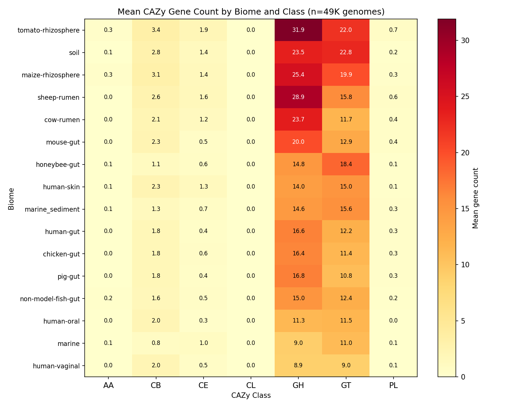
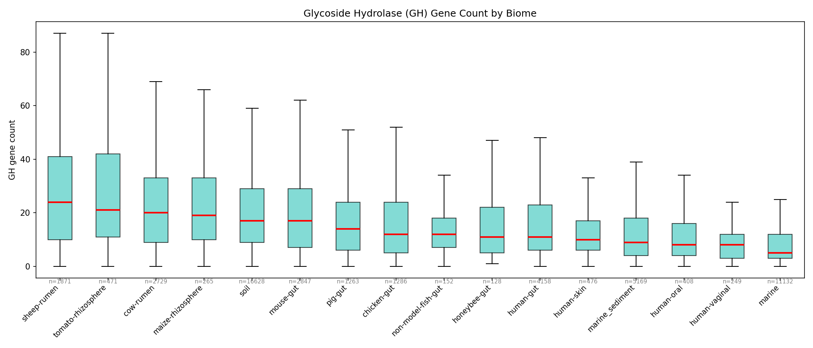
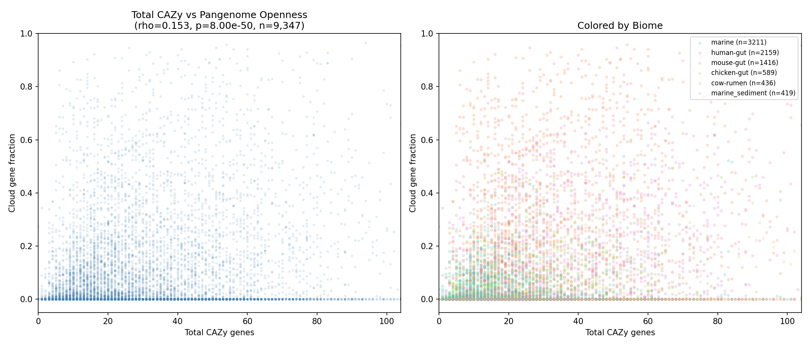
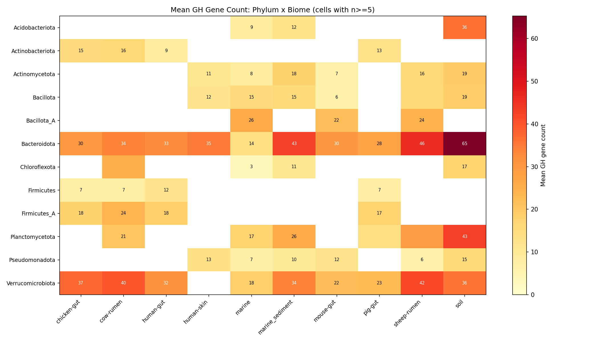
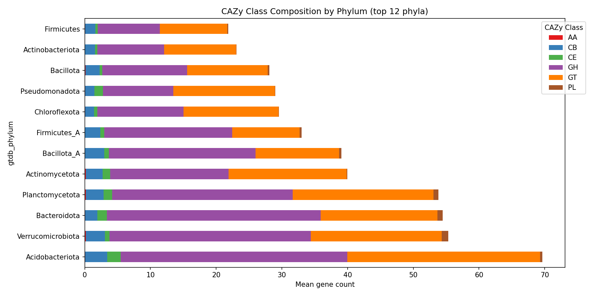

# Report: CAZyme Pangenome Ecology — Carbohydrate Metabolism Distribution Across 49K Bacterial Genomes

## Key Findings

### Finding 1: CAZyme class composition differs dramatically across biomes (H1 strongly supported)

All 6 non-zero CAZy classes show highly significant differences across 18 biomes (Kruskal-Wallis test, all p < 10^-150 after BH-FDR correction). Glycosyl transferases (GT) show the strongest signal (H = 12,524, p ≈ 0) followed by glycoside hydrolases (GH; H = 7,793, p ≈ 0). GH genes are 3–4× more abundant in fiber-rich environments — sheep-rumen (28.9 mean genes), tomato-rhizosphere (31.9), barley-rhizosphere (37.7), and soil (23.5) — compared to marine (9.0). GT genes are enriched in soil (22.8) and rhizosphere (20–25) relative to gut biomes (~11–13), consistent with exopolysaccharide and biofilm biosynthesis demands. Total CAZyme load spans 3.5× across biomes: barley-rhizosphere (68.5) to marine (21.9). The effect survives genome-size correction (KW on per-Mbp residuals) and within-phylum stratification (significant in all 5 top phyla: Pseudomonadota, Firmicutes_A, Bacteroidota, Bacillota_A, Actinomycetota).

*(Notebooks: 01_data_extraction.ipynb, 02_cazy_biome_composition.ipynb)*

### Finding 2: GT/GH ratio is a novel ecological biome indicator

The ratio of biosynthetic (GT) to degradative (GH) CAZymes captures the dominant carbohydrate metabolic strategy of each environment. Marine genomes are biosynthesis-dominant: 71% have GT > GH, consistent with investment in glycan biosynthesis for capsules, biofilms, and cell-surface structures in oligotrophic waters. Rumen genomes are degradation-dominant: 74% have GH > GT, reflecting the fiber-rich substrate environment. Soil genomes are balanced (GT ≈ GH), reflecting dual demands for polysaccharide degradation of plant-derived substrates and EPS biosynthesis for biofilm formation and soil particle adhesion.

*(Notebook: 02_cazy_biome_composition.ipynb)*

### Finding 3: CAZyme density correlates weakly with pangenome openness (H2 weakly supported)

At species level (n = 9,347 species with ≥3 genomes), total CAZyme density shows a modest positive correlation with pangenome cloud fraction (Spearman ρ = 0.153, p < 10^-50). However, genome_count is a severe confound for cloud_fraction (ρ = 0.913), meaning much of the apparent pangenome "openness" reflects sampling effort rather than biology. After partial correlation controlling for genome size and genome count, the correlation drops to ρ = 0.101. Within-phylum analysis reveals the signal is lineage-specific: Bacillota_A (ρ = 0.288, p < 10^-18), Bacteroidota (ρ = 0.147, p < 10^-8), and Firmicutes_A (ρ = 0.105, p < 10^-4) show significant correlations after BH correction, while the remaining 7/10 phyla tested do not. The H2 signal is real but modest and concentrated in carbohydrate-specialist lineages.

*(Notebook: 03_cazy_pangenome_openness.ipynb)*

### Finding 4: Bacteroidota in soil are extreme CAZyme specialists

The phylum × biome interaction reveals that Bacteroidota in soil carry a mean of 65.3 GH genes — the highest of any phylum-biome combination and 2.8× the Bacteroidota average across biomes. This is consistent with Bacteroidota's established role as primary polysaccharide degraders, but the magnitude of soil enrichment has not been previously quantified at genome-resolved scale. The stacked CAZy composition by phylum shows that Bacteroidota have the most GH-skewed profiles, while Pseudomonadota are relatively GT-enriched.

*(Notebook: 04_phylogenetic_distribution.ipynb)*

### Finding 5: No Isolate vs MAG systematic bias

Within-biome Mann-Whitney tests show no significant difference in total CAZyme counts between Isolate and MAG genome types (all Cohen's d < 0.21), validating that MAG incompleteness does not drive the observed biome patterns. This is an important methodological control given that 96% of the dataset consists of MAGs.

*(Notebook: 04_phylogenetic_distribution.ipynb)*

## Discoveries

- CAZyme class composition (particularly GH and GT) differs 3–4× across bacterial biomes at genome-resolved scale (49K genomes, 18 biomes), with the effect surviving genome-size and phylogenetic controls (KW H > 7,000, all p ≈ 0).
- The GT/GH ratio is a novel ecological indicator: marine genomes are biosynthesis-dominant (71% GT > GH) while rumen genomes are degradation-dominant (74% GH > GT).
- Bacteroidota in soil carry a mean of 65.3 GH genes per genome — 2.8× their cross-biome average — making them extreme carbohydrate degradation specialists in plant-associated environments.
- CAZyme density–pangenome openness correlation (H2) is real but modest (partial ρ = 0.101) and concentrated in Bacillota_A, Bacteroidota, and Firmicutes_A; genome_count confounds cloud_fraction (ρ = 0.913).

## Performance Notes

- `kescience_mgnify.genome_cazy` is a small table (~345K rows) that joins cleanly to `kescience_mgnify.genome` on `genome_id`; no performance issues.
- Pivoting 49K genomes × 7 CAZy classes to wide format completes in seconds with pandas — no Spark needed for the pivot step.
- `kescience_mgnify.pangenome_stats` is pre-computed; no need to aggregate from per-gene tables.

## Results

### Biome-Level CAZyme Distributions

| Biome | n Genomes | Mean Total CAZy | Mean GH | Mean GT | Mean Length (Mbp) | % MAG |
|-------|-----------|----------------|---------|---------|-------------------|-------|
| barley-rhizo. | 74 | 68.5 | 37.7 | 24.6 | 4.4 | 67.6 |
| tomato-rhizo. | 471 | 60.2 | 31.9 | 22.0 | 4.1 | 95.1 |
| soil | 16,628 | 50.7 | 23.5 | 22.8 | 3.9 | 99.1 |
| sheep-rumen | 1,871 | 49.4 | 28.9 | 15.8 | 2.2 | 99.9 |
| cow-rumen | 2,729 | 39.1 | 23.7 | 11.7 | 2.3 | 100.0 |
| mouse-gut | 2,847 | 36.2 | 20.0 | 12.9 | 2.5 | 95.4 |
| honeybee-gut | 128 | 35.1 | 14.8 | 18.4 | 2.7 | 74.2 |
| human-skin | 476 | 32.8 | 14.0 | 15.0 | 2.6 | 88.7 |
| marine-sed. | 5,169 | 32.5 | 14.6 | 15.6 | 2.9 | 95.1 |
| human-gut | 4,158 | 31.4 | 16.6 | 12.2 | 2.4 | 80.3 |
| chicken-gut | 1,286 | 30.5 | 16.4 | 11.4 | 2.3 | 100.0 |
| pig-gut | 1,263 | 30.1 | 16.8 | 10.8 | 2.1 | 100.0 |
| zebrafish-fecal | 67 | 41.5 | 19.3 | 18.2 | 4.0 | 100.0 |
| non-model-fish | 152 | 30.0 | 15.0 | 12.4 | 2.3 | 100.0 |
| maize-rhizo. | 265 | 50.4 | 25.4 | 19.9 | 3.9 | 94.3 |
| human-oral | 408 | 25.2 | 11.3 | 11.5 | 1.8 | 100.0 |
| marine | 11,132 | 21.9 | 9.0 | 11.0 | 2.4 | 99.5 |
| human-vaginal | 249 | 20.5 | 8.9 | 9.0 | 1.7 | 100.0 |

### Kruskal-Wallis Test Results (Biome Effect on CAZy Classes)

| CAZy Class | H Statistic | p-value (BH-adjusted) |
|------------|-------------|----------------------|
| GT | 12,524 | ≈ 0 |
| GH | 7,793 | ≈ 0 |
| CB | 7,527 | ≈ 0 |
| CE | 2,584 | ≈ 0 |
| PL | 893 | 1.1 × 10^-180 |
| AA | 767 | 8.3 × 10^-154 |
| CL | — | All zeros (excluded) |

### Within-Phylum CAZy–Openness Correlations

| Phylum | n Species | ρ (Spearman) | p (BH-adj) | Significant? |
|--------|-----------|-------------|------------|--------------|
| Bacillota_A | 939 | 0.288 | 2.2 × 10^-18 | Yes |
| Bacteroidota | 1,618 | 0.147 | 1.3 × 10^-8 | Yes |
| Firmicutes_A | 1,625 | 0.105 | 7.8 × 10^-5 | Yes |
| Pseudomonadota | 1,689 | −0.013 | 0.74 | No |
| Actinomycetota | 385 | −0.094 | 0.13 | No |
| Firmicutes | 364 | 0.065 | 0.30 | No |
| Actinobacteriota | 335 | 0.071 | 0.30 | No |
| Thermoplasmatota | 289 | 0.112 | 0.13 | No |
| Bacillota | 238 | 0.022 | 0.74 | No |
| Verrucomicrobiota | 215 | −0.024 | 0.74 | No |

## Interpretation

### Biological Significance

The strong biome signal in CAZyme composition (H1) reflects the fundamental constraint that carbohydrate substrate availability imposes on bacterial genomes. Fiber-rich environments (rumen, soil, rhizosphere) select for genomes with extensive glycoside hydrolase (GH) repertoires for polysaccharide degradation, while oligotrophic marine environments produce genomes with relatively more glycosyl transferases (GT) for biosynthesis of protective surface structures (capsules, exopolysaccharides). The GT/GH ratio emerges as a simple but informative ecological metric: it captures whether a genome is primarily a carbohydrate consumer (GH-dominant) or producer (GT-dominant).

The weak but real correlation between CAZyme density and pangenome openness (H2) suggests that CAZymes are part of the accessory gene pool in specific lineages — particularly Bacillota_A and Bacteroidota, both known carbohydrate specialists. However, the severe genome_count confound (ρ = 0.913 between genome_count and cloud_fraction) means that pangenome "openness" in this dataset is largely a sampling artifact, limiting biological interpretation.

### Literature Context

- **Biome-specific CAZyme enrichment** aligns with López-Sánchez et al. (2024), who found soil MAGs contain more abundant and diverse CAZyme content than marine sediment MAGs from the same taxonomic classes (Bacteroidia, Gammaproteobacteria, Alphaproteobacteria). Our finding extends this from 37 sediment sites to 18 biomes at 49K-genome scale. [DOI](https://doi.org/10.1007/s11274-024-03884-5)

- **Polymeric carbohydrate niche separation** is consistent with Sun et al. (2023), who showed that CAZyme gene compositions differ significantly between free-living and particle-associated marine bacteria, reflecting glycan niche separation. Our biome-level analysis extends this within-marine observation to a pan-environmental framework. [DOI](https://doi.org/10.3389/fmicb.2023.1180321)

- **Bacteroidota as polysaccharide degradation specialists** is well established. Huang et al. (2023) demonstrated Bacteroidota's successional role in straw polymer decomposition in paddy soil, with the highest proportion of total GHs and the most CAZyme gene clusters. Nweze et al. (2024) found Bacteroidota were the primary agents of complex carbon degradation in arthropod gut microbiomes. Our finding of 65.3 mean GH per genome in soil Bacteroidota quantifies this specialization at pan-bacterial scale for the first time. [DOI](https://doi.org/10.1186/s40793-023-00533-6), [DOI](https://doi.org/10.1186/s40168-023-01731-7)

- **CAZyme diversity in gut Bacteroidales** was characterized by Pudlo et al. (2022), who showed wide variation in carbohydrate utilization profiles across 354 gut Bacteroidetes isolates, with CAZyme repertoire diversity driving within-species phenotypic diversification. Our analysis extends from a single-clade, single-biome study to pan-bacterial, multi-biome comparison.

- **Pangenome accessory genes and niche adaptation**: White et al. (2022) found that different selection pressures act on core and accessory genomes of Bacillus cereus clades to drive ecological divergence. Our H2 result — that CAZyme density correlates with cloud gene fraction only in carbohydrate-specialist phyla — is consistent with CAZymes being part of the niche-adaptive accessory genome in specific lineages rather than a universal pattern. [DOI](https://doi.org/10.1111/mec.16490)

- **Community-level CAZyme comparison**: Andrade et al. (2017) compared freshwater and soil CAZyme metagenomes in the Caatinga biome, finding environment-specific differences. Our study provides the first genome-resolved (not community-level) comparison across 18 biomes at 49K-genome scale.

### Novel Contribution

1. **Scale**: This is the first genome-resolved analysis of CAZyme class composition across 18 biomes at 49K-genome scale. Prior studies were single-biome (Sun et al. 2023, marine), single-clade (Pudlo et al. 2022, gut Bacteroidales), or community-level metagenomes (Andrade et al. 2017).

2. **GT/GH ratio as ecological metric**: The observation that marine genomes are predominantly biosynthesis-oriented (71% GT > GH) while rumen genomes are degradation-oriented (74% GH > GT) has not been reported previously. This simple ratio captures the carbohydrate metabolic strategy of an environment.

3. **Quantification of Bacteroidota soil specialization**: While Bacteroidota are known polysaccharide degraders, the magnitude of their soil GH enrichment (65.3 mean genes, 2.8× their cross-biome average) has not been quantified at genome-resolved scale.

4. **Pangenome openness confound identification**: The severe genome_count → cloud_fraction correlation (ρ = 0.913) is a methodological caution for all pangenome openness studies using MGnify-scale catalogs.

### Limitations

- **Class-level resolution only**: The `kescience_mgnify.genome_cazy` table provides 7 top-level CAZy classes (GH, GT, PL, CE, AA, CB, CL), not individual CAZy families (GH1, GH2, etc.). Family-level analysis would reveal finer substrate specificity patterns but requires the `arkinlab_dbcan` database, which has only 1,161 MGnify genomes — 2.3% of the catalog.
- **Biome sampling bias**: Soil (34%) and marine (23%) dominate the dataset. Rare biomes (barley-rhizosphere n=74, zebrafish-fecal n=67) have limited statistical power.
- **MAG completeness**: 96% of genomes are MAGs. While we found no systematic Isolate-vs-MAG bias within biomes (Cohen's d < 0.21), incomplete MAGs may still undercount CAZymes in absolute terms.
- **Pangenome openness confound**: cloud_fraction is strongly driven by genome_count (ρ = 0.913), limiting biological interpretation of H2. Species with few sequenced genomes appear "closed" regardless of true gene flux.
- **No phylogenetic regression**: We controlled for phylogeny via within-phylum stratification (a non-parametric approach) rather than formal phylogenetic regression (e.g., PGLS), which would require a resolved species tree for 9,347 species.
- **Cross-sectional design**: CAZyme profiles are compared across biomes, not tracked within lineages that colonize new environments. Causal inference (environment shapes CAZyme repertoire vs. CAZyme repertoire determines environment) is not possible from this data alone.

## Data

### Sources

| Collection | Tables Used | Purpose |
|------------|-------------|---------|
| `kescience_mgnify` | `genome`, `genome_cazy`, `pangenome_stats` | Genome metadata, CAZy class counts, pangenome statistics for 49K genomes across 18 biomes |

### Generated Data

| File | Rows | Description |
|------|------|-------------|
| `data/genome_cazy_profiles.tsv` | 49,374 | Wide-format genome-level CAZy profiles with metadata (7 classes + total_cazy + cazy_density) |
| `data/biome_summary.tsv` | 18 | Per-biome summary statistics (n_genomes, mean CAZy counts, genome size, % MAG) |
| `data/pangenome_stats.tsv` | 10,242 | Species-level pangenome statistics (core/shell/cloud gene counts, fractions) |
| `data/kruskal_wallis_results.tsv` | 7 | KW test results for biome effect on each CAZy class |
| `data/species_cazy_pangenome.tsv` | 9,348 | Merged species-level CAZy means + pangenome openness metrics |
| `data/phylum_cazy_openness_corr.tsv` | 10 | Within-phylum Spearman correlations (total_cazy vs cloud_fraction) |

## Supporting Evidence

### Notebooks

| Notebook | Purpose |
|----------|---------|
| `01_data_extraction.ipynb` | Extract genome-level CAZy profiles from `kescience_mgnify`, pivot to wide format, characterize biome/phylum/genome_type distributions, extract pangenome stats |
| `02_cazy_biome_composition.ipynb` | Test H1: KW tests per CAZy class by biome, genome-size correction, within-phylum controls, GT/GH ratio analysis, heatmap and boxplot figures |
| `03_cazy_pangenome_openness.ipynb` | Test H2: Merge species-level CAZy with pangenome stats, raw and partial Spearman correlations, within-phylum breakdown, scatter plot |
| `04_phylogenetic_distribution.ipynb` | Phylum × biome GH interaction heatmap, stacked CAZy composition by phylum, Isolate vs MAG bias control |

### Figures

| Figure | Description |
|--------|-------------|
| `cazy_biome_heatmap.png` | Mean CAZy gene count by biome × class (7 classes × 18 biomes) |
| `gh_by_biome_boxplot.png` | GH gene count distribution boxplot across 18 biomes |
| `cazy_vs_openness.png` | Scatter plot of total CAZy density vs pangenome cloud fraction, colored by biome |
| `gh_phylum_biome_heatmap.png` | Phylum × biome GH interaction heatmap (12 phyla × 10 biomes) |
| `cazy_phylum_stacked.png` | Stacked bar chart of CAZy class composition by GTDB phylum |

## Future Directions

1. **Family-level CAZy analysis**: As the `arkinlab_dbcan` database grows to cover more MGnify genomes, repeat this analysis at CAZy family level (GH1, GH2, etc.) to identify specific substrate degradation pathways enriched in each biome.
2. **Phylogenetic regression**: Apply PGLS or phylogenetic mixed models with a GTDB species tree to formally test whether biome effects on CAZyme composition are independent of phylogeny.
3. **Longitudinal pangenome analysis**: Track CAZyme gene gain/loss across closely related species that colonize different biomes to distinguish adaptive acquisition from ancestral retention.
4. **Integration with fitness data**: Cross-reference CAZyme profiles with fitness data from `kescience_fitnessbrowser` to identify which CAZyme genes confer measurable fitness advantages in specific growth conditions.
5. **GT/GH ratio validation**: Test whether the GT/GH ratio predicts biome of origin in a held-out set, and whether it correlates with measured EPS production or polysaccharide degradation phenotypes.

## References

- Pudlo NA et al. (2022). "Phenotypic and genomic diversification in complex carbohydrate-degrading human gut bacteria." *mSystems* 7(1):e00947-21. [DOI](https://doi.org/10.1128/msystems.00947-21)
- Sun CC et al. (2023). "Polymeric carbohydrates utilization separates microbiomes into niches." *Front Microbiol* 14:1180321. [DOI](https://doi.org/10.3389/fmicb.2023.1180321)
- Andrade AC et al. (2017). "Diversity of microbial carbohydrate-active enzymes (CAZYmes) associated with freshwater and soil samples from Caatinga biome." *Genet Mol Biol* 40(1 suppl 1):167-174.
- López-Sánchez R et al. (2024). "Metagenomic analysis of carbohydrate-active enzymes and their contribution to marine sediment biodiversity." *World J Microbiol Biotechnol* 40(3):95. [DOI](https://doi.org/10.1007/s11274-024-03884-5)
- Huang J et al. (2023). "Successional action of Bacteroidota and Firmicutes in decomposing straw polymers in a paddy soil." *Environ Microbiome* 18(1):76. [DOI](https://doi.org/10.1186/s40793-023-00533-6)
- Nweze JE et al. (2024). "Functional similarity, despite taxonomical divergence in the millipede gut microbiota, points to a common trophic strategy." *Microbiome* 12(1):16. [DOI](https://doi.org/10.1186/s40168-023-01731-7)
- White H et al. (2022). "Signatures of selection in core and accessory genomes indicate different ecological drivers of diversification among Bacillus cereus clades." *Mol Ecol* 31(13):3584-3597. [DOI](https://doi.org/10.1111/mec.16490)
- Gurbich TA et al. (2023). "MGnify genomes: a resource for biome-specific microbial genome catalogues." *J Mol Biol* 435(14):168016.
- Almeida A et al. (2021). "A unified catalog of 204,938 reference genomes from the human gut microbiome." *Nat Biotechnol* 39:105-114.
- Yan Y et al. (2026). "dbCAN-HGM: CAZyme gene clusters in gut microbiomes of diverse human populations." *Nucleic Acids Res* 54(D1):D555-D563. [DOI](https://doi.org/10.1093/nar/gkaf1185)
