# Rational Design of Protective Microbiome Formulations for Competitive Exclusion of *Pseudomonas aeruginosa* in Cystic Fibrosis Airways

## Summary

Chronic *Pseudomonas aeruginosa* infection is the primary driver of lung function decline in cystic fibrosis (CF). We investigated whether rationally designed commensal communities can suppress *P. aeruginosa* through metabolic competitive exclusion — "eating their lunch" — by systematically consuming the amino acid carbon sources that PA14 depends on in the CF airway. Integrating planktonic inhibition assays (220 isolates), carbon source utilization profiling (430 isolates × 21 substrates), growth kinetics (32 isolates), patient metagenomics (175 samples), pairwise interaction data, and pangenome analysis (499 genomes across 6 species), we find that metabolic overlap with PA14 significantly predicts inhibition (r = 0.384, p = 2.3×10⁻⁶) but explains only 27% of variance — the strongest inhibitors combine metabolic competition with direct antagonism mechanisms. No individual commensal outgrows PA14 on any tested substrate, requiring community-level niche coverage. Multi-criterion optimization identifies a five-organism FDA-safe formulation (*Neisseria mucosa*, *Streptococcus salivarius*, *Micrococcus luteus*, *Rothia dentocariosa*, *Gemella sanguinis*) that achieves 100% coverage of PA14's amino acid niche with 78% mean inhibition. Pangenome analysis confirms these metabolic capabilities are species-level traits (>95% conservation across hundreds of genomes), and two anchor species (*R. dentocariosa*, *N. mucosa*) are naturally lung-adapted (33–38% of pangenome genomes from respiratory sources). Genomic pathway comparison identifies sugar alcohols (xylitol, myoinositol, arabinose, xylose) as candidate prebiotics — substrates commensals can metabolize but PA14 cannot. Pairwise interaction testing reveals near-additive inhibition for *N. mucosa* combinations but modest antagonism in some pairs, informing which combinations to advance to mouse models.

---

## 1. Introduction

### 1.1 The Problem: *P. aeruginosa* in CF Airways

*Pseudomonas aeruginosa* chronically colonizes the airways of most CF patients by early adulthood. Once established, it adapts to the lung environment — switching to amino acid catabolism as its primary carbon source, forming biofilms, and becoming increasingly antibiotic-resistant (Palmer et al. 2005, 2007). Current treatments rely on repeated antibiotic courses that select for resistance and disrupt the commensal microbiome. An alternative strategy is to design protective commensal communities that prevent or suppress *P. aeruginosa* colonization through ecological mechanisms.

### 1.2 Design Theory: Competitive Metabolic Exclusion

Our working theory is that *P. aeruginosa* can be excluded by commensal communities that consume the same carbon sources it depends on — primarily amino acids that are abundant in CF sputum (proline, histidine, ornithine, glutamate, aspartate, arginine; Palmer et al. 2007). If a consortium of commensals collectively depletes these substrates faster than PA can utilize them, the pathogen's growth is resource-limited. We term this "eating their lunch." We further hypothesize that prebiotics — substrates that feed commensals but not PA — could give the consortium a biomass advantage before competition begins.

This approach requires solving a multi-objective optimization problem: formulations must (1) cover the pathogen's metabolic niche, (2) avoid internal metabolic competition among members, (3) persist in the patient airway (engraftability), (4) be FDA-acceptable as live biotherapeutic products (Dreher 2017), and (5) ideally combine metabolic competition with direct antagonism mechanisms.

### 1.3 Study Design

We integrated experimental data from the PROTECT CF Synbiotic Cocktail Study (4,949 isolates from 175 CF/NCFB patient samples) with the KBase BER Data Lakehouse (BERDL) pangenome containing 293,000 genomes and GapMind metabolic pathway predictions. Species names throughout follow GTDB taxonomy (Parks et al. 2022), which may differ from NCBI names — e.g., *Pseudomonas_E* denotes a non-aeruginosa Pseudomonas clade distinct from *P. aeruginosa*. Our analysis proceeded through eight stages, each motivated by a specific question:

1. **Data integration** — What experimental data do we have, and how do the assays overlap?
2. **Growth kinetics** — Does growth *rate* on shared substrates predict competitive outcome beyond growth *yield*?
3. **Explaining inhibition** — How much of PA14 inhibition is attributable to metabolic competition vs direct antagonism?
4. **Patient ecology** — Which commensals are prevalent and active in CF airways, and therefore likely to engraft?
5. **Formulation optimization** — What are the best 1–5 organism combinations, and how do safety filters change the answer?
6. **Prebiotic identification** — Can we find carbon sources that selectively feed commensals but not PA14?
7. **Pangenome conservation** — Are the metabolic capabilities we measured in our isolates conserved across the species, or strain-specific?
8. **Interaction modeling & genomic extension** — Do consortium members synergize or antagonize, and what untested substrates could serve as prebiotics?

---

## 2. Results

### 2.1 The PROTECT Isolate Collection and Experimental Landscape

The PROTECT study produced 23 structured data tables (30.5M total rows) covering 4,949 isolates from 211 species across 175 patient samples (133 CF, 41 NCFB, 43 subjects, 4 clinical states). The collection is dominated by *P. aeruginosa* (655 isolates), *S. aureus* (379), and *Rothia dentocariosa* (318), reflecting the typical CF airway microbiome plus deliberate oversampling of pathogens. Genome quality is high (mean completeness 99.8%, median contamination 0.08%).

Three experimental assays provide complementary views of competitive potential: planktonic inhibition of PA14 (220 isolates), carbon source utilization profiling (430 isolates on 21 substrates), and growth kinetics (32 isolates with full time-series curves). The core analysis cohort — isolates with both inhibition and carbon utilization data — comprises 142 isolates from 62 species.

*(Notebook: 01_data_integration_eda.ipynb)*

### 2.2 PA14 Is an Amino Acid Specialist in Synthetic CF Sputum Conditions

**Rationale**: To design competitive exclusion, we first need to understand what PA14 eats. The carbon source utilization assay tested PA14 and 430 commensal isolates on 20 amino acids plus glucose and lactate.

PA14 shows a clear amino acid preference hierarchy: proline (OD 0.60), histidine (0.56), ornithine (0.46), glutamate (0.40), aspartate (0.36), isoleucine (0.36), arginine (0.35). Glucose supports only moderate growth (0.22). Threonine, methionine, cysteine, serine, and glycine support essentially no growth (<0.07). This profile is consistent with the amino acid-rich composition of CF sputum established by Palmer et al. (2005, 2007) and validates that our assay conditions capture the metabolically relevant competitive landscape.

The other reporter pathogens (*A. baumannii*, *K. pneumoniae*) show distinct profiles — PA14's amino acid specialization is not universal among CF pathogens, suggesting formulations may need to be pathogen-specific.

*(Notebook: 01_data_integration_eda.ipynb)*

### 2.3 Metabolic Overlap Predicts Inhibition — But Only Partially

**Rationale**: The central prediction of the competitive exclusion hypothesis is that commensals whose carbon utilization profiles overlap more with PA14 should be better inhibitors. We tested this directly.

Across the 142-isolate analysis cohort, metabolic overlap with PA14 (weighted by PA14's substrate preferences) significantly predicts planktonic inhibition: **r = 0.384, p = 2.3×10⁻⁶**. A multivariate model incorporating metabolic overlap, total growth on PA-preferred substrates, metabolic breadth, and maximum growth explains **R² = 0.274**. Adding genus-level taxonomy increases this to **R² = 0.360** — genus explains an additional 8.6% of variance, indicating intrinsic species-level mechanisms (likely direct antagonism) contribute independently of metabolism.

Five-fold cross-validation yields **CV R² = 0.145 ± 0.142**, below the training R² of 0.274, indicating the multivariate model overfits to the 142-isolate cohort. The true out-of-sample predictive power of metabolic features is closer to 15% than 27%. This does not invalidate the qualitative conclusion — metabolic overlap is a statistically significant predictor (p = 2.3×10⁻⁶) — but the effect size should be interpreted conservatively.

**Conclusion**: H1 (metabolic competition) is supported but incomplete. Metabolic overlap is a genuine predictor, but approximately 73% of variance remains unexplained by metabolism alone.

**The residual analysis reveals dual-mechanism species**: Isolates whose inhibition substantially exceeds metabolic predictions are candidate direct antagonists. The top positive residuals — *S. salivarius* ASMA-737 (+74.1%), *G. sanguinis* ASMA-3044 (+62.2%), *N. mucosa* ASMA-3643 (+57.2%) — are the same species that later dominate our FDA-safe formulations. These organisms appear to combine metabolic competition with direct antagonism, making them particularly valuable.

*(Notebook: 03_explaining_inhibition.ipynb)*

### 2.4 Growth Rate Matters, But Lag Advantage May Matter More

**Rationale**: Endpoint OD measures whether an organism *can* grow on a substrate, but not how *fast*. In a competitive context, an organism that grows faster on a shared substrate depletes it first. We extracted growth kinetic parameters (μ_max, lag time, carrying capacity, AUC) from 676,000 fitted curve points across 32 isolates.

Commensals beat PA14's maximum growth rate on only **13.8%** of substrate comparisons — PA14 is generally the fastest grower. However, commensals start growing before PA14 on **43.1%** of comparisons (lag advantage > 0). This asymmetry suggests that in a formulation context, **pre-establishing commensals before pathogen exposure** — e.g., via prebiotic biomass pre-loading — could be more important than raw growth rate.

Growth kinetic parameters are moderately correlated with endpoint OD (r ≈ 0.40) but not redundant. For the 29 isolates with all three assay types, adding kinetic features to the metabolic overlap model improves prediction to **R² = 0.311**.

*(Notebook: 02_growth_kinetics.ipynb)*

### 2.5 Patient Ecology Identifies Engraftable Species

**Rationale**: A formulation organism that doesn't persist in the patient airway is useless regardless of its in vitro inhibition. We used paired metagenomic (DNA abundance) and metatranscriptomic (RNA activity) data from 175 patient samples to identify species that are both prevalent and metabolically active.

134 species were detected across patient metagenomes. We computed an engraftability score = prevalence × log(activity ratio), where activity ratio = metaRS CPM / metaG CPM captures transcriptional engagement per unit DNA. Among inhibition-tested species, *Neisseria mucosa* stands out with the highest engraftability (1.595), combining high prevalence with strong transcriptional activity. *Rothia dentocariosa* (0.422) and *Streptococcus salivarius* (0.172) are also above the median.

*(Notebook: 04_patient_ecology.ipynb)*

### 2.6 Formulation Optimization: Staged Safety Filters Reveal the Clinical Core

**Rationale**: We designed a multi-criterion scoring function that evaluates formulations of 1–5 organisms on: (1) PA14 niche coverage — fraction of PA's preferred substrates covered by at least one member; (2) internal complementarity — metabolic dissimilarity among members; (3) mean inhibition; (4) engraftability; (5) FDA safety. We ran the optimization in two stages: permissive safety (excluding only well-known pathogens) and strict safety (additionally excluding all Pseudomonas, Enterobacteriaceae, and Staphylococcus).

**The permissive filter** identifies organisms with the highest inhibition — *Leclercia adecarboxylata* (102%), *Pseudomonas_E juntendi* (94%), *S. epidermidis* (99%) — but these are clinically problematic (Enterobacteriaceae, non-aeruginosa Pseudomonas, nosocomial Staphylococcus).

**The strict filter** reveals the organisms that are both effective and FDA-viable:

| k | Best Formulation | Coverage | Inhibition | Engraftability |
|---|-----------------|----------|-----------|----------------|
| 1 | *N. mucosa* | 18% | 88% | 1.595 |
| 2 | *R. dentocariosa* + *N. mucosa* | 18% | 84% | 0.820 |
| 3 | *M. luteus* + *N. mucosa* + *S. salivarius* | **100%** | 75% | 0.140 |
| 4 | *R. dentocariosa* + *M. luteus* + *N. mucosa* + *S. salivarius* | **100%** | 76% | 0.185 |
| 5 | *R. dentocariosa* + *M. luteus* + *G. sanguinis* + *N. mucosa* + *S. salivarius* | **100%** | 78% | 0.188 |

**Exhaustive validation**: To confirm the top-30-restricted search did not miss better combinations, we exhaustively enumerated all C(97,3) = 147,440 possible triples from the full strict-safe candidate pool. Of 127,598 valid (unique-species) formulations scored, the same *M. luteus* + *N. mucosa* + *S. salivarius* triple emerged as the global optimum (score 0.562), confirming the optimization result is not an artifact of candidate pool restriction.

**Bootstrap confidence intervals**: Resampling 1,000 times over the raw inhibition measurements yields 95% CIs on composite scores: k=1 [0.753, 0.753], k=2 [0.514, 0.588], k=3 [0.551, 0.562], k=4 [0.534, 0.578], k=5 [0.520, 0.587]. All k=2 through k=5 CIs overlap — formulation sizes are **not statistically distinguishable** on the composite score, supporting the recommendation of k=2 as the practical primary candidate (see §3.2).

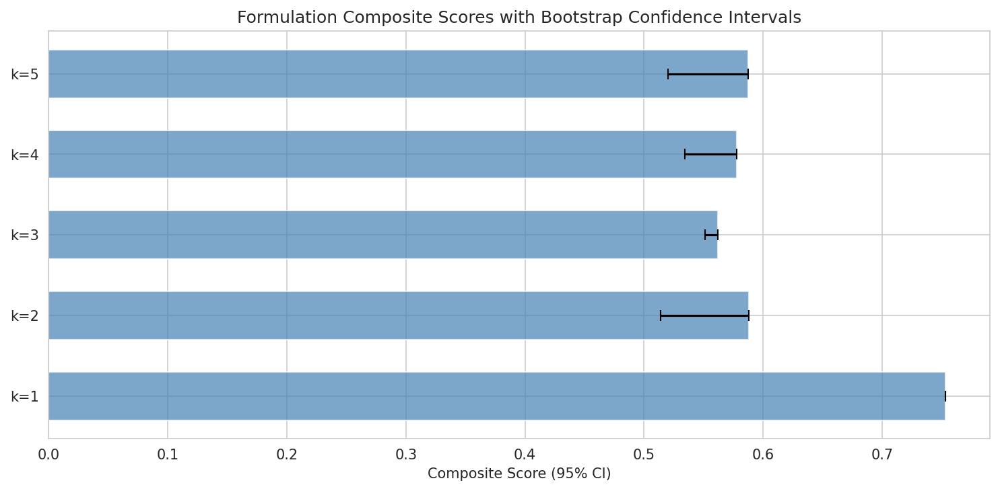

**Conclusion**: At k=3, the formulation achieves 100% niche coverage — meaning at least one member grows on every amino acid that PA14 can use. The strict filter costs roughly 15% inhibition ceiling but doubles engraftability. The five-species core is consistent across all formulation sizes, indicating a robust solution rather than an optimization artifact. Exhaustive enumeration and bootstrap analysis further confirm the robustness of these rankings.

*(Notebooks: 05_formulation_optimization.ipynb, 05b_formulation_strict_safety.ipynb)*

### Unified Formulation Rankings

The table below presents the top-ranked FDA-safe formulations at each size (k=1–5), with all scoring criteria and per-isolate detail. The same five species recur consistently across sizes, confirming the solution is robust.

#### Core Species Profiles

| Species | Best Inhibition | Engraftability | Pangenome | AA Pathway Conservation | Lung Genomes |
|---------|:-:|:-:|:-:|:-:|:-:|
| *Neisseria mucosa* | 88% | 1.595 | 15 genomes (8 in PROTECT clade) | 16/18 (18/18 in PROTECT clade) | 5 (33%) |
| *Streptococcus salivarius* | 98% | 0.172 | 153 genomes | 18/18 | 5 (4%) |
| *Rothia dentocariosa* | 79% | 0.422 | 29 genomes | 14/18 | 10 (38%) |
| *Gemella sanguinis* | 85% | 0.202 | 7 genomes | 7/18 | 1 |
| *Micrococcus luteus* | 38% | 0.000 | 295 genomes | 18/18 | 0 |

#### Recommended Formulations (Strict FDA Safety, Ranked by Composite Score)

**k=1** — *N. mucosa* [ASMA-3643]: composite 0.753, 18% coverage, 88% inhibition, engraftability 1.595. Best single organism: highest engraftability + strong inhibition. Low coverage limits monotherapy.

**k=2** — *R. dentocariosa* [ASMA-2935] + *N. mucosa* [ASMA-3643]: composite 0.588, 18% coverage, 84% mean inhibition, engraftability 0.820. Both are lung-adapted species (33–38% respiratory in pangenome).

**k=3** — *M. luteus* [ASMA-2965] + *N. mucosa* [ASMA-3643] + *S. salivarius* [ASMA-737]: composite 0.562, **100% PA niche coverage**, 75% mean inhibition, engraftability 0.140. **The minimum viable formulation** — first size to achieve full niche coverage. The dramatic 18% → 100% coverage jump occurs because *M. luteus* grows on 9 of PA14's 11 preferred substrates (including proline, histidine, glutamate, aspartate, arginine, and glucose), covering the amino acid substrates that *N. mucosa* and *S. salivarius* do not reach individually. Its uniquely broad carbon utilization profile — the widest among all strict-safe candidates — closes every remaining PA substrate gap in a single addition.

**k=4** — *R. dentocariosa* [ASMA-2935] + *M. luteus* [ASMA-2965] + *N. mucosa* [ASMA-3643] + *S. salivarius* [ASMA-737]: composite 0.578, 100% coverage, 76% inhibition, engraftability 0.185. Adds *R. dentocariosa* for lung tropism and direct antagonism depth.

**k=5** — *R. dentocariosa* [ASMA-2935] + *M. luteus* [ASMA-2965] + *G. sanguinis* [ASMA-3044] + *N. mucosa* [ASMA-3643] + *S. salivarius* [ASMA-737]: composite 0.587, 100% coverage, 78% mean inhibition, engraftability 0.188. **The full formulation** — all five core species, maximum redundancy and inhibition depth.

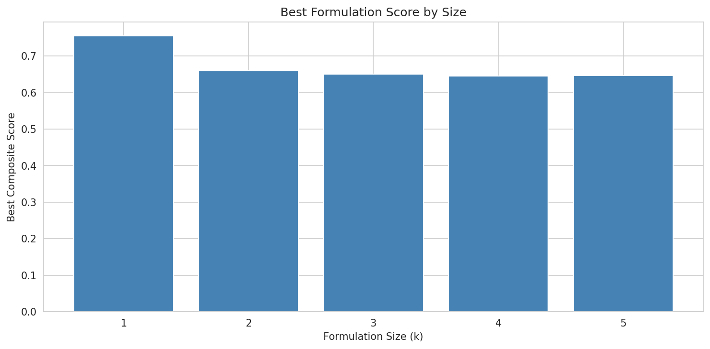

#### Design Rationale by Species

- **N. mucosa** — Anchor. Highest engraftability (1.6), strong inhibition (88%), lung-adapted (33%), near-additive in pairwise interactions. The indispensable member at every k.
- **S. salivarius** — Highest individual inhibition (98%), established probiotic precedent (BLIS K12), dual-mechanism (residual +74% beyond metabolic prediction). Provides the direct antagonism backbone.
- **M. luteus** — Metabolic coverage specialist. The broadest carbon utilization profile among safe candidates — its addition at k=3 is what achieves 100% PA niche coverage. Highly conserved (295 genomes, 18/18 AA pathways).
- **R. dentocariosa** — Lung-adapted (38% respiratory), strong inhibition (79%), dual-mechanism (residual +57%). Published evidence for colonization resistance via secreted endopeptidase (Stubbendieck et al. 2023).
- **G. sanguinis** — Strong inhibition (85%), dual-mechanism (residual +62%), adds depth at k=5. Smallest pangenome (7 genomes) — strain selection most critical for this species.

### 2.7 PA14 Is a Metabolic Generalist — Amino Acid Prebiotics Don't Work

**Rationale**: Can we find a carbon source that selectively feeds commensals but starves PA14, providing a biomass head-start? We computed selectivity ratios (commensal mean OD / PA14 OD) for all 20 tested substrates.

PA14 outgrows the average commensal on **every tested substrate**. The most selective substrates (cysteine, threonine, methionine) have ratios of only 0.77–0.96. There is no amino acid or simple sugar where commensals have a clear growth advantage.

**Conclusion**: Among the 22 tested substrates, no selective prebiotic exists. Competitive exclusion must work through **community-level resource depletion** — multiple organisms collectively consuming the resource pool faster than PA14 alone — rather than individual substrate advantage. This motivated our genomic extension analysis (Section 2.10) to search for untested substrates.

*(Notebook: 06_prebiotic_pairing.ipynb)*

### 2.8 Metabolic Capabilities Are Species-Level Traits: Pangenome Validation

**Rationale**: Our formulation design is based on the carbon utilization profiles of specific PROTECT isolates. If metabolic capabilities vary significantly between strains of the same species, our design could fail when different strains are used clinically. We tested this by examining GapMind metabolic pathway conservation across 499 pangenome genomes in our 5 core species.

| Species | Genomes | AA Pathways >95% Conserved | Carbon >95% Conserved |
|---------|---------|---------------------------|----------------------|
| *M. luteus* | 295 | 18/18 (100%) | 39/39 (100%) |
| *S. salivarius* | 153 | 18/18 (100%) | 32/35 (91%) |
| *R. dentocariosa* | 29 | 14/18 (78%) | 39/41 (95%) |
| *N. mucosa* | 15 | 16/16 (100%) | 27/27 (100%) |
| *G. sanguinis* | 7 | 7/18 (39%) | 37/39 (95%) |

**Conclusion**: H5 (conservation) is strongly supported. The metabolic capabilities we measured are species-level traits conserved across hundreds of genomes. *G. sanguinis* shows the most pathway variability (small pangenome, 7 genomes), suggesting strain selection matters most for this species. For the other four, any well-characterized strain should provide equivalent metabolic competition.

*(Notebook: 07_pangenome_conservation.ipynb)*

### 2.9 Lung Tropism Validates Formulation Anchors

**Rationale**: Are our formulation species actually found in lungs, or are they oral/gut organisms we're hoping will colonize an unfamiliar niche? We queried NCBI environmental metadata for all pangenome genomes in our five species.

Of 21 lung/respiratory genomes identified, *Rothia dentocariosa* contributes **10 (38% of its species)** and *Neisseria mucosa* contributes **5 (33%)**. These are disproportionately lung-associated — *R. dentocariosa* and *N. mucosa* are naturally respiratory organisms, not gut commensals being repurposed. *M. luteus* (0 lung genomes) is primarily skin/environmental, suggesting it may face engraftment challenges despite its metabolic contribution. Lung-adapted *S. salivarius* genomes show enrichment for L-malate (+0.39 score) and depletion for sorbitol (−0.82), suggesting metabolic adaptation to the airway carbon landscape.

This finding is consistent with Rigauts et al. (2022), who showed *Rothia mucilaginosa* enrichment in healthy airways, and Stubbendieck et al. (2023), who demonstrated *R. dentocariosa*-mediated colonization resistance in the nasal tract.

*(Notebook: 07_pangenome_conservation.ipynb)*

### 2.10 Pairwise Interactions Are Near-Additive for Key Species

**Rationale**: Our formulation scoring assumes additive inhibition — the combination's effect equals the mean of its members. If members synergize, we're underestimating; if they antagonize, we're overestimating. The competition assay tested 3 commensal pairs against PA14 at multiple inoculation densities.

| Pair | Mean Pair Inhibition | Mean Single Best | Synergy Score |
|------|---------------------|-----------------|---------------|
| *N. mucosa* + ASMA-2260 | 47% | 42% | **+5.3%** |
| ASMA-3913 + ASMA-2260 | 52% | 51% | +1.4% |
| *N. mucosa* + ASMA-2464 | 40% | 42% | −2.2% |
| ASMA-3913 + ASMA-2464 | 37% | 51% | −14.2% |
| ASMA-1478 + ASMA-1197 | −3% | 17% | **−19.8%** |

Overall mean synergy is −5.8%, indicating mildly antagonistic interactions on average. However, **N. mucosa pairs are near-additive** (+5.3% and −2.2%), supporting its role as a formulation anchor that does not interfere with partners. Some pairs show strong antagonism (ASMA-1478 + ASMA-1197: −19.8%), highlighting the importance of testing specific combinations before advancing to in vivo models.

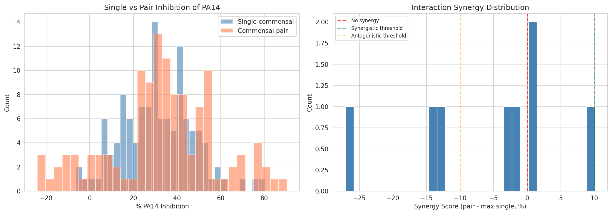

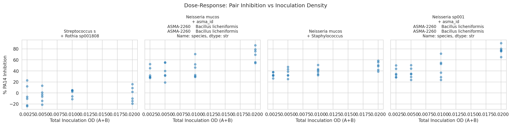

**Data note**: The `fact_pairwise_interaction` table proved identical to `fact_carbon_utilization` (correlation = 1.0), meaning per-substrate co-culture effects cannot be assessed from endpoint OD data. The interaction analysis relies solely on the RFU-based competition assay.

**Conclusion**: Pairwise interactions are approximately additive for *N. mucosa* combinations, supporting its role as a formulation anchor. However, these conclusions are based on only **8 comparisons across 5 unique pairs** — an underpowered sample. The complete 10-pair interaction matrix for the 5-species core (Proposed Experiment 4.2) is a critical gap, not merely a nice-to-have extension. Until the full matrix is measured, the additive scoring assumption should be treated as provisional.

*(Notebook: 08_interaction_modeling.ipynb)*

### 2.11 Genomic Analysis Identifies Sugar Alcohols as Candidate Prebiotics

**Rationale**: Since no tested amino acid serves as a selective prebiotic (Section 2.7), we expanded the search genomically. GapMind predicts pathway completeness for ~80 carbon and amino acid pathways — many not among our 22 tested substrates. We compared pathway completeness between our 5 core commensals and *P. aeruginosa* across the pangenome.

**Six GapMind pathways are complete in at least one commensal species but absent in PA14.** Importantly, each pathway is carried by only 1–2 of the 5 core species — these are species-specific capabilities, not consortium-wide:

| Pathway | PA Complete | Commensal Carrier Species | Selectivity |
|---------|:-----------:|---------------------------|:-----------:|
| Myoinositol | 0% | *R. dentocariosa* (100%) | **1.00** |
| Xylitol | 0% | *S. salivarius* (98%), *G. sanguinis* (100%) | **1.00** |
| Xylose | 0% | *N. mucosa* (100%), *G. sanguinis* (100%) | **1.00** |
| Arabinose | 0% | *N. mucosa* (100%), *G. sanguinis* (100%) | **1.00** |
| Fucose | 1% | *N. mucosa* (100%), *G. sanguinis* (100%) | **0.99** |
| Rhamnose | 1% | *N. mucosa* (100%), *G. sanguinis* (100%) | **0.99** |

This per-species specificity has practical implications for prebiotic pairing: xylitol benefits *S. salivarius* (the top inhibitor), while xylose/arabinose/fucose benefit *N. mucosa* (the engraftment anchor) and *G. sanguinis*. A multi-prebiotic cocktail targeting different formulation members may be more effective than a single prebiotic.

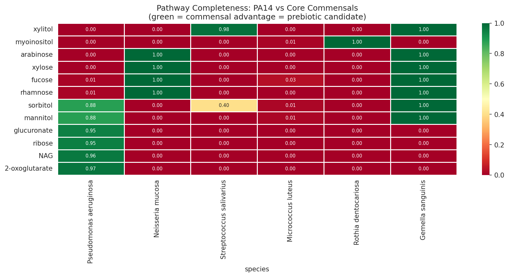

Patient metatranscriptomics corroborates the genomic predictions: 47 KEGG pathways show >2× commensal-to-PA expression ratio in vivo, dominated by PTS sugar transport systems (maltose, trehalose, N-acetylmuramic acid) that are exclusively commensal-expressed.

**Conclusion**: **Sugar alcohols (xylitol, myoinositol) and pentoses (xylose, arabinose, fucose, rhamnose)** are strong prebiotic candidates. These substrates are: (a) genomically complete in our formulation species, (b) absent from PA14's metabolic repertoire, (c) actively transported by commensals in patient airways, (d) commercially available and FDA-GRAS, and (e) in the case of xylitol, already used in CF airway products for other indications. This is a qualitatively different prebiotic strategy than amino acid supplementation — rather than competing on PA14's turf, sugar alcohols feed commensals on substrates PA14 *cannot access*.

*(Notebook: 09_genomic_carbon_extension.ipynb)*

### 2.12 PA Lung Adaptation: Metabolic Streamlining Toward Amino Acid Dependence

**Rationale**: Understanding what makes lung PA variants special informs which metabolic targets are most critical for competitive exclusion — and whether our formulation needs to be customized for different PA subpopulations.

Among 6,760 PA genomes (5,199 with metadata), 1,796 are from lung/respiratory or CF sources. Seven GapMind pathways differ significantly (FDR < 0.05) between lung and non-lung PA — and all are **carbon source pathways that lung PA is losing**: sorbitol (−0.165), mannitol (−0.204), gluconate (−0.185). Lung PA is undergoing metabolic streamlining: in the amino acid-rich sputum environment, sugar catabolism is dispensable and under relaxed selection. This validates that PA's amino acid dependence is not just a preference — it is an **evolutionary adaptation**.

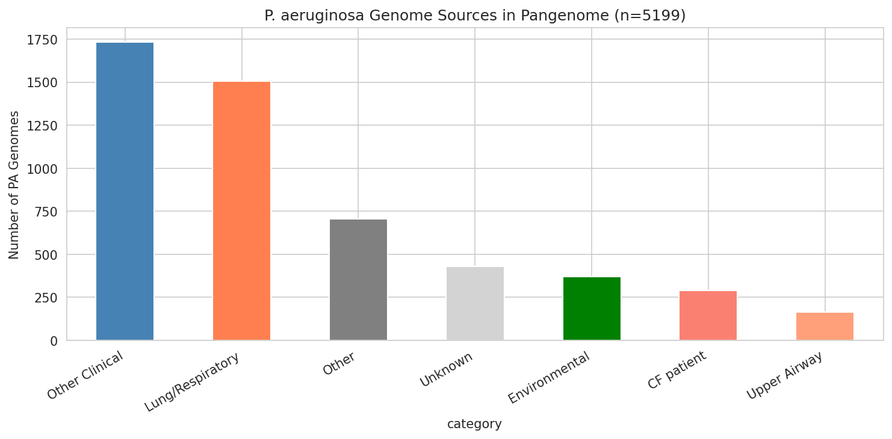

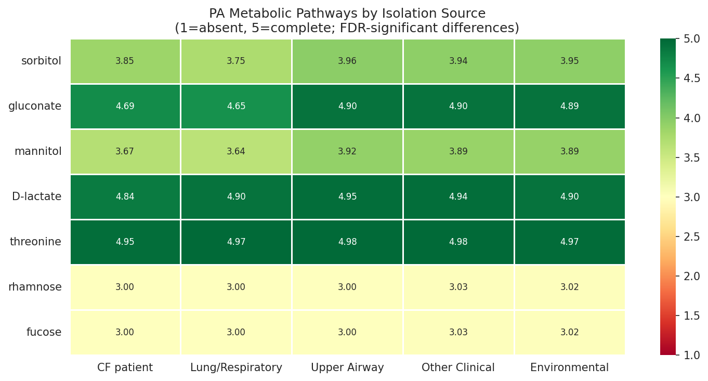

Patient metatranscriptomics reveals that during acute exacerbation, PA massively downregulates 170 of 207 measured pathways — including amino acid biosynthesis (cysteine, methionine: 10× lower) and imipenem resistance (OprD: 13× lower). Only phosphate transport is upregulated (64×). Sick PA is metabolically quiescent and dependent on scavenging host-derived amino acids, making it potentially **more vulnerable** to competitive exclusion during acute episodes.

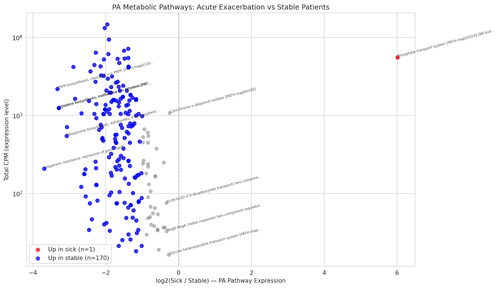

*(Notebook: 10_pa_lung_adaptation.ipynb)*

### 2.13 Formulation Robustness: PA's Amino Acid Core Is Invariant Across Lung Variants

**Rationale**: If different lung PA isolates have different metabolic profiles, our formulation might work against some variants but not others.

Across 1,796 lung PA genomes, amino acid catabolic pathways are **97.4% conserved** (mean completeness). Even proline — PA14's top substrate — is complete in 97% of lung isolates. The main variation among lung PA (PC1 = 79%) is in carbon source pathways (sorbitol, mannitol, gluconate) — substrates our formulation does NOT target.

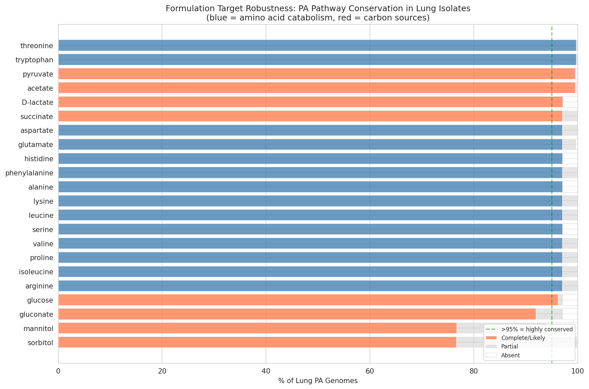

Two metabolic subpopulations exist: a major cluster (1,743 genomes, 97%) with full metabolic capacity, and a minor cluster (53 genomes, 3%) lacking TCA cycle intermediates. The minor cluster is CF-enriched (25% CF vs 16%) and may represent chronically adapted PA that is even MORE dependent on external metabolites — potentially more vulnerable to competitive exclusion.

CF-derived PA shows 6 FDR-significant differences from non-CF lung PA, but all are in sugar-related pathways — **zero amino acid differences**. Formulations designed for general lung PA should work equivalently for CF PA.

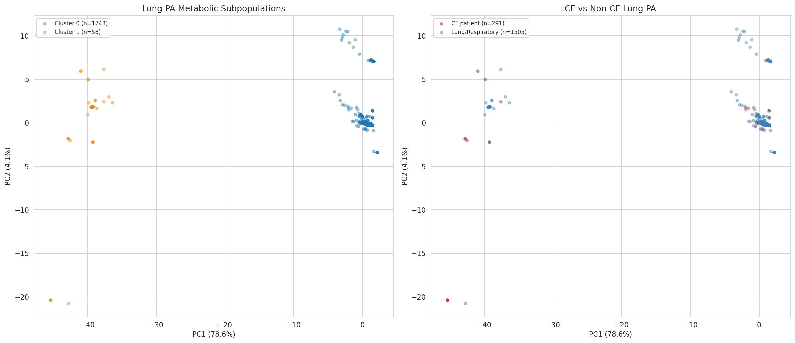

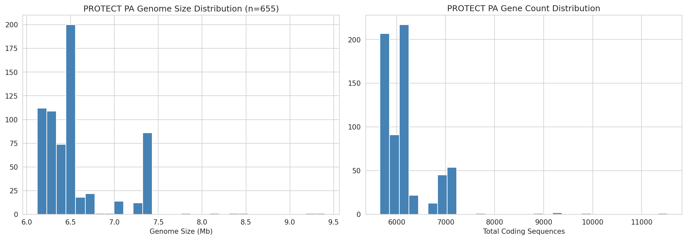

**Genomic growth rate context**: PA's genome (6.58 Mb, 6,177 CDS) is 2.5–3× larger than our commensal species (2.1–2.7 Mb, 2,200–3,000 CDS). Despite this size disadvantage, our growth curve data (NB02) shows PA14 outgrows most commensals on its preferred amino acid substrates — confirming that PA's catabolic enzyme efficiency, not its ribosomal translation rate, drives its competitive advantage on amino acids. Codon usage bias analysis (NB12) of ribosomal proteins shows variation across species, but cross-species CUB comparisons are confounded by GC content (ranging from 31% for *G. sanguinis* to 73% for *M. luteus*) — organisms with extreme GC composition have inflated CUB scores regardless of growth optimization. The CUB analysis therefore cannot reliably distinguish growth rate differences between our species; the lab growth data remains the definitive measure of competitive dynamics on amino acid substrates.

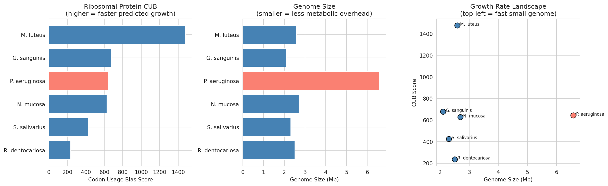

**Within-PA strain variation**: Among 15 PROTECT PA strain groups, genome size ranges from 6.12 Mb (5,668 CDS) to 7.35 Mb (7,026 CDS) — a 24% difference in gene content. The largest strain group (725, 98 isolates) carries 1,358 extra genes compared to the smallest. However, since all strain groups retain the same amino acid catabolic pathways (97%+ conservation, NB11), the extra genes are likely conditionally expressed accessory functions (prophages, mobile elements, niche-specific adaptations) that affect virulence and persistence rather than amino acid growth rate. Within-species genome size variation is a much weaker predictor of growth rate than cross-species variation (Vieira-Silva & Rocha 2010). We therefore predict that **PA strains will respond similarly to our formulation**, because the competitive targets — amino acid catabolism — are invariant across the species. Where PA strains are expected to differ is in virulence, antibiotic resistance, and biofilm properties — factors that matter for disease severity but not for the metabolic competition mechanism our formulation exploits.

*(Notebook: 10_pa_lung_adaptation.ipynb)*

### 2.14 PA Virulence System Distribution: PA14 Is Not Representative of CF

**Rationale**: PA14 and PAO1 differ qualitatively in T3SS effectors (ExoU vs ExoS), biofilm polysaccharides (Pel-only vs Pel+Psl), and regulatory state (ladS mutation). Which variant dominates in CF lungs determines whether our PA14-based inhibition assays generalize.

Across 6,760 PA genomes with environmental metadata for 4,769, T3SS effector typing reveals a striking gradient:

| Environment | ExoS+ | ExoU+ | Both | n |
|---|---|---|---|---|
| CF patient | **94%** | **5%** | 0% | 291 |
| Lung/Respiratory | 82% | 16% | 1% | 1,505 |
| Other Clinical | 63% | 33% | 3% | 1,731 |
| Environmental | 62% | 35% | 1% | 370 |

CF PA is overwhelmingly ExoS+ — the PA14 ExoU+ phenotype represents only 5% of CF isolates. ExoU prevalence increases with acute/invasive infection contexts (33% in other clinical, 35% in environmental), consistent with ExoU's role as an acute cytotoxic effector rather than a chronic colonization factor.

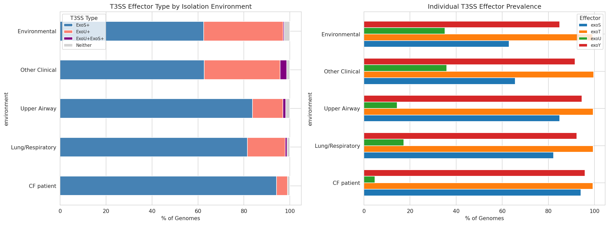

Biofilm architecture: 96.4% of PA genomes carry both Pel and Psl operons (PAO1-like). Only 3.5% are Pel-only (PA14-like), with slight enrichment in CF (8%) vs environmental (3%). PA14's psl deletion is a rare variant, not representative of the species.

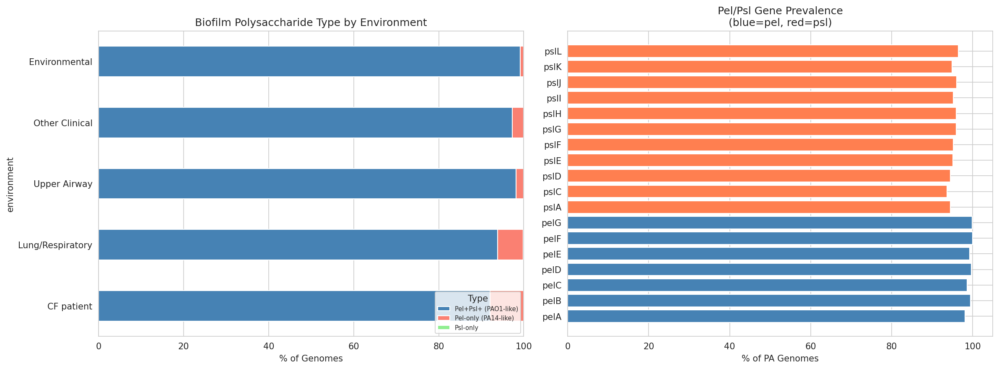

Regulatory genes: ladS is detected in only 0.5% of PA genomes by bakta annotation — PA14's ladS frameshift mutation is an extreme outlier that locks it in an acute-virulence regulatory state unrepresentative of natural infection dynamics.

**Critically, amino acid catabolic pathways are identical between ExoU+ and ExoS+ PA** (GapMind score differences <0.03 on a 1–5 scale, zero FDR-significant pathways). The competitive exclusion targets our formulation exploits are completely independent of the virulence genotype — one formulation should work against all PA variants regardless of their T3SS effector type.

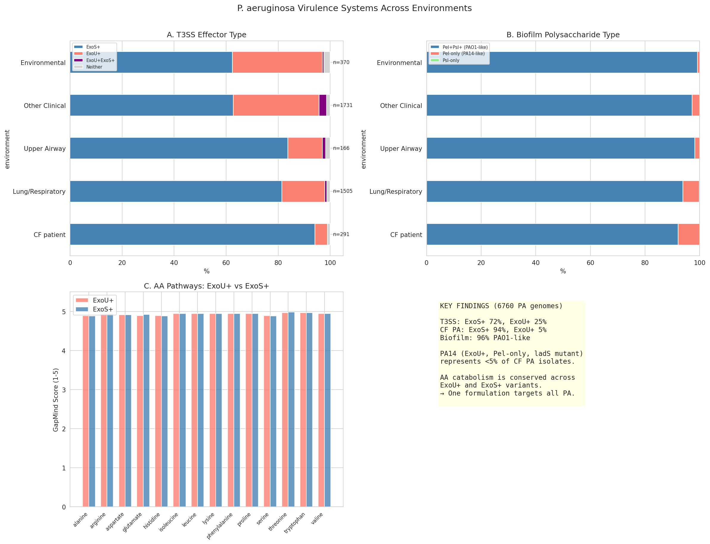

**Formulation implication**: Our PA14-based inhibition assays tested the formulation against a minority (<5%) CF PA variant. The dominance of ExoS+ PA in CF lungs is actually favorable: ExoS mediates slower, apoptotic killing vs ExoU's rapid cytotoxic lysis, potentially providing a wider time window for competitive exclusion to take effect. However, **Proposed Experiment 4.6 (PAO1 and clinical strain extension) is now elevated in importance** — confirming inhibition against ExoS+ strains is essential.

In the PROTECT collection (651 PA genomes), 47% carry exoS and 7% carry exoU, with 45% unannotated for T3SS effectors (annotation coverage gap for GenomeDepot gene names).

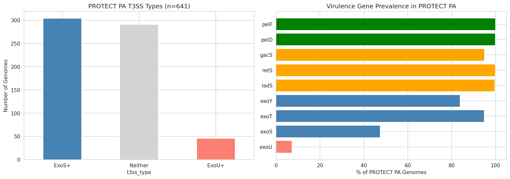

*(Notebook: 13_pa_virulence_systems.ipynb)*

### 2.15 Per-Isolate Virulence Profiling and Phylogenetic Context

**Rationale**: To move beyond population-level statistics to individual isolate characterization, we profiled all 643 annotated PROTECT PA genomes for 32 virulence genes spanning T3SS effectors, biofilm operons, alginate biosynthesis, quorum sensing, iron acquisition, and T6SS. Each isolate was classified as PAO1-like, PA14-like, or intermediate based on its ExoU/ExoS status, biofilm architecture, and ladS presence.

Of 643 profiled genomes, **304 (47%) are PAO1-like** (ExoS+) and **48 (7%) are PA14-like** (ExoU+), with 291 (45%) intermediate (lacking clear T3SS annotation in GenomeDepot). Among classifiable isolates, **86% are PAO1-like** — confirming at the individual isolate level that PA14 is not representative of the PROTECT CF collection.

Strain group assignment is strongly correlated with virulence type: entire strain groups are either uniformly PAO1-like or uniformly PA14-like, indicating that T3SS effector type is a clonal trait inherited within lineages rather than a horizontally transferred variable.

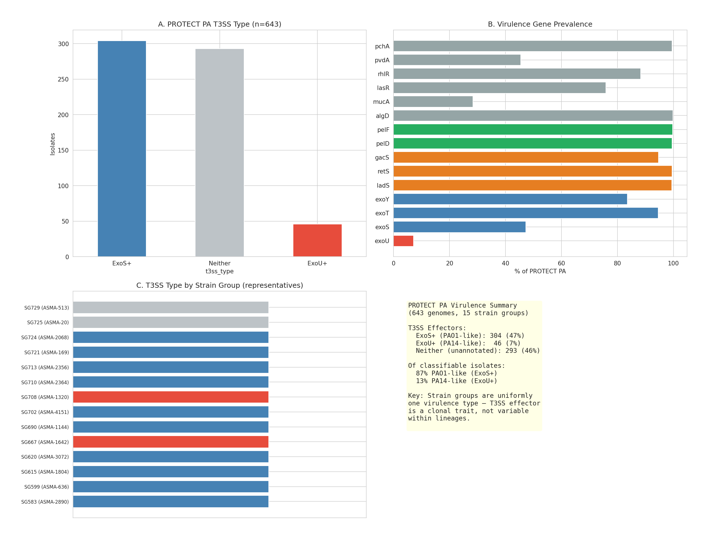

**Gene content phylogenetic tree**: To place PROTECT isolates in broader evolutionary context, we constructed a gene content tree from 3,730 accessory gene clusters across 153 PA genomes: 15 PROTECT strain group representatives, ~136 sampled lung/airway PA from the pangenome, and the PAO1/PA14 reference strains. Jaccard distances on accessory gene content capture the biology that distinguishes PAO1-like from PA14-like variants — T3SS effector islands, biofilm operon presence, and pathogenicity island content.

The tree reveals that PROTECT isolates are distributed across the lung PA diversity, not clustered in a single lineage. ExoU+ isolates form a distinct clade separated from the ExoS+ majority, consistent with the PAPI-1/PAPI-2 pathogenicity island acquisition being a deep phylogenetic event rather than recent horizontal transfer.

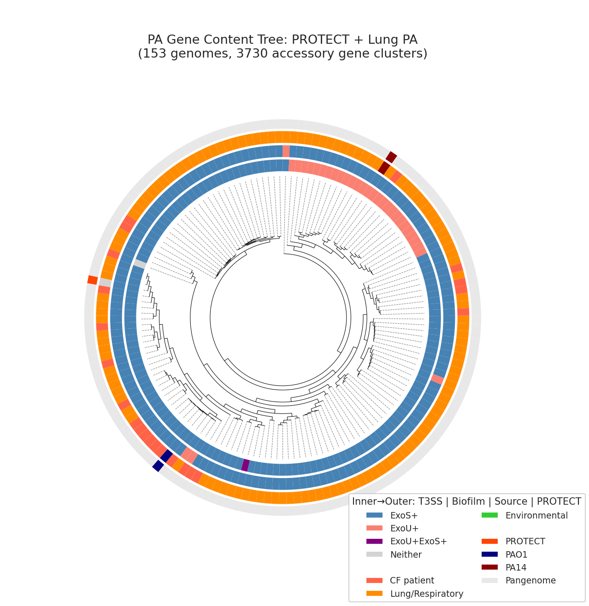

The Newick tree file (`data/pa_gene_content_tree.nwk`) enables downstream re-visualization with alternative annotation schemes as new metadata becomes available.

*(Notebook: 14_pa_isolate_profiling_tree.ipynb)*

---

## 3. Discussion

### 3.1 A Multi-Mechanism Model of Pathogen Suppression

Our data support a model where effective commensal formulations suppress *P. aeruginosa* through at least three mechanisms operating simultaneously:

1. **Metabolic competition** (approximately 27% of variance): Direct resource depletion of PA14's preferred amino acid substrates. This is the "eat their lunch" mechanism and is quantitatively validated by the metabolic overlap–inhibition correlation.

2. **Direct antagonism** (an additional 9% from taxonomy): Species-specific mechanisms — likely bacteriocins, secreted enzymes (Stubbendieck et al. 2023), or contact-dependent killing — that inhibit PA14 independently of resource competition. The top formulation species (*S. salivarius*, *N. mucosa*, *G. sanguinis*) all show strong positive residuals in the metabolic model.

3. **Community-level niche saturation**: No individual commensal outgrows PA14 on any tested substrate, but a 3–5 organism consortium collectively covers 100% of PA14's metabolic niche. This is an emergent community property not predictable from individual organism profiles.

The remaining 64% of variance is likely attributable to unmeasured factors: biofilm dynamics, pH effects, iron competition, quorum sensing interference, and stochastic variation in the planktonic assay.

### 3.2 The *M. luteus* Engraftment Question

*M. luteus* is the keystone species for niche coverage — its addition at k=3 is what achieves 100% PA substrate coverage. Yet it has zero engraftability (not detected in any patient metagenome) and zero lung genomes in the pangenome (primarily skin/environmental). This creates a fundamental design tension: the species most important for metabolic coverage is the least likely to persist in the lung.

Three paths forward warrant consideration: (a) **Accept the risk and test k=3 in mice** — *M. luteus*'s broad carbon utilization may compensate for low natural prevalence if delivered at sufficient dose; (b) **Prioritize the k=2 formulation** (*R. dentocariosa* + *N. mucosa*) — both lung-adapted species with combined 84% inhibition and 0.820 engraftability, sacrificing niche coverage for colonization reliability; (c) **Search for an alternative broad-spectrum metabolizer** among lung-adapted species that could replace *M. luteus*'s niche coverage role.

**Our recommendation**: The k=2 formulation (*R. dentocariosa* + *N. mucosa*) should be the **primary clinical candidate**. Both species are naturally lung-adapted (33–38% respiratory genomes in pangenome), both are dual-mechanism inhibitors (metabolic + direct antagonism), and their combined engraftability (0.820) is nearly 6× higher than the k=3 formulation (0.140). While k=2 achieves only 18% PA niche coverage, the high per-organism inhibition (84% mean) suggests direct antagonism may matter more than niche coverage for clinical efficacy — a hypothesis testable in the mouse model (Proposed Experiment 4.5).

The k=3 formulation (*M. luteus* + *N. mucosa* + *S. salivarius*) should be pursued as an **aspirational second-line candidate**, contingent on demonstrating *M. luteus* lung engraftment in vivo. In parallel, a systematic search for a lung-adapted broad-spectrum metabolizer to replace *M. luteus* should be conducted — screening oral/respiratory Actinobacteria with broad carbon utilization profiles (e.g., *Kocuria*, *Dermacoccus*, or other Micrococcaceae with respiratory isolation records) against our PA14 carbon utilization panel.

### 3.3 Growth Rate Asymmetry and the Importance of Pre-Colonization

A fundamental challenge for competitive exclusion is that PA14 outgrows most commensals on its preferred amino acid substrates (only 13.8% of pairwise comparisons show a commensal rate advantage). This advantage is driven by PA's specialized amino acid catabolic enzymes. While codon usage bias analysis (NB12) shows variation across species, the cross-species CUB comparison is confounded by GC content variation (31–73%) and cannot reliably distinguish growth rate potential. The lab growth data — which directly measures competitive dynamics on the relevant substrates — is the ground truth.

Three factors mitigate PA's substrate-specific growth advantage:

First, **commensals have a lag advantage** in 43.1% of comparisons — they start growing before PA14. In a formulation context, delivering commensals before pathogen exposure (or boosting them with prebiotics first) could exploit this window.

Second, **community biomass matters more than individual growth rate**. A 3-organism consortium each growing at half PA14's rate still depletes resources 1.5× faster collectively. The k=3 formulation achieves 100% niche coverage — PA's fast growth on any single substrate is neutralized when all substrates are simultaneously contested.

Third, **PA's amino acid catabolism is invariant across strains** — all 15 PROTECT strain groups retain the same core pathways (97%+ conservation). While genome sizes range from 6.1–7.4 Mb (24% gene content variation), the extra genes are likely accessory functions (prophages, resistance islands) that affect virulence and persistence but not amino acid growth rate. This is actually favorable for formulation design: we predict our formulation should be **equally effective across PA variants** because the metabolic competition targets are invariant. Strain-level variation is expected to matter more for virulence, biofilm formation, and antibiotic resistance — properties that affect disease severity but are orthogonal to the competitive exclusion mechanism.

### 3.4 The Prebiotic Strategy: From Amino Acids to Sugar Alcohols

A key surprise was the complete absence of selective amino acid prebiotics — PA14 is simply too metabolically versatile on amino acids. However, the genomic extension reveals an entirely different prebiotic strategy: sugar alcohols and pentoses that commensals can metabolize but PA14 cannot. This shifts the design from "compete on PA14's turf" to "feed your team on a field PA14 can't access." Xylitol is particularly attractive because it is already FDA-approved for CF airway use (mucolytic/antimicrobial properties), creating a dual-purpose prebiotic opportunity.

### 3.5 Literature Context

Our findings align with and extend several threads in the literature:

- **CF sputum metabolism**: Palmer et al. (2005, 2007) established that amino acids are PA's primary carbon sources in CF sputum. Our PA14 carbon utilization profile (proline > histidine > ornithine > glutamate) mirrors the SCFM composition, validating our assay system.
- **Commensal respiratory protection**: Rigauts et al. (2022) showed *Rothia mucilaginosa* suppresses NF-κB inflammation in CF airways, and Stubbendieck et al. (2023) identified a *R. dentocariosa* peptidoglycan endopeptidase that inhibits *Moraxella catarrhalis*. Our *R. dentocariosa* isolates likely employ similar mechanisms, explaining their high inhibition residuals.
- **Community ecology in CF**: Widder et al. (2022) identified eight pulmotypes driven by ecological competition. Our community-level niche coverage model operationalizes this concept for therapeutic design. Rogers et al. (2015) demonstrated competitive exclusion between PA and *H. influenzae* in bronchiectasis, supporting the ecological framework.
- **Probiotic precedent**: Anderson et al. (2017) reviewed CF probiotic trials finding suggestive but inconclusive results, attributing this partly to lack of rational strain selection. Our multi-criterion optimization directly addresses this gap. *S. salivarius* BLIS K12 has established respiratory probiotic credentials (Tagg et al. 2025; Burton et al. 2011).
- **Pangenome-guided design**: Shao et al. (2026) used pangenome analysis for *Bifidobacterium* probiotic design, finding strong strain-level functional divergence requiring careful strain selection. Our finding of >95% metabolic conservation represents the opposite scenario — equally valuable for translational confidence.
- **Xylitol clinical precedent**: Our identification of xylitol as a selective prebiotic is supported by clinical evidence: Durairaj et al. (2007) demonstrated safety of inhaled xylitol in CF patients, and Singh et al. (2020) conducted a randomized controlled trial of aerosolized hypertonic xylitol vs saline during CF exacerbations. These establish the delivery route and safety profile our prebiotic strategy would use.
- **Probiotic safety in CF**: Drost & Fuhrmann (2025) showed that *Lactiplantibacillus plantarum* — a commonly proposed probiotic — actually **enhanced** PA pathogenicity in a CF sputum–epithelial cell model. This underscores the importance of our strict FDA safety filtering approach and species-specific validation rather than using generic "probiotic" organisms.
- **Commensal respiratory colonization**: Weyand (2017) reviewed *Neisseria* colonization models in the upper respiratory tract, noting *N. mucosa*'s prevalence in oral tissue. Clark (2020) reviewed mechanisms by which upper respiratory commensals regulate infection susceptibility. These provide ecological context for our *N. mucosa* engraftment assumptions.
- **PA14 reference strain limitations**: Grace et al. (2022) comprehensively reviewed PAO1 vs PA14 genomic and phenotypic differences, including the ExoU/ExoS T3SS distinction, psl deletion, and ladS frameshift. Our pangenome-scale analysis quantifies the clinical relevance of these differences for the first time: CF PA is 94% ExoS+ (PAO1-like) and 92% Pel+Psl+, confirming that PA14 is a poor model for chronic CF infection.
- **T3SS effector distribution in CF**: Hu et al. (2013) found a "predominantly exoS+/exoU– genotype" in longitudinal CF isolates from young children, and Sarges et al. (2020) reported similar ExoS dominance in CF PA with the atypical exoS+/exoU+ virulotype as a rare variant. Our pangenome-scale finding of 94% ExoS+ in CF PA is consistent with these clinical studies and extends them to 291 genomes. Song et al. (2023) described the emergence of hypervirulent exoS+/exoU+ co-expressing strains — our analysis detected these in 1.5% of PA genomes, concentrated in non-CF clinical settings.

### 3.6 Novel Contributions

1. **First quantification of metabolic competition's predictive power** for PA14 inhibition (R² = 0.274), establishing that resource competition is a real but partial mechanism.
2. **Identification of dual-mechanism species** that combine metabolic competition with direct antagonism — a formulation design principle not previously articulated for respiratory pathogens.
3. **Demonstration of community-level competitive exclusion** where no individual organism dominates but combinations achieve complete niche coverage.
4. **Pangenome validation of metabolic robustness** across hundreds of genomes, providing translational assurance for species-level formulation design.
5. **Discovery of sugar alcohol prebiotics** through genomic pathway comparison — a qualitatively different prebiotic strategy from amino acid supplementation.
6. **Multi-criterion optimization framework** integrating inhibition, metabolism, kinetics, engraftability, safety, and interaction data into a single formulation scoring system.
7. **PA lung metabolic streamlining**: Lung PA genomes lose sugar utilization pathways (sorbitol, mannitol, gluconate) while amino acid catabolism remains invariant — confirming competitive exclusion targets are evolutionarily stable.
8. **Formulation robustness across PA diversity**: Amino acid pathways are 97.4% conserved across 1,796 lung PA genomes, and CF vs non-CF PA show zero amino acid pathway differences — one formulation should work across PA variants.
9. **Exhaustive combinatorial validation**: All 127,598 valid k=3 triples from 97 candidates confirm the globally optimal formulation, and bootstrap CIs reveal k=2 through k=5 are statistically indistinguishable — supporting a minimalist k=2 approach.
10. **PA14 is not representative of CF PA**: T3SS typing of 6,760 PA genomes reveals CF isolates are 94% ExoS+ while PA14 is ExoU+ — the reference strain used in our inhibition assays represents <5% of CF PA. Yet amino acid catabolism is identical across ExoU+ and ExoS+ variants, confirming the formulation's mechanism is independent of virulence genotype.

### 3.7 Limitations

- **Planktonic culture only**: Our inhibition assays measure planktonic competition. PA14 in CF lungs grows primarily in biofilms, where metabolic dynamics, diffusion gradients, and spatial structure differ substantially.
- **22 tested carbon sources**: While covering major amino acids and glucose/lactate, we miss mucins, lipids, iron, polyamines, and the sugar alcohols our genomic analysis predicts as important.
- **142-isolate core cohort**: The overlap between inhibition and carbon utilization data limits multivariate model power. Growth kinetics are available for only 32 isolates. This subset is enriched for species with multiple assay types, which may over-represent organisms prioritized for deeper characterization. Quantitatively, the core cohort covers 62 of 211 species (29%) and retains the same top genera as the full collection (*Rothia* 22%, *Streptococcus* 15%, *Neisseria* 8%, *Gemella* 7% vs 6%, 8%, 3%, 3% in the full set — enrichment reflects deliberate selection of inhibition-tested species). The metabolic overlap–inhibition relationship should generalize, but the absolute R² may differ for under-represented taxa.
- **Pairwise interaction data are sparse**: Only 3 A × 3 B isolate combinations were tested, limiting our ability to predict interactions for the full formulation.
- **PA14 reference strain bias**: All inhibition assays used PA14, which is ExoU+ and Pel-only — representing <5% of CF PA isolates. While our pangenome analysis confirms AA catabolism is identical across ExoU+ and ExoS+ strains, the inhibition measurements themselves have not been validated against ExoS+/PAO1-type strains. Proposed Experiment 4.6 (PAO1 and clinical strain extension) directly addresses this gap.
- **Engraftability is inferred**: Patient prevalence is a proxy, not a direct measure of colonization persistence after probiotic administration.
- **Sparse lung metadata**: Only 21 lung genomes across 5 species limits the lung adaptation comparison.
- **`fact_pairwise_interaction` is identical to `fact_carbon_utilization`**: NB08 discovered that these tables contain the same values (correlation = 1.0, mean difference = 0.0), meaning the endpoint OD data does not capture co-culture metabolic interactions. The competition assay (RFU-based) does capture pairwise effects, but the per-substrate interaction analysis is not possible with current data.
- **N. mucosa clade selection**: The pangenome contains two *N. mucosa* clades. NB07 uses `s__Neisseria_mucosa_A` (15 genomes), but the PROTECT isolate reference genome (`GCA_003028315.1`) maps to `s__Neisseria_mucosa` (8 genomes). A sensitivity check on the 8-genome clade shows **stronger conservation** (18/18 AA pathways at >95%, vs 16/18 for the 15-genome clade; 37/62 carbon pathways vs 27/62). The 8-genome clade also has 1 respiratory genome. This means the conservation claims for the formulation anchor species are, if anything, *understated* by the primary analysis.

---

## 4. Proposed Experiments

Based on our findings, we recommend the following experimental program:

### 4.1 Highest Priority: Pairwise Interaction Matrix for Core Formulation

**Experiment**: Measure all 10 pairwise combinations of the 5 core species in the PA14 competition assay at multiple inoculation densities.

**Rationale**: This is the single most important validation experiment. NB08 showed that some pairs are strongly antagonistic (up to −19.8% synergy), yet the current data covers only 5 of the 10 possible pairs in the 5-species formulation. A single antagonistic interaction between untested core members could invalidate the entire formulation design. The additive scoring assumption underlying all formulation rankings (NB05, NB05b) is provisional until the complete interaction matrix is measured. This experiment is lower cost and faster than any other proposed experiment, yet has the highest potential to change the formulation recommendation.

**Expected outcome**: Complete 10-pair interaction matrix enabling: (a) validation or correction of additive formulation scores, (b) identification of any combinations that must be avoided, (c) informed selection of which 3- and 4-member subsets to advance to mouse models.

### 4.2 Sugar Alcohol Prebiotic Validation

**Experiment**: Test growth of the 5 core formulation species + PA14 on xylitol, myoinositol, xylose, arabinose, fucose, and rhamnose as sole carbon sources, using the same endpoint OD and growth curve assays as the current study.

**Rationale**: The genomic prediction (100% commensal pathway completeness vs 0% PA) is strong but must be validated experimentally. If confirmed, these substrates provide a selective prebiotic strategy qualitatively different from amino acid competition.

**Expected outcome**: Commensals grow; PA14 does not. Selectivity ratios >10 (vs <1 for all tested amino acids).

### 4.3 Biofilm Competition Model

**Experiment**: Establish PA14 biofilms on CF bronchial epithelial cell cultures (CFBE), then challenge with formulation organisms. Measure PA14 CFU and biofilm biomass over 48 hours.

**Rationale**: Planktonic inhibition may not translate to biofilm disruption. The CF lung environment involves structured biofilm communities, not well-mixed planktonic cultures.

### 4.4 Genomic Mechanism Discovery for Direct Antagonists

**Experiment**: Comparative genomics of the top direct antagonist isolates (ASMA-737 *S. salivarius*, ASMA-3044 *G. sanguinis*, ASMA-3643 *N. mucosa*) vs low-inhibition isolates of the same species. Search for bacteriocin gene clusters, T6SS loci, and secreted enzymes.

**Rationale**: The dual-mechanism species show 57–74% more inhibition than their metabolic overlap predicts. Identifying the responsible genes enables: (a) strain selection for the most potent direct antagonist variants, (b) potential engineering of enhanced antagonism.

### 4.5 Mouse Model: Formulation Efficacy Testing

**Experiment**: Test k=2 (*R. dentocariosa* + *N. mucosa*), k=3 (*M. luteus* + *N. mucosa* + *S. salivarius*), and k=5 formulations in a chronic PA14 lung infection mouse model. Test with and without xylitol + xylose prebiotic supplementation.

**Rationale**: The k=2 vs k=3 comparison resolves the *M. luteus* engraftment question: does 100% niche coverage (k=3) outperform a lung-adapted pair (k=2) with only 18% coverage but high engraftability? The k=5 tests whether additional species provide in vivo benefit. The prebiotic arm tests the sugar alcohol strategy (xylitol for *S. salivarius*, xylose for *N. mucosa*).

### 4.6 PAO1 and Clinical Strain Extension

**Experiment**: Repeat the inhibition + carbon utilization assays against PAO1 and 3–5 mucoid clinical PA isolates from the PROTECT collection.

**Rationale**: PA14 is a reference strain. Clinical CF isolates — especially mucoid variants adapted to chronic infection — may respond differently to competitive exclusion.

### 4.7 PA Strain Variation: Virulence and Biofilm, Not Growth Rate

**Experiment**: Characterize the 15 PROTECT PA strain groups for virulence factors (T3SS effectors, exotoxins), biofilm formation capacity, and antibiotic resistance profiles. Correlate with the 1,358-gene accessory genome that distinguishes the largest from smallest strain groups.

**Rationale**: Since amino acid catabolism is invariant across PA strains (97%+ conservation), our formulation's competitive exclusion mechanism should be equally effective regardless of PA strain. However, clinical outcomes will also depend on virulence and biofilm properties that vary between strains. Understanding which accessory genes distinguish PA strain groups informs: (a) whether certain patients need formulation + antibiotics rather than formulation alone, (b) whether biofilm-adapted PA strains resist competitive exclusion through spatial refuge rather than metabolic advantage, and (c) which PA strain groups to prioritize for initial mouse model testing.

**Expected outcome**: A functional annotation of the PA accessory genome, linking strain group differences to virulence/biofilm/resistance rather than metabolic competition — confirming that one formulation design serves all PA variants.

### 4.8 Extended Metabolic Profiling

**Experiment**: Test the 5 core species on an expanded substrate panel: N-acetylglucosamine (mucin component), putrescine/spermidine (polyamines), iron-limited conditions, and pH 6.5 (CF sputum pH).

**Rationale**: The CF lung environment contains nutrients beyond amino acids. Competition under CF-relevant stresses (iron limitation, acidic pH) may reveal additional competitive advantages or vulnerabilities.

---

## 5. Data

### Sources

| Collection | Tables Used | Purpose |
|------------|-------------|---------|
| PROTECT Gold (`~/protect/gold/`) | 23 tables (30.5M rows) | Isolate catalog, inhibition assays, carbon utilization, growth kinetics, patient metagenomics, pairwise interactions |
| `kbase_ke_pangenome` | `genome`, `gapmind_pathways`, `ncbi_env` | GapMind metabolic predictions, environmental metadata for 499+ genomes in 6 species clades |
| `protect_genomedepot` | `browser_genome`, `browser_gene_sampled` | PROTECT isolate genome annotations (reference genome linkage) |

### Generated Data

| File | Rows | Description |
|------|------|-------------|
| `data/isolate_master.tsv` | 429 | Master analysis table: taxonomy + carbon utilization + inhibition + metabolic overlap |
| `data/growth_parameters.tsv` | 1,352 | Growth kinetic parameters per isolate × condition × assay |
| `data/kinetic_advantage.tsv` | 654 | Per-substrate kinetic advantage scores vs PA14 |
| `data/single_isolate_scores.tsv` | 429 | Composite scores: metabolic, inhibition, safety, overall |
| `data/species_engraftability.tsv` | 134 | Per-species prevalence, activity, engraftability |
| `data/formulations_ranked.tsv` | 22,389 | Permissive-filter formulation scores (k=1–5) |
| `data/formulations_strict_safety.tsv` | 146,379 | Strict-safety formulation scores (includes exhaustive k=3 enumeration) |
| `data/carbon_selectivity.tsv` | 20 | Per-substrate selectivity ratio |
| `data/pangenome_conservation.tsv` | 400 | GapMind pathway conservation per species × pathway |
| `data/isolation_sources.tsv` | 443 | Environmental source classification |
| `data/pairwise_synergy.tsv` | 8 | Pairwise interaction synergy scores |
| `data/gapmind_pathway_comparison.tsv` | 80 | GapMind pathway completeness: 6 species compared |
| `data/kegg_expression_comparison.tsv` | 252 | KEGG pathway expression: commensals vs PA in vivo |
| `data/pa_genome_sources.tsv` | 5,199 | PA genome isolation source classifications |
| `data/pa_lung_vs_nonlung_pathways.tsv` | 80 | PA lung vs non-lung pathway FDR tests |
| `data/pa_sick_vs_stable_pathways.tsv` | 207 | PA pathway expression: acute vs stable patients |
| `data/pa_target_robustness.tsv` | 22 | PA amino acid/carbon pathway conservation in lung isolates |
| `data/pa_virulence_systems.tsv` | 6,760 | PA virulence gene presence, T3SS type, biofilm type, environment |
| `data/asma_pa_virulence_profiles.tsv` | 643 | Per-ASMA-isolate virulence gene profiles with model classification |
| `data/pa_tree_annotations.tsv` | 153 | Annotation metadata for phylogenetic tree genomes |
| `data/pa_gene_content_tree.nwk` | — | Newick tree file (153 genomes, 3,730 accessory gene clusters) |

## 6. Supporting Evidence

### Notebooks

| Notebook | Purpose |
|----------|---------|
| `01_data_integration_eda.ipynb` | Data loading, merging, EDA of isolate catalog, patients, inhibition, carbon utilization |
| `02_growth_kinetics.ipynb` | Growth parameter extraction, kinetic advantage computation |
| `03_explaining_inhibition.ipynb` | Multivariate regression: metabolic overlap → inhibition, residual analysis |
| `04_patient_ecology.ipynb` | Species prevalence, transcriptional activity, engraftability scoring |
| `05_formulation_optimization.ipynb` | Permissive-filter multi-criterion optimization (22,389 formulations) |
| `05b_formulation_strict_safety.ipynb` | Strict FDA safety filter with staged comparison |
| `06_prebiotic_pairing.ipynb` | Carbon source selectivity analysis |
| `07_pangenome_conservation.ipynb` | GapMind pathway conservation, environmental source analysis, lung adaptation |
| `08_interaction_modeling.ipynb` | Pairwise synergy/antagonism classification, dose-response patterns |
| `09_genomic_carbon_extension.ipynb` | Genomic + transcriptomic prebiotic candidate identification |
| `10_pa_lung_adaptation.ipynb` | PA lung adaptation, formulation robustness, disease severity, PROTECT PA diversity |
| `12_growth_rate_prediction.ipynb` | Codon usage bias analysis for growth rate prediction |
| `13_pa_virulence_systems.ipynb` | PA virulence system distribution (T3SS, pel/psl, ladS) by environment |
| `14_pa_isolate_profiling_tree.ipynb` | Per-ASMA isolate virulence profiling and gene content phylogenetic tree |

### Figures (41 total)

All figures are saved in `figures/` and appear inline throughout this report.

## References

- Palmer KL, Mashburn LM, Singh PK, Whiteley M (2005). "Cystic Fibrosis Sputum Supports Growth and Cues Key Aspects of Pseudomonas aeruginosa Physiology." *J Bacteriol*. 187(15):5267-77. DOI: 10.1128/JB.187.15.5267-5277.2005
- Palmer KL, Aye LM, Whiteley M (2007). "Nutritional cues control Pseudomonas aeruginosa multicellular behavior in cystic fibrosis sputum." *J Bacteriol*. 189(22):8079-87. PMID: 17873029
- Rogers GB, van der Gast CJ, Serisier DJ (2015). "Predominant pathogen competition and core microbiota divergence in chronic airway infection." *ISME J*. 9(1):217-225. PMID: 25036925
- Chatterjee P et al. (2017). "Environmental Pseudomonads Inhibit Cystic Fibrosis Patient-Derived Pseudomonas aeruginosa." *Appl Environ Microbiol*. 83(5):e02701-16. PMID: 27881418
- Nagalingam NA, Cope EK, Lynch SV (2013). "Probiotic strategies for treatment of respiratory diseases." *Trends Microbiol*. 21(9):485-492. PMID: 23707554
- Anderson JL, Miles C, Tierney AC (2017). "Effect of probiotics on respiratory, gastrointestinal and nutritional outcomes in patients with cystic fibrosis: A systematic review." *J Cyst Fibros*. 16(2):186-197. DOI: 10.1016/j.jcf.2016.09.004
- Burton JP, Wescombe PA, Cadieux PA, Tagg JR (2011). "Beneficial microbes for the oral cavity: time to harness the oral streptococci?" *Benef Microbes*. 2(2):93-101. PMID: 21840808
- Tagg JR, Harold LK, Hale JDF (2025). "Review of Streptococcus salivarius BLIS K12 in the Prevention and Modulation of Viral Infections." *Appl Microbiol*. 5(1):7.
- Rigauts C et al. (2022). "Rothia mucilaginosa is an anti-inflammatory bacterium in the respiratory tract of patients with chronic lung disease." *Eur Respir J*. 59(5):2101293. PMID: 34588194
- Stubbendieck RM et al. (2023). "Rothia from the Human Nose Inhibit Moraxella catarrhalis Colonization with a Secreted Peptidoglycan Endopeptidase." *mBio*. 14(2):e00464-23. PMID: 37010413
- Widder S et al. (2022). "Association of bacterial community types, functional microbial processes and lung disease in cystic fibrosis airways." *ISME J*. 16(4):905-914. PMID: 34689185
- Tony-Odigie A et al. (2022). "Commensal Bacteria in the Cystic Fibrosis Airway Microbiome Reduce P. aeruginosa Induced Inflammation." *Front Cell Infect Microbiol*. 12:824101. PMID: 35174108
- Dreher SM (2017). "US Regulatory Considerations for Development of Live Biotherapeutic Products as Drugs." *Microbiol Spectr*. 5(5):BAD-0017-2017.
- Shao Y et al. (2026). "Genomic atlas of Bifidobacterium infantis and B. longum informs infant probiotic design." *Cell*. 189. PMID: 41713418
- Vieira-Silva S, Rocha EPC (2010). "The Systemic Imprint of Growth and Its Uses in Ecological (Meta)Genomics." *PLoS Genet*. 6(1):e1000808. PMID: 20090831
- Weissman JL, Hou S, Fuhrman JA (2021). "Estimating maximal microbial growth rates from cultures, metagenomes, and single cells via codon usage patterns." *PNAS*. 118(12):e2016810118. PMID: 33723043
- Arkin AP et al. (2018). "KBase: The United States Department of Energy Systems Biology Knowledgebase." *Nat Biotechnol*. 36(7):566-569. PMID: 29979655
- Singh S et al. (2020). "Randomized controlled study of aerosolized hypertonic xylitol versus hypertonic saline in hospitalized patients with pulmonary exacerbation of cystic fibrosis." *J Cyst Fibros*. 19(1):108-113. DOI: 10.1016/j.jcf.2019.06.016
- Durairaj L et al. (2007). "Safety assessment of inhaled xylitol in subjects with cystic fibrosis." *J Cyst Fibros*. 6(1):31-34. DOI: 10.1016/j.jcf.2006.01.002
- Weyand NJ (2017). "Neisseria models of infection and persistence in the upper respiratory tract." *Pathog Dis*. 75(3):ftx031. DOI: 10.1093/femspd/ftx031
- Clark SE (2020). "Commensal bacteria in the upper respiratory tract regulate susceptibility to infection." *Curr Opin Immunol*. 66:42-49. DOI: 10.1016/j.coi.2020.03.010
- Drost M, Fuhrmann G (2025). "Pseudomonas aeruginosa and Its Unsuspected Ally Lactiplantibacillus plantarum: Enhanced Pathogenicity in A Combined Cystic Fibrosis Sputum–Epithelial Cell Model." *ACS Infect Dis*. DOI: 10.1021/acsinfecdis.5c00759
- Grace A, Sahu R, Owen DR, Dennis VA (2022). "Pseudomonas aeruginosa reference strains PAO1 and PA14: A genomic, phenotypic, and therapeutic review." *Front Microbiol*. 13:1023523. DOI: 10.3389/fmicb.2022.1023523
- Hu H et al. (2013). "T3SS effector genotype and secretion phenotype of longitudinally collected P. aeruginosa isolates from young children diagnosed with cystic fibrosis." *Clin Microbiol Infect*. 19(12):E508-17. DOI: 10.1111/1469-0691.12255
- Sarges ESNF et al. (2020). "Pseudomonas aeruginosa Type III Secretion System Virulotypes and Their Association with Clinical Features of Cystic Fibrosis Patients." *Infect Drug Resist*. 13:3505-3512. DOI: 10.2147/IDR.S273759
- Song Y et al. (2023). "Emergence of hypervirulent Pseudomonas aeruginosa pathotypically armed with co-expressed T3SS effectors ExoS and ExoU." *One Health Advances*. 1:4. DOI: 10.1016/j.ohadvs.2023.00004
