# Report: CF Protective Microbiome Formulation Design

## Key Findings

### 1. Metabolic Overlap with PA14 Significantly Predicts Inhibition

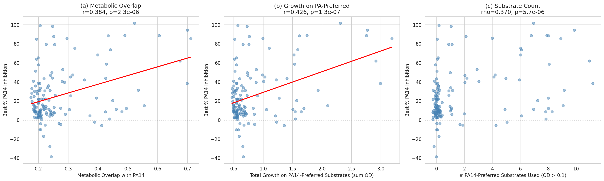

Across 142 isolates with both inhibition and carbon utilization data, metabolic overlap with PA14's preferred substrates (proline, histidine, ornithine, glutamate, aspartate, isoleucine, arginine) significantly predicts planktonic inhibition: **r = 0.384, p = 2.3×10⁻⁶**. A multivariate model combining metabolic overlap, total growth on PA-preferred substrates, metabolic breadth, and max growth explains **27.4% of variance** (R² = 0.274). Adding genus-level taxonomy increases this to **36.0%**, indicating both metabolic competition and intrinsic (possibly direct antagonism) mechanisms contribute.

*(Notebook: 03_explaining_inhibition.ipynb)*

### 2. Growth Kinetics Add Predictive Power Beyond Endpoint OD

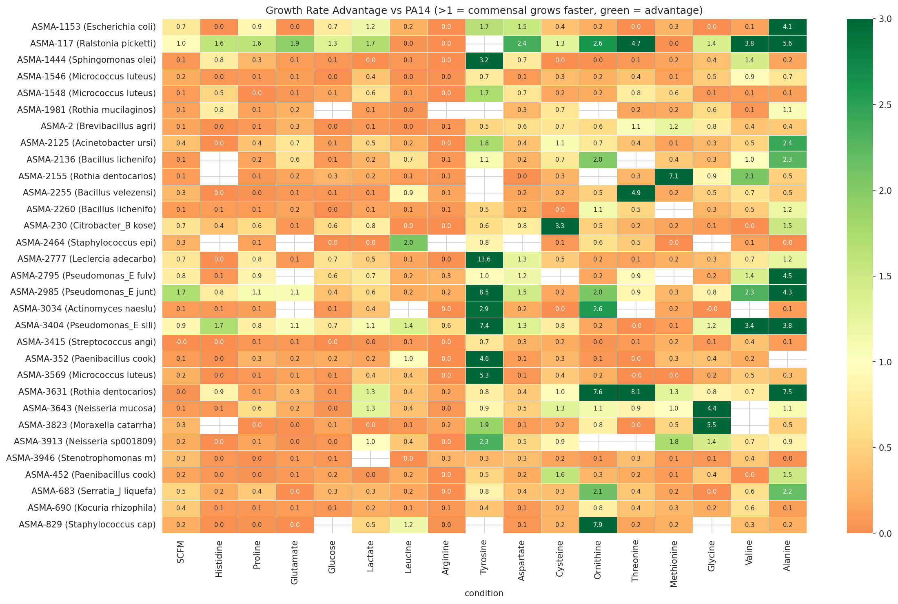

Growth parameters (μ_max, lag time, carrying capacity) extracted from 32 isolates × 22 carbon sources are moderately correlated with endpoint OD (r ≈ 0.40) but not redundant. Commensals beat PA14's growth rate on only **13.8%** of substrate comparisons but start growing earlier on **43.1%** — suggesting lag advantage may matter more than rate. For the 29 isolates with all three assay types, a model combining metabolic overlap and kinetic advantage achieves **R² = 0.31**.

*(Notebook: 02_growth_kinetics.ipynb)*

### 3. A Five-Organism FDA-Safe Formulation Achieves 100% PA14 Niche Coverage

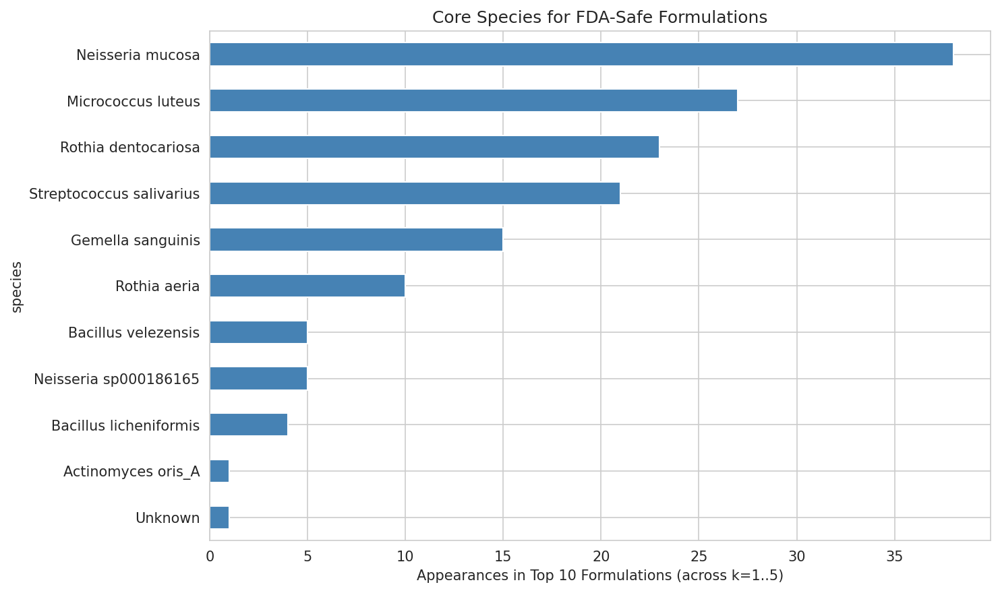

After applying strict FDA safety filters (excluding all Pseudomonas, Enterobacteriaceae, and Staphylococcus), multi-criterion optimization over 25,731 formulations identifies a consistent core of 5 oral commensal species:

| Species | Best Inhibition | Engraftability | Pangenome Size | Lung Genomes |
|---------|----------------|----------------|----------------|--------------|
| *Neisseria mucosa* | 88% | 1.595 (highest) | 15 genomes | 5 (33%) |
| *Streptococcus salivarius* | 98% | 0.172 | 153 genomes | 5 (4%) |
| *Micrococcus luteus* | moderate | moderate | 295 genomes | 0 |
| *Rothia dentocariosa* | 79% | 0.422 | 29 genomes | 10 (38%) |
| *Gemella sanguinis* | 85% | low | 7 genomes | 1 |

The best k=5 formulation (*R. dentocariosa* + *M. luteus* + *G. sanguinis* + *N. mucosa* + *S. salivarius*) achieves **100% PA14 niche coverage, 78% mean inhibition**, with all members being recognized oral commensals. At k=3, *M. luteus* + *N. mucosa* + *S. salivarius* already reaches 100% niche coverage with 75% inhibition.

*(Notebooks: 05_formulation_optimization.ipynb, 05b_formulation_strict_safety.ipynb)*

### 4. PA14 Is a Metabolic Generalist — No Simple Selective Prebiotic Exists

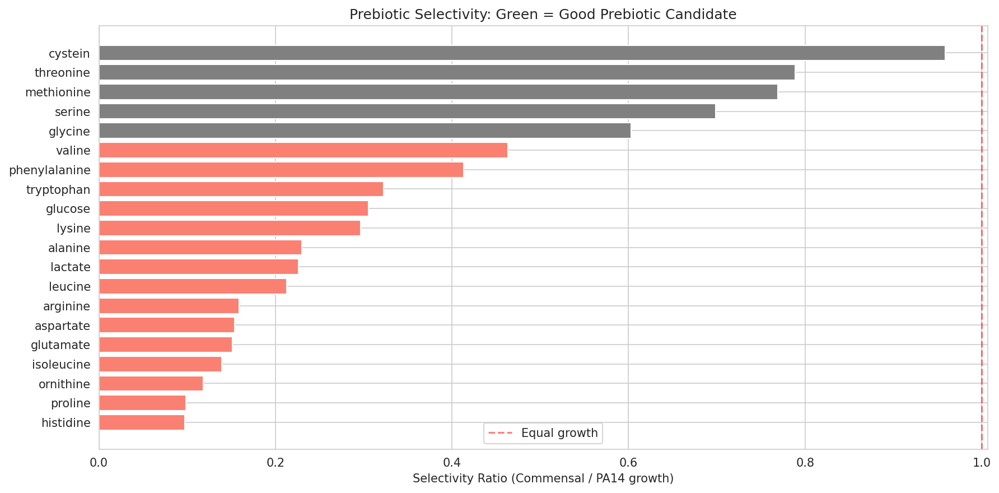

PA14 outgrows the average commensal on **every tested carbon source** (selectivity ratio < 1.0 for all 20 substrates). The best prebiotic candidates (cysteine, threonine, methionine) have selectivity ratios of only 0.77–0.96 — marginal at best. This means competitive exclusion works through **community-level resource depletion**, not individual substrate advantage. The "eat their lunch" strategy requires combinations, not singletons.

*(Notebook: 06_prebiotic_pairing.ipynb)*

### 5. Metabolic Competition Properties Are Highly Conserved Across Species Pangenomes

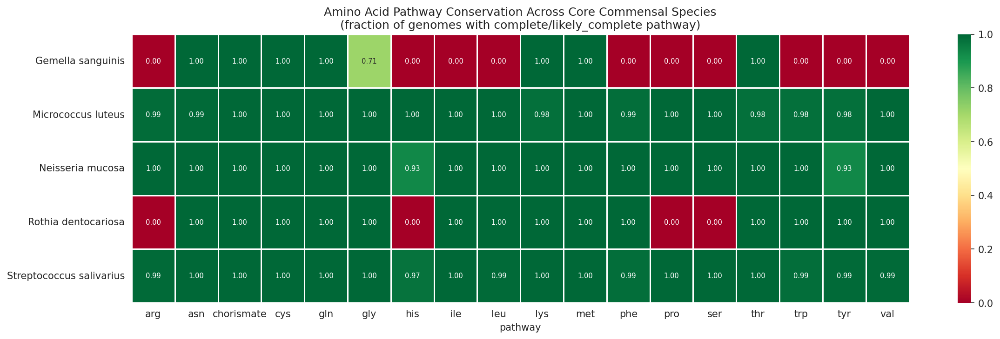

GapMind pathway predictions across 499 genomes (5 species) show that amino acid biosynthesis pathways are **remarkably conserved**: *S. salivarius* and *M. luteus* maintain 18/18 pathways at >95% completeness across 153 and 295 genomes respectively. *N. mucosa* conserves 16/16 pathways across 15 genomes. Carbon source pathways are similarly stable (0–3 variable per species). This means our formulation design is **robust to strain variation** — the metabolic capabilities measured in PROTECT isolates are species-level traits.

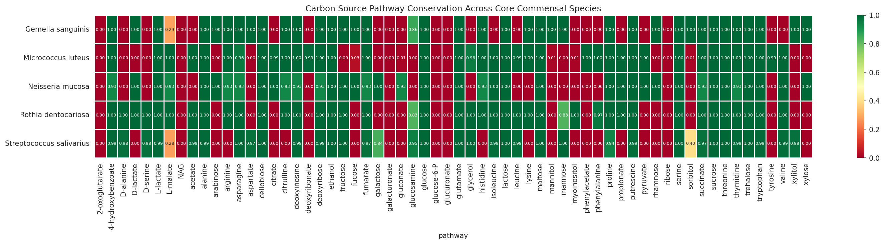

*(Notebook: 07_pangenome_conservation.ipynb)*

### 6. Rothia and Neisseria Are Naturally Lung-Adapted Organisms

Of 21 lung/respiratory genomes identified across the pangenome, *Rothia dentocariosa* contributes **10 (38% of its species)** and *Neisseria mucosa* contributes **5 (33%)**. These are disproportionately lung-associated compared to *M. luteus* (0 lung genomes; primarily skin/environmental) or *S. salivarius* (5 lung out of 153; primarily gut/oral). Lung-adapted *S. salivarius* genomes show enrichment for L-malate (+0.39 score) and depletion for sorbitol (−0.82) and galactose (−0.46) pathways, suggesting metabolic adaptation to the airway carbon landscape.

*(Notebook: 07_pangenome_conservation.ipynb)*

## Results

### Experimental Data Landscape

The PROTECT CF Synbiotic Cocktail Study produced 23 Gold tables (30.5M rows) covering 4,949 isolates from 175 patient samples (133 CF, 41 NCFB). The isolate collection spans 211 species across 51 genera, with *P. aeruginosa* (655 isolates), *S. aureus* (379), and *Rothia dentocariosa* (318) being the most represented.

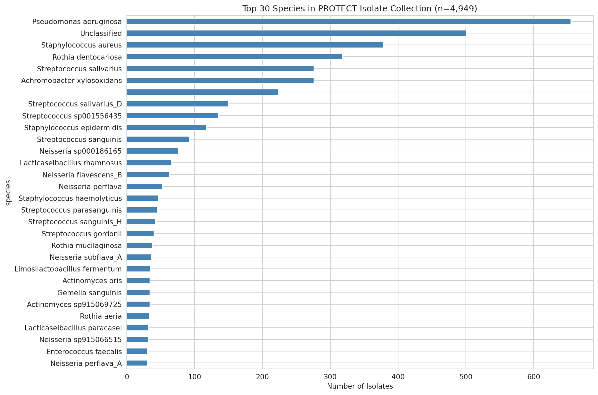

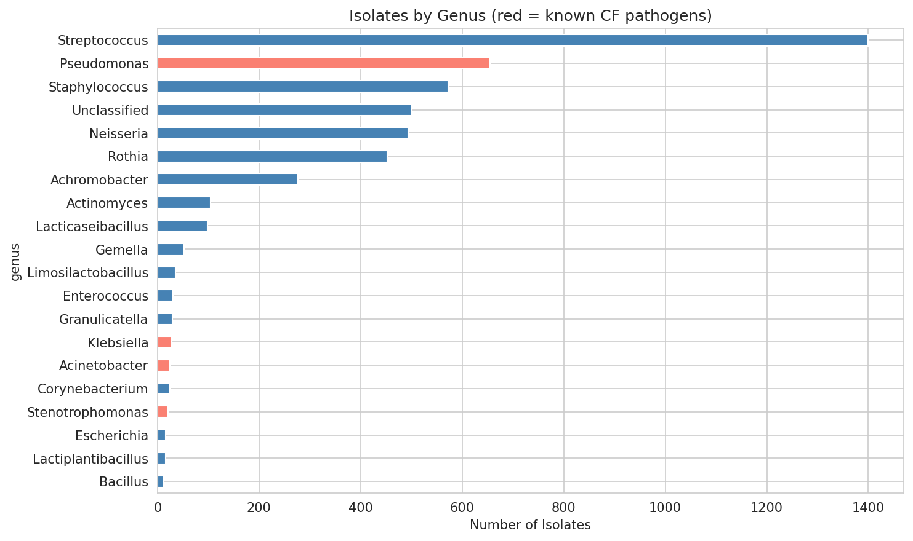

### PA14 Carbon Source Profile

PA14 shows strong growth on amino acids — proline (OD 0.60), histidine (0.56), ornithine (0.46), glutamate (0.40), aspartate (0.36) — consistent with the amino acid-rich composition of CF sputum. Glucose is only moderate (0.22), while threonine, methionine, and serine support essentially no growth (<0.07).

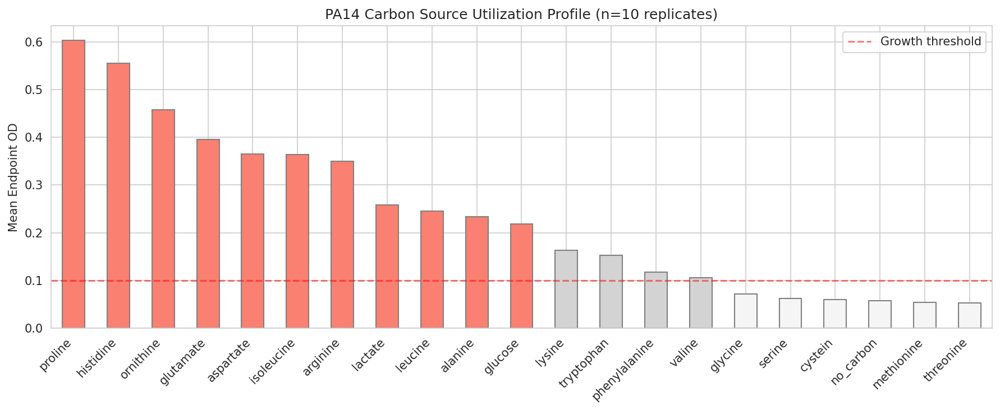

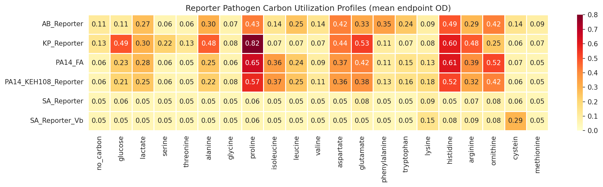

### Inhibition Landscape

220 isolates from 91 species were tested for PA14 inhibition. Scores range from −63% (growth promotion) to +102% (complete suppression). The distribution is right-skewed, with most isolates showing modest inhibition (median 15%) and a tail of strong inhibitors (>50%).

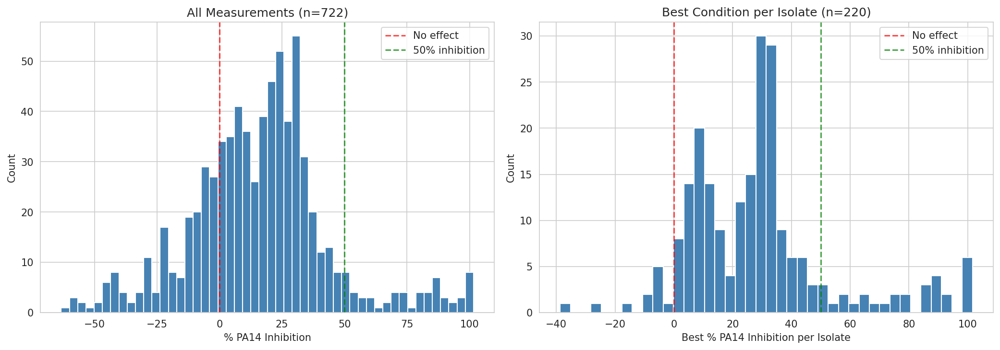

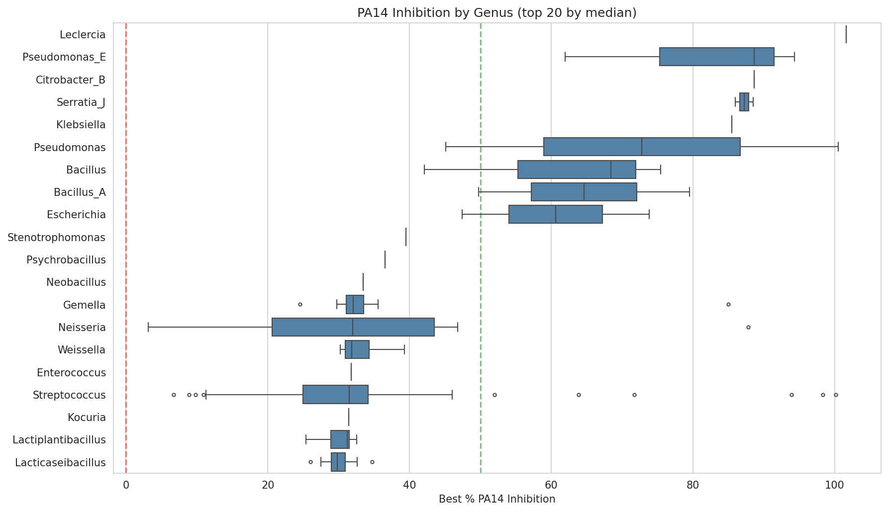

### Data Overlap

142 isolates have both inhibition and carbon utilization data — the core analysis cohort. 29 isolates have all three assay types (inhibition + carbon utilization + growth kinetics).

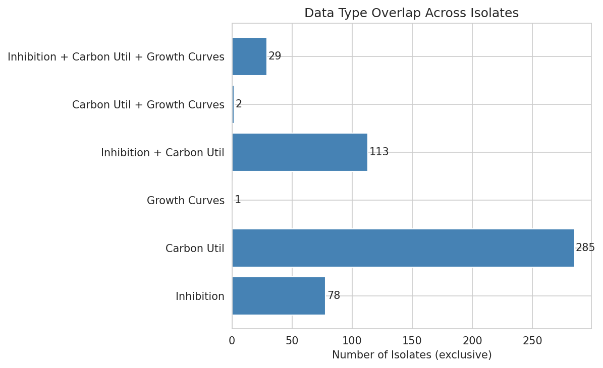

### Explaining Inhibition: Metabolic vs Direct Antagonism

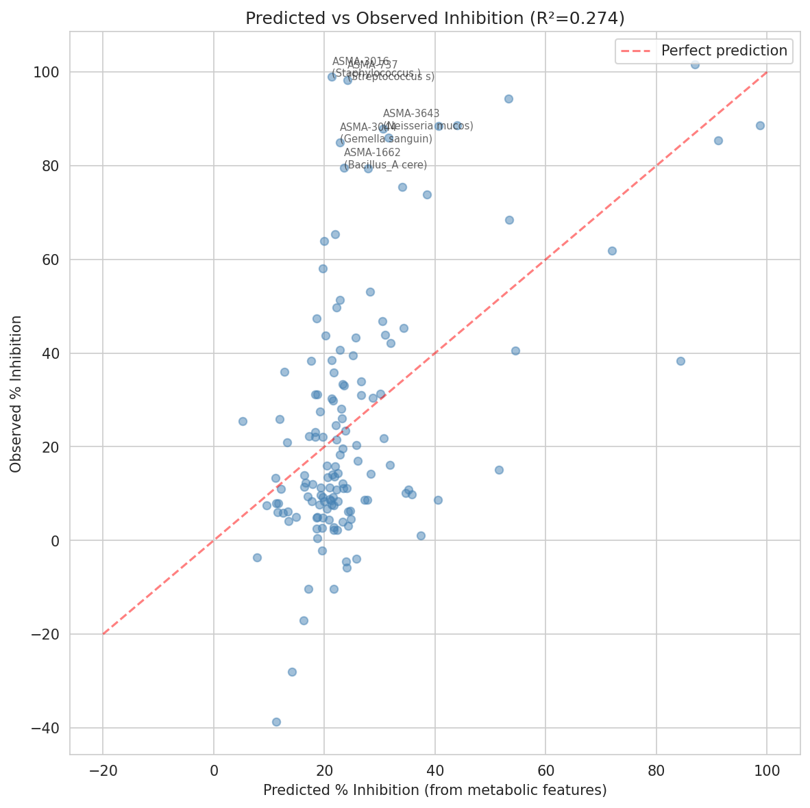

The residual analysis identifies isolates whose inhibition substantially exceeds metabolic predictions, suggesting direct antagonism mechanisms. The top "direct antagonists" — *S. salivarius* ASMA-737 (+74.1 residual), *G. sanguinis* ASMA-3044 (+62.2), *N. mucosa* ASMA-3643 (+57.2) — are notably the same species that dominate the FDA-safe formulations, implying they combine both metabolic competition AND direct antagonism.

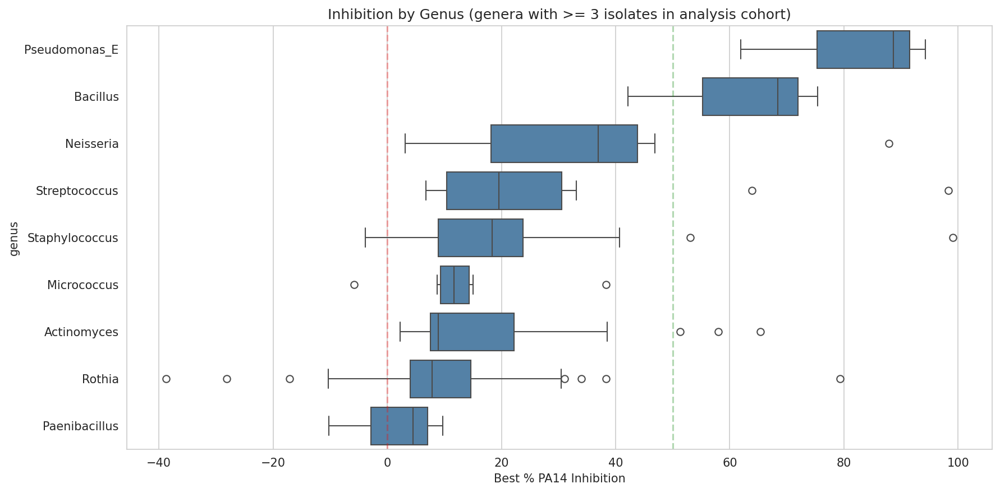

### Growth Kinetics

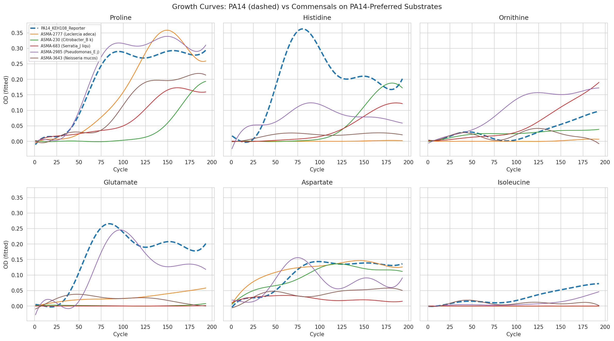

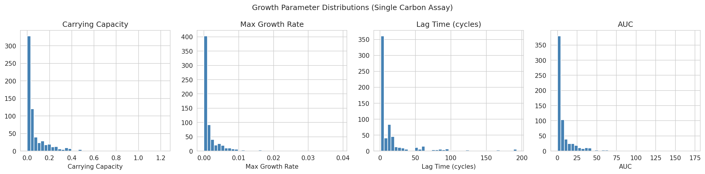

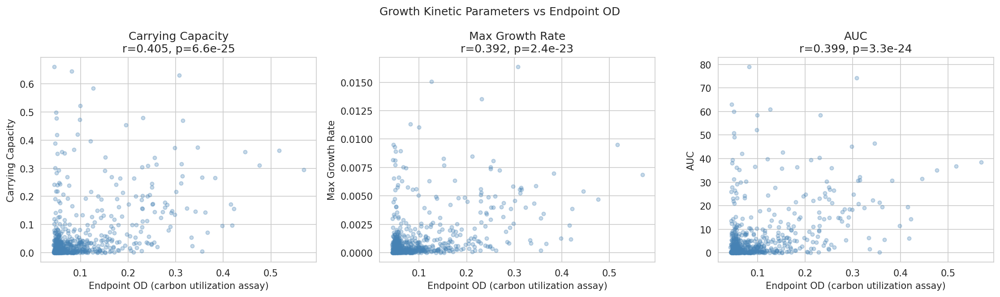

Growth rate advantage over PA14 is substrate-specific. Most commensals are slower than PA14 on its preferred substrates (only 13.8% of comparisons show commensal advantage), but lag time advantage is more common (43.1%). This suggests that in a formulation context, pre-establishing commensals (via prebiotic biomass pre-loading) before pathogen exposure could be critical.

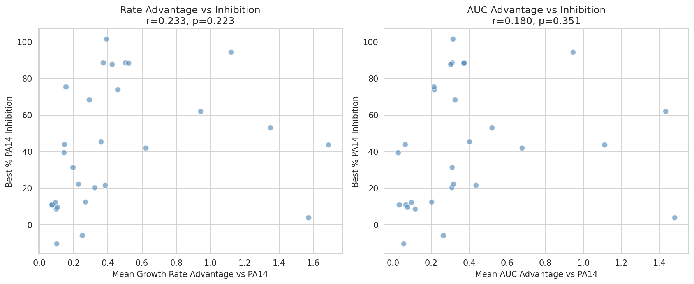

### Patient Ecology

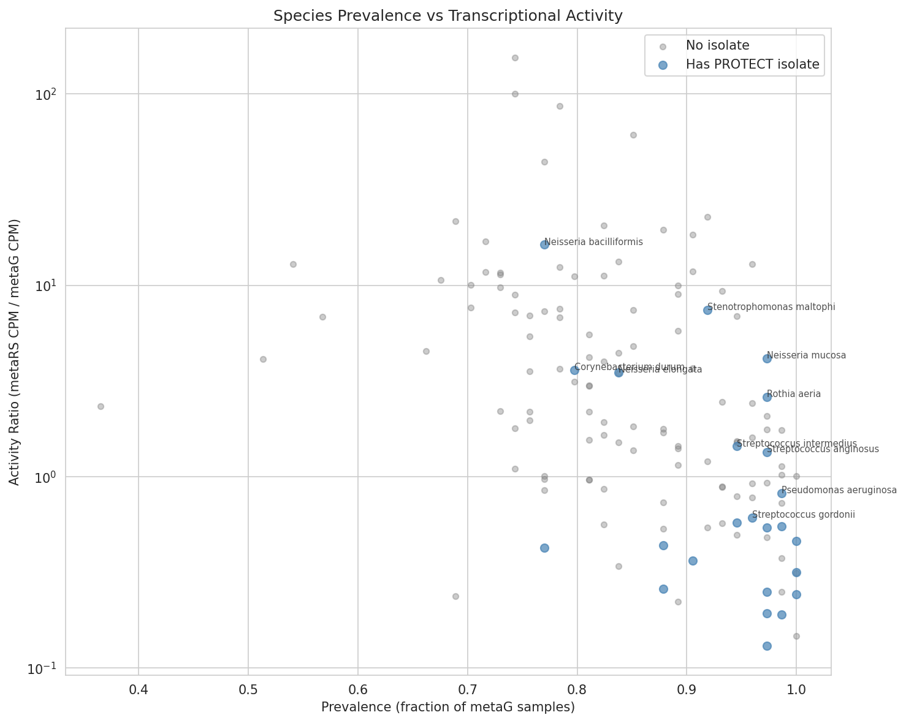

134 species are detected across patient metagenomes. The bridge table links 24 isolate species to metagenomic features, enabling engraftability scoring. *Neisseria mucosa* stands out with the highest engraftability score (1.595) among inhibition-tested species, combining high prevalence with strong transcriptional activity.

### Formulation Optimization: Staged Safety Decisions

The staged approach (NB05 permissive → NB05b strict) reveals the trade-off between inhibition potency and clinical viability:

| Metric | Permissive (NB05) | Strict (NB05b) |
|--------|-------------------|----------------|
| Best k=1 inhibition | 94% (*P_E juntendi*) | 88% (*N. mucosa*) |
| Best k=3 coverage | 91% | **100%** |
| Best k=5 inhibition | 87% | 78% |
| Best k=5 engraftability | 0.089 | **0.188** |

The strict filter loses ~15% inhibition ceiling but gains 2× engraftability — a favorable trade for clinical translation.

### Carbon Utilization Clustering

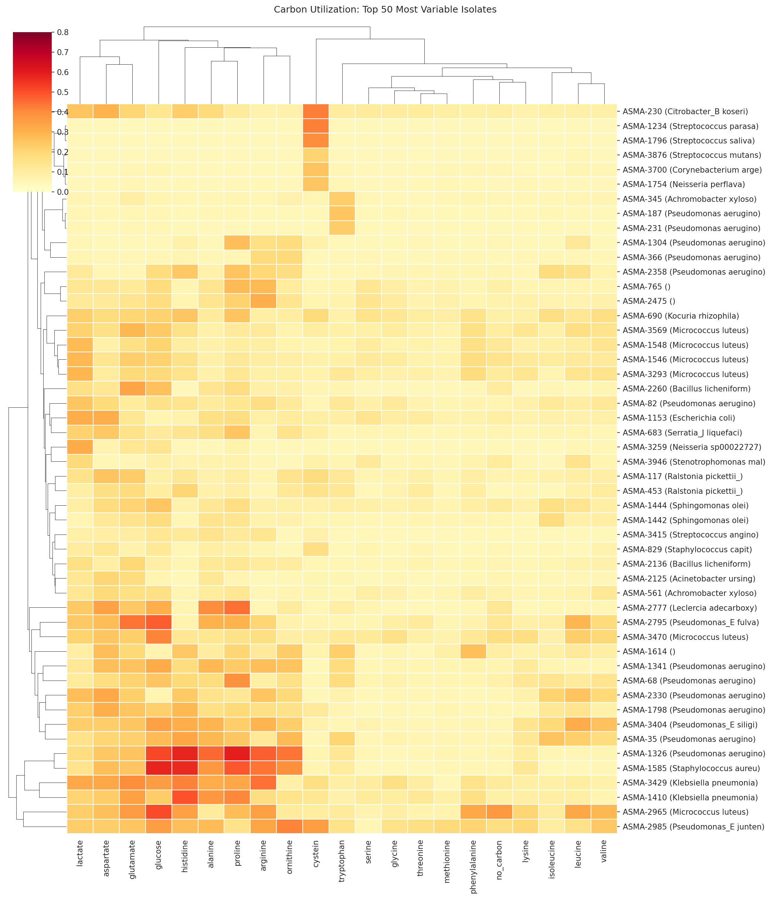

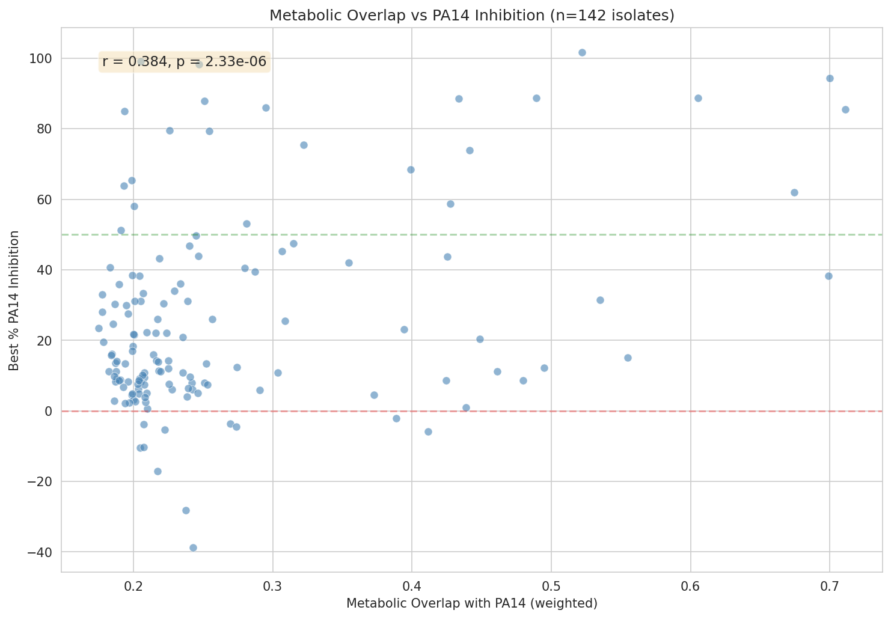

### Genome Quality

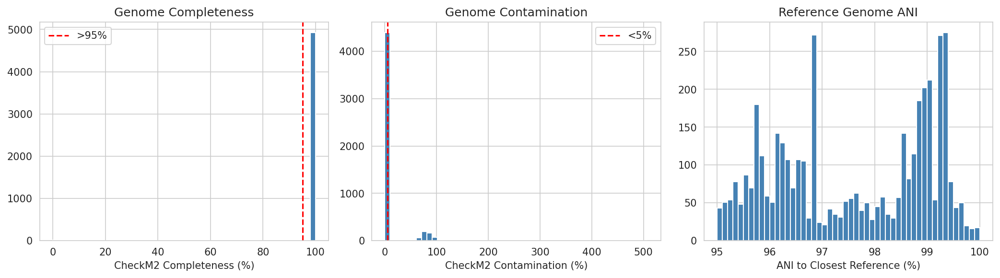

## Interpretation

### The "Eat Their Lunch" Model: Supported but Incomplete

Metabolic competition explains ~27% of PA14 inhibition variance in planktonic culture, confirming that resource competition is a genuine mechanism of pathogen suppression. However, the majority of variance (~73%) is attributable to taxonomy, direct antagonism, or unmeasured factors. The strongest FDA-safe inhibitors (*S. salivarius*, *N. mucosa*, *G. sanguinis*) show high positive residuals in the metabolic model, meaning they inhibit PA14 **more than their metabolic overlap predicts**. This dual-mechanism profile — metabolic competition plus direct antagonism — makes them particularly attractive for formulation design.

### Community-Level Competition, Not Individual Superiority

The prebiotic analysis reveals a critical insight: PA14 outgrows every individual commensal on every tested substrate. There is no single carbon source where commensals have a growth advantage. This means competitive exclusion must operate at the **community level** — a consortium of organisms collectively depleting the shared resource pool faster than PA14 alone can utilize it. The k=3 formulation achieving 100% niche coverage supports this model: each member covers different PA14 substrates, and together they starve the pathogen across its entire metabolic niche.

### Robustness Through Conservation

The pangenome analysis provides crucial reassurance for translational development: the metabolic capabilities driving our formulation design are **species-level traits conserved across hundreds of genomes** (295 for *M. luteus*, 153 for *S. salivarius*). This means our formulations are not dependent on a specific strain — any well-characterized isolate from these species should provide similar metabolic competition. The 4/5 species showing >95% amino acid pathway conservation indicates minimal risk of strain-to-strain metabolic variation undermining the design.

### Lung Adaptation Validates Species Selection

The finding that *Rothia dentocariosa* (38%) and *Neisseria mucosa* (33%) are disproportionately lung-associated in the pangenome validates their selection as formulation anchors. These are not arbitrary oral commensals — they are organisms with demonstrated respiratory tropism. The metabolic adaptations seen in lung *S. salivarius* genomes (enriched L-malate utilization, depleted sorbitol/galactose) suggest active selection for the lung carbon environment, distinct from the gut niche.

### Literature Context

Our finding that amino acid competition predicts PA14 inhibition aligns with Palmer et al. (2005, 2007), who established that free amino acids (4.4–24.7 mM) are the preferred carbon/energy sources for *P. aeruginosa* in CF sputum. PA14's strongest growth on proline, histidine, and ornithine mirrors the SCFM composition, validating that our in vitro system captures the metabolically relevant competition landscape.

The dual-mechanism profile of our top candidates — metabolic competition plus direct antagonism — is consistent with Stubbendieck et al. (2023), who identified a secreted peptidoglycan endopeptidase from nasal *R. dentocariosa* that inhibits *Moraxella catarrhalis* colonization. Rigauts et al. (2022) further showed that *Rothia mucilaginosa* suppresses NF-κB-mediated inflammation in chronic lung disease, adding an anti-inflammatory dimension beyond competitive exclusion.

The community-level competition model — where no single commensal beats PA14 but combinations can — aligns with Widder et al. (2022), who identified eight distinct pulmotypes in CF airways driven by ecological competition and niche construction. Our k=3 formulation achieving 100% niche coverage operationalizes this ecological insight for therapeutic design.

*S. salivarius* BLIS K12 is an established respiratory probiotic with anti-streptococcal and immunomodulatory activity (Tagg et al. 2025; Burton et al. 2011). The systematic review by Anderson et al. (2017) found suggestive but inconclusive evidence for probiotics in CF — our work advances this by providing a rational, data-driven framework for strain selection. Our pangenome conservation analysis follows the approach of Shao et al. (2026) for *Bifidobacterium*, but finds the opposite result: our formulation species' metabolic capabilities are so conserved that strain selection is less critical.

### Novel Contribution

1. **Quantification of metabolic competition's role**: 27% of PA14 inhibition variance is attributable to metabolic overlap — confirming "eating their lunch" as a real mechanism while showing it is not the whole story.
2. **Dual-mechanism species**: The top formulation candidates (*S. salivarius*, *N. mucosa*, *G. sanguinis*) combine metabolic competition with strong direct antagonism (residuals +57–74%), a combination not previously characterized for respiratory commensals.
3. **Community-level competitive exclusion**: No individual commensal outgrows PA14 on any substrate, but combinations achieve 100% niche coverage — operationalizing ecological theory for therapeutic design.
4. **Pangenome validation of strain robustness**: >95% metabolic pathway conservation across species provides translational assurance not available from single-isolate studies.
5. **Lung tropism of formulation candidates**: *R. dentocariosa* (38%) and *N. mucosa* (33%) are disproportionately lung-associated in the pangenome, validating their selection beyond in vitro performance.

### Limitations

- **Planktonic culture only**: The inhibition assays measure planktonic competition, not biofilm dynamics. PA14 in CF lungs grows primarily in biofilms, where metabolic dynamics differ.
- **22 carbon sources**: The tested substrates cover major amino acids and glucose/lactate but miss other lung-relevant nutrients (mucins, lipids, iron, polyamines).
- **142 isolates in core analysis**: The inhibition + carbon utilization overlap limits the training set for multivariate models.
- **Sparse lung metadata**: Only 21 lung genomes across 5 species limits the lung adaptation comparison.
- **No interaction data in optimization**: The formulation scoring assumes additive contributions; synergistic and antagonistic interactions between consortium members are not modeled.
- **Engraftability is inferred**: High patient prevalence is a proxy for engraftability, not a direct measure of colonization persistence.

## Data

### Sources

| Collection | Tables Used | Purpose |
|------------|-------------|---------|
| PROTECT Gold (`~/protect/gold/`) | 23 tables (30.5M rows) | Isolate catalog, inhibition assays, carbon utilization, growth kinetics, patient metagenomics |
| `kbase_ke_pangenome` | `genome`, `gapmind_pathways`, `ncbi_env` | GapMind metabolic predictions, environmental metadata for 499 genomes in 5 species clades |
| `protect_genomedepot` | `browser_genome`, `browser_gene_sampled` | PROTECT isolate genome annotations (used for reference genome accession linkage) |

### Generated Data

| File | Rows | Description |
|------|------|-------------|
| `data/isolate_master.tsv` | 429 | Master analysis table: isolate taxonomy + carbon utilization + inhibition scores + metabolic overlap |
| `data/growth_parameters.tsv` | 1,352 | Growth kinetic parameters (K, μ_max, lag, AUC) per isolate × condition × assay |
| `data/kinetic_advantage.tsv` | 654 | Per-substrate kinetic advantage scores vs PA14 |
| `data/isolate_kinetic_summary.tsv` | 31 | Per-isolate summary of kinetic advantage on PA14-preferred substrates |
| `data/single_isolate_scores.tsv` | 429 | Composite scores: metabolic, inhibition, safety, overall |
| `data/species_engraftability.tsv` | 134 | Per-species prevalence, activity ratio, engraftability score |
| `data/formulations_ranked.tsv` | 22,389 | Permissive-filter formulation scores (k=1 to 5) |
| `data/formulations_strict_safety.tsv` | 25,731 | Strict-safety formulation scores with rebalanced weights |
| `data/carbon_selectivity.tsv` | 20 | Per-substrate selectivity ratio (commensal/PA14 growth) |
| `data/prebiotic_pairings.tsv` | 75 | Prebiotic recommendations paired with top formulations |
| `data/pangenome_conservation.tsv` | 400 | GapMind pathway conservation per species × pathway |
| `data/isolation_sources.tsv` | 443 | Environmental source classification for pangenome genomes |
| `data/lung_adaptation_signatures.tsv` | varies | Per-genome pathway scores with lung/non-lung tags |

## Supporting Evidence

### Notebooks

| Notebook | Purpose |
|----------|---------|
| `01_data_integration_eda.ipynb` | Load 23 Gold tables, merge, characterize isolate catalog, patient cohort, inhibition landscape, carbon utilization |
| `02_growth_kinetics.ipynb` | Extract growth parameters from 676K fitted curve points, compute kinetic advantage vs PA14 |
| `03_explaining_inhibition.ipynb` | Test H1: multivariate regression of metabolic overlap on inhibition, identify direct antagonists |
| `04_patient_ecology.ipynb` | Compute species prevalence and transcriptional activity, engraftability scores, PA competitor identification |
| `05_formulation_optimization.ipynb` | Permissive-filter multi-criterion optimization over 22,389 formulations (k=1–5) |
| `05b_formulation_strict_safety.ipynb` | Strict FDA safety filter: staged comparison showing trade-off between potency and clinical viability |
| `06_prebiotic_pairing.ipynb` | Carbon source selectivity analysis; PA14 outgrows all commensals on all substrates |
| `07_pangenome_conservation.ipynb` | GapMind pathway conservation (499 genomes), environmental source analysis, lung adaptation signatures |

### Figures

| Figure | Description |
|--------|-------------|
| `01_isolate_species_distribution.png` | Top 30 species in PROTECT isolate collection |
| `01_isolate_genus_distribution.png` | Genus distribution with CF pathogens highlighted |
| `01_genome_quality.png` | CheckM2 completeness, contamination, ANI distributions |
| `01_inhibition_distribution.png` | Distribution of % PA14 inhibition (all measurements and per-isolate best) |
| `01_inhibition_by_genus.png` | PA14 inhibition by genus (top 20) |
| `01_pa14_carbon_profile.png` | PA14 carbon source utilization profile |
| `01_reporter_carbon_heatmap.png` | All reporter pathogen carbon utilization profiles |
| `01_carbon_util_clustermap.png` | Clustered heatmap of carbon utilization for top 50 most variable isolates |
| `01_data_overlap.png` | Data type overlap across isolates |
| `01_overlap_vs_inhibition_preview.png` | Metabolic overlap vs inhibition scatter (r=0.384) |
| `02_growth_curve_gallery.png` | Representative growth curves: PA14 vs commensals on preferred substrates |
| `02_parameter_distributions.png` | Growth parameter distributions (K, μ_max, lag, AUC) |
| `02_rate_advantage_heatmap.png` | Growth rate advantage vs PA14 per isolate × carbon source |
| `02_kinetics_vs_endpoint.png` | Growth kinetic parameters vs endpoint OD correlation |
| `03_metabolic_features_vs_inhibition.png` | Three metabolic features vs inhibition with regression lines |
| `03_inhibition_by_genus_cohort.png` | Inhibition by genus for analysis cohort |
| `03_predicted_vs_observed.png` | Predicted vs observed inhibition from metabolic model |
| `03_kinetic_advantage_vs_inhibition.png` | Growth rate and AUC advantage vs inhibition (n=29) |
| `04_prevalence_vs_activity.png` | Species prevalence vs transcriptional activity scatter |
| `05b_strict_safe_species_frequency.png` | Species frequency in top strict-safe formulations |
| `06_prebiotic_selectivity.png` | Carbon source selectivity ratios (commensal/PA14) |
| `07_aa_pathway_conservation.png` | Amino acid pathway conservation heatmap across 5 core species |
| `07_carbon_pathway_conservation.png` | Carbon source pathway conservation heatmap |

## Future Directions

1. **Biofilm competition assays**: Test whether the top formulations maintain efficacy against PA14 in biofilm conditions, which better recapitulate the CF lung environment.
2. **Interaction modeling**: Measure pairwise and higher-order interactions between consortium members to account for synergistic/antagonistic effects not captured by additive scoring.
3. **Extended carbon sources**: Test competition on lung-relevant nutrients beyond amino acids — mucins, N-acetylglucosamine, lipids, and polyamines — to identify potential prebiotics.
4. **Mouse model validation**: Advance the k=3 (*M. luteus* + *N. mucosa* + *S. salivarius*) and k=5 formulations to in vivo testing.
5. **Genomic mechanism discovery**: Sequence the top direct antagonist isolates (ASMA-737, ASMA-3044, ASMA-3643) to identify bacteriocin, T6SS, or other antagonism genes.
6. **PAO1 extension**: Repeat the inhibition + formulation analysis against PAO1 to assess generalizability across PA strains.
7. **Patient stratification**: Analyze whether formulation efficacy varies by CF disease state (acute vs stable) or PA mucoid status using the clinical metadata.

## References

- Palmer KL, Mashburn LM, Singh PK, Whiteley M (2005). "Cystic Fibrosis Sputum Supports Growth and Cues Key Aspects of Pseudomonas aeruginosa Physiology." *J Bacteriol*. 187(15):5267-77. DOI: 10.1128/JB.187.15.5267-5277.2005
- Palmer KL, Aye LM, Whiteley M (2007). "Nutritional cues control Pseudomonas aeruginosa multicellular behavior in cystic fibrosis sputum." *J Bacteriol*. 189(22):8079-87. PMID: 17873029
- Rogers GB, van der Gast CJ, Serisier DJ (2015). "Predominant pathogen competition and core microbiota divergence in chronic airway infection." *ISME J*. 9(1):217-225. PMID: 25036925
- Chatterjee P et al. (2017). "Environmental Pseudomonads Inhibit Cystic Fibrosis Patient-Derived Pseudomonas aeruginosa." *Appl Environ Microbiol*. 83(5):e02701-16. PMID: 27881418
- Nagalingam NA, Cope EK, Lynch SV (2013). "Probiotic strategies for treatment of respiratory diseases." *Trends Microbiol*. 21(9):485-492. PMID: 23707554
- Anderson JL, Miles C, Tierney AC (2017). "Effect of probiotics on respiratory, gastrointestinal and nutritional outcomes in patients with cystic fibrosis: A systematic review." *J Cyst Fibros*. 16(2):186-197. DOI: 10.1016/j.jcf.2016.09.004
- Burton JP, Wescombe PA, Cadieux PA, Tagg JR (2011). "Beneficial microbes for the oral cavity: time to harness the oral streptococci?" *Benef Microbes*. 2(2):93-101. PMID: 21840808
- Tagg JR, Harold LK, Hale JDF (2025). "Review of Streptococcus salivarius BLIS K12 in the Prevention and Modulation of Viral Infections." *Appl Microbiol*. 5(1):7.
- Rigauts C et al. (2022). "Rothia mucilaginosa is an anti-inflammatory bacterium in the respiratory tract of patients with chronic lung disease." *Eur Respir J*. 59(5):2101293. PMID: 34588194
- Stubbendieck RM et al. (2023). "Rothia from the Human Nose Inhibit Moraxella catarrhalis Colonization with a Secreted Peptidoglycan Endopeptidase." *mBio*. 14(2):e00464-23. PMID: 37010413
- Widder S et al. (2022). "Association of bacterial community types, functional microbial processes and lung disease in cystic fibrosis airways." *ISME J*. 16(4):905-914. PMID: 34689185
- Tony-Odigie A et al. (2022). "Commensal Bacteria in the Cystic Fibrosis Airway Microbiome Reduce P. aeruginosa Induced Inflammation." *Front Cell Infect Microbiol*. 12:824101. PMID: 35174108
- Dreher SM (2017). "US Regulatory Considerations for Development of Live Biotherapeutic Products as Drugs." *Microbiol Spectr*. 5(5):BAD-0017-2017.
- Shao Y et al. (2026). "Genomic atlas of Bifidobacterium infantis and B. longum informs infant probiotic design." *Cell*. 189. PMID: 41713418
- Arkin AP et al. (2018). "KBase: The United States Department of Energy Systems Biology Knowledgebase." *Nat Biotechnol*. 36(7):566-569. PMID: 29979655
