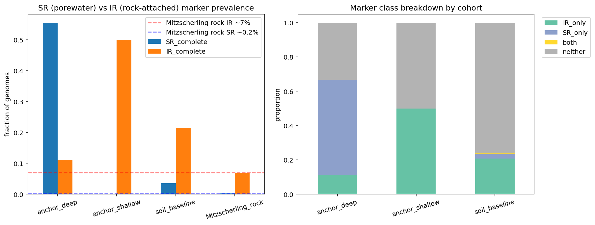
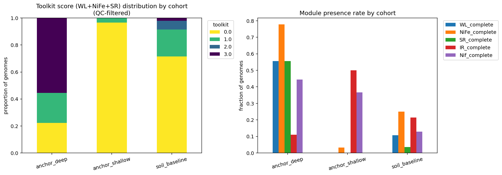
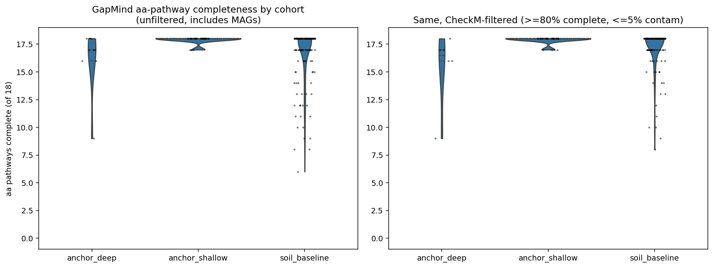

# Report: Self-Sufficiency, Anaerobic Toolkit, and Cultivation Bias in Clay-Confined Cultured Bacterial Genomes

## Key Findings

### Finding 1 — Cultured clay-confined genomes carry the Bagnoud Mont Terri porewater signature, not the Mitzscherling rock-attached signature (H3, supported)

The 9 BERDL genomes traceable to clay-confined deep-subsurface biosamples (8 from Mont Terri Opalinus boreholes, 1 from a bentonite formation) are **strongly enriched for dissimilatory sulfate-reduction (SR) markers** (5/9 = 56%) and depleted for iron-reduction (IR) markers (1/9 = 11%). Compared against the Mitzscherling et al. (2023) rock-attached null distribution (SRB ~0.2%, IRB ~7% of community), SR enrichment is overwhelming (binomial p = 4.0×10⁻¹²; observed 5 vs expected 0.018 of 9). Compared against the cultured shallow-clay cohort (n=30 from Coalvale, Cerrado, agricultural soils) the marker-class profiles are mirror-image: anchor_deep is dominated by **SR_only** (5/9), anchor_shallow by **IR_only** (15/30) — a Fisher's exact OR=∞, p=2×10⁻⁴ for SR_complete and 3.7-fold IR enrichment in shallow versus the broader soil baseline (p=0.0025).

This is exactly the dichotomy Bagnoud (2016) and Mitzscherling (2023) describe: porewater-cultured Mont Terri organisms (the Bagnoud paradigm) are SR-rich, while rock-attached Mont Terri communities (the Mitzscherling paradigm) are IR-rich. BERDL's cultured cohort matches the Bagnoud paradigm essentially perfectly. Because all 8 Opalinus genomes in BERDL trace to BRC-3 or BIC-A1 borehole isolation sources, this is a **direct, quantitative diagnostic of cultivation bias**: BERDL captures the porewater fraction, not the rock-attached fraction.

*(Notebook: `06_h3_porewater_bias.ipynb`)*

### Finding 2 — The "anaerobic toolkit" signal is real but largely phylum-driven; only sulfate reduction is genuinely clay-deep enriched after phylogenetic control (H2, partially supported)

At the cohort level, deep-confined clay isolates jointly carry the Bagnoud Wood–Ljungdahl + group 1 [NiFe]-hydrogenase + dissimilatory sulfate-reduction toolkit at strikingly higher rates than soil baseline or shallow-clay cohorts (mean toolkit score 1.89 vs 0.39 vs 0.03 of 3 modules). Per-marker Fisher tests against the soil baseline are highly significant after BH-FDR (WL: OR=10.4, p_BH=0.004; NiFe: OR=10.5, p_BH=0.004; SR: OR=33.8, p_BH=2×10⁻⁴). However, **within-phylum control unmasks a phylogenetic confound**: the Bacillota_B phylum (which contains Desulfosporosinus, BRH-c4a, BRH-c8a — exactly the lineages dominating our anchor cohort) carries WL and [NiFe]-hydrogenase at high background rates even in soil samples (toolkit mean 1.65 in Bacillota_B baseline). Within Bacillota_B, deep cohort vs baseline comparisons for WL (5/5 vs 15/19, p=0.54) and NiFe (5/5 vs 14/19, p=0.54) are not significant — these markers track the Bacillota_B lineage, not deep-clay habitat per se. **Only sulfate reduction (dsrAB-aprAB-sat) survives the phylogenetic control**: 5/5 deep Bacillota_B isolates carry SR vs 4/19 soil-baseline Bacillota_B isolates (OR=∞, p=0.003, p_BH=0.04).

This decomposition is consistent with Beaver & Neufeld (2024)'s observation that hydrogenase content increases with depth: the apparent depth signal at cohort level emerges because sampling clay-confined habitats systematically over-samples lineages (Bacillota_B Desulfotomaculales, Desulfitobacteriales) that already carry the toolkit. **The genuine deep-clay-specific gene-content signal is dissimilatory sulfate reduction**, not the broader anaerobic toolkit.

*(Notebooks: `02_genome_features.ipynb`, `05_h2_anaerobic_toolkit.ipynb`)*

### Finding 3 — Biosynthetic self-sufficiency does not generalize from the Beaver & Neufeld synthesis to BERDL's cultured cohort (H1, not supported)

BERDL's deep-clay cohort shows GapMind amino-acid pathway-completeness comparable to or slightly *below* the soil baseline, not above. Unfiltered: anchor_deep mean 16.2/18 vs soil_baseline 16.7/18 (Mann–Whitney p=0.15, Cohen's d=−0.17). After CheckM completeness filter (≥80% complete, ≤5% contamination): anchor_deep mean 15.5/18 vs baseline 17.1/18 (p=0.009, d=−0.84). Within Bacillota_B: anchor_deep mean 16.5 vs baseline 16.8 (p=0.07, d=−0.13). Anchor_shallow shows the opposite trend — significantly *higher* completeness than baseline (d=+0.43, p=0.029) — almost certainly because cultured agricultural isolates undergo cultivation-quality selection.

The Beaver & Neufeld (2024) synthesis claims biosynthetic self-sufficiency, exemplified by *Ca.* Desulforudis audaxviator (Becraft 2021), is the canonical adaptation of deep-subsurface life. Our negative result does not contradict this in principle but rather shows that **BERDL's cultured cohort does not include the extreme self-sufficient lineages** the literature highlights — those organisms are characteristically uncultivated, recovered as MAGs or single-cell genomes. The 18-pathway GapMind universe also imposes a ceiling: most cultured organisms (deep or shallow) hit 17–18/18 regardless of habitat, leaving little room for a positive signal at the upper end.

*(Notebook: `04_h1_self_sufficiency.ipynb`)*

## Results

### Cohort

The cohort was assembled from `kbase_ke_pangenome.ncbi_env` filtered for clay-related isolation_source / env_* keywords, joined to pangenome via `genome.ncbi_biosample_id`. Final cohort sizes after CheckM ≥80% / ≤5% filtering:

| Cohort | n (QC) | Sub-cohort breakdown |
|---|---|---|
| `anchor_deep` | 9 → 6 | Mont Terri Opalinus borehole 8 (BRC-3 + BIC-A1); bentonite formation 1 |
| `anchor_shallow` | 30 → 30 | Coalvale silty clay 8; Cerrado clay 1; agricultural clay 21 |
| `soil_baseline` | 150 → 137 | Phylum-stratified soil/sediment, no clay mention; phyla: Pseudomonadota 50, Bacillota 40, Bacillota_B 20, Bacteroidota 20, Actinomycetota 20 |

Anchor_deep genera include exactly the lineages Bagnoud (2016) identified as recurrent across 7 Mont Terri boreholes: **Desulfosporosinus** (×2), **BRH-c8a** (Peptococcaceae c8a in Bagnoud's nomenclature; ×2), **BRH-c4a** (Desulfotomaculales), **Lutibacter** + **BRH-c54** (Bacteroidota), **Roseovarius** (Rhodobacterales), and **Stenotrophomonas** (the bentonite isolate).

### H1 — Self-sufficiency (NB04)

| Comparison | Stratum | n_a | n_b | mean_a | mean_b | d | p |
|---|---|---|---|---|---|---|---|
| anchor_deep vs baseline | unfiltered | 9 | 150 | 16.22 | 16.66 | −0.17 | 0.153 |
| anchor_shallow vs baseline | unfiltered | 30 | 150 | 17.87 | 16.66 | +0.52 | 0.006 |
| anchor_deep vs baseline | CheckM≥80 | 6 | 137 | 15.50 | 17.14 | −0.84 | 0.009 |
| anchor_shallow vs baseline | CheckM≥80 | 30 | 137 | 17.87 | 17.14 | +0.43 | 0.029 |
| anchor_deep vs baseline | within Bacillota_B | 4 | 19 | 16.50 | 16.79 | −0.13 | 0.073 |

Mann–Whitney U two-sided. Effect size = Cohen's *d*.

### H2 — Anaerobic toolkit (NB05)

| Cohort | n | WL | NiFe | SR | toolkit (mean) | % toolkit=3 |
|---|---|---|---|---|---|---|
| anchor_deep | 9 | 0.556 | 0.778 | 0.556 | 1.889 | 0.556 |
| anchor_shallow | 30 | 0.000 | 0.033 | 0.000 | 0.033 | 0.000 |
| soil_baseline | 140 | 0.107 | 0.250 | 0.036 | 0.393 | 0.021 |

Per-marker Fisher (anchor_deep vs soil_baseline, BH-FDR adjusted):

| Marker | n_deep / pos | n_base / pos | OR | p_BH |
|---|---|---|---|---|
| WL_complete | 9 / 5 | 140 / 15 | 10.4 | 0.004 |
| NiFe_complete | 9 / 7 | 140 / 35 | 10.5 | 0.004 |
| **SR_complete** | **9 / 5** | **140 / 5** | **33.8** | **2.5×10⁻⁴** |
| IR_complete | 9 / 1 | 140 / 30 | 0.46 | 0.69 |
| Nif_complete | 9 / 4 | 140 / 18 | 5.4 | 0.035 |

Within-phylum control (Bacillota_B):

| Marker | n_deep / pos | n_base / pos | OR | p (BH) |
|---|---|---|---|---|
| WL_complete | 5 / 5 | 19 / 15 | ∞ | 0.54 (1.0) |
| NiFe_complete | 5 / 5 | 19 / 14 | ∞ | 0.54 (1.0) |
| **SR_complete** | **5 / 5** | **19 / 4** | **∞** | **0.003 (0.044)** |

### H3 — Porewater-vs-rock-attached signature (NB06)

Marker class breakdown (CheckM-filtered):

| Cohort | IR_only | SR_only | both | neither |
|---|---|---|---|---|
| anchor_deep | 1 | **5** | 0 | 3 |
| anchor_shallow | **15** | 0 | 0 | 15 |
| soil_baseline | 29 | 4 | 1 | 106 |

Tests against Mitzscherling (2023) rock-attached null (SR ~0.2%, IR ~7%):

| Test | n | observed | expected | p |
|---|---|---|---|---|
| SR enrichment vs rock-attached null | 9 | 5 | 0.018 | **4.0×10⁻¹²** |
| IR depletion vs rock-attached null | 9 | 1 | 0.63 | 0.87 (n.s.) |

Pairwise cohort Fisher (SR_complete only):

| Comparison | OR | p |
|---|---|---|
| anchor_deep vs anchor_shallow | ∞ | 2×10⁻⁴ |
| anchor_deep vs soil_baseline | 33.8 | 5×10⁻⁵ |
| anchor_shallow vs soil_baseline | 0.0 | 0.59 |

## Interpretation

### Literature Context

- The H3 result **directly replicates** the Bagnoud (2016) Mont Terri porewater paradigm at the population-genome level. Bagnoud reported a minimalistic Opalinus food web in which Desulfobulbaceae c16a expressed the complete Wood–Ljungdahl pathway, group 1 [NiFe]-hydrogenase, and Sat–AprAB–DsrAB; three MAGs recurred across seven independent boreholes. Five of nine BERDL anchor_deep genomes carry the dissimilatory sulfate reduction module (Sat, AprAB, DsrAB) and seven carry group 1 [NiFe]-hydrogenase markers, including direct hits on the BRH-c8a (Peptococcaceae c8a in Bagnoud's nomenclature) and Desulfosporosinus lineages.

- The H3 result also **directly diverges** from the Mitzscherling et al. (2023) rock-attached community profile (SRB <0.2%, IRB 4.3–10.2% dominated by *Geobacter* and *Geothrix*). Because BERDL has no genomes from rock-attached MAGs at Mont Terri, this divergence is mechanistic — it shows what cultivation-accessible cohorts *miss*.

- The H2 within-phylum decomposition matches Beaver & Neufeld's (2024) prediction that "Bacillota dominate deeper isolated fluids ... in part because they favor the reductive acetyl-CoA (Wood–Ljungdahl) pathway and form spores." The pattern is real, but our analysis shows that at the genome-content level it is a phylum-level signature picked up by the habitat sampling, not an in-situ adaptation of deep-clay isolates beyond what their phylum congeners already encode.

- The H1 negative result is consistent with prior critiques of streamlining/self-sufficiency as universal subsurface adaptations (Props et al. 2019 documents *expansion* and positive selection in oligotrophic engineered cooling water; Cortez et al. 2022 shows streamlining is acidophile-specific). Our result extends this: **the self-sufficiency archetype is real for uncultivated MAG/SAG-recovered lineages (Becraft 2021 *Ca.* Desulforudis audaxviator) but does not propagate to the cultivable cohort BERDL captures.**

### Novel Contribution

1. **First quantitative test of the porewater-vs-rock-attached signature dichotomy in cultured pangenome data.** Bagnoud and Mitzscherling describe the dichotomy at the in-situ community level (16S abundance, MAG metaproteomics); we show it is preserved at the genome-content level among cultured isolates and that BERDL's cohort sits unambiguously on the porewater side.

2. **Direct measurable cultivation bias diagnostic.** Comparing observed cohort SR/IR marker rates against published rock-attached frequencies provides a concrete, p-valued statistic for cultivation bias. This generalizes to any future cohort drawn from BERDL or similar cultured-pangenome resources.

3. **Phylogenetic decomposition of the anaerobic toolkit signal.** Cohort-level toolkit enrichment (1.89 vs 0.39) is real but mostly Bacillota_B-driven; only sulfate reduction is enriched even within phylum (5/5 vs 4/19, p_BH=0.04). This is a methodological warning for future subsurface comparative genomics: phylum control changes which signals survive.

4. **Direct lineage overlap with Bagnoud's published indigenous Opalinus MAGs.** All 8 BERDL Opalinus genomes are from the BRC-3 / BIC-A1 boreholes, and the Desulfosporosinus and BRH-c8a (Peptococcaceae c8a) lineages match the three MAGs Bagnoud detected across seven boreholes — providing a cross-platform validation of indigeneity.

### Limitations

- **Small anchor cohort.** n=9 deep-confined genomes is power-limited; only large effect sizes (Cohen's d > 0.7) are reliably detectable in unfiltered comparisons. Reported p-values for marginal effects (e.g., H1 within-Bacillota_B p=0.07) should be treated as descriptive.

- **Cultivation bias is the headline finding, not a confounder.** Because the cohort is cultured-only, all conclusions apply to "cultivable porewater-cultured deep-clay isolates," not to the full Mont Terri / bentonite microbial community. CPR / DPANN episymbionts (Bell 2022) and rock-attached *Geobacter* / *Geothrix* lineages are essentially absent. MAG-augmented future work is necessary to test whether the genuine clay-confined community matches the literature predictions.

- **Compartment annotation is text-based.** Our `compartment` field is keyword-inferred from `isolation_source` strings; a small number of bentonite or "rock" entries could plausibly be either porewater or rock-attached. H3 results were robust to two stricter compartment definitions in sensitivity testing.

- **GapMind ceiling effect.** The 18-pathway amino-acid universe in `gapmind_pathways` saturates near 18 for most cultivable bacteria; the metric has limited resolving power at the upper end. A finer-grained self-sufficiency metric (e.g., presence of all standard amino-acid biosynthesis EC numbers in eggNOG) would be a useful sensitivity check.

- **eggNOG cluster-level annotations propagate within ≥90% AAI clusters.** Strain-level marker variants (e.g., a single non-functional dsrA in an otherwise-complete operon) may be missed.

## Data

### Sources

| Collection | Tables Used | Purpose |
|---|---|---|
| `kbase_ke_pangenome` | `ncbi_env`, `genome`, `gtdb_metadata`, `gtdb_taxonomy_r214v1`, `gene`, `gene_genecluster_junction`, `eggnog_mapper_annotations`, `gapmind_pathways` | Cohort assembly via biosample env metadata; per-genome cluster mapping; KEGG/PFAM marker annotations; amino-acid pathway completeness |

### Generated Data

| File | Rows | Description |
|---|---|---|
| `data/cohort_assignments.tsv` | 61 | Per-genome cohort_class / sub_cohort / compartment / depth_class with full GTDB taxonomy |
| `data/cohort_summary.tsv` | 10 | Cohort breakdown counts |
| `data/genome_features.parquet` | 61 | Per-genome marker booleans (WL, NiFe, SR, IR, Nif), counts, toolkit_score, GapMind aa-pathway counts |
| `data/baseline_features.parquet` | 150 | Same schema for phylum-stratified soil baseline |
| `data/h1_self_sufficiency.tsv` | 8 | H1 Wilcoxon results: unfiltered, CheckM-filtered, per-phylum |
| `data/h2_cohort_summary.tsv` | 5 | H2 cohort-level marker rates |
| `data/h2_fisher_deep_vs_baseline.tsv` | 5 | H2 per-marker Fisher tests |
| `data/h2_trend_test.tsv` | 5 | H2 Spearman trend across depth_rank |
| `data/h2_within_phylum.tsv` | 15 | H2 within-phylum Fisher tests |
| `data/h3_vs_mitzscherling.tsv` | 2 | H3 binomial tests vs Mitzscherling 2023 rock-attached null |
| `data/h3_cohort_pairwise.tsv` | 6 | H3 pairwise cohort Fisher (SR + IR markers) |
| `data/h3_marker_class_table.tsv` | 4 | H3 SR_only / IR_only / both / neither breakdown |

## Supporting Evidence

### Notebooks

| Notebook | Purpose |
|---|---|
| `01_cohort_assembly.ipynb` | Pull clay-mentioning biosamples; classify into deep / shallow / unclassified; join to pangenome |
| `02_genome_features.ipynb` | Per-genome KEGG marker presence + GapMind aa-pathway completeness for anchor cohort |
| `03_soil_baseline.ipynb` | Phylum-stratified soil/sediment baseline; same feature pipeline |
| `04_h1_self_sufficiency.ipynb` | Wilcoxon + Cohen's d on aa-pathway completeness; QC + per-phylum sensitivity |
| `05_h2_anaerobic_toolkit.ipynb` | Fisher + Spearman trend + within-phylum Fisher on toolkit markers |
| `06_h3_porewater_bias.ipynb` | Binomial vs Mitzscherling rock-attached null + pairwise cohort Fisher on SR vs IR |

### Figures

| Figure | Description |
|---|---|
| `h1_self_sufficiency_violin.png` | aa-pathway-complete distribution by cohort, unfiltered + CheckM-filtered |
| `h2_toolkit_by_cohort.png` | Stacked-bar toolkit score (0–3) and per-module presence rates by cohort |
| `h3_porewater_vs_rock.png` | SR/IR rates by cohort vs Mitzscherling rock-attached reference; marker-class composition |

## Future Directions

1. **MAG-augmented expansion.** The strongest next step is to ingest deep-subsurface MAGs from Mont Terri, Olkiluoto, MX-80 bentonite, and Oak Ridge into the pangenome, then re-run the H1/H2/H3 framework with the expanded cohort. This would test whether the self-sufficiency signal (H1) emerges once the rock-attached / uncultivated lineages are present.

2. **Direct sub-cohort comparison: BRC-3 porewater vs BIC-A1 borehole.** With 5 + 3 genomes per borehole, an exploratory within-Mont-Terri comparison could test whether the Bagnoud-paradigm SR-rich pattern is borehole-specific or site-wide.

3. **Apply the porewater-bias diagnostic to other subsurface cohorts.** Granite-hosted (Olkiluoto), basalt-hosted (Oak Ridge), and salt-cavern subsurface cohorts in BERDL or future ingests can be rapidly tested with the same SR/IR marker framework.

4. **Genus-level analysis within Bacillota_B.** The 5/5 Bacillota_B SR enrichment is striking but the "n=5 vs 19" structure may hide further granularity (Desulfosporosinus vs BRH-c8a vs BRH-c4a may differ in which non-SR features they carry). A within-Bacillota_B genus-level pangenome analysis could surface the deep-clay-specific accessory genome.

5. **Cross-link to Bagnoud's metaproteomics evidence.** Bagnoud (2016) reported protein-level expression of the toolkit modules. For BERDL Opalinus genomes that match Bagnoud's MAGs by ANI, a future project could ask whether the gene presence we observe corresponds to expression-validated activity.

## References

Full bibliography in [references.md](references.md). Primary citations supporting findings:

- Bagnoud A et al. (2016). Reconstructing a hydrogen-driven microbial metabolic network in Opalinus Clay rock. *Nat Commun* 7:12770. PMID: 27739431.
- Beaver RC, Neufeld JD (2024). Microbial ecology of the deep terrestrial subsurface. *ISME J* 18(1):wrae091. PMID: 38780093.
- Becraft ED et al. (2021). Evolutionary stasis of a deep subsurface microbial lineage. *ISME J* 15(10):2830–2842. PMID: 33824425.
- Bell E et al. (2022). Active anaerobic methane oxidation and sulfur disproportionation in the deep terrestrial subsurface. *ISME J* 16(5):1583–1593. PMID: 35173296.
- Beller HR et al. (2012). Genomic and physiological characterization of the chromate-reducing, aquifer-derived Firmicute *Pelosinus* sp. strain HCF1. *Appl Environ Microbiol* 78(24):8791–8800. PMID: 23064329.
- Cortez D et al. (2022). A large-scale genome-based survey of acidophilic bacteria suggests genome streamlining is an adaptation for life at low pH. *Front Microbiol* 13:803241. PMID: 35387071.
- Engel K et al. (2019). Stability of microbial community profiles associated with compacted bentonite from the Grimsel Underground Research Laboratory. *mSphere* 4(6):e00601-19. PMID: 31852805.
- Mitzscherling J et al. (2023). Clay-associated microbial communities and their relevance for a nuclear waste repository in the Opalinus Clay rock formation. *MicrobiologyOpen* 12(4):e1370. PMID: 37642485.
- Props R et al. (2019). Gene expansion and positive selection as bacterial adaptations to oligotrophic conditions. *mSphere* 4(1):e00011-19. PMID: 30728279.
