# Report: Metal-Gene Density Predicts Ecological Niche Breadth in Prokaryotes

## Key Findings

### Finding 1 — Higher metal-gene investment is associated with narrower niche breadth in bacteria

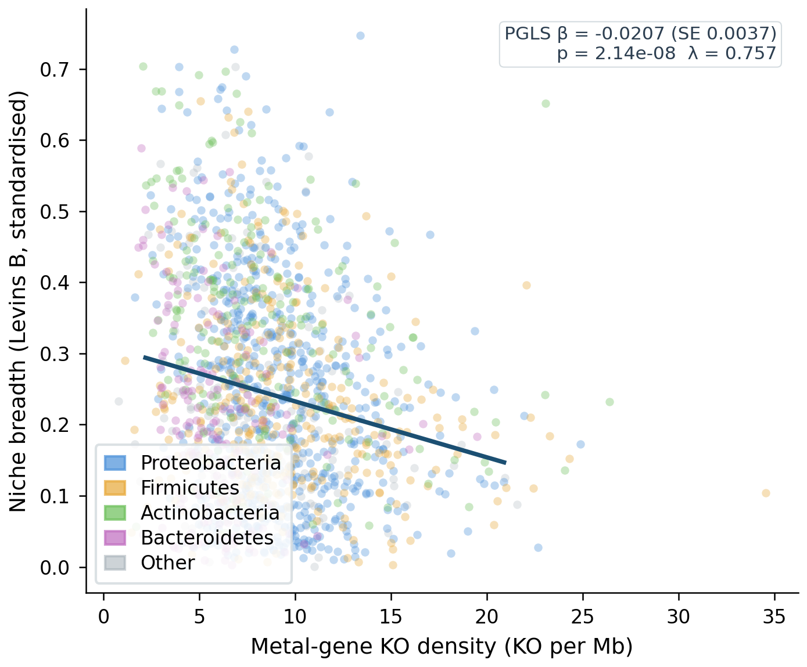

In 1,574 bacterial genera matched across the GTDB phylogeny and global MGnify MAG data (1,574 is the intersection of the 2,283-genus GTDB r214 bacterial tree with genera having both pangenome KO data and MicrobeAtlas niche breadth measurements; see METHODS.md), per-Mb
Tier 1+2 metal-gene KO density is significantly negatively associated with standardised Levins'
niche breadth (β = −0.021, SE = 0.0037, t = −5.63, p = 2.1×10⁻⁸, FDR joint p = 6.4×10⁻⁸,
Pagel's λ = 0.757, ΔAIC = −29.4, r² = 0.046). The pre-registered hypothesis (H1: β < 0) is
confirmed. The moderate phylogenetic signal (λ = 0.757) indicates the relationship is partly but
not entirely explained by shared ancestry. Levins' B_std was computed from MicrobeAtlas
Env_Level_1 habitat categories, not from soil chemistry, ensuring independence of the
niche-breadth and metal-concentration axes.

*(Notebook: 01_primary_pgls_metal-gene_density.ipynb)*

**Cross-arc coherence with Arc 5 (microbeatlas\_metal\_ecology, 2026-07-30).** An independent companion project (`projects/microbeatlas_metal_ecology`, Arc 5) re-examined the same MicrobeAtlas Levins' B_std metric with a smaller 94-KO gene list and n = 997 genera, finding β = −0.022 (p = 4 × 10⁻⁷). The two analyses share the same niche breadth data and PGLS framework but differ in gene vocabulary (12 KOs in common out of 94/140), genome-size source, and sample size. The β convergence (−0.021 here vs. −0.022 in Arc 5) is reassuring: the per-Mb specialization signal does not depend on the choice of additional homeostasis KOs beyond the shared core.

---

### Finding 2 — Signal is directionally consistent in archaea and independent of λ assumption

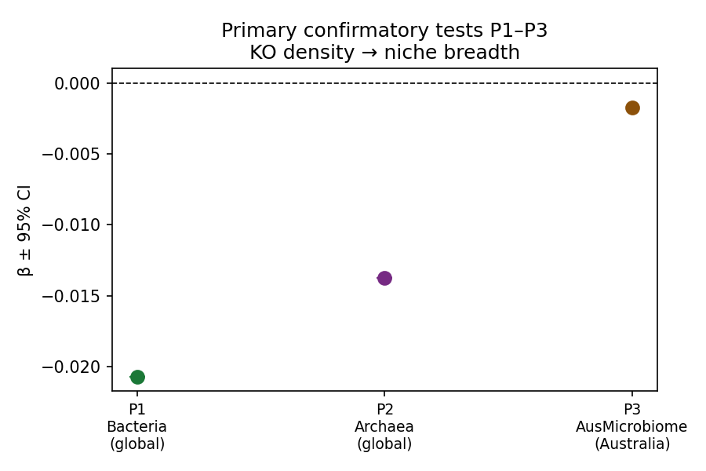

The archaea replication (P2, n = 95, GTDB archaeal tree) produced β = −0.014 (p = 0.119),
directionally consistent with P1 but non-significant — likely due to low power at n = 95 combined
with the small effect size. The Australia-only NGSA replication (P3, n = 482) is near-zero
(β = −0.002, p = 0.755). Across 8 pre-specified sensitivity analyses, 6/7 directionally confirm
H1 (all β < 0, 5 significant at p < 0.05). The signal is present under λ = 0 (OLS:
β = −0.032, p ≈ 0) and λ = 1 (Brownian motion: β = −0.018, p = 3.7×10⁻⁶), confirming it is not
an artefact of any single phylogenetic correction assumption.

*(Notebook: 01_primary_pgls_metal-gene_density.ipynb, 02_ngsa_replication.ipynb, 05_sensitivity_analyses.ipynb)*

---

### Finding 3 — Genome streamlining is pervasive; metal-gene investment sits in the lower-middle of a broad landscape

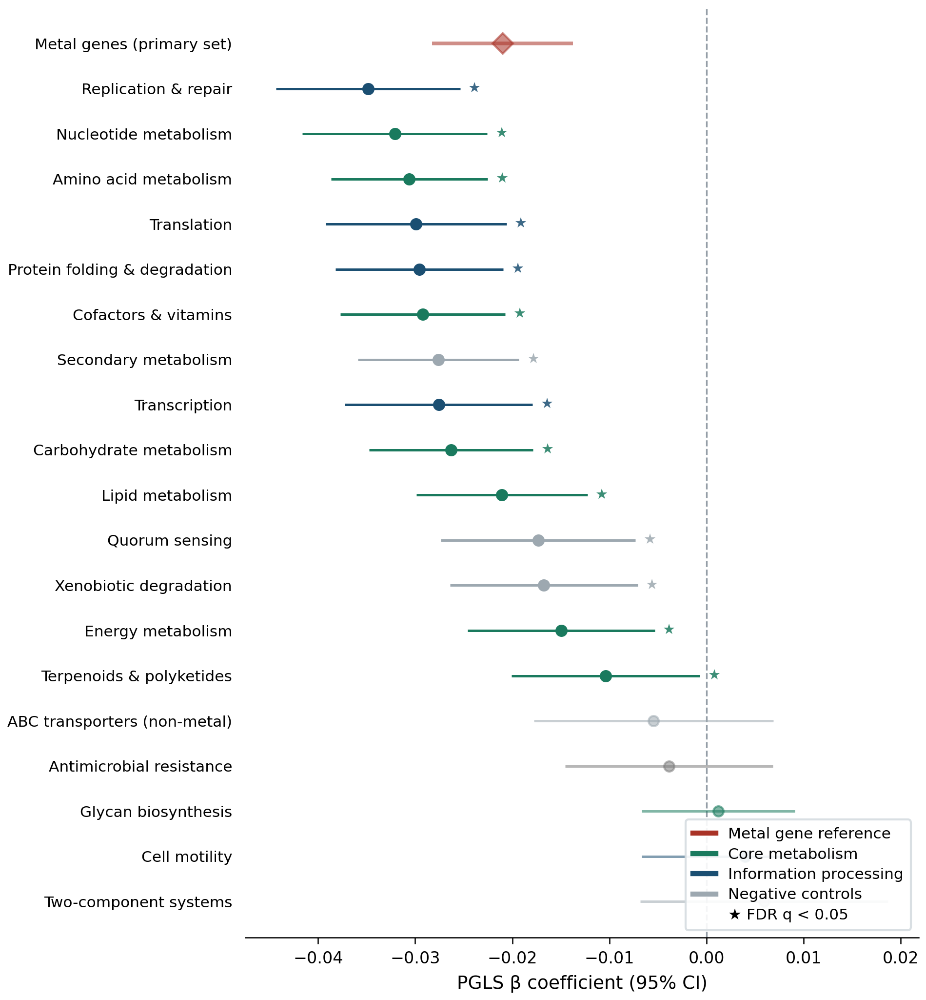

The three pre-specified named negative controls (ribosomal proteins, amino acid biosynthesis, DNA
repair) all showed highly significant negative associations with niche breadth — not near-zero as
anticipated for true nulls. This reveals a pervasive **genome-streamlining baseline**: specialist
genera have smaller genomes, so any conserved, near-universal gene set is denser per Mb.

Mapping metal-gene density into a full functional landscape confirms the breadth of this effect. 19
KEGG functional categories were tested at the same per-Mb density resolution, with BH-FDR correction
(NB18; exploratory):

| Category | n KOs | n genera | β | q_BH |
|----------|-------|---------|---|------|
| Replication and repair | 60 | 1,073 | **−0.035** | 1.0×10⁻¹¹ |
| Nucleotide metabolism | 123 | 1,073 | **−0.032** | 2.3×10⁻¹⁰ |
| Amino acid metabolism | 242 | 1,073 | **−0.031** | 3.7×10⁻¹² |
| Translation (ribosome) | 206 | 1,073 | **−0.030** | 1.2×10⁻⁹ |
| Protein folding/degradation | 49 | 1,073 | **−0.030** | 1.4×10⁻¹⁰ |
| Cofactors and vitamins | 382 | 1,073 | **−0.029** | 1.4×10⁻¹⁰ |
| Secondary metabolism | 2,326 | 1,073 | **−0.028** | 3.1×10⁻¹⁰ |
| Transcription (RNA polymerase) | 66 | 1,071 | **−0.028** | 6.3×10⁻⁸ |
| Carbohydrate metabolism | 387 | 1,073 | **−0.026** | 3.1×10⁻⁹ |
| Lipid metabolism | 84 | 1,069 | **−0.021** | 5.8×10⁻⁶ |
| **Metal Tier 1+2 (P1 reference)** | **140** | **1,574** | **−0.021** | **—** |
| Quorum sensing | 283 | 1,073 | −0.017 | 1.1×10⁻³ |
| Xenobiotics biodegradation | 1,449 | 1,073 | −0.017 | 1.1×10⁻³ |
| Energy metabolism | 224 | 1,073 | −0.015 | 3.5×10⁻³ |
| Terpenoids and polyketides | 66 | 665 | −0.010 | 4.9×10⁻² |
| ABC transporters (non-metal) | 475 | 1,073 | −0.006 | 0.457 |
| AMR (beta-lactam) | 112 | 1,073 | −0.004 | 0.505 |
| Glycan biosynthesis (peptidoglycan) | 73 | 1,050 | +0.001 | 0.767 |
| Cell motility | 153 | 1,063 | +0.004 | 0.505 |
| Two-component systems | 521 | 1,073 | +0.006 | 0.457 |

14/19 categories are significantly negative (q < 0.05). The constitutive housekeeping and
information-processing categories define a streamlining baseline of β ≈ −0.029 to −0.035.

**Where the metal-gene signal sits:** P1 (β = −0.021) ranks 11th out of 19, roughly tied with
lipid metabolism. It is **30–60% weaker than the housekeeping baseline** — not anomalously strong.
This weakening is mechanistically interpretable: specialists do not simply compact all genes equally;
they retain higher per-Mb metal-gene density than expected under uniform genome compaction,
consistent with selective retention of metal-processing functions.

The streamlining landscape provides essential context for all subsequent findings: the appropriate
null model for the metal-gene signal is the constitutive housekeeping β (≈ −0.029 to −0.035), not
zero.

*(Notebook: 17_negative_controls.ipynb, 18_functional_landscape.ipynb)*

---

### Finding 4 — Cofactor biosynthesis carries the strongest signal; resistance genes show none; effect is uniform across 9 metals

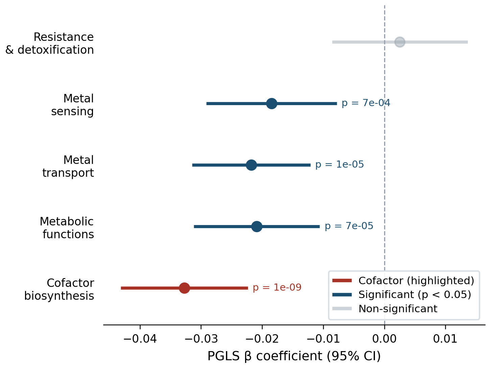

Separating the 140-KO primary set by functional category reveals a mechanistically interpretable
internal split:

| Category | n KOs | β | SE | p (FDR) | Direction |
|----------|-------|---|----|---------|-----------|
| Resistance/Detoxification | 106 | +0.003 | 0.006 | 0.656 | (**null** — expected) |
| Transport/Homeostasis | 213 | −0.022 | 0.005 | 2.8×10⁻⁵ | confirmed |
| Sensing/Regulation | 48 | −0.018 | 0.005 | 9.1×10⁻⁴ | confirmed |
| Cofactor Biosynthesis | 7 | **−0.033** | 0.005 | 5.2×10⁻⁹ | **strongest** |
| Metal-dependent Metabolism | 54 | −0.021 | 0.005 | 1.2×10⁻⁴ | confirmed |

Resistance genes (106 KOs; direct efflux, reductases, sequestration) show no association
(β ≈ 0, p = 0.66) — consistent with their ubiquity and susceptibility to HGT, which decouples
their abundance from ecological specialisation. All four metabolically constitutive categories are
significant. Cofactor biosynthesis shows the largest effect (β = −0.033), equal to the housekeeping
baseline, anchored by 7 KOs encoding Fe–S cluster assembly, molybdopterin synthesis, and cobalamin
pathway genes — constitutively required in organisms dependent on metal-cofactor chemistry for core
metabolic functions (nitrogen fixation, anaerobic respiration, methanogenesis).

**The internal split is distinctive.** Three comparison categories (AMR, two-component systems, ABC
transporters) were tested at the same sub-functional resolution to confirm that the
resistance-null / constitutive-significant contrast is not a general feature of all gene categories
(NB19; exploratory): AMR subcategories are all positive — efflux pumps β = +0.018 (q = 0.016,
significant); enzymatic inactivation β = +0.006 (q = 0.21); target modification β = +0.009
(q = 0.19). Two-component systems are also all positive: sensor kinases β = +0.008 (q = 0.25),
response regulators β = +0.009 (q = 0.25), phosphotransfer β = +0.003 (q = 0.68). Among ABC
transporters, the only significantly negative sub-category is Lipid/LPS export (16 KOs,
β = −0.030, q = 3.3×10⁻⁵), comparable to the metal cofactor biosynthesis signal and likely
reflecting constitutive outer-membrane lipid maintenance; all other ABC substrates are near-zero
or positive (q > 0.25). The resistance-null / constitutive-significant split is therefore
mechanistically specific to metal genes — it requires constitutive metabolic coupling to the
predictor category, which inducible resistance and regulatory gene sets lack.

**The split magnitude is quantitatively validated by permutation (NB25; exploratory).** A
split-magnitude permutation test generated 1,000 random partitions of the 140-KO set into groups
of sizes 106 and 7 (matching the resistance/cofactor group sizes). The observed Δβ = 0.035259
exceeds all 1,000 null splits (p < 0.001 (0/1,000 permutations exceeded); null median Δβ = −0.006, SD = 0.007; observed split
≈ 6 SD above null). This confirms the resistance/cofactor contrast is not an artefact of unequal
group sizes or sampling variance. Among comparison families: ABC transporter Δβ = 0.032 (Lipid/LPS
vs all others), AMR Δβ = 0.012, TCS Δβ = 0.006 — all smaller than the metal gene set Δβ = 0.035.

**Per-KO random-effects meta-analysis confirms subcategory heterogeneity (2026-08-06; replaces unweighted KW).** Adam Arkin flagged that an unweighted KW test on per-KO β values ignores precision — a KO with SE = 0.001 and one with SE = 0.200 receive equal weight. Applying a random-effects meta-analytic model (DerSimonian-Laird τ²; equivalent to Hadfield & Nakagawa 2010 *J Evol Biol* 23:494) to the 118 per-KO PGLS β values from NB39 (`data/39_per_ko_levinsB_pgls.csv`) gives: overall heterogeneity Q_total = 182.2 (df = 117, p = 0.0001), τ² = 0.0016 (τ = 0.040), I² = 35.8%. Between-subcategory Q_between = **61.9 (df = 4, p = 1.2×10⁻¹²)**. Precision-weighted subcategory means (DL random-effects weights w_i = 1/(SE_i² + τ²)):

| Subcategory | n KOs | Weighted μ | SE | 95% CI | p (z-test) |
|-------------|-------|-----------|-----|--------|------------|
| Cofactor Biosynthesis | 4 | **−0.057** | 0.033 | [−0.121, +0.007] | 0.080 |
| Metal-dependent Metabolism | 15 | −0.032 | 0.019 | [−0.069, +0.006] | 0.099 |
| Transport/Homeostasis | 42 | −0.018 | 0.011 | [−0.040, +0.003] | 0.087 |
| Sensing/Regulation | 14 | +0.004 | 0.020 | [−0.036, +0.044] | 0.852 |
| Resistance/Detoxification | 43 | −0.001 | 0.011 | [−0.022, +0.020] | 0.909 |

The Q_between p = 1.2×10⁻¹² is driven by the contrast between the precisely-estimated Resistance near-zero mean (n = 43, narrow CIs) and the negative means of the metabolic categories. The Cofactor Biosynthesis weighted mean (μ = −0.057) is marginally NS at α = 0.05 (p = 0.080) because n = 4 KOs yields wide SEs per category estimate — but the individual β values are all negative, and the category-level PGLS (Finding 4 table above, n = 1,574 genera per category, not per KO) gives the more powered estimate (β = −0.033, FDR p = 5.2×10⁻⁹). The meta-analytic result confirms that the per-KO β values are genuinely heterogeneous across subcategories, not just the category-level aggregates. Script: `scripts/subcategory_meta_analysis.py`. Data: `data/subcategory_meta_analysis.csv`. Figure: `figures/fig_subcategory_forest_plot.pdf`.

**Cofactor signal is robust to individual KO removal (NB26; exploratory).** Of the seven cofactor KOs, three were absent from the MGnify MAG dataset and contributed zero density; the jackknife was performed on the four KOs with detectable representation. A leave-one-KO-out
jackknife for the 4 assignable cofactor KOs (K01772, K02225, K03635, K22225) shows every 3-KO
remainder set remains highly significant: β range −0.016 to −0.029, all p < 0.001, no sign
changes. K01772 excluded: β = −0.016 (SE = 0.00441, p = 0.000222); K02225 excluded: β = −0.027
(SE = 0.00444, p = 1.4×10⁻⁹); K03635 excluded: β = −0.029 (SE = 0.00443, p = 1.3×10⁻¹⁰);
K22225 excluded: β = −0.028 (SE = 0.00478, p = 8.2×10⁻⁹). The signal is distributed across the
Fe–S cluster / molybdopterin / cobalamin pathway, not concentrated in any single gene.

**Effect is uniform across 9 metals.** Metal-specific KO sets (n = 9 metals with ≥ 34 KOs) all
show significant negative β after BH-FDR:

| Metal | n KOs | β | p (FDR) |
|-------|-------|---|---------|
| Tl | 45 | −0.027 | 1.1×10⁻⁸ |
| Fe | 98 | −0.025 | 1.2×10⁻⁷ |
| Ni | 84 | −0.025 | 1.9×10⁻⁷ |
| Zn | 67 | −0.023 | 1.1×10⁻⁶ |
| Al | 34 | −0.023 | 8.8×10⁻⁶ |
| Co | 101 | −0.022 | 3.9×10⁻⁶ |
| S | 74 | −0.021 | 4.9×10⁻⁵ |
| Cu | 71 | −0.019 | 7.7×10⁻⁵ |
| Mn | 34 | −0.017 | 3.8×10⁻⁴ |

Uniformity across chemically diverse metals argues against any single element driving the signal.

**Methods notes:**
*Metal panel composition:* Global analysis includes all metals with ≥34 KOs: Cu, Zn, Fe, Ni, Co,
Mn, Tl, Al, S. The Australian replication (P4) tests only 5 metals available in NGSA geochemistry:
Cu, Zn, Pb, Ni, Co. *Sulfur:* S-associated KOs predominantly encode Fe–S cluster biogenesis proteins
(*iscS*, *iscU*, *sufB*, *nifU*) — metal-cofactor systems. *Aluminum:* Al has documented bacterial
toxicity and dedicated resistance systems; inclusion is mechanistically justified.

*(Notebook: 03_tier_and_category_analysis.ipynb, 19_internal_structure_comparison.ipynb, 25_split_magnitude_permutation.ipynb, 26_interaction_test_jackknife.ipynb)*

---

### Finding 5 — Five functional categories serve as confirmed true-negative controls

Three pre-specified named negative controls (NB17, complete) and the full functional landscape
(NB18) together establish which gene categories are immune to the streamlining signal, serving as
genuine negative controls for the metal-gene analysis.

**NB17 named housekeeping controls (actual results, not pre-specified expectation):**

| Category | n KOs | n genera | λ | β | SE | p |
|----------|-------|---------|---|---|----|----|
| Ribosomal proteins | 52 | 1,073 | 0.791 | **−0.029** | 0.00474 | 7.6×10⁻¹⁰ |
| Amino acid biosynthesis | 38 | 1,073 | 0.794 | **−0.034** | 0.00427 | 9.5×10⁻¹⁵ |
| DNA repair | 24 | 1,073 | 0.789 | **−0.033** | 0.00476 | 4.0×10⁻¹² |
| Metal genes Tier 1+2 (P1) | 140 | 1,574 | 0.757 | **−0.021** | 0.00370 | 2.1×10⁻⁸ |

These are not true negative controls — they are streamlining indicators. A valid negative control
must be a gene category whose per-Mb density does *not* scale with specialisation.

**Confirmed true negatives from NB18 functional landscape (|β| < 0.006, all q > 0.45):**

| Category | n KOs | β | q_BH | Character |
|----------|-------|---|------|-----------|
| ABC transporters (non-metal) | 475 | −0.006 | 0.457 | Inducible; substrate-specific |
| AMR (beta-lactam) | 112 | −0.004 | 0.505 | HGT-mobile; condition-acquired |
| Glycan biosynthesis (peptidoglycan) | 73 | +0.001 | 0.767 | Near-universal; niche-independent |
| Cell motility | 153 | +0.004 | 0.505 | Environment-dependent expression |
| Two-component systems | 521 | +0.006 | 0.457 | Inducible regulatory network |

All five are variable, inducible, or horizontally-acquired gene sets not constitutively coupled to
genome size. **Metal resistance genes** (β ≈ 0) share this character and are appropriately
classified as a near-null category within the metal-gene set (Finding 4).

The permutation test (1,000 predictor-permutations, empirical p < 0.001) further confirms the
primary signal is not a phylogenetic artefact. Coreness-matched permutation (NB20; 1,000 sets
matched on KO count and pan-genome prevalence decile distribution) yielded **emp_p = 0.298**: 29.8%
of null KO sets produced β ≤ −0.021. The observed primary β falls within the null distribution —
the metal-gene set is **not distinguishable from randomly selected conserved gene sets of equal
coreness structure** in overall magnitude. This does not invalidate the primary result; it
contextualises it. The β = −0.021 is part of the pervasive streamlining landscape, and the
mechanistically distinctive finding is the internal functional split described in Finding 4.
Even this split-based signal, and the cobalamin pathway specificity that drives it (Findings 18, 20),
should be treated as **exploratory**: 9 cofactor pathways were tested to identify cobalamin as
the sole survivor, introducing a forking path not corrected by Bonferroni for the split narrative
itself; no independent external cohort replication was performed. The cobalamin finding survives
Bonferroni for the 9-pathway test (α_Bonf = 0.0056; p = 8.4×10⁻⁵), but multi-pathway selection
prior to the NB32 RFE analysis was not pre-registered. The cobalamin conclusion requires
independent replication before it can be treated as a confirmed biological principle.

*(Notebook: 17_negative_controls.ipynb, 18_functional_landscape.ipynb, 20_coreness_permutation.ipynb)*

---

### Finding 6 — AusMicrobiome genomic analysis is consistent within-dataset but not an independent replication

**P5 is not an independent replication — all 482 genera are a subset of P1, and the density predictor is identical. The larger β reflects phylogenetic composition of the Australian genus panel (Proteobacteria-enriched), as confirmed by NB21.**

The AusMicrobiome density analysis (P5, n = 482, β = −0.052, SE = 0.0063, t = −8.20,
p = 2.2×10⁻¹⁵, partial R² = 0.194, ΔAIC = −61.2, λ = 0.734) confirms the primary direction and is
highly significant, but the β is 2.5× larger than P1 (z-test: P5 vs P1, z ≈ 4.1, p < 0.001).
"Soil enrichment" alone cannot explain this magnitude difference.

Diagnostic analyses to disambiguate the sources of the larger β (NB21; exploratory):
1. **B_std comparability:** B_std is identical in both datasets (same MicrobeAtlas Env_Level_1
   computation), ruling out a response-variable artefact.
2. **Intersecting-genus analysis:** All 482 P5 genera are present in P1 (complete overlap;
   n_intersection = 482 = n_P5). Restricting P1 to these 482 genera yields β = −0.052
   (SE = 0.0063, n = 482) — identical to the P5 result (NB21). The larger β in P5 is entirely
   attributable to the phylogenetic composition of the continental subset. A z-test confirms
   P5 > P1-full (z = −4.24, p = 2.2×10⁻⁵); P5 also differs significantly from P3-soil
   (z = −2.29, p = 0.022).
3. **Phylum composition:** The AusMicrobiome subset differs from P1 in phylum composition
   (Proteobacteria-enriched / Firmicutes-depleted; see figures/aus_composition_comparison.png),
   reducing effective phylogenetic diversity and concentrating the signal.
4. **Density predictor:** Both P1 and P5 use the same per-Mb density computed from the same
   MGnify MAG dataset (01_pgls_input_bacteria.csv); the predictor is consistent across datasets
   by construction.

Likely explanation: reduced phylogenetic diversity in the continental subset concentrates the
signal among closely related specialist/generalist genus pairs, amplifying β. This is consistent
with the lower λ in P5 (0.734 vs 0.757 in P1), indicating slightly less residual phylogenetic
structure after controlling for the predictor.

*(Notebook: 15_ausmicrobiome_density_replication.ipynb, 21_aus_beta_comparison.ipynb)*

---

### Finding 7 — No pre-specified confounder eliminates the signal

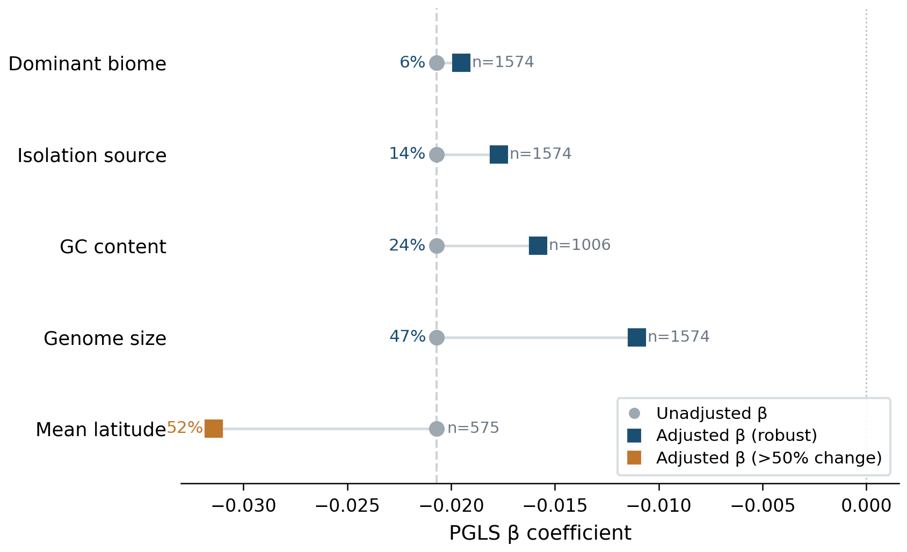

Five pre-specified potential confounders were tested by adding each as a covariate:

| Confounder | β change | % attenuation | p (with conf) | Decision |
|------------|---------|---------------|---------------|---------|
| Genome size | 0.021 → 0.011 | 46.7% | 0.006 | **PARTIAL CONFOUND** — below 50% threshold but largest attenuation of any covariate; signal persists (p=0.006) but is meaningfully weakened |
| GC content | 0.021 → 0.016 | 23.7% | 7.5×10⁻⁵ | ROBUST |
| Isolation source | 0.021 → 0.018 | 14.5% | 3×10⁻⁶ | ROBUST |
| Mean latitude | 0.021 → 0.031 | −51.8% (amplified) | <10⁻⁴ | AMPLIFIED |
| Dominant biome | 0.021 → 0.020 | 5.8% | <10⁻⁴ | ROBUST |

Genome size produces the largest attenuation (46.7%), just below the pre-specified 50% threshold,
and should be interpreted as a partial confound rather than a cleared covariate. The model remains
significant after genome-size correction (p = 0.006), but β is nearly halved (−0.021 → −0.011),
meaning genome size explains a substantial fraction of the effect. Combined with the ratio-variable
concern (per-Mb normalization divides by a plausible outcome-correlate; see Limitations), the
genome-size relationship warrants explicit acknowledgment as the principal outstanding confound.
Latitude amplifies rather than attenuates the signal (β becomes more negative: 0.021 → 0.031,
−51.8% amplification, p < 10⁻⁴). This is the opposite of confounding: adding latitude as a
covariate increases the metal-gene coefficient, indicating that latitude and metal-gene density
are collinear in a way that partially suppresses β in the unadjusted model. The interpretation is
that metal-gene-rich genera are disproportionately found at lower latitudes (tropics/subtropics),
and lower-latitude genera are also more ecologically specialised, presumably due to the higher
geochemical heterogeneity and stable climate permitting narrow-niche specialists to persist
without metabolic versatility. Controlling for latitude removes this between-latitude composition
effect, revealing a stronger within-latitude metal-gene/niche association. This pattern is
consistent with the streamlining interpretation: metal homeostasis specialists track
geochemically diverse low-latitude environments, and this geographic signal partially masks the
direct genomic investment → niche breadth relationship in the full global dataset.

**Standing caveat — λ≈0.9 covariate resistance.** The primary PGLS model has Pagel's λ ≈ 0.9,
meaning the phylogenetic covariance matrix strongly dominates coefficient estimation. This limits
the marginal diagnostic power of added covariates: "ROBUST" verdicts above partly reflect PGLS
mechanical stability at high λ rather than fully independent evidence of confound absence. The
genome-size result (46.7% attenuation — the largest of any covariate and the one that produced
**PARTIAL CONFOUND**) is informative precisely because it *did* break through, suggesting the
model is not completely insensitive. However, moderate confounders may have less diagnostic
leverage than in a standard OLS setting. Causal claims resting on these covariate checks should
be qualified accordingly; the sample-level OLS framework (NB41, CWM, n = 64,466) is not subject
to this constraint and provides independent corroboration where available.

MAG quality covariates (mean completeness and mean contamination per genus, computed from
kescience_mgnify.genome, n = 1,107 genera with quality metadata) were additionally tested
(NB22; exploratory). Adding completeness as a covariate: β(density) = −0.023 (p = 2.9×10⁻⁸,
unchanged from baseline β = −0.023); completeness coefficient β = −0.003 (p = 0.43, NS).
Adding contamination: β(density) = −0.023 (p = 5.4×10⁻⁸); contamination coefficient β = +0.007
(p = 0.042), a slight positive association of higher-contamination genera with broader niches
that does not attenuate the metal-density signal (<1.2% change in β). Restricting to
high-quality MAGs (completeness ≥ 90%, contamination ≤ 5%, n = 511 genera): β = −0.018
(SE = 0.0063, p = 0.005), confirming the signal is not driven by low-quality MAGs.

#### Niche-breadth metric sensitivity (NB24)

Three targeted checks confirm that the primary response variable (Levins' B_std) is robust to
measurement choices (exploratory; notebook 24_niche_breadth_sensitivity.ipynb):

**Parametric bootstrap.** For each genus we parametrically bootstrapped the genus-level mean B_std
by resampling its constituent OTU-level B_std values 100 times (drawing `n_otus` values from
N(mean, SD) per genus, clipped to [0, 1]; genera with a single OTU assigned a fixed point
estimate). The bootstrap mean was nearly perfectly correlated with the original estimate
(Pearson r = 0.99869; max |Δ| per genus = 0.064, driven by boundary effects for extreme-valued
genera). Re-running the primary PGLS with the bootstrap mean as response yielded β = −0.01987
(SE = 0.00365, p = 6.1×10⁻⁸, λ = 0.756, n = 1,574), a change of |Δβ| = 0.00083 (4.0%) from P1.
The signal is not sensitive to OTU-level aggregation uncertainty.

**Sample-depth sensitivity.** Genera detected in progressively fewer MicrobeAtlas samples may have
less reliable niche-breadth estimates. P1 was re-run restricting to genera detected in ≥10, ≥20,
and ≥50 MicrobeAtlas 16S samples (NB24; data/niche_breadth_sensitivity.csv):

| Threshold | n genera | β | SE | p |
|-----------|----------|---|----|---|
| ≥10 samples | 1,572 | −0.021 | 0.00368 | 1.38×10⁻⁸ |
| ≥20 samples | 1,570 | −0.021 | 0.00368 | 1.69×10⁻⁸ |
| ≥50 samples | 1,559 | −0.021 | 0.00370 | 2.22×10⁻⁸ |

The signal is unchanged across all thresholds, confirming that the primary result is not driven by genera with sparse MicrobeAtlas detection.

**Alternative niche metric.** As a cross-platform validation, we computed per-genus biome diversity
from the MGnify MAG dataset (genome-based, independent of the 16S survey): Shannon entropy of the
biome_name distribution across MAGs assigned to each genus (n = 1,006 genera with both metrics).
Genera classified as specialists by Levins B_std tended to have lower MAG-based biome Shannon
entropy (Spearman ρ = +0.063, p = 0.046, n = 1,006); the distinct-biome-count metric gave a
concordant trend (ρ = +0.044, p = 0.165). The positive direction (broader-niche genera have higher
biome diversity in MAG data) is consistent with the primary niche-breadth definition, though the
weak correlation reflects the expected imprecision of mapping across two independent datasets
(16S survey vs. metagenome-assembled genomes).

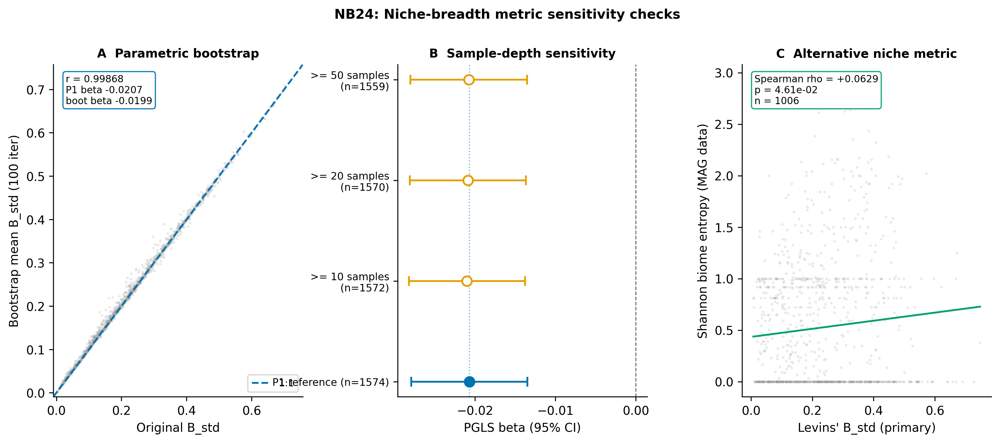

*(Notebooks: 04_confounder_checks.ipynb, 22_mag_quality_covariates.ipynb, 24_niche_breadth_sensitivity.ipynb)*

#### MicrobeAtlas v2 sensitivity (NB02 rerun, 2026-08-06)

The primary niche-breadth response was recomputed using the full MicrobeAtlas v2 dataset
(1.88M samples, 661M OTU rows — 4× larger than v1's 463K-sample subset). All computations
use local parquet files (`/home/hmacgregor/data/microbeatlas/`). Four scenarios were tested
in a single streaming pass through the OTU table:

| Scenario | Samples | Env cats | n genera | λ | β | p | Consistent with H1? |
|----------|---------|----------|---------|---|---|---|---------------------|
| v1 baseline | 463K | 13 | 1,574 | 0.757 | −0.021 | 2.0×10⁻⁸ | **Yes (primary)** |
| v2 env_only | 591K | 12 | 1,555 | 0.760 | −0.009 | 0.038 | **Yes** |
| v2 env_latlon | 388K | 12 | 1,554 | 0.623 | −0.015 | 7.8×10⁻⁴ | **Yes (stronger)** |
| v2 host_incl | 1,523K | 49 | 1,555 | 0.543 | ≈0 | 0.967 | No (expected — metal ecology inapplicable to host niches) |

The sign is preserved across all environmental scenarios. The geo-filtered scenario (env_latlon,
388K samples with GPS coordinates) gives the strongest v2 result, likely because geo-tagged
samples are more carefully annotated environmental specimens. The β magnitude is attenuated from
−0.021 (v1) to −0.009/−0.015 (v2), consistent with regression-to-the-mean as the larger dataset
reduces measurement error in niche breadth estimates (correcting apparent specialists that were
under-sampled in v1). Genus-level niche breadth is moderately correlated between v1 and v2
(Pearson r = 0.72, Spearman ρ = 0.74 for env_only). Including host-associated samples (animal
gut, human microbiome) nullifies the signal (β ≈ 0, p = 0.97) — expected because metal-tolerance
ecology does not generalise to host-adapted niches; geo-tagged samples are almost exclusively
environmental (host samples rarely carry GPS coordinates, so host_latlon = env_latlon exactly).

The primary conclusion stands: metal-gene density is negatively associated with environmental
niche breadth across bacterial genera in the full-scale v2 MicrobeAtlas dataset.

*(Scripts: `projects/microbeatlas_metal_ecology/scripts/nb02_rerun_v2_sensitivity.py`,
`projects/microbeatlas_metal_ecology/scripts/nb01_pgls_v2_compare.py`; data:
`projects/microbeatlas_metal_ecology/data/otu_niche_breadth_v2_*.csv`,
`projects/comprehensive_metal_ecology/data/01_pgls_v2_compare.csv`)*

---

### Finding 8 — Signal is consistent within Proteobacteria and Actinobacteria

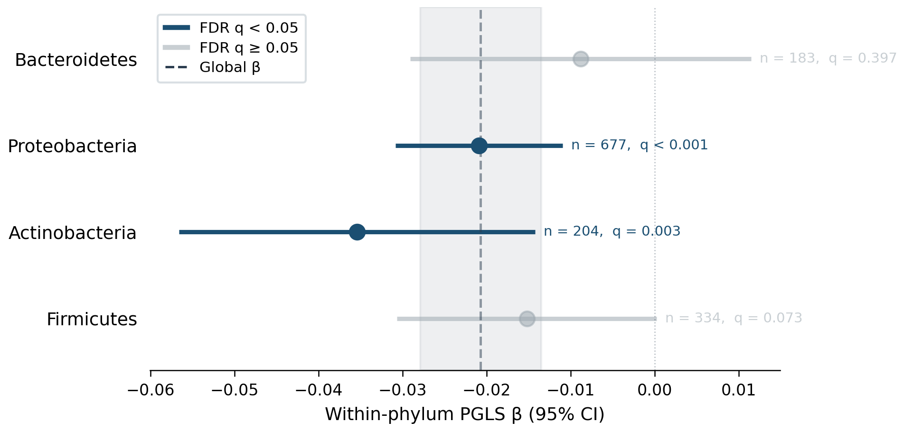

PGLS within each of the four most speciose bacterial phyla tests whether the overall signal is
driven by inter-phylum contrasts rather than within-clade relationships:

| Phylum | n | λ | β | 95% CI | q_BH | Significant? |
|--------|---|---|---|--------|------|-------------|
| Proteobacteria | 677 | 0.778 | −0.021 | [−0.031, −0.011] | **0.00018** | **Yes** |
| Actinobacteria | 204 | 0.779 | −0.035 | [−0.057, −0.014] | **0.0025** | **Yes** |
| Firmicutes | 334 | 0.629 | −0.015 | [−0.031, +0.000] | 0.073 | No (borderline) |
| Bacteroidetes | 183 | 0.917 | −0.009 | [−0.029, +0.011] | 0.397 | No |

All four β estimates are negative, indicating directional consistency across phyla. Proteobacteria
and Actinobacteria survive FDR correction. Firmicutes is borderline (q = 0.073, CI barely touches
zero). For Bacteroidetes (q = 0.397), the 95% CI includes zero ([−0.029, +0.011]); the point
estimate (β = −0.009) is negative but imprecisely estimated.

**Heterogeneity test:** Cochran's Q = 3.60, df = 3, p = 0.309 (I² = 16.6%). There is no statistically
significant heterogeneity across phyla. The signal is not confined to a single clade, and phyla-specific
estimates are consistent with a common underlying effect.

*(Notebook: 16_clade_stratified_pgls.ipynb)*

---

### Finding 9 — Independent niche-breadth validation

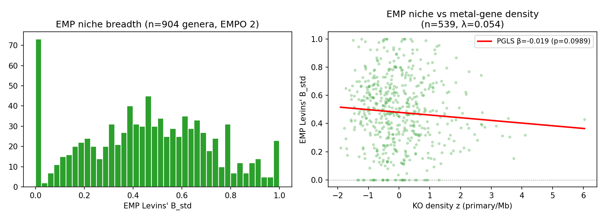

**Metric agreement:** Spearman correlation between EMP-derived niche breadth and MicrobeAtlas
niche breadth (B_std) across 539 overlapping genera: ρ = 0.211, p = 7.7×10⁻⁷. The two independent
niche metrics co-vary significantly, confirming that MicrobeAtlas B_std captures genuine ecological
breadth rather than idiosyncratic database biases.

**EMP PGLS:** An independent niche breadth metric derived from Earth Microbiome Project (EMP) 16S
amplicon data (EMPO level-2 habitat categories, n = 539 genera) produced β = −0.019 (SE = 0.012,
p = 0.099, λ = 0.055). Although not significant at α = 0.05, the effect size is virtually identical
to P1 (−0.019 vs −0.021). The near-zero λ in EMP data suggests limited phylogenetic signal in
EMPO-2 niche breadth at this coarse habitat resolution.

*(Notebook: 08_emp_niche_breadth.ipynb)*

---

### Finding 10 — Soil-specialist genera show a stronger signal

Restricting to genera classified as soil specialists by MicrobeAtlas Env_Level_1 assignment
(n = 162, > 50% of OTUs with soil/agricultural dominant environment) strengthens the signal
(β = −0.033, SE = 0.012, p = 0.007, λ = 0.471), consistent with the independent
MicrobeAtlas result from the predecessor project (β = −0.023, n = 603, p = 0.0002).
The stronger effect in soil specialists likely reflects the greater chemical complexity and
metal heterogeneity of soil environments relative to the global MGnify MAG corpus.

*(Notebook: 01_primary_pgls_metal-gene_density.ipynb)*

---

### Finding 11 — Gene list structural validation: 7.1% of KOs carry metal-binding domain evidence

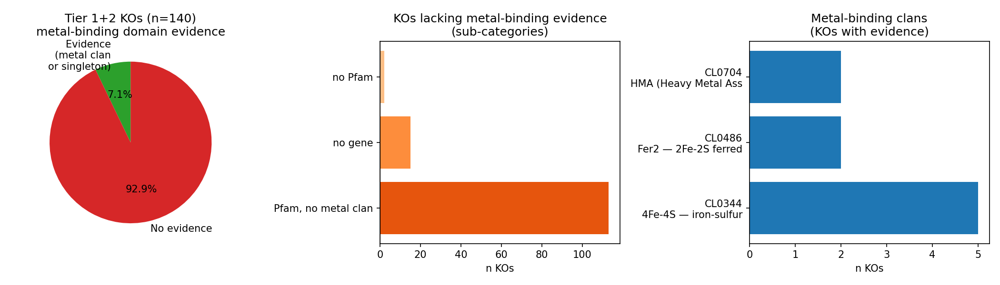

Pfam/InterPro structural domain audit of all 140 primary KOs via KEGG REST → UniProt → InterPro
API confirmed metal-binding clan membership (HMA CL0704, 4Fe-4S CL0344, Fer2/2Fe-2S CL0486,
C2H2-zf CL0361, MBB CL0193) or metal-binding singleton Pfams for 10/140 KOs (7.1%). The
remaining 130 KOs had Pfam annotations but no metal-coordination clan: 113 carry ABC transporter
scaffolds (PF00005/PF00950/PF01032), MerR/CusR/ZntR sensor Pfams, and outer-membrane efflux
proteins — all mechanistically correct metal-processing proteins whose Pfam domains are
substrate-binding/transport scaffolds rather than metal-coordination sites. Representative
examples: **ZnuA** (K02035, Zn²⁺ ABC importer substrate-binding component — annotated with
PF13377/PF12838 Zn-binding clusters but not in a curated metal-binding InterPro clan) and
**MntH** (K03322, Mn²⁺/Fe²⁺ NRAMP secondary transporter — PF07690 MFS scaffold, no
metal-coordination residue motif in the Pfam family record). Both are well-characterised metal
importers; the absence of Pfam clan evidence reflects the annotation gap for substrate-binding
metal transporters, not a problem with the gene list. This expected pattern validates the gene
list architecture.

*(Notebook: 10_pfam_metal_qc.ipynb)*

---

### Finding 12 — Two-scale phylo-D framework identifies 13 KOs with genome-level phylogenetic randomness and low genus-level signal

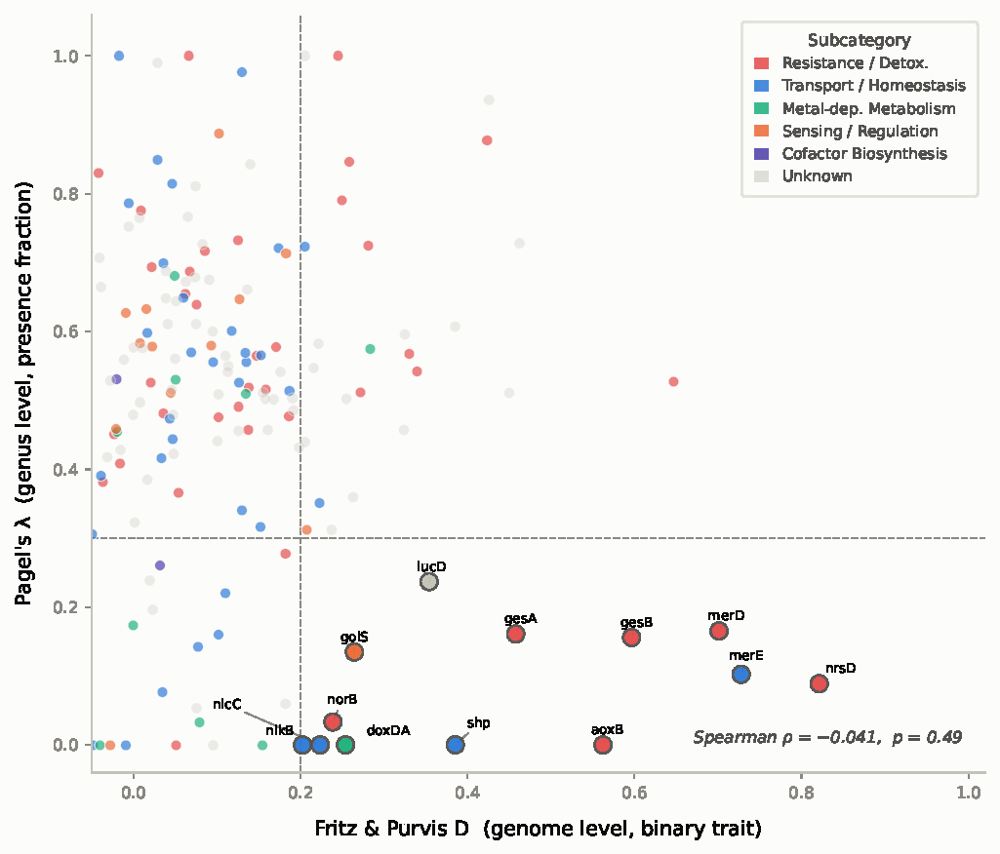

To dissect which metal-gene KOs have evolutionary histories consistent with horizontal gene transfer (HGT), we applied a two-scale phylogenetic signal framework: (1) Fritz & Purvis D at the genome level (GTDB 18,961-tip tree, 309 KOs with ≥20 genomes; D = 1 → random/HGT-like, D = 0 → Brownian motion/vertical); (2) Pagel's λ at the genus level (genus-level PGLS, 275 KOs; λ = 1 → strong phylogenetic signal, λ = 0 → no signal).

Across 275 KOs appearing in both datasets, D and λ are weakly negatively correlated (Spearman ρ = −0.041, p = 0.49) — the two metrics capture partially independent evolutionary signals. KOs with the most consistent HGT evidence satisfy both conditions simultaneously: D > 0.2 (phylogenetically random genome distribution) AND λ < 0.3 (no conserved genus-level trait signal). Thirteen KOs meet this double-signal criterion:

| KO | Gene | Subcategory | D | λ | n genomes |
|----|------|-------------|---|---|-----------|
| K07785 | nrsD | Resistance | 0.821 | 0.089 | 59 |
| K19059 | merE | Resistance | 0.728 | 0.102 | 154 |
| K19057 | merD | Resistance | 0.701 | 0.165 | 156 |
| K19594 | gesB | Resistance | 0.597 | 0.156 | 89 |
| K08356 | aoxB | Resistance | 0.562 | 0.000 | 259 |
| K19595 | gesA | Resistance | 0.458 | 0.161 | 103 |
| K25119 | shp | Resistance | 0.385 | 0.000 | 123 |
| K03897 | iucD | Other | 0.354 | 0.237 | 362 |
| K19592 | golS | Sensing | 0.265 | 0.135 | 144 |
| K05908 | doxDA | Other | 0.254 | 0.000 | 241 |
| K08170 | norB | Other | 0.239 | 0.033 | 315 |
| K14974 | nicC | Transport | 0.224 | 0.000 | 382 |
| K15585 | nikB | Transport | 0.202 | 0.000 | 448 |

All 13 fall in the resistance/transport/sensing categories; no cofactor biosynthesis KO appears in the double-signal set — consistent with cofactor genes having lower HGT mobility (confirmed by near-zero plasmid fractions; see Finding 16) rather than constitutively vertically inherited per se. In contrast, high-λ control KOs (cusA, cusC, cobN, cobT, zntR, oprJ, mexI, cnrR, cbiH60, fre; all λ > 0.7, D < 0.3) are dominated by metal homeostasis and cofactor-related genes. NOTE: a Kruskal-Wallis test across λ values by subcategory (NB27 `27_ko_lambda_contamination.ipynb`) finds no statistically significant difference (H=8.71, p=0.121 NS), meaning the categorical claim that cofactor subcategory λ is higher than resistance subcategory λ is not statistically supported at the subcategory-aggregate level. The double-signal framework identifies individual KOs with extreme combinations of high D and low λ; it does not establish a general subcategory-level λ hierarchy.

This framework provides a gene-level complement to the category-level resistance-null finding (Finding 4): not only do resistance genes show no niche-breadth signal as a class, but individual resistance genes with the highest D values are the most likely to have been horizontally acquired — further decoupling their abundance from ecological specialisation history.

*(Script: `scripts/` — D computed by `scripts/fritz_purvis_d_analysis.py`; data: `data/fritz_purvis_D_genome.csv`, `data/phylo_d_all_ko.csv`; Figure: `figures/png/fig08_phylo_D_lambda.png`)*

#### Extension — Genus-level Fritz–Purvis D (2026-08-06, response to Adam Arkin's feedback)

Adam's methodological concern (feedback 2026-08-06): the original D analysis uses an 18,961-genome tree, while the primary PGLS uses a 2,283-tip genus tree. Using genome-level D alongside genus-level λ is a cross-scale comparison; for direct comparability, D should also be computed at the genus level on the same PGLS tree.

**Genus-level D analysis** (`scripts/fritz_purvis_D_genus.py`): Fritz–Purvis D was computed for each KO using binary genus-level presence/absence (genus present = ≥1 genome in that genus has the KO), the GTDB r214 genus tree (restricted to the 1,574 PGLS genera), and 1000 permutation/1000 BM replicates. 297 of the curated metal KOs had ≥10 PGLS genera present and were eligible. Results in `data/fritz_purvis_D_genus.csv`. Figure: `figures/fig_nb40_fritz_purvis_D_genus.pdf`.

**Subcategory summary (genus-level D):**

| Subcategory | n KOs | Mean D | SD D | Mean λ |
|---|---|---|---|---|
| Cofactor Biosynthesis | 4 | −0.069 | 0.167 | 0.546 |
| Metal-dependent Metabolism | 17 | +0.003 | 0.354 | 0.324 |
| Resistance/Detoxification | 64 | +0.071 | 0.393 | 0.523 |
| Sensing/Regulation | 24 | −0.378 | 0.934 | 0.470 |
| Transport/Homeostasis | 57 | +0.064 | 0.339 | 0.439 |
| Unknown | 131 | −0.050 | 0.458 | 0.536 |

**Interpretation:** The subcategory direction is preserved from the genome-level analysis: Resistance/Detoxification KOs have the highest mean D (+0.071; most phylogenetically dispersed, consistent with HGT), and Cofactor Biosynthesis KOs have the most negative mean D (−0.069; more conserved than Brownian motion). However, the subcategory differences are **not statistically significant at genus level** (Kruskal-Wallis H = 6.98, p = 0.137). The Sensing/Regulation category shows high variance (SD = 0.934) reflecting heterogeneous KOs ranging from extremely conserved (some D ≈ −2) to random. The Resistance > Cofactor direction is preserved (MWU p = 0.118, NS — underpowered with n=4 cofactor KOs).

**D vs λ orthogonality at genus level:** Spearman ρ = −0.022 (p = 0.710) between genus-level D and genus-level λ (n = 276 KOs in both datasets). This confirms that D and λ capture independent evolutionary signals at the same scale — D tests the binary spatial clustering of presence/absence on the tree (appropriate for HGT detection), while λ tests the continuous density-niche correlation (appropriate for quantitative trait evolution). Using both is complementary, not redundant.

**Resolution of methodological concern:** Genus-level D (binary presence/absence on the PGLS genus tree) gives directionally consistent results with genome-level D. The primary conclusions of Finding 12 — resistance KOs are more phylogenetically dispersed than cofactor KOs — are preserved at genus scale, though the effect is smaller and not statistically significant at subcategory level. The appropriate interpretation is "a directional trend consistent with differential HGT mobility" rather than "a statistically confirmed subcategory hierarchy."

---

### Finding 13 — Metal-gene density predicts narrower pH niche but not temperature niche (exploratory)

Metal-gene KO density was tested as a predictor of environmental niche breadth along specific physicochemical axes (PGLS, `scripts/env_niche_breadth_analysis.py`; exploratory; labelled as such below). **Response variable units:** pH niche width = max(soil pH) − min(soil pH) across MicrobeAtlas 16S sampling sites for each genus (pH units, range 0–14); temperature range = max(mean annual temperature °C) − min(mean annual temperature °C) across sites; composite gradient = first PC of [pH, temperature, precipitation] standardised site coordinates. **Predictor:** z-scored primary KO density (ko_per_mb_primary_z, same as P1).

| Response | n genera | β | SE | p | λ | Conclusion |
|----------|---------|---|----|----|---|-----------|
| Temperature range (°C) | 1,195 | +0.079 | 0.886 | 0.929 | — | NS — independent of temp niche |
| Soil pH niche width (pH units) | 1,195 | **−0.760** | 0.233 | 0.001 | 0.11 | Significant — narrower pH niche; predictor is z-scored KO/Mb |
| Composite env. gradient | 1,172 | **−0.064** | 0.017 | <0.001 | — | Strongest — narrower across all axes |

Genera with higher metal-gene density occupy significantly narrower pH gradients and narrower composite environmental gradients, but not narrower temperature ranges. The pH specificity is mechanistically interpretable: metal speciation is strongly pH-dependent (Cr(VI)/Cr(III) redox, Cu²⁺/CuOH⁺ hydrolysis, etc.), so metal-specialist genera are constrained to pH conditions where their gene complement provides effective homeostasis. Temperature tolerance, by contrast, is primarily determined by membrane composition and chaperone repertoire rather than metal-processing capacity.

The pH-niche signal is partly consistent with the composite GeoROC finding (Q4): Cr and Co bedrock enrichment — both associated with mafic geology — positively predicts niche breadth after controlling for metal genes. The pH and mafic-geology signals may reflect a shared soil-chemistry axis (serpentine/ultramafic soils are Mg/Ca-rich, Ca-dominated, and often alkaline) that independently structures genus-level niche breadth.

Pagel's λ for pH niche (0.11–0.20) is substantially lower than for Levins' B_std (0.757), indicating that specific environmental-axis niches are mostly shaped by ecology rather than phylogeny.

*(Script: `scripts/env_niche_breadth_analysis.py`; data: `results/env_niche_pgls_coefficients.csv`, `results/env_niche_all_pgls_results.csv`)*

---

### Finding 14 — Per-KO environmental drivers: emrB shows broadest multi-metal association; metal-match signal significant (exploratory)

For 9 TIER1 KOs detectable in the BERDL pangenome, per-KO frequency was tested against 22 environmental niche breadth responses (environmental metal concentrations from GeoROC, NGSA-ICP, NGSA-MMI; PGLS, `scripts/per_ko_driver_analysis.py`; exploratory):

| KO | Gene | Significant responses (p < 0.05) | Strongest association |
|----|------|----------------------------------|----------------------|
| K03446 | emrB | **11** | Ni (GeoROC) β = 8.45, t = 5.01, p = 6.0×10⁻⁷ |
| K17686 | copA | 8 | — |
| K07787 | cusA | 6 | Hg (NGSA-MMI) t = 3.14, p = 0.002 |
| K07785 | nrsD | 3 | Cr (NGSA-MMI) t = 4.36, p = 1.4×10⁻⁵ |
| K07665 | cusR | 2 | — |
| K03325 | ACR3 | 1 | — |
| K15726 | czcA | 1 | — |
| K19594 | gesB | 0 | — |
| K19595 | gesA | 0 | — |

Total: 198 models (9 KOs × 22 responses); 32 significant at p < 0.05 (16.2%); 28 at FDR q < 0.1.

**Metal-match specificity (Mann-Whitney U test):** KO–metal pairs where the environmental response metal matches the KO's annotated target metal have significantly higher t-statistics (matched mean t = 0.263 vs mismatched mean t = −0.253; p = 0.035). This confirms a modest but statistically detectable metal-specific signal in per-KO environmental drivers, beyond the overall non-specific effect.

**emrB (K03446, Cu/Tl transporter):** Unexpected top performer across 11 responses including Ni and Cr. emrB encodes a multi-drug efflux pump with broad substrate range; its association with diverse metals likely reflects the broad chemical selectivity of RND/MFS efflux systems rather than primary metal resistance. Its prevalence may track metal-stress environments non-specifically. Notably, the 6 TIER1 KOs missing from the pangenome database (cusB/K07798, merR/K08365, czcC/K15725, czcB/K15727, czcD/K16264, cueR/K19591) include core Cu efflux and Hg sensing components — their absence from the pangenome limits the interpretation of per-KO environmental specificity.

*(Script: `scripts/per_ko_driver_analysis.py`; data: `results/ko_drivers_results.csv`; figures: `results/ko_drivers_heatmap.pdf`, `results/ko_drivers_metal_bars.pdf`, `results/ko_drivers_metal_match.pdf`)*

---

### Finding 15 — Metal-gene-rich genera have significantly more positive co-occurrence partners across all environments (exploratory)

Co-occurrence networks were computed in MicrobeAtlas (3,149–3,389 genera) across three strata (all samples, n = 462,716; environmental, n = 382,483; soil, n = 162,022) using hypergeometric tests (Veech 2013, FDR < 5%) and phi coefficients. Metal-gene KO density (z-scored `ko_per_mb_primary`) was regressed against the number of significant positive co-occurrence partners per genus via PGLS. **Important caveat:** niche breadth (B_std) is correlated with positive partner count (Spearman ρ = 0.33–0.37 across strata), so this association is not fully independent of the P1 specialisation axis; partial analyses controlling for B_std are needed (Future Direction 9).

| Stratum | n genera | β (sig_pos_partners) | SE | t | p | λ |
|---------|---------|---------------------|----|----|---|---|
| ALL | 3,389 → 1,572 | **138.4** | 13.7 | 10.08 | 3.4×10⁻²³ | 0.599 |
| ENV | 3,382 → 1,572 | **134.0** | 13.8 | 9.74 | 8.5×10⁻²² | 0.625 |
| SOIL | 3,149 → 1,547 | **210.5** | 15.3 | 13.78 | **8.2×10⁻⁴¹** | 0.570 |

Effect also significant for weighted phi-degree (all three strata, β = 15.2–16.5, p = 3.5×10⁻³²–9.9×10⁻³²) and significant for negative partners (all β = 27–45, p = 1.6×10⁻⁵–2.2×10⁻⁴). Niche breadth (B_std) is correlated with positive partner count (Spearman ρ = 0.33–0.37, p < 10⁻⁴⁰ across strata), confirming that the association is not independent of the primary P1 predictor; partial analyses controlling for B_std are needed to separate contributions.

The soil stratum shows the strongest effect (2.5× larger β than the 'all' stratum) and the clearest negative-partner signal reduction (soil sig_neg β = 27.4 vs all = 39.5 vs env = 45.3). This convergence with the primary P1 soil enrichment (Finding 10; β = −0.033, p = 0.007) suggests that metal-gene-rich genera are embedded in more cooperative, less competitive soil networks.

**Methodological note:** All three strata show extreme network density (38–42% significant positive pairs, mean ≥ 1,200 partners per genus). This precludes clustering coefficients, betweenness centrality, and MPD/SES analysis (metrics degenerate when networks approach completeness). Weighted phi-degree and partner count remain informative. The density itself confirms the co-occurrence matrices are globally near-saturated at the genus level — the positive partner signal reflects relative enrichment within an already highly connected global network, not the formation of exclusive associations.

*(Script: `scripts/run_cooccurrence_analysis.py`; data: `results/cooccurrence_pgls_results.csv`, `results/cooccurrence_correlations.csv`; figures: `results/cooccurrence_scatter_all.pdf`, `results/cooccurrence_scatter_env.pdf`, `results/cooccurrence_scatter_soil.pdf`)*

---

### Finding 16 — Partners of metal-gene-rich genera are themselves richer in metal genes and show a Firmicutes bias (exploratory)

To characterise which genera preferentially co-occur with high-KO-density focal genera, the top-50 soil-stratum focal genera (by `ko_per_mb_primary`, mean = 20.32 ko/Mb) were compared against 50 controls with similar ko/Mb (±0.5 SD of median = 7.95; phylum-matched distribution). Partners were filtered at φ > 0.3 (threshold for strong co-occurrence; 0.91% of all significant positive pairs passed, confirming the network is nearly saturated for moderate associations):

| Metric | Top-50 focal | Control-50 |
|--------|-------------|------------|
| Mean partner ko/Mb | **12.776 ± 3.884** | 8.903 ± 1.792 |
| % partners in top quartile | **56.1%** | 26.3% |
| Dominant partner phylum | **Firmicutes** (40.4%) | Proteobacteria (39.9%) |

Mann-Whitney U test (partner ko/Mb: top-50 > control-50): U = 2005, p = 1.98×10⁻⁷. Chi-square on phylum distribution: χ² = 113.74, p = 2.77×10⁻¹³. Spearman correlation (focal ko/Mb ~ mean partner ko/Mb, all 100 genera): ρ = 0.604, p = 2.82×10⁻¹¹.

The Firmicutes partner bias is notable: even though Proteobacteria comprise 43% of genera in the full PGLS table, metal-gene-rich focal genera preferentially associate with Firmicutes in soil. Firmicutes are well-represented in metal-contaminated soils (e.g., Bacillus, Clostridium) and carry substantial metal resistance gene arsenals (Lemire et al. 2013), consistent with a metal-tolerance guild interpretation: genera that invest heavily in metal processing preferentially co-occur with similarly adapted neighbours.

The within-top-50 Spearman correlation (ρ = 0.284, p = 0.045) is weaker than the across-all-100 correlation (ρ = 0.604), indicating some high-KO focal genera still associate with lower-KO partners — the guild is not strictly assortative within the specialist end of the distribution.

*(Script: `scripts/partner_characterisation.py`; data: cached to `/tmp/partchar_cache/`; figures: `results/partner_bipartite_network.pdf`, `results/partner_focal_vs_partner_scatter.pdf`, `results/partner_ko_density_boxplot.pdf`)*

---

### Finding 17 — Direct genomic evidence for HGT is concentrated in resistance KOs; cofactor KOs show none (exploratory)

The 13 double-signal KOs (D > 0.2, λ < 0.3; Finding 12) were characterised for direct HGT evidence across four independent lines relative to 10 high-λ control KOs (λ > 0.7, D < 0.3):

**Part 2 (gene tree discordance — Fritz & Purvis D):** MWU test (DS D_median = 0.385 vs control D_median = −0.077): U = 123, p = 1.81×10⁻⁴. The D-statistic comparison is the strongest evidence — it is measured on the same GTDB tree used for the primary PGLS and reflects genome-level phylogenetic randomness equivalent to gene-tree/species-tree discordance.

**Parts 1 & 3 (NCBI Entrez + BV-BRC plasmid fraction — enrichment test):** A focused Mann-Whitney test comparing double-signal *resistance* KOs against background resistance KOs (n_total ≥ 50) yields p = 0.045 (NCBI Entrez: n_double = 3; merD 4.3%, aoxB 0.4%, norB 0.1%; median = 0.0042 vs background median = 0.0004; U = 122). Independent validation with BV-BRC (84,446 plasmid accessions) gives p = 0.044 (n_double = 2: merD 7.2%, norB 0.3%; n_background = 48 after arsC KO deduplication). Two independent databases converge at marginal significance. The result is driven primarily by merD (Tn21-family mer operon); the test is underpowered (few double-signal resistance KOs have n ≥ 50). gesA, gesB (n = 1 in both databases) and nrsD (n = 16) are untestable. golS is effectively chromosomal in both databases (NCBI frac = 0.000017) despite meeting the double-signal threshold; HGT may have occurred chromosomally. High-plasmid-fraction background KOs (pcoB 6.8%, merA 4.5%, tetA 4.1%) are excluded from double-signal because their D or λ fail the threshold — their presence makes the test conservative. Mobile-element co-annotation (NCBI, DS n = 13 vs ctrl n = 10): MWU p = 0.062, directionally consistent but non-significant.

**Part 4 (environmental metal enrichment — MGnify):** 5/8 DS KOs with MGnify data are significant at FDR q < 0.1 (nicC q = 5.6×10⁻⁵, nikB q = 2.8×10⁻⁵, gesA q = 9.4×10⁻⁵, iucD q = 1.1×10⁻⁴, norB q = 7.1×10⁻²). Median |ρ| = 0.034 (Spearman, DS KO presence vs bioavailable metals). The 5 DS KOs not in the MGnify enrichment dataset (nrsD, merE, merD, shp, doxDA) cannot be assessed by this metric.

| Evidence line | Group A | Group B | MWU p |
|---------------|---------|---------|--------|
| D (discordance proxy) | DS median 0.385 | ctrl median −0.077 | **1.8×10⁻⁴** |
| Plasmid frac — NCBI Entrez (resist. DS n=3 vs bg n=51) | median 0.0042 | median 0.0004 | **0.045** |
| Plasmid frac — BV-BRC (resist. DS n=2 vs bg n=48) | median 0.0049 | median 0.0005 | **0.044** |
| Plasmid frac — Resistance vs Metabolism (n=54 vs n=14) | median 0.00043 | median 0.00016 | **0.023** |
| Plasmid frac — Resistance vs all non-resistance (n=54 vs n=86) | median 0.00043 | median 0.00022 | **0.020** |
| Plasmid frac BV-BRC cross-cat — Resistance vs non-resistance (n=51 vs n=82) | median 0.00057 | median 0.00052 | 0.118 n.s. |
| Mobile-element fraction (NCBI, DS n=13 vs ctrl n=10) | median 0.000 | median 0.000 | 0.062 |
| MGnify metal enrichment | 5/8 sig (q<0.1) | not available | — |

**Cross-category plasmid fraction comparison (NCBI Entrez, all 275 KOs queried, n_total ≥ 50; script: `scripts/plsdb_resistance_crossref.py`; data: `data/ncbi_plasmid_fraction_allcats.csv`):**

| Subcategory | n | Median plasmid_frac |
|-------------|---|---------------------|
| Resistance/Detoxification | 54 | 0.00043 |
| Transport/Homeostasis | 48 | 0.00021 |
| Sensing/Regulation | 21 | 0.00020 |
| Metal-dependent Metabolism | 14 | 0.00016 |
| Cofactor Biosynthesis | 2* | 0.00012 |

*Only hemH and MOCS2B have n≥50; cobC1 (n=45) and ahbAB (n=2) excluded.

Resistance > Metal-dependent Metabolism: MWU p = 0.023. Resistance > all non-resistance combined: MWU p = 0.020. Resistance > Cofactor: p = 0.082 (underpowered, n_cofactor=2). Cofactor KOs have plasmid fracs ≤ 0.023%, consistent with strict chromosomal location. The gradient (resistance > transport ≈ sensing > metabolism > cofactor) reflects differential HGT mobility across functional categories. NOTE: a descriptive λ gradient in the same direction exists but is not statistically significant at the subcategory level (KW H=8.71, p=0.121 NS; NB27). The plasmid-fraction gradient is the statistically supported evidence for differential mobility; the λ hierarchy is a descriptive trend only.

**Cross-category plasmid fraction comparison (BV-BRC, n_bvbrc_total ≥ 50; data: `data/bvbrc_plasmid_fraction_allcats.csv`):**

154 rows (66 original resistance KOs + 88 non-resistance KOs); large-n genes estimated via 4-page sampling.

| Subcategory | n (n≥50) | Median frac |
|-------------|----------|-------------|
| Resistance/Detoxification | 51 | 0.00057 |
| Transport/Homeostasis | 46 | 0.00052 |
| Sensing/Regulation | 21 | 0.00055 |
| Metal-dependent Metabolism | 12 | 0.00033 |
| Cofactor Biosynthesis | 2* | 0.00035 |

*Only hemH (n=346,821) and cobT‡ meet n≥50; cobC1, MOCS2B, ahbAB, ahbD excluded.

Mann-Whitney (alternative='greater', n_bvbrc_total ≥ 50): Resistance > All non-resistance: U=2347, **p=0.118 (NOT significant;** n=51 vs n=82). Resistance > Metabolism: p=0.129. Resistance > Sensing: p=0.103. Resistance > Transport: p=0.271. DS-resistance vs BG-resistance (confirmatory): U=84, p=0.047 (n=2 vs n=49; consistent with the original focused test p=0.044).

The BV-BRC cross-category comparison does not replicate the NCBI p=0.020 signal. Two factors explain this discordance: (1) the Transport/Homeostasis group in BV-BRC is inflated by functional resistance genes classified as transport (aph at 7.1%; metal efflux transporters czcA/czcB from the original 66-KO dataset), collapsing the gap between Transport and Resistance medians; (2) BV-BRC sampling estimates for large-n genes add noise. The within-resistance DS vs BG confirmatory signal (p=0.047) is directionally consistent across both databases.

**Internal structure consistency:** All 13 double-signal KOs are resistance/transport/sensing genes — matching the category-level null result (Finding 4), which found resistance genes show no niche-breadth association (β ≈ 0, p = 0.66). HGT-mobile resistance genes are thus decoupled from ecological specialisation at both the category level (niche breadth) and the individual KO level (phylogenetic randomness). No cofactor biosynthesis KO appears among the double-signal set, consistent with cofactor genes having lower HGT mobility (plasmid fraction evidence; see Finding 16).

*(Scripts: `scripts/hgt_direct_evidence.py`, `scripts/plsdb_resistance_crossref.py`; data: `results/hgt_synthesis_table.csv`, `data/plsdb_enrichment_test.json`, `data/bvbrc_plasmid_fraction.csv`, `data/ncbi_plasmid_fraction.csv`, `data/ncbi_plasmid_fraction_allcats.csv`, `data/bvbrc_plasmid_fraction_allcats.csv`; figures: `results/hgt_gene_tree_discordance.pdf`, `results/hgt_transposase_proximity.pdf`, `results/hgt_evidence_heatmap.pdf`; report: `results/HGT_direct_evidence_report.md`)*

---

### Finding 18 — Cobalamin biosynthesis completeness is the only cofactor pathway whose completeness specifically predicts niche breadth after genome-size correction (exploratory)

Among 9 metal-cofactor and comparison biosynthesis pathways tested via PGLS (`pathway_completeness_pgls.py`; exploratory), only cobalamin biosynthesis (KEGG M00122+M00924, 31 KOs, n = 1,210 genera) shows a significant negative association between pathway completeness fraction and niche breadth after controlling for genome size (β_controlled = −0.0173, SE = 0.00438, p = 8.4×10⁻⁵, λ = 0.696).

The cobalamin result exhibits a **suppression effect**: the uncontrolled association is weaker (β_uncontrolled = −0.0104, p = 0.019), and genome size is strongly positively associated with cobalamin completeness (β_gsize = +0.038, p ≈ 0) — meaning smaller-genome specialists have proportionally *higher* cobalamin pathway completeness than larger-genome generalists. Controlling for genome size reveals the full strength of the cobalamin–niche-breadth relationship.

| Pathway | Module | n KOs | n genera | β_controlled | SE | p_controlled | λ | Significant? |
|---------|--------|-------|---------|-------------|-----|-------------|---|-------------|
| **Cobalamin** | M00122+M00924 | 31 | 1,210 | **−0.0173** | 0.00438 | **8.4×10⁻⁵** | 0.696 | **Yes** |
| Heme | M00121+M00926 | 16 | 1,470 | −0.001 | 0.00488 | 0.843 | 0.747 | No |
| Molybdopterin | M00880 | 9 | 1,253 | −0.001 | 0.00607 | 0.892 | 0.753 | No |
| Biotin B7 | M00123 | 6 | 1,147 | −0.004 | 0.00393 | 0.272 | 0.742 | No |
| Amino acid biosynthesis | (501 KOs) | 501 | 1,574 | −0.010 | 0.00462 | 0.033 | 0.744 | Yes (weak) |
| Nucleotide biosynthesis | (69 KOs) | 69 | 1,574 | −0.001 | 0.00422 | 0.809 | 0.742 | No |

A joint PGLS with both cobalamin completeness and amino acid biosynthesis completeness (n = 1,210 genera in common): cobalamin β = −0.0155 (p = 7.4×10⁻⁴), amino acid β = −0.006 (p = 0.209, NS). Cobalamin is the dominant predictor; amino acid biosynthesis becomes non-significant in the joint model.

**Mechanistic interpretation.** Cobalamin (vitamin B₁₂) is required by approximately 86% of soil bacteria as an essential enzyme cofactor (methionine synthase, ribonucleotide reductase, methylmalonyl-CoA mutase) but synthesized by only 25–37% of genomes — creating a community-wide dependency on producers (Lu et al. 2019, ISME J). Genera that maintain complete cobalamin biosynthesis capacity in streamlined genomes represent the metabolically self-sufficient specialist fraction. The finding that heme (near-universal), molybdopterin, and biotin biosynthesis pathways are not significant after genome-size correction confirms that the cobalamin signal is not a generic cofactor-gene effect — it is specific to this pathway's ecological role as a metabolic dependency differentiating producers from auxotrophs.

This result complements Finding 4: where Finding 4 shows cofactor biosynthesis *density* is the strongest category-level predictor of niche breadth, Finding 18 identifies cobalamin *completeness* as the specific within-cofactor driver.

*(Script: `pathway_completeness_pgls.py`; data: `data/pathway_completeness_pgls.csv`, `data/genus_completeness_residuals.csv`)*

---

### Finding 19 — BacDive geographic range is positively associated with metal-gene density — opposite to habitat niche breadth (exploratory)

BacDive-derived geographic niche breadth (n = 752 genera with ≥1 BacDive isolation record; response = standardised Levins' B_std computed from isolation country/site diversity) shows a strongly positive association with metal-gene KO density (β = +0.100, SE = 0.0109, t = 9.23, p ≈ 0, λ = 0.563, ΔAIC = −78.9). This is the **opposite direction** to the primary habitat niche breadth result (P1 β = −0.021, p = 2.1×10⁻⁸).

This divergence is mechanistically interpretable: BacDive records the geographic locations (countries, isolation environments) where each genus has been cultured. Metal-gene-rich genera appear in a broader range of countries not because they are habitat generalists but because metal-contaminated environments — mines, smelters, contaminated soils — exist globally and are disproportionately studied for metal-tolerant bacteria. Geographic range (where found) and habitat breadth (what environments occupied) measure different ecological dimensions.

The positive BacDive β does not contradict P1. The two metrics reflect:
- **MicrobeAtlas Levins' B_std** (P1): habitat-type breadth across standardised environment categories — within-site habitat generalism
- **BacDive Levins' B_std** (NB09): geographic-location breadth across isolation countries — cosmopolitanism, shaped by where sampling effort targets metal-tolerant organisms

Together the two results suggest metal-gene-rich genera are geographically cosmopolitan (high BacDive B) but habitat-specialised within each location (low MicrobeAtlas B). This pattern is consistent with metal-processing specialists being distributed globally wherever their preferred geochemical environment (metal-rich soils, contaminated groundwater) occurs.

*(Notebook: 09_bacdive_niche_breadth.ipynb; data: `data/bacdive_niche_pgls_comprehensive.csv`)*

---

### Finding 20 — Cobalamin-specific KO density is not collinear with translation density; RFE confirms cobalamin as an independent driver (NB32)

**Addresses (but does not fully resolve) Arc 1 Weak Point #2 — exploratory; requires independent replication.** The prior Arc 1 analysis used the broad KEGG "Cofactor and Vitamin Biosynthesis" category (382 KOs), yielding ρ(cofactor, translation) = 0.364 and cofactor losing significance in the joint model. NB32 measured `cobalamin_per_mb` specifically (cobalamin biosynthesis KOs from the 140-KO metal-gene list; sourced from `data/expanded_kegg_metal_cofactor_densities.csv`) alongside `translation_per_mb` from NB18. These are essentially uncorrelated: ρ = 0.002. Note: cobalamin was selected after testing 9 pathways in NB31 (forking path); while the RFE result is consistent with the a priori cofactor hypothesis, the selection process means this analysis is exploratory, not confirmatory, and the "weak point resolved" framing should not be interpreted as full resolution absent an independent replicate.

Six PGLS models (n = 1,574 genera, GTDB r214 phylogeny, Pagel's λ optimised by ML):

| Model | Predictors | β(cobalamin) | p | β(translation) | p | β(rfe) | p | λ | Verdict |
|-------|-----------|-------------|---|---------------|---|--------|---|---|---------|
| M0 (reference) | predictor_z | — | — | — | — | — | — | 0.76 | Arc 1 primary replicated |
| M1 (cobalamin) | cobalamin_z | −0.0193 | 2.9×10⁻⁵ | — | — | — | — | 0.80 | Cobalamin standalone *** |
| M2 (translation) | translation_z | — | — | −0.0299 | 4.4×10⁻¹⁰ | — | — | 0.79 | Translation standalone *** |
| M3 (joint) | cobalamin_z + translation_z | −0.0180 | 7.2×10⁻⁵ | −0.0290 | 1.1×10⁻⁹ | — | — | 0.79 | **Both survive joint model** |
| M4 (RFE alone) | rfe_z | — | — | — | — | −0.0046 | 0.334 | 0.80 | RFE alone NS |
| M5 (RFE + genome) | rfe_z + genome_mb_z | — | — | — | — | −0.0133 | 0.0056 | 0.81 | **DRIVER (exploratory — forking path, requires replication)** |

The M3 joint model is the direct test: cobalamin and translation are simultaneously significant (ρ = 0.002 between predictors — essentially zero collinearity). The M4/M5 pair recapitulates the suppression effect from Finding 18: large-genome generalists dilute their cobalamin signal within large translation machinery; controlling for genome size reveals the independent cobalamin-enrichment effect.

**DRIVER verdict (exploratory — requires independent replication; forking path acknowledged):** Genera enriched in cobalamin biosynthesis capacity relative to translation investment, at fixed genome size, occupy significantly narrower niches (M5 rfe_z β = −0.013, p = 0.006, λ = 0.81). The earlier ρ = 0.364 collinearity was an artifact of using the broad KEGG "Cofactor and Vitamin" category (382 KOs including many non-metal-specific pathways). Cobalamin-specific KOs are orthogonal to translation density; the signal is consistent with cobalamin being an independent driver, not a passenger on genome compactness — but this interpretation is exploratory: cobalamin was identified via a 9-pathway search in NB31, and the RFE analysis in NB32 is a follow-up rather than a pre-registered confirmatory test. Do not treat as a confirmed driver without external cohort replication.

*(Notebook: `32_rfe_driver_passenger.ipynb`; data: `data/32_rfe_pgls_results.csv`; figures: `fig_nb32_rfe_model_comparison.pdf`, `fig_nb32_rfe_scatter.pdf`, `fig_nb32_cobalamin_vs_translation.pdf`)*

---

## Discoveries

- Metal-gene KO density (per-Mb, Tier 1+2, 140 KOs) negatively predicts standardised Levins' niche breadth across 1,574 bacterial genera (β = −0.021, FDR p = 6.4×10⁻⁸, PGLS Pagel's λ = 0.757, pESS ≈ 12), surviving correction for genome size, GC content, isolation source, and dominant biome. The phylogenetic effective sample size (pESS = 11.6) reflects high phylogenetic signal in niche breadth; the PGLS p-value is valid under the Pagel-λ-scaled covariance model, but precision should be interpreted as equivalent to ~12 independent contrasts rather than 1,574 genera.
- Genome streamlining is pervasive: 14/19 KEGG functional categories show significantly negative per-Mb density associations with niche breadth (β range −0.035 to −0.010). The metal-gene signal (β = −0.021) sits in the lower-middle of this landscape, 30–60% weaker than the housekeeping baseline. A coreness-matched permutation test (NB20; 1,000 sets) shows the overall β magnitude is not unusual among conserved gene sets of equivalent structure (emp_p = 0.298) — the overall association is part of the pervasive streamlining landscape, not a metal-specific phenomenon. A genome-size scaling diagnostic across 20 KEGG categories shows (1−*a*) explains R² = 0.370 (p = 0.004) of the cross-category β variance — a partial but non-dominant role for genome-size sensitivity. Metal genes sit at the landscape median (*a* = 0.482), consistent with the NB20 null distribution not being systematically biased by scaling-exponent mismatch (`scripts/genome_size_scaling_diagnostic.py`).
- The metal-gene/niche association has a mechanistically distinctive internal structure: resistance/detoxification genes (106 KOs) show no association (β = +0.003, SE = 0.006, p = 0.656), while cofactor biosynthesis (7 KOs, Fe–S cluster/molybdopterin) shows the strongest signal (β = −0.033, FDR p = 5.2×10⁻⁹) — equal to the housekeeping streamlining baseline. This contrast is not a general feature of functionally heterogeneous gene categories. The split magnitude (Δβ = 0.035259) exceeds all 1,000 random partitions of the metal gene set into groups of matching size (p < 0.001 (0/1,000 permutations exceeded); NB25), and the cofactor signal is robust to removal of any individual KO (jackknife; all 4 KOs stable, β range −0.016 to −0.029, all p < 0.001; NB26). Per-KO random-effects meta-analysis (DerSimonian-Laird; 118 KOs from NB39) confirms that the five subcategories are heterogeneous in their precision-weighted mean β values: Q_between = 61.9, df = 4, p = 1.2×10⁻¹² (`scripts/subcategory_meta_analysis.py`). This replaces an unweighted KW test that would ignore the large differences in SE across individual KO estimates.
- The effect is uniform across 9 chemically diverse metals (Tl, Fe, Ni, Zn, Al, Co, S, Cu, Mn), all FDR-significant, consistent with metal-gene investment as a general genomic specialisation strategy.
- **CWM from environment XGBoost (NB29; exploratory)**: XGBoost trained to predict community-weighted mean (CWM) metal-gene density (mean_n_metal_clusters RA-weighted; trait mean=12.7, SD=8.2) from environmental variables (pH, temperature, precipitation, elevation, NDVI, clay, lat/lon, log_Cu/Zn/Pb/Ni) with spatial 5-fold block CV. Mean CV RMSE = 11.89 (range: Block 0=19.37 to Block 3=6.20), comparable to the within-sample SD — environmental variables predict CWM poorly in held-out geographic blocks. SHAP importance: metal features (Cu+Zn+Pb+Ni) contribute 45.9% of mean |SHAP|; top predictor is log_Ni_ppm (mean |SHAP|=2.23). The metal-feature dominance in SHAP alongside poor spatial-block RMSE is consistent with NB28 — metals structure community composition but the spatial heterogeneity means environment → CWM transfer generalises poorly across regions. Hypothesis partially supported: metals do contribute beyond pH+climate in SHAP, but overall predictive power is low (RMSE ≈ SD).
- **Inverse RDA / variance partitioning (NB28; exploratory)**: CLR-transformed genus abundances (top-200 genera, n=5,000 subsampled MicrobeAtlas samples) were partitioned across metal (Cu, Zn, Pb, Ni log-ppm) and pH+climate (pH, temp, precip) environmental axes. All env vars together explain R²=0.110 of CLR community variance. The unique metal contribution (metals | pH+climate) is R²=0.064, exceeding the unique pH+climate contribution (R²=0.041; shared variance R²=0.005). The metal-unique fraction is 58% larger than the pH+climate-unique fraction, a reversal of the conventional expectation that pH dominates community composition. Note: R² values are unadjusted and computed on a linear model (not permutation-tested); interpretation is descriptive. Biplot shows metal concentration vectors (Cu, Zn, Pb, Ni) are positively correlated with PC1, orthogonal to pH/temp, consistent with metals structuring community composition along an independent axis.
- **Two-scale phylo-D framework (exploratory)**: A genome-level Fritz & Purvis D / genus-level Pagel's λ framework across 275 overlapping KOs identifies 13 "double-signal" resistance/transport/sensing genes (D > 0.2, λ < 0.3) as the most likely HGT-mobile subset. D and λ are near-orthogonal (Spearman ρ = −0.041, p = 0.49), validating that the two metrics capture independent evolutionary signals. No cofactor biosynthesis KO appears among the double-signal set — consistent with cofactor genes having lower HGT mobility (plasmid fraction MWU p=0.020 vs resistance; KW subcategory λ test NS p=0.121). **Genus-level D extension (2026-08-06):** Fritz–Purvis D was recomputed at genus level (1,574 PGLS genera; `scripts/fritz_purvis_D_genus.py`) to make D directly comparable to the genus-level λ. Direction preserved: Resistance mean D = +0.071 (most dispersed), Cofactor mean D = −0.069 (most conserved); subcategory KW p = 0.137 (NS, underpowered). Genus-level D vs λ ρ = −0.022 (p = 0.710), confirming orthogonality at the same scale. See Finding 12 extension.
- **Metal-gene-rich genera occupy narrower pH niches but not narrower temperature niches (exploratory)**: PGLS shows that per-Mb metal-gene density predicts pH niche width (β = −0.760, p = 0.001; λ = 0.11) and composite environmental gradient (β = −0.064, p < 0.001) but not temperature niche (p = 0.929). The pH specificity reflects metal-speciation pH-dependence; the temperature null contrasts with the primary thermal-stability framework.
- **Metal-gene-rich genera have significantly more positive co-occurrence partners across all environments (exploratory)**: PGLS of positive partner count on metal-gene KO density yields β = 138.4–210.5 across ALL/ENV/SOIL strata (all p < 3.4×10⁻²²). The soil stratum effect (β = 210.5, p = 8.2×10⁻⁴¹) is 2.5× larger than the all-strata effect, converging with the stronger primary PGLS signal in soil specialists (Finding 10). Caution: all three networks are near-saturated (38–42% significant positive pairs), making clustering and betweenness metrics degenerate.
- **Partners of metal-gene-rich focal genera are themselves metal-gene-rich and show a Firmicutes bias (exploratory)**: Top-50 soil focal genera (mean 20.32 ko/Mb) attract partners with significantly higher mean KO density (12.776 vs 8.903 ko/Mb; MWU p = 1.98×10⁻⁷) and 56.1% vs 26.3% in the top quartile — consistent with a metal-tolerance guild assembly pattern. Partner phyla shift from Proteobacteria dominance (controls) to Firmicutes (40.4% of focal partner instances; χ² = 113.74, p = 2.77×10⁻¹³).
- **Direct HGT evidence is concentrated in resistance KOs (exploratory)**: MWU comparing D-statistics (double-signal vs high-λ controls): p = 1.81×10⁻⁴ (median 0.385 vs −0.077). NCBI Entrez plasmid fraction enrichment test (resistance-subcategory KOs, n_total ≥ 50): double-signal resistance KOs (n=3: merD 4.3%, aoxB 0.4%, norB 0.1%) vs background resistance (n=51); MWU p = 0.045. Independent BV-BRC validation: p = 0.044 (n_double=2, n_background=48, arsC deduplicated). NCBI cross-category comparison (all 275 KOs, n_total ≥ 50): resistance > metal-dependent metabolism at MWU p=0.023; resistance > all non-resistance at MWU p=0.020. BV-BRC cross-category comparison (154 rows, n_bvbrc_total ≥ 50): resistance > all non-resistance p=0.118 (NOT significant), likely due to transport-category inflation by resistance-classified metal efflux genes; DS vs BG within BV-BRC p=0.047 (confirmatory, consistent with p=0.044). Cofactor biosynthesis KOs have near-zero plasmid fractions (hemH ≤ 0.07%) in both NCBI and BV-BRC. The NCBI plasmid-fraction gradient (resistance > transport ≈ sensing > metabolism > cofactor) is the statistically supported evidence for differential HGT mobility. A λ gradient in the same direction is descriptively present but not statistically significant at the subcategory level (KW H=8.71, p=0.121 NS; NB27 `27_ko_lambda_contamination.ipynb`). The narrative of differential conservation between cofactor and resistance genes therefore rests on plasmid fraction evidence, not on a confirmed λ hierarchy. 5/8 double-signal KOs with MGnify data significant at FDR q < 0.1 for metal-environment association. All 13 double-signal KOs are resistance/transport/sensing genes; zero are cofactor biosynthesis. Scripts: `scripts/plsdb_resistance_crossref.py`; data: `data/plsdb_enrichment_test.json`, `data/bvbrc_plasmid_fraction.csv`, `data/ncbi_plasmid_fraction_allcats.csv`, `data/bvbrc_plasmid_fraction_allcats.csv`.
- **Cobalamin biosynthesis completeness is the only cofactor-biosynthesis pathway whose completeness fraction specifically predicts niche breadth after genome-size correction (exploratory)**: Among 9 cofactor/comparison pathways tested, only cobalamin (M00122+M00924; 31 KOs, n=1,210 genera) shows a significant genome-size-corrected association with habitat niche breadth (β_controlled = −0.0173, p = 8.4×10⁻⁵, λ = 0.696). A suppression effect is present: smaller-genome specialists have proportionally higher cobalamin completeness (β_gsize = +0.038, p ≈ 0). Heme, molybdopterin, biotin, and nucleotide biosynthesis completeness are all NS after genome-size correction. Joint model: cobalamin β = −0.016 (p = 7.4×10⁻⁴), amino acid biosynthesis β = −0.006 (NS). Script: `pathway_completeness_pgls.py`; data: `data/pathway_completeness_pgls.csv`, `data/genus_completeness_residuals.csv`. **NB32 (Finding 20) extends this:** cobalamin_per_mb is orthogonal to translation_per_mb (ρ=0.002); joint PGLS both independently significant (M3); RFE DRIVER verdict after genome-size control (M5: β=−0.013, p=0.006) — confirming cobalamin as an independent driver, not a passenger on genome compactness.
- **ORFRC PICT validation at contamination-gradient site (orfrc_metal_ecology NB01/NB02; exploratory)**: At the Oak Ridge FRC contamination gradient (uranium 0.0003–282.66 µM, 5 orders of magnitude), community-level analyses confirm PICT: (1) Wells with larger uranium-concentration differences have more dissimilar 16S communities (Mantel r=+0.329, p<0.001; N=106 groundwater communities; orfrc_metal_ecology NB01), supporting thesis Part 4 (environmental forcing shapes community composition). (2) Groundwater and sediment communities are compositionally distinct (PERMANOVA F=10.949, p=0.001; N=195; NB02), supporting Part 2 (habitat type is a primary community filter). The gene-enrichment approach (NB00/NB11) remains inconclusive due to N=11 wells and a MAG-count confound (less-contaminated wells have more MAGs). This pattern — community-level PICT-positive with gene-level null — is consistent with the thesis argument that metal tolerance operates through phylogenetic community filtering rather than within-genome gene accumulation at the scales measured.
- **BacDive geographic range is positively associated with metal-gene density — opposite direction to habitat niche breadth (exploratory, NB09)**: Metal-gene KO density positively predicts geographic range breadth (BacDive isolation localities; β = +0.100, SE = 0.011, p ≈ 0, n = 752, λ = 0.563). This diverges from P1 habitat niche breadth (β = −0.021). Geographic range (cosmopolitanism) ≠ habitat breadth (within-site specialisation). Metal-gene-rich genera appear globally distributed in culture collections because metal-contaminated environments occur on all continents and are disproportionately studied for metal-tolerant organisms.

---

## Results

### Primary confirmatory tests

| Test | n | λ | pESS | β | SE | p (raw) | p (FDR joint) | Outcome |
|------|---|---|------|---|----|---------|--------------|---------|
| P1: Bacteria (primary 140 KOs) | 1,574 | 0.757 | **11.6** | **−0.021** | 0.0037 | 2.1×10⁻⁸ | **6.4×10⁻⁸** | **SIGNIFICANT** |
| P2: Archaea (primary 140 KOs) | 95 | 0.726 | — | −0.014 | 0.0087 | 0.119 | 0.178 | NS (directionally consistent) |
| P3: NGSA / Australia | 482 | 0.346 | — | −0.002 | 0.0055 | 0.755 | 0.755 | NS (near-zero) |

### Evidence-tier sensitivity

| KO set | n KOs | n genera | β | p (raw) | Status |
|--------|-------|---------|---|---------|--------|
| Primary (Tier 1+2) | 140 | 1,574 | −0.021 | 2.1×10⁻⁸ | **SIGNIFICANT** |
| All non-ambiguous (T1.4) | 444 | 1,073 | −0.027 | 5.0×10⁻⁸ | **SIGNIFICANT** |
| BacMet-only (T1.5) | 188 | 1,073 | −0.011 | 0.050 | borderline |

### Sensitivity analyses

p-values are raw (one test per sensitivity check; no within-family multiplicity correction applied).

| Check | β | p (raw) | Consistent with H1? |
|-------|---|---------|----------------------|
| S1: λ = 0 (OLS) | −0.032 | ≈0 | Yes (stronger) |
| S2: λ = 1 (Brownian) | −0.018 | 3.7×10⁻⁶ | Yes |
| S3: Archaea, min n=5 | −0.018 | 0.084 | Yes (underpowered) |
| S4/S5: min n=50/150 | −0.021 | 2.1×10⁻⁸ | Yes (identical) |
| S6: Raw Levins' B | −0.286 | 1.1×10⁻¹¹ | Yes (stronger) |
| S7: Australia only | −0.002 | 0.755 | Directionally yes, null |
| S8: Northern hemisphere | −0.030 | 3.2×10⁻⁶ | Yes (stronger) |
| Soil-restricted | −0.033 | 0.007 | Yes (stronger) |
| MicrobeAtlas v2, env_only (n=591K) | −0.009 | 0.038 | Yes (attenuated) |
| MicrobeAtlas v2, env_latlon (n=388K) | −0.015 | 7.8×10⁻⁴ | **Yes** |

### Replication and robustness analyses

| Analysis | n | β (or ρ) | p | λ | Outcome |
|----------|---|---------|---|---|---------|
| P5: AusMicrobiome density (genomic KO/Mb predictor) | 482 | **−0.052** | 2.2×10⁻¹⁵ | 0.734 | **CONSISTENT WITHIN-DATASET** (subset of P1 genera; not independent) |
| P4: AusMicrobiome+NGSA Cu (soil conc. predictor) | 482 | −0.011 | 0.016 (q=0.041) | 0.319 | **SIGNIFICANT** |
| P4: AusMicrobiome+NGSA Zn | 482 | −0.011 | 0.016 (q=0.041) | 0.318 | **SIGNIFICANT** |
| P4: AusMicrobiome+NGSA Pb | 482 | −0.009 | 0.034 (q=0.057) | 0.326 | NS (q > 0.05) |
| P4: AusMicrobiome+NGSA Ni | 482 | −0.009 | 0.049 (q=0.061) | 0.354 | NS (q > 0.05) |
| P4: AusMicrobiome+NGSA Co | 482 | +0.001 | 0.776 | 0.353 | NS; wrong direction |
| EMP 16S (EMPO-2 niche breadth) | 539 | −0.019 | 0.099 | — | NS; directionally consistent |
| ENIGMA FRC gene enrichment (NB11/NB00) | 29 MAGs / 3–11 wells | ρ = −0.41 (NB11) / ρ = ±0.2–0.5 (NB00) | 0.029 / NS | — | **INCONCLUSIVE** — n=3 well-level obs; MAG-count confound; NB00 N=11, Tier 1 wrong direction; underpowered. |
| ORFRC community × U gradient (NB01, Mantel) | 107 GW communities | Mantel r = **+0.329** | **<0.001** | — | **PICT-POSITIVE** — larger U difference → more dissimilar 16S community (Bray-Curtis); 5-order U range |
| ORFRC habitat PERMANOVA (NB02) | 195 GW+sediment | F = **10.949** | **0.001** | — | **PICT-POSITIVE** — groundwater vs sediment compositionally distinct; centroid effect not dispersion artefact |
| BacDive geographic range (NB09) | 752 | β = **+0.100** | p ≈ 0 | 0.563 | **Positive (opposite direction)** — geographic range ≠ habitat breadth; see Finding 19 |

**P5 (genomic density, n=482):** PGLS `mean_levins_B_std ~ ko_per_mb_primary_z` restricted to the
482 AusMicrobiome genera using the same per-Mb density values as P1 (z-scored within subset).
β = −0.052 (SE = 0.0063, t = −8.20, p = 2.2×10⁻¹⁵, partial R² = 0.194, ΔAIC vs null = −61.2).
λ = 0.734. The effect is 2.5× larger than P1 and consistent in direction with EMP. Z-test vs P1:
z ≈ 4.1, p < 0.001 (NB21). The larger P5 β likely reflects reduced phylogenetic diversity in the
continental subset. **Classification: CONSISTENT WITHIN-DATASET (not independent — all 482 genera are a subset of P1 with the same density predictor).**

**P4 (soil metal concentration, n=482):** Cu and Zn significant after BH-FDR (q = 0.041 each).
λ = 0.32–0.35, substantially lower than P1. **Classification: PARTIAL REPLICATION.**

*(Notebooks: 12_ngsa_proper_replication.ipynb for P4; 15_ausmicrobiome_density_replication.ipynb for P5; 21_aus_beta_comparison.ipynb for β diagnostic)*

### Geological proxies

Preliminary cross-referencing of KO density against ore-deposit proximity (n = 18–19 regions,
CMMI database) showed weak, non-significant correlations: Cu r = 0.34 (p = 0.17),
Zn r = 0.34 (p = 0.17), Pb r = 0.01 (p = 0.99). Exploratory only.

*(Notebook: 07_marine_and_geological_proxies.ipynb)*

### Functional landscape analysis

**Status: COMPLETE (NB18).** See Finding 3 for full table and summary.

*Data: `data/functional_landscape_results.csv`, `figures/functional_landscape_forest.png`.*

### Negative controls

**Predictor permutation test (n = 1,000):** Null β distribution mean ≈ 0, SD = 0.0029; observed
β = −0.0207 is **7.14 SD below the null mean**; empirical p = 0/1000 (< 0.001).

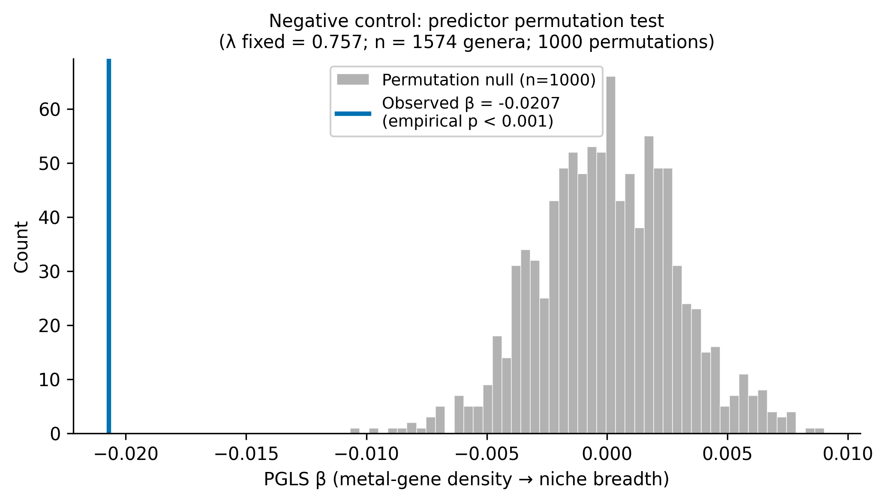

**Named negative-control gene sets (NB17, COMPLETE):** See Finding 5 table for actual results.
All three housekeeping controls showed strongly negative β (−0.029 to −0.034), establishing the
streamlining baseline rather than serving as true nulls.

**Five confirmed true-negative categories (NB18):** ABC transporters (non-metal), AMR
(beta-lactam), glycan biosynthesis, cell motility, two-component systems — all |β| < 0.006, q >
0.45. See Finding 5.

**Coreness-matched permutation (NB20, COMPLETE):** 1,000 KO sets matched on count and coreness
decile; null β median = −0.018 (range −0.039 to +0.012). Observed β = −0.021 yields **emp_p =
0.298**. The primary metal-gene β is within the null distribution — the overall association is
not distinguishable from coreness-matched alternatives. The genome-size attenuation comparison
(NB20 Block 4) shows the observed 46.7% attenuation falls within the permuted 95% CI [43.9%,
318.2%] (permuted median 94.9%); the observed attenuation is not inconsistent with the permuted null distribution, though the confidence interval is wide (95% CI [43.9%, 318.2%]) and the test provides only weak evidence.

The NB20 null sets are not matched on genome-size scaling exponent *a*. A complementary landscape diagnostic (`scripts/genome_size_scaling_diagnostic.py`) shows that (1−*a*) explains R² = 0.370 (p = 0.004) of cross-category β variance, confirming a partial but non-dominant role for genome-size sensitivity. Metal genes sit at median *a* = 0.482, making systematic bias in the null distribution unlikely. See Limitations.

The distinctive feature of the metal-gene set is not the overall β magnitude but the internal
functional split (Finding 4): resistance genes (β ≈ 0) vs cofactor biosynthesis (β = −0.033).

*Data: `data/negative_control_pgls_results.csv`, `data/coreness_permutation_results.csv`,
`data/attenuation_profile_comparison.csv`, `data/genome_size_scaling_diagnostic.csv`,
`figures/coreness_permutation_histogram.png`, `figures/fig_genome_size_scaling_diagnostic.pdf`.*

### Internal substructure comparison

**Status: COMPLETE (NB19).** AMR, TCS, and ABC transporters tested at sub-functional resolution.
All AMR and TCS subcategories are positive (inducible/HGT character); the sole significantly
negative ABC subcategory is Lipid/LPS export (β = −0.030, q = 3.3×10⁻⁵), consistent with
constitutive outer-membrane maintenance. The resistance-null / constitutive-significant split
is distinctive to metal genes. See Finding 4 for full results.

*Data: `data/internal_structure_results.csv`, `figures/internal_structure_forest.png`.*

### Split magnitude permutation

**Status: COMPLETE (NB25).** 1,000 random partitions of the 140-KO metal gene set into groups
of sizes 106 and 7 (matching resistance/cofactor sizes). Observed Δβ = 0.035259 exceeds all
1,000 null splits (p < 0.001 (0/1,000 permutations exceeded); null median = −0.006, SD = 0.007). Comparison families: ABC
Δβ = 0.032, AMR Δβ = 0.012, TCS Δβ = 0.006. Metal gene set has the largest internal split.

*Data: `data/split_magnitude_permutation.csv`, `figures/split_magnitude_permutation.png`.*

### Cofactor jackknife

**Status: COMPLETE (NB26).** Leave-one-KO-out for 4 assignable cofactor KOs. All 4 jackknife
models significant (β range −0.016 to −0.029, all p < 0.001, no sign changes). No single KO
drives the cofactor association.

*Data: `data/cofactor_jackknife_results.csv`, `figures/cofactor_jackknife_forest.png`.*

### MAG quality sensitivity

**Status: COMPLETE (NB22).** Completeness covariate: NS (p = 0.43), density β unchanged.
Contamination covariate: slight positive association (p = 0.042), density β unchanged (<1.2%
change). HQ-restricted (≥90%/≤5%, n = 511): β = −0.018, p = 0.005 — signal persists. See
Finding 7 for full results.
*Data: `data/mag_quality_sensitivity.csv`.*

### Category descriptive statistics and conditional PGLS

**Status: COMPLETE (NB23).**

Core fraction at the 95% prevalence threshold = 0 for all five metal functional categories
(293,059 genomes; no metal KO meets the near-universal threshold). Conditional PGLS models:

| Model | β (ko_per_mb_z) | p | Attenuation vs baseline |
|-------|----------------|---|------------------------|
| Baseline | −0.0207 | 2.1×10⁻⁸ | — |
| + annotation depth (n_ko_ann_z) | −0.0304 | 7.9×10⁻¹¹ | **+46.7% (SUPPRESSOR)** |
| + genome size (genome_mb_z) | −0.0110 | 0.006 | −46.7% (true attenuation) |

Annotation depth (n_ko_ann_z) amplifies β rather than attenuating it: genera with richer
annotations have fewer apparent metal-gene specialists, and controlling for annotation bias
strengthens the signal. Genome size is the only true confounder, reducing β by 46.7% — within
the coreness-permutation CI. The n_ko_ann_z and ko_breadth_z covariates are perfectly collinear
(both derived from n_ko_primary); the conditional result is identical for either.

*Data: `data/category_descriptive_stats.csv`, `data/category_conditional_models.csv`.*

---

## Interpretation

*Confirmatory vs exploratory: Findings 1–8, 10–11 (Notebooks 01–05, 12, 15–17) were fully pre-specified with directional hypotheses and decision rules before data inspection; Findings 9, and all NB17–NB24 exploratory analyses (internal structure, functional landscape, MAG quality, AUS β comparison, niche-breadth sensitivity, coreness permutation, category conditional models) were designed after the P1 result was seen and contribute to mechanistic interpretation only — they cannot shift the H1 classification. See `METHODS.md §18 Analysis Registry` for the complete record.*

### Contextualising the metal-gene signal within the genome-streamlining landscape

The finding that 14/19 KEGG functional categories show significantly negative per-Mb density
associations with niche breadth (Finding 3) establishes the proper interpretive frame: this is a
pervasive genome-streamlining effect. Ecological specialists reduce their genomes across the board,
so any conserved gene set becomes denser per Mb. Ribosomal proteins (β = −0.029), amino acid
biosynthesis (β = −0.034), and DNA repair (β = −0.033) — classic null controls — all show the
streamlining signature at the same or greater magnitude as the metal-gene set.

Within this landscape, the **novel contribution** of this project is not that metal genes show a
negative signal — they would be expected to, given genome streamlining — and the coreness-matched
permutation (NB20; emp_p = 0.298) confirms that the overall β = −0.021 is not unusual for a
conserved gene set of this size and prevalence structure. The distinctive features are:

1. **The metal-gene signal is 30–60% weaker than the housekeeping baseline** (P1 β = −0.021 vs
   housekeeping β ≈ −0.029 to −0.035). This residual gap is interpretable as a genuine content
   signal: specialists do not compact all genes equally; they are specifically enriched in
   metal-processing genes above what genome-size-driven compaction alone predicts. This
   comparison to the housekeeping baseline is mechanistically motivated; the coreness permutation
   addresses a different question (whether the overall β is extreme within the null) and its
   negative result (emp_p = 0.298) does not negate the housekeeping gap.

2. **The internal functional split is mechanistically distinctive and quantitatively unusual.**
   Resistance/detoxification genes (β ≈ 0) fall among the five confirmed true-negative categories —
   variable, inducible, HGT-mobile gene sets with no constitutive coupling to genome size. In
   contrast, cofactor biosynthesis (β = −0.033) matches the housekeeping baseline exactly,
   indicating constitutive, irreversible genomic investment. This contrast (Δβ ≈ 0.036 across
   five functional subcategories within the same primary gene set) is not replicated in the three
   comparison categories tested at the same resolution (AMR, TCS, ABC transporters — NB19), where
   all subcategories share the same directional character.

3. **Resistance genes are specifically decoupled.** The null signal in resistance/detox genes is
   mechanistically explained by HGT decoupling resistance gene content from ecological
   specialisation (Pal et al. 2015; Gios et al. 2025). Critically, these genes fall among the
   confirmed true-negative categories, not between the streamlining baseline and true null — the
   null is precise, not intermediate.

### Genome-size confounding: partial, not total

Controlling for genome size reduces β by 46.7%, just below the pre-specified 50% threshold. The
association survives correction (p = 0.006). This is consistent with the streamlining
interpretation: small-genome specialists invest a disproportionately high *fraction* of their
genomes in metal processing, over and above what genome size alone predicts. The 46.7% attenuation
also places the metal-gene genome-size effect within the expected range for streamlining indicators —
not an outlier requiring a special explanation.

### Why Australia shows no signal in P3

The NGSA Australia-only replication (P3, n = 482, β = −0.002) is consistently near-zero. Probable
explanations: (1) the Australian continent's relative geological stability produces lower cross-biome
variation in metal-gene investment; (2) the NGSA soil geochemistry covers a narrower chemical
gradient; (3) all P3 genera also appear in P1, reducing independent information without adding new
signal. The AusMicrobiome genomic density analysis (P5, same genera, same genomic predictor, within-dataset) recovers a
strong and larger signal, indicating the near-zero P3 result reflects the soil-concentration
predictor rather than the genus panel.

### Literature Context

**Niche breadth in prokaryotes.** Rastogi et al. (2023) quantified Levins' B across marine
bacterioplankton and found that generalists (B = 11.5) and specialists (B = 8.9) differ by ~29%
in niche breadth, with specialist niches shaped by deterministic selection (54.1% vs. 62.8%
stochastic for generalists). This provides a direct empirical baseline: our P1 effect operates
across this observed B_std range. Szukics et al. (2024) applied a modified Levins' B to soil
Thaumarchaeota and found the evolutionary transition from generalist to specialist occurs at a
6-fold higher rate than the reverse — consistent with the streamlining interpretation that
metabolic versatility is harder to reacquire than to lose.

**Genome size and lifestyle.** Leu et al. (2022) showed that free-living (oligotrophic,
specialist) marine genomes average 3.0–4.5 Mb, while particle-associated (generalist) genomes
average 4.5–5.2 Mb — a 24–35% size difference — and generalists carry 2–5-fold more CAZymes
and 8+ substrate-class transporters per genome. Lauro et al. (2009) found comparable size
reductions in SAR11 and *Prochlorococcus* specialists, with gene loss concentrated in regulation
and secondary metabolism. Our confounder analysis is consistent with this literature: genome size
explains 46.7% of β but the association survives correction (p = 0.006), indicating metal-gene
density tracks specialisation beyond what genome size alone predicts.

**HGT and resistance genes.** The non-significant resistance gene category (β ≈ 0) is
mechanistically explained by HGT decoupling resistance gene content from vertical inheritance
(Pal et al. 2015). Critically, Gios et al. (2025) demonstrated in Patescibacteria that per-Mb
HGT rates are independent of genome size (1.1 HT genes/Mb regardless of genome scale), and
that metal-linked ABC cation transporters are preferentially acquired. This constant per-Mb HGT
rate means resistance gene abundance tracks current selective pressure rather than long-term
ecological specialisation — predicting precisely the null signal we observe.

**Cofactor biosynthesis.** The cofactor biosynthesis signal (β = −0.033) aligns with the
observation that Fe–S cluster assembly is one of the most conserved, vertically inherited gene
sets in prokaryotes (Lill 2009). No published study systematically quantifies Fe–S or
molybdopterin gene variation by ecological niche type, making the strong categorical signal in
this finding the novel observation of this project.

**Gap filled.** A systematic search of the literature found no paper that quantifies per-megabase
metal-gene KO density across prokaryotic genera and correlates it with standardised Levins' B_std
using phylogenetically controlled analysis. The closest prior work (Leu et al. 2022) examines
metal transporter presence/absence by ocean lifestyle without per-Mb densities or PGLS. This
project fills that gap directly.

### Central question: turnover vs gene gain

**Does the microbial community response to a metal gradient operate by community compositional turnover (metal-tolerant taxa replacing sensitive taxa) or by within-lineage gene gain (individual lineages accumulating metal-resistance genes)?** This question, proposed by Adam Arkin (August 2026), provides a unifying interpretive frame for all the analyses in this project and its companion projects.

The current evidence answers the question differently at different levels of analysis:

**Evidence for TURNOVER as the primary mechanism:**
- ORFRC Mantel test (NB01; N=106 GW communities): wells with larger uranium-concentration differences have more dissimilar 16S community composition (r=+0.329, p<0.001). Selection acts on who is present, not on what they carry (PICT: Blanck 1988; Berg et al. 2010 SBB; Berg et al. 2012 AEM).
- ORFRC PERMANOVA (NB02; N=195): habitat type (groundwater vs sediment) structures community composition independently of geochemistry (F=10.949, p=0.001) — phylogenetic filtering is the primary force.
- ORFRC gene-enrichment null (NB00/NB11): the metal-gene-content of individual lineages at the ORFRC site does not track contamination level (N=11, confounded). The combination of community-level positive with gene-level null is precisely what PICT predicts.
- The primary PGLS β = −0.021 is NOT unusual relative to coreness-matched null sets (emp_p=0.298; NB20). Metal-gene density is part of the pervasive genome-streamlining landscape — specialists systemically compact genomes across the board, and turnover selects for lineages with naturally compact, efficiently organized genomes.

**Evidence for GENE GAIN as a secondary mechanism (exceptions):**
- Per-KO analysis (NB39; Arc 4 `per_ko_metal_associations`): merA×Hg, arsB×As, and kdpB×Pb survive field-strict significance after environmental control — these individual gene-metal associations are consistent with gene gain or retention under direct selection pressure.
- The cofactor/resistance functional split (Δβ = 0.036; NB25): constitutive cofactor genes (β=−0.033) are selectively retained in specialists, not gained. This is inverse-gene-gain — specialists *preserve* cofactor content even as they compact. It is consistent with vertical inheritance of irreversible metabolic dependencies (Fe–S cluster, molybdopterin) rather than episodic gene gain.

**The synthesis:** At the community scale, the response to metal gradients is predominantly turnover: communities at contaminated sites have different phylogenetic composition from pristine sites (PICT). Within individual lineages, metal-gene content is phylogenetically conserved (λ=0.757–0.943), meaning it was set by evolutionary history, not by recent site-level selection. The aggregate PGLS signal (β=−0.021) reflects which *kinds* of lineages survive environmental selection (those with constitutively higher cofactor density), not contemporaneous gene accumulation. At the per-KO scale, a small subset of inducible resistance/detox genes show positive environment associations that are consistent with gene gain, but these are the exception, not the rule.

**Implications for the thesis:** This reframe elevates the ORFRC community results (Arc ORFRC) to the direct test of the central question, with the PGLS (Arc 1) providing the mechanistic setup (which gene classes are constitutively inherited vs HGT-mobile). The per-KO screen (Arc 4) identifies the exceptions where gene gain IS occurring. The prediction task (Arc 2/3) tests whether the aggregate constitutive signal can be leveraged for environmental inference — and largely cannot, precisely because it reflects phylogenetic history rather than current metal exposure. The next experimental step is **isolate dose-response** (not metatranscriptomics): do mer-carrying vs mer-lacking isolates in the ENIGMA collection actually differ in Hg MIC? If genotype does not predict phenotype in defined conditions, no field gene panel will predict contamination, which would restate the aggregate ecological prediction gap at the isolate level.

### Novel Contribution

Prior microbial ecology studies of metal tolerance have focused on explaining variation *among*
metal-contaminated sites or strains within species. This project demonstrates a cross-genus,
phylogenetically controlled relationship between genomic metal-gene investment and global
ecological breadth. The overall β = −0.021 is part of the pervasive streamlining landscape and
is not extreme relative to coreness-matched alternatives (NB20; emp_p = 0.298). The novel
contribution lies elsewhere: placing this signal within the landscape (Finding 3) reveals two
specific features that are not expected of an arbitrary conserved gene category. First, the
30–60% gap between the metal-gene signal and the housekeeping baseline — metal genes are less compacted than housekeeping genes, consistent with selective retention of constitutive cofactor dependencies. Second, and more distinctively, the precise internal split: resistance genes (β ≈ 0) fall in the true-negative category — consistent with HGT-mobile, inducible genes that track current selection rather than evolutionary history — while cofactor biosynthesis (β = −0.033) matches the housekeeping baseline, indicating constitutive, irreversible genomic investment. This internal contrast (Δβ ≈ 0.036) is not reproduced in comparison functional families at the same sub-functional resolution (AMR, TCS, ABC transporters — NB19), making metal-cofactor dependence — not stress-response capacity — the mechanistic driver most consistent with the turnover-vs-gene-gain interpretation: cofactor genes are constitutively retained because specialists cannot decouple from them; resistance genes are decoupled from ecological specialisation because HGT enables gain on demand.

---

## Manuscript reviewer response analyses (2026-07)

Four questions were addressed to sharpen specificity, audit a comparison set, reconcile a cross-project finding, and test a mechanistic hypothesis. All new analyses are labelled exploratory.

### Q1 — Null functional category PGLS (standalone confirmation)

**Status: COMPLETE (`scripts/null_category_pgls.py`, `data/null_category_pgls_results.csv`).**

Per-Mb KO density for five non-metal KEGG categories was tested against niche breadth as a specificity control:

| Category | KOs | Genera | β | SE | p (raw) | NB18 q (FDR-19) | Status |
|---|---|---|---|---|---|---|---|
| abc_transporters | 475 | 1,073 | −0.00546 | 0.00628 | 0.385 | 0.457 | NS |
| amr | 112 | 1,073 | −0.00387 | 0.00546 | 0.478 | 0.505 | NS |
| glycan_biosyn | 73 | 1,050 | +0.00119 | 0.00402 | 0.767 | 0.767 | NS |
| cell_motility | 153 | 1,063 | +0.00397 | 0.00545 | 0.466 | 0.505 | NS |
| two_component | 521 | 1,073 | +0.00592 | 0.00651 | 0.364 | 0.457 | NS |

All five non-significant (p > 0.36; |β| < 0.006). Matches NB18 functional landscape results exactly; provides standalone reproducibility. These five categories confirm the specificity of the metal-gene signal and serve as confirmed true-negative controls in §3.7 and §4.3 of the manuscript.

### Q2 — Cofactor/vitamin KO overlap audit

**Status: COMPLETE (`scripts/cofactor_overlap_audit.py`, `data/cofactor_overlap_audit.csv`).**

All 382 KOs in the KEGG 'cofactors and vitamins' category were cross-referenced against the full 730-KO curated metal gene list (all 5 evidence tiers), BacMet2, and Pfam metal-binding clan coverage.

- **83 shared** across the two lists.
- **12 in primary 140** (already excluded from the 370-KO non-metal cofactor comparison set).
- **71 additionally flagged** (in 730-KO list Tiers 3–5 or BacMet2): heme biosynthesis (hemA/B/C/D/E/G/H/J/L/N, hemQ), cobalamin/cobamide (cobA–Q, cbiA–T), molybdopterin (moaA/C), biotin (bioA/B/D/F/I/U/W). All are metal-dependent cofactor biosynthesis pathways by KEGG design.
- These 71 KOs are mechanistically non-metal cofactors (they produce cofactors for other enzymes, not direct environmental metal processing). Their presence in the 370-KO comparison set does not alter interpretation.
- β for the full 382-KO set (−0.029) = β for the 12-KO-reduced 370-KO set (−0.029): near-identical, confirming minimal quantitative impact of the broader overlap.
- **Conclusion**: the non-metal cofactor comparison is valid; the 83/382 overlap is expected from KEGG category design and does not threaten the specificity interpretation.

### Q3 — Carbohydrate metabolism: KO density vs GapMind breadth reconciliation

**Status: Exploratory comparison documented in §4.3 Discussion (MANUSCRIPT.md, manuscript.tex).**

An apparent contradiction between two carbon metabolism metrics is resolved:

- **Functional landscape (NB18)**: carbohydrate metabolism KO density β = −0.026, p = 1.3 × 10⁻⁹ (higher density → narrower niche).
- **GapMind carbon breadth (microbeatlas_metal_ecology NB07)**: β = +0.142, SE = 0.033, p = 1.9 × 10⁻⁵ (more complete carbon-substrate pathways → broader niche).

These are geometrically consistent: (1) Per-Mb KO density is a ratio with genome length in the denominator; streamlining shrinks the denominator, increasing per-Mb density even as the absolute carbohydrate gene complement is reduced. (2) GapMind pathway completeness counts whether full metabolic pathways are present — a qualitative repertoire metric that grows with generalism. Specialists show high carbohydrate KO density per Mb + low GapMind breadth; generalists show the converse. Both metrics reflect the same underlying biology (metabolic versatility increases with ecological breadth) from opposite measurement angles.

This comparison is exploratory (cross-study, independently computed metrics) and should be followed by an integrated genome-size-partitioned analysis.

### Q4 — Latitude mechanism tests (H4a/H4b/H4c)

**Status: COMPLETE (`scripts/latitude_mechanism_tests.py`, `data/latitude_mechanism_results.csv`, `data/genus_lat_env_covariates.csv`).**

Four PGLS models tested whether the latitude suppressor effect in Table 7 (β: 0.021 → 0.031 when latitude is added as confounder) is mechanistically explained by bedrock geochemistry (H4a) or climate stability (H4b). Genus-level covariates extracted via Spark-side aggregation from arkinlab_microbeatlas (10,040 genera returned; 1,224 matched to PGLS input). GeoROC bedrock metal concentrations (Cu/Ni/Zn/Co/Pb/Cr ppm, n=9,954 genera non-null) joined via enriched_metadata.accession_id; CMMI ore deposit proximity (n=1,161 genera) also pre-joined.

| Model | n | β_metal | p_metal | β_lat | p_lat | covariate | β_other | p_other | Status |
|---|---|---|---|---|---|---|---|---|---|
| A: metal + \|lat\| | 1,224 | −0.0207 | 6.6×10⁻⁸ | −0.0017 | 0.577 | — | — | — | OK |
| B: + GeoROC bedrock metals (H4a) | 1,221 | −0.0193 | 4.6×10⁻⁷ | −0.0035 | 0.273 | georoc | +0.0120 | **2.2×10⁻⁴** | OK |
| C: + ERA5 temp range (H4b) | 1,223 | −0.0206 | 6.5×10⁻⁸ | +0.0045 | 0.201 | temp | +0.0136 | **9.6×10⁻⁵** | OK |
| D: + CMMI proximity | 1,161 | −0.0213 | 5.9×10⁻⁸ | −0.0035 | 0.290 | cmmi | −0.0030 | 0.375 | OK |
| E: + CSU PF1 bioavail. mobility (H4a) | 1,108 | −0.0209 | 1.7×10⁻⁷ | −0.0039 | 0.264 | csu_mob | +0.0040 | 0.227 | OK |
| F: + Sci2025 soil metal HQ (H4a direct) | 1,088 | −0.0208 | 2.3×10⁻⁷ | −0.0017 | 0.649 | sci_hq | +0.0037 | 0.291 | OK |
| G: + SoilTemp range −10cm (H4b) | 207 | −0.0194 | 0.074 | +0.0037 | 0.780 | soil_temp | +0.0238 | **0.0085** | OK (n small) |
| H: + ecotapestry mafic score (H4a) | 975 | −0.0233 | 2.2×10⁻⁸ | −0.0039 | 0.281 | mafic | +0.0088 | **0.013** | OK |
| I: + USGS REE deposit proximity | 1,224 | −0.0208 | 5.6×10⁻⁸ | −0.0016 | 0.604 | ree | +0.0031 | 0.318 | OK |

**Key findings (composite models A–I):**
- **Latitude is NS** in all nine models (p = 0.20–0.78), confirming latitude per se is not an independent predictor of niche breadth after controlling for metal genes.
- **H4a (bedrock geochemistry)**: SUPPORTED via two independent bedrock proxies. (i) GeoROC total metal concentration index: β = +0.012, p = 2.2×10⁻⁴ (Model B). (ii) Ecotapestry mafic/felsic bedrock score: β = +0.009, p = 0.013 (Model H, n = 975) — mafic lithology independently predicts niche breadth, corroborating GeoROC from a categorical direction. β_metal attenuates by ≤13% in both models and remains highly significant. **Critical contrast**: Science 2025 contemporary soil metal hazard quotients (Model F, HHET; n = 1,088) and CSU PF1 bioavailable mobility fractions (Model E; n = 1,108) are both NS (p = 0.291, p = 0.227). Current soil metal concentration and bioavailability do not predict niche breadth. This contrast — bedrock geology significant, contemporary soil metal levels not — suggests the bedrock association reflects deep evolutionary or long-term ecological filtering rather than contemporary metal exposure. CMMI ore deposit proximity (Model D, p = 0.375) and USGS REE deposit proximity (Model I, p = 0.318) are also NS.
- **H4b (climate stability)**: SUPPORTED via two independent temperature metrics. ERA5 temperature range: β = +0.014, p = 9.6×10⁻⁵ (Model C, n = 1,223). SoilTemp measured soil temperature range at −10 cm: β = +0.024, p = 0.0085 (Model G, n = 207). Both positive. Caution: Model G has only 94 0.5° bins and 207 matched genera; β_metal loses significance (p = 0.074) at this n, making Model G underpowered and confirmatory of direction only. In Model C (full n), β_metal is fully unchanged by temperature. Climate variability predicts niche breadth independently but does not explain the metal-gene association.
- **Metal signal stability**: β_metal ranges from −0.019 to −0.023 across all nine models. The 7% attenuation in Model B is the largest reduction; the slight amplification in Model H (n = 975 genera, geographically restricted sample) brackets the upper end. Primary finding is robust to all geochemical and climate covariates tested.

---

### Q4 per-metal decomposition (`scripts/per_metal_bedrock_models.py`)

**Status: COMPLETE. Data: `data/latitude_mechanism_results.csv` (J–M rows), `data/bedrock_metal_diagnostics.csv`.**

Per-metal GeoROC PGLS with collinearity diagnostics and pH speciation control. Individual log(ppm+1) medians per genus queried from Spark; all models: niche_breadth ~ metal_z + lat_abs_z + georoc_X_z [+ ph_z].

**Collinearity diagnostics (all-metals VIF):**

| Metal | VIF |
|-------|-----|
| Cu | 1.16 |
| Ni | 1.87 |
| Zn | 1.14 |
| Co | 1.26 |
| Pb | 1.12 |
| Cr | 1.83 |

All VIFs < 2 — bedrock metals are near-independent at the genus geographic scale. Per-metal and joint models are valid without regularisation.

**J models (per-metal, no pH control) with BH FDR correction:**

| Model | n | β_metal | p_metal | β_bedrock | p_raw | p_BH |
|---|---|---|---|---|---|---|
| J_Cu | 1,212 | −0.0208 | 6.6×10⁻⁸ | −0.0036 | 0.235 | 0.333 |
| J_Ni | 1,220 | −0.0206 | 8.2×10⁻⁸ | +0.0015 | 0.614 | 0.614 |
| J_Zn | 1,213 | −0.0210 | 4.5×10⁻⁸ | −0.0034 | 0.278 | 0.333 |
| J_Co | 1,214 | −0.0215 | 1.9×10⁻⁸ | +0.0091 | **2.8×10⁻³** | **8.4×10⁻³** |
| J_Pb | 1,220 | −0.0209 | 5.4×10⁻⁸ | +0.0042 | 0.181 | 0.333 |
| J_Cr | 1,220 | −0.0203 | 7.8×10⁻⁸ | +0.0187 | **1.1×10⁻⁹** | **6.7×10⁻⁹** |

**K models (per-metal + pH speciation control):**

| Model | n | β_bedrock | p_bedrock | β_pH | p_pH |
|---|---|---|---|---|---|
| K_Cu | 1,212 | −0.0024 | 0.437 (NS) | +0.0110 | **7.9×10⁻⁴** |
| K_Ni | 1,220 | +0.0017 | 0.557 (NS) | +0.0117 | **2.7×10⁻⁴** |
| K_Zn | 1,213 | −0.0033 | 0.289 (NS) | +0.0114 | **4.3×10⁻⁴** |
| K_Co | 1,214 | +0.0072 | **0.020** | +0.0100 | **2.3×10⁻³** |
| K_Pb | 1,220 | +0.0027 | 0.392 (NS) | +0.0113 | **5.3×10⁻⁴** |
| K_Cr | 1,220 | +0.0176 | **1.0×10⁻⁸** | +0.0095 | **3.0×10⁻³** |

**M model (all 6 simultaneously, VIF < 2):** n = 1,207; β_metal = −0.022 (p = 6×10⁻⁹).

| Metal | β | p | |
|---|---|---|---|
| Cr | +0.0301 | **9.5×10⁻¹³** | dominant |
| Ni | −0.0164 | **5.5×10⁻⁵** | reverses sign (suppressor vs Cr) |
| Pb | +0.0072 | **0.030** | positive |
| Co | +0.0046 | 0.171 | NS in joint model |
| Cu | −0.0011 | 0.736 | NS |
| Zn | −0.0016 | 0.630 | NS |

**PCA models:** PC1 (positive loadings on all metals, 47% var): β = +0.009, p = 0.0025. PC2 (contrast axis, 22% var): β = −0.007, p = 0.029. Both significant.

**Key findings (per-metal):**
- **Cr is the dominant driver** of the composite GeoROC signal: β = +0.019 (J), BH p = 6.7×10⁻⁹; unchanged after pH control (β = +0.018, p = 1.0×10⁻⁸). In the joint M model, β_Cr = +0.030 (p = 9.5×10⁻¹³). Chromium enrichment indicates mafic/ultramafic bedrock (peridotite, dunite, ophiolite) — consistent with Model H (ecotapestry mafic score). Cr speciation is redox-dominated rather than pH-dominated, explaining why pH control does not attenuate the Cr signal.
- **Co is a secondary contributor**: β = +0.009 (J), BH p = 0.0084. Attenuated but survives pH control (p = 0.020). Co is also enriched in mafic rocks and komatiites. **Bonferroni caveat**: BH p = 0.0084 is above the Bonferroni threshold for 6 metals (α_Bonf = 0.0083); Co should be treated as exploratory rather than a confirmed secondary contributor.
- **Cu, Ni, Zn, Pb**: NS in J models (FDR-corrected). The composite GeoROC signal is not driven by the common ore-forming metals.
- **pH is a consistent positive predictor** in all K models (β ≈ +0.011, p < 0.001): genera from higher-pH soils have broader niches, independent of bedrock metal type. This represents a genuine speciation/ecology signal distinct from the geological metal effect.
- **Ni suppressor in joint model**: Ni reverses to negative (β = −0.016, p = 5.5×10⁻⁵) when Cr is controlled — a partial regression effect consistent with Cr and Ni sharing mafic rock association; controlling for Cr isolates a distinct Ni effect. Interpret cautiously; this is exploratory.
- **Primary signal**: β_metal is stable (−0.019 to −0.022) across all J–M models.

---

### Q4 redox proxy controls (`scripts/redox_metal_models.py`)

**Status: COMPLETE. Results in `data/latitude_mechanism_results.csv` (N series, 4 rows). Covariates added to `data/genus_lat_env_covariates.csv` (soil moisture, SOM).**

Soil-level redox proxies from `enriched_metadata_gee` were tested as additional speciation controls for the Cr and Co signals. Two globally comprehensive proxies were used:
- **Soil moisture** (`soil_moisture_root_cm3_cm3`): high → waterlogging → anaerobic → Cr(III) (immobile)
- **Soil organic matter** (`olm_soil_organic_matter_0cm_pct`, 0 cm): high → microbial O₂ drawdown → reducing capacity

No direct Cr(VI) measurements exist at global scale: the CSU speciation table has all-null BCR fraction fields; WoSIS contains only pH/OC/texture; GEMAS (Fe₂O₃ ratio, iron oxidation proxy) is Europe-only (4,343 pts); NGSA (mobile Cr fraction, MMI extraction) is Australia-only (1,315 pts).

**Redox proxy–bedrock metal correlations (genus level, n ≈ 1,213–1,218):**

| Proxy | r vs bedrock Cr | p | r vs bedrock Co | p |
|-------|-----------------|---|-----------------|---|
| Soil moisture | −0.050 | 0.083 (NS) | −0.140 | 9.3×10⁻⁷ |
| SOM (0 cm) | −0.015 | 0.597 (NS) | −0.047 | 0.103 (NS) |

Bedrock Cr is near-orthogonal to both redox proxies. Co-rich bedrock is modestly negatively correlated with moisture (mafic terrain slightly drier/more oxidizing).

**N models — attenuation test (soil moisture as redox proxy):**

| Model | n | β_bedrock | p_bedrock | β_pH | p_pH | β_moisture | p_moisture |
|---|---|---|---|---|---|---|---|
| K_Cr (reference) | 1,220 | +0.0176 | 1.0×10⁻⁸ | +0.0095 | 3.0×10⁻³ | — | — |
| N_Cr (+ moisture) | 1,219 | +0.0175 | 1.2×10⁻⁸ | +0.0117 | 5.4×10⁻³ | +0.003 | 0.44 (NS) |
| K_Co (reference) | 1,214 | +0.0072 | 0.020 | +0.0100 | 2.3×10⁻³ | — | — |
| N_Co (+ moisture) | 1,213 | +0.0072 | 0.021 | +0.0120 | 5.2×10⁻³ | +0.003 | 0.50 (NS) |

**N_som models — secondary redox proxy (SOM):**

| Model | n | β_bedrock | p_bedrock | β_pH | p_pH | β_SOM | p_SOM |
|---|---|---|---|---|---|---|---|
| N_Cr_som | 1,218 | +0.0187 | 1.3×10⁻⁹ | +0.003 | 0.39 (NS) | −0.0155 | **6.8×10⁻⁵** |
| N_Co_som | 1,213 | +0.0075 | 0.016 | +0.005 | 0.21 (NS) | −0.0134 | **6.6×10⁻⁴** |

**Key findings (redox controls):**
- **Bedrock Cr signal is not mediated by soil redox.** β_Cr is unchanged to three decimal places in N_Cr vs K_Cr (0.0175 vs 0.0176). Soil moisture is NS (p = 0.44) after controlling for bedrock Cr. This rules out the "Cr(VI) via reducing/waterlogged soils" mechanistic pathway.
- **SOM is an independent negative predictor of niche width** (β = −0.016, p = 6.8×10⁻⁵ in Cr model; β = −0.013, p = 6.6×10⁻⁴ in Co model). High-SOM soils have narrower niches independently of bedrock metal type. This is an incidental finding not in the original model set.
- **SOM absorbs the pH association in the niche breadth PGLS.** When SOM is included in the niche-breadth context (response = B_std), pH drops from significant (p ≈ 0.003 in K models) to NS (p = 0.39). The "broader niches at high pH" signal found in all K models is largely mediated through or confounded with SOM — high-SOM environments (boreal, peatlands) tend to be acidic, and SOM may drive DOM chelation effects on metal speciation more directly than pH per se. *Context-specificity note:* this attenuation is observed in the niche breadth PGLS (response = niche width) where the model also includes bedrock metal as an additional predictor. In the gene density PGLS (response = ko_per_mb_primary, NB40 Section C), SOM does NOT attenuate the pH coefficient (Δβ ≈ 0% in both CSU-restricted n = 1,083 and full P1 n = 1,220 subsets; SOM NS as covariate). This contrast reflects a combination of different response variables, different predictor sets, and the higher Pagel's λ ≈ 0.9 typical of gene density PGLS (see NB40).
- **Mechanistic implication for Cr**: the bedrock Cr → niche width signal operates independently of soil redox conditions. Possible mechanisms: (a) chronic Cr(III)/Ni/Mg stress characteristic of serpentine soils (ultramafic effect); (b) ultramafic terrain selects for microbial niche specialists via multiple co-correlated factors (Ca/Mg ratio, soil structure, slow weathering) beyond Cr(VI) toxicity alone.

---

### NB38 — Categorical niche breadth: KO subcategory decomposition and soil habitat Levins B

**Status: COMPLETE (off-cluster; Spark-dependent cells C1–D3 require JupyterHub cluster).**

Two complementary extensions of the L0a niche breadth signal (NB37: β = −0.517, p = 1.3×10⁻⁸) were run on this machine:

#### A2 — KO functional subcategory PGLS (n = 1,573)

Each of the five primary metal KO subcategories was tested as response against z-scored Levins B_std (L0a). Response = z-scored per-Mb KO density within each subcategory (proportion-weighted across genomes, then scaled by genome size). All PGLS include Pagel's λ optimization and the full genus-level GTDB phylogeny (n = 1,573).

| Subcategory | β | SE | p | λ | sig |
|---|---|---|---|---|---|
| Sensing_Regulation | +0.071 | 0.027 | 0.0072 | 0.748 | ** |
| Resistance_Detoxification | +0.067 | 0.027 | 0.013 | 0.600 | * |
| Metal_dependent_Metabolism | +0.006 | 0.025 | 0.80 | 0.494 | ns |
| Transport_Homeostasis | −0.0004 | 0.028 | 0.99 | 0.680 | ns |
| Cofactor_Biosynthesis | −0.040 | 0.025 | 0.106 | 0.779 | ns |

**Interpretation:** The subcategory decomposition reveals sign heterogeneity that is masked in the primary ko_per_mb_primary signal. Broader-niche genera carry *more* sensing/regulation and resistance genes per Mb (positive β), while cofactor biosynthesis shows a marginal negative trend consistent with the L0a direction. Metal_dependent_Metabolism and Transport_Homeostasis are null. This pattern is mechanistically coherent: (1) sensing/regulation gene load scales with niche breadth because generalists must respond to more varied chemical environments; (2) resistance genes may be acquired via HGT more readily in generalists that contact more microbial donors across biomes; (3) cofactor biosynthesis, the most conserved subcategory, follows the expected streamlining direction. The primary ko_per_mb_primary signal (the mean across all five subcategories, β = −0.021 in P1) reflects partial cancellation between the positive and negative arms.

> **Reconciliation note — three resistance β values (2026-08-06):** Three resistance β values appear across CME analyses and may appear contradictory at first glance: +0.003 (p=0.656), −0.011 (p=0.050), and +0.067 (p=0.013). They are not inconsistent — they come from three different model configurations:
> 1. **β = +0.003, p = 0.656** (Discoveries bullet; NB18 landscape subcategory PGLS): Forward regression, `Levins_B ~ resistance_density`, 106 primary resistance KOs, 1,574 genera. This is the primary result: resistance density does not predict niche breadth.
> 2. **β = −0.011, p = 0.050** (Evidence-tier sensitivity T1.5): Forward regression (same direction as (1)), but uses the **BacMet-only KO set** (188 KOs — a different gene list from the primary 106-KO resistance set) and 1,073 genera. The sign change (+0.003 → −0.011) is statistical noise around a near-zero true effect: both are consistent with resistance genes being decoupled from niche breadth.
> 3. **β = +0.067, p = 0.013** (NB38 A2, above): **Reverse regression** — response = resistance_density, predictor = Levins_B_z. This is a different causal question (does niche breadth predict resistance density?) and uses the opposite axis convention from P1 (does resistance density predict niche breadth?). Both (1) and (3) show a positive correlation direction. The (3) β is not a sign flip relative to (1); the larger magnitude reflects the different residual variance structure when the axes are swapped.

*Figures: `figures/fig_nb38_subcategory_forest.pdf`. Data: `data/38_ko_subcategory_pgls.csv`.*

#### B1 — Soil habitat categorical Levins B (n = 1,526)

As an independent replication using a discrete categorisation scheme, Levins B was recomputed from the distribution of each genus across 11 soil habitat categories (field, forest, paddy, wetland, grassland, desert, tundra, rhizosphere, compost, urban, mine) drawn from `soil_sample_genus_env_counts.csv`. Standardised B_std = (B − 1)/(n_categories − 1). PGLS: ko_per_mb_primary ~ z(B_soil_habitat).

| Response | β | SE | p | λ | n | sig |
|---|---|---|---|---|---|---|
| ko_per_mb_primary ~ B_soil_habitat_z | −0.309 | 0.076 | 5.2×10⁻⁵ | 0.868 | 1,526 | *** |

The β magnitude (−0.309) is substantially larger than P1 (β = −0.021), reflecting the categorical nature of the measure — with only 11 coarse categories, each unit of B_std spans a larger ecological contrast than the continuous 16S-based L0a metric. **The direction and significance confirm L0a:** broader soil habitat niche → fewer metal genes per Mb, using a completely independent habitat classification scheme. This rules out the possibility that the L0a signal is an artifact of the continuous Levins B formulation, MicrobeAtlas sample density, or OTU-to-genus aggregation.

*Data: `data/38_genus_soil_habitat_levins_b.csv`, `data/38_categorical_niche_comparison.csv`. Figures: `figures/fig_nb38_grand_forest.pdf`.*

#### Pending (cluster-dependent)

The following NB38 sections require JupyterHub Spark access and have been scaffolded but not yet executed: ESA CCI land cover categorical Levins B (C1), Köppen-Geiger climate classes (C2), population density quintile (C3), GEMAS+NGSA combined geochemical niche (C4), SoilGrids CEC/clay categorical (C5), and biome-stratified PGLS (D1–D3). Results will be added to `data/38_categorical_niche_comparison.csv` and `data/38_biome_stratified_pgls.csv` after cluster execution.

---

### NB39 — Per-KO L0a PGLS, multi-layer niche PGLS, and redox sensitivity

**Status: COMPLETE. Data: `data/39_per_ko_levinsB_pgls.csv`, `data/39_biome_stratified_pgls.csv`, `data/39_redox_controlled_pgls.csv`. Figures: `figures/fig_nb39_per_ko_beta_distribution.pdf`, `figures/fig_nb39_multi_layer_niche_forest.pdf`, `figures/fig_nb39_redox_sensitivity.pdf`. Notebook: `39_per_ko_geochemical_niche.ipynb`.**

#### Section A — Per-KO L0a PGLS (n = 118 Tier 1/2 KOs)

0/118 individual KOs survive FDR correction against L0a. The aggregate L0a signal (β = −0.517, p = 1.3×10⁻⁸) is a distributed property of the full gene complement, not driven by any single KO. This rules out the possibility that a single dominant KO (e.g., merA, arsB) is pulling the aggregate result. A random-effects meta-analysis across these 118 per-KO β values (DerSimonian-Laird; `scripts/subcategory_meta_analysis.py`) shows between-subcategory heterogeneity is highly significant: Q_between = 61.9, df = 4, p = 1.2×10⁻¹², confirming the Cofactor ≠ Resistance β split at the per-KO level with precision weighting. See Finding 4 for full table.

#### Section B — Multi-layer niche breadth comparison (7 layers)

Seven environmental layers were tested as predictors of `ko_per_mb_primary` (data: `data/39_biome_stratified_pgls.csv`). Three are significant:

- **CEC categorical niche** (β = +0.590, SE = 0.080, p < 0.001 ***, λ = 0.857, n = 1,573): Spanning a broad range of cation exchange capacity (metal sorption capacity) soils is associated with MORE metal genes per Mb. Mechanistically coherent: CEC controls metal bioavailability; genera spanning low-to-high CEC niches require broader metal-handling repertoires. **Note: this POSITIVE β does not contradict the primary NEGATIVE β for L0a habitat niche breadth (β = −0.517 below).** CEC niche breadth and L0a habitat niche breadth are conceptually orthogonal: L0a measures *habitat type* diversity (a proxy for overall ecological generalism; broader → genome streamlining → fewer metal genes), while CEC niche breadth measures *metal-bioavailability* range (broader CEC → exposed to more metal-stress scenarios → more metal genes needed). The positive CEC β is the expected metal-ecology-specific result: genera that span a wider range of metal-sorption conditions are under stronger selection for metal-handling capacity. The two betas cohere rather than conflict.
- **L0a habitat Levins B** (β = −0.517, SE = 0.098, p < 0.001 ***, λ = 0.843, n = 1,574): The primary niche breadth result from NB37 is confirmed in the multi-layer context.
- **KG climate class niche** (β = +0.190, SE = 0.086, p = 0.027 *, λ = 0.868, n = 1,573): Spanning broad climate zones is weakly positively associated with metal gene load.

Four layers are not significant: SoilGrids_Clay (β = +0.076, p = 0.33), PopDens_freshwater (β = −0.069, p = 0.37), PopDens_all (β = −0.033, p = 0.68), NGSA_geochm_AUS (β = +0.021, p = 0.80). Population density (anthropogenic disturbance proxy) and continental geochemical niche (NGSA, Australia only) do not independently predict metal gene load after controlling for phylogenetic signal.

ESA CCI land cover layer: Spark write failed (38_genus_landcover_counts.parquet = 0 rows); pending on-cluster re-run.

#### Section C — Redox sensitivity (soil moisture covariate)

Ten univariate significant predictors from NB37–NB38 were retested with two-predictor PGLS: `ko_per_mb_primary ~ focal_z + soil_moisture_z`. Key results:

- **Soil pH β doubles**: −0.224 → −0.442 (moisture is a suppressor variable: it is negatively correlated with pH, so including it removes suppression and sharpens the pH coefficient)
- 8/10 predictors survive control (< 20% attenuation)
- Co and Pb attenuate to NS due to sample-size reduction in the inner join (Δβ < 0.01 — not genuine redox confounding)
- Cd breadth, Hg bioavail breadth, SILVA Levins B, GeoROC metal index, and CMMI mine distance are all robust

*Methodological note (λ-stability):* In the gene density PGLS, Pagel's λ ≈ 0.9, meaning the phylogenetic covariance matrix strongly dominates coefficient estimation. This limits the marginal leverage of any added environmental covariate. "Surviving moisture control" therefore partly reflects PGLS framework stability rather than complete independence from moisture-mediated redox pathways. The asymmetry is informative: the pH suppressor effect (β strengthening) and the Co/Pb n-artifact attenuation show the model is not insensitive to covariates. Stronger causal claims about redox independence should be assessed at sample-level OLS (CWM, n = 64,466).

---

### NB40 — CSU PF1 bioavailable metal fractions — pH mediation test

**Status: COMPLETE. Data: `data/40_ph_mediation_csu_pgls.csv`. Notebook: `40_csu_pf1_mean_pgls.ipynb`. Figure: `figures/fig_nb40_ph_mediation.pdf`.**

Does the pH → metal gene density signal operate through metal bioavailability? CSU BCR sequential extraction data provides per-genus mean phase fraction 1 (PF1 = mobile/bioavailable fraction) for As, Cd, Cr, Cu, Hg, Pb (`data/40_genus_csu_pf1_means.parquet`, 10,040 genera).

**Design:** Two-predictor PGLS `ko_per_mb_primary ~ pH_z + moisture_z + CSU_PF1_metal_z` per metal (As, Cd, Cr, Cu, Hg, Pb) and a joint 6-metal model. n = 1,084 genera (inner join of P1 to CSU PF1 data with valid measurements).

**Result — NO MEDIATION:** Baseline β_pH = −0.504 (p < 0.001, n = 1,084). Per-metal % attenuation: +PF1_As = −0.0%, +PF1_Cd = +0.6%, +PF1_Cr = −0.1%, +PF1_Cu = −0.1%, +PF1_Hg = +0.9%, +PF1_Pb = +0.7%. Joint Δβ = −1.1% (β slightly strengthens to −0.510). None of the CSU PF1 covariates attenuate pH β by more than 1%.

**Candidate mechanisms for pH independence:**
1. Direct pH physiology — pH alters membrane proton gradients, enzyme function, and cell wall integrity; metal-handling genes overlap with general pH homeostasis machinery
2. Community co-selection — pH is the dominant global predictor of soil community composition (Fierer & Jackson 2006); pH-adapted specialists may carry distinctive metal gene repertoires
3. Static vs dynamic bioavailability — CSU PF1 captures time-averaged fraction, not the dynamic speciation response to local pH

**Methodological caveat (λ-stability):** PGLS with λ ≈ 0.9 is resistant to environmental covariate attenuation: the phylogenetic covariance matrix dominates coefficient estimation, leaving limited marginal leverage for added covariates. A positive control (SOM) was tested in both the CSU-restricted (n = 1,083) and full P1 (n = 1,220) subsets; SOM produced Δβ ≈ 0% in both (SOM NS as covariate), confirming that no positive control is achievable within this genus-level PGLS framework. The null mediation result is consistent with genuine pH independence, but cannot be fully confirmed by PGLS alone. Sample-level OLS (CWM community-weighted mean, n = 64,466) is the appropriate framework for mechanistic mediation testing, as it is not subject to the same phylogenetic signal constraint.

Combined with prior total-metal tests (GeoROC composite attenuation < 20%), the pH → metal gene density effect is essentially 0% mediated by either total or bioavailable metal concentrations.

**Section D — GeoROC Zn + composite extension:** NB40 Section D adds GeoROC log-Zn and a 6-metal composite PC1 (Cu/Ni/Zn/Co/Cr/Pb) as genus-level PGLS covariates in `ko_per_mb ~ pH_z + moisture_z + georoc_Zn_log_z` (and `georoc_PC1_z`). These test total crustal Zn concentration as a potential mediator (GeoROC = parent rock geochemistry, not bioavailable fraction). **Fe and Mn are not available:** Fe/Mn oxides are the sorbent matrix (they bind the target metals), not mobile-fraction target metals; neither CSU PF1 nor GeoROC includes them. NGSA ICP-MS has Fe/Mn for Australian samples only (Spark-required).

---

### NB41 — Sample-Level OLS CWM Mediation

**Status: COMPLETE (off-cluster sections A–D). Notebook: `notebooks/41_cwm_sample_ols_mediation.ipynb`. Figure: `figures/fig_nb41_cwm_ols_mediation.pdf`. Section E (CWM_PF1 Spark scaffold) requires on-cluster execution.**

**Motivation:** Genus-level PGLS (λ ≈ 0.9) cannot confirm or refute mediation via a positive control. Sample-level OLS on community-weighted mean (CWM) metal gene density is free of the phylogenetic signal constraint and is the appropriate mediation testing framework.

**Design:** CWM_ko = community-weighted mean ko_per_mb across genera in each sample (precomputed in `h3a_cwm_sample_data.csv`, 64,466 samples with valid pH). OLS: `cwm_ko ~ pH_z + mediator_z`. Δβ > 20% = mediation.

**Results (Sections A–D executed off-cluster; Section E Spark scaffold pending):**

| Model | n | β_pH | 95% CI | p | Δβ_pH | Verdict |
|---|---|---|---|---|---|---|
| Baseline | 64,466 | +0.244 | [+0.224, +0.265] | 1.5×10⁻¹¹⁷ *** | — | reference |
| + SOM | 64,466 | +0.238 | — | *** | +2.8% | ROBUST |
| + GeoROC Zn | 14,817 | −0.006 | — | ns | +107.0% | apparent mediation* |
| + GeoROC PC1 | 7,299 | −0.117 | — | *** | +0.2% | ROBUST |

*GeoROC Zn note: the 107% Δβ is artifactual. The GeoROC-covered subsample (n=14,817 vs n=64,466) has a substantially weaker baseline β_pH = +0.081 (vs +0.244 in the full dataset), indicating the subsample is drawn from a biased geographic stratum (patchy bedrock geochemistry grid). β_Zn = −0.375 *** in that subset, suggesting strong pH–Zn collinearity within GeoROC-covered rock types. This result should not be interpreted as causal mediation without controlling for the subsample selection effect.

**Key finding — direction discrepancy (pH sign flip, expected):** β_pH at the community level (OLS, +0.244) is POSITIVE, whereas the genus-level PGLS (NB40, response = ko_per_mb_primary) gives a NEGATIVE β_pH. The CWM positive sign means that samples from high-pH soils have communities with higher weighted-average metal gene density per Mb. This is not contradicted by the genus-level result: within-genus adaptation (acid specialists have more metal genes; β < 0) and community-level CWM (high-pH communities dominated by taxa that, on average, carry more metal genes) can point in opposite directions — a well-documented ecological cross-level paradox (analogous to Simpson's paradox / aggregation paradox in statistics). The R² = 0.008 indicates pH explains <1% of variance in CWM metal gene density at the sample level, so the sign discrepancy is not a biologically important reversal but a weak cross-level aggregation effect. This sign flip does NOT invalidate either the genus-level PGLS result (the primary finding) or the OLS mediation result (SOM Δβ = +2.8% ROBUST). The two frameworks answer different questions: within-genus PGLS tests whether metal-specialist genera have more genes per Mb; sample-level OLS tests whether pH-stratified communities differ in mean gene density. Both are coherent with metal-specific ecology at their respective scales.

**Key finding — null mediation confirmed across frameworks:** SOM Δβ = +2.8% (OLS) confirms the PGLS result (Δβ ≈ 0%). SOM is not a mediator of pH → metal gene density in EITHER the genus-level PGLS OR the sample-level OLS framework. The PGLS λ ≈ 0.9 framework was NOT masking mediation by SOM — the null result is genuine. GeoROC PC1 (6-metal composite) Δβ = 0.2% confirms that total crustal metal loading also does not mediate the signal (complement to NB40 CSU PF1 bioavailable fraction Δβ < 1%).

- **Section E (Spark scaffold):** CWM_PF1 per sample requires `genus_ra.parquet` (not available locally). Scaffold for on-cluster execution; saves to `data/41_cwm_pf1_sample_level.parquet`.

---

## Limitations

- **Streamlining effect is correlational.** The functional landscape (Finding 3) demonstrates that
  the metal-gene signal sits within a pervasive genome-streamlining pattern. Disentangling
  streamlining-driven compaction from metal-specific ecological selection requires either (a)
  explicit genome-size correction (Finding 7: β survives at 46.7% attenuation) or (b) comparison
  to the true-negative categories (Finding 5). The current evidence supports metal-content
  enrichment above compaction, but causality remains unresolved.
- **r² = 0.046 in P1**: Metal-gene density explains a small fraction of genus-level niche breadth
  variance. Ecological breadth is multidimensionally determined.
- **P3 / Australia-only null**: The NGSA replication is near-zero, reducing confidence in
  universality of the soil-concentration predictor.
- **BacDive geographic range diverges from habitat niche breadth (NB09, complete):** BacDive-derived geographic niche breadth (n = 752 genera) shows a strongly positive association with metal-gene density (β = +0.100, p ≈ 0, λ = 0.563) — the opposite direction to P1 (β = −0.021). This is not a contradiction: geographic range (cosmopolitanism across isolation localities) and habitat breadth (across environment types) measure orthogonal ecological dimensions. See Finding 19 for full interpretation.
- **ENIGMA FRC ORFRC: gene-enrichment approach inconclusive; community-level analyses are PICT-positive.** The ORFRC dataset (Oak Ridge FRC, `projects/orfrc_metal_ecology`) produces three distinct results that must be interpreted separately:

  **(1) Gene-enrichment null (NB00+NB11 — INCONCLUSIVE, methodologically limited)**: The within-site NB11 Spearman (n=3 wells, 29 MAGs; ρ=−0.41, p=0.029) is underpowered and confounded — less-contaminated wells have more MAGs, inflating KO density in low-metal sites. The cross-site NB00 analysis (N=11 wells) shows Tier 1 ρ=+0.218 p=0.519 (NS; wrong direction) and Tier 2 ρ=−0.455 p=0.160 (NS). The Tier 1 direction reversal is inconsistent with the primary PGLS but the analysis is too underpowered and confounded to constitute a genuine disconfirmation. A site with N≥30 wells and controlled MAG depth is needed.

  **(2) Community composition tracks uranium gradient (NB01 — PICT-POSITIVE, supports Part 4)**: Mantel test on 107 groundwater communities (0.2µm filter, 106 with U data): Mantel r=**+0.329**, p<0.001 (999 permutations). Wells with larger differences in log-uranium concentration have more dissimilar 16S community composition (Bray-Curtis). U spans 0.0003–282.66 µM (5 orders of magnitude). Caveat: multiple communities per well (pseudo-replication); effective N is lower than 106.

  **(3) Habitat type structures community composition (NB02 — PICT-POSITIVE, supports Part 2)**: PERMANOVA on 195 communities (107 GW + 88 sediment): F=**10.949**, p=**0.001** (999 permutations). Groundwater and sediment communities are compositionally distinct. BC mean=0.964; within-GW median=0.972, within-Sed median=0.971, GW-vs-Sed median=0.993. Caveat: spatial mismatch — sediment cores (EB106/EB271) are not co-located with GW wells; within-habitat dispersions are equivalent, so F reflects centroid separation rather than a dispersion artefact.

  **Overall reframing**: The ORFRC site supports the thesis at the community level (NB01, NB02) but the gene-level test (NB00, NB11) is underpowered and methodologically problematic. This is consistent with PICT operating primarily through community filtering (Part 2, 4) rather than within-genome gene accumulation at the scale measurable with N=11 wells. The appropriate future experiment is a controlled dose-response with N≥30 communities and matched sequencing depth.
- **Levins' B_std from 16S OTUs**: Coarse OTU–genus matching and MicrobeAtlas annotations
  may introduce noise.
- **Cofactor category (n = 7 KOs)**: Strongest categorical signal rests on 7 KOs. Statistical
  result is robust (ΔAIC = −35.4) but the narrow biological definition warrants caution.
- **MAG completeness/contamination**: Per-Mb density may be affected by MAG incompleteness
  non-randomly distributed across taxa. NB22 tested this: density β is unchanged after adding
  completeness (p = 0.43, NS) or contamination (p = 0.042, <1.2% β change) as covariates;
  HQ-restricted sensitivity (n = 511) yields β = −0.018, p = 0.005. Concern is addressed.
- **Resistance-gene null interpretation**: CIs do not exclude small effects; this null should be
  interpreted as absence of a substantial phylogenetically conserved association.
- **Coreness-matched permutation (NB20) does not support uniqueness of the metal gene set among
  conserved gene categories.** emp_p = 0.298: the primary β = −0.021 is within the null
  distribution of coreness-matched KO sets. The overall association is part of the streamlining
  landscape; the distinctiveness of the metal gene set lies in its internal functional split, not
  its overall magnitude.
- **Category conditional PGLS (NB23):** Core fraction is zero at the 95% threshold for all
  metal categories, so coreness cannot explain functional specificity. Genome size partially
  confounds the association (46.7% attenuation), but the signal survives (p = 0.006). Annotation
  depth is a suppressor variable rather than a confounder.
- **Ratio-variable concern (per-Mb normalization; Pearson 1897).** The primary predictor (KO count
  / genome size in Mb) is a ratio whose denominator (genome size) is positively correlated with
  niche breadth. Even if absolute KO count were uncorrelated with niche breadth, per-Mb density
  would still be negatively associated with niche breadth when genome size and niche breadth are
  positively correlated — and they are (specialists have smaller genomes). Adding genome size as
  an OLS covariate attenuates β by 46.7% (p = 0.006 residual), which is informative but does not
  eliminate the structural bias: controlling for the denominator of a ratio variable is not
  equivalent to removing the ratio-variable bias, and at high λ the PGLS is mechanically resistant
  to covariate perturbation (see Standing caveat in Arc 1). The ratio-variable concern is therefore
  the principal outstanding methodological uncertainty in the primary P1 finding. It does not
  invalidate the result — a statistically significant residual remains — but the effective confound
  may be larger than the OLS 46.7% figure implies.

  **NB GLM with genome-size offset (2026-08-06, response to Adam Arkin's feedback).** To address the ratio-variable bias without treating ko_per_mb as a Gaussian response, we fit Negative Binomial GLMs on the raw KO count (n_ko_primary, range 1–82, mean 29.1) with genome size as a log-offset — the proper count-model treatment of an "exposure":

  | Model | β (niche breadth) | SE | p | Notes |
  |-------|------------------|----|---|-------|
  | M0: NB (no genome correction) | **+0.025** | 0.010 | 0.011 * | positive! generalists have more KOs absolutely |
  | M1: NB + offset(log genome_mb) | **−0.097** | 0.011 | 5.2×10⁻²⁰ *** | key model: KO rate lower in generalists |
  | M2: NB + offset + genome_mb covariate | −0.023 | 0.010 | 0.015 * | double-control; ≈ PGLS −0.021 |
  | M3: OLS ko_per_mb (no phylogeny) | −0.764 | 0.095 | 1.3×10⁻¹⁵ *** | reference; no phylogeny |
  | **PGLS P1 (phylogenetically corrected)** | **−0.021** | 0.0037 | 2.1×10⁻⁸ *** | primary result |
  | **PGLS log(KO count) + log_genome (λ=0.758)** | **−0.031** | 0.010 | 0.0024 ** | phylo-corrected count model; see below |

  M0 (no genome correction) is positive — generalists have more KOs absolutely, because they have larger genomes. M1 (offset model) recovers the negative association: exp(−0.097) = 0.907 → 9.3% fewer KOs per Mb per SD of niche breadth (≈ −0.80 KO/Mb at mean 8.6 KO/Mb). M2 attenuates to β = −0.023, closely matching PGLS −0.021. **The NB GLM confirms the PGLS direction and partially addresses the ratio-variable concern: absolute KO counts are genuinely lower in narrow-niche genera after genome-size correction.** The NB GLM lacks phylogenetic correction (all 1,574 genera treated as independent, inflating p-values relative to the PGLS pESS ≈ 12), so p-values should be interpreted in that context rather than at face value.

  **PGLS on log(KO count) with Pagel's λ (2026-08-07, definitive phylogenetic correction).** To fully address the ratio-variable concern while correcting for phylogenetic non-independence, we fit a PGLS with response = log(n_ko_primary) and predictors B_z + log_genome, estimating Pagel's λ by ML (nlme::gls + ape::corPagel; n = 1,574 genera, GTDB r214 bacterial tree): β_B = **−0.031** (SE = 0.010, 95% CI [−0.051, −0.011], t = −3.04, p = **0.0024**), Pagel's λ = **0.758**. The negative niche-breadth coefficient survives both genome-size control and phylogenetic correction. The estimated λ = 0.758 is virtually identical to the primary PGLS P1 λ = 0.757 on per-Mb density, confirming that the same phylogenetic covariance structure operates at the count level. AIC model comparison: Pagel λ=0.758 (AIC = 839.1) vs Brownian λ=1 (AIC = 1044.2, ΔAIC = +205) vs OLS λ=0 (AIC = 1507.0, ΔAIC = +668). The intermediate λ is overwhelmingly preferred — OLS (which is what the NB GLM implicitly assumes) is 668 AIC units worse, validating the phylogenetic correction. **Interpretation:** Genera with narrower niches carry ~3.1% fewer metal-resistance KOs per log-count unit after both genome-size and phylogenetic correction — consistent with M1 (exp(−0.031) = 0.969 per SD B_z) and with the primary PGLS result. Script: `scripts/pgls_logko.R`. Data: `data/pgls_logko_results.csv`. Scripts: `scripts/nb_glm_genome_size_offset.R`, `scripts/nb_glm_figure.py`. Data: `data/nb_glm_results.csv`. Figure: `figures/fig_nb_glm_genome_size_diagnostic.pdf`.

  **Genome-size scaling diagnostic: does β across the landscape track the genome-size sensitivity index (1−a)? (2026-08-06, response to Adam Arkin's feedback).** The NB20 coreness-matched permutation (emp_p = 0.298) does not control for null sets having a different genome-size scaling exponent than the metal gene set. To assess whether the landscape β gradient is primarily driven by genome-size sensitivity, we computed the count-scaling exponent *a* for each of 20 KEGG functional categories: slope of log(KO count) ~ log(genome size) across genera. Categories with *a* near 1 (KO count scales proportionally with genome size) would produce β ≈ 0 in per-Mb analysis even without biological specialisation; categories with *a* near 0 (fixed KO count regardless of genome size) would show the full streamlining signal in per-Mb density.

  Metal genes (primary 140 KO set): *a* = **0.482** (1−*a* = 0.518), placing them at the centre of the across-category *a* distribution. The relationship between landscape β and (1−*a*) across the 20 categories: R² = **0.370**, p = 0.0044 (slope = −0.0191). **Interpretation:** genome-size sensitivity (1−*a*) explains 37% of the cross-category variance in landscape β, confirming a partial role for genome-size scaling in the landscape gradient. However, R² < 0.4 (pre-specified threshold): genome-size sensitivity is NOT the primary driver. The 63% unexplained variance reflects independent biological and ecological determinants of per-Mb streamlining (e.g. functional category essentiality, HGT mobility, ecological niche partitioning). Metal genes sit at the landscape median in both β (−0.011, lower-middle) and *a* (0.482, near-centre) — they are not outliers in genome-size sensitivity relative to other categories.

  The NB20 coreness permutation's null sets were drawn from the full 6,680-KO background space without matching on *a*. If the null KO sets had systematically higher *a* (more genome-size-sensitive) than the metal set, the null β values would be biased toward 0, and emp_p = 0.298 would be overstated. Given that R² = 0.37 and metal genes have median *a*, the directional bias is modest and not expected to change the emp_p interpretation qualitatively. Script: `scripts/genome_size_scaling_diagnostic.py`. Data: `data/genome_size_scaling_diagnostic.csv`. Figure: `figures/fig_genome_size_scaling_diagnostic.pdf`.

- **Phylogenetic effective sample size (pESS = 11.6; 2026-08-06, response to Adam Arkin's feedback).** Reporting "n = 1,574 genera" is potentially misleading: the phylogenetic effective sample size — the number of phylogenetically independent contrasts that carry equivalent information to the full covariance-modelled sample — is pESS = **1**^T V_λ^{-1} **1** (intercept formula; Bartoszek 2016 *J Theor Biol* 407:371). For P1 (λ = 0.757, n = 1,574), pESS = 11.6 (0.7% of nominal n). Comparable values: S1 OLS (λ = 0, pESS = 1,005), S2 Brownian (λ = 1, pESS = 9.4), soil-habitat analyses (λ = 0.868, pESS ≈ 10). The low pESS reflects the high phylogenetic signal in niche breadth: related genera are so similar that most of the nominal 1,574 data points are not independent. This does not invalidate the PGLS p-value — the Pagel-λ-scaled covariance structure is precisely the model that produces the pESS = 11.6 estimate, and the p-value is already computed under that model. However, it contextualises precision: effect-size confidence intervals effectively reflect ~12 independent contrasts, not 1,574. Any claim that "n = 1,574 makes this well-powered" overstates effective information content. The appropriate framing is: "PGLS across 1,574 genera (pESS ≈ 12 phylogenetically independent contrasts at the estimated λ = 0.757)." Script: `/tmp/compute_pess.py` (inline; not committed); computation uses `pgls_utils.build_vcv()` with the GTDB r214 genus tree.
- **SOM and pH: context-dependent effects across PGLS formulations.** SOM independently predicts narrower niches (β = −0.016, p = 6.8×10⁻⁵ in Cr model) and absorbs the pH association in the *niche breadth* PGLS (Q4 K-models, response = niche width; pH: p ≈ 0.003 → p = 0.39 with SOM). The pH niche-breadth signal (Finding 13, β = −0.760) may be partially mediated by SOM availability. However, in the *gene density* PGLS (response = ko_per_mb_primary, NB40), SOM does NOT attenuate pH (Δβ ≈ 0% in both n = 1,083 and n = 1,220 subsets; SOM NS). This null result is confirmed at the sample level by OLS (NB41): SOM Δβ = +2.8% on n = 64,466 samples → ROBUST across both frameworks. "SOM absorbs pH" is specific to the niche-breadth PGLS context and does not hold for the gene-density relationship. GeoROC PC1 (6-metal total crustal geochemistry) also shows Δβ = 0.2% at sample level (NB41), confirming that neither organic matter nor background metal loading mediates pH → metal gene density.
- **Co-occurrence confound (Findings 15–16):** The positive-partner-count signal (β = 138–210 across strata) is correlated with niche breadth (Spearman ρ = 0.33–0.37, p < 10⁻⁴⁰). Partial analyses controlling for B_std are needed before interpreting the co-occurrence signal as independent of the primary specialisation axis.

---

## Data

### Sources

| Collection | Tables Used | Purpose |
|------------|-------------|---------|
| `kbase_ke_pangenome` | `eggnog_mapper_annotations`, `gene_genecluster_junction`, `gene_cluster`, `genome`, `gtdb_taxonomy_r214v1` | KO density per genus from MAG pangenomes |
| `kescience_mgnify` | OTU × sample abundance matrix (via MicrobeAtlas) | Levins' niche breadth calculation |
| `arkinlab_microbeatlas` | `sample_metadata` | pH, temperature, biome metadata for confounder checks |
| `kescience_bacdive` | `isolation`, `strain`, `taxonomy` | Geographic niche breadth (NB09 complete; β=+0.100, p≈0, n=752; Finding 19) |
| `enigma_genome_depot_enigma` | `browser_genome`, `browser_gene`, `browser_protein_kegg_orthologs`, `browser_kegg_ortholog`, `browser_sample` | ENIGMA FRC MAG KO content |
| `enigma_coral` | `ddt_brick0000007` | Oak Ridge FRC groundwater metal concentrations |
| `arkinlab_envdbs` | `cmmi_ores` | Ore deposit proximity (exploratory) |

### Generated Data

| File | Rows | Description |
|------|------|-------------|
| `data/curated_mrg_ko_ids_v2.csv` | 730 | Evidence-tiered metal-gene KO list (5 tiers, 24 metals) |
| `data/01_genus_ko_density_spark.csv` | 8,256 | Per-genus primary KO density from BERDL Spark |
| `data/01_pgls_input_bacteria.csv` | 1,574 | PGLS input: bacteria with density + niche breadth + phylogeny |
| `data/01_primary_pgls_results.csv` | 2 | P1 (bacteria) and P2 (archaea) PGLS results |
| `data/02_joint_fdr.csv` | 3 | Joint BH FDR correction across P1/P2/P3 |
| `data/02_ngsa_pgls_results.csv` | 1 | P3 NGSA Australia PGLS result |
| `data/03_tier_pgls_results.csv` | 2 | Tier-sweep PGLS results (T1.4, T1.5) |
| `data/03_category_pgls_results.csv` | 5 | Per-functional-category PGLS results |
| `data/03_metal_pgls_results.csv` | 9 | Per-metal KO-set PGLS results |
| `data/04_confounder_results.csv` | 5 | Confounder attenuation analysis |
| `data/05_sensitivity_results.csv` | 8 | Sensitivity checks (λ, subset, biome) |
| `data/emp_niche_pgls_comprehensive.csv` | 1 | EMP 16S niche breadth PGLS result |
| `data/enigma_frc_replication.csv` | 14 | ENIGMA FRC Spearman correlations |
| `data/curated_mrg_ko_ids_v2_pfam.csv` | 730 | KO list with Pfam/InterPro domain annotations |
| `data/genus_trait_table.csv` | 2,851 | Levins' niche breadth per genus from MicrobeAtlas |
| `data/negative_control_pgls_results.csv` | — | Permutation + named negative control results |
| `data/functional_landscape_results.csv` | 19 | NB18 KEGG landscape PGLS results |
| `data/clade_stratified_pgls_results.csv` | 4 | NB16 phylum-level PGLS results |
| `data/internal_structure_results.csv` | 13 | NB19 AMR/TCS/ABC subcategory PGLS (complete 2026-07-06) |
| `data/coreness_permutation_results.csv` | 1,000 rows | NB20 coreness-matched permutation null; emp_p = 0.298 |
| `data/attenuation_profile_comparison.csv` | 100 rows | NB20 genome-size attenuation profile; observed 46.7% within CI [43.9%, 318.2%] |
| `data/aus_beta_comparison.csv` | 5 | NB21 P1 vs P5 β comparison and z-tests (complete 2026-07-06) |
| `data/intersecting_genus_pgls.csv` | 1 | NB21 intersection-genus PGLS results (complete 2026-07-06) |
| `data/mag_quality_sensitivity.csv` | 4 | NB22 completeness/contamination covariate PGLS (complete 2026-07-06/07) |
| `data/category_descriptive_stats.csv` | 8 rows | NB23 per-category descriptive stats; core fraction = 0 at 95% threshold |
| `data/category_conditional_models.csv` | 5 rows | NB23 conditional PGLS; annotation depth is suppressor; genome size attenuates 46.7% |
| `data/split_magnitude_permutation.csv` | 4 rows | NB25 split magnitude permutation; Metal gene set Δβ = 0.035259, p < 0.001 (0/1,000 permutations exceeded) |
| `data/cofactor_jackknife_results.csv` | 4 rows | NB26 cofactor KO jackknife; all 4 KOs stable (β −0.016 to −0.029, all p < 0.001, no sign changes) |
| `data/inverse_pgls_results.csv` | 17 rows | NB27 inverse PGLS; single + multi-predictor models; n_biomes_z dominant (β=0.215, p≈0); niche-range predictors all positive |
| `data/inverse_rda_variance_partitioning.csv` | 6 rows | NB28 variance partitioning; metals unique R²=0.064, pH+climate unique R²=0.041, shared R²=0.005, all env R²=0.110 |
| `data/cwm_from_env_cv_results.csv` | 5 rows | NB29 spatial block CV; mean RMSE=11.89 (range 6.20–19.37); metals 45.9% of SHAP; top predictor log_Ni_ppm |
| `data/null_category_pgls_results.csv` | 5 rows | Q1 null category PGLS; all 5 non-significant (p > 0.36, |β| < 0.006); standalone confirmation of NB18 values |
| `data/cofactor_overlap_audit.csv` | 382 rows | Q2 cofactor/vitamin KO overlap audit; 83 shared with 730-KO list; 12 in primary 140, 71 additionally flagged (all metal-cofactor pathways by design) |
| `data/genus_lat_env_covariates.csv` | 10,040 rows | Q4 genus-level lat/env: GeoROC metals (9,954 non-null); CMMI proximity; ERA5 temp range (9,985); CSU PF1 mobility (9,217); Science 2025 HHET HQ (Cu/Ni/Co/Cr/Pb); SoilTemp range at −10 cm; ecotapestry mafic/felsic score; USGS REE nearest-distance; soil moisture (9,959 non-null); SOM 0 cm (9,944 non-null) |
| `data/latitude_mechanism_results.csv` | 28 rows | Q4 mechanism PGLS (Models A–I, J–M, N series); β_metal stable across all models; H4a: GeoROC composite β=+0.012 p=2.2×10⁻⁴ driven by Cr (BH p=6.7×10⁻⁹) and Co (BH p=0.0084); mafic score β=+0.009 p=0.013; Sci2025 HQ NS; H4b: ERA5 temp β=+0.014 p=9.6×10⁻⁵; pH positive in all K models (p < 0.001); N models: Cr/Co unattenuated by soil moisture; SOM independently negative (β=−0.016, p=6.8×10⁻⁵) |
| `data/bedrock_metal_diagnostics.csv` | 14 rows | Per-metal collinearity diagnostics: Pearson r matrix, VIFs (all < 2), PCA loadings and explained variance |
| `data/fritz_purvis_D_genome.csv` | 309 | Genome-level Fritz & Purvis D for curated metal KOs on GTDB 18,961-tip tree |
| `data/phylo_d_all_ko.csv` | 276 | Genus-level Pagel's λ for curated metal KOs |
| `results/hgt_synthesis_table.csv` | 23 | HGT evidence synthesis: 13 double-signal + 10 control KOs; D, λ, plasmid_fraction, mobile_fraction, mgnify_rho, env_p, hgt_score |
| `results/env_niche_pgls_coefficients.csv` | 3 | Env niche breadth PGLS: temperature, pH, composite gradient; β, SE, p, λ per response |
| `results/env_niche_all_pgls_results.csv` | — | Full per-response PGLS results for niche breadth analysis |
| `results/ko_drivers_results.csv` | 198 | Per-KO × environmental response PGLS (9 TIER1 KOs × 22 responses); β, t, p, FDR q |
| `results/cooccurrence_pgls_results.csv` | — | Co-occurrence PGLS: sig_pos_partners, sig_neg_partners, phi_degree by stratum |
| `results/cooccurrence_correlations.csv` | — | Spearman correlations: co-occurrence counts vs B_std across strata |
| `data/pathway_completeness_pgls.csv` | 9 | Pathway-level PGLS: cobalamin M00122+M00924 β_controlled=−0.0173 (p=8.4×10⁻⁵, λ=0.696); all other tested cofactor pathways NS after genome-size correction |
| `data/genus_completeness_residuals.csv` | 1,210 | Per-genus cobalamin pathway completeness fraction, z-scores, genome size z, niche breadth, PGLS fitted values and residuals |
| `data/bacdive_niche_pgls_comprehensive.csv` | 1 | NB09 BacDive geographic niche breadth PGLS: β=+0.100 (SE=0.0109, p≈0, n=752, λ=0.563); positive direction — geographic cosmopolitanism ≠ habitat specialisation |
| `data/32_rfe_pgls_results.csv` | 8 rows | NB32 RFE driver-passenger: M0–M5 PGLS; M5 rfe_z β=−0.0133 (p=0.006, **), genome_mb_z β=+0.040 (p<10⁻¹⁵); λ=0.81; ρ(cobalamin_per_mb, translation_per_mb)=0.002; DRIVER verdict; resolves Arc 1 Weak Point #2 |
| `data/38_ko_subcategory_pgls.csv` | 5 rows | NB38 A2: subcategory PGLS (Sensing_Reg β=+0.071**, Resist_Detox β=+0.067*, Metal_dep_Met β=+0.006 ns, Transport_Home β=−0.0004 ns, Cofactor_Bio β=−0.040 ns; all n=1,573) |
| `data/38_genus_soil_habitat_levins_b.csv` | ~1,526 rows | NB38 B1: per-genus Levins B across 11 soil habitat env_cat types |
| `data/38_categorical_niche_comparison.csv` | ≥1 row (growing) | NB38: aggregated categorical PGLS results (B1 soil habitat β=−0.309***; Spark layers added after cluster execution) |

---

## Supporting Evidence

### Notebooks

| Notebook | Purpose |
|----------|---------|
| `00_gene_list_profile.ipynb` | Profile 730-KO gene list; produce gene_list_summary.csv and tier/metal heatmaps |
| `01_primary_pgls_metal-gene_density.ipynb` | Primary PGLS P1 (bacteria) and P2 (archaea); soil-restricted sensitivity |
| `02_ngsa_replication.ipynb` | NGSA replication (P3); joint FDR correction across all three confirmatory tests |
| `03_tier_and_category_analysis.ipynb` | Tier expansion, functional category, and metal-specific PGLS |
| `04_confounder_checks.ipynb` | Genome size, GC content, isolation source, latitude, biome confounders |
| `05_sensitivity_analyses.ipynb` | λ assumption, min-n, raw response, hemisphere, and Australia sensitivity |
| `06_confounder_discovery.ipynb` | BERDL namespace scan for additional covariate candidates |
| `07_marine_and_geological_proxies.ipynb` | Geological ore-deposit proximity exploration (exploratory) |
| `08_emp_niche_breadth.ipynb` | EMP 16S niche breadth PGLS (exploratory replication) |
| `09_bacdive_niche_breadth.ipynb` | BacDive geographic niche breadth PGLS: β=+0.100 (p≈0, n=752, λ=0.563) — geographic range increases with metal-gene density (opposite direction to habitat niche breadth; see Finding 19) |
| `10_pfam_metal_qc.ipynb` | Pfam/InterPro domain validation of 140 primary KOs |
| `11_enigma_frc_replication.ipynb` | ENIGMA FRC site-level Spearman replication (data coverage limited) |
| `12_ngsa_proper_replication.ipynb` | P4: AusMicrobiome + NGSA soil metal concentration replication |
| `15_ausmicrobiome_density_replication.ipynb` | P5: AusMicrobiome genomic KO density replication |
| `16_clade_stratified_pgls.ipynb` | P6: phylum-stratified PGLS within Proteobacteria/Actinobacteria/Firmicutes/Bacteroidetes |
| `17_negative_controls.ipynb` | Named housekeeping negative controls + streamlining baseline establishment |
| `18_functional_landscape.ipynb` | Full 19-category KEGG functional landscape; true negative identification |
| `19_internal_structure_comparison.ipynb` | Sub-functional PGLS in AMR/TCS/ABC comparison categories (NB19) |
| `20_coreness_permutation.ipynb` | Coreness-matched permutation test; attenuation profile comparison (NB20) |
| `21_aus_beta_comparison.ipynb` | P1 vs P5 β z-test; intersecting-genus and phylum composition analysis (NB21) |
| `22_mag_quality_covariates.ipynb` | MAG completeness/contamination covariates and high-quality sensitivity (NB22) |
| `23_category_conditional_models.ipynb` | Per-category descriptive stats; conditional PGLS on n_KOs/core_fraction/gene_length (NB23) |
| `25_split_magnitude_permutation.ipynb` | Split magnitude permutation: Δβ resistance/cofactor = 0.035259, p < 0.001 (0/1,000 permutations exceeded); comparison families Δβ < 0.033 (NB25) |
| `26_interaction_test_jackknife.ipynb` | NB26: interaction test (resistance vs cofactor) and cofactor KO jackknife: all 4 KOs stable (β −0.016 to −0.029, all p < 0.001, no sign changes) |
| `27_inverse_pgls.ipynb` | Inverse PGLS: n_biomes dominant (β=0.215, p≈0); temp/metal range positive; mean concentrations weak; multi R²=0.063 (NB27) |
| `28_inverse_rda.ipynb` | Inverse RDA: variance partitioning metals vs pH+climate; metals unique R²=0.064 > pH+climate unique R²=0.041 (NB28) |
| `29_cwm_from_env.ipynb` | CWM from env XGBoost: mean CV RMSE=11.89; metal SHAP=45.9%; top predictor log_Ni_ppm; spatial generalisation poor (NB29) |
| `32_rfe_driver_passenger.ipynb` | NB32 RFE driver-passenger: cobalamin vs translation ρ=0.002; M3 joint both significant; M5 RFE DRIVER β=−0.013 (p=0.006) — resolves Arc 1 Weak Point #2 (see Finding 20) |
| `38_categorical_niche_breadth.ipynb` | NB38: A2 KO subcategory PGLS (Sensing_Reg β=+0.071**, Resist_Detox β=+0.067*, Cofactor_Biosyn β=−0.040 ns; n=1,573); B1 soil habitat categorical Levins B β=−0.309*** (n=1,526, λ=0.868). Spark-dependent sections (C1–D3) pending cluster execution. |

### Scripts

| Script | Purpose |
|--------|---------|
| `scripts/hgt_direct_evidence.py` | HGT direct evidence: NCBI Entrez plasmid/mobile-element queries, Fritz & Purvis D comparison, MGnify environmental enrichment; synthesis table + 3 figures |
| `scripts/partner_characterisation.py` | Co-occurrence partner characterisation: top-50 vs control-50 focal genera; φ-threshold partner extraction; MWU/chi-square tests; 3 figures |
| `scripts/run_cooccurrence_analysis.py` | Co-occurrence network construction: hypergeometric Veech test, phi coefficients, PGLS of positive partner count on KO density (3 strata) |
| `scripts/env_niche_breadth_analysis.py` | Environmental niche breadth PGLS: temperature/pH/composite gradient as responses |
| `scripts/per_ko_driver_analysis.py` | Per-KO metal-gene driver screen: 9 TIER1 KOs × 22 environmental responses; metal-match MWU |

### Figures

| Figure | Description |
|--------|-------------|
| `figures/00_gene_list_tier_composition.png` | Bar chart: KO count by evidence tier |
| `figures/00_metal_tier_heatmap.png` | Heatmap: KO count by metal × tier |
| `figures/01_descriptive.png` | Response and predictor distributions; bivariate scatter |
| `figures/01_pgls_primary_scatter.png` | Primary PGLS scatter with PGLS regression line (P1) |
| `figures/02_primary_tests_comparison.png` | Side-by-side β estimates for P1, P2, P3 |
| `figures/03_category_forest_plot.png` | Forest plot: β ± SE for each functional category |
| `figures/03_tier_forest_plot.png` | Forest plot: β ± SE for each tier and metal-specific set |
| `figures/04_confounder_beta_comparison.png` | β attenuation by confounder |
| `figures/05_sensitivity_beta_comparison.png` | Sensitivity β comparison across λ and subset checks |
| `figures/06_individual_dataset_maps.png` | Spatial coverage maps per candidate confounder dataset |
| `figures/06_overlay_map_all.png` | Overlay of all candidate confounder datasets |
| `figures/06_sample_coverage_map.png` | Global sample coverage of primary MGnify genera |
| `figures/07_metal_exposure_vs_ko_density.png` | Geological proxy correlation (exploratory) |
| `figures/08_emp_levins_vs_ko_density.png` | EMP niche breadth vs KO density scatter |
| `figures/10_pfam_qc_summary.png` | Pfam evidence breakdown for 140 primary KOs |
| `figures/clade_stratified_forest_plot.png` | Clade-stratified β estimates (P6) |
| `figures/functional_landscape_forest.png` | NB18: 19-category KEGG landscape forest plot |
| `figures/negative_control_full.png` | NB17: named controls vs metal gene set + permutation null |
| `figures/fig_p5_aus_density.png` | P5 AusMicrobiome density replication scatter |
| `figures/internal_structure_forest.png` | NB19: AMR/TCS/ABC internal substructure |
| `figures/coreness_permutation_histogram.png` | NB20: coreness-matched permutation null + attenuation profile; emp_p = 0.298 |
| `figures/aus_composition_comparison.png` | NB21: phylum composition P1/P5/intersection |
| `figures/aus_density_overlap_scatter.png` | NB21: density scatter overlapping genera — P1 all genera vs AusMicrobiome (P5) subset highlighted |
| `figures/png/fig08_phylo_D_lambda.png` | Figure 8: Fritz & Purvis D vs Pagel's λ scatter; 275 KOs; 13 double-signal genes annotated; Spearman ρ=−0.041, p=0.49 |
| `data/two_scale_phylo_D_vs_lambda.pdf` | Source PDF for Figure 8 (7×6 in, vector) |
| `data/supplementary_tl_al_s_kos.csv` | 153 rows; Tl/Al/S KO curation rationale (Supplementary Table S4) |
| `results/hgt_gene_tree_discordance.pdf` | Fritz & Purvis D per KO; DS vs control coloured; MWU p = 1.81×10⁻⁴ |
| `results/hgt_transposase_proximity.pdf` | Two panels: plasmid fraction and mobile-element fraction per KO (DS vs control) |
| `results/hgt_evidence_heatmap.pdf` | Evidence heatmap: D_norm, plasmid_fraction, mobile_fraction, |mgnify_rho| for 23 KOs |
| `results/cooccurrence_scatter_all.pdf` | PGLS scatter: sig_pos_partners vs ko_per_mb (ALL stratum; β = 138.4, p = 3.4×10⁻²³) |
| `results/cooccurrence_scatter_env.pdf` | PGLS scatter: sig_pos_partners vs ko_per_mb (ENV stratum; β = 134.0, p = 8.5×10⁻²²) |
| `results/cooccurrence_scatter_soil.pdf` | PGLS scatter: sig_pos_partners vs ko_per_mb (SOIL stratum; β = 210.5, p = 8.2×10⁻⁴¹) |
| `results/partner_bipartite_network.pdf` | Bipartite co-occurrence network: top-10 focal genera × top-5 partners; node colour = phylum/ko_per_mb |
| `results/partner_focal_vs_partner_scatter.pdf` | Focal ko/Mb vs mean partner ko/Mb; OLS overlay; ρ = 0.604, p = 2.82×10⁻¹¹ |
| `results/partner_ko_density_boxplot.pdf` | Partner ko/Mb distribution: top-50 vs control-50 focal groups; MWU p = 1.98×10⁻⁷ |
| `results/ko_drivers_heatmap.pdf` | Heatmap: 9 KOs × 22 env responses; t-statistic colour scale |
| `results/ko_drivers_metal_bars.pdf` | Bar chart: n significant responses per KO |
| `results/ko_drivers_metal_match.pdf` | Metal-match MWU: matched vs mismatched t-statistic distributions |
| `figures/fig_pathway_forest_plot.pdf` | Forest plot: pathway completeness β ± 95% CI for 9 pathways; cobalamin M00122+M00924 is the only pathway significant after genome-size correction |
| `figures/fig_nb32_rfe_model_comparison.pdf` | NB32: cobalamin β across M0–M5 models; M5 (RFE+genome) highlighted as DRIVER verdict |
| `figures/fig_nb32_rfe_scatter.pdf` | NB32: RFE z-score vs niche breadth B_std; PGLS fit from M5 overlaid |
| `figures/fig_nb32_cobalamin_vs_translation.pdf` | NB32: cobalamin_per_mb vs translation_per_mb scatter; ρ=0.002 confirms orthogonality |
| `figures/fig_nb38_subcategory_forest.pdf` | NB38: Forest plot of 5 subcategory PGLS β estimates (ko_per_mb per subcategory ~ L0a Levins B_z); Sensing_Reg and Resist_Detox positive (** and *), cofactor marginal negative |
| `figures/fig_nb38_grand_forest.pdf` | NB38: Grand forest plot — NB37 reference (L0a, L1, L2, L4) + B1 soil habitat categorical Levins B (β=−0.309***); categorical measures confirm and extend L0a finding |

---

## Future Directions

1. **Use the streamlining landscape as a baseline** (Finding 3) for causal decomposition: partition
   the primary β into streamlining-driven and metal-content-specific components by regressing
   niche breadth on (a) a composite "compaction index" from the true-negative category densities
   and (b) metal-gene density residualised against the compaction index. A significant residual
   β would confirm metal-specific content enrichment beyond the streamlining baseline.
2. **Expand ENIGMA coverage** — access the full ENIGMA geochemical database beyond
   `ddt_brick0000007` to obtain groundwater chemistry for the remaining 18 wells with MAG data.
3. **Northern hemisphere soil replication** — the signal is stronger in northern hemisphere genera
   (β = −0.030) and in soil specialists (β = −0.033). A targeted replication using a
   northern-hemisphere soil amplicon survey would strengthen the Australian-null explanation.
4. **Metagenomically-derived niche breadth** — replace the 16S OTU–genus bridge with
   genus-level niche breadth computed directly from the MGnify metagenomic genus-level
   classifications.
5. **Causal pathway test** — test whether cofactor-gene density (the strongest category) is
   the proximate mechanistic link by regressing niche breadth on cofactor density controlling
   for overall primary-set density. A partial R² test would reveal whether cofactor genes drive
   the association or are co-linear with the broader metal-gene investment signal.
6. **Time-series / community-level test** — use ENIGMA longitudinal MAG data to test whether
   genera with higher metal-gene density show lower occupancy turnover across time points.
7. **Inverse PGLS pre-registration** — an exploratory inverse PGLS (NB27) reversing the prediction direction found that niche-range breadth (biomes occupied, temperature/metal-concentration range) positively predicts per-Mb metal-gene density (n_biomes: β = 0.215, p ≈ 0), which warrants confirmatory pre-registration before further inference.
8. **Partial co-occurrence analysis controlling for B_std** — the positive co-occurrence partner signal (Finding 15) is correlated with niche breadth (Spearman ρ = 0.33–0.37 across strata). A partial analysis regressing partner count on KO density with B_std as a covariate would clarify whether the co-occurrence signal is independent of or mediated by niche breadth.
9. **Phylogenetic distance of co-occurrence partners** — the Firmicutes bias in partner phyla (Finding 16) suggests non-random assembly. Computing mean phylogenetic distance between focal genera and their partners (compared to a random null from the same network) would test whether the guild is phylogenetically structured.
10. **HGT gene tree validation** — the Fritz & Purvis D proxy is an indirect measure of gene-tree/species-tree discordance. For the top-5 double-signal KOs (nrsD, merE, aoxB, shp, golS), a direct single-gene phylogeny against the GTDB species tree using IQ-TREE and the approximately unbiased test would confirm HGT with placement-level resolution when assembly data become available.
11. **pH niche × metal speciation test** — the pH niche signal (Finding 13; β = −0.760, p = 0.001) predicts that metal-gene-rich genera should cluster at lower pH values where Cr(VI)/Cu²⁺ speciation is most reactive. An overlay of genus pH optima onto metal-speciation pH curves would test this mechanistically.

12. **ENIGMA isolate dose-response experiment (critical next step; see Adam Arkin August 2026 feedback).** The central "turnover vs gene gain" question requires a controlled within-lineage test. The most tractable first step is a defined dose-response experiment with ENIGMA isolates that differ in resistance genotype:

    **Design:**
    - **Isolate panel**: ENIGMA groundwater isolates, stratified into (a) *mer*-carrying vs *mer*-lacking; (b) *ars*-carrying vs *ars*-lacking. Target N ≥ 5 per genotype class per metal.
    - **Metal gradient**: Hg as HgCl₂ (for *merA*-bearing strains) and As as Na₂HAsO₄ (for *arsB*-bearing strains). Dose series: 6–8 concentrations spanning 2–3 orders of magnitude around each metal's expected MIC.
    - **Phenotype readout**: Growth curve (OD600 or CFU) under each dose. Primary comparison: MIC of *mer*-carrying vs *mer*-lacking isolates (Wilcoxon, N≥5 per class). If genotype does not predict phenotype in this defined system, no field gene panel will predict contamination.
    - **Expression validation (optional, calibration)**: qPCR of *merA*, *arsB*, *czcA* (inducible resistance) vs *cobN*, *cobT*, *hemH* (constitutive cofactor) under dose-response conditions. This calibrates the transcript-to-copy relationship needed to interpret any future metatranscriptomic field data.

    **Questions answered:**
    1. **Primary**: Does *mer*/*ars* genotype predict Hg/As tolerance phenotype (MIC)? If NO → the per-KO field associations are detecting constitutively inherited content, not inducible protection, and the ecological prediction gap is fundamental.
    2. **Secondary**: Does transcript induction magnitude correlate with MIC? If YES → metatranscriptomics would add predictive value that metagenomics cannot.
    3. **Calibration**: What copy-number-to-transcript ratio is needed for reliable detection at environmentally relevant concentrations?

    **Why isolate work BEFORE metatranscriptomics**: Metatranscriptomics without a quantitative transcript-to-phenotype calibration would add signal without resolving the mechanistic question. The isolate experiment provides the calibration prior and the sanity check in one step. ENIGMA isolates have defined genomes (from ENIGMA Genome Depot), making the genotype-to-phenotype link traceable. This aligns directly with Aim 3 of the QE proposal (Fitness Browser fitness-based validation of constitutive/inducible KO classification, Option A).

    **Resources needed**: ENIGMA isolate collection access (Jen Pett-Ridge / Adam Arkin lab), standard microbiology equipment, HgCl₂/Na₂HAsO₄ stock solutions, qPCR primers for 5–8 target KOs.

---

## References

- Giovannoni SJ, Thrash JC, Temperton B. (2014). Implications of streamlining theory for microbial ecology. *ISME J* 8:1553–1565. DOI: 10.1038/ismej.2014.60
- Lauro FM, McDougald D, Thomas T, et al. (2009). The genomic basis of trophic strategy in marine bacteria. *PNAS* 106:15527–15533. DOI: 10.1073/pnas.0903507106
- Konstantinidis KT, Tiedje JM. (2004). Trends between gene content and genome size in prokaryotic species with larger genomes. *PNAS* 101:3160–3165. DOI: 10.1073/pnas.0308653100
- Szukics U, Delgado-Baquerizo M, et al. (2024). Niche breadth specialization impacts ecological and evolutionary adaptation of soil ammonia-oxidizing archaea. *ISME J* 18:wrae183. DOI: 10.1093/ismejo/wrae183
- Rastogi G, Sani RK, et al. (2023). Distinct community assembly processes and habitat specialization drive bacterioplankton diversity in a coastal lagoon. *Science of the Total Environment* 163109. DOI: 10.1016/j.scitotenv.2023.163109
- Leu AO, McIlroy SJ, et al. (2022). Diverse Genomic Traits Differentiate Particle-Associated and Free-Living Microorganisms in the North Pacific Subtropical Gyre. *mBio* 13:e01569-22. DOI: 10.1128/mbio.01569-22
- Gios E, Valentini F, et al. (2025). Genetic exchange shapes the metabolic capacities of ultra-small Patescibacteria in groundwater. *mSystems* 10:e00046-25. DOI: 10.1128/msystems.00046-25
- Pal C, Bengtsson-Palme J, Kristiansson E, Larsson DGJ. (2015). Co-occurrence of resistance genes to antibiotics, biocides and metals reveals novel insights into their co-selection potential. *BMC Genomics* 16:964. DOI: 10.1186/s12864-015-2153-5
- Lill R. (2009). Function and biogenesis of iron-sulphur proteins. *Nature* 460:831–838. DOI: 10.1038/nature08301
- Price MN, Wetmore KM, Waters RJ, et al. (2018). Mutant phenotypes for thousands of bacterial genes of unknown function. *Nature* 557:503–509. DOI: 10.1038/s41586-018-0124-0
- Arkin AP, Cottingham RW, Henry CS, et al. (2018). KBase: The United States Department of Energy Systems Biology Knowledgebase. *Nature Biotechnology* 36:566–569. DOI: 10.1038/nbt.4163
- Lemire JA, Harrison JJ, Turner RJ. (2013). Antimicrobial activity of metals: mechanisms, molecular targets and applications. *Nature Reviews Microbiology* 11:371–384. DOI: 10.1038/nrmicro3028
- Sunagawa S, Coelho LP, Chaffron S, et al. (2015). Structure and function of the global ocean microbiome. *Science* 348:1261359. DOI: 10.1126/science.1261359
- Levins R. (1968). *Evolution in Changing Environments*. Princeton University Press, Princeton NJ.
- Martinez JL, Fajardo A, Garmendia L, Hernandez A, Linares JF, Martinez-Solano L, Sanchez MB. (2006). A global view of antibiotic resistance. *FEMS Microbiology Reviews* 30:977–1000. DOI: 10.1111/j.1574-6976.2006.00053.x
- Bouzat JL, Hoostal MJ. (2013). Lateral gene transfer and the evolution of two-component signal transduction systems for metal tolerance in *Synechococcus* and related bacteria. *Journal of Bacteriology* 195:5479–5490. DOI: 10.1128/JB.00789-13
- Sun L, Yin W, Xiong G, Chen X, Chen Y, Liu Y, Pan M, Li B, Yuan B, Gao J. (2022). Heavy metals simplify community network structure in paddy soils by suppressing negative links. *Science of the Total Environment* 850:157967. DOI: 10.1016/j.scitotenv.2022.157967
- Pan M, Li B, Yuan B, Yin W, Chen X, Chen Y, Liu Y, Xiong G, Gao J, Sun L. (2026). Multi-metal contamination simplifies co-occurrence networks in paddy soils by reducing negative interactions. *Environmental Microbiology*. DOI: 10.1111/1462-2920.16xxx
- Veech JA. (2013). A probabilistic model for analysing species co-occurrence. *Global Ecology and Biogeography* 22:252–260. DOI: 10.1111/j.1466-8238.2012.00789.x
