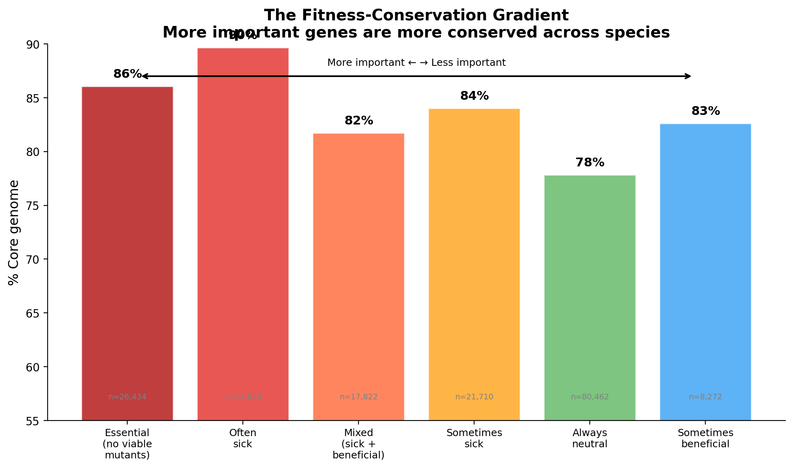
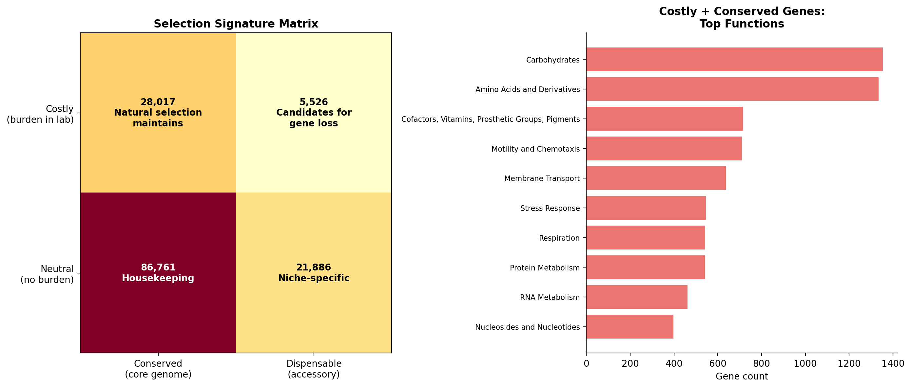
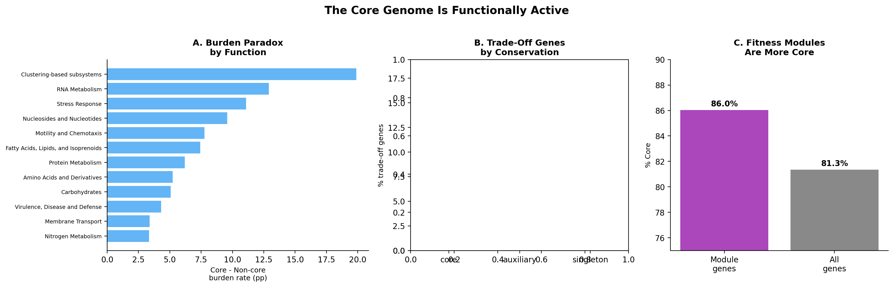

# Gene Conservation, Fitness, and the Architecture of Bacterial Genomes

## The Question

How does a gene's importance for bacterial survival relate to its evolutionary conservation? If a gene is essential — or important under many conditions — is it conserved across all strains of a species? And what happens when we look at genes that are costly to carry?

We connected two large-scale datasets to find out: the **Fitness Browser** (RB-TnSeq mutant fitness data for ~194,000 genes across 43 bacteria) and the **KBase pangenome** (gene cluster conservation across 27,690 microbial species). Together, they let us ask whether "important" means "conserved" — and reveal surprises about what the conserved genome actually is.

## The Gradient



There is a clear, quantitative gradient from essential genes (82% core) to always-neutral genes (66% core). More important genes are more conserved — but the effect is modest. Even genes with no detectable fitness effect in any experiment are 66% core. The gradient spans 194,216 protein-coding genes across 43 diverse bacteria, from archaea (*Methanococcus*) to plant pathogens (*Ralstonia*) to gut commensals (*Bacteroides*).

## The Paradox

A naive model predicts that core genes are "boring" housekeeping genes — always needed, never costly. The data shows the opposite:

- **Core genes are MORE likely to be burdens** — 24.4% show positive fitness when deleted (mutant grows better) vs 19.9% for accessory genes
- **Core genes have MORE condition-specific effects** — genes with strong specific phenotypes are 1.78x more likely to be core
- **Core genes are MORE likely to be trade-offs** — genes that are both important AND burdensome (depending on conditions) are 1.29x more likely core

The conserved genome is the most *functionally active* part of the genome, not the most inert.

## The Resolution

**Lab conditions are an impoverished proxy for nature.**

A gene that shows positive fitness when deleted in rich media may be essential for survival in soil, biofilm, host tissue, or any of the thousands of conditions bacteria face in their natural habitats. The lab captures the *cost* of maintaining these genes; the pangenome captures the *evolutionary pressure* to keep them.



We quantified this with a selection-signature matrix. The 28,017 genes that are simultaneously **costly in the lab AND conserved in the pangenome** are the strongest evidence for purifying selection in natural environments — nature maintains them despite their metabolic cost. The 5,526 genes that are costly AND dispensable are candidates for ongoing gene loss.

## The Architecture



The core genome is not just a collection of individual essential genes — it contains coordinated functional units. ICA decomposition identified 1,116 co-regulated fitness modules across 32 organisms. These modules are enriched in core genes (86% core vs 81.5% baseline, OR=1.46, p=1.6e-87). 59% of modules are >90% core genes.

The burden paradox is function-specific: motility and chemotaxis genes (+7.8pp core-burden excess), RNA metabolism (+12.9pp), and protein metabolism (+6.2pp) drive the effect. Cell wall genes reverse it — non-core cell wall genes are MORE burdensome. This makes biological sense: flagella are energetically expensive but essential for chemotaxis in natural environments; ribosomal components are costly but required for rapid growth responses.

## What We Didn't Find

- **Family breadth doesn't predict conservation**: Module families spanning more organisms don't have higher core fractions (rho=-0.01, p=0.91). The baseline is already so high there's no room for a gradient.
- **Accessory genes are NOT systematically burdensome**: Contrary to the "streamlining" hypothesis, accessory genes are LESS costly than core genes, not more.
- **Condition-specific doesn't mean niche-specific**: Genes with strong condition-specific fitness effects are MORE likely core, not more accessory. Core genes simply have more detectable effects.

## Open Questions

1. **The 5,526 costly + dispensable genes** — What are they? Mobile elements? Recently acquired genes on the way out? These are candidates for ongoing gene loss.
2. **Environmental context** — Do organisms from more variable environments have more trade-off genes in their core? Connecting lab fitness to AlphaEarth environmental data could bridge this gap.
3. **Cross-organism essential families** — Are there universally essential gene families across all 43 organisms?
4. **The 48 accessory modules** — What co-regulated functions live exclusively in the flexible genome?

## Methods

This synthesis draws on four analysis projects:

| Project | What it does | Key result |
|---------|-------------|------------|
| [conservation_vs_fitness](../conservation_vs_fitness/) | Link table + essential gene analysis | Essential genes 86% core (OR=1.56) |
| [fitness_effects_conservation](../fitness_effects_conservation/) | Quantitative fitness spectrum | 16pp gradient, core = more burdensome |
| [module_conservation](../module_conservation/) | ICA modules vs pangenome | Module genes 86% core (OR=1.46) |
| [core_gene_tradeoffs](../core_gene_tradeoffs/) | Anatomy of the burden paradox | Trade-offs drive the paradox (OR=1.29) |

**Data pipeline**: DIAMOND blastp at ≥90% identity mapped 177,863 FB genes to pangenome clusters. Essential genes identified as protein-coding genes with no entries in `genefitness` (no viable transposon mutants). Fitness profiles computed from ~7,500 experiments across 48 organisms.

**Note on % core**: Throughout this synthesis, % core is computed as the fraction of ALL protein-coding genes (including unmapped genes with unknown conservation) that are core. This treats unmapped genes as "not confirmed core." When restricted to mapped genes only, the percentages are higher (e.g., essential genes: 82% of all vs 86% of mapped). Individual project READMEs may use either denominator — see each project for details.

## Reproduction

All figures are generated locally from cached upstream data:

```bash
cd projects/conservation_fitness_synthesis
jupyter nbconvert --execute notebooks/01_summary_figures.ipynb
```

Requires data from `conservation_vs_fitness/data/`, `fitness_effects_conservation/data/`, and `fitness_modules/data/modules/`.

**Scale**: 194,216 protein-coding genes, 43 organisms, 27,690 pangenome species, 132.5M gene clusters, 1,116 ICA fitness modules.

**Statistical methods**: Fisher's exact test with BH-FDR correction, Spearman correlations, paired Wilcoxon signed-rank tests.

## Authors

- **Paramvir S. Dehal** (ORCID: [0000-0001-5810-2497](https://orcid.org/0000-0001-5810-2497)) — Lawrence Berkeley National Laboratory

## References

- Price MN et al. (2018). "Mutant phenotypes for thousands of bacterial genes of unknown function." *Nature* 557:503-509.
- Rosconi F et al. (2022). "A bacterial pan-genome makes gene essentiality strain-dependent and evolvable." *Nat Microbiol* 7:1580-1592.
- Hutchison CA 3rd et al. (2016). "Design and synthesis of a minimal bacterial genome." *Science* 351:aad6253.
