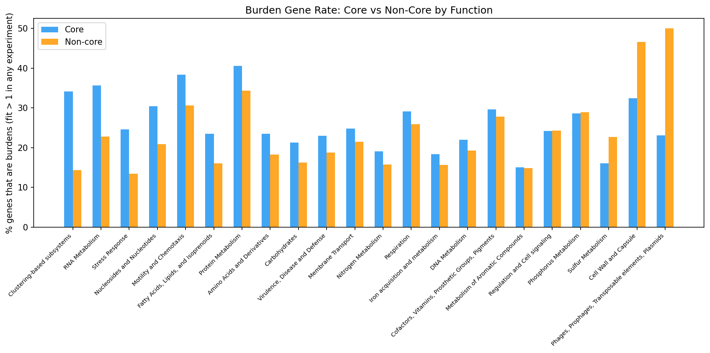
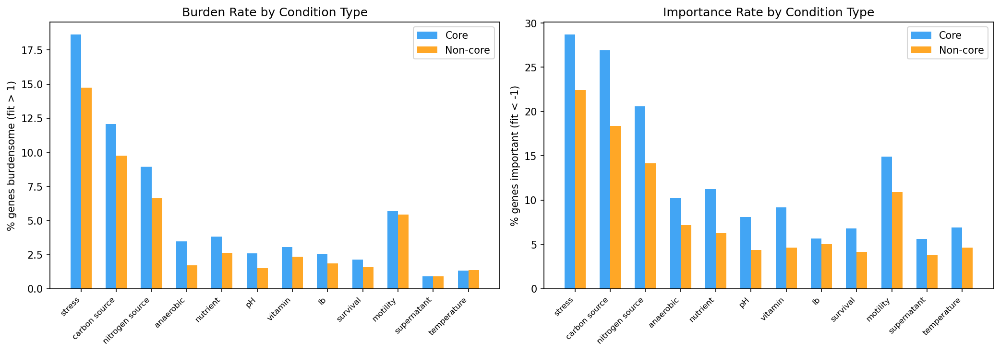
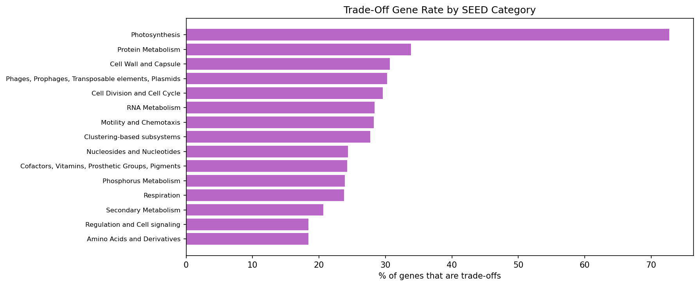
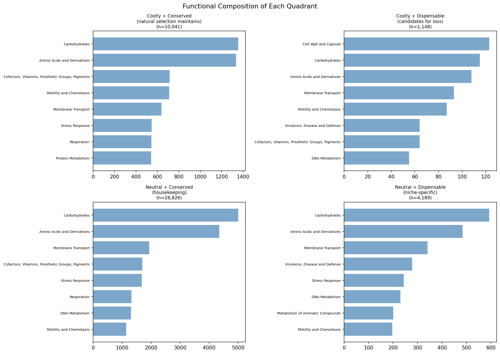
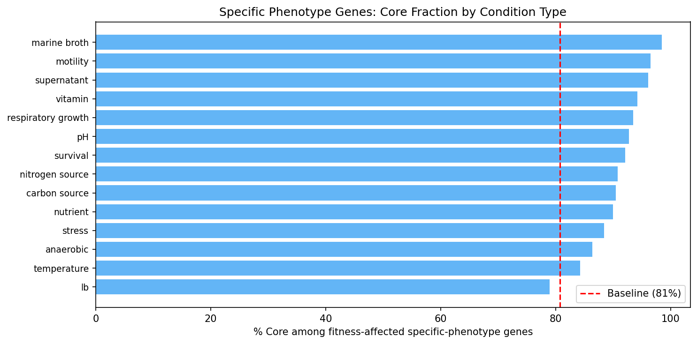
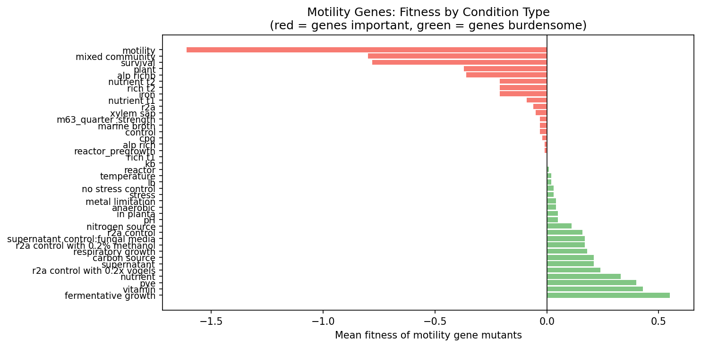

# Report: Core Gene Paradox -- Why Are Core Genes More Burdensome?

## Key Findings

### The Burden Paradox Is Function-Specific

Not all functional categories show the paradox. Core genes are disproportionately burdensome in Protein Metabolism (+6.2pp), Motility (+7.8pp), and RNA Metabolism (+12.9pp). But Cell Wall reverses: non-core cell wall genes are MORE burdensome (-14.1pp).

*(Notebook: 01_burden_anatomy.ipynb)*

### Trade-Off Genes Are Enriched in Core

25,271 genes (17.8%) are true trade-off genes -- important (fit < -1) in some conditions, burdensome (fit > 1) in others. These are 1.29x more likely to be core (OR=1.29, p=1.2e-44). Core genes have more trade-offs because they participate in more pathways with condition-dependent costs and benefits.

*(Notebook: 01_burden_anatomy.ipynb)*

### The Selection Signature Matrix

| | Conserved (core) | Dispensable (non-core) |
|---|---:|---:|
| **Costly (burden in lab)** | 28,017 | 5,526 |
| **Neutral (no burden)** | 86,761 | 21,886 |

- **Costly + Conserved** (28,017 genes): Natural selection maintains them despite lab-measured cost -- they're essential in natural environments not captured by lab experiments
- **Costly + Dispensable** (5,526 genes): Candidates for ongoing gene loss -- burdensome AND not universally conserved
- **Neutral + Conserved** (86,761): Classic housekeeping genes
- **Neutral + Dispensable** (21,886): Niche-specific genes

*(Notebook: 01_burden_anatomy.ipynb)*

### Case Studies

Genes with strong condition-specific effects are more likely core, reinforcing that the conserved genome is functionally active.

Motility genes exemplify the burden paradox: energetically expensive flagellar machinery is conserved because it is essential for chemotaxis in natural environments, despite being costly under lab conditions.

*(Notebook: 01_burden_anatomy.ipynb)*

## Interpretation

The burden paradox resolves when we recognize that lab conditions are an impoverished proxy for nature. Core genes are more burdensome in the lab because they encode functions (motility, ribosomal components, RNA metabolism) that are energetically expensive but essential in natural environments. The 28,017 costly-but-conserved genes are the strongest evidence for purifying selection maintaining genes despite their metabolic cost. The function-specific pattern makes biological sense: flagella are expensive but essential for chemotaxis; ribosomal components are costly but required for rapid growth responses.

### Literature Context

- **Price et al. (2018)** generated the Fitness Browser data used here, providing genome-wide mutant fitness measurements across diverse bacteria that reveal condition-dependent costs and benefits.
- **Rosconi et al. (2022)** demonstrated that gene essentiality is strain-dependent across *S. pneumoniae* pangenomes, supporting our finding that conservation reflects selection across diverse environments rather than universal essentiality.
- **Koskiniemi et al. (2012)** showed that dispensable genes impose fitness costs in *Salmonella*, consistent with our observation that core genes carry higher burden under lab conditions due to the metabolic expense of maintaining active pathways.

### Limitations

- Lab conditions capture only a fraction of the environmental conditions bacteria face in nature
- "Burden" (fit > 1) may reflect trade-offs rather than true dispensability
- The 90% identity threshold for DIAMOND matching may miss rapidly evolving genes
- Condition types in the FB are biased toward what's experimentally convenient, not what's ecologically relevant

## Data

### Sources

| Dataset | Description | Source |
|---------|-------------|--------|
| Fitness Browser | RB-TnSeq mutant fitness data | Price et al. (2018) |
| KBase pangenome link table | Gene-to-cluster conservation mapping | `conservation_vs_fitness/data/fb_pangenome_link.tsv` |
| Fitness stats | Per-gene fitness summary | `fitness_effects_conservation/data/fitness_stats.tsv` |
| SEED annotations | Functional category assignments | `conservation_vs_fitness/data/seed_annotations.tsv` |

### Generated Data

This project generates figures only; intermediate results are computed within the notebook from upstream data.

## References

- Price MN et al. (2018). "Mutant phenotypes for thousands of bacterial genes of unknown function." *Nature* 557:503-509. PMID: 29769716
- Parks DH et al. (2022). "GTDB: an ongoing census of bacterial and archaeal diversity through a phylogenetically consistent, rank normalized and complete genome-based taxonomy." *Nucleic Acids Res* 50:D199-D207. PMID: 34520557
- Rosconi F et al. (2022). "A bacterial pan-genome makes gene essentiality strain-dependent and evolvable." *Nat Microbiol* 7:1580-1592.
- Koskiniemi S et al. (2012). "Selection-driven gene loss in bacteria." *PLoS Genet* 8:e1002787. PMID: 22761588

## Supporting Evidence

| Type | Path | Description |
|------|------|-------------|
| Notebook | `notebooks/01_burden_anatomy.ipynb` | Full analysis (6 sections) |
| Figure | `figures/burden_by_function.png` | Burden excess by functional category |
| Figure | `figures/burden_by_condition.png` | Burden patterns by condition type |
| Figure | `figures/tradeoff_genes_conservation.png` | Trade-off gene conservation enrichment |
| Figure | `figures/specific_phenotype_conditions.png` | Specific phenotype conditions |
| Figure | `figures/motility_case_study.png` | Motility case study |
| Figure | `figures/selection_signature_matrix.png` | Selection signature matrix |

## Revision History

- **v1** (2026-02): Migrated from README.md
- **v2** (2026-02): Added inline figures, notebook provenance, Data section, Literature Context, References
