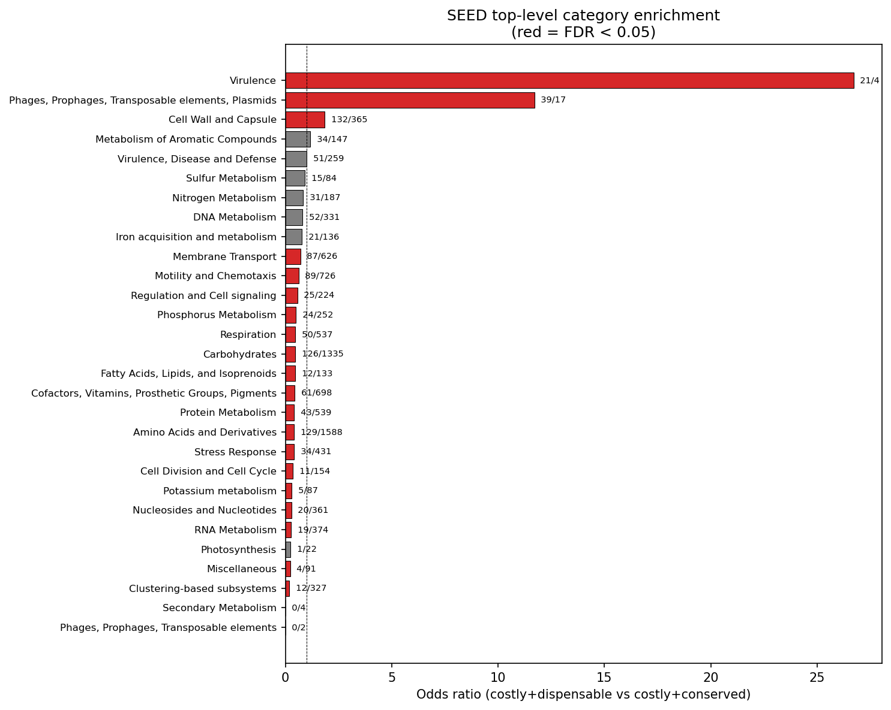
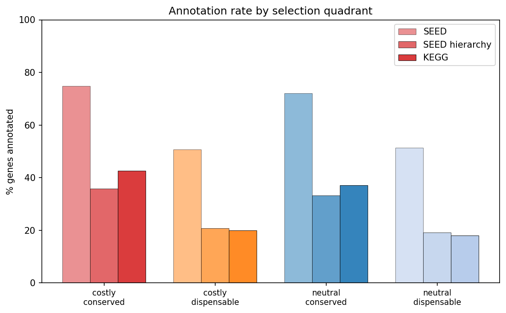
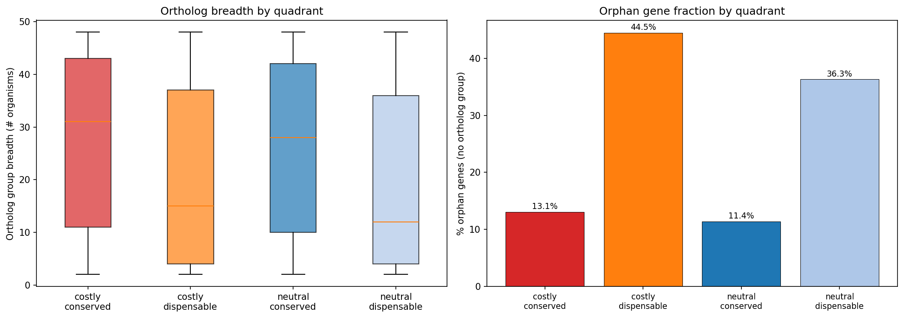
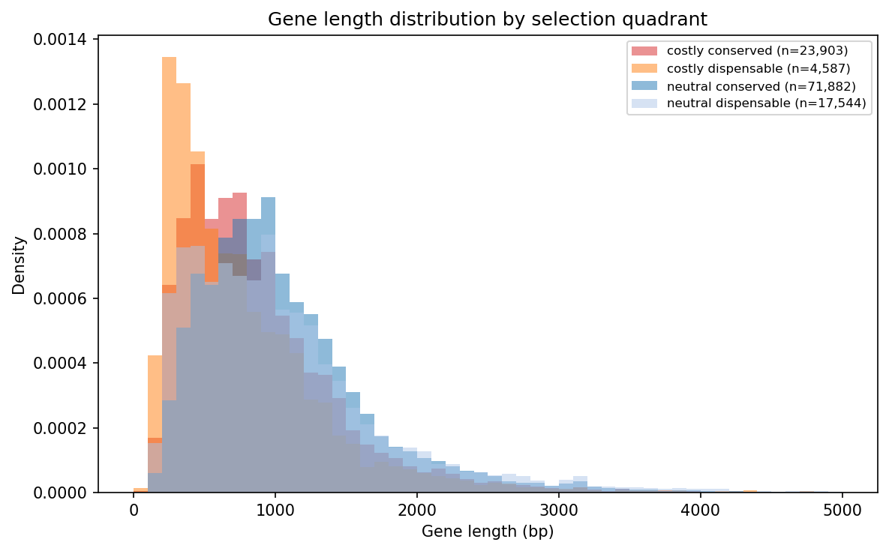
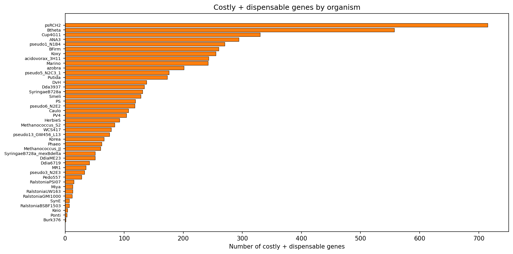
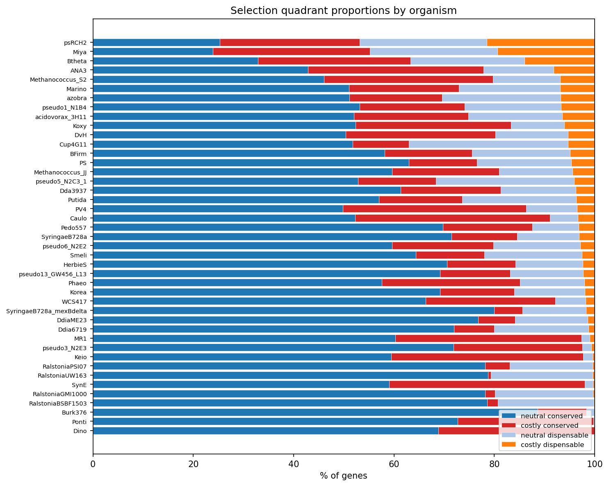

# Report: The 5,526 Costly + Dispensable Genes

## Key Findings

### Costly+Dispensable Genes Are Mobile Genetic Elements

The 5,526 costly+dispensable genes are overwhelmingly associated with mobile genetic elements. They are **7.45x more likely** to contain mobile element keywords in their descriptions (transposase, integrase, phage, IS element, recombinase, prophage; OR=7.45, p=4.6e-71). SEED functional enrichment confirms this: the "Phages, Prophages, Transposable elements, Plasmids" category is 11.7x enriched (FDR=1.3e-17) and "Virulence" is 26.7x enriched (FDR=5.6e-14, though based on small counts: 21 vs 4 genes) in costly+dispensable vs costly+conserved genes.

*(Notebook: 02_functional_characterization.ipynb)*

### They Are Poorly Characterized Recent Acquisitions

Costly+dispensable genes have the hallmarks of recently acquired DNA:
- **Poorly annotated**: 50.8% have SEED annotations vs 74.9% for costly+conserved; only 20.0% have KEGG annotations vs 42.7%
- **Taxonomically restricted**: 44.5% are orphan genes (no ortholog group) vs 13.1% for costly+conserved
- **Narrow ortholog breadth**: Median 15 organisms share the OG vs 31 for costly+conserved (Mann-Whitney p=4.0e-99, rank-biserial r=0.233)
- **High singleton fraction**: 24.2% are singletons (found in only 1 genome); no costly+conserved genes are singletons. Note: this is partly structural since core genes cannot be singletons by definition. Within the dispensable category, costly genes are only slightly more likely to be singletons than neutral genes (OR=1.09, p=0.02)
- **Shorter**: Median 615 bp vs 765 bp for costly+conserved (p=4.2e-75, rank-biserial r=0.170), consistent with IS elements and gene fragments

*(Notebook: 02_functional_characterization.ipynb, 03_evolutionary_context.ipynb)*

### Core Metabolism Is Depleted

14 SEED top-level categories are significantly depleted in costly+dispensable genes (FDR < 0.05), including Protein Metabolism, Respiration, Carbohydrates, Amino Acids, Cofactors/Vitamins, Motility, Stress Response, and RNA Metabolism. These core cellular functions are maintained in the costly+conserved quadrant -- genes whose lab-measured burden is offset by natural selection in the environment.

*(Notebook: 02_functional_characterization.ipynb)*

### *Pseudomonas stutzeri* RCH2 Is an Outlier

psRCH2 contributes 21.5% of its genes as costly+dispensable -- far above the next organism (*B. thetaiotaomicron* at 14.0%). This suggests a recent mobile element invasion or genomic expansion specific to this strain.

*(Notebook: 03_evolutionary_context.ipynb)*

### Costly+Dispensable Genes Still Have Condition-Specific Effects

Despite being burdensome and non-conserved, 14.1% of costly+dispensable genes have condition-specific phenotypes (vs 16.7% for costly+conserved). This is much higher than neutral+dispensable genes (2.7%), suggesting these genes are not inert -- they can affect fitness under specific conditions, which may slow their loss from the genome.

*(Notebook: 01_define_quadrants.ipynb)*

## Interpretation

The costly+dispensable genes represent the **genomic debris of horizontal gene transfer** -- insertion sequences, prophage remnants, transposases, and defense systems that impose metabolic cost on their host and are not conserved across the species pangenome. Their profile matches the predictions for recently acquired selfish genetic elements:

1. **Mobile element enrichment** (H1 confirmed): 7.45x enrichment for mobile element keywords, with Phage/Transposon/Plasmid category 11.7x overrepresented
2. **Narrow taxonomic distribution** (H2 confirmed): Half the ortholog breadth, 3.4x more orphan genes, high singleton fraction
3. **Short, poorly annotated genes** (H3 confirmed): 20% shorter (r=0.170), 24pp less likely to have SEED annotations
4. **Specific functional depletion** (H4 confirmed): Core metabolism categories systematically depleted

These genes are candidates for **ongoing gene loss** -- they've been acquired via HGT but impose sufficient cost that they will likely be purged from the genome over evolutionary time unless they provide a selective advantage in specific environments. The fact that 14.1% still have condition-specific phenotypes suggests a subset may persist if those conditions are encountered frequently enough.

The contrast with the 28,017 costly+conserved genes is instructive. Costly+conserved genes are enriched in core metabolism (Protein Metabolism, Respiration, Motility) -- functions that are energetically expensive but maintained by purifying selection because they're essential in natural environments not captured by lab experiments. The lab reveals the cost; the pangenome reveals the selection.

### Literature Context

- **Morris et al. (2012)** proposed the Black Queen Hypothesis: costly genes can be lost when their functions are provided as public goods by community members. Our costly+dispensable genes are candidates for this process, though they are predominantly selfish elements rather than metabolic genes -- they may represent an earlier stage where the gene hasn't yet been lost despite its cost.
- **Price et al. (2018)** generated the Fitness Browser data used here, showing that mutant fitness data can assign phenotypes to genes of unknown function. Our analysis adds pangenome conservation to identify which of these phenotypic genes are evolutionary stable vs transient.
- **Rosconi et al. (2022)** demonstrated that gene essentiality is strain-dependent in *S. pneumoniae*, with the accessory genome modulating which genes are required. Our finding that 14.1% of costly+dispensable genes have condition-specific phenotypes parallels this -- even non-conserved genes can be conditionally important.
- **Armitage et al. (2025)** documented extreme pseudogenization and gene loss in symbiotic cyanobacteria, showing that genome degradation accompanies relaxed selection. The costly+dispensable genes in our free-living organisms may represent early stages of this degradation process.

### Novel Contribution

This is the first systematic characterization of genes that are simultaneously burdensome (fitness improves when deleted) and not conserved in the pangenome. While mobile element burden has been studied in individual organisms, the cross-organism scale (142,190 genes across 43 bacteria) and the pangenome dimension are new. The finding that costly+dispensable genes are almost exclusively mobile element debris -- rather than degrading metabolic pathways -- narrows the biological interpretation and suggests that HGT-mediated genome expansion is the primary source of costly non-conserved genes in bacteria.

### Limitations

- "Burden" is defined as max_fit > 1 in any experiment -- a single experiment can classify a gene as burdensome, making this sensitive to noise in the fitness data
- SEED/KEGG annotations cover only 56-79% of genes; the unannotated fraction may have different functional profiles
- The pangenome core/auxiliary classification is binary; a quantitative measure (fraction of genomes carrying the gene) would provide more resolution
- The 90% identity DIAMOND threshold for FB-pangenome linking may miss recently acquired genes with low sequence similarity
- psRCH2's extreme outlier status (21.5% costly+dispensable) may reflect strain-specific genomic features rather than a general pattern
- Ortholog group assignment uses BBH across 48 organisms; genes with orthologs outside this set would be misclassified as orphans
- Condition-specific phenotype data is biased toward lab-testable conditions

## Data

### Sources

| BERDL Collection | Tables Used | Purpose |
|------------------|-------------|---------|
| `kescience_fitnessbrowser` | `genefitness`, `gene`, `exps` | Per-gene fitness values, gene metadata, experiment descriptions |
| `kbase_ke_pangenome` | `gene_cluster`, `gene_genecluster_junction`, `eggnog_mapper_annotations` | Pangenome gene clusters, gene-to-cluster mappings, functional annotations |

### Generated Data

| File | Rows | Description |
|------|------|-------------|
| `data/gene_quadrants.tsv` | 142,190 | Genes with fitness stats, conservation status, and quadrant assignment |

## Supporting Evidence

### Notebooks

| Notebook | Purpose |
|----------|---------|
| `01_define_quadrants.ipynb` | Reconstruct 2x2 selection signature matrix, verify counts |
| `02_functional_characterization.ipynb` | SEED/KEGG enrichment, mobile element keywords, organism distribution |
| `03_evolutionary_context.ipynb` | Ortholog breadth, singletons, gene length, per-organism proportions |

### Figures

| Figure | Description |
|--------|-------------|
| `fig_annotation_rate.png` | Annotation rate (SEED, KEGG) by selection quadrant |
| `fig_seed_enrichment.png` | SEED top-level category enrichment in costly+dispensable vs costly+conserved |
| `fig_organism_distribution.png` | Costly+dispensable gene counts by organism |
| `fig_ortholog_breadth.png` | Ortholog group breadth and orphan gene fraction by quadrant |
| `fig_gene_length.png` | Gene length distributions by quadrant |
| `fig_per_organism.png` | Stacked bar of quadrant proportions per organism |

### Data Files

| File | Description |
|------|-------------|
| `gene_quadrants.tsv` | 142,190 genes with fitness stats, conservation status, and quadrant assignment |

## Future Directions

1. **Characterize psRCH2 outlier**: Investigate why *Pseudomonas stutzeri* RCH2 has 21.5% costly+dispensable genes -- is this due to a recent phage invasion, IS element expansion, or genomic island acquisition?
2. **Genomic context analysis**: Determine whether costly+dispensable genes cluster in genomic islands, near tRNA genes, or at scaffold edges -- hallmarks of HGT
3. **Temporal dynamics**: For organisms with multiple sequenced strains, track whether costly+dispensable genes are being lost over evolutionary time (present in some strains but absent in close relatives)
4. **Community context**: Using ENIGMA CORAL community composition data, test whether organisms with more costly+dispensable genes tend to co-occur with organisms that could provide the lost functions (Black Queen Hypothesis test)
5. **Quantitative conservation**: Replace binary core/accessory with the fraction of species genomes carrying each gene cluster, to distinguish "almost core" from "rare accessory"

## References

- Morris JJ et al. (2012). "The Black Queen Hypothesis: evolution of dependencies through adaptive gene loss." *mBio* 3:e00036-12. PMID: 22448042
- Price MN et al. (2018). "Mutant phenotypes for thousands of bacterial genes of unknown function." *Nature* 557:503-509. PMID: 29769716
- Rosconi F et al. (2022). "A bacterial pan-genome makes gene essentiality strain-dependent and evolvable." *Nat Microbiol* 7:1580-1592. PMID: 36097170
- Armitage DW et al. (2025). "Adaptive pangenomic remodeling in the Azolla cyanobiont." *ISME J*. PMID: 40728316
