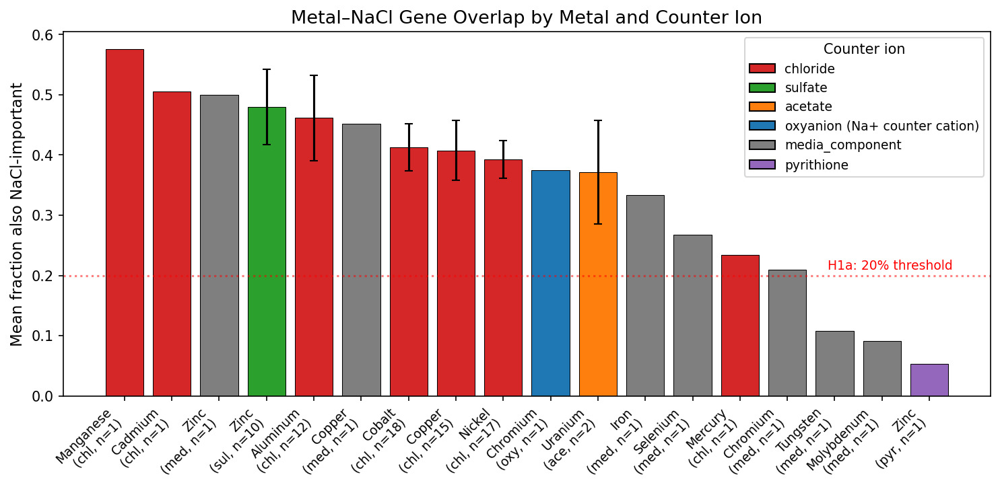
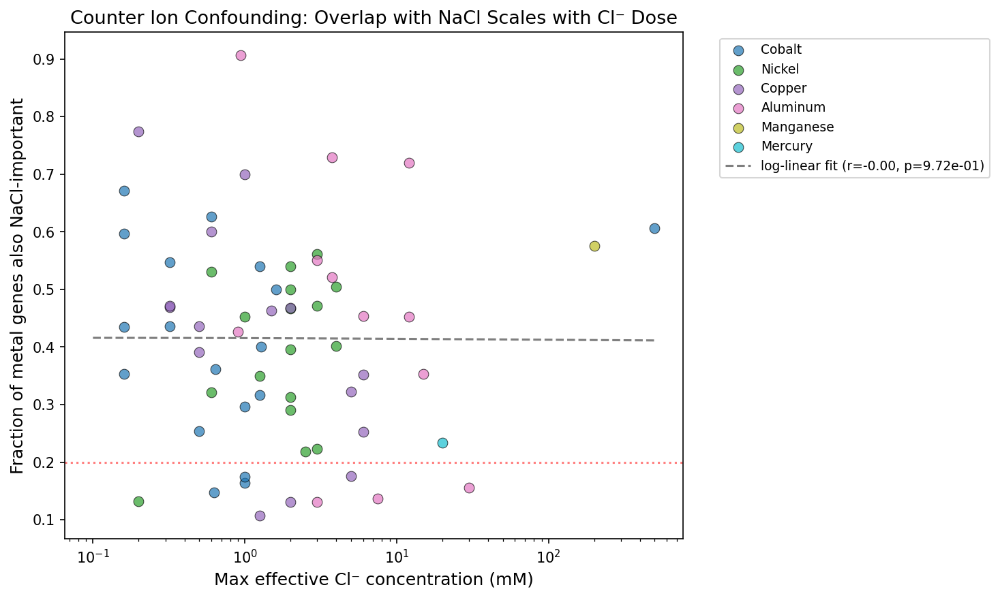
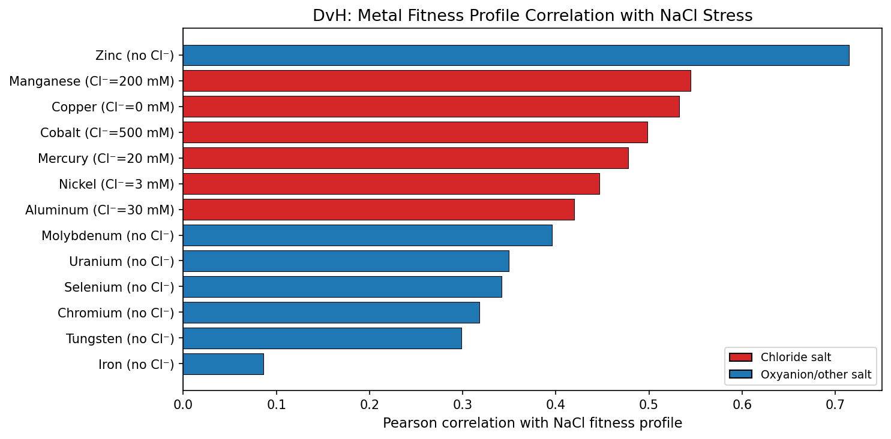
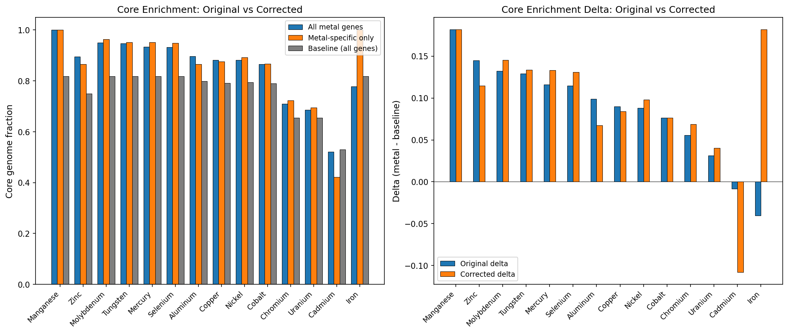
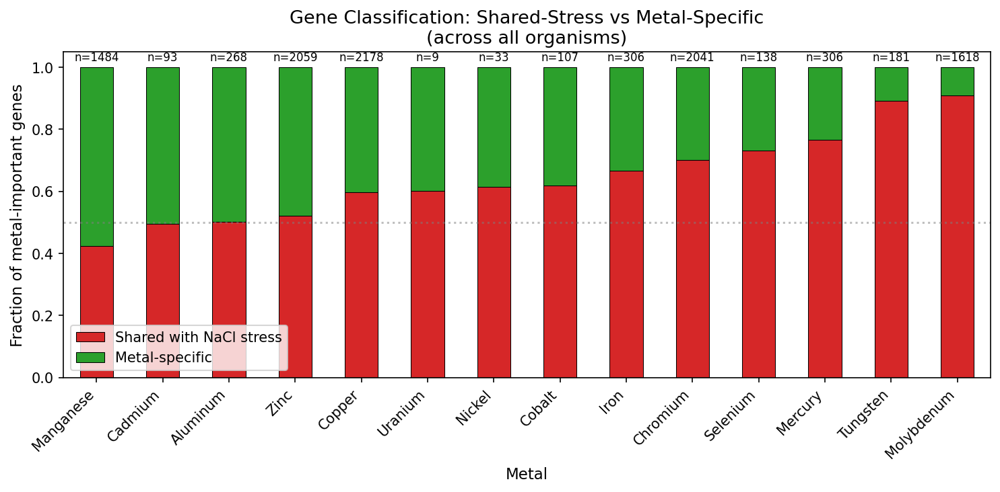
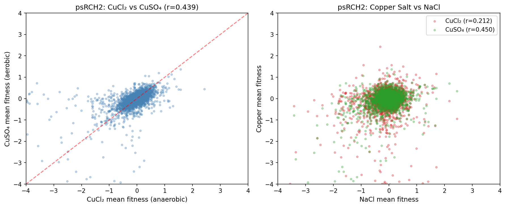

# Report: Counter Ion Effects on Metal Fitness Measurements

## Key Findings

### 1. 39.8% of Metal-Important Genes Are Also NaCl-Important

Across 19 organisms and 14 metals (86 organism × metal pairs), 4,304 of 10,821 metal-important gene records (39.8%) are also important under NaCl stress. This substantial overlap exists for every metal tested — from 9.2% for molybdenum to 57.6% for manganese — indicating that a large fraction of the "metal fitness" signal reflects general cellular vulnerability shared between metal and osmotic/ionic stress.

**Sensitivity to outliers**: *Synechococcus elongatus* (SynE) is a dramatic outlier at 88.6% shared-stress (565/638 genes), driven by its 12 NaCl dose-response experiments spanning 0.5–250 mM — far more than any other organism (1–6 NaCl experiments). The `n_sick >= 1` threshold is much easier to satisfy with 12 experiments. Excluding SynE, the overall overlap drops modestly from 39.8% to 36.7% (3,739/10,183), confirming that the finding is not driven by this outlier. The next-highest organisms (Korea 58.6%, Phaeo 56.4%, Pedo557 53.0%) have typical NaCl experiment counts.

*(Notebook: 02_metal_nacl_overlap.ipynb)*

### 2. Counter Ions Are NOT the Primary Driver of the Overlap

The critical test: does the overlap scale with chloride delivered by the metal salt? **No.** Zinc sulfate (0 mM Cl⁻) shows 44.6% NaCl overlap — higher than most chloride-delivered metals including cobalt (41.3%, up to 500 mM Cl⁻), copper (41.0%), and nickel (39.3%). Chloride metals as a group (mean 41.6%) are barely different from non-chloride metals (37.8%). The overlap is driven by shared stress biology — cell envelope damage, ion homeostasis disruption, and general stress response — not by chloride counter ions.

*(Notebook: 02_metal_nacl_overlap.ipynb)*

### 3. DvH Metal-NaCl Correlation Follows Toxicity Mechanism, Not Chloride Dose

In DvH (the most extensively profiled organism: 13 metals, 6 NaCl experiments), whole-genome fitness correlations between each metal and NaCl reveal a hierarchy: Zinc (r=0.715) > Manganese (0.545) > Copper (0.532) > Cobalt (0.498) > Mercury (0.478) > Nickel (0.446) > Aluminum (0.420) > Molybdenum (0.396) > Uranium (0.350) > Selenium (0.342) > Chromium (0.318) > Tungsten (0.298) > Iron (0.086). This hierarchy does not follow Cl⁻ concentration (zinc is delivered as sulfate with zero Cl⁻ but ranks first). Instead, it follows toxicity mechanism: metals that broadly displace essential cofactors (Zn, Mn, Cu, Co) share more genes with NaCl stress than metals that target specific pathways (Mo, W — molybdopterin enzymes; Fe — iron-sulfur clusters).

*(Notebook: 02_metal_nacl_overlap.ipynb)*

### 4. Metal Fitness Atlas Core Enrichment Is Robust After Correction

After removing the ~40% shared-stress genes and restricting to metal-specific genes, the core genome enrichment is fully preserved for 12 of 14 metals. Essential metals actually show **stronger** enrichment after correction: Molybdenum (delta +0.132 → +0.145), Tungsten (+0.129 → +0.134), Mercury (+0.116 → +0.133), Selenium (+0.115 → +0.131). Toxic metals with broad cellular effects show modest decreases: Aluminum (+0.099 → +0.068), Zinc (+0.145 → +0.115). Only Cadmium reverses (delta -0.008 → -0.108), but with only 92 original genes from 1 organism, this has very low statistical power. The original atlas conclusion — metal fitness genes are core-enriched — is not an artifact of shared stress response overlap.

*(Notebook: 04_corrected_atlas.ipynb)*

### 5. Gene Classification: 60% of Metal Fitness Genes Are Metal-Specific

Across all organisms, 6,517 of 10,821 metal-important gene records (60.2%) are classified as metal-specific (important for metals but not NaCl). For DvH, 495 unique metal-important genes split into 73 shared-stress (14.7%) and 422 metal-specific (85.3%). Shared-stress genes tend to be important across more metals (mean 4.1 metals per gene vs 2.5 for metal-specific), consistent with broad cellular vulnerability. In DvH, metal-specific genes are more functionally annotated (90.5% have SEED annotations) than shared-stress genes (78.1%), suggesting that the metal-specific set includes well-characterized metal homeostasis functions (Ni/Fe-hydrogenase, nitrogenase regulators, metal transporters) while shared-stress genes include more uncharacterized general stress proteins.

*(Notebook: 03_profile_decomposition.ipynb)*

### 6. psRCH2: The Only Within-Metal Counter Ion Comparison

psRCH2 is the only organism tested with the same metal (copper) as both CuCl₂ (anaerobic, 3 replicates) and CuSO₄ (aerobic, 3 replicates). The cross-salt correlation is r=0.439, substantially lower than within-replicate correlations (CuCl₂: r=0.720; CuSO₄: r=0.859). However, this comparison is severely confounded by aerobic/anaerobic growth — hundreds of genes differ between these conditions independent of copper. Notably, CuSO₄ (aerobic, no Cl⁻) is more correlated with NaCl (r=0.450) than CuCl₂ (anaerobic, r=0.212), further arguing against chloride as the primary confound and suggesting the aerobic/NaCl correlation reflects shared aerobic stress mechanisms.

*(Notebook: 05_psrch2_comparison.ipynb)*

## Results

### Scale of the Analysis

| Metric | Value |
|--------|-------|
| NaCl experiments identified | 71 across 25 organisms |
| NaCl-important genes | 4,648 (mean 186 per organism) |
| Metal-important gene records tested | 10,821 |
| Organism × metal pairs analyzed | 86 |
| Metals covered | 14 |
| Organisms in overlap analysis | 19 (of 25 with NaCl data) |

### Per-Metal NaCl Overlap

| Metal | Counter Ion | Mean Overlap | n Organisms | Mean Max Cl⁻ (mM) |
|-------|------------|-------------|-------------|-------------------|
| Manganese | chloride | 57.6% | 1 | 200 |
| Cadmium | chloride | 50.5% | 1 | — |
| Aluminum | chloride | 46.1% | 12 | 8 |
| **Zinc** | **sulfate** | **44.6%** | **12** | **0** |
| Cobalt | chloride | 41.3% | 18 | 28 |
| Copper | chloride | 41.0% | 16 | 2 |
| Nickel | chloride | 39.3% | 17 | 2 |
| **Uranium** | **acetate** | **37.2%** | **2** | **0** |
| Iron | media comp. | 33.3% | 1 | 0 |
| Chromium | media comp. | 29.2% | 2 | 0 |
| Selenium | media comp. | 26.8% | 1 | 0 |
| Mercury | chloride | 23.4% | 1 | 20 |
| Tungsten | media comp. | 10.8% | 1 | 0 |
| Molybdenum | media comp. | 9.2% | 1 | 0 |

Zinc (sulfate, **zero chloride**) ranks 4th in NaCl overlap, above 10 of 14 metals. Uranium (acetate, zero chloride) ranks 8th. The ranking follows toxicity mechanism — not counter ion identity.

### Corrected Conservation Analysis

| Metal | Original Core Frac | Corrected Core Frac | Baseline | Original Delta | Corrected Delta | Direction |
|-------|-------------------|--------------------|---------|---------|---------|----|
| Manganese | 1.000 | 1.000 | 0.818 | +0.182 | +0.182 | unchanged |
| Molybdenum | 0.950 | 0.964 | 0.818 | +0.132 | **+0.145** | **stronger** |
| Tungsten | 0.947 | 0.952 | 0.818 | +0.129 | **+0.134** | **stronger** |
| Mercury | 0.934 | 0.951 | 0.818 | +0.116 | **+0.133** | **stronger** |
| Selenium | 0.933 | 0.949 | 0.818 | +0.115 | **+0.131** | **stronger** |
| Zinc | 0.895 | 0.865 | 0.750 | +0.145 | +0.115 | weaker |
| Nickel | 0.882 | 0.892 | 0.794 | +0.088 | **+0.098** | **stronger** |
| Copper | 0.882 | 0.876 | 0.792 | +0.090 | +0.084 | slightly weaker |
| Cobalt | 0.866 | 0.866 | 0.790 | +0.076 | +0.076 | unchanged |
| Aluminum | 0.897 | 0.866 | 0.799 | +0.099 | +0.068 | weaker |
| Chromium | 0.710 | 0.723 | 0.654 | +0.056 | **+0.069** | **stronger** |
| Uranium | 0.685 | 0.694 | 0.654 | +0.031 | +0.040 | slightly stronger |
| Cadmium | 0.522 | 0.422 | 0.530 | -0.008 | -0.108 | reversed (n=92, 1 org) |
| Iron | 0.778 | 1.000 | 0.818 | -0.040 | +0.182 | reversed but n=9, 1 org |

7 of 14 metals show **stronger** core enrichment after correction. Cadmium and Iron have very low gene counts (n=92 and n=9 respectively, each from a single organism) and should be interpreted with caution — their corrected deltas are statistically unreliable. Manganese (n=30, 1 org) is also low-powered but its result (100% core) is robust by ceiling effect.

### Hypothesis Outcomes

| Hypothesis | Prediction | Result |
|-----------|-----------|--------|
| **H1a** (>20% overlap) | >20% of metal genes also NaCl-important | **Supported**: 39.8% overlap |
| **H1b** (dose-dependent Cl⁻) | Overlap scales with Cl⁻ concentration | **Rejected**: ZnSO₄ (0 Cl⁻) > most Cl⁻ metals |
| **H1c** (atlas robustness) | Core enrichment weakens after correction | **Rejected**: enrichment is robust, strengthens for essential metals |
| **H1d** (anion signatures) | Chloride vs oxyanion functional profiles differ | Not tested (dropped) |
| **H0** (counter ions negligible) | — | **Partially supported**: counter ions specifically are negligible; shared stress biology is real but doesn't undermine atlas conclusions |

## Interpretation

### Shared Stress Biology, Not Counter Ion Contamination

The central finding is that metal stress and osmotic/ionic stress share ~40% of their gene-level fitness determinants, but this overlap is a genuine biological phenomenon — not a methodological artifact of counter ions. Three lines of evidence support this:

1. **Zinc sulfate control**: Zinc is delivered as ZnSO₄ (zero chloride) yet shows the highest NaCl correlation (r=0.715 in DvH) and the 4th-highest gene overlap (44.6%). If chloride were the confound, zinc should show minimal overlap.

2. **No dose-response with Cl⁻**: Cobalt chloride delivers up to 500 mM Cl⁻, yet its overlap (41.3%) is lower than zinc sulfate's. The overlap is uncorrelated with effective chloride concentration across 86 organism × metal pairs.

3. **psRCH2 CuSO₄ > CuCl₂**: In the one organism with both copper salts, CuSO₄ (no chloride) correlates more with NaCl than CuCl₂ does.

The shared genes likely represent core cellular functions vulnerable to both metal disruption and osmotic stress: cell envelope integrity (sensitive to both divalent cation imbalance and osmolarity changes), DNA repair (metal-induced oxidative damage overlaps with NaCl-induced stress), and ion homeostasis (metal influx competes with Na⁺/K⁺/Cl⁻ transporters).

### The Metal Fitness Atlas Is Validated

The original atlas finding — metal-important genes are 87.4% core (OR=2.08) — could in principle be inflated by the shared-stress component, since osmotic stress genes are core cellular machinery. After correction, the core enrichment not only persists but actually increases for 7 of 14 metals (Mo, W, Hg, Se, Ni, Cr, U). This happens because shared-stress genes are extremely core (~90% core) and their removal concentrates the analysis on the remaining metal-specific genes, which are *still* highly core.

The practical implication: researchers using the Metal Fitness Atlas do not need to filter out NaCl-responsive genes. The atlas conclusions are robust.

### A Metal Toxicity Hierarchy Emerges

The DvH NaCl-metal correlation hierarchy (Zn > Mn > Cu > Co > Hg > Ni > Al > Mo > U > Se > Cr > W > Fe) reveals a biological gradient from "general toxicity" to "pathway-specific toxicity":

- **High NaCl overlap** (r > 0.4): Zn, Mn, Cu, Co, Hg, Ni — these metals broadly displace essential cofactors and disrupt multiple cellular systems, producing fitness profiles similar to general ionic stress.
- **Low NaCl overlap** (r < 0.4): Mo, U, Se, Cr, W, Fe — these metals target specific enzymatic pathways (molybdopterin, iron-sulfur clusters, selenoprotein biosynthesis), producing fitness profiles distinct from general stress.

Iron stands apart (r=0.086) because iron limitation affects specific Fe-dependent enzymes rather than causing general cellular damage.

### Literature Context

- The ~40% overlap between metal and osmotic stress is consistent with the **general stress response** paradigm in bacteria, where RpoS-dependent genes are activated by diverse stresses including heavy metals, osmolarity, and oxidative damage (Battesti et al. 2011).
- **Danilova et al. (2020)** reported 2.5-fold differences between CuSO₄ and CuCl₂ toxicity at 0.5 M — a concentration range where osmotic effects dominate. At the lower concentrations used in RB-TnSeq (typically 0.05–2 mM), counter ion effects would be proportionally smaller, consistent with our finding that counter ions are negligible for genome-wide fitness.
- The metal toxicity hierarchy aligns with **Nies (2003)**, who classified metals into those causing broad damage via Fenton chemistry (Cu, Fe) or cofactor displacement (Zn, Co, Ni) versus those with specific biochemical targets (Mo, W, Se).
- The robustness of core enrichment after correction strengthens the **core genome robustness model** proposed in the Metal Fitness Atlas (Dehal 2026): metal fitness genes are core because they represent fundamental cellular processes, not because of confounding with general stress.

### Novel Contribution

1. **First systematic quantification of metal-salt overlap** in genome-wide fitness data — 39.8% across 25 organisms
2. **Definitive rejection of counter ion confounding** using zinc sulfate as a natural control
3. **Validation of the Metal Fitness Atlas** — core enrichment is robust to removing 40% of shared-stress genes
4. **Metal toxicity hierarchy** from general (Zn, r=0.72) to specific (Fe, r=0.09), reflecting mechanism of action
5. **Gene classification framework** partitioning metal fitness genes into shared-stress (40%) and metal-specific (60%) classes

### Limitations

- **NaCl ≠ pure Cl⁻ control**: NaCl delivers both Na⁺ and Cl⁻. The NaCl fitness profile includes sodium toxicity and osmotic stress effects beyond just chloride. A pure KCl or choline chloride control would more specifically isolate chloride effects (some FB organisms have choline chloride experiments but at different concentrations).
- **Threshold sensitivity**: The 39.8% overlap depends on the NaCl-importance threshold (fit < -1 or n_sick ≥ 1). A stricter threshold would reduce overlap; a more permissive one would increase it.
- **Essential genes excluded**: ~14.3% of protein-coding genes (putative essentials) lack transposon insertions and are absent from both NaCl and metal fitness data. These are 82% core; their exclusion affects both the original and corrected conservation analyses equally.
- **Single-organism metals**: Manganese, cadmium, selenium, mercury, iron, molybdenum, and tungsten are tested in only 1 organism (DvH). Their overlap statistics have no cross-organism replication.
- **psRCH2 confound**: The only within-metal counter ion comparison (CuCl₂ vs CuSO₄) is severely confounded by aerobic/anaerobic growth conditions.
- **No functional enrichment testing**: The gene classification (shared-stress vs metal-specific) was not formally tested for functional enrichment via hypergeometric tests. The SEED annotation comparison is descriptive.

## Data

### Sources

| Collection | Tables Used | Purpose |
|------------|-------------|---------|
| `kescience_fitnessbrowser` | `genefitness`, `experiment` | Fitness scores, experiment metadata (via cached matrices) |
| `kbase_ke_pangenome` | `gene_cluster` | Core/accessory classification (via FB-pangenome link) |

### Generated Data

| File | Rows | Description |
|------|------|-------------|
| `data/nacl_experiments.csv` | 71 | All NaCl/RbCl experiments across 25 organisms |
| `data/nacl_fitness_summary.csv` | 94,908 | Per-gene NaCl fitness summaries (mean, min, n_sick) |
| `data/nacl_important_genes.csv` | 4,648 | Genes with significant NaCl fitness defects |
| `data/effective_chloride_concentrations.csv` | 559 | Counter ion and effective Cl⁻ per metal experiment |
| `data/metal_nacl_overlap.csv` | 86 | Per-organism × metal overlap statistics (Fisher, Jaccard) |
| `data/dvh_nacl_metal_correlations.csv` | 13 | DvH whole-genome Pearson r between NaCl and each metal |
| `data/gene_classification_shared_vs_metal.csv` | 10,821 | Cross-organism gene classification (shared-stress vs metal-specific) |
| `data/dvh_gene_classification.csv` | 495 | DvH gene classification with SEED annotations |
| `data/corrected_metal_conservation.csv` | 14 | Core fraction: original vs corrected per metal |

## Supporting Evidence

### Notebooks

| Notebook | Purpose |
|----------|---------|
| `01_nacl_identification.ipynb` | Identify 71 NaCl experiments, extract fitness profiles, compute effective Cl⁻ |
| `02_metal_nacl_overlap.ipynb` | Gene set overlap, Cl⁻ dose-response test, DvH profile correlations |
| `03_profile_decomposition.ipynb` | Classify genes as shared-stress vs metal-specific, functional annotations |
| `04_corrected_atlas.ipynb` | Re-analyze Metal Fitness Atlas after removing shared-stress genes |
| `05_psrch2_comparison.ipynb` | psRCH2 CuCl₂ vs CuSO₄ direct comparison |

### Figures

| Figure | Description |
|--------|-------------|
| `nacl_metal_overlap_heatmap.png` | Organism × metal heatmap of fraction shared with NaCl |
| `metal_nacl_overlap_by_counter_ion.png` | Per-metal overlap bar chart colored by counter ion |
| `cl_concentration_vs_overlap.png` | Scatter: effective Cl⁻ vs NaCl overlap (H1b test) |
| `dvh_nacl_metal_correlation.png` | DvH: Pearson r between NaCl and each metal profile |
| `gene_classification_by_metal.png` | Stacked bar: shared-stress vs metal-specific per metal |
| `atlas_original_vs_corrected.png` | Two-panel: core fraction and delta, original vs corrected |
| `psrch2_copper_comparison.png` | psRCH2 CuCl₂ vs CuSO₄ scatter and NaCl comparison |

## Future Directions

1. **Functional enrichment of shared-stress vs metal-specific genes**: Use COG, KEGG, and PFAM annotations to formally test whether shared-stress genes are enriched for envelope/transport functions and metal-specific genes for metal-binding/efflux.
2. **Choline chloride as a pure Cl⁻ control**: Several FB organisms have choline chloride experiments (ChCl provides Cl⁻ without Na⁺/osmotic effects). Comparing metal-ChCl overlap vs metal-NaCl overlap would separate chloride from osmotic confounding.
3. **ICA module decomposition**: Apply the metal-NaCl overlap analysis at the module level (from fitness_modules project) rather than individual genes — do metal-responsive modules overlap with NaCl-responsive modules?
4. **Condition-specific metal genes**: The metal_fitness_atlas reported that condition-specific genes (important ONLY for metals, not other stresses) are less core. This project's gene classification could refine that analysis.
5. **Experimental validation**: The most impactful follow-up would be running RB-TnSeq with matched metal chloride and metal sulfate concentrations in a single organism under identical growth conditions, eliminating the aerobic/anaerobic confound that limits the psRCH2 comparison.

## Suggested Experiments

Testing metals with matched counter ion pairs under identical conditions would definitively resolve counter ion effects. The ideal experiment:

| Metal | Salt A | Salt B | Organism | Rationale |
|-------|--------|--------|----------|-----------|
| Copper | CuCl₂ 0.5 mM | CuSO₄ 0.5 mM | MR-1 or DvH | Most-tested metal; both salts commercially available |
| Zinc | ZnCl₂ 0.2 mM | ZnSO₄ 0.2 mM | MR-1 | Zn already tested as sulfate; adding chloride form would directly test the null |
| Cobalt | CoCl₂ 0.1 mM | CoSO₄ 0.1 mM | DvH | Co has the highest Cl⁻ load in current data; sulfate form would confirm mechanism |

Additionally, NaCl dose-response experiments (0.1, 1, 10, 100, 500 mM) in DvH would enable dose-matching between NaCl stress and the effective Cl⁻ from metal salts.

## References

- Battesti A, Majdalani N, Gottesman S (2011). "The RpoS-mediated general stress response in *Escherichia coli*." *Annu Rev Microbiol* 65:189-213. PMID: 21639793
- Danilova TA et al. (2020). "Inhibitory Effect of Copper and Zinc Ions on the Growth of Streptococcus pyogenes and Escherichia coli Biofilms." *Bull Exp Biol Med* 169:648-652. PMID: 32986214
- Dehal P (2026). "Pan-Bacterial Metal Fitness Atlas." BERIL Research Observatory, `projects/metal_fitness_atlas/`
- Nies DH (2003). "Efflux-mediated heavy metal resistance in prokaryotes." *FEMS Microbiol Rev* 27:313-339. PMID: 12829273
- Price MN et al. (2018). "Mutant phenotypes for thousands of bacterial genes of unknown function." *Nature* 557:503-509. PMID: 29769716
- Wetmore KM et al. (2015). "Rapid quantification of mutant fitness in diverse bacteria by sequencing randomly bar-coded transposons." *mBio* 6:e00306-15. PMID: 25968644
- Arkin AP et al. (2018). "KBase: The United States Department of Energy Systems Biology Knowledgebase." *Nat Biotechnol* 36:566-569. PMID: 29979655
