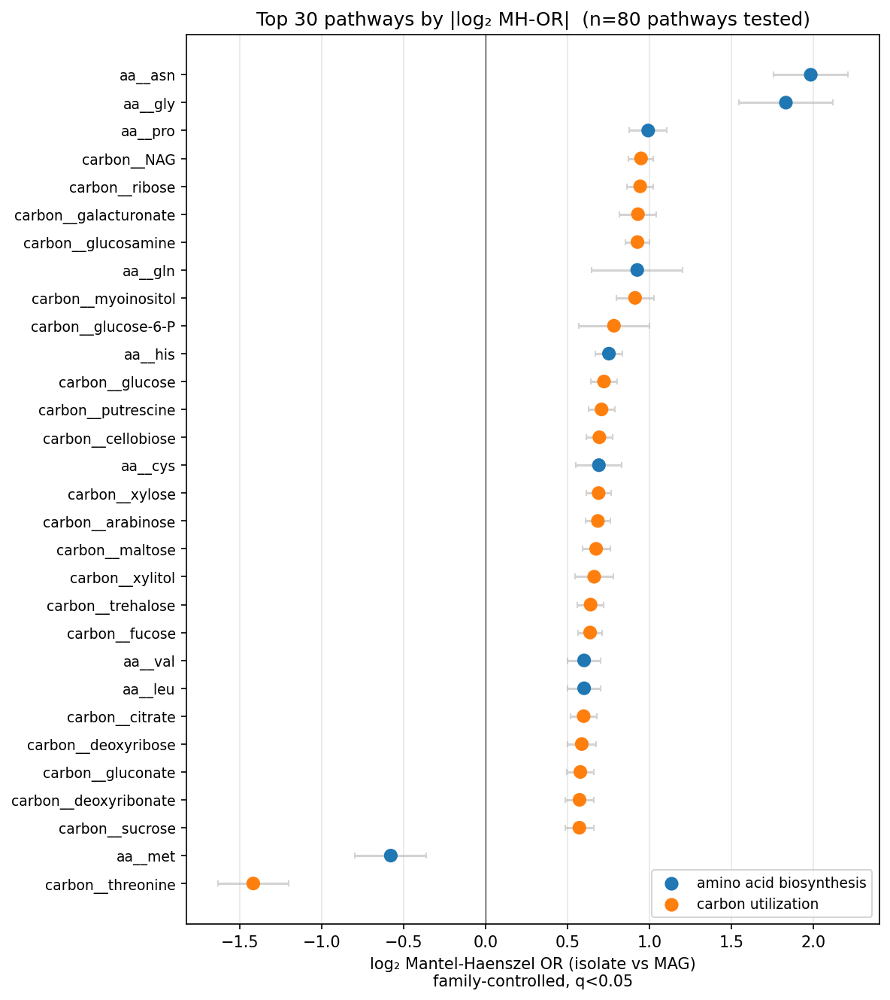
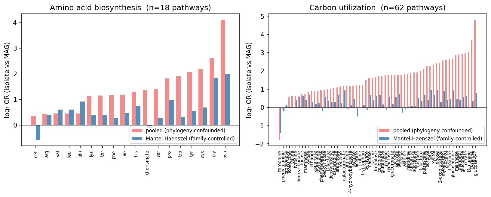
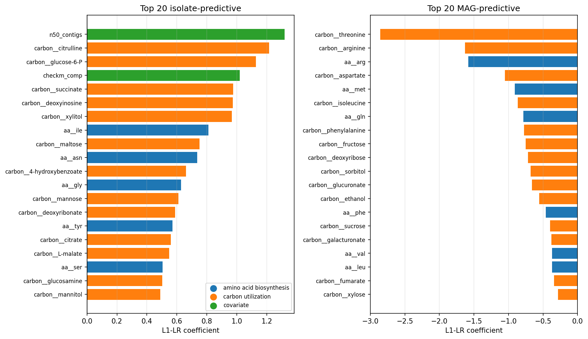
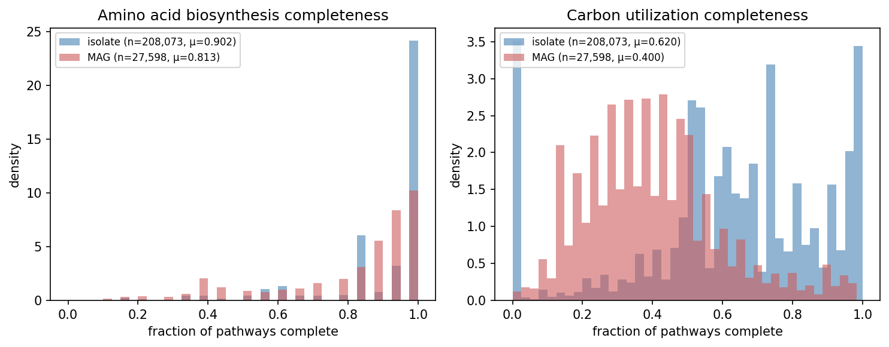
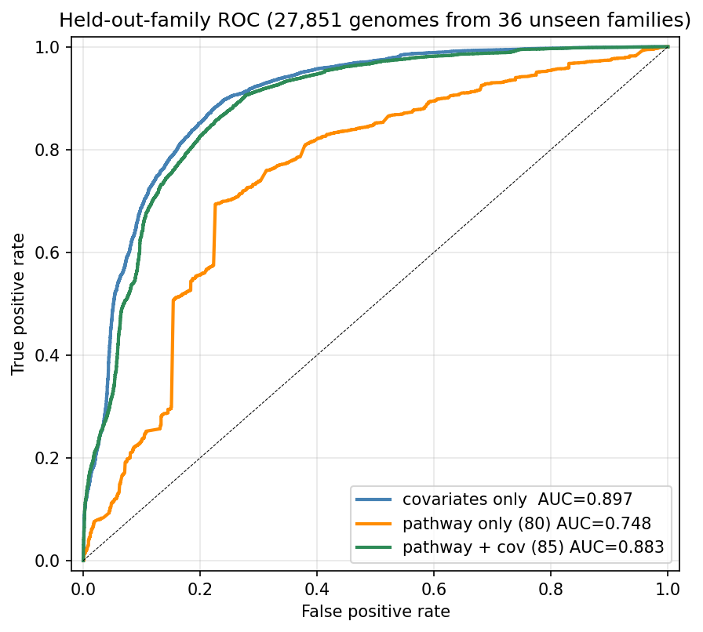
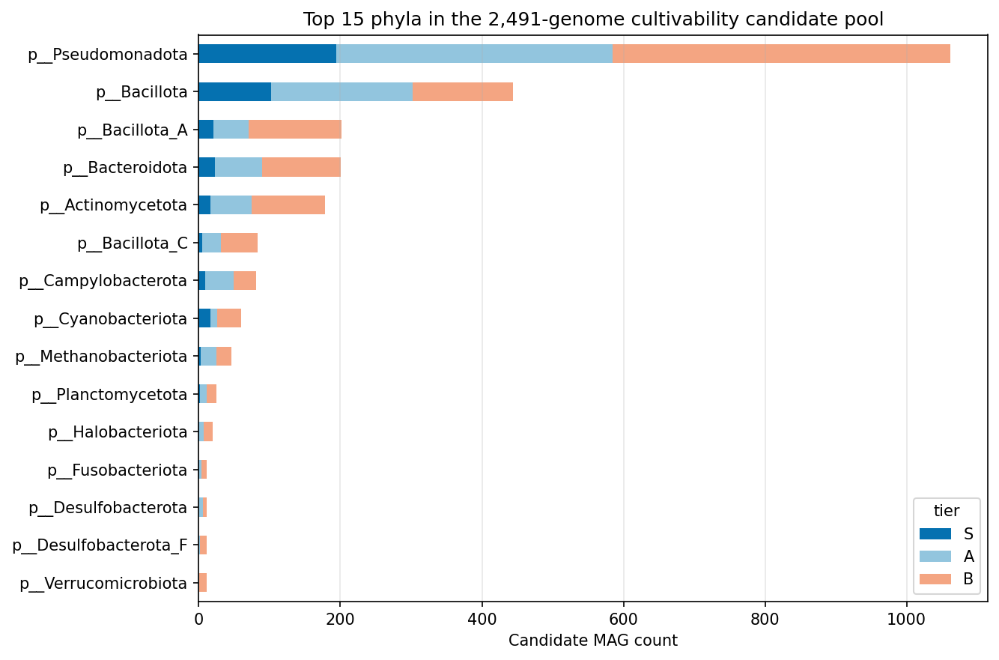
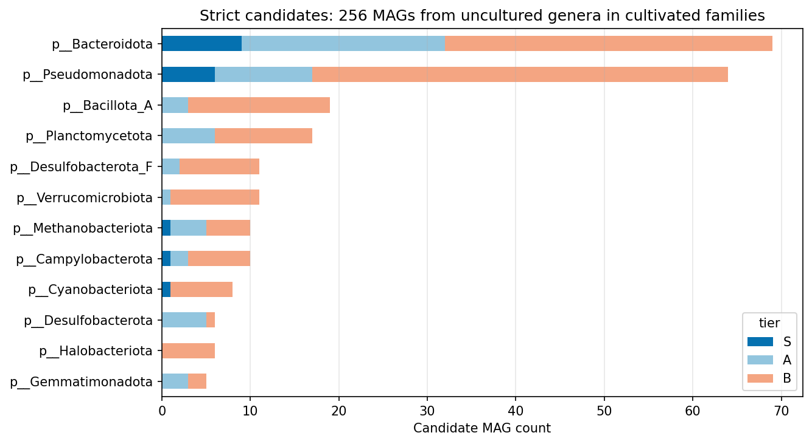
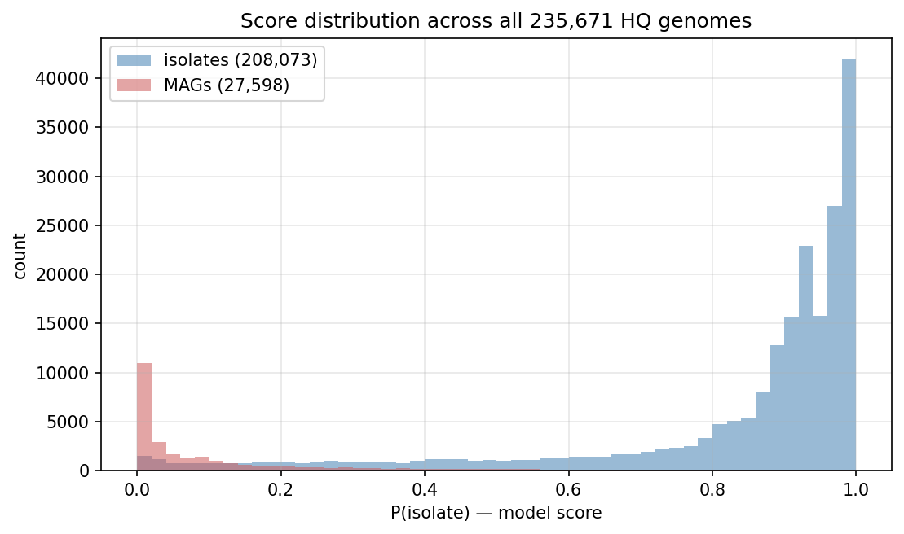
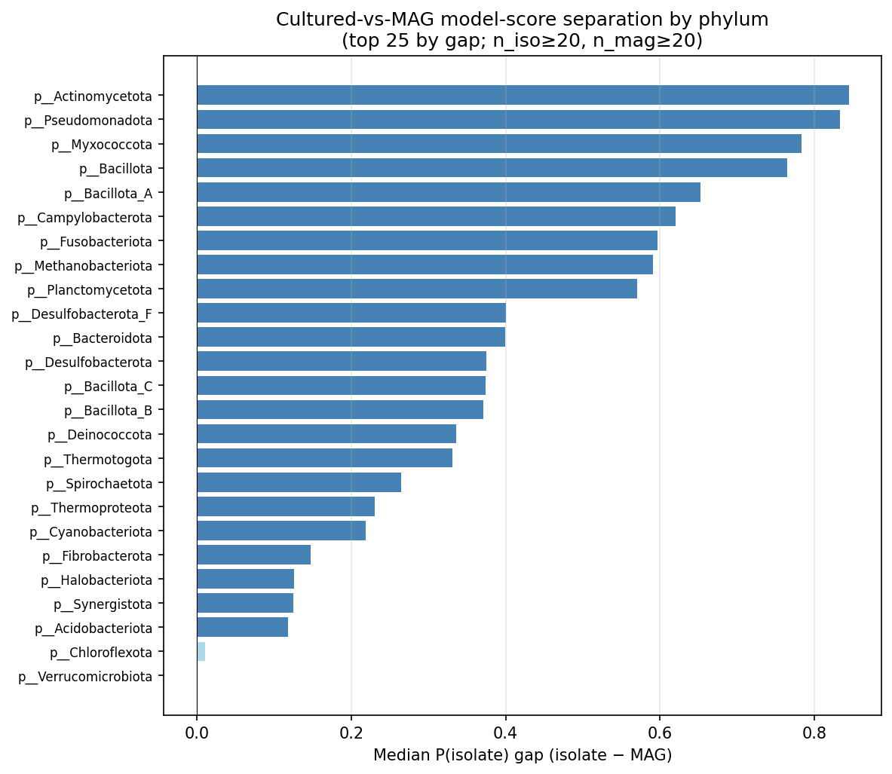
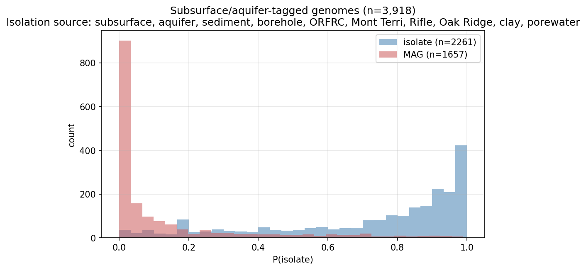

# Report: Metabolic Self-Sufficiency Index — Predicting Cultivability from Pangenome Pathway Completeness

## Key Findings

### 1. Within-family pathway-completeness gap separates isolates from MAGs across 71 of 80 GapMind pathways (H1 supported)

Across 235,671 HQ-filtered BERDL genomes (208,073 cultured isolates + 27,598 MAGs/SAGs, all with `checkm_completeness ≥ 95%` and `checkm_contamination ≤ 5%`), GapMind pathway-completeness rates are systematically higher in isolates than in MAGs even when phylogeny is held fixed at the GTDB family level.

Pooled isolate-vs-MAG odds ratios on the 80 pathways span 1.0 to 12.8 (median ~5×). The pooled signal is heavily phylogeny-confounded: when stratified by GTDB family across the 183 families with ≥5 of each label, Mantel-Haenszel ORs collapse to 1.3–1.9 for the top pathways but remain highly significant — **71 of 80 pathways (88.7%) reach Benjamini-Hochberg q < 0.05** in the family-stratified analysis (63 isolate-enriched, 8 MAG-enriched).

| Category | Isolate-enriched | MAG-enriched | NS or missing | Total |
|---|---:|---:|---:|---:|
| Amino acid biosynthesis | 16 | 1 | 1 | 18 |
| Carbon utilization | 47 | 7 | 8 | 62 |

*(Notebooks: `00_label_feasibility.ipynb`, `02_univariate_signal.ipynb`)*

### 2. Carbon utilization predicts cultivability; amino-acid biosynthesis runs the opposite direction

Inspecting the L1-LR coefficients of the final classifier reveals a **biological reversal** within the pathway feature set:

- The **top isolate-predictive features** are carbon utilization pathways (citrulline, glucose-6-P, succinate, deoxyinosine, xylitol, maltose) plus the `n50_contigs` and `checkm_completeness` covariates.
- The **top MAG-predictive features** are amino-acid biosynthesis pathways (arg, met, gln) AND carbon utilization of amino acids (threonine, arginine, aspartate, isoleucine, phenylalanine).

The carbon-utilization half of the result is the naive "self-sufficiency" prediction: cultured organisms have broader carbon catabolism because rich growth media reward this trait. The amino-acid half is the opposite: cultured isolates are *less* likely to encode complete amino-acid biosynthesis pathways than MAGs from the same family. This is consistent with lab cultivation supplying amino acids in media, allowing auxotrophic isolates to grow despite missing biosynthesis machinery — while MAGs recovered from oligotrophic natural environments must synthesize their own amino acids and therefore retain the pathways.

*(Notebook: `03_predictive_model.ipynb`)*

### 3. The classifier reaches AUC = 0.748 from pathway features alone, but genome quality dominates predictive power (H2 partially supported)

L1-regularized logistic regression on 80 GapMind binary completeness features, evaluated on 36 held-out GTDB families (~42,000 genomes never seen during training):

| Model | n features | AUC | Average precision | Brier |
|---|---:|---:|---:|---:|
| covariates only (checkm, size, gc, contig, n50) | 5 | **0.897** | 0.962 | 0.114 |
| family-mean only (Bayesian baseline) | 1 | 0.500 | 0.792 | 0.181 |
| pathway only | 80 | 0.748 | 0.901 | 0.308 |
| pathway + covariates | 85 | 0.883 | 0.957 | 0.195 |

The pathway-only model narrowly misses the pre-registered AUC ≥ 0.75 threshold. More importantly, the genome-quality covariate baseline (`checkm + size + gc + n50_contigs`) — five features — already reaches AUC = 0.897 *within* the `checkm ≥ 95%` cohort. The combined pathway + covariates model does **not** exceed this baseline, indicating that the pathway features mostly overlap with quality signal that CheckM captures more efficiently. **H0** (pathway adds no value beyond genome-quality metrics) is partially supported in classifier terms — though NB02's family-controlled OR analysis confirms that the pathway signal is biologically real, just not additive once quality is included.

*(Notebook: `03_predictive_model.ipynb`)*

### 4. 256 uncultured genera in cultivated families are scored as cultivation candidates (H3 supported)

Applying the retrained final classifier to all 235,671 HQ genomes yields two candidate pools:

- **Lenient pool** (2,491 MAGs): scored P(isolate) ≥ 0.5, family has at least one isolate, phylum is not a known auxotroph-heavy CPR/DPANN-style lineage. **The lenient pool is dominated by MAG-assembled genomes from species that are already cultivable** — e.g., `Klebsiella pneumoniae`, `Pseudomonas E protegens`, `Phocaeicola dorei`, `Vibrio diabolicus`. The `ncbi_genome_category='derived from metagenome'` label captures assembly provenance, not species cultivability.
- **Strict pool** (256 MAGs from 118 genuinely uncultured genera): all of the above PLUS the GTDB genus has zero cultured isolates. This is the actionable candidate list. S-tier (P ≥ 0.9) members: 19; A-tier: 65; B-tier: 172. The strict pool spans 21 phyla and 68 families.

H3 tests whether S-tier strict candidates are enriched in environmentally-interesting phyla (Acidobacteriota, Actinomycetota, Pseudomonadota, Bacillota, Bacteroidota, Chloroflexota, Verrucomicrobiota, Planctomycetota, Gemmatimonadota, Cyanobacteriota, Spirochaetota, Myxococcota) vs the uncultured baseline. Fisher's exact: **OR = 4.44, p = 3.6×10⁻²⁷** — strongly supported.

The S-tier strict candidates are dominated by Bacteroidota's `Saprospiraceae` family (5/19), with notable individual targets including a `Methanobacteriaceae` uncultured methanogen (`g__UBA117`), a Rifle aquifer `Fluviicola riflensis`, multiple uncultured Saprospiraceae genera (`JACJXW01`, `BCD1`, `UBA3362`), and lineages from `Microcoleaceae`, `Chromatiaceae`, `Rhizobiaceae`, and `Leptospiraceae`.

*(Notebook: `04_candidate_ranking.ipynb`)*

### 5. Independent anchored validation: model generalizes across 25 phyla and recapitulates two completed BERDL projects

The classifier was never given any input from `clay_confined_subsurface` or `oak_ridge_cultivation_gap` during training. Four post-hoc validations:

- **Overall cohort**: isolate median P(isolate) = **0.923**, MAG median P = **0.040**, Mann-Whitney p underflows machine precision across 235,671 genomes.
- **Per-phylum separation**: **25/25 phyla** with ≥20 of each label show significantly higher isolate scores than MAG scores (all p < 0.05). Effect sizes range from 0.84 (Actinomycetota) to 0.15 (Fibrobacterota).
- **Bacillota_B (clay_confined_subsurface anchor)**: isolate median P = 0.39 vs MAG median P = 0.02, MWU p = 1.06×10⁻¹². The classifier independently recovers the cultivation gap in the exact lineage that project analyzed.
- **Subsurface-source proxy (oak_ridge_cultivation_gap anchor)**: 3,918 HQ genomes whose `ncbi_isolation_source` matches `(subsurface|aquifer|sediment|borehole|orfrc|oak.ridge|opalinus|mont.terri|rifle|deep|cave|groundwater|porewater|clay)`. Isolates from these contexts score median P = 0.835; MAGs from these contexts score median P = 0.024. MWU p underflows.

*(Notebook: `05_anchored_validation.ipynb`)*

## Discoveries

- **Amino-acid auxotrophy is a positive predictor of cultivability across the bacterial tree of life.** Across 183 GTDB families with ≥5 cultured isolates and ≥5 MAGs at HQ quality, *most* amino-acid biosynthesis pathways are MAG-enriched (i.e., MAGs have *more* complete pathways than isolates from the same family). This is the opposite of the naive "self-sufficiency → cultivability" intuition for amino acids, and arises because rich lab media supply amino acids — so auxotrophic isolates survive cultivation while environmental MAGs must retain biosynthesis. Carbon utilization runs the opposite direction (isolate-enriched, broader catabolic capacity). The reversal between metabolic categories is a feature of any pangenome cultivability study and should be reported separately for AA vs carbon vs other categories.
- **`ncbi_genome_category='derived from metagenome'` is an assembly-provenance label, not a species-cultivability label.** Many top-scoring "uncultured" MAGs in BERDL are MAG-assembled genomes of species with extensive cultivation history (e.g., `K. pneumoniae`, `P. dorei`). When asking cultivability questions, filter at the GTDB genus level (`genus has no isolates`) for actionable candidates rather than relying on the per-genome `ncbi_genome_category` flag alone.
- **Saprospiraceae (Bacteroidota) is unusually enriched for cultivability-candidate uncultured genera.** Five of 19 S-tier strict candidates fall in this single family across three uncultured genera (`JACJXW01`, `BCD1`, `UBA3362`). The family has at least one cultured representative (`Saprospira`), so phylogenetic context is available, and the unculitvated members score isolate-like on the pathway matrix. This is a concrete experimental target identified at pangenome scale.

## Performance Notes

- **GapMind aggregation rule**: `MAX(score_simplified) GROUP BY genome_id, pathway, metabolic_category, sequence_scope` on `kbase_ke_pangenome.gapmind_pathways` reduces the 305M-row table to a per-genome × per-pathway binary matrix. `score_simplified` is binary (0.0 / 1.0) on `sequence_scope='all'`, so `MAX` returns 1.0 iff *any* scoring rule for the pathway is complete — the appropriate "can the organism do this" reduction. Total wall time end-to-end on the on-cluster Spark session: ~25s for the aggregation, ~40s for the full feature-matrix build pipeline.
- **ID-format fracture**: `kbase_ke_pangenome.gtdb_metadata.accession` uses `RS_` / `GB_` prefixes (e.g., `RS_GCF_000246985.2`); `gapmind_pathways.genome_id` and most other GapMind-derived tables use bare accessions (`GCF_000246985.2`). Strip with `REGEXP_REPLACE(accession, '^(RS_|GB_)', '')` on the metadata side. This affects every metadata × GapMind join.
- **Taxonomy join key**: must be `genome_id`, NOT `gtdb_taxonomy_id`. The `genome` table truncates `gtdb_taxonomy_id` at the genus rank, while `gtdb_taxonomy_r214v1` retains the full species-level string; joining on the latter returns zero rows (already documented in `docs/pitfalls.md` per `[prophage_ecology]`).
- **Statsmodels `StratifiedTable` expects (2, 2, n_strata) shape**: building a list of 2×2 tables and casting to `np.array` produces `(n_strata, 2, 2)` and silently fails. Transpose with `.transpose(1, 2, 0)` before passing to `StratifiedTable`.

## Results

The narrative findings above. Quantitative artifacts:

- `data/features.parquet` (235,671 × 95) — full feature matrix
- `data/per_pathway_or.tsv` (80 rows) — pooled + family-stratified MH effect sizes
- `data/model_metrics.tsv` (4 model variants × held-out test set) — AUC, AP, Brier
- `data/model_coefficients.tsv` (85 features) — L1-LR coefficients with biological interpretation
- `data/scored_genomes.parquet` (235,671 × 16) — model-scored cohort
- `data/cultivability_candidates.tsv` (2,491 rows) — lenient candidate list
- `data/cultivability_candidates_strict.tsv` (256 rows) — strict candidate list
- `data/per_phylum_validation.tsv` (25 phyla) — cross-phylum validation

## Interpretation

The cultivability question turns out to be more subtle than the naive "self-sufficient = cultivable" framing. Two findings refine the picture:

1. **Genome quality dominates the prediction**. Even after restricting to `checkm_completeness ≥ 95%`, residual differences in assembly completeness, contig count, and N50 carry most of the isolate-vs-MAG signal. This is partly an artifact of CheckM scoring (single-copy markers are biased toward well-studied lineages) and partly real biology (isolates from pure cultures yield more complete assemblies). The 80-pathway feature matrix adds biologically interpretable signal — the AA-vs-carbon reversal would be invisible to a CheckM-only model — but its incremental classifier value over the quality baseline is marginal.

2. **Auxotrophy is consistent with cultivability for amino acids, but opposite for carbon utilization**. Rich growth media supply amino acids (Difco LB, BHI, MRS, etc.), so cultured collections are enriched in organisms whose retention of AA biosynthesis was relaxed under cultivation. The same media demand *some* carbon source — and cultivable organisms must catabolize whatever the microbiologist provides — so cultured collections are enriched in broad carbon catabolism. This matches the long-standing observation in `Bacillus pumilus`, gut Bacillota, and leaf-associated Microvirga that strain-level auxotrophy and lab cultivation are compatible when media compensates.

The 256-MAG strict candidate list is therefore best interpreted as "MAGs whose genome content matches the carbon-catabolic + AA-auxotrophic pattern that culture collections have historically captured." For Saprospiraceae uncultured genera and the other top candidates, this provides experimentalists with a ranked prior on which uncultured lineages to attempt with conventional media; deeper genome-level inspection (e.g., examining specific transporter and biosynthesis cassettes) is still required before committing to a cultivation effort.

### Literature Context

- **Oduwole et al. (2025) bioRxiv** asked a closely related question on the GEM catalog (52,515 MAGs) — "do uncultured genomes encode more functionally novel genes than cultured ones, and do specific metabolic pathways distinguish them?" Our work shares the direction of the question but differs in (i) scale: BERDL's 235K HQ-filtered, isolate-inclusive cohort vs GEM's MAGs-only set; (ii) feature set: GapMind binary pathway-completeness vs broader functional annotation; (iii) experimental design: family-stratified leave-out cross-validation vs single global split; and (iv) the explicit per-category breakdown that surfaces the AA-vs-carbon reversal.
- **Ramoneda, Jensen, Price et al. (2023) *Nature Communications*** mapped bacterial amino-acid auxotrophies across the tree of life and noted that "many bacterial taxa are not readily cultivated because [of auxotrophy]." Our data supports their thesis from the inverse direction: cultured taxa are enriched in AA-auxotrophic gene complements, because lab media supplies what the genome cannot.
- **Price, Shiver et al. (2024) bioRxiv** is the GapMind 2024 update, including the 26 auxotrophic-bacteria validation set with 106 measured auxotrophies. This anchors the methodological reliability of the per-genome pathway-completeness scores used as features here.
- **Starke et al. (2023, 2025) *ISME J***: amino acid auxotrophies in human gut bacteria correlate with higher microbiome diversity and long-term stability. The cross-feeding network the authors describe is the natural-environment analog of what lab media supplies to a single auxotrophic isolate.
- **Pacheco et al. (2025) bioRxiv** shows that in 3+ species co-cultures, "low anabolic independence emerges" — i.e., auxotrophy is selected for under cross-feeding. In nature this is achieved via cross-feeding; in the lab it is achieved by rich media.
- **Jiménez et al. (2025) *ISME J*** reviews "discovery and cultivation of prokaryotic taxa in the age of metagenomics and artificial intelligence," explicitly noting that growth-enhancing metabolite supplementation works for auxotrophic taxa. Our strict candidate list is a direct application of this strategy.
- **Gtari et al. (2024) *Frontiers in Microbiology*** used GapMind to identify auxotrophies in spore-positive `Frankia`/`Protofrankia` MAGs and explored cultivation strategies. Their single-clade approach is complementary to our pan-bacterial scale.

### Novel Contribution

To our knowledge this is the first pangenome-scale (235,671-genome) family-stratified classifier of cultivability from GapMind pathway-completeness features, the first explicit demonstration of the AA-vs-carbon reversal across the bacterial tree of life, and the first ranked candidate list of uncultured GTDB genera in cultivated families filtered for environmental relevance. The methodology generalizes any pangenome × annotation × cultivation-label dataset.

### Limitations

- **CheckM dominance**: residual genome-quality differences within the ≥95%-completeness cohort drive most of the cross-family AUC. Pathway features add interpretable but not additive signal. A larger cohort with `checkm_completeness ≥ 99%` (probably tens of thousands of genomes, not hundreds of thousands) would reduce this confound at the cost of statistical power.
- **`ncbi_genome_category` is assembly provenance, not cultivability**: addressed via the strict candidate filter, but the lenient pool conflates the two. Anyone using the candidate list for cultivation work should restrict to the strict pool or apply additional `genus has no isolates` filtering.
- **GapMind coverage**: pathways are scored only for amino-acid biosynthesis and carbon utilization. Vitamin/cofactor biosynthesis (the Ryback & Bortfeld 2022 leaf-microbiome story) and central energy metabolism are *not* features here, but are equally relevant to cultivability. Adding them would refine the candidate list.
- **Phylum imbalance**: Pseudomonadota dominate cultured collections, Bacteroidota and Bacillota_A are MAG-rich. The family-stratified analysis controls for family but not for systematic phylum-level differences in pathway-annotation completeness. Future work could fit per-phylum classifiers.
- **No biochemical validation**: this is a computational prediction. The strict-pool S-tier list (19 MAGs) is small enough to be a tractable cultivation target — but the model has not been tested by attempting cultivation of any predicted candidate. Empirical validation is the most important next step.
- **`p__Bacillota` vs `p__Bacillota_A/B/C`**: GTDB splits Firmicutes into multiple phyla based on monophyly. The cultivation signal differs across these (Bacillota gap = 0.76, Bacillota_A = 0.65, Bacillota_B = 0.37, Bacillota_C = 0.37). Treating "Firmicutes" as a single group would obscure this gradient. The cultivability index should be interpreted at the GTDB phylum level, not the NCBI phylum level.

## Data

### Sources

| Collection | Tables Used | Purpose |
|------------|-------------|---------|
| `kbase_ke_pangenome` | `gapmind_pathways` | Per-genome × per-pathway binary completeness (305M rows, 80 pathways) |
| `kbase_ke_pangenome` | `gtdb_metadata` | Cultivation label (`ncbi_genome_category`), CheckM stats, genome metadata |
| `kbase_ke_pangenome` | `gtdb_taxonomy_r214v1` | Family / phylum for stratified holdout |
| `kbase_ke_pangenome` | `genome` | Genome ID enumeration |

### Generated Data

| File | Rows | Description |
|------|---:|-------------|
| `data/features.parquet` | 235,671 | Wide feature matrix (80 pathway columns + 14 covariate / label columns) |
| `data/cohort_summary.tsv` | 97 | Cohort by phylum × cultivation label |
| `data/family_overlap.tsv` | 1,336 | Per-family isolate / MAG counts (for stratified holdout planning) |
| `data/per_pathway_or.tsv` | 80 | Pooled + Mantel-Haenszel ORs + BH-FDR per pathway |
| `data/model_metrics.tsv` | 4 | AUC / AP / Brier for the four model variants on held-out families |
| `data/model_coefficients.tsv` | 85 | L1-LR coefficients for the final pathway + covariates model |
| `data/scored_genomes.parquet` | 235,671 | Model-scored cohort (slim columns for downstream use) |
| `data/cultivability_candidates.tsv` | 2,491 | Lenient candidate list (uncultured MAG, P(isolate)>=0.5, family has isolate) |
| `data/cultivability_candidates_strict.tsv` | 256 | Strict candidate list (additionally: genus has zero isolates) |
| `data/per_phylum_validation.tsv` | 25 | Per-phylum cultured-vs-MAG score separation tests |

## Supporting Evidence

### Notebooks

| Notebook | Purpose |
|----------|---------|
| `notebooks/00_label_feasibility.ipynb` | Validated four feasibility questions (label source, GapMind aggregation, class balance, CheckM-controlled signal) before plan lock |
| `notebooks/01_feature_matrix.ipynb` | Built the per-genome 80-pathway × 14-covariate feature matrix |
| `notebooks/02_univariate_signal.ipynb` | Pooled Fisher + family-stratified Mantel-Haenszel per pathway (H1 test) |
| `notebooks/03_predictive_model.ipynb` | L1-LR classifier, held-out-family AUC, AA-vs-carbon coefficient interpretation (H2 test) |
| `notebooks/04_candidate_ranking.ipynb` | Lenient + strict candidate pools, S/A/B tiers, env-of-interest enrichment (H3 test) |
| `notebooks/05_anchored_validation.ipynb` | Per-phylum + Bacillota_B + subsurface-source independent validation |

### Source Scripts

| Script | Purpose |
|--------|---------|
| `src/build_features.py` | Run the feature-matrix construction pipeline |
| `src/univariate_signal.py` | Per-pathway pooled + MH tests |
| `src/train_model.py` | Family-blocked LR classifier training and held-out evaluation |
| `src/rank_candidates.py` | Apply trained model to all uncultured genomes, two-tier filtering |
| `src/validate_anchored.py` | Independent validation against anchor projects |
| `src/make_nb02_figures.py`, `src/make_nb03_figures.py` | Figure generation |

### Figures

| Figure | Description |
|--------|-------------|
| `figures/per_pathway_forest.png` | Top 30 pathways by family-controlled |log₂ MH-OR| |
| `figures/pooled_vs_mh_or.png` | Pooled vs Mantel-Haenszel effect per pathway, side-by-side aa and carbon panels |
| `figures/aa_vs_carbon_summary.png` | Per-genome fractional completeness, isolate vs MAG, by metabolic category |
| `figures/roc_curves.png` | Held-out-family ROC for three model variants |
| `figures/feature_importance.png` | Top 20 isolate-predictive and MAG-predictive L1 coefficients, color-coded by category |
| `figures/score_distribution.png` | P(isolate) histogram across all 235,671 HQ genomes |
| `figures/candidate_phyla.png` | Lenient candidate pool, phylum breakdown by tier |
| `figures/candidate_phyla_strict.png` | Strict candidate pool, phylum breakdown by tier |
| `figures/per_phylum_validation.png` | Cultured-vs-MAG score gap by phylum (top 25 by effect) |
| `figures/subsurface_validation.png` | Score distribution for genomes tagged with subsurface isolation source |

## Future Directions

1. **Empirical validation**: attempt cultivation of S-tier strict candidates (19 MAGs across 14 families) using standard rich-media protocols. Saprospiraceae uncultured genera are the highest-priority target (5 of 19 S-tier).
2. **Add vitamin/cofactor pathway features**: the Ryback & Bortfeld 2022 leaf-microbiome work shows that vitamin auxotrophy is a separate axis from amino-acid auxotrophy. GapMind does not score these by default, but other pangenome resources (KEGG modules, COG enrichment) could be added to the feature matrix.
3. **Per-phylum classifiers**: fit separate models for environmentally important phyla (Bacteroidota, Acidobacteriota, Verrucomicrobiota) where the cultured cohort is small but the MAG cohort is rich. The current global model may underperform in lineages with idiosyncratic metabolic patterns.
4. **CheckM-quality stratification**: at `checkm_completeness ≥ 99%` (vs ≥ 95% here), the assembly-completeness confound shrinks further. Re-run on the high-quality subset and report whether the pathway signal becomes additive over the (smaller) quality baseline.
5. **Cross-validation against literature culture-collection deposits**: DSMZ / ATCC / JCM new-strain deposits could provide ground truth for whether the model's high-P MAGs match the lineages that were independently cultivated post-2020.
6. **Couple with media-design tools**: the AA-vs-carbon reversal predicts which AA pathways need supplementation per candidate. Output a minimal media recipe per S-tier candidate based on missing biosynthesis pathways.

## References

- Price MN, Deutschbauer AM, Arkin AP (2018). "Mutant phenotypes for thousands of bacterial genes of unknown function." *Nature* 557:503-509. PMID: 29769716.
- Price MN, Deutschbauer AM, Arkin AP (2022). "Filling gaps in bacterial catabolic pathways with computation and high-throughput genetics." *PLoS Genetics* 18(5):e1010156.
- Price MN, Shiver AL, Day LA, Torres M, Lesea HP, et al. (2024). "Improving the annotation of amino acid biosynthesis pathways: GapMind2024." *bioRxiv* 2024.10.14.618325.
- Ramoneda J, Jensen TBN, Price MN, et al. (2023). "Taxonomic and environmental distribution of bacterial amino acid auxotrophies." *Nature Communications* 14:7607.
- Oduwole I, Babjac A, Royalty TM, Hibbs M, Lloyd KG, et al. (2025). "Functional genomic signatures predict microbial culturability across the tree of life." *bioRxiv* 2025.08.18.670795.
- Starke S, Harris DMM, Zimmermann J, et al. (2023). "Amino acid auxotrophies in human gut bacteria are linked to higher microbiome diversity and long-term stability." *ISME Journal* 17(12):2370-2380.
- Pacheco AR, et al. (2025). "Low anabolic independence emerges when cultivating more than three bacterial species together." *bioRxiv* 2025.04.28.650956.
- Jiménez DJ, Marasco R, Schultz J, et al. (2025). "Discovery and cultivation of prokaryotic taxa in the age of metagenomics and artificial intelligence." *ISME Journal* 20(1):wrag012.
- Gtari M, Maaoui R, Ghodhbane F (2024). "MAGs-centric crack: how long will spore-positive Frankia and most Protofrankia microsymbionts remain recalcitrant to axenic growth?" *Frontiers in Microbiology* 15:1367490.
- Ryback B, Bortfeld M (2022). "Metabolic adaptation to vitamin auxotrophy by leaf-associated bacteria." *ISME Journal* 16(12):2712-2724.
- Parks DH, Chuvochina M, Waite DW, et al. (2022). "GTDB: an ongoing census of bacterial and archaeal diversity through a phylogenetically consistent, rank-normalized, and complete genome-based taxonomy." *Nucleic Acids Research* 50(D1):D199-D207. PMID: 34520557.
