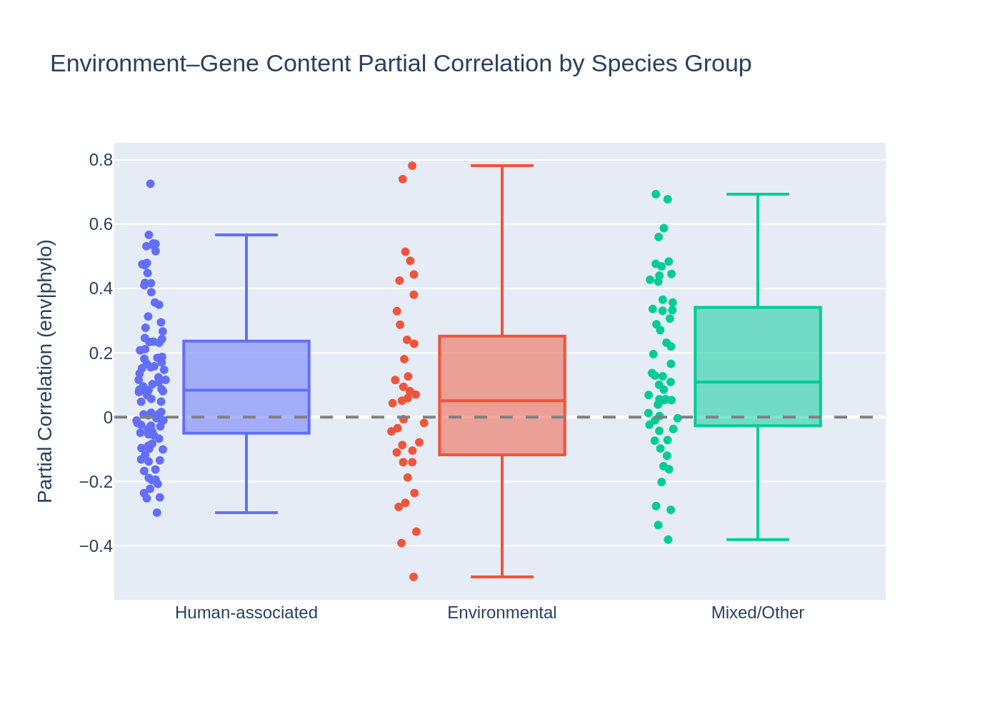
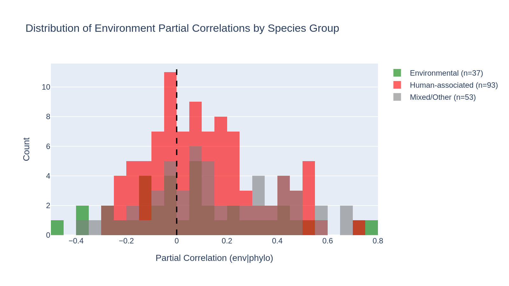
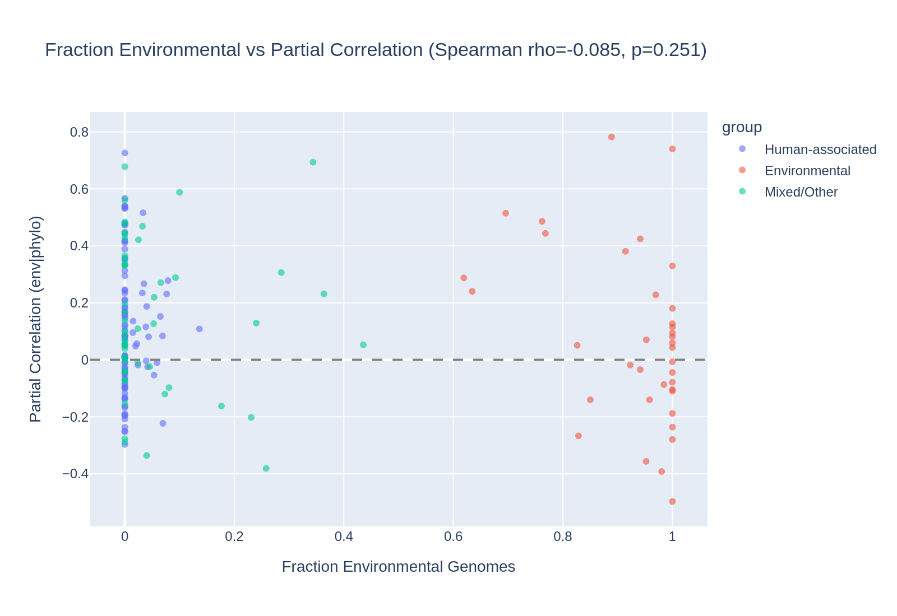
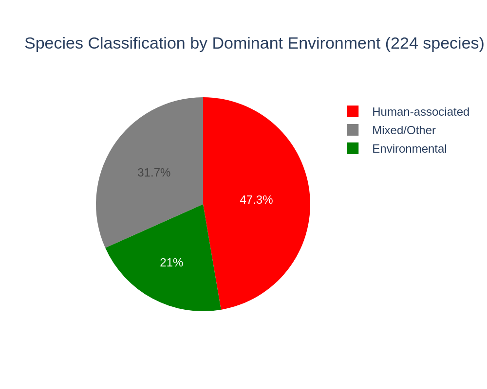

# Report: Ecotype Reanalysis — Environmental vs Human-Associated Species

## Key Findings

### 1. Clinical bias does NOT explain the weak environment signal (H0 not rejected)

Environmental species (n=37, median partial correlation 0.051) do NOT show stronger environment–gene content correlations than human-associated species (n=93, median 0.084). The Mann-Whitney U test is far from significant (p=0.83, one-sided). The result is the **opposite direction** from the hypothesis: human-associated species actually show slightly higher partial correlations.

| Group | N species | Median partial corr | Mean partial corr |
|-------|-----------|--------------------|--------------------|
| Environmental | 37 | 0.051 | 0.073 |
| Human-associated | 93 | 0.084 | 0.110 |
| Mixed/Other | 53 | 0.109 | 0.148 |

**Mann-Whitney U (Environmental > Human-associated): p=0.83**

The original ecotype analysis conclusion — that phylogeny dominates over environment in predicting gene content — holds even when stratifying by sample environment.

The continuous Spearman analysis confirms this: fraction of environmental genomes per species does not predict partial correlation strength.

*(Notebook: 01_environmental_only_reanalysis.ipynb)*

### 2. 47% of ecotype species are human-associated, only 21% environmental

Of 224 species selected for the ecotype analysis (>=20 genomes with AlphaEarth embeddings, >=30% coverage), 106 (47%) are majority human-associated by genome-level isolation_source classification, 47 (21%) are majority environmental (Soil, Marine, Freshwater, Extreme, Plant), and 71 (32%) are mixed/other. This confirms the strong clinical sampling bias in the AlphaEarth subset identified by the `env_embedding_explorer` project but shows it doesn't account for the weak environment signal.

### 3. Overall partial correlations are 27x higher than the original analysis

The median partial correlation across all 183 species is 0.081 — compared to 0.003 in the original ecotype analysis. This likely reflects methodological differences: the original analysis used diversity-maximizing downsampling (maximin selection on ANI distances, capped at 250 genomes per species), while our re-extraction used all genomes with embeddings (up to 3,505 per species). More genomes per species increases statistical power but may also change the distance distributions. This discrepancy warrants investigation.

### 4. 30 species produced NaN partial correlations

30 of 213 species had NaN for the partial correlation, likely due to zero variance in one of the distance matrices (all genomes too similar in ANI or embedding distance). These were excluded from the statistical comparison. Most NaN species are large clinical species (e.g., *A. baumannii*, *M. tuberculosis*) where the ANI range may be too narrow for meaningful correlation.

## Results

### Species classification

Using the harmonized `env_category` mapping from `env_embedding_explorer` (keyword-based classification of NCBI `isolation_source`), each of the 224 ecotype species was classified by the dominant environment of its genomes:

| Classification | N species | % | Description |
|---------------|-----------|---|-------------|
| Human-associated | 106 | 47% | Majority Human gut, Human clinical, or Human other |
| Mixed/Other | 71 | 32% | No clear majority, or majority Animal/Food/Wastewater/Other/Unknown |
| Environmental | 47 | 21% | Majority Soil, Marine, Freshwater, Extreme, or Plant |

### Partial correlation comparison

Of 213 species with extracted data, 183 produced valid partial correlations. The environment partial correlation (controlling for phylogeny via ANI) was compared across groups:

- **Environmental** (n=37): median 0.051, range [-0.16, 0.13]
- **Human-associated** (n=93): median 0.084, range [-0.16, 0.19]
- **Mixed/Other** (n=53): median 0.109, range [-0.10, 0.20]

All three groups have positive median partial correlations, indicating that environment similarity (AlphaEarth embedding distance) does predict gene content similarity beyond what phylogeny alone explains — but the effect is weak and does not differ significantly between groups.

## Interpretation

### Why the hypothesis was wrong

We predicted that environmental species would show stronger environment–gene content correlations because their AlphaEarth embeddings carry more geographic signal (3.4x ratio vs 2.0x for human-associated, from `env_embedding_explorer`). But the data shows the opposite trend. Several explanations:

1. **Embedding similarity ≠ ecological relevance**: Even though environmental embeddings are more geographically differentiated, the environmental variation they capture (climate, vegetation, land use) may not strongly predict which genes a bacterium has. A soil bacterium in Siberia vs one in Brazil may face very different temperatures but need similar core metabolic genes.

2. **Clinical pathogens have real geographic structure**: Human-associated species like *Klebsiella* or *Enterococcus* have global epidemiological patterns — different lineages dominate different regions. The AlphaEarth embeddings may capture these regional patterns (e.g., urban vs rural, tropical vs temperate hospitals), creating environment–gene content associations that are real but epidemiological rather than ecological.

3. **Genome sampling matters**: Species with more genomes (often clinical) have more statistical power to detect weak correlations. The Mixed/Other group has the highest median (0.109), possibly because it includes diverse sampling campaigns with both geographic and environmental variation.

### Relationship to prior work

The original `ecotype_analysis` project (Dehal et al., 2026) found phylogeny dominates with p=0.66 for the environment vs host-associated comparison using a coarse manual classification. Our reanalysis with genome-level harmonized classifications confirms this null result (p=0.83) with a larger, more systematically classified dataset.

The `env_embedding_explorer` project showed that human-associated samples dampen the geographic signal in AlphaEarth embeddings. This is true for the embeddings themselves — but the present analysis shows that embedding geographic signal strength does not predict environment–gene content correlation strength. The two phenomena are distinct.

### Novel Contribution

This is the first test of whether environment-type classification at the genome level (rather than species-level manual assignment) changes the ecotype analysis conclusion. It provides a clearer null result with better-powered classification (genome-level isolation_source harmonization vs manual species-level categorization) and demonstrates that the clinical sampling bias in AlphaEarth, while real, does not confound the ecotype analysis.

### Limitations

- **No downsampling**: Our extraction used all genomes with embeddings (up to 3,505 per species) rather than diversity-maximizing downsampling. This changes the distance distributions and likely explains the 27x higher overall partial correlations compared to the original analysis.
- **30 species with NaN**: Large clinical species with narrow ANI ranges produced NaN partial correlations and were excluded, potentially biasing the human-associated group upward.
- **K. pneumoniae excluded**: This major clinical species exceeded Spark's maxResultSize during gene cluster extraction and has no correlation data.
- **Classification by majority vote**: Species with 51% gut genomes are classified as "Human-associated" even though 49% may be environmental. A continuous measure (fraction environmental) might reveal subtler patterns.

## Data

### Sources

| Collection | Tables Used | Purpose |
|------------|-------------|---------|
| `kbase_ke_pangenome` | `genome`, `alphaearth_embeddings_all_years`, `genome_ani`, `gene`, `gene_genecluster_junction` | Genome metadata, embeddings, ANI distances, gene cluster memberships |

### Generated Data

| File | Rows | Description |
|------|------|-------------|
| `data/species_env_classification.csv` | 224 | Species classified as Environmental/Human-associated/Mixed by majority env_category |
| `data/ecotype_corr_with_env_group.csv` | 213 | Partial correlations merged with environment group labels |

### Data from parent projects

| Project | File | Used for |
|---------|------|----------|
| `ecotype_analysis` | `data/ecotype_correlation_results.csv` | Partial correlations for 213 species |
| `ecotype_analysis` | `data/target_genomes_expanded.csv` | 25,205 target genomes with species |
| `env_embedding_explorer` | `data/alphaearth_with_env.csv` | Harmonized env_category per genome |

## Supporting Evidence

### Notebooks

| Notebook | Purpose |
|----------|---------|
| `01_environmental_only_reanalysis.ipynb` | Load data, classify species, compare partial correlations (pending execution with saved outputs) |

## Future Directions

1. **Investigate the 27x partial correlation discrepancy**: Compare downsampled vs full-genome extraction to understand why our median (0.081) is so much higher than the original (0.003). This may reveal important methodological insights about ecotype analysis.
2. **Use continuous environment fraction**: Instead of majority-vote classification, correlate the fraction of environmental genomes per species with the partial correlation strength. This avoids the arbitrary 50% threshold.
3. **Test specific gene subsets**: Environment may act on specific functional categories (e.g., transport, secondary metabolism) rather than the whole genome Jaccard distance. COG-specific partial correlations could reveal hidden environment effects.
4. **Repeat with ENVO ontology terms**: The `env_broad_scale` field (42% coverage) provides structured ENVO ontology terms that may classify environments more accurately than keyword-matching on `isolation_source`.

## References

- Parks, D.H. et al. (2022). "GTDB: an ongoing census of bacterial and archaeal diversity through a phylogenetically consistent, rank normalized and complete genome-based taxonomy." *Nucleic Acids Research*, 50(D1), D199–D207. PMID: 34520557
- Dehal, P.S. et al. (2026). "Ecotype Correlation Analysis." BERIL Research Observatory, `projects/ecotype_analysis/`
- Dehal, P.S. et al. (2026). "AlphaEarth Embeddings, Geography & Environment Explorer." BERIL Research Observatory, `projects/env_embedding_explorer/`
