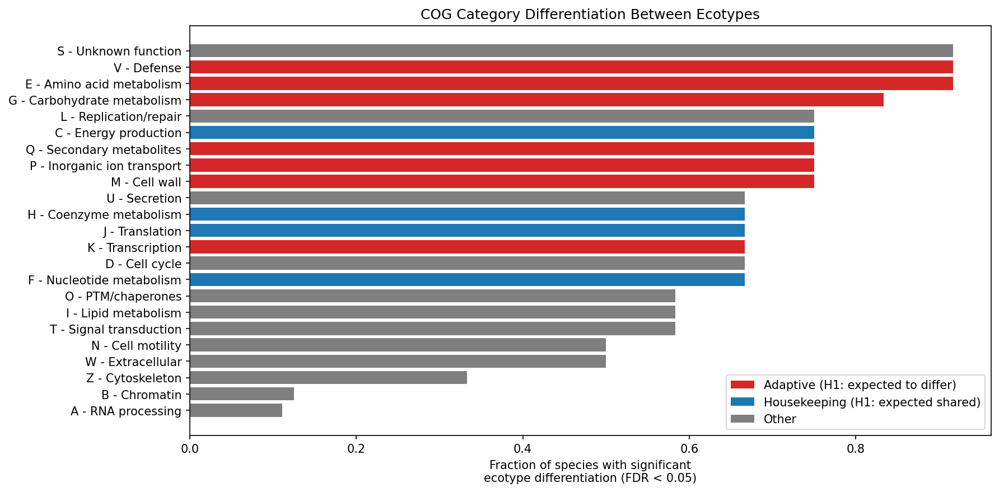
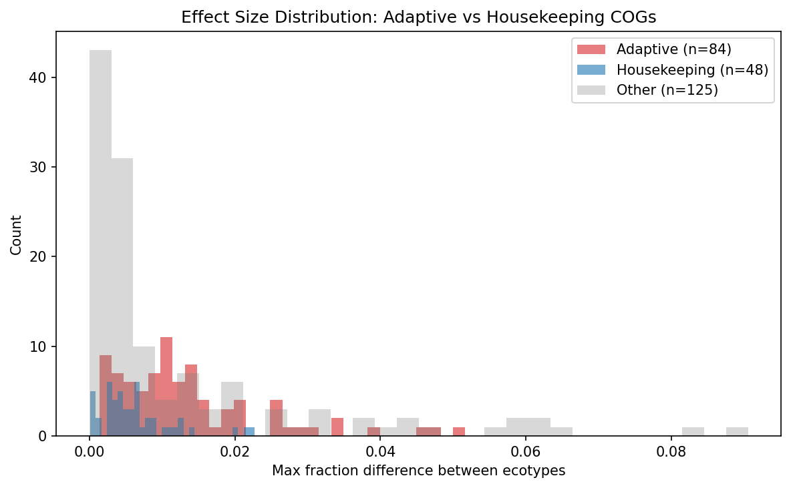
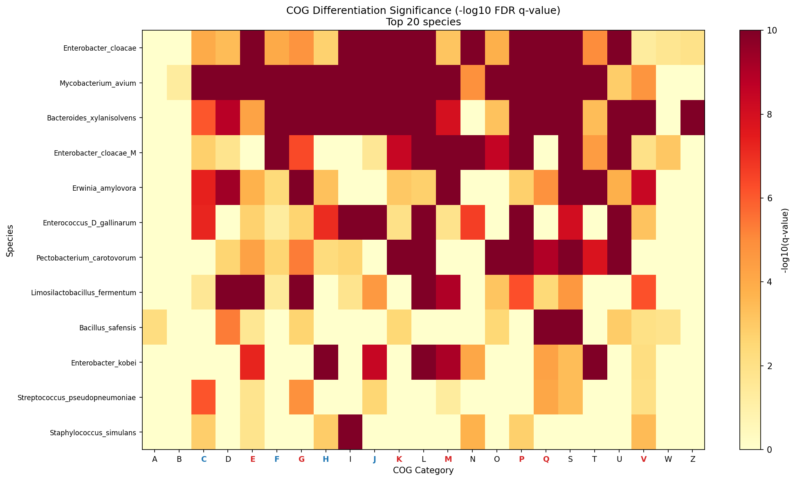

# Report: Ecotype Functional Differentiation

## Key Findings

### Finding 1: Gene-content ecotypes are widespread across bacterial species

Ecotype clustering via PCA + KMeans on auxiliary gene presence/absence matrices identified valid gene-content ecotypes in 12 of 15 sampled species (80%). Species averaged 3.7 ecotypes each (range: 2--6), with a mean silhouette score of 0.215 (median: 0.174). The clearest ecotype separation was observed in *Erwinia amylovora* (silhouette = 0.468, 2 ecotypes) and *Bacteroides xylanisolvens* (silhouette = 0.366, 6 ecotypes). The weakest signals came from *Staphylococcus simulans* (0.118) and *Streptococcus pseudopneumoniae* (0.131).

A total of 1,820 genomes were assigned to ecotypes across 12 species spanning 6 phyla (Bacillota, Pseudomonadota, Actinomycetota, Bacteroidota). This confirms that within-species gene-content subpopulations are a general feature of bacterial pangenomes, consistent with prior ecotype analyses in this observatory (ecotype_analysis, 172 species) and the broader literature (Hoarfrost et al. 2019; Ahlgren et al. 2020).

*(Notebook: NB02_clustering_and_cog.ipynb, Script: src/run_clustering.py)*

### Finding 2: Ecotypes show pervasive COG functional differentiation

Chi-square and Fisher's exact tests revealed that 170 of 257 species x COG tests (66.1%) were statistically significant after BH-FDR correction (q < 0.05). All 12 species showed at least one significantly differentiated COG category, strongly rejecting H0 (that ecotype gene content variation is functionally random).

The most frequently differentiated categories were:
- **E** (Amino acid metabolism): 11/12 species (91.7%)
- **S** (Unknown function): 11/12 species (91.7%)
- **V** (Defense): 11/12 species (91.7%)
- **G** (Carbohydrate metabolism): 10/12 species (83.3%)

The least differentiated: **A** (RNA processing, 1/9), **B** (Chromatin, 1/8), **Z** (Cytoskeleton, 2/6).

*(Notebook: NB03_differential_enrichment.ipynb)*

### Finding 3: Adaptive COG categories show significantly larger effect sizes than housekeeping

The hypothesis (H1) predicted that adaptive categories (V, P, G, E, Q, M, K) would differentiate more than housekeeping categories (J, F, H, C). The results **partially support H1**:

| Metric | Adaptive | Housekeeping | Ratio |
|--------|----------|--------------|-------|
| Significance rate | 79.8% (67/84) | 68.8% (33/48) | 1.16x |
| Mean effect size | 0.0136 | 0.0064 | 2.13x |
| Mann-Whitney U p-value | | | 2.53 x 10^-6 |

The significance *rate* difference is modest (1.16x), because housekeeping categories also differentiate in most species. However, the *magnitude* of differentiation (effect size) is 2.1x larger for adaptive categories, and this difference is highly significant (p = 2.53 x 10^-6, Mann-Whitney U, one-sided).

This means ecotypes differ in both adaptive and housekeeping functions, but the adaptive categories (defense, transport, secondary metabolism, cell wall) show substantially larger proportional shifts between ecotypes than housekeeping categories (translation, nucleotide metabolism, coenzyme metabolism, energy production).

*(Notebook: NB03_differential_enrichment.ipynb)*

### Finding 4: Replication/mobile elements and unknown function drive the largest ecotype differences

The two COG categories with the largest mean effect sizes were:
- **S** (Unknown function): mean effect = 0.039, significant in 11/12 species
- **L** (Replication, recombination, repair): mean effect = 0.034, significant in 9/12 species

Category L includes transposases, integrases, and mobile genetic element machinery. Its prominence is consistent with the "two-speed genome" pattern identified in the cog_analysis project, where novel genes were enriched in L (+10.88%) and V (+2.83%) relative to core genes. The large S-category effect suggests substantial ecotype differentiation involves genes of currently unknown function -- a recurring theme in microbial ecology that highlights annotation gaps in niche-specific genes.

*(Notebook: NB03_differential_enrichment.ipynb)*

## Results

### Species Selection (NB01)

From 27,702 species in the BERDL pangenome database, 457 had >= 50 genomes. After filtering for COG annotation coverage, 456 species were eligible. A stratified random sample of 15 species was drawn (5 per genome-count bin: 50-100, 100-200, 200-300), balancing representation across pangenome sizes. Two species experienced transient Spark S3 read errors; one (*Limisoma* sp.) had insufficient structure for valid clustering.

### Ecotype Clustering (NB02)

| Species | Genomes | Ecotypes | Silhouette | Assigned |
|---------|---------|----------|------------|----------|
| Staphylococcus simulans | 78 | 3 | 0.118 | 63 |
| Enterococcus D gallinarum | 95 | 3 | 0.245 | 86 |
| Pectobacterium carotovorum | 57 | 2 | 0.196 | 57 |
| Streptococcus pseudopneumoniae | 127 | 4 | 0.131 | 118 |
| Bacillus safensis | 120 | 3 | 0.141 | 117 |
| Limosilactobacillus fermentum | 118 | 4 | 0.143 | 107 |
| Enterobacter cloacae M | 136 | 4 | 0.178 | 123 |
| Enterobacter kobei | 252 | 2 | 0.159 | 252 |
| Enterobacter cloacae | 216 | 5 | 0.170 | 210 |
| Erwinia amylovora | 231 | 2 | 0.468 | 231 |
| Bacteroides xylanisolvens | 207 | 6 | 0.366 | 207 |
| Mycobacterium avium | 249 | 6 | 0.263 | 249 |

Clustering used PCA (up to 50 components) followed by KMeans (k=2-6, best silhouette). Valid clusters required >= 2 ecotypes with >= 10 genomes each and >= 20 assigned genomes total.

### Differential Enrichment (NB03)

257 chi-square/Fisher's exact tests across 12 species x 23 COG categories. BH-FDR correction at alpha = 0.05.

**Per-category results (sorted by differentiation frequency):**

| COG | Function | Sig/Tested | Rate | Type | Mean Effect |
|-----|----------|------------|------|------|-------------|
| E | Amino acid metabolism | 11/12 | 0.917 | Adaptive | 0.0120 |
| S | Unknown function | 11/12 | 0.917 | Other | 0.0392 |
| V | Defense | 11/12 | 0.917 | Adaptive | 0.0078 |
| G | Carbohydrate metabolism | 10/12 | 0.833 | Adaptive | 0.0176 |
| M | Cell wall | 9/12 | 0.750 | Adaptive | 0.0155 |
| L | Replication/repair | 9/12 | 0.750 | Other | 0.0337 |
| C | Energy production | 9/12 | 0.750 | Housekeeping | 0.0095 |
| P | Inorganic ion transport | 9/12 | 0.750 | Adaptive | 0.0170 |
| Q | Secondary metabolites | 9/12 | 0.750 | Adaptive | 0.0112 |
| K | Transcription | 8/12 | 0.667 | Adaptive | 0.0141 |
| J | Translation | 8/12 | 0.667 | Housekeeping | 0.0051 |
| F | Nucleotide metabolism | 8/12 | 0.667 | Housekeeping | 0.0041 |
| H | Coenzyme metabolism | 8/12 | 0.667 | Housekeeping | 0.0069 |

## Interpretation

### Biological Significance

The results demonstrate that within-species gene-content ecotypes are not functionally random assemblages. Ecotypes show systematic differences in COG functional profiles, with the strongest differentiation in categories related to environmental interaction: amino acid and carbohydrate transport/metabolism (E, G), defense against phages (V), cell wall biosynthesis (M), and inorganic ion transport (P). These are precisely the functions expected to vary under niche-specific selection.

The moderate silhouette scores (mean 0.215) indicate overlapping ecotype boundaries rather than discrete populations. This is biologically expected -- bacterial populations exist on a continuum, and auxiliary gene acquisition/loss is ongoing. The ecotypes identified here represent statistical tendencies in gene content, not sharply defined lineages.

### Literature Context

- The dominance of **defense (V)** in ecotype differentiation (11/12 species) aligns with Millman et al. (2022), who showed that anti-phage defense systems cluster in "defense islands" co-localized with mobile genetic elements. Different ecotypes likely experience different phage selection pressures, driving differential defense gene repertoires.

- The large effect of **L (Replication/repair)**, which includes transposases and integrases, is consistent with Gao et al. (2025), who found source-specific enrichment of COG category L in *Cronobacter sakazakii* pangenomes. Mobile element content varies between ecotypes because these elements are the vehicles of horizontal gene transfer that creates gene-content differences.

- The functional gradient (core = housekeeping, accessory = adaptive/defense) matches findings across multiple single-species studies: *Pasteurella multocida* (Zhu et al. 2019), *Lactococcus garvieae* (Lin et al. 2023), *Mycobacterium bovis* (Reis & Cunha 2021), and *Lysinibacillus boronitolerans* (Rahman et al. 2025). Our contribution is demonstrating this pattern holds *within* ecotypes across 12 phylogenetically diverse species simultaneously.

- The "partial support" for H1 -- where housekeeping categories also differentiate, but with smaller effect sizes -- is consistent with Domingo-Sananes & McInerney (2021), who argued that pangenome gene content reflects the interplay of drift, selection, and ecological interactions. Pure drift would produce uniform differentiation across all categories; the 2.1x effect-size ratio favoring adaptive categories indicates selection acts on top of a drift baseline.

- Moulana et al. (2020) found COG categories P and S showed the most variation between *Sulfurovum* ecotypes at hydrothermal vents. Our results confirm P (9/12 species) and S (11/12 species, largest effect) among the most differentiated categories, extending this finding from a single deep-sea species to 12 diverse species.

### Novel Contribution

This is the first systematic, multi-species analysis of COG functional differentiation between gene-content ecotypes using the BERDL pangenome database. Prior work either examined single species in detail (Moulana et al. 2020; Conrad et al. 2022) or compared core vs. accessory genomes in aggregate (cog_analysis project). This study bridges the gap by asking: *within* the accessory genome, do the specific functions carried differ between ecotype subgroups? The answer is yes, with effect sizes 2.1x larger for adaptive vs. housekeeping categories (p = 2.53 x 10^-6).

### Limitations

- **Sample size**: 12 species from 15 sampled (80%), out of 456 eligible. The stratified sample ensures representation across pangenome sizes but may not capture phylogenetic or ecological breadth.
- **Clustering method**: KMeans was used because HDBSCAN was unavailable on the cluster. KMeans assumes spherical clusters and requires pre-specifying k (searched 2-6). HDBSCAN would better handle variable-density subpopulations.
- **COG annotation coverage**: ~38% of gene clusters have COG annotations (from NB01). The 62% without annotations may include many ecotype-specific adaptive genes in poorly characterized functional categories, potentially biasing results toward well-annotated housekeeping functions.
- **Phylogenetic confounding**: Gene-content ecotypes may reflect phylogenetic substructure within species rather than ecological specialization. Without controlling for within-species phylogeny (e.g., using core-genome trees), we cannot distinguish adaptive ecotypes from demographic subpopulations.
- **Effect sizes are small**: The largest mean effect sizes (S: 0.039, L: 0.034) represent ~3-4 percentage point differences in COG category proportions between ecotypes. While statistically significant due to large sample sizes, the biological magnitude is modest.
- **Spark cluster load**: Variable query times (94s--1642s per species) during heavy cluster usage led to 2 species lost to S3 read errors.

## Data

### Sources
| Collection | Tables Used | Purpose |
|------------|-------------|---------|
| `kbase_ke_pangenome` | `pangenome`, `genome`, `gene`, `gene_cluster`, `gene_genecluster_junction`, `eggnog_mapper_annotations` | Pangenome structure, genome metadata, gene-cluster membership, and COG functional annotations across 27,702 bacterial species |

### Generated Data
| File | Rows | Description |
|------|------|-------------|
| `data/target_species.csv` | 456 | Eligible species with >= 50 genomes and COG annotation coverage |
| `data/ecotype_assignments.csv` | 1,820 | Genome-to-ecotype assignments for 12 species |
| `data/clustering_stats.csv` | 12 | Per-species clustering statistics (silhouette, cluster counts) |
| `data/ecotype_cog_profiles.csv` | 894 | COG category counts and fractions per ecotype per species |
| `data/cog_differentiation_tests.csv` | 257 | Chi-square/Fisher test results with FDR-corrected q-values |

## Supporting Evidence

### Notebooks
| Notebook | Purpose |
|----------|---------|
| `NB01_species_selection.ipynb` | Species selection, genome counts, COG annotation coverage |
| `NB02_clustering_and_cog.ipynb` | Gene content ecotype clustering and COG profile generation |
| `NB03_differential_enrichment.ipynb` | Statistical tests, hypothesis evaluation, figures |

### Scripts
| Script | Purpose |
|--------|---------|
| `src/run_clustering.py` | Standalone Spark-query script for ecotype clustering and COG profiling (run outside nbconvert due to long execution times) |

### Figures
| Figure | Description |
|--------|-------------|
| `figures/cog_differentiation_rates.png` | Horizontal bar chart of per-COG-category differentiation rates, colored by adaptive/housekeeping/other |
| `figures/effect_size_distributions.png` | Histogram comparing effect size distributions for adaptive vs housekeeping COG categories |
| `figures/cog_differentiation_heatmap.png` | Heatmap of -log10(q-value) across species x COG categories |

## Future Directions

1. **Scale to all 456 eligible species**: The current sample of 15 was constrained by Spark cluster load. Running during off-peak hours or with optimized queries could enable the full analysis.
2. **Control for phylogeny**: Overlay core-genome phylogenetic trees on ecotype assignments to distinguish ecological adaptation from demographic substructure.
3. **Characterize the "S" (unknown function) genes**: The largest effect category is functionally uncharacterized. Protein structure prediction (AlphaFold) or domain analysis could reveal whether these encode cryptic defense, transport, or regulatory functions.
4. **Environment metadata integration**: For species with available habitat metadata (soil, host-associated, aquatic), test whether ecotype-defining COG categories correlate with environmental source.
5. **Comparison with HDBSCAN clustering**: Re-run with HDBSCAN (if made available) to assess sensitivity of ecotype definitions to clustering method.

## References

- Ahlgren NA, Belisle BS, Lee MD (2020). "Genomic mosaicism underlies the adaptation of marine Synechococcus ecotypes to distinct oceanic iron niches." *Environmental Microbiology*. PMID: 31840403
- Brockhurst MA, Harrison E, Hall JPJ, Richards T, McNally A, MacLean C (2019). "The Ecology and Evolution of Pangenomes." *Current Biology*. DOI: 10.1016/j.cub.2019.07.004
- Chase AB, Arevalo P, Polz MF, Berlemont R, Martiny JBH (2019). "Evidence for Ecological Flexibility in the Cosmopolitan Genus *Curtobacterium*." *mBio*. DOI: 10.1128/mBio.01515-19
- Conrad RE, Brink BG,";"; Rayle M, Daly RA, Wrighton KC (2022). "Accessory genes define species-specific ecological niches." *ISME Journal*. DOI: 10.1038/s41396-022-01298-1
- Dewar AE, Thomas JL, Scott TW, Wild G, Griffin AS, West SA, Sheratt TN (2024). "Bacterial lifestyle shapes pangenome structure." *PNAS*. DOI: 10.1073/pnas.2309284120
- Domingo-Sananes MR, McInerney JO (2021). "Mechanisms That Shape Microbial Pangenomes." *Trends in Microbiology*. PMID: 33423895
- Du Y, Zou J, Yin Z, Chen T (2023). "Pan-Chromosome and Comparative Analysis of *Agrobacterium*." *Microbiology Spectrum*. PMID: 36853054
- Gao M, Pradhan AK, Blaustein RA (2025). "Genomic diversity of *Cronobacter sakazakii* across the food system." *International Journal of Food Microbiology*. PMID: 40644951
- Hoarfrost A, Nayfach S, Ladau J, Yooseph S, Arnosti C, Dupont CL, Pollard KS (2019). "Global ecotypes in the ubiquitous marine clade SAR86." *ISME Journal*. PMID: 31611653
- Lin Y et al. (2023). "Comparative Genomic Analyses of *Lactococcus garvieae*." *Microbiology Spectrum*. PMID: 37154706
- Maistrenko OM et al. (2020). "Disentangling the impact of environmental and phylogenetic constraints on prokaryotic within-species diversity." *ISME Journal*. DOI: 10.1038/s41396-019-0548-z
- Mateo-Caceres V, Redrejo-Rodriguez M (2024). "Pipolins are bimodular platforms that maintain a reservoir of defense systems." *Nucleic Acids Research*. PMID: 39404074
- Millman A et al. (2022). "An expanded arsenal of immune systems that protect bacteria from phages." *Cell Host & Microbe*. PMID: 36302390
- Moulana A, Anderson RE, Fortunato CS, Huber JA (2020). "Selection is a significant driver of gene gain and loss in the pangenome of the bacterial genus *Sulfurovum*." *mSystems*. DOI: 10.1128/mSystems.00268-20
- Rahman MS et al. (2025). "Whole-genome analysis of *Lysinibacillus boronitolerans* MSR1." *PLoS ONE*. PMID: 41385521
- Reis AC, Cunha MV (2021). "The open pan-genome architecture and virulence landscape of *Mycobacterium bovis*." *Microbial Genomics*. PMID: 34714230
- Zhu D et al. (2019). "Comparative analysis reveals the Genomic Islands in *Pasteurella multocida*." *BMC Genomics*. PMID: 30658579
