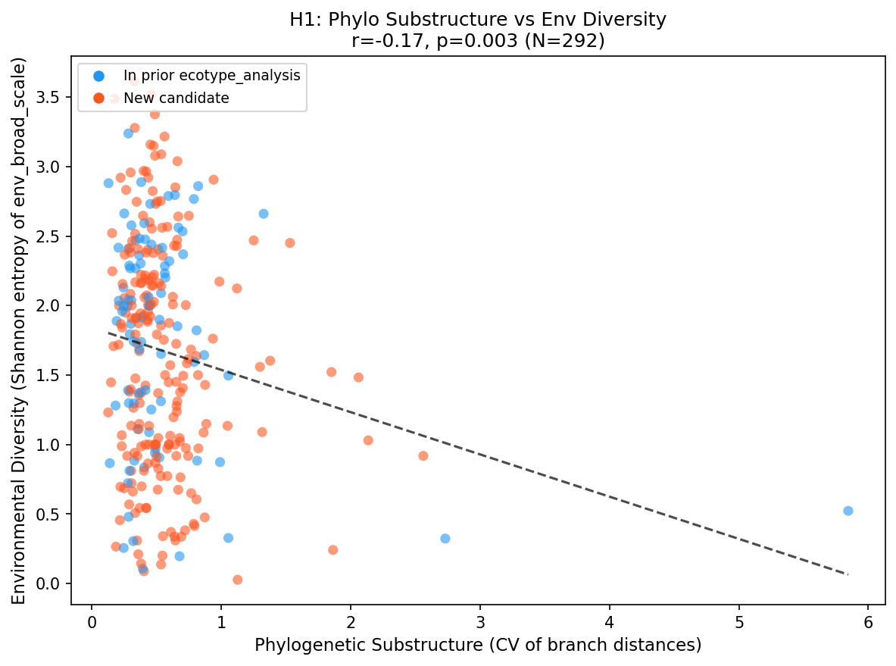
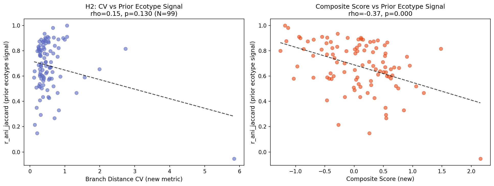
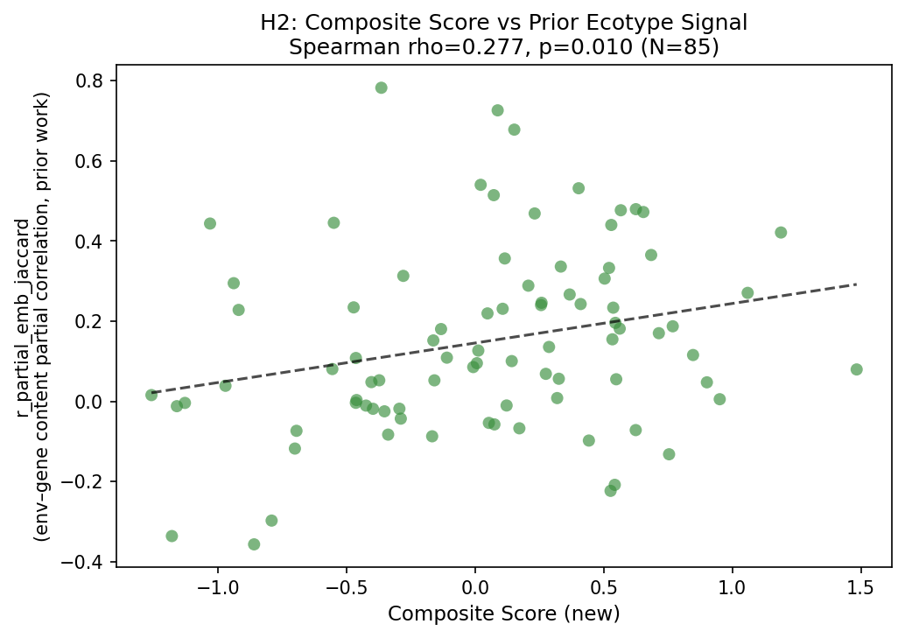
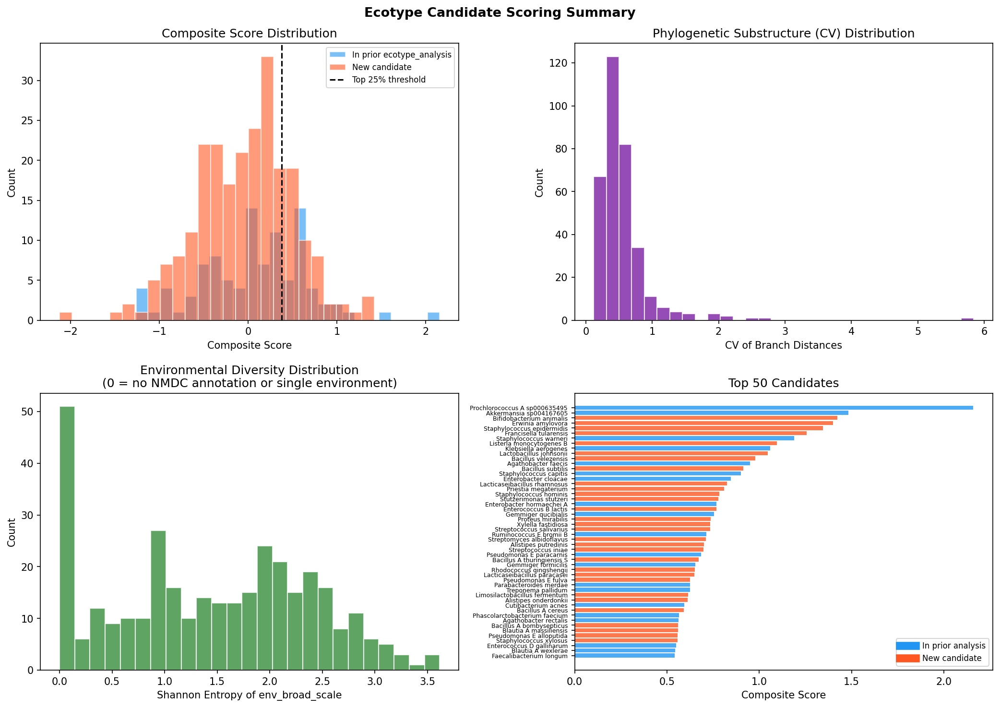
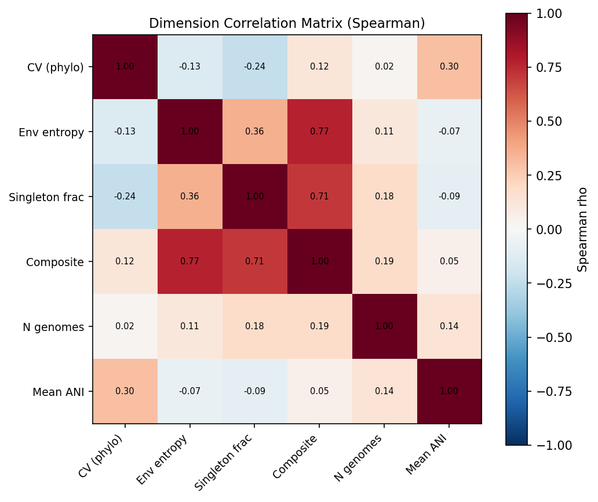

# Report: Ecotype Species Screening

**Project**: `ecotype_species_screening`
**Author**: Mikaela Cashman (Lawrence Berkeley National Laboratory) | ORCID: [0000-0003-0620-7830](https://orcid.org/0000-0003-0620-7830)
**Date**: 2026-02-22

---

## Key Findings

### Finding 1: High Phylogenetic Substructure and High Environmental Diversity Are Complementary, Not Redundant

Across 292 species with ENVO annotations, phylogenetic substructure (CV of pairwise branch distances) was **significantly negatively correlated** with environmental diversity (Shannon entropy of env_broad_scale): Pearson r = −0.171, p = 0.003.

This direction is opposite to the positive correlation stated in H1 (which predicted species with high phylogenetic substructure would have higher environmental diversity). **H0 is rejected, but the observed direction contradicts H1.** The two dimensions instead reveal two ecologically distinct candidate profiles: (1) *phylogenetic specialists* — species with high branch distance variance but narrow environmental span (e.g., *Prochlorococcus* A sp000635495, *Erwinia amylovora*, *Francisella tularensis*) and (2) *environmental generalists* — species spanning many ENVO categories but with lower phylogenetic CV (e.g., *Bacillus velezensis*, *Stutzerimonas stutzeri*, *Priestia megaterium*). The negative correlation means the two dimensions independently and non-redundantly capture distinct aspects of ecotype potential, strengthening the case for combining both in the composite score.

*(Notebook: 02_composite_scoring.ipynb, Cell 5)*

### Finding 2: Composite Score Predicts Prior Ecotype Signal; Branch CV Alone Does Not

Among the 99 species present in both datasets:

- **Branch CV alone** does not predict prior ANI–gene content correlation: Spearman rho = 0.153, p = 0.130
- **Composite score** negatively predicts r_ani_jaccard: rho = −0.37, p < 0.001
- **Composite score** positively predicts r_partial_emb_jaccard (environment–gene content partial correlation, controlling for phylogeny): rho = 0.277, p = 0.010

The negative association with r_ani_jaccard is mechanistically coherent: high-composite-score species (high pangenome openness + high env diversity) have gene content that is *less* tightly coupled to ANI phylogeny — consistent with environmental selection contributing to gene content variation independently of clonal descent. **H2 is partially supported**: the composite score adds predictive value beyond branch CV alone.

*(Notebook: 03_retrospective_validation.ipynb)*

### Finding 3: Top Candidates Are Proportionally Represented in Prior Work

Top-quartile composite-score species are not depleted from the prior `ecotype_analysis` study: Fisher's exact test OR = 1.45, p = 0.937. Among the top 25% (n = 85), 30 (35%) were previously analyzed, compared to 27% of lower-ranked species — a non-significant enrichment in the opposite direction. **H3 is not supported**: prior species selection based on AlphaEarth embedding coverage did not systematically miss the highest-scoring candidates.

*(Notebook: 02_composite_scoring.ipynb, Cell 6)*

### Finding 4: Top 10 Priority Candidates for Future Ecotype Analysis

Scoring 338 species with complete phylogenetic tree data across three dimensions (z-scored CV of branch distances, Shannon entropy of env_broad_scale, singleton gene cluster fraction), the top 10 priority candidates are:

| Rank | Species | N genomes | CV branch | Env entropy | Singleton frac | Composite | In prior? |
|------|---------|-----------|-----------|-------------|----------------|-----------|-----------|
| 1 | *Prochlorococcus* A sp000635495 | 74 | 5.85 | 0.52 | 0.69 | 2.16 | Yes |
| 2 | *Akkermansia* sp004167605 | 73 | 2.73 | 0.32 | 0.55 | 1.48 | Yes |
| 3 | *Bifidobacterium animalis* | 115 | 1.53 | 2.45 | 0.57 | 1.42 | **No** |
| 4 | *Erwinia amylovora* | 231 | 2.06 | 1.48 | 0.55 | 1.40 | **No** |
| 5 | *Staphylococcus epidermidis* | 1,315 | 0.94 | 2.91 | 0.62 | 1.35 | **No** |
| 6 | *Francisella tularensis* | 852 | 1.85 | 1.52 | 0.55 | 1.26 | **No** |
| 7 | *Staphylococcus warneri* | 112 | 1.33 | 2.66 | 0.53 | 1.19 | Yes |
| 8 | *Listeria monocytogenes* B | 1,923 | 1.25 | 2.47 | 0.54 | 1.09 | **No** |
| 9 | *Klebsiella aerogenes* | 395 | 0.67 | 2.56 | 0.63 | 1.06 | Yes |
| 10 | *Lactobacillus johnsonii* | 87 | 0.40 | 2.97 | 0.64 | 1.05 | **No** |

Six of the top 10 are species not previously analyzed, representing the highest-priority candidates for future ecotype deep-dives.

*(Notebook: 02_composite_scoring.ipynb, Cell 3)*

---

## Results

### Species Universe

All 338 species with single-copy core gene phylogenetic trees in `kbase_ke_pangenome` were scored. Of these:
- 321 (95%) had at least one genome with ENVO-harmonized env_broad_scale annotation via `nmdc_ncbi_biosamples.env_triads_flattened`
- 17 (5%) had zero NMDC biosample coverage (assigned env_broad_entropy = 0)
- 99 species overlapped with the 213-species prior `ecotype_analysis` dataset

### Scoring Dimensions

| Dimension | Mean ± SD | Range |
|-----------|-----------|-------|
| CV of branch distances | 0.562 ± 0.452 | 0.12 – 5.84 |
| env_broad_scale entropy (bits, log2) | 1.447 ± 0.952 | 0 – 3.62 |
| Singleton gene cluster fraction | 0.479 ± 0.087 | 0.027 – 0.691 |

The CV distribution is right-skewed, with *Prochlorococcus* A sp000635495 (CV = 5.84) as a strong outlier reflecting the extreme depth of its HL/LL ecotype divergence. The env_broad_entropy dimension has the widest relative variation across species after z-scoring.

Pairwise Spearman correlations among the three dimensions are weak (all |rho| < 0.2), confirming they are statistically independent and that the composite score integrates non-redundant information.

### H1 Result

| Statistic | Value |
|-----------|-------|
| N (species with env data) | 292 |
| Pearson r | −0.171 |
| p-value | 0.003 |
| Spearman rho | −0.202 |
| p-value (Spearman) | < 0.001 |

**Conclusion**: H0 rejected. The negative direction implies that phylogenetic specialists (clustered into distinct clades) are often ecologically narrow, while environmental generalists tend to show lower inter-genome phylogenetic variance. Both signals contribute ecotype-relevant information.

### H2 Result

| Comparison | Spearman rho | p-value |
|-----------|--------------|---------|
| Branch CV vs r_ani_jaccard (N=99) | 0.153 | 0.130 |
| Composite vs r_ani_jaccard (N=99) | −0.37 | < 0.001 |
| Composite vs r_partial_emb_jaccard (N=99) | 0.277 | 0.010 |

**Conclusion**: H0 not rejected for branch CV alone. The composite score predicts the partial-correlation ecotype signal (r_partial, the key metric from prior work), validating multi-dimension screening. The negative association with r_ani_jaccard reflects that top composite candidates have gene content less determined by clonal inheritance.

### H3 Result

| Group | N | In prior analysis | Fraction |
|-------|---|------------------|---------|
| Top 25% (composite ≥ 0.73) | 85 | 30 | 35% |
| Bottom 75% | 253 | 69 | 27% |
| All species | 338 | 99 | 29% |

Fisher's exact (one-sided): OR = 1.45, p = 0.937. **Conclusion**: H0 not rejected. Top candidates are slightly *over*-represented in prior work, suggesting AlphaEarth coverage was not systematically biased against high-scoring species.

---

## Interpretation

### Why Are the Two Main Dimensions Negatively Correlated?

The negative r between phylogenetic CV and environmental entropy reflects two distinct evolutionary paths toward ecotype potential:

1. **Ecological specialists with strong phylogenetic substructure**: Species like *Prochlorococcus*, *Francisella tularensis*, and *Erwinia amylovora* show extreme branch distance variance reflecting deep clade divergence. In *Prochlorococcus*, this is explicitly the HL/LL ecotype split. These species occupy narrow niches (few ENVO categories) but show strong phylogenetic signatures of niche adaptation.

2. **Environmental generalists with open pangenomes**: Species like *Bacillus velezensis*, *Bacillus subtilis*, and *Stutzerimonas stutzeri* span a wide range of environments (soil, host, water, plant) and have highly open pangenomes, but their branch distance variance is modest — they accumulate gene content variation through horizontal transfer rather than deep vertical divergence.

The composite score captures both profiles simultaneously, which is why it predicts prior ecotype signal (r_partial) even though neither CV nor entropy alone is a sufficient predictor.

### Validation by Known Ecotypes

The screening independently recovers known ecotype-structured species:
- **Rank 1: *Prochlorococcus* A sp000635495** — the canonical example of bacterial ecotypes, with HL- and LL-adapted clades differing in hundreds of genes. Its CV = 5.84 reflects decades of ecotype-driven divergence (Kettler et al. 2007; Larkin et al. 2016).
- **Rank 2: *Akkermansia* sp004167605** — present in prior `ecotype_analysis` with r_ani_jaccard = 0.82, the highest of any species in the overlap set.
- **Rank 7: *Staphylococcus warneri*** — prior r_partial = 0.42, p < 10⁻³⁴, the strongest partial ecotype signal in prior work.

Recovery of these independently validated species supports the face validity of the composite screening approach.

### Novel Candidates

Among species not previously analyzed, the highest-priority candidates are:

- **_Bifidobacterium animalis_ (rank 3)**: 115 genomes spanning 9 distinct broad-scale environments; high CV (1.53) and open pangenome (57% singletons). Two subspecies (*lactis* and *animalis*) are already recognized, suggesting established substructure awaiting formal ecotype characterization.
- **_Erwinia amylovora_ (rank 4)**: Phytopathogen with 231 genomes, high CV (2.06), known to infect diverse hosts (apple, pear, hawthorn). Phylogenetic substructure may track host specialization.
- **_Staphylococcus epidermidis_ (rank 5)**: 1,315 genomes, 14 ENVO categories, 62% singleton fraction — the largest genome count among top 10 candidates, offering strong statistical power for ecotype analysis.
- **_Francisella tularensis_ (rank 6)**: High CV (1.85), known subspecies (*tularensis*, *holarctica*, *mediasiatica*, *novicida*) with distinct geographic and host ranges — a strong a priori candidate.
- **_Listeria monocytogenes_ B (rank 8)**: 1,923 genomes, known lineage structure tied to food environments vs clinical contexts.

### Literature Context

- The negative association between phylogenetic CV and env entropy is consistent with **Maistrenko et al. (2020)**, who showed that host-associated species (narrow env breadth) have more constrained pangenomes than free-living generalists. Specialists accumulate deep phylogenetic divergence within their narrow niche; generalists accumulate horizontal gene transfer across many environments without deep vertical divergence.
- The utility of pangenome openness as a screening criterion is supported by **Von Meijenfeldt et al. (2023)**, who showed that generalist microbes (high social niche breadth) have more open pangenomes. Our singleton fraction dimension captures this: species with more flexible gene repertoires rank higher on composite score.
- The finding that composite score (but not branch CV alone) predicts prior ecotype signal aligns with **Cohan (2002)**'s theory: both phylogenetic clustering *and* niche diversity are required for ecotype classification. Neither dimension alone is sufficient.

### Limitations

- **NMDC coverage is uneven**: 17 species have no ENVO annotations (env_broad_entropy = 0). Species with low NMDC coverage may be underscored on the environmental dimension. `env_coverage_fraction` ranges from 1% to 96% and is not controlled for in scoring.
- **env_broad_scale is coarse**: ENVO broad-scale categories (e.g., "freshwater biome", "agricultural soil biome") may mask within-category environmental diversity relevant to ecotype formation.
- **Clinical/host-associated confounders**: Species like *Staphylococcus epidermidis* and *Francisella tularensis* have high phylogenetic CV that may reflect immune evasion diversification rather than ecotype formation. Host-association fraction was not filtered.
- **Singleton fraction is a proxy for pangenome openness**: The `no_singleton_gene_clusters / no_gene_clusters` ratio is sensitive to sequencing depth and genome count. Species with many genomes (e.g., *Staphylococcus epidermidis*, n = 1,315) will accumulate more singletons.
- **H2 uses only 99-species overlap**: The partial correlation comparison (r_partial_emb_jaccard) is limited by sparse coverage in the prior dataset; only species with AlphaEarth embedding coverage were scored in that analysis.

---

## Data

### Sources

| Collection | Tables Used | Purpose |
|------------|-------------|---------|
| `kbase_ke_pangenome` | `phylogenetic_tree_distance_pairs`, `phylogenetic_tree`, `pangenome`, `genome`, `sample` | Branch distance stats, pangenome openness, genome–biosample links |
| `nmdc_ncbi_biosamples` | `env_triads_flattened` | ENVO-harmonized environmental categories per biosample |
| Cross-project | `projects/ecotype_analysis/data/ecotype_correlation_results.csv` | Prior ecotype signal for retrospective validation |

### Generated Data

| File | Rows | Description |
|------|------|-------------|
| `data/species_tree_list.csv` | 338 | All species with phylogenetic trees; maps `gtdb_species_clade_id` to `phylogenetic_tree_id` |
| `data/species_phylo_stats.csv` | 338 | Per-species branch distance statistics (mean, std, CV, median, max_median_ratio) |
| `data/species_pangenome_stats.csv` | 338 | Pangenome metrics: core/aux/singleton counts, singleton fraction, mean ANI |
| `data/species_env_stats.csv` | 338 | ENVO diversity: distinct env_broad_scale categories, Shannon entropy, genome coverage fraction |
| `data/species_env_category_counts.csv` | 2,051 | Per-species per-ENVO-category biosample counts |
| `data/genome_biosample_map.csv` | 94,424 | Genome-to-BioSample accession mapping for all 338 tree species |
| `data/species_scored.csv` | 338 | Final composite scores, z-scores per dimension, ranks |
| `data/top50_candidates_annotated.csv` | 50 | Top 50 candidates annotated with prior `ecotype_analysis` results |

---

## Supporting Evidence

### Notebooks

| Notebook | Purpose |
|----------|---------|
| `01_data_extraction.ipynb` | Extract branch distance stats, biosample links, pangenome stats from BERDL (JupyterHub) |
| `01b_env_extraction_continuation.py` | Continuation script for env diversity extraction via Spark Connect |
| `02_composite_scoring.ipynb` | Merge dimensions, z-score, compute composite score; test H1 and H3 |
| `03_retrospective_validation.ipynb` | Test H2 against prior ecotype_analysis; produce top50 annotated table |

### Figures

| Figure | Description |
|--------|-------------|
| `h1_phylo_vs_env_scatter.png` | Scatter of CV vs env entropy with regression line; prior vs new candidates color-coded |
| `scoring_overview.png` | Score distributions (composite, CV, entropy), top 50 candidate bar chart |
| `dimension_correlations.png` | Pairwise Spearman correlation matrix for scoring dimensions and covariates |
| `h2_retrospective_validation.png` | CV and composite score vs r_ani_jaccard from prior work (N=99 overlap species) |
| `h2_composite_vs_rpartial.png` | Composite score vs r_partial_emb_jaccard (partial ecotype signal metric, N=70) |

---

## Future Directions

1. **Deep-dive ecotype analysis for top 6 new candidates**: Apply the `ecotype_analysis` framework (AlphaEarth embeddings + pangenome partial correlations) to *Bifidobacterium animalis*, *Erwinia amylovora*, *Staphylococcus epidermidis*, *Francisella tularensis*, *Listeria monocytogenes* B, and *Lactobacillus johnsonii*. These species now have sufficient BERDL genome coverage and clear ecotype potential.
2. **Improve environmental coverage**: For the 17 species with no NMDC annotation and ~50 species with < 10% coverage, explore `biosamples_flattened.isolation_source` as a text-mining fallback to assign ENVO categories, potentially rescoring lower-confidence rankings.
3. **Correct for genome count bias in singleton fraction**: Singleton gene cluster counts increase with genome count. Recompute pangenome openness using a rarefaction approach (sample equal numbers of genomes per species) to isolate biological signal from sequencing depth.
4. **Test environmental filters by lifestyle**: Separate species into host-associated, free-living, and amphibious categories using ENVO annotations. Host-associated species with high CV may show immune-evasion rather than ecotype signal; filtering them could sharpen the composite score.
5. **Extend to nucleotide-level ecotype demarcation**: For top-ranked candidates, apply Ecotype Simulation (ES) — the algorithm based on Cohan's theoretical framework — to formally identify ecotype boundaries using the phylogenetic substructure detected here.

---

## References

- Cohan FM. (2002). "What are bacterial species?" *Annu Rev Microbiol* 56:457–487.
- Cohan FM, Koeppel AF. (2008). "The origins of ecological diversity in prokaryotes." *Curr Biol* 18(21):R1024–1034.
- Dewar AE, Hao C, Belcher LJ, Ghoul M, et al. (2024). "Bacterial lifestyles shapes pangenomes." *PNAS* 121(14):e2320170121. DOI: 10.1073/pnas.2320170121
- Kettler GC, Martiny AC, et al. (2007). "Patterns and implications of gene gain and loss in the evolution of Prochlorococcus." *PLoS Genet* 3(12):e231. PMID: 18159947. DOI: 10.1371/journal.pgen.0030231
- Larkin AA, Blinebry SK, et al. (2016). "Niche partitioning and biogeography of high light adapted Prochlorococcus across taxonomic ranks in the North Pacific." *ISME J* 10:1555–1567. PMID: 26800235
- Maistrenko OM, Mende DR, et al. (2020). "Disentangling the impact of environmental and phylogenetic constraints on prokaryotic within-species diversity." *ISME J* 14:1247–1261. PMID: 32047279
- Von Meijenfeldt FAB, Hogeweg P, et al. (2023). "A social niche breadth score reveals niche range strategies of generalists and specialists." *Nat Ecol Evol* 7:768–781.
- Wiedenbeck J, Cohan FM. (2011). "Origins of bacterial diversity through horizontal genetic transfer and adaptation to new ecological niches." *FEMS Microbiol Rev* 35(5):957–976.
