# Report: ENIGMA Carbon Census — A Tiered Knowledge Census of 83 Enrichment Compounds

## Key Findings

### 1. The census is mostly dark: 74 of 83 compounds have no isolate-level utilizer call

The governing result is a gap, not a coverage claim. Of 83 compounds (59 SSO-groundwater + 24 necromass), all 83 resolved to structures (InChIKey via PubChem), 54 linked to KEGG, but only **9 are "callable"** (review I1: callable = an ENIGMA-isolate utilizer call **or** a Tier-1 measured RB-TnSeq carbon-source fitness experiment). Eight are callable on an `enigma_isolate_call` basis (≥1 ENIGMA-isolate prediction with a catabolic, compound-degrading reaction in a genome); a ninth — **lauric acid** — is callable on a `measured_fitness` basis: it has a Tier-1 measured carbon-source growth experiment in the Fitness Browser, confirmed structurally by an InChIKey re-match (NB02c). Lauric acid's Fitness Browser organism is a reference bacterium, **not** an ENIGMA isolate, so the ENIGMA-isolate deliverable (a) is unchanged. The remaining **74/83 (89%) are organism-dark**: the genetic determinants of their utilization are **not linkable via the queried BERDL and curated resources**. This is *resource-darkness*, not proof of absence from science — class-level catabolic literature exists for several of these compounds (e.g. monoterpenes, nicotine), and the project's own literature-rescue channel (NB02b) returned zero only because it used a shallow PubMed-*title* screen, which is a method floor rather than evidence of absence (see Limitations). This dark list, stratified by reason and chemical class, is the actionable enrichment-design output — it separates *not-linkable-here* compounds (candidate discovery targets) from the small *characterize-known* set, and a literature/PaperBLAST pass would reclassify some of the dark set.

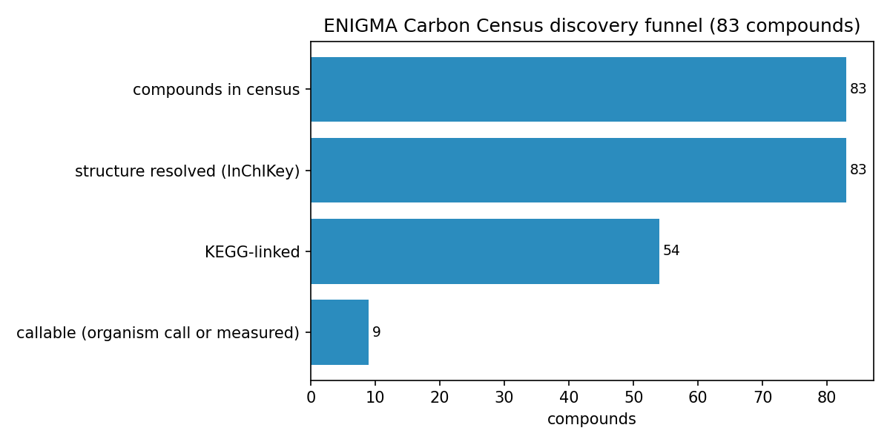

The funnel: 83 compounds → 83 structure-resolved → 54 KEGG-linked → **9 callable**; 74 organism-dark.

Organism-dark breakdown by bucket (post-I1, 74 compounds; NB09 Part 4): `KEGG-linked/no-reaction-in-genomes` 33, `fully-orphan (no KEGG)` 29, `biosynthesis-known/catabolism-unknown` 6, `only-generic-reactions` 6. By class, the dark set is dominated by exactly the predicted classes: Alkaloids, Shikimates/Phenylpropanoids, Terpenoids, and Fatty acids. The dark fraction is nearly identical across sources (groundwater 53/59 = 90%, necromass 21/24 = 88%), so darkness is a chemical-class property, not a sampling-source artifact.

*(Notebooks: 01_identity_resolution, 02_pathway_linkage, 02b_linkage_deepening, 02c_fb_inchikey_rematch, 03_organism_mapping, 08_synthesis, 09_deepening)*

### 2. H1 (coverage gradient by chemical class) — not formally supported (underpowered); directional only

The 9 callable compounds are overwhelmingly **pollutant-adjacent aromatics**: salicylic acid, 3-hydroxybenzoic acid, 4-hydroxybenzaldehyde, phthalic acid, terephthalic acid (all Shikimates/Phenylpropanoids), plus Phenylethylamine and xanthine (Alkaloids), Abscisic acid (Terpenoid, a single 2-strain call), and lauric acid (Fatty acid, on a measured_fitness basis only — review I1). One caveat on this set: **xanthine is mis-scored as carbon-catabolic** — its allowlisted reaction R02107 (xanthine→urate, xanthine oxidase) is the purine pathway, which is **nitrogen acquisition, not carbon catabolism**, so the carbon-callable set is effectively **8, not 9** (see Limitations). The aromatic/phthalate concentration is unaffected. The apparent direction matches the prediction — callables cluster in the aromatic/phthalate subset that curated biodegradation knowledge and KEGG cover. But the **pre-registered null (uniform coverage across classes) is not rejected**: a χ² test on the 8 `enigma_isolate_call` callables by class (Shikimates 5/25, Alkaloids 2/26, Terpenoids 1/17, Fatty acids 0/10, Polyketides 0/2, AA/Peptides 0/2, mixed 0/1) gives **χ²=5.07, p=0.53 (df=6)**; adding the single measured-fitness lauric acid (Fatty acids 1/10) does not change the verdict. With only ~9 callables across 83 compounds the design is underpowered to detect a class gradient, and the directional pattern is further **confounded with annotation coverage** (which classes KEGG/ModelSEED/genome_depot annotate) rather than a clean biological degradability gradient. **Verdict: H1 not formally supported.** The per-class Tier-0 list remains a useful descriptive enrichment-design deliverable, which does not require H1 to hold.

*(Notebook: 08_synthesis)*

### 3. H2 (cross-module modularity) — not supported beyond a shared aromatic funnel

Among the 8 `enigma_isolate_call` capacities across genomes carrying ≥1 capacity, catabolic versatility is right-skewed (mean ~1.19, median 1, max 4 capacities per genome). NB05 first reported co-occurrence with the **φ coefficient**, but φ compresses toward zero when a capacity is rare (most are present in tens-to-hundreds of 3109 genomes), which can hide a real multiplicative enrichment. Review I4 (NB05b) recomputes two interpretable effect sizes per pair from the saved 2×2 counts — a **Haldane-corrected odds ratio + 95% CI** and the **Jaccard index** — with no Spark re-run.

The effect sizes **sharpen but do not overturn** the verdict. By pair class: within-aromatic median OR 1.12 (3/10 pairs with CI entirely > 1, median Jaccard 0.026); within-other median OR 7.43 (1/3, but driven by Haldane correction on near-zero counts); and the genuine modularity test — **cross-block** pairs (distinct lower pathways) — median OR 2.28 with 4/15 CI > 1 but **median Jaccard ≈ 0**. The one biologically real cross-block signal the OR surfaces (and φ hid) is **phenylethylamine co-occurring with aromatic-funnel acids**: 4-hydroxybenzaldehyde + phenylethylamine OR 2.84 (95% CI 1.49–5.40, q=0.035, n11=11); phthalic acid + phenylethylamine OR 3.37 (95% CI 1.46–7.75, q=0.071, n11=6). This is **expected and mechanistically coherent**, because phenylethylamine is itself an aromatic-derived substrate (deaminated to phenylacetate, then the *paa*/phenylacetyl-CoA route), so versatile aromatic degraders tend to carry both. Crucially the **Jaccard stays ≈ 0.04** even for these enriched pairs — only ~4% of genomes with either capacity carry both — and only **25 of 3109 genomes (0.8%)** carry both an aromatic and a non-aromatic capacity. **Verdict: no broad cross-module modularity**; the one positive signal is itself aromatic-derived, i.e. co-occurrence *within* the broad aromatic-catabolism phenotype, not modular co-assembly of mechanistically-distinct modules. What *is* supported is phylogenetic concentration — Burkholderiales dominate utilizer counts, and high-versatility genera (Polaromonas, Alcaligenes, Burkholderia, Paraburkholderia, Comamonas, Hydrogenophaga) cluster in that order.

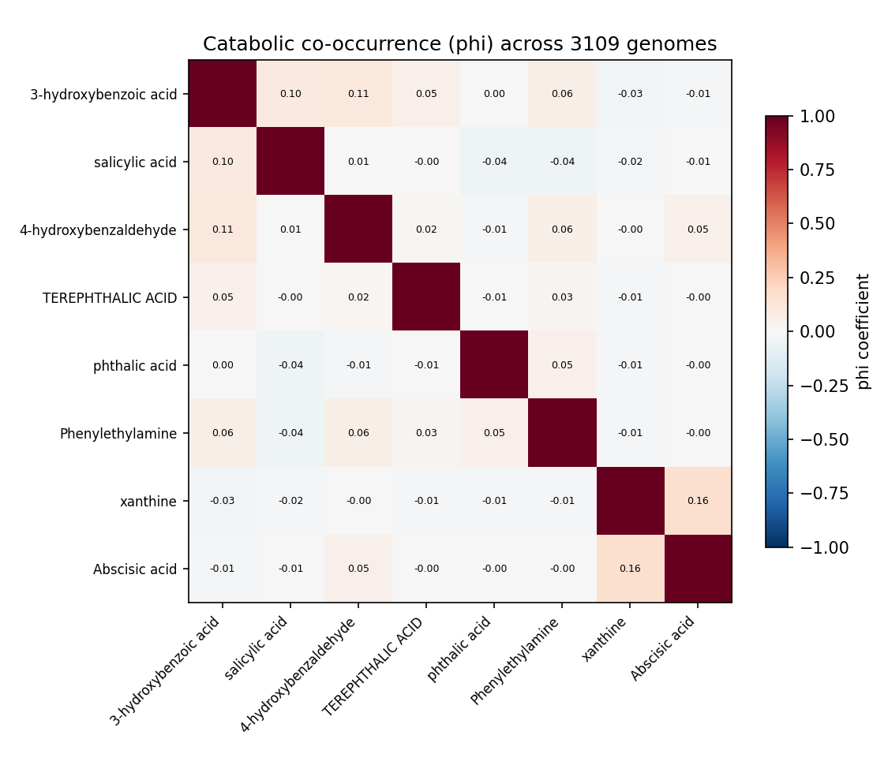
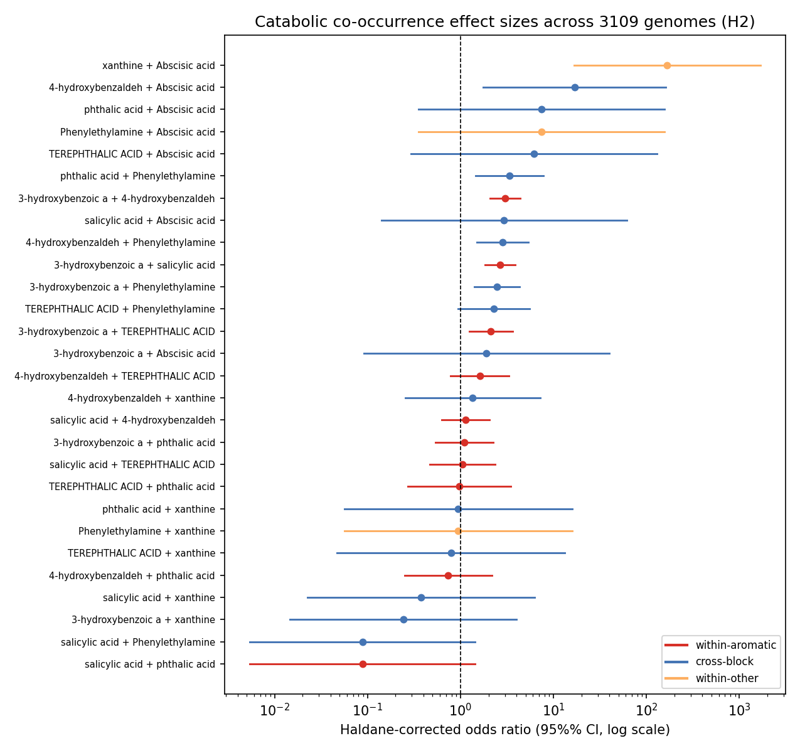
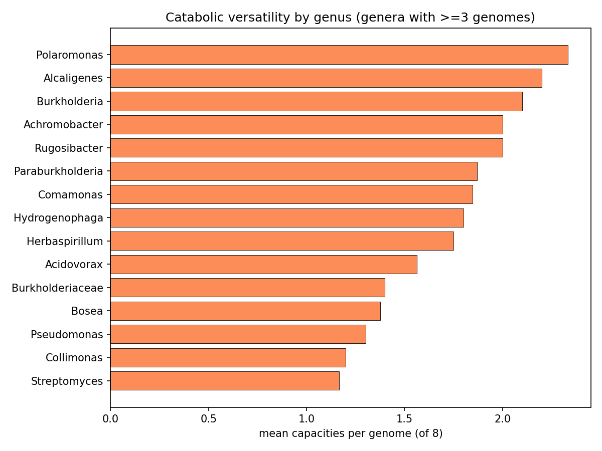

*(Notebooks: 05_cooccurrence, 05b_cooccurrence_effects)*

### 4. H3 (source-tracking: groundwater vs necromass) — untestable / confounded, reported as such

Of the 8 ENIGMA-isolate-callable compounds, only 2 are necromass-sourced (terephthalic + phthalic acid), and both are phthalate-class aromatics with Actinomycetota-heavy utilizers. (The 9th callable, lauric acid, is also necromass but has no ENIGMA-isolate utilizers and no field data, so it adds nothing to the source contrast.) Source is therefore inseparable from chemical class at n=2 — there is no honest statistical contrast to run. Rather than fabricate a confounded result, NB07 was reframed as a straight SSO field-occurrence atlas (Zhou Lab 16S, `enigma_coral` bricks): 62 of the implicated utilizer genera are observed in the SSO field at genus resolution, with top field prevalences ~0.7–0.9 for the aromatic utilizers (e.g. 3-hydroxybenzoic-acid utilizers at 0.90 field prevalence).

*(Notebook: 07_environmental_atlas)*

### 5. Deliverables (a) + (b): tier-stratified isolate predictions, phylogenetically concentrated

**Deliverable (a)** — 569 ENIGMA-isolate utilizer prediction rows across the 8 ENIGMA-isolate-callable compounds (lauric acid, callable only on measured fitness, has no ENIGMA-isolate rows). The aromatics carry the bulk: salicylic acid 129 strains, 3-hydroxybenzoic acid 127, 4-hydroxybenzaldehyde 125; terephthalic acid 34; phthalic acid 36; Phenylethylamine 28; xanthine 13; Abscisic acid 2. (The "34 all high-certainty" for terephthalic acid is a single-reaction-signature artifact, not a strength — see below and Limitations.)

**Deliverable (b)** — 494 strain placements on the GTDB taxonomy (359 distinct strains), each carrying a tier × certainty score: 64 high-certainty (gene-complete pathway, Tier 2), 387 medium (Tier 2 pathway), 43 medium (Tier 3 signature enzyme). Utilizers concentrate in **Pseudomonadota / Burkholderiales**, with Pseudomonadales and Sphingomonadales contributing to specific compounds (e.g. Sphingomonadales 47 strains for 4-hydroxybenzaldehyde).

**H4 verdict (tier-stratified, phylogenetically concentrated isolate predictions per compound): partially supported — strongly for the 8 ENIGMA-isolate-callable compounds, null for the other 75.** The 8 callable-with-isolate compounds each yield a tier-stratified prediction set that concentrates phylogenetically (Pseudomonadota/Burkholderiales, with compound-specific Sphingomonadales/Pseudomonadales contributions), exactly as H4 predicted. The remaining 75 are Tier 0 with no isolate-level placement, so H4 is null there. (Lauric acid, the 9th callable, qualifies only on measured RB-TnSeq fitness in a reference bacterium and contributes no ENIGMA-isolate phylogenetic prediction, so it sits outside both arms.)

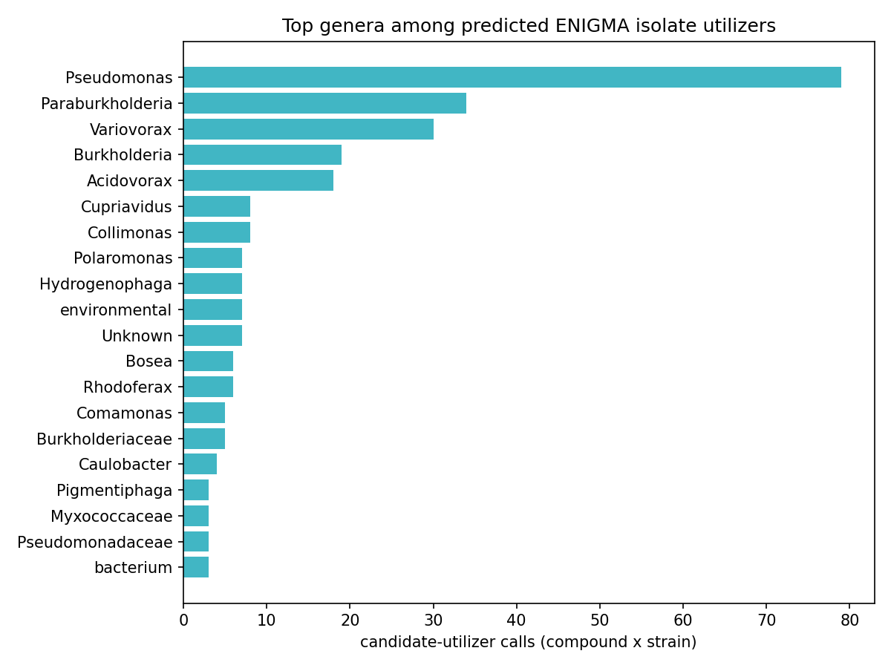
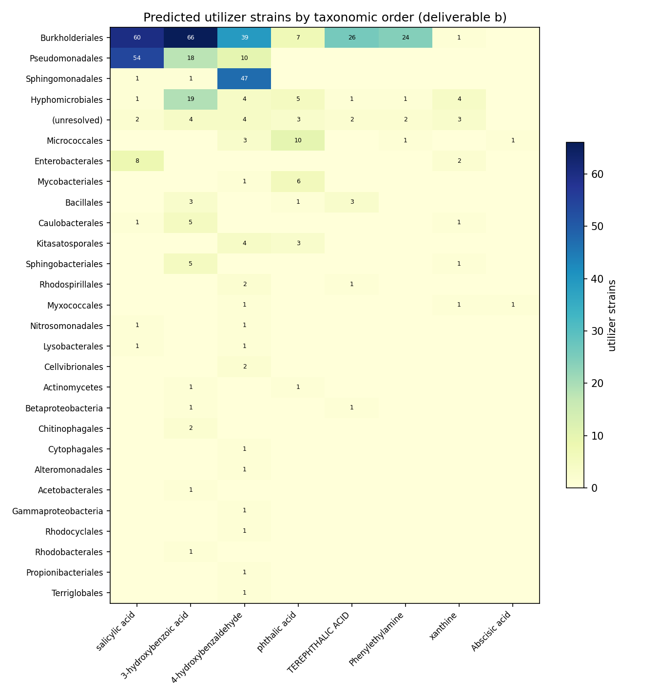
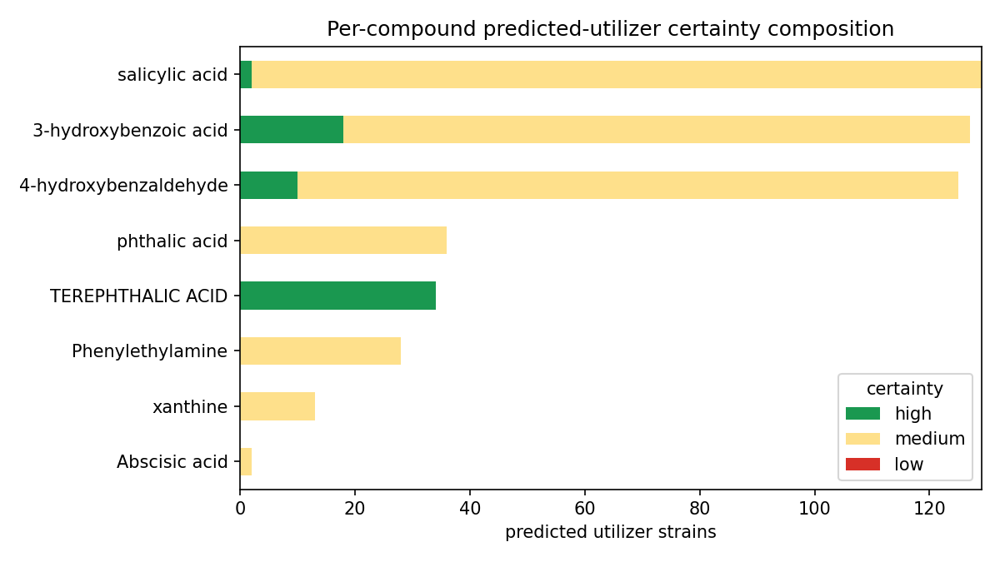

*(Notebooks: 04_enigma_utilizers, 06_phylo_maps)*

### 6. Deliverable (c), global arm: a cross-environment abundance atlas for the 86 implicated genera

Beyond the local SSO field atlas, the implicated utilizer genera were placed across global environments — terrestrial/freshwater (NMDC, `kbase.nmdc_arkin`) and marine (Planet Microbe, as a contrast). **This is a biome-abundance proxy, not catabolic activity**: no environmental dataset measures the census compounds, so genus abundance indicates where the *organisms* live, not where the *compounds are degraded*.

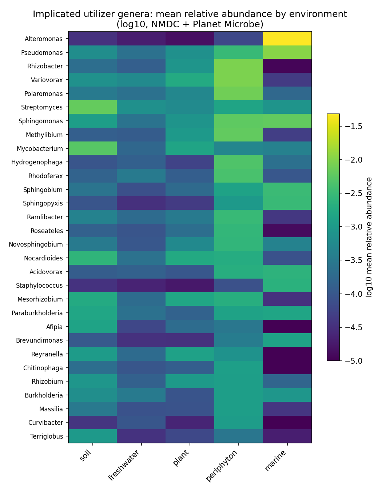

NMDC scale: **3825 taxonomy-bearing metagenomes** (denominator = covstats files with taxonomy), 83/86 genera detected in 1719 metagenomes, **99% sample-labeled** via two independent ontologies (ENVO MIxS triad + GOLD ecosystem path). Macro-environment distribution: soil 2260, freshwater 723, periphyton 472, plant 119, sediment 42.

Soil-vs-freshwater abundance contrast (**exploratory** — see Limitations) recovers textbook biogeography: soil-enriched genera are classic soil taxa (Mycobacterium log2 +5.09, Terriglobus +5.29, Nitrobacter +4.79, Afipia, Streptomyces, Nocardioides, Mesorhizobium), and freshwater-enriched genera are aquatic Betaproteobacteria (Cellvibrio log2 −2.19, Curvibacter, Rhodoferax, Comamonas, Acidovorax). The newly surfaced **periphyton** class (freshwater biofilms: epilithon/epipsammon/epiphyton) is a strong reservoir — Burkholderiales/Comamonadaceae (Rhizobacter, Variovorax, Polaromonas, Methylibium, Sphingomonas, Hydrogenophaga) at ~96–97% prevalence and mean relative abundance ~0.005–0.009.

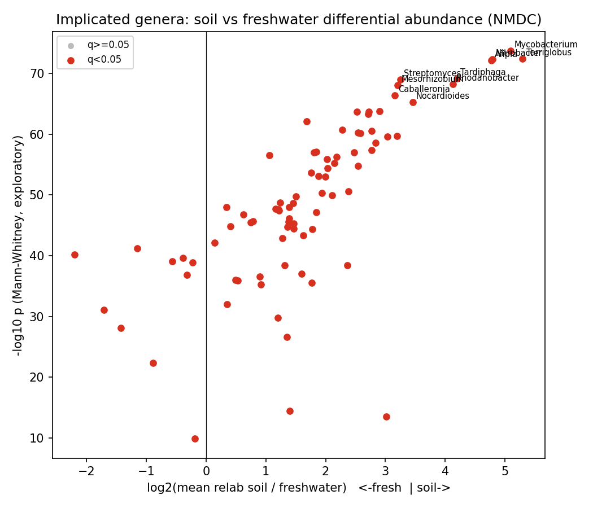

**Label-free outlier discovery** (the most defensible signal, robust to label noise): top genus×sample relative-abundance spikes occur in periphyton (Nocardioides 0.43 in epipsammon, Hydrogenophaga 0.28 in epiphyton) and soil (Mycobacterium 0.22). Outliers peak in periphyton (34 genera) and soil (32).

Marine (Planet Microbe, 302 runs): 68/68 listed genera show positive abundance, but marine is **mostly a negative biome contrast** — terrestrial/freshwater genera sit at ~1e-3 to 1e-4 in open ocean. Genuine marine members are the exception (Alteromonas 0.048 in 240/302 runs, prevalence 0.79; cosmopolitan Pseudomonas 0.011, Sphingomonas 0.0063).

*(Notebook: 07b_environmental_atlas_global)*

### 7. Bioavailability/physicochemistry is a ceiling on the atlas: callable compounds are smaller and simpler (directional, underpowered)

NB09 Part 1 resolves PubChem physicochemical descriptors for all 83 compounds and contrasts callable vs dark. **With only n=9 callable this is directional, not inferential** (Mann–Whitney, reported as direction + uncorrected p). Callable compounds are consistently **smaller and structurally simpler** than dark ones: median Complexity 133 vs 207 (p=0.034), MolecularWeight 152 vs 179 (p=0.066), HeavyAtomCount 11 vs 13 (p=0.057), with directionally higher polarity (TPSA 57 vs 41, H-bond donors 2 vs 1). The honest reading is that this is at least as much an **annotation-coverage ceiling** as a biological-bioavailability one — simple, common, pollutant-adjacent aromatics are exactly the molecules KEGG/ModelSEED/genome_depot annotate, so "callable" tracks structural simplicity partly because the knowledge base does. Notably there is **no physicochemical separation between groundwater and necromass** compounds (all contrasts p>0.14), reinforcing that source does not predict chemistry here.

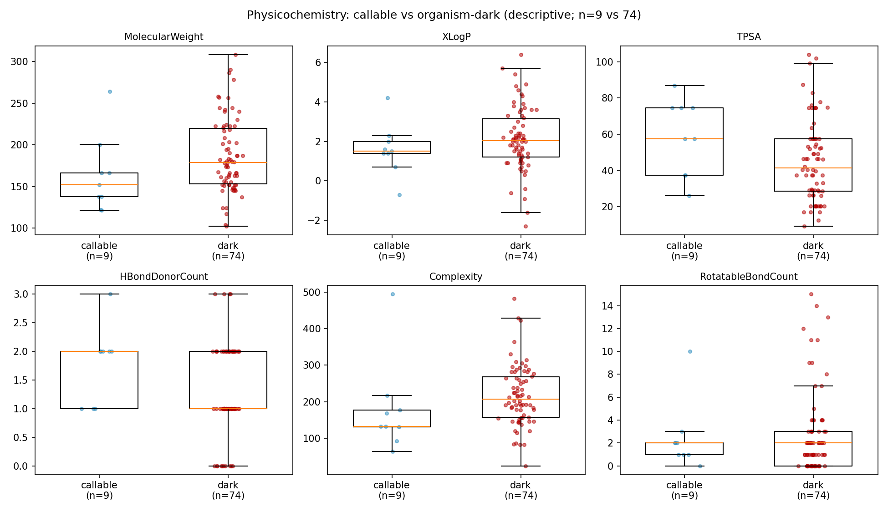
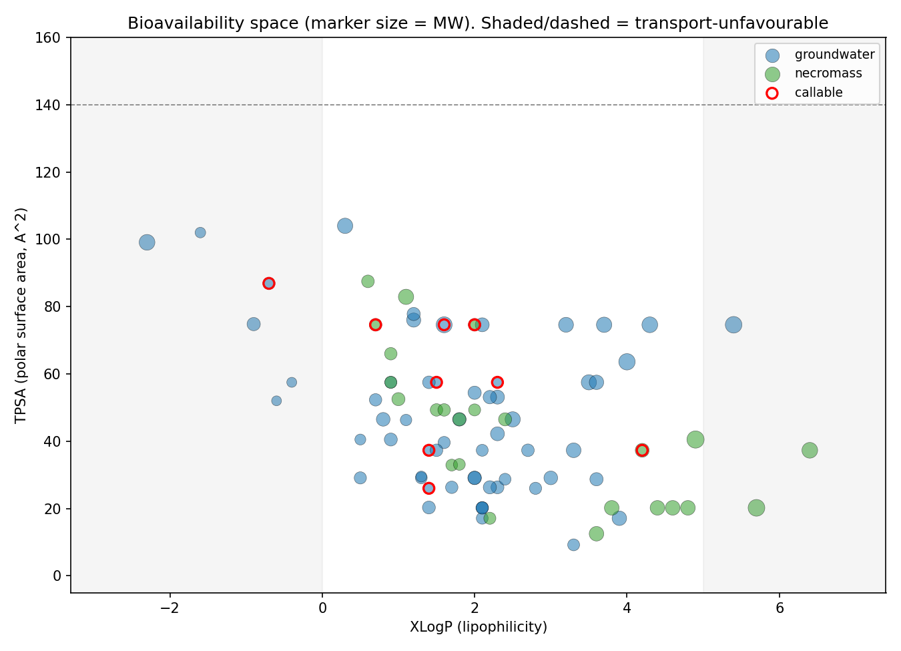

*(Notebook: 09_deepening)*

### 8. The callable phenotype is a specialist clade trait, not a portable generalist module set

NB09 Part 2 transposes the deliverable to genomes. Of genomes carrying ≥1 of the 8 aromatic/alkaloid capacities, **675 are specialists** (exactly 1 capacity) and only **18 are generalists** (≥3; max 4). Generalist chassis concentrate in **Paraburkholderia (5), Burkholderia (4), Hydrogenophaga (2)** and scattered Burkholderiaceae — the same clade that dominates the versatility ranking, confirming versatility is a *clade trait*, not a widely portable module. All callable evidence is catabolic-direction by construction of the NB03 filter (846 Tier-2 pathway + 102 Tier-3 signature genome-compound calls; biosynthetic-only signatures are excluded and land in the dark set). Part 3 (per-clade conservation) shows compound-specific clade specialization rather than a shared generalist toolkit. **These conservation fractions are denominated over depot genomes that already carry some catabolic call — not a census of all genomes of each genus — so they describe within-called-set specialization, not absolute prevalence:** e.g. Castellaniella and Hylemonella carry 3-hydroxybenzoic-acid capacity in ~100% of such genomes, Sphingomonads (Novosphingobium/Sphingobium) carry 4-hydroxybenzaldehyde capacity at ~92–100%, Paenarthrobacter carries phthalic-acid capacity at 100%, and Comamonas spans both 3-hydroxybenzoate (92%) and 4-hydroxybenzaldehyde (85%). Capacity breadth across the chassis is led by 3-hydroxybenzoic acid (296 genomes, 53 genera) and salicylic acid (197 genomes, 28 genera); Abscisic acid is a 2-genome edge case.

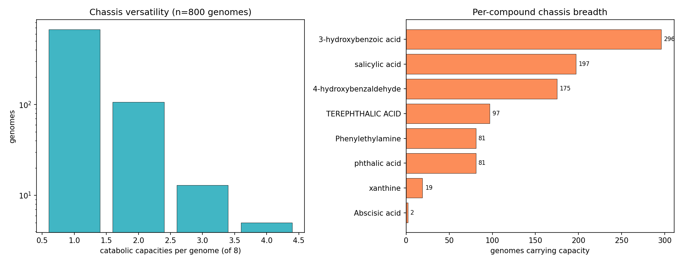
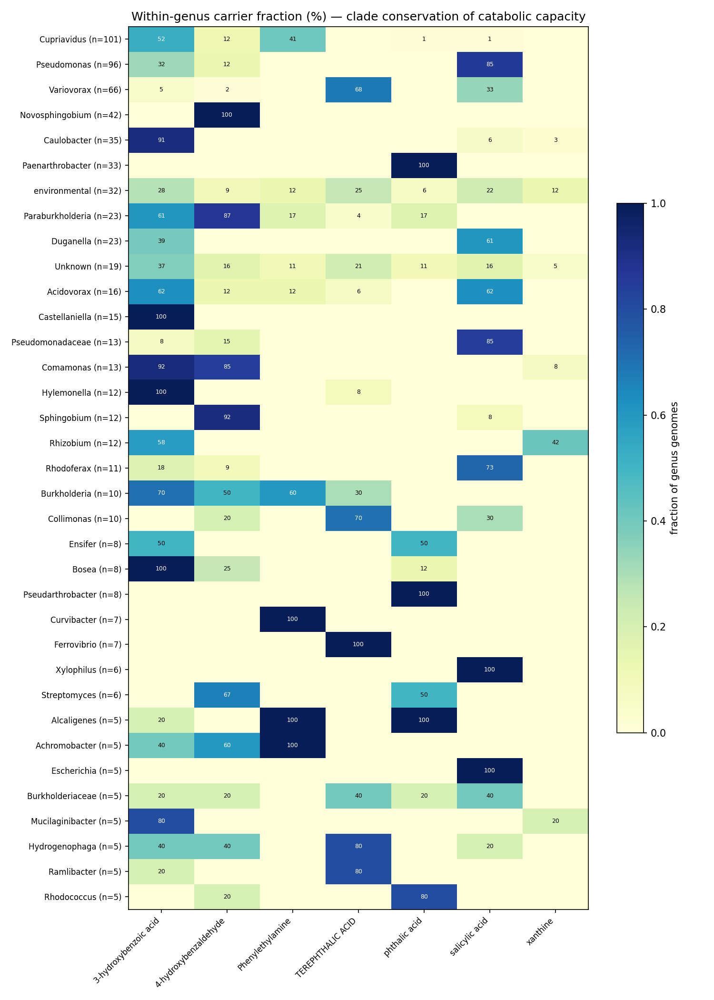

*(Notebook: 09_deepening)*

### 9. The dark set has structure: 6 biosynthesis-known compounds are MIBiG-consult targets, not true orphans

NB09 Part 4 taxonomizes the 74 organism-dark compounds (post-I1) into four buckets: **33** KEGG-linked but no reaction in any queried genome, **29** fully orphan (no KEGG link at all), **6** biosynthesis-known/catabolism-unknown, and **6** only-generic-reactions. The 6 **biosynthesis-known** compounds — **Tyramine, guanidineacetic acid, cinnamic acid, caffeic acid, palmitic acid, farnesol** — have annotated *biosynthetic*-direction signatures but no catabolic call, which is exactly the profile to triage against MIBiG/biosynthetic literature before committing to discovery enrichment (flagged as an **external** consult; MIBiG was not queried in BERDL). The 29 fully-orphan compounds (no KEGG link) are the hardest discovery targets and skew necromass-heavy (13/24 necromass vs 16/59 groundwater are orphan). This per-bucket structure is the operational refinement of the headline gap: it ranks the 74 dark compounds by *why* they are dark and therefore by how to attack them.

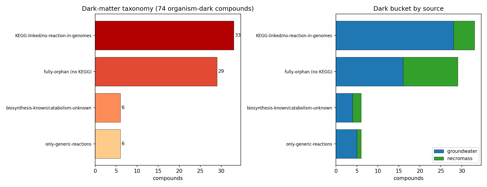

*(Notebook: 09_deepening)*

## Discoveries

- The ENIGMA Carbon Census is **~89% organism-dark** (74/83 compounds with no isolate utilizer call) — the actionable product of a knowledge census can be the map of ignorance, and that map is biased exactly by chemical class (alkaloids/terpenoids dark, aromatics callable), not by sampling source (groundwater 90% vs necromass 88% dark).
- Callable catabolic capacity among these compounds is **phylogenetically concentrated in Burkholderiales** and is a **specialist** trait: 675 single-capacity genomes vs only 18 generalists (≥3 capacities). Cross-module co-occurrence is near-zero in share terms (Jaccard ≈ 0; only 25/3109 genomes carry both an aromatic and a non-aromatic capacity), even though a Haldane odds ratio surfaces a modest phenylethylamine×aromatic enrichment (OR ≈ 2.8–3.4) that is itself aromatic-derived — so versatility is a clade trait, not a portable module set.
- **Directional only (n=9 callable, uncorrected p):** "callable" tracks **structural simplicity** — callable compounds have median Complexity 133 vs 207 for dark (Mann–Whitney p=0.034, uncorrected) — and this is at least partly an annotation-coverage ceiling, since simple pollutant-adjacent aromatics are the molecules curated catabolism resources cover.
- The dark set is **not uniformly orphan**: 6 dark compounds (Tyramine, guanidineacetic acid, cinnamic acid, caffeic acid, palmitic acid, farnesol) are biosynthesis-known/catabolism-unknown — MIBiG-consult triage targets distinct from the 29 fully-orphan (no-KEGG) compounds.
- A **periphyton (freshwater-biofilm) ENVO/GOLD class**, separated out from bulk freshwater, surfaces a Comamonadaceae/Burkholderiales reservoir at ~97% prevalence that bulk-water labels hide — relevant for siting SSO-relevant enrichments.

## Performance Notes

- Both NMDC covstats and Planet Microbe `taxonomy.name` are **species-level**; any genus-level abundance claim requires species→genus aggregation first. Filtering on bare genus names silently matches only near-zero genus-rank reference rows (the bug that first showed 0/68 marine genera). Any project doing genus-level abundance over `covstats_taxonomy_rollup` or Planet Microbe `run_to_taxonomy` needs this rollup.
- The NMDC abundance denominator is the set of covstats files that actually carry taxonomy (**3825**), not the larger `sample_file_lookup` row count (~6700) — using the lookup count deflates relative abundances by ~1.75×.
- Sample-level environment labels come from `nmdc_metadata.biosample_set` (joined to covstats `sample_id` via `kbase.nmdc_arkin.sample_file_lookup`), which gives 99% coverage across two ontologies — far better than `study_table` GOLD alone (~13%).

## Results

### The callable-compound table (the table a wet-lab planner reads)

| Compound | Source | NPC pathway | Best tier | n strains (a) | n high-cert | n genera (b) | n field genera (c) | top field prev |
|---|---|---|---|---|---|---|---|---|
| salicylic acid | groundwater | Shikimates/Phenylpropanoids | T2_3_reaction | 129 | 2 | 24 | 20 | 0.86 |
| 3-hydroxybenzoic acid | groundwater | Shikimates/Phenylpropanoids | T2_3_reaction | 127 | 18 | 42 | 33 | 0.90 |
| 4-hydroxybenzaldehyde | groundwater | Shikimates/Phenylpropanoids | T2_3_reaction | 125 | 10 | 34 | 25 | 0.86 |
| phthalic acid | necromass | Shikimates/Phenylpropanoids | T2_3_reaction | 36 | 0 | 15 | 12 | 0.75 |
| terephthalic acid | necromass | Shikimates/Phenylpropanoids | T2_3_reaction | 34 | 34 | 17 | 10 | 0.67 |
| Phenylethylamine | groundwater | Alkaloids | T2_3_reaction | 28 | 0 | 11 | 7 | 0.61 |
| xanthine † | groundwater | Alkaloids | T3_kegg | 13 | 0 | 6 | 4 | 0.75 |
| Abscisic acid | groundwater | Terpenoids | T2_3_reaction | 2 | 0 | 1 | 1 | 0.02 |
| lauric acid ‡ | necromass | Fatty acids | T1_measured | 0 | 0 | 0 | 0 | — |

† xanthine is mis-scored: its allowlisted reaction R02107 (xanthine→urate) is the purine **nitrogen** pathway, not carbon catabolism. The carbon-callable set is effectively 8 (see Limitations). The NB03 carbon allowlist has since been corrected to exclude R02107; the committed tables still list xanthine because they predate that fix and were not regenerated.

‡ lauric acid is callable on a `measured_fitness` basis only (review I1 / NB02c): it has a Tier-1 measured carbon-source fitness experiment in the Fitness Browser whose organism is a reference bacterium, **not** an ENIGMA isolate — so it carries no ENIGMA-isolate strains/genera/field rows and does not appear in deliverable (a).

### Headline numbers

| Metric | Value |
|---|---|
| Compounds in census | 83 |
| Structure-resolved (InChIKey) | 83 |
| KEGG-linked | 54 |
| Callable (isolate call OR measured fitness) | 9 (8 enigma_isolate_call + 1 measured_fitness) |
| Organism-dark (discovery targets) | 74 (89%) |
| Utilizer strains placed (b) | 359 (64 high-certainty) |
| Utilizer genera in SSO field (c) | 62 |
| NMDC taxonomy-bearing metagenomes (global c) | 3825 |
| Implicated genera detected in NMDC | 83/86 (1719 metagenomes) |
| Planet Microbe runs / genera positive | 302 / 68 of 68 |

## Interpretation

The census behaves as a knowledge product over natural-product secondary metabolites should: catabolic knowledge in the queried resources is real and deep for the **aromatic/phthalate** subset and absent for most alkaloids and terpenoids. **Six of the eight** callable compounds route through well-characterized aromatic catabolism (salicylate, the hydroxybenzoates/-aldehyde, and the two phthalates converging on protocatechuate/catechol and the β-ketoadipate pathway), which is why their utilizers are numerous and phylogenetically concentrated; the remaining two do **not** — phenylethylamine enters the phenylacetyl-CoA (*paa*) ring-cleavage route, and xanthine is a purine (nitrogen) pathway mis-included here. The 75 dark compounds are not a failure of method — they are the deliverable: they name where genetic determinants of carbon use are not linkable in these resources and where enrichment is the candidate route to discovery.

The environmental atlas adds *where to look*, with an honest ceiling. Because no environmental dataset measures the compounds, the global atlas reports **biome occupancy of the implicated genera**, not catabolic flux. The signal is biologically coherent (soil generalists in soil, aquatic Betaproteobacteria in freshwater, a Comamonadaceae periphyton reservoir, terrestrial taxa rare in open ocean), which validates the **taxonomic/abundance pipeline** — that genus calls and ENVO/GOLD labels are sound — but it does *not* validate the upstream compound→pathway→organism inference, and it cannot claim that any genus degrades a census compound in any sampled environment.

### Literature Context

- The aromatic convergence onto the **β-ketoadipate / protocatechuate–catechol** funnel is the canonical bacterial route for hydroxybenzoates, salicylate, and phthalates (Harwood & Parales, *Annu. Rev. Microbiol.* 1996), consistent with this census finding that the six callable aromatics share one lower pathway and therefore co-occur within the aromatic block. Phenylethylamine instead routes via amine oxidation to phenylacetate and the phenylacetyl-CoA (*paa*) pathway (Hanlon et al., *Microbiology* 1997) — mechanistically separate, which is why its cross-block co-occurrence signal (Finding 3) is not part of the β-ketoadipate funnel.
- **Burkholderiales / Comamonadaceae** dominance is best supported specifically for phthalate/terephthalate catabolism (Pérez-García et al. 2025, above), matching the versatility ranking (NB05). The freshwater-biofilm/periphyton enrichment of this clade is reported here primarily on the project's own NB07b abundance data (~97% prevalence in periphyton samples) rather than a single comparative-microbiology citation, and should be read as this project's observation pending a targeted literature anchor.
- **Terephthalate/phthalate** catabolism is the best-characterized necromass aromatic here — terephthalate proceeds via terephthalate dioxygenase to protocatechuate, concentrated in Pseudomonadota (Ideonella/Comamonas) and actinobacterial degraders (Pérez-García et al., *Microbiol. Mol. Biol. Rev.* 2025) — consistent with the phthalate call set (though the terephthalic "all-high" certainty is a single-reaction-signature artifact, not strong evidence; see Limitations).

### Novel Contribution

What this census adds beyond what any single database states: (1) a unified, **tier-stratified** linkage from 83 named compounds → structures → pathways → ENIGMA isolate strains → GTDB phylogeny → SSO field occurrence → global biome abundance, with the gap (Tier 0) treated as a first-class result; (2) a **quantified dark-fraction** (89%, 74/83) with per-class, per-reason structure to drive enrichment prioritization; (3) a **periphyton-resolved** abundance reservoir for the implicated genera that bulk-environment labels obscure.

### Limitations

- **The soil-vs-freshwater enrichment p/q-values are exploratory and not calibrated.** Each metagenome is treated as an independent observation in a rank test over compositional, zero-inflated relative abundances; with thousands of non-independent samples this inflates significance massively (all 83 genera reach q<0.05, many at q~1e-70). The *direction and rank* of the contrast are trustworthy and biologically sensible; the *p-values are not* and should not be quoted as calibrated significance. The label-free outlier mode (Arm B) is the more defensible discovery signal.
- **Abundance ≠ activity.** No environmental dataset measures the census compounds; the entire global atlas is a biome-occupancy proxy. A genus being enriched in soil does not mean it degrades the compound there.
- **H3 is genuinely untestable** with these compounds (n=2 necromass callables, fully confounded with phthalate chemistry) — reported as such rather than forced.
- **Catabolic-direction filter dependence.** The 8 `enigma_isolate_call` callables rest on a genome-prevalence-<10% signature-reaction filter that keeps a reaction only if it is catabolic *for the compound* (KEGG degradation map membership or a 3-reaction curated allowlist). A different filter would move the callable/dark boundary; the dark fraction is conditional on this choice. The 9th callable (lauric acid) is on an independent `measured_fitness` basis and is not subject to this filter.
- **Callable-vs-dark physicochemical contrasts are underpowered.** With only n=9 callable, the NB09 Part 1 contrasts (callable compounds smaller/simpler) are **directional only**, reported with uncorrected Mann–Whitney p-values; they should be read as descriptive, not as calibrated significance.
- **Xanthine is a category error in a *carbon* census.** Its allowlisted reaction R02107 (xanthine→urate, xanthine oxidase) is the purine pathway, i.e. nitrogen acquisition, not carbon catabolism (Huynh & Stewart, *Adv. Microb. Physiol.* 2023; Newell et al., *J. Bacteriol.* 2022). A bacterial *carbon* route for purines exists but is a distinct anaerobic gene cluster this project does not score. The carbon-callable set is therefore effectively **8** (of the 9 callable). R02107 has now been removed from the carbon allowlist in `build_nb03.py`; the committed deliverable tables still include xanthine because they were not regenerated after the fix, but a re-run of NB03→NB04→NB08 would drop it.
- **Resource-darkness ≠ scientific darkness.** "Organism-dark" means not linkable via the queried BERDL/curated resources, not unknown to science. Class-level catabolic literature exists for monoterpenes (Marmulla & Harder, *Front. Microbiol.* 2014) and alkaloids such as nicotine (Huang et al., *Front. Microbiol.* 2020); NB02b's zero literature-rescues reflect a PubMed-title-only screen, not absence of evidence. A PaperBLAST/abstract-level pass would likely reclassify part of the dark set.
- **"High-certainty" is not comparable across compounds.** `sig_completeness` is the fraction of each compound's *own* signature reactions a genome carries, so a single-reaction signature (terephthalic acid, 1 required reaction) trivially scores 1.0 ("high") for any carrier, while a 3-reaction signature (phthalic acid) cannot. The "terephthalic 34/34 high" headline is therefore the *weakest* completeness call, not the strongest. Read certainty as the raw `n_sig_carried / n_required` (reported in `phylo_utilizer_map.tsv`), not the normalized fraction.
- **Marine arm is small and gene-blind** (302 PM runs; presence/abundance only), suitable only as a negative biome contrast.
- The pangenome↔ENIGMA taxonomic bridge is genus-level at best; isolate-specific transfer of pangenome Tier-2 reconstructions is avoided in favor of direct genome_depot annotation.

## Data

### Sources
| Collection | Tables Used | Purpose |
|------------|-------------|---------|
| PubChem (external) | PUG-REST | Name → CID → InChIKey/SMILES + KEGG/ChEBI/ModelSEED cross-refs (identity resolution) |
| ModelSEED biochemistry | compound/reaction/enzyme | Compound → reaction → enzyme linkage (Tier 2/3) |
| `kbase_ke_pangenome` | functional annotations (KEGG/EC/eggNOG) | Enzyme presence across GTDB species pangenomes; null denominator (3109 genomes) |
| `kescience_fitnessbrowser` | RB-TnSeq carbon-source experiments | Measured utilization (Tier 1 channel) |
| `enigma_genome_depot_enigma` | `browser_protein`↔`_kegg_reactions`/`_kegg_orthologs`/`_ec_numbers`, `browser_gene`→`browser_genome`→`browser_strain`→`browser_taxon` | Catabolic annotations directly on ENIGMA isolate proteins; isolate→strain→NCBI-taxid crosswalk (deliverables a, b) |
| `enigma` (SSO field) | Zhou Lab 16S, `enigma_coral` bricks | SSO field genus occurrence (deliverable c, local) |
| `kbase.nmdc_arkin` + `nmdc_metadata` | `covstats_taxonomy_rollup`, `sample_file_lookup`, `biosample_set` | Terrestrial/freshwater genus abundance + ENVO/GOLD env labels (deliverable c, global) |
| `planetmicrobe.planetmicrobe` | `run_to_taxonomy`, `taxonomy`, `run`/`experiment`/`sample`/`project`/`campaign` | Marine genus abundance contrast (deliverable c, global) |

### Generated Data
| File | Rows | Description |
|------|------|-------------|
| `data/resolved_compounds.tsv` | 83 | Compound → InChIKey/SMILES + DB cross-refs |
| `data/compound_linkage.tsv` / `_deepened.tsv` | 83 | Per-compound pathway/enzyme linkage + tier |
| `data/compound_organism_predictions.tsv` | 948 | Pathway/enzyme → organism predictions |
| `data/compound_organism_dark.tsv` | 75 | Organism-dark compounds + reason (pre-I1; lauric acid reclassified callable downstream, leaving 74 dark in the master table) |
| `data/fb_inchikey_matches.tsv` | 1 | NB02c structural (InChIKey) FB carbon-source Tier-1 match: lauric acid |
| `data/enigma_utilizer_predictions.tsv` | 569 | Deliverable (a): per-compound ENIGMA isolate utilizers |
| `data/phylo_utilizer_map.tsv` | 494 | Deliverable (b): strain placements + certainty |
| `data/cooccurrence_matrix.tsv` | 28 | H2 pairwise co-occurrence (φ, p, q) |
| `data/cooccurrence_effects.tsv` | 28 | H2 effect sizes (review I4): Haldane OR + 95% CI, Jaccard, per pair |
| `data/compound_physicochem.tsv` | 83 | NB09: PubChem physicochemical descriptors (MW, XLogP, TPSA, complexity, …) |
| `data/dark_matter_taxonomy.tsv` | 74 | NB09: post-I1 dark compounds bucketed (orphan / no-reaction / biosynthesis-known / generic) |
| `data/environmental_atlas.tsv` | 156 | Deliverable (c) local: SSO field genus occurrence |
| `data/env_atlas_global.tsv` | 400 | Deliverable (c) global: genus × biome abundance (NMDC + PM) |
| `data/env_enrichment_soil_fresh.tsv` | 83 | Soil-vs-freshwater abundance contrast (exploratory) |
| `data/env_outlier_samples.tsv` | 249 | Label-free top genus×sample abundance spikes |
| `data/census_master_summary.tsv` | 83 | One row per compound: the master census table |

## Supporting Evidence

### Notebooks
| Notebook | Purpose |
|----------|---------|
| `00_compound_profile.ipynb` | Load xlsx; profile 83 compounds (class, source, MW/LogP) |
| `01_identity_resolution.ipynb` | Name → PubChem CID → InChIKey/SMILES + cross-refs |
| `02_pathway_linkage.ipynb` / `02b_linkage_deepening.ipynb` | Compound → pathway/enzyme, multi-channel + Phase-1 gate |
| `02c_fb_inchikey_rematch.ipynb` | Review I1: structural (name→PubChem→InChIKey) re-match of FB Tier-1 carbon-source experiments |
| `03_organism_mapping.ipynb` | Pathway/enzyme → organisms; catabolic-direction filter |
| `04_enigma_utilizers.ipynb` | Deliverable (a): ENIGMA isolate utilizer table |
| `05_cooccurrence.ipynb` | H2: within/cross-block co-occurrence + versatility |
| `05b_cooccurrence_effects.ipynb` | Review I4: Haldane OR + CI and Jaccard effect sizes from saved counts |
| `06_phylo_maps.ipynb` | Deliverable (b): GTDB strain placements + certainty |
| `07_environmental_atlas.ipynb` | Deliverable (c) local: SSO field occurrence atlas |
| `07b_environmental_atlas_global.ipynb` | Deliverable (c) global: NMDC + Planet Microbe abundance atlas |
| `08_synthesis.ipynb` | Assemble three deliverables + gap map; master table (callable = isolate call OR measured fitness, I1) |
| `09_deepening.ipynb` | Physicochemistry/bioavailability, chassis specialists/generalists, per-clade conservation, dark-matter taxonomy |

### Figures
| Figure | Description |
|--------|-------------|
| `00_class_composition.png`, `00_mw_logp.png` | Compound class composition and MW/LogP space |
| `02_linkage_coverage.png`, `02b_linkage_deepened.png` | Pathway-linkage coverage by class |
| `03_organism_calls.png` | Organism-mapping call counts |
| `04_utilizer_genera.png` | Deliverable (a) utilizer genera |
| `05_cooccurrence.png`, `05_genus_versatility.png`, `05_versatility.png` | H2 co-occurrence and versatility |
| `05b_odds_ratio_forest.png` | H2 effect sizes: Haldane OR + 95% CI forest plot by pair class (I4) |
| `06_phylo_order_map.png`, `06_certainty_composition.png` | Deliverable (b) phylogeny and certainty |
| `07_field_occurrence.png` | SSO field occurrence (local atlas) |
| `07b_env_atlas_heatmap.png`, `07b_soil_fresh_enrichment.png` | Global biome abundance atlas + soil/fresh contrast |
| `08_funnel.png` | Discovery funnel (83 → callable) |
| `09a_physicochem_callable_dark.png`, `09a_bioavailability_space.png` | Callable-vs-dark physicochemistry; bioavailability space |
| `09b_chassis.png` | Chassis specialists/generalists + capacity breadth |
| `09c_clade_conservation.png` | Per-clade (genus × compound) carrier-fraction conservation |
| `09d_dark_taxonomy.png` | Dark-matter taxonomy: 74 dark compounds by bucket and source |

## Future Directions

1. **Wet-lab the dark set first, triaged by bucket.** The 74 organism-dark compounds are discovery-mode enrichment targets, now ranked by *why* they are dark (NB09 Part 4): start the hardest **29 fully-orphan (no-KEGG)** compounds — especially the necromass-heavy alkaloids/terpenoids — with anonymous community enrichment + metagenomics; treat the **6 biosynthesis-known** compounds (Tyramine, guanidineacetic acid, cinnamic acid, caffeic acid, palmitic acid, farnesol) as a separate **MIBiG/biosynthetic-literature consult** before committing wet-lab effort.
2. **Promote Tier 5→3 via literature mining.** Targeted PaperBLAST/PubMed mining for alkaloid/terpenoid catabolic enzymes, searched back into the genomes, would convert some dark compounds to callable without new experiments.
3. **Calibrate the environmental contrast properly.** Replace the per-sample rank test with a study-aware mixed model (or sample-level permutation respecting study structure) to get defensible enrichment statistics rather than the current exploratory ranking.
4. **Periphyton-sited enrichment.** The Comamonadaceae periphyton reservoir suggests freshwater-biofilm inocula for the aromatic-utilizer enrichments.

## References
See `references.md` for the full list. Core data sources: PubChem (Kim et al., *Nucleic Acids Res.* 2023); KBase (Arkin et al., *Nat. Biotechnol.* 2018); Fitness Browser / RB-TnSeq (Price et al., *Nature* 2018); GTDB (Parks et al., *Nucleic Acids Res.* 2022); ModelSEED (Henry et al., *Nat. Biotechnol.* 2010); NMDC (Eloe-Fadrosh et al., *Nat. Microbiol.* 2022); Planet Microbe (Ponsero et al., *GigaScience* 2021); aromatic catabolism (Harwood & Parales, *Annu. Rev. Microbiol.* 1996).
