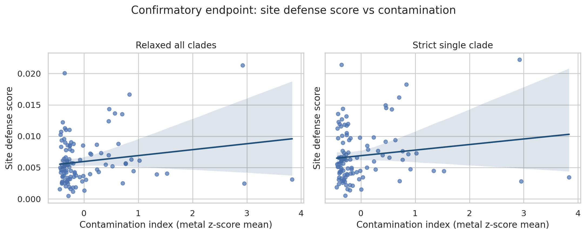
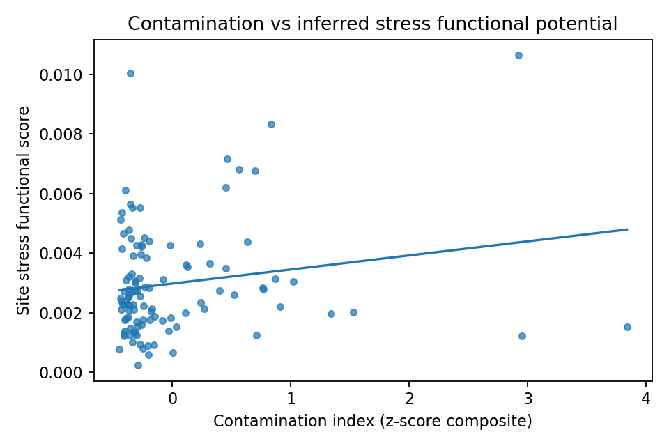
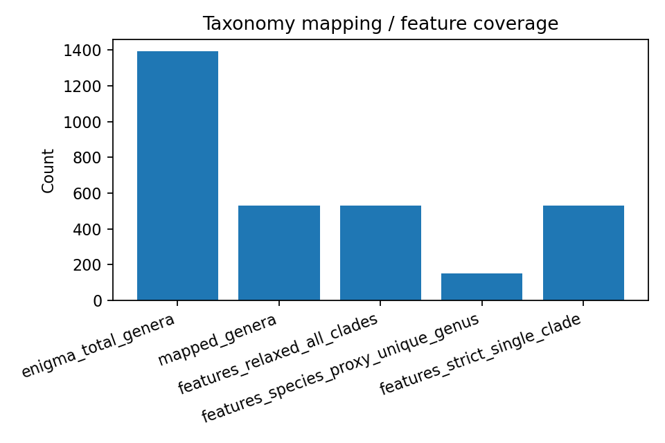
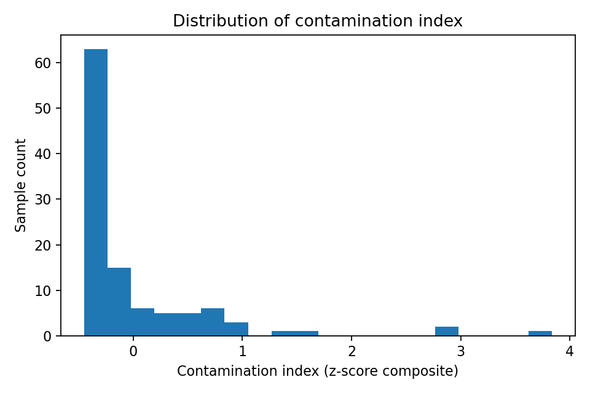

# Report: Contamination Gradient vs Functional Potential in ENIGMA Communities

## Key Findings

### Multiplicity and sample-size context (primary panel)
Model-family sample counts from `data/model_family_sample_counts.tsv` frame how much data each analysis used:

| Mode | Base Spearman n | Adj+Cov n | Adj+Fraction n | High-coverage subset n |
|---|---:|---:|---:|---:|
| `relaxed_all_clades` | 108 | 108 | 212 (sample-fraction rows) | 68 |
| `strict_single_clade` | 108 | 108 | 212 (sample-fraction rows) | 68 |
| `species_proxy_unique_genus` | 108 | 108 | 212 (sample-fraction rows) | 1 |

This keeps exploratory interpretation calibrated: coverage-aware models increase effective rows (fraction-level), while species-proxy high-coverage tests are underpowered (`n=1`).

*(Notebook: `03_contamination_functional_models.ipynb`; data: `model_family_sample_counts.tsv`)*

### Confirmatory Spearman tests remain null with confidence intervals and global FDR
Predeclared confirmatory tests (`site_defense_score` Spearman vs contamination in genus-level modes) remained non-significant:

- `relaxed_all_clades`: rho = 0.0587, 95% bootstrap CI [-0.128, 0.250], Spearman p = 0.546, FDR q = 0.862
- `strict_single_clade`: rho = 0.0682, 95% bootstrap CI [-0.111, 0.253], Spearman p = 0.483, FDR q = 0.849

Compact summary table (`data/confirmatory_family_summary.tsv`), where Spearman columns are confirmatory and adjusted-model columns are exploratory sensitivity analyses:

| Mode | Endpoint | n | Confirmatory Spearman rho (95% CI) | Confirmatory Spearman p / q | Exploratory Adj+Cov beta (95% CI) | Exploratory Adj+Cov p / q |
|---|---|---:|---|---|---|---|
| `relaxed_all_clades` | `site_defense_score` | 108 | 0.0587 [-0.128, 0.250] | 0.546 / 0.862 | 0.000751 [0.000224, 0.001779] | 0.000398 / 0.0462 |
| `strict_single_clade` | `site_defense_score` | 108 | 0.0682 [-0.111, 0.253] | 0.483 / 0.849 | 0.000640 [0.000169, 0.001538] | 0.00354 / 0.130 |

*(Notebook: `03_contamination_functional_models.ipynb`)*

### Exploratory defense signal remains strongest in coverage-aware models
Exploratory sensitivity models still show strongest positive defense associations in coverage-aware adjustments:
- Coverage-adjusted OLS (`contamination + depth + latitude + longitude + mapped_abundance_fraction`):
  - `relaxed_all_clades`: beta = 0.000751, 95% bootstrap CI [0.000224, 0.001779], p = 0.000398, FDR q = 0.0462
  - `strict_single_clade`: beta = 0.000640, 95% bootstrap CI [0.000169, 0.001538], p = 0.00354, FDR q = 0.130
- Fraction-aware adjusted model (`contamination + mapped_abundance_fraction + C(community_fraction_type)`):
  - `relaxed_all_clades`: beta = 0.000607, 95% bootstrap CI [0.000213, 0.001221], p = 0.00144, FDR q = 0.0838
  - `strict_single_clade`: beta = 0.000566, 95% bootstrap CI [0.000214, 0.001113], p = 0.00548, FDR q = 0.130
- High-coverage subset (`mapped_abundance_fraction >= 0.25`):
  - `site_defense_score`: Spearman p = 0.0207 (relaxed), 0.00980 (strict)
  - After global FDR: q = 0.301 (relaxed), 0.189 (strict)

Most non-defense outcomes remained non-significant in these sensitivity tests, with one exploratory exception:
- `strict_single_clade`, high-coverage subset (`mapped_abundance_fraction >= 0.25`), `site_stress_score`: Spearman rho = 0.2489, p = 0.0407.

### Community-fraction robustness does not show strong within-fraction monotonic signal
To address potential confounding from collapsing multiple community fractions, NB03 now retains `community_fraction_type` parsed from `sdt_community_name` and runs fraction-aware robustness analyses.

- Fraction-aware adjusted models use `n = 212` sample-fraction rows (106 for `0.2_micron_filter`, 106 for `10_micron_filter`).
- Within-fraction Spearman tests for defense were non-significant:
  - `relaxed_all_clades`: p = 0.767 (`0.2` micron), p = 0.898 (`10` micron)
  - `strict_single_clade`: p = 0.780 (`0.2` micron), p = 0.793 (`10` micron)

This supports the conclusion that strong monotonic defense signal is not robustly reproducible inside individual fraction strata.

*(Notebook: `03_contamination_functional_models.ipynb`)*

### Contamination-index sensitivity does not change confirmatory outcome
Confirmatory endpoint was re-tested under four contamination index variants:
- Composite all-metals (current primary index)
- Uranium-only
- Top-3 variance metals
- PCA first component of metal z-scores

Across both confirmatory mapping modes, all index variants remained non-significant after FDR (`q = 0.546` across the 8 confirmatory-variant tests), including uranium-only.

*(Notebook: `03_contamination_functional_models.ipynb`; data: `contamination_index_sensitivity.tsv`)*

### Species-proxy resolution sensitivity is limited by mapped coverage
To approximate higher taxonomic resolution despite ENIGMA taxonomy stopping at genus, NB02 added `species_proxy_unique_genus` mode (only genera mapping to exactly one GTDB species clade).

- Unique-clade genera: 150 (vs 530 mapped genera total)
- Ambiguous multi-clade genera: 380
- Mean mapped abundance fraction in species-proxy mode: 0.031 (vs 0.343 in strict/relaxed)
- `site_defense_score` trend is positive but not significant: rho = 0.169, Spearman p = 0.081
- No high-coverage subset test was feasible at the existing threshold (`mapped_abundance_fraction >= 0.25`) due low retained coverage.

This suggests that with current ENIGMA taxonomy granularity, stricter taxonomic resolution sharply reduces analyzable signal and does not strengthen inference yet.

Coverage diagnostics from upstream outputs:
- 1,392 ENIGMA genera observed
- 530 mapped genera, 862 unmapped genera
- Of mapped genera, 150 were unique-clade (species-proxy resolvable) and 380 were multi-clade ambiguous
- Bridge table rows: 8,242 (many-to-many genus-to-clade expansion)
- Functional feature rows: 3,630 across 3 mapping modes (`strict_single_clade`, `relaxed_all_clades`, `species_proxy_unique_genus`)
- Mean mapped abundance fraction: 0.343 in strict/relaxed modes (range 0.031 to 0.854) and 0.031 in species-proxy mode (range 0.0002 to 0.543)

Bridge-quality diagnostics now exported explicitly:
- Summary metrics (`data/bridge_quality_summary.tsv`): mapped genera 530, unmapped 862, unique-clade 150, ambiguous multi-clade 380.
- Clade-count distribution (`data/bridge_clade_count_distribution.tsv`): long right tail; max clades per genus = 433.
- Top ambiguous genera (`data/bridge_top_ambiguous_genera.tsv`): `pseudomonas` (433), `streptomyces` (378), `prevotella` (358), `streptococcus` (214), `mycobacterium` (186).

*(Notebook: `02_taxonomy_bridge_functional_features.ipynb`; data: `taxon_bridge.tsv`, `taxon_functional_features.tsv`)*

### Contamination index was broad but right-skewed
NB03 built contamination index from 8 metal columns (`arsenic`, `cadmium`, `chromium`, `copper`, `lead`, `nickel`, `uranium`, `zinc`) using per-metal `log1p` z-scoring and row-wise mean.

- n = 108 samples
- min = -0.448, max = 3.836
- median = -0.271, IQR = [-0.363, 0.053]

*(Notebook: `03_contamination_functional_models.ipynb`)*

## Results

NB01 extracted and QC-filtered overlap data to 108 samples with both geochemistry and community composition:
- Geochemistry matrix shape: `(108, 49)`
- Community taxon rows: `41,711`
- Distinct communities: `212`
- Distinct genera: `1,392`

NB02 built a genus-normalized bridge to pangenome clades:
- GTDB species rows parsed for genus mapping: `27,690`
- Mapped genera: `530`
- Unmapped genera: `862`
- Strict clades: `530`, relaxed clades: `7,380`
- Species-proxy clades (unique genus->single clade): `150`
- Functional features now computed independently for strict, relaxed, and species-proxy mapping modes.

NB03 produced:
- Site functional score rows: `324` (108 samples x 3 mapping modes)
- Model result rows: `12` (4 outcomes x 3 mapping modes)
- Expanded model diagnostics in `model_results.tsv`: confirmatory/exploratory labels, bootstrap CIs for key effect sizes, adjusted coordinates/depth models, coverage-adjusted models, site-structure models (`location_prefix`), fraction-aware models (`community_fraction_type`), within-fraction correlations, high-coverage subset correlations, and global BH-FDR q-values across all reported p-values.
- Additional robustness tables:
  - `data/contamination_index_sensitivity.tsv` (8 confirmatory variant rows)
  - `data/mapped_coverage_deciles.tsv` (30 decile strata rows)
  - `data/model_family_sample_counts.tsv` (96 model-family count rows)

Overall, confirmatory evidence remains null and robust to index definition; exploratory coverage-aware defense associations persist with positive effect estimates, but are attenuated under global multiple-testing control.

## Interpretation

Within this ENIGMA subset, contamination gradients did not translate into a robust community-level shift in inferred stress-related functional potential when features are aggregated at genus resolution from broad COG categories. This is compatible with contamination-driven taxonomic turnover that is functionally redundant or too fine-scale (species/strain/pathway level) for the present mapping.

### Literature Context
- Directionally aligned with Hemme et al. (2015; PMID: 26583008), which reported strong contamination-linked taxonomic restructuring in Oak Ridge groundwater with reduced functional breadth in stressed communities. Our confirmatory null Spearman results at genus-aggregated score level are consistent with contamination effects that do not collapse into one robust monotonic community-wide proxy.
- Also consistent with Fan et al. (2025), who reported pronounced compositional shifts but only modest functional-diversity decline in a mixed waste-contaminated Oak Ridge aquifer. This matches the pattern here: ecological differentiation is detectable, while broad functional summaries show weaker confirmatory monotonic response.
- Relative to Carlson et al. (2019; PMID: 30523276), this project extends from taxa-abundance association to reproducible bridge-aware functional sensitivity modeling (strict, relaxed, and species-proxy modes), quantifying where inference remains coverage-limited.
- The bridge/annotation stack depends on GTDB and eggNOG conventions (Parks et al. 2022; Cantalapiedra et al. 2021); at genus-level aggregation, broad COG-style signals can dilute pathway-specific metal-response effects.

### Novel Contribution
This project contributes a reproducible ENIGMA-to-BERDL functional inference workflow with independent strict-vs-relaxed feature construction, mapped-coverage diagnostics, a species-proxy unique-clade sensitivity mode, and multi-tier modeling beyond basic univariate association tests.

### Limitations
- ENIGMA taxonomy table `ddt_brick0000454` currently provides labels through `Genus` (no species/strain labels), so true species-level bridge testing is not directly possible in this dataset slice.
- Genus-level mapping may mask strain-level adaptation.
- 862/1,392 observed genera were unmapped to current pangenome bridge.
- COG-fraction proxies are coarse summaries, not curated resistance pathways.
- Exploratory sensitivity-model significance is concentrated in defense and depends on coverage/covariate specification; broader effect across outcomes is not yet established.
- Site structure is represented by coarse `location_prefix` effects rather than full hierarchical/random-effects modeling.

## Data

### Sources
| Collection | Tables Used | Purpose |
|---|---|---|
| `enigma_coral` | `ddt_brick0000010`, `ddt_brick0000459`, `ddt_brick0000454`, `sdt_sample`, `sdt_community`, `sdt_location` | Geochemistry, community composition, taxonomy linkage, and sample metadata |
| `kbase_ke_pangenome` | `gtdb_species_clade`, `pangenome`, `gene_cluster`, `eggnog_mapper_annotations` | Taxonomy bridge and COG-derived functional feature construction |

### Generated Data
| File | Rows | Description |
|---|---:|---|
| `data/geochemistry_sample_matrix.tsv` | 108 | Per-sample geochemistry matrix used for contamination index |
| `data/community_taxon_counts.tsv` | 41,711 | Sample-community-genus abundance table |
| `data/sample_location_metadata.tsv` | 108 | Location/depth metadata for overlapping samples |
| `data/taxon_bridge.tsv` | 8,242 | Genus-to-GTDB species-clade bridge with mapping tier |
| `data/taxon_functional_features.tsv` | 3,630 | Per-genus functional proxy features across three mapping modes |
| `data/site_functional_scores.tsv` | 324 | Site-level functional scores by mapping mode |
| `data/model_results.tsv` | 12 | Confirmatory/exploratory labels, Spearman/permutation, adjusted model coefficients with bootstrap CIs, fraction-aware/coverage/site sensitivities, and global FDR q-values |
| `data/contamination_index_sensitivity.tsv` | 8 | Confirmatory endpoint results across contamination index variants |
| `data/mapped_coverage_deciles.tsv` | 30 | Defense association diagnostics by mapped-coverage decile and mapping mode |
| `data/model_family_sample_counts.tsv` | 96 | Sample-count table for each modeling family and endpoint |
| `data/confirmatory_family_summary.tsv` | 2 | Compact confirmatory endpoint summary with effect sizes, CIs, p, q, and n |
| `data/bridge_quality_summary.tsv` | 6 | Bridge-level mapped/unmapped/ambiguity summary metrics |
| `data/bridge_clade_count_distribution.tsv` | 71 | Distribution of species-clade counts per mapped genus |
| `data/bridge_top_ambiguous_genera.tsv` | 20 | Most ambiguous mapped genera by species-clade multiplicity |

## Supporting Evidence

### Notebooks
| Notebook | Purpose |
|---|---|
| `notebooks/01_enigma_extraction_qc.ipynb` | ENIGMA overlap extraction and QC export |
| `notebooks/02_taxonomy_bridge_functional_features.ipynb` | Taxonomy bridge and functional feature engineering |
| `notebooks/03_contamination_functional_models.ipynb` | Contamination index construction, modeling, and diagnostics |

### Figures
| Figure | Description |
|---|---|
| `figures/confirmatory_defense_vs_contamination.png` | Confirmatory defense score vs contamination index, faceted by strict/relaxed mapping mode |
| `figures/contamination_vs_functional_score.png` | Exploratory stress score vs contamination index, faceted by mapping mode |
| `figures/contamination_index_distribution.png` | Histogram of contamination index values across 108 samples |
| `figures/mapping_coverage_by_mode.png` | Number of feature-covered genera per mapping mode |

## Future Directions

1. Replace COG-fraction proxies with curated metal-stress gene sets and pathway-level summaries.
2. Increase taxonomic resolution where possible (species/strain-level bridge from metagenomic or higher-resolution ENIGMA taxonomy) and quantify gains over genus and species-proxy modes.
3. Fit adjusted models with explicit covariates (depth, location cluster, sampling date) and compositional modeling controls.
4. Investigate unmapped genera contribution to contamination gradients and bridge expansion opportunities.
5. Add mixed-effects or hierarchical site models (well/location-level random effects) to test whether defense associations persist under richer structure control.

## References

- Carlson HK et al. (2019). The selective pressures on the microbial community in a metal-contaminated aquifer. *ISME J* 13:937-949. PMID: 30523276.
- Hemme CL et al. (2010). Metagenomic insights into evolution of a heavy metal-contaminated groundwater microbial community. *ISME J* 4:660-672. DOI: 10.1038/ismej.2009.154.
- Hemme CL et al. (2015). Comparative metagenomics reveals impact of contaminants on groundwater microbiomes. *Front Microbiol* 6:1205. PMID: 26583008.
- Fan Y et al. (2025). Modest functional diversity decline and pronounced composition shifts of microbial communities in a mixed waste-contaminated aquifer. *Microbiome* 13:106. DOI: 10.1186/s40168-025-02105-x.
- Parks DH et al. (2022). GTDB: an ongoing census of bacterial and archaeal diversity through a phylogenetically consistent, rank normalized and complete genome-based taxonomy. *Nucleic Acids Res* 50:D785-D794.
- Cantalapiedra CP et al. (2021). eggNOG-mapper v2: Functional annotation, orthology assignments, and domain prediction at the metagenomic scale. *Mol Biol Evol* 38:5825-5829.
