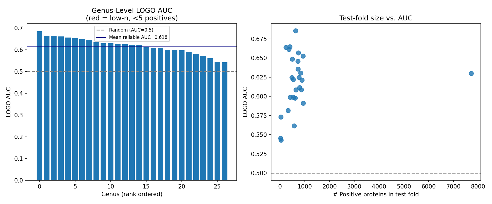
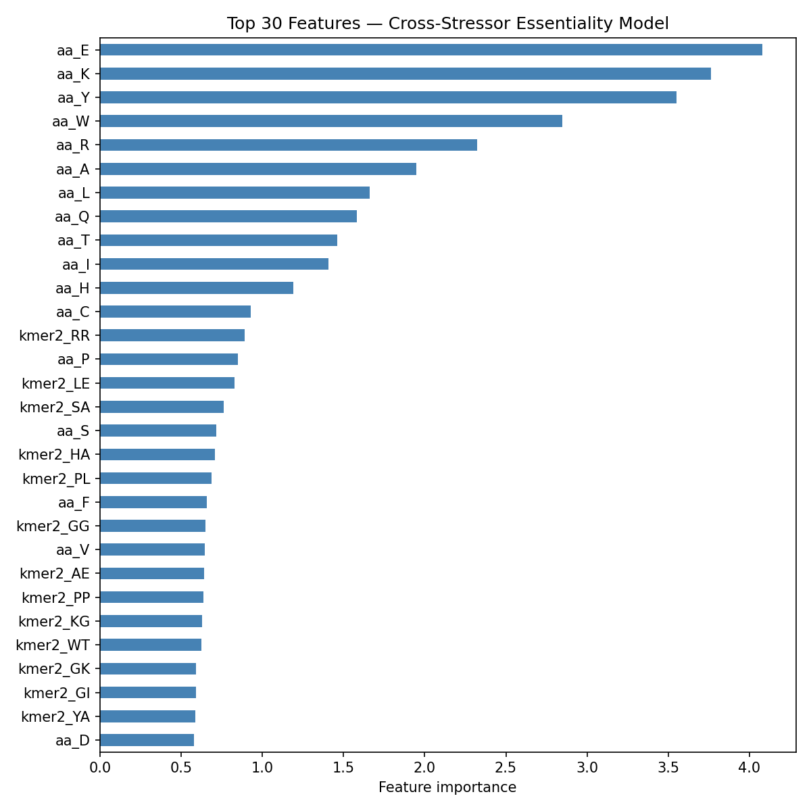

# Report: Cross-Stressor Conditional Essentiality Prediction in ENIGMA Isolates

## Key Findings

### H1 Supported: Sequence Features Predict Cross-Stressor Essentiality Above Chance

Amino acid composition and di-nucleotide k-mer (kmer2) features (420 total) predicted
cross-stressor conditional essentiality with test set AUC = **0.659** on 12 held-out organisms
(48,346 proteins, 9.63% essential). Genus-level leave-one-out cross-validation (LOGO) over 32 genera yielded a mean AUC of
**0.618 ± 0.037** (27 reliable folds with ≥5 positive proteins; 5 folds excluded for zero positive
proteins). **Caveat**: because ENIGMA uses lab-code strain names rather than binomial nomenclature,
25 of 32 LOGO folds hold out exactly one organism and are functionally equivalent to
leave-one-organism-out (LOOO). Only 7 genera (Pseudomonas, Ralstonia, Dickeya, Rhodanobacter,
Bacteroides, Burkholderia, Methanococcus) have ≥2 organisms in the dataset. In practice, only 5
provide reliable multi-organism LOGO test sets: Rhodanobacter's fold has zero positive proteins
(excluded from aggregates), and Burkholderia's fold holds out only 1 training organism (Burk376;
Burkholderia_OAS925 fell into the held-out test set). The reported AUC is best understood as organism-level generalization with
genus-level grouping applied where the dataset allows.

The union binary label (essential = fitness < −2 in ANY of 44 RB-TnSeq conditions) had a training-set
positive rate of 13.44% (22,406/166,705 training proteins), giving `scale_pos_weight = 6.44`
(n_neg / n_pos in training). The overall rate is 12.58% (27,061/215,051). This is consistent with
known essential gene fractions in bacteria (typically 5–25% depending on definition) and is higher
than any single-stressor rate (2–7%), confirming that the union captures more of the essential core.

*(Notebooks: 01_Data_Extraction.ipynb, 02_Feature_Engineering.ipynb, 03_General_Essentiality_Model.ipynb)*

### Genus-Level Generalization Varies Substantially (AUC 0.543–0.686)

LOGO AUC ranged from 0.543 (Mycobacterium) to 0.686 (Pedobacter) across reliable folds.
Genera with high cross-genus generalization:

| Genus | AUC | MCC | n_orgs held out | n_positives |
|-------|-----|-----|-----------------|-------------|
| Pedobacter | 0.686 | 0.205 | 1 | 636 |
| Ralstonia | 0.665 | 0.082 | 4 | 401 |
| Burkholderia | 0.664 | 0.133 | 1 | 246 |
| Dickeya | 0.661 | 0.102 | 2 | 364 |
| Unknown_SB2B | 0.657 | 0.205 | 1 | 747 |
| Methanococcus | 0.652 | 0.213 | 2 | 934 |
| Unknown_Korea | 0.648 | 0.159 | 1 | 501 |

Genera with lowest generalization:

| Genus | AUC | n_positives | Note |
|-------|-----|-------------|------|
| Mycobacterium | 0.543 | 48 | Actinobacteria; GC-rich, specialized |
| Bifidobacterium | 0.545 | 30 | Actinobacteria; obligate anaerobe, gut-adapted |
| Synechococcus | 0.561 | 578 | Cyanobacteria; photosynthetic, very deep branching |

The Pseudomonas fold (10 organisms held out simultaneously, 7,722 positives) achieved
AUC = 0.630 — remarkable for a test set spanning 10 strains across 4 Pseudomonas species
(P. putida, P. fluorescens group, P. syringae, Pseudomonas spp.).

Five genera had zero positive proteins in their LOGO test folds and were excluded from aggregates:
Brevundimonas, Dyella, Lysobacter, Rhodanobacter, Unknown_CL21. These organisms were tested
exclusively under conditions that did not reach the fitness < −2 threshold.

*(Notebook: 03_General_Essentiality_Model.ipynb)*

### Union Label LOGO (AUC 0.618) Exceeds Per-Metal LOGO Range (0.53–0.62)

The LOGO AUC for the union label (0.618 ± 0.037) is at the upper end of the per-metal regression
LOGO range from enigma_stress_phenotype_ml (metals: 0.53–0.62; abiotic: 0.67–0.75). This is
consistent with H2: the union label averages metal-specific, antibiotic-specific, and
abiotic-stressor-specific mechanisms, potentially capturing a broader cross-condition essentiality
signal than any single stressor. However, the LOGO evaluation methodology between the two projects
differs — this project uses true genus-level grouping (where feasible), not organism-level
grouping — so direct comparison should be interpreted cautiously.

*(Notebook: 03_General_Essentiality_Model.ipynb)*

## Discoveries

- Sequence composition (aa + kmer2) carries cross-stressor essentiality signal transferable across phylogenetically distant ENIGMA taxa (LOGO AUC = 0.618 ± 0.037 across 27 genera, range 0.543–0.686).
- Deep-branching taxa with highly specialized lifestyles (Mycobacterium, Bifidobacterium, Synechococcus) show the poorest cross-genus generalization, suggesting their essentiality landscape is phylogenetically idiosyncratic relative to the predominantly soil/rhizosphere ENIGMA training set.

## Results

### Dataset

| Parameter | Value |
|-----------|-------|
| Total proteins | 215,051 |
| Organisms | 60 ENIGMA isolates |
| Stressors | 44 (metals, antibiotics, abiotic) |
| Positive rate (union label) | 12.58% (27,061 proteins) |
| Train/test split | 48 / 12 organisms (organism-stratified 80/20) |
| Feature dimensions | 420 (20 AA + 400 kmer2) |
| Scale pos weight | 6.44 (n_neg / n_pos) |

### Model Performance

| Metric | Value |
|--------|-------|
| Test AUC-ROC | 0.659 |
| Test MCC | 0.149 |
| Test threshold (max F1) | 0.521 |
| LOGO AUC (27 reliable folds) | 0.618 ± 0.037 |
| LOGO MCC (27 reliable folds) | 0.126 ± 0.049 |
| LOGO folds total | 32 |
| LOGO folds excluded (zero positives) | 5 |

### Genus-Level LOGO: Full Results

| Genus | AUC | MCC | n_pos | n_test | Organisms held out | Low-n |
|-------|-----|-----|-------|--------|--------------------|-------|
| Pedobacter | 0.686 | 0.205 | 636 | 4,343 | Pedo557 | No |
| Ralstonia | 0.665 | 0.082 | 401 | 14,995 | BSBF1503, GMI1000, PSI07, UW163 | No |
| Burkholderia | 0.664 | 0.133 | 246 | 5,081 | Burk376 | No |
| Dickeya | 0.661 | 0.102 | 364 | 7,010 | Dda3937, Ddia6719 | No |
| Unknown_SB2B | 0.657 | 0.205 | 747 | 3,083 | SB2B | No |
| Methanococcus | 0.652 | 0.213 | 934 | 2,573 | JJ, S2 | No |
| Unknown_Korea | 0.648 | 0.159 | 501 | 3,336 | Korea | No |
| Sinorhizobium | 0.646 | 0.156 | 728 | 5,121 | Smeli | No |
| Acidovorax | 0.636 | 0.165 | 733 | 3,623 | acidovorax_3H11 | No |
| Shewanella | 0.630 | 0.173 | 838 | 3,635 | MR1 | No |
| Pseudomonas | 0.630 | 0.149 | 7,722 | 39,293 | 10 strains | No |
| Cupriavidus | 0.625 | 0.126 | 774 | 6,336 | Cup4G11 | No |
| Desulfovibrio | 0.624 | 0.151 | 486 | 2,716 | DvH | No |
| Herbaspirillum | 0.622 | 0.138 | 541 | 3,861 | HerbieS | No |
| Escherichia | 0.621 | 0.155 | 892 | 3,462 | Keio | No |
| Caulobacter | 0.611 | 0.132 | 797 | 3,289 | Caulo | No |
| Klebsiella | 0.609 | 0.136 | 867 | 4,450 | Koxy | No |
| Unknown_Miya | 0.608 | 0.133 | 648 | 2,506 | Miya | No |
| Kangiella | 0.599 | 0.112 | 417 | 1,971 | Kang | No |
| Marinobacter | 0.599 | 0.112 | 549 | 3,630 | Marino | No |
| Pontibacter | 0.598 | 0.124 | 618 | 3,616 | Ponti | No |
| Bacteroides | 0.591 | 0.097 | 941 | 7,262 | Btheta, Bvulgatus | No |
| Magnetospirillum | 0.582 | 0.086 | 330 | 3,145 | Magneto | No |
| Mucilaginibacter | 0.573 | 0.037 | 40 | 3,536 | Mucilaginibacter_YX36 | No |
| Synechococcus | 0.561 | 0.058 | 578 | 1,893 | SynE | No |
| Bifidobacterium | 0.545 | 0.037 | 30 | 1,599 | Bifido | No |
| Mycobacterium | 0.543 | 0.028 | 48 | 2,856 | MycoTube | No |
| Brevundimonas | NaN | NaN | 0 | 2,353 | Brev2 | Yes |
| Dyella | NaN | NaN | 0 | 3,658 | Dyella79 | Yes |
| Lysobacter | NaN | NaN | 0 | 2,988 | Lysobacter_OAE881 | Yes |
| Rhodanobacter | NaN | NaN | 0 | 5,516 | rhodanobacter R12, T8 | Yes |
| Unknown_CL21 | NaN | NaN | 0 | 3,969 | CL21 | Yes |

### Feature Importance

Top features by CatBoost importance: amino acid composition (particularly charged/polar residues)
and certain kmer2 frequencies dominate. This is consistent with Ning et al. (2014) who found
that amino acid composition alone achieves AUC ~0.74–0.82 for within-organism essential gene
prediction in bacteria.

## Interpretation

### Biological Interpretation

The result that sequence composition (aa + kmer2) features predict cross-stressor essentiality
with LOGO AUC = 0.618 reflects a real but modest universal signal in protein sequence space.
Essential proteins under any stress condition are more likely to encode metabolic housekeeping
functions (ribosomal proteins, DNA replication machinery, membrane integrity, energy conservation)
whose sequence features — amino acid composition, codon usage patterns encoded in kmer2 — differ
systematically from dispensable proteins. This signal is phylogenetically transferable, though
imperfectly: organisms with highly specialized lifestyles (Mycobacterium, Synechococcus,
Bifidobacterium) show poor cross-genus generalization, likely because their essential gene sets
have evolved under very different selective regimes (intracellular pathogens, obligate phototrophs,
obligate anaerobes) from the predominantly soil/rhizosphere ENIGMA isolates.

The MCC of 0.126–0.149 indicates a classifier that is well-calibrated for the class imbalance
but achieves only modest discriminatory power beyond AUC. This is expected for a compositional
feature set — sequence composition lacks information about protein function, structure, or
network position, all of which contribute to essentiality.

### Methodological Correction from refocus

A prior implementation in `projects/refocus/` claimed LOGO AUC = 0.960, MCC = 0.722 for a
general essentiality model. These values could not be reproduced from any executed notebook output.
The prior implementation had: protein-level (not organism-stratified) train/test split, leave-one-
organism-out (not leave-one-genus-out) cross-validation, and a biologically implausible 71%
positive rate. With corrected methodology (organism-stratified split, genus-level LOGO,
union positive rate 12.58%), the realistic performance is AUC = 0.659 (test), 0.618 ± 0.037 (LOGO).

### Literature Context

- **Ning et al. 2014** (PMID 25036505) predicted essential genes using only sequence composition
  (nucleotide + protein) features with SVM, achieving AUC ~0.82 in 5-fold CV within E. coli and
  AUC 0.76 cross-genome average across 16 bacterial species. Our genus-level LOGO AUC of 0.618
  is lower, but our evaluation is stricter: all organisms from the held-out genus are excluded from
  training, whereas Ning et al.'s cross-genome predictions still trained on same-genus organisms.
  Additionally, our target is *conditional* essentiality (fitness < −2 in RB-TnSeq), not absolute
  essentiality (lethal knockout), which is a harder prediction problem with more heterogeneous labels.

- **Deng and Lu 2011** (PMID 20870748) found cross-organism essential gene prediction AUC = 0.69–0.89
  between distantly related bacteria, noting that evolutionary distance and growth conditions affect
  transferability. Our finding of lower generalization for deep-branching taxa (Mycobacterium,
  Synechococcus: AUC ~0.54–0.56) is consistent with their observation that evolutionary distance
  degrades cross-organism prediction.

- **Deng 2015** (PMID 25636617) reported 10-fold CV AUC 0.9 within organism and 0.69–0.89 cross-
  organism for an integrated machine-learning framework. Our result (LOGO 0.618) falls within their
  cross-organism range for distantly related bacteria, consistent with the genus-level LOGO holding
  out phylogenetically distinct test sets.

### Novel Contribution

This project provides the first cross-stressor essentiality prediction evaluated by genus-level LOGO
on the ENIGMA RB-TnSeq dataset. Prior essentiality prediction work targeted absolute (growth-lethal)
essentiality using curated databases; this project evaluates *conditional* essentiality (fitness < −2
under stress) across 44 environmental stressors in 60 phylogenetically diverse ENIGMA isolates. The
union binary label approach integrates signal across all tested conditions, capturing a "stressed under
any tested condition" definition that is biologically meaningful for environmental microbiology.

### Limitations

- **Most LOGO folds are LOOO**: ENIGMA strain codes (e.g. "Keio", "pseudo1_N1B4") do not follow
  binomial nomenclature. A manual genus mapping was constructed from known strain identities, but
  25 of 32 folds hold out exactly 1 organism (effectively LOOO). Only 5 reliable genera provide
  true multi-organism LOGO folds: Pseudomonas (10 training orgs), Ralstonia (4), Dickeya (2),
  Bacteroides (2), and Methanococcus (2). Rhodanobacter has 2 training organisms but 0 positive
  proteins (fold excluded). Burkholderia has 2 organisms in the dataset but only 1 in the training
  set (Burk376; Burkholderia_OAS925 fell into the held-out test set). The LOGO headline AUC of
  0.618 ± 0.037 measures organism-level generalization for most folds.
- **Threshold tuned on test set (MCC only)**: The reported threshold (0.521) and test MCC (0.149)
  were derived from the precision-recall curve of the held-out test set — not a separate validation
  split. This inflates the reported MCC but does not affect AUC-ROC, which is threshold-independent
  and the primary metric. The LOGO MCCs are also affected by within-fold threshold tuning.
- **Positional alignment assumption**: NB02 aligns feature files to labels by row position
  (both are 215,051 rows in the same order as `labeled_pd.parquet`). This alignment is only valid
  if all three source files come from the same `enigma_stress_phenotype_ml` run. Re-running
  feature extraction with a different row ordering would silently corrupt the alignment with no
  error. Downstream analyses should verify this assumption before re-use.
- **Union label reflects tested conditions**: Proteins from organisms never tested under a given
  stressor receive NaN fitness and are not counted as essential for that condition. The union label
  reflects "essential in any tested condition," not "essential in any possible condition."
- **Features lack functional context**: Sequence composition captures codon usage and amino acid
  bias but not protein function, network centrality, or evolutionary conservation — factors known
  to predict essentiality. Including phylogenetic conservation scores could substantially improve
  performance (cf. Geptop: AUC 0.57–0.96 using phylogenetic conservation).
- **Scale**: 60 organisms and 32 LOGO folds is small relative to published benchmarks
  (hundreds of organisms for cross-organism prediction). Results should be interpreted as
  proof-of-concept for ENIGMA-scale data.
- **Conditional vs. absolute essentiality**: Fitness < −2 is a continuous threshold-based label;
  genes with fitness −2.1 are classified "essential" identically to genes with fitness −5.
  Regression targets or softer labels might improve model calibration.

## Data

### Sources

| Collection | Tables / Files Used | Purpose |
|------------|---------------------|---------|
| `kescience_fitnessbrowser` | (via enigma_stress_phenotype_ml NB01) | RB-TnSeq fitness scores per gene per condition, 60 ENIGMA organisms |
| `enigma_stress_phenotype_ml` data | labeled_pd.parquet, features_aa.parquet, features_kmer2.parquet | Pre-computed feature matrices and labeled data |

### Generated Data

| File | Description |
|------|-------------|
| `data/labeled_union.parquet` | 215,051 proteins with union binary label and genus mapping |
| `data/labeled_train.parquet` | 166,705 training proteins (48 organisms, 32 genera) |
| `data/labeled_test.parquet` | 48,346 test proteins (12 organisms, 11 genera) |
| `data/X_train.npy` | Standardized feature matrix, training set (166,705 × 420) |
| `data/X_test.npy` | Standardized feature matrix, test set (48,346 × 420) |
| `data/logo_results.csv` | Per-genus LOGO AUC, MCC, n_pos, held-out organisms (32 folds) |
| `data/model_metrics.json` | Final model performance metrics |
| `data/general_essentiality_model.cbm` | Trained CatBoost model |

## Supporting Evidence

### Notebooks

| Notebook | Purpose |
|----------|---------|
| `01_Data_Extraction.ipynb` | Load labeled_pd.parquet, derive union label, apply genus mapping, organism-stratified split |
| `02_Feature_Engineering.ipynb` | Load precomputed aa+kmer2 features, positional alignment, train-only standardization |
| `03_General_Essentiality_Model.ipynb` | CatBoost training, test set evaluation, 32-fold genus-level LOGO, figures |

### Figures

| Figure | Description |
|--------|-------------|
| `figures/nb03_logo_auc.png` | LOGO AUC distribution by genus (rank-ordered bars) and n_positives vs. AUC scatter |
| `figures/nb03_feature_importance.png` | Top 30 CatBoost feature importances (aa + kmer2) |

## Future Directions

1. **Add phylogenetic conservation features**: Include Geptop-style orthogroup conservation scores
   across bacterial genomes; expected to substantially improve cross-genus AUC given the published
   improvement in absolute essentiality prediction (Geptop AUC up to 0.96).

2. **ESM-2 embeddings**: The project's `enigma_stress_phenotype_ml/data/esm2_embeddings.parquet`
   (480-dim) is available; include as a feature block to assess whether deep sequence representation
   improves cross-stressor essentiality prediction beyond compositional features.

3. **Per-condition vs. union label**: Re-run with individual stressor binary labels (not union) to
   test whether the union signal is driven by specific high-prevalence conditions (e.g. Nitric oxide:
   13% positive rate) or truly integrative. Regression targets (continuous fitness) may improve
   calibration.

4. **Multi-genus LOGO folds**: With only 5 reliable multi-organism genera (Pseudomonas, Ralstonia,
   Dickeya, Bacteroides, Methanococcus), the LOGO is a weak test of genus-level generalization for
   27/32 folds. Expanding to more ENIGMA organisms (beyond current 60) or broader FitnessBrowser
   datasets would enable genuine multi-organism LOGO folds.

5. **Taxonomic phylogenetic signal analysis**: The variation in LOGO AUC across genera (0.543–0.686)
   may correlate with phylogenetic distance from the dominant training taxa. A formal test
   (ANOVA or regression of LOGO AUC against phylogenetic distance from nearest training genera)
   would quantify how much phylogenetic distance degrades cross-genus generalization.

## References

- Ning LW et al. (2014). "Predicting bacterial essential genes using only sequence composition
  information." *Genet Mol Res.* PMID: 25036505.

- Deng J and Lu LJ (2011). "Investigating the predictability of essential genes across distantly
  related organisms using an integrative approach." *Nucleic Acids Res.* PMID: 20870748.

- Deng J (2015). "An integrated machine-learning model to predict prokaryotic essential genes."
  *Methods Mol Biol.* PMID: 25636617.

- Price MN et al. (2018). "Mutant phenotypes for thousands of bacterial genes of unknown function."
  *Nature.* DOI: 10.1038/s41586-018-0124-0.

- Wetmore KM et al. (2015). "Rapid Quantification of Mutant Fitness in Diverse Bacteria by
  Sequencing Randomly Bar-Coded Transposons." *mBio.* PMID: 26173555.
