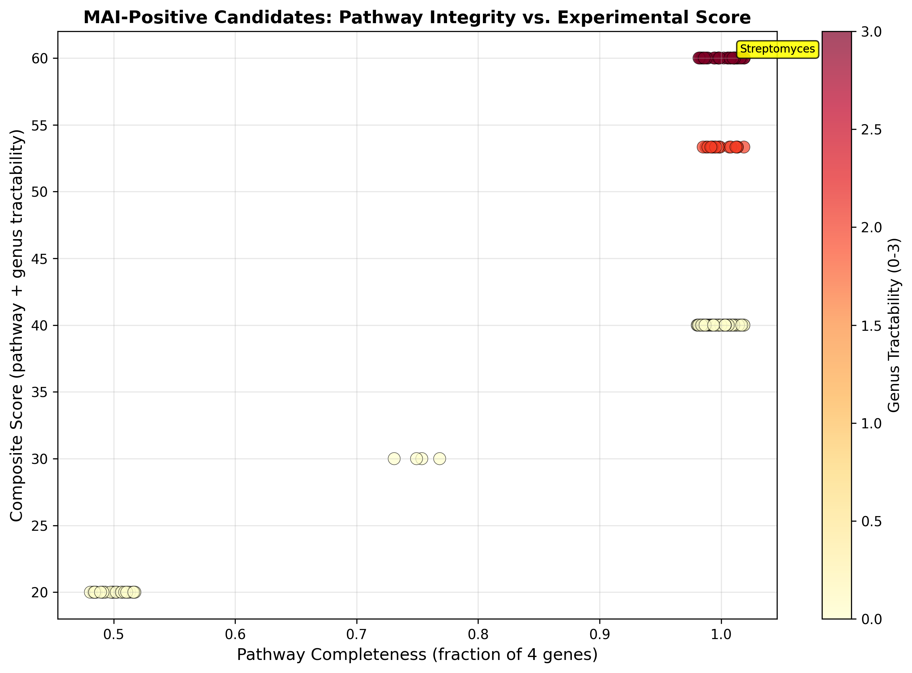

# Report: ENIGMA Isolate Survey for Mycothiol-Dependent Malonylpyruvate Isomerase

## Key Findings

### H1 Supported: 136 Unique ENIGMA Strains Carry Malonylpyruvate Isomerase

Of 2,925 ENIGMA Genome Depot genome records (2,075 unique organisms; 1.41×
average genome-per-strain redundancy), 163 genome records (5.6%) carry the
mycothiol-dependent malonylpyruvate isomerase (K16163/MAI), corresponding to
**136 unique strains** after de-duplication on organism name. This rejects the null
hypothesis that the enzyme would be absent from cultured ENIGMA strains.

The ENIGMA Genome Depot is taxonomically heterogeneous: 64% of genome records
(1,876/2,925) are labeled "Environmental isolate" with unresolved taxonomy, while the
remaining 36% span >140 named genera dominated by Pseudomonadota (Pseudomonas,
Rhizobium) and only ~2.5% known Actinobacteria genera by count. Because MAI is
primarily an Actinobacteria marker, the 5.6% genome-level prevalence cannot be
directly compared to a phylum-fraction expectation without phylum-level annotation
of the full collection. Among the 1,049 genome records with resolved genus-level taxonomy (i.e., excluding the
1,876 "Environmental" records), MAI is carried by 62/76 known Actinobacteria records
(81.6%) vs. 24/973 non-Actinobacteria records (2.5%) — a statistically extreme
enrichment (Fisher's exact, OR=175.1, p=6×10⁻⁶⁶). Environmental-unresolved genomes
are excluded from this test; they likely contain additional Actinobacteria, so the
true OR is a lower bound. Among non-Actinobacteria MAI hits, all 24 are Rhizobiaceae
(Alphaproteobacteria) and none carry the complete 4-gene pathway.

*(Notebook: 01_enigma_depot_query.ipynb)*

### 112 Unique Strains Carry the Complete 4-Gene Mycothiol Pathway

Among the 163 MAI-positive genome records (136 unique strains), 134 genome records
(82%) carry the full four-gene mycothiol biosynthesis pathway (mshA + mshB + mshC +
mai), corresponding to **112 unique strains** after de-duplication. The remaining 24
unique strains are partial pathway carriers (most carry mshA + mai without mshB/mshC).
Complete-pathway carriers span 13 genera, with Environmental-unresolved strains (51),
*Streptomyces* (30), *Arthrobacter* (7), *Rhodococcus* (7), and *Nocardioides* (4)
accounting for the majority.

*(Notebook: 01_enigma_depot_query.ipynb)*

### Shortlist Is a Genus-Tractability Filter, Not a Data Ranking

The top 20 candidates produced by NB02 are *all Streptomyces* spp. (score 60/60:
pathway completeness 40/40 + genus tractability 20/20). This outcome reflects the
scoring design: any Streptomyces with 4/4 pathway completeness receives the maximum
score by construction. The shortlist therefore selects "tractable complete-pathway
Actinobacteria" rather than ranking candidates by independent data signals. Named
strains include *S. mirabilis* YR139, *S. atratus* OK008, and isolates bearing Oak
Ridge BK/OK/OV field designators.

The shortlist is a valid starting point for culture requests, but three additional
filters must be applied before prioritizing specific strains: (1) CheckM genome
quality, (2) culture availability from Jen Pett-Ridge's canonical ENIGMA list, and
(3) at least two independent annotation lines for MAI (KO + product description).

*(Notebook: 02_candidate_ranking.ipynb)*

### Unexpected MAI Detection in Alphaproteobacteria

Of the 163 MAI-positive genome records, 18 are annotated as *Rhizobium* spp. and 4 as
*Ensifer* spp. (both Rhizobiaceae, Alphaproteobacteria) — taxa not expected to carry
this Actinobacteria-enriched enzyme. Prior pangenomic analysis placed MAI prevalence
at <1% across Pseudomonadota. Importantly, all 4 Ensifer genome records represent a
single strain (*Ensifer adhaerens* EB106-05-01-XG146, multiply-sequenced): the de-
duplicated Alphaproteobacteria count is 18 Rhizobium + 1 Ensifer = **19 unique strains**.

Pathway completeness among Rhizobium strains is not uniform: 15/18 carry 2/4 genes
(mshA + mai only), and 3/18 carry 3/4 genes (mshA + mshC + mai; strains OV483, OK494,
YR374). None carry mshB. None reach the 4-gene complete-pathway threshold. The 3/4-gene
Rhizobium strains are notable: independently acquiring mshC alongside MAI is more
consistent with genuine horizontal gene transfer than with KO annotation noise, but
without protein-level sequence verification the annotation-artifact interpretation
cannot be excluded.

These hits warrant annotation validation before being interpreted biologically. They
may reflect KO K16163 cross-reactivity with a structurally similar non-mycothiol
isomerase, or genuine HGT from co-occurring Actinobacteria selected under metal
contamination pressure at the Oak Ridge site.

*(Notebook: 01_enigma_depot_query.ipynb)*

## Discoveries

- 136 unique ENIGMA strains (163 genome records; 5.6% at genome level) carry malonylpyruvate isomerase (K16163), predominantly *Streptomyces* spp. and taxonomically unresolved field isolates from Oak Ridge contaminated sites, providing the first culture-based candidate set for experimental validation of MAI's adaptive metal function.
- 112 unique strains carry the complete 4-gene mycothiol pathway; 30 of these are *Streptomyces* with established genetic tools, representing the highest-priority candidates pending CheckM quality and culture availability checks.
- MAI prevalence in ENIGMA Alphaproteobacteria (*Rhizobium* [18 strains], *Ensifer* [1 strain; 4 genome records for one multiply-sequenced isolate]) is unexpected and unexplained. All carry partial pathways: 15 Rhizobium strains carry mshA+mai (2/4), three carry mshA+mshC+mai (3/4), one Ensifer strain carries mshA+mai (2/4); none reach the complete-pathway threshold. The 3/4-gene Rhizobium strains are ambiguous — they may represent genuine HGT from co-occurring Actinobacteria, or KO cross-reactivity across both MAI and mshC. Protein-level BLAST against confirmed MAI sequences is required before interpreting these as functional carriers.

## Results

### Genome Depot Survey

| Metric | Genome records | Unique strains |
|--------|---------------|----------------|
| Total ENIGMA genomes surveyed | 2,925 | 2,075 |
| Genomes with MAI (K16163) | 163 (5.6%) | 136 (6.6%) |
| Genomes with complete 4-gene pathway | 134 (4.6%) | 112 (5.4%) |
| Genomes with any mycothiol KO | 2,857 (97.7%) | — |

Note: The ENIGMA Genome Depot contains an average of 1.41 genome records per unique
organism (2,925 records / 2,075 unique organism names). All strain-level counts in
this report are de-duplicated on organism name.

mshA (K01687) is nearly universal among ENIGMA isolates (2,829/2,925 = 96.7%),
consistent with the glycosyltransferase being broadly conserved across Actinobacteria
and co-opted for multiple functions. mshC (2,189; 74.8%) and mshB (2,099; 71.8%)
are also common. MAI alone is rare, consistent with the phylogenetically specific
enrichment signal established by the upstream pangenomic project.

### Taxonomy of MAI-Positive Isolates

All-MAI-positive strains (163 genome records / 136 unique strains):

| Taxon (first genus word) | Genome records | Unique strains | Notes |
|--------------------------|---------------|----------------|-------|
| Environmental (unresolved) | 77 | 54 | Field isolates, taxonomy unresolved; site codes span FW, GW, D, EB, YR, EU ENIGMA wells |
| *Streptomyces* | 30 | 30 | Actinobacteria — expected; all tractable |
| *Rhizobium* | 18 | 18 | Alphaproteobacteria — unexpected; all partial pathway |
| *Arthrobacter* | 7 | 7 | Actinobacteria — expected |
| *Rhodococcus* | 7 | 7 | Actinobacteria — expected |
| *Ensifer* | 4 | 1 | Alphaproteobacteria — unexpected; 4 records = 1 strain (*E. adhaerens* EB106-05-01-XG146), partial pathway only |
| *Nocardioides* | 4 | 4 | Actinobacteria — expected |
| *Actinobacteria* (class label) | 4 | 4 | Actinobacteria — expected |
| *Promicromonospora* | 3 | 3 | Actinobacteria — expected |
| *Paenarthrobacter* | 2 | 2 | Actinobacteria — expected |
| *Kocuria* | 1 | 1 | Actinobacteria — expected |
| *Microbacterium* | 1 | 1 | Actinobacteria — expected |
| *Kitasatospora* | 1 | 1 | Actinobacteria — expected |
| *Corynebacterium* | 1 | 1 | Actinobacteria — expected |
| *Leifsonia* | 1 | 1 | Actinobacteria — expected |
| *Rugosibacter* | 1 | 1 | Other — unverified |

Complete-pathway strains only (134 genome records / 112 unique strains):

| Taxon | Unique strains with complete pathway |
|-------|--------------------------------------|
| Environmental (unresolved) | 51 |
| *Streptomyces* | 30 |
| *Arthrobacter* | 7 |
| *Rhodococcus* | 7 |
| *Nocardioides* | 4 |
| *Actinobacteria* (class label) | 4 |
| *Promicromonospora* | 3 |
| *Paenarthrobacter* | 1 |
| *Kocuria* | 1 |
| *Microbacterium* | 1 |
| *Kitasatospora* | 1 |
| *Corynebacterium* | 1 |
| *Leifsonia* | 1 |

Note: *Rhizobium* (18 strains) and *Ensifer* (1 strain) carry only 2/4 pathway genes and appear in neither table above — they are absent from the complete-pathway list. The 51 Environmental-unresolved complete-pathway strains span multiple ENIGMA field sites (groundwater wells GW247, GW460, GW531, GW821; field well clusters FW305/306; D-area isolates; East Bear Creek EB106), suggesting they are genuine soil/water Actinobacteria from contaminated zones rather than lab artifacts.

### Candidate Shortlist

The NB02 scoring system (pathway completeness × 40 + genus tractability × 20, max 60 pts) identifies *Streptomyces* as the top genus by construction: any *Streptomyces* with 4/4 pathway completeness scores 60/60, while all other genera with unknown tractability score ≤40. The top-20 shortlist is therefore a **genus-tractability filter** that returns all tractable complete-pathway *Streptomyces*, not a data-independent ranking.

Pending filters before culture requests: CheckM genome quality (requires external NCBI lookup), culture availability (Jen Pett-Ridge's canonical ENIGMA list), and protein-level MAI annotation confirmation.

Representative strains at score 60/60 (all complete 4-gene pathway, all *Streptomyces*):

| Rank | Strain | Pathway | Score |
|------|--------|---------|-------|
| 1 | *Streptomyces mirabilis* YR139 | 4/4 | 60/60 |
| 2 | *Streptomyces* sp. BK215 (Ga0307669) | 4/4 | 60/60 |
| 3 | *Streptomyces* sp. BK239 | 4/4 | 60/60 |
| 8 | *Streptomyces mirabilis* | 4/4 | 60/60 |
| 10 | *Streptomyces atratus* OK008 | 4/4 | 60/60 |

Full shortlist (20 strains): `data/enigma_candidate_shortlist.csv`.

## Interpretation

### Literature Context

Based on articles retrieved from PubMed, Wang et al. (2007) solved the crystal
structure of the mycothiol-dependent maleylpyruvate isomerase (MDMPI) from
*Corynebacterium glutamicum* ([DOI:10.1074/jbc.M610347200](https://doi.org/10.1074/jbc.M610347200)).
The enzyme contains a divalent metal-binding domain (His52, Glu144, His148) located
at the bottom of the catalytic pocket; the metal ion and the MSH moiety together form
the active site. This structural finding reinforces the hypothesis that MAI's
catalytic function is intrinsically metal-dependent, and that the enzyme in
metal-contaminated field isolates could have evolved under direct metal selection
pressure.

Park & Roe (2008) established that in *Streptomyces coelicolor*, mshA expression is
under direct control of the thiol-stress sigma factor sigmaR, and that the
intracellular MSH level modulates the RsrA–sigmaR redox switch
([DOI:10.1111/j.1365-2958.2008.06191.x](https://doi.org/10.1111/j.1365-2958.2008.06191.x)).
This makes *Streptomyces* a particularly relevant model: any experiment testing
MAI's role in metal adaptation will be interpretable within an established regulatory
framework.

Zhao et al. (2015) demonstrated MSH–ergothioneine coupling in lincomycin A
biosynthesis in *Streptomyces*, with MSH acting as a direct sulfur donor
([DOI:10.1038/nature14137](https://doi.org/10.1038/nature14137)). This broadens the
relevance of MSH-dependent biotransformations beyond antioxidant function to
secondary metabolite production, a known hallmark of soil *Streptomyces*.

Passari et al. (2025) confirmed strain-specific heavy metal tolerance (Zn, Co, Cu, Cd)
in *Streptomyces* and identified metal-resistance biosynthetic gene clusters via
comparative genomics ([DOI:10.1007/s11274-025-04703-1](https://doi.org/10.1007/s11274-025-04703-1)).
Their genomic evidence directly supports the candidacy of ENIGMA *Streptomyces*
isolates as metal-tolerant strains with genetic tools available for validation.

### Unexpected Alphaproteobacteria Hits

The *Rhizobium*/*Ensifer* MAI hits are not easily explained by the known phylogenetic
distribution of mycothiol. Rhizobiaceae lack the canonical mycothiol pathway but are
abundant in Oak Ridge contaminated soils and known for plant symbiosis in metalliferous
environments. Two interpretations should be tested: (1) annotation cross-reactivity —
K16163 may match a structurally similar non-mycothiol isomerase in these genomes; (2)
genuine HGT from co-occurring Actinobacteria, selected under chronic metal exposure.
Protein-level BLAST of the annotated sequences against confirmed MAI proteins from
*Corynebacterium* and *Streptomyces* is the minimum validation step.

### Novel Contribution

This is the first systematic survey of MAI presence across ENIGMA lab isolates. Prior
pangenomic enrichment analysis (see related project `mycothiol_detox_module`)
established MAI as the most phylogenetically robust Actinobacteria-specific signal,
but that analysis operated at species/genus level across GTDB and could not identify
specific cultivable strains. This project closes that gap: 30 unique *Streptomyces*
strains and 82 additional non-Streptomyces complete-pathway strains (mostly
taxonomically unresolved field isolates) are identified as candidates for experimental
validation. The 20-strain shortlist in `enigma_candidate_shortlist.csv` selects for
*Streptomyces* with established genetic tools as the highest-tractability starting
point; expanding to the full 112 unique complete-pathway strains is appropriate once
CheckM and culture-availability data are integrated.

### Limitations

- **No genome quality metrics**: CheckM completeness/contamination are not exposed
  through the ENIGMA Genome Depot browser tables, so genome quality was not used in
  candidate ranking. Genome quality should be verified from original genome records
  before ordering cultures.
- **"Environmental" taxon label**: 77 genome records (54 unique strains) have
  taxonomically unresolved names, preventing genus-level tractability scoring. Site
  codes (FW, GW, D, EB, YR ENIGMA field designators) confirm field origin. Given that
  all carry MAI, these are likely Actinobacteria — 51 unique Environmental strains
  carry the complete 4-gene pathway and represent an under-characterized candidate pool.
- **Genome record duplication**: The ENIGMA Genome Depot contains 1.41× genome records
  per unique organism on average. All reported strain counts are de-duplicated on
  organism name; genome-level counts are also reported for traceability.
- **Genus tractability scores are working assumptions**: The 0–3 scale (Streptomyces/
  Mycobacterium/Corynebacterium = 3; Rhodococcus/Arthrobacter = 2; Brevibacterium = 1)
  reflects known availability of genetic tools (transformation protocols, shuttle
  vectors, CRISPR systems) but is not formally referenced to a published tractability
  index. Alternative weightings would change which non-Streptomyces genera appear in the
  shortlist. This is a working assumption requiring expert validation before culture
  decisions are made.
- **4-gene pathway definition requires mshB**: The canonical mycothiol biosynthesis
  pathway (as defined in Newton & Fahey 2008) requires all four gene products: mshA,
  mshB, mshC, and MAI. Alternative biosynthetic routes bypassing mshB are not
  documented in characterized organisms; strains lacking mshB are treated as partial-
  pathway carriers throughout this report on this basis.
- **No isolation site metadata**: ENIGMA browser tables do not expose isolation site/
  condition data via the current schema, so candidates were not filtered by metal
  contamination phenotype. Site codes visible in strain names (BK, OK, OV = Oak Ridge
  Bear Creek/Old K-25/ORR; FW/GW = field/groundwater wells) suggest most Streptomyces
  shortlist candidates are from the contaminated ENIGMA field sites, but this has not
  been verified against ENIGMA field records.
- **Single-evidence annotation**: MAI candidates were identified by KO K16163 alone.
  The original plan called for ≥2 independent annotation lines (KO + product description
  or InterPro domain), but product-name and InterPro annotations are not exposed via the
  ENIGMA Genome Depot browser tables, so KO-only detection was used throughout. As a
  result, annotation artifacts (e.g., K16163 cross-reactivity with a structurally
  related non-mycothiol isomerase) cannot be excluded without protein-level validation.
- **Annotation-only detection**: KO K16163 may capture related isomerases
  without mycothiol dependence. Protein-level validation is required for any candidate
  before experimental work.
- **Jen's isolate list not integrated**: Canonical ENIGMA culture availability (frozen
  stocks, growth conditions) was not available in machine-readable form at the time of
  analysis. This is required before requesting cultures.

## Data

### Sources

| Collection | Tables Used | Purpose |
|------------|-------------|---------|
| `enigma_genome_depot_enigma` | `browser_genome`, `browser_strain`, `browser_gene`, `browser_protein_kegg_orthologs`, `browser_kegg_ortholog` | ENIGMA isolate genomes, strain names, and KO annotations |
| `kbase_ke_pangenome` | — | Not queried directly; KO vocabulary established via prior project |

### Generated Data

| File | Rows | Description |
|------|------|-------------|
| `data/enigma_all_genomes.parquet` | 2,925 genome records (2,075 unique strains) | All ENIGMA genomes with per-gene MAI pathway flags |
| `data/enigma_mai_hits.csv` | 163 genome records (136 unique strains) | MAI-positive genomes with pathway completeness |
| `data/enigma_pathway_completeness.csv` | 2,925 | Full pathway completeness table for all isolates |
| `data/enigma_candidate_shortlist.csv` | 20 | Genus-tractability-filtered shortlist; all *Streptomyces* with 4/4 pathway |

## Supporting Evidence

### Notebooks

| Notebook | Purpose |
|----------|---------|
| `01_enigma_depot_query.ipynb` | Surveys all 2,925 ENIGMA genomes for MAI and mycothiol pathway KOs via a single Spark query; exports MAI-positive hits and pathway completeness |
| `02_candidate_ranking.ipynb` | Scores MAI-positive candidates by pathway completeness and genus tractability; produces ranked shortlist and summary figure |

### Figures

| Figure | Description |
|--------|-------------|
| `figures/nb02_candidate_scatter.png` | Scatter of pathway completeness vs. composite score for all 163 MAI-positive candidates, colored by genus tractability (0–3); top-5 candidates labeled by genus |

## Future Directions

1. **Protein-level validation**: BLAST all 163 MAI protein sequences against the
   *Corynebacterium glutamicum* MDMPI structure (PDB 2IXQ) to confirm catalytic
   residues (His52, Glu144, His148) are conserved, and to resolve the
   *Rhizobium*/*Ensifer* annotation question.
2. **Integrate Jen's isolate list**: Match the shortlist against available frozen stocks
   to confirm which candidates can be ordered; obtain isolation site coordinates and
   any documented metal tolerance phenotypes.
3. **Genome quality check**: Pull CheckM completeness/contamination from NCBI GenBank
   records for the top 20 candidates to ensure assembly quality before culture requests.
4. **HGT analysis for Alphaproteobacteria hits**: Reconstruct gene-tree vs. species-tree
   discordance for the *Rhizobium*/*Ensifer* MAI sequences to test for horizontal
   acquisition from co-occurring Oak Ridge Actinobacteria.
5. **Experimental validation**: Culture and genetically manipulate top *Streptomyces*
   candidates; measure MIC shifts for Cu²⁺/Cd²⁺/Zn²⁺ in MAI knockout vs. wild-type.

## References

Based on articles retrieved from PubMed:

- Wang R, Yin YJ, Wang F, Li M, Feng J, Zhang HM, Zhang JP, Liu SJ, Chang WR. (2007).
  "Crystal structures and site-directed mutagenesis of a mycothiol-dependent enzyme
  reveal a novel folding and molecular basis for mycothiol-mediated maleylpyruvate
  isomerization." *J Biol Chem* 282(22):16288-94.
  [DOI:10.1074/jbc.M610347200](https://doi.org/10.1074/jbc.M610347200). PMID: 17428791

- Park JH, Roe JH. (2008). "Mycothiol regulates and is regulated by a thiol-specific
  antisigma factor RsrA and sigma(R) in Streptomyces coelicolor." *Mol Microbiol*
  68(4):861-70.
  [DOI:10.1111/j.1365-2958.2008.06191.x](https://doi.org/10.1111/j.1365-2958.2008.06191.x). PMID: 18430082

- Newton GL, Fahey RC. (2008). "Regulation of mycothiol metabolism by sigma(R) and
  the thiol redox sensor anti-sigma factor RsrA." *Mol Microbiol* 68(4):805-9.
  [DOI:10.1111/j.1365-2958.2008.06222.x](https://doi.org/10.1111/j.1365-2958.2008.06222.x). PMID: 18430078

- Zhao Q, Wang M, Xu D, Zhang Q, Liu W. (2015). "Metabolic coupling of two
  small-molecule thiols programs the biosynthesis of lincomycin A." *Nature*
  518(7537):115-9.
  [DOI:10.1038/nature14137](https://doi.org/10.1038/nature14137). PMID: 25607359

- Nakajima S, Satoh Y, Yanashima K, Matsui T, Dairi T. (2015). "Ergothioneine
  protects Streptomyces coelicolor A3(2) from oxidative stresses." *J Biosci Bioeng*
  120(3):294-8.
  [DOI:10.1016/j.jbiosc.2015.01.013](https://doi.org/10.1016/j.jbiosc.2015.01.013). PMID: 25683449

- Passari AK, Caicedo-Montoya C, Manzo-Ruiz M, et al. (2025). "Comparative genomics
  of the Streptomyces genus: insights into multi-stress-resistant genes for
  bioremediation." *World J Microbiol Biotechnol* 41(12):492.
  [DOI:10.1007/s11274-025-04703-1](https://doi.org/10.1007/s11274-025-04703-1). PMID: 41329251

- Paget MS, Molle V, Cohen G, Aharonowitz Y, Buttner MJ. (2001). "Defining the
  disulphide stress response in Streptomyces coelicolor A3(2): identification of the
  sigmaR regulon." *Mol Microbiol* 42(4):1007-20.
  [DOI:10.1046/j.1365-2958.2001.02675.x](https://doi.org/10.1046/j.1365-2958.2001.02675.x). PMID: 11737643
