# Report: SSO Subsurface Community Ecology — Spatial Structure, Functional Gradients, and Hydrogeological Drivers

## Key Findings

### 1. Community Similarity Tracks Spatial Arrangement at Meter Scale

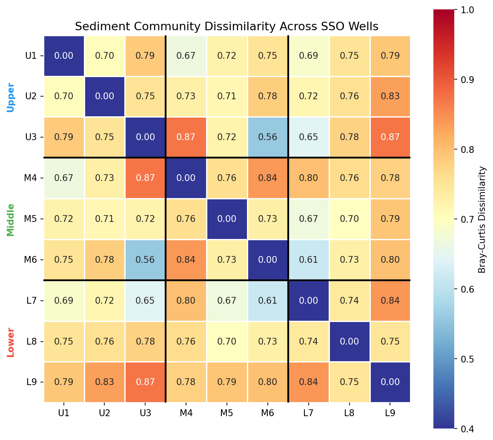

Sediment-associated microbial communities across the 9 SSO wells (3×3 grid, ~6 m span) show significant distance-decay of similarity (Mantel test: Spearman ρ = 0.323, p = 0.029, 9,999 permutations). Mean Bray-Curtis dissimilarity = 0.747, ranging from 0.558 (U3–M6, most similar) to 0.872 (U3–L9, most dissimilar). NMDS ordination achieves low stress (0.067), and Procrustes analysis shows marginal correspondence between community ordination and physical grid (m² = 0.379, p = 0.080).

Critically, community turnover is **not** aligned with the hillslope (uphill-downhill Mantel ρ = −0.049, p = 0.580) but instead with the **east-west axis** (column Mantel ρ = 0.227, p = 0.092). This contradicts the naive expectation of topography-driven hydrology and points to a lateral structuring force.

*(Notebook: 02_sediment_spatial.ipynb)*

### 2. The Column 3 Corridor: A Plume Flow Path

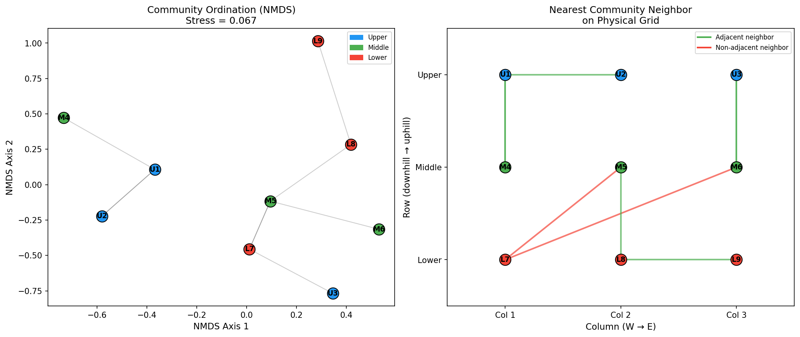

Three wells — U3, M6, and L7 — are far more similar to each other than their geographic distances predict:
- **U3–M6**: BC = 0.558, residual = −0.170 (most similar pair in the grid)
- **M6–L7**: BC = 0.615, residual = −0.154
- **U3–L7**: BC = 0.646, residual = −0.133

These wells trace a **diagonal corridor from the northeast (U3) to the southwest (L7)** that aligns with the expected flow path of the contamination plume from the Area 3 source (high nitrate, low pH, heavy metals) located uphill and northeast of the SSO. The corridor's shared community composition reflects shared plume exposure. Conversely, the largest dissimilarity (U3–M4, BC = 0.871, residual = +0.105) spans from the plume entry point to the well farthest from the plume core.

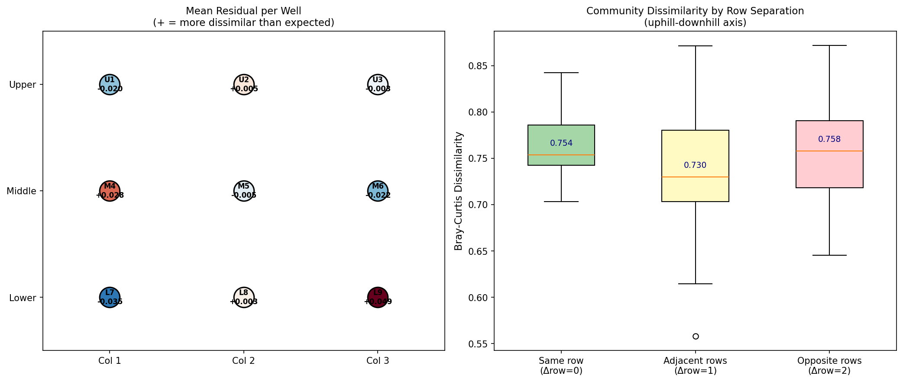

*(Notebook: 02_sediment_spatial.ipynb)*

### 3. Depth Dominates Over Horizontal Position

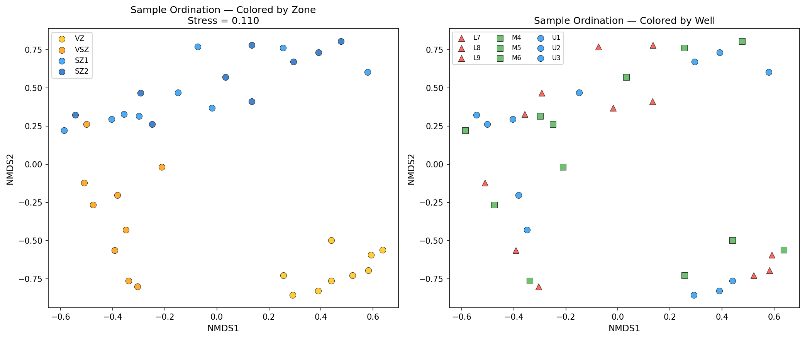

PERMANOVA on sample-level communities (37 sediment core segments) reveals:
- **Hydrogeological zone** (VZ/VSZ/SZ1/SZ2) explains **27.5%** of community variance (F = 4.05, p = 0.0001)
- **Well identity** explains **19.2%** but is **not significant** (F = 0.80, p = 0.979)

Samples from the same well but different depths are nearly maximally dissimilar (median BC = 0.977), while samples from the same depth zone in different wells are substantially more similar (median BC = 0.835). This is consistent with the contamination plume traveling through the **saturated zone**: depth controls whether a sample intersects the plume, while horizontal position is secondary.

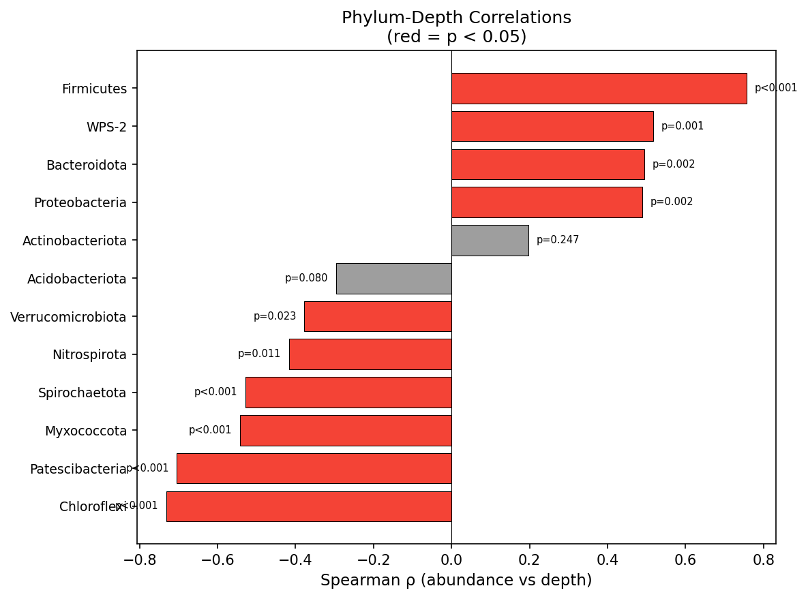

Ten of 12 dominant phyla show significant depth associations (p < 0.05), splitting into biologically coherent groups:
- **Shallow-enriched** (vadose, oxic): Chloroflexi (ρ = −0.73), Patescibacteria (−0.70), Myxococcota (−0.54), Spirochaetota (−0.53)
- **Deep-enriched** (saturated, anoxic): Firmicutes (ρ = +0.76), WPS-2 (+0.52), Bacteroidota (+0.50), Proteobacteria (+0.49)

*(Notebook: 03_depth_zonation.ipynb)*

### 4. Genus-Level Biogeochemical Processes Map the Redox Ladder

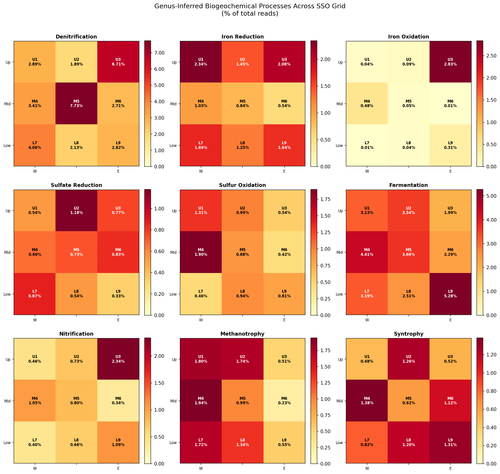

Multi-resolution functional inference (class-level: 22 classes, 78% coverage; genus-level: 65 annotated genera, 21% coverage) maps specific biogeochemical processes onto the 3×3 grid. The spatial distribution of processes recapitulates the thermodynamic redox ladder expected along a contamination plume:

| Process | Hotspot | Key Genus | Inferred Environment |
|---------|---------|-----------|---------------------|
| Denitrification | **M5** (7.7%) | *Rhodanobacter* | Plume mixing zone: NO₃⁻ meets organic C |
| Iron oxidation | **U3** (2.8%) | *Sideroxydans* | Plume entry: Fe²⁺ meets O₂ |
| Nitrification | **U3** (2.3%) | *Ca. Nitrosotalea* | Plume entry: NH₄⁺ meets O₂ |
| Iron reduction | **U1** (2.3%) | *Anaeromyxobacter* | Available Fe(III), suboxic |
| Sulfur oxidation | **M4** (1.9%) | *Arcobacter*, *Thiobacillus* | Sulfide meets oxygen |
| Methanotrophy | **M4** (1.9%) | *Ca. Methanoperedens* | Methane flux from deep zones |
| Fermentation | **L9** (5.3%) | *Spirochaeta*, *Paenisporosarcina* | Terminal reduction, all electron acceptors depleted |

**M5** — the central well — hosts the highest denitrification potential (7.7% *Rhodanobacter*), consistent with its position at the **plume mixing zone** where nitrate-rich contaminated groundwater meets native organic carbon. *Rhodanobacter* is the hallmark denitrifier of the ORR contaminated subsurface (Green et al. 2012).

**M6** is consistently the lowest for every oxidative process (iron oxidation, sulfur oxidation, nitrification) — the **anaerobic dead zone** of the grid, where the plume core has consumed all terminal electron acceptors.

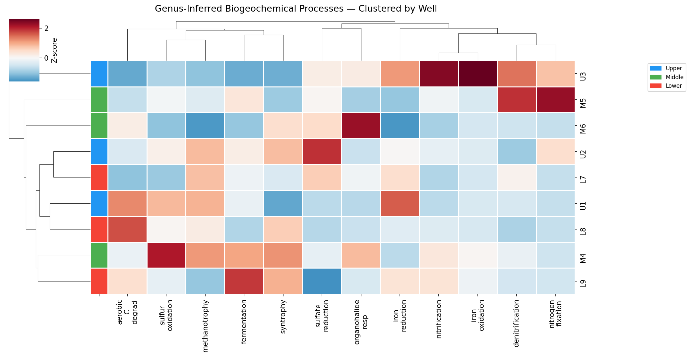

*(Notebook: 04_functional_inference.ipynb)*

### 5. Groundwater Carries a Plume-Associated Planktonic Community

Groundwater and sediment communities at the same well are substantially different (median BC = 0.424). Comparison of plume-indicator genera reveals a distinct planktonic assemblage:

| Genus | Function | Sediment % | GW % | Enrichment |
|-------|----------|-----------|------|------------|
| *Rhodanobacter* | Denitrification | 1.23 | 3.62 | 2.9× ▲GW |
| *Gallionella* | Iron oxidation | 0.01 | 0.14 | 8.9× ▲GW |
| *Sideroxydans* | Iron oxidation | 0.01 | 0.06 | 7.0× ▲GW |
| *Geobacter* | Iron reduction | 0.00 | 0.01 | 5.5× ▲GW |
| *Anaeromyxobacter* | Iron/U reduction | 1.24 | 0.03 | 0.02× ▼GW |
| *Arcobacter* | Sulfur oxidation | 0.54 | 0.00 | 0× ▼GW |
| *Ca. Methanoperedens* | Methane oxidation | 0.42 | 0.00 | 0× ▼GW |

The groundwater is enriched in denitrifiers (*Rhodanobacter*) and iron oxidizers (*Gallionella*, *Sideroxydans*) — organisms that thrive in the flowing, metal-rich contaminated plume water. Sediment-attached anaerobes (*Anaeromyxobacter*, *Arcobacter*, *Ca. Methanoperedens*) are depleted in groundwater, indicating distinct attached vs planktonic communities rather than simple detachment.

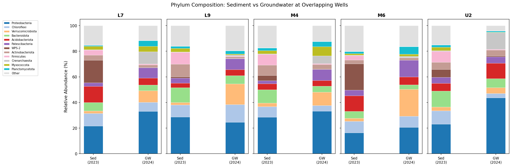

*(Notebook: 05_gw_vs_sediment.ipynb)*

### 6. Metabolic Guild Structure and Inferred Interactions

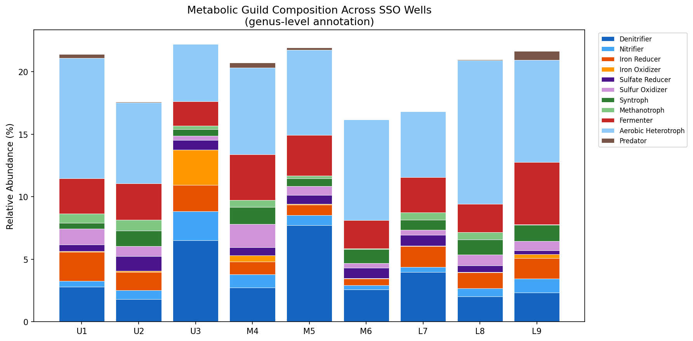

Assigning 65 annotated genera to 11 metabolic guilds reveals distinct functional assemblages at each well. Guild co-occurrence analysis across the 9 wells identifies tightly coupled functional partnerships:

- **Nitrifier × iron oxidizer**: ρ = +0.95 — these co-occur strongly, both concentrated at U3 (plume entry). Both are chemolithotrophs exploiting reduced compounds (NH₄⁺, Fe²⁺) arriving in the plume.
- **Syntroph × fermenter**: ρ = +0.55 — classic anaerobic food web coupling. Fermenters produce organic acids and H₂; syntrophs consume these in obligate partnerships with sulfate reducers or methanogens.
- **Fermenter × predator (*Bdellovibrio*)**: ρ = +0.85 — predators track bacterial prey biomass, which is highest where fermentation supports dense populations.
- **Denitrifier × syntroph**: ρ = −0.67 — mutual exclusion across the redox gradient. Denitrifiers thrive where nitrate is available (oxidizing); syntrophs require strictly anaerobic conditions.
- **Sulfate reducer × aerobic heterotroph**: ρ = −0.75 — textbook redox separation. These guilds occupy opposite ends of the electron acceptor hierarchy.

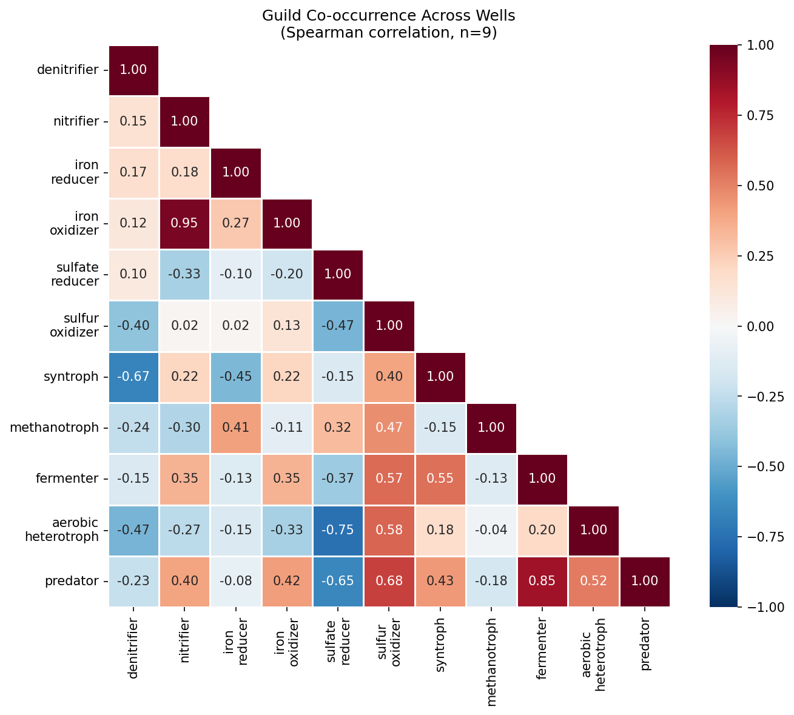

*(Notebook: 07_hotspot_interactions.ipynb)*

### 7. Groundwater Community Stability Over 9 Days

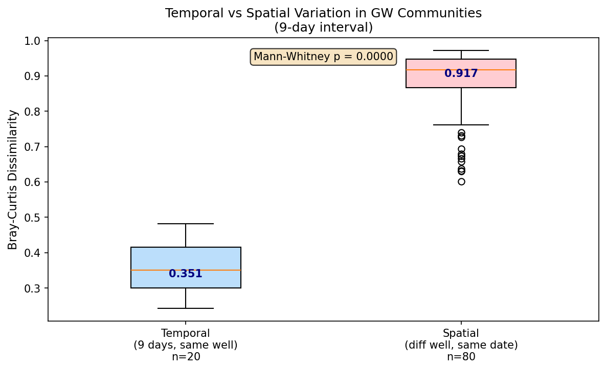

Groundwater communities at 5 wells sampled 9 days apart (Sep 9 vs Sep 18, 2024) show remarkable short-term stability:

| Factor | R² | p | Interpretation |
|--------|-----|-----|---------------|
| **Well** | **49.9%** | **0.001** | Spatial identity dominates |
| Filter size | 10.1% | 0.001 | Free-living vs particle-associated are distinct |
| Depth (SZ) | 2.5% | 0.430 | SZ1 vs SZ2 minor effect in GW |
| **Date** | **0.8%** | **0.998** | **No detectable temporal change** |

The variation hierarchy — temporal (median BC = 0.351) < filter (0.750) < spatial (0.917) — confirms that spatial patterns are temporally stable at the 9-day scale. The Mantel correlation between date-1 and date-2 distance matrices is ρ = 0.867 (p = 0.001): which wells are most similar to each other is nearly identical across the two sampling dates.

This stability strengthens the plume model: the spatial community patterns we observe are not transient fluctuations but reflect persistent environmental structure maintained by the contamination plume.

**Note on sediment temporal resolution**: Sediment cores were collected once per well (Feb-Mar 2023). No within-well temporal replication exists for sediment. The 18-month offset between sediment (2023) and groundwater (2024) confounds material type with time, and cross-material temporal comparisons should be interpreted with this caveat.

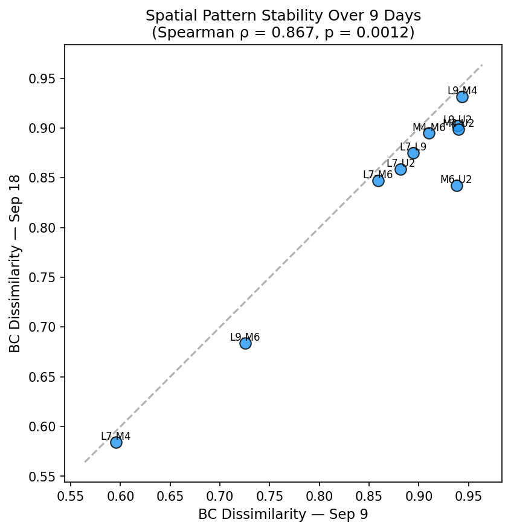

*(Notebook: 08_temporal_stability.ipynb)*

## Results

### Spatial Structure (NB02)
- 9 wells, 23,458 ASVs, 37 sediment core samples aggregated per well
- Mean Bray-Curtis = 0.747; significant distance-decay (Mantel ρ = 0.323, p = 0.029)
- East-west axis dominates (ρ = 0.227) over uphill-downhill (ρ = −0.049)
- U3-M6-L7 corridor: 3 most negative residuals (more similar than expected)
- U3-M4 and U3-L9: most positive residuals (more different than expected)

### Depth Zonation (NB03)
- 37 samples classified into VZ (33), VSZ (25), SZ1 (54), SZ2 (45) by depth + description
- PERMANOVA: zone R² = 27.5% (p = 0.0001); well R² = 19.2% (p = 0.979, NS)
- 10/12 top phyla significant for depth (Spearman p < 0.05)

### Functional Inference (NB04)
- Class-level: 22 classes, 78% coverage; redox index range 0.047 (M6) to 0.227 (U3)
- Genus-level: 65 genera annotated, 12 biogeochemical process categories
- Denitrification range: 1.9–7.7% (M5 peak); fermentation: 2.0–5.3% (L9 peak)

### Groundwater vs Sediment (NB05)
- 5 wells with both materials; within-well BC = 0.364–0.450
- GW enriched in Rhodanobacter (2.9×), Gallionella (8.9×), Sideroxydans (7.0×)

## Interpretation

### The Contamination Plume Model

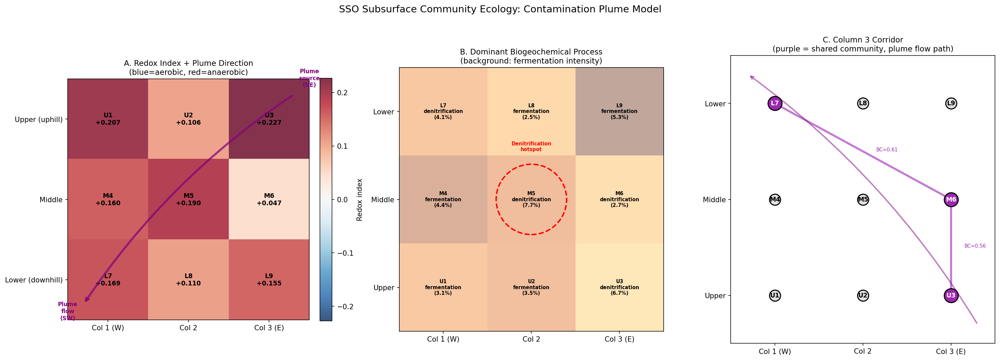

All findings converge on a single explanatory model: **the spatial structure of SSO microbial communities is governed by a contamination plume entering from the northeast and flowing southwest through the saturated zone.**

The SSO sits downhill and southwest of a contamination source at Oak Ridge Reservation Area 3, which delivers high nitrate, low pH water laden with heavy metals (uranium, chromium, nickel). The plume enters the grid near **U3** (upper-east) and flows diagonally toward **L7** (lower-west), creating the **Column 3 corridor** identified in NB02.

This model explains every major observation:

1. **Why east-west turnover exceeds uphill-downhill**: The plume edge runs laterally across the grid, not along the hillslope. Communities track contamination, not surface topography.

2. **Why U3-M6-L7 share community composition**: These wells intercept the plume flow path. Shared geochemical exposure homogenizes their communities despite being in different rows.

3. **Why depth dominates over well identity**: The plume travels through the saturated zone (SZ1/SZ2). Depth controls whether a sample is within the plume (deep = affected) or above it (shallow = background).

4. **Why M5 is the denitrification hotspot**: M5 sits at the plume mixing zone where nitrate-rich plume water meets native organic carbon — the thermodynamic sweet spot for denitrification. *Rhodanobacter denitrificans*, the dominant denitrifier at ORR contaminated sites (Green et al. 2012), reaches 7.7% relative abundance here.

5. **Why M6 is the anaerobic dead zone**: M6 lies in the plume core downstream of M5, where denitrification has consumed the nitrate and further electron acceptors are depleted. Only fermentative metabolism persists.

6. **Why the redox sequence maps onto the grid**: The spatial distribution of biogeochemical processes (O₂ → NO₃⁻ → Fe(III) → SO₄²⁻ → fermentation) follows the thermodynamic electron acceptor sequence, running from the plume entry (oxidative processes at U3) through the mixing zone (denitrification at M5) to the plume terminus (fermentation at L9).

7. **Why groundwater is enriched in plume taxa**: The flowing water carries *Rhodanobacter* (denitrifier), *Gallionella* and *Sideroxydans* (iron oxidizers) — organisms adapted to the contaminated, metal-rich plume water — while sediment-attached anaerobes remain in biofilms.

### Literature Context

The dominance of *Rhodanobacter* in contaminated ORR groundwater is well-established. Green et al. (2012) showed that *Rhodanobacter* species dominate bacterial communities in the most contaminated zones of the ORR subsurface, accounting for up to 45% of 16S sequences in low-pH, high-nitrate wells. Our finding of 7.7% *Rhodanobacter* at M5 is consistent with moderate plume influence — lower than the most contaminated Area 2 wells but clearly elevated above background.

*Anaeromyxobacter dehalogenans*, found throughout SSO sediments (1.3% mean), is a model ENIGMA organism for iron and uranium reduction in the ORR subsurface (Thomas et al. 2010). Its enrichment in sediment over groundwater (41× higher in sediment) is consistent with its known biofilm-forming, surface-attached lifestyle.

Recent work generating 77 sediment and 33 groundwater metagenomes from the ORR (MRA 2025) examines attached vs planktonic communities — our 16S-based findings provide complementary amplicon-level evidence supporting the same pattern of distinct sediment and groundwater assemblages.

The observation of significant community turnover at meter scale is noteworthy. Most subsurface distance-decay studies operate at kilometer scales (Fierer & Jackson 2006). The SSO demonstrates that contamination plumes can structure communities at sub-decameter resolution, consistent with the known sharp geochemical gradients at plume fringes.

### Novel Contribution

This analysis provides the first spatially explicit mapping of biogeochemical process distributions across the SSO 3×3 grid, inferred from 16S community composition at three taxonomic resolutions (phylum, class, genus). The key novelties are:

1. **The plume flow path is visible in community similarity**: The U3-M6-L7 corridor, identified purely from Bray-Curtis dissimilarity patterns, aligns with the expected NE→SW plume trajectory — demonstrating that 16S community similarity can map subsurface hydrology at meter scale.

2. **The redox ladder is spatially resolved**: Genus-level functional inference maps the classic thermodynamic electron acceptor sequence (O₂ → NO₃⁻ → Fe(III) → SO₄²⁻ → fermentation) onto the physical grid, with specific process hotspots at specific wells.

3. **M5 as the mixing zone**: The central well's denitrification peak (*Rhodanobacter* at 7.7%) identifies the precise location where plume nitrate meets background organic carbon — a prediction that can be validated when SSO geochemistry data is loaded into CORAL.

4. **Depth × plume interaction**: The vertical zonation (PERMANOVA R² = 27.5%) reflects the plume's confinement to the saturated zone, not just generic depth gradients. Above the water table, communities are unaffected by contamination.

### Limitations

- **No direct geochemistry**: SSO geochemistry (221 sample tubes registered in CORAL) has not been loaded into BERDL. All environmental inferences are from community composition alone. The contamination plume model generates testable predictions that await geochemical confirmation.
- **Temporal offset**: Sediment cores (Feb-Mar 2023) and groundwater (Sep 2024) were collected 18 months apart. Seasonal or plume dynamics could confound the comparison.
- **Groundwater coverage**: Only 5 of 9 wells have groundwater ASV data (L7, L9, M4, M6, U2), missing the critical wells M5 (denitrification hotspot) and U3 (plume entry). The denitrification and iron oxidation hotspot interpretations are based on sediment data; GW validation at these wells would substantially strengthen the plume model. Pump test ASV data (Brick 460-462, wells L8/M5/U2) remains available for future extraction.
- **Genus coverage uncertainty**: Genus-level functional annotation covers only 21% of total reads (65 of 1,038 genera). Process abundance estimates are lower bounds; the unclassified 56% of reads could harbor additional functional capacity. Sensitivity to this coverage gap should be assessed by comparing genus-level patterns with the higher-coverage class-level traits (78%), which show consistent redox patterns.
- **Taxonomy resolution**: Species-level classification is ~0%; genus-level covers only 44% of sediment reads. Functional inference relies on literature-based trait assignments rather than direct genomic evidence.
- **Single timepoint for sediment**: Temporal dynamics of the plume and community response cannot be assessed from one core sampling event.
- **Trait dictionary subjectivity**: Phylum/class-level trait scores are consensus estimates, not empirical measurements for these specific populations.

## Data

### Sources
| Collection | Tables Used | Purpose |
|------------|-------------|---------|
| `enigma_coral` | `sdt_sample`, `sdt_location`, `sdt_community`, `ddt_ndarray`, `ddt_brick0000457-459`, `ddt_brick0000477-479` | SSO 16S ASV data (sediment + groundwater), sample metadata, well coordinates |

### Generated Data
| File | Rows | Description |
|------|------|-------------|
| `data/well_distances.csv` | 9×9 | Inter-well geographic distances (meters) |
| `data/bc_dissimilarity_sediment.csv` | 9×9 | Bray-Curtis dissimilarity between wells |
| `data/spatial_stats.csv` | 36 | All pairwise comparisons with residuals |
| `data/community_matrix_sediment_asv.csv` | 9×23,458 | Well-aggregated ASV abundance matrix |
| `data/community_matrix_sediment_phylum.csv` | 9×85 | Well-aggregated phylum abundance matrix |
| `data/sediment_sample_zones.csv` | 159 | Sample-to-hydrogeological-zone assignments |
| `data/permanova_results.csv` | 2 | PERMANOVA results for zone and well effects |
| `data/zone_indicators.csv` | 12 | Phylum zone-association statistics |
| `data/trait_profiles_class.csv` | 9×9 | Class-level trait profiles per well |
| `data/genus_function_grid.csv` | 9×12 | Genus-inferred process abundances per well |
| `data/trait_spatial_gradients.csv` | 9 | Spatial gradient tests for each trait |
| `data/hotspot_profiles.csv` | 135 | Top 15 genera per well with guild assignments |
| `data/guild_composition.csv` | 9×11 | Guild abundance per well |

## Supporting Evidence

### Notebooks
| Notebook | Purpose |
|----------|---------|
| `01_data_integration.ipynb` | Load ASV data, compute well geometry, assign hydrogeological zones, build community matrices |
| `02_sediment_spatial.ipynb` | Bray-Curtis, Mantel test, NMDS, Procrustes, residual analysis |
| `03_depth_zonation.ipynb` | PERMANOVA (zone vs well), indicator taxa, depth correlations |
| `04_functional_inference.ipynb` | Multi-resolution trait mapping (phylum, class, genus), spatial gradients |
| `05_gw_vs_sediment.ipynb` | Groundwater vs sediment comparison, plume indicator genera |
| `06_synthesis.ipynb` | Contamination plume model, evidence synthesis |
| `07_hotspot_interactions.ipynb` | Well-by-well community profiles, metabolic guilds, co-occurrence |
| `08_temporal_stability.ipynb` | GW temporal stability, filter size effects, variance partitioning |

### Figures
| Figure | Description |
|--------|-------------|
| `well_grid_geometry.png` | SSO 3×3 grid with inter-well distances |
| `depth_zone_profile.png` | Depth distribution of hydrogeological zones per well |
| `bc_heatmap_sediment.png` | Bray-Curtis dissimilarity heatmap with row grouping |
| `mantel_distance_decay.png` | Distance-decay scatter plot with outlier pairs annotated |
| `nmds_vs_grid.png` | NMDS ordination vs nearest community neighbor on physical grid |
| `procrustes_overlay.png` | Procrustes superimposition of community ordination onto grid |
| `residual_analysis.png` | Mean residual per well and BC by row separation |
| `nmds_samples_zone_well.png` | Sample-level NMDS colored by zone and well |
| `phylum_by_zone.png` | Phylum composition by hydrogeological zone |
| `zone_indicator_heatmap.png` | Zone enrichment patterns for top phyla |
| `depth_phylum_correlation.png` | Phylum-depth Spearman correlations |
| `zone_vs_well_dissim.png` | Within-zone vs within-well dissimilarity comparison |
| `genus_process_grid.png` | Genus-inferred biogeochemical processes on 3×3 grid |
| `genus_process_clustermap.png` | Hierarchically clustered process profiles by well |
| `key_functional_gradients.png` | Redox index, fermentation, N-cycling on grid |
| `trait_grid_maps.png` | All trait profiles mapped onto grid |
| `trait_clustermap.png` | Class-level trait clustermap |
| `gw_vs_sediment_phylum.png` | Phylum bars: sediment vs groundwater at 5 wells |
| `synthesis_plume_model.png` | Three-panel synthesis: redox, processes, corridor |
| `guild_composition_bars.png` | Stacked bar chart of metabolic guilds per well |
| `guild_cooccurrence.png` | Guild co-occurrence correlation matrix |
| `temporal_vs_spatial_gw.png` | Temporal vs spatial variation in GW communities |
| `spatial_stability_mantel.png` | Spatial pattern stability across 9-day interval |

## Testable Predictions

1. **SSO geochemistry** (when loaded into CORAL): NO₃⁻ concentration, pH, and metal levels should show a NE→SW gradient, with highest contamination at U3/M6 and lowest at M4/U1.
2. **Nearby EU/ED well metals** (100WS/27WS bricks, 90–120 m NE of SSO): Should confirm that the contamination plume approaches from the northeast, with metal concentrations decreasing toward the SSO.
3. **Pump test groundwater** (Brick 460-462, wells L8/M5/U2): *Rhodanobacter* should be highest at M5 (mixing zone) and lower at L8 and U2.
4. **SSO isolate genomes** (18 genomes from M6-C2): Should encode anaerobic metabolisms (fermentation, sulfate reduction) consistent with M6's position in the plume core.

## Future Directions

1. **Load SSO geochemistry into CORAL**: The 221 registered geochemistry samples (metals, IC/TOC, isotopes, NH₃/NO₂) would allow direct correlation of community composition with measured environmental parameters, validating or refuting the plume model.
2. **Extract pump test ASV data** (Brick 460-462): A third temporal snapshot (Mar 2024) from L8, M5, U2 would test the M5 denitrification hotspot prediction and add temporal resolution.
3. **UniFrac analysis with ASV sequences**: The actual 16S sequences (Bricks 457/460/477) could enable phylogenetic distance-based beta-diversity (weighted UniFrac), which may be more sensitive to plume effects than Bray-Curtis on ASV counts.
4. **Metagenomics**: Shotgun metagenomics at the same spatial resolution would confirm functional inferences that are currently based on taxonomy-to-trait mapping, and would capture the 56% of reads without genus-level classification.
5. **Temporal monitoring**: Repeat 16S profiling across seasons and plume dynamics would reveal whether community structure tracks plume fluctuations in real time.

## References

- Green SJ, Prakash O, Jasrotia P, Overholt WA, Cardenas E, Huber D, Schadt CW, Dalton D, Kaber K, Brooks SC, Watson DB, Tiedje JM. (2012). "Denitrifying bacteria from the genus Rhodanobacter dominate bacterial communities in the highly contaminated subsurface of a nuclear legacy waste site." *Applied and Environmental Microbiology* 78(4):1039-47. PMID: [22179244](https://pubmed.ncbi.nlm.nih.gov/22179244/)
- Prakash O, Green SJ, Jasrotia P, Overholt WA, Canez A, Palumbo AV, Tiedje JM, Kostka JE. (2012). "*Rhodanobacter denitrificans* sp. nov., isolated from nitrate-rich zones of a contaminated aquifer." *International Journal of Systematic and Evolutionary Microbiology* 62:2457-62. PMID: [22140175](https://pubmed.ncbi.nlm.nih.gov/22140175/)
- Green SJ, Prakash O, Gihring TM, Akob DM, Jasrotia P, Jardine PM, Watson DB, Brown SD, Palumbo AV, Kostka JE. (2010). "Denitrifying bacteria isolated from terrestrial subsurface sediments exposed to mixed-waste contamination." *Applied and Environmental Microbiology* 76(10):3244-54. PMID: [20305024](https://pubmed.ncbi.nlm.nih.gov/20305024/)
- Thomas SH, Wagner RD, Arakaki AK, Skolnick J, Kirby JR, Shimkets LJ, Sanford RA, Löffler FE. (2008). "The mosaic genome of *Anaeromyxobacter dehalogenans* strain 2CP-C suggests an aerobic common ancestor to the delta-proteobacteria." *PLoS ONE* 3(5):e2103. PMID: [18461131](https://pubmed.ncbi.nlm.nih.gov/18461131/)
- Fierer N, Jackson RB. (2006). "The diversity and biogeography of soil bacterial communities." *Proceedings of the National Academy of Sciences* 103(3):626-31. PMID: [16407148](https://pubmed.ncbi.nlm.nih.gov/16407148/)
- Watson DB, Wu WM, Mehlhorn T, Tang G, Earles J, Lowe K, Gihring TM, Zhang G, Phillips J, Boyanov MI, Spalding BP, Schadt C, Kemner KM, Criddle CS, Jardine PM, Brooks SC. (2013). "In situ bioremediation of uranium with emulsified vegetable oil as the electron donor." *Environmental Science & Technology* 47(12):6440-48. PMID: [23631611](https://pubmed.ncbi.nlm.nih.gov/23631611/)
- Arkin AP, Cottingham RW, Henry CS, et al. (2018). "KBase: The United States Department of Energy Systems Biology Knowledgebase." *Nature Biotechnology* 36:566-569. PMID: [29979655](https://pubmed.ncbi.nlm.nih.gov/29979655/)
