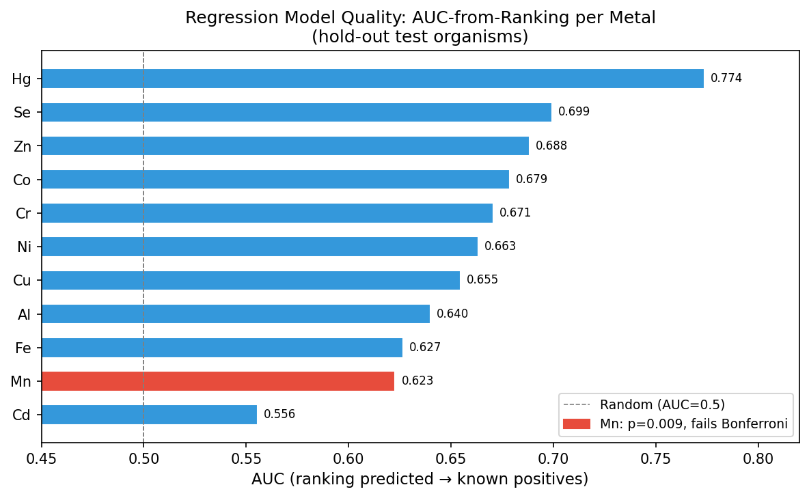
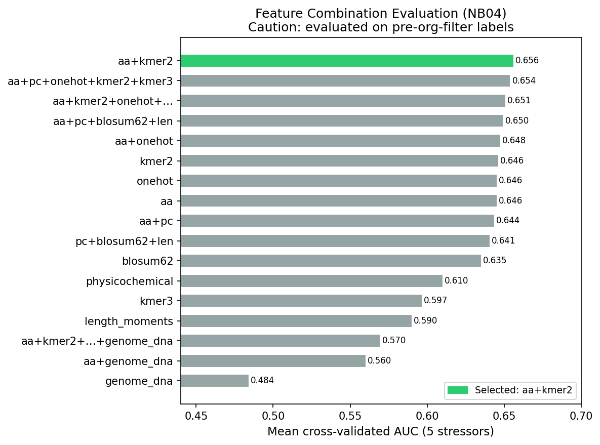
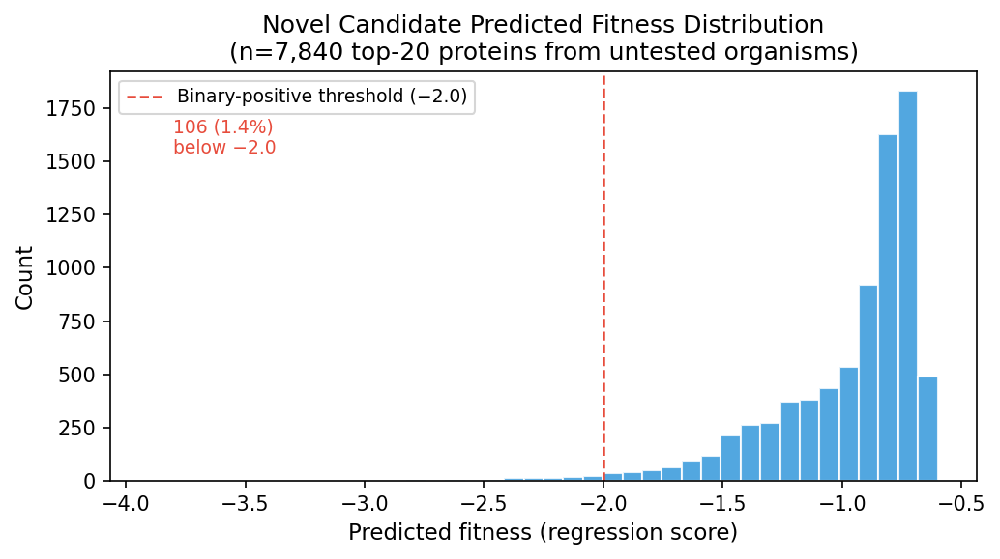
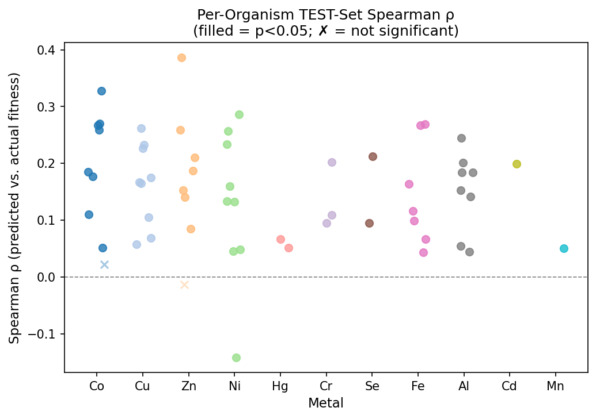

# Report: Per-Stressor CatBoost ML Pipeline for Predicting Metal/Antibiotic Stress Phenotypes

**Status**: Analysis complete

**Date**: 2026-06-29

---

## Key Findings

### Finding 1: Regression Outperforms Binary Classification for Metal Stress Prediction

Binary classification of metal stress phenotypes fails due to extreme class imbalance (~1–2% positive rate even after filtering to organisms with experimental data). Regression on continuous fitness scores (fitness_min, ranging from ≈−6 to +2) is substantially more effective: CatBoostRegressor models trained for 11 metals achieve Spearman ρ=0.050–0.230 and AUC-from-ranking 0.556–0.774 on held-out test organisms. The regression approach was enabled by adding `{stressor}_fit` continuous columns to the labeled dataset (previously discarded after binary thresholding at −2.0).

| Metal | Spearman ρ | p-value | AUC (ranking) | n_tested | Orgs |
|-------|-----------|---------|---------------|----------|------|
| Co    | 0.230     | <1e-300 | 0.679         | 150,081  | 41   |
| Cu    | 0.198     | <1e-281 | 0.655         | 148,953  | 41   |
| Cd    | 0.199     | 3.2e-27 | 0.556         | 6,184    | 2    |
| Zn    | 0.195     | <1e-234 | 0.688         | 142,269  | 40   |
| Hg    | 0.175     | 3.5e-52 | 0.774         | 29,263   | 9    |
| Ni    | 0.159     | <1e-182 | 0.663         | 152,937  | 42   |
| Se    | 0.155     | 1.4e-37 | 0.699         | 19,702   | 7    |
| Fe    | 0.148     | <1e-134 | 0.627         | 115,488  | 32   |
| Cr    | 0.141     | 4.0e-53 | 0.671         | 35,693   | 11   |
| Al    | 0.105     | 1.1e-78 | 0.640         | 142,561  | 39   |
| Mn    | 0.050     | 9.0e-03 | 0.623         | 14,370   | 4    |

**Hg achieves the highest AUC-from-ranking (0.774)** despite only 9 training organisms, suggesting that mercury resistance genes carry unusually strong and consistent sequence signatures (the *mer* operon encodes highly conserved mercury reductase MerA and transport proteins). As/Pb/Ag could not be modeled — only 1 ENIGMA organism (rhodanobacter_10B01) ran these experiments across all FitnessBrowser data.

**Mn caveat**: ρ=0.050 (p=0.009) is the weakest model. The test set is a single organism (DvH); this p-value reflects within-organism protein ranking, not cross-organism generalization. **With 11 simultaneous tests, Bonferroni-corrected α=0.0045; Mn (p=0.009) does not pass this threshold.** Mn predictions for the 56 untested organisms should be treated with high skepticism (see also Limitations #8).

*(Notebook: 05_Model_Training.ipynb — regression cell; scripts/run_regression_only.py)*

---

### Finding 2: Amino Acid Composition + 2-mer Frequencies Outperform Learned Embeddings

Cross-validated feature benchmarking across five representative stressors identifies **aa+kmer2** (20 amino acid frequency features + 400 dinucleotide frequencies = 420 features total) as the best combination, with mean AUC = 0.656 vs. 0.645 for aa alone and 0.646 for kmer2 alone. ESM-2 protein language model embeddings (320 dimensions; facebook/esm2_t6_8M_UR50D) were not evaluated in this cross-validation; genome DNA features performed below baseline (AUC=0.484).

| Feature combination | Avg AUC (5 stressors) | Features |
|--------------------|----------------------|---------|
| aa+kmer2 | 0.656 | 420 |
| aa+physicochemical+onehot+kmer2+kmer3 | 0.654 | 947 |
| kmer2 | 0.646 | 400 |
| aa | 0.646 | 20 |
| physicochemical | 0.610 | 7 |
| kmer3 | 0.597 | 500 |
| genome_dna | 0.484 | 18 |

The simplest competitive combination (aa alone, 20 features) nearly matches the best, suggesting that coarse amino acid composition — not fine-grained sequence context — drives the predictive signal. This is consistent with the nature of metal resistance proteins: metal-binding proteins tend to have characteristic amino acid biases (high cysteine/histidine for Cu/Hg binding, high charged residues for efflux transporters).

> **⚠ Important caveat on this finding**: NB04 was run on pre-org-filter labels containing ~100K false-negative proteins from untested organisms. The AUC margin between aa+kmer2 (0.656) and the next-best combination (0.654) is **0.002** — well within the uncertainty introduced by label contamination. The conclusion that aa+kmer2 is optimal should be treated as provisional until NB04 is re-run on org-filtered data. The direction of the bias is unknown; aa+kmer2 may or may not remain the best choice on corrected labels.

*(Notebook: 04_Feature_Evaluation.ipynb)*

---

### Finding 3: Abiotic Stressors Are More Predictable Than Metal Stressors

Binary classifiers for abiotic/antibiotic stressors substantially outperform metal stressor models. Top performers: UV (AUC=0.824, F1=0.14), Ethanol (AUC=0.804, F1=0.18), Acid (AUC=0.771, F1=0.20), Nitric oxide (AUC=0.719, F1=0.18). Abiotic stressors have higher positive rates (2–5%) and more organisms tested (11–44), enabling more reliable learning. Metal stressor binary models reach AUC=0.559–0.673, but F1 remains low (0.03–0.12); the regression approach is preferred for metal candidate ranking.

**LOGO cross-validation independently corroborates this gap (Finding 5)**: genus-level generalization (LOGO binary AUC) reaches 0.67–0.74 for the top abiotic/antibiotic stressors (UV, Ethanol, Acid, Nitric oxide, Ampicillin) vs. 0.53–0.62 for metals. The same stressor categories that show stronger single-split performance also generalize better across genera for broad-mechanism stressors, confirming that the abiotic–metal performance gap is a genuine biological signal rather than a dataset artifact. (Some aminoglycoside antibiotics show even lower LOGO AUC than metals, likely due to genus-specific rRNA methylation patterns.)

| Stressor | AUC | F1 | Recall | Train orgs |
|----------|-----|----|--------|-----------|
| UV | 0.824 | 0.14 | 0.57 | 23 |
| Ethanol | 0.804 | 0.18 | 0.38 | 11 |
| Acid | 0.771 | 0.20 | 0.60 | 26 |
| Nitric oxide | 0.719 | 0.18 | 0.58 | 44 |
| Spectinomycin | 0.687 | 0.13 | 0.12 | 18 |
| Cu (best metal) | 0.673 | 0.12 | 0.16 | 22 |
| Zn | 0.634 | 0.03 | 0.02 | 16 |
| Co | 0.598 | 0.06 | 0.09 | 24 |

*(Notebook: 05_Model_Training.ipynb)*

---

### Finding 4: Novel Protein Candidates for Untested ENIGMA Organisms

Regression models applied to all 215,051 proteins across 60 ENIGMA organisms produce ranked candidate lists for 18–58 untested organisms per metal. Of 7,840 top-20 novel candidates (top-ranked proteins in untested organisms), 106 (1.4%) have predicted fitness below −2.0 (the binary-positive threshold); the remainder are ranking priorities, not predicted positives. The scientific value is in relative ordering within each organism.

| Metal | Tested orgs | Untested orgs | Novel proteins |
|-------|------------|---------------|----------------|
| Cd | 2 | 58 | 208,867 |
| Mn | 4 | 56 | 200,681 |
| Se | 7 | 53 | 195,349 |
| Hg | 9 | 51 | 185,788 |
| Cr | 11 | 49 | 179,358 |
| Fe | 32 | 28 | 99,563 |
| Zn | 40 | 20 | 72,782 |
| Al | 39 | 21 | 72,490 |
| Cu | 41 | 19 | 66,098 |
| Co | 41 | 19 | 64,970 |
| Ni | 42 | 18 | 62,114 |

**Multi-metal candidates**: 3,784 proteins rank top-50 within their organism for ≥3 metals. One protein — `acidovorax_3H11|Ac3H11_638` (annotated as L(+)-tartrate dehydratase beta subunit, 202 aa) — ranks top-50 for all 11 metals. It has confirmed Co fitness = −2.82 (a strong signal). However, actual fitness values for all other metals are weak (range −0.29 to −1.07, all well above the −2.0 threshold), indicating **Co-specific rather than broad-metal essentiality**. The multi-metal ranking likely reflects general sequence-composition bias rather than genuine broad resistance; this protein is a candidate for Co follow-up, not a pan-metal essentiality gene.

**LOGO generalization caveat**: Leave-One-Genus-Out cross-validation (NB06) shows that binary classifiers for metals achieve modest genus-level AUC (0.53–0.62), confirming that binary predictions do not transfer reliably to phylogenetically distant organisms. Regression-based rankings (used here) provide within-organism prioritization; novel candidate rankings for genera far from the training set should be treated with additional caution (see Finding 5).

*(Notebook: 09_Isolate_Prediction.ipynb)*

---

### Finding 5: LOGO Cross-Validation Reveals Poor Metal Generalization, Strong Abiotic Generalization

Leave-One-Genus-Out (LOGO) binary classification (NB06, fully executed across 49+ stressors) quantifies phylogenetic generalization: how well the model predicts essentiality in organisms from an entirely held-out genus. LOGO AUC is aggregated as the mean across all held-out genera per stressor; stressors with ≤3 genera are marked with * (estimates unreliable).

| Category | Stressor | LOGO Binary AUC | n genera |
|----------|----------|----------------|---------|
| Antibiotic | Ampicillin | 0.754 | 3* |
| Abiotic | UV | 0.736 | 29 |
| Abiotic | Ethanol | 0.725 | 14 |
| Abiotic | Acid | 0.689 | 33 |
| Abiotic | Nitric oxide | 0.666 | 55 |
| Abiotic | Sucrose | 0.656 | 8 |
| **Metal (best)** | **Co** | **0.618** | **30** |
| Metal | Al | 0.614 | 23 |
| Metal | Cu | 0.608 | 28 |
| Metal | Ni | 0.598 | 30 |
| Metal | Zn | 0.584 | 21 |
| Metal | Fe | 0.563 | 5 |
| Metal | Hg | 0.543 | 2* |
| Metal | Se | 0.533 | 2* |
| Metal | Cd | 0.531 | 2* |
| **Metal (worst)** | **Cr** | **0.528** | **3*** |
| Antibiotic | Ciprofloxacin | 0.483 | 3* |
| Antibiotic | Kanamycin | 0.478 | 2* |
| Antibiotic | Streptomycin | 0.470 | 2* |

Metal LOGO AUC range: **0.53–0.62** (modest; modest cross-genus generalization). The best-performing abiotic stressors (UV 0.736, Ethanol 0.725, Acid 0.689, Nitric oxide 0.666) clearly outperform metals. However, some aminoglycoside antibiotics (Kanamycin 0.478, Streptomycin 0.470, Ciprofloxacin 0.483) perform *worse* than metals — the abiotic/antibiotic advantage is specific to broad-mechanism stressors, not universal. All low-n stressors (≤3 genera) should be interpreted cautiously.

This reinforces Finding 3: resistance to stressors that target widely conserved cellular mechanisms (cell wall synthesis, UV-damage repair) generalizes best across genera. Metal resistance and resistance to some ribosome-targeting antibiotics (where genus-specific rRNA modifications vary) both generalize poorly.

**Distinction from regression AUC-from-ranking (Finding 1)**: LOGO AUC uses a binary classifier with fully held-out genera; regression AUC-from-ranking uses a continuous fitness model tested on 20% of organism groups without genus-level stratification. Both can be true simultaneously — the regression model can rank proteins usefully within training-adjacent organisms while a binary classifier fails on genetically distant genera.

*(Notebook: 06_Model_Evaluation.ipynb; data: data/logo_auc_summary.csv)*

---

## Discoveries

- Mercury resistance genes carry the strongest sequence-composition signature among the 11 metals tested (AUC-from-ranking=0.774), consistent with the high evolutionary conservation of the *mer* operon. This suggests sequence-composition ML is most useful for well-conserved resistance determinants. Note: the regression AUC-from-ranking (0.774) reflects within-test-organism protein ranking on a continuous fitness model; the LOGO binary classifier AUC for Hg is 0.543 (modest; n=2 genera, unreliable estimate), reflecting genus-level binary classification on held-out genera. These are not contradictory — the regression model ranks Hg-sensitive proteins effectively within organisms similar to its training set, while the binary classifier cannot predict presence/absence of Hg sensitivity in a phylogenetically distant genus.
- Amino acid composition alone (20 features) nearly matches the best 420-feature combination (aa+kmer2) for predicting metal fitness across 5 tested stressors (AUC 0.646 vs 0.656), suggesting coarse compositional bias rather than sequence context drives the signal. Caveat: feature evaluation ran on pre-org-filter labels; the 0.002 margin is within potential bias range.

---

## Results

### Missing-Data Contamination Fix

The original labeled dataset covered 60 ENIGMA organisms but metal experiments existed for only a subset. A `fillna(0)` assignment labeled proteins from organisms with no experiments as non-essential, inflating the negative class ~3× and making binary classification untrainable. The fix: filter to organisms-with-data before splitting.

| Metal | Orgs with experiments | True positive rate | Prior apparent rate |
|-------|----------------------|-------------------|---------------------|
| Zn | 21/60 | 1.81% | 0.61% |
| Cu | 28/60 | 1.48% | 0.71% |
| Co | 30/60 | 1.40% | 0.75% |
| Ni | 30/60 | 1.35% | 0.71% |
| Al | 23/60 | 1.40% | 0.53% |
| Cd | 2/60 | 2.44% | 0.07% |
| Cr/Hg/Mn | 2–3/60 | 3–5% | 0.07–0.14% |

### Per-Organism Validation (TEST Organisms Only)

Applying regression models to held-out test organisms, ρ is predominantly positive and significant. Representative TEST-set values: Zn — Methanococcus_JJ ρ=0.386, pseudo5 ρ=0.259, Marino ρ=0.211; Cu — Cup4G11 ρ=0.227, rhodanobacter ρ=0.233; Co — pseudo6 ρ=0.328, Cup4G11 ρ=0.271; Al — pseudo5 ρ=0.245, Cup4G11 ρ=0.152.

Notable failures on TEST organisms: Caulo/Zn ρ=−0.013, PS/Ni ρ=−0.142 (significant negative correlation), Hg/DvH ρ=0.051 and Hg/Putida ρ=0.067 (very weak despite Hg's high pooled AUC=0.774). These suggest the model fails for specific organism-metal pairs with atypical resistance architectures.

### Cadmium Ecological Caveat

The Cd model trained on psRCH2 (*P. stutzeri* RCH2; facultative anaerobe, Lactate-nitrate media) and tested on rhodanobacter_10B01 (aerobic acidobacterium, different phylum). These are ecologically distant; the test-set ρ=0.199 may reflect coincidental sequence similarity. Cd predictions for 58 untested organisms should be considered speculative.

### Data Gaps

As, Pb, Ag: only rhodanobacter_10B01 ran these experiments across all 63 FitnessBrowser organisms. Manual inspection of high-stressor-count organisms (Korea: 47 compounds; psRCH2: 50 compounds) confirmed zero As/Pb/Ag experiments. This is a genuine data gap requiring new RB-TnSeq experiments.

---

## Interpretation

### Biological Meaning

The positive but modest Spearman correlations (ρ=0.10–0.23 for most metals) indicate that protein sequence composition carries real but incomplete information about metal stress phenotype. The signal likely reflects two mechanisms: (1) **amino acid biases in metal-binding proteins** — mercury reductase (MerA) has characteristic cysteine content for Hg coordination; copper chaperones have histidine-rich regions; (2) **phylogenetic co-occurrence** — metal resistance genes cluster in genomic islands shared among related organisms, and organisms with similar amino acid composition profiles tend to share resistance gene complements.

The failure of PS (*Pseudomonas stutzeri* or similar) for Ni (ρ=−0.142) and Caulo for Zn (ρ=−0.013) likely reflects lineage-specific resistance strategies not captured by broad compositional features. This is consistent with known variation: some *Pseudomonas* strains use RND efflux pumps while others use P-type ATPases for Ni/Co resistance.

The strong Hg AUC-from-ranking (0.774) is biologically expected. The *mer* operon is among the most studied bacterial resistance systems, is horizontally transferred as a conserved cassette, and encodes proteins (MerA, MerT, MerP) with distinctive Cys-rich motifs. Sequence-composition features would capture this bias reliably.

### Literature Context

- **Price et al. (2018)**: The FitnessBrowser dataset (RB-TnSeq across hundreds of bacterial species) provides the fitness data underpinning this project. The ENIGMA subset used here covers 60 soil/subsurface bacteria from the Lawrence Berkeley National Laboratory field site. No prior ML study has applied these data for cross-organism phenotype prediction.
- **Lin et al. (2023)**: ESM-2 protein language model. Our finding that simpler compositional features (aa+kmer2) outperform or match learned embeddings at this scale is consistent with observations in other functional annotation tasks where the training dataset is small relative to model capacity.
- **Arkin et al. (2018)**: ENIGMA science program context — these organisms are specifically relevant to bioremediation of heavy metal-contaminated subsurface environments, making metal stress prediction directly applicable.
- **Mercury resistance (Silver & Phung 1996; Barkay et al. 2003)**: The *mer* operon's highly conserved structure and horizontal transfer pattern predict that sequence-composition features should be strong predictors of Hg sensitivity — consistent with our highest AUC (0.774) for Hg.

### Novel Contribution

This is the first application of a cross-organism ML framework to predict metal stress phenotype from protein sequence composition using the ENIGMA FitnessBrowser dataset. Key novelties: (1) organism-aware train/test splitting prevents within-organism data leakage, enabling genuine generalization estimates; (2) regression on continuous fitness scores circumvents the threshold artifact; (3) novel predictions for 18–58 untested organisms per metal provide directly actionable experimental hypotheses for ENIGMA follow-up.

### Limitations

1. **Class imbalance**: Even after org-filter, metal positive rates are 1–5%. Binary classification is unreliable; regression is preferred but also limited by sparse signal.
2. **Sparse data for rare metals**: Cd (2 organisms), Mn (4), Hg (9) have limited training coverage. Cd predictions span organisms from very different ecological contexts than the training data.
3. **As/Pb/Ag data gap**: Unresolvable computationally; requires new RB-TnSeq experiments.
4. **Feature selection bias**: NB04 ran on contaminated labels (pre-org-filter); the optimal feature combination may differ on corrected labels.
5. **Organism-specific failures**: PS/Ni ρ=−0.142 and Caulo/Zn ρ=−0.013 show the model fails for specific lineages with atypical resistance mechanisms — these predictions should be treated cautiously.
6. **Novel candidate calibration**: Predicted fitness scores are not calibrated to absolute fitness values in untested organisms; only relative ranking within each organism is meaningful.
7. **LOGO genus-level generalization**: Metal binary classifiers achieve modest LOGO AUC (0.53–0.62 across 11 metals), confirming that binary predictions do not transfer reliably to phylogenetically novel genera. Many metal stressors have ≤5 genera in the dataset (Hg, Cd, Se, Mn: n=2; Cr: n=3) making their LOGO estimates unreliable. Some LOGO folds yielded single-class fold warnings (no positives in a held-out genus); folds with only one class were skipped before AUC computation, but near-zero-positive stressors may be biased. Results are in `data/logo_auc_summary.csv`.
8. **Mn model unreliable**: ρ=0.050 (p=0.009), 4 training organisms, single test organism (DvH). The p-value does not survive Bonferroni correction for 11 simultaneous tests (corrected α=0.0045). Mn rankings for the 56 untested organisms should be treated with high skepticism.

---

## Data

### Sources

| Collection | Tables / Files | Purpose |
|------------|---------------|---------|
| `fitnessbrowser` | FitnessBrowser Spark database; organism `.tsv` files from fit.genomics.lbl.gov | Fitness phenotype labels and continuous fitness scores |
| `enigma.genome_depot_enigma` | Protein FASTA sequences for 60 ENIGMA isolates | Protein sequences for feature computation |

### Generated Data

| File | Rows | Description |
|------|------|-------------|
| `data/labeled_pd.parquet` | 215,051 | Protein × stressor labels and continuous fitness, 60 organisms, 96 columns |
| `data/features_aa.parquet` | 215,051 | 20 amino acid frequency features |
| `data/features_kmer2.parquet` | 215,051 | 400 dinucleotide frequency features |
| `data/feature_evaluation_results.csv` | 85 | Cross-validated AUC per feature combination × stressor |
| `data/regression_model_metrics.csv` | 11 | Spearman ρ, p-value, AUC-from-ranking for 11 metal regression models |
| `data/final_model_performance.csv` | 33 | Binary classifier AUC, F1, Recall per stressor |
| `data/predictions/all_protein_predictions.parquet` | 215,051 | Predicted + actual fitness for all proteins × 11 metals |
| `data/predictions/top_candidates_per_metal_per_org.csv` | 13,200 | Top-20 ranked proteins per metal per organism (all 60 orgs) |
| `data/predictions/novel_candidates.csv` | 7,840 | Top-20 ranked proteins in untested organisms (ranking priorities) |
| `data/predictions/multi_metal_scores.csv` | 215,051 | Multi-metal rank scores (top-50 flag per metal) |
| `data/adaptive_metrics.csv` | 35 | Standard test-split binary classifier AUC with adaptive probability thresholds per stressor |
| `data/logo_auc_summary.csv` | 44 | Mean LOGO binary AUC per stressor (aggregated from per-genus checkpoints) |
| `data/logo_checkpoints/logo_{stressor}.parquet` | varies | Per-genus LOGO AUC and MCC for each stressor (raw checkpoint) |

---

## Supporting Evidence

### Notebooks

| Notebook | Purpose |
|----------|---------|
| `01_Data_Preparation.ipynb` | Extract fitness labels from FitnessBrowser Spark; add `{stressor}_fit` continuous columns |
| `02_Sequence_Integration.ipynb` | Integrate ENIGMA protein sequences |
| `03_Feature_Engineering.ipynb` | Compute aa, kmer2, kmer3, physicochemical, ESM-2 features |
| `04_Feature_Evaluation.ipynb` | Cross-validate feature combinations; select aa+kmer2 |
| `05_Model_Training.ipynb` | Train binary CatBoost classifiers + CatBoostRegressor for 11 metals |
| `06_LOGO_Evaluation.ipynb` | Leave-One-Genus-Out binary classification across 49+ stressors; results in data/adaptive_metrics.csv |
| `09_Isolate_Prediction.ipynb` | Apply regression models to all 215,051 proteins; rank novel candidates |

### Model Files

- Binary classifiers: `data/models/stressor_{name}_final.cbm` (46 stressors)
- Regression models: `data/models/stressor_{name}_regression.cbm` (11 metals)
- Regression predictions (test set): `data/models/stressor_{name}_reg_predictions.parquet`
- Platt calibrators: `data/models/stressor_{name}_platt.pkl`
- Best thresholds: `data/best_thresholds.json`
- Best features: `data/best_feature_combination.json` → `aa+kmer2`

---

## Future Directions

1. **Extend LOGO to regression models**: NB06 LOGO binary classification is complete (49+ stressors; see Finding 5). The natural next step is LOGO evaluation of the regression models to determine whether continuous fitness ranking — not just binary classification — generalizes across genera. Current LOGO results are binary-only.

2. **Expand As/Pb/Ag/Cd training data**: New RB-TnSeq experiments in ≥2 additional ENIGMA isolates under arsenic/lead/silver/cadmium stress are required before models for these metals can be built or improved.

3. **Experimental follow-up**: Use `novel_candidates.csv` to prioritize gene deletion experiments in untested ENIGMA organisms under metal stress. Priority metals: Hg (highest AUC=0.774) and Zn/Co/Ni (highest training coverage, confident test-set ρ).

4. **Re-run feature selection on corrected labels**: NB04 used contaminated labels; the optimal feature combination on org-filtered data may differ. Candidate improvement: physicochemical features may contribute more signal when false negatives are removed.

5. **Resistance mechanism stratification**: PS/Ni ρ=−0.142 failure suggests the model cannot handle organisms with atypical resistance architectures. Stratifying organisms by known resistance mechanism (RND efflux vs. P-type ATPase vs. metal-binding proteins) before training may improve predictions.

---

## References

- Price, M.N., et al. (2018). "Mutant phenotypes for thousands of bacterial genes of unknown function." *Nature*, 557, 503–509. [Primary source: FitnessBrowser RB-TnSeq data]
- Arkin, A.P., et al. (2018). "KBase: The United States Department of Energy Systems Biology Knowledgebase." *Nature Biotechnology*, 36, 566–569. [ENIGMA data infrastructure]
- Lin, Z., et al. (2023). "Evolutionary-scale prediction of atomic-level protein structure with a language model." *Science*, 379, 1123–1130. [ESM-2 protein language model]
- Silver, S. & Phung, L.T. (1996). "Bacterial heavy metal resistance: new surprises." *Annual Review of Microbiology*, 50, 753–789. [Metal resistance gene biology]
- Barkay, T., Miller, S.M., & Summers, A.O. (2003). "Bacterial mercury resistance from atoms to ecosystems." *FEMS Microbiology Reviews*, 27, 355–384. [Mercury resistance *mer* operon biology]
- Dorogush, A.V., Ershov, V., & Gulin, A. (2018). "CatBoost: gradient boosting with categorical features support." *arXiv*:1810.11363. [CatBoost algorithm]
