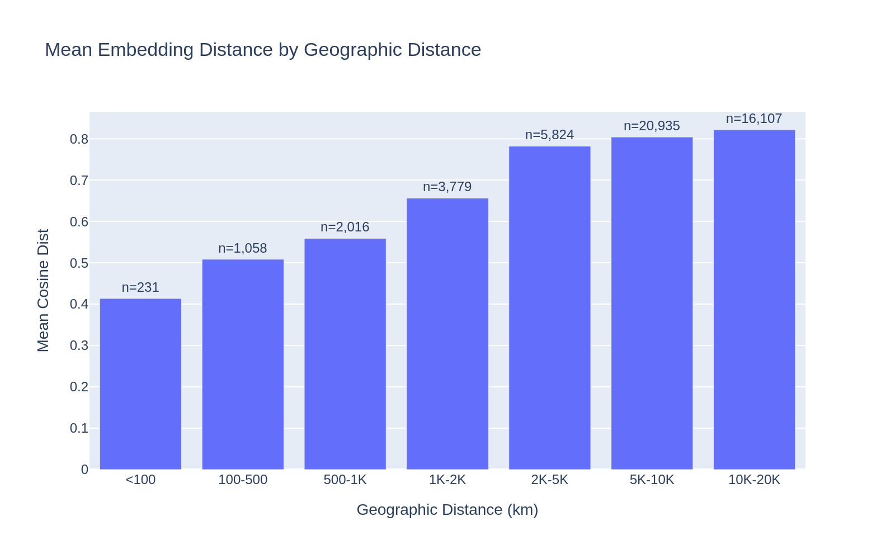
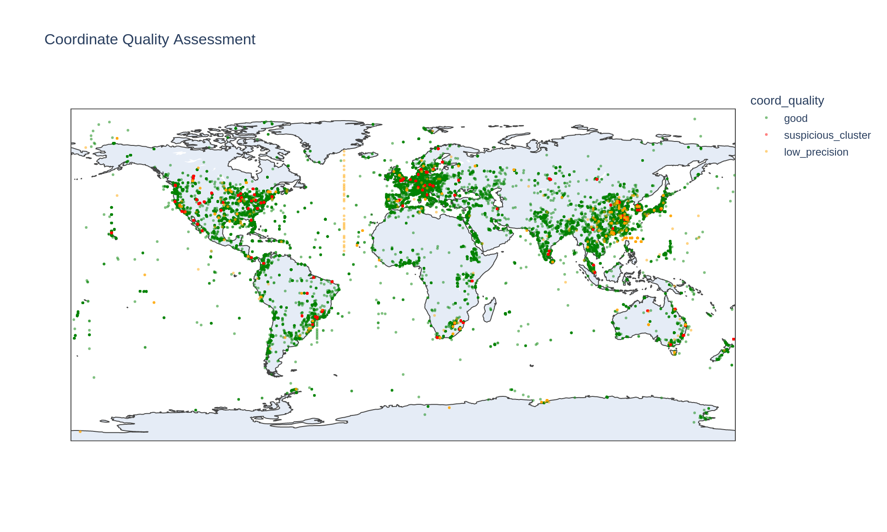
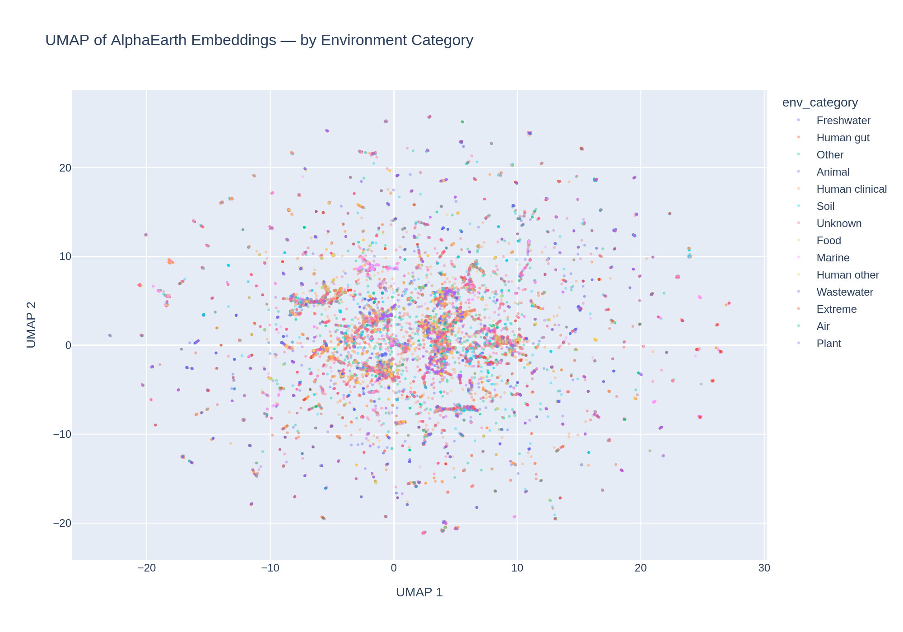
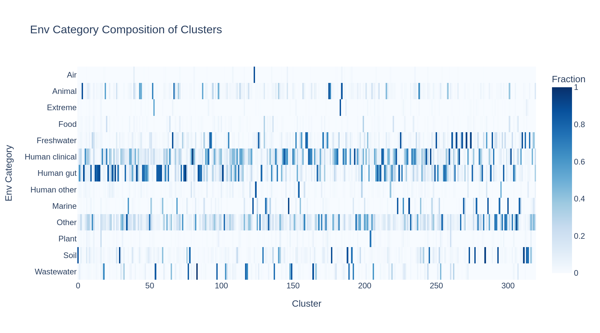
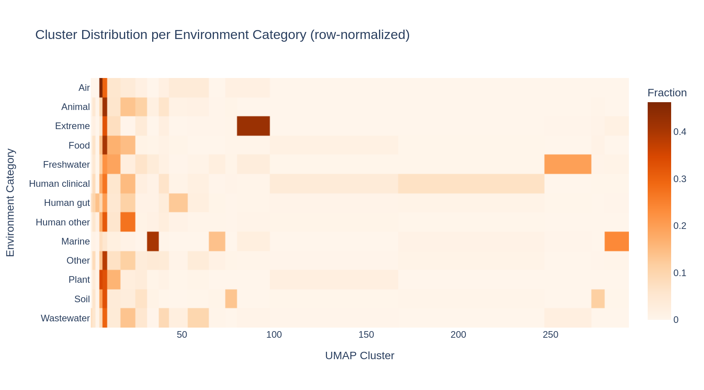
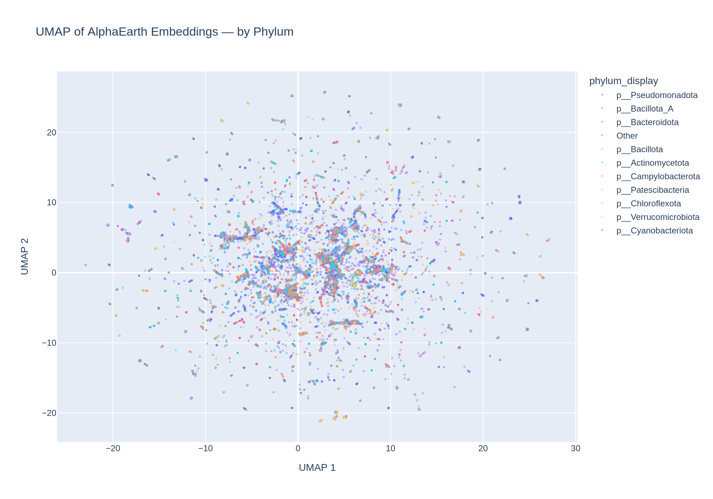
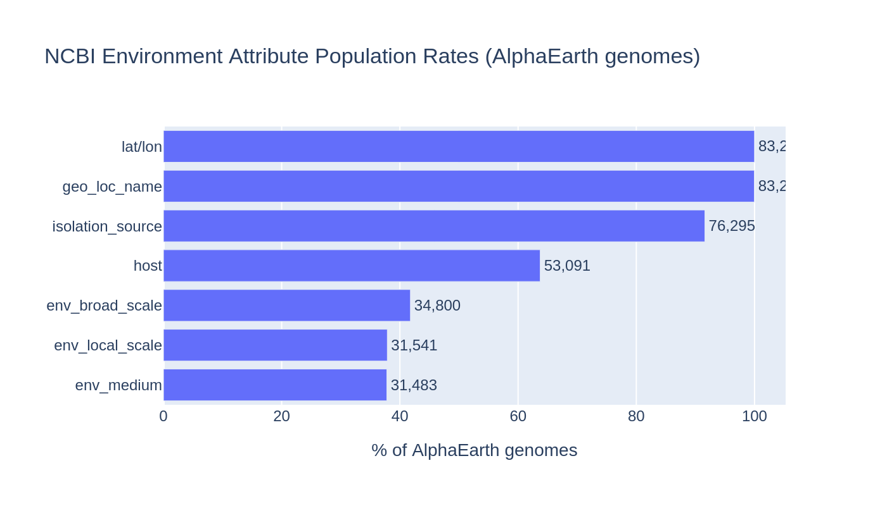
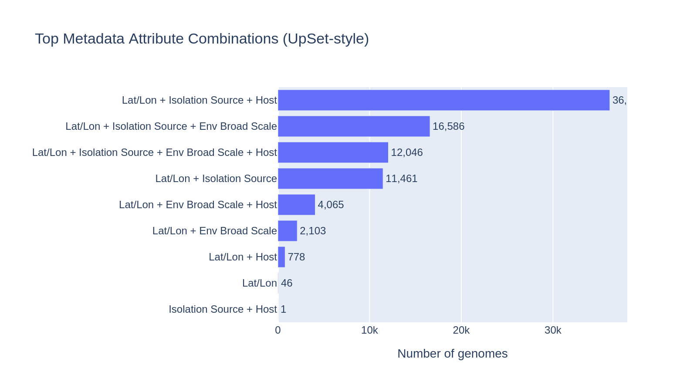

# Report: AlphaEarth Embeddings, Geography & Environment Explorer

## Key Findings

### 1. Environmental samples show 3.4x stronger geographic signal than human-associated samples

AlphaEarth embeddings encode geographic/environmental signal, but the strength depends on the sample source. For **environmental samples** (Soil, Marine, Freshwater, Extreme, Plant), nearby genomes (<100 km) have mean cosine distance 0.27, rising to 0.90 at intercontinental distances (>10,000 km) — a **3.4x ratio**. For **human-associated samples** (gut, clinical, other), the gradient is flatter: 0.37 nearby to 0.75 far — only a **2.0x ratio**.

This reflects the fact that hospitals and clinics worldwide share similar satellite imagery (urban built environment), so human-associated genomes have more homogeneous embeddings regardless of geography. Environmental samples, from genuinely diverse landscapes, show much stronger geographic differentiation. The pooled "All samples" curve (2.0x ratio) is a blend of these two signals, dominated by the 38% human-associated fraction.

*(Notebook: 02_interactive_exploration.ipynb)*

### 2. AlphaEarth embeddings encode real geographic signal — not noise

Across all 50,000 sampled genome pairs (using only good-quality coordinates), there is a clear monotonic relationship between geographic distance and embedding cosine distance. The relationship is strongest at short distances (<2,000 km) and plateaus at intercontinental scales (>5,000 km), suggesting the embeddings capture local environmental conditions (climate, vegetation, land use) that are spatially autocorrelated.

| Geographic Distance | Mean Cosine Distance | N pairs |
|---------------------|---------------------|---------|
| <100 km | 0.41 | 231 |
| 100–500 km | 0.51 | 1,058 |
| 500–1K km | 0.56 | 2,016 |
| 1K–2K km | 0.66 | 3,779 |
| 2K–5K km | 0.78 | 5,824 |
| 5K–10K km | 0.80 | 20,935 |
| 10K–20K km | 0.82 | 16,107 |

*(Notebook: 02_interactive_exploration.ipynb)*

### 3. Strong clinical/human sampling bias in the AlphaEarth subset

38% of the 83,287 genomes with AlphaEarth embeddings are human-associated: Human clinical (16,390; 20%), Human gut (13,466; 16%), and Human other (1,669; 2%). Environmental categories are much smaller: Soil (6,073; 7%), Marine (5,850; 7%), Freshwater (5,840; 7%). This reflects NCBI's overall bias toward pathogen sequencing — clinical isolates tend to have good geographic metadata from epidemiological tracking, which is why they have AlphaEarth embeddings.

An additional 13,944 genomes (17%) were classified as "Other" — site-specific labels (e.g., "Aspo HRL", "Olkiluoto" — underground research labs), generic terms ("water", "bodily fluid"), and clinical sites not captured by current keywords.

*(Notebook: 02_interactive_exploration.ipynb)*

### 4. 36% of coordinates flagged as potential institutional addresses

30,469 genomes (36.6%) cluster at shared coordinates with >50 genomes and >10 species — a heuristic for institutional addresses rather than sampling sites. However, several flagged locations are legitimate field research sites:

| Location | Coordinates | Genomes | Context |
|----------|------------|---------|---------|
| Rifle, CO | 39.54, -107.78 | 1,883 | DOE IFRC groundwater research site |
| Saanich Inlet, BC | 48.36, -123.30 | 1,529 | Oceanographic O2-minimum zone |
| Siberian soda lakes | 52.11, 79.17 | 812 | Extremophile sampling campaigns |
| Pittsburgh, PA | 40.44, -79.97 | 630 | Likely institutional (diverse clinical) |
| Lima, Peru | -12.0, -77.0 | 1,641 | Integer coords, likely approximate |

The current heuristic is a rough first pass. A refined approach should check whether genomes at each location have homogeneous isolation sources (real site) vs diverse unrelated sources (institutional).

*(Notebook: 02_interactive_exploration.ipynb)*

### 5. UMAP reveals fine-grained embedding structure with environment-correlated clusters

UMAP reduction of the 64-dimensional embeddings to 2D reveals substantial structure. DBSCAN clustering identified 320 clusters. The cluster–environment cross-tabulation shows that many clusters are dominated by a single environment category:

Rare environment types (Air, Extreme, Plant) concentrate in just a few specific clusters, while common categories (Human gut, Human clinical) are distributed across many clusters — likely reflecting geographic sub-structure within those categories.

*(Notebook: 02_interactive_exploration.ipynb)*

### 6. Embedding space also shows taxonomic structure

Coloring the UMAP by phylum reveals some taxonomic clustering, though this is partially confounded with environment (e.g., Campylobacterota are predominantly gut-associated). The interactive HTML version (`figures/umap_by_phylum.html`) allows toggling phyla on/off to explore this structure.

*(Notebook: 02_interactive_exploration.ipynb)*

## Results

### Data coverage

The AlphaEarth embeddings table covers 83,287 genomes (28.4% of 293,059 total in the pangenome database). Of these, 79,449 have valid (non-NaN) embeddings across all 64 dimensions; 3,838 have NaN in at least one dimension.

Metadata coverage among the 83,287 AlphaEarth genomes:

| Attribute | N genomes | % |
|-----------|----------|---|
| Lat/lon (cleaned) | 83,286 | 100.0% |
| geo_loc_name | 83,270 | 100.0% |
| isolation_source | 76,295 | 91.6% |
| host | 53,091 | 63.7% |
| env_broad_scale | 34,800 | 41.8% |
| env_local_scale | 31,541 | 37.9% |
| env_medium | 31,483 | 37.8% |

The NCBI `ncbi_env` table contains 334 distinct harmonized attribute names across 4.1M rows. The most populated are `collection_date` (273K genomes), `geo_loc_name` (272K), and `isolation_source` (245K).

### Environment harmonization

5,774 unique `isolation_source` free-text values were mapped to 12 broad categories via keyword matching. The mapping captures 71% of genomes with a label; 17% remain as "Other" and 12.5% are "Unknown" (missing/null isolation_source).

The `env_broad_scale` ENVO ontology field is cleaner but covers only 42% of genomes. Many values are bare ENVO IDs without labels (e.g., "ENVO:00000428") or generic terms ("not applicable", "missing"). Where available, structured ENVO terms like "marine biome [ENVO:00000447]" provide standardized categories.

### Coordinate quality

11,765 unique coordinate locations across 83,286 genomes with lat/lon. Quality breakdown:

| Quality | Genomes | % |
|---------|---------|---|
| Good | 50,109 | 60.2% |
| Suspicious cluster | 30,469 | 36.6% |
| Low precision (integer degrees) | 2,708 | 3.3% |

### Embedding properties

The 64 embedding dimensions (A00–A63) have values in [-0.544, 0.544], mean near zero (-0.008), mean standard deviation 0.109. The embeddings span 135 phyla, 15,046 species, and the full global extent (latitude -85 to +84, longitude -178 to +180).

## Interpretation

### What do AlphaEarth embeddings represent?

The embeddings encode **geographic/environmental context derived from satellite imagery** at each genome's sampling location. The strong geographic distance–embedding distance correlation (Finding 2) confirms they capture spatially varying environmental features — likely climate, land use, vegetation type, and urban/rural character.

The stratified analysis (Finding 1) reveals that the signal is primarily driven by variation in **natural environments**, not urban settings. Hospitals worldwide look similar from satellite; forests, oceans, and deserts do not. This has practical implications: the embeddings are most informative for environmental microbiology samples and least informative for clinical isolates.

### Implications for downstream analysis

The `ecotype_analysis` project previously found that AlphaEarth-based environment similarity was a weak predictor of gene content (median partial correlation 0.0025). The strong clinical bias identified here may partially explain that weak signal — if 38% of the genomes being compared are from interchangeable hospital environments, the environment–gene content relationship would be diluted. Repeating the ecotype analysis restricted to environmental samples could reveal a stronger signal.

### Novel Contribution

This is the first systematic characterization of the AlphaEarth embedding space in BERDL. Key novel contributions:
1. Quantification of the geographic signal strength (3.4x for environmental, 2.0x for human-associated)
2. Identification of the clinical sampling bias and its impact on embedding-based analyses
3. A coordinate QC framework (with known limitations) for flagging institutional addresses
4. A reusable environment harmonization mapping (12 categories from 5,774 free-text values)

### Limitations

- **AlphaEarth coverage is only 28.4%** of all genomes — biased toward those with valid lat/lon metadata
- **Clinical/human bias (38%)** may not represent the overall NCBI or pangenome population
- **Coordinate QC heuristic is crude** — flags some legitimate field sites (Rifle, Saanich Inlet); needs refinement using isolation_source homogeneity
- **Environment harmonization has a long tail** — 17% "Other" category; keyword matching doesn't capture site-specific labels or non-English terms
- **UMAP is a non-linear projection** — cluster structure depends on parameters (n_neighbors, min_dist) and may not reflect true high-dimensional topology
- **Embedding NaN values (4.6%)** — cause unknown; possibly missing satellite imagery at those coordinates
- **DBSCAN eps=0.5 produced 320 clusters** — likely too fine-grained; coarser clustering may better match environment categories

## Data

### Sources

| Collection | Tables Used | Purpose |
|------------|-------------|---------|
| `kbase_ke_pangenome` | `alphaearth_embeddings_all_years` | 64-dim environmental embeddings, cleaned lat/lon, taxonomy |
| `kbase_ke_pangenome` | `ncbi_env` | NCBI environment metadata (EAV format) |

### Generated Data

| File | Rows | Description |
|------|------|-------------|
| `data/alphaearth_with_env.csv` | 83,287 | Merged embeddings + pivoted environment labels |
| `data/coverage_stats.csv` | 7 | Per-attribute population rates |
| `data/ncbi_env_attribute_counts.csv` | 334 | Full inventory of harmonized_name values |
| `data/isolation_source_raw_counts.csv` | 5,774 | Raw isolation_source value frequencies |
| `data/umap_coords.csv` | 79,449 | Pre-computed UMAP 2D coordinates |

## Supporting Evidence

### Notebooks

| Notebook | Purpose |
|----------|---------|
| `01_data_extraction.ipynb` | Spark extraction of AlphaEarth embeddings + NCBI env pivot (JupyterHub) |
| `02_interactive_exploration.ipynb` | Coverage, coord QC, harmonization, UMAP, maps, distance analysis (local/JupyterHub) |

### Figures

| Figure | Description |
|--------|-------------|
| `coverage_bar.png` | Attribute population rates across AlphaEarth genomes |
| `coverage_intersections.png` | UpSet-style intersection of metadata attribute combinations |
| `coord_quality_map.png` | Global map with coordinate quality flags (good/suspicious/low precision) |
| `env_categories.png` | Harmonized environment category frequencies |
| `umap_by_env_category.png` | UMAP of embeddings colored by harmonized environment category |
| `umap_by_phylum.png` | UMAP colored by phylum (top 10 + Other) |
| `umap_by_coord_quality.png` | UMAP colored by coordinate quality flag |
| `umap_clusters.png` | DBSCAN clusters in UMAP space |
| `cluster_env_heatmap.png` | Environment category composition of top 20 UMAP clusters |
| `env_cluster_distribution.png` | Cluster distribution per environment category |
| `geo_vs_embedding_distance.png` | Scatter of geographic vs embedding distance (10K sample) |
| `geo_vs_embedding_binned.png` | Mean embedding distance by geographic distance bin |
| `geo_vs_embedding_by_env_group.png` | Stratified distance curves: environmental vs human-associated vs animal |

## Future Directions

1. **Refine coordinate QC**: Use isolation_source homogeneity at each location to distinguish field sites from institutional addresses, rather than raw genome/species counts
2. **Reduce "Other" category**: Add keywords for clinical body sites (cerebrospinal fluid, lung, throat), underground labs (Aspo, Olkiluoto), and generic water sources; use `env_broad_scale` as fallback when `isolation_source` is ambiguous
3. **Re-run ecotype analysis with environmental-only samples**: The previous finding that phylogeny dominates over environment (ecotype_analysis project) may be stronger when restricted to environmental samples where the embeddings carry more geographic signal
4. **Investigate individual embedding dimensions**: Correlate A00–A63 with latitude, temperature, precipitation, NDVI, or land cover classifications to understand what each dimension encodes
5. **Cross-validate with ENVO ontology**: For the 42% of genomes with `env_broad_scale`, compare ENVO-based classification with keyword-based harmonization to assess accuracy
6. **Test embedding utility for gene content prediction**: Do environmental samples with similar embeddings share more accessory genes, even after controlling for phylogeny?

## References

- Parks, D.H. et al. (2022). "GTDB: an ongoing census of bacterial and archaeal diversity through a phylogenetically consistent, rank normalized and complete genome-based taxonomy." *Nucleic Acids Research*, 50(D1), D199–D207. PMID: 34520557
- Dehal, P.S. et al. (2026). "Ecotype Correlation Analysis." BERIL Research Observatory, `projects/ecotype_analysis/`
