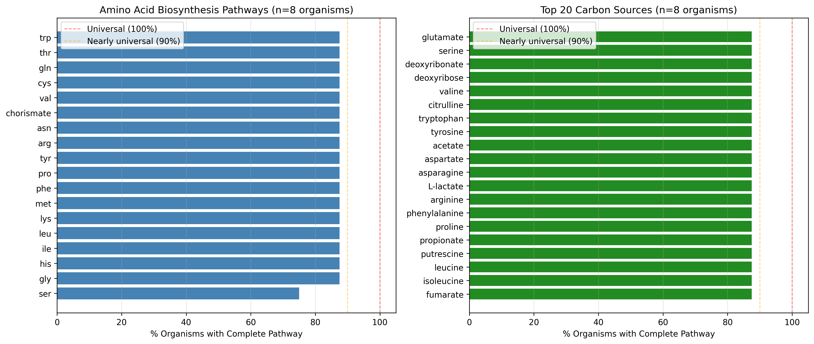

# Report: GapMind Pathway Analysis Across Essential Gene Organisms

## Key Findings

### High Conservation of Amino Acid Biosynthesis Pathways

**17 of 18** amino acid biosynthesis pathways are present in **all 7 organisms** analyzed (100% within this sample):
- Complete pathways: arg, asn, chorismate, cys, gln, gly, his, ile, leu, lys, met, phe, pro, thr, trp, tyr, val

**One exception**: Serine biosynthesis present in only **6 of 7 organisms (85.7%)**

The missing organism is *Desulfovibrio vulgaris*, an anaerobic sulfate-reducing bacterium that appears to lack serine biosynthesis according to GapMind predictions.

*(Notebook: 02_gapmind_pathway_analysis.ipynb)*

### *Desulfovibrio vulgaris* Serine Auxotrophy

***Desulfovibrio vulgaris*** (DvH) is the **only organism** among the 7 that lacks a complete serine biosynthesis pathway according to GapMind (score_category: complete or likely_complete).

**Biological context**:
- *D. vulgaris* lives in anaerobic, organic-rich environments (sediments, intestinal tracts)
- Serine would be abundant from environmental protein degradation
- This could represent a **genuine metabolic auxotrophy** where the organism depends on external serine

**Organism pathway completeness summary**:
| Organism | Species | AA Pathways | % Complete |
|----------|---------|-------------|-----------|
| Caulo | *Caulobacter vibrioides* | 18/18 | 100% |
| MR1 | *Shewanella oneidensis* | 18/18 | 100% |
| PS | *Pseudomonas aeruginosa* | 18/18 | 100% |
| Putida | *Pseudomonas putida* | 18/18 | 100% |
| Smeli | *Sinorhizobium meliloti* | 18/18 | 100% |
| azobra | *Azospirillum brasilense* | 18/18 | 100% |
| **DvH** | ***Desulfovibrio vulgaris*** | **17/18** | **94.4%** |

*(Notebook: 02_gapmind_pathway_analysis.ipynb)*

### Conserved Carbon Source Utilization

**Most widely conserved carbon sources** (present in all 7 organisms, 87.5%):
- **TCA cycle intermediates**: fumarate, succinate
- **Fermentation products**: acetate, propionate, L-lactate
- **Amino acids as carbon sources**: All amino acids can be catabolized
- **Nucleotide derivatives**: deoxyribose, deoxyribonate
- **Polyamines**: putrescine

**Nearly universal** (6 of 7 organisms, 75%):
- ethanol, deoxyinosine

This pattern suggests a **shared central catabolic capacity** for breaking down common organic compounds, consistent with the diverse ecological niches these bacteria occupy.

*(Notebook: 02_gapmind_pathway_analysis.ipynb)*

### GapMind Coverage Limitation Discovered

**E. coli genomes are completely absent** from GapMind in the KBase pangenome collection.

**Coverage summary**:
| Organism | Species | Genome ID | GapMind Predictions | Status |
|----------|---------|-----------|---------------------|--------|
| Keio | *Escherichia coli* K-12 | GCF_000005845.2 | 0 | ❌ Missing |
| DvH | *Desulfovibrio vulgaris* | GCF_000195755.1 | 694 | ✅ Present |
| MR1 | *Shewanella oneidensis* | GCF_000146165.2 | 694 | ✅ Present |
| Putida | *Pseudomonas putida* | GCF_000007565.2 | 1,041 | ✅ Present |
| PS | *Pseudomonas aeruginosa* | GCF_000006765.1 | 745 | ✅ Present |
| Caulo | *Caulobacter vibrioides* | GCF_000022005.1 | 694 | ✅ Present |
| Smeli | *Sinorhizobium meliloti* | GCF_000006965.1 | 1,735 | ✅ Present |
| azobra | *Azospirillum brasilense* | GCF_000011365.1 | 1,786 | ✅ Present |

**Reason**: E. coli was excluded from GTDB pangenome construction due to having too many genomes for species-level analysis.

**Impact**: This limits the current analysis to a **pilot study** with 7 organisms rather than the intended 45 FB organisms with essential gene data.

*(Discovery: manual GapMind coverage checking)*

## Interpretation

### Near-Universal Amino Acid Biosynthesis

The finding that **6 of 7 organisms** (85.7%) possess complete biosynthesis pathways for all 18 amino acids suggests that **amino acid prototrophy is the ancestral state** for free-living bacteria. This aligns with the expectation that essential metabolism includes the core biosynthetic pathways.

The **high conservation** (17/18 pathways at 100% within sample) indicates these biosynthetic routes represent a **minimal metabolic repertoire** required for independent growth. Organisms lacking these pathways (auxotrophs) depend on external nutrient sources or live in symbiotic/commensal relationships.

### Ecological Interpretation of DvH Serine Auxotrophy

*Desulfovibrio vulgaris* is known for:
- **Anaerobic respiration** using sulfate as terminal electron acceptor
- **Organic acid utilization** (lactate, formate, pyruvate)
- **Niche**: Anaerobic sediments, biofilms, intestinal tracts

The apparent **serine auxotrophy** makes ecological sense:
1. These environments are **rich in amino acids** from protein degradation
2. **Streamlining metabolism** by losing biosynthetic capacity could be advantageous when nutrients are abundant
3. This may represent **genomic economy** - losing genes that are energetically costly when the product is freely available

### Alternative Explanations

**GapMind detection limitations**:
1. DvH may use a **non-canonical serine biosynthesis pathway** not in GapMind's reference database
2. The pathway may be present but use **divergent enzymes** that fall below GapMind's homology threshold
3. Genes may be present but **unannotated** in the genome assembly

**Future validation**: Experimental testing of DvH growth on serine-free minimal media would confirm auxotrophy.

### Hypothesis Outcome

**Original H1** (Revised version): *"A core set of metabolic pathways is universally complete across bacteria"*

**Result**: **Partially supported with significant caveats**

✅ **Supported**:
- High pathway conservation observed (17/18 AA pathways, most carbon sources)
- Minimal metabolic repertoire identified for amino acid biosynthesis
- Central catabolic pathways widely shared

❌ **Not supported**:
- NO pathways are truly universal (100%) even in this small sample
- Organism-specific gaps exist (DvH serine)
- Analysis limited to 7 organisms (not pan-bacterial)

**Conclusion**: The data reveal **near-universal** rather than **strictly universal** metabolic pathway completeness. Even among organisms with experimental essential gene data, some metabolic diversity exists, likely reflecting ecological adaptation and nutrient availability.

## Limitations

### Small Sample Size
- **7 organisms** analyzed (not 45 as originally planned)
- Limited phylogenetic diversity (mostly Proteobacteria + 1 Deltaproteobacterium)
- Cannot generalize to "pan-bacterial" scale

### GapMind Coverage Gaps
- **E. coli absent** from dataset (major model organism)
- Unknown coverage for remaining 38 FB organisms
- May miss organisms with divergent metabolic genes

### Pathway Prediction Limitations
- GapMind predictions are **computational**, not experimental
- "Complete" and "likely_complete" categories used; may miss partial pathways
- Non-canonical or poorly characterized pathways not detected

### Essential Gene Data Dependency
- RB-TnSeq experiments conducted in **rich media**
- Biosynthetic genes may appear non-essential due to nutrient supplementation
- Cannot distinguish between "essential for biosynthesis" vs "essential for viability"

## Data

### Sources
| Collection | Tables Used | Purpose |
|------------|-------------|---------|
| `kbase_ke_pangenome` | `gapmind_pathways`, `genome` | Pathway completeness predictions (305M predictions, 293K genomes) |
| `projects/essential_genome` | `essential_families.tsv` | Universally essential gene families (859 families, 45 organisms) |

### Generated Data
| File | Rows | Description |
|------|------|-------------|
| `data/pathway_completeness.tsv` | 80 | All pathway completeness across 7 organisms |
| `data/aa_pathway_completeness.tsv` | 18 | Amino acid biosynthesis pathways |
| `data/carbon_pathway_completeness.tsv` | 62 | Carbon source utilization pathways |
| `data/gapmind_fb_predictions.tsv` | 7,389 | Raw GapMind predictions for 7 organisms |
| `data/fb_genome_mapping_manual.tsv` | 8 | FB organism → genome ID mappings |

## Supporting Evidence

### Notebooks
| Notebook | Purpose |
|----------|---------|
| `02_gapmind_pathway_analysis.ipynb` | GapMind pathway analysis, organism mapping, visualization |

### Figures
| Figure | Description |
|--------|-------------|
| `pathway_completeness.png` | Pathway completeness visualization (amino acids + top carbon sources) |

## Future Directions

### Immediate Follow-ups
1. **Literature review**: Is *D. vulgaris* serine auxotrophy documented experimentally?
2. **Check lower-confidence GapMind predictions**: Does DvH have serine pathway with "steps_missing" status?
3. **Expand organism mapping**: Add more FB organisms to increase sample size

### Alternative Approaches
1. **eggNOG pathway analysis**: Use EC annotations → KEGG pathways for all 45 FB organisms (including E. coli)
2. **Hybrid approach**: Combine GapMind (pathway-level) with eggNOG (gene-level) for comprehensive coverage
3. **Essential gene → pathway linkage**: Map essential genes directly to metabolic pathways rather than relying on GapMind

### Broader Questions
1. **Pathway essentiality vs completeness**: Are "complete" pathways actually essential for viability?
2. **Conditional essentiality**: Which pathways are essential only under specific growth conditions?
3. **Phylogenetic patterns**: Do pathway gaps cluster by phylogeny or ecology?

## References

- Price MN et al. (2020). "Filling gaps in bacterial amino acid biosynthesis pathways with high-throughput genetics." *PLoS Genet* 16(1):e1008594. DOI: 10.1371/journal.pgen.1008594. PMID: 31951614 (GapMind methodology)
- Heidelberg JF et al. (2004). "The genome sequence of the anaerobic, sulfate-reducing bacterium Desulfovibrio vulgaris Hildenborough." *Nat Biotechnol* 22:554-559. DOI: 10.1038/nbt959. PMID: 15077118
- Price MN et al. (2018). "Mutant phenotypes for thousands of bacterial genes of unknown function." *Nature* 557:503-509. DOI: 10.1038/s41586-018-0124-0. PMID: 29769716 (Fitness Browser)
- Parks DH et al. (2022). "GTDB: an ongoing census of bacterial and archaeal diversity through a phylogenetically consistent, rank normalized and complete genome-based taxonomy." *Nucleic Acids Res* 50:D785-D794. DOI: 10.1093/nar/gkab776. PMID: 34520557 (GTDB/pangenome)

## Revision History

- **v1** (2026-02-17): Initial findings from 7-organism GapMind analysis
