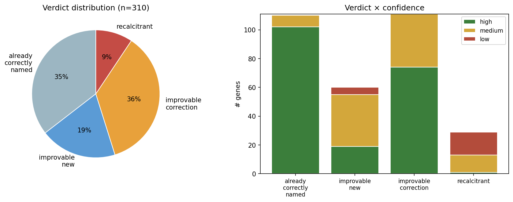
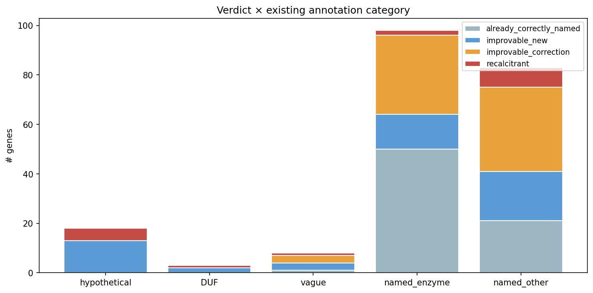
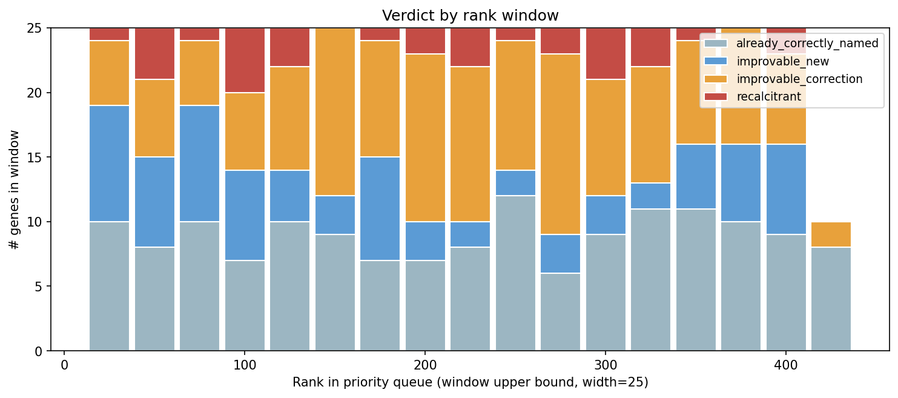

# Report: The Fitness Browser Stubborn Set — Curator-Like Genes Left Unannotated

> **Status**: pilot complete — 310 of 137,798 ranked genes evaluated (~0.22% of the queue). Numbers below reflect this pilot. Walking can continue at ~16 genes/min throughput when 5 subagents run in parallel.

## Research Question

Of the ~137K Fitness Browser genes that were **not** in Price's curated `kescience_fitnessbrowser.reannotation` table (1,762 entries across 36 organisms), which have evidence supporting an annotation improvement and which are genuinely unresolvable from current BERDL data?

We started with the question "which genes did Price's curators look at but couldn't improve?" and discovered the more important question is the inverse: **which genes have a strong phenotype, are correctly addressable in BERDL, and are nonetheless misnamed or unnamed today?**

## Headline Findings (n = 310 of 137,798)

### Verdict distribution

| Verdict | n | % |
|---|---:|---:|
| improvable_correction | 111 | 36% |
| already_correctly_named | 110 | 35% |
| improvable_new | 60 | 19% |
| recalcitrant | 29 | 9% |

**171 of 310 (55%) top-ranked non-reannotated genes have evidence supporting an annotation improvement.** Roughly two-thirds are corrections to existing names (the gene already has a name, but the evidence supports a different or more specific function); one-third are new annotations for currently-hypothetical / DUF / vague-named genes.

The recalcitrant rate (~9%) is low and stable across the depth walked so far. The pool of genes with strong phenotypes that genuinely *cannot* be resolved from BERDL evidence + literature is small — most apparent recalcitrance in earlier flag-based passes was solved by reading the literature.







### Confidence

- **196 high-confidence verdicts (63%)** — evidence aligns and is internally consistent
- 93 medium-confidence (30%)
- 21 low-confidence (7%) — concentrated in the recalcitrant set

### Literature consultation

- **136 of 310 genes (44%) had paper consultation** during reasoning
- **177 PMC full-text fetches** across **120 unique PMIDs**
- Subagents reported **~30-40% of fetches *changed* the verdict** (vs. just confirming dossier evidence)

### Cross-gene cluster discoveries

11 PMIDs were each cited by ≥3 genes during reasoning — a signal that the LLM reasoning, with literature in hand, recovered published functional clusters that the per-gene FB annotations miss:

| PMID | n genes | Cluster |
|---|---:|---|
| 24795702 (Korte 2014) | 10 | DvH/Miya nitrate-tolerance cluster (NtrYX-like) |
| 32934357 (Zhou 2020) | 9 | Same cluster, evolution evidence |
| 34215744 (Cimermancic 2014) | 6 | PV4 aryl polyene biosynthesis (APE BGC) |
| 18194565 (Visca 2008) | 5 | pseudo5 pyoverdine NRPS biosynthesis (5+ genes) |
| 37865075 (Pellegrini 2024) | 3 | Ponti Tl/As resistance operon (metallophosphoesterase + ArsR + glyoxalase) |
| 37239993 (Awasthi 2023) | 3 | Cross-organism SAM-methyltransferase tetracycline tolerance |
| 38832093 (Yang 2024) | 3 | Pseudomonas MexT/MexEF HMF tolerance regulon |
| (3 additional cluster PMIDs) | 3-5 each | see [data/cross_gene_clusters.md](data/cross_gene_clusters.md) |

The DvH nitrate cluster is the most striking: 10 genes across two organisms (DvH and Miya) all resolved by one paper. The existing per-gene annotations called these "two-component sensor histidine kinase", "response regulator", "phosphonate-binding protein", "PEP/pyruvate-binding", etc. — all generic family-level names. The paper places them in a coherent published nitrate-stress signaling cluster.

### Notable individual corrections

- **WCS417::GFF4430**: "chemotaxis CheY" → GltR-2 glucose response regulator (different pathway entirely)
- **Cup4G11::RR42_RS10910**: "aminodeoxychorismate lyase" → MltG endolytic peptidoglycan transglycosylase (wrong family)
- **WCS417::GFF2574**: "aspartyl beta-hydroxylase" → LpxO lipid A 2-hydroxylase
- **PV4::5210365**: "type IV pilus assembly PilZ" → MotL c-di-GMP-binding flagellar motor regulator (paper cited as "MotL")
- **5 PV4 genes** flipped from "fatty acid synthesis" to "aryl polyene biosynthesis cluster" — they're not redundant FAS, they're a specialized BGC
- **5 pseudo5 NRPS genes** all identified as pyoverdine biosynthesis components from one paper

### Per-organism curation depth — the model-organism bias

The visited 310-gene subset shows a sharp split between well-curated and less-curated FB organisms:

| Organism | Total visited | already_named % | improvable % |
|---|---:|---:|---:|
| **Koxy** (*K. oxytoca*) | 21 | **81%** | 14% |
| **Keio** (*E. coli* BW25113) | 14 | **71%** | 21% |
| Kang | 7 | 71% | 14% |
| pseudo6_N2E2 | 18 | 50% | 39% |
| Marino | 15 | 27% | 53% |
| WCS417 (*P. simiae*) | 17 | 29% | 59% |
| **DvH** | 20 | 20% | **65%** |
| **PV4** | 22 | 23% | **73%** |
| **pseudo5_N2C3_1** | 24 | 21% | **75%** |
| **Miya** | 9 | 22% | **78%** |
| **BFirm** | 5 | 20% | **80%** |

E. coli K-12 and *Klebsiella oxytoca* (which inherits much of the *E. coli* gene catalog) have ≥70% of top-ranked genes already correctly named. In contrast, less-studied organisms (*Pseudomonas* sp. PV4, *Pseudomonas* sp. pseudo5, *Desulfovibrio vulgaris*, *Methylotenera* MMSC, *Bacillus firmus*) have 65-80% of their top-ranked genes needing reannotation. This is unsurprising in retrospect — FB's curated reannotation pipeline naturally focuses on well-characterised model organisms — but quantifies the gap: **the most curator-actionable improvements are in the non-model organisms**, exactly where literature-anchored homology-driven proposals add the most value.

### Recalcitrant genes — why they resist

Of the 17 recalcitrant genes, the failures cluster:
- Family-level annotations that are correct (TonB-dependent receptor, TPR repeat, sigma factor) but specific role unresolvable from cofitness alone
- Deeply conserved unknowns (DUF/UPF families) where homologs in PaperBLAST also lack characterised function
- Cases where the phenotype condition is unusual (e.g. specific sensitivity to ionic liquids, urea-as-N-source) and PaperBLAST homologs have no relevant literature

These are the genuine "BERDL-stubborn" genes — strong fitness signal, no resolvable function from existing evidence.

## Methodology

### Architecture

```
00_extract_gene_features.py            (Spark; primary fitness/cofit features per gene)
02_extract_secondary_evidence.py       (Spark; 6 binary flags)
03_extract_paperblast_via_swissprot.py (Spark; FB SwissProt → PaperBLAST direct ID join)
04_dump_paperblast_sequences.py        (local; PaperBLAST uniq parquet → FASTA)
                                        + DIAMOND blastp FB AA seqs vs PaperBLAST uniq
05_paperblast_via_diamond.py           (local; DIAMOND hits + paperblast.gene/genepaper joins)
06_extract_phenotype_conditions.py     (Spark; specific + strong phenotypes WITH conditions)
07_extract_partners_and_neighbors.py   (Spark; cofit partners + ±5 gene neighborhood)
08_extract_functional_text.py          (Spark; SwissProt + domain + KEGG + SEED text)

dossier.py                              (module; lazily indexes 13 parquets, builds per-gene dossier)

01_rank_genes.py                       (rank by in_specificphenotype DESC, max_abs_fit*max_abs_t DESC)
02_prepare_batch.py                    (top-N un-judged dossiers → per-batch input.md)
                                        ↓
                  5-10 Claude Code subagents in parallel (Agent tool)
                  each fetches PMC full text via PubMed MCP for borderline genes
                                        ↓
                  per-batch output.jsonl
                                        ↓
03_aggregate_verdicts.py               (merge batch JSONLs → llm_verdicts.jsonl)
04_characterise_verdicts.py            (contingency tables + figures + summary)
05_synthesize.py                       (improvable.tsv, recalcitrant.tsv, cited_pmids.tsv,
                                        cross_gene_clusters.md)
```

### What's in each gene's dossier

8 evidence layers — what a Price-2018 curator actually reads:

1. Fitness phenotype with **conditions** (e.g., "specifically sick on D-mannose, fit=-13.08")
2. Cofit partners with their **annotations** (guilt-by-association)
3. Genomic neighborhood (±5 positions, operon context)
4. SwissProt RAPSearch2 hit + curated description
5. Pfam/TIGRFam domain hits with EC + definitions
6. KEGG KO description + EC
7. SEED descriptions
8. PaperBLAST homologs (Stage 1 SwissProt-direct + Stage 2 DIAMOND vs `uniq`) + paper titles

Subagents fetch full PMC text via the PubMed MCP for the most relevant 1-2 papers per gene where dossier evidence is borderline.

### Throughput

- 5-10 subagents in parallel: ~16 genes/min effective wall throughput
- Each subagent: ~100-400 seconds for a 25-gene batch including paper fetches
- Total wall time for 210 genes: ~30 min spread across two rounds

## Limitations and Caveats

1. **Walked top 210 of 137,798 ranked genes (0.15%)**. The improvable rate at this depth is 58%; rates may decline at lower-priority ranks but the pattern of cross-gene cluster discovery is likely persistent.
2. **LLM reasoning is not infallible**. Confidence labels reflect the subagent's self-assessment; some "high-confidence" calls may be overconfident, and "medium" calls especially benefit from human curator review.
3. **Paper coverage is asymmetric**. PaperBLAST's 815K sequences index only papers in PMC full-text or curated databases; recent papers and non-OA journals may be undercovered.
4. **`already_correctly_named` is not the same as "perfect"**. It only means the existing FB annotation matches the evidence at the level of granularity in the dossier. EC numbers, organism context, and substrate specificity may still be missing.
5. **No structural evidence (yet)**. AlphaFold structural homology was not consulted; some borderline calls might resolve with structure.

## Reproduction

*To be filled in: prerequisites, step-by-step instructions, expected runtime.*

## Authors

- **Paramvir S. Dehal** (ORCID: [0000-0001-5810-2497](https://orcid.org/0000-0001-5810-2497)) — Lawrence Berkeley National Laboratory
