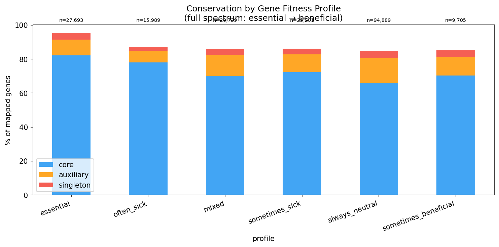
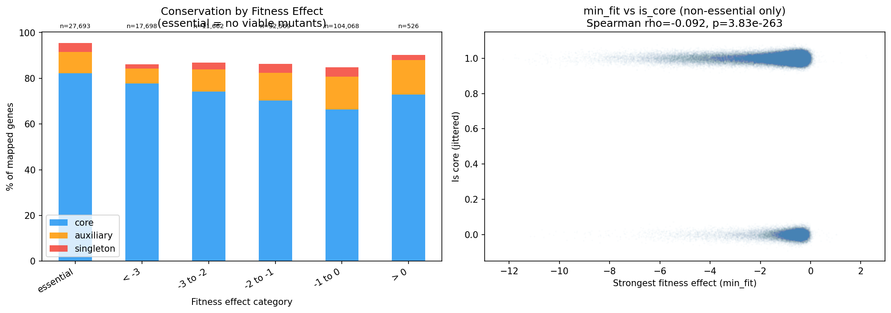
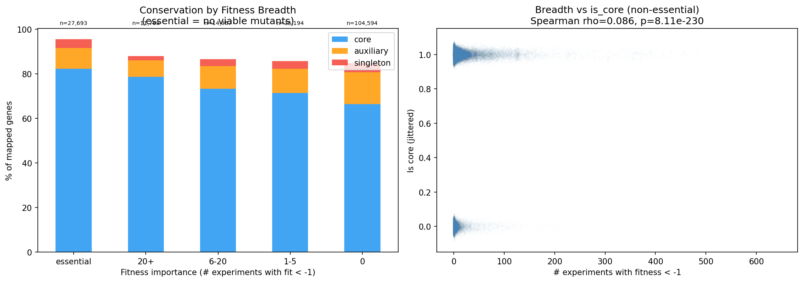
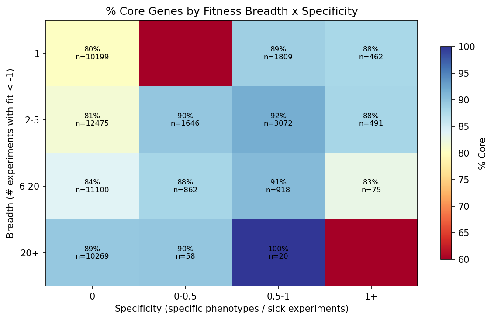
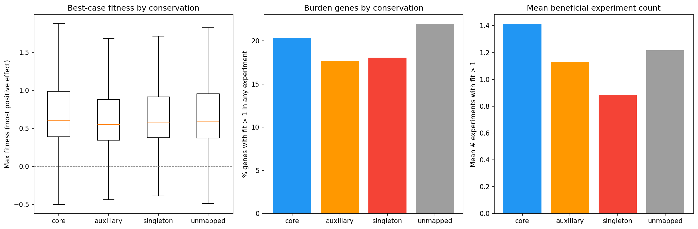
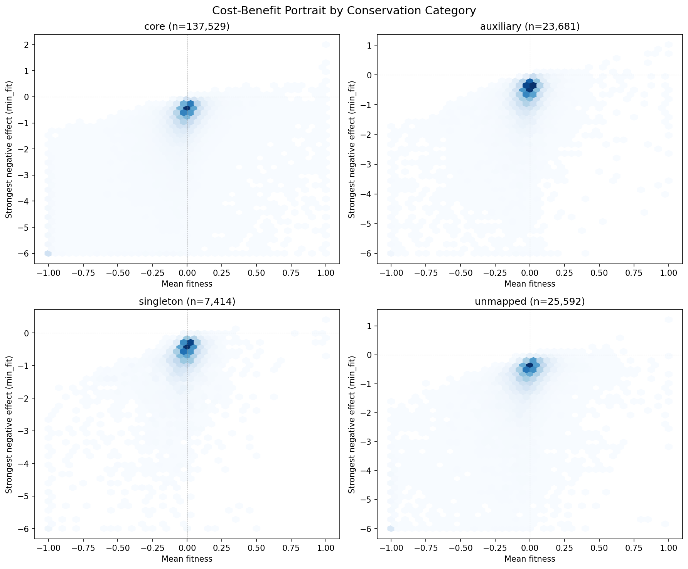
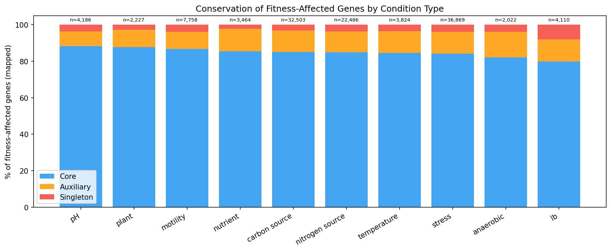
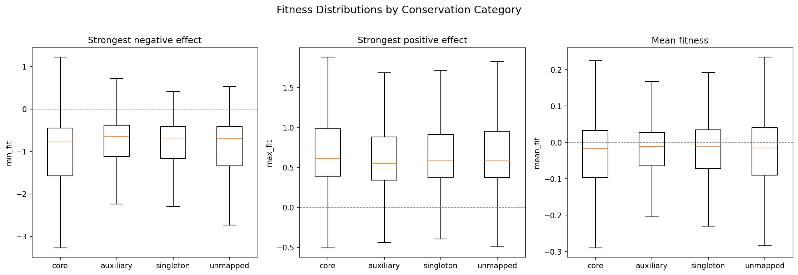
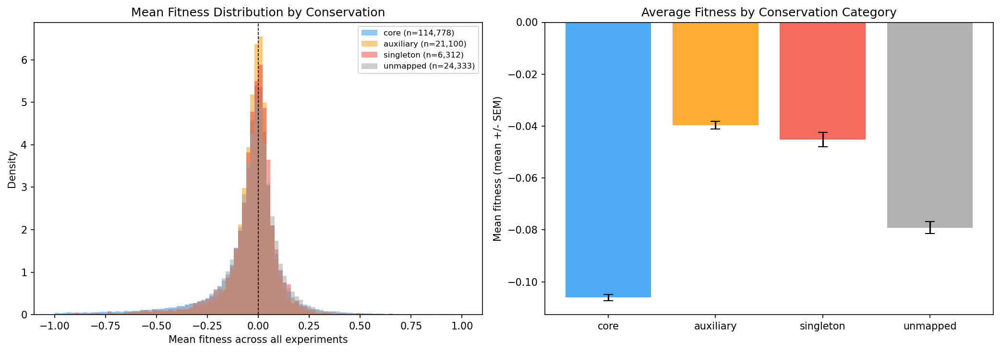

# Report: Fitness Effects vs Conservation -- Quantitative Analysis

## Key Findings

### Conservation Increases with Fitness Importance

A clear gradient from essential to neutral genes:

| Fitness category | n genes | % Core |
|-----------------|--------:|-------:|
| Essential (no viable mutants) | 27,693 | **82%** |
| Often sick (>10% experiments) | 15,989 | 78% |
| Mixed (sick + beneficial) | 20,739 | 70% |
| Sometimes sick | 25,201 | 72% |
| Always neutral | 94,889 | **66%** |
| Sometimes beneficial | 9,705 | 70% |

The same gradient holds when binning by strongest fitness effect: essential -> 82.2% core, min_fit < -3 -> 77.7%, min_fit -1 to 0 -> 66.4%.

*(Notebook: 02_fitness_vs_conservation.ipynb)*

### Breadth of Fitness Effects Predicts Conservation

Genes important in more conditions are more likely core (Spearman rho=0.086, p=8.1e-230):

| Breadth | % Core |
|---------|-------:|
| Essential | 82% |
| 20+ experiments | 79% |
| 6-20 experiments | 73% |
| 1-5 experiments | 71% |
| 0 experiments | 66% |

*(Notebook: 03_breadth_vs_conservation.ipynb)*

### Core Genes Are Not Burdens -- They're More Likely Beneficial

Counter to the expectation that accessory genes might be costly to carry, **core genes are MORE likely to show positive fitness effects** when deleted (24.4% ever beneficial vs 19.9% for auxiliary, OR=0.77 for auxiliary vs core). This may reflect that core genes are more likely to participate in trade-off situations -- they help in some conditions but cost in others.

*(Notebook: 02_fitness_vs_conservation.ipynb)*

### Specific-Phenotype Genes Are More Likely Core

Genes with strong condition-specific effects (tagged in `specificphenotype`) are 77.3% core vs 70.3% for genes without specific phenotypes (OR=1.78, p=1.8e-97). This contradicts the naive expectation that condition-specific genes would be accessory. Instead, it suggests that core genes are more likely to have measurable condition-specific effects -- perhaps because they participate in well-characterized pathways.

*(Notebook: 03_breadth_vs_conservation.ipynb)*

### Ephemeral Niche Genes

4,450 genes (2.7%) fit the "ephemeral niche gene" pattern: neutral overall but critical in one condition. Surprisingly, these are MORE common in core genes (3.0%) than auxiliary (1.7%) or singleton (1.6%). Core genes may simply have more detectable conditional effects because they participate in more pathways.

### Fitness Distributions by Conservation

Core and auxiliary genes show distinct fitness effect distributions, with core genes having heavier tails in both the negative (important) and positive (burdensome) directions.

*(Notebook: 02_fitness_vs_conservation.ipynb)*

### Novel Gene Landscape

Novel (singleton) genes show near-zero mean fitness, suggesting they are largely invisible to lab-based fitness assays -- neither beneficial nor detrimental under tested conditions.

*(Notebook: 02_fitness_vs_conservation.ipynb)*

## Interpretation

The results paint a consistent picture: **gene fitness importance and pangenome conservation are positively correlated across the full spectrum**. Essential genes are 82% core; always-neutral genes are 66% core. This 16-percentage-point gradient spans ~194,000 genes across 43 diverse bacteria.

However, several findings challenge simple models:
- Core genes are more likely to be both detrimental (essential) AND beneficial (burden) when deleted -- they're more extreme, not more neutral
- Condition-specific fitness genes are more core, not more accessory
- Novel/singleton genes are NOT systematically detrimental -- their mean fitness is near zero, similar to auxiliary genes

These patterns suggest that core genes are the most functionally active genes -- they have the largest fitness effects in both directions because they're embedded in critical pathways. Accessory genes, by contrast, tend to be functionally quieter under lab conditions.

### Literature Context

- **Price et al. (2018)** generated the Fitness Browser data used here, providing the largest resource of genome-wide mutant fitness data for bacteria. Our analysis adds a pangenome conservation dimension to their fitness measurements.
- **Luo et al. (2015)** showed that core genes have stronger purifying selection than accessory genes across bacterial species, consistent with our finding that genes with stronger fitness effects are more likely core.
- **McInerney et al. (2017)** reviewed the gene-sharing network view of pangenomes, arguing that gene frequency distributions reflect a balance of selection, drift, and HGT. Our fitness-conservation gradient provides empirical support for selection as a major driver of core gene maintenance.

### Limitations

- Lab conditions are biased toward rich media and standard stresses; many ecological niches are unrepresented
- The 16pp gradient, while statistically robust, means conservation is only weakly predicted by fitness importance
- Fitness measurements are for single-gene knockouts; epistatic interactions are not captured
- The Fitness Browser covers 43 bacteria -- primarily Proteobacteria -- limiting generalizability
- Singleton/novel genes may lack fitness data due to poor transposon coverage rather than true neutrality

## Data

### Sources

| Dataset | Description | Source |
|---------|-------------|--------|
| Fitness Browser | RB-TnSeq mutant fitness data for ~194K genes | Price et al. (2018) |
| KBase pangenome link table | Gene-to-cluster conservation mapping | `conservation_vs_fitness/data/fb_pangenome_link.tsv` |
| Essential genes | Essentiality classification | `conservation_vs_fitness/data/essential_genes.tsv` |
| Specific phenotypes | Condition-specific fitness annotations | Fitness Browser `specificphenotype` table |

### Generated Data

| File | Description |
|------|-------------|
| `data/fitness_stats.tsv` | Per-gene fitness summary |
| `data/fitness_stats_by_condition.tsv` | Per-gene per-condition-type stats |
| `data/specific_phenotypes.tsv` | Specific phenotype counts |

## References

- Price MN et al. (2018). "Mutant phenotypes for thousands of bacterial genes of unknown function." *Nature* 557:503-509. PMID: 29769716
- Parks DH et al. (2022). "GTDB: an ongoing census of bacterial and archaeal diversity through a phylogenetically consistent, rank normalized and complete genome-based taxonomy." *Nucleic Acids Res* 50:D199-D207. PMID: 34520557
- Luo H et al. (2015). "Evolution of divergent life history strategies in marine alphaproteobacteria." *mBio* 6:e01251-15. PMID: 26530382
- McInerney JO et al. (2017). "Why prokaryotes have pangenomes." *Nat Microbiol* 2:17040. PMID: 28350002

## Supporting Evidence

| Type | Path | Description |
|------|------|-------------|
| Notebook | `notebooks/02_fitness_vs_conservation.ipynb` | Magnitude + novel gene landscape |
| Notebook | `notebooks/03_breadth_vs_conservation.ipynb` | Breadth + condition type analysis |
| Figure | `figures/conservation_by_fitness_profile.png` | Conservation by fitness profile |
| Figure | `figures/fitness_magnitude_vs_conservation.png` | Fitness magnitude vs conservation |
| Figure | `figures/fitness_breadth_vs_conservation.png` | Fitness breadth vs conservation |
| Figure | `figures/broad_vs_specific_conservation.png` | Broad vs specific conservation |
| Figure | `figures/burden_genes_by_conservation.png` | Burden genes by conservation |
| Figure | `figures/cost_benefit_portrait.png` | Cost-benefit portrait |
| Figure | `figures/conservation_by_condition_type.png` | Conservation by condition type |
| Figure | `figures/fitness_distributions_by_conservation.png` | Fitness distributions by conservation |
| Figure | `figures/novel_gene_mean_fitness.png` | Novel gene mean fitness |
| Data | `data/fitness_stats.tsv` | Per-gene fitness summary |
| Data | `data/fitness_stats_by_condition.tsv` | Per-gene per-condition-type stats |
| Data | `data/specific_phenotypes.tsv` | Specific phenotype counts |

## Revision History

- **v1** (2026-02): Migrated from README.md
- **v2** (2026-02): Added inline figures, notebook provenance, Data section, Literature Context, Limitations, References
