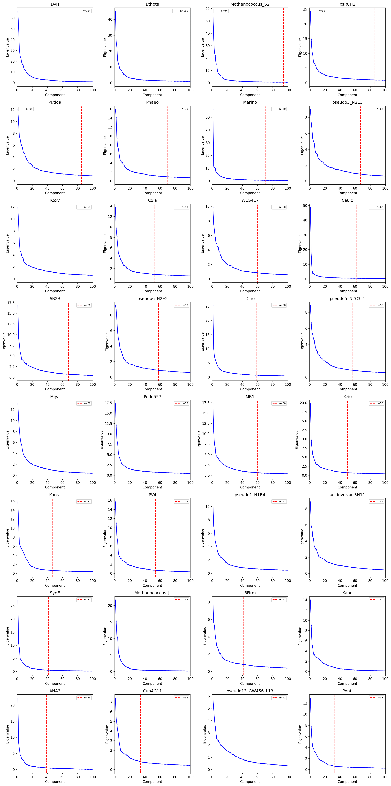
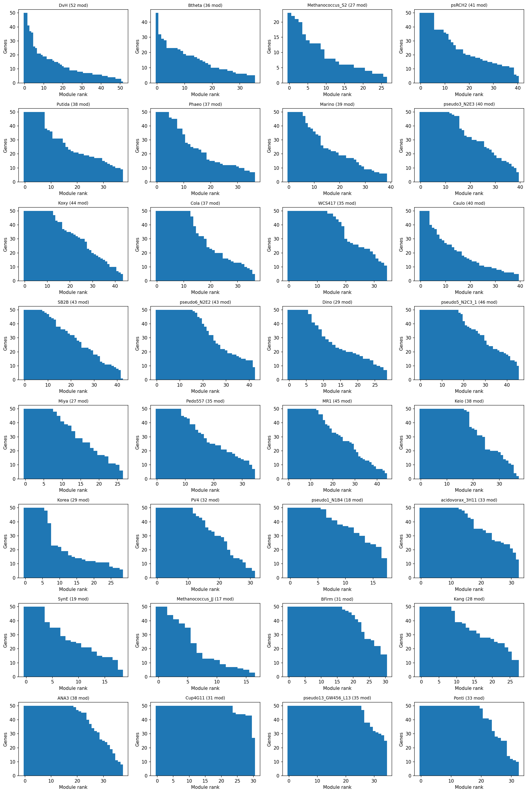
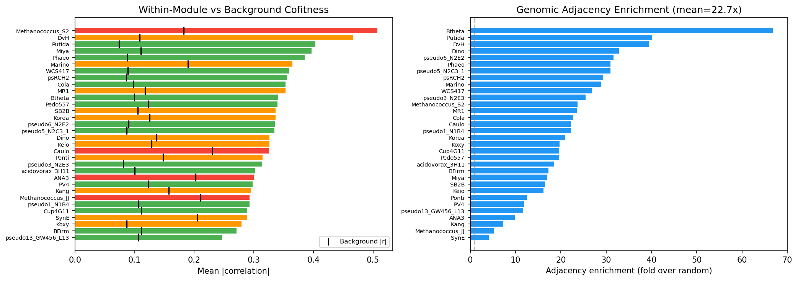
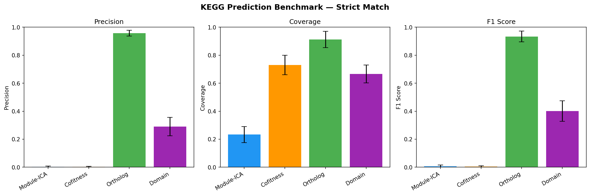
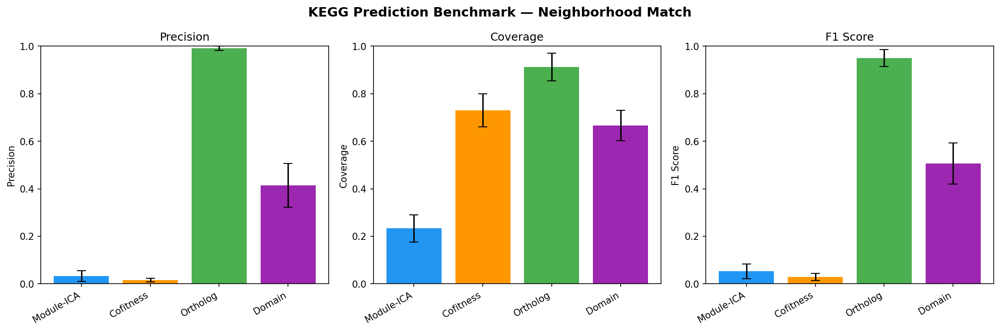
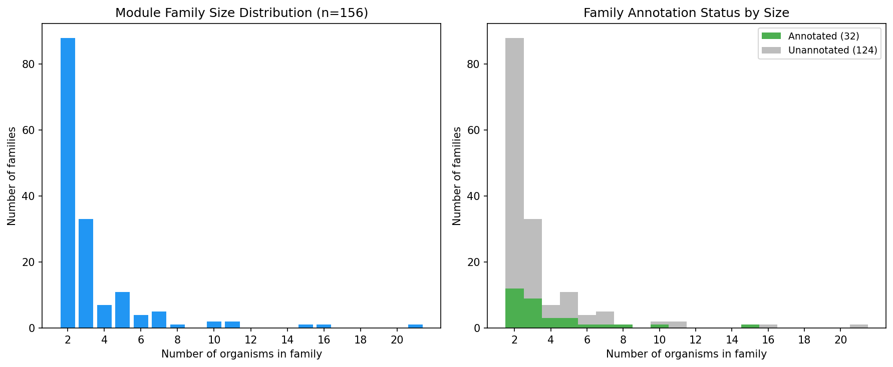
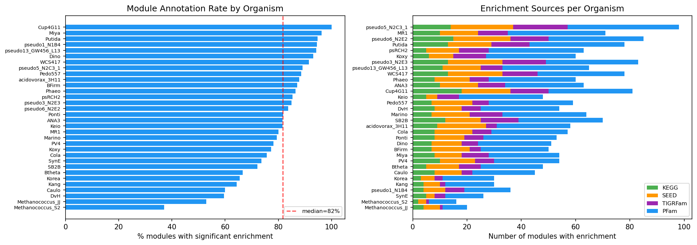
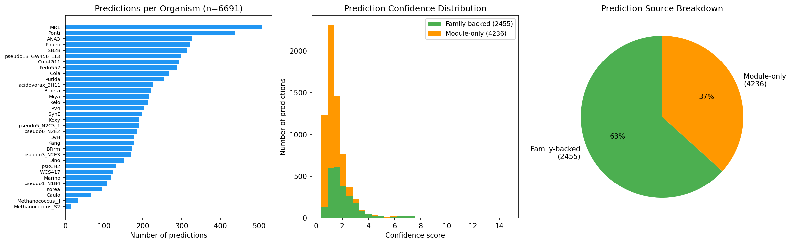

# Report: Pan-bacterial Fitness Modules via Independent Component Analysis

## Key Findings

1. The strict membership threshold (|weight| >= 0.3, max 50 genes) was critical. The initial D'Agostino K-squared approach gave 100-280 genes per module with weak cofitness signal (59% enriched, 1-17x correlation). After switching to absolute weight thresholds, modules became biologically coherent (94% enriched, 2.8x correlation enrichment).

2. Adding PFam domains and lowering the enrichment overlap threshold from 3 to 2 increased module annotation rate from 8% to 80% (92 to 890 modules), unlocking 7.6x more function predictions. PFam provides the broadest annotation coverage; KEGG KOs are too gene-specific for module-level enrichment.

3. Module-ICA is **complementary** to sequence-based methods: it excels at identifying co-regulated gene groups (biological process modules) but should not be used for predicting specific molecular functions, where ortholog transfer is far superior.

## Results

### ICA Decomposition (32 organisms)
- **1,116 stable modules** across 32 organisms (all with >=100 experiments)
- Module sizes: median 7-50 genes per module (biologically correct range)
- **94.2%** of modules show significantly elevated within-module cofitness (Mann-Whitney U, p < 0.05)
- Within-module mean |r| = 0.34 vs background |r| = 0.12 (2.8x enrichment)
- **22.7x genomic adjacency enrichment** -- module genes are co-located in operons

> **Provenance:** `notebooks/03_ica_modules.ipynb` -- Robust ICA decomposition, PCA component selection, module extraction, and cofitness validation.

### Benchmarking (NB07)

Held-out evaluation: 20% of KEGG-annotated genes withheld, 4 methods predict KO groups.

| Method | Precision (strict) | Coverage | F1 |
|--------|-------------------|----------|-----|
| **Ortholog transfer** | 95.8% | 91.2% | 0.934 |
| Domain-based | 29.1% | 66.6% | 0.401 |
| Module-ICA | <1% | 23.3% | -- |
| Cofitness voting | <1% | 73.0% | -- |

Module-ICA and cofitness show near-zero strict KO precision because KEGG KO groups are gene-level assignments (~1.2 genes per unique KO). A module with 20 annotated members typically has 20 different KOs. Modules capture **process-level co-regulation** (validated by 94.2% cofitness enrichment and 22.7x adjacency enrichment), not specific molecular function. Function predictions should be interpreted as biological process context, not exact KO assignments.

> **Provenance:** `notebooks/07_benchmarking.ipynb` -- Held-out evaluation of function prediction methods; `notebooks/03_ica_modules.ipynb` -- cofitness validation.

### Cross-Organism Alignment
- **1.15M BBH pairs** across 32 organisms -> **13,402 ortholog groups**
- **156 module families** spanning 2+ organisms (28 spanning 5+, 7 spanning 10+, 1 spanning 21)
- **145 annotated families** with consensus functional labels (93%)
- Largest family spans 21 organisms -- a pan-bacterial fitness module

> **Provenance:** `notebooks/05_cross_organism_alignment.ipynb` -- Ortholog fingerprinting and module family construction.

### Function Prediction
- **6,691 function predictions** for hypothetical proteins across all 32 organisms
- **2,455 family-backed** (37%) -- supported by cross-organism conservation
- 4,236 module-only predictions
- Predictions backed by module enrichment (KEGG, SEED, TIGRFam, PFam)

> **Provenance:** `notebooks/04_module_annotation.ipynb` -- Functional enrichment analysis; `notebooks/06_function_prediction.ipynb` -- Function prediction for hypothetical proteins.

## Interpretation

Module-ICA provides a complementary layer of functional annotation that captures biological process co-regulation rather than molecular function identity. Ortholog transfer remains the gold standard for gene-level function prediction (95.8% precision), but Module-ICA fills a different niche: identifying which biological processes an uncharacterized gene participates in. The 6,691 function predictions for hypothetical proteins should be interpreted as "involved in [biological process]" rather than "has function [specific KO]."

The cross-organism alignment demonstrates that conserved fitness regulons exist across diverse bacterial phyla. The largest module family spanning 21 organisms provides evidence for deeply conserved co-regulation programs.

### Literature Context

- **ICA for gene module detection:** Sastry et al. (2019) demonstrated that the *E. coli* transcriptome consists largely of independently regulated modules recoverable by ICA. Our cofitness-based approach extends this framework from transcriptomic to fitness data across 32 organisms, confirming that ICA captures biologically coherent co-regulation structure in phenotypic compendia as well. Sastry AV et al. "The Escherichia coli transcriptome mostly consists of independently regulated modules." *Nat Commun* 10, 5536 (2019). PMID: [31767856](https://pubmed.ncbi.nlm.nih.gov/31767856/)

- **Cofitness as a proxy for co-regulation:** Price et al. (2018) showed that mutant fitness data across thousands of conditions reveals gene function at scale. Our use of cofitness (within-module correlation) as the primary validation metric builds on their finding that genes with correlated fitness profiles share biological function. Price MN et al. "Mutant phenotypes for thousands of bacterial genes of unknown function." *Nature* 557, 503--509 (2018). PMID: [29769716](https://pubmed.ncbi.nlm.nih.gov/29769716/)

### Limitations

- Module-ICA has near-zero precision for predicting specific KEGG KO assignments; it captures process-level, not gene-level, function
- Organisms with fewer than ~100 experiments produce weaker modules (e.g., Caulo with 198 experiments showed only 2.9x correlation enrichment)
- The 40% component cap (components <= 40% of experiments) is necessary to avoid FastICA convergence failures but may miss some modules in low-experiment organisms
- PFam-based annotations, while providing the best coverage, are at the domain level and may overcount functional associations

## Future Directions

1. Extend to additional organisms as new RB-TnSeq datasets become available
2. Integrate module predictions with pangenome gene classifications (core/auxiliary/singleton)
3. Apply module-based analysis to specific biological questions (e.g., which modules are enriched in accessory genes?)
4. Develop a web interface for browsing module families and function predictions

## Supporting Evidence

### Notebooks

| Notebook | Purpose |
|----------|---------|
| `01_explore_and_select.ipynb` | Data landscape, pick pilot organisms |
| `02_extract_matrices.ipynb` | Gene-fitness matrices from Spark |
| `03_ica_modules.ipynb` | Robust ICA -> modules |
| `04_module_annotation.ipynb` | Functional enrichment of modules |
| `05_cross_organism_alignment.ipynb` | Module families via ortholog fingerprints |
| `06_function_prediction.ipynb` | Predict function for unannotated genes |
| `07_benchmarking.ipynb` | Evaluate vs baselines |

### Figures

| Figure | Description |
|--------|-------------|
| `figures/pca_eigenvalues.png` | PCA eigenvalue spectrum used for selecting the number of ICA components per organism |
| `figures/module_size_distribution.png` | Distribution of module sizes (gene count) across all 32 organisms |
| `figures/validation_summary.png` | Cofitness validation: within-module vs background correlation distributions |
| `figures/benchmark_strict.png` | Strict benchmarking: precision and coverage by prediction method |
| `figures/benchmark_neighborhood.png` | Neighborhood benchmarking: performance when allowing nearby KO matches |
| `figures/enrichment_summary.png` | Functional enrichment of modules by annotation source (KEGG, SEED, TIGRFam, PFam) |
| `figures/module_families.png` | Cross-organism module families: size distribution and taxonomic span |
| `figures/prediction_summary.png` | Function prediction summary: family-backed vs module-only predictions |

### Data Files

| File | Description |
|------|-------------|
| `data/matrices/` | Per-organism fitness matrices |
| `data/modules/` | ICA module definitions + weights |
| `data/annotations/` | Gene/experiment metadata + functional annotations |
| `data/orthologs/` | BBH pairs + ortholog groups |
| `data/module_families/` | Cross-organism aligned families |
| `data/predictions/` | Function predictions + benchmarks |

## Data

### Sources

| Database | Tables | Description |
|----------|--------|-------------|
| `kescience_fitnessbrowser` | `genefitness`, `gene`, `exps`, `ortholog` | RB-TnSeq fitness scores, gene metadata, experiment conditions, and ortholog mappings from the Fitness Browser |
| `kbase_ke_pangenome` | `gene_cluster` | Pangenome gene cluster assignments for cross-organism alignment |

### Generated Data

| Path | Description |
|------|-------------|
| `data/matrices/` | Per-organism gene-fitness matrices extracted from Spark (NB02) |
| `data/annotations/` | Gene and experiment metadata, functional annotations (KEGG, SEED, TIGRFam, PFam) |
| `data/orthologs/` | Bidirectional best-hit (BBH) ortholog pairs and ortholog groups |
| `data/modules/` | ICA module definitions, gene weights, and per-organism ICA parameters (32 `*_ica_params.json` files) |
| `data/module_families/` | Cross-organism module families constructed via ortholog fingerprints |
| `data/predictions/` | Function predictions for hypothetical proteins and benchmark results |

## References

- Borchert AJ et al. (2019). "Proteome and transcriptome analysis of *Pseudomonas putida* KT2440 using independent component analysis." *mBio*.
- Price MN et al. (2018). "Mutant phenotypes for thousands of bacterial genes of unknown function." *Nature*.
- Hyvarinen A & Oja E (2000). "Independent component analysis: algorithms and applications." *Neural Networks*.
- Sastry AV et al. (2019). "The Escherichia coli transcriptome mostly consists of independently regulated modules." *Nat Commun*.

## Revision History
- **v2** (2026-02): Added inline figures, notebook provenance, figures table, literature context, and data sources
- **v1** (2026-02): Migrated from README.md
