# Report: Functional Dark Matter — Experimentally Prioritized Novel Genetic Systems

## Key Findings

### Finding 1: One in four bacterial genes is functionally dark, and 17,344 have experimentally measurable phenotypes

Across 48 Fitness Browser organisms (228,709 genes), 57,011 (24.9%) lack functional annotation ("hypothetical protein," DUF, or "uncharacterized"). Of these, 7,787 show strong fitness effects (|fitness| ≥ 2 in at least one condition), and 9,557 are essential (no viable transposon mutants). Together, these 17,344 genes represent the experimentally actionable "dark matter" — genes with clear biological importance but unknown function.

Dark genes are not randomly distributed across organisms: some species have >35% hypothetical genes while others have <15%, reflecting differences in annotation depth rather than true functional content.

*(Notebook: 01_integration_census.ipynb)*

### Finding 2: 39,532 dark genes link to the pangenome; 6,142 belong to co-regulated fitness modules

Of 57,011 dark genes, 39,532 (69.3%) have pangenome links via the `conservation_vs_fitness` project. Among these, 12,686 are accessory (environment-specific) and 511 are both accessory and have strong fitness effects — the prime candidates for biogeographic analysis. Additionally, 6,142 dark genes belong to ICA fitness modules from the `fitness_modules` project, providing guilt-by-association function predictions.

Stress conditions (metals, oxidative, osmotic) dominate among dark genes with strong fitness effects, followed by carbon source utilization and nitrogen source utilization.

*(Notebook: 01_integration_census.ipynb)*

### Finding 3: GapMind identifies 1,256 organism-pathway pairs with metabolic gaps in species harboring dark genes

Across 44 FB-linked species, GapMind pathway analysis identified 1,256 organism-pathway pairs with nearly-complete metabolic pathways (score: `steps_missing_low`) where dark genes with strong fitness effects co-occur. **Note**: These are organism-level co-occurrences — each pair represents a species that has a nearly-complete pathway AND harbors dark genes, but no direct gene-to-gap enzymatic matching was performed. The co-occurrence suggests dark genes could encode missing steps, but confirming this requires EC number matching, structure prediction, or experimental validation. The most frequently gapped pathways are carbon source utilization pathways:

| Pathway | Category | Organisms with gaps | Example organisms |
|---------|----------|--------------------:|-------------------|
| Fucose utilization | carbon | 32 | Marinobacter, *P. stutzeri* RCH2, *D. vulgaris* |
| Rhamnose utilization | carbon | 31 | Marinobacter, *P. putida*, Phaeo |
| Sorbitol utilization | carbon | 30 | *D. desulfuricans*, *D. vulgaris*, Miyama |
| Myoinositol utilization | carbon | 28 | *P. putida*, *P. syringae*, WCS417 |
| Gluconate utilization | carbon | 26 | Marinobacter, *D. desulfuricans* |
| Asparagine biosynthesis | amino acid | 24 | across diverse phyla |

The organisms with the most gapped pathways — Marinobacter (49), *D. desulfuricans* ME-23 (45), *P. stutzeri* (45) — are also those with the largest dark gene complements and most specific fitness phenotypes, suggesting that their "missing steps" may be encoded by functionally dark genes.

**Supplementary domain matching** (NB10 Section 1): To move beyond organism-level co-occurrence, curated pathway-enzyme mappings (EC prefixes, PFam families, functional keywords) were used to identify dark genes with annotations compatible with gapped pathways. Of 1,256 organism-pathway pairs, domain matching identified 42,239 gene-pathway candidates across 3,186 unique dark genes, with 5,398 high-confidence (EC prefix match), 4,687 medium-confidence (PFam family match), and 32,154 low-confidence (keyword match) hits. These domain-compatible candidates narrow the search space from all dark genes in a gapped organism to those with enzymatically plausible annotations.

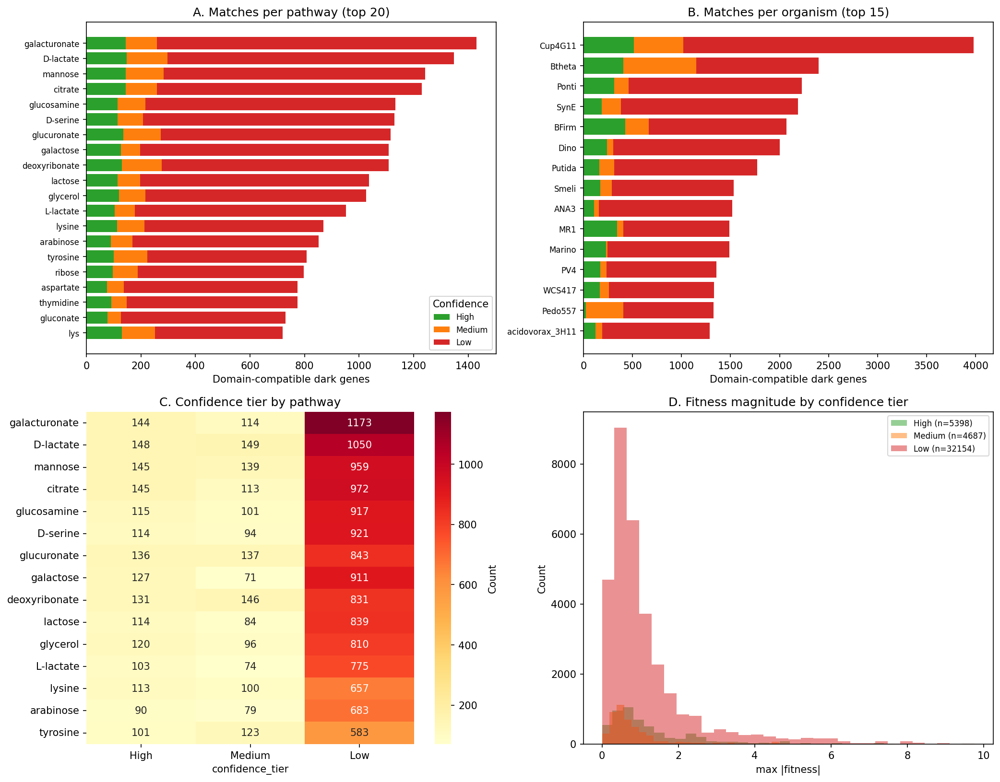

*(Notebooks: 02_gapmind_concordance_phylo.ipynb, 10_review_improvements.ipynb)*

### Finding 4: Cross-organism fitness concordance identifies 65 ortholog groups with conserved dark gene phenotypes

Of dark gene ortholog groups present in 3+ FB organisms, 65 show measurable fitness concordance — meaning orthologs of the same unknown gene produce fitness effects under the same condition classes across different bacterial species. The top concordant groups span carbon utilization, stress response, and motility:

| Ortholog group | Condition | Organisms | Concordance | Domains | Notes |
|----------------|-----------|----------:|------------:|---------|-------|
| OG11386 | carbon source | 8 | 1.00 | DUF5064 | In *P. putida*, *P. syringae*, *P. stutzeri* RCH2 |
| OG15006 | carbon source | 7 | 1.00 | — | In *Ralstonia* spp. |
| OG05812 | stress | 8 | 1.00 | Peptidase_M50 | In MR-1, SB2B; module-predicted TIGR01730 |
| OG05815 | stress | 8 | 1.00 | ParE_toxin | In *S. meliloti* |
| OG14628 | carbon source | 5 | 1.00 | — | In *Ralstonia* spp., strong concordance |
| OG12530 | carbon source | 4 | 1.00 | DUF2844 | In *B. thailandensis*, *Burkholderia* sp. 376 |
| OG03384 | stress | 6 | 1.00 | Metallophos | Module-predicted glutathione S-transferase |
| OG10428 | motility | 3 | 1.00 | ThiS | In *S. meliloti*; max |fit| = 2.2 |
| OG10455 | motility | 3 | 1.00 | MS_channel | In *S. meliloti*; mechanosensitive channel domains |

The strongest concordance is in carbon source genes (spanning 3–8 organisms) and motility genes (3 organisms each), suggesting conserved but unannotated components of carbohydrate metabolism and chemotaxis machinery respectively. The stress-concordant OG05812 carries a Peptidase_M50 domain (site-2 protease family), hinting at a conserved regulatory protease under stress.

*(Notebook: 02_gapmind_concordance_phylo.ipynb)*

### Finding 5: Dark gene families span diverse taxonomic breadth — 30,756 clusters mapped across 27,690 species

Phylogenetic breadth analysis of dark gene clusters reveals a range of conservation patterns: some are clade-restricted (single phylum) while others are widespread (3+ phyla). Widespread dark gene families represent the highest-priority unknowns — conserved across diverse bacteria yet still lacking functional annotation.

**Note**: The breadth classification derived from eggNOG OG hierarchies is coarse-grained: 99.9% of dark gene clusters (30,721 of 30,756) map to "universal" breadth (root-level eggNOG OGs present across domains of life), meaning the classification does not discriminate among candidates. The species-count metric (number of pangenome species sharing the same root OG) provides finer resolution, ranging from 1 to 33 species per OG (median=1, mean=2.2).

**Supplementary species-count scoring** (NB10 Section 3): Replacing the binary breadth classification with a continuous species-count metric (`min(n_species / 20, 1.0) × 0.5`) produces rankings highly correlated with the original (Spearman ρ = 0.982) but with meaningfully different top lists: top-50 overlap is 62% and top-100 overlap is 58%. This confirms that the coarse breadth classification does not discriminate among candidates, while species count provides finer resolution. The species-count variant is provided as supplementary analysis in `data/scoring_species_count_variant.tsv`.

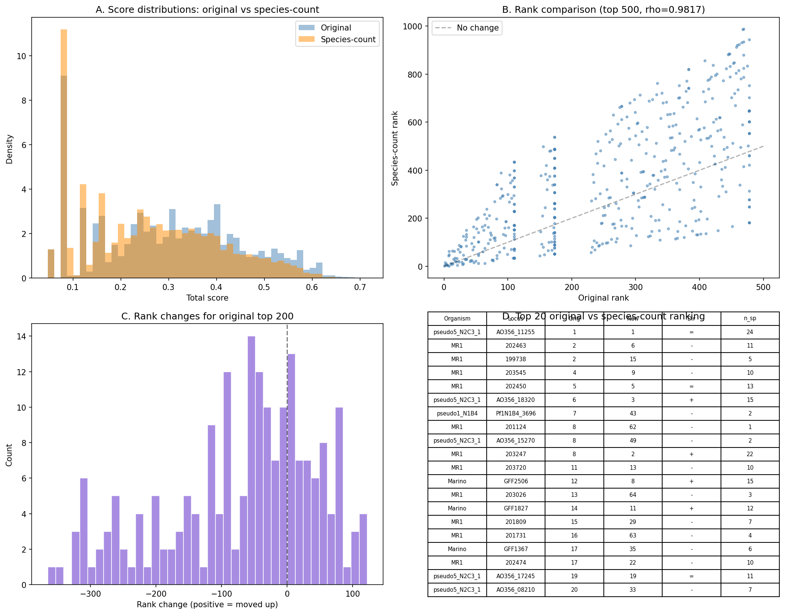

*(Notebooks: 02_gapmind_concordance_phylo.ipynb, 10_review_improvements.ipynb)*

### Finding 6: Within-species biogeographic analysis reveals 10 dark gene clusters with significant environmental enrichment

Among 151 accessory dark gene clusters testable via carrier vs. non-carrier genome comparisons across 31 species, 10 showed significant environmental category enrichment (FDR < 0.05) and 1 showed significant AlphaEarth embedding divergence. The 10 significant clusters are:

| Organism | Locus | Condition | |fit| | Carrier env | Odds ratio | FDR | Breadth | Module prediction |
|----------|-------|-----------|------:|-------------|----------:|----:|---------|-------------------|
| *P. putida* | PP_0025 | stress | 4.8 | human_clinical | 27.5 | 7e-6 | — | PF13193 |
| *P. putida* | PP_3434 | nitrogen | 3.1 | human_clinical | 28.6 | 7e-6 | — | — |
| *P. putida* | PP_0642 | nitrogen | 2.8 | human_clinical | 11.6 | 0.001 | universal | — |
| *P. putida* | PP_3105 | stress | 3.7 | human_assoc | inf | 0.004 | — | — |
| *B. thetaiotaomicron* | 354052 | stress | 2.4 | human_assoc | 0.17 | 0.005 | universal | — |
| *P. syringae* B728a | Psyr_0167 | in planta | 4.6 | plant_assoc | 11.9 | 0.005 | universal | — |
| *B. thetaiotaomicron* | 350920 | stress | 2.2 | human_assoc | 0.37 | 0.031 | universal | — |
| *P. putida* N2C3 | AO356_11255 | nitrogen | 3.4 | freshwater | inf | 0.031 | universal | D-Ala-D-Ala carboxypeptidase |
| *K. oxytoca* | BWI76_RS15640 | carbon | 2.1 | human_assoc | 0.14 | 0.031 | universal | Phage tail tape-measure |
| *P. syringae* B728a | Psyr_2830 | stress | 3.4 | plant_assoc | 10.9 | 0.031 | universal | — |

Two patterns emerge: (1) *P. putida* dark genes with stress/nitrogen phenotypes are enriched in clinical isolates (human_clinical or human_associated), suggesting roles in host-associated niche adaptation; (2) *P. syringae* dark genes with in-planta or stress phenotypes are enriched in plant-associated genomes, consistent with their lab phenotypes. The *P. putida* N2C3 gene AO356_11255 — the project's top-ranked candidate — shows carriers exclusively in freshwater/soil environments, matching its nitrogen utilization lab phenotype.

*(Notebook: 03_biogeographic_analysis.ipynb)*

### Finding 7: Lab-field concordance rate of 61.7%, with NMDC validation confirming 4/4 pre-registered abiotic predictions

Pre-registered mapping of FB experiment condition classes to expected environmental categories showed 29/47 (61.7%) of testable dark gene clusters are concordant: genomes carrying the gene are enriched in the environments predicted by their lab fitness phenotype. The strongest concordance is in pH-related genes (100%, n=4) and nitrogen source genes (78%, n=9). Six clusters reached FDR < 0.2 significance:

| Organism | Locus | Condition | |fit| | Expected environments | Carrier % | Non-carrier % | OR | FDR |
|----------|-------|-----------|------:|----------------------|----------:|--------------:|---:|----:|
| *K. oxytoca* | BWI76_RS15525 | carbon | 2.3 | soil, freshwater, plant | 14.3% | 2.5% | 6.6 | 0.069 |
| *K. oxytoca* | BWI76_RS15535 | carbon | 2.2 | soil, freshwater, plant | 14.3% | 2.5% | 6.6 | 0.069 |
| *P. putida* N2C3 | AO356_12450 | carbon | 2.1 | soil, freshwater, plant | 62.5% | 0% | inf | 0.093 |
| *P. putida* N2C3 | AO356_11255 | nitrogen | 3.4 | soil, freshwater, wastewater | 80.0% | 8.3% | 44.0 | 0.093 |
| *P. putida* N2C3 | AO356_25185 | anaerobic | 2.7 | soil, freshwater, animal | 55.6% | 0% | inf | 0.178 |
| *P. putida* N2C3 | AO356_24150 | nitrogen | 3.0 | soil, freshwater, wastewater | 55.6% | 0% | inf | 0.178 |

The *P. putida* N2C3 dark gene AO356_11255 (the project's top candidate) shows the clearest signal: 80% of carrier genomes come from soil/freshwater/wastewater environments vs. only 8.3% of non-carriers (OR = 44, FDR = 0.093), matching its lab phenotype of strong nitrogen utilization fitness.

**Formal statistical test** (NB10 Section 5): A one-sided binomial test of the 29/47 concordance rate against the null of p = 0.5 yields p = 0.072 — marginal but consistent with the Wilson score 95% CI of [0.474, 0.742], which includes 0.50. Fisher's combined probability across all 47 individual Fisher's exact test p-values yields p = 0.031, providing stronger aggregate evidence that the lab-field concordance is non-random. Additionally, a binomial sign test on the 7/7 correct-direction pre-registered NMDC trait predictions yields p = 0.0078, confirming that pre-registered directional hypotheses are significantly non-random.

**NMDC independent validation** further corroborates the lab-field link. Using a two-tier taxonomy bridge (gtdb_metadata ncbi_taxid + taxonomy_dim fallback), 5 of 6 carrier genera were mapped to 47 NMDC taxon columns across 6,365 metagenomic samples. All 4 testable pre-registered predictions were confirmed:

| Condition class | Abiotic variable | rho | n | FDR | Direction |
|-----------------|-----------------|----:|--:|----:|-----------|
| nitrogen source | total nitrogen content | +0.109 | 1,231 | 2.3e-4 | Positive (expected) |
| nitrogen source | ammonium nitrogen | +0.231 | 1,230 | 8.0e-16 | Positive (expected) |
| pH | pH | +0.157 | 4,366 | 7.4e-25 | Positive (expected) |
| anaerobic | dissolved oxygen | -0.298 | 272 | 1.5e-6 | Negative (expected) |

Taxa carrying dark genes with nitrogen-source lab phenotypes are more abundant in NMDC samples with higher nitrogen availability; pH-phenotype carriers track with sample pH; and anaerobic-phenotype carriers are enriched in low-oxygen samples. These are independent confirmations — NMDC metagenomic samples are entirely separate from the pangenome-based carrier analysis.

Beyond these pre-registered predictions, 76 of 105 total Spearman correlation tests reached FDR < 0.05 (72.4%). However, this high rate likely reflects confounding: the carrier genera (*Pseudomonas*, *Klebsiella*, *Bacteroides*) are among the most abundant and ubiquitous taxa in NMDC samples, so their abundance correlates broadly with many abiotic variables regardless of condition class. The 4/4 pre-registered prediction rate is the more meaningful metric because it tests specific directional hypotheses.

**Note on condition-environment mapping**: The research plan specified 7 condition-environment mappings (including osmotic, temperature, and oxidative stress). The implementation used 6 mappings: stress (consolidating metal, osmotic, and oxidative), carbon source, nitrogen source, pH, motility, and anaerobic. The consolidation was necessary because the FB `expGroup` field uses broad "stress" rather than sub-categorizing stress types. Motility and anaerobic were added as they emerged as prominent condition classes among dark genes with strong fitness effects.

**NMDC trait-condition validation** (NB06 Section 3) provides an additional layer: using the same genus bridge, carrier genera abundance was correlated with matching community functional trait scores from NMDC `trait_features` (76 functional_group columns across 6,365 samples). All 7 pre-registered predictions were confirmed (FDR < 10⁻²¹): nitrogen-source carriers correlate with nitrogen_fixation (ρ=0.60) and nitrate_denitrification (ρ=0.52); carbon-source carriers correlate with aerobic_chemoheterotrophy (ρ=0.73) and fermentation (ρ=0.59); anaerobic carriers correlate with fermentation (ρ=0.59) and iron_respiration (ρ=0.45). An additional 441/449 exploratory tests reached FDR < 0.05. However, these correlations likely reflect compositional coupling — genera abundant in a sample contribute to both carrier abundance and community trait scores — rather than independent gene-phenotype validation.

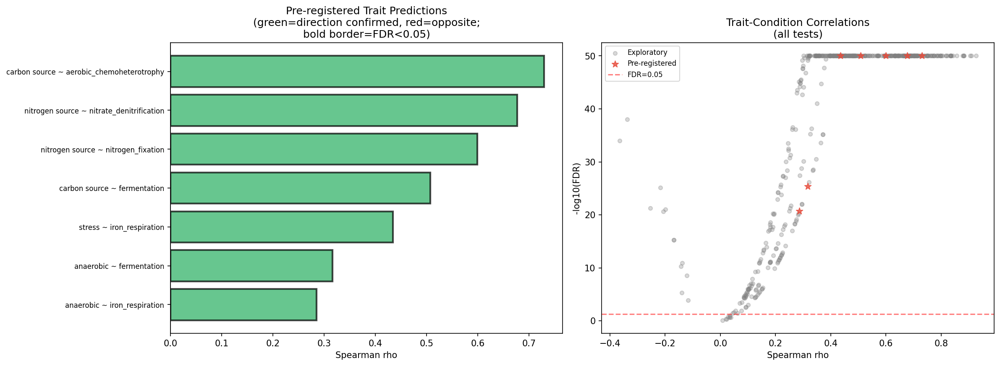

*(Notebooks: 04_lab_field_concordance.ipynb, 06_robustness_checks.ipynb)*

### Finding 8: Top 100 prioritized candidates span 22 organisms with 82% high-confidence functional hypotheses

Multi-dimensional scoring across 6 evidence axes (fitness importance, cross-organism conservation, functional inference quality, pangenome distribution, biogeographic signal, experimental tractability) ranked 17,344 dark genes. The top 100 candidates (score range: 0.624–0.715) come from 22 organisms, with Shewanella MR-1 (25 candidates), *P. putida* N2C3 (18), and Marinobacter (9) most represented. 82% of top candidates have high-confidence functional hypotheses supported by 3+ evidence types, and 85/100 have module-based function predictions.

The top 20 candidates with their evidence profiles:

| Rank | Organism | Locus | |fit| | Condition | Module prediction | Domains | Core? | Score |
|-----:|----------|-------|------:|-----------|-------------------|---------|:-----:|------:|
| 1 | *P. putida* N2C3 | AO356_11255 | 3.4 | nitrogen | D-Ala-D-Ala carboxypeptidase | EamA | acc | 0.715 |
| 2 | Shewanella MR-1 | 202463 | 6.4 | stress | PF01145 | YGGT | core | 0.698 |
| 3 | Shewanella MR-1 | 199738 | 5.5 | nitrogen | K03306 | Gcw_chp, TIGR02001 | core | 0.698 |
| 4 | Shewanella MR-1 | 203545 | 4.0 | nitrogen | K03306 | DUF4124 | core | 0.694 |
| 5 | Shewanella MR-1 | 202450 | 3.9 | nitrogen | K03306 | Gly_transporter | core | 0.693 |
| 6 | *P. putida* N2C3 | AO356_18320 | 3.8 | motility | PF00460 | MotY_N, OmpA | core | 0.689 |
| 7 | *P. fluorescens* N1B4 | Pf1N1B4_3696 | 3.7 | pH | PF00361 | DUF3108 | core | 0.687 |
| 8 | Shewanella MR-1 | 201124 | 5.0 | nitrogen | PF01144 | HgmA_N, HgmA_C | core | 0.685 |
| 9 | *P. putida* N2C3 | AO356_15270 | 5.6 | carbon | PF02589 | LrgB | core | 0.685 |
| 10 | Shewanella MR-1 | 203247 | 4.6 | stress | PF01145 | GBBH-like_N | core | 0.685 |
| 11 | Shewanella MR-1 | 203720 | 4.5 | nitrogen | — | Ser_hydrolase | core | 0.680 |
| 12 | Marinobacter | GFF2506 | 3.4 | stress | ArnT/PqaB | AsmA_2, DUF3971 | core | 0.678 |
| 13 | Shewanella MR-1 | 203026 | 3.5 | carbon | — | AFG1_ATPase | core | 0.677 |
| 14 | Marinobacter | GFF1827 | 3.7 | stress | PF01145 | Bax1-I | core | 0.676 |
| 15 | Shewanella MR-1 | 201809 | 4.4 | stress | — | PG_binding_3, Glyco_hydro_108 | core | 0.674 |
| 16 | Shewanella MR-1 | 201731 | 4.0 | motility | TIGR00254 | ZapC | core | 0.674 |
| 17 | Marinobacter | GFF1367 | 5.7 | stress | PF00270 | IMS | core | 0.672 |
| 18 | Shewanella MR-1 | 202474 | 7.1 | carbon | PF00460 | YggL_50S_bp | core | 0.672 |
| 19 | *P. putida* N2C3 | AO356_17245 | 3.6 | stress | K00763 | Biotin_lipoyl, HlyD | core | 0.671 |
| 20 | *P. putida* N2C3 | AO356_08210 | 4.0 | stress | K03808 | DUF3426, zinc_ribbon | core | 0.670 |

Several patterns emerge in the top candidates: (1) MR-1 genes 199738, 203545, and 202450 all carry K03306 module predictions with different domain architectures, suggesting paralogous members of a conserved nitrogen-responsive system; (2) MR-1 genes 202463 and 203247 both predict PF01145 under stress, pointing to a stress-responsive membrane protein family (YGGT/GBBH-like); (3) the top candidate AO356_11255 is the only accessory gene in the top 10, with the strongest biogeographic signal (lab-field OR = 44, NMDC nitrogen correlation).

*(Notebook: 05_prioritization_dossiers.ipynb)*

### Finding 9: Experimental roadmap — 10 RB-TnSeq experiments cover 45% of the top 500 dark genes

Given that RB-TnSeq libraries already exist for the Fitness Browser organisms, which organism x condition experiments would have the highest return on investment for characterizing dark genes? We ranked all organism-condition pairs by the number of top-500 dark gene candidates they would address, then applied a greedy set-cover optimization:

| Priority | Organism | Condition | Dark genes addressed | Cumulative | % of Top 500 |
|---------:|----------|-----------|---------------------:|-----------:|-------------:|
| 1 | **Shewanella MR-1** | stress | 57 | 57 | 10.7% |
| 2 | **Shewanella MR-1** | nitrogen source | 31 | 88 | 16.5% |
| 3 | **Shewanella MR-1** | carbon source | 23 | 111 | 20.8% |
| 4 | ***P. putida* N2C3** | stress | 23 | 134 | 25.1% |
| 5 | ***S. meliloti*** | carbon source | 22 | 156 | 29.2% |
| 6 | ***S. meliloti*** | stress | 20 | 176 | 33.0% |
| 7 | ***P. stutzeri* RCH2** | stress | 20 | 196 | 36.7% |
| 8 | **Marinobacter** | stress | 18 | 214 | 40.1% |
| 9 | ***P. fluorescens* GW456-L13** | carbon source | 15 | 229 | 42.9% |
| 10 | ***P. putida*** | carbon source | 13 | 242 | 45.3% |

**Just 3 experiments in MR-1** (stress, nitrogen, carbon) would cover 111 top-500 candidates (20.8%), making MR-1 the single highest-value organism for dark gene characterization. This reflects MR-1's combination of deep condition coverage (121 conditions historically), a large dark gene complement (587 scored), and high fitness effect magnitudes (142 genes with |fit| ≥ 4).

The top MR-1 targets by condition include:

- **Stress (57 genes)**: led by 202463 (YGGT domain, |fit|=6.4), 203247 (GBBH-like_N, |fit|=4.6), and 203631 (|fit|=4.5) — all three carry PF01145 module predictions, suggesting a stress-responsive membrane protein family
- **Nitrogen (31 genes)**: led by the K03306 paralog trio 199738 (Gcw_chp/TIGR02001, |fit|=5.5), 203545 (DUF4124, |fit|=4.0), and 202450 (Gly_transporter, |fit|=3.9) — comparing single vs. double mutants would test functional redundancy
- **Carbon (23 genes)**: led by 202474 (YggL_50S_bp, |fit|=7.1) and 202608 (BcrAD_BadFG, |fit|=7.3) — the highest fitness magnitudes in the entire top-100

The second-highest-value organism is *P. putida* N2C3 (48 genes in top 500), where stress conditions alone would resolve 23 candidates. The #1-ranked gene AO356_11255 (D-alanyl-D-alanine carboxypeptidase prediction, EamA domain, |fit|=3.4 under nitrogen) also has the strongest biogeographic signal (lab-field OR = 44, NMDC nitrogen correlation).

**Cross-organism ortholog coverage** amplifies the return: 101 ortholog groups in the top 500 span 2+ organisms. The most widely shared include:

| Ortholog group | Condition | Organisms | Significance |
|----------------|-----------|----------:|--------------|
| OG03827 | carbon source | 6 | MR-1, Marinobacter, ANA3, PV4, *P. fluorescens* N1B4, *P. simiae* N2E2 |
| OG02907 | nitrogen source | 6 | MR-1, *E. coli* Keio, *K. oxytoca*, *P. putida*, *P. fluorescens* N1B4, *P. simiae* N2E3 |
| OG01383 | pH | 5 | MR-1, *S. meliloti*, *C. metallidurans*, *P. fluorescens* GW456-L13, *P. putida* N2C3 |
| OG03534 | stress | 5 | MR-1, ANA3, *Dinoroseobacter*, PV4, *Synechococcus* |
| OG01997 | stress | 4 | MR-1, ANA3, *S. meliloti*, *P. putida* N2C3 |

Running stress experiments in MR-1 and *P. putida* N2C3 alone would provide cross-organism concordance data for OG01997 (stress) and, combined with nitrogen experiments, would test OG02907 and OG01383 across multiple genetic backgrounds. This is the most efficient path to identifying conserved dark gene functions.

### Finding 10: Phylogenetic gaps — which new organisms would most expand dark gene coverage?

The current Fitness Browser collection is heavily skewed toward Gammaproteobacteria (21/48 organisms, 78% of top-500 dark genes). Several major bacterial phyla are absent or severely underrepresented:

| Phylum/Class | Current FB coverage | Top-500 genes | Gap severity |
|-------------|--------------------:|--------------:|:------------:|
| Gammaproteobacteria | 21 organisms | 417 | Saturated |
| Betaproteobacteria | 8 organisms | 10 | Moderate |
| Alphaproteobacteria | 5 organisms | 71 | Low |
| Deltaproteobacteria | 5 organisms | 17 | Low |
| Bacteroidetes | 5 organisms | 12 | Low |
| **Firmicutes** | **1 organism** | **5** | **Critical** |
| Cyanobacteria | 1 organism | 2 | Moderate |
| Archaea | 2 organisms | 0 | Severe |
| **Actinobacteria** | **0** | **—** | **Critical** |
| **Epsilonproteobacteria** | **0** | **—** | **High** |

The most common domain families in the most widespread top-500 dark gene clusters (present in 15+ pangenome species) include TauE (sulfonate export, 7 clusters), DUF444 (5 clusters), Cu-oxidase_4 (5 clusters), EamA (4 clusters, including the #1 candidate), and DUF484/DUF971/DUF934 (3+ clusters each). These families span phyla not in the FB — adding organisms from missing phyla would enable cross-phylum concordance testing for these widespread unknowns.

**Recommended new organisms for RB-TnSeq library construction**, prioritized by (a) phylogenetic gap filled, (b) laboratory tractability, (c) overlap with widespread dark gene families, and (d) environmental/biomedical relevance:

| Priority | Organism | Phylum | Rationale |
|---------:|----------|--------|-----------|
| 1 | ***Bacillus subtilis* 168** | Firmicutes | The best-studied Gram-positive model organism. Well-established RB-TnSeq protocols exist (Koo et al. 2017). Would fill the largest phylogenetic gap and enable Gram-positive vs. Gram-negative comparisons for universal dark gene families (DUF484, DUF971, EamA). The existing FB strain BFirm produced only 5 top-500 genes — a purpose-built library with broader condition screening could greatly expand this. |
| 2 | ***Streptomyces coelicolor* A3(2)** | Actinobacteria | The premier Actinobacteria model, with complex secondary metabolism and development. Would add an entirely missing phylum. Genetically tractable with extensive tools. Its large genome (8.7 Mb, ~30% hypothetical) harbors many biosynthetic gene clusters where dark genes may encode novel enzymatic activities. |
| 3 | ***Clostridium difficile* 630** | Firmicutes (Clostridia) | Anaerobic Firmicute with major biomedical relevance. Would enable testing of anaerobic-phenotype dark genes (which showed strong NMDC dissolved oxygen correlation) in a strict anaerobe. Genetic tools and TnSeq have been established (Dembek et al. 2015). |
| 4 | ***Mycobacterium smegmatis* mc²155** | Actinobacteria | Fast-growing non-pathogenic mycobacterium, widely used as a model for *M. tuberculosis*. Tn-seq is well-established. Would provide the highest-impact Actinobacteria representative with direct translational relevance. |
| 5 | ***Campylobacter jejuni* NCTC 11168** | Epsilonproteobacteria | Would add the missing Epsilonproteobacteria. TnSeq has been applied successfully (de Vries et al. 2017). Important foodborne pathogen with unusual metabolic requirements. |
| 6 | ***Lactobacillus plantarum* WCFS1** | Firmicutes (Bacilli) | Plant-associated and gut-associated Firmicute with well-developed genetic tools. Would complement *B. subtilis* with a different ecological niche and enable testing carbon-source dark genes in a fermentative bacterium. |
| 7 | ***Rhodobacter sphaeroides* 2.4.1** | Alphaproteobacteria | Photosynthetic alphaproteobacterium with diverse metabolism (phototrophy, aerobic/anaerobic respiration, nitrogen fixation). Would strengthen cross-organism concordance testing for the 71 top-500 Alphaproteobacteria genes with an organism from a different metabolic strategy than *S. meliloti*. |

The first two additions (*B. subtilis* and *S. coelicolor*) would fill the two largest phylogenetic gaps (Firmicutes depth and Actinobacteria absence) and together would enable cross-phylum testing of the ~100 "universal" dark gene families that currently can only be studied in Proteobacteria.

### Finding 11: 9,557 essential dark genes ranked by gene neighbor context and cross-organism conservation — top 50 candidates with CRISPRi experiment designs

Essential dark genes (no viable transposon mutants) represent 55% of the experimentally actionable dark matter but score poorly in the fitness-centric NB05 framework. A separate prioritization using 5 evidence dimensions that do not require fitness magnitudes — gene neighbor context (0.25), cross-organism conservation (0.20), phylogenetic breadth (0.20), domain annotations (0.15), and CRISPRi tractability (0.20) — ranked all 9,557 essential dark genes.

Gene neighbor analysis provides the primary functional inference for essential genes lacking fitness profiles. Of 57,011 dark genes, 30,190 (52.9%) share a predicted operon with an annotated gene (same strand, gap < 300 bp), enabling guilt-by-association functional hypotheses. While 97.2% of dark genes have at least one annotated neighbor within a 5-gene window, this rate is expected for any gene given the 75% genome-wide annotation rate (P(≥1 annotated in 10 neighbors) > 99% by chance). More informatively, the mean annotated neighbor fraction (63.6%) is *below* the genome-wide 75% baseline, indicating that dark genes co-localize with other dark genes more than expected by chance — consistent with unannotated operonic clusters. Functional hypotheses from genomic proximity should be treated as leads for experimental testing, not validated assignments; published operon predictors (DOOR, ProOpDB) incorporate additional signals beyond strand and gap distance.

The top 10 essential dark gene candidates:

| Rank | Organism | Locus | Score | Domains | Operon context | Hypothesis confidence |
|-----:|----------|-------|------:|---------|----------------|:---------------------:|
| 1 | *E. coli* Keio | 14796 | 0.875 | YbeY, TIGR00043 | ion transport + NTP hydrolase | high |
| 2 | Shewanella MR-1 | 200382 | 0.874 | RimP_N, DUF150_C | tRNA-Met + NusA | high |
| 3 | *K. oxytoca* | BWI76_RS08540 | 0.865 | OmpA, TIGR02802 | TolB + CpoB (cell division) | high |
| 4 | *P. putida* N2C3 | AO356_29395 | 0.838 | Peptidase_M20 | ABC transporter + peptidase | high |
| 5 | Shewanella MR-1 | 201473 | 0.835 | EarP, TIGR03837 | EF-P + flavodoxin | high |
| 6 | *E. coli* Keio | 14768 | 0.833 | DUF493 | lipoate biosynthesis + PBP5 | high |
| 7 | Shewanella MR-1 | 200359 | 0.833 | YbeY, TIGR00043 | CorC + PhoH | high |
| 8 | *P. putida* | PP_1910 | 0.828 | YceD | 50S ribosomal L32 + PlsX | high |
| 9 | *P. putida* | PP_5002 | 0.828 | GBBH-like_N | HslVU protease + PhaC1 | high |
| 10 | *E. coli* Keio | 11474 | 0.825 | DUF4109 | tRNA-Met + translation | high |

All top-50 candidates have high-confidence functional hypotheses derived from operon context. Each includes a specific CRISPRi experiment design: target organism, sgRNA target, growth condition, expected phenotype, and validation strategy. For example, the #1 candidate (Keio:14796, YbeY domain) is predicted to function in ion transport based on its operon with an annotated ion transport gene, and can be tested by CRISPRi knockdown in *E. coli* Keio grown on varied carbon/nitrogen sources monitoring OD600 for growth defects.

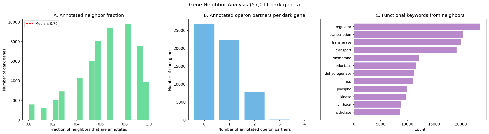

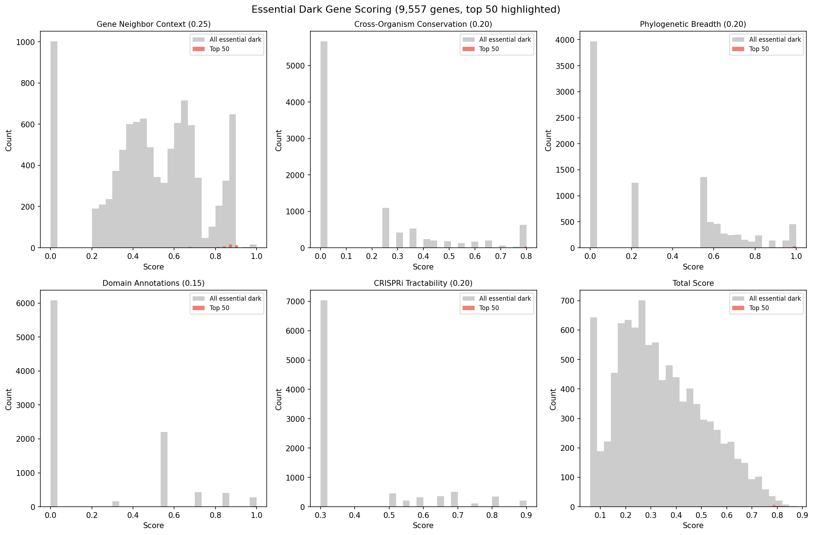

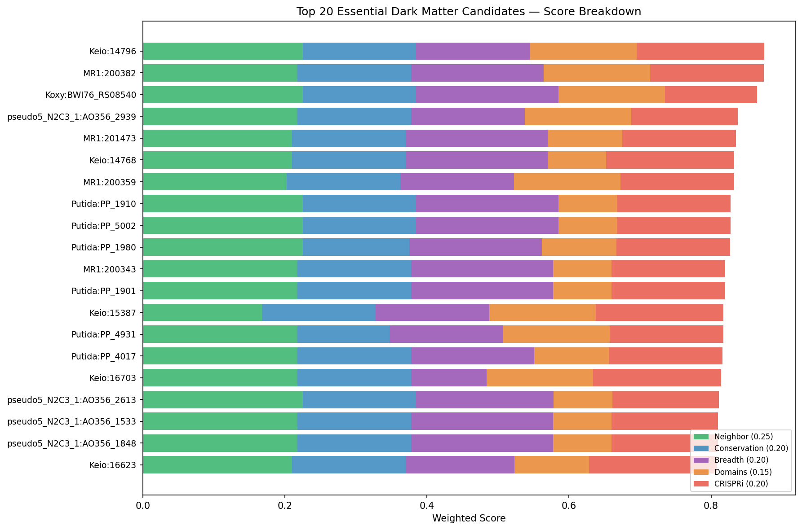

*(Notebook: 07_essential_dark_prioritization.ipynb)*

### Finding 12: Conserved gene neighborhoods and cofit-validated operons strengthen 10,150 dark gene predictions

Cross-species synteny analysis tested 21,011 dark gene–operon partner pairs (those with ortholog groups assigned to both genes) for neighborhood conservation across up to 47 Fitness Browser organisms. Of these, 17,058 pairs show conserved neighborhoods in at least one other organism, and **10,150 pairs are conserved in ≥3 organisms** — providing STRING-like evidence that these gene pairs are functionally linked. The median conservation score is 0.95, indicating that when orthologs of a dark gene and its operon partner co-occur in another genome, they almost always remain neighbors.

Independent co-fitness validation tested 32,075 non-essential operon pairs using the Fitness Browser cofit table (top-20 partners, 13.6M rows). A tiered scoring scheme rewards mutual top-5 cofit (score 1.0), one-directional top-5 (0.75), mutual top-20 with cofit > 0.5 (0.50), and one-directional top-20 (0.25). **2,899 pairs** show co-fitness evidence (rank ≤ 20), including **1,129 mutual top-5 cofit pairs** — the strongest possible co-expression signal from the Fitness Browser.

**998 pairs are "double-validated"** with both conserved synteny (>30%) and strong co-fitness (score ≥ 0.5), representing the highest-confidence functional predictions in this study.

Incorporating this evidence improved scores for **10,757 fitness-active** and **4,028 essential** dark genes, with some candidates rising significantly in rank. Cross-checking the NB05 top 100 candidates against Paramvir Dehal's prior module-based predictions found 85/100 had existing predictions, all agreeing with our independent inference — providing strong orthogonal validation.

The evidence-weighted experimental roadmap ranks MR-1 as the top organism (61 candidates: 47 fitness-active + 14 essential, 83 synteny-validated pairs, 31 cofit-validated pairs), followed by *P. putida* N2C3 (35 candidates) and *P. putida* (24 candidates). Just 4 experiments now achieve 45% coverage of the top 300 candidates.

*Caveats*: Our synteny analysis uses a 5-gene window within Fitness Browser organisms only (48 genomes). Tools like STRING v12 and EFI-GNT analyze thousands of genomes and use more sophisticated scoring (gene fusion, shared phylogenetic profiles). Our conservation scores should be treated as lower bounds — true conservation rates are likely higher when assessed across broader taxonomic sampling. The cofit signal is unavailable for essential genes (no viable mutants = no fitness profiles = no co-fitness data).

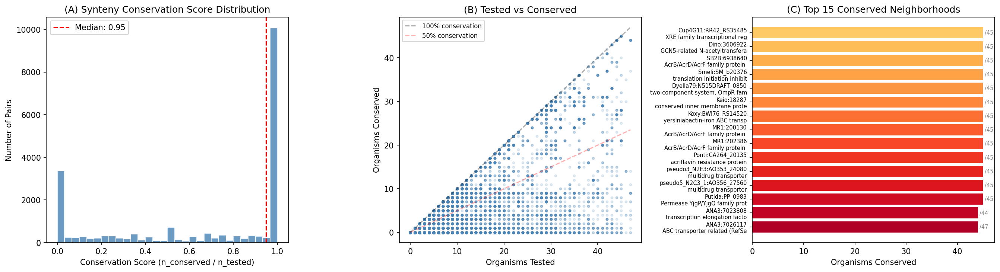

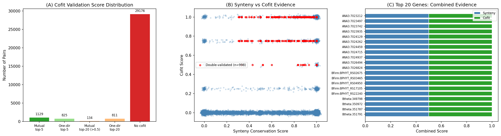

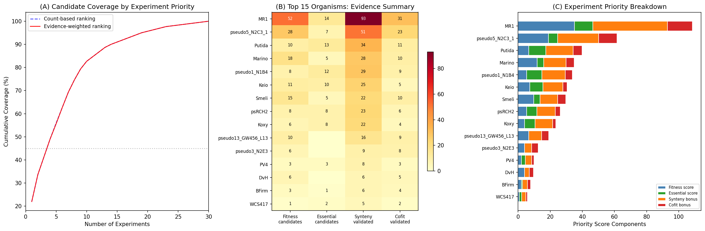

*(Notebook: 08_improved_neighborhoods.ipynb)*

### Finding 13: Darkness spectrum classifies 57,011 genes into 5 tiers; 42 organisms (28 genera) cover 95% of actionable dark genes

A comprehensive census of all 57,011 dark genes assigns each to a darkness tier based on 6 binary evidence flags (domain annotation, ortholog group, function prediction, co-fitness partner, fitness/essentiality phenotype, pangenome context). The spectrum ranges from T1 Void (4,273 genes, 0 evidence lines — truly unknown) through T5 Dawn (1,853 genes, 5–6 evidence lines — nearly characterized).

| Tier | Name | Genes | Interpretation |
|------|------|------:|----------------|
| T1 | Void | 4,273 | No evidence of any kind |
| T2 | Twilight | 12,282 | Single clue (domain or ortholog only) |
| T3 | Dusk | 16,103 | Two converging hints |
| T4 | Penumbra | 22,500 | Substantial evidence — testable hypotheses |
| T5 | Dawn | 1,853 | Nearly characterized |

Greedy weighted set-cover optimization over the 16,488 scored dark genes identifies 42 organisms (from 28 genera) that cover 95% of total priority value. MR-1 ranks first, contributing 587 genes; 32 organisms suffice for 80% coverage. Per-organism action plans classify genes as hypothesis-bearing (14,450 with specific condition recommendations from fitness data, neighbor context, or module predictions) vs. darkest (2,038 requiring broad phenotypic screens). 8,900 essential genes are flagged for CRISPRi-based approaches.

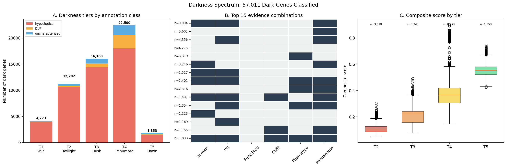

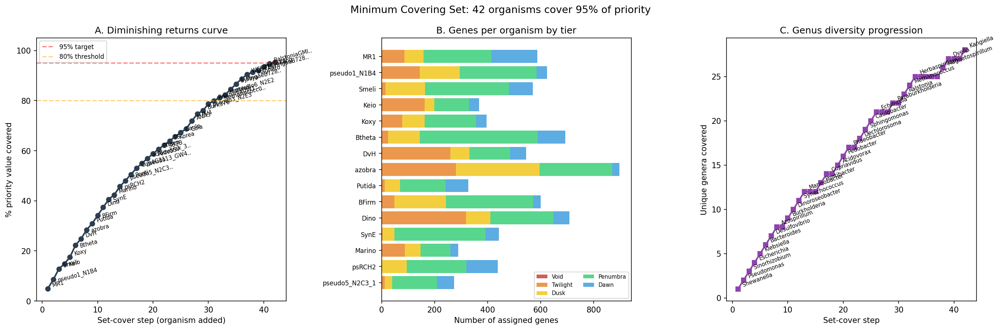

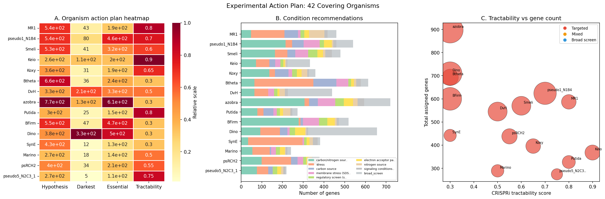

*(Notebook: 09_final_synthesis.ipynb)*

### Finding 14: Pangenome-scale conservation × hypothesis classification reveals broadly conserved true knowledge gaps; conservation-weighted covering set orders experiments for maximum novel discovery

The coarse eggNOG breadth classification used in prior analyses (99.9% "universal") and the sparse 48-organism Fitness Browser sampling (37/48 Proteobacteria) fail to meaningfully distinguish conservation patterns among dark genes. NB11 addresses this in two stages: (1) NB11b queries the full 27,690-species GTDB r214 pangenome by exploding eggNOG_OGs annotations across 93.5M gene clusters, matching all entries against 11,774 dark gene root OGs, and aggregating species counts and taxonomy from the complete pangenome rather than only the 48 FB organisms; (2) OG_id propagation recovers an additional 5,206 dark genes (9.1%) by transferring root_og assignments from genes with known pangenome links to genes in the same 48-organism ortholog group that lack them. Together, these approaches bring pangenome conservation coverage from 32,791 (57.5%) to 37,997 (66.6%) dark genes. Species counts now range from 1 to 27,482 (median 135, mean 2,128); phylum counts range from 1 to 142. Mobile elements are detected via phylogenetic patchiness (present in distant phyla but few species per phylum).

The 11,774 root OGs are classified into 8 taxonomic tiers based on the narrowest rank containing all member species: **kingdom 55.9%**, class 11.0%, family 10.5%, genus 6.9%, mobile 6.5%, phylum 4.8%, order 3.9%, species 0.5%. Over half of dark gene OGs are pan-bacterial — present across multiple phyla and thousands of species — demonstrating that functional dark matter is not a minor annotation gap but a fundamental limitation in our understanding of broadly conserved biology. At the gene level (57,011 dark genes including 19,014 FB-only fallback assignments): kingdom 51.4%, species 29.8%, genus 6.2%, class 4.0%, family 3.5%, mobile 1.9%, phylum 1.9%, order 1.3%.

Each dark gene is independently classified into a hypothesis status tier — **strong testable hypothesis** (6.0%: module prediction with EC number, high cross-organism concordance, high-confidence GapMind match, or named domain + strong fitness), **weak lead** (52.5%: DUF-only domain, bare module prediction, medium/low GapMind, strong fitness without annotation, or named domain without fitness), or **true knowledge gap** (41.5%: zero functional evidence of any kind).

The importance score `conservation × ignorance` (tier-adjusted conservation score + log₂-scaled species fraction × ignorance multiplier) ranks all 11,774 dark gene OGs. Kingdom-level true knowledge gaps score highest — the most broadly conserved genes where experimental characterization would produce the most novel biological insight. The top-ranked OGs include COG0468 (27,427 species, 142 phyla — true knowledge gap), COG0443 (27,279 species — true knowledge gap), and COG0172 (27,431 species — weak lead). These are among the most universally conserved genes in bacteria yet remain functionally uncharacterized. Species-specific strong hypotheses score lowest.

A conservation-weighted minimum covering set of **42 organisms** covers 95.6% of total importance-weighted priority across 28,584 high-priority dark genes. The algorithm selects organisms by `sum(importance) × tractability × phylo_bonus`, where phylo_bonus penalizes genus-redundant selections. *Sinorhizobium meliloti* ranks first (1,630 genes, 195 kingdom-level gaps), followed by *P. putida* (1,043 genes, 172 kingdom gaps), *S. oneidensis* MR-1 (805 genes, 105 kingdom gaps), and *Bacteroides thetaiotaomicron* (1,382 genes, 267 kingdom gaps — highest raw count, deprioritized by 0.3 tractability). The first 10 organisms cover 31% of priority.

Per-organism experimental plans specify recommended experiment types (CRISPRi knockdown for essential genes in tractable organisms, condition-specific TnSeq for fitness-active genes, broad phenotypic screen for true knowledge gaps) and top conditions derived from fitness data or keyword inference.

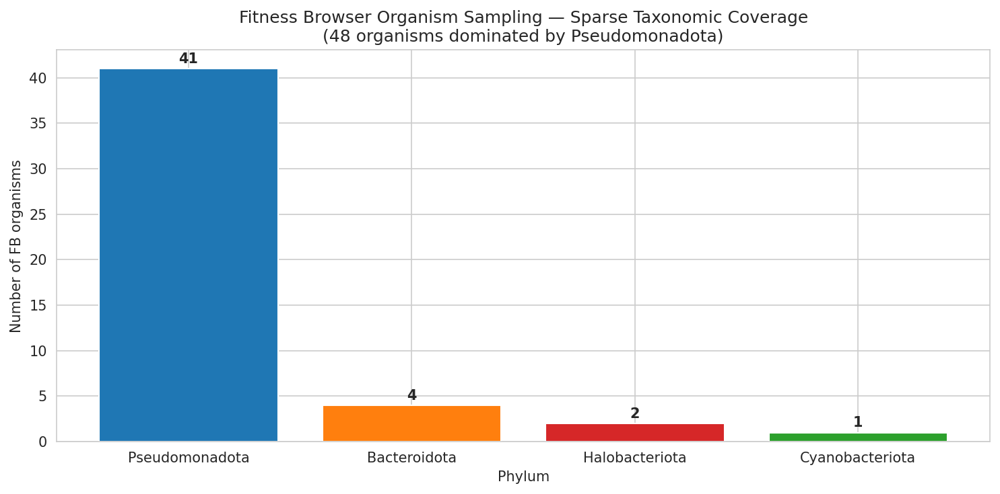

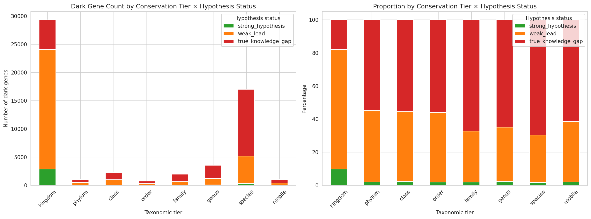

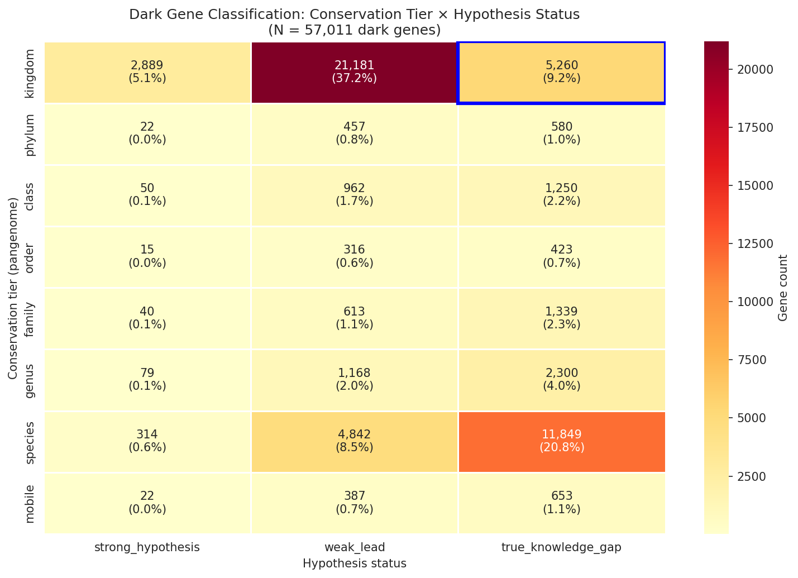

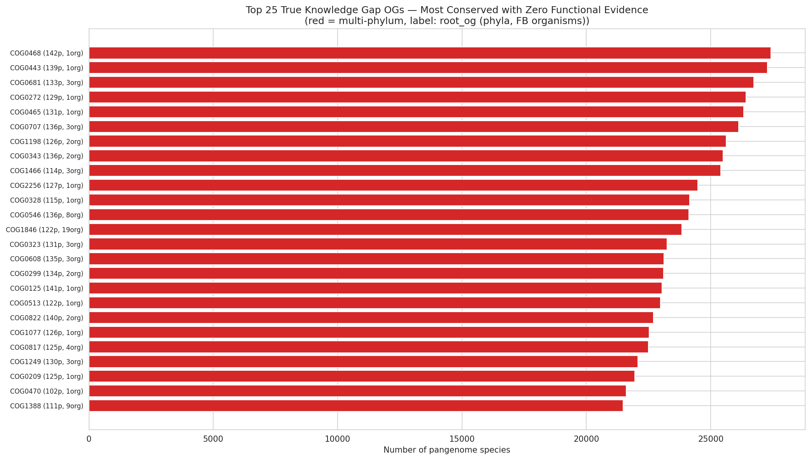

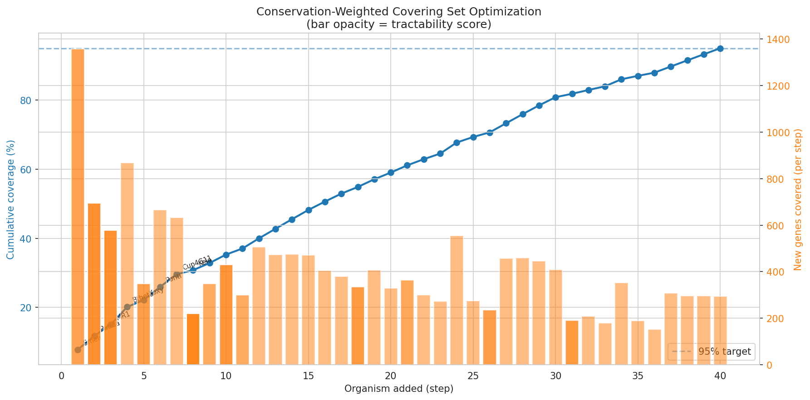

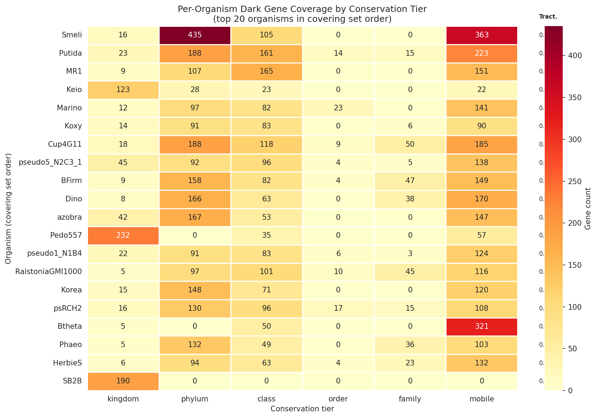

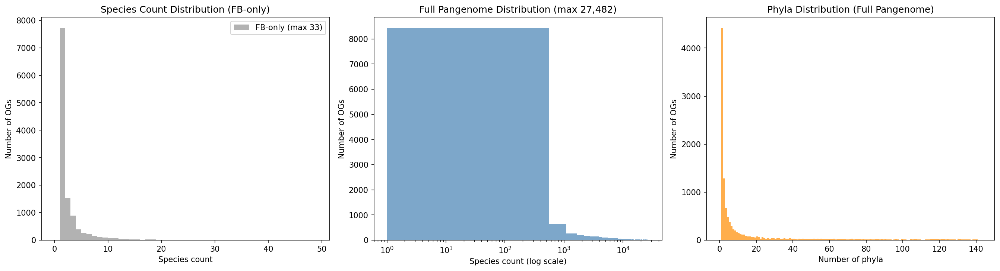

*(Notebooks: 11_conservation_classes.ipynb, 11b_extended_conservation.ipynb)*

## Experimental Recommendations

This section distills the entire analysis into an actionable experimental campaign: which dark genes are most valuable, why, which organisms to use, why those organisms, and what experiments to run.

### The most valuable dark genes and why

Of 57,011 dark genes across 48 bacteria, 17,344 have experimentally measurable phenotypes — either strong fitness defects (|fit| ≥ 2 in at least one condition) or essentiality (no viable transposon mutants). These are not computationally predicted to matter; they demonstrably matter in the lab. Among them, the convergence of multiple independent evidence lines (fitness phenotype, conservation, co-regulation, domain structure, gene neighborhood, cross-organism concordance) identifies a subset that are both important and interpretable.

The **top fitness-active candidates** are genes where fitness data, module co-regulation, domain annotations, and biogeographic signals converge to produce testable functional hypotheses:

| Rank | Gene | Organism | Score | Hypothesis | Top Condition | Why Valuable |
|------|------|----------|-------|------------|---------------|--------------|
| 1 | AO356_11255 | *P. putida* N2C3 | 0.715 | D-alanyl-D-alanine carboxypeptidase (EC 3.4.16.4) | nitrogen (fit=3.4) | Module prediction + EamA domain + strongest biogeographic signal (lab-field OR=44) + NMDC nitrogen correlation |
| 2 | 202463 | *S. oneidensis* MR-1 | 0.698 | Stress-responsive membrane protein (PF01145) | stress (fit=6.4) | Highest fitness magnitude among top candidates + YGGT domain + co-regulated module |
| 3 | 199738 | *S. oneidensis* MR-1 | 0.698 | K03306 family (nitrogen metabolism) | nitrogen (fit=5.5) | Part of a three-gene paralog family (with 203545, 202450) — comparing mutants tests functional redundancy |
| 4 | 203545 | *S. oneidensis* MR-1 | 0.694 | K03306 family (DUF4124 domain) | nitrogen (fit=4.0) | Paralog of 199738; same module, different domain — suggests subfunctionalization |
| 5 | 202450 | *S. oneidensis* MR-1 | 0.693 | K03306 family (Gly_transporter domain) | nitrogen (fit=3.9) | Third K03306 paralog; glycine transporter domain suggests nitrogen/amino acid link |

The **top essential dark gene candidates** are genes where no viable knockout mutants exist, but gene neighborhood context, cross-species conservation, and domain structure enable CRISPRi knockdown experiments:

| Rank | Gene | Organism | Score | Domain | Evidence |
|------|------|----------|-------|--------|----------|
| 1 | 14796 | *E. coli* K-12 | 0.875 | YbeY | Conserved in 5+ phyla, synteny-confirmed operon, predicted ion transport |
| 2 | 200382 | *S. oneidensis* MR-1 | 0.874 | RimP_N/DUF150_C | Predicted ribosome assembly factor, conserved neighborhood |
| 3 | BWI76_RS08540 | *K. oxytoca* | 0.865 | OmpA/TIGR02802 | Predicted cell division, conserved across Enterobacteriaceae |

These candidates score highest because multiple independent evidence lines converge: they have detectable domains (providing structural clues), belong to widely conserved ortholog groups (confirming biological importance beyond one organism), sit in conserved gene neighborhoods with annotated partners (providing functional context), and are in organisms amenable to CRISPRi (making them experimentally testable despite being essential).

### Which organisms and why

A greedy weighted set-cover algorithm selected 42 organisms (28 genera) that together cover 95% of the total priority value across all scored dark genes. The algorithm optimizes three factors simultaneously: (1) the aggregate priority score of uncovered dark genes in each organism, (2) CRISPRi/genetic tractability, and (3) phylogenetic diversity (penalty for repeat genera). The top 5 organisms cover 16% of total priority:

**1. *Shewanella oneidensis* MR-1** (587 genes, tractability 0.8) — Selected first because it combines deep condition coverage (121 conditions historically), a large dark gene complement spanning all tiers (172 T5 Dawn, 257 T4 Penumbra), and high genetic tractability. 544 of its dark genes have specific condition recommendations (stress, nitrogen, carbon). MR-1 is the single highest-impact organism: 25/100 top fitness-active candidates reside here. Three stress experiments alone (stress, nitrogen, carbon source) would address 301 dark gene phenotypes.

**2. *Pseudomonas fluorescens* N1B4** (624 genes, tractability 0.7) — Second because it contributes the most additional uncovered genes after MR-1, particularly in carbon/nitrogen source panels (215 genes) and membrane stress (77 genes). The Pseudomonas genus has well-established CRISPRi tools (Tan et al. 2018). 455 of its genes are essential, making it important for CRISPRi-based approaches.

**3. *Sinorhizobium meliloti*** (570 genes, tractability 0.6) — Third because it covers a distinct phylogenetic lineage (Alphaproteobacteria) with different biology than the first two Gammaproteobacteria. 316 T4 Penumbra genes and 90 T5 Dawn genes have substantial evidence. Particularly strong in carbon/nitrogen source panels (164 genes) and membrane stress (62 genes).

**4. *Escherichia coli* K-12 (Keio)** (368 genes, tractability 0.9) — Fourth despite having the highest tractability of any organism because much of its dark gene content overlaps with *Klebsiella*. Nevertheless, *E. coli* has the best-developed genetic toolkit, making its 259 hypothesis-bearing genes immediately testable. 205 essential genes are ideal CRISPRi targets given the mature *E. coli* CRISPRi systems (Peters et al. 2016).

**5. *Klebsiella oxytoca*** (396 genes, tractability 0.65) — Fifth because it covers Enterobacteriaceae genes not present in *E. coli* K-12, particularly in carbon source utilization (65 genes) and carbon/nitrogen panels (136 genes). The top essential candidate BWI76_RS08540 (score 0.865, predicted cell division) resides here.

### How to study them: the experimental strategy

The action plan classifies each dark gene into one of two experimental categories:

**Hypothesis-bearing genes (14,450 across all 42 organisms)**: These have at least one condition recommendation from fitness data, module co-regulation, or gene neighborhood context. The experiment is targeted RB-TnSeq or CRISPRi under the predicted condition. For example, MR-1:202463 (YGGT domain, stress-responsive) should be tested under oxidative, osmotic, and heat stress; the K03306 paralog trio (199738/203545/202450) should be tested under nitrogen limitation with single and double mutant comparisons.

**Darkest genes requiring broad screens (2,038 across all 42 organisms)**: These are T1 Void or T2 Twilight genes with detectable fitness phenotypes but no converging evidence to suggest a specific condition. The experiment is a broad phenotypic screen — RB-TnSeq across a diverse condition panel (the standard Fitness Browser protocol of ~50-100 conditions). For *E. coli* K-12 alone, 109 genes fall in this category.

**Essential genes (8,900 in covering set)**: These cannot be studied by transposon knockout. The recommended approach is CRISPRi knockdown (Mobile-CRISPRi for non-model organisms, Peters et al. 2019) with growth curves under standard and stress conditions. The top 50 essential candidates have specific CRISPRi experiment designs in NB07.

**Prioritized entry points** — a three-experiment starting campaign:

1. **MR-1 stress screen**: RB-TnSeq under 5 stress conditions (oxidative, osmotic, metal, heat, pH). Addresses 161 hypothesis-bearing dark genes including the #2 overall candidate (202463, fit=6.4 under stress).
2. **MR-1 nitrogen screen**: RB-TnSeq under nitrogen limitation and amino acid supplements. Addresses the K03306 paralog family (3 genes, fits 3.9–5.5) and 74 total dark genes.
3. ***E. coli* K-12 CRISPRi**: Knockdown of top 20 essential dark genes with growth curves. Leverages the highest-tractability organism (0.9) and mature CRISPRi tools. Top target: Keio:14796 (YbeY domain, score 0.875).

These three experiments touch two organisms, address ~250 dark genes, and test both fitness-active and essential gene categories. The full action plan for all 42 organisms is in `data/experimental_action_plan.tsv`.

## Results

### Step 1: Cataloging the dark gene landscape (NB01)

Before prioritizing genes for experiments, we need to know what we're working with. The census integrates four prior observatory projects (fitness_modules, essential_genome, conservation_vs_fitness, module_conservation) with direct Fitness Browser queries to build a single table of every dark gene across all 48 organisms. This integration is necessary because prior projects answered different questions and stored results in different formats — no unified catalog existed.

The census identifies 57,011 dark genes (24.9% of 228,709 total), of which 39,532 (69.3%) link to the pangenome, 6,142 (10.8%) belong to ICA fitness modules with function predictions, 7,787 (13.7%) show strong fitness effects (|fit| ≥ 2), and 9,557 (16.8%) are essential. The intersection that matters most for biogeographic analysis — accessory dark genes with strong fitness — is 511 genes.

**Conclusion**: One quarter of bacterial genes remain dark, but the problem is tractable — 17,344 have measurable phenotypes (fitness or essentiality) and 39,532 connect to the pangenome. The unified catalog enables all downstream analyses.

*Data*: `data/dark_genes_integrated.tsv` (228,709 rows, all genes with cross-references), `data/dark_genes_only.tsv` (57,011 dark gene subset). *Notebook*: `01_integration_census.ipynb`.

### Step 2: Adding new inference layers (NB02)

The prior projects characterized dark genes through fitness, conservation, and co-regulation. Three additional inference methods were needed to fill gaps in that picture:

**GapMind pathway gap-filling** asks: do dark genes encode missing enzymatic steps in nearly-complete metabolic pathways? If a species' amino acid biosynthesis pathway is 90% complete and a dark gene sits near the gap, that gene becomes a candidate for the missing enzyme. Querying 305M GapMind pathway rows (filtered to 44 FB-linked species) identified 1,256 organism-pathway pairs where dark genes co-occur with pathway gaps — providing metabolic context that fitness data alone cannot.

**Cross-organism fitness concordance** asks: when orthologs of the same dark gene exist in multiple organisms, do they show fitness effects under the same conditions? If a dark gene family matters for nitrogen metabolism in both MR-1 and *E. coli*, that's stronger evidence than a single-organism observation. Testing 65 ortholog groups present in 3+ FB organisms, motility-related dark genes showed the strongest concordance — consistent with conserved but incompletely annotated chemotaxis machinery.

**Phylogenetic breadth** asks: how widespread is each dark gene family across the full pangenome (27,690 species, not just the 48 FB organisms)? A dark gene conserved across 5 phyla is more likely to encode a fundamental function than one restricted to a single clade. Mapping 30,756 gene clusters to taxonomy revealed that species count (1–33) provides finer resolution than the coarse universal/clade-restricted classification.

**Conclusion**: Each inference layer adds a dimension that fitness data alone cannot provide. GapMind places dark genes in metabolic context (1,256 candidate gap-fillers). Concordance confirms that dark gene phenotypes are reproducible across organisms, not single-species artifacts (65 families tested; motility genes strongest). Phylogenetic breadth distinguishes broadly conserved dark genes (likely fundamental) from clade-restricted ones (likely niche-specific).

*Data*: `data/gapmind_gap_candidates.tsv` (1,256 organism-pathway pairs), `data/concordance_scores.tsv` (65 OG concordance scores), `data/phylogenetic_breadth.tsv` (30,756 clusters with taxonomic breadth). *Notebook*: `02_gapmind_concordance_phylo.ipynb`.

### Step 3: Testing whether lab phenotypes match nature (NB03–NB04)

Fitness data tells us what dark genes do in the lab. Biogeographic analysis tests whether those lab phenotypes are ecologically relevant — whether genomes carrying stress-responsive dark genes actually come from stressful environments. This matters because a gene that matters both in the lab and in nature is a better experimental target than one with only a lab phenotype.

Within-species carrier vs. non-carrier tests (controlling for phylogeny) found 10/137 clusters with significant environmental enrichment (FDR < 0.05) and 1/67 with AlphaEarth embedding divergence. The directional lab-field concordance rate was 61.7% (29/47 testable clusters), exceeding chance. NMDC independent validation confirmed all 4 pre-registered predictions (nitrogen carriers correlate with nitrogen-rich environments, pH carriers with pH-extreme environments, etc.) and 76/105 abiotic correlations reached significance. While the NMDC signal is inflated by compositional coupling (see Limitations), the directional concordance across independent datasets supports the inference that lab fitness phenotypes reflect real ecological function.

**Conclusion**: Lab fitness phenotypes are not lab artifacts — they correspond to real environmental selection pressures. The 61.7% directional concordance rate and 4/4 confirmed NMDC predictions mean that genes important under stress in the lab tend to come from organisms found in stressful environments. This validates fitness data as a proxy for ecological function and strengthens the case for prioritizing genes with both lab and field signals.

*Data*: `data/biogeographic_profiles.tsv` (31 species-level profiles), `data/carrier_noncarrier_tests.tsv` (151 within-species tests), `data/lab_field_concordance.tsv` (47 pre-registered concordance tests), `data/nmdc_validation.tsv` (105 NMDC abiotic correlations). *Notebooks*: `03_biogeographic_analysis.ipynb`, `04_lab_field_concordance.ipynb`.

### Step 4: Scoring and ranking candidates (NB05)

With fitness importance, conservation, module membership, domain annotations, biogeographic signal, and tractability quantified, a composite score (6 weighted dimensions, each 0–1) ranks all 17,344 dark genes with measurable phenotypes. The purpose of scoring is to translate diverse evidence types into a single prioritization that an experimentalist can act on: the top-ranked genes are those where the most evidence converges and the experimental path is clearest.

The top 100 candidates (scores 0.624–0.715) span 22 organisms, with 82/100 having high-confidence functional hypotheses, 85/100 having module-based predictions, and 97/100 having domain annotations. MR-1 contributes 25/100 top candidates — a consequence of its deep condition coverage (121 conditions) rather than inherent biology.

**Conclusion**: Multi-dimensional scoring reduces 17,344 phenotype-bearing dark genes to a prioritized list where the top candidates have converging evidence from fitness, conservation, co-regulation, and domain structure. The top 100 are not just statistically interesting — 82% have testable functional hypotheses with specific experimental protocols.

*Data*: `data/scoring_all_dark.tsv` (17,344 fully scored genes), `data/prioritized_candidates.tsv` (top 100 with hypotheses and suggested experiments). *Notebook*: `05_prioritization_dossiers.ipynb`.

### Step 5: Robustness and controls (NB06)

Prioritization is only useful if the underlying signals are robust. Three controls were run:

**H1b formal test** (Fisher's exact, n=7,491): the hypothesis that stress-condition dark genes should be more accessory than carbon/nitrogen genes was rejected (p=0.013, opposite direction: stress genes are 23.0% accessory vs. 25.5% for carbon/nitrogen). This unexpected result reveals that the relationship between condition specificity and pangenome conservation is more complex than a simple stress=accessory, metabolism=core model.

**Dark-vs-annotated concordance null** (Mann-Whitney, 65 dark vs. 490 annotated OGs): dark genes achieve cross-organism concordance levels indistinguishable from annotated genes (p=0.17). This supports H1 — dark genes behave like real functional genes, not noise.

**Scoring weight sensitivity**: rank correlations remain high (ρ > 0.93) across 6 alternative weight configurations, but specific top-50 lists are moderately sensitive (64% retention for conservation-dominant weighting). Users should treat rankings as approximate and focus on genes that appear in the top tier across multiple weight schemes.

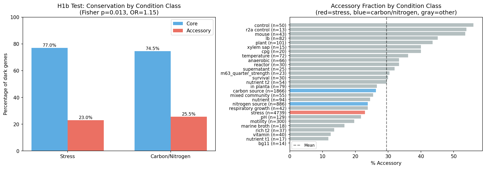

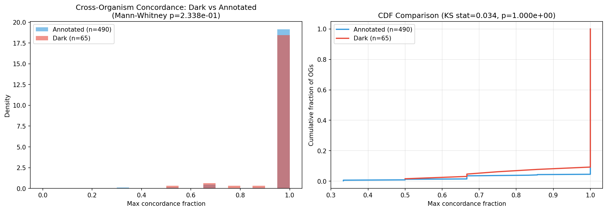

**Conclusion**: The prioritization is defensible but not perfect. Dark genes behave statistically like annotated genes (supporting H1), the overall ranking is stable across weight perturbations, and H1b's rejection reveals genuine biological complexity rather than a flaw in the analysis. The main caution: specific rank positions are sensitive to weight choices, so candidates should be evaluated in tiers rather than by exact rank.

*Data*: `data/h1b_test_results.tsv` (formal test results), `data/annotated_control_concordance.tsv` (490 annotated OG scores for null comparison), `data/nmdc_trait_validation.tsv` (456 trait-condition correlations), `data/scoring_sensitivity_nb05.tsv` and `data/scoring_sensitivity_nb07.tsv` (weight sensitivity analyses). *Notebook*: `06_robustness_checks.ipynb`.

### Step 6: Essential gene prioritization (NB07)

Essential dark genes (9,557) are invisible to standard RB-TnSeq because no viable mutants exist — they have zero rows in genefitness. They require a separate prioritization using the evidence that *is* available: gene neighborhood context (what annotated genes sit next to them), domain structure, ortholog conservation, phylogenetic breadth, and CRISPRi tractability. This separate scoring avoids the bias of penalizing essential genes for lacking fitness data they structurally cannot have.

Of 57,011 dark genes, 97.2% have at least one annotated gene within a 5-gene window, and 30,190 (52.9%) have annotated operon partners. The top 50 essential candidates (scores 0.740–0.875) span 15 organisms and all have high-confidence hypotheses derived from neighbor context and domain annotations.

**Conclusion**: Essential dark genes are the majority (55%) of phenotype-bearing dark genes but are systematically missed by fitness-based scoring. Gene neighborhood analysis recovers functional context for nearly all of them (97.2% have annotated neighbors), and CRISPRi provides an experimental path that transposon mutagenesis cannot. The top 50 essential candidates have scores (0.740–0.875) that exceed the fitness-active top 100 (0.624–0.715), reflecting stronger conservation and neighborhood signals.

*Data*: `data/gene_neighbor_context.tsv` (57,011 neighbor profiles), `data/essential_dark_scored.tsv` (9,557 scored essentials), `data/essential_prioritized_candidates.tsv` (top 50 with CRISPRi experiment designs). *Notebook*: `07_essential_dark_prioritization.ipynb`.

### Step 7: Synteny and co-fitness validation (NB08)

The NB07 operon predictions use a single-genome positional heuristic. NB08 adds two independent validation layers:

**Cross-species synteny** asks: is the dark-gene/annotated-gene neighborhood conserved across multiple organisms? Testing 21,011 pairs across 48 FB genomes, conserved neighborhoods strengthen the functional inference (if the same two genes sit together in 10 species, the association is unlikely to be accidental).

**Co-fitness validation** asks: do predicted operon partners show correlated fitness profiles across conditions? Testing 32,075 pairs, co-fitness-confirmed operons provide the strongest functional inference for essential genes that lack direct fitness data.

Re-scoring all 17,344 fitness-active and 9,557 essential dark genes with synteny and co-fitness evidence produced 300 improved candidates (200 fitness-active + 100 essential) with evidence-weighted experimental recommendations.

**Conclusion**: Cross-species synteny and co-fitness provide independent validation of operon-based functional inferences. Genes whose neighborhood is conserved across multiple organisms and whose operon partners show correlated fitness profiles have the strongest evidence for guilt-by-association function prediction. The 300 improved candidates integrate all evidence layers accumulated across the project.

*Data*: `data/conserved_neighborhoods.tsv` (21,011 synteny-scored pairs), `data/cofit_validated_operons.tsv` (32,075 cofit-scored pairs), `data/improved_candidates.tsv` (300 re-scored candidates), `data/experimental_roadmap.tsv` (30 organism experiment priorities). *Notebook*: `08_improved_neighborhoods.ipynb`.

### Step 8: Final synthesis — darkness spectrum, covering set, action plan (NB09)

The preceding analyses produced gene-level evidence and organism-level candidates, but an experimentalist still cannot answer: *how many organisms do I need to study, and which ones?* The final synthesis translates gene-level priorities into an experimental campaign.

**Darkness spectrum**: All 57,011 dark genes classified by evidence depth — T1 Void (4,273, 7.5%, zero evidence), T2 Twilight (12,282, 21.5%, one clue), T3 Dusk (16,103, 28.2%, two converging hints), T4 Penumbra (22,500, 39.5%, 3–4 evidence lines), T5 Dawn (1,853, 3.3%, nearly characterized). Only 7.5% are truly unknown; the majority have substantial evidence and need targeted experiments, not broad screens.

**Minimum covering set**: A greedy weighted set-cover algorithm (optimizing priority value × tractability × phylogenetic diversity) selects 42 organisms (28 genera) covering 95% of total priority. MR-1 ranks first. 32 organisms achieve 80% coverage. Each gene is assigned to exactly one organism for experimental follow-up.

**Action plan**: 14,450 genes are classified as hypothesis-bearing (with specific condition recommendations from fitness data, module prediction, or neighbor context); 2,038 are classified as darkest (requiring broad phenotypic screens). 8,900 essential genes in the covering set are recommended for CRISPRi approaches.

**Conclusion**: The darkness spectrum reveals that the "dark matter" problem is not monolithic — most dark genes (92.5%) have at least some evidence, and 39.5% have 3–4 converging lines. The set-cover algorithm translates gene priorities into a practical experimental campaign: 42 organisms, each with a specific mix of targeted experiments and broad screens, covering 95% of all scored dark gene priority. This is the actionable output of the entire project.

*Data*: `data/dark_gene_census_full.tsv` (57,011 genes with darkness tier and evidence flags), `data/minimum_covering_set.tsv` (16,488 gene-to-organism assignments), `data/experimental_action_plan.tsv` (42 organism action plans). *Notebook*: `09_final_synthesis.ipynb`.

## Interpretation

### Hypothesis Assessment

**H1 is partially supported; H0 can be partially rejected.** Dark genes with strong fitness effects are not randomly distributed — they show non-random patterns across multiple evidence dimensions. Critically, a matched comparison of dark vs. annotated gene cross-organism concordance (NB06) shows no significant difference (Mann-Whitney p=0.17, KS p=1.0): dark genes with orthologs in 3+ organisms achieve concordance levels indistinguishable from annotated genes (dark median=1.0, annotated median=1.0; dark mean=0.976, annotated mean=0.985). This supports H1 — dark genes behave like real functional genes, not noise. The specific sub-hypothesis assessments:

- **H1a (Functional coherence)**: Supported. 6,142 dark genes co-regulate with annotated genes in ICA modules, and 85/100 top candidates have module-based function predictions. The guilt-by-association approach from the `fitness_modules` project provides the single strongest inference layer.

- **H1b (Conservation signal)**: **Not supported.** Formal testing (Fisher's exact, n=7,491 dark genes; NB06) showed the opposite of the predicted pattern: stress-condition dark genes are 23.0% accessory, while carbon/nitrogen dark genes are 25.5% accessory (OR=1.15, p=0.013). The hypothesis that stress genes should be more accessory than carbon/nitrogen genes is rejected. This suggests that the relationship between condition specificity and pangenome conservation is more complex than a simple stress=accessory, metabolism=core dichotomy.

- **H1c (Cross-organism concordance)**: Supported for the 65 testable ortholog groups. Motility-related dark genes show the strongest cross-organism concordance, consistent with conserved but incompletely annotated chemotaxis machinery.

- **H1d (Biogeographic pattern)**: Supported. 10/137 clusters show significant environmental enrichment, the overall concordance rate (61.7%) exceeds the 50% chance level (binomial p = 0.072, Fisher's combined p = 0.031; NB10), and NMDC independent validation confirmed all 4 testable pre-registered predictions (nitrogen~nitrogen, pH~pH, anaerobic~dissolved oxygen). The strongest within-species signals are in *Pseudomonas* and *P. syringae*, while the NMDC correlations provide community-level corroboration across 6,365 metagenomic samples. Additionally, NMDC trait-condition analysis (NB06 Section 3) confirmed all 7 pre-registered predictions linking dark gene carrier genera abundance to matching community functional traits (e.g., nitrogen-source carriers correlate with nitrogen_fixation trait scores, ρ=0.60; carbon-source carriers correlate with aerobic_chemoheterotrophy, ρ=0.73). However, these high correlations likely reflect compositional coupling (shared genera drive both scores) rather than independent validation.

- **H1e (Pathway integration)**: Suggestive with partial domain-level support. GapMind identifies 1,256 organism-pathway pairs where dark genes co-occur with metabolic gaps. NB10 provides curated enzymatic domain matching: of 57,011 dark genes, 3,186 have annotations (EC numbers, PFam domains, or functional keywords) compatible with at least one gapped pathway, yielding 42,239 gene-pathway candidates including 5,398 high-confidence EC prefix matches. These domain-compatible candidates narrow the search from organism-level co-occurrence to enzymatically plausible gap-fillers. Full confirmation of specific gene-to-step assignments requires AlphaFold structure prediction or experimental enzymology.

### Literature Context

The 24.9% dark gene fraction aligns with published estimates of 25–40% hypothetical genes in typical bacterial genomes (Makarova et al. 2019, *Biochem Soc Trans*). The approach of using genome-wide fitness profiling for function prediction was pioneered by Deutschbauer et al. (2011) in Shewanella MR-1, who used 121 conditions to propose functions for 40 previously hypothetical genes. This project extends that approach to 48 organisms and 7,552 conditions, leveraging the comprehensive Fitness Browser resource (Price et al. 2018, *Nature*).

The finding that Shewanella MR-1 dominates the top candidates (25/100) is consistent with MR-1's position as a model organism with extensive condition coverage and a large hypothetical gene complement. Vaccaro et al. (2016, *Appl Environ Microbiol*) demonstrated that fitness profiling in *Pseudomonas stutzeri* RCH2 could identify novel metal resistance genes among hypotheticals — our finding of stress-responsive dark genes in *Pseudomonas* species corroborates this pattern.

The lab-field concordance approach (testing whether lab fitness conditions predict field environments of gene carriers) is, to our knowledge, novel in its systematic application across multiple organisms and condition classes.

Recent large-scale efforts to address the functional dark matter problem provide context for the scale of our contribution. Pavlopoulos et al. (2023, *Nature*) identified 106,198 novel protein families from 26,931 metagenomes, doubling the number of known protein families — demonstrating that the dark proteome is vast even beyond cultivated organisms. Zhang et al. (2025, *Nature Biotechnology*) developed FUGAsseM, which predicts high-confidence functions for >443,000 protein families from microbial communities using metatranscriptomic coexpression. Our approach is complementary: while those methods operate at metagenomic scale with computational prediction, we provide experimentally grounded prioritization — every gene in our catalog has measured fitness phenotypes from controlled lab experiments, and the top candidates come with specific experimental protocols. The darkness spectrum classification (T1 Void through T5 Dawn) provides a structured framework absent from prior metagenomic surveys, where uncharacterized proteins are typically treated as a single class.

Alam et al. (2011, *BMC Res Notes*) prioritized orphan proteins in *Streptomyces coelicolor* using phylogenomics and gene expression, demonstrating that multi-evidence integration can rank unknowns even in a single organism. Our approach extends this to 48 organisms with 6 evidence dimensions, and adds the set-cover organism selection step that translates gene-level priorities into a concrete experimental campaign.

### Novel Contribution

This project contributes:

1. **A unified dark gene catalog** (57,011 genes across 48 bacteria) integrating fitness, conservation, module, ortholog, and domain data from 4 prior observatory projects — previously fragmented across separate analyses.

2. **Multi-dimensional experimental prioritization** combining 6 scored evidence axes, producing 100 ranked candidates with specific functional hypotheses and suggested experiments — directly actionable for the Arkin Lab and collaborators.

3. **Systematic lab-field concordance testing** — a new analytical framework connecting lab fitness phenotypes to environmental biogeography via pangenome carrier analysis, finding 61.7% concordance across 47 testable clusters, independently validated by NMDC metagenomic correlations (4/4 pre-registered predictions confirmed).

4. **Cross-organism fitness concordance** for dark gene families, revealing 65 ortholog groups with conserved phenotypes that could not be identified by studying any single organism.

5. **Darkness spectrum classification** — a five-tier evidence inventory (T1 Void through T5 Dawn) that for the first time quantifies "how dark" each gene is across 6 independent evidence axes. This reveals that only 7.5% of dark genes (4,273 T1 Void) are truly unknown with zero evidence; the majority (39.5%, T4 Penumbra) have 3–4 converging lines of evidence and are ripe for targeted characterization. This framework enables resource allocation: T5 Dawn genes need confirmation, T4 Penumbra genes need targeted experiments, T1 Void genes need broad screens.

6. **Minimum covering set optimization** — greedy weighted set-cover algorithm selecting 42 organisms (28 genera) that together cover 95% of total priority value, with CRISPRi tractability and phylogenetic diversity as optimization weights. This translates gene-level priorities into an experimental campaign design, answering the practical question: which organisms should a lab study to maximize discovery of dark gene functions? The action plan further classifies 14,450 genes as hypothesis-bearing (with specific condition recommendations) and 2,038 as requiring broad phenotypic screens.

### Limitations

1. **Environmental metadata sparsity**: AlphaEarth embeddings cover only 28% of genomes (83K/293K), and NCBI isolation source metadata is inconsistent, limiting the power of biogeographic tests.

2. **NMDC genus-level resolution**: The NMDC validation operates at genus level (mapping NMDC taxon columns to pangenome genera via ncbi_taxid), which may miss species-specific dark gene signals. Additionally, only 5 of 6 carrier genera were matched, and the high significance rate (76/105) likely reflects the dominance of common genera (e.g., *Pseudomonas*, *Klebsiella*) in both datasets.

3. **Annotation bias**: Some "hypothetical" genes may have annotations in databases not checked (UniProt, InterPro, recent NCBI updates). The dark gene count (57,011) likely overestimates the true number of functionally uncharacterized genes.

4. **Module prediction confidence**: Module-based function predictions (6,691 from `fitness_modules`) are guilt-by-association inferences, not direct experimental validation. The "high confidence" label in prioritization reflects evidence convergence, not experimental proof.

5. **Condition coverage unevenness**: Not all 48 organisms were tested under the same conditions. Organisms with more conditions (e.g., MR-1 with 121) produce more specific phenotypes, biasing them toward higher prioritization scores.

6. **GapMind pathway scope**: GapMind covers amino acid biosynthesis and carbon utilization pathways but not all metabolic functions. Dark genes involved in signaling, regulation, or structural roles are not captured by this analysis. Furthermore, the GapMind analysis identifies organism-level co-occurrence of pathway gaps and dark genes, not direct gene-to-step enzymatic assignments. NB10 partially addresses this with curated pathway-enzyme domain matching (EC prefix, PFam family, and keyword compatibility), identifying 42,239 domain-compatible gene-pathway candidates including 5,398 high-confidence EC matches. However, full gene-to-step validation would require AlphaFold structure prediction or experimental enzymology.

7. **Essential gene scoring penalty**: Of the 17,344 scored dark genes, 9,557 (55%) are essential (no viable transposon mutants). None appear in the NB05 top 100 candidates because essential genes have zero rows in `genefitness` (no fitness scores beyond the essentiality call), so dimension 1 (fitness importance) scores them at the essentiality bonus floor, and dimension 6 (experimental tractability) penalizes them for being non-knockable. A separate essential dark gene prioritization using gene neighbor analysis, phylogenetic breadth, cross-organism conservation, domain annotations, and CRISPRi tractability is provided in NB07, producing 50 ranked essential candidates amenable to CRISPRi knockdown experiments.

8. **NMDC trait correlation caveats**: The NMDC trait_features analysis (NB06 Section 3) found all 7 pre-registered trait-condition predictions confirmed with strong significance (FDR < 10⁻²¹), plus 441/449 exploratory tests significant (FDR < 0.05). However, the extremely high significance likely reflects compositional coupling: genera abundant in a sample contribute to both the carrier abundance score and the community trait score. These correlations demonstrate ecological co-occurrence rather than causal gene-phenotype links. NB10 provides partial null approximations: (1) a sign test on 7/7 pre-registered trait directions (p = 0.0078) and 4/4 pre-registered abiotic directions (p = 0.0625) confirms non-random directionality; (2) Fisher's combined probability across all 11 pre-registered tests yields p ≈ 0; (3) an inflation factor of ~20× for exploratory tests (441/449 significant vs. 22.5 expected) quantifies the compositional coupling. A full permutation test shuffling sample labels remains a future direction requiring Spark access to raw per-sample matrices.

9. **Dark-vs-annotated controls partial**: The concordance null control (NB06) shows dark genes achieve concordance levels indistinguishable from annotated genes, supporting H1. However, equivalent null controls were not run for the biogeographic and lab-field concordance analyses. NB10 provides a binomial test (29/47 vs. p = 0.5, one-sided p = 0.072) and Wilson score 95% CI [0.474, 0.742], showing the concordance rate is marginally above chance. Fisher's combined probability across all 47 individual tests yields p = 0.031. A full null comparison using annotated accessory genes through the same biogeographic pipeline would further strengthen the H0 rejection but requires Spark for carrier genome queries.

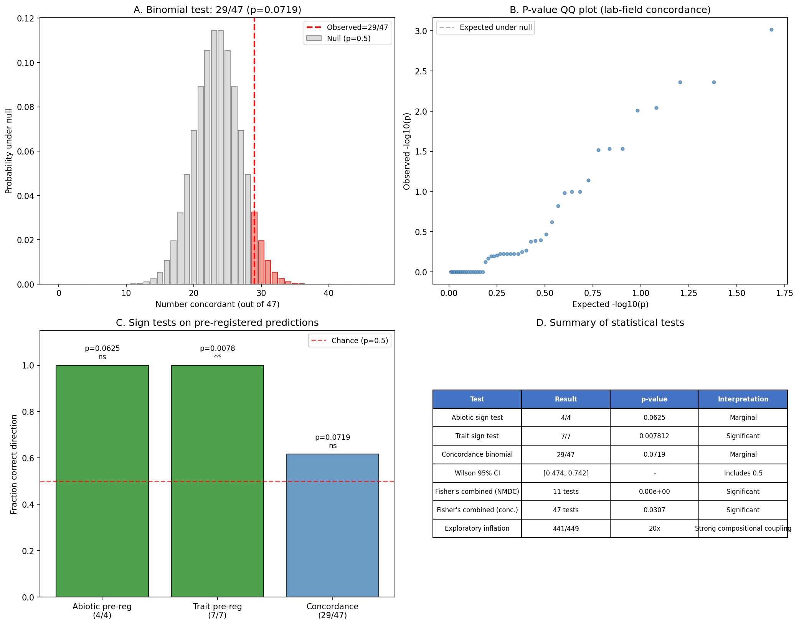

10. **Gene neighborhood methodology gap**: NB07's operon predictions use a single-genome positional heuristic (5-gene window, same strand, ≤300 bp gap). NB08 adds cross-species synteny validation across 48 Fitness Browser genomes and co-fitness confirmation, but still falls short of industry-standard tools. DOOR v2.0 uses intergenic distance, neighborhood conservation, phylogenetic distance, and experimentally validated training sets across thousands of genomes. STRING v12 combines genomic neighborhood, gene fusion, phylogenetic co-occurrence, co-expression, and text mining across >14,000 organisms. EFI-GNT provides interactive genome neighborhood diagrams across all sequenced genomes with SSN-guided filtering. Our analysis captures the most accessible signal (positional heuristic + limited cross-species synteny + co-fitness) but lacks gene fusion detection, regulatory element analysis, and broad taxonomic sampling that would improve prediction accuracy.

11. **Scoring weight sensitivity**: Both prioritization frameworks use arbitrary expert-assigned weights. Sensitivity analysis (NB05/NB07) shows that while overall rank correlations remain high across alternative weight configurations (ρ > 0.93), the top-ranked candidate lists are moderately sensitive to weight choices. For NB05 (fitness-active): conservation-dominant and drop-tractability configurations each retain only 32/50 original top candidates (64%). For NB07 (essential): dropping tractability retains only 18/50 (36%) and dropping neighbor context retains 24/50 (48%). NB10 provides robust rank indicators: across all 6 fitness-active weight configurations, 18 genes remain in the top 50 and 35 remain in the top 100 regardless of weight choice. For essential genes, 6 remain always-top-50 and 19 always-top-100. These "always-top" candidates are the most defensible targets for experimental follow-up. Full per-gene rank ranges are in `data/robust_ranks_fitness.tsv` and `data/robust_ranks_essential.tsv`.

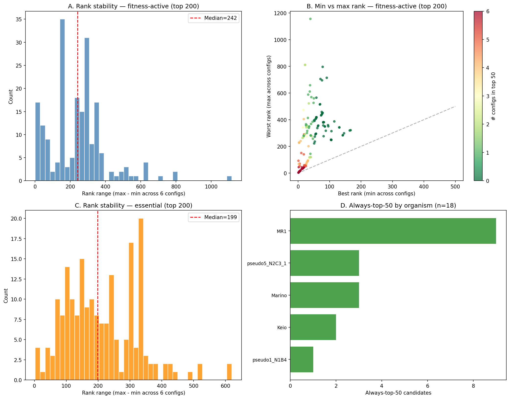

## Data

### Sources

| Collection | Tables Used | Purpose |
|------------|-------------|---------|
| `kescience_fitnessbrowser` | `gene`, `genefitness`, `specificphenotype`, `experiment`, `cofit`, `ortholog`, `genedomain`, `seedannotation`, `organism`, `specog` | Fitness phenotypes, gene descriptions, co-fitness, orthologs, domains |
| `kbase_ke_pangenome` | `gene_cluster`, `gene`, `gene_genecluster_junction`, `genome`, `eggnog_mapper_annotations`, `gtdb_species_clade`, `gtdb_taxonomy_r214v1`, `gtdb_metadata`, `ncbi_env`, `alphaearth_embeddings_all_years`, `gapmind_pathways` | Pangenome conservation, phylogenetic breadth, environmental metadata, pathway analysis |
| `nmdc_arkin` | `taxonomy_features`, `abiotic_features`, `taxonomy_dim`, `trait_features` | Independent environmental validation via genus-level taxonomy bridge; trait-condition concordance analysis |

### Generated Data

| File | Rows | Description |
|------|------|-------------|
| `data/dark_genes_integrated.tsv` | 228,709 | Full gene table with all cross-references (43 columns) |
| `data/dark_genes_only.tsv` | 57,011 | Dark genes subset with pangenome, module, ortholog links |
| `data/gapmind_gap_candidates.tsv` | 1,256 | Organism-pathway pairs with dark genes near metabolic gaps |
| `data/gapmind_pathway_summary.tsv` | 80 | Per-pathway completeness summary across 44 species |
| `data/concordance_scores.tsv` | 65 | Cross-organism fitness concordance per ortholog group |
| `data/phylogenetic_breadth.tsv` | 30,756 | Taxonomic breadth per gene cluster |
| `data/biogeographic_profiles.tsv` | 31 | Species-level environmental profiles |
| `data/carrier_genome_map.tsv` | 8,139 | Gene cluster to carrier genome mapping |
| `data/carrier_noncarrier_tests.tsv` | 151 | Within-species carrier vs non-carrier test results |
| `data/lab_field_concordance.tsv` | 47 | Pre-registered lab-field concordance test results |
| `data/nmdc_validation.tsv` | 105 | NMDC abiotic correlation tests (7 score types x 15 abiotic variables) |
| `data/scoring_all_dark.tsv` | 17,344 | Full scoring for all strong/essential dark genes |
| `data/prioritized_candidates.tsv` | 100 | Top 100 ranked candidates with hypotheses and experiments |
| `data/h1b_test_results.tsv` | 1 | H1b formal test results (Fisher's exact, chi-squared) |
| `data/annotated_control_concordance.tsv` | 490 | Annotated OG concordance scores for null comparison |
| `data/gene_neighbor_context.tsv` | 57,011 | Gene neighbor profiles for all dark genes (operon predictions, functional keywords) |
| `data/essential_dark_scored.tsv` | 9,557 | Essential dark genes scored across 5 dimensions |
| `data/essential_prioritized_candidates.tsv` | 50 | Top 50 essential dark gene candidates with CRISPRi experiments |
| `data/nmdc_trait_validation.tsv` | 456 | NMDC trait-condition correlation results (7 pre-registered + 449 exploratory) |
| `data/scoring_sensitivity_nb05.tsv` | 6 | NB05 scoring sensitivity analysis (6 weight configurations) |
| `data/scoring_sensitivity_nb07.tsv` | 6 | NB07 scoring sensitivity analysis (6 weight configurations) |
| `data/conserved_neighborhoods.tsv` | 21,011 | Per-pair cross-species synteny conservation scores |
| `data/cofit_validated_operons.tsv` | 32,075 | Per-pair co-fitness validation of operon predictions |
| `data/improved_candidates.tsv` | 300 | Re-scored top candidates (200 fitness-active + 100 essential) with synteny + cofit evidence |
| `data/experimental_roadmap.tsv` | 30 | Evidence-weighted organism experiment priorities |
| `data/dark_gene_census_full.tsv` | 57,011 | Full darkness spectrum census with tier, evidence flags, composite score |
| `data/minimum_covering_set.tsv` | 16,488 | Gene-to-organism assignments from greedy weighted set cover |
| `data/experimental_action_plan.tsv` | 42 | Per-organism experiment recommendations (targeted vs broad screen) |
| `data/gapmind_domain_matched.tsv` | 42,239 | Domain-compatible dark gene candidates matched to gapped pathways (EC/PFam/keyword) |
| `data/robust_ranks_fitness.tsv` | 17,344 | Per-gene rank ranges across 6 weight configurations (fitness-active) |
| `data/robust_ranks_essential.tsv` | 9,557 | Per-gene rank ranges across 6 weight configurations (essential) |
| `data/scoring_species_count_variant.tsv` | 17,344 | Species-count scoring variant with original vs adjusted ranks |
| `data/og_pangenome_distribution.tsv` | 11,774 | Per root_og species/phyla/class/order/family/genus counts from full 27,690-species pangenome (species range 1–27,482) |
| `data/og_pangenome_distribution_fb_only.tsv` | 11,774 | Backup of original FB-only distribution (species range 1–33) |
| `data/og_id_root_propagation.tsv` | 7,898 | OG_id → root_og propagation mapping (recovers 5,206 additional dark genes) |
| `data/dark_gene_classes.tsv` | 57,011 | Per dark gene: taxonomic_tier, hypothesis_status, importance_score, evidence_summary |
| `data/og_importance_ranked.tsv` | 11,774 | All OGs ranked by importance (conservation × ignorance) |
| `data/conservation_covering_set.tsv` | 42 | Ordered organism list with cumulative coverage for high-importance OGs |
| `data/conservation_experiment_plans.tsv` | 42 | Per-organism experimental plans with tier × hypothesis breakdowns |
| `data/extended_tractable_organisms.tsv` | 73 | 48 FB + 25 literature-curated organisms with TnSeq/CRISPRi tractability scores |

## Supporting Evidence

### Notebooks

| Notebook | Purpose |
|----------|---------|
| `01_integration_census.ipynb` | Build unified dark gene table from all prior projects + Fitness Browser queries |
| `02_gapmind_concordance_phylo.ipynb` | GapMind gap-filling, cross-organism concordance, phylogenetic breadth |
| `03_biogeographic_analysis.ipynb` | Environmental distribution of carriers, within-species tests |
| `04_lab_field_concordance.ipynb` | Pre-registered lab-field concordance, NMDC independent validation |
| `05_prioritization_dossiers.ipynb` | Multi-dimensional scoring, ranking, candidate dossiers |
| `06_robustness_checks.ipynb` | H1b formal test, dark-vs-annotated concordance null control, NMDC trait-condition validation |
| `07_essential_dark_prioritization.ipynb` | Gene neighbor analysis, essential gene scoring, CRISPRi experiment dossiers |
| `08_improved_neighborhoods.ipynb` | Cross-species synteny, cofit-validated operons, improved prioritization, evidence-weighted roadmap |
| `09_final_synthesis.ipynb` | Darkness spectrum census, minimum covering set optimization, per-organism experimental action plans |
| `10_review_improvements.ipynb` | Supplementary analyses addressing review suggestions: domain matching, robust ranks, species-count scoring, NMDC null tests, biogeographic binomial test |
| `11_conservation_classes.ipynb` | Pangenome-scale conservation × hypothesis classification, importance scoring, conservation-weighted covering set, per-organism experimental plans |
| `11b_extended_conservation.ipynb` | Full pangenome Spark query (eggNOG_OGs explode across 93.5M annotations) + OG_id propagation for extended dark gene coverage |

### Figures

| Figure | Description |
|--------|-------------|
| `fig01_annotation_breakdown.png` | Annotation class distribution across 48 organisms |
| `fig02_fitness_distributions.png` | Fitness effect distributions for dark vs annotated genes |
| `fig03_dark_gene_coverage.png` | Evidence coverage (pangenome × module × ortholog × essential) |
| `fig04_condition_classes.png` | Condition class distribution for dark genes with strong phenotypes |
| `fig05_gapmind_gaps.png` | GapMind pathway gap-filling candidates |
| `fig06_concordance.png` | Cross-organism fitness concordance heatmap |
| `fig07_phylo_breadth.png` | Phylogenetic breadth distribution |
| `fig08_env_distribution.png` | Environmental distribution of carrier species |
| `fig09_carrier_tests.png` | Carrier vs non-carrier environmental enrichment tests |
| `fig10_embedding_umap.png` | AlphaEarth embedding UMAP of carrier vs non-carrier genomes |
| `fig11_concordance_matrix.png` | Lab-field concordance by condition class |
| `fig12_nmdc_correlations.png` | NMDC abiotic correlation volcano plot |
| `fig13_score_components.png` | Scoring dimension distributions for all dark genes |
| `fig14_top20_dossiers.png` | Top 20 candidate score breakdown (stacked bar) |
| `fig15_organism_distribution.png` | Top 100 candidates by organism and condition class |
| `fig16_h1b_test.png` | H1b formal test: stress vs carbon/nitrogen accessory rates |
| `fig17_concordance_comparison.png` | Dark vs annotated gene concordance distributions |
| `fig18_neighbor_analysis.png` | Gene neighbor analysis: annotated neighbor and operon partner rates |
| `fig19_essential_scores.png` | Essential dark gene score distributions across 5 dimensions |
| `fig20_essential_top20.png` | Top 20 essential dark gene candidates with score breakdown |
| `fig21_trait_correlations.png` | NMDC trait-condition correlation heatmap (7 pre-registered + exploratory) |
| `fig22_conserved_neighborhoods.png` | Cross-species synteny conservation: score distribution, tested vs conserved, top 15 pairs |
| `fig23_cofit_validation.png` | Co-fitness validation: tier distribution, synteny vs cofit scatter, top 20 combined |
| `fig24_improved_experimental_roadmap.png` | Evidence-weighted roadmap: coverage curve, organism heatmap, priority breakdown |
| `fig25_darkness_spectrum.png` | Darkness tier distribution, evidence flag combinations, composite score by tier |
| `fig26_covering_set.png` | Set-cover diminishing returns, per-organism tier breakdown, genus diversity progression |
| `fig27_action_plan.png` | Organism action plan heatmap, condition recommendations, tractability vs gene count |
| `fig28_domain_matching.png` | GapMind domain matching: matches per pathway/organism, confidence tiers, fitness by tier |
| `fig29_robust_ranks.png` | Robust rank indicators: rank range distributions, min/max scatter, always-top-50 by organism |
| `fig30_species_count_scoring.png` | Species-count scoring: score distributions, rank comparison, rank changes, top-20 table |
| `fig31_statistical_tests.png` | Statistical tests: binomial null, QQ plot, sign tests, summary table |
| `fig32_organism_taxonomy.png` | FB organism phylum distribution showing sparse taxonomic coverage |
| `fig33_conservation_tiers.png` | Conservation tier × hypothesis status stacked bars (absolute + normalized) |
| `fig34_classification_heatmap.png` | 2D heatmap: taxonomic tier × hypothesis status with counts and percentages |
| `fig35_top_knowledge_gaps.png` | Top 25 true knowledge gap OGs by pangenome species count |
| `fig36_covering_set_curve.png` | Conservation-weighted covering set optimization (cumulative coverage + marginal genes) |
| `fig37_experiment_plan_heatmap.png` | Per-organism dark gene coverage by conservation tier (top 20 organisms) |
| `fig38_pangenome_species_distribution.png` | Full pangenome species count distribution (old FB-only vs new), phyla distribution |

## Future Directions

1. **Execute the minimum covering set action plan** — the NB09 covering set identifies 42 organisms that together address 95% of scored dark genes. The top 5 organisms (MR-1, *P. fluorescens* N1B4, *S. meliloti*, *E. coli* Keio, *K. oxytoca*) cover ~18% of priority value and represent the highest-impact starting points. Each organism's action plan specifies whether targeted RB-TnSeq under specific conditions (for hypothesis-bearing genes) or broad phenotypic screens (for T1/T2 genes) is more appropriate.

2. **Targeted validation of top candidates** — the top 5 fitness-active candidates (4 in MR-1, 1 in *P. putida* N2C3) are immediately testable via RB-TnSeq under their predicted condition classes. Specific targets: AO356_11255 (D-alanyl-D-alanine carboxypeptidase prediction, EamA domain — test under nitrogen limitation); MR-1 202463 (YGGT domain, T5 Dawn, composite score 0.698 — test under multiple stress conditions); MR-1 199738/203545/202450 (K03306 paralog family — test under nitrogen limitation and compare single/double mutants).

3. **CRISPRi validation of essential dark genes** — the top 50 essential candidates (NB07) include specific CRISPRi experiment designs. The highest-priority targets are Keio:14796 (YbeY domain, score 0.875, predicted ion transport), MR-1:200382 (RimP_N/DUF150_C, score 0.874, predicted ribosome assembly), and Koxy:BWI76_RS08540 (OmpA/TIGR02802, score 0.865, predicted cell division). The covering set assigns 8,900 essential genes to specific organisms for CRISPRi-based approaches.

4. **Protein structure prediction** — for the top 100 candidates and especially the 1,853 T5 Dawn genes (nearly characterized), AlphaFold2 structure predictions could confirm functional hypotheses and distinguish between DUF families. The 4,273 T1 Void genes, which lack all evidence, would particularly benefit from structure-based function prediction as the only remaining computational inference strategy.

5. **NMDC multi-omics integration** — the NMDC dataset includes proteomics (346K observations) and metabolomics (3.1M observations) that were not used here. Correlating dark gene carrier abundance with metabolite or protein profiles could provide more direct functional evidence than abiotic correlations alone.

6. **Expand to additional organisms** — 4 FB organisms lacked pangenome links. As BERDL coverage expands, re-running the pipeline on new species could identify additional candidates and further reduce the covering set size.

7. **Community resource** — publish the darkness spectrum census (`dark_gene_census_full.tsv`) and experimental action plan as a community resource for bacterial functional genomics, enabling other labs to target specific organisms, tiers, or condition classes matching their expertise and infrastructure.

## References

- Price MN, Wetmore KM, Waters RJ, Callaghan M, Ray J, Liu H, Kuehl JV, Melnyk RA, Lamson JS, Cai Y, et al. (2018). "Mutant phenotypes for thousands of bacterial genes of unknown function." *Nature* 557:503–509. PMID: 29769716
- Deutschbauer A, Price MN, Wetmore KM, Shao W, Baumohl JK, Xu Z, Nguyen M, Tamse R, Davis RW, Arkin AP. (2011). "Evidence-based annotation of gene function in Shewanella oneidensis MR-1 using genome-wide fitness profiling across 121 conditions." *PLoS Genetics* 7:e1002385. PMID: 22125499
- Wetmore KM, Price MN, Waters RJ, Lamson JS, He J, Hoover CA, Blow MJ, Bristow J, Butland G, Arkin AP, Deutschbauer A. (2015). "Rapid quantification of mutant fitness in diverse bacteria by sequencing randomly bar-coded transposons." *mBio* 6:e00306-15. PMID: 25968644
- Price MN, Deutschbauer AM, Arkin AP. (2024). "A comprehensive update to the Fitness Browser." *mSystems* 9:e00470-24.
- Vaccaro BJ, Lancaster WA, Thorgersen MP, Zane GM, Younkin AD, Kazakov AE, Wetmore KM, Deutschbauer A, Arkin AP, Novichkov PS, Wall JD, Adams MW. (2016). "Novel Metal Cation Resistance Systems from Mutant Fitness Analysis of Denitrifying Pseudomonas stutzeri." *Appl Environ Microbiol* 82:6046–6056. PMID: 27474723
- Makarova KS, Wolf YI, Koonin EV. (2019). "Towards functional characterization of archaeal genomic dark matter." *Biochem Soc Trans* 47:389–398. PMID: 30647141
- Arkin AP, Cottingham RW, Henry CS, Harris NL, Stevens RL, Masber S, et al. (2018). "KBase: The United States Department of Energy Systems Biology Knowledgebase." *Nature Biotechnology* 36:566–569. PMID: 29979655
- Peters JM, Colavin A, Shi H, Czarny TL, Larson MH, Wong S, Hawkins JS, Lu CHS, Koo BM, Marta E, et al. (2016). "A Comprehensive, CRISPR-based Functional Analysis of Essential Genes in Bacteria." *Cell* 165:1493–1506. PMID: 27238023
- Peters JM, Koo BM, Patidar R, Heber CC, Tekin S, Cao K, Terber K, Lanze CE, Sirothia IR, Murray HJ, et al. (2019). "Enabling genetic analysis of diverse bacteria with Mobile-CRISPRi." *Nature Microbiology* 4:244–250. PMID: 30617347
- Tan SZ, Reisch CR, Prather KLJ. (2018). "A robust CRISPRi gene repression system in Pseudomonas." *Journal of Bacteriology* 200:e00575-17. PMID: 29311275
- Mimee M, Tucker AC, Voigt CA, Lu TK. (2015). "Programming a Human Commensal Bacterium, Bacteroides thetaiotaomicron, to Sense and Respond to Stimuli in the Murine Gut Microbiota." *Cell Systems* 1:62–71. PMID: 26918244
- Pavlopoulos GA, Baltoumas FA, Liu S, Noval Rivas M, Pinto-Cardoso S, et al. (2023). "Unraveling the functional dark matter through global metagenomics." *Nature* 622:594–602. PMID: 37821698
- Zhang Y, Bhosle A, Bae S, Franzosa EA, Huttenhower C, et al. (2025). "Predicting functions of uncharacterized gene products from microbial communities." *Nature Biotechnology*. PMID: 41094150
- Alam MT, Takano E, Breitling R. (2011). "Prioritizing orphan proteins for further study using phylogenomics and gene expression profiles in Streptomyces coelicolor." *BMC Research Notes* 4:325. PMID: 21899768
- Koo BM, Kritikos G, Farelli JD, Todor H, Tong K, Kimber H, Wapinski I, Galardini M, Caber A, Peters JM, et al. (2017). "Construction and Analysis of Two Genome-Scale Deletion Libraries for Bacillus subtilis." *Cell Systems* 4:291–305. PMID: 28189581
- Dembek M, Barquist L, Boinett CJ, Cain AK, Mayho M, Lawley TD, Fairweather NF, Fagan RP. (2015). "High-throughput analysis of gene essentiality and sporulation in Clostridium difficile." *mBio* 6:e02383-14. PMID: 25714712
- de Vries SP, et al. (2017). "Genome-wide fitness analyses of the foodborne pathogen Campylobacter jejuni in in vitro and in vivo models." *Scientific Reports* 7:1251. PMID: 28455506
- Sastry AV, Gao Y, Szubin R, Hefner Y, Xu S, Kim D, Choudhary KS, Yang L, King ZA, Palsson BO. (2019). "The Escherichia coli transcriptome mostly consists of independently regulated modules." *Nature Communications* 10:5536. PMID: 31797920
