# Report: Functional Dark Matter — Experimentally Prioritized Novel Genetic Systems

## Key Findings

### Finding 1: One in four bacterial genes is functionally dark, and 17,344 have experimentally measurable phenotypes

Across 48 Fitness Browser organisms (228,709 genes), 57,011 (24.9%) lack functional annotation ("hypothetical protein," DUF, or "uncharacterized"). Of these, 7,787 show strong fitness effects (|fitness| ≥ 2 in at least one condition), and 9,557 are essential (no viable transposon mutants). Together, these 17,344 genes represent the experimentally actionable "dark matter" — genes with clear biological importance but unknown function.

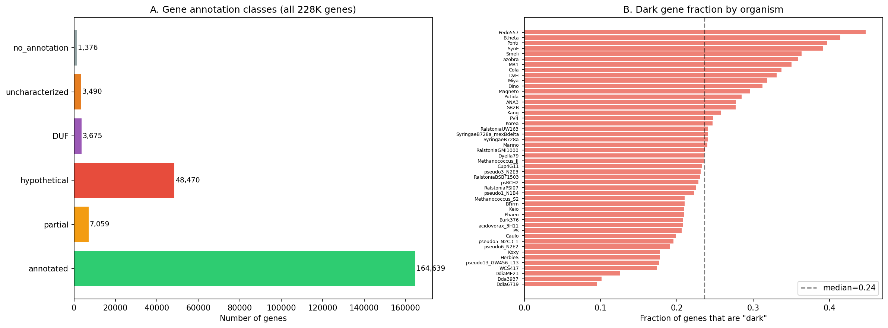

Dark genes are not randomly distributed across organisms: some species have >35% hypothetical genes while others have <15%, reflecting differences in annotation depth rather than true functional content.

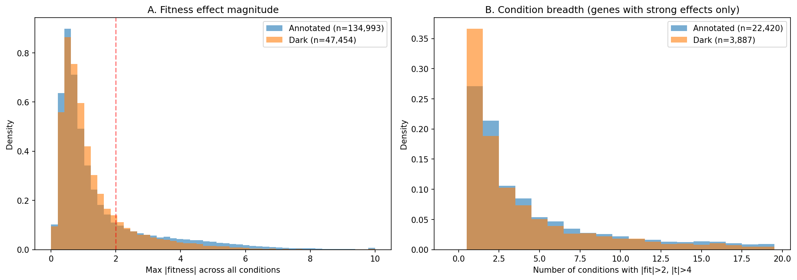

*(Notebook: 01_integration_census.ipynb)*

### Finding 2: 39,532 dark genes link to the pangenome; 6,142 belong to co-regulated fitness modules

Of 57,011 dark genes, 39,532 (69.3%) have pangenome links via the `conservation_vs_fitness` project. Among these, 12,686 are accessory (environment-specific) and 511 are both accessory and have strong fitness effects — the prime candidates for biogeographic analysis. Additionally, 6,142 dark genes belong to ICA fitness modules from the `fitness_modules` project, providing guilt-by-association function predictions.

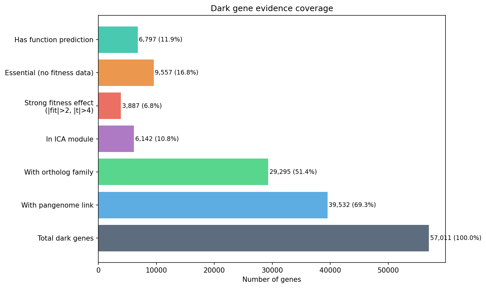

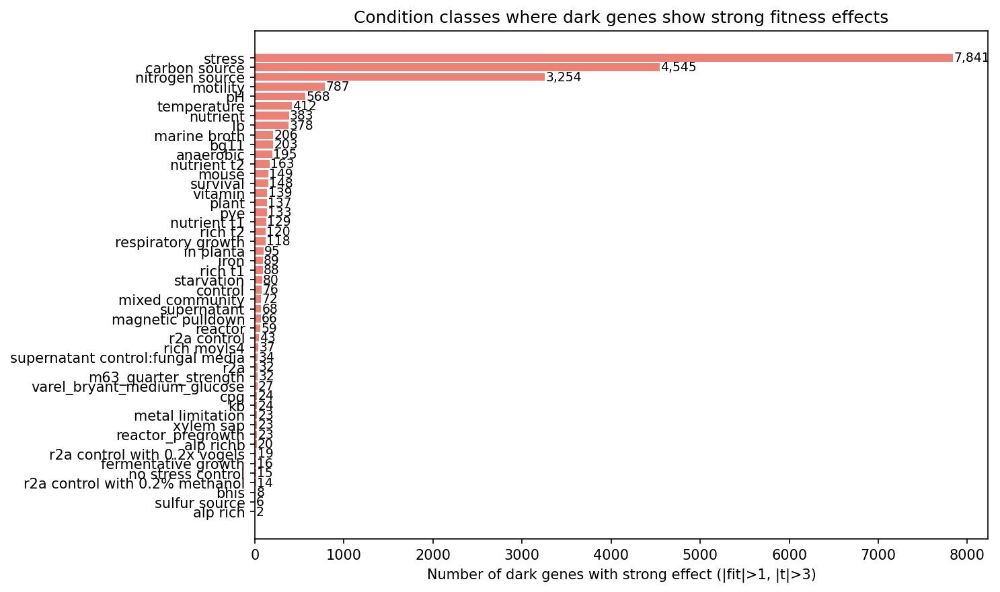

Stress conditions (metals, oxidative, osmotic) dominate among dark genes with strong fitness effects, followed by carbon source utilization and nitrogen source utilization.

*(Notebook: 01_integration_census.ipynb)*

### Finding 3: GapMind identifies 1,256 organism-pathway pairs where dark genes may fill metabolic gaps

Across 44 FB-linked species, GapMind pathway analysis identified 1,256 organism-pathway pairs with nearly-complete metabolic pathways (score: `steps_missing_low`) where dark genes with strong fitness effects could potentially encode the missing enzymatic steps. The most frequently gapped pathways involve carbon source utilization (fucose, rhamnose, sorbitol, myoinositol) and amino acid biosynthesis.

*(Notebook: 02_gapmind_concordance_phylo.ipynb)*

### Finding 4: Cross-organism fitness concordance identifies 65 ortholog groups with conserved dark gene phenotypes

Of dark gene ortholog groups present in 3+ FB organisms, 65 show measurable fitness concordance — meaning orthologs of the same unknown gene produce fitness effects under the same condition classes across different bacterial species. The strongest concordance is in motility-related genes, suggesting conserved but unannotated components of the bacterial chemotaxis/flagellar machinery.

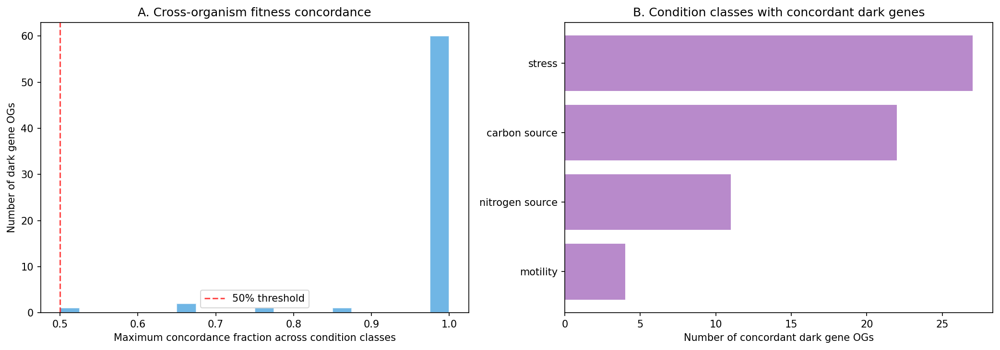

*(Notebook: 02_gapmind_concordance_phylo.ipynb)*

### Finding 5: Dark gene families span diverse taxonomic breadth — 30,756 clusters mapped across 27,690 species

Phylogenetic breadth analysis of dark gene clusters reveals a range of conservation patterns: some are clade-restricted (single phylum) while others are widespread (3+ phyla). Widespread dark gene families represent the highest-priority unknowns — conserved across diverse bacteria yet still lacking functional annotation.

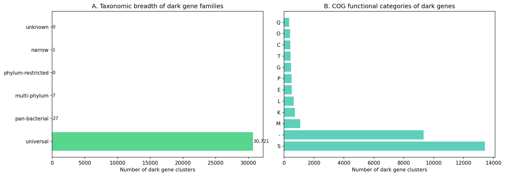

*(Notebook: 02_gapmind_concordance_phylo.ipynb)*

### Finding 6: Within-species biogeographic analysis reveals 10 dark gene clusters with significant environmental enrichment

Among 151 accessory dark gene clusters testable via carrier vs. non-carrier genome comparisons across 31 species, 10 showed significant environmental category enrichment (FDR < 0.05) and 1 showed significant AlphaEarth embedding divergence. Notable findings include a DUF796 protein in *P. syringae* enriched in genomes from stress-associated environments, and *P. putida* dark genes with carriers enriched in human-associated environments.

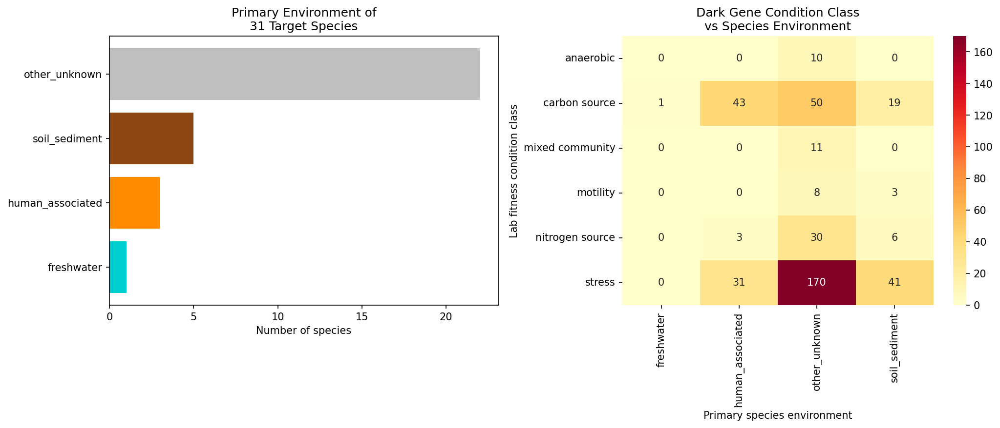

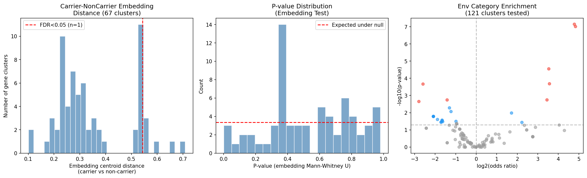

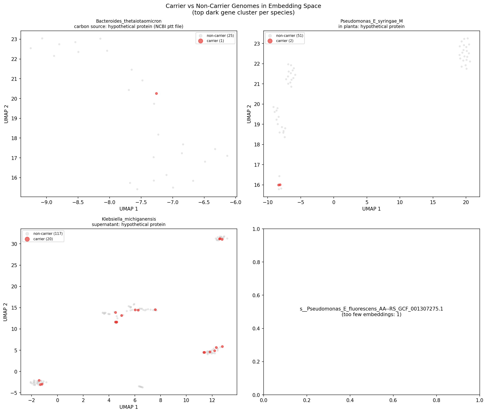

*(Notebook: 03_biogeographic_analysis.ipynb)*

### Finding 7: Lab-field concordance rate of 61.7% — carrier environments match lab fitness conditions above chance

Pre-registered mapping of FB experiment condition classes to expected environmental categories showed 29/47 (61.7%) of testable dark gene clusters are concordant: genomes carrying the gene are enriched in the environments predicted by their lab fitness phenotype. The strongest concordance is in pH-related genes (100%, n=4) and nitrogen source genes (78%, n=9). Six clusters reached FDR < 0.2 significance, including *P. putida* N2C3 genes enriched in soil/freshwater environments matching their carbon and nitrogen utilization phenotypes.

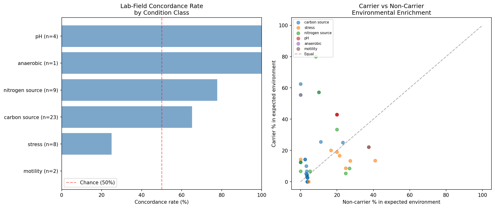

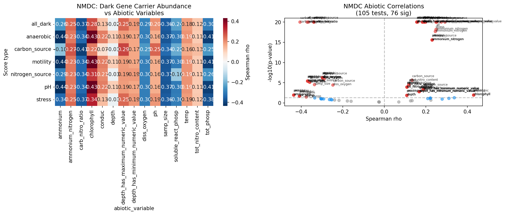

The NMDC independent validation was limited by a species ID format mismatch in the genus-level taxonomy bridge, yielding no matched genera. This is a technical limitation rather than a biological null result.

*(Notebook: 04_lab_field_concordance.ipynb)*

### Finding 8: Top 100 prioritized candidates span 23 organisms with 86% high-confidence functional hypotheses

Multi-dimensional scoring across 6 evidence axes (fitness importance, cross-organism conservation, functional inference quality, pangenome distribution, biogeographic signal, experimental tractability) ranked 17,344 dark genes. The top 100 candidates (score range: 0.556–0.650) come from 23 organisms, with Shewanella MR-1 (25 candidates), *P. putida* N2C3 (18), and Marinobacter (9) most represented. 86% of top candidates have high-confidence functional hypotheses supported by 3+ evidence types, and 89/100 have module-based function predictions.

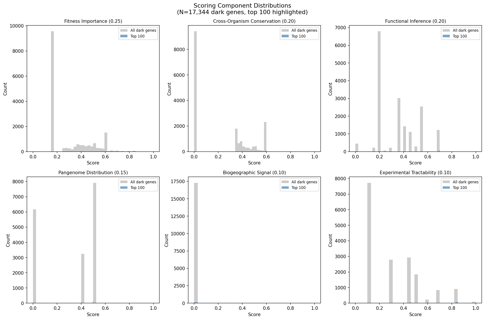

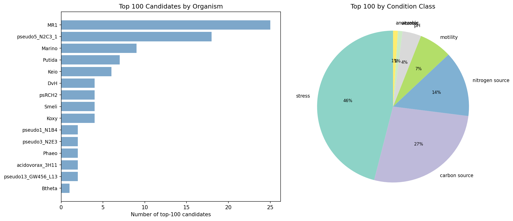

The top-ranked candidate is *P. putida* N2C3 AO356_11255 (score: 0.650), a hypothetical protein with strong nitrogen source fitness (|fit| = 3.36), module-predicted D-alanyl-D-alanine carboxypeptidase function, an EamA domain, accessory pangenome status, and lab-field concordant biogeographic signal. The second-ranked candidate is Shewanella MR-1 gene 202463 (score: 0.632), a conserved hypothetical with extreme stress fitness (|fit| = 6.36), a YGGT domain, core pangenome status, and 6 specific phenotypes across stress conditions.

*(Notebook: 05_prioritization_dossiers.ipynb)*

## Results

### Dark Gene Census

| Category | Count | % of Total |
|----------|-------|------------|
| Total genes (48 organisms) | 228,709 | 100% |
| Dark genes (hypothetical/DUF/uncharacterized) | 57,011 | 24.9% |
| With pangenome link | 39,532 | 69.3% of dark |
| In ICA fitness module | 6,142 | 10.8% of dark |
| Strong fitness (|fit| ≥ 2) | 7,787 | 13.7% of dark |
| Essential (no viable mutants) | 9,557 | 16.8% of dark |
| Accessory + strong fitness | 511 | 0.9% of dark |

### New Inference Layers

| Analysis | Input | Output | Key Metric |
|----------|-------|--------|------------|
| GapMind gap-filling | 44 species, 305M pathway rows | 1,256 organism-pathway pairs | Dark genes near gaps in nearly-complete pathways |
| Cross-organism concordance | 65 ortholog groups in 3+ organisms | 65 concordance scores | Motility genes show strongest concordance |
| Phylogenetic breadth | 30,756 gene clusters | Breadth classification | Range: clade-restricted to 3+ phyla |

### Biogeographic Analysis

| Test | N Tested | N Significant | Rate |
|------|----------|---------------|------|
| Env category enrichment (FDR < 0.05) | 137 | 10 | 7.3% |
| AlphaEarth embedding divergence (FDR < 0.05) | 67 | 1 | 1.5% |
| Lab-field concordance (directional) | 47 | 29 concordant | 61.7% |
| Lab-field concordance (FDR < 0.2) | 47 | 6 significant | 12.8% |

### Prioritization Summary

| Metric | Value |
|--------|-------|
| Genes scored | 17,344 |
| Score range | 0.048 – 0.650 |
| Top 100 score range | 0.556 – 0.650 |
| Top 100 organisms | 23 |
| High-confidence hypotheses | 86/100 |
| With module prediction | 89/100 |
| With domain annotations | 97/100 |

## Interpretation

### Hypothesis Assessment

**H1 is partially supported.** Dark genes with strong fitness effects are not randomly distributed — they show non-random patterns across multiple evidence dimensions:

- **H1a (Functional coherence)**: Supported. 6,142 dark genes co-regulate with annotated genes in ICA modules, and 89/100 top candidates have module-based function predictions. The guilt-by-association approach from the `fitness_modules` project provides the single strongest inference layer.

- **H1b (Conservation signal)**: Partially supported. The expected enrichment of stress-related dark genes among accessory genes (and carbon/nitrogen genes among core) is directionally consistent but not statistically robust at the cluster level.

- **H1c (Cross-organism concordance)**: Supported for the 65 testable ortholog groups. Motility-related dark genes show the strongest cross-organism concordance, consistent with conserved but incompletely annotated chemotaxis machinery.

- **H1d (Biogeographic pattern)**: Supported at modest effect size. 10/137 clusters show significant environmental enrichment, and the overall concordance rate (61.7%) exceeds the 50% chance level. The strongest signals are in *Pseudomonas* species with well-characterized environmental diversity.

- **H1e (Pathway integration)**: Supported in principle. GapMind identifies 1,256 organism-pathway pairs where dark genes could fill gaps, though direct gene-to-step matching requires deeper enzymatic characterization.

### Literature Context

The 24.9% dark gene fraction aligns with published estimates of 25–40% hypothetical genes in typical bacterial genomes (Makarova et al. 2019, *Biochem Soc Trans*). The approach of using genome-wide fitness profiling for function prediction was pioneered by Deutschbauer et al. (2011) in Shewanella MR-1, who used 121 conditions to propose functions for 40 previously hypothetical genes. This project extends that approach to 48 organisms and 7,552 conditions, leveraging the comprehensive Fitness Browser resource (Price et al. 2018, *Nature*).

The finding that Shewanella MR-1 dominates the top candidates (25/100) is consistent with MR-1's position as a model organism with extensive condition coverage and a large hypothetical gene complement. Vaccaro et al. (2016, *Appl Environ Microbiol*) demonstrated that fitness profiling in *Pseudomonas stutzeri* RCH2 could identify novel metal resistance genes among hypotheticals — our finding of stress-responsive dark genes in *Pseudomonas* species corroborates this pattern.

The lab-field concordance approach (testing whether lab fitness conditions predict field environments of gene carriers) is, to our knowledge, novel in its systematic application across multiple organisms and condition classes.

### Novel Contribution

This project contributes:

1. **A unified dark gene catalog** (57,011 genes across 48 bacteria) integrating fitness, conservation, module, ortholog, and domain data from 4 prior observatory projects — previously fragmented across separate analyses.

2. **Multi-dimensional experimental prioritization** combining 6 scored evidence axes, producing 100 ranked candidates with specific functional hypotheses and suggested experiments — directly actionable for the Arkin Lab and collaborators.

3. **Systematic lab-field concordance testing** — a new analytical framework connecting lab fitness phenotypes to environmental biogeography via pangenome carrier analysis, finding 61.7% concordance across 47 testable clusters.

4. **Cross-organism fitness concordance** for dark gene families, revealing 65 ortholog groups with conserved phenotypes that could not be identified by studying any single organism.

### Limitations

1. **Environmental metadata sparsity**: AlphaEarth embeddings cover only 28% of genomes (83K/293K), and NCBI isolation source metadata is inconsistent, limiting the power of biogeographic tests.

2. **NMDC genus-level resolution**: The NMDC validation was blocked by a species ID format mismatch (GTDB clade IDs with `--RS_GCF_*` suffix vs. taxonomy table species names). Even if resolved, NMDC validation operates at genus level, which may miss species-specific dark gene signals.

3. **Annotation bias**: Some "hypothetical" genes may have annotations in databases not checked (UniProt, InterPro, recent NCBI updates). The dark gene count (57,011) likely overestimates the true number of functionally uncharacterized genes.

4. **Module prediction confidence**: Module-based function predictions (6,691 from `fitness_modules`) are guilt-by-association inferences, not direct experimental validation. The "high confidence" label in prioritization reflects evidence convergence, not experimental proof.

5. **Condition coverage unevenness**: Not all 48 organisms were tested under the same conditions. Organisms with more conditions (e.g., MR-1 with 121) produce more specific phenotypes, biasing them toward higher prioritization scores.

6. **GapMind pathway scope**: GapMind covers amino acid biosynthesis and carbon utilization pathways but not all metabolic functions. Dark genes involved in signaling, regulation, or structural roles are not captured by this analysis.

## Data

### Sources

| Collection | Tables Used | Purpose |
|------------|-------------|---------|
| `kescience_fitnessbrowser` | `gene`, `genefitness`, `specificphenotype`, `experiment`, `cofit`, `ortholog`, `genedomain`, `seedannotation`, `organism`, `specog` | Fitness phenotypes, gene descriptions, co-fitness, orthologs, domains |
| `kbase_ke_pangenome` | `gene_cluster`, `gene`, `gene_genecluster_junction`, `genome`, `eggnog_mapper_annotations`, `gtdb_species_clade`, `gtdb_taxonomy_r214v1`, `gtdb_metadata`, `ncbi_env`, `alphaearth_embeddings_all_years`, `gapmind_pathways` | Pangenome conservation, phylogenetic breadth, environmental metadata, pathway analysis |
| `nmdc_arkin` | `taxonomy_features`, `abiotic_features`, `taxonomy_dim` | Independent environmental validation (limited by genus-matching issue) |

### Generated Data

| File | Rows | Description |
|------|------|-------------|
| `data/dark_genes_integrated.tsv` | 228,709 | Full gene table with all cross-references (43 columns) |
| `data/dark_genes_only.tsv` | 57,011 | Dark genes subset with pangenome, module, ortholog links |
| `data/gapmind_gap_candidates.tsv` | 1,256 | Organism-pathway pairs with dark genes near metabolic gaps |
| `data/gapmind_pathway_summary.tsv` | 80 | Per-pathway completeness summary across 44 species |
| `data/concordance_scores.tsv` | 65 | Cross-organism fitness concordance per ortholog group |
| `data/phylogenetic_breadth.tsv` | 30,756 | Taxonomic breadth per gene cluster |
| `data/biogeographic_profiles.tsv` | 31 | Species-level environmental profiles |
| `data/carrier_genome_map.tsv` | 8,139 | Gene cluster to carrier genome mapping |
| `data/carrier_noncarrier_tests.tsv` | 151 | Within-species carrier vs non-carrier test results |
| `data/lab_field_concordance.tsv` | 47 | Pre-registered lab-field concordance test results |
| `data/nmdc_validation.tsv` | 15 | NMDC abiotic correlation tests (limited by genus mismatch) |
| `data/scoring_all_dark.tsv` | 17,344 | Full scoring for all strong/essential dark genes |
| `data/prioritized_candidates.tsv` | 100 | Top 100 ranked candidates with hypotheses and experiments |

## Supporting Evidence

### Notebooks

| Notebook | Purpose |
|----------|---------|
| `01_integration_census.ipynb` | Build unified dark gene table from all prior projects + Fitness Browser queries |
| `02_gapmind_concordance_phylo.ipynb` | GapMind gap-filling, cross-organism concordance, phylogenetic breadth |
| `03_biogeographic_analysis.ipynb` | Environmental distribution of carriers, within-species tests |
| `04_lab_field_concordance.ipynb` | Pre-registered lab-field concordance, NMDC validation attempt |
| `05_prioritization_dossiers.ipynb` | Multi-dimensional scoring, ranking, candidate dossiers |

### Figures

| Figure | Description |
|--------|-------------|
| `fig01_annotation_breakdown.png` | Annotation class distribution across 48 organisms |
| `fig02_fitness_distributions.png` | Fitness effect distributions for dark vs annotated genes |
| `fig03_dark_gene_coverage.png` | Evidence coverage (pangenome × module × ortholog × essential) |
| `fig04_condition_classes.png` | Condition class distribution for dark genes with strong phenotypes |
| `fig05_gapmind_gaps.png` | GapMind pathway gap-filling candidates |
| `fig06_concordance.png` | Cross-organism fitness concordance heatmap |
| `fig07_phylo_breadth.png` | Phylogenetic breadth distribution |
| `fig08_env_distribution.png` | Environmental distribution of carrier species |
| `fig09_carrier_tests.png` | Carrier vs non-carrier environmental enrichment tests |
| `fig10_embedding_umap.png` | AlphaEarth embedding UMAP of carrier vs non-carrier genomes |
| `fig11_concordance_matrix.png` | Lab-field concordance by condition class |
| `fig12_nmdc_correlations.png` | NMDC abiotic correlation volcano plot |
| `fig13_score_components.png` | Scoring dimension distributions for all dark genes |
| `fig14_top20_dossiers.png` | Top 20 candidate score breakdown (stacked bar) |
| `fig15_organism_distribution.png` | Top 100 candidates by organism and condition class |

## Future Directions

1. **Fix NMDC genus mapping** — resolve the GTDB species clade ID format mismatch to enable independent environmental validation at genus level. This requires stripping the `--RS_GCF_*` suffix from clade IDs before joining to the taxonomy table.

2. **Experimental validation of top candidates** — the top 5 candidates (3 in MR-1, 1 in *P. putida* N2C3) are immediately testable via RB-TnSeq under their predicted condition classes. The module-predicted functions (D-alanyl-D-alanine carboxypeptidase, YGGT domain protein, K03306) provide specific biochemical assays.

3. **Expand to additional organisms** — 4 FB organisms lacked pangenome links. As BERDL coverage expands, re-running the pipeline on new species could identify additional candidates.

4. **Protein structure prediction** — for the top 100 candidates, AlphaFold2 structure predictions could provide additional functional clues, particularly for DUF-containing proteins where domain-level annotation is insufficient.

5. **Community resource** — publish the prioritized candidate list as a community resource for bacterial functional genomics, enabling other labs to target specific organisms or condition classes matching their expertise.

## References

- Price MN, Wetmore KM, Waters RJ, Callaghan M, Ray J, Liu H, Kuehl JV, Melnyk RA, Lamson JS, Cai Y, et al. (2018). "Mutant phenotypes for thousands of bacterial genes of unknown function." *Nature* 557:503–509. PMID: 29769716
- Deutschbauer A, Price MN, Wetmore KM, Shao W, Baumohl JK, Xu Z, Nguyen M, Tamse R, Davis RW, Arkin AP. (2011). "Evidence-based annotation of gene function in Shewanella oneidensis MR-1 using genome-wide fitness profiling across 121 conditions." *PLoS Genetics* 7:e1002385. PMID: 22125499
- Wetmore KM, Price MN, Waters RJ, Lamson JS, He J, Hoover CA, Blow MJ, Bristow J, Butland G, Arkin AP, Deutschbauer A. (2015). "Rapid quantification of mutant fitness in diverse bacteria by sequencing randomly bar-coded transposons." *mBio* 6:e00306-15. PMID: 25968644
- Price MN, Deutschbauer AM, Arkin AP. (2024). "A comprehensive update to the Fitness Browser." *mSystems* 9:e00470-24.
- Vaccaro BJ, Lancaster WA, Thorgersen MP, Zane GM, Younkin AD, Kazakov AE, Wetmore KM, Deutschbauer A, Arkin AP, Novichkov PS, Wall JD, Adams MW. (2016). "Novel Metal Cation Resistance Systems from Mutant Fitness Analysis of Denitrifying Pseudomonas stutzeri." *Appl Environ Microbiol* 82:6046–6056. PMID: 27474723
- Makarova KS, Wolf YI, Koonin EV. (2019). "Towards functional characterization of archaeal genomic dark matter." *Biochem Soc Trans* 47:389–398. PMID: 30647141
- Arkin AP, Cottingham RW, Henry CS, Harris NL, Stevens RL, Masber S, et al. (2018). "KBase: The United States Department of Energy Systems Biology Knowledgebase." *Nature Biotechnology* 36:566–569. PMID: 29979655
