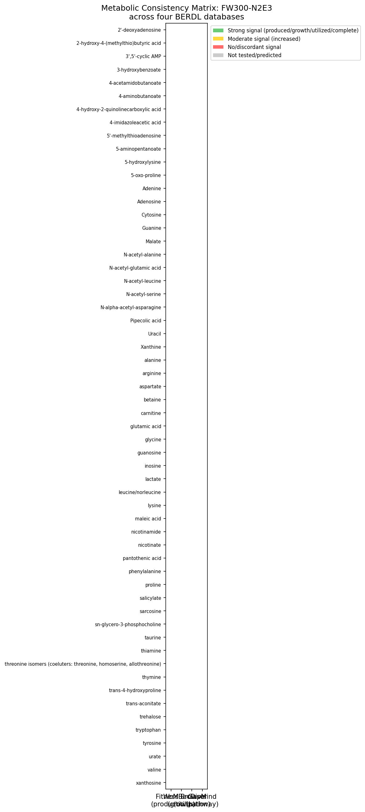
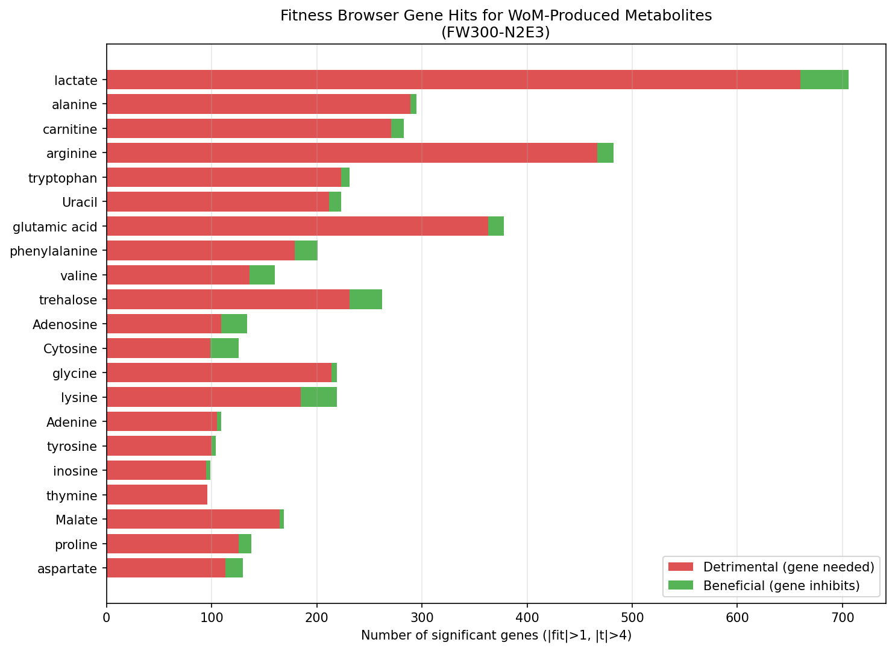

# Report: Metabolic Consistency of Pseudomonas FW300-N2E3 Across Four BERDL Databases

## Key Findings

### 1. High overall concordance across databases (94% mean concordance)

Of the 58 metabolites produced or increased by FW300-N2E3 (Web of Microbes), 21 could be cross-referenced against at least one other database. Among these testable metabolites, 17/21 (81%) were fully concordant across all matched databases, 4/21 (19%) were partially concordant, and none were fully discordant. The mean concordance score was 0.94. The remaining 37 metabolites (64%) were only observed in WoM — they were not tested in BacDive, not predicted by GapMind, and not used as a condition in FB experiments for this organism.

**Statistical decomposition**: The 94% concordance is largely structural — Fitness Browser (21/21 = 100%) and GapMind (13/13 = 100%) are invariably concordant with WoM production. The only variable component is BacDive (3/7 = 43% utilized). Across all 41 individual metabolite-database comparisons, 37 are concordant (90.2%). A binomial test comparing the BacDive utilization rate for WoM-produced metabolites (3/7 = 43%) against the overall *P. fluorescens* baseline (22/80 = 27.5%) shows no significant difference (p = 0.40), indicating that the metabolites FW300-N2E3 produces are utilized at a rate consistent with the species norm.

**Sensitivity analysis**: Excluding two approximate FB matches (Cytosine→Cytidine and Uracil→Uridine, which are base→nucleoside mappings flagged with `fb_match_quality=approximate` in the crosswalk) reduces testable metabolites from 21 to 19, with mean concordance shifting from 0.937 to 0.930 — a negligible change, as both approximate matches were already fully concordant.

*(Notebook: 03_consistency_matrix.ipynb)*

### 2. Tryptophan overflow: the strongest biologically meaningful discordance

FW300-N2E3 increases tryptophan in its exometabolome (WoM action = I), has 231 genes with significant fitness when grown on tryptophan (FB), and GapMind predicts a complete tryptophan biosynthesis pathway. Yet 0 out of 50 *P. fluorescens* strains in BacDive can utilize tryptophan as a carbon source (high confidence: n=50, pct_positive=0.0, per-strain consensus). This is the most robust discordance in the dataset: the organism produces tryptophan and grows on it as a sole carbon source, but the species as a whole cannot catabolize it. This pattern is consistent with tryptophan overflow metabolism serving a cross-feeding or signaling function rather than a catabolic one.

*(Notebook: 03_consistency_matrix.ipynb)*

### 3. All 13 GapMind-matched metabolites have complete pathways

Every metabolite that could be mapped to a GapMind pathway (lactate, valine, alanine, arginine, aspartate, glutamic acid, glycine, phenylalanine, proline, trehalose, tryptophan, malate, lysine) had a "complete" pathway prediction for FW300-N2E3. All 13 also showed growth in Fitness Browser experiments. This perfect agreement between computational prediction and experimental measurement validates GapMind's accuracy for this organism.

*(Notebooks: 01_data_extraction.ipynb, 03_consistency_matrix.ipynb)*

### 4. Rich fitness landscapes for produced metabolites

Across 21 WoM metabolites with matching FB experiments, FW300-N2E3 showed significant gene fitness effects (|fit| > 1, |t| > 4) for 601 unique genes, with 4,764 total significant gene-condition hits. The most genetically complex metabolisms were carnitine (283 genes), alanine (295 genes across D/L forms), arginine (270 genes), and tryptophan (231 genes).

**Pleiotropic genes reflect amino acid biosynthesis requirements, not substrate-specific catabolism.** 231 genes were significant in 3+ metabolite conditions, and the top 18 genes (significant in all 21 conditions) are amino acid biosynthesis enzymes: homoserine O-acetyltransferase (methionine), ATP phosphoribosyltransferase (histidine), dihydroxy-acid dehydratase (branched-chain amino acids), isopropylmalate dehydrogenase (leucine), shikimate dehydrogenase (aromatic amino acids), and imidazoleglycerol-phosphate dehydratase (histidine). These genes are essential for growth on *any* minimal medium — they represent "housekeeping fitness" rather than substrate-specific metabolism. The ~370 genes significant in only 1-2 conditions are the truly substrate-specific ones (e.g., carnitine-specific transporters, lactate dehydrogenases, trehalose-specific phosphotransferases).

*(Notebook: 02_wom_fb_integration.ipynb)*

### 5. BacDive discordances are graded by data quality

Four metabolites showed production (WoM) but non-utilization (BacDive) discordances, but their reliability varies dramatically:

| Metabolite | WoM Action | BacDive | Confidence | Interpretation |
|---|---|---|---|---|
| tryptophan | Increased | 0+/50- | **High** (n=50) | Robust overflow/cross-feeding signal |
| trehalose | Increased | 1+/5- | Moderate (n=6) | Strain-variable; likely osmoprotectant, not catabolic |
| lysine | Emerged | 0+/3- | Moderate (n=3) | Consistent negative, but small sample |
| glycine | Increased | 0+/1- | Low (n=1) | Single measurement, unreliable |

All BacDive counts use per-strain consensus (majority vote among duplicate records per strain). Only tryptophan reaches high confidence for a genuine production-vs-utilization discordance. Trehalose is strain-variable (1/6 positive), suggesting trehalose metabolism varies across *P. fluorescens* isolates. Glycine's single-strain BacDive measurement is insufficient to draw conclusions.

*(Notebooks: 01_data_extraction.ipynb, 03_consistency_matrix.ipynb)*

## Results

### Cross-database metabolite matching

Starting from 58 WoM metabolites (27 Emerged, 31 Increased), we matched:
- **28/58** (48%) to Fitness Browser carbon/nitrogen source conditions
- **8/58** (14%) to BacDive *P. fluorescens* utilization data
- **13/58** (22%) to GapMind pathway predictions

The low matching rates reflect nomenclature differences (WoM compound names vs. FB condition names vs. BacDive compound names) and scope differences (many WoM metabolites — e.g., N-acetylated amino acids, nucleotide derivatives — have not been tested in FB, BacDive, or GapMind).

### WoM action vs. Fitness Browser gene counts

| WoM Action | N Metabolites | Mean Sig Genes | Mean Detrimental | Mean Beneficial |
|---|---|---|---|---|
| Emerged (E) | 7 | 184.4 +/- 115.5 | 221.0 | 21.0 |
| Increased (I) | 14 | 163.5 +/- 74.1 | 206.5 | 12.8 |

Emerged metabolites (produced de novo) showed slightly more fitness-important genes than Increased metabolites (already present but amplified), though with high variance. Both categories had strong detrimental:beneficial ratios (~10:1), indicating that most fitness-significant genes are required for growth on these substrates rather than inhibitory.

### Three-way concordance: WoM + FB + BacDive + GapMind

Three metabolites achieved concordance across all four databases:

| Metabolite | WoM | FB | BacDive | GapMind |
|---|---|---|---|---|
| **malate** | Increased | growth (92 genes) | utilized (49/49, 100%) | complete |
| **arginine** | Increased | growth (270 genes) | utilized (40/48, 83%) | complete |
| **valine** | Emerged | growth (160 genes) | utilized (1/1) | complete |

These represent the gold standard of cross-database consistency: the organism produces the metabolite, grows on it, the species utilizes it, and the pathway is computationally complete.

## Interpretation

### Production vs. utilization: not a contradiction

The central biological insight is that metabolite production (measured by exometabolomics) and metabolite utilization (measured by BacDive growth assays) test fundamentally different capabilities. A bacterium can produce a metabolite via overflow metabolism, biosynthetic byproduct release, or active secretion for ecological purposes (signaling, cross-feeding, antimicrobial) without being able to catabolize it for energy. This distinction is critical for interpreting WoM-BacDive discordances.

### Tryptophan: a cross-feeding candidate

The tryptophan discordance is the most biologically interesting finding. FW300-N2E3 was isolated from groundwater at the Oak Ridge Field Research Center (ENIGMA SFA), where it exists in complex microbial communities. Tryptophan secretion by a prototroph that cannot re-assimilate it is a hallmark of cross-feeding potential — providing essential amino acids to auxotrophic community members (Fritts et al. 2021; Giri et al. 2021). The 231 fitness-important genes for tryptophan growth in FB suggest complex regulatory and transport machinery rather than simple catabolism, consistent with a secretion/signaling role.

Recent work has shown that amino acid cross-feeding is widespread in soil communities. Ramoneda et al. (2023) mapped amino acid auxotrophies across thousands of bacterial genomes and found that tryptophan auxotrophy is particularly common, creating ecological niches for tryptophan-producing prototrophs like FW300-N2E3. Yousif et al. (2025) found that obligate cross-feeding of metabolites is common in soil microbial communities, with amino acids being key exchanged currency.

### Trehalose: osmoprotectant, not carbon source

Trehalose production by FW300-N2E3 (WoM: Increased) with low species-level catabolism (1/6 BacDive strains positive, per-strain consensus) likely reflects trehalose's well-documented role as an osmoprotectant in Pseudomonads. Wang et al. (2020) showed that *Pseudomonas protegens* (closely related to *P. fluorescens*) upregulates trehalose synthesis under osmotic stress, and Harty et al. (2019) demonstrated ethanol-stimulated trehalose production in *Pseudomonas aeruginosa*. Trehalose secretion during growth on R2A medium (as measured by WoM) may reflect a constitutive stress-protection strategy rather than metabolic overflow.

### GapMind validation

The perfect concordance between GapMind pathway predictions and both WoM production and FB growth for all 13 matched metabolites validates GapMind's utility for this organism. This aligns with Price et al. (2022), who reported high accuracy for GapMind pathway predictions when validated against fitness data. The updated GapMind 2024 (Price et al. 2024) further improved amino acid biosynthesis annotations, and the pangenome-level predictions in BERDL inherit this accuracy.

### Literature Context

- **Exometabolomics-fitness integration is novel**: No published study has systematically compared Web of Microbes exometabolomic profiles with Fitness Browser gene fitness data, despite both datasets being generated by the same research program (ENIGMA/Arkin Lab). This analysis demonstrates that such integration is feasible and yields biologically meaningful insights.
- **Cross-feeding in soil communities**: The tryptophan finding aligns with Fritts et al. (2021), who reviewed extracellular metabolism as a driver of microbial cross-feeding, and Sibanyoni et al. (2025), who documented amino acid cross-feeding between *Priestia megaterium* and *P. fluorescens* in the rhizosphere.
- **BacDive data quality matters**: Our sample-size-based confidence scoring (high/moderate/low) reveals that many BacDive discordances are data-limited. Only tryptophan (n=52) has sufficient data for a confident conclusion. This is a general caveat for BacDive-based analyses — compound coverage varies from 1 to 51 strains (per-strain consensus; raw records can be higher due to duplicate entries per strain).

### Novel Contribution

1. **First systematic cross-database metabolic consistency analysis** for a single organism across exometabolomics, mutant fitness, species phenotypes, and pathway predictions.
2. **Tryptophan overflow hypothesis** supported by converging evidence from four independent databases: produced (WoM), genetically important for growth (FB), complete biosynthetic pathway (GapMind), yet universally non-utilizable at the species level (BacDive).
3. **Sample-size-aware BacDive interpretation**: demonstrates that naive use of BacDive consensus values without sample size context can lead to false discordance calls.
4. **Validation of GapMind** against experimental data: 13/13 matched metabolites confirmed.

### Limitations

- **Low cross-database overlap**: Only 21/58 WoM metabolites (36%) could be tested against any other database, and only 3 metabolites achieved four-way coverage. Results are robust where data exists but the untested 64% may harbor additional discordances.
- **Medium effects**: WoM exometabolomics was measured on R2A (rich medium), while FB fitness was measured on minimal medium with single C/N sources. Metabolic profiles are condition-dependent, and some metabolites detected in WoM may only be produced on rich media.
- **BacDive species-level aggregation**: BacDive aggregates across *P. fluorescens* strains, which under GTDB reclassification spans a broad clade (*Pseudomonas_E fluorescens_E*). Per-strain consensus deduplication (majority vote among duplicate records per strain) is applied before computing species-level utilization rates, but strain-level variation (e.g., trehalose: 1/6 positive) means species consensus may not reflect FW300-N2E3's specific capabilities.
- **FB condition coverage**: Of 31 FB conditions mapped in the crosswalk, 7 (4-aminobutanoate, 5-oxo-proline, Betaine, Guanine, Nicotinamide, Sarcosine, trans-Aconitate) returned no data because no experiments exist for FW300-N2E3 with these conditions. The downstream analysis uses only the 24 conditions with actual fitness data.
- **Name matching limitations**: Manual curation identified 28 WoM-FB and 8 WoM-BacDive matches. Two FB matches are approximate (Cytosine→Cytidine and Uracil→Uridine are base→nucleoside mappings, flagged with `fb_match_quality=approximate` in the crosswalk). A sensitivity analysis confirms excluding these does not affect concordance results. Additional matches may exist but were missed due to nomenclature differences.
- **Pleiotropic fitness genes**: The top 18 fitness genes are significant across all 21 metabolite conditions because they are essential amino acid biosynthesis genes (histidine, leucine, methionine, aromatic amino acids), not substrate-specific catabolism genes. The fitness signal contains both "housekeeping" and "substrate-specific" components; future work should separate these to sharpen the WoM↔FB integration.
- **Deferred pathway-level analysis**: The planned NB04 (mapping fitness genes to specific GapMind pathway steps) was deferred. It would strengthen the mechanistic interpretation of the tryptophan overflow hypothesis.

## Data

### Sources

| Collection | Tables Used | Purpose |
|---|---|---|
| `kescience_webofmicrobes` | `observation`, `organism`, `compound`, `environment`, `project` | Exometabolomic profile of FW300-N2E3 |
| `kescience_fitnessbrowser` | `genefitness`, `experiment`, `gene`, `seedannotation` | Gene fitness on C/N sources |
| `kescience_bacdive` | `metabolite_utilization`, `strain`, `taxonomy` | Species-level metabolite utilization |
| `kbase_ke_pangenome` | `gapmind_pathways` | Pathway completeness predictions |

### Generated Data

| File | Rows | Description |
|---|---|---|
| `data/wom_profile.tsv` | 105 | Full WoM exometabolomic profile for FW300-N2E3 |
| `data/fb_experiments.tsv` | 120 | FB carbon/nitrogen source experiments |
| `data/bacdive_utilization.tsv` | 83 | BacDive P. fluorescens utilization summary (with n_positive, n_negative, n_produced, n_ambiguous) |
| `data/gapmind_pathways.tsv` | 3,200 | GapMind pathway-genome pairs for the clade |
| `data/metabolite_crosswalk.tsv` | 58 | Unified metabolite mapping across all four databases |
| `data/wom_fb_gene_table.tsv` | 4,764 | Annotated significant fitness hits |
| `data/wom_fb_summary.tsv` | 31 | Per-metabolite fitness summary |
| `data/consistency_matrix.tsv` | 58 | Full consistency scoring with concordance categories |

## Supporting Evidence

### Notebooks

| Notebook | Purpose |
|---|---|
| `01_data_extraction.ipynb` | Extract data from 4 BERDL databases, build metabolite crosswalk with name harmonization |
| `02_wom_fb_integration.ipynb` | Integrate WoM production with FB gene fitness, identify significant genes per metabolite |
| `03_consistency_matrix.ipynb` | Score three-way concordance, classify discordances, generate heatmap and summary figures |

### Figures

| Figure | Description |
|---|---|
| `consistency_heatmap.png` | 58-row heatmap showing WoM, FB, BacDive, and GapMind signals per metabolite |
| `concordance_summary.png` | Two-panel figure: concordance category pie chart and cross-database coverage histogram |
| `fitness_hits_per_metabolite.png` | Horizontal bar chart of significant fitness genes (detrimental vs. beneficial) per metabolite |

## Future Directions

1. **Pathway-level analysis (NB04)**: Map fitness-important genes to specific GapMind pathway steps to determine whether tryptophan fitness genes are biosynthetic, catabolic, or regulatory. This would distinguish between overflow metabolism and active catabolism.
2. **Cross-species comparison**: Repeat this analysis for other ENIGMA isolates with both WoM and FB data (e.g., *Pseudomonas stutzeri* RCH2) to test whether the production-vs-utilization pattern is species-specific or general.
3. **Expand BacDive matching**: Use chemical identifiers (InChIKey, CHEBI) rather than name matching to increase the WoM-BacDive overlap beyond 8 metabolites.
4. **Community metabolic modeling**: Use the tryptophan overflow finding to parameterize a community metabolic model predicting cross-feeding interactions between FW300-N2E3 and known tryptophan auxotrophs in the Oak Ridge groundwater community.
5. **Condition-dependent exometabolomics**: Compare WoM profiles across different growth media to determine which metabolites are constitutively produced vs. medium-dependent.

## References

- Kosina SM, Greiner AM, Lau RK, Jenkins S, Baran R, Bowen BP, Northen TR. (2018). "Web of microbes (WoM): a curated microbial exometabolomics database for linking chemistry and microbes." *BMC Microbiology* 18:139. PMID: 30208844
- Price MN, Wetmore KM, Waters RJ, Callaghan M, Ray J, Liu H, Kuehl JV, Melnyk RA, Lamson JS, Cai Y, Carlson HK, Bristow J, Tainer JA, Arkin AP, Deutschbauer AM. (2018). "Mutant phenotypes for thousands of bacterial genes of unknown function." *Nature* 557:503-509. doi: 10.1038/s41586-018-0124-0
- Price MN, Deutschbauer AM, Arkin AP. (2022). "Filling gaps in bacterial catabolic pathways with computation and high-throughput genetics." *PLoS Genetics* 18:e1010156. doi: 10.1371/journal.pgen.1010156
- Price MN, Shiver AL, Day LA, Torres M, Lesea HP, et al. (2024). "Improving the annotation of amino acid biosynthesis pathways: GapMind 2024." *bioRxiv* 2024.10.14.618325.
- de Raad M, et al. (2022). "NLDM exometabolomics for 110 soil bacteria." *Frontiers in Microbiology* 13:855331.
- Ramoneda J, et al. (2023). "Amino acid auxotrophy mapping." *Nature Communications* 14:7608.
- Fritts RK, McCully AL, McKinlay JB. (2021). "Extracellular metabolism sets the table for microbial cross-feeding." *Microbiology and Molecular Biology Reviews* 85:e00135-20. doi: 10.1128/MMBR.00135-20
- Giri S, Oña L, Waschina S, Shitut S, Yousif G, Kaleta C, Kost C. (2021). "Metabolic dissimilarity determines the establishment of cross-feeding interactions in bacteria." *Current Biology* 31:5547-5557. doi: 10.1016/j.cub.2021.10.019
- Yousif G, Zorrilla F, Dash S, Oña L, Shekhar A, Giri S, et al. (2025). "Obligate cross-feeding of metabolites is common in soil microbial communities." *bioRxiv* 2025.01.29.635426.
- Sibanyoni NR, Piater LA, Kerchev P, Madala NE, et al. (2025). "Metabolomic Insights into Cross-Feeding Interactions Between Priestia megaterium PM and Pseudomonas fluorescens NO4." *Microbial Ecology*. doi: 10.1007/s00248-025-02577-2
- Wang X, Tang D, Wang W. (2020). "Hyperosmotic Adaptation of Pseudomonas protegens SN15-2 Helps Cells to Survive at Lethal Temperatures." *Biotechnology and Bioprocess Engineering* 25:299-306.
- Harty CE, Martins D, Doing G, Mould DL, et al. (2019). "Ethanol stimulates trehalose production through a SpoT-DksA-AlgU-dependent pathway in Pseudomonas aeruginosa." *Journal of Bacteriology* 201:e00794-18.
