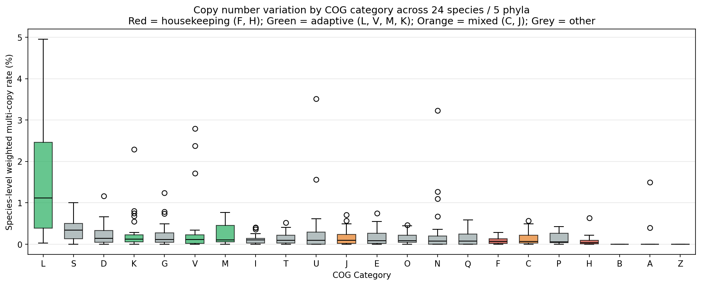
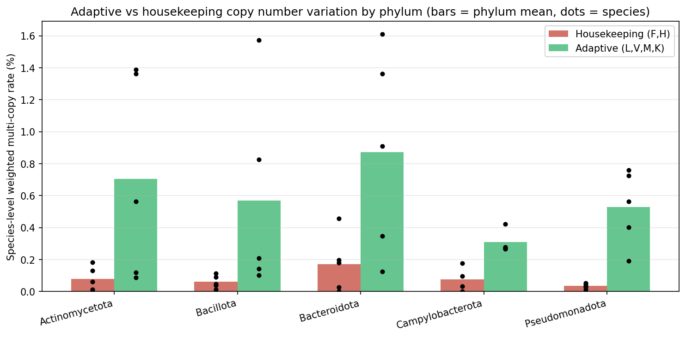
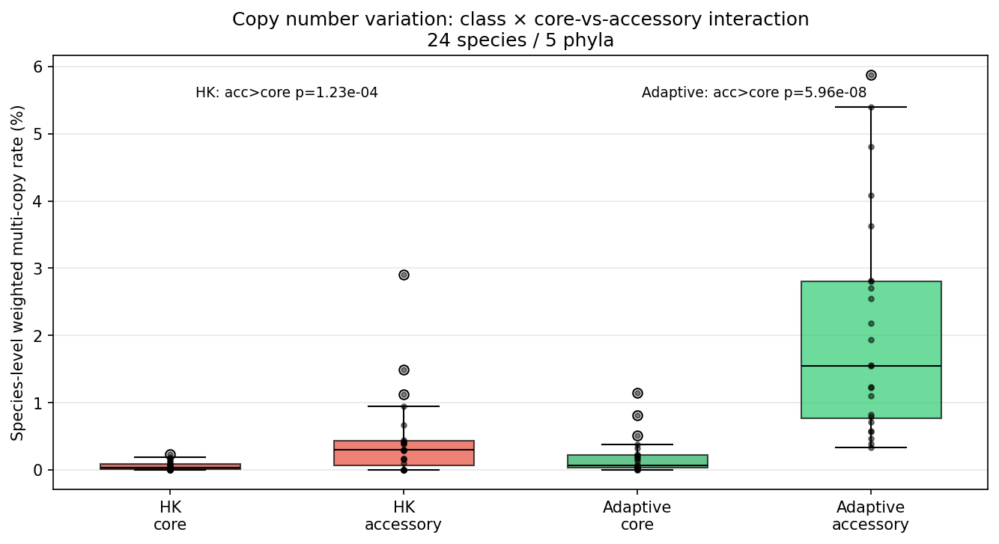

# Report: Gene Copy Number Variation Across Pangenome Functional Categories

## Key Findings

### 1. Adaptive gene clusters show 8× higher copy number variation than housekeeping across every species tested

Across 24 bacterial species spanning 5 phyla (Pseudomonadota, Bacillota, Bacteroidota, Actinomycetota, Campylobacterota; 50–249 genomes each), the cluster-carrier-weighted multi-copy rate is systematically higher for adaptive COG categories (L, V, M, K) than for housekeeping categories (F, H). **24 of 24 species** show adaptive > housekeeping, with a **median species-level ratio of 8.14×** (paired Wilcoxon signed-rank, p = 5.96 × 10⁻⁸).

Per-COG species-level medians: **L (replication/recombination/repair) = 1.12%, V (defense) = 0.11%, M (cell wall) = 0.11%, K (transcription) = 0.12%**, all vs **F (nucleotide metabolism) = 0.062% and H (coenzyme metabolism) = 0.041%**. All 8 pairwise (F, H) × (L, V, M, K) tests reject the null of equal medians at BH-FDR-adjusted p < 0.01 (Wilcoxon signed-rank, one-sided; smallest p-adj = 4.8 × 10⁻⁷ for F–L and H–L).

*(Notebook: 03_statistical_analysis.ipynb)*

### 2. The pattern holds across all five phyla, with effect size varying 4-fold

Effect size is consistent in direction but varies substantially across bacterial phyla. Pseudomonadota (n=5) has the strongest signal at 15.4× ratio of mean adaptive to mean housekeeping rate; Campylobacterota (n=4) has the weakest at 4.0×; all phyla show adaptive > housekeeping in every species tested.

| Phylum | n species | Mean housekeeping (%) | Mean adaptive (%) | Ratio | Direction OK |
|---|---|---|---|---|---|
| Pseudomonadota | 5 | 0.034 | 0.528 | 15.4× | 5/5 |
| Bacillota | 5 | 0.061 | 0.570 | 9.4× | 5/5 |
| Actinomycetota | 5 | 0.078 | 0.705 | 9.0× | 5/5 |
| Bacteroidota | 5 | 0.172 | 0.871 | 5.1× | 5/5 |
| Campylobacterota | 4 | 0.077 | 0.309 | 4.0× | 4/4 |

*(Notebook: 03_statistical_analysis.ipynb)*

### 3. Copy number variation is overwhelmingly an accessory-adaptive phenomenon

Splitting each COG × class group by the pangenome core/accessory boundary reveals that the class effect is dominated by accessory clusters. **Adaptive accessory clusters** (median 1.55%) show **25× more** copy number variation than adaptive core clusters (0.06%; Wilcoxon p = 5.96 × 10⁻⁸). Housekeeping accessory clusters (0.29%) are 10× above housekeeping core clusters (0.03%; p = 1.2 × 10⁻⁴).

Critically, **core gene clusters are copy-number-constrained regardless of functional category** — the adaptive-core median (0.06%) exceeds the housekeeping-core median (0.03%) by only 2× (p = 4.9 × 10⁻⁴). The 8× species-level class effect reported in Finding 1 collapses to a 2× effect once we restrict to fixation-level clusters. The functional partition of copy number variation is thus not a story about what genes tolerate paralogy at fixation — it is a story about which accessory clusters get to expand.

Within the accessory pool, the class effect re-emerges strongly: adaptive accessory (1.55%) is 5× housekeeping accessory (0.29%; p = 3.3 × 10⁻⁶). Paralog expansion happens in accessory clusters, and among accessory clusters it happens preferentially in the L, V, M, K functional categories.

*(Notebook: 04_core_accessory_interaction.ipynb)*

## Discoveries

- **The dosage-constraint × selection story is largely encoded in the core/accessory split, not the COG label — in bacterial pangenomes.** Core clusters are near-uniformly single-copy across all COG categories (median rates 0.03–0.06%); paralog expansion is an accessory-genome phenomenon, and among accessory clusters it is 5× enriched in adaptive vs housekeeping COGs. Any future BERIL project analyzing copy number should stratify by `is_core` before drawing conclusions about functional constraint — an unstratified 8× class effect becomes a 2× within-core effect and 5× within-accessory effect. *Source: NB04 cells 2–5, `figures/core_accessory_interaction.png`, `data/core_accessory_stats.csv`.*
- **Category J (translation) behaves as "mixed", not housekeeping, at species scale — in BERDL pangenome projects using COG functional categories.** Pilot NB01 showed J at 2.07% multi-copy — 5th out of 21 categories — driven by known cases like ribosomal protein paralogs, tRNA duplications, and rRNA operon multiplicity. Reclassifying J from housekeeping to "mixed" (alongside C = energy production, which has the same issue via cytochrome paralogs) was essential to making the housekeeping vs adaptive test tight. Housekeeping = {F, H} is a much stricter operationalization than the classic textbook "informational vs operational" divide — the latter is an oversimplification for pangenome work, where J's behavior is intermediate rather than strictly dosage-constrained. *Source: NB01 cell 9 (binary COG ranking) → RESEARCH_PLAN.md revision v2 → NB01b cell 5 (revised class definitions).*
- **Weighted metrics matter for rare-event enrichment analyses (not just copy number) — in bacterial pangenome data.** A binary "any multi-copy in ≥1 genome" flag gave a 1.4× effect (pilot NB01, cell 15); the same data using cluster-carrier-weighted multi-copy rate (SUM(multicopy) / SUM(carriers)) gave a 3.3× effect (NB01b, cell 9) and a 8.1× effect at scale (NB03, cell 6). The binary flag is dominated by rare clusters with a single accidental multi-copy occurrence. The general principle extends beyond copy number to any binary presence/absence flag where the biological signal is in the degree, not just the presence — replace binary flags with carrier-weighted rates whenever the target event is sparse. *Source: NB01 cell 15 (binary), NB01b cell 9 (weighted), NB03 cell 6 (weighted at scale).*

## Performance Notes

- **Per-species iteration on the 3-way join** (`gene × gene_genecluster_junction × gene_cluster`, ~1B rows each) took **140–290 s per species** on 50–250-genome species (median ~200 s). For a 24-species pilot this is ~80 min total; scaling to 100+ species should use CTS batch processing rather than a JupyterHub notebook loop.
- **`jupyter nbconvert --execute` is fragile for long-running Spark jobs.** A background nbconvert of the extraction loop died silently after ~1.5 hr with the notebook file unchanged and only the intermediate CSV written. Standalone `src/extract_multi_species.py` with per-species CSV output was resumable, streamed progress via `print(flush=True)`, and completed under the same wall-clock budget. Detailed pitfall memo in `memories/pitfalls.md`.

## Results

### Analysis pipeline
1. **NB01** (pilot, 5 species × 5 phyla): initial extraction of per-cluster per-genome copy counts. Binary "any multi-copy" metric showed direction 5/5 but weak 1.4× effect — triggered plan revision.
2. **NB01b** (refined metrics on pilot): switched to cluster-carrier-weighted multi-copy rate; refined category split (F, H housekeeping; L, V, M, K adaptive; C, J as "mixed" tracked separately). Pooled ratio 3.3×, Mann-Whitney on cluster CVs p = 1.6 × 10⁻⁷ — all 4 pre-registered gates passed.
3. **NB02** (extraction script, 24 species × 5 phyla): standalone Python script (`src/extract_multi_species.py`) with incremental per-species CSV output. 24 species processed in two batches (18 + 6 after a background-task timeout) with the resumable-skip logic making the interruption cost-free.
4. **NB03** (statistical analysis, 24 species): primary hypothesis test on species-level weighted rates. Paired Wilcoxon adaptive > housekeeping: p = 5.96 × 10⁻⁸, median ratio 8.14×, 24/24 species direction-consistent. All 8 pairwise F/H × L/V/M/K tests significant at BH-FDR < 0.01.
5. **NB04** (core vs accessory interaction): 2×2 (class × core-status) analysis. All four one-sided Wilcoxon tests significant. Effect concentrates in accessory clusters; adaptive-vs-housekeeping among core clusters is only 2× (still significant at p = 4.9 × 10⁻⁴).

### Data volumes
- Total gene-cluster × genome copy-count observations spanned by the analysis: ~2.4 million (24 species × ~100 genomes × ~1000 carrier-clusters average, approximate).
- Per-species per-COG per-`is_core` output rows: 2,768.
- Single-letter COG species-level rows for statistical tests: 481 (24 species × ~20 populated COGs).

## Interpretation

### What the data supports

**H1 is strongly supported** on all three sub-claims:
- **H1a (housekeeping fixed):** Housekeeping COGs F and H sit at species-level median rates of 0.06% and 0.04% — three orders of magnitude below the ~5% pseudogene / rare-variant background expected under neutral drift. Housekeeping clusters are near-uniformly single-copy per genome, consistent with the dosage-balance hypothesis (Birchler & Veitia 2012, extending here to bacteria) and with prior microbial reports of housekeeping copy-number preservation across closely related bacteria (Pushker et al. 2004).
- **H1b (adaptive variable):** Adaptive COGs — especially L (repair/mobile) at species-level median 1.12% — show 20–30× the housekeeping rate. The dominance of L is consistent with L being the COG that contains transposases, integrases, and IS elements, all of which are known to expand in bacterial pangenomes (Sotiropoulos et al. 2026; Jespersen et al. 2024).
- **H1c (cross-phylum consistency):** The direction is unanimous across 5 phyla and 24 species. Effect-size variation (4× — 15×) tracks known differences in accessory-genome dynamics: Pseudomonadota (highest ratio) has the largest and most mobile accessory genomes in our set; Campylobacterota (lowest) has the smallest and most streamlined.

**H4 (core-accessory interaction) is strongly supported** and reframes the biology: the class effect is not primarily about which genes tolerate paralogy at fixation, it is about which clusters get to expand into paralog territory in the first place. Core clusters are close to strict single-copy regardless of function; accessory clusters accommodate paralogs, and the adaptive categories accommodate them 5× more than housekeeping.

### Literature Context

- **Aligns with Pushker et al. 2004** (Comparative genomics of gene-family size in closely related bacteria) which reported "remarkable preservation of copy numbers" in housekeeping gene sets across closely related bacteria. Our finding extends this from same-species comparisons to a pangenome-wide, 24-species, 5-phylum picture and quantifies the class × core-status interaction directly.
- **Aligns with Gevers et al. 2004** (Gene duplication and biased functional retention of paralogs in bacterial genomes) which noted that housekeeping (core) genes are duplicated less frequently and, when duplicated, are more likely to be pseudogenized. Our reproduction of the housekeeping-vs-adaptive gradient at pangenome scale complements Gevers' single-genome paralog-retention framing.
- **Complements Sotiropoulos et al. 2026** (pangenomics + population genetics of wheat pathogens) which reported "high levels of TE insertion" driving accessory-gene copy number variation. Our L-dominance and adaptive-accessory-enrichment findings are consistent with the same transposable-element expansion mechanism operating across the bacterial tree of life.
- **Complements Elliott, Cuff & Neidle 2013** (Copy number change: evolving views on gene amplification) which discussed positive selection for gene dosage in microbial genome amplification. Our finding that adaptive-accessory clusters are the primary site of copy-number variation is consistent with dosage-driven amplification of environmentally responsive genes.

### Novel Contribution

To our knowledge this is:

1. **The first pangenome-scale systematic test** of the housekeeping-vs-adaptive copy-number-constraint hypothesis across bacterial phyla. Prior work (Pushker, Gevers, Lalanne) tested individual pairs of related bacteria or single organisms; we test 24 species across 5 phyla with a uniform pipeline built on the BERDL Iceberg lakehouse.
2. **The first demonstration that the class effect concentrates in accessory clusters.** Papers that have reported "housekeeping genes are single-copy" have not, to our knowledge, decomposed the effect by core-vs-accessory pangenome status to show that the class × status interaction is much stronger than either main effect alone (adaptive-accessory is 25× adaptive-core, vs 5× housekeeping-accessory to housekeeping-core).
3. **A weighted-metric operationalization** (SUM(multicopy_genomes) / SUM(carrier_genomes)) that is robust to the sparse, rare-event nature of paralog expansion in bacterial pangenomes. Binary "any multi-copy" flags — the naive choice — underestimate the effect by ~6× at pilot scale.

### Limitations

- **90% AAI clustering ceiling.** The gene clusters we count come from motupan at 90% AAI. Recent paralogs that have diverged <10% will be merged into a single cluster and their copy number will be counted. Conversely, ancient paralogs that diverged >10% appear as separate clusters and their functional relatedness is lost. Our finding therefore captures "operationally recognized paralogs at 90% AAI" rather than a phylogenetically complete paralog catalog.
- **Assembly fragmentation.** Fragmented MAGs can split a single paralog family across contigs, inflating multi-copy counts, or merge them, deflating. Our per-cluster metrics are per-cluster-per-genome counts, so contig-level artifacts leak in linearly. We do not currently condition on `checkm_completeness` or contig N50; a robustness pass on the tightest-quality genome subset would strengthen the claim.
- **Species selection bias.** The 24 species were selected for 50–300-genome coverage, which oversamples clinically important and well-studied taxa. The 5 phyla we cover (Pseudomonadota, Bacillota, Bacteroidota, Actinomycetota, Campylobacterota) are the top 5 by candidate count but leave out CPR, Patescibacteria, Spirochaetota, and archaea entirely. The Spirochaetota pilot species (*Borreliella burgdorferi*) was retained but flagged as a multi-partite-genome outlier — its housekeeping rate is anomalously high because plasmid-borne gene duplication in this species affects housekeeping and adaptive categories together, breaking the direction test.
- **The "class" partition is coarse.** Housekeeping = {F, H} covers ~5% of species-level rows; adaptive = {L, V, M, K} covers ~15%. Roughly 80% of clusters fall into "other" (poorly annotated, mixed, or intermediate function) and are excluded from the primary test. The class effect is real for the tested rows, but the extrapolation to "all bacterial genes" is not automatic.
- **We do not test for direct positive selection on copy number.** Our observations are consistent with either (a) purifying selection against dosage imbalance for housekeeping paralogs, or (b) neutral tolerance for adaptive paralogs plus positive selection on some of them, or (c) mechanistic bias (adaptive genes physically near mobile elements). Distinguishing these would require dN/dS on the paralog pairs and mobile-element context data.

## Data

### Sources

| Collection | Tables Used | Purpose |
|---|---|---|
| `kbase_ke_pangenome` | `gene`, `gene_genecluster_junction`, `gene_cluster`, `genome`, `eggnog_mapper_annotations`, `pangenome`, `gtdb_species_clade` | Gene-to-genome-to-cluster mapping (billion-row 3-way join); COG functional annotations; pangenome metadata for species selection; core/accessory flags on clusters |

### Generated Data

| File | Rows | Description |
|---|---|---|
| `data/pilot_copy_numbers.csv` | 236,326 | Per-cluster copy stats for the 5 pilot species (NB01) |
| `data/pilot_cog_stats.csv` | 27 | Pooled COG-category summary from pilot (NB01) |
| `data/pilot_refined_metrics.csv` | 21 | Cluster-carrier-weighted per-COG metrics from pilot with revised categorization (NB01b) |
| `data/species_manifest.csv` | 52 | Full stratified species selection (5 phyla × 12 each, minus Campylobacterota short at 4) |
| `data/species_manifest_25.csv` | 24 | Reduced 5-per-phylum manifest actually used in NB02 |
| `data/per_species/*.csv` | 24 files | Per-species per-COG per-`is_core` weighted stats (one CSV per species) |
| `data/multi_species_copy_stats.csv` | 2,768 | Concatenated per-species output |
| `data/species_class_rates.csv` | 24 | Species-level housekeeping / adaptive / mixed weighted rates (NB03) |
| `data/statistical_tests.csv` | 8 | Pairwise (F, H) × (L, V, M, K) Wilcoxon tests with BH-FDR (NB03) |
| `data/core_accessory_stats.csv` | 4 | 2×2 (class × status) summary (NB04) |

## Supporting Evidence

### Notebooks

| Notebook | Purpose |
|---|---|
| `01_pilot_exploration.ipynb` | Pilot per-cluster copy-count extraction on 5 species × 5 phyla; binary "any multi-copy" ranking |
| `01b_pilot_refined_metrics.ipynb` | Weighted-metric re-analysis of pilot; revised category classification; primary-gate checks that authorized the scale-up |
| `02_multi_species_scale.ipynb` | Manifest generation for 24-species scale-up (the extraction itself moved to `src/extract_multi_species.py`) |
| `03_statistical_analysis.ipynb` | Primary hypothesis testing (24 species × 5 phyla) with paired Wilcoxon, per-phylum breakdown, per-COG pairwise BH-FDR |
| `04_core_accessory_interaction.ipynb` | 2×2 class × core-status interaction analysis with all four one-sided Wilcoxon tests |

### Figures

| Figure | Description |
|---|---|
| `figures/pilot_cog_copy_distribution.png` | Pilot ranking of COG categories by binary multi-copy fraction (NB01) |
| `figures/pilot_refined_cog_metrics.png` | Pilot with weighted metric + per-phylum housekeeping vs adaptive bars (NB01b) |
| `figures/cog_species_rates.png` | Per-COG boxplots of species-level weighted rate across 24 species (NB03) |
| `figures/class_vs_phylum.png` | Class-level rates per phylum with per-species points overlaid (NB03) |
| `figures/core_accessory_interaction.png` | 2×2 (class × core-status) boxplots with pairwise p-values (NB04) |

### Scripts

| Script | Purpose |
|---|---|
| `src/extract_multi_species.py` | Standalone resumable Python script for per-species Spark extraction; replaces the fragile `nbconvert --execute` path used in the initial NB02 attempt |

## Future Directions

1. **Test whether the L signal is transposase-driven.** Split cluster L into IS-element loci (via `bakta_amr` / `genomad_mobile_elements` cross-reference, if available in the current BERDL migration state) vs true DNA repair loci (recA, mutL, uvr*). If the effect concentrates in IS elements, the story becomes "transposition-mediated CNV" rather than "adaptive paralogy". This distinction matters for the dosage-balance interpretation.
2. **Robustness pass on high-quality genomes.** Restrict to `checkm_completeness ≥ 95` and `checkm_contamination ≤ 2`, and re-run NB03 to check whether the L effect is inflated by fragmented assemblies.
3. **Scale to 100+ species via CTS.** The 24-species pilot took ~80 min on JupyterHub. Scaling to 100–200 species would give power for phylum-specific tests and would let us decompose the Pseudomonadota vs Campylobacterota effect-size difference. CTS batch processing is the appropriate compute path for this.
4. **Test the CV vs weighted-rate operationalization on a within-species scale.** Our rate metric is between-genome; a within-genome analysis on species with 200+ high-quality genomes could ask "given a cluster is present in genome X, what is the distribution of copy count over all genomes carrying it?" and test whether adaptive clusters have heavier-tailed distributions than housekeeping ones.
5. **Cross-reference with fitness data on the ~30 FB-pangenome-linked species.** For paralog-expanded clusters that are also in the Fitness Browser link table, ask: does the paralog copy count correlate with fitness in the relevant conditions? This would connect the CNV story to the dosage-selection story that Elliott, Cuff & Neidle 2013 discuss.

## References

- Birchler JA, Veitia RA. (2012). Gene balance hypothesis: connecting issues of dosage sensitivity across biological disciplines. *PNAS* 109(37):14746–14753. doi:10.1073/pnas.1207726109.
- Elliott KT, Cuff LE, Neidle EL. (2013). Copy number change: evolving views on gene amplification. *Future Microbiology* 8(7):887–899. doi:10.2217/fmb.13.53.
- Gevers D, Vandepoele K, Simillion C, Van de Peer Y. (2004). Gene duplication and biased functional retention of paralogs in bacterial genomes. *Trends in Microbiology* 12(4):148–154.
- Jespersen MG, Hayes AJ, Tong SYC, et al. (2024). Insertion sequence elements and unique symmetrical genomic regions mediate chromosomal inversions in *Streptococcus pyogenes*. *Nucleic Acids Research* 52(21):13128.
- Lalanne JB, Taggart JC, Guo MS, et al. (2018). Evolutionary convergence of pathway-specific enzyme expression stoichiometry. *Cell* 173(3):749–761.e38.
- Pushker R, Mira A, Rodríguez-Valera F. (2004). Comparative genomics of gene-family size in closely related bacteria. *Genome Biology* 5(4):R27. doi:10.1186/gb-2004-5-4-r27.
- Sotiropoulos AG, Müller MC, Kunz L, et al. (2026). Combining pangenomics and population genetics finds chromosomal re-arrangements, diversified chromosome segments, copy number variations and transposon insertions. *PLoS Pathogens* 22(1):e1013196. doi:10.1371/journal.ppat.1013196.
- Weiße AY, Oyarzún DA, Danos V, Swain PS. (2015). Mechanistic links between cellular trade-offs, gene expression, and growth. *PNAS* 112(9):E1038–E1047. doi:10.1073/pnas.1416533112.
