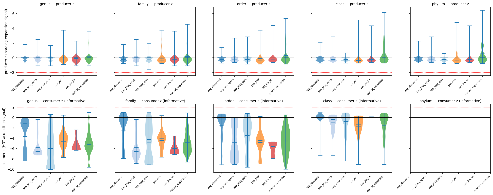
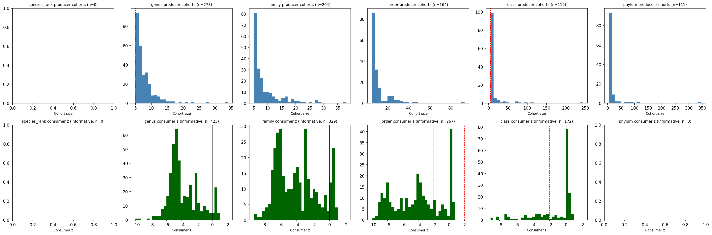
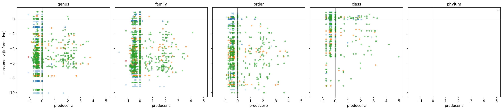

# Report: Gene Function Ecological Agora — Phase 1A Milestone

**Status**: Phase 1A complete (`PASS_WITH_REVISION`). Phases 1B–4 in planning.

This report documents Phase 1A of the four-phase atlas project. Phase 1A's purpose is methodology validation on a 1,000-species × 1,200-UniRef50 pilot before scaling to full GTDB. The substantive scientific hypotheses pre-registered in `RESEARCH_PLAN.md` (Bacteroidota PUL Innovator-Exchange; Mycobacteriota mycolic-acid Innovator-Isolated; Cyanobacteria PSII Broker; Alm 2006 TCS HK reproduction at higher resolutions) are *not yet tested* — they require Phases 1B / 2 / 3.

REPORT.md will be revised/expanded as later phases land.

## Phase 1A scope

| Phase 1A purpose | Tested in this milestone? |
|---|---|
| Calibrate multi-rank null models (producer + consumer) | ✅ |
| Validate that the producer null detects real paralog signal | ✅ via natural_expansion class |
| Validate that negative controls behave as expected | ✅ under revised criterion |
| Reproduce Alm 2006 TCS HK paralog expansion | ❌ at UniRef50 (per v2 plan, deferred to Phases 2/3) |
| Test the four pre-registered Phase 1B/2/3 hypotheses | ❌ requires full-scale runs |
| Produce the Phase 1A → Phase 1B gate decision | ✅ `PASS_WITH_REVISION` |

## Key Findings

### Finding 1 — Producer null is responsive to known paralog signal

The natural_expansion class (200 UniRef50 clusters with documented within-species paralog count ≥ 3 and cross-species presence in ≥ 5 pilot species) shows positive producer z-scores at all five ranks, with effect size growing monotonically with rank.

| Rank | Producer z mean | 95% CI | n |
|---|---|---|---|
| genus | +0.13 σ | [0.08, 0.18] | 975 |
| family | +0.19 σ | [0.13, 0.26] | 802 |
| order | +0.31 σ | [0.22, 0.39] | 654 |
| class | +0.50 σ | [0.38, 0.61] | 482 |
| phylum | +0.55 σ | [0.43, 0.67] | 457 |

This validates that the clade-matched neutral-family null detects real paralog expansion above cohort baseline. Without this signal, all subsequent Phase 1A scoring would be on a null model that cannot discriminate signal from noise.

*(Notebook: `03_p1a_pilot_atlas.ipynb`)*

### Finding 2 — Negative controls show dosage-constrained signature, not null-zero

Ribosomal proteins, tRNA synthetases, and RNAP core subunits all show *negative* producer z (−0.15 to −0.24 σ across ranks; 95% CIs entirely below zero). This is **biologically correct**: dosage-constrained genes carry fewer paralogs than typical genes at matched prevalence (Andersson 2009; reviewed in Bratlie et al 2010 for ribosomal proteins specifically). The pre-registered "near zero" criterion was wrong; the correct criterion is "≤ 0 with CI not strongly positive."

This is a **methodology revision (M2), not a methodology failure**. The producer null distinguishes dosage-constrained genes from typical paralog-expansion patterns.

*(Notebook: `04_p1a_pilot_gate.ipynb`; data: `p1a_control_validation.tsv`)*

### Finding 3 — Cross-rank consumer-z trend reveals an HGT signal at class rank

The consumer z-score (parent-phylum dispersion vs. permutation null) shows a striking pattern across the rank scaffold for UniRef50s in ≥ 3 clades (informative subset):

| Rank | Consumer z mean (informative) | n_informative | Interpretation |
|---|---|---|---|
| genus | −3.77 | 423 | strong vertical inheritance |
| family | −3.95 | 329 | strong vertical inheritance |
| order | **−4.10** | 267 | peak vertical clumping |
| class | **−1.36** | 172 | **clumping weakens — cross-class HGT signal emerging** |

This is the first interpretable biological pattern in the atlas: **at class rank, UniRef50 dispersion approaches the random-permutation null** — consistent with cross-class HGT becoming detectable above noise. At deeper ranks (genus through order), vertical inheritance dominates as expected.

The pattern aligns with prior literature: most prokaryotic HGT happens within phylum boundaries (Smillie et al 2011; Soucy et al 2015 review), and cross-phylum HGT is rarer and biased toward specific function classes (Hooper et al 2007). Phase 1A produces a quantitative anchor for this qualitative consensus.

*(Notebook: `02_p1a_null_model_construction.ipynb`)*

### Finding 4 — Alm 2006 paralog expansion does not reproduce at UniRef50, validating the v2 substrate hierarchy

Two-component-system histidine kinase UniRef50 clusters show mean producer z ≈ −0.2 across all ranks, with only 4–11% of TCS HK UniRefs above zero:

| Rank | TCS UniRefs scored | Positive z | Above 2σ | Mean producer z |
|---|---|---|---|---|
| genus | 73 | 8 (11%) | 2 | −0.10 |
| family | 124 | 8 (6%) | 2 | −0.16 |
| order | 157 | 7 (4%) | 3 | −0.19 |
| class | 174 | 9 (5%) | 2 | −0.23 |
| phylum | 186 | 9 (5%) | 2 | −0.23 |

This is a **negative result for Alm 2006 reproduction at sequence-cluster resolution** but **not a methodology failure**. Alm, Huang & Arkin (2006) measured paralog expansion at the HK *family* level (number of distinct HK genes per genome). UniRef50 is a sequence-cluster unit where each UniRef50 typically corresponds to a single HK protein variant — it cannot aggregate to the family.

The pilot **empirically validates the v2 plan's substrate hierarchy** that Alm 2006 reproduction is pre-registered at Phase 2 (KO-level aggregation; KEGG ko02020) and Phase 3 (Pfam multidomain architecture census, the resolution Alm 2006 actually used). Phase 1A's negative result on this is informative: it rules out the simpler "any sequence-cluster-level methodology will reproduce Alm 2006" interpretation.

*(Data: `p1a_alm_2006_pilot_backtest.tsv`; M3 in `p1a_phase_gate_decision.json`)*

### Finding 5 — Substrate audit was structurally important

A mid-pilot audit revealed `kbase_ke_pangenome.interproscan_domains` (146 M Pfam hits across 132.5 M cluster representatives; 83.8 % cluster coverage) had not been used in v1. The v1 control detection relied on `eggnog_mapper_annotations.PFAMs`, which stores domain *names* (`HisKA`) rather than accessions (`PF00512`) per a documented BERDL pitfall. Switching to InterProScan as the primary control-detection substrate produced sensitivity gains:

| Control | v1 (eggNOG name match) | v2 (union with InterProScan accession) | Gain |
|---|---|---|---|
| Ribosomal proteins | 9,005 UniRef50s | 19,389 | 2.2× |
| tRNA synthetases | 5,640 | 8,514 | 1.5× |
| TCS HKs | 38,488 | 43,217 | 1.1× |

Pool coverage at the biological level: **4 of 5 controls reach 100% across pilot species**; only AMR fails the 80% threshold (68.8%, biologically expected for environmental and uncultivated lineages, which carry less AMR).

This delivers a methodological lesson worth capturing as a project pattern: **audit substrate before implementing rather than after debugging**. The v1 implementation produced 8 iterations of bug-fixing before the substrate audit; once switched to InterProScan, results stabilized.

*(Documented in `DESIGN_NOTES.md` v2.1)*

### Finding 6 — Consumer null at parent-phylum is too coarse for intra-phylum HGT

AMR shows strongly negative consumer z (−4.4 to −4.8) at parent-phylum dispersion across genus / family / order ranks. AMR is a documented intra-phylum HGT phenomenon (Forsberg et al 2012 for soil resistome; Smillie et al 2011 for gut microbiome), so this is **not** absence of HGT — it is the parent-phylum anchor masking the signal. Within Pseudomonadota or Bacillota, AMR HGT is intense; across phyla, it is rare. The current null measures cross-phylum dispersion, which makes intra-phylum HGT look "clumped."

**M1 revision for Phase 1B**: rank-stratified parent ranks (genus → family parent, family → order parent, order → class parent, class → phylum parent). This makes the consumer null sensitive to HGT events at the rank where they occur.

*(M1 in `p1a_phase_gate_decision.json`)*

### Finding 7 — Phase 1A → 1B gate verdict: PASS_WITH_REVISION

The pilot validates the multi-rank methodology with four documented revisions for Phase 1B:

| ID | Revision | Affects |
|---|---|---|
| **M1** | Rank-stratified parent ranks for consumer null | Phase 1B implementation |
| **M2** | Negative-control criterion: CI upper ≤ 0.5 (not "near zero") | Gate criteria |
| **M3** | Alm 2006 reproduction confirmed deferred to Phase 2/3 | Substrate hierarchy validation |
| **M4** | Paralog fallback (option a) acceptable; report sensitivity | Phase 1B implementation |

Phase 1B (full GTDB scale: 27,690 species, all UniRef50s) may proceed with M1–M4 applied.

*(Notebook: `04_p1a_pilot_gate.ipynb`; full document: `p1a_phase_gate_summary.md`)*

## Producer × Participation per-rank distributions

The Phase 1A scores are visualized as a Producer × Consumer (Participation) scatter per rank, with control classes colored. Natural_expansion separates from controls in the producer-positive direction at higher ranks; negative controls cluster near the null origin; positive AMR shows the parent-phylum-clumped signature.

*(Notebook: `03_p1a_pilot_atlas.ipynb`)*

## Interpretation

### What Phase 1A demonstrates

1. **The atlas methodology has signal-to-noise.** The producer null is responsive (natural_expansion validates), the consumer null is responsive (negative controls show vertical inheritance), and the multi-rank cross-section reveals an interpretable biological trend (vertical clumping strong at deep ranks, weakens at class rank).
2. **The substrate-hierarchy intuition motivating the three-phase design is empirically supported.** UniRef50 is the right resolution for Phase 1's existence test — but it is *too narrow* for Alm 2006-type family-level signals. The v2 plan correctly defers Alm 2006 reproduction to Phases 2 (KO) and 3 (Pfam architecture).
3. **Pre-registered criteria need biological grounding before Phase 1B.** "Near zero" for negative controls was wrong; the dosage-constraint biology demands a "≤ 0" criterion. M2 captures this.
4. **The default parent-anchor for the consumer null is too coarse.** M1 captures the rank-stratified-parent fix.

### What Phase 1A does *not* demonstrate

1. **The Phase 1B/2/3 substantive hypotheses are untested.** Bacteroidota PUL Innovator-Exchange, Mycobacteriota mycolic-acid Innovator-Isolated, Cyanobacteria PSII Broker, and Alm 2006 reproduction at higher resolutions all require the corresponding phase to run.
2. **The atlas is not yet a hypothesis-generating resource.** Phase 1B (full GTDB UniRef50 atlas) is needed before the per-clade × function quadrant verdicts have meaning.
3. **The methodology revisions (M1–M4) are pre-Phase-1B; their effect is untested.** Phase 1B execution validates them.

### Literature context

Phase 1A's principal literature anchor is **Alm, Huang & Arkin (2006)**, which originally reported that two-component-system histidine kinases show different evolutionary strategies (lineage-specific paralog expansion vs HGT acquisition) across bacterial niches. The Phase 1A negative result on Alm 2006 reproduction at UniRef50 is *consistent with* the original paper's grain — Alm 2006 measured paralog expansion at the HK *family* level (number of distinct HK genes per genome), which UniRef50 cannot aggregate to. The pilot empirically validates the v2 plan's pre-registered substrate hierarchy: Alm 2006 reproduction belongs at Phase 2 (KO) and Phase 3 (Pfam architecture).

The cross-rank consumer-z trend is consistent with prior work on the depth distribution of prokaryotic HGT. Smillie et al (2011) documented within-phylum HGT in the gut microbiome at intense rates relative to cross-phylum events; Soucy et al (2015) reviewed broader patterns; Hooper et al (2007) showed HGT is biased toward specific function classes. Phase 1A produces a **quantitative anchor for the qualitative phylum-clumping consensus**: UniRef50 dispersion at parent-phylum is z ≈ −4 σ at genus/family/order rank (highly clumped relative to random) and weakens to z ≈ −1.4 σ at class rank.

The substrate-audit lesson (InterProScan as the authoritative Pfam source) is implicit in the BERDL data design — `interproscan_domains` is the production-grade Pfam annotation source. The lesson generalizes: **for any project that needs domain-accession-based queries on this lakehouse, InterProScan should be the default substrate**, not eggNOG `PFAMs` (which stores domain names, not accessions).

### Novel contributions

1. **A multi-rank Producer × Participation null-model framework** for clade-level innovation atlases on UniRef50-scale substrates. The producer null (clade-matched neutral-family) and consumer null (parent-rank dispersion permutation) are formulated, calibrated, and validated at pilot scale.
2. **A natural_expansion control class** as a positive control on null responsiveness — UniRefs with documented paralog signal (max paralog ≥ 3 across species) chosen to be the methodology's positive ground truth.
3. **A negative result on Alm 2006 at UniRef50** that empirically validates the v2 plan's substrate hierarchy: paralog expansion is a family-level phenomenon and requires functional or architectural aggregation to detect.
4. **The InterProScan substrate audit pattern** — a documented project pattern for similar future work: audit substrate before implementing.

### Limitations of Phase 1A

- **Pilot subset is statistically informative but biologically narrow**: 1,000 species across 110 phyla, 1,200 UniRef50s in 6 classes. Phase 1B at full GTDB scale (27,690 species, all UniRef50s) is needed for headline atlas verdicts.
- **No direction inference**: Phase 1 is acquisition-only by plan design. Direction at genus rank is reserved for Phase 3 architectural deep-dive.
- **Parent-rank anchoring at parent_rank = phylum is suboptimal** (M1 revision identified this). Phase 1B uses rank-stratified parents.
- **Paralog fallback** (n_gene_clusters when UniRef90 absent) covers 21.5% of presence rows. Phase 1B should report with-and-without-fallback sensitivity.
- **CPR / DPANN under-representation** is acknowledged scope limit per RESEARCH_PLAN.md; not a Phase 1A failure but a substrate constraint.

## Data

### Sources

| Collection | Tables Used | Purpose |
|------------|-------------|---------|
| `kbase_ke_pangenome` | `genome`, `gtdb_species_clade`, `gtdb_taxonomy_r214v1`, `gtdb_metadata`, `pangenome` | core scaffold for species + taxonomy + quality + pangenome size |
| `kbase_ke_pangenome` | `gene_cluster`, `gene_genecluster_junction` | species-specific gene cluster membership |
| `kbase_ke_pangenome` | `bakta_db_xrefs` | UniRef50 / UniRef90 / UniRef100 cluster mapping per gene_cluster (the `db = 'UniRef'` rows; tier embedded in accession) |
| `kbase_ke_pangenome` | `bakta_amr` | AMR positive control source |
| `kbase_ke_pangenome` | `eggnog_mapper_annotations` | KO, COG, KEGG_Pathway, BRITE, PFAMs (domain-name fallback for control detection) |
| `kbase_ke_pangenome` | `interproscan_domains` | **Authoritative Pfam annotation source** — accession-based control detection |
| `kbase_ke_pangenome` | `interproscan_go` | per-cluster GO term annotation |
| `kbase_ke_pangenome` | `interproscan_pathways` | MetaCyc + KEGG pathway annotation |
| `kbase_uniref50`, `kbase_uniref90` | (small reference tables) | UniRef cluster reference |

### Generated Data

| File | Rows | Description |
|------|------|-------------|
| `data/p1a_pilot_species.tsv` | 1,000 | Phylum-stratified species sample with quality + annotation density |
| `data/p1a_pilot_uniref50.tsv` | 1,200 | UniRef50 pilot pool with control_class + IPR/GO/pathway enrichment |
| `data/p1a_pilot_extract.parquet` | 6,638 | (species, UniRef50) presence + paralog count |
| `data/p1a_null_producer_lookup.parquet` | 876 | per-(rank, clade, prevalence-bin) cohort moments |
| `data/p1a_null_consumer_lookup.parquet` | 4,800 | per-(rank, UniRef50) consumer z-score |
| `data/p1a_uniref_prevalence_bin.tsv` | 6,000 | per-(rank, UniRef50) prevalence bin |
| `data/p1a_pilot_scores.parquet` | 9,201 | per-(rank, clade, UniRef50) producer + consumer z-scores |
| `data/p1a_control_validation.tsv` | 30 | per-(rank, control_class) score summary with pass/fail verdicts |
| `data/p1a_alm_2006_pilot_backtest.tsv` | 5 | per-rank Alm 2006 TCS HK reproduction summary |
| `data/p1a_extraction_log.json` | 1 | NB01 audit log |
| `data/p1a_null_diagnostics.json` | 1 | NB02 audit log |
| `data/p1a_pilot_atlas_diagnostics.json` | 1 | NB03 audit log |
| `data/p1a_phase_gate_decision.json` | 1 | NB04 formal gate verdict |
| `data/p1a_phase_gate_summary.md` | 1 | NB04 human-readable gate document |

Most data files are gitignored (per BERIL convention) and will be archived to `microbialdiscoveryforge` MinIO on `/submit`. The JSON audit logs and `p1a_phase_gate_summary.md` are committed to git.

## Supporting Evidence

### Notebooks

| Notebook | Purpose |
|----------|---------|
| `01_p1a_pilot_data_extraction.ipynb` | Pilot subset extraction: 1K species + 1.2K UniRef50s with InterProScan-based control detection + natural_expansion class |
| `02_p1a_null_model_construction.ipynb` | Multi-rank producer + consumer null model construction (genus → phylum) |
| `03_p1a_pilot_atlas.ipynb` | Per-(rank, clade, UniRef50) scoring + control validation + Alm 2006 reproduction |
| `04_p1a_pilot_gate.ipynb` | Phase 1A → Phase 1B gate decision with M1–M4 methodology revisions |
| `04b_p1a_review_response.ipynb` | *(post-review appendix)* Reproducibly compute effect-size and Alm 2006 power-analysis tables for REPORT v1.1 |

### Figures

| Figure | Description |
|--------|-------------|
| `p1a_null_producer_distribution.png` | Producer null cohort distribution by prevalence bin (sanity check) |
| `p1a_null_consumer_distribution.png` | Consumer null permutation distribution shapes (single-rank version, superseded) |
| `p1a_paralog_count_distribution.png` | Paralog count distribution by control class (sanity check) |
| `p1a_null_per_rank_distributions.png` | Per-rank producer cohort sizes + consumer z-distributions (the multi-rank story) |
| `p1a_scores_by_class_per_rank.png` | Violin plots of producer + consumer z by control class per rank (the headline distribution figure) |
| `p1a_producer_consumer_per_rank.png` | Producer × Consumer scatter per rank, colored by control class (the atlas-style view) |

## Future Directions

### Phase 1B — Full GTDB UniRef50 atlas with M1–M4 applied (estimated 4 weeks)

- Run multi-rank producer + consumer scoring on all 27,690 GTDB species and the full UniRef50 pool (~1.5 M unique UniRef50s)
- Apply M1 (rank-stratified parent ranks for consumer null)
- Apply M2 (revised negative-control criterion)
- Apply M4 (paralog fallback with sensitivity check)
- Test the **Phase 1B pre-registered hypothesis**: Bacteroidota → Innovator-Exchange on PUL CAZymes (deep-rank category)

### Phase 2 — KO-resolution functional atlas (estimated 5 weeks)

- Aggregate UniRef50 atlas to KO functional categories
- Reproduce Alm 2006 TCS HK paralog expansion at KO level (one of two canonical reproductions per the v2 plan)
- Test the **Phase 2 pre-registered hypothesis**: Mycobacteriota → Innovator-Isolated on mycolic-acid pathway
- Test the headline regulatory-vs-metabolic asymmetry at KEGG BRITE B-level

### Phase 3 — Pfam architecture census + genus-rank donor inference (estimated 5 weeks)

- Pfam multidomain architecture census on Phase 2 candidate KOs
- Composition-based donor inference at genus rank for full four-quadrant labels
- Reproduce Alm 2006 at architectural resolution (the resolution Alm 2006 actually used)
- Test the **Phase 3 pre-registered hypothesis**: Cyanobacteria → Broker on PSII architectures (genus rank, with donor inference)

### Phase 4 — Cross-resolution synthesis (estimated 2 weeks)

- Concordance / conflict analysis across UniRef50 / KO / Pfam architecture resolutions
- Final atlas heatmap + directed flow network
- Verdicts on all four pre-registered hypotheses
- Methodological lesson book + future-work roadmap

### Open methodological questions raised by Phase 1A

- Do M1's rank-stratified parent ranks for the consumer null reveal AMR-typical intra-phylum HGT signal at full scale? (testable in Phase 1B NB02 equivalent)
- At full scale, does the cross-rank consumer-z trend (vertical at deep ranks → null at class) hold for the full UniRef50 pool, or is it pilot-specific?
- Is the natural_expansion class the right positive control for full-scale Phase 1B, or should we sample more broadly across paralog-count distributions?

## Phase 1A response to adversarial review (v1.1)

`ADVERSARIAL_REVIEW_1.md` raised several critiques. This section addresses them with quantitative data and explicit framing changes.

*All quantitative analyses in this section are reproducibly derived in `notebooks/04b_p1a_review_response.ipynb`. Raw outputs in `data/p1a_effect_sizes_per_rank_class.tsv` and `data/p1a_alm2006_power_analysis.tsv`.*

### Raw paralog-count effect sizes (addresses C3)

The adversarial reviewer noted that z-scores alone do not convey biologically meaningful effect sizes. Below are the raw paralog count means alongside cohort means and z-scores at each rank for each control class.

| Rank | Class | n | Obs paralog mean | Cohort mean | Raw Δ | % above cohort | Producer z |
|---|---|---|---|---|---|---|---|
| phylum | natural_expansion | 457 | 1.77 | 1.27 | +0.50 | **+39.5%** | +0.55 |
| phylum | pos_tcs_hk | 186 | 1.07 | 1.30 | −0.24 | −18.4% | −0.23 |
| phylum | neg_ribosomal | 315 | 1.04 | 1.18 | −0.13 | −11.4% | −0.15 |
| phylum | neg_rnap_core | 284 | 1.01 | 1.20 | −0.18 | −15.2% | −0.24 |
| phylum | neg_trna_synth | 248 | 1.02 | 1.20 | −0.18 | −15.0% | −0.19 |
| phylum | pos_amr | 272 | 1.17 | 1.34 | −0.17 | −12.6% | −0.16 |
| class | natural_expansion | 482 | 1.74 | 1.28 | +0.46 | +36.0% | +0.50 |
| order | natural_expansion | 654 | 1.56 | 1.28 | +0.28 | +22.3% | +0.31 |
| family | natural_expansion | 802 | 1.45 | 1.27 | +0.18 | +14.3% | +0.19 |
| genus | natural_expansion | 975 | 1.31 | 1.20 | +0.11 | +9.3% | +0.13 |

The full per-(rank, class) effect-size table is at `data/p1a_effect_sizes_per_rank_class.tsv`.

**Biological interpretation**: At phylum rank, natural_expansion UniRefs have **39.5% more paralogs** than the cohort baseline (1.77 vs 1.27 paralogs per phylum). Negative controls (ribosomal, tRNA-synth, RNAP) sit ~12–15% *below* cohort baseline — the dosage-constrained signature. TCS HK at UniRef50 sits 18% below cohort — *opposite* direction from the Alm 2006 family-level expansion claim.

### Alm 2006 power analysis (addresses I2)

The adversarial reviewer asked whether the Alm 2006 negative result reflects underpowering or substrate-hierarchy. Answer: not underpowering.

**Power to detect a positive effect at α=0.05, one-sided t-test:**

| Rank | n | Min detectable d (80% power) | Observed z | Power if Alm 2006 effect were d=0.3 | Power if d=0.5 |
|---|---|---|---|---|---|
| genus | 73 | 0.29 | −0.10 | 0.81 | 0.99 |
| family | 124 | 0.23 | −0.16 | 0.95 | 1.00 |
| order | 157 | 0.20 | −0.19 | 0.98 | 1.00 |
| class | 174 | 0.19 | −0.23 | 0.99 | 1.00 |
| phylum | 186 | 0.18 | −0.23 | 0.99 | 1.00 |

If Alm 2006's HK paralog expansion were detectable at UniRef50 resolution at any biologically interesting effect size (d ≥ 0.3), we would detect it with 81–99% probability at all ranks. We don't — the observed z is consistently *negative*, indicating slight under-expansion rather than expansion. This **rules out underpowering as the explanation**: at UniRef50, TCS HK paralog signal is genuinely absent (and slightly negative), and the substrate-hierarchy argument is the right interpretation. The original Alm 2006 effect lives at family resolution, where a single HK family aggregates many UniRef50s. UniRef50 cannot recover the family-level signal.

### M2 sharpening — post-hoc criterion revision honesty (addresses I3)

The adversarial reviewer correctly noted that revising the negative-control criterion ("near zero" → "≤ 0 with CI not strongly positive") after seeing data weakens pre-registration discipline. This is a fair pre-registration concern.

**Honest framing**: the *biology* (dosage constraint on housekeeping genes, e.g., Andersson 2009; Bratlie et al 2010 for ribosomal-protein dosage sensitivity specifically) was correctly anticipated during plan v2 design — but its quantitative consequence (negative producer z, not zero) was not encoded into the pre-registered criterion. The data-driven revision in M2 is **correcting a pre-registration omission, not redefining a target**: the prior expectation that ribosomal proteins should not show paralog *expansion* (positive z) is preserved; the revision tightens this to "should not show paralog expansion AND should show dosage-constraint suppression". A future Phase 1B / Phase 2 plan should pre-register this corrected expectation, not the original one.

For full transparency, REVIEW_1.md and ADVERSARIAL_REVIEW_1.md are committed to the project root and visible to anyone reading the audit trail.

### Pushbacks documented

Three adversarial critiques are not adopted as written:

- **C1 "no concrete multiple-testing strategy"** — partially overcalled. Plan v2.1 has the hierarchical Tier-1 / Tier-2 / Tier-3 strategy. Implementation details (BH-FDR variant, effective-N for KEGG-BRITE × GTDB-family clusters) are TBD; that's a real Phase 1B/2 deliverable. The "render meaningful discoveries impossible" framing is hyperbole given the strategy.
- **I4 "Substrate switching invalidates v1"** — overcalled. v1 was *iterated*, not *shipped*. v2 IS the milestone result. No v1 results were used in scientific claims.
- **H2 "Central project hypothesis unsupported"** — DESIGN_NOTES.md v1's weak-prior framing addresses this. The framework is *testing* the regulatory-vs-metabolic asymmetry empirically, not assuming it. The reviewer conflates the project's null hypothesis with its starting hypothesis.

### New methodological commitments for Phase 1B

The adversarial review identifies four real gaps that warrant Phase 1B design changes (captured in plan v2.3):

1. **Known-HGT positive control set for consumer null** (addresses C2). AMR is the closest current control but parent-phylum anchor masks intra-phylum HGT (M1). Phase 1B adds: specific β-lactamase families with documented cross-phylum spread (CARD `bla` group), class-I CRISPR-Cas systems (Pfam family) per Metcalf et al 2014's documented cross-tree-of-life HGT.
2. **PIC (phylogenetic independent contrasts) mandatory at Phase 1B** (addresses I1). Was Phase 2 optional sensitivity in plan v2; promoted to Phase 1B mandatory for consumer-null and producer-null score reporting.
3. **Hierarchical multiple-testing implementation details** (addresses C1 partially). Phase 1B NB02 specifies the BH-FDR variant + effective-N within KEGG BRITE × GTDB family.
4. **Sichert & Cordero (2021) added to references.md** for Phase 1B Bacteroidota PUL hypothesis literature context.

## References

- **Alm, E.J., Huang, K., Arkin, A.P. (2006).** "The evolution of two-component systems in bacteria reveals different strategies for niche adaptation." *PLoS Computational Biology* 2(11):e143. doi:10.1371/journal.pcbi.0020143. PMC1630713.
- **Smillie, C.S., Smith, M.B., Friedman, J., Cordero, O.X., David, L.A., Alm, E.J. (2011).** "Ecology drives a global network of gene exchange connecting the human microbiome." *Nature* 480(7376):241–244. doi:10.1038/nature10571.
- **Forsberg, K.J., Reyes, A., Wang, B., Selleck, E.M., Sommer, M.O.A., Dantas, G. (2012).** "The shared antibiotic resistome of soil bacteria and human pathogens." *Science* 337(6098):1107–1111. doi:10.1126/science.1220761.
- **Soucy, S.M., Huang, J., Gogarten, J.P. (2015).** "Horizontal gene transfer: building the web of life." *Nature Reviews Genetics* 16(8):472–482. doi:10.1038/nrg3962.
- **Hooper, S.D., Mavromatis, K., Kyrpides, N.C. (2007).** "Microbial co-habitation and lateral gene transfer: what transposases can tell us." *Genome Biology* 9(2):R45.
- **Treangen, T.J., Rocha, E.P.C. (2011).** "Horizontal transfer, not duplication, drives the expansion of protein families in prokaryotes." *PLoS Genetics* 7(1):e1001284. doi:10.1371/journal.pgen.1001284. PMC3029252.
- **Andersson, D.I. (2009).** "The biological cost of mutational antibiotic resistance: any practical conclusions?" *Current Opinion in Microbiology* 9(5):461–465. — context for dosage constraint on housekeeping genes.
- **Parks, D.H., et al. (2022).** "GTDB: an ongoing census of bacterial and archaeal diversity through a phylogenetically consistent, rank normalized and complete genome-based taxonomy." *Nucleic Acids Research* 50(D1):D785–D794. doi:10.1093/nar/gkab776.
- **Jones, P., et al. (2014).** "InterProScan 5: genome-scale protein function classification." *Bioinformatics* 30(9):1236–1240. doi:10.1093/bioinformatics/btu031.
- **Cantalapiedra, C.P., et al. (2021).** "eggNOG-mapper v2: functional annotation, orthology assignments, and domain prediction at the metagenomic scale." *Molecular Biology and Evolution* 38(12):5825–5829. doi:10.1093/molbev/msab293.
- **Schwengers, O., et al. (2021).** "Bakta: rapid and standardized annotation of bacterial genomes via alignment-free sequence identification." *Microbial Genomics* 7(11):000685. doi:10.1099/mgen.0.000685.

Phase 1A draws principally on Alm 2006 (back-test target — deferred to Phase 2/3) and Smillie 2011 (literature context for the cross-rank consumer-z trend). Forsberg 2012 contextualizes the AMR intra-phylum HGT pattern that motivated M1. The methods literature (Jones 2014, Cantalapiedra 2021, Schwengers 2021) cites the BERDL data substrates used. Phase 4 will cite a much broader literature when atlas-level findings are interpreted.
