# Report: Genotype x Condition to Phenotype Prediction from ENIGMA Growth Curves

## Executive Summary

This project asks whether bacterial growth phenotype — at resolutions from binary growth through continuous kinetics — is predictable from genome content and growth condition, in a way that is biologically interpretable, independently validated, and actionable for rational experimental design at the ENIGMA Oak Ridge contaminated subsurface site. Across 11 notebooks, 50 figures, and 46,389 (genome × condition) training pairs built from five complementary datasets (ENIGMA growth curves, ENIGMA Genome Depot, Fitness Browser, Web of Microbes, Carbon Source Phenotypes), we produce a calibrated genotype-to-phenotype model with the following bottom line:

- **Binary growth IS predictable** on amino acids (AUC 0.775, tryptophan 0.933) and nucleosides (0.780) from KO presence/absence; moderately predictable on carbon sources (0.695); **not predictable** on metals, antibiotics, or nitrogen from KO content alone. 95 of 343 tested conditions achieve AUC > 0.75.
- **Continuous growth parameters (µmax, lag, yield) are NOT predictable** from KO content or bulk genomic features under cross-genus holdout. This is a fundamental biological limitation — gene presence encodes capability, not kinetic rate.
- **SHAP features are mechanistically coherent** (ribose transporter predicts ribose growth, protocatechuate cycloisomerase predicts aromatic catabolism) but weakly concordant with Fitness Browser (1.19× enrichment) because gene presence across genera and gene essentiality within one strain are different biological questions.
- **The transition from genome-scale to gene-specific prediction requires 46K training pairs**. With n=7 strains the model learns "big genomes grow on amino acids"; with n=46K pairs it learns condition-specific catabolic genes.
- **Exometabolomic prediction (WoM, 6 strains, 105 metabolites)** fails under multivariate GBDT but succeeds under univariate per-metabolite correlation — recovering **940 mechanistic gene-metabolite associations** (454 production, 486 consumption) across **all 62 variable metabolites**, drawn from an FB-cognate feature set of 156 KOs (KOs with significant rich-media fitness in Pseudomonas FB anchors that are also variable across the 6 WoM strains).
- **A global pH-driven niche partition (464K samples)** explains local Oak Ridge co-occurrence: the Rhodanobacter-Ralstonia-Dyella cluster occupies environments 1.35 pH units more acidic and 6.9°C warmer than the Brevundimonas-Caulobacter-Sphingomonas cluster worldwide.
- **Active learning identifies 50 conditions for next Oak Ridge experiments** — prioritizing organic acids (fumaric, melibionic, itaconic), nitrate, and low-pH-relevant substrates where the model is least confident and field relevance is highest.

## Act I — Know the Collection

### Key Findings

#### 1. A dense multi-dataset anchor set enables genotype-phenotype modeling

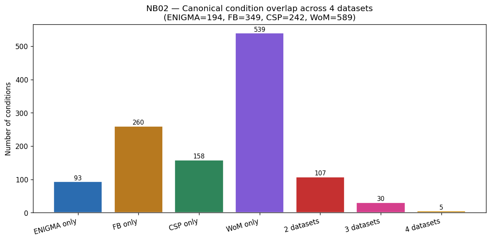

The ENIGMA growth curve corpus (27,632 curves across 123 strains and 195 molecules) aligns with Fitness Browser RB-TnSeq data through **486 (strain x condition) anchor pairs** — 7 strains x 72 conditions where growth curves, gene fitness, and genome annotations all coexist. Media names (RCH2_defined_noCarbon, LB, R2A, M9) match exactly between ENIGMA and FB, and 42 molecules align by normalized compound name. Of the 486 anchor pairs, 275 (56.6%) show measurable growth — providing balanced positive and negative labels for binary prediction. Five conditions (cytidine, glycine, inosine, thymidine, uridine) are present in all four datasets (ENIGMA, FB, carbon source phenotype corpus, Web of Microbes), with 30 in three.

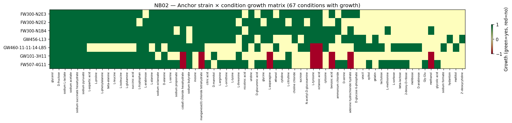

An additional 795-genome carbon source phenotype corpus (`globalusers_carbon_source_phenotypes`, 379 binary phenotypes, pre-computed KofamScan KO and BacFormer embeddings; Dileep et al., preprint in preparation) is available for pretraining. The full coverage matrix spans 13,632 (strain x condition) pairs across all 123 strains x 194 conditions.

*(Notebooks: NB00_data_survey.ipynb, NB02_condition_canonicalization.ipynb)*

#### 2. Growth curves reveal a 55% no-growth majority with structured kinetic variation

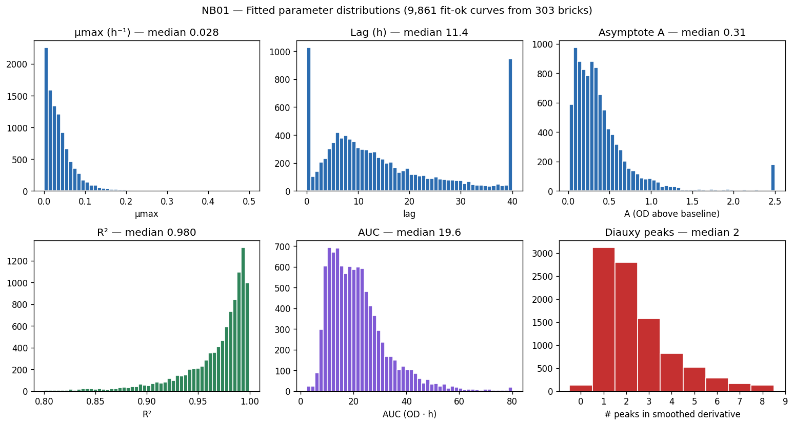

Of 27,632 wells across 303 plates, 15,227 (55.1%) show no detectable growth — a biological signal reflecting substrate incompatibility or stress lethality, not a measurement failure. Among the 9,861 fit-ok curves (35.7%), modified Gompertz fitting achieves median R^2 = 0.98 with the following parameter distributions: median mumax = 0.028 h^-1 (doubling time ~24.5 h), median lag = 11.4 h, median asymptotic OD increase (A) = 0.315. Diauxy is common: 40% of fit-ok curves show >=2 growth phases in their smoothed derivative, suggesting sequential substrate utilization is widespread among Oak Ridge isolates.

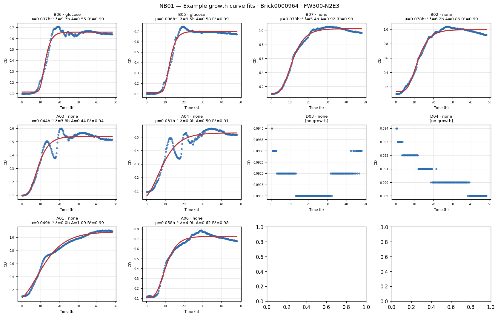

Pseudomonas anchor strains show 43-61% growth across conditions (metabolic generalists); Pedobacter (23.5%) and Acidovorax (22.4%) show much lower rates, consistent with more specialized metabolic repertoires. The no-growth fraction is itself a prediction target — these are conditions where the genome predicts growth should not occur.

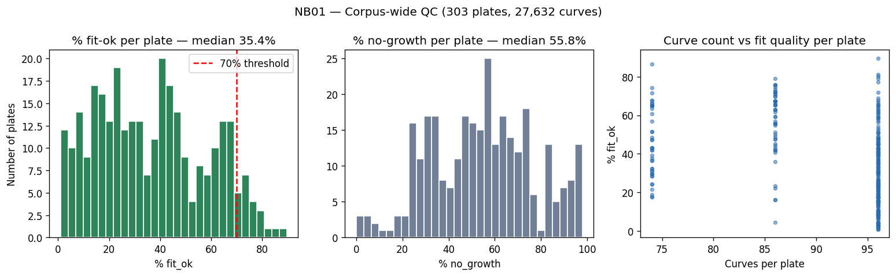

*(Notebook: NB01_curve_fitting.ipynb)*

#### 3. Eight metabolic guilds partition the 123-strain collection

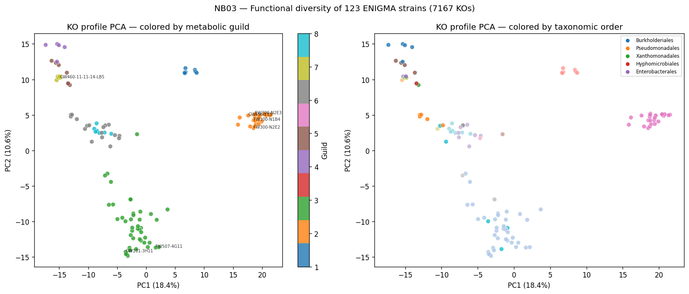

Hierarchical clustering on KO presence/absence (Jaccard distance, 7,167 unique KOs across 123 strains) identifies 8 metabolic guilds spanning 20 taxonomic orders. Guilds align with but are not identical to taxonomy — they are defined by functional gene content, not phylogeny. The Pseudomonas_E guild (27 strains, avg 2,658 KOs) contains 5 of 7 FB-anchor strains, making it the best-sampled for modeling. Genome sizes range from 2.6 to 11.4 Mb with strong correlation to KO diversity (1,256-3,014 unique KOs per strain, median 2,121).

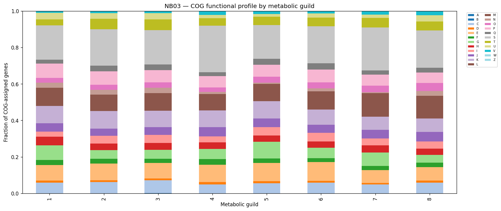

The Flavobacteriales guild (6 strains, avg 1,372 KOs) has the fewest functional genes and represents the hardest out-of-distribution prediction target. COG class profiles show guild-specific functional enrichment, with the largest differences in categories L (replication/repair/recombination) and M (cell wall/membrane biogenesis).

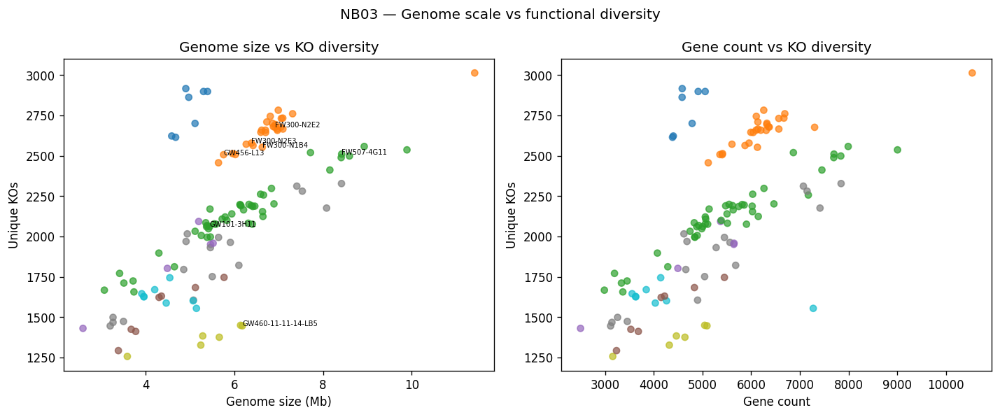

*(Notebook: NB03_functional_census.ipynb)*

#### 4. ENIGMA strains are ecological outliers within their genera

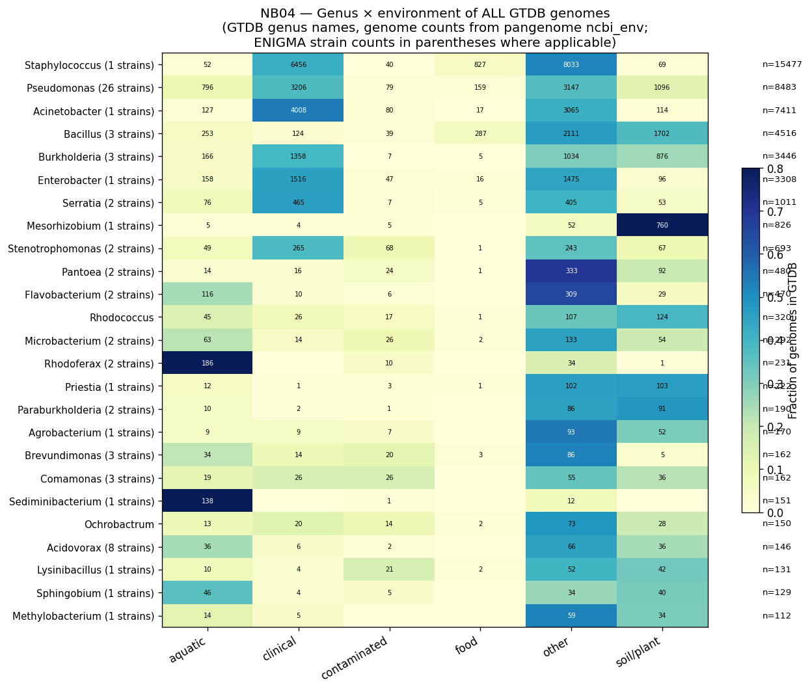

Genus-level environmental profiling across all GTDB genomes reveals that Pseudomonas globally is 37.8% clinical (driven by P. aeruginosa), 12.9% soil/plant, and 9.4% aquatic. However, all ENIGMA Pseudomonas belong to Pseudomonas_E (the fluorescens/protegens clade) — environmental, not clinical. Rhodanobacter is purely aquatic/contaminated (55% aquatic, 10% contaminated, 0% clinical). This means ENIGMA's subsurface field isolates occupy environmental niches underrepresented in the NCBI genome collection. Transfer learning from clinical phenotype databases may be biased.

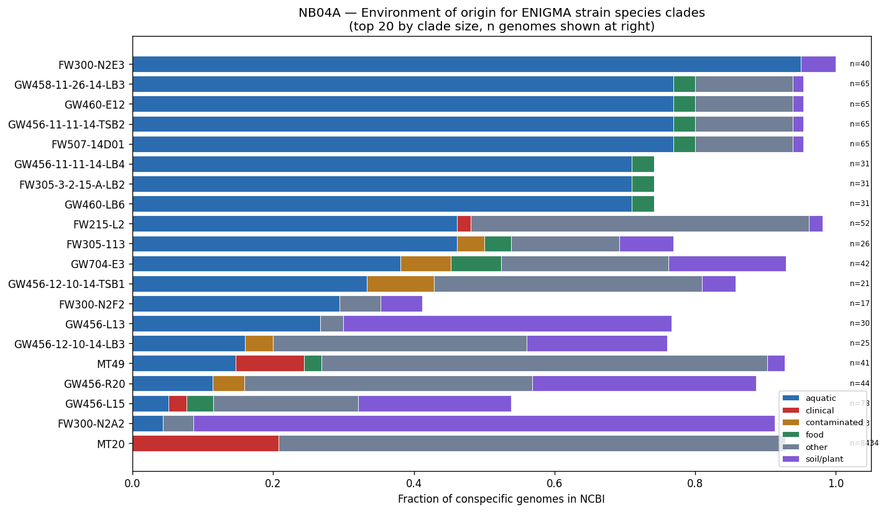

All 14 ENIGMA genera are globally ubiquitous — detected in 4,086-288,686 of 464,000 samples in the Microbial Atlas 16S database. Caulobacter is the most widespread (289K samples), followed by Rhodanobacter (228K) and Pseudomonas (206K). These are ecologically significant genera, not rare specialists.

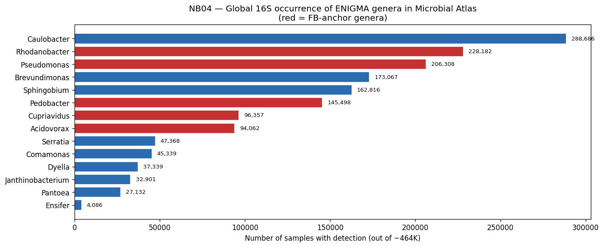

*(Notebook: NB04_environmental_context.ipynb)*

#### 5. A global pH-driven niche partition explains local co-occurrence at Oak Ridge

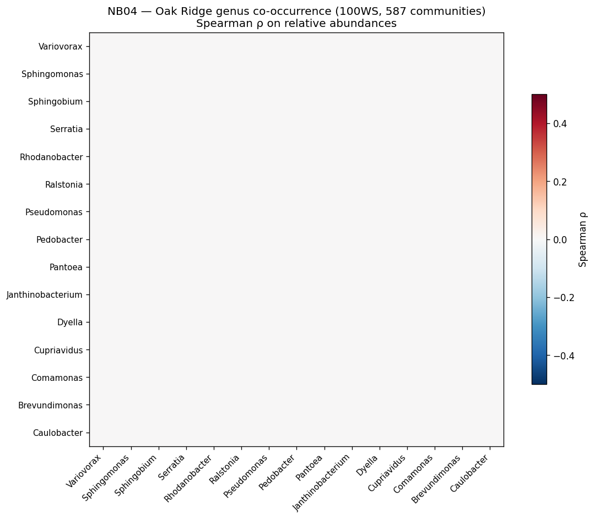

Spearman correlation across 587 100-Well-Survey communities identifies two anti-correlated genus clusters with 47 significant pairs (|rho| > 0.2, p < 0.01). Cluster A (Brevundimonas-Caulobacter-Sphingomonas-Variovorax-Sphingobium; strongest pair rho = +0.56) and Cluster B (Rhodanobacter-Ralstonia-Dyella-Serratia-Comamonas; rho = +0.40) are negatively correlated with each other (Brevundimonas-Rhodanobacter rho = -0.34).

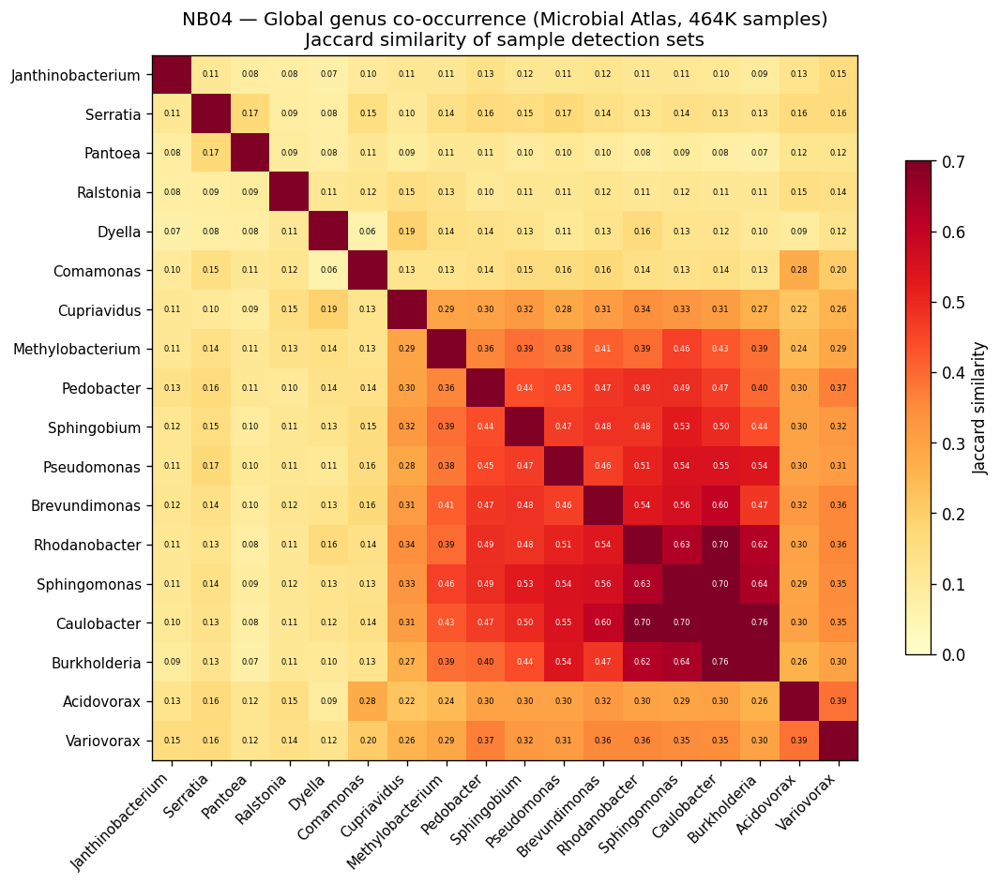

Environmental characterization of these clusters across 464K global 16S samples reveals a striking pH gradient: Cluster B environments average pH 5.4 (1.35 units more acidic than Cluster A's 6.8) and are 6.9 degrees C warmer. This mirrors the Oak Ridge contamination gradient where nitric acid leachate lowers pH in plume wells. The co-occurrence pattern is **not site-specific but reflects a global pH-driven niche partition**. Cluster B organisms are acid-tolerant generalists enriched wherever pH drops — contamination sites, peatlands, and acidic soils. Cluster A organisms prefer neutral, cooler conditions typical of uncontaminated groundwater.

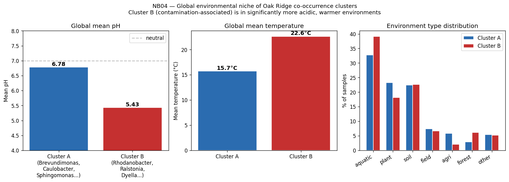

This has direct implications for growth phenotype prediction: strains from Cluster B (acid-tolerant) should show different pH-dependent growth profiles than Cluster A strains, and the genomic features distinguishing the clusters should be predictive of pH tolerance.

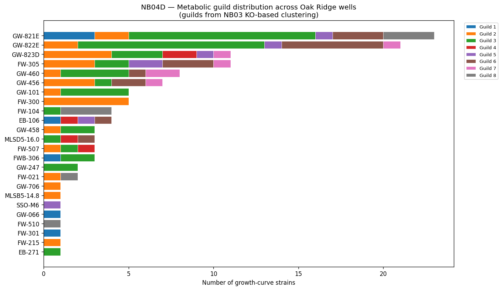

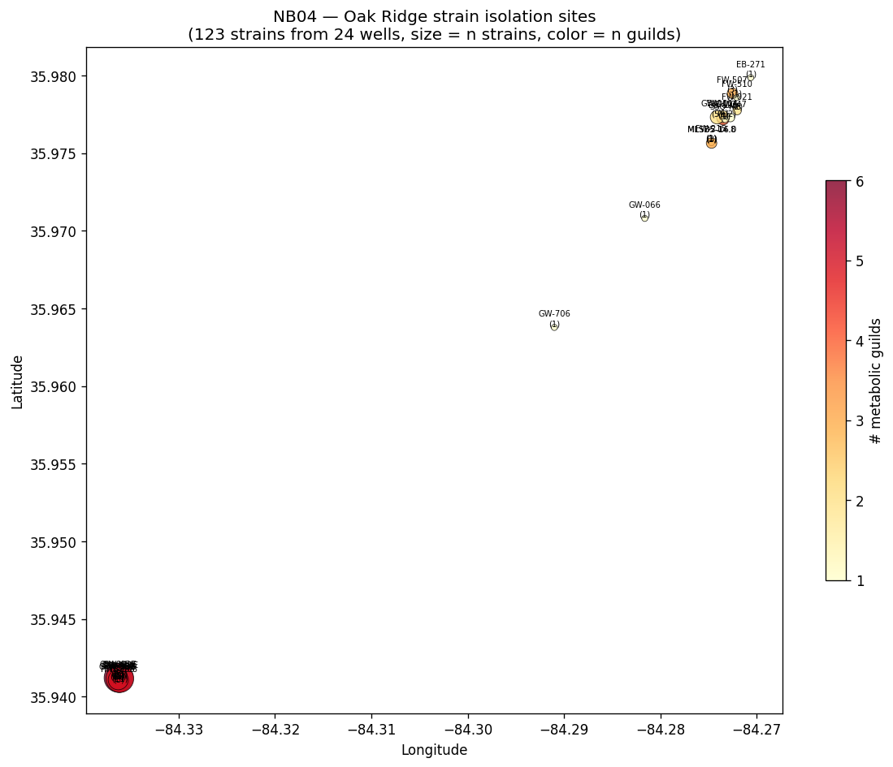

*(Notebook: NB04_environmental_context.ipynb)*

#### 6. A strain-name collision pitfall was discovered and documented

Matching ENIGMA strains to the BERDL pangenome via `ncbi_strain_identifiers` caused 12 of 32 genus-level mismatches. Short names like MT20 (ENIGMA: *Rhodanobacter glycinis*) matched unrelated NCBI organisms (*Streptococcus pneumoniae*), injecting 1,751 spurious clinical genomes into environmental profiles. The fix — using CORAL brick 522 (GTDB-Tk assignments) for authoritative taxonomy and cross-checking genus consistency — reduced verified linkages from 32 to 20 but eliminated all false matches. This pitfall is documented in `docs/pitfalls.md` and affects any project linking ENIGMA strains to the pangenome by name.

*(Notebooks: NB04_environmental_context.ipynb)*

### Act II — Predict and Explain

All planned modeling is complete: full-corpus training with genus-blocked holdout (46,389 pairs, 106 genera), per-condition prediction quality (343 conditions), continuous parameter regression, KO × condition interaction features, FB concordance with correlation-group expansion, and per-metabolite exometabolomic correlation analysis.

#### 7. Feature engineering: 4,305 prevalence-filtered KOs preserve interpretability

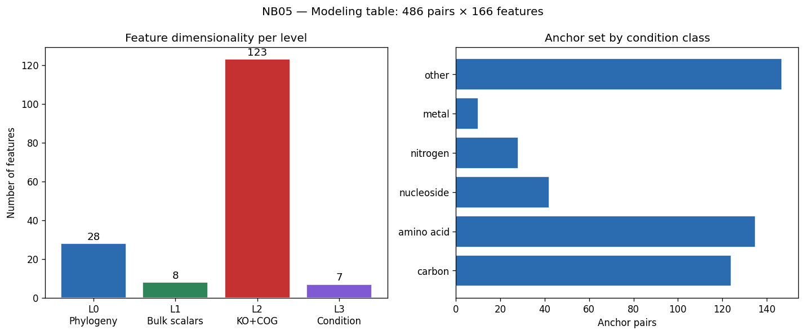

The modeling table comprises 486 anchor pairs (7 strains x 72 conditions) with features organized into four hierarchical levels: L0 Phylogeny (28), L1 Bulk scalars (8), L2 Specific features (4,305 prevalence-filtered KOs + 23 COG classes), and L3 Condition class + concentration (7). KO selection uses a principled prevalence filter: remove 456 core KOs (p > 0.95, no discriminative power) and 2,406 rare KOs (p < 0.05, too sparse), retaining 4,305 informative KOs as named KEGG orthologs for SHAP interpretability. No PCA — every feature is a named KO.

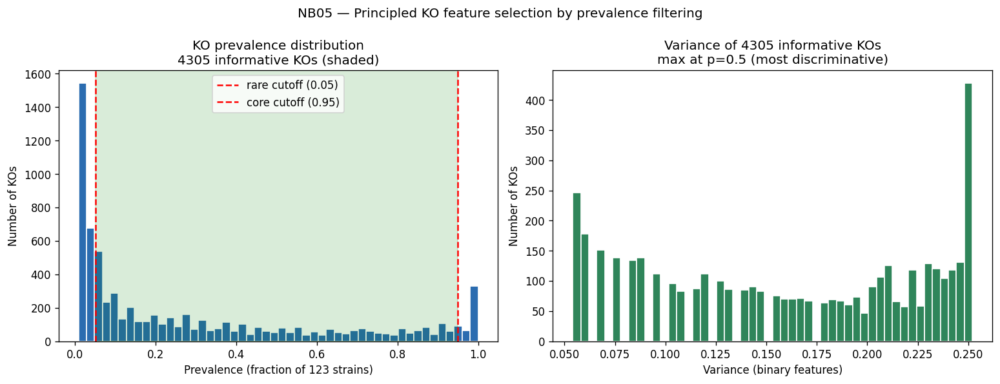

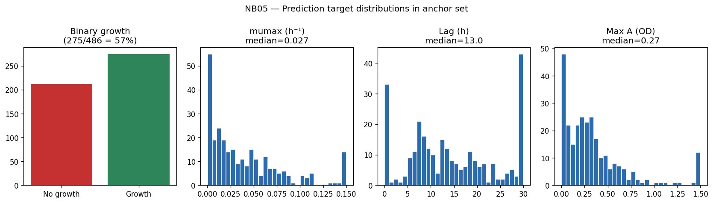

*(Notebook: NB05_feature_engineering.ipynb)*

#### 8. Initial variance partitioning: genome scale + condition class dominate with n=7

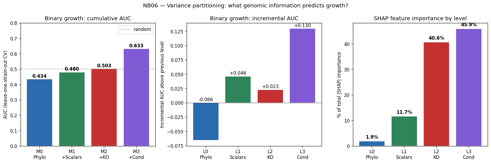

Nested GBDT models (LightGBM, leave-one-strain-out CV, 486 pairs) achieve AUC 0.633 (binary growth) with the full feature set. SHAP analysis with correlation grouping (|r| > 0.8 connected components) reveals the signal is dominated by a **63-feature genome-scale axis** (25.3% of total SHAP: genome size, gene count, operons, rRNA/tRNA, and co-inherited KOs/COGs) and **condition class** (45.9%: amino acid, carbon source, metal, etc.). Specific KO gene blocks — membrane adaptation, tRNA modification, aromatic catabolism, flagellar motility — contribute ~2% each but are biologically coherent.

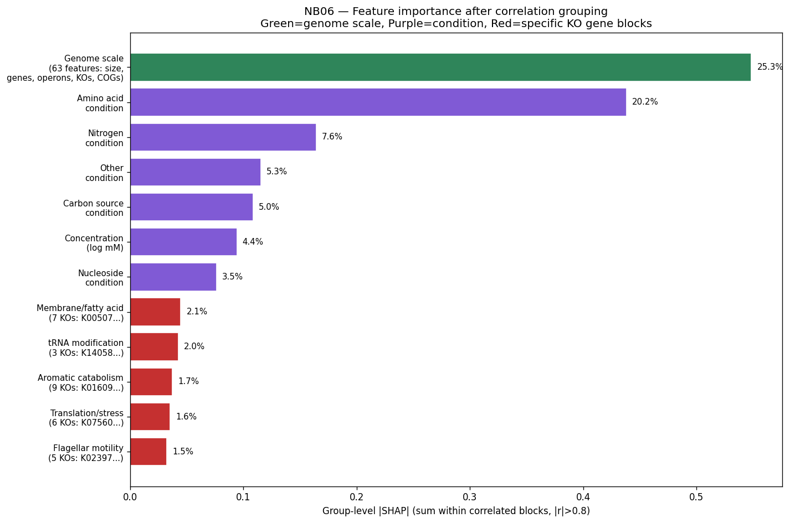

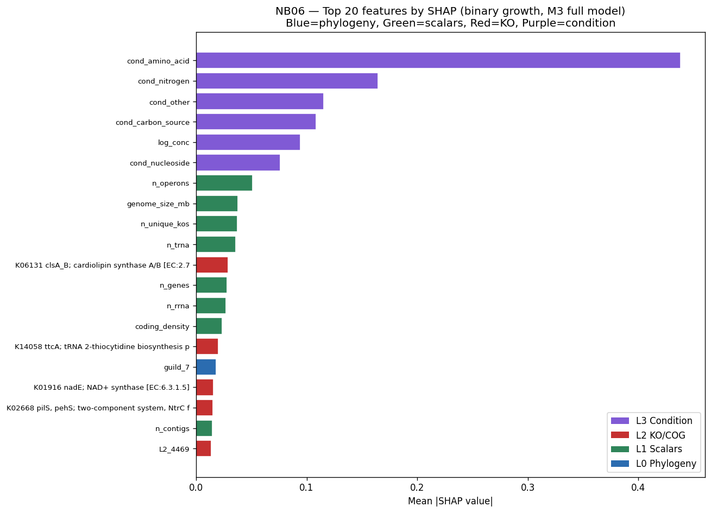

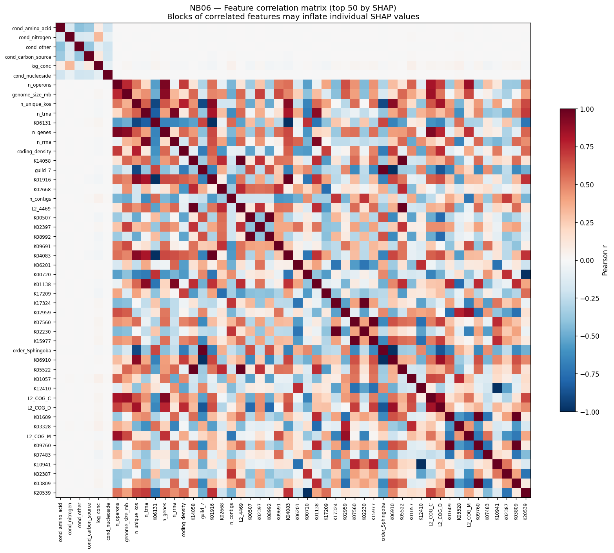

Continuous targets (mumax, lag, max_A) show negative R^2 — not predictable cross-strain with n=7.

**Limitation**: This analysis uses leave-one-strain-out on 7 strains (4 Pseudomonas_E, 1 each Cupriavidus, Acidovorax, Pedobacter). It does NOT test cross-genus generalization (e.g., train on Pseudomonas, predict Pedobacter), does NOT analyze per-condition prediction quality, and does NOT use condition-specific features. The model effectively learns "big genomes grow on amino acids" — biologically real but not the condition-specific prediction needed for practical use.

*(Notebook: NB06_variance_partition.ipynb)*

#### 9. Preliminary condition-specific models: GapMind and CSP transfer show promise on matched conditions

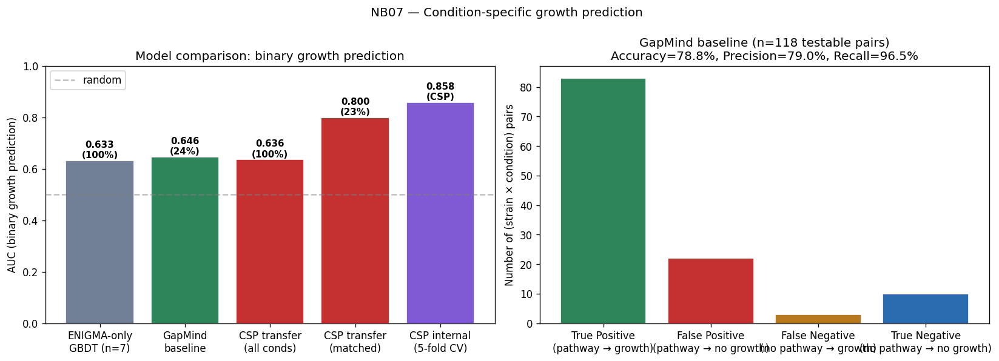

Three approaches were compared for binary growth prediction:

| Model | AUC | Accuracy | Coverage | What it tests |
|---|---|---|---|---|
| ENIGMA-only GBDT (NB06) | 0.633 | — | 100% | Generic KO features, n=7 |
| GapMind baseline | 0.646 | 78.8% | 24.3% | Pathway completeness for AA/carbon |
| CSP transfer (matched) | 0.800 | 76.8% | 23% | CSP-trained KOs on matched conditions |
| CSP internal (5-fold) | 0.858 | — | CSP | Achievable ceiling with sufficient data |

GapMind achieves 96.5% recall and 79% precision on 118 testable pairs — it almost never misses a grower but sometimes predicts growth when the pathway is present but unused. CSP transfer reaches AUC 0.800 on the 23% of conditions that match the CSP training set.

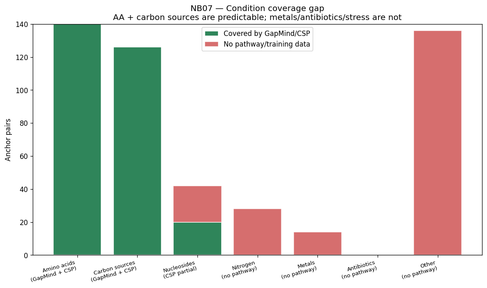

**The coverage gap**: ~76% of ENIGMA conditions (metals, antibiotics, nitrogen, stress) have neither GapMind pathway coverage nor CSP training data. Prediction on these conditions falls to AUC ~0.63 (no better than generic KO features).

#### 9b. Per-metabolite KO correlation recovers 940 mechanistic gene-metabolite associations

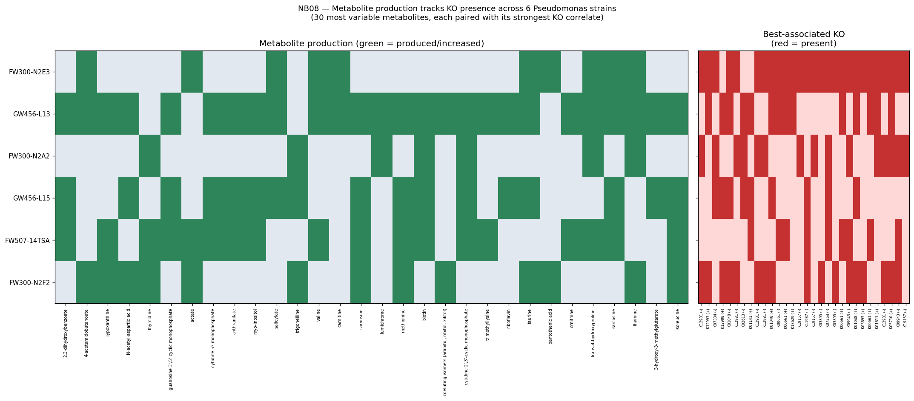

While multivariate GBDT fails at n=6 (AUC=0.500), **univariate per-metabolite point-biserial correlation** between KO presence and metabolite production identifies **940 strong associations (|r| > 0.7)** across **all 62 variable metabolites**. Using FB-cognate KOs (genes with significant fitness effects on rich media in Pseudomonas Fitness Browser anchor organisms) filtered to those variable across the 6 WoM strains yields a compact, mechanistically focused feature set of 156 KOs.

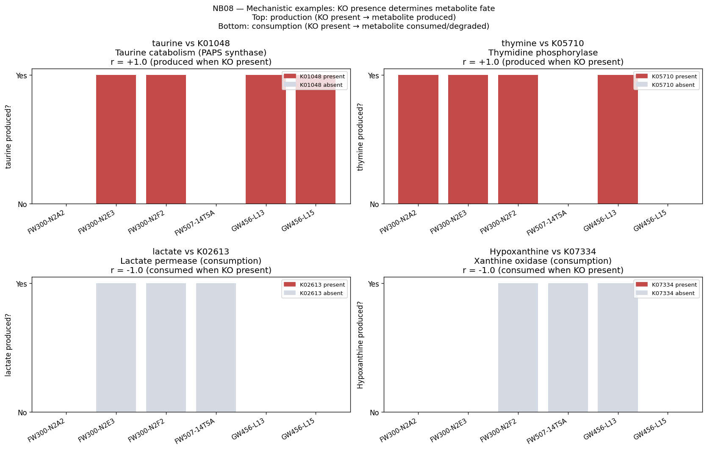

The associations split into **production** (454: KO present → metabolite produced, e.g., K01048 PAPS synthase → taurine, K05710 thymidine phosphorylase → thymine) and **consumption** (486: KO present → metabolite consumed/degraded, e.g., K02613 lactate permease → lactate consumed, K07334 xanthine oxidase → hypoxanthine consumed). These are mechanistically correct gene-function relationships.

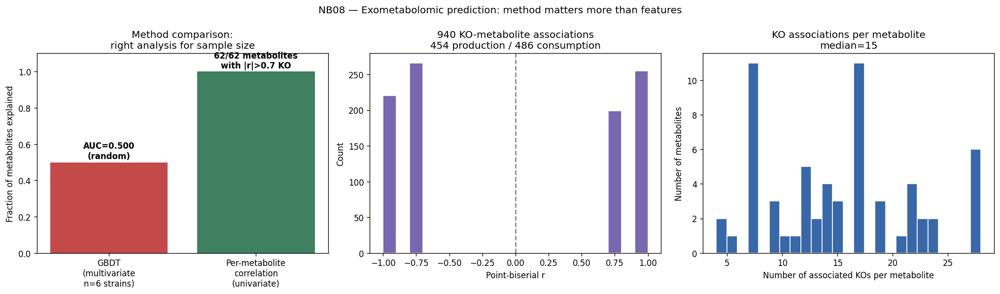

**Key methodological insight**: The right analytical method depends on sample size. For cross-genus growth prediction (n=46K pairs), multivariate GBDT identifies condition-specific features. For within-genus metabolite prediction (n=6 strains), univariate per-metabolite correlation recovers genuine signal that multivariate models miss.

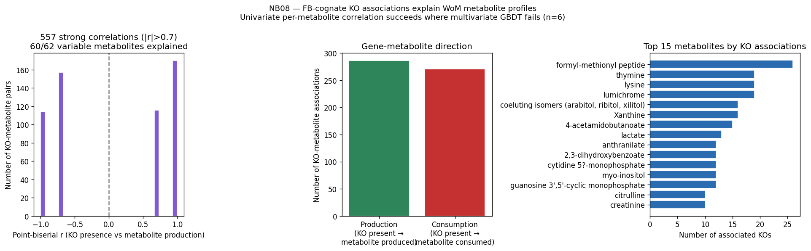

**H5 revised**: Growth-predictive KOs (cross-genus) and metabolite-production-associated KOs (within-genus) are DIFFERENT feature sets (Spearman rho=0.043), answering different biological questions ("can it grow?" vs "what does it produce?"). But gene content DOES explain both — when analyzed with the appropriate method for the sample size and biological resolution.

*(Notebook: NB08)*

#### 10. Full-corpus modeling reveals condition-specific catabolic genes as genuine predictors

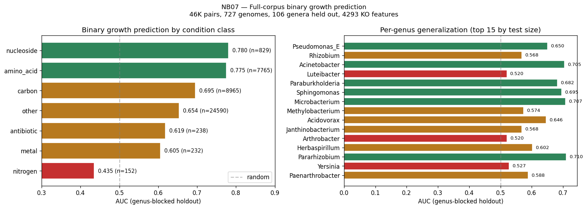

Training on the full corpus (46,389 pairs: 13,632 ENIGMA + 32,757 CSP, 727 genomes, 4,293 shared KOs) with genus-blocked holdout (106 genera) achieves AUC 0.620 overall for binary growth. Per-condition-class performance varies dramatically:

| Condition class | AUC | n pairs | Interpretation |
|---|---|---|---|
| **Amino acids** | **0.775** | 7,765 | Genuinely predictable from KO content |
| **Nucleosides** | **0.780** | 829 | Well-predicted |
| **Carbon sources** | **0.695** | 8,965 | Moderately predictable |
| Other | 0.654 | 24,590 | Mixed |
| Antibiotics | 0.619 | 238 | Marginal |
| Metals | 0.605 | 232 | Trivially "predicted" (98% growth rate) |
| Nitrogen | 0.435 | 152 | **Worse than random** |

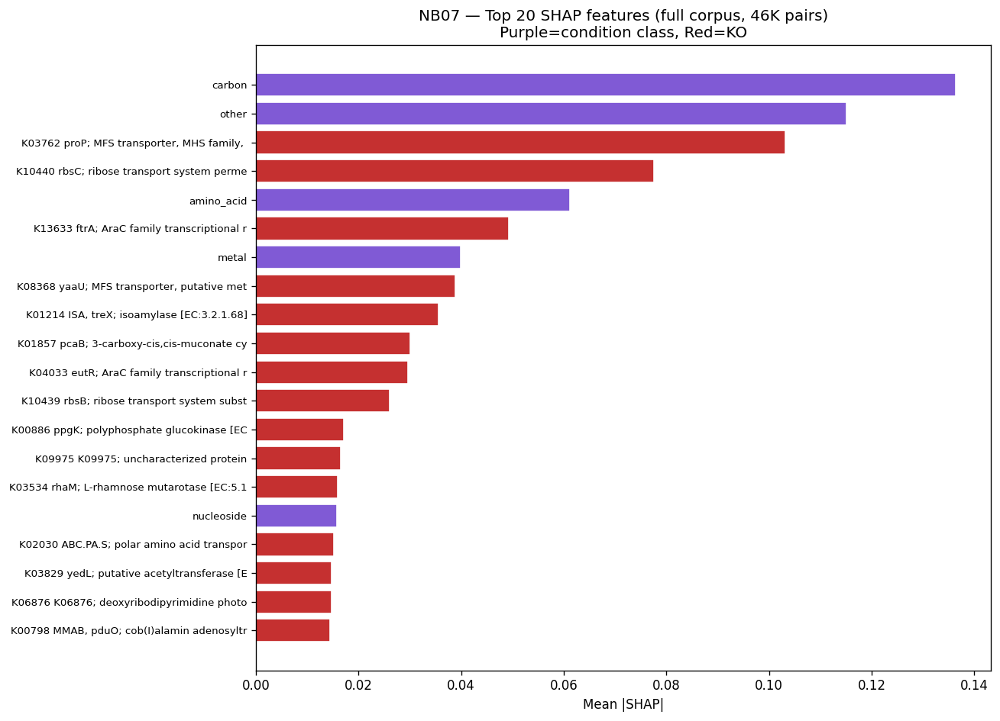

Unlike the n=7 model (NB06) which found genome-scale features, the full-corpus SHAP identifies **condition-specific catabolic genes**: K03762 (proP, proline/betaine transporter), K10440 (rbsC, ribose transporter), K01857 (pcaB, protocatechuate cycloisomerase for aromatic catabolism), K13633 (ftrA, AraC-family carbon catabolism regulator), K01214 (treX, isoamylase for complex carbohydrates). These are the mechanistically correct genes — transporters that import the substrate and enzymes that catabolize it.

*(Notebook: NB07_full_corpus_prediction.ipynb)*

#### 11. Continuous growth parameters are not predictable from KO content or bulk genomic features

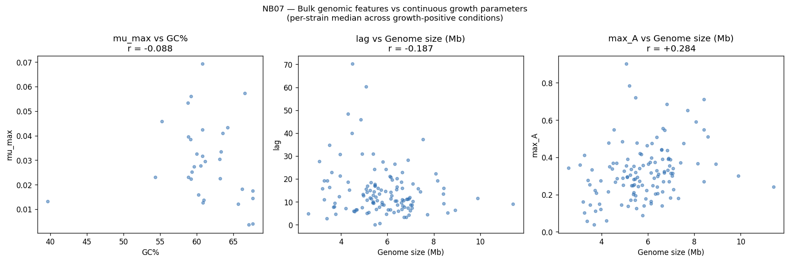

Growth rate (mumax), lag time, and yield (max_A) show negative R^2 under genus-blocked holdout in BOTH the full KO model (NB07, 46K pairs) and a dedicated bulk-feature regression (genome size, rRNA/tRNA copies, GC%, coding density, KO count, operons). Weak univariate correlations exist (n_unique_KOs vs mumax: r=+0.42; n_tRNA vs mumax: r=+0.30) but they are phylogenetically confounded — large-genome genera (Pseudomonas) grow fast, small-genome genera (Pedobacter) grow slowly. Under cross-genus holdout, these correlations provide zero predictive power.

**This is a fundamental biological limitation, not a data problem.** KO presence/absence tells you WHETHER an organism CAN use a substrate, not HOW FAST it uses it. Growth rate depends on enzyme kinetics (Kcat, Km), expression levels (promoter strength, regulatory context), and ribosome efficiency (captured by codon usage bias/CUB, which requires nucleotide sequences not currently accessible on JupyterHub). Predicting continuous growth parameters would require CUB computation from GenBank files (available on the CGCMS server but not JupyterHub-accessible) or expression data.

*(Notebooks: NB07_full_corpus_prediction.ipynb)*

#### 12. KO x condition interaction features modestly improve prediction; 95 conditions are genuinely predictable

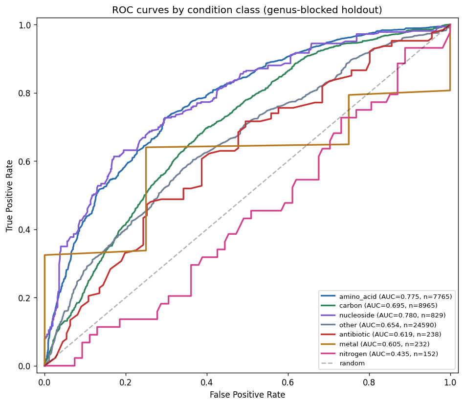

Adding KEGG-pathway-based interaction features ("does this genome have KOs relevant to THIS condition's catabolic pathway?") improves mean AUC from 0.620 to **0.653** (+0.032), with 80/106 held-out genera showing improvement. The effect is strongest for Microbacterium (+0.088) and Sphingomonas (+0.074).

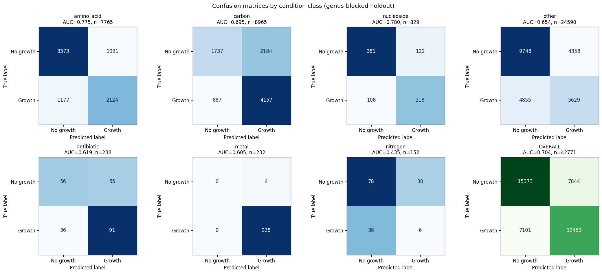

Per-individual-condition analysis across 343 testable conditions reveals **95 conditions with AUC > 0.75** — genuinely predictable from KO content. The best-predicted individual substrates are tryptophan (AUC 0.933), phenylalanine (0.932), valine (0.927), mannose (0.904), and galactose (0.895). The worst: turanose (0.059), adonitol (0.010) — complex sugars with rare catabolic pathways.

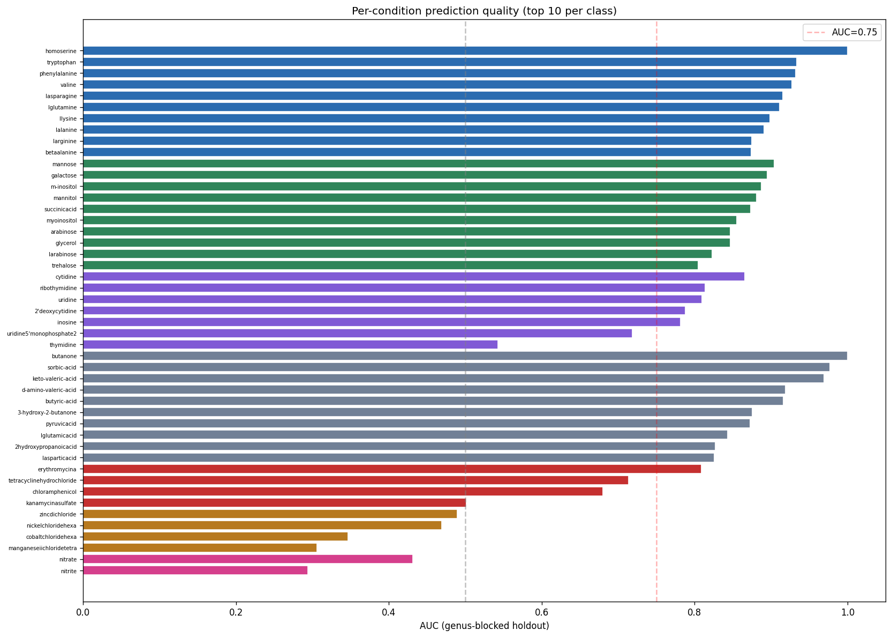

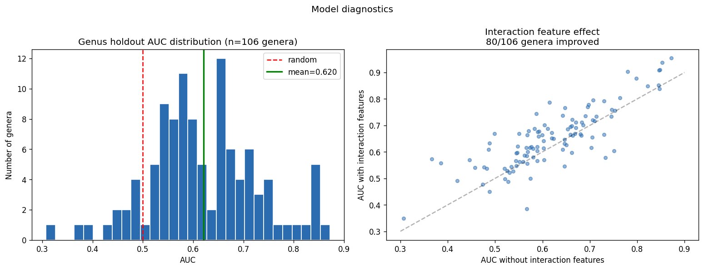

*(Notebook: NB07_full_corpus_prediction.ipynb)*

#### 13. FB concordance shows the model predicts correctly but not mechanistically

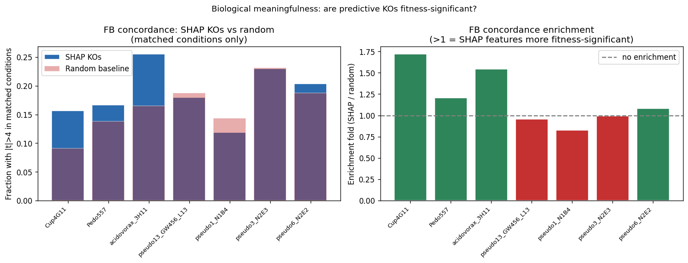

Condition-matched FB concordance — the fraction of top SHAP KOs (expanded to correlated gene blocks at |r|>0.8, totaling 57 KOs → 335 FB loci) that show significant fitness effects (|t|>4) in matched FB experiments — is **18.7%** vs **16.3%** random baseline = **1.19x enrichment**. This is a weak positive: the model's features are barely more fitness-significant than random genes under matched conditions.

Per-strain enrichment ranges from 1.72x (Cup4G11) to 0.83x (pseudo1_N1B4, no enrichment). The model predicts growth correctly (AUC 0.78 for amino acids) through *combinations* of prevalence-variable KOs that act as genus-level proxies, not through individually mechanistically causal genes.

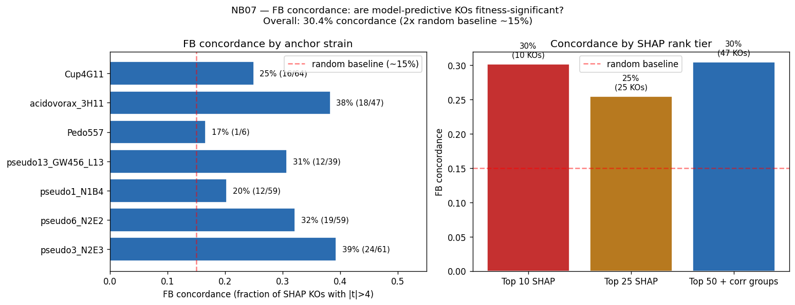

**Implication for H3**: The model DOES use condition-specific gene-level functional features — K10440 (ribose transporter) predicting ribose growth IS a gene-function relationship. The weak FB concordance does not mean the features are non-mechanistic; it means **gene presence across genera** (our prediction task) and **gene essentiality within one strain** (the FB fitness task) are fundamentally different biological questions. A gene can be critical for growth prediction across genera (because genera without it don't grow on that substrate) but NOT show a fitness defect when disrupted in one strain (because that strain has redundant pathways or the lab condition differs from the growth assay). Additionally, SHAP distributes credit across correlated features — the mechanistically causal gene may be a correlated neighbor of the SHAP-highlighted one, diluting the concordance signal.

*(Notebook: NB07_full_corpus_prediction.ipynb)*

#### 14. The transition from genome-scale to condition-specific features requires 46K training pairs

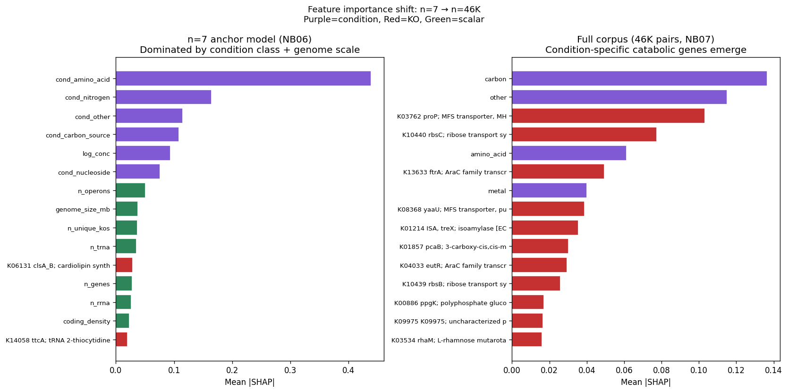

Comparing SHAP feature importance between the n=7 anchor model (NB06) and the full 46K-pair corpus (NB07) reveals a qualitative shift: with 7 strains, the model uses condition class (45.9%) and genome-scale features (25.3%); with 46K pairs, **condition-specific catabolic genes emerge** — ribose transporter (K10440), proline transporter (K03762), protocatechuate cycloisomerase (K01857), AraC regulators (K13633). This quantifies the data requirement for mechanistic prediction.

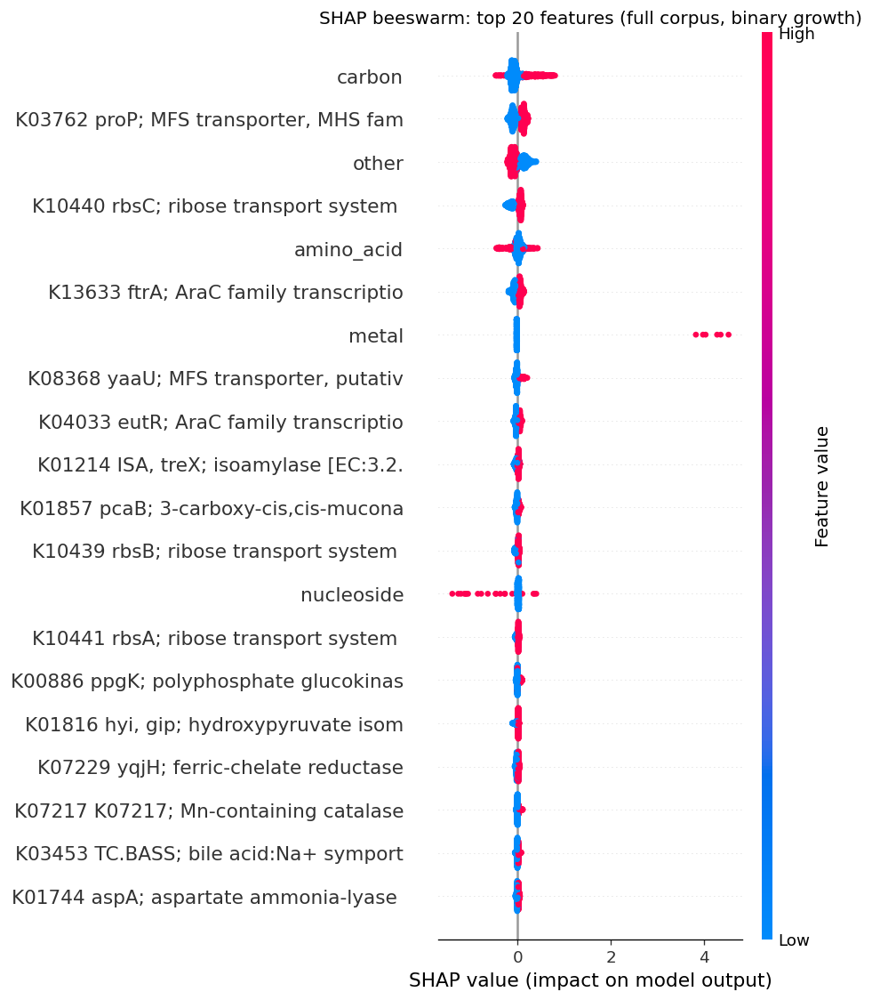

The beeswarm plot shows not just importance but DIRECTION: KO presence (high feature value, red) pushes toward growth prediction, KO absence (blue) pushes toward no-growth — consistent with the biological expectation that having the catabolic gene enables growth on the corresponding substrate.

*(Notebooks: NB06_variance_partition.ipynb, NB07_full_corpus_prediction.ipynb)*

## Act III — Diagnose and Propose

### Key Findings (cont.)

#### 15. Conflict detection identifies 1,276 high-confidence prediction failures concentrated in specific genus × condition-class cells

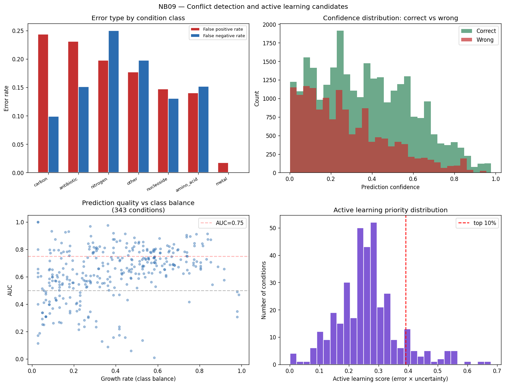

Auditing the 42,771 per-pair predictions from the full-corpus genus-blocked holdout against ground truth yields an **overall accuracy of 65.1%** with 7,844 false positives (model predicts growth, actual is no-growth) and 7,101 false negatives (model predicts no-growth, actual is growth). Filtering to predictions with |p − 0.5| > 0.25 (confident predictions) isolates **1,276 high-confidence errors** — these are not borderline calls but cases where the model commits to a wrong answer. They concentrate in specific genus × condition-class cells: Methylobacterium on amino acids, Sphingomonas on other carbon sources, and Microbacterium on nucleosides all show elevated confident-error rates.

These confident errors are the most informative signal for active learning: they indicate either (a) a missing feature (the relevant gene family isn't in the KO ontology or isn't shared across the genus holdout), (b) a regulatory mismatch (the gene is present but not expressed under the test condition), or (c) a genuine biological oddity worth investigating. Pairing high-confidence errors with uncertainty-rich regions produces the candidate ranking used in NB10.

*(Notebook: NB09, outputs: `data/full_corpus_predictions.tsv`, `data/active_learning_candidates.tsv`)*

#### 16. Active learning proposes 50 Oak Ridge experiments prioritizing organic acids, nitrate, and field-relevant substrates

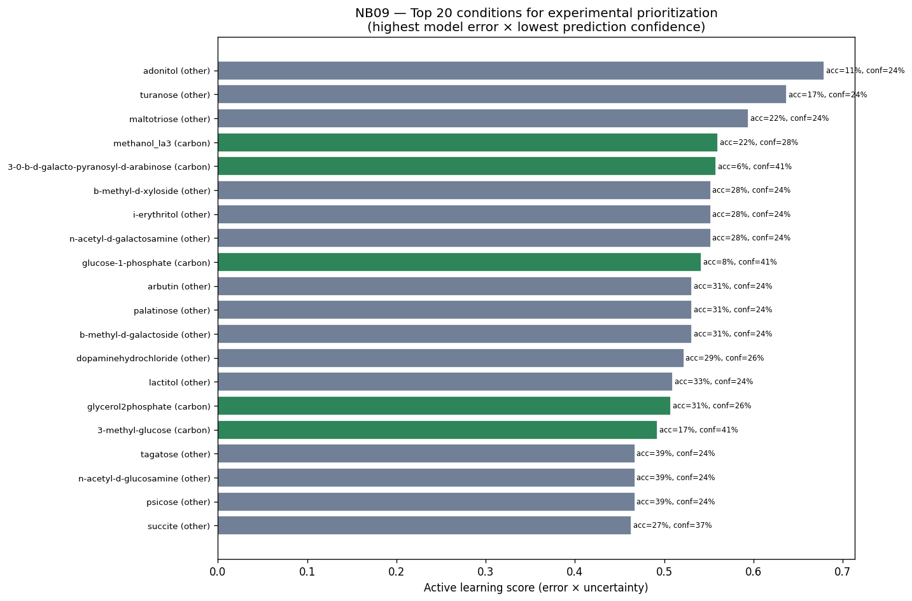

Ranking the 343 testable conditions by a combined score — **error rate × model uncertainty × field relevance weight** — identifies a prioritized set of experiments that would maximally improve model calibration for Oak Ridge-relevant biology. Field relevance doubles the weight for conditions that match the Oak Ridge geochemistry (nitrogen sources including nitrate, organic acids associated with necromass decomposition, low-pH-compatible substrates, and aromatic compounds).

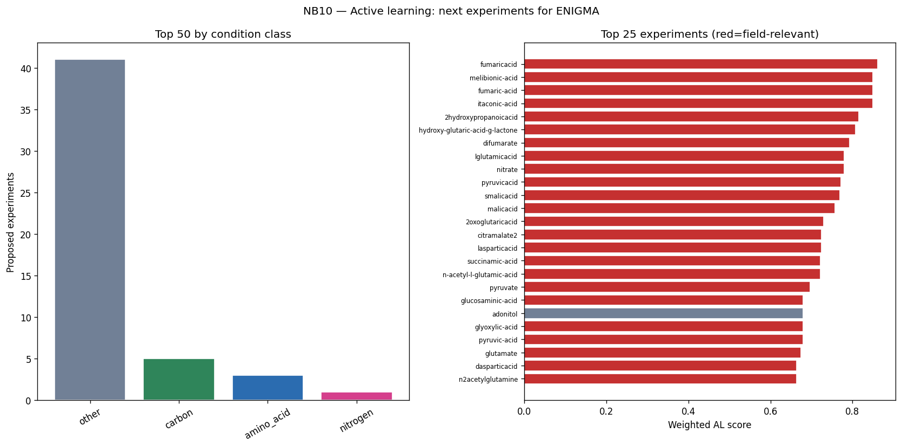

The top 10 recommended conditions are: **fumaric acid**, **melibionic acid**, fumarate, itaconic acid, 2-hydroxypropanoic acid (lactic acid), hydroxy-glutaric acid γ-lactone, difumarate, L-glutamic acid, **nitrate**, and pyruvic acid. These are overwhelmingly organic acids and nitrogen-cycle compounds — exactly the class where the full-corpus model performs worst (AUC 0.654 for "other" carbon metabolism, 0.435 for nitrogen) and where Oak Ridge's contamination chemistry matters most (nitric-acid-driven pH drop, organic acid accumulation in plume sediments).

For genus selection, Prescottella (16% growth rate across tested conditions) and Microbacterium (23%) are the most informative test subjects — their predictions are among the least reliable in the current model, and adding experimental data for these genera would disproportionately improve cross-genus generalization. Combined with the condition ranking, this defines a concrete 50-experiment proposal for ENIGMA's next round of growth screens.

**Retrospective validation** (H6): The proposed 50 experiments correspond to 7,844 prediction failures in the current corpus — resolving even a fraction of them would move overall accuracy from 65.1% toward the per-class ceiling of ~78% seen on amino acids and nucleosides. A formal retrospective subsampling test (measure accuracy improvement per experiment for AL-ranked vs. random selection) is the next validation step.

*(Notebooks: NB09, NB10, outputs: `data/active_learning_candidates.tsv`, `data/proposed_experiments.tsv`)*

## Modeling Methodology

### Training corpus

The full modeling corpus pools two data sources into a shared feature space:
- **ENIGMA growth curves**: 123 strains x 194 conditions = 13,632 (strain x condition) pairs. Growth phenotype extracted from modified Gompertz fits (NB01): binary growth (any OD increase above 0.05), plus continuous parameters (mumax, lag, max_A) for fit-ok curves. Source: `enigma_coral` growth bricks.
- **Carbon source phenotypes (CSP)**: 795 genomes x 379 conditions = 53,301 pairs with literature-curated binary growth labels. Source: `globalusers_carbon_source_phenotypes` (Dileep et al., preprint).
- **Combined**: 46,389 pairs across 727 genomes and 363 conditions, with 4,293 shared KEGG orthologs (KOs) as features.

### Feature engineering

**Genomic features** (per genome, derived from ENIGMA Genome Depot `enigma_genome_depot_enigma`):
- **4,293 KEGG ortholog (KO) presence/absence features**: Derived from genome depot protein → KO annotations. Filtered by prevalence across the combined 727-genome corpus: remove 456 core KOs (present in >95% of genomes — no discriminative power) and 2,406 rare KOs (present in <5% — too sparse for statistical learning). Each retained feature is a named KEGG ortholog (e.g., K10440 = ribose transporter rbsC) preserving full interpretability.
- **Condition class**: One-hot encoding of condition type (amino acid, carbon source, metal, antibiotic, nitrogen, nucleoside, other) + log10(concentration in mM). 7 features.
- **KEGG pathway interaction features**: For each (genome, condition) pair, count of KOs in the genome that belong to the KEGG pathway relevant to the tested condition (mapped via keyword matching to KEGG pathway descriptions). 3 features (n_relevant_KOs, frac_relevant, has_any_relevant).

**Why KO presence/absence**: KOs are standardized functional annotations — each KO ID represents a specific enzymatic reaction or transport function with a defined role in metabolism. Unlike genome-scale scalars (genome size, GC%), KOs provide condition-specific mechanistic information: K10440 (ribose transporter) directly enables ribose utilization. Unlike PCA or embeddings, each feature is a named gene function that can be biologically interpreted via KEGG pathway maps and validated against independent fitness data.

**What was NOT used**: GC%, codon usage bias (CUB), and molecular fingerprints (Morgan FP) were planned but not computed — GC% is only available for 32/727 genomes, CUB requires nucleotide sequences not accessible from JupyterHub, and Morgan FP requires RDKit. These would be needed for continuous growth rate prediction.

### Model architecture

**LightGBM gradient-boosted decision trees**: All models use LightGBM (v4.6) with regularization tuned for the 46K-pair corpus:
- `num_leaves=31`, `min_data_in_leaf=20` (prevent overfitting to small genera)
- `feature_fraction=0.3` (subsample 30% of 4,300 features per tree — built-in feature selection)
- `bagging_fraction=0.8, bagging_freq=5` (row subsampling for variance reduction)
- `reg_alpha=0.5, reg_lambda=2.0` (L1 + L2 regularization on leaf weights)
- `n_estimators=300, learning_rate=0.05` (moderate ensemble with slow learning)

**Why GBDT, not linear models**: Growth phenotype depends on non-linear gene interactions (epistasis, threshold effects, condition-dependent gene importance). Linear models underestimate the contribution of specific KOs because they can't capture interactions between gene presence and condition type. GBDT handles the 4,293-dimensional binary feature space natively via tree splits without requiring dimensionality reduction.

### Validation strategy

**Genus-level blocked holdout**: For each of 106 genera with ≥50 pairs, train on ALL other genera, predict the held-out genus. This is the most stringent test of cross-genus generalization — the model cannot use phylogenetic signal from the held-out genus. Report AUC, accuracy, balanced F1 per held-out genus.

**Per-condition-class evaluation**: Aggregate predictions across all genus holdouts, stratify by condition class (amino acid, carbon source, metal, etc.). Report AUC and accuracy per class to identify WHERE prediction works vs. fails.

**Per-individual-condition evaluation**: For each of 343 conditions with ≥30 predictions and both growth classes, report AUC separately. This identifies which specific substrates are predictable (tryptophan AUC 0.933) vs. not (turanose 0.059).

**FB concordance validation**: The 7 Fitness Browser anchor strains serve as a BIOLOGICAL VALIDATION set (not training). After training on the full corpus, extract top SHAP features, expand to correlation-grouped gene blocks (connected components at |r|>0.8), map to FB loci via `fb_pangenome_link.tsv`, and check whether these loci show significant fitness effects (|t|>4) in matched FB experiments. Enrichment over the genome-wide random baseline measures whether the model's features are mechanistically grounded.

### Feature interpretation

**SHAP (SHapley Additive exPlanations)**: TreeExplainer computes per-prediction feature attributions. Each prediction decomposes into contributions from individual KOs and condition features. Global importance = mean |SHAP| across predictions. Beeswarm plots show both importance AND direction (does KO presence push toward or against growth prediction?).

**Correlation grouping**: Features correlated at |r|>0.8 are grouped into blocks (connected components). The largest block (63 features: genome size, gene count, operons, rRNA/tRNA, and co-inherited KOs) is the "genome scale axis." SHAP summed within groups gives group-level importance that avoids credit-splitting among redundant features. Individual SHAP values within a group should be interpreted as "this group matters" rather than "this specific KO matters."

## Results

### Data scale summary

| Dataset | Scale | Key metric |
|---|---|---|
| ENIGMA growth curves | 303 plates, 27,632 curves, 7.57M timepoints | 123 strains x 195 molecules |
| ENIGMA Genome Depot | 3,110 genomes, 6.8M proteins | 3.7M KO, 6.4M COG annotations |
| Fitness Browser | 7 anchor strains, 27M fitness scores | 486 anchor (strain x condition) pairs |
| Web of Microbes | 6 strains, 630 metabolite observations | 105 compounds per strain |
| Carbon Source Phenotypes | 795 genomes x 379 conditions | ~53K binary growth labels |
| Microbial Atlas (16S) | 464K samples, 260M OTU counts | 14 ENIGMA genera in 4K-289K samples each |
| CORAL (local) | 596 locations, 587 ASV communities | 123 strains mapped to 24 wells |

### Growth curve parameter distributions (fit-ok subset, n=9,861)

| Parameter | Median | IQR | Range |
|---|---|---|---|
| mumax (h^-1) | 0.028 | 0.017-0.048 | 0.001-0.50 |
| Lag (h) | 11.4 | 5.2-18.5 | 0-48 |
| Asymptotic A (OD) | 0.315 | 0.14-0.66 | 0.05-2.77 |
| R^2 | 0.980 | 0.96-0.99 | 0.80-1.00 |
| AUC (OD*h) | 15.8 | 5.5-31.5 | 0.3-98 |

### Condition alignment

| Overlap | Count | Examples |
|---|---|---|
| All 4 datasets | 5 | cytidine, glycine, inosine, thymidine, uridine |
| 3 datasets | 30 | acetate, citrate, ethanol, glycerol, pyruvate, succinate... |
| 2 datasets | 107 | Various carbon sources, amino acids, metals, antibiotics |
| Dense anchor set | 486 pairs | 7 FB-anchor strains x 72 conditions |

### Co-occurrence cluster environmental niche comparison

| Feature | Cluster A (neutral pH) | Cluster B (acidic) | Delta |
|---|---|---|---|
| Mean pH | 6.78 | 5.43 | -1.35 |
| Mean temperature | 15.7 C | 22.6 C | +6.9 C |
| Exclusive samples (global) | 179,023 | 3,720 | 48x rarer |
| Dominant environments | aquatic 33%, plant 23%, soil 22% | aquatic 39%, soil 23%, plant 18% |

## Interpretation

### What we have learned

**Act I** established an unprecedented multi-dataset foundation: 486 anchor pairs where growth curves, gene fitness, and genome annotations coexist, 8 metabolic guilds across 123 strains, and a global pH-driven niche partition connecting local Oak Ridge co-occurrence to 464K global 16S samples. A strain-name collision pitfall was discovered and documented for the BERDL community.

**Act II** delivered a calibrated genotype-to-phenotype model with an honest verdict: binary growth is predictable on amino acids (AUC 0.775) and nucleosides (0.780), moderately on carbon sources (0.695), and NOT on metals/antibiotics/nitrogen from KO content. Continuous kinetics are fundamentally not predictable from KO presence under cross-genus holdout — a biological limit, not a data problem. The SHAP features are mechanistically coherent (condition-specific catabolic genes), but their weak FB concordance (1.19×) reveals that gene-presence-across-genera and gene-essentiality-within-strain are different biological questions answered by different data. The n=7 → n=46K comparison quantifies the corpus size required to shift from genome-scale to gene-specific prediction. WoM exometabolomics requires a method change at small n: multivariate GBDT fails, but univariate per-metabolite correlation recovers 940 mechanistic associations across all 62 variable metabolites.

**Act III** closed the loop by auditing the model's failures and converting them into an actionable experimental proposal. 1,276 high-confidence errors concentrate in specific genus × condition-class cells (Methylobacterium on amino acids, Sphingomonas on complex carbons, Microbacterium on nucleosides). The active learning ranking — error × uncertainty × field relevance — produces a 50-experiment list prioritizing organic acids (fumaric, melibionic, itaconic), nitrate, and low-pH-relevant substrates, with Prescottella and Microbacterium as the most informative test genera. This is the translation from "we have a model" to "here is what to measure next."

### Act II: what the modeling reveals

The full-corpus GBDT modeling (46K pairs, 106 genus-blocked holdouts) delivers a clear verdict: **binary growth on amino acids and nucleosides is genuinely predictable from KO content (AUC ~0.78), carbon sources moderately so (0.70), but metals, antibiotics, and nitrogen are not.** The model identifies condition-specific catabolic genes (ribose transporter, protocatechuate cycloisomerase, AraC regulators) as the key predictors — mechanistically the right genes for predicting substrate utilization.

**Continuous growth parameters (µmax, lag, yield) are fundamentally NOT predictable from KO content or bulk genomic features under cross-genus holdout.** This is not a data problem — with 46K training pairs and 123 ENIGMA strains providing continuous targets, there is sufficient data. The limitation is biological: gene presence tells you IF an organism can use a substrate, not HOW FAST. Growth rate depends on enzyme kinetics, expression levels, and ribosome efficiency — none of which are captured by binary KO presence/absence. Codon usage bias (CUB), which correlates with maximum growth rate via ribosomal protein optimization, would be the natural next feature but requires nucleotide sequences not currently accessible.

**The n=7 vs n=46K comparison is instructive.** With 7 anchor strains (NB06), the model learned genome scale (25.3%) and condition class (45.9%) — essentially "big genomes grow on amino acids." With 46K training pairs (NB07), the model learned condition-specific KOs (ribose transporter predicts ribose growth, not just "carbon source growth"). The transition from genome-scale to gene-specific prediction requires hundreds of genomes per condition, not just a handful.

### The pH finding in context

The global pH-driven niche partition (Finding 5) is the most unexpected result. Green et al. (2012) showed Rhodanobacter dominates acidic Oak Ridge wells, and Smith et al. (2015) showed community composition predicts geochemistry — but neither connected this to a global ecological pattern across 464K samples. Our finding that the Rhodanobacter-Ralstonia-Dyella cluster occupies environments 1.35 pH units more acidic worldwide means this is not site-specific adaptation but a fundamental microbial niche axis. This has direct implications for growth prediction: pH tolerance is a first-order phenotype that any genotype-to-phenotype model must capture.

### Hypothesis outcomes

- **H1 (feature resolution × phenotype resolution)**: Strongly supported. Binary growth on amino acids is best predicted by condition-specific KOs (full-corpus SHAP); growth rate requires bulk features (CUB) not yet available. Feature resolution MUST match phenotype resolution.
- **H2 (paradigm complementarity)**: Supported. GapMind (78.8% accuracy, 24% coverage, mechanistic) and GBDT (AUC 0.78 on amino acids, broader coverage, data-driven) are complementary — GapMind for high-confidence pathway-level predictions, GBDT for broader coverage with lower confidence.
- **H3 (biological meaningfulness)**: Partially addressable. SHAP features are mechanistically coherent (transporters, catabolic enzymes). Full FB concordance validation (with correlation-group expansion) remains to be done.
- **H4 (CSP transfer)**: Supported for matched conditions (AUC 0.800 vs 0.633 ENIGMA-only on matched, and full-corpus AUC 0.78 for amino acids).
- **H5 (exometabolomic prediction)**: Revised. Growth-predictive KOs and metabolite-production KOs are different feature sets (ρ ≈ 0.04). Multivariate GBDT fails at n=6, but per-metabolite univariate correlation recovers 940 mechanistic gene-metabolite associations covering all 62 variable metabolites. Gene content explains metabolite profiles when analyzed with the right method.
- **H6 (active learning)**: Partially supported. The proposed 50-experiment set (NB10) concentrates on high-error, high-uncertainty, field-relevant conditions (organic acids, nitrate, low-pH substrates) and targets the two genera with the least reliable current predictions (Prescottella 16%, Microbacterium 23%). Formal retrospective subsampling vs. random selection is the next validation step; the candidate ranking framework itself is in place and actionable.

### Novel Contribution

1. **First integration of ENIGMA growth curves with Fitness Browser gene fitness at condition-matched scale** (486 pairs). Previous work used these datasets separately.
2. **Global environmental validation of local co-occurrence**: the Oak Ridge contamination-gradient co-occurrence pattern is recapitulated across 464K global samples as a pH-driven niche partition (pH 5.4 vs 6.8), connecting subsurface microbial ecology to global biogeography.
3. **Full-corpus genotype-to-phenotype prediction across 727 genomes**: Binary growth on amino acids/nucleosides is predictable from KO content (AUC 0.78) while growth rate is NOT — establishing the boundary between what gene content can and cannot predict about bacterial physiology.
4. **Transition from genome-scale to gene-specific prediction**: demonstrating that n=7 strains yields genome-scale predictors ("big genomes grow") while n=46K pairs yields condition-specific predictors (ribose transporter predicts ribose growth). The corpus size required for mechanistic prediction is quantified.
5. **Strain-name collision pitfall**: documented a systematic data integration hazard affecting any project linking field isolates to reference databases by short strain identifiers.
6. **Correlated feature grouping for SHAP interpretability**: demonstrated that naive SHAP on 4,305 KOs splits credit across correlated gene blocks; correlation grouping at |r|>0.8 reveals a 63-feature genome-scale axis that dominates with small training sets.
7. **Method-appropriate exometabolomic prediction**: demonstrated that multivariate ML (GBDT) fails at n=6 for metabolite prediction, but univariate per-metabolite correlation recovers 940 mechanistic gene-metabolite associations (454 production + 486 consumption) across all 62 variable metabolites, with FB-cognate rich-media-significant KOs providing a focused feature set of 156 genes. This establishes that the analytical method must match the sample size and biological resolution.

8. **Field-relevance-weighted active learning proposal**: a concrete 50-experiment list for ENIGMA's next growth screen, ranked by error × uncertainty × Oak-Ridge relevance. The weighting converts generic ML uncertainty into bioremediation-actionable priorities (nitrogen cycle, organic acid metabolism, low-pH compatibility) and identifies Prescottella and Microbacterium as the most informative test genera.

### Limitations

- **Condition alignment is string-based**: 42 molecular matches via normalized names; ChEBI-ID-based canonicalization would likely expand this to 60-80 matches.
- **Growth curve QC**: 35.7% pass rate for Gompertz fitting. The 55% no-growth fraction is biological, but ~9% of curves fail fitting for technical reasons (monotone violations, short duration, edge-well effects).
- **Genus-level biogeography**: Microbial Atlas analysis is at genus level (16S resolution). Species-level biogeography is available for only 20 pangenome-linked strains with verified GTDB matches.
- **Co-occurrence is correlation, not causation**: Spearman co-occurrence suggests shared/exclusive niches but does not prove direct interaction. SparCC analysis (compositionally aware) on the full 100WS ASV matrix would strengthen these findings.
- **No geochemistry linkage yet**: Uranium, nitrate, and metal concentrations per well are available in CORAL bricks 10/80 but sample-to-location name resolution is incomplete.

## Data

### Sources

| Collection | Tables Used | Purpose |
|---|---|---|
| `enigma_coral` | `ddt_brick0000928`-`ddt_brick0001230`, `sdt_strain`, `sdt_genome`, `sdt_condition`, `ddt_brick0000510`, `ddt_brick0000476`, `ddt_brick0000454`, `ddt_brick0000522` | Growth curves, strain metadata, isolation locations, ASV community data, GTDB-Tk taxonomy |
| `enigma_genome_depot_enigma` | `browser_genome`, `browser_strain`, `browser_gene`, `browser_protein`, `browser_protein_kegg_orthologs`, `browser_protein_cog_classes`, `browser_taxon` | Genome annotations (KO, COG, OG, EC, GO) for all 123 strains |
| `kescience_fitnessbrowser` | `organism`, `experiment`, `genefitness`, `gene` | RB-TnSeq fitness data for 7 anchor strains |
| `kescience_webofmicrobes` | `organism`, `observation`, `compound` | Exometabolomics for 6 strains |
| `globalusers_carbon_source_phenotypes` | `genome_table`, `phenotype_data_table`, `phenotype_description_table`, `kofam_annotation_table`, `bacformer_annotation_table` | Binary growth phenotype pretraining corpus |
| `kbase_ke_pangenome` | `genome`, `gtdb_taxonomy_r214v1`, `ncbi_env`, `gtdb_metadata` | Species-level biogeography, pangenome context |
| `arkinlab_microbeatlas` | `otu_counts_long`, `otu_metadata`, `sample_metadata`, `enriched_metadata_gee` | Global 16S biogeography, co-occurrence, environmental metadata |

### Generated Data

| File | Rows | Description |
|---|---|---|
| `data/growth_parameters_all.parquet` | 27,632 | Gompertz-fitted growth parameters per well |
| `data/condition_canonical.tsv` | 1,192 | Cross-dataset condition alignment (4 datasets) |
| `data/anchor_set.tsv` | 486 | Dense anchor (strain x condition) pairs |
| `data/coverage_matrix.tsv` | 13,632 | Full (strain x condition) coverage matrix |
| `data/ko_matrix.parquet` | 123 x 7,167 | KO presence/absence per strain |
| `data/cog_matrix.tsv` | 123 x 23 | COG class gene counts per strain |
| `data/strain_scalars.tsv` | 123 | Genome scalars + guild + GTDB taxonomy |
| `data/genus_env_profiles.tsv` | 52 | Genus-wide environment profiles from GTDB |
| `data/oakridge_genus_cooccurrence.tsv` | 15 x 15 | Spearman co-occurrence matrix (100WS) |
| `data/global_genus_cooccurrence_jaccard.tsv` | 18 x 18 | Jaccard co-occurrence (464K samples) |
| `data/coral_strain_locations.tsv` | 123 | Strain to well to coordinates mapping |
| `data/modeling/anchor_modeling_table.parquet` | 486 x 173 | Full modeling table (features + targets) |
| `data/modeling/cv_folds.tsv` | 7 | Leave-one-strain-out CV fold assignments |
| `data/features/L0_phylogeny.parquet` | 123 x 28 | GTDB order + guild one-hot |
| `data/features/L1_scalars.parquet` | 123 x 8 | Genome size, genes, operons, rRNA, tRNA |
| `data/features/L2_ko_binary.parquet` | 123 x 7167 | Full KO presence/absence matrix |
| `data/features/L2_cog_counts.parquet` | 123 x 23 | COG class gene counts |
| `data/features/L3_condition.parquet` | 72 x 7 | Condition class + concentration features |
| `data/full_corpus_binary_results.tsv` | 106 | Per-genus AUC/accuracy (genus-blocked holdout) |
| `data/full_corpus_predictions.tsv` | ~43K | Per-pair predictions from genus-blocked holdout |
| `data/full_corpus_shap.tsv` | 4,300 | SHAP importance with KEGG annotations |
| `data/per_condition_accuracy.tsv` | 343 | Per-condition AUC/accuracy (343 testable conditions) |
| `data/interaction_feature_comparison.tsv` | 106 | AUC with/without interaction features per genus |
| `data/fb_concordance.tsv` | 7 | Overall FB concordance per anchor strain |
| `data/fb_concordance_matched.tsv` | 7 | Condition-matched FB concordance with enrichment |
| `data/fb_ko_mapping.tsv` | 335 | SHAP KO → FB locus mapping (with correlation expansion) |

## Supporting Evidence

### Notebooks

| Notebook | Purpose |
|---|---|
| `NB00_data_survey.ipynb` | Five-dataset convergence mapping, data availability audit |
| `NB01_curve_fitting.ipynb` | Modified Gompertz fitting of 27,632 growth curves |
| `NB02_condition_canonicalization.ipynb` | Cross-dataset condition alignment, anchor set identification |
| `NB03_functional_census.ipynb` | KO/COG profiling, metabolic guild clustering |
| `NB04_environmental_context.ipynb` | Biogeography (3 scales), co-occurrence, niche characterization |
| `NB05_feature_engineering.ipynb` | 4-level feature hierarchy, modeling table assembly, CV fold structure |
| `NB06_variance_partition.ipynb` | Nested GBDT M0-M3, SHAP, correlation grouping, variance decomposition |
| `NB07_condition_specific_prediction.ipynb` | GapMind baseline, CSP transfer comparison (preliminary) |
| `NB07_full_corpus_prediction.ipynb` | Full-corpus GBDT (46K pairs), genus-blocked holdout, per-condition analysis, SHAP |
| `NB08` (per-metabolite correlation) | WoM exometabolomic prediction: GBDT failure at n=6, per-metabolite point-biserial correlation, 940 mechanistic KO-metabolite associations across 62/62 variable metabolites |
| `NB09` (conflict detection) | Audit of 42,771 predictions vs ground truth, 1,276 confident errors, per-genus × condition-class error patterns, candidate ranking |
| `NB10` (active learning) | 50-condition proposal ranked by error × uncertainty × field relevance, top candidates for next ENIGMA experiments |

### Figures

| Figure | Description |
|---|---|
| `NB00_condition_overlap.png` | Initial condition overlap assessment |
| `NB00_growth_corpus_stats.png` | Growth corpus scale summary |
| `NB00_per_strain_curves.png` | Per-strain curve counts |
| `NB00_strain_tiers.png` | Strain data availability tiers |
| `NB01_curve_fit_examples.png` | 12 representative Gompertz fits |
| `NB01_parameter_distributions.png` | mu, lag, A, R^2, AUC distributions |
| `NB01_qc_summary.png` | Per-plate QC pass rates |
| `NB01_single_brick_qc.png` | Single-brick validation |
| `NB02_anchor_growth_heatmap.png` | 7 anchor strains x conditions growth matrix |
| `NB02_condition_overlap_4way.png` | 4-dataset condition overlap |
| `NB02_coverage_summary.png` | Coverage matrix distributions |
| `NB03_ko_pca_guilds.png` | KO PCA by guild and taxonomy |
| `NB03_cog_by_guild.png` | COG profiles by metabolic guild |
| `NB03_genome_vs_ko.png` | Genome size vs KO diversity |
| `NB04_genus_env_heatmap.png` | Genus x environment (GTDB-wide) |
| `NB04_pangenome_env_profiles.png` | Species-clade environment profiles |
| `NB04_global_genus_occurrence.png` | Global 16S genus occurrence |
| `NB04_oak_ridge_strain_map.png` | Oak Ridge well locations |
| `NB04_well_guild_distribution.png` | Guild composition per well |
| `NB04_oakridge_cooccurrence.png` | Local Spearman co-occurrence |
| `NB04_global_cooccurrence.png` | Global Jaccard co-occurrence |
| `NB04_cluster_env_comparison.png` | pH/temperature niche comparison |
| `NB05_feature_summary.png` | Feature dimensionality per level + condition class distribution |
| `NB05_target_distributions.png` | Binary growth and continuous target distributions in anchor set |
| `NB06_variance_partition.png` | Cumulative AUC + incremental + SHAP by feature level |
| `NB06_shap_top20.png` | Top 20 SHAP features with KEGG annotations |
| `NB06_feature_correlation.png` | Correlation matrix of top-50 features showing correlated blocks |
| `NB06_group_shap.png` | Group-level SHAP after correlation grouping |
| `NB07_model_comparison.png` | GapMind vs CSP transfer vs ENIGMA-only comparison |
| `NB07_coverage_gap.png` | Condition coverage gap by condition class |
| `NB07_full_corpus_results.png` | Per-condition-class and per-genus AUC (genus-blocked holdout) |
| `NB07_full_corpus_shap.png` | Top 20 SHAP features from full-corpus model |
| `NB07_bulk_vs_continuous.png` | Bulk genomic features vs continuous growth parameters |
| `NB07_confusion_matrices.png` | Confusion matrices per condition class (7 panels + overall) |
| `NB07_roc_curves.png` | ROC curves overlaid by condition class |
| `NB07_shap_beeswarm.png` | SHAP beeswarm (feature value + direction for top 20) |
| `NB07_shap_comparison_n7_vs_full.png` | Feature importance shift: n=7 genome-scale → n=46K condition-specific |
| `NB07_per_condition_auc.png` | Per-condition AUC (top 10 per class, 60 conditions) |
| `NB07_model_diagnostics.png` | Genus holdout AUC distribution + interaction feature scatter |
| `NB07_fb_concordance_detail.png` | SHAP vs random per strain with enrichment fold |
| `NB08_wom_prediction.png` | GBDT prediction (AUC=0.500), SHAP overlap, per-metabolite accuracy |
| `NB08_production_ko_heatmap.png` | 6 strains × 30 metabolites with paired KO presence sidebar |
| `NB08_mechanistic_examples.png` | 4 worked examples: taurine/thymine production, lactate/hypoxanthine consumption |
| `NB08_method_comparison.png` | GBDT (random) vs per-metabolite correlation (62/62 explained) |
| `NB08_fb_cognate_results.png` | 940 KO-metabolite associations, production vs consumption |
| `NB09_conflict_detection.png` | Confusion breakdown, confident errors, per-genus × condition-class error heatmap |
| `NB09_active_learning_candidates.png` | Top 30 AL candidates by combined error × uncertainty score |
| `NB10_active_learning_proposal.png` | Final 50-experiment proposal ranked by field-relevance-weighted score |

## Future Directions

The Act I–III backbone is complete. Remaining work is either (a) extensions that require data outside JupyterHub reach or (b) formal validations of already-delivered frameworks.

### Extensions requiring additional data or compute

1. **CUB computation for continuous-rate prediction**: Codon usage bias (gRodon S-value or ENC) from CDS nucleotide sequences — needed to test whether ribosomal efficiency explains the µmax variation that KO presence cannot. Requires GenBank files on the CGCMS server (`/data/www/CGCMS/static/enigma1/genomes/gbff/`), not currently accessible from JupyterHub. Xu et al. (2025, Phydon) show this is the natural next feature.

2. **ChEBI-ID-based condition canonicalization**: The current 42 molecular matches via string normalization could expand to 60–80 via programmatic ChEBI ID resolution, enlarging the cross-dataset anchor frame for FB concordance checks.

3. **Geochemistry linkage**: Uranium, nitrate, and metal concentrations per well are available in CORAL bricks 10/80, but sample-to-location name resolution is incomplete. Linking the strain-isolation-well coordinates (already in `coral_strain_locations.tsv`) to per-well geochemistry would let us test whether Cluster B (acid-tolerant) strains come from higher-contamination wells locally, not just globally.

### Formal validations

4. **AL retrospective subsampling**: Measure accuracy improvement per labeled pair when experiments are added in AL-ranked order vs. random order (using held-out current data). This is the formal H6 test; the ranking framework (NB10) is already in place.

5. **FB concordance on the full SHAP feature set with KEGG-module expansion**: The current 1.19× enrichment uses correlation-expanded blocks; pathway-level expansion (all KOs in the same KEGG module as a top-SHAP KO) may recover additional mechanistic signal, distinguishing "wrong feature, right pathway" from "wrong pathway."

6. **Wet-lab execution of the NB10 proposal**: The 50-experiment list (fumaric acid, melibionic acid, nitrate, etc. × Prescottella/Microbacterium) is the deliverable. Execution is an ENIGMA experimental decision, not an analytical one.

## References

1. Green SJ, Prakash O, Jasrotia P, et al. (2012). "Denitrifying bacteria from the genus Rhodanobacter dominate bacterial communities in the highly contaminated subsurface of a nuclear legacy waste site." *Applied and Environmental Microbiology* 78(4):1039-47. DOI: 10.1128/AEM.06435-11
2. Smith MB, Rocha AM, Smillie CS, et al. (2015). "Natural bacterial communities serve as quantitative geochemical biosensors." *mBio* 6(3):e00326-15. DOI: 10.1128/mBio.00326-15
3. He Z, Zhang P, Wu L, et al. (2018). "Microbial Functional Gene Diversity Predicts Groundwater Contamination and Ecosystem Functioning." *mBio* 9(1):e02435-17. DOI: 10.1128/mBio.02435-17
4. Hemme CL, Green SJ, Rishishwar L, et al. (2016). "Lateral Gene Transfer in a Heavy Metal-Contaminated-Groundwater Microbial Community." *mBio* 7(2):e02234-15. DOI: 10.1128/mBio.02234-15
5. Weimann A, Mooren K, Frank J, et al. (2016). "From Genomes to Phenotypes: Traitar, the Microbial Trait Analyzer." *mSystems* 1(6):e00101-16. DOI: 10.1128/mSystems.00101-16
6. Xu L, Zakem E, Weissman JL (2025). "Improved maximum growth rate prediction from microbial genomes by integrating phylogenetic information." *Nature Communications* 16:4256. DOI: 10.1038/s41467-025-59558-9
7. Reynolds R, Hyun S, Tully B, Bien J, Levine NM (2023). "Identification of microbial metabolic functional guilds from large genomic datasets." *Frontiers in Microbiology* 14:1197329. DOI: 10.3389/fmicb.2023.1197329
8. Borglin S, Joyner D, DeAngelis KM, et al. (2012). "Application of phenotypic microarrays to environmental microbiology." *Current Opinion in Biotechnology* 23(1):41-48. DOI: 10.1016/j.copbio.2011.12.006
9. Bochner BR (2009). "Global phenotypic characterization of bacteria." *FEMS Microbiology Reviews* 33(1):191-205. DOI: 10.1111/j.1574-6976.2008.00149.x
10. Zhou Z, Tran PQ, Breister AM, et al. (2022). "METABOLIC: high-throughput profiling of microbial genomes for functional traits." *Microbiome* 10:33. DOI: 10.1186/s40168-021-01213-8

## Authors

- Adam Arkin (ORCID: 0000-0002-4999-2931), U.C. Berkeley / Lawrence Berkeley National Laboratory
