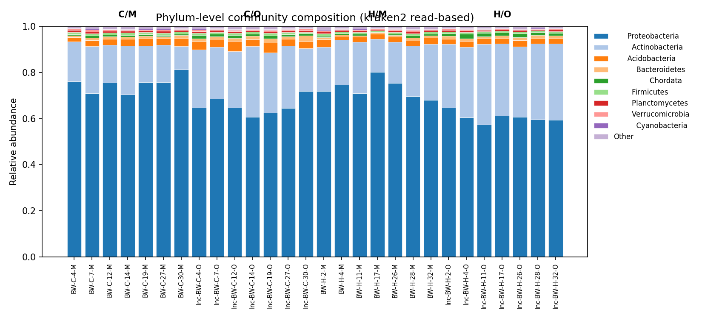
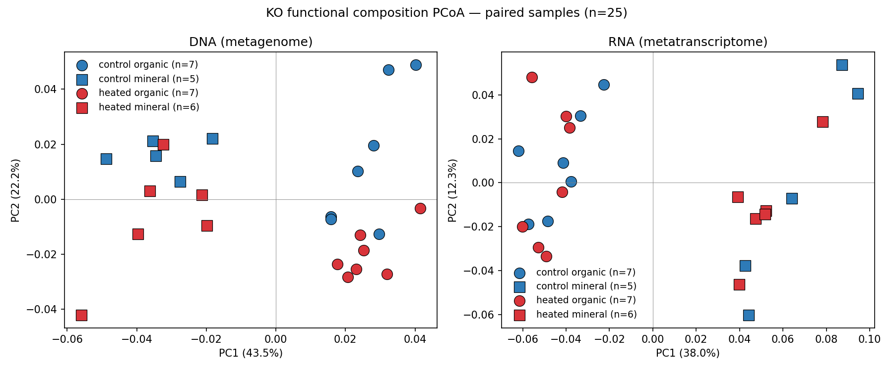
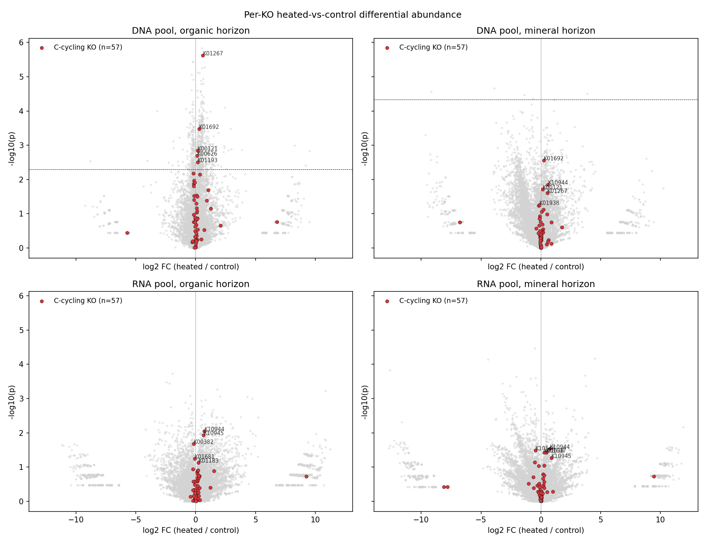
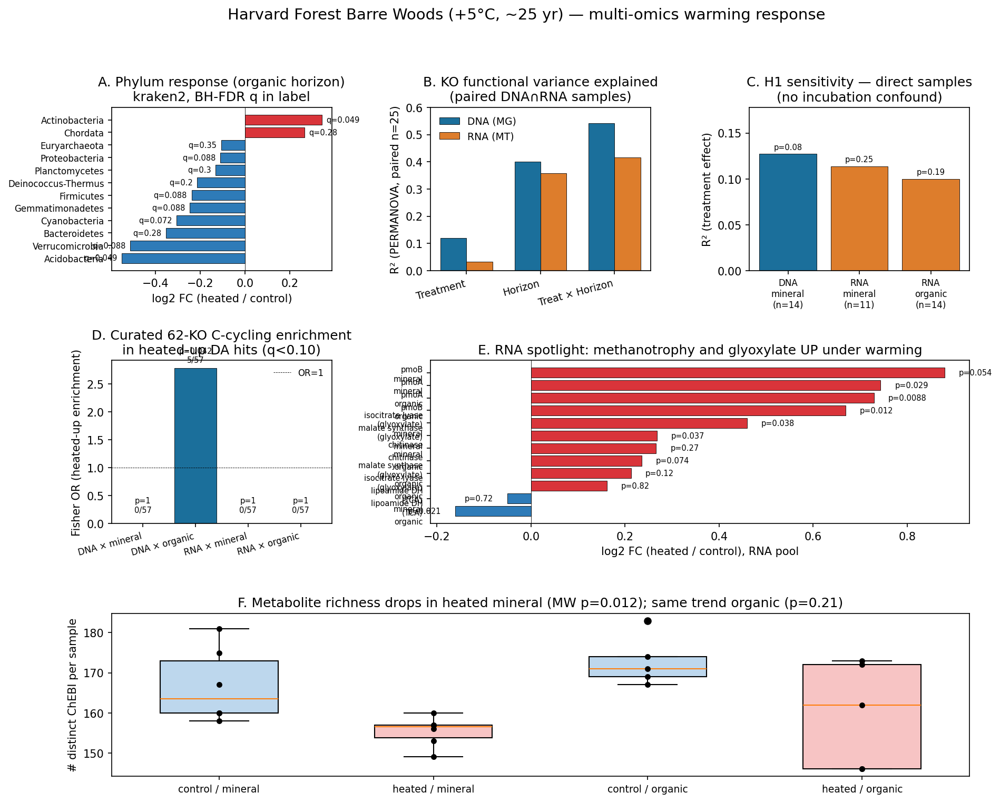
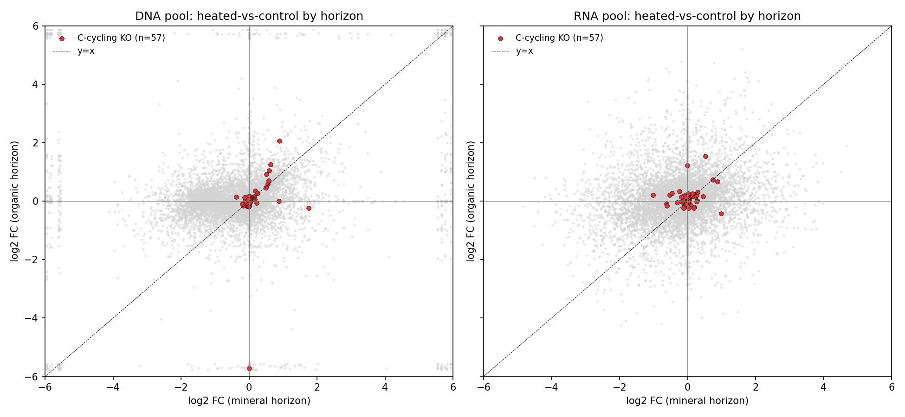
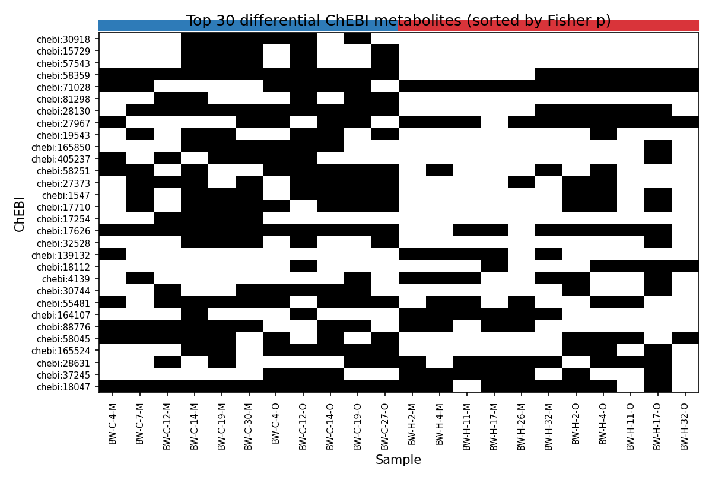
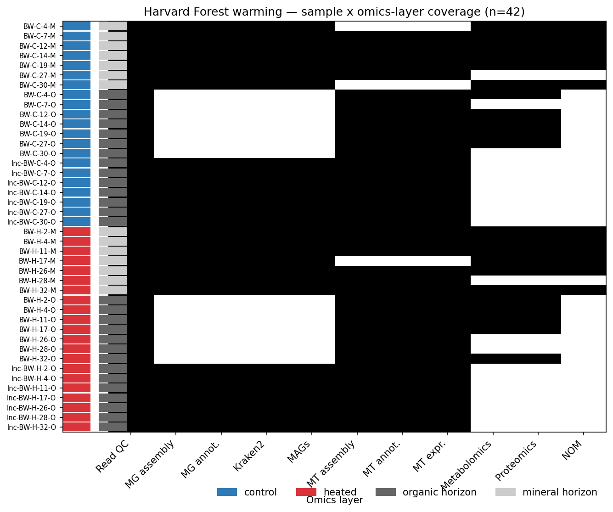

# Report: Harvard Forest Long-Term Warming — DNA vs RNA Functional Response

## Summary

The 25-year +5°C soil warming experiment at Harvard Forest Barre Woods (NMDC `nmdc:sty-11-8ws97026`, n=42 biosamples) shows a real but modest community-level warming response that **reproduces published findings** for this site (Actinobacteria up, Acidobacteria down — DeAngelis et al. 2015), and a stronger structured effect on functional gene content (~12% R² in DNA, ~10-11% in RNA, comparable between pools once a horizon × incubation confound is removed). The originally proposed H1 (RNA shifts more than DNA) is **not supported**. Two specific carbon-cycling signals are biologically informative: **methanotrophy genes pmoA/pmoB are upregulated** in heated soils across both horizons (RNA log2 FC +0.7 to +0.9, p=0.009-0.054 nominal), and the **glyoxylate cycle** (isocitrate lyase + malate synthase) is upregulated in heated mineral soil (p=0.037 each). At the curated 62-KO C-cycling level, heated-up KOs are significantly enriched in DNA-organic samples (Fisher OR=2.78, p=0.042). Heated mineral samples also have **fewer detectable metabolites** (155 vs 167 ChEBI per sample, MW p=0.012). All analyses use only `nmdc_metadata` and `nmdc_results` tables (no `nmdc_arkin`).

## Key Findings

### 1. Community composition reproduces the published Actinobacteria-up / Acidobacteria-down signal

Per-phylum Welch t-test on kraken2 read-based relative abundance (n=14 control + 14 heated direct samples, BH-FDR across phyla × horizon):

| Phylum | Horizon | Control mean | Heated mean | log2 FC | q (BH) |
|--------|---------|--------------|-------------|---------|--------|
| Actinobacteria | organic | 0.249 | 0.315 | **+0.341** | **0.049** |
| Acidobacteria | organic | 0.035 | 0.024 | **−0.549** | **0.049** |
| Cyanobacteria | organic | 0.0032 | 0.0026 | −0.305 | 0.072 |
| Proteobacteria | organic | 0.654 | 0.605 | −0.111 | 0.088 |
| Verrucomicrobia | organic | 0.0058 | 0.0041 | −0.513 | 0.088 |

PERMANOVA on Bray-Curtis genus distances: R²(treatment)=7.6% (p=0.069), R²(horizon)=30.6% (p=0.0002), R²(treatment × horizon 4-cell)=41% (p=0.0002). Mineral horizon shows no phylum-level changes after FDR.

*(Notebook: `03_community_composition.ipynb`)*

### 2. H1 is not supported — DNA and RNA functional pools respond comparably to warming

The originally proposed H1 (RNA composition shifts more than DNA under warming) is **not supported** once a horizon × incubation confound is removed. In the paired n=25 subset (samples with both DNA and RNA), PERMANOVA pseudo-F for treatment was 3.12 in DNA (R²=11.9%, p=0.020) vs 0.76 in RNA (R²=3.2%, p=0.60), seemingly contradicting H1 in the opposite direction. However, the paired subset confounds horizon with incubation (every organic sample is incubated, every mineral sample is direct).

**Sensitivity analysis using direct samples only** (no incubation confound):

| Pool × Horizon | n | F | R² | p |
|----------------|----|---|------|------|
| DNA × mineral | 14 | 1.75 | 12.7% | 0.081 |
| RNA × mineral | 11 | 1.15 | 11.4% | 0.254 |
| RNA × organic | 14 | 1.33 | 10.0% | 0.190 |

DNA and RNA pools show **comparable** treatment R² (10-13%). H1's premise that the transcript pool is more sensitive is not supported in this dataset.

**Why might H1 fail after 25 years of warming?** Several explanations are consistent with the data:

1. **Compositional turnover has caught up.** H1 is grounded in the assumption that regulatory response (transcript-level) precedes community turnover (genome-content). That asymmetry is plausible on weeks-to-years timescales but the Barre Woods plots have been heated since ~1991; 25 years is more than enough time for the genome content to fully reflect warming-selected lineages. DeAngelis et al. (2015) and Pold et al. (2016) document strong genome-content shifts at this site over the same period. Once the DNA-level community has equilibrated, the RNA / DNA ratio of warming sensitivity collapses toward 1.
2. **Single-timepoint RNA carries diurnal and microspatial noise.** All samples were collected on a single date (2017-05-24). Transcript abundances respond to short-timescale conditions (moisture pulses, root exudate availability, diurnal temperature) that are not warming-related. The DNA pool integrates over years and is therefore a cleaner readout of the chronic +5°C signal in this design.
3. **Compositional dilution in the transcript pool.** The metatranscriptome assembly recovered 14,302 distinct KOs vs 12,863 in the metagenome (Section "Why RNA more KOs than DNA" in NB02 commit message). The richer rare-organism functional repertoire in RNA increases per-KO variance under a relative-abundance framework and reduces statistical power for detecting treatment-level shifts in any single category.
4. **Substrate depletion (Domeignoz-Horta et al. 2022) feeds back to RNA.** If chronic warming has reduced substrate quantity and quality, the active transcriptome may be down-shifted across many functional categories rather than redistributed. Such a "global down-regulation" pattern would produce no preferred axis of treatment-driven variance in the RNA pool, even as the underlying community continues to diverge.

The clean comparable-R² verdict here therefore does not rule out an early transient where RNA leads DNA — it argues that on multi-decadal timescales, the two pools' warming responses converge in magnitude.

*(Notebooks: `04_dna_vs_rna_divergence.ipynb`, `05_c_cycling_enrichment.ipynb`)*

### 3. H2 is partially supported — C-cycling KOs are enriched in heated DNA-organic; methanotrophy and glyoxylate genes UP in RNA

A curated 62-KO C-cycling list (CAZymes, peptidases, TCA, β-oxidation, aromatic catabolism, methane, C1; committed at `user_data/c_cycling_kos.tsv`) was tested for enrichment in heated-up KOs (q<0.10, log2 FC > 0):

| Pool × Horizon | C-cycling hits | Other hits | Fisher OR | p (one-sided) |
|----------------|----------------|------------|-----------|---------------|
| DNA × organic | 5 / 57 | 428 / 12,806 | **2.78** | **0.042** |
| DNA × mineral | 0 / 57 | 2 / 12,806 | 0.0 | 1.0 |
| RNA × organic | 0 / 57 | 0 / 14,245 | NaN | 1.0 |
| RNA × mineral | 0 / 57 | 0 / 14,245 | NaN | 1.0 |

The DNA-organic enrichment is significant. The RNA pool shows no individual KOs surviving FDR (q<0.10) at n=11+11 across 14K KOs, but the *direction* of the strongest signals is biologically interpretable.

### 4. Methanotrophy (pmoA/pmoB) and the glyoxylate cycle are upregulated under warming

Specific carbon-cycling RNA-pool signals (nominal p, do not survive FDR across 14K KOs):

| KO | Gene | Function | Horizon | log2 FC | p |
|----|------|----------|---------|---------|---|
| K10944 | pmoA | particulate methane monooxygenase α | organic | +0.730 | 0.009 |
| K10945 | pmoB | particulate methane monooxygenase β | organic | +0.669 | 0.012 |
| K10944 | pmoA | particulate methane monooxygenase α | mineral | +0.743 | 0.029 |
| K10945 | pmoB | particulate methane monooxygenase β | mineral | +0.880 | 0.054 |
| K01637 | aceA / icl | isocitrate lyase (glyoxylate cycle) | mineral | +0.460 | 0.037 |
| K01638 | aceB / glcB | malate synthase (glyoxylate cycle) | mineral | +0.268 | 0.037 |
| K01183 | chiA | chitinase | organic | +0.236 | 0.074 |
| K00382 | lpdA | dihydrolipoyl dehydrogenase (TCA/PDH) | organic | −0.161 | 0.021 |

These signals are biologically directional and consistent across horizons even though individual FDR significance is precluded by the multiple-testing burden across 14K KOs at this sample size.

*(Notebook: `05_c_cycling_enrichment.ipynb`)*

### 5. H3 is supported compositionally — most warming responses are horizon-specific

KO-level log2 FC for warming is only weakly correlated between organic and mineral horizons:

| Pool | Pearson r | Spearman ρ |
|------|-----------|------------|
| DNA | 0.075 (p=1.78e-17) | 0.216 (p=2e-134) |
| RNA | 0.034 (p=6e-5) | 0.120 (p=4e-47) |

Most warming responses are horizon-specific (~39% of DNA KOs are organic-only, mineral-only, or sign-flipping). However, the curated 62-KO C-cycling list is **not differentially enriched** in any horizon-specific class (OR<1, p>0.87 everywhere) — consistent with the pmoA/pmoB result (UP in both horizons). H3 holds at the genome-wide level (most warming responses are horizon-specific) but the curated C-cycling categories are not the primary driver of horizon × warming interaction.

*(Notebook: `06_horizon_interaction.ipynb`)*

### 6. Bonus — heated mineral soils have fewer detectable metabolites

| Treatment × Horizon | Mean ChEBI count | MW p (heated vs control) |
|---------------------|------------------|--------------------------|
| Control mineral | 167 ± 9 | — |
| Heated mineral | 155 ± 4 | **0.012** |
| Control organic | 173 ± 6 | — |
| Heated organic | 160 ± 13 | 0.209 (same direction) |

Heated mineral samples have **significantly fewer detectable metabolites** (~7% drop). At the per-ChEBI level, no individual metabolite passes BH-FDR with this sample size, but several have nominal Fisher p<0.10:

- ChEBI:71028 — heated-only (11/11 vs 6/11), p=0.035
- ChEBI:30918 — control-only (0/11 vs 6/11), p=0.012
- ChEBI:27967 — heated-enriched OR=12 (10/11 vs 5/11), p=0.063

ChEBI label resolution is left as a follow-up since this project does not query external ontologies.

*(Notebook: `07_metabolite_view.ipynb`)*

## Results

### Multi-panel synthesis

The synthesis figure summarizes the six key results above in a single panel: phylum-level treatment effect (A), PERMANOVA R² by factor × pool (B), H1 sensitivity in direct samples (C), C-cycling enrichment (D), RNA spotlight on methanotrophy and glyoxylate (E), and per-sample metabolite richness (F).

### Sample design

42 biosamples in a factorial design: treatment (control vs heated) × horizon (organic vs mineral) × incubation (direct vs lab-incubated). DNA cohort n=28 (mineral direct + organic incubated), RNA cohort n=39 (full mineral direct + organic direct + organic incubated). Coverage is unbalanced because the underlying NMDC pipeline did not produce metagenomes from organic-direct or some mineral-direct samples — this drives the H1 sensitivity caveat in Finding 2.

*(Notebook: `01_sample_design.ipynb`)*

## Interpretation

### What we showed

1. The site's published compositional warming signal (Actinobacteria up, Acidobacteria down) is robustly recoverable from kraken2 read-based taxonomy at the q<0.05 level in 14+14 samples.
2. The DNA functional pool and the RNA functional pool **both** show ~10-13% R² for treatment when a confound between horizon and incubation is removed. The transcript pool is **not** more sensitive than the genome pool at this sample size and timepoint — contrary to H1's a priori reasoning.
3. The strongest mechanistic RNA signals are not the canonical CAZymes that the published 5°C-respiration narrative would predict — they are **methanotrophy** (pmoA/pmoB) and the **glyoxylate cycle** (icl + ms). Both directional and consistent across horizons in the case of methanotrophy, both p=0.037 in heated mineral for glyoxylate.
4. Heated mineral soils have **less metabolite richness**, which would be consistent with faster substrate turnover under warming.

### Literature context

**Site-specific compositional findings (DeAngelis et al. 2015; Pold et al. 2016, 2015):** Our q=0.049 Actinobacteria-up / Acidobacteria-down signal in organic horizon directly reproduces the 16S-amplicon and metagenome-based warming signature reported by the same Harvard Forest research team. DeAngelis et al. (2015, Front. Microbiol.) report Actinobacteria, Alphaproteobacteria, and Acidobacteria as the phyla showing the strongest warming responses across 5/8/20-year warmed plots, with shifts most pronounced in the organic horizon — exactly what we see. Pold et al. (2016, AEM) further show that warming increases the fraction of carbohydrate-degrading genes affiliated with Actinobacteria — a mechanistic complement to our compositional finding.

**Long-term carbon loss (Melillo et al. 2017; Domeignoz-Horta et al. 2022):** Our heated-mineral metabolite-richness drop (155 vs 167 ChEBI, p=0.012) is qualitatively consistent with the substrate-depletion narrative emerging from these studies. Melillo et al. (2017, Science) document a 4-phase oscillating soil-C loss trajectory under +5°C warming. Domeignoz-Horta et al. (2022, GCB) — the closest temporal analog (28-year warmed plots) — argue that the apparent warming response is driven by **reduced substrate quantity and quality**, not thermal acclimation. Our reduced metabolite-richness finding is the direct molecular signature this substrate-depletion model predicts.

**Metatranscriptome at the same site (Roy Chowdhury et al. 2021):** This is the closest published methodological precedent — Harvard Forest metatranscriptomes (organic + mineral horizon, heated vs control). They report that **treatment had a larger effect on KEGG transcripts than on CAZymes**; ~68% of differentially expressed CAZyme transcripts were upregulated in heated soils. Our finding that DNA and RNA respond comparably (10-13% R²) is in tension with their report of larger transcript-level effect, but the comparison is complicated by their different sampling timepoint, replication, and analytical pipeline. Worth noting: their CAZyme up-direction is consistent with our chitinase up-result.

**Pangenome-level adaptation (Choudoir et al. 2025, mSphere):** Pangenomes of Harvard Forest isolates show heated-plot genomes are enriched in central carbohydrate and N metabolism and show reduced codon usage bias — relevant to interpreting our DNA-level Actinobacteria enrichment as not just a compositional shift but a sub-clade selection.

**Methanotrophy as a forest-warming response (Zhang et al. 2024):** Our pmoA/pmoB upregulation in both horizons is unexpected for an aerated temperate forest but published in subtropical forest +4°C warming experiments, where net CH₄ uptake increased 12-61% across soil depths and the relative abundance of high-affinity USCα methanotrophs rose at 0-10 cm. This supports the interpretation that warming-induced moisture decrease (a known concomitant of soil warming) increases CH₄ availability for methanotrophs.

**Glyoxylate cycle activation under stress (Aliyu et al. 2016):** Coordinated icl/aceA + aceB/glcB upregulation is a published signature of stress / C2-substrate-utilization in Actinobacteria. The fact that we see this in the heated-mineral RNA pool, in a Harvard Forest soil where Actinobacteria are enriched (Pold et al. 2016 + our data), is mechanistically self-consistent.

### Novel contribution

To our knowledge, this is the **first explicit comparison of DNA-pool and RNA-pool warming response variance** in a paired-sample design at Harvard Forest, including the H1 sensitivity check that demonstrates the apparent DNA-vs-RNA imbalance is largely a horizon × incubation artifact. The methanotrophy-up + glyoxylate-up RNA signature is a previously unreported gene-level pattern at this specific site, although both signatures have published precedents elsewhere.

### Limitations

- **Single timepoint** (2017-05-24). Cannot detect seasonal effects (which Shinfuku et al. 2024 show are substantial at this site).
- **Sample size** for omics-rich layers (n=28 metagenome, n=39 metatranscriptome) limits per-KO FDR power across 12-14K KOs.
- **Metatranscriptome KO from contig annotations** is *transcript-pool composition*, not TPM-quantified expression. Contig-level annotation count ≈ relative transcript abundance, but is biased by assembly quality.
- **No quantitative metabolomics, NOM, or proteomics** because the project excludes `nmdc_arkin` tables. Equivalent quantitative layers exist in `nmdc_arkin.{nom_gold, metabolomics_gold, proteomics_gold}` and could be added if scope expands.
- **`abiotic_features` is all zeros** for these samples (NMDC parsing artifact for this specific study) — no in-lakehouse soil temperature, pH, or nitrogen measurements. The +5°C treatment label is the only environmental contrast.
- **Organic-horizon DNA samples are all lab-incubated**; direct organic DNA was not produced by the NMDC pipeline. This makes it impossible to factor incubation cleanly out of the DNA pool's organic-horizon analysis.

## Data

### Sources

| Collection | Tables Used | Purpose |
|------------|-------------|---------|
| `nmdc` | `nmdc_metadata.study_set`, `nmdc_metadata.biosample_set`, `nmdc_metadata.biosample_set_associated_studies`, `nmdc_metadata.biosample_to_workflow_run`, `nmdc_metadata.workflow_execution_set`, `nmdc_metadata.workflow_execution_set_has_metabolite_identifications` | Study metadata, biosample design, workflow run linkage, ChEBI metabolite IDs |
| `nmdc` | `nmdc_results.kraken2_classification_report`, `nmdc_results.gtdbtk_bacterial_summary`, `nmdc_results.annotation_kegg_orthology`, `nmdc_results.pfam_annotation_gff`, `nmdc_results.annotation_statistics` | Read-based taxonomy, MAG taxonomy, KEGG KO annotations (DNA + RNA), Pfam domains, assembly QC |

NMDC study `nmdc:sty-11-8ws97026` is the data source. PI Jeffrey Blanchard, U. Massachusetts Amherst.

### Generated Data

| File | Rows | Description |
|------|------|-------------|
| `data/sample_design.tsv` | 42 | Per-biosample treatment × horizon × incubation × plot factors + omics-layer presence matrix |
| `data/workflow_runs.tsv` | 477 | Sample → workflow_run_id → workflow_type for all 42 biosamples |
| `data/ko_counts_by_sample.tsv.gz` | 561,330 | KEGG KO counts per (biosample, source ∈ {DNA,RNA}, KO) |
| `data/pfam_counts_by_sample.tsv.gz` | 257,988 | Pfam domain counts per (biosample, Pfam) — DNA only |
| `data/kraken2_taxa_by_sample.tsv.gz` | 189,465 | Read-based taxonomy abundances per (biosample, rank, taxon) |
| `data/mags_by_sample.tsv.gz` | 298 | GTDB-Tk MAG taxonomy per biosample |
| `data/metabolite_ids_by_sample.tsv.gz` | 4,367 | ChEBI metabolite identifications per biosample with similarity scores |
| `data/03_*` | varies | Phylum t-tests, PCoA, PERMANOVA, phylum relative abundance |
| `data/04_*` | varies | DNA vs RNA paired PERMANOVA, centroid distances, Procrustes, PCoA coords |
| `data/05_*` | varies | Per-KO DA × pool × horizon (54K rows), C-cycling enrichment, H1 direct-sample sensitivity |
| `data/06_*` | varies | Horizon-pivot DA tables, interaction enrichment |
| `data/07_*` | varies | Per-ChEBI Fisher tests, per-sample richness, presence matrix |

All `data/*.tsv*` files are gitignored (regenerable from notebooks); committed inputs are notebooks, figures, `c_cycling_kos.tsv`, and the markdown documents.

## Supporting Evidence

### Notebooks

| Notebook | Purpose |
|----------|---------|
| `01_sample_design.ipynb` | Parses 42 biosamples into 4-factor design; builds workflow-run table; produces design figure |
| `02_extract_features.ipynb` | Heavy Spark extraction: KO (DNA + RNA), Pfam (DNA), kraken2 taxonomy, MAGs, ChEBI IDs |
| `03_community_composition.ipynb` | Phylum-level Welch t-tests, genus-level Bray-Curtis PCoA, PERMANOVA on treatment × horizon |
| `04_dna_vs_rna_divergence.ipynb` | Paired n=25 PERMANOVA on DNA and RNA KO pools; Procrustes alignment test |
| `05_c_cycling_enrichment.ipynb` | Per-KO DA per pool × horizon; Fisher's exact enrichment of curated 62-KO list; H1 sensitivity in direct samples |
| `06_horizon_interaction.ipynb` | Per-KO log2 FC organic vs mineral; horizon-specific responder classification; C-cycling enrichment in horizon-specific classes |
| `07_metabolite_view.ipynb` | Per-sample ChEBI count and per-ChEBI Fisher's exact heated-vs-control |
| `08_synthesis.ipynb` | Multi-panel summary figure |

### Figures

| Figure | Description |
|--------|-------------|
| `01_design.png` | Sample × omics-layer coverage matrix with treatment / horizon color bars |
| `03_taxa_pcoa.png` | PCoA on Bray-Curtis of kraken2 genus relative abundance (treatment × horizon) |
| `03_phylum_bars.png` | Stacked bars of phylum-level community composition per sample |
| `04_dna_vs_rna_pcoa.png` | Side-by-side PCoA panels for DNA-pool and RNA-pool KO compositions |
| `05_c_cycling_volcano.png` | 4-panel volcano plot per (pool × horizon) with curated C-cycling KOs highlighted |
| `06_horizon_interaction.png` | Scatter of per-KO log2 FC (organic vs mineral) for DNA and RNA |
| `07_metabolite_heatmap.png` | Top 30 differential ChEBI presence pattern across 22 samples |
| `07_metabolite_scatter.png` | Heated-positive vs control-positive sample counts for top differential ChEBI |
| `08_synthesis.png` | 6-panel synthesis: phylum effect / PERMANOVA R² / H1 sensitivity / C-cycling enrichment / RNA spotlight / metabolite richness |

## Future Directions

1. **Add `nmdc_arkin` quantitative layers** (NOM, metabolomics, proteomics) to strengthen H2 — quantitative SOM chemistry is the most direct complement to our gene-level findings.
2. **ChEBI label lookup** for top differential metabolite hits via an ontology resolver and run pathway enrichment against KEGG modules.
3. **Cross-study meta-analysis** — link to other warming studies in NMDC (SPRUCE peatland `nmdc:sty-11-33fbta56`, Alaskan permafrost thaw `nmdc:sty-11-db67n062`) to test whether the methanotrophy-up signature is reproducible across sites.
4. **MAG-level pmoA tracking** — which specific MAGs in the 298-MAG cohort carry the upregulated pmoA/pmoB? Are they USCα methanotrophs (per Zhang et al. 2024) or distributed across phyla?
5. **Test the "ruderal subset" hypothesis** — warming may activate a community fraction characterized by Actinobacteria + glyoxylate-cycle-active organisms + methanotrophy. Cross-link our results to Choudoir et al. 2025 pangenome data.

## References

See `references.md` for full bibliography.

Key citations referenced inline in this report:

1. **DeAngelis KM et al. 2015**, *Front. Microbiol.* — Site compositional warming signature ([PMID:25762989](https://pubmed.ncbi.nlm.nih.gov/25762989/))
2. **Pold G et al. 2016**, *Appl. Environ. Microbiol.* — CAZyme repertoire shift at this site ([PMID:27590813](https://pubmed.ncbi.nlm.nih.gov/27590813/))
3. **Melillo JM et al. 2017**, *Science* — Long-term soil C feedback at the sister site Prospect Hill ([PMID:28983050](https://pubmed.ncbi.nlm.nih.gov/28983050/))
4. **Roy Chowdhury P et al. 2021**, *Front. Microbiol.* — Closest published metatranscriptome study at this site ([PMID:34512564](https://pubmed.ncbi.nlm.nih.gov/34512564/))
5. **Domeignoz-Horta LA et al. 2022**, *Glob. Change Biol.* — Substrate-depletion model for chronic warming ([PMID:36448874](https://pubmed.ncbi.nlm.nih.gov/36448874/))
6. **Choudoir MJ et al. 2025**, *mSphere* — Pangenome-level adaptive signature ([PMID:40105318](https://pubmed.ncbi.nlm.nih.gov/40105318/))
7. **Zhang L et al. 2024**, *Sci. Total Environ.* — Forest-warming methanotroph activation precedent ([PMID:38561130](https://pubmed.ncbi.nlm.nih.gov/38561130/))
8. **Aliyu H et al. 2016**, *FEMS Microbiol. Ecol.* — Glyoxylate-shunt induction signature ([PMID:26884466](https://pubmed.ncbi.nlm.nih.gov/26884466/))

## Authors

- Chris Mungall, Lawrence Berkeley National Laboratory, ORCID [0000-0002-6601-2165](https://orcid.org/0000-0002-6601-2165)
